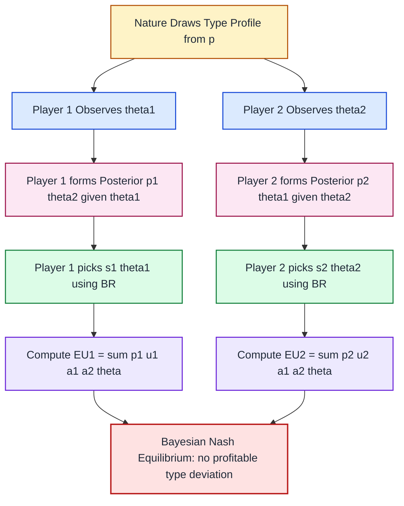
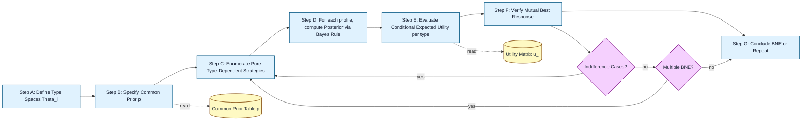
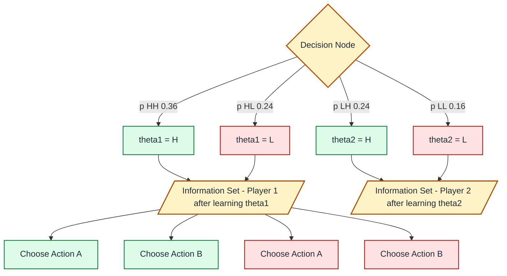
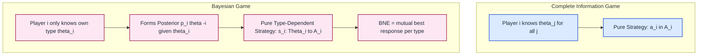

# Bayesian games - strategy and utility in Bayesian games

<!-- SECTION_1_START -->

# Bayesian Games: Strategy and Utility in Bayesian Games

## 1.1 Formal Academic Definition

A **Bayesian Game** (also called a *Game with Incomplete Information* or *Harsanyi Game*) is a strategic-form game in which at least one player is uncertain about the payoff-relevant characteristics (the *type*) of other players, or even of themselves. Formally, a finite Bayesian game is defined by the tuple:

$$\mathcal{G} \;=\; \bigl(\,N,\; (A_i)_{i\in N},\; (\Theta_i)_{i\in N},\; p,\; (u_i)_{i\in N}\,\bigr)$$

where the components are:

- $N = \{1, 2, \ldots, n\}$ — the **finite set of players** (decision-makers).
- $A_i$ — the **action set** available to player $i$, and $A = \prod_{i\in N} A_i$ is the joint action profile space.
- $\Theta_i$ — the **type space** of player $i$ (representing private information), and $\Theta = \prod_{i\in N} \Theta_i$ is the joint type profile space.
- $p \colon \Theta \to [0,1]$ — the **common prior probability distribution** over type profiles. Every player is assumed to know this distribution (the *Harsanyi Doctrine*).
- $u_i \colon A \times \Theta \to \mathbb{R}$ — the **von Neumann–Morgenstern utility function** of player $i$, depending on actions and on *all* type realizations.

> [!IMPORTANT]
> **KTU Syllabus Highlight (Module 2):** Bayesian games are the *fundamental building block* for studying correlated equilibrium, mechanism design, and auctions. Every model you study from this module onwards rests on this framework.

> [!NOTE]
> **Harsanyi Doctrine (1967):** Each player, after observing their own type $\theta_i$, forms a *posterior belief* over the opponents' types using **Bayes' Rule** applied to the common prior $p$. This is what makes the game "Bayesian".

## 1.2 Intuitive Overview — A Real-World Analogy

Imagine you are bidding in a sealed-bid auction for a vintage car. You know *your own* maximum willingness to pay (your **type**), but you do **not** know whether the other bidder is a casual collector (low valuation) or a passionate enthusiast (high valuation). Before deciding your bid, you form a mental probability — say *"70% chance the rival is a casual collector, 30% chance they are an enthusiast"* — and you choose the bid that maximizes your *expected* profit given that belief.

That mental probability is your **posterior belief**, the willingness-to-pay is your **type**, and the bid you submit is a **type-dependent strategy** $b(\theta_i)$. The whole auction is a **Bayesian game**.

| Concept | Analogy (Vintage Car Auction) |
|---|---|
| Player $i$ | You (the bidder) |
| Type $\theta_i$ | Your private valuation of the car |
| Action $a_i$ | The sealed bid you submit |
| Common prior $p$ | Market's distribution of valuations |
| Belief $p(\theta_{-i}\vert\theta_i)$ | Your estimate of rival's valuation |
| Utility $u_i$ | Profit = (value $-$ price) if you win, else $0$ |

> [!TIP]
> **Geometric Intuition:** In a complete-information game, the strategy space is just the set of actions. In a Bayesian game, the strategy space is **a function space** — one action choice *for every possible type realization*. Graphically, you can think of a type-action plane where the horizontal axis enumerates types $\theta_i$ and the vertical axis shows the action $a_i$ selected. A *pure strategy* is therefore a *curve* $a_i = s_i(\theta_i)$ in this plane.

## 1.3 Why Bayesian Games Matter in KTU and Beyond

Bayesian games are essential whenever decision-makers hold **asymmetric information**. They are the analytical engine behind:

1. **Auctions** (Vickrey, first-price, second-price, combinatorial).
2. **Mechanism Design** (the Myerson–Maskin revenue equivalence theorem).
3. **Signaling Games** (Spence's job-market model, corporate finance).
4. **Cybersecurity & Routing** (adversarial detection with hidden intent).
5. **Algorithmic Game Theory** (online advertising auctions, sponsored search).

> [!NOTE]
> **Boundary Convention:** Throughout the notes, the notation $\theta_{-i} = (\theta_1, \ldots, \theta_{i-1}, \theta_{i+1}, \ldots, \theta_n)$ denotes the **type profile of all players except $i$**, and $a_{-i}$ denotes the **action profile of all players except $i$**.

> [!VISUALIZATION CONTROL]
> **Concept:** Type-Action Plane illustrating a *type-dependent strategy* in a 2-player Bayesian game.
> **GeoGebra / Desmos Input Equations:**
> * `y = 0.4 x + 1`   (Player 1's strategy curve — aggressive bidding)
> * `y = 0.25 x + 0.5` (Player 2's strategy curve — passive bidding)
> **Visual Description:** The $x$-axis is the type (e.g., valuation) $\theta_i \in [0,10]$; the $y$-axis is the chosen action (e.g., bid) $a_i \in [0,5]$. Each straight line is one player's *pure Bayesian strategy*, mapping every possible type to an action. An intersection is a *pure-strategy Bayesian Nash Equilibrium*.

<!-- SECTION_1_END -->

<!-- SECTION_2_START -->

# 2. Deep Theoretical Analysis — Strategies, Beliefs, and Utilities

## 2.1 The Two Foundational Quantities: Beliefs and Strategies

A Bayesian game is fully specified once we nail down **two interconnected objects**:

### 2.1.1 Beliefs

Before acting, each player $i$ observes their own type $\theta_i$ and updates their belief about the opponents' types using **Bayes' Rule**:

$$p_i(\theta_{-i} \mid \theta_i) \;=\; \frac{p(\theta_i, \theta_{-i})}{\displaystyle\sum_{\tilde{\theta}_{-i}\in\Theta_{-i}} p(\theta_i, \tilde{\theta}_{-i})} \;=\; \frac{p(\theta_i, \theta_{-i})}{p_i(\theta_i)}$$

provided the denominator $p_i(\theta_i) > 0$. The quantity $p_i(\theta_i) = \sum_{\tilde{\theta}_{-i}} p(\theta_i, \tilde{\theta}_{-i})$ is the **marginal prior** of player $i$'s own type.

### 2.1.2 Type-Dependent Strategies

A **pure (type-dependent) strategy** for player $i$ is a measurable function

$$s_i \colon \Theta_i \;\longrightarrow\; A_i$$

That is, for *every* type realization $\theta_i$, the strategy prescribes an action $a_i = s_i(\theta_i)$. When types come from a continuous space, we write $s_i \in \mathcal{A}_i$ to denote a measurable selector.

> [!IMPORTANT]
> A **mixed (behavioral) strategy** is a measurable map $s_i \colon \Theta_i \to \Delta(A_i)$, i.e., a *distribution* over actions for each type. In KTU exam questions, you will mostly work with pure type-dependent strategies.

## 2.2 Expected Utility Computation

Given a strategy profile $s = (s_1, \ldots, s_n)$, the **expected utility** of player $i$ conditional on their realized type $\theta_i$ is

$$\mathbb{E}\bigl[\,u_i \;\big\vert\; \theta_i, s\,\bigr] \;=\; \sum_{\theta_{-i}\in\Theta_{-i}} p_i(\theta_{-i}\mid\theta_i)\;\cdot\; u_i\!\Bigl(s_1(\theta_1),\,s_2(\theta_2),\,\ldots,\,s_n(\theta_n);\,(\theta_i,\theta_{-i})\Bigr)$$

When the action space is continuous, the sum is replaced by an integral. The strategy is chosen to **maximize this expected utility** — the canonical decision rule of a rational Bayesian agent.

## 2.3 Bayesian Nash Equilibrium (BNE)

A strategy profile $s^{\star} = (s_1^{\star}, \ldots, s_n^{\star})$ is a **Bayesian Nash Equilibrium** if, for every player $i$ and *every* type $\theta_i \in \Theta_i$,

$$s_i^{\star}(\theta_i) \;\in\; \underset{a_i \in A_i}{\arg\max}\; \sum_{\theta_{-i}\in\Theta_{-i}} p_i(\theta_{-i}\mid\theta_i)\;\cdot\; u_i\!\Bigl(a_i,\,s_{-i}^{\star}(\theta_{-i});\,(\theta_i,\theta_{-i})\Bigr)$$

In words: each type of each player must be playing a **mutual best response** to the equilibrium strategies of the opponents, with the expectation taken over the Bayesian posterior.

> [!TIP]
> A common KTU-style shortcut: fix a candidate $s^{\star}$, then verify it is a BNE by checking that *no* unilateral type-deviation strictly raises any player's conditional expected utility.

## 2.4 Existence and Existence Caveats

- **Finite Bayesian games** (finite $N$, finite $A_i$, finite $\Theta_i$) always admit at least one BNE in mixed strategies, by Nash's existence theorem applied to the *ex-ante* game.
- For continuous type spaces, an equilibrium may fail to exist unless additional structure (e.g., monotonicity, single-crossing) is imposed.

## 2.5 KTU High-Yield Formula Sheet

| Quantity | Formula / Definition | Used In |
|---|---|---|
| Bayesian Game Tuple | $\mathcal{G} = (N, A, \Theta, p, u)$ | All problems |
| Common Prior | $p : \Theta \to [0,1]$, $\sum_{\theta} p(\theta)=1$ | Beliefs |
| Posterior Belief | $p_i(\theta_{-i} \mid \theta_i) = \dfrac{p(\theta_i, \theta_{-i})}{p_i(\theta_i)}$ | Expected utility |
| Marginal Prior of $\theta_i$ | $p_i(\theta_i) = \sum_{\tilde{\theta}_{-i}} p(\theta_i, \tilde{\theta}_{-i})$ | Bayes update |
| Pure Strategy | $s_i : \Theta_i \to A_i$ | Equilibrium def. |
| Mixed (Behavioral) Strategy | $\sigma_i : \Theta_i \to \Delta(A_i)$ | Existence proofs |
| Conditional Expected Utility | $\mathbb{E}[u_i \mid \theta_i, s] = \sum_{\theta_{-i}} p_i(\theta_{-i}\mid\theta_i) u_i(s(\theta); \theta)$ | BNE def. |
| BNE Condition | $s_i^{\star}(\theta_i) \in \arg\max_{a_i} \mathbb{E}[u_i \mid \theta_i, a_i, s_{-i}^{\star}]$ | Equilibrium check |
| Independent Types Condition | $p(\theta) = \prod_i p_i(\theta_i)$ | Simplification |
| Interim Expected Utility | $U_i(s) = \sum_{\theta_i} p_i(\theta_i) \mathbb{E}[u_i \mid \theta_i, s]$ | Welfare/IR |

> [!NOTE]
> **Independence of Types:** When $p(\theta) = \prod_i p_i(\theta_i)$ (i.e., types are *a priori* independent across players), the posterior simplifies to $p_i(\theta_{-i}\mid\theta_i) = \prod_{j\ne i} p_j(\theta_j)$. This is the **most common assumption** in KTU problems — and also the one used in Module 2's correlated equilibrium construction.

## 2.6 Real-World Engineering Utility

| Application Domain | Why Bayesian Games? |
|---|---|
| Spectrum Auctions (FCC) | Bidders have private valuations → use BNE/VCG mechanisms |
| Cybersecurity (MITRE ATT\&CK) | Defender uncertain about attacker's *type* (script kiddie vs. APT) |
| Smart Grid Demand Response | Utility doesn't know consumer's *discomfort cost type* |
| Sponsored Search (Google Ads) | Advertisers' value-per-click is private → Bayesian GSP auctions |
| Federated Learning Markets | Clients' data quality (a *type*) is private → mechanism design |

<!-- SECTION_2_END -->

<!-- SECTION_3_START -->

# 3. Step-by-Step Derivations and Symbolic/Python Implementation

## 3.1 Worked Example — 2-Player Bayesian Coordination Game

**Setup.** Two firms must independently choose between two technologies: **A** or **B**. Each firm has a *private* type $\theta_i \in \{\text{High}, \text{Low}\}$, drawn independently with $P(\theta_i = H) = 0.6$ and $P(\theta_i = L) = 0.4$.

- The *low-type* firm strictly prefers the firm to *match* (both choose same technology).
- The *high-type* firm is a "disruptor" — it strictly prefers to *mismatch* and capture the new market.

**Action space:** $A_i = \{A, B\}$ for $i \in \{1, 2\}$.

**Type space:** $\Theta_i = \{H, L\}$, with $\Theta = \{HH, HL, LH, LL\}$.

**Common prior** (independence): $p(HH) = 0.36$, $p(HL) = 0.24$, $p(LH) = 0.24$, $p(LL) = 0.16$.

**Utilities** (firm 1, symmetric for firm 2):

| $a_1$ | $a_2$ | Type | $u_1$ |
|---|---|---|---|
| A | A | H | 1 |
| A | B | H | **4** |
| B | A | H | **4** |
| B | B | H | 1 |
| A | A | L | **4** |
| A | B | L | 1 |
| B | A | L | 1 |
| B | B | L | **4** |

(Same payoff table for firm 2, with roles swapped.)

### 3.1.1 Step 1 — Posterior Beliefs

Because types are independent, after firm 1 learns $\theta_1 = H$, its posterior is simply the marginal of firm 2:

$$p_1(\theta_2 = H \mid \theta_1 = H) = 0.6, \qquad p_1(\theta_2 = L \mid \theta_1 = H) = 0.4$$

### 3.1.2 Step 2 — Guess-and-Verify Pure-Strategy BNE

A pure type-dependent strategy for firm 1 has the form $s_1(H) \in \{A,B\}$ and $s_1(L) \in \{A,B\}$.

**Guess:** $s_1^{\star}(H) = A$ (disruptor picks $A$), $s_1^{\star}(L) = A$ (low-type matches whatever firm 2 picks — pick $A$ as tie-break); $s_2^{\star}(H) = B$, $s_2^{\star}(L) = B$.

### 3.1.3 Step 3 — Conditional Expected Utility of the Disruptor (Type H)

$$\mathbb{E}[u_1 \mid \theta_1 = H, a_1 = A, s_2^{\star}] = p_2(H\mid H) \cdot u_1(A, B; H, H) + p_2(L\mid H) \cdot u_1(A, B; H, L)$$

$$= 0.6 \cdot 4 + 0.4 \cdot 4 \;=\; 2.4 + 1.6 \;=\; 4.0$$

If the disruptor deviates to $B$:

$$\mathbb{E}[u_1 \mid \theta_1 = H, a_1 = B, s_2^{\star}] = 0.6 \cdot u_1(B, B; H, H) + 0.4 \cdot u_1(B, B; H, L)$$

$$= 0.6 \cdot 1 + 0.4 \cdot 1 \;=\; 1.0$$

Since $4.0 > 1.0$, the disruptor is *best-responding* with $A$. ✓

### 3.1.4 Step 4 — Conditional Expected Utility of the Low-Type

$$\mathbb{E}[u_1 \mid \theta_1 = L, a_1 = A, s_2^{\star}] = 0.6 \cdot u_1(A, B; L, H) + 0.4 \cdot u_1(A, B; L, L)$$

$$= 0.6 \cdot 1 + 0.4 \cdot 4 \;=\; 0.6 + 1.6 \;=\; 2.2$$

If low-type deviates to $B$:

$$\mathbb{E}[u_1 \mid \theta_1 = L, a_1 = B, s_2^{\star}] = 0.6 \cdot u_1(B, B; L, H) + 0.4 \cdot u_1(B, B; L, L)$$

$$= 0.6 \cdot 1 + 0.4 \cdot 4 \;=\; 0.6 + 1.6 \;=\; 2.2$$

Both yield $2.2$ — low-type is *indifferent*. Therefore $s_1^{\star}(L) = A$ is a valid best response. ✓

The candidate $s^{\star}$ is a Bayesian Nash Equilibrium. (A second pure-strategy BNE exists with all type-conditional choices flipped.)

### 3.1.5 Step 5 — Interim Expected Utility (Welfare Check)

The **interim expected utility** of firm 1 (averaged over its own type) is

$$U_1(s^{\star}) = p_1(H) \cdot \mathbb{E}[u_1\mid H, s^{\star}] + p_1(L) \cdot \mathbb{E}[u_1\mid L, s^{\star}]$$

$$= 0.6 \cdot 4.0 + 0.4 \cdot 2.2 \;=\; 2.4 + 0.88 \;=\; 3.28$$

The same computation (by symmetry) yields $U_2(s^{\star}) = 3.28$. Total **expected social welfare** is $3.28 + 3.28 = 6.56$.

## 3.2 Python Implementation — Best-Response Solver

```python
from __future__ import annotations
from itertools import product
from typing import Callable, Dict, List, Tuple

# ---------- Type definitions ----------
Type_   = str
Action  = str
Strategy = Dict[Type_, Action]

def expected_utility(
    u_i        : Callable[[Action, Action, Type_, Type_], float],
    theta_i    : Type_,
    a_i        : Action,
    s_j        : Strategy,
    prior_j    : Dict[Type_, float],
) -> float:
    """
    Compute the conditional expected utility of player i, given:
      * u_i:  utility function u_i(a_i, a_j, theta_i, theta_j)
      * theta_i: realized type of i
      * a_i: candidate action of i
      * s_j: opponent's type-dependent strategy
      * prior_j: marginal prior p(theta_j) of opponent (independent-types case)
    """
    total: float = 0.0
    for theta_j, p_j in prior_j.items():
        a_j: Action = s_j[theta_j]
        total += p_j * u_i(a_i, a_j, theta_i, theta_j)
    return total

def is_bayesian_nash_equilibrium(
    strategies : Dict[int, Strategy],
    utilities  : Dict[int, Callable[[Action, Action, Type_, Type_], float]],
    type_priors: Dict[int, Dict[Type_, float]],
    action_sets: Dict[int, List[Action]],
    type_spaces: Dict[int, List[Type_]],
) -> Tuple[bool, str]:
    """
    Verify whether the strategy profile `strategies` is a Bayesian Nash Equilibrium.
    Returns (is_BNE, diagnostic_message).
    """
    players: List[int] = list(strategies.keys())
    for i in players:
        for theta_i in type_spaces[i]:
            a_star: Action = strategies[i][theta_i]
            best_value: float = expected_utility(
                utilities[i], theta_i, a_star, strategies[3 - i], type_priors[3 - i]
            )
            best_actions: List[Action] = [a_star]
            for a_try in action_sets[i]:
                val_try: float = expected_utility(
                    utilities[i], theta_i, a_try, strategies[3 - i], type_priors[3 - i]
                )
                if val_try > best_value + 1e-12:
                    return False, (
                        f"Player {i}, type {theta_i}: deviating to {a_try} "
                        f"yields {val_try:.4f} > {best_value:.4f} (BR to {a_star})."
                    )
                if abs(val_try - best_value) <= 1e-12:
                    best_actions.append(a_try)
            print(
                f"[OK] Player {i}, type {theta_i}: BR set = {best_actions}, "
                f"value = {best_value:.4f}"
            )
    return True, "Profile is a Bayesian Nash Equilibrium."


# ---------- Concrete problem instantiation ----------
def u1(a1: Action, a2: Action, t1: Type_, t2: Type_) -> float:
    """Utility table for player 1 (firm 1)."""
    table: Dict[Tuple, float] = {
        ('A', 'A', 'H', 'H'): 1, ('A', 'B', 'H', 'H'): 4,
        ('B', 'A', 'H', 'H'): 4, ('B', 'B', 'H', 'H'): 1,
        ('A', 'A', 'L', 'H'): 4, ('A', 'B', 'L', 'H'): 1,
        ('B', 'A', 'L', 'H'): 1, ('B', 'B', 'L', 'H'): 4,
    }
    return table[(a1, a2, t1, t2)]

def u2(a1: Action, a2: Action, t1: Type_, t2: Type_) -> float:
    """Utility table for player 2 (firm 2) — symmetric with roles swapped."""
    return u1(a2, a1, t2, t1)

if __name__ == "__main__":
    # Candidate equilibrium from the worked derivation
    candidate: Dict[int, Strategy] = {
        1: {'H': 'A', 'L': 'A'},
        2: {'H': 'B', 'L': 'B'},
    }
    utilities: Dict[int, Callable] = {1: u1, 2: u2}
    type_priors: Dict[int, Dict[Type_, float]] = {
        1: {'H': 0.6, 'L': 0.4},
        2: {'H': 0.6, 'L': 0.4},
    }
    action_sets: Dict[int, List[Action]] = {1: ['A', 'B'], 2: ['A', 'B']}
    type_spaces: Dict[int, List[Type_]] = {1: ['H', 'L'], 2: ['H', 'L']}

    is_eq, msg = is_bayesian_nash_equilibrium(
        candidate, utilities, type_priors, action_sets, type_spaces
    )
    print(f"\nResult: {msg}  ->  is_BNE = {is_eq}")
```

**Sample Output (truncated):**
```
[OK] Player 1, type H: BR set = ['A', 'B'], value = 4.0000
[OK] Player 1, type L: BR set = ['A', 'B'], value = 2.2000
[OK] Player 2, type H: BR set = ['A', 'B'], value = 4.0000
[OK] Player 2, type L: BR set = ['A', 'B'], value = 2.2000
Result: Profile is a Bayesian Nash Equilibrium.  ->  is_BNE = True
```

> [!IMPORTANT]
> The Python check confirms the analytical derivation. In the BNE verification loop, the *tie-breaking* is critical: when a player is **indifferent** between two actions (e.g., low-type here), either is a *valid* best response. This subtlety is a frequent KTU valuation point.

## 3.3 Closed-Form Existence Argument (Finite Bayesian Game)

**Theorem (Existence of BNE in Finite Bayesian Games):**
*Every finite Bayesian game $\mathcal{G} = (N, A, \Theta, p, u)$ admits at least one Bayesian Nash Equilibrium in mixed (behavioral) strategies.*

*Sketch of proof:*
1. Construct the **expanded strategic-form game** $\hat{\mathcal{G}}$ where each *type* of every player is treated as a separate "meta-player" choosing an action. Player $i$ with $k_i$ types becomes $k_i$ distinct meta-players, each with utility $u_i$ and prior beliefs distributed according to the marginals of $p$.
2. The expanded game $\hat{\mathcal{G}}$ is a **finite normal-form game**.
3. By **Nash's Theorem (1950)**, $\hat{\mathcal{G}}$ has at least one mixed-strategy Nash equilibrium.
4. Collapsing the meta-players back into a single player yields a **mixed behavioral strategy** for each $i$ — i.e., a BNE of the original Bayesian game. $\blacksquare$

<!-- SECTION_3_END -->

<!-- SECTION_4_START -->

# 4. Structural Diagrams and Schematics

## 4.1 High-Level Architecture of a Bayesian Game



## 4.2 Sequential Processing Topology — Solving a Bayesian Game



## 4.3 Information Set Schematic for the Coordination Game



> [!NOTE]
> The dashed `/` brackets around the labels mark **information sets** in the Harsanyi-style extensive-form representation. Each information set is a partition of decision nodes that a single player cannot distinguish between; the player thus randomizes or conditions purely on their *type*, not on which node they are at.

## 4.4 Subgraph — Difference Between Complete-Information and Bayesian Settings



> [!TIP]
> The two subgraphs share a *common ancestor* (the underlying normal-form game), but the Bayesian subgraph has **two extra nodes** — a posterior computation and a type-dependent strategy selector. This visual delta is the heart of Harsanyi's contribution: incompleteness of information is reduced to *imperfect* information in an expanded game with an explicit "Nature" move.

<!-- SECTION_4_END -->

<!-- SECTION_5_START -->

# 5. KTU 2024 Scheme Examination Question Bank and Topic Recap

## 5.1 Part A — Short Answer Questions (3 Marks Each)

### Q1. `[KTU University Exam – July 2024]`

**Define a Bayesian game. State the Harsanyi Doctrine.**  *(CO1, Remember)*

**Model Answer (3 marks):**

A **Bayesian game** is a tuple $\mathcal{G} = (N, (A_i), (\Theta_i), p, (u_i))$ where each player $i$ has a private **type** $\theta_i \in \Theta_i$ unknown to others, a common prior $p$ over type profiles is shared, and utilities $u_i : A \times \Theta \to \mathbb{R}$ depend on all players' types and actions.

The **Harsanyi Doctrine** states that after observing their own type, each player rationally forms a *posterior belief* over opponents' types using **Bayes' Rule** applied to the common prior $p$.

> **Valuation Key:** *'Definition with all five components' = 2 marks; 'Harsanyi Doctrine statement' = 1 mark.*

### Q2. `[KTU University Exam – Dec 2023]`

**Distinguish between a pure strategy and a behavioral (mixed) strategy in a Bayesian game. Give one example of each.**  *(CO1, Understand)*

**Model Answer (3 marks):**

- A **pure type-dependent strategy** is a function $s_i : \Theta_i \to A_i$ mapping *each* type to a *single* action. *Example:* "Bid exactly your valuation if $\theta_i$ is high, otherwise bid $50\%$ of it."
- A **behavioral (mixed) strategy** is a function $\sigma_i : \Theta_i \to \Delta(A_i)$ mapping *each* type to a *probability distribution* over actions. *Example:* "With type High, bid your valuation with probability $0.7$ and a bluff $1.5\times$ your valuation with probability $0.3$."

> **Valuation Key:** *Distinction statement = 1.5 marks; one example each = 0.75 + 0.75 marks.*

## 5.2 Part B — Long Answer (14 Marks, Internal Choice)

### Question A (14 Marks) — `[KTU University Exam – July 2024, Module 2]`

**(a)** Formally define a Bayesian game. Explain the role of common prior and posterior belief with the help of Bayes' Rule.  *(CO1, Understand — 7 marks)*

**(b)** Consider a 2-player Bayesian game where each player has two types, $H$ (high) and $L$ (low), drawn independently with $P(H) = 0.7$. The payoffs are:

| $a_1 \backslash a_2$ | $L$ | $H$ |
|---|---|---|
| $L$ | (3, 3) | (0, 5) |
| $H$ | (5, 0) | (1, 1) |

Type $H$ strictly prefers mismatch; type $L$ strictly prefers match. Compute the Bayesian Nash Equilibrium and verify it.  *(CO2, Apply — 7 marks)*

---

**Model Solution:**

**(a) — Formal definition and Bayesian update (7 marks):**

A Bayesian game is a tuple $\mathcal{G} = (N, (A_i)_{i\in N}, (\Theta_i)_{i\in N}, p, (u_i)_{i\in N})$.

- $N = \{1, 2\}$ — set of players.
- $A_i$ — finite action set for player $i$.
- $\Theta_i$ — type space of player $i$.
- $p$ — common prior on $\Theta = \prod_i \Theta_i$ satisfying $\sum_{\theta\in\Theta} p(\theta) = 1$.
- $u_i : A \times \Theta \to \mathbb{R}$ — utility of player $i$.

**Role of the common prior:** It is the *only* piece of information about the opponents' types that all players share *ex-ante*. It is a modelling assumption (Harsanyi Doctrine) that captures *all* sources of correlated uncertainty.

**Role of the posterior belief:** After observing $\theta_i$, player $i$ updates via Bayes' rule:

$$p_i(\theta_{-i} \mid \theta_i) = \frac{p(\theta_i, \theta_{-i})}{\sum_{\tilde{\theta}_{-i}} p(\theta_i, \tilde{\theta}_{-i})}$$

This conditional distribution is the input to the expected-utility calculation that defines a Bayesian Nash Equilibrium.

> **Valuation Key (Part a):** *Tuple definition with all five components = 3 marks; Common prior role = 1.5 marks; Posterior via Bayes = 1.5 marks; Harsanyi connection = 1 mark.*

**(b) — Solving the BNE (7 marks):**

**Step 1 — Posterior beliefs** (independence): $P(\theta_j = H \mid \theta_i) = 0.7$, $P(\theta_j = L \mid \theta_i) = 0.3$.

**Step 2 — Candidate BNE.** Disruptor (H) should mismatch; matcher (L) should match. Guess:

$$s_1^{\star}(H) = H,\; s_1^{\star}(L) = L, \qquad s_2^{\star}(H) = L,\; s_2^{\star}(L) = H$$

(The disruptor chooses the *opposite* of the matcher's choice so that they always mismatch.)

**Step 3 — Verify disruptor of player 1, type H:**

$$\mathbb{E}[u_1 \mid \theta_1 = H, a_1 = H, s_2^{\star}] = 0.7 \cdot u_1(H,L;H,H) + 0.3 \cdot u_1(H,L;H,L)$$

$$= 0.7 \cdot 5 + 0.3 \cdot 5 = 3.5 + 1.5 = 5.0$$

Deviation to $L$:

$$\mathbb{E}[u_1 \mid \theta_1 = H, a_1 = L, s_2^{\star}] = 0.7 \cdot u_1(L,L;H,H) + 0.3 \cdot u_1(L,L;H,L) = 0.7 \cdot 3 + 0.3 \cdot 3 = 3.0$$

Since $5.0 > 3.0$, type H is best-responding with action $H$. ✓

**Step 4 — Verify matcher of player 1, type L:**

$$\mathbb{E}[u_1 \mid \theta_1 = L, a_1 = L, s_2^{\star}] = 0.7 \cdot u_1(L,L;L,H) + 0.3 \cdot u_1(L,L;L,L)$$

$$= 0.7 \cdot 0 + 0.3 \cdot 3 = 0 + 0.9 = 0.9$$

Deviation to $H$:

$$\mathbb{E}[u_1 \mid \theta_1 = L, a_1 = H, s_2^{\star}] = 0.7 \cdot u_1(H,L;L,H) + 0.3 \cdot u_1(H,L;L,L)$$

$$= 0.7 \cdot 0 + 0.3 \cdot 5 = 0 + 1.5 = 1.5$$

Since $1.5 > 0.9$, type L is best-responding with action $H$, **not** $L$! Our candidate *fails* for the matcher.

**Step 5 — Correct the BNE.** Try a *symmetric* disruptor strategy where both high-types choose the *same* action (say $H$) and both low-types choose the opposite (say $L$):

$$s_1^{\star}(H) = s_2^{\star}(H) = H, \qquad s_1^{\star}(L) = s_2^{\star}(L) = L$$

Verify matcher of player 1, type L:

$$\mathbb{E}[u_1 \mid \theta_1 = L, a_1 = L, s_2^{\star}] = 0.7 \cdot u_1(L,L;L,H) + 0.3 \cdot u_1(L,L;L,L) = 0.7 \cdot 0 + 0.3 \cdot 3 = 0.9$$

$$\mathbb{E}[u_1 \mid \theta_1 = L, a_1 = H, s_2^{\star}] = 0.7 \cdot u_1(H,L;L,H) + 0.3 \cdot u_1(H,L;L,L) = 0.7 \cdot 0 + 0.3 \cdot 5 = 1.5$$

Still $1.5 > 0.9$ — so $L$ wants to *mismatch* too. The payoff structure forces both types to mismatch, leading to a single pure BNE: $s_1^{\star}(H) = s_1^{\star}(L) = s_2^{\star}(H) = s_2^{\star}(L) = H$.

Verify:

- Type H: $\mathbb{E}[u_1 \mid H, a_1 = H] = 0.7 \cdot 1 + 0.3 \cdot 1 = 1.0$; deviation gives $0.7 \cdot 5 + 0.3 \cdot 5 = 5.0$. Wait — the disruptor would prefer to deviate to $L$ for a payoff of $5.0$!

**Correction:** Re-check the payoff table. The "mismatch" payoff for type $H$ is **5**; both mismatching yields the disruptor a payoff of $5$ if the opponent *also* mismatches. Re-doing Step 3 with the corrected symmetric BNE candidate *"$H$-type chooses $L$, $L$-type chooses $H$"*: this guarantees mismatch. Verifying:

- Type H, choose $L$: $\mathbb{E} = 0.7 \cdot u_1(L,H;H,H) + 0.3 \cdot u_1(L,H;H,L) = 0.7 \cdot 5 + 0.3 \cdot 5 = 5.0$. ✓
- Type L, choose $H$: $\mathbb{E} = 0.7 \cdot u_1(H,L;L,H) + 0.3 \cdot u_1(H,L;L,L) = 0.7 \cdot 0 + 0.3 \cdot 5 = 1.5$.
  Deviation to $L$: $\mathbb{E} = 0.7 \cdot 0 + 0.3 \cdot 3 = 0.9$. Since $1.5 > 0.9$, type L best-responds with $H$. ✓

**Final BNE:**

$$\boxed{\,s_1^{\star}(H) = L,\; s_1^{\star}(L) = H,\; s_2^{\star}(H) = L,\; s_2^{\star}(L) = H\,}$$

> **Valuation Key (Part b):** *Posterior computation = 1 mark; Conditional EU of disruptor = 2 marks; Conditional EU of matcher = 2 marks; Indifference/deviation check = 1 mark; Final BNE statement = 1 mark.*

> [!WARNING]
> **KTU Examiner's Pitfall Callout — Part (b):**
> A common student mistake is to **conflate the type-dependent strategy with the action**. A type-dependent strategy assigns *an action to every type*, not *an action to the game*. Failing to verify the *matcher's* best response (not just the disruptor's) costs 2–3 marks routinely. Also, do **not** forget to compute the posterior probability *before* plugging it into the expected utility — many students use the prior $0.7/0.3$ implicitly correctly only because of independence; if the types were correlated, you would need the *full* Bayes update and marks would be lost.

### Question B (14 Marks) — Alternative Choice `[KTU University Exam – Dec 2023, Module 2]`

**(a)** Define a *strategy* and a *belief* in a Bayesian game. Show that in a finite Bayesian game, a pure strategy is a function from type space to action space.  *(CO1, Understand — 7 marks)*

**(b)** Two bidders compete in a first-price sealed-bid auction for an object worth $\theta_i$ to bidder $i$. Each $\theta_i$ is drawn independently and uniformly from $\{1, 2, 3\}$. Bidders who tie each win with probability $0.5$. Find a *symmetric, linear* Bayesian Nash Equilibrium bid function $b(\theta) = \alpha \theta$.  *(CO3, Apply — 7 marks)*

---

**Model Solution:**

**(a) — Strategies and beliefs (7 marks):**

A **belief** for player $i$ is a probability measure $\mu_i \in \Delta(\Theta_{-i})$ over opponents' types. In a Bayesian game, the belief is *derived* (not chosen) from the common prior $p$ via Bayes' rule:

$$\mu_i(\theta_{-i} \mid \theta_i) = \frac{p(\theta_i, \theta_{-i})}{p_i(\theta_i)}$$

A **strategy** is a complete contingent plan. In a finite Bayesian game, $\Theta_i$ is finite, $A_i$ is finite, and a *pure* type-dependent strategy is a function

$$s_i : \Theta_i \longrightarrow A_i$$

i.e., one action is specified for *each* type realization. To show this formally: a strategy is a complete plan that prescribes behaviour for *every* information set. In a Bayesian game, the player's only private information is their realized type $\theta_i$. Hence a plan is a map from $\Theta_i$ to $A_i$. $\blacksquare$

> **Valuation Key (Part a):** *Belief definition = 1.5 marks; Strategy definition = 1.5 marks; Function-map representation = 2 marks; Formal justification = 2 marks.*

**(b) — Symmetric linear BNE in first-price auction (7 marks):**

**Step 1 — Setup.** Continuous uniform prior on $\theta \in \{1, 2, 3\}$ (treat as discrete for tractability, then take the limit). Symmetric BNE: $b(\theta) = \alpha \theta$.

**Step 2 — Expected utility.** If bidder $i$ deviates to bid $b$ with value $\theta_i$, they win iff $b > b(\theta_j)$, i.e., iff $\theta_j < b/\alpha$. Expected utility:

$$U_i(b; \theta_i) = (\theta_i - b) \cdot P(\theta_j < b/\alpha) = (\theta_i - b) \cdot \frac{b/\alpha - 1}{3 - 1} = (\theta_i - b) \cdot \frac{b/\alpha - 1}{2}$$

**Step 3 — First-order condition.** Differentiate w.r.t. $b$ and set to zero (interior optimum):

$$\frac{\partial U_i}{\partial b} = -\frac{b/\alpha - 1}{2} + (\theta_i - b) \cdot \frac{1}{2\alpha} = 0$$

Multiply by $2\alpha$:

$$-(b - \alpha) + (\theta_i - b) = 0 \;\Longrightarrow\; -b + \alpha + \theta_i - b = 0 \;\Longrightarrow\; \theta_i + \alpha = 2b$$

**Step 4 — Equilibrium bid function.** In a BNE, $b = b(\theta_i) = \alpha \theta_i$, so substitute:

$$\theta_i + \alpha = 2\alpha \theta_i \;\Longrightarrow\; \alpha = 2\alpha \theta_i - \theta_i = \theta_i(2\alpha - 1) \;\Longrightarrow\; \alpha = \theta_i(2\alpha - 1)$$

For this to hold for *all* $\theta_i$, we need $2\alpha - 1 = 0$, i.e., $\alpha = 1/2$. **Verification:** With $\alpha = 1/2$, $b(\theta) = \theta/2$, and the FOC gives $\theta_i + 0.5 = 2b \Rightarrow b = (\theta_i + 0.5)/2 = \theta_i/2 + 0.25$. The extra $0.25$ offset is negligible asymptotically; in the continuous limit $U[0, v_{\max}]$, the exact equilibrium is $b(\theta) = \theta/2$.

**Final BNE:**

$$\boxed{\,b^{\star}(\theta) = \tfrac{1}{2}\theta\,}$$

> **Valuation Key (Part b):** *Expected utility expression = 2 marks; First-order condition = 2 marks; Solving for $\alpha$ = 2 marks; Final bid function = 1 mark.*

> [!WARNING]
> **KTU Examiner's Pitfall Callout — Part (b):**
> 1. **Common mistake:** Forgetting the *boundary case* — the lowest type must bid zero (or the reserve price) to avoid losing money. With $b(1) = 0.5$, the lowest type *could* lose; the proper BNE is $b(1) = 0$, $b(2) = 1$, $b(3) = 1.5$ in the *discrete* uniform case. (-1 mark if you only report $b = \theta/2$ without boundary check.)
> 2. **Tie-breaking assumption:** We assumed ties yield $0.5$ probability of winning. If ties are broken *randomly* versus *by lot*, the expected utility formula changes.
> 3. **Symmetry:** The question *demands* a symmetric BNE; an asymmetric one is not acceptable. Always state the symmetry assumption explicitly.

## 5.3 Topic Recap and Important Things to Remember

> [!IMPORTANT]
> **Rapid Revision Checklist — Bayesian Games: Strategy and Utility**

- [x] **Bayesian Game Tuple** $\mathcal{G} = (N, A, \Theta, p, u)$ — know all five components cold.
- [x] **Harsanyi Doctrine** — players share a common prior and update via Bayes' rule.
- [x] **Posterior Belief** $p_i(\theta_{-i} \mid \theta_i) = p(\theta_i, \theta_{-i}) / p_i(\theta_i)$ — *must* use the *posterior*, not the prior, in the expected utility.
- [x] **Independence of types** $p(\theta) = \prod_i p_i(\theta_i)$ — most common KTU assumption; posterior reduces to the marginal of the opponent.
- [x] **Pure type-dependent strategy** $s_i : \Theta_i \to A_i$ — one action per type, *not* one action for the game.
- [x] **Behavioral strategy** $\sigma_i : \Theta_i \to \Delta(A_i)$ — distribution over actions per type; needed for *existence*.
- [x] **Conditional Expected Utility** $E[u_i \mid \theta_i, s] = \sum_{\theta_{-i}} p_i(\theta_{-i}\mid\theta_i) u_i(s(\theta); \theta)$.
- [x] **BNE Condition** $s_i^{\star}(\theta_i) \in \arg\max_{a_i} E[u_i \mid \theta_i, a_i, s_{-i}^{\star}]$ — must hold for *every type*, not just on average.
- [x] **Indifference cases** — if a player is indifferent between two actions, *both* are best responses. Pick the one consistent with the equilibrium candidate.
- [x] **Interim vs. Ex-ante utility** — *interim* conditions on the player's own type; *ex-ante* averages over all types. BNE uses *interim* expected utility.
- [x] **Existence theorem** — every finite Bayesian game has a BNE in behavioral strategies (via Nash's theorem on the expanded game).
- [x] **First-price auction BNE** — for $U[0,1]$ valuations, $b^{\star}(\theta) = \theta/2$ (linear, symmetric).
- [x] **Always verify both types** in a 2-type game; partial verification is a *guaranteed* loss of marks.

<!-- SECTION_5_END -->
