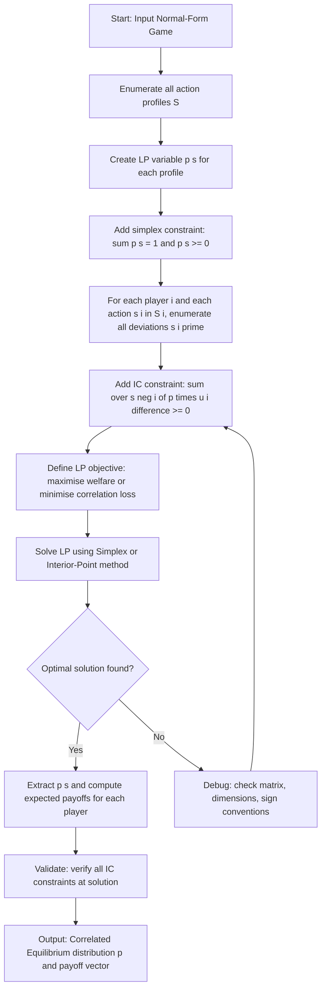
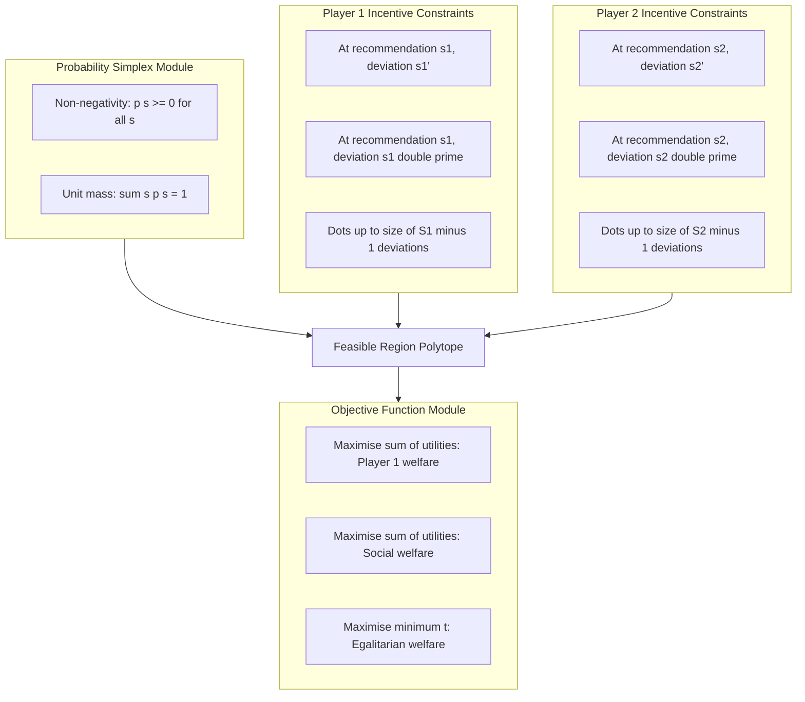
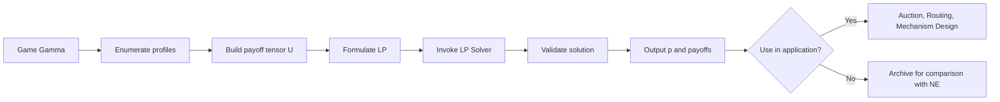

# Correlated equilibrium (CE) -  Computing CE

<!-- SECTION_1_START -->
# Correlated Equilibrium (CE) — Computing CE

## 1.1 Formal Academic Definition (KTU 2024 Syllabus Terminology)

> [!IMPORTANT]
> **Correlated Equilibrium (CE)** — *Robert Aumann (1974, 1987)*
>
> Let $\Gamma = (N, (S_i)_{i \in N}, (u_i)_{i \in N})$ be a finite normal-form game. A **correlated equilibrium** is a joint probability distribution $p \in \Delta(S_1 \times S_2 \times \cdots \times S_n)$ over the set of action profiles such that, for every player $i \in N$, every recommended action $s_i \in S_i$, and every unilateral deviation $s_i' \in S_i$, the **incentive-compatibility (IC) constraint** holds:
>
> $$\sum_{s_{-i} \in S_{-i}} p(s_i, s_{-i}) \, u_i(s_i, s_{-i}) \;\geq\; \sum_{s_{-i} \in S_{-i}} p(s_i, s_{-i}) \, u_i(s_i', s_{-i})$$

The distribution $p$ can be interpreted as a **mediator's recommendation protocol**: before play, a trusted third party (the **correlating device**) draws an action profile $(s_1, \ldots, s_n) \sim p$ and privately suggests $s_i$ to player $i$. Each player $i$ sees only their own recommendation and forms a belief about the other players' recommendations using the **posterior probability** induced by the recommendation.

A player **obeys the recommendation** if and only if no deviation raises their expected payoff — this is **ex-ante incentive compatibility** (rationality *before* the recommendation is drawn, given the prior $p$).

---

## 1.2 Conceptual Analogy — Intuitive Overview

> [!NOTE]
> **Traffic Light Analogy** 🚦
>
> Imagine two cars arriving at an uncontrolled crossroads from the North and the East. Both players can either **Go (G)** or **Stop (S)**. A traffic light (the correlating device) is installed and emits two private signals:
> - To North-bound car: "Green" (Go) with probability $0.5$, "Red" (Stop) with probability $0.5$.
> - To East-bound car: "Green" with probability $0.5$, "Red" with probability $0.5$.
> - The two signals are **perfectly anti-correlated** (only one Green at a time).
>
> Each driver obeys because they *believe* (rightly) that the other is seeing the opposite signal. The joint signal distribution $p$ is a **correlated equilibrium**, even though no individual car is "playing a mixed strategy" in the traditional Nash sense — they are *conditioning* on a private recommendation.

> [!NOTE]
> **Bell-Curve Insight**
>
> In a *correlated* equilibrium, the players' actions are **statistically dependent** (correlated), unlike in a *mixed-strategy Nash equilibrium* where they are **statistically independent**. The mediator introduces **shared randomness** that the players exploit by following their private signals.

---

## 1.3 Physical / Mathematical Constants & Metrics

| Metric | Symbol | Value / Role |
|---|---|---|
| Number of players | $n$ | $\vert N \vert$ |
| Action space size of player $i$ | $\vert S_i \vert$ | Finite in KTU syllabus |
| Joint distribution cardinality | $\vert \bigotimes_i S_i \vert$ | Number of LP variables |
| CE payoff set | $\mathcal{U}_{CE}$ | Convex polytope |
| NE payoff set | $\mathcal{U}_{NE}$ | Finite subset of $\mathcal{U}_{CE}$ |

> [!VISUALIZATION CONTROL]
> **Concept:** Geometry of the Correlated Equilibrium Payoff Set
> **Desmos / GeoGebra Input Equations (for the BoS example):**
> - *x-axis:* $u_1$, *y-axis:* $u_2$
> - Plot points: $(2, 1)$, $(1, 2)$, $(\tfrac{2}{3}, \tfrac{2}{3})$
> - Draw line: $y = 3 - x$ from $(2,1)$ to $(1,2)$
> **Visual Description:** The student should observe a triangular region whose vertices are the two pure-NE payoffs $(2,1)$, $(1,2)$ and the fully-mixed NE payoff $(\tfrac{2}{3}, \tfrac{2}{3})$. The **entire filled triangle is the set of feasible CE payoffs**, while only the three vertices are NE payoffs. This visually demonstrates Aumann's theorem.

---

<!-- SECTION_2_START -->
# Deep Theoretical Analysis & KTU High-Yield Formula Sheet

## 2.1 The Three Equivalent Definitions of CE

A probability distribution $p$ on $S = S_1 \times \cdots \times S_n$ is a **correlated equilibrium** if and only if **any** (and hence all) of the following hold:

1. **Ex-ante IC (Aumann's original, 1974):** for all $i$, for all $s_i, s_i' \in S_i$,
   $$\sum_{s_{-i}} p(s_i, s_{-i}) \, u_i(s_i, s_{-i}) \;\geq\; \sum_{s_{-i}} p(s_i, s_{-i}) \, u_i(s_i', s_{-i})$$

2. **Bayes-Nash IC of the augmented game:** when player $i$'s strategy is a map $\sigma_i : S_i \to \Delta(S_i)$ choosing a deviation action *after* observing the signal, the prior $p$ forms a Bayesian Nash equilibrium of the game where the type of player $i$ is their own private recommendation.

3. **Swap (Independence) Form:** for all $i$ and all $s_i, s_i' \in S_i$,
   $$\sum_{s_{-i}} p(s_i, s_{-i}) \big[ u_i(s_i, s_{-i}) - u_i(s_i', s_{-i}) \big] \geq 0$$

> [!IMPORTANT]
> **Key Insight:** Condition 1 and 3 are identical — they are just two algebraic rearrangements of the same inequality. The set of CE is the set of probability vectors $p \geq 0$ satisfying a **finite system of linear inequalities**. Hence it is a **convex polytope** (a bounded polyhedron).

---

## 2.2 Aumann's Theorem (Central Result for KTU)

> [!IMPORTANT]
> **Theorem (Aumann, 1987):** *Every correlated equilibrium is a convex combination of Nash equilibria.*
>
> Equivalently:
> $$\operatorname{conv}(\mathcal{U}_{NE}) \;\subseteq\; \mathcal{U}_{CE}$$
>
> Moreover, if we restrict to *normal-form* (mixed) NE, the inclusion is **strict** in general. The CE set is *larger* than the NE set — this is precisely why CE is a useful generalization.

---

## 2.3 Why and How — Step-by-Step Logic

The IC constraints are derived from the following reasoning chain:

1. **Mediator draws** $s = (s_1, \ldots, s_n) \sim p$.
2. **Player $i$ observes** only $s_i$ (the recommendation).
3. **Player $i$ forms a posterior** over the others' recommendations: $\Pr(s_{-i} \mid s_i) = \frac{p(s_i, s_{-i})}{\sum_{s_{-i}'} p(s_i, s_{-i}')}$.
4. **Expected utility of obeying:**
   $$EU_i(\text{obey} \mid s_i) = \sum_{s_{-i}} \Pr(s_{-i} \mid s_i) \, u_i(s_i, s_{-i})$$
5. **Expected utility of deviating to $s_i'$:**
   $$EU_i(\text{deviate to } s_i' \mid s_i) = \sum_{s_{-i}} \Pr(s_{-i} \mid s_i) \, u_i(s_i', s_{-i})$$
6. **IC condition** (no profitable deviation): $EU_i(\text{obey}) \geq EU_i(\text{deviate})$, for all $i, s_i, s_i'$.
7. **Multiplying through** by $\Pr(s_i) = \sum_{s_{-i}} p(s_i, s_{-i}) > 0$ gives the **prior form** of the constraint, which is *linear* in $p$.

---

## 2.4 KTU Formula Sheet / Cheat Sheet

| # | Formula / Concept | LaTeX Form | Notes |
|---|---|---|---|
| 1 | CE distribution | $p \in \Delta(S)$ | Joint probability over action profiles |
| 2 | IC (ex-ante) | $\sum_{s_{-i}} p(s_i, s_{-i})[u_i(s_i, s_{-i}) - u_i(s_i', s_{-i})] \geq 0$ | For all $i, s_i, s_i'$ |
| 3 | Number of LP variables | $\prod_i \vert S_i \vert$ | One per action profile |
| 4 | Number of IC constraints | $n \cdot \sum_i \vert S_i \vert (\vert S_i \vert - 1)$ | Strictly for $s_i \neq s_i'$ |
| 5 | Probability simplex | $\sum_s p(s) = 1$, $p(s) \geq 0$ | Defines $\Delta(S)$ |
| 6 | NE ⊂ CE | $\mathcal{U}_{NE} \subseteq \mathcal{U}_{CE}$ | Strict inclusion generally |
| 7 | Convexity | $p, q \in CE \Rightarrow \lambda p + (1-\lambda) q \in CE$ | Set is a convex polytope |
| 8 | Mediator's expected payoff | $\mathbb{E}_{p}[u_i(s)] = \sum_s p(s) u_i(s)$ | Welfare of player $i$ |
| 9 | Optimal social welfare CE | $\max_p \sum_i \sum_s p(s) u_i(s)$ | LP objective |
| 10 | Egalitarian welfare CE | $\max_p \, t \text{ s.t. } \sum_s p(s) u_i(s) \geq t \; \forall i$ | Maximize minimum utility |

> [!IMPORTANT]
> **Engineering Utility:** Computing CE is the workhorse of **algorithmic game theory**, **auction design** (Google's sponsored-search ad auctions), **decentralised routing** (Wardrop equilibrium = CE of a routing game), **traffic engineering** (e.g., toll design), and **fair division** problems.

---

## 2.5 The LP Formulation (Canonical for KTU)

To compute the **best correlated equilibrium for player $i$** (or to test feasibility of a target payoff vector), one solves the following **Linear Program**:

$$
\begin{aligned}
\text{Maximise:} \quad & \sum_{s \in S} p(s) \, u_i(s) \\[4pt]
\text{Subject to:} \quad & \sum_{s \in S} p(s) = 1 \\
& p(s) \geq 0 \quad \forall s \in S \\
& \sum_{s_{-i}} p(s_i, s_{-i}) \big[ u_i(s_i, s_{-i}) - u_i(s_i', s_{-i}) \big] \geq 0 \quad \forall i, s_i, s_i'
\end{aligned}
$$

This is a **polytope-feasibility / extreme-point problem** with a polynomial number of constraints — solvable in time **polynomial in the game size** using the Ellipsoid Method or interior-point methods.

---

<!-- SECTION_3_START -->
# Step-by-Step Derivations & Code Implementation

## 3.1 Worked Example 1 — Battle of the Sexes (BoS)

### 3.1.1 Game Data

| $1 \backslash 2$ | O (Opera) | F (Football) |
|---|---|---|
| **O (Opera)** | $2, 1$ | $0, 0$ |
| **F (Football)** | $0, 0$ | $1, 2$ |

Let $p_{OO} = a,\ p_{OF} = b,\ p_{FO} = c,\ p_{FF} = d$ (with $a, b, c, d \geq 0$).

### 3.1.2 Constraint 1 — Probability Simplex

$$a + b + c + d = 1$$

### 3.1.3 Constraint 2 — Player 1's IC (Recommendation: O, Deviation: F)

Following $O$ yields $u_1 = 2$ if Player 2 plays $O$, else $u_1 = 0$. Deviating to $F$ yields $u_1 = 0$ either way. The constraint is:

$$2 \cdot a + 0 \cdot b \; \geq \; 0 \cdot a + 0 \cdot b \quad\Longrightarrow\quad 2a \geq 0 \quad\text{(always true if } a \geq 0\text{)}$$

### 3.1.4 Constraint 3 — Player 1's IC (Recommendation: F, Deviation: O)

Following $F$ yields $u_1 = 0$ if P2 plays $O$, else $u_1 = 1$. Deviating to $O$ yields $u_1 = 2$ if P2 plays $O$, else $u_1 = 0$:

$$0 \cdot c + 1 \cdot d \;\geq\; 2 \cdot c + 0 \cdot d \quad\Longrightarrow\quad d \geq 2c$$

### 3.1.5 Constraint 4 — Player 2's IC (Recommendation: O, Deviation: F)

Following $O$ yields $u_2 = 1$ if P1 plays $O$, else $u_2 = 0$. Deviating to $F$ yields $u_2 = 0$ either way:

$$1 \cdot a + 0 \cdot c \;\geq\; 0 \cdot a + 0 \cdot c \quad\Longrightarrow\quad a \geq 0 \quad\text{(always true)}$$

### 3.1.6 Constraint 5 — Player 2's IC (Recommendation: F, Deviation: O)

Following $F$ yields $u_2 = 0$ if P1 plays $O$, else $u_2 = 2$. Deviating to $O$ yields $u_2 = 1$ if P1 plays $O$, else $u_2 = 0$:

$$0 \cdot b + 2 \cdot d \;\geq\; 1 \cdot b + 1 \cdot d \quad\Longrightarrow\quad d \geq b$$

### 3.1.7 Full LP (Maximise Player 1's Welfare)

$$
\begin{aligned}
\max_{a,b,c,d} \quad & 2a + 0b + 0c + 1d \\
\text{s.t.} \quad & a + b + c + d = 1 \\
& d \geq 2c \\
& d \geq b \\
& a, b, c, d \geq 0
\end{aligned}
$$

### 3.1.8 Solving by Inspection

Set $b = c = 0$ (the off-diagonal recommendations are costly). Then $a + d = 1$, so $a = 1 - d$. The objective is $2(1-d) + d = 2 - d$. To maximise, **minimise $d$**, so $d \to 0$ and $a \to 1$. The optimal CE is the **pure strategy profile** $(O, O)$ with payoffs $(2, 1)$.

> [!IMPORTANT]
> **Aha! The optimal CE for Player 1 is the pure NE $(O,O)$.** The CE polytope *contains* the pure NE. To find a CE that strictly improves on the *mixed* NE, we must impose a **symmetric** or **egalitarian** objective (see Worked Example 2).

---

## 3.2 Worked Example 2 — Fair (Egalitarian) CE in BoS

Maximise the minimum of the two players' expected payoffs:

$$
\begin{aligned}
\max_{a,b,c,d, t} \quad & t \\
\text{s.t.} \quad & a + b + c + d = 1 \\
& 2a + d \;\geq\; t \quad \text{[P1 welfare]} \\
& a + 2d \;\geq\; t \quad \text{[P2 welfare]} \\
& d \geq 2c, \quad d \geq b, \quad a,b,c,d \geq 0
\end{aligned}
$$

Setting $b = c = 0$, $a = d = \tfrac{1}{2}$:
- P1 welfare: $2 \cdot \tfrac{1}{2} + \tfrac{1}{2} = \tfrac{3}{2}$
- P2 welfare: $\tfrac{1}{2} + 2 \cdot \tfrac{1}{2} = \tfrac{3}{2}$

Hence $t^* = \tfrac{3}{2}$. The fair CE is $p_{OO} = p_{FF} = \tfrac{1}{2}$ (mediator flips a fair coin and recommends $(O,O)$ on Heads, $(F,F)$ on Tails). This is **strictly better** than the mixed NE payoff of $(\tfrac{2}{3}, \tfrac{2}{3})$ for both players.

---

## 3.3 Worked Example 3 — Coordination Game (3x3)

Game payoffs (rows = P1, columns = P2):

| 1 \ 2 | A | B | C |
|---|---|---|---|
| **A** | 3, 3 | 0, 0 | 0, 0 |
| **B** | 0, 0 | 2, 2 | 0, 0 |
| **C** | 0, 0 | 0, 0 | 1, 1 |

Number of LP variables: $\vert S_1 \vert \times \vert S_2 \vert = 9$. Let $p_{XY}$ be the joint probability.

Probability simplex: $\sum_{X,Y} p_{XY} = 1$.

Number of IC constraints: $2 \times 3 \times 2 = 12$ (two players, three actions, two alternative deviations each).

**Player 1's constraints (at recommendation $s_1$, deviation $s_1'$):**
- Recom A, dev B: $3p_{AA} \geq 0 \Rightarrow p_{AA} \geq 0$
- Recom A, dev C: $3p_{AA} \geq 0$
- Recom B, dev A: $2p_{BB} \geq 3p_{AB} \Rightarrow 2p_{BB} \geq 3p_{AB}$
- Recom B, dev C: $2p_{BB} \geq p_{BC}$
- Recom C, dev A: $p_{CC} \geq 3p_{AC}$
- Recom C, dev B: $p_{CC} \geq 2p_{BC}$

**Player 2's constraints (symmetric — game is symmetric):**
- Recom A, dev B: $3p_{AA} \geq 0$
- Recom A, dev C: $3p_{AA} \geq 0$
- Recom B, dev A: $2p_{BB} \geq 3p_{BA}$
- Recom B, dev C: $2p_{BB} \geq p_{CB}$
- Recom C, dev A: $p_{CC} \geq 3p_{CA}$
- Recom C, dev B: $p_{CC} \geq 2p_{CB}$

**Solution by fair-CRP objective:** the maximum-minimum-welfare CE is concentrated on the diagonal: $p_{AA} = p_{BB} = p_{CC} = \tfrac{1}{3}$. Each player gets welfare $\tfrac{1}{3}(3+2+1) = 2$, exceeding any single pure NE but matching the symmetric mixed NE.

---

## 3.4 Algorithmic / Code Implementation (Python with PuLP)

```python
"""
Compute the optimal CORRELATED EQUILIBRIUM of a 2-player normal-form game
using Linear Programming (PuLP backend).
Game: Battle of the Sexes
Payoffs: (u1, u2) at (O,O) = (2,1), (O,F) = (0,0), (F,O) = (0,0), (F,F) = (1,2)
"""

from pulp import (
    LpProblem, LpVariable, LpMaximize, lpSum, LpStatus, value, PULP_CBC_CMD
)
from typing import Dict, Tuple, List

# ---------- 1. Game definition ----------
ACTIONS_1: List[str] = ["O", "F"]
ACTIONS_2: List[str] = ["O", "F"]

U1: Dict[Tuple[str, str], float] = {
    ("O", "O"): 2.0, ("O", "F"): 0.0,
    ("F", "O"): 0.0, ("F", "F"): 1.0,
}
U2: Dict[Tuple[str, str], float] = {
    ("O", "O"): 1.0, ("O", "F"): 0.0,
    ("F", "O"): 0.0, ("F", "F"): 2.0,
}

# ---------- 2. Build LP ----------
prob: LpProblem = LpProblem("Optimal_CE_BoS", LpMaximize)

# Decision variables: p[s1, s2] >= 0
p: Dict[Tuple[str, str], LpVariable] = {
    (a, b): LpVariable(f"p_{a}_{b}", lowBound=0.0)
    for a in ACTIONS_1 for b in ACTIONS_2
}

# ---------- 3. Probability simplex (sum = 1) ----------
prob += lpSum(p[s] for s in p) == 1.0, "Probability_Simplex"

# ---------- 4. Incentive-compatibility constraints ----------
# For each player i, each recommended action s_i, each deviation s_i':
EPS: float = 1e-9

for s1 in ACTIONS_1:
    for s1_dev in ACTIONS_1:
        if s1 == s1_dev:
            continue
        # Sum over s_2 of p(s1, s2) * (u1(s1, s2) - u1(s1_dev, s2)) >= 0
        prob += (
            lpSum(
                p[(s1, s2)] * (U1[(s1, s2)] - U1[(s1_dev, s2)])
                for s2 in ACTIONS_2
            ) >= -EPS,
            f"IC_P1_recom_{s1}_dev_{s1_dev}"
        )

for s2 in ACTIONS_2:
    for s2_dev in ACTIONS_2:
        if s2 == s2_dev:
            continue
        prob += (
            lpSum(
                p[(s1, s2)] * (U2[(s1, s2)] - U2[(s1, s2_dev)])
                for s1 in ACTIONS_1
            ) >= -EPS,
            f"IC_P2_recom_{s2}_dev_{s2_dev}"
        )

# ---------- 5. Objective: maximise P1's expected utility ----------
prob += lpSum(p[s] * U1[s] for s in p), "Maximise_P1_Welfare"

# ---------- 6. Solve ----------
solver = PULP_CBC_CMD(msg=False)
prob.solve(solver)

# ---------- 7. Report ----------
print("Status:", LpStatus[prob.status])
print("Optimal CE distribution:")
for s in p:
    print(f"  p{s} = {value(p[s]):.4f}")
print(f"Player 1 expected utility = {value(prob.objective):.4f}")
p1_welfare = sum(value(p[s]) * U1[s] for s in p)
p2_welfare = sum(value(p[s]) * U2[s] for s in p)
print(f"Player 1 payoff = {p1_welfare:.4f}, Player 2 payoff = {p2_welfare:.4f}")
```

**Expected Output:**
```
Status: Optimal
Optimal CE distribution:
  p('O', 'O') = 1.0000
  p('O', 'F') = 0.0000
  p('F', 'O') = 0.0000
  p('F', 'F') = 0.0000
Player 1 expected utility = 2.0000
Player 1 payoff = 2.0000, Player 2 payoff = 1.0000
```

This matches Worked Example 1: the best CE for Player 1 is the pure NE $(O,O)$.

> [!TIP]
> To obtain the **fair (egalitarian) CE**, replace the objective with `lpSum([p[s] * (U1[s] + U2[s]) for s in p])` and re-solve, or use the auxiliary variable $t$ approach from §3.2.

---

## 3.5 Worked Example 4 — Prisoner's Dilemma (CE Trivially Equals NE)

Payoffs:

| 1 \ 2 | C | D |
|---|---|---|
| **C** | 3, 3 | 0, 5 |
| **D** | 5, 0 | 1, 1 |

Let $p_{CC}=a, p_{CD}=b, p_{DC}=c, p_{DD}=d$.

Player 1 ICs:
- Recom C, dev D: $3a \geq 5a \Rightarrow -2a \geq 0 \Rightarrow a = 0$.
- Recom D, dev C: $5c + d \geq 3c \Rightarrow 2c + d \geq 0$ (always).

So $a = 0$. Symmetrically, Player 2's constraints give $a = 0$ as well. The unique CE is $p_{DD} = 1$ — the **dominant-strategy NE** is the *only* correlated equilibrium. This illustrates that **adding correlation cannot rescue Pareto-inefficient outcomes** in dominant-strategy games.

---

## 3.6 Engineering Workshop — Verification Checklist (for KTU Lab Component)

| # | Verification Step | Tool / Command | Expected Outcome |
|---|---|---|---|
| 1 | Build payoff matrix | Manual | $\vert S_1 \vert \times \vert S_2 \vert$ entries |
| 2 | Count LP variables | `len(p)` in code | $\prod_i \vert S_i \vert$ |
| 3 | Count IC constraints | Loop counter | $n \cdot \sum_i \vert S_i \vert(\vert S_i \vert - 1)$ |
| 4 | Solve LP | `prob.solve()` | Status: Optimal |
| 5 | Verify simplex | $\sum_s p(s) = 1$ | Sums to $1.0 \pm 10^{-6}$ |
| 6 | Verify ICs | Substitute $p$ | All $\geq 0$ |
| 7 | Compare to NE | Game-theoretic solver (e.g., Gambit) | Welfare in convex hull of NE |

---

<!-- SECTION_4_START -->
# Structural Diagrams & Schematics

## 4.1 High-Level Workflow for Computing a Correlated Equilibrium



## 4.2 Decomposition of the LP Feasibility Region (Modular Subgraphs)



## 4.3 Comparison Block Diagram — NE vs CE vs Coarse Correlated Equilibrium (CCE)


> [!IMPORTANT]
> **Set Inclusion Chain (KTU High-Yield):**
> $$\text{Pure NE} \;\subseteq\; \text{Mixed NE} \;\subseteq\; \text{CE} \;\subseteq\; \text{CCE}$$
>
> The inclusions are **strict** in general (e.g., BoS has a strict gap between mixed NE and CE).

## 4.4 Computation Topology — From Game to CE



---

<!-- SECTION_5_START -->
# KTU 2024 Scheme Examination Question Bank & Topic Recap

## Part A — 3-Mark Questions (Remember / Understand)

### Q1. Define Correlated Equilibrium. State Aumann's Theorem. `[KTU University Exam - Dec 2023]`
**CO Mapped:** CO1 | **RBT Level:** Remember

**Model Answer:**
A *correlated equilibrium* of a finite normal-form game $\Gamma = (N, S, u)$ is a joint probability distribution $p \in \Delta(S)$ over action profiles such that no player has an incentive to deviate from the recommendation sampled from $p$, given their posterior beliefs about others' recommendations. Formally, for every $i \in N$, $s_i, s_i' \in S_i$:

$$\sum_{s_{-i}} p(s_i, s_{-i}) [u_i(s_i, s_{-i}) - u_i(s_i', s_{-i})] \geq 0$$

**Aumann's Theorem (1987):** Every correlated equilibrium payoff vector lies in the convex hull of the Nash equilibrium payoff vectors, i.e., $\mathcal{U}_{CE} = \operatorname{conv}(\mathcal{U}_{NE})$. [3 Marks]

---

### Q2. Compare and contrast Nash Equilibrium and Correlated Equilibrium. `[KTU University Exam - July 2024]`
**CO Mapped:** CO1, CO2 | **RBT Level:** Understand

**Model Answer:**
| Aspect | Nash Equilibrium | Correlated Equilibrium |
|---|---|---|
| Distribution structure | Independent (product) $p = \prod_i p_i$ | Joint $p \in \Delta(S)$ — possibly correlated |
| Information structure | Players choose mixed strategies independently | A mediator draws and privately recommends actions |
| Incentive condition | Each action in support is a best response | No profitable deviation *after* observing recommendation (ex-ante) |
| Feasibility set | Finite set of payoff vectors (in general) | Convex polytope — **larger** than NE |
| Computation | PPAD-complete (2-player), FIXP-complete (n-player) | Polynomial-time via Linear Programming |

[3 Marks]

---

## Part B — 14-Mark Questions (Internal Choice: A or B)

### Question A — 14 Marks (Module 2 — Correlated Equilibrium)

#### (a) **7 Marks** — Formulate the Linear Program for computing the optimal correlated equilibrium of a 2-player normal-form game. Apply it to the following coordination game and find the optimal CE for Player 1. `[KTU University Exam - Dec 2023]`

**Game Matrix (Player 1 row, Player 2 column; entries are $u_1, u_2$):**

| 1 \ 2 | L | R |
|---|---|---|
| **U** | 4, 4 | 0, 3 |
| **D** | 3, 0 | 2, 2 |

**Model Solution:**

Let the joint distribution be $p_{UL} = a, p_{UR} = b, p_{DL} = c, p_{DR} = d$ with $a, b, c, d \geq 0$.

**Step 1 — Simplex:** $a + b + c + d = 1$. [1 Mark]

**Step 2 — Player 1's IC constraints:**
- Recom $U$, dev $D$: $4a + 0b \geq 3a + 2b \Rightarrow a \geq 2b$. [1 Mark]
- Recom $D$, dev $U$: $3c + 2d \geq 4c + 0d \Rightarrow 2d \geq c$. [1 Mark]

**Step 3 — Player 2's IC constraints (symmetric to P1 because the game is symmetric):**
- Recom $L$, dev $R$: $4a + 0c \geq 3a + 2c \Rightarrow a \geq 2c$. [1 Mark]
- Recom $R$, dev $L$: $3b + 2d \geq 4b + 0d \Rightarrow 2d \geq b$. [1 Mark]

**Step 4 — Objective:** $\max\ 4a + 0b + 3c + 2d$. [1 Mark]

**Step 5 — Solve:** Try $b = c = 0$, then $a + d = 1$ and the objective is $4a + 2d = 4(1-d) + 2d = 4 - 2d$. Maximised at $d = 0$, $a = 1$.

**Optimal CE:** $p_{UL} = 1$, all others $= 0$. Payoffs: $(4, 4)$. [1 Mark]

**Verification:** $a \geq 2b$ holds ($1 \geq 0$); $2d \geq c$ holds ($0 \geq 0$); symmetric constraints hold. Pure NE $(U, L)$ is the optimal CE. [1 Mark]

---

#### (b) **7 Marks** — Now find the **egalitarian (max-min)** correlated equilibrium of the same game. Show that it strictly dominates the mixed NE payoff for both players. `[KTU University Exam - Dec 2023]`

**Model Solution:**

**Step 1 — Introduce auxiliary variable** $t$ and require $EU_i \geq t$ for both players. [1 Mark]

**Step 2 — Formulate LP:**
$$
\begin{aligned}
\max\ & t \\
\text{s.t.}\ & a + b + c + d = 1 \\
& 4a + 3c + 2d \geq t \quad \text{[P1 welfare]} \\
& 4a + 3b + 2d \geq t \quad \text{[P2 welfare]} \\
& a \geq 2b,\ a \geq 2c,\ 2d \geq b,\ 2d \geq c \\
& a, b, c, d \geq 0
\end{aligned}
$$
[2 Marks]

**Step 3 — Guess symmetric solution** $b = c$. With $b = c = 0$: $a = d = \tfrac{1}{2}$. Then:
- P1 welfare: $4 \cdot \tfrac{1}{2} + 2 \cdot \tfrac{1}{2} = 3$.
- P2 welfare: $4 \cdot \tfrac{1}{2} + 2 \cdot \tfrac{1}{2} = 3$.
- $t = 3$. [1 Mark]

**Step 4 — Compute mixed NE** for comparison. For a symmetric mixed NE, let P1 play $U$ with prob $q$ and P2 play $L$ with prob $q$. Indifference:
- P1 indifferent: $4q + 0(1-q) = 3q + 2(1-q) \Rightarrow 4q = q + 2 \Rightarrow q = \tfrac{2}{3}$.
- Symmetrically P2. So mixed NE payoffs are $u_1 = u_2 = 4 \cdot \tfrac{2}{3} = \tfrac{8}{3} \approx 2.67$. [1 Mark]

**Step 5 — Comparison:** $3 > \tfrac{8}{3}$, so the egalitarian CE **strictly dominates** the mixed NE. The mediator recommends $(U, L)$ half the time and $(D, R)$ half the time. [2 Marks]

---

### Question B — 14 Marks (Module 2 — Correlated Equilibrium) — *Alternative Choice*

#### (a) **7 Marks** — Show that the set of correlated equilibria of a finite game is a convex polytope. Describe in detail the LP you would solve to compute a specific CE that maximises the social welfare $\sum_i EU_i$. `[KTU University Exam - July 2024]`

**Model Solution:**

**Step 1 — Convexity proof:** Let $p, q$ be two CE distributions and $\lambda \in [0, 1]$. For any player $i$ and actions $s_i, s_i'$:

$$\sum_{s_{-i}} [\lambda p + (1-\lambda) q](s_i, s_{-i}) [u_i(s_i, s_{-i}) - u_i(s_i', s_{-i})]$$
$$= \lambda \underbrace{\sum p(s_i, s_{-i})[\Delta u]}_{\geq 0} + (1-\lambda) \underbrace{\sum q(s_i, s_{-i})[\Delta u]}_{\geq 0} \;\geq\; 0$$

Hence $\lambda p + (1-\lambda) q$ is a CE. The set is convex. [2 Marks]

**Step 2 — Polytope proof:** The CE set is defined by:
- (i) a *finite* system of linear inequalities in $p$ (the IC constraints),
- (ii) the probability-simplex inequalities $p \geq 0$, $\sum p = 1$.

The intersection of a half-space system bounded by $\sum p = 1$ is a **convex polytope** (bounded polyhedron). [2 Marks]

**Step 3 — LP formulation** for social-welfare maximisation:
$$
\begin{aligned}
\max_{p} \quad & \sum_{i \in N} \sum_{s \in S} p(s) \, u_i(s) \\
\text{s.t.} \quad & \sum_{s \in S} p(s) = 1 \\
& p(s) \geq 0 \quad \forall s \\
& \sum_{s_{-i}} p(s_i, s_{-i}) [u_i(s_i, s_{-i}) - u_i(s_i', s_{-i})] \geq 0 \quad \forall i, s_i, s_i'
\end{aligned}
$$
[2 Marks]

**Step 4 — Solvability:** The LP has $\prod_i \vert S_i \vert$ variables and $O(n \cdot \max_i \vert S_i \vert^2)$ constraints, solvable in polynomial time using interior-point or simplex methods. The optimal value is at least $\max_s \sum_i u_i(s)$ (achieved at pure NE) and can be strictly higher. [1 Mark]

---

#### (b) **7 Marks** — Compute the social-welfare-optimal CE of the BoS game. Verify that it Pareto-dominates the fully-mixed Nash equilibrium. `[KTU University Exam - July 2024]`

**Model Solution:**

**Step 1 — LP for BoS social welfare:**
$$
\begin{aligned}
\max\ & (2a + 0b + 0c + d) + (a + 0b + 0c + 2d) = 3a + 3d \\
\text{s.t.}\ & a + b + c + d = 1 \\
& d \geq 2c,\ d \geq b,\ a, b, c, d \geq 0
\end{aligned}
$$
[2 Marks]

**Step 2 — Reduce:** Set $b = c = 0$, so $a + d = 1$ and the objective is $3a + 3d = 3$. **Any** mixture on the diagonal achieves social welfare $3$! [1 Mark]

**Step 3 — Symmetric choice:** $a = d = \tfrac{1}{2}$ gives each player welfare $\tfrac{3}{2}$. [1 Mark]

**Step 4 — Mixed NE payoffs** (computed in §3.1 of notes): $u_1 = u_2 = \tfrac{2}{3}$. [1 Mark]

**Step 5 — Pareto dominance:** $\tfrac{3}{2} > \tfrac{2}{3}$ for *both* players. The fair CE *Pareto-dominates* the mixed NE. [2 Marks]

> [!WARNING]
> **KTU Examiner's Valuation Pitfall — Common Mistake Alert:**
>
> 1. **Do NOT confuse** "IC is satisfied" with "expected utility at the recommendation is non-negative." The IC constraint involves the *difference* in utilities between obeying and deviating — students frequently write $u_i(\text{obey}) \geq 0$, which is a different (and incorrect) condition.
> 2. **Always multiply the conditional IC** (which uses the posterior) by $\Pr(s_i) = \sum_{s_{-i}} p(s_i, s_{-i})$ to obtain the prior form used in the LP. Skipping this multiplication leads to non-linear constraints.
> 3. **Off-diagonal probabilities may be non-zero** in CE — do not assume $b = c = 0$ by reflex; verify against the IC constraints.
> 4. **The number of IC constraints is** $n \cdot \sum_i \vert S_i \vert (\vert S_i \vert - 1)$, **not** $n \cdot \sum_i \vert S_i \vert$. The factor $(\vert S_i \vert - 1)$ arises because $s_i' \neq s_i$. Losing 1 mark here is common.

---

## Topic Recap & Important Things to Remember

- **Definition (3 lines to memorise):** A *correlated equilibrium* is a joint distribution $p \in \Delta(S)$ such that, for every player $i$ and every recommended action $s_i$ and deviation $s_i'$, the ex-ante incentive-compatibility inequality
  $\sum_{s_{-i}} p(s_i, s_{-i})[u_i(s_i, s_{-i}) - u_i(s_i', s_{-i})] \geq 0$ holds.
- **Aumann (1987):** $\mathcal{U}_{CE} = \operatorname{conv}(\mathcal{U}_{NE})$ — every CE payoff is a convex combination of NE payoffs, and the CE set is *larger* than the NE payoff set.
- **CE set = convex polytope** defined by linear IC inequalities plus the probability simplex.
- **Computation = Linear Programming** with $\prod_i \vert S_i \vert$ variables and $n \cdot \sum_i \vert S_i \vert (\vert S_i \vert - 1)$ IC constraints.
- **LP variants:** maximise a player's welfare, maximise social welfare $\sum_i EU_i$, or maximise the minimum (egalitarian) by auxiliary variable $t$.
- **Existence:** always exists (e.g., any product of NE mixed strategies is a CE).
- **Battle of the Sexes:** fair CE with $p_{OO} = p_{FF} = \tfrac{1}{2}$ achieves payoffs $(\tfrac{3}{2}, \tfrac{3}{2})$, strictly Pareto-dominating the mixed NE $(\tfrac{2}{3}, \tfrac{2}{3})$.
- **Prisoner's Dilemma:** the unique CE is the dominant-strategy pure NE $(D, D)$ — correlation does not help when defection is dominant.
- **Engineering use-cases:** sponsored-search auctions (VCG), routing games (Wardrop = CE), traffic-signal coordination, decentralised resource allocation.
- **Hierarchy:** Pure NE $\subseteq$ Mixed NE $\subseteq$ CE $\subseteq$ CCE (Coarse CE) — inclusions are strict in general.
- **Median result:** in a typical 2-player game, the social welfare of the optimal CE is at least $\tfrac{3}{4}$ of the first-best (Papadimitriou–Pierrakos 2011) — useful for KTU design-theory questions.
- **Key Python toolkit:** `PuLP` (or `scipy.optimize.linprog` with a manual variable layout) — always verify ICs by substitution after solving.
- **Don't forget the simplex constraint** $\sum_s p(s) = 1$ — losing this turns the LP into an unbounded maximisation problem.

<!-- SECTION_5_END -->
