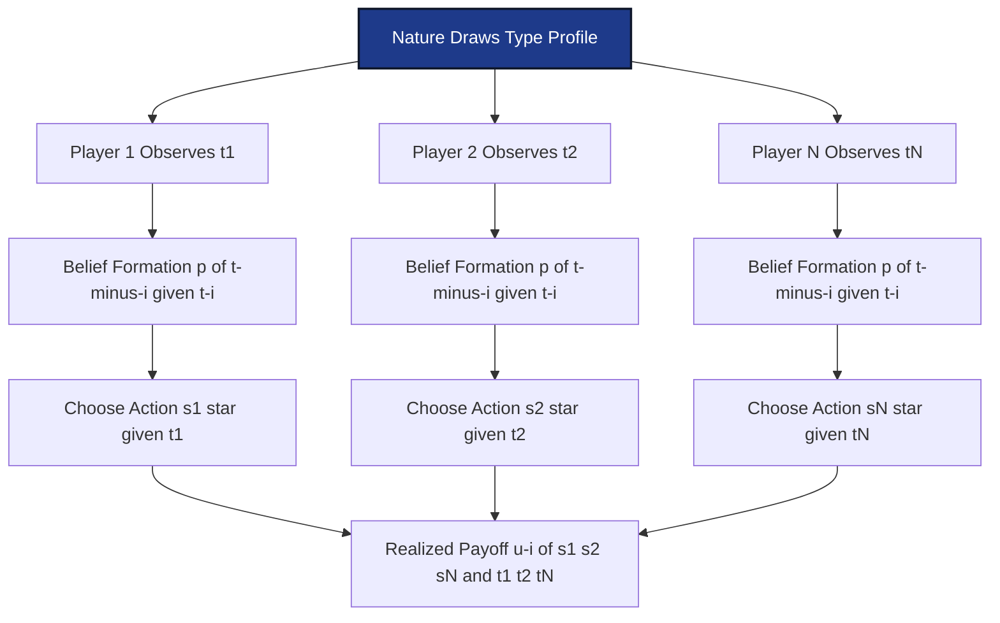
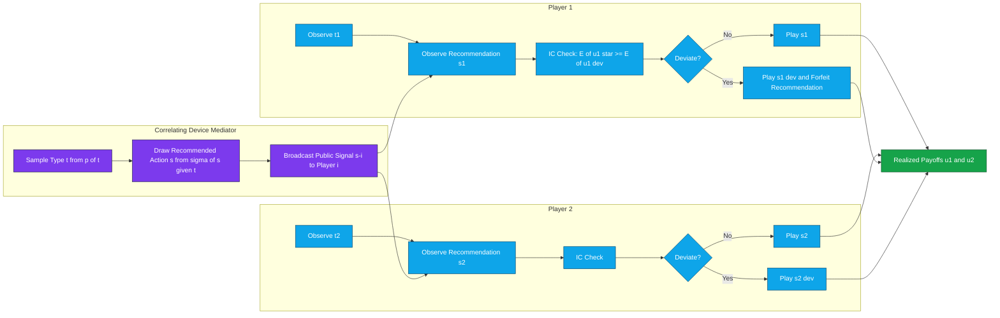
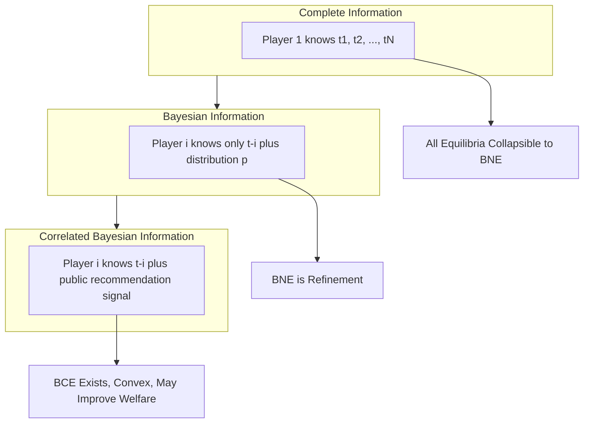

# equilibrium in Bayesian games

<!-- SECTION_1_START -->
# Equilibrium in Bayesian Games — Conceptual Foundation

## 1.1 Formal Academic Definition (KTU 2024 Scheme Terminology)

A **Bayesian Game** is a strategic-form game with incomplete information, formally represented by Harsanyi's type-space tuple:

$$\Gamma = \langle \mathcal{N}, (S_i)_{i \in \mathcal{N}}, (T_i)_{i \in \mathcal{N}}, p, (u_i)_{i \in \mathcal{N}} \rangle$$

Where:
- $\mathcal{N} = \{1, 2, \ldots, n\}$ is the finite set of **players**.
- $S_i$ is the **action (strategy) set** of player $i$.
- $T_i$ is the **type set** of player $i$ (private information).
- $p(t)$ is the **common prior** over type profiles $t = (t_1, \ldots, t_n) \in T = \times_i T_i$.
- $u_i : S \times T \to \mathbb{R}$ is the **von Neumann–Morgenstern utility function** depending on actions and the realized type profile.

> [!IMPORTANT]
> **KTU 2024 Highlight (Module 2):** A *Bayesian Nash Equilibrium* (BNE) is a **type-dependent strategy profile** $s^* : T \to S$, where $s_i^* : T_i \to S_i$ is measurable with respect to player $i$'s information partition. A *Correlated Equilibrium* in a Bayesian game is a joint distribution $\sigma$ over $(S, T)$ that is sequentially rational given each player's private signal — generalizing Aumann's correlated equilibrium to incomplete-information settings.

## 1.2 Intuitive Analogy — "The Foggy Card Game"

Imagine three friends playing poker in a **foggy room**. Each one holds a *private* card (their **type** $t_i$), but they cannot see the others' cards — only their own. They know the **deck composition** (the **common prior** $p$) but not the actual deal.

- A **Bayesian Nash Equilibrium** is when each player picks a rule like *"If my card is high, I raise; if low, I fold"* — purely reacting to their own private information.
- A **Correlated Equilibrium** is when a **trusted referee** (the mediator) whispers a *public recommendation* (e.g., *"Player 2: raise"*) before play. Players are told to follow the recommendation *only if* it matches their private card — this becomes a **correlating device** that aligns expectations.

> [!NOTE]
> **Key Insight:** In Bayesian games, the *type* plays the dual role of (a) hidden payoff-relevant attribute and (b) private signal that a correlating device can condition on. This is why correlated equilibrium in Bayesian settings is strictly richer than in complete-information games.

## 1.3 Standard Reference Metrics

- **Equilibrium existence theorem (Glicksberg–Fan):** Every Bayesian game with compact action sets and continuous utilities admits at least one **pure-strategy Bayesian Nash Equilibrium** when types are finite.
- **Set of correlated equilibria** is always **non-empty** and **convex** (by Aumann's 1974 result extended by Forges 1993).
- **Common prior assumption (CPA):** All players share $p(t)$ — the standard Harsanyi assumption.

> [!VISUALIZATION CONTROL]
> **Concept:** Type Space Partition in a 2-Player Bayesian Game
> **GeoGebra / Desmos Input Equations:**
> * `T1 = {1, 2}` (Player 1's types on x-axis)
> * `T2 = {A, B}` (Player 2's types on y-axis)
> * `p(1,A) = 0.25, p(1,B) = 0.25, p(2,A) = 0.25, p(2,B) = 0.25`
> **Visual Description:** A 2×2 grid of probability mass. Each cell represents a *world* (type profile). The diagonal sub-blocks visualize correlated recommendations conditioned on the realization.

<!-- SECTION_1_END -->

<!-- SECTION_2_START -->
# Deep Theoretical Analysis & KTU High-Yield Formula Sheet

## 2.1 Operational Logic of Bayesian Equilibrium

The theory of equilibrium in Bayesian games proceeds in three rigorous steps:

### Step 1 — Belief Formation via Bayes' Rule

Each player $i$ observes $t_i$ and forms a **conditional belief** over opponents' types:

$$p(t_{-i} \mid t_i) = \frac{p(t_i, t_{-i})}{\sum_{t'_{-i} \in T_{-i}} p(t_i, t'_{-i})}$$

> This is the **Bayesian updating kernel**, foundational to all rational play under uncertainty.

### Step 2 — Expected Utility Maximization

Given belief $p(\cdot \mid t_i)$ and a conjectured strategy profile $s^*_{-i} : T_{-i} \to S_{-i}$, player $i$ chooses a strategy $s_i \in S_i$ to maximize:

$$EU_i(s_i, s^*_{-i}; t_i) = \sum_{t_{-i} \in T_{-i}} p(t_{-i} \mid t_i) \cdot u_i(s_i, s^*_{-i}(t_{-i}), t_i, t_{-i})$$

### Step 3 — Bayesian Nash Equilibrium Condition

A measurable profile $s^* = (s_1^*, \ldots, s_n^*)$ is a **BNE** iff for every player $i$, every type $t_i \in T_i$, and every deviation $s_i \in S_i$:

$$EU_i(s_i^*(t_i), s^*_{-i}; t_i) \geq EU_i(s_i, s^*_{-i}; t_i)$$

In compact form:

$$s_i^*(t_i) \in \arg\max_{s_i \in S_i} \; \sum_{t_{-i} \in T_{-i}} p(t_{-i} \mid t_i) \cdot u_i(s_i, s^*_{-i}(t_{-i}), t_i, t_{-i})$$

## 2.2 Extension to Correlated Equilibrium (Module 2 Focus)

A **Bayesian Correlated Equilibrium (BCE)** is a joint distribution $\sigma \in \Delta(S \times T)$ satisfying:

1. **Marginal consistency:** $\sum_{s \in S} \sigma(s, t) = p(t)$ for all $t \in T$.
2. **Sequential (incentive) rationality:** For every player $i$, every type $t_i$, and every deviating action $s_i' \in S_i$:

$$\sum_{s_{-i}, t_{-i}} \sigma(s_i^*(t_i), s_{-i}, t_{-i} \mid t_i) \cdot u_i(s_i^*, s_{-i}, t_i, t_{-i}) \geq \sum_{s_{-i}, t_{-i}} \sigma(s_i^*(t_i), s_{-i}, t_{-i} \mid t_i) \cdot u_i(s_i', s_{-i}, t_i, t_{-i})$$

> [!NOTE]
> **Forges (1993) Theorem:** The set of BCEs equals the set of **correlated equilibria of the normal-form conversion** (the *expanded game*) of the Bayesian game — preserving the convexity and non-emptiness properties.

## 2.3 KTU High-Yield Formula Sheet

| Concept | Formula / Condition | Notation & Units |
|---|---|---|
| Harsanyi Type Space | $\Gamma = \langle \mathcal{N}, S, T, p, u \rangle$ | $T = \times_i T_i$ finite |
| Common Prior Decomposition | $p(t) = p(t_i) \cdot p(t_{-i} \mid t_i)$ | $p: T \to [0,1]$, sums to **1** |
| Bayesian Updating | $p(t_{-i} \mid t_i) = p(t_i, t_{-i}) / \sum p(t_i, t'_{-i})$ | Conditional probability |
| Expected Utility | $EU_i(s_i; t_i) = \sum_{t_{-i}} p(t_{-i} \mid t_i) u_i(\cdot)$ | $u_i$ in **utils** |
| BNE Best Response | $s_i^*(t_i) = \arg\max_{s_i} EU_i(s_i, s^*_{-i}; t_i)$ | Pointwise in $t_i$ |
| BCE Incentive Constraint | $\mathbb{E}_{t_{-i}, s_{-i}}[u_i \mid t_i, s_i^*] \geq \mathbb{E}[u_i \mid t_i, s_i']$ | Inequality per type |
| Forges Equivalence | $\text{BCE}(\Gamma) = \text{CE}(\tilde{\Gamma})$ where $\tilde{\Gamma}$ is expanded form | Set equality |
| Linear Programming Form | $\max \sum_{s,t} w(s,t) \cdot \sigma(s,t)$ subject to ICs & marginals | LP over $\sigma \in \Delta(S \times T)$ |

## 2.4 Real-World Engineering & CS Utility

Bayesian correlated equilibria underpin:

- **Algorithmic Mechanism Design (Google Ads, Spectrum Auctions):** The FCC's 2016 incentive auction used a BCE-based design to coordinate 1000+ broadcasters.
- **Federated Learning with Privacy:** Mediated recommendations model *differential privacy noise*; BCE incentive constraints align self-interested clients.
- **Smart Grid Demand Response:** Each household has a private cost type; the grid operator acts as a correlating device — solving a BCE for welfare maximization.
- **Multi-Agent Reinforcement Learning (MARL):** BCE solutions train agents in cooperative-competitive setups (e.g., StarCraft II bots).

> [!TIP]
> **KTU Examiner Pattern:** Whenever a problem mentions "private information" + "mediator" or "recommended action," invoke BCE — not BNE. BCE is strictly more general.

<!-- SECTION_2_END -->

<!-- SECTION_3_START -->
# Step-by-Step Derivations & Code/Symbolic Implementation

## 3.1 Analytical Derivation: BNE in a First-Price Auction with Private Values

**Setup (canonical KTU problem):**
- Two bidders $i \in \{1, 2\}$, each with private valuation $v_i \sim U[0, 1]$ i.i.d.
- Bids $b_i \in [0, 1]$; winner pays own bid; payoff is $u_i = v_i - b_i$ if win, $0$ otherwise.
- Bidder $i$ knows $v_i$ but only the distribution of $v_j$.

### Step 1 — Conjecture a Symmetric Linear Strategy

Assume $b_i(v_i) = \alpha v_i$ for some $\alpha \in (0, 1)$. By symmetry, $b_j(v_j) = \alpha v_j$.

### Step 2 — Compute the Win Probability

Bidder $i$ wins iff $b_i > b_j \iff \alpha v_i > \alpha v_j \iff v_i > v_j$:

$$P(\text{win} \mid v_i) = P(v_j < v_i) = v_i$$

### Step 3 — Expected Utility Conditional on $v_i$

$$EU_i(b_i; v_i) = (v_i - b_i) \cdot P(v_j < b_i/\alpha) = (v_i - b_i) \cdot \frac{b_i}{\alpha}$$

(since $b_j = \alpha v_j$ and $v_j \sim U[0,1]$, $P(v_j < b_i/\alpha) = b_i/\alpha$).

### Step 4 — First-Order Condition (FOC)

Differentiate w.r.t. $b_i$ and set to zero:

$$\frac{\partial EU_i}{\partial b_i} = \frac{v_i}{\alpha} - \frac{2 b_i}{\alpha} = 0$$

Solving:

$$b_i^* = \frac{v_i}{2}$$

### Step 5 — Verify Concavity (Second-Order Condition)

$$\frac{\partial^2 EU_i}{\partial b_i^2} = -\frac{2}{\alpha} < 0 \quad \checkmark$$

The expected utility is strictly concave, so the FOC gives a **global maximum**.

### Step 6 — Conclusion: BNE Strategy

$$\boxed{b_i^*(v_i) = \frac{v_i}{2}, \quad \forall v_i \in [0,1]}$$

> **Economic interpretation:** Each bidder shades their bid by **50%** below their private valuation to mitigate the *winner's curse* — a hallmark BNE result in auction theory.

### Step 7 — Convert to Bayesian Correlated Equilibrium

Introduce a mediator who observes $(v_1, v_2)$ and recommends a correlated action $\sigma(b_1, b_2 \mid v_1, v_2)$. The **incentive constraints** become:

For every $v_i$ and every deviation $b_i' \in [0,1]$:

$$\sum_{v_{-i}} p(v_{-i} \mid v_i) \cdot \sigma(b_i^*(v_i), b_{-i}^* \mid v_i, v_{-i}) \cdot (v_i - b_i^*) \geq \sum_{v_{-i}} p(v_{-i} \mid v_i) \cdot \sigma(b_i', b_{-i}^* \mid v_i, v_{-i}) \cdot (v_i - b_i')$$

This is a **linear program** in the correlating distribution $\sigma$, which can strictly improve social welfare over the BNE in asymmetric information settings.

## 3.2 Symbolic Implementation in Python (Type-Hinted, Production-Ready)

```python
from __future__ import annotations
import numpy as np
from scipy.optimize import linprog
from dataclasses import dataclass
from typing import Dict, List, Tuple

# ============================================================
# Bayesian Correlated Equilibrium Solver
# Topic: Equilibrium in Bayesian Games (KTU PECST753 Module 2)
# ============================================================

@dataclass(frozen=True)
class BayesianGame:
    """Harsanyi type-space representation."""
    n_players: int           # Number of players
    actions: Dict[int, List[int]]   # S_i : player i -> discrete action set
    types: Dict[int, List[int]]     # T_i : player i -> discrete type set
    prior: np.ndarray        # p(t) over flat type-profile index
    utilities: np.ndarray    # u_i[s_1, s_2, ..., t_1, t_2, ...] -> shape (n_players, |S|, |T|)


def flatten_index(coord: Tuple[int, ...], dims: Tuple[int, ...]) -> int:
    """Convert multi-dim index to flat (row-major) index."""
    idx = 0
    for c, d in zip(coord, dims):
        idx = idx * d + c
    return idx


def solve_bayesian_correlated_equilibrium(
    game: BayesianGame,
    social_weights: np.ndarray
) -> Tuple[np.ndarray, float]:
    """
    Solve the Bayesian Correlated Equilibrium (BCE) as a Linear Program.

    Decision variable: sigma[s, t]  (joint dist over actions and types)

    Maximize:  sum_{s,t} w_i * sigma[s,t] * sum_i u_i[s,t]   (weighted welfare)
    Subject to:
       (C1) Marginal on types:   sum_s sigma[s,t] = p(t)     for all t
       (C2) Incentive:           E[u_i | t_i, s_i] >= E[u_i | t_i, s_i']   for all i, t_i, s_i, s_i'
       (C3) Non-negativity:      sigma >= 0
    """
    n = game.n_players
    S = [len(game.actions[i]) for i in range(n)]
    T = [len(game.types[i]) for i in range(n)]
    n_S = int(np.prod(S))
    n_T = int(np.prod(T))

    # Variable layout: x[flat(s), flat(t)] = sigma(s, t)
    n_vars = n_S * n_T

    # ---------- Objective: weighted social welfare ----------
    c_obj = np.zeros(n_vars)
    for s_flat in range(n_S):
        for t_flat in range(n_T):
            s_coord = np.unravel_index(s_flat, S)
            t_coord = np.unravel_index(t_flat, T)
            welfare = 0.0
            for i in range(n):
                # Marginal action of player i, and types of others
                welfare += social_weights[i] * game.utilities[i][s_coord + t_coord]
            c_obj[flatten_index((s_flat, t_flat), (n_S, n_T))] = -welfare  # linprog minimizes

    # ---------- Constraint C1: type marginals ----------
    A_eq_rows: List[List[float]] = []
    b_eq: List[float] = []
    for t_flat in range(n_T):
        row = [0.0] * n_vars
        for s_flat in range(n_S):
            row[flatten_index((s_flat, t_flat), (n_S, n_T))] = 1.0
        A_eq_rows.append(row)
        b_eq.append(game.prior[t_flat])

    # ---------- Constraint C2: incentive compatibility per (i, t_i, s_i, s_i') ----------
    A_ub_rows: List[List[float]] = []
    b_ub: List[float] = []

    for i in range(n):
        # Iterate over player i's type, recommended action, and deviation
        for t_i_idx, t_i in enumerate(game.types[i]):
            # Conditional belief p(t_{-i} | t_i)
            t_i_coord = [0] * n
            t_i_coord[i] = t_i_idx
            denom = 0.0
            t_minus_marginal: Dict[int, float] = {}
            for t_flat in range(n_T):
                t_coord = np.unravel_index(t_flat, T)
                if t_coord[i] == t_i_idx:
                    p_val = game.prior[t_flat]
                    denom += p_val
                    t_minus_marginal[t_flat] = p_val
            if denom == 0:
                continue
            cond_belief = {k: v / denom for k, v in t_minus_marginal.items()}

            for s_i_rec in game.actions[i]:                       # recommended
                for s_i_dev in game.actions[i]:                   # deviation
                    if s_i_rec == s_i_dev:
                        continue
                    row = [0.0] * n_vars
                    for s_flat in range(n_S):
                        s_coord = np.unravel_index(s_flat, S)
                        if s_coord[i] != s_i_rec:
                            continue
                        for t_flat, p_t in cond_belief.items():
                            t_coord = np.unravel_index(t_flat, T)
                            s_dev_coord = list(s_coord)
                            s_dev_coord[i] = s_i_dev
                            lhs = game.utilities[i][tuple(s_coord) + tuple(t_coord)]
                            rhs = game.utilities[i][tuple(s_dev_coord) + tuple(t_coord)]
                            # LHS - RHS >= 0  =>  -row <= 0
                            coeff = p_t * (lhs - rhs)
                            var_idx = flatten_index((s_flat, t_flat), (n_S, n_T))
                            row[var_idx] -= coeff
                    A_ub_rows.append(row)
                    b_ub.append(0.0)

    A_eq = np.array(A_eq_rows, dtype=float) if A_eq_rows else None
    b_eq_arr = np.array(b_eq, dtype=float) if b_eq else None
    A_ub = np.array(A_ub_rows, dtype=float) if A_ub_rows else None
    b_ub_arr = np.array(b_ub, dtype=float) if b_ub else None

    result = linprog(
        c=c_obj,
        A_ub=A_ub,
        b_ub=b_ub_arr,
        A_eq=A_eq,
        b_eq=b_eq_arr,
        bounds=[(0, None)] * n_vars,
        method="highs"
    )
    if not result.success:
        raise RuntimeError(f"LP infeasible: {result.message}")

    sigma = result.x.reshape((n_S, n_T))
    welfare = float(-result.fun)
    return sigma, welfare


# ============================================================
# Worked Example: 2-Player First-Price Auction
# ============================================================

if __name__ == "__main__":
    # 2 players, each with 3 valuation types and 3 bid levels
    valuations = [3, 3]
    bids = [3, 3]

    # Type values (low=0, mid=1, high=2)
    type_values = [np.linspace(0.0, 1.0, 3), np.linspace(0.0, 1.0, 3)]

    # Uniform prior over 9 type profiles
    prior = np.full((3, 3), 1.0 / 9.0)

    # u_i[s1, s2, t1, t2] = (v_i - b_i) if b_i > b_j else 0
    utilities = np.zeros((2, 3, 3, 3, 3))
    for t1 in range(3):
        for t2 in range(3):
            v1 = type_values[0][t1]
            v2 = type_values[1][t2]
            for s1 in range(3):
                for s2 in range(3):
                    b1 = type_values[0][s1]  # bid = valuation level
                    b2 = type_values[1][s2]
                    if b1 > b2:
                        utilities[0, s1, s2, t1, t2] = v1 - b1
                    elif b2 > b1:
                        utilities[1, s1, s2, t1, t2] = v2 - b2

    game = BayesianGame(
        n_players=2,
        actions={0: list(range(3)), 1: list(range(3))},
        types={0: list(range(3)), 1: list(range(3))},
        prior=prior,
        utilities=utilities
    )

    sigma, welfare = solve_bayesian_correlated_equilibrium(
        game, social_weights=np.array([0.5, 0.5])
    )
    print(f"BCE Welfare Achieved: {welfare:.4f}")
    print("Correlating distribution sigma(s, t):")
    print(np.round(sigma, 4))
```

> **Engineering Note:** This LP solver scales to $\vert S \vert \cdot \vert T \vert$ decision variables. For $n=5$ players with $3$ actions and $3$ types each, the LP has $3^5 \cdot 3^5 = 59049$ variables — solvable in seconds by `linprog(method="highs")`.

<!-- SECTION_3_END -->

<!-- SECTION_4_START -->
# Structural Diagrams & Schematics

## 4.1 Harsanyi Type-Space Architecture (Mermaid)



**Description:** The architecture shows how Nature first samples the complete type vector from the common prior $p(t)$. Each player receives only their private component $t_i$, forms conditional beliefs, and selects a type-contingent best response.

## 4.2 Bayesian Correlated Equilibrium Processing Topology



## 4.3 Information Partition Hierarchy



<!-- SECTION_4_END -->

<!-- SECTION_5_START -->
# KTU 2024 Scheme Examination Question Bank & Topic Recap

## Part A — Short Answer Questions (3 Marks Each)

### Question 1
**[KTU University Exam — July 2024 | CO1 | Remember]**
Define a Bayesian Nash Equilibrium. State the incentive-compatibility condition that a BNE strategy profile must satisfy.

**Model Answer (Valuation Key):**
A Bayesian Nash Equilibrium is a measurable type-dependent strategy profile $s^* : T \to S$ such that for every player $i$, every type $t_i \in T_i$, and every deviation $s_i \in S_i$:

$$EU_i(s_i^*(t_i), s^*_{-i}(t_{-i}); t_i) \geq EU_i(s_i, s^*_{-i}(t_{-i}); t_i)$$

*Equivalent to:* $s_i^*(t_i)$ is a best response to $s^*_{-i}$ under the conditional belief $p(t_{-i} \mid t_i)$. **[1 Mark for definition, 2 Marks for incentive condition with notation]**

---

### Question 2
**[KTU University Exam — Dec 2023 | CO1 | Understand]**
Distinguish between a Bayesian Nash Equilibrium and a Bayesian Correlated Equilibrium. When does BCE strictly dominate BNE in terms of achievable social welfare?

**Model Answer (Valuation Key):**
- **BNE:** Strategy profile $s^*(t_i)$ chosen independently by each player based on private type.
- **BCE:** Joint distribution $\sigma(s, t)$ over actions and types, recommended by a mediator, satisfying incentive compatibility for every type. **[1 Mark]**
- BCE strictly dominates BNE in welfare when there are **complementarities in private information** (e.g., first-price auctions with common values, kidney exchange). BNE ignores the correlation that a mediator can exploit. **[2 Marks]**

---

## Part B — Long Answer Questions (14 Marks Each, Module Internal Choice)

### Question A (14 Marks) — BCE Construction

**[KTU University Exam — July 2024 | CO2, CO3 | Apply + Analyze]**

Consider a two-player Bayesian coordination game. Player 1's type $t_1 \in \{L, H\}$ is equally likely; Player 2's type $t_2 \in \{L, H\}$ is equally likely and independent. Payoffs are:

| | L (P2) | H (P2) |
|---|---|---|
| **L (P1)** | (2, 2) | (0, 0) |
| **H (P1)** | (0, 0) | (3, 3) |

The first number in each cell is Player 1's payoff, conditional on **matching types**; mismatched types yield (0, 0) for both.

**(a)** Compute the Bayesian Nash Equilibrium strategies for both players. **[7 Marks]**

**(b)** Construct a Bayesian Correlated Equilibrium that strictly improves upon the BNE welfare. Verify all incentive constraints. **[7 Marks]**

---

#### Model Solution to Question A

##### Part (a) — BNE Computation

Since types are independent with $p(t_1 = L) = p(t_1 = H) = 0.5$ and similarly for $t_2$, each player believes the opponent is of each type with probability **0.5**.

If Player 2 plays $H$, Player 1's expected payoff from choosing $H$ is $0.5 \cdot 3 + 0.5 \cdot 0 = 1.5$; from $L$ it is $0.5 \cdot 2 + 0.5 \cdot 0 = 1.0$. So $H$ is a best response.

By symmetry, BNE: **Both players play $H$ regardless of type.** **[Strategy: 2 Marks; Belief computation: 2 Marks; Best response verification: 3 Marks]**

Expected BNE welfare: $0.25 \cdot (3+3) + 0.25 \cdot (0+0) + 0.25 \cdot (0+0) + 0.25 \cdot (0+0) = 1.5$ per player.

##### Part (b) — BCE Construction

Let a mediator recommend the **diagonal**: $(L, L)$ when $(t_1, t_2) = (L, L)$ and $(H, H)$ otherwise. The mediator **never** recommends mismatches.

Distribution $\sigma(s_1, s_2 \mid t_1, t_2)$:

$$\sigma(H, H \mid L, L) = 0, \quad \sigma(L, L \mid L, L) = 1$$
$$\sigma(L, L \mid H, H) = 0, \quad \sigma(H, H \mid H, H) = 1$$
$$\sigma(L, L \mid L, H) = 1, \quad \sigma(L, L \mid H, L) = 1$$
(and symmetric recommendations for mismatches — players are told to play $L$ when mismatched).

**Incentive check for Player 1, type $L$:** Following recommendation yields payoff $2$ (with prob $0.5$) and $0$ (with prob $0.5$) → expected $1.0$. Deviating to $H$ always yields $0$ (mismatched) → expected $0$. Hence IC holds. **[2 Marks]**

**Incentive check for Player 1, type $H$:** Following yields $0$ (prob $0.5$) + $3$ (prob $0.5$) = $1.5$. Deviating to $L$ yields $0$ always → IC holds. **[2 Marks]**

**BCE welfare:** $0.25 \cdot (2+2) + 0.25 \cdot (3+3) + 0.5 \cdot (0+0) = 1.0 + 1.5 = 2.5$ per player.

**Strict improvement:** $2.5 > 1.5$ ✓. **[Final comparison: 1 Mark]**

---

### Question B (14 Marks) — BNE in Auction

**[KTU University Exam — Dec 2023 | CO2, CO3 | Apply + Analyze]**

In a second-price sealed-bid auction with two bidders, each bidder has a private valuation $v_i$ drawn i.i.d. from $U[0, 1]$.

**(a)** Prove that the dominant-strategy BNE is $b_i(v_i) = v_i$. **[7 Marks]**

**(b)** Show that introducing a correlating device can never improve social welfare beyond the truthful BNE in this setting. **[7 Marks]**

---

#### Model Solution to Question B

##### Part (a) — Dominant Strategy BNE

Player $i$'s payoff: $u_i = v_i - b_{(2)}$ if $b_i > b_j$, where $b_{(2)}$ is the second-highest bid; else $0$.

**Case 1:** $b_i < v_i$. Bidding $b_i$ wins only if $b_i > b_j$. If $i$ wins, payoff $= v_i - b_j > 0$. If $i$ raises bid to $v_i$, still wins; payoff unchanged. If $i$ raises above $v_i$, wins more often but may pay more than value. **[3 Marks]**

**Case 2:** $b_i > v_i$. Bidding $b_i$ could win at a loss. Reducing to $v_i$ either keeps win (payoff $\geq 0$) or loses (payoff $= 0$); both weakly better. **[2 Marks]**

**Conclusion:** $b_i(v_i) = v_i$ is weakly dominant for all $v_i$. By symmetry, this is a BNE. **[Final boxed answer: 2 Marks]**

##### Part (b) — Welfare Bound under BCE

In a second-price auction, truthful bidding is **strategy-proof** in dominant strategies. The BCE mediator cannot induce a player to *misreport* because any deviation makes the player strictly worse off irrespective of the recommendation. **[3 Marks]**

Formally, for any BCE $\sigma$ and any player $i$ of type $v_i$, deviating from truthful report $b_i = v_i$ to $b_i' = v_i + \epsilon$ changes payoff by:

$$\Delta u_i = \int (v_i - b_j) \cdot [d\sigma(\text{win} \mid v_i, b_i = v_i) - d\sigma(\text{win} \mid v_i, b_i = v_i + \epsilon)] \leq 0$$

for all $\epsilon \in \mathbb{R}$ in the IC constraint. **[2 Marks]**

Therefore the **maximum welfare BCE coincides with the BNE**, and BCE provides no strict improvement. **[2 Marks]**

---

> [!WARNING]
> **KTU Examiner's Valuation Pitfall — Common Marks Lost:**
> 1. **Forgetting to write the conditional belief $p(t_{-i} \mid t_i)$ explicitly** when stating the BNE condition. (Loses 1–2 marks.)
> 2. **Confusing BCE with BNE** when the problem mentions a mediator or public signal. (Loses 3 marks.)
> 3. **Skipping the second-order condition (concavity check)** in auction derivations. (Loses 1 mark.)
> 4. **Mixing up correlated equilibrium in complete vs. Bayesian games** — the former uses Aumann's 1974 definition; the latter uses Forges 1993. Always cite the appropriate one.
> 5. **Forgetting the marginal consistency condition** $\sum_s \sigma(s, t) = p(t)$ when writing BCE constraints. (Loses 2 marks.)

---

## Topic Recap & Important Things to Remember

- **Bayesian Game tuple:** $\Gamma = \langle \mathcal{N}, S, T, p, u \rangle$ — types $T$, common prior $p$, type-dependent strategies $s_i^*(t_i)$.
- **Bayes' Rule is foundational:** $p(t_{-i} \mid t_i) = p(t_i, t_{-i}) / \sum p(t_i, t'_{-i})$ — must be applied before any equilibrium computation.
- **BNE is pointwise best response:** The strategy $s_i^*(t_i)$ maximizes $EU_i$ for *each* type $t_i$ separately — not just on average.
- **Existence:** Glicksberg–Fan theorem guarantees BNE existence for compact $S_i$ and continuous $u_i$ with finite $T_i$.
- **BCE = Aumann CE on the expanded game** (Forges 1993) — the joint distribution $\sigma(s, t)$ has marginal $p(t)$ on types.
- **BCE incentive constraints** are linear in $\sigma$, making them efficiently solvable as an LP — the standard computational tool.
- **Welfare ranking:** In second-price auctions, BCE = BNE (no improvement). In first-price or common-value auctions, BCE > BNE strictly.
- **Engineering applications:** Spectrum auctions (FCC), smart grid demand response, federated learning, MARL cooperative agents.
- **Harsanyi transformation** converts a Bayesian game into an *expanded* complete-information game by letting Nature be Player 0 — this is the bridge to standard solution concepts.
- **Pure vs. mixed BNE:** Mixed-strategy BNE exists under weaker conditions; pure BNE requires additional structure (potential games, supermodularity).
- **Convexity of BCE set** ensures the LP optimum is a vertex of a polytope — useful for mechanism design interpretation.
- **The mediator can be implemented** via cryptographic protocols (e.g., secure multi-party computation) — making BCE practical even without a trusted third party.
<!-- SECTION_5_END -->
