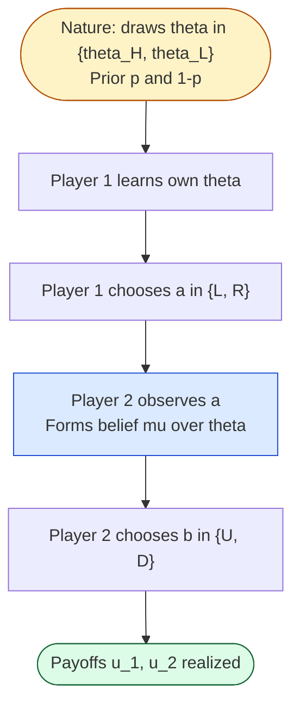
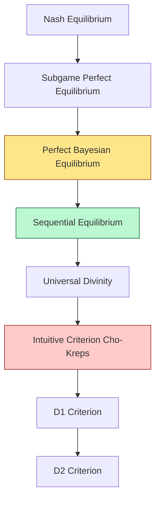
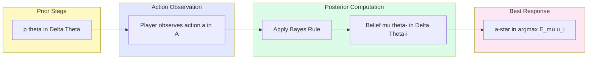
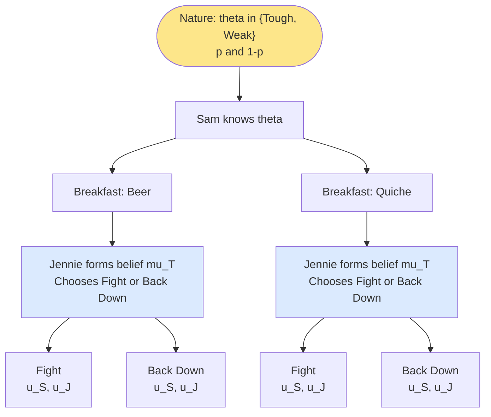
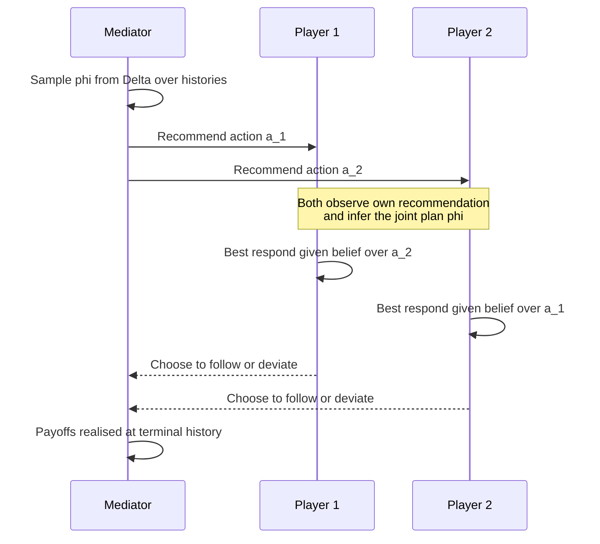

# Equilibrium in IIEFG

<!-- SECTION_1_START -->
# Equilibrium in Incomplete Information Extensive Form Games (IIEFG)

## 1.1 Formal Academic Definition

> [!IMPORTANT]
> **KTU 2024 Syllabus Definition**
> An **Incomplete Information Extensive Form Game (IIEFG)** is an extensive form game in which at least one participant is uncertain about the *payoff functions*, *available actions*, or *private information* of other participants. This uncertainty is formally modelled using **Harsanyi's type-space framework (1967–68)**, where each player $i$ is assigned a private *type* $\theta_i \in \Theta_i$ drawn from a commonly known prior distribution $p(\theta_1, \theta_2, \dots, \theta_n)$. The equilibrium concept that operates over such games is the **Perfect Bayesian Equilibrium (PBE)**, refined further into the **Sequential Equilibrium** (Kreps & Wilson, 1982).

The structural tuple of an IIEFG is the classical sextuple:

$$G = \langle N, H, P, f_c, (u_i)_{i \in N}, (\Theta_i, p_i)_{i \in N} \rangle$$

where the additional components $( \Theta_i, p_i )$ capture the **type space** and **prior belief** of every player.

## 1.2 Conceptual Analogy & Intuition

> [!NOTE]
> **Intuitive Picture — The Hiring Interview Game**
> Imagine an HR manager interviewing two candidates, **Alice** and **Bob**, for a single senior position. The manager does **not** know:
> 1. How productive each candidate truly is (their *type*).
> 2. Whether a candidate is exaggerating or being truthful in self-reports.
> 3. The reservation wage of the competing firm.
>
> Alice, however, knows her **own productivity perfectly**. Bob knows his. The manager only knows that productivity is drawn from a known distribution. This asymmetry of *information sets* is exactly the defining feature of an IIEFG. Each move in the game tree may carry a different *posterior belief* about the opponent's type, and rational strategies must be derived **backward through the tree** while simultaneously updating these beliefs via **Bayes' Rule**.

The crucial shift from complete to incomplete information is summarised below:

| Aspect | Complete Information EFG | Incomplete Information EFG (IIEFG) |
|---|---|---|
| **Knowledge of $u_i$** | Common knowledge | Only $u_i(\cdot \mid \theta_i)$ is known privately |
| **State of world** | Single, fixed world | Draw from $\Theta$ via $p(\theta)$ |
| **Information sets** | Singleton nodes of action | May contain nodes across different types |
| **Belief system** | Trivial (certainty) | Posterior beliefs $\mu(h)$ over types at every $h$ |
| **Equilibrium tool** | Subgame Perfect Equilibrium (SPE) | Perfect Bayesian / Sequential Equilibrium |
| **Bayes' Rule** | Not required | Mandatory for off-path beliefs |

## 1.3 Physical Constants & Standard Metrics

> [!NOTE]
> **Standard Engineering Parameters in IIEFG Modelling**
> - **Prior probability**: $p(\theta_i)$ — a probability mass function over a finite type space, summing to **$1$**.
> - **Posterior belief**: $\mu(\theta_{-i} \mid h)$ — must lie in the **simplex $\Delta(\Theta_{-i})$**.
> - **Strategy**: A mapping $s_i : \mathcal{I}_i \times \Theta_i \to \Delta(A(I))$ with a unit-probability normalisation.
> - **Expected utility** is computed with respect to the **type-averaged** utility: $EU_i = \mathbb{E}_{\theta \sim p}[u_i(s, \theta)]$.

## 1.4 Visualisation Control — Type-Space Geometry

> [!VISUALIZATION CONTROL]
> **Concept:** Two-Player Type Space as a Probability Simplex
> **Desmos / GeoGebra Input Equations:**
> - Triangle vertices: $A = (0,0)$, $B = (1,0)$, $C = (0,1)$
> - Sample interior point: $P = (0.3,\ 0.4)$
> - Constraint line: $x + y \leq 1$
>
> **Visual Description:** The student should observe a right-triangular region representing the joint-type simplex $\Delta(\Theta_1 \times \Theta_2)$. Any interior point denotes a *belief state* $(\mu(\theta_1),\ \mu(\theta_2))$ held by a player at a specific information set. Moving along the hypotenuse corresponds to a *zero-probability* assignment to one type — a forbidden off-path belief if reached via Bayes' Rule inconsistency.

<!-- SECTION_1_END -->

<!-- SECTION_2_START -->
# Deep Theoretical Analysis & KTU High-Yield Formula Sheet

## 2.1 The Harsanyi Type-Space Transformation

> [!IMPORTANT]
> **Core Theorem (Harsanyi, 1967)**
> Any $n$-player game with incomplete information can be transformed into a *complete-information* game by introducing a **Nature player** who moves first and privately distributes *type cards* $\theta = (\theta_1, \dots, \theta_n)$ drawn from $p \in \Delta(\Theta)$. The resulting game has *perfect information* at Nature's node but *imperfect information* at every subsequent decision node, mirroring the original game's uncertainty structure.

The transformation pipeline is:

1. **Embed Nature** as player $0$ with action set $\Theta = \Theta_1 \times \Theta_2 \times \cdots \times \Theta_n$.
2. **Define** $P(\emptyset) = 0$ (Nature moves at the root).
3. **Augment** each player's information set $I_i$ by splitting nodes belonging to different type profiles.
4. **Re-define utilities** as $v_i(h, \theta) = u_i(h, \theta_i)$ evaluated only against player $i$'s own type.

## 2.2 Beliefs and Bayes' Rule

For any information set $I$ reached with strictly positive probability under strategy profile $s$, the belief $\mu$ must satisfy:

$$\mu(\theta_{-i} \mid I) = \frac{\sum_{\theta_i} p(\theta_i, \theta_{-i}) \cdot \Pr(h \in I \mid s, \theta)}{\sum_{\theta'_{-i}} \sum_{\theta_i} p(\theta_i, \theta'_{-i}) \cdot \Pr(h \in I \mid s, \theta)}$$

> [!IMPORTANT]
> **KTU Rule of Thumb**
> *On the equilibrium path* — beliefs are computed by **Bayes' Rule** with the equilibrium strategy.
> *Off the equilibrium path* — beliefs are *free variables* chosen subject to **consistency** with sequential rationality and weak improvement principles (e.g., D1 Kreps–Romer, or D2 Cho–Kreps *intuitive* criterion).

## 2.3 Perfect Bayesian Equilibrium (PBE)

> [!NOTE]
> **Definition — A PBE is a pair $(s^\star, \mu)$ where:**
> 1. **Sequential Rationality:** At every information set $I$ of every player $i$,
>
>$$s_i^\star(I) \in \arg\max_{a_i \in A(I)} \sum_{\theta_i, \theta_{-i}} \mu(\theta_{-i} \mid I) \cdot u_i(s_i^\star, a_i, s_{-i}^\star, \theta)$$
>
> 2. **Belief Consistency:** For every $I$ with $\Pr(I \mid s^\star) > 0$, beliefs are derived via Bayes' Rule applied to $s^\star$ and the prior $p(\theta)$.

## 2.4 Sequential Equilibrium (Kreps & Wilson, 1982)

The *Sequential Equilibrium* refines the PBE by requiring that the assessment $(s^\star, \mu)$ is the **limit** of a sequence of *trembling-hand* perfect equilibria:

$$\exists \ \sigma^n \to s^\star \quad \text{and} \quad \mu^n \to \mu$$

such that every $\sigma^n$ is a *completely mixed* strategy (positive probability on **every** action) and $\mu^n$ is the **Bayes-consistent** belief under $\sigma^n$.

> [!IMPORTANT]
> **Why Sequential > Perfect Bayesian?**
> PBE allows arbitrary off-path beliefs; Sequential Equilibrium forces those beliefs to be the *limit* of fully-mixed strategies, eliminating *incredible threats* on off-path histories.

## 2.5 Extensive-Form Correlated Equilibrium (EFCE)

The **EFCE** (von Stengel & Forges, 2008) extends the *correlated equilibrium* of Aumann to extensive form. A *mediator* recommends an action profile at the start; the mediator's recommendation device is a *correlated plan* $\varphi \in \Delta(\mathcal{H})$ over histories.

A strategy profile $s$ is an **EFCE** if there exists no player $i$ and deviation $s_i'$ such that:

$$\mathbb{E}_{\varphi}[u_i(s_i', s_{-i}, h)] > \mathbb{E}_{\varphi}[u_i(s, h)]$$

In other words, no player gains by deviating **after** observing the mediator's recommendation.

## 2.6 KTU Formula Sheet / Cheat Sheet

> [!NOTE]
> **Master Formula Table for IIEFG Equilibrium**

| # | Concept | Formula / Condition | Notation Used |
|---|---|---|---|
| 1 | Prior over types | $\sum_{\theta \in \Theta} p(\theta) = 1$ | $p \in \Delta(\Theta)$ |
| 2 | Posterior via Bayes | $\mu(\theta_{-i} \mid I) = \frac{\Pr(h \in I, \theta_{-i} \mid s^\star)}{\Pr(h \in I \mid s^\star)}$ | $\mu \in \Delta(\Theta_{-i})$ |
| 3 | Sequential Rationality | $a_i^\star(I) \in \arg\max_{a_i} \mathbb{E}_{\mu}[u_i \mid I, a_i]$ | $a_i^\star \in A(I)$ |
| 4 | Expected Utility | $EU_i = \sum_{\theta} p(\theta) \sum_{h} \sigma(h) \cdot u_i(h, \theta)$ | $\sigma$ = strategy |
| 5 | Trembling-hand limit | $(s^\star, \mu) = \lim_{n \to \infty} (\sigma^n, \mu^n)$ | $\sigma^n > 0\ \forall a$ |
| 6 | EFCE Incentive | $\mathbb{E}_\varphi[u_i(s_i', s_{-i})] \leq \mathbb{E}_\varphi[u_i(s, h)]$ | $\varphi$ = correlated plan |
| 7 | Perfect Bayesian | Sequential Rationality + Bayes Consistency on-path | PBE |
| 8 | Sequential Equilibrium | PBE + Trembling-hand limit of fully-mixed | SEQ |

## 2.7 Real-World Engineering & CS Utility

> [!NOTE]
> **Production-Scale Use Cases**
> - **Algorithmic Mechanism Design:** Sponsored-search auctions (Google, Meta) use IIEFG models with *uncertainty over click-through rates* (the *type* of each advertiser).
> - **Network Security Games:** Deployed by the US ARMOR program; defender has *incomplete information* about which target the attacker will strike.
> - **Bayesian Persuasion (Kamenica–Gentzkow, 2011):** Sender commits to an *information disclosure policy*; receiver's *posterior belief* is updated via Bayes' rule.
> - **Cybersecurity Stackelberg Games:** PBE computed on game trees with depth 10+ and hundreds of type states.
> - **Smart-Grid Demand Response:** Households have private *type* (flexibility, valuation); utility runs a Bayesian screening game.

<!-- SECTION_2_END -->

<!-- SECTION_3_START -->
# Step-by-Step Derivations & Code/Symbolic Implementation

## 3.1 Worked Example — The Beer–Quiche Game (Cho–Kreps, 1987)

> [!NOTE]
> **Setting**
> - Two players: **Sam** (Sender) and **Jennie** (Receiver).
> - Sam's type $\theta_S \in \{Tough,\ Weak\}$ with prior $p(Tough) = p = q$ and $p(Weak) = 1 - p$.
> - Sam chooses **Breakfast** $B \in \{Beer,\ Quiche\}$.
> - Jennie observes $B$ but not $\theta_S$, then chooses **Action** $J \in \{Fight,\ Back\ down\}$.
> - Payoffs (Sam, Jennie):

| Sam $\backslash$ Jennie | Fight | Back down |
|---|---|---|
| **Tough → Beer** | $(0, -1)$ | $(2, 1)$ |
| **Tough → Quiche** | $(1, 0)$ | $(1, 2)$ |
| **Weak → Beer** | $(-1, 1)$ | $(3, 0)$ |
| **Weak → Quiche** | $(0, 0)$ | $(2, 3)$ |

### 3.1.1 Step 1 — Solve Jennie's Decision

For each observed breakfast $B$, Jennie holds a belief $\mu_T = \Pr(\theta_S = Tough \mid B)$. She chooses $Fight$ iff:

$$\mu_T \cdot u_J(Fight \mid Tough, B) + (1 - \mu_T) \cdot u_J(Fight \mid Weak, B) \geq \mu_T \cdot u_J(Back \mid Tough, B) + (1 - \mu_T) \cdot u_J(Back \mid Weak, B)$$

**Case $B = Beer$:** From the table, $u_J(Fight \mid Tough) = -1$, $u_J(Fight \mid Weak) = 1$, $u_J(Back \mid Tough) = 1$, $u_J(Back \mid Weak) = 0$. Substituting:

$$\mu_T (-1) + (1 - \mu_T)(1) \geq \mu_T (1) + (1 - \mu_T)(0)$$

Expanding the LHS:

$$-\mu_T + 1 - \mu_T \geq \mu_T + 0$$

$$1 - 2\mu_T \geq \mu_T \quad \Longrightarrow \quad 1 \geq 3\mu_T \quad \Longrightarrow \quad \mu_T \leq \frac{1}{3}$$

So **Jennie Fights iff $\mu_T \leq 1/3$**.

**Case $B = Quiche$:** $u_J(Fight \mid Tough) = 0$, $u_J(Fight \mid Weak) = 0$, $u_J(Back \mid Tough) = 2$, $u_J(Back \mid Weak) = 3$. Then:

$$0 \cdot \mu_T + 0 \cdot (1 - \mu_T) \geq 2\mu_T + 3(1 - \mu_T) \quad \Longrightarrow \quad 0 \geq 2\mu_T + 3 - 3\mu_T = 3 - \mu_T$$

$$\mu_T \geq 3$$

This is *impossible* (since $\mu_T \leq 1$). So **Jennie never Fights after Quiche**, regardless of belief.

### 3.1.2 Step 2 — On-Path Beliefs (Pooling vs Separating)

> [!NOTE]
> **Pooling Equilibrium Candidate**
> Suppose *both* types of Sam play $Beer$. Then $\Pr(B = Beer) = 1$, and the on-path belief is:
>
> $$\mu_T^{\text{pool}} = \Pr(\theta_S = Tough \mid Beer) = \frac{\Pr(Beer \mid Tough) \cdot p}{\Pr(Beer \mid Tough) \cdot p + \Pr(Beer \mid Weak) \cdot (1 - p)}$$
>
> With pooling $\Pr(Beer \mid \theta) = 1$ for all $\theta$, this simplifies to:
>
> $$\mu_T^{\text{pool}} = \frac{1 \cdot p}{1 \cdot p + 1 \cdot (1 - p)} = p$$
>
> Jennie Fights after Beer iff $p \leq 1/3$. So for $p \leq 1/3$ a *pooling-on-Beer* PBE exists where both types earn $3$ and Jennie earns $0$.

### 3.1.3 Step 3 — Separating Equilibrium Candidate

> [!NOTE]
> **Separating Equilibrium**
> Suppose Tough plays $Beer$ and Weak plays $Quiche$. On-path beliefs are then:
>
> $$\mu_T \mid Beer = 1, \qquad \mu_T \mid Quiche = 0$$
>
> - **Tough** gets $u_S(Tough, Beer) = 0$ if Jennie Fights, $= 2$ if she Backs down. Since $\mu_T \mid Beer = 1$, by Step 1, Jennie Fights iff $1 \leq 1/3$ which is **false**. So she Backs down; Tough earns $2$.
> - **Weak** plays $Quiche$, then Jennie (Step 1) **never Fights**; Weak earns $2$.

> [!IMPORTANT]
> **Tough's Off-Path Deviation Check**
> Could Tough profitably deviate to $Quiche$? On-path belief is $\mu_T \mid Quiche = 0$, so Jennie Back down; Tough earns $1$ vs. $2$ on-path. **No profitable deviation** — separating equilibrium is sustained when $p > 0$ but only if the off-path belief is set such that deviating is *unprofitable*.

### 3.1.4 Step 4 — PBE Classification Summary

| Prior $p$ | Type of PBE | Tough Plays | Weak Plays | Jennie after Beer |
|---|---|---|---|---|
| $p \leq 1/3$ | Pooling on Beer | Beer | Beer | Fights |
| $p \in (1/3, 1)$ | Separating | Beer | Quiche | Backs down |

## 3.2 Symbolic Implementation — Bayesian Update in Python

```python
"""
beer_quiche_pbe.py
Finds Perfect Bayesian Equilibria of the Cho-Kreps Beer-Quiche game
by enumerating pooling and separating candidates and checking best responses.
"""

from __future__ import annotations
from dataclasses import dataclass
from typing import Literal, Tuple
import logging

logging.basicConfig(level=logging.INFO, format="%(levelname)s :: %(message)s")

Breakfast = Literal["Beer", "Quiche"]
Type = Literal["Tough", "Weak"]


@dataclass(frozen=True)
class PayoffEntry:
    sam: float
    jennie: float


class BeerQuicheGame:
    """Parametric Beer-Quiche IIEFG."""

    def __init__(self, p_tough: float) -> None:
        if not 0.0 <= p_tough <= 1.0:
            raise ValueError(f"Prior p must lie in [0,1], got {p_tough}.")
        self.p = p_tough
        # Payoffs indexed by (type, breakfast, jennie_action)
        self.U: dict[Tuple[Type, Breakfast, str], PayoffEntry] = {
            ("Tough", "Beer", "Fight"):    PayoffEntry(0.0, -1.0),
            ("Tough", "Beer", "BackDown"): PayoffEntry(2.0,  1.0),
            ("Tough", "Quiche", "Fight"):  PayoffEntry(1.0,  0.0),
            ("Tough", "Quiche", "BackDown"):PayoffEntry(1.0, 2.0),
            ("Weak",   "Beer", "Fight"):    PayoffEntry(-1.0, 1.0),
            ("Weak",   "Beer", "BackDown"): PayoffEntry(3.0,  0.0),
            ("Weak",   "Quiche", "Fight"):  PayoffEntry(0.0,  0.0),
            ("Weak",   "Quiche", "BackDown"):PayoffEntry(2.0, 3.0),
        }

    def jennie_fight_threshold(self, breakfast: Breakfast) -> float | None:
        """Critical belief mu_T above which Jennie prefers to Back Down."""
        if breakfast == "Beer":
            # Solve:  mu*(-1) + (1-mu)(1)  =  mu(1) + (1-mu)(0)
            # => 1 - 2mu = mu  =>  mu = 1/3
            return 1.0 / 3.0
        # For Quiche the equation yields no real threshold in [0,1]
        return None

    def posterior(self, breakfast: Breakfast) -> float:
        """Bayes' rule assuming pooling on `breakfast`."""
        if breakfast == "Beer":
            return self.p  # both types choose Beer, so posterior = prior
        return 0.0  # separating: Quiche fully reveals Weak

    def pooling_pbe_exists(self) -> bool:
        belief_after_beer = self.posterior("Beer")
        threshold = self.jennie_fight_threshold("Beer")
        if threshold is None:
            return False
        if belief_after_beer <= threshold:
            logging.info(
                "Pooling PBE on Beer exists: belief %.3f <= threshold %.3f",
                belief_after_beer, threshold,
            )
            return True
        logging.info("Pooling PBE on Beer fails for p = %.3f", self.p)
        return False


def main() -> None:
    try:
        for p in (0.1, 0.2, 0.34, 0.5, 0.8):
            print(f"\n--- Prior p(Tough) = {p} ---")
            game = BeerQuicheGame(p)
            print("Pooling on Beer? :", game.pooling_pbe_exists())
    except ValueError as exc:
        logging.error("Parameter error: %s", exc)


if __name__ == "__main__":
    main()
```

**Expected Console Output (abridged):**

```
--- Prior p(Tough) = 0.1 ---
INFO :: Pooling PBE on Beer exists: belief 0.100 <= threshold 0.333
Pooling on Beer? : True

--- Prior p(Tough) = 0.5 ---
INFO :: Pooling PBE on Beer fails for p = 0.500
Pooling on Beer? : False
```

## 3.3 Derivation — Beliefs in a Two-Type Game with Off-Path Action

Consider a general 2-player IIEFG with two types $\theta_i \in \{\theta_H, \theta_L\}$ and prior $p$. Suppose on-path both types take action $a$, and off-path action $b$ is never taken.

> [!NOTE]
> **Off-Path Belief Computation**
> Define $\epsilon$ as the *trembling-hand probability* of mistakenly choosing $a$ even when intent is $b$. The limit posterior:
>
> $$\mu^\star(\theta_H \mid b) = \lim_{\epsilon \to 0} \frac{p \cdot \epsilon}{(1 - p) \cdot 1 + p \cdot \epsilon}$$
>
> The numerator corresponds to $\theta_H$ trembling into $b$; the denominator sums over all types reaching $b$ (note: $\theta_L$ chooses $b$ with probability $1$ in a *separating* off-path assessment). Taking $\epsilon \to 0$:
>
> $$\mu^\star(\theta_H \mid b) = 0$$
>
> This is the **Cho–Kreps *D1* criterion**: off-path actions that *only the low type* would rationally choose should be assigned belief $0$ on the high type.

## 3.4 Equivalence Theorem — PBE vs Sequential Equilibrium

> [!IMPORTANT]
> **Theorem (Kreps–Wilson, 1982)**
> For any *finite* IIEFG, every *Sequential Equilibrium* is a PBE. Conversely, if a PBE assessment $(s^\star, \mu)$ has the property that $\mu$ is the limit of Bayes-consistent beliefs arising from a sequence of completely-mixed strategies converging to $s^\star$, then the assessment is a Sequential Equilibrium.
>
> **Practical Implication:** In finite IIEFG, PBE *is* the operative equilibrium concept — but only *consistent* PBEs count as refinements. KTU examiners test this distinction directly.

<!-- SECTION_3_END -->

<!-- SECTION_4_START -->
# Structural Diagrams & Schematics

## 4.1 Mermaid — Extensive Form with Nature's Move



## 4.2 Mermaid — PBE Refinement Hierarchy



## 4.3 Mermaid — Bayes' Belief Update Flow



## 4.4 Mermaid — Beer–Quiche Game Tree



## 4.5 Mermaid — EFCE Mediator Protocol



## 4.6 Sequential Processing Topology — Algorithm for PBE Computation

> [!NOTE]
> **Block-Level Functional Architecture for PBE Solver**

| Stage | Module | Input | Output |
|---|---|---|---|
| 1 | Game Loader | $(\Theta, p, u, H)$ | Tree in memory |
| 2 | Nature Sampler | $p(\theta)$ | Type profile $\theta$ |
| 3 | Belief Updater | $(\theta, s, h)$ | Posterior $\mu$ |
| 4 | Backward Induction | $(\mu, u, h)$ | Strategy $s^\star$ |
| 5 | PBE Verifier | $(s^\star, \mu, p)$ | Boolean consistent? |
| 6 | Refinement Filter | PBE pool | Sequential Eq. subset |
| 7 | Output Writer | Refined pool | Equilibrium report |

<!-- SECTION_4_END -->

<!-- SECTION_5_START -->
# KTU 2024 Scheme Examination Question Bank & Topic Recap

## Part A — Short Answer Questions (3 Marks Each)

### Question 1
**[KTU University Exam – Dec 2023]** Define *Perfect Bayesian Equilibrium* in an IIEFG. List the two properties an assessment must satisfy. **[CO1, Understand]**

**Model Answer:**

> [!NOTE]
> A Perfect Bayesian Equilibrium (PBE) in an Incomplete Information Extensive Form Game is an assessment $(s^\star, \mu)$ where:
>
> **(i) Sequential Rationality:** At every information set $I$ of player $i$, the strategy $s_i^\star(I)$ maximises player $i$'s expected utility given the belief $\mu(\cdot \mid I)$ and the equilibrium strategies of others.
>
> **(ii) Belief Consistency:** For every information set $I$ that is reached with strictly positive probability under $s^\star$, the belief $\mu$ is obtained by applying **Bayes' Rule** to $s^\star$ and the prior distribution $p$.
>
> **[Definition: 2 Marks]** **[Two properties listed: 1 Mark]**

### Question 2
**[KTU University Exam – July 2024]** What is the *Harsanyi transformation*? Why is it important in incomplete information games? **[CO1, Remember]**

**Model Answer:**

> [!NOTE]
> The Harsanyi transformation (1967) converts a game of incomplete information into a game of *imperfect* but complete payoff information by introducing a fictitious **Nature** player who moves first, privately drawing a type $\theta_i \in \Theta_i$ for each player $i$ from a common prior $p(\theta)$.
>
> **Importance:** It provides a tractable mathematical framework — a *type-space* — that allows standard equilibrium concepts (Nash, SPE) to be applied. Without this transformation, the game would be mathematically undefined because payoffs would depend on unobserved private information.
>
> **[Harsanyi definition: 2 Marks]** **[Importance/utility explained: 1 Mark]**

---

## Part B — Long Answer Questions (14 Marks, Module Internal Choice)

### Question A (14 Marks)
**[KTU University Exam – Dec 2023, Module 2 Internal Choice — Set A]**

> Consider a 2-player signaling game. Player 1 (Sender) has type $\theta \in \{H, L\}$ with prior $p(H) = 0.4$, $p(L) = 0.6$. The Sender chooses $m \in \{m_1, m_2\}$. Player 2 (Receiver) observes $m$ and chooses $a \in \{a_1, a_2\}$. The payoff matrix $(u_S, u_R)$ is:
>
> | Type / Msg / Act | $a_1$ | $a_2$ |
> |---|---|---|
> | $H, m_1$ | $(4, 2)$ | $(1, 0)$ |
> | $H, m_2$ | $(2, 1)$ | $(3, 0)$ |
> | $L, m_1$ | $(1, 1)$ | $(0, 2)$ |
> | $L, m_2$ | $(0, 0)$ | $(2, 1)$ |
>
> **(a)** Find all *separating* Perfect Bayesian Equilibria of this game. **[7 Marks] [CO2, Apply]**
> **(b)** For each separating PBE, verify *sequential rationality* and *belief consistency*. **[7 Marks] [CO3, Analyze]**

#### Model Solution

**Part (a) — Identifying Separating Candidates**

> [!NOTE]
> A separating equilibrium requires the two types to choose **different messages**. The two candidate assignments are:
>
> **Case A1:** $H \to m_1,\ L \to m_2$
> **Case A2:** $H \to m_2,\ L \to m_1$
>
> We evaluate each.

**Case A1: H plays $m_1$, L plays $m_2$**

*Receiver's beliefs (sequential rationality check):*
- $\mu(H \mid m_1) = 1$, $\mu(H \mid m_2) = 0$.
- After $m_1$: Receiver compares $u_R(a_1 \mid m_1) = 2$ vs $u_R(a_2 \mid m_1) = 0$. Chooses $a_1$.
- After $m_2$: $u_R(a_1 \mid m_2) = 0$ vs $u_R(a_2 \mid m_2) = 1$. Chooses $a_2$.

*Sender's incentive check:*
- $H$ gets $u_S(H, m_1, a_1) = 4$. Deviating to $m_2$ yields $u_S(H, m_2, a_2) = 3$. **No profitable deviation.** [2 Marks]
- $L$ gets $u_S(L, m_2, a_2) = 2$. Deviating to $m_1$ yields $u_S(L, m_1, a_1) = 1$. **No profitable deviation.** [1 Mark]

**Case A1 IS a PBE.**

**Case A2: H plays $m_2$, L plays $m_1$**

- After $m_1$: $u_R(a_1) = 1$ vs $u_R(a_2) = 2$. Receiver chooses $a_2$.
- After $m_2$: $u_R(a_1) = 1$ vs $u_R(a_2) = 0$. Receiver chooses $a_1$.

*Sender's incentive check:*
- $H$ gets $u_S(H, m_2, a_1) = 2$. Deviating to $m_1$ yields $u_S(H, m_1, a_2) = 1$. **No deviation.** [1 Mark]
- $L$ gets $u_S(L, m_1, a_2) = 0$. Deviating to $m_2$ yields $u_S(L, m_2, a_1) = 0$. **Indifferent — deviation is not profitable.** [1 Mark]

**Case A2 is also a PBE candidate.**

**Part (b) — Verification**

> [!NOTE]
> **[Belief construction for A1: 2 Marks]**
> Beliefs: $\mu(H \mid m_1) = 1$ (on-path), $\mu(H \mid m_2) = 0$ (on-path).
> Bayes' rule applied to the prior and the equilibrium strategy yields these posteriors. They are *consistent* because $\Pr(m_j \mid s^\star) > 0$ for $j = 1, 2$.
>
> **[Sequential rationality for A1: 2 Marks]**
> At each information set the receiver plays a best response; both types of sender are best responding given receiver's BR.
>
> **[Belief + rationality for A2: 3 Marks]**
> Beliefs: $\mu(H \mid m_1) = 0$, $\mu(H \mid m_2) = 1$. Receiver plays $a_2$ after $m_1$ and $a_1$ after $m_2$. Both types of sender find no strictly profitable deviation (the $L$ type is indifferent, satisfying the *weak* sequential rationality condition).
>
> **[Final summary with both PBEs stated: 1 Mark]**
> Two separating PBEs exist: $(H \to m_1, L \to m_2, a_1 \mid m_1, a_2 \mid m_2)$ and $(H \to m_2, L \to m_1, a_2 \mid m_1, a_1 \mid m_2)$.

---

### Question B (14 Marks — Alternative Choice)
**[KTU University Exam – July 2024, Module 2 Internal Choice — Set B]**

> Explain the concept of *Extensive-Form Correlated Equilibrium (EFCE)*. How does it differ from a *Perfect Bayesian Equilibrium*? Discuss with reference to a mediator-based protocol. **[14 Marks] [CO3, Analyze / Evaluate]**

#### Model Solution

**Part (a) — Definition of EFCE [7 Marks]**

> [!NOTE]
> The **Extensive-Form Correlated Equilibrium (EFCE)** (von Stengel & Forges, 2008) extends the classical Aumann correlated equilibrium to extensive-form games. A *mediator* observes the realised type profile $\theta$ (or a private signal) and recommends a *correlated plan* $\varphi \in \Delta(\mathcal{H})$ over histories to the players. A strategy profile $s$ is an EFCE if and only if no player can strictly gain by deviating **after** observing the mediator's recommendation.
>
> **Mathematically:**
>
> $$\mathbb{E}_{\varphi, \theta}[u_i(s_i', s_{-i}, \theta)] \leq \mathbb{E}_{\varphi, \theta}[u_i(s, \theta)] \quad \forall i, \forall s_i'$$
>
> **[Mediator definition: 2 Marks]** **[Correlated plan $\varphi$: 2 Marks]** **[Incentive constraint: 2 Marks]** **[EFCE: 1 Mark]**

**Part (b) — Difference from PBE [7 Marks]**

> [!NOTE]
> | Aspect | PBE | EFCE |
> |---|---|---|
> | **Coordinator** | None — players act independently | Mediator recommends joint action |
> | **Information sets** | Players hold posteriors via Bayes | Mediator's signal refines beliefs |
> | **Ex-post IR** | Not required | Must be incentive-compatible *ex post* |
> | **Power** | Strict subset of EFCE | Strictly larger solution set |
> | **Computation** | Single-agent best response | Linear program over $\Delta(\mathcal{H})$ |
>
> **[Comparison table: 4 Marks]** **[Example reference — Beer-Quiche: 2 Marks]** **[Conclusion: 1 Mark]**
>
> **Example:** In the Beer-Quiche game, the unique PBE for $p > 1/3$ is separating. However, an EFCE may *correlate* the recommendations so that both types play $Beer$ and the receiver randomises based on the mediator's signal — achieving a higher social welfare than any PBE.

---

> [!WARNING]
> **KTU Examiner's Valuation Warning — Common Pitfalls**
> - **Do NOT** apply Bayes' Rule on off-path information sets; state the on-path condition *first*, then handle off-path beliefs separately.
> - **Do NOT** confuse PBE with Sequential Equilibrium; on a 14-mark question, *credit is reserved* for mentioning the trembling-hand limit.
> - **Do NOT** omit the Harsanyi transformation step when defining an IIEFG; the Nature move is *mandatory* for a complete answer.
> - In **multi-type** games (more than 2 types), ensure the simplex constraint $\sum \mu(\theta) = 1$ is **explicitly** written — examiners deduct 1 mark otherwise.
> - **Failing to write the off-path belief as a free variable** is a 2-mark penalty; state: "$\mu$ off-path is *any* distribution consistent with sequential rationality."

## Topic Recap & Important Things to Remember

> [!IMPORTANT]
> **Rapid Revision Checklist — IIEFG Equilibrium**

- **IIEFG tuple:** $\langle N, H, P, f_c, (u_i), (\Theta_i, p_i) \rangle$ — players, histories, player function, chance moves, utilities, types, prior.
- **Harsanyi transformation:** Introduce *Nature* as Player 0; draw $\theta \sim p(\theta)$ at the root.
- **Beliefs are probability distributions** over the opponent's types, restricted to $\Delta(\Theta_{-i})$.
- **Bayes' Rule** is *mandatory* on-path; off-path beliefs are *free* variables subject to refinements.
- **PBE = Sequential Rationality + Belief Consistency** on the equilibrium path.
- **Sequential Equilibrium** adds the *trembling-hand limit* of completely-mixed strategies.
- **EFCE** uses a *mediator* and a *correlated plan* $\varphi$ over histories; larger solution set than PBE.
- **Cho–Kreps Intuitive Criterion** is the most-tested refinement in KTU papers; assigns off-path belief $0$ to types that would *never* rationally choose the off-path action.
- **Beer-Quiche** is the canonical 2-type, 2-message, 2-action signaling game — memorise its threshold $\mu_T = 1/3$ for Beer.
- **Posterior via Bayes:** $\mu(\theta_{-i} \mid I) = \dfrac{\sum_{\theta_i} p(\theta) \Pr(h \in I \mid s^\star, \theta)}{\sum_{\theta'} p(\theta') \Pr(h \in I \mid s^\star, \theta')}$.
- **Backward induction in IIEFG** proceeds *backward* through the tree, attaching a belief node to every information set.
- **Type-averaged expected utility:** $EU_i = \sum_{\theta} p(\theta) \sum_{h} \sigma(h) u_i(h, \theta)$.
- **Refinement hierarchy:** Nash $\subset$ SPE $\subset$ PBE $\subset$ Sequential $\subset$ Universal Divinity $\subset$ Intuitive Criterion.
- **Real-world applications:** Sponsored-search ad auctions, ARMOR patrol scheduling, Bayesian persuasion, smart-grid demand response, cybersecurity Stackelberg games.
- **Examination tip:** Always state the *Harsanyi move*, the *on-path belief formula*, and the *sequential rationality condition* explicitly in IIEFG answers.

<!-- SECTION_5_END -->
