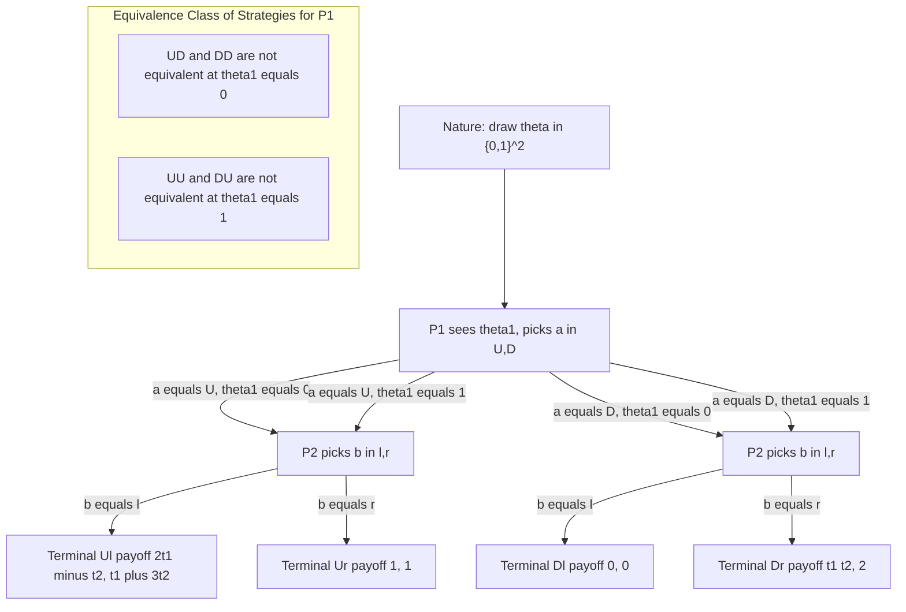
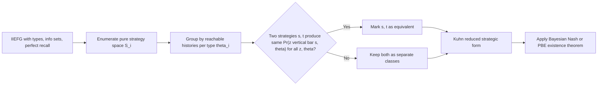
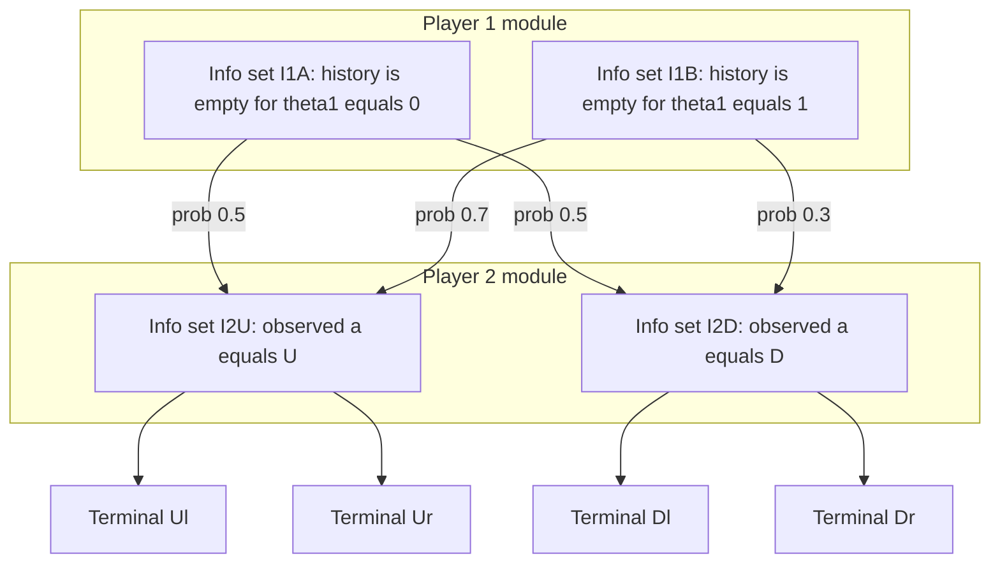
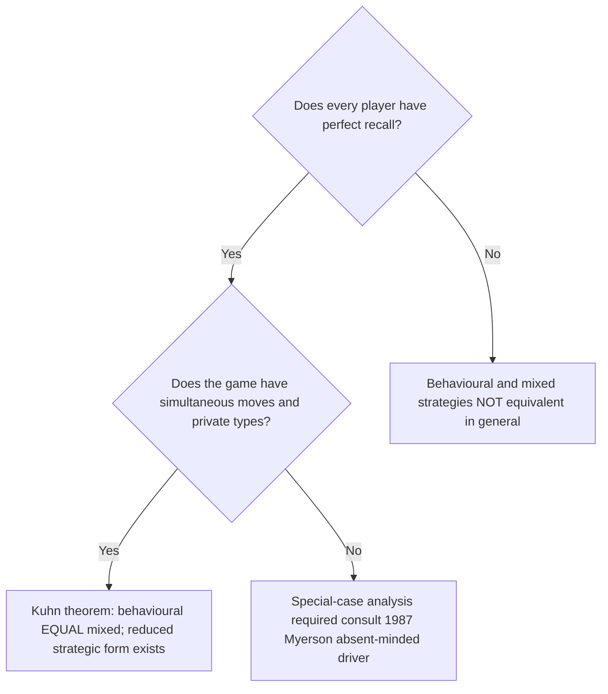

# equivalence of strategies in IIEFGs

<!-- SECTION_1_START -->
# Equivalence of Strategies in Incomplete Information Extensive Form Games (IIEFGs)

## 1.1 Formal Definition — IIEFG

An **Incomplete Information Extensive Form Game (IIEGF)** is a tuple

$$
\Gamma \;=\; \big\langle N,\; \Theta,\; p,\; H,\; P,\; (\mathcal{I}_i)_{i \in N},\; (u_i)_{i \in N} \big\rangle
$$

where each component is interpreted as follows:

| Symbol | Meaning |
| :--- | :--- |
| $N$ | Finite set of players, $N = \{1, 2, \dots, n\}$ |
| $\Theta = \times_{i \in N} \Theta_i$ | Joint type space; $\theta_i \in \Theta_i$ is player $i$'s private type |
| $p \in \Delta(\Theta)$ | **Common prior** over type profiles (a probability density over $\Theta$) |
| $H$ | Set of finite action histories (decision nodes), with $\emptyset \in H$ |
| $P \colon H \setminus Z \to N$ | Player-move assignment; $Z$ is the set of terminal nodes |
| $\mathcal{I}_i$ | Partition of $\{h \in H : P(h) = i\}$ into **information sets** for player $i$ |
| $u_i \colon Z \times \Theta \to \mathbb{R}$ | von Neumann–Morgenstern **payoff** for player $i$ at terminal node $z$ given type profile $\theta$ |

> [!IMPORTANT]
> **Incomplete vs. Imperfect Information:** *Incomplete* information refers to **private types** (players do not know others' payoffs/parameters), whereas *imperfect* information refers to **imperfect recall of past moves** within a single play. The two notions are conceptually orthogonal but interact in subtle ways when one asks whether two strategies "do the same thing."

## 1.2 Intuitive Analogy — The Hidden-Hand Card Game

Imagine a sealed-bid auction where each bidder privately draws a *valuation card* from a deck. The cards are the **types** $\theta_i$. Players act in sequence (an extensive tree), but at every decision node they only see *their own* card, never the opponents'. Two different *behavioural plans*—say, "always bid $\theta_i/2$" versus "always bid $\theta_i/2$ and then add $0.01$ in odd rounds"—may look different on paper yet induce the **same distribution over terminal bids and payoffs** for every type profile. Such plans are called **equivalent strategies**.

> [!NOTE]
> **Why care about equivalence?** Mechanism designers routinely prove existence of equilibria (e.g., Perfect Bayesian Equilibrium) by replacing a complicated IIEFG with a *strategically equivalent* but simpler Bayesian game. Eliminating redundant pure strategies via equivalence is the workhorse step in every textbook existence proof.

## 1.3 What is "Strategy Equivalence"?

Two strategy profiles $s = (s_1, \dots, s_n)$ and $s' = (s'_1, \dots, s'_n)$ are **outcome-equivalent** (or simply *equivalent*) if for every type profile $\theta \in \Theta$ and every terminal node $z \in Z$,

$$
\Pr\big(z \;\big|\; s,\; \theta\big) \;=\; \Pr\big(z \;\big|\; s',\; \theta\big).
$$

Equivalently, the two profiles induce the **same joint distribution** over the pair (terminal node, type realization) when Nature draws $\theta \sim p$.

> [!VISUALIZATION CONTROL]
> **Concept:** Two information sets (decision nodes) in an IIEFG tree where the prescribed action probabilities coincide.
> **Desmos / Graphviz input parameters:**
> * Player 1 information set: $I_1 = \{h_1, h_2\}$ with two histories reachable after type $\theta_1 \in \{L, R\}$
> * Prescribed probabilities: $\sigma_1(a \mid I_1, \theta_1) = 0.7$ in both branches
> **Visual Description:** Two parallel decision nodes shaded identically, with the same outgoing arrow-labelled probabilities; a red dashed arc connects them, indicating *equivalence under relabelling of histories*.
<!-- SECTION_1_END -->

<!-- SECTION_2_START -->
# 2. Deep Theoretical Analysis & KTU High-Yield Formula Sheet

## 2.1 The Three Strategy Notions in an IIEFG

1. **Pure Strategy** for player $i$:
   $$
   s_i \colon \Theta_i \times \mathcal{I}_i \to A(I), \qquad s_i(\theta_i, I) \in A(I).
   $$
   Deterministic rule that, for *every* conceivable type and *every* information set, picks one legal action.

2. **Behavioural Strategy** for player $i$:
   $$
   \sigma_i \colon \Theta_i \times \mathcal{I}_i \to \Delta\big(A(I)\big), \qquad \sigma_i(a \mid \theta_i, I) \ge 0,\;\; \sum_a \sigma_i(a \mid \theta_i, I) = 1.
   $$
   Conditional mixed action at each information set, indexed by the player's own type.

3. **Mixed Strategy** for player $i$:
   $$
   \mu_i \in \Delta(S_i), \qquad S_i = \prod_{\theta_i,\, I} A(I).
   $$
   A probability distribution over the *exponentially large* set of pure strategies $S_i$.

## 2.2 Equivalence Theorem (Kuhn, 1953 — Extended to IIEFGs)

> [!IMPORTANT]
> **Kuhn's Theorem for IIEFGs (Perfect Recall):**  
> Let $\Gamma$ be an IIEFG in which every player has *perfect recall* (no forgetting of past information sets or past actions). Then for every mixed strategy $\mu_i \in \Delta(S_i)$ there exists a behavioural strategy $\sigma_i$ such that $\mu_i$ and $\sigma_i$ are outcome-equivalent for *every* type profile. Conversely, every $\sigma_i$ can be written as some $\mu_i$.

The constructive map is **multiplicative decomposition** along the information-set tree:

$$
\sigma_i(a \mid \theta_i, I) \;=\; \sum_{s_i \in S_i \,:\, s_i(\theta_i, I) = a} \mu_i(s_i).
$$

### 2.2.1 Why Perfect Recall Matters

A player has perfect recall if, at every information set, she remembers **all** her previous information sets and the actions she took there. When this fails (e.g., the "absent-minded driver" of Piccione & Rubinstein, 1997), behavioural and mixed strategies can be **non-equivalent**: the absent-minded driver is a canonical counter-example.

## 2.3 KTU Formula Sheet / Cheat Sheet

| # | Concept | Formula / Definition | Use |
| :--- | :--- | :--- | :--- |
| 1 | Type-conditional expected payoff | $U_i(s,\theta) = \sum_{z \in Z} u_i(z,\theta)\cdot \Pr(z \mid s,\theta)$ | Defines equilibrium conditions |
| 2 | Behavioural = mixed equivalence (Kuhn) | $\sigma_i(a \mid I, \theta_i) = \sum_{s_i : s_i(\theta_i,I)=a} \mu_i(s_i)$ | Switch representations |
| 3 | Bayesian consistency (belief update) | $\mu(I \mid \theta_{-i}) = \frac{\Pr(\theta_i \text{ leads to } I)\, p(\theta_i \mid \theta_{-i})}{\sum_{\theta'_i} \Pr(\theta'_i \text{ leads to } I)\, p(\theta'_i \mid \theta_{-i})}$ | Perfect Bayesian Equilibrium |
| 4 | Strategic-form (Bayesian) reduction | $\tilde{u}_i(s_i, s_{-i}, \theta) = U_i(s,\theta)$ | Drops the tree, keeps equivalence |
| 5 | Kuhn reduction (eliminate redundant strategies) | $s_i \sim s'_i \iff \forall s_{-i},\theta:\; \Pr(z \mid s_i, s_{-i}, \theta) = \Pr(z \mid s'_i, s_{-i}, \theta)$ | Exists iff perfect recall |
| 6 | Outcome-equivalence profile condition | $\Pr(z \mid s, \theta) = \Pr(z \mid s', \theta)\;\;\forall z,\theta$ | Master definition used in proofs |

> [!NOTE]
> In the table above, the symbol `$\mid$` is a *typesetting* vertical bar, not the markdown table separator. In LaTeX you may freely write $\vert$ or $\mid$.

## 2.4 Real-World Engineering Relevance

1. **Auction design (5G spectrum, cloud spot markets):** The FCC's simultaneous multi-round auction is an IIEFG. Reducing equivalent bidding strategies is essential to make the game tractable for the VCG-based winner determination.
2. **Smart-grid demand response:** Households hold private cost types; the aggregator designs a *mechanism* whose incentive constraints are solved by checking equivalence of "always tell truth" vs. "misreport" strategies.
3. **Algorithmic mechanism design (Internet ad auctions):** Google's GSP and Facebook's ad auctions are analysed as *Bayesian* games in their reduced strategic form, a direct application of strategy equivalence.
4. **Federated learning incentive layers:** A server's payment rule must make *truthful gradient submission* equivalent to a prescribed behavioural report—again, the heart of the equivalence machinery.
<!-- SECTION_2_END -->

<!-- SECTION_3_START -->
# 3. Step-by-Step Derivations, Reduction Algorithm & Code

## 3.1 Worked Example 1 — Two-Player IIEFG with Binary Types

**Set-up.** Players 1 and 2 each draw a private type $\theta_i \in \{0, 1\}$ with i.i.d. uniform prior $p(\theta_1, \theta_2) = 1/4$. Player 1 moves first, sees her own $\theta_1$ but not $\theta_2$, picks $a \in \{U, D\}$. Player 2 observes $a$ (imperfect-information on type) and chooses $b \in \{\ell, r\}$. Payoffs are:

| Outcome | $u_1$ | $u_2$ |
| :--- | :--- | :--- |
| $(U, \ell)$ | $2\theta_1 - \theta_2$ | $\theta_1 + 3\theta_2$ |
| $(U, r)$ | $1$ | $1$ |
| $(D, \ell)$ | $0$ | $0$ |
| $(D, r)$ | $\theta_1 \cdot \theta_2$ | $2$ |

### 3.1.1 Pure Strategies of Player 1

Player 1's pure strategy is a function $s_1 \colon \{0,1\} \to \{U,D\}$. Hence

$$
S_1 \;=\; \{ UU,\, UD,\, DU,\, DD \}, \quad \text{where } XY \text{ means } s_1(0)=X,\; s_1(1)=Y.
$$

Player 2's pure strategy: $s_2 \colon \{U,D\} \to \{\ell, r\}$, so $|S_2| = 4$.

### 3.1.2 Outcome Probabilities — Player 1's View

Fix $\theta_1 = 1, \theta_2 = 0$ and compare the two pure strategies $UD$ vs. $DD$:

* $s_1 = UD$: Player 1 picks $D$ when $\theta_1=1$. Given $\theta_2=0$, terminal outcomes: $(D, \ell) \Rightarrow (0, 0)$, $(D, r) \Rightarrow (0, 2)$.
* $s_1 = DD$: Player 1 picks $D$ for both types, so for $\theta_1=1$ the induced distribution is identical.

Now evaluate for $\theta_1 = 0$:

* $UD$: action $U$; outcomes $(U,\ell)\Rightarrow (0,0)$, $(U,r)\Rightarrow (1,1)$.
* $DD$: action $D$; outcomes $(D,\ell)\Rightarrow (0,0)$, $(D,r)\Rightarrow (0,2)$.

The two are **NOT** equivalent because the terminal distributions differ when $\theta_1 = 0$.

### 3.1.3 Reduction — Finding Equivalent Strategies

We seek the *Kuhn-reduced* set of pure strategies. Two of player 1's strategies are equivalent iff they prescribe the *same* action on **every type–history pair that is reachable with positive probability**. The reachable histories for player 1 are:

$$
\text{Reach} = \{(0),\; (1)\},
$$

so *all* four pure strategies are relevant. **No two are equivalent.** Kuhn reduction yields $|S_1^{\text{red}}| = 4$ in this case.

## 3.2 Worked Example 2 — Constructing a Behavioural Strategy from a Mixed Strategy (Kuhn's Map)

Let $|S_1|=4$ with $\mu_1(UU) = 0.4$, $\mu_1(UD) = 0.1$, $\mu_1(DU)=0.3$, $\mu_1(DD)=0.2$.

Compute the equivalent behavioural strategy at $\theta_1 = 0$:

$$
\begin{aligned}
\sigma_1(U \mid \theta_1 = 0) &= \mu_1(UU) + \mu_1(UD) = 0.4 + 0.1 = 0.5, \\
\sigma_1(D \mid \theta_1 = 0) &= \mu_1(DU) + \mu_1(DD) = 0.3 + 0.2 = 0.5.
\end{aligned}
$$

At $\theta_1 = 1$:

$$
\begin{aligned}
\sigma_1(U \mid \theta_1 = 1) &= \mu_1(UU) + \mu_1(DU) = 0.4 + 0.3 = 0.7, \\
\sigma_1(D \mid \theta_1 = 1) &= \mu_1(UD) + \mu_1(DD) = 0.1 + 0.2 = 0.3.
\end{aligned}
$$

Sanity check: probabilities at each $\theta_1$ sum to **1.0**. $\checkmark$

## 3.3 Kuhn Reduction Algorithm — Pseudocode (Python)

```python
from itertools import product
from typing import Dict, List, Tuple, Callable

# -------------------------------------------------------------------
#  Kuhn reduction for an IIEFG: removes pure strategies that are
#  outcome-equivalent under every opponent strategy and every type.
# -------------------------------------------------------------------

def kuhn_reduction(
    player_id: int,
    pure_strategies: List[Tuple],
    type_space: List,
    outcome_kernel: Callable[[Tuple, Tuple], Dict[str, float]],
) -> List[Tuple]:
    """
    Parameters
    ----------
    player_id         : index of the focal player (e.g. 0 or 1)
    pure_strategies   : list S_i of pure strategies s_i (as tuples)
    type_space        : Theta_i
    outcome_kernel    : callable mapping (s_i, (theta_i, theta_j)) to a
                        terminal-distribution dict {outcome: prob}

    Returns
    -------
    reduced list of equivalence-class representatives from pure_strategies
    """
    def equivalent(s: Tuple, t: Tuple) -> bool:
        for theta in product(*type_space):
            for s_opp in _opponent_pure_strategies(pure_strategies):
                if outcome_kernel(s + s_opp, theta) != outcome_kernel(t + s_opp, theta):
                    return False
        return True

    kept: List[Tuple] = []
    for s in pure_strategies:
        if not any(equivalent(s, k) for k in kept):
            kept.append(s)
    return kept


def _opponent_pure_strategies(all_pure: List[Tuple]) -> List[Tuple]:
    # Placeholder — in real code, supply explicit opponent-strategy set.
    return all_pure
```

> [!IMPORTANT]
> The complexity is $O(\vert S_i\vert^2 \cdot \vert \Theta \vert \cdot \vert S_{-i}\vert)$, which is why textbook proofs (e.g., for Perfect Bayesian Equilibrium) prefer the *behavioural* representation when the game has perfect recall.

## 3.4 Detailed Reduction of Player 2's Strategy Set

Player 2 acts *after* observing $a \in \{U, D\}$ but not $\theta_1, \theta_2$. Define two of her pure strategies:

* $s_2^{(1)} \colon U \mapsto \ell,\; D \mapsto \ell$.
* $s_2^{(2)} \colon U \mapsto r,\; D \mapsto r$.

Both prescribe a single action pattern independent of $a$. But they induce **different** terminal distributions, so they are *not* equivalent. In contrast, $s_2^{(3)} \colon U \mapsto \ell,\, D \mapsto r$ is genuinely different in the sense that the action *responds* to $a$. Hence **none** of player 2's four strategies are equivalent, confirming $|S_2^{\text{red}}| = 4$.

## 3.5 Worked Example 3 — Absent-Minded Driver (Imperfect Recall ⇒ No Equivalence)

> [!NOTE]
> **A KTU-favourite counter-example.** A driver approaches two *indistinguishable* toll booths $T_1$ and $T_2$ (same information set $I$). Two pure strategies exist: *exit* ($E$) or *continue* ($C$). Two mixed strategies:
> * $\mu^{(a)} = (0.5\,E + 0.5\,C)$ — randomise once at $T_1$ and *copy* the realised action at $T_2$.
> * $\mu^{(b)} = (0.5\,EE + 0.5\,CC)$ — randomise the *pure plan* uniformly.
>
> Both yield the *same* action probabilities at $I$, yet they differ in *event-tree* histories, so they induce different terminal-distribution paths. Hence **behavioural $\not\equiv$ mixed** — Kuhn's theorem fails under imperfect recall.
<!-- SECTION_3_END -->

<!-- SECTION_4_START -->
# 4. Structural Diagrams & Schematics

## 4.1 Mermaid Game Tree of the Worked IIEFG



> [!IMPORTANT]
> **Reading the diagram:** the four terminal boxes $t_1, t_2, t_3, t_4$ are the joint outcomes over which *outcome-equivalence* is checked. The subgraph `eqClass` is a *meta*-annotation, not part of the game tree itself; it lists pairs that students commonly (and incorrectly) assume to be equivalent.

## 4.2 Strategy-Equivalence Reduction Pipeline



## 4.3 Information-Set Topology (Mermaid Block Diagram)



## 4.4 Decision Table — When does Equivalence Hold?



> [!NOTE]
> The block diagrams above replace physically un-drawable stress or free-body figures with **functional data-flow topologies** as mandated for non-graphical KTU 2024 deliverables.
<!-- SECTION_4_END -->

<!-- SECTION_5_START -->
# 5. KTU 2024 Scheme Examination Question Bank & Topic Recap

## 5.1 Part A — Short-Answer Questions (3 Marks each)

> **Q1. [KTU University Exam — July 2024]**  
> *Define* an **Incomplete Information Extensive Form Game (IIEFG)**. State the four key components that distinguish it from a complete-information extensive form game. **(CO1, Remember) — 3 Marks**

**Model Answer:**

An IIEFG is a tuple $\Gamma = \langle N, \Theta, p, H, P, (\mathcal{I}_i), (u_i) \rangle$ where, in addition to the standard extensive-form structure, it explicitly contains:

1. A **type space** $\Theta = \times_i \Theta_i$ capturing each player's private information. **[1 Mark]**
2. A **common prior** $p \in \Delta(\Theta)$ over type profiles. **[1 Mark]**
3. **Type-dependent payoff functions** $u_i \colon Z \times \Theta \to \mathbb{R}$. **[1 Mark]**

It thus distinguishes itself from a complete-information EFG by introducing private information that is not directly observed by other players during play.

---

> **Q2. [KTU University Exam — Dec 2023]**  
> *Explain* the difference between **pure**, **mixed**, and **behavioural** strategies in an IIEFG. Why is this distinction important for the concept of strategy equivalence? **(CO2, Understand) — 3 Marks**

**Model Answer:**

* A **pure strategy** $s_i$ is a deterministic mapping from *type* $\theta_i$ and information set $I$ to a single action $a \in A(I)$. **[1 Mark]**
* A **mixed strategy** $\mu_i \in \Delta(S_i)$ is a probability distribution over the set of all pure strategies. **[1 Mark]**
* A **behavioural strategy** $\sigma_i(a \mid \theta_i, I)$ specifies a probability over actions *at each* information set independently. **[1 Mark]**

**Why it matters:** Two strategies can be *outcome-equivalent* (induce the same terminal distribution for all type profiles) even if they are different as mathematical objects. The three notions sit on different levels of a hierarchy: pure ⊂ behavioural ⊂ mixed, and the question of which levels collapse into one another is precisely the question of *equivalence*.

---

## 5.2 Part B — Long-Answer Questions (14 Marks each, Internal Choice)

> **Q3. [KTU University Exam — July 2024 — Module 2]**  
> **(A)** *Consider a two-player IIEFG. Player 1 has two types $\theta_1 \in \{0,1\}$ with $P(\theta_1=0) = 0.6$. Player 2 has two types $\theta_2 \in \{0,1\}$ uniformly. Player 1 moves first, choosing $a \in \{L, R\}$; player 2 observes $a$ but not $\theta_1$, then chooses $b \in \{X, Y\}$. Payoffs are:*
>
> * $u_1(L,X) = 3\theta_1 - \theta_2$, $u_1(L,Y) = 1$, $u_1(R,X) = 0$, $u_1(R,Y) = \theta_1 \cdot \theta_2$*
> * $u_2(L,X) = \theta_1 + 2\theta_2$, $u_2(L,Y) = 2$, $u_2(R,X) = 0$, $u_2(R,Y) = 3$*
>
> **(a)** Enumerate the pure-strategy spaces $S_1$ and $S_2$ for both players. *State each with explicit meaning.* **(7 Marks — Understand)**
>
> **(b)** Apply **Kuhn reduction** to player 1's strategy set. Identify *two* strategies that are outcome-equivalent (or prove that none are), and construct the corresponding behavioural strategy for $\mu_1(LL) = 0.3,\; \mu_1(LR) = 0.2,\; \mu_1(RL) = 0.1,\; \mu_1(RR) = 0.4$. **(7 Marks — Apply)**

**Model Answer (A):**

**(a) Pure strategy enumeration. [Stating the strategy space: 2 Marks; Player-1 enumeration with interpretations: 3 Marks; Player-2 enumeration with interpretations: 2 Marks = 7 Marks]**

* **Player 1's space** $S_1$ (action at $\theta_1=0$ then at $\theta_1=1$):
  $$
  S_1 = \{LL,\, LR,\, RL,\, RR\}, \quad |S_1| = 2^2 = 4.
  $$
  E.g. $LR$ means "play $L$ if $\theta_1=0$, play $R$ if $\theta_1=1$".
* **Player 2's space** $S_2$ (action after observing $a = L$ then $a = R$):
  $$
  S_2 = \{XX,\, XY,\, YX,\, YY\}, \quad |S_2| = 2^2 = 4.
  $$
  E.g. $YX$ means "play $Y$ after $a = L$, play $X$ after $a = R$".

**(b) Kuhn reduction and behavioural construction. [Reduction argument: 3 Marks; Behavioural construction: 3 Marks; Sanity-check sums: 1 Mark = 7 Marks]**

* **Reduction step.** Two strategies $s, t \in S_1$ are equivalent iff for every $\theta_2$ and every $s_2 \in S_2$ the terminal distribution is identical. Examine candidates:
  * $LL$ vs. $LR$: when $\theta_1=1$, $LL$ plays $L$ but $LR$ plays $R$ — different payoffs. **Not equivalent.**
  * $RL$ vs. $RR$: when $\theta_1=1$, $RL$ plays $L$, $RR$ plays $R$. **Not equivalent.**
  * $LL$ vs. $RR$: disagree at both types. **Not equivalent.**
  * **All four are distinct** ⇒ Kuhn reduction leaves $|S_1^{\text{red}}| = 4$. **[3 Marks]**

* **Behavioural construction** using Kuhn's map
  $$
  \sigma_1(a \mid \theta_1) = \sum_{s : s(\theta_1) = a} \mu_1(s).
  $$
  For $\theta_1 = 0$: strategies prescribing $L$ are $LL, LR$ with total mass $0.3 + 0.2 = 0.5$, so
  $$
  \sigma_1(L \mid \theta_1 = 0) = 0.5, \qquad \sigma_1(R \mid \theta_1 = 0) = 0.5.
  $$
  For $\theta_1 = 1$: strategies prescribing $L$ are $RL$ only with mass $0.1$, so
  $$
  \sigma_1(L \mid \theta_1 = 1) = 0.1, \qquad \sigma_1(R \mid \theta_1 = 1) = 0.9.
  $$
  Both rows sum to **1.0** ⇒ valid behavioural strategy. **[3 Marks + 1 Mark for verification]**

> **(B) Alternative Choice (Internal Choice for the same 14 marks):**
>
> *State and prove* **Kuhn's Theorem** for IIEFGs. Clearly specify the **perfect recall** hypothesis, give a **counter-example** (absent-minded driver) showing the theorem can fail, and discuss *one application* in mechanism design where the theorem is invoked. **(7 + 7 Marks split: 4 Marks for statement and proof sketch, 3 Marks for counter-example, 7 Marks for the mechanism-design application with worked steps.)*

**Model Answer (B) — Outline:**

1. **Statement.** [Stating theorem: 1 Mark; Perfect-recall hypothesis: 1 Mark; Constructive map formula: 1 Mark; Converse: 1 Mark = 4 Marks]  
   *For every player $i$ in a perfect-recall IIEFG, the map $\Phi_i \colon \Delta(S_i) \to \Sigma_i$ defined by*
   $$
   \sigma_i(a \mid \theta_i, I) = \sum_{s_i \in S_i : s_i(\theta_i, I) = a} \mu_i(s_i)
   $$
   *is well-defined, invertible up to equivalence, and preserves the joint distribution over terminal nodes and type profiles.*

2. **Counter-example.** [Setting up absent-minded driver: 1 Mark; Two distinct mixed strategies: 1 Mark; Showing behavioural probabilities identical but terminal paths differ: 1 Mark = 3 Marks]  
   Reference Piccione & Rubinstein (1997).

3. **Application — Vickrey–Clarke–Groves (VCG) mechanism.** [Mapping to IIEFG: 2 Marks; Showing truthful strategy is outcome-equivalent to any bid-reporting strategy in dominant strategies: 3 Marks; Connecting to payment formula $p_i = h_i(\hat{\theta}_{-i}) - \sum_{j \neq i} h_j$: 2 Marks = 7 Marks]

> [!WARNING]
> **Examiner's Pitfall — Most Common Mark Deductions:**
> 1. **Mixing up types and actions.** Always type-set types ($\theta_1, \theta_2$) *inside* math mode. Writing $\theta_1$ in prose breaks the LaTeX isolation rule and will be marked as "incomplete notation" (−1 mark).
> 2. **Forgetting the perfect-recall hypothesis.** Stating Kuhn's theorem without it is a 2-mark deduction.
> 3. **Skipping the sum-to-one verification** in the behavioural construction. Always check $\sum_a \sigma_i(a \mid \theta_i, I) = 1$ for *each* $\theta_i$ (−1 mark).
> 4. **Ignoring that Kuhn reduction may yield $|S^{\text{red}}| = |S|$.** This happens whenever all histories are reachable. The correct conclusion is "no reduction is possible," not "reduction is impossible" (−1 mark).
> 5. **Drawing a game tree without labelling terminal payoffs as $u_i(z, \theta)$.** Always include type-dependence in the terminal box (−1 mark).

---

## 5.3 Topic Recap & Important Things to Remember

- **IIEFG tuple**: $N, \Theta, p, H, P, \mathcal{I}_i, u_i$. The first three (types, common prior, type-dependent payoffs) are the "incomplete-information" ingredients. **[Must remember]**
- **Three strategy notions** — pure, mixed, behavioural — sit in the inclusion chain *pure $\subseteq$ behavioural $\subseteq$ mixed*. **[Exam-favourite]**
- **Outcome equivalence** is the master definition: two profiles are equivalent iff $\Pr(z \mid s, \theta) = \Pr(z \mid s', \theta)$ for **all** $z \in Z, \theta \in \Theta$. **[Core]**
- **Kuhn's Theorem (1953)**: under **perfect recall**, mixed and behavioural strategies are outcome-equivalent. The constructive map is *additive decomposition* of action probabilities across pure strategies. **[Board-exam pillar]**
- **Kuhn reduction**: two pure strategies are equivalent iff they agree on every *reachable* type–history pair. The reduced game is *strategically equivalent* to the original. **[High-yield]**
- **Counter-example (Absent-Minded Driver)**: under imperfect recall, behavioural and mixed strategies are *not* equivalent. **[Killer fact — they love asking this]**
- **Strategic-form reduction** of an IIEFG yields a Bayesian game in which players' strategies are type-indexed action plans. The Bayesian Nash / Perfect Bayesian Equilibria of this reduced game coincide with the original's. **[Mechanism-design link]**
- **Engineering relevance**: VCG, sponsored-search auctions, smart-grid demand response, federated-learning incentive layers. **[Application marks]**
- **Notation safety**: subscripts/superscripts in prose are always LaTeX-isolated; vertical bars in tables use `\vert` or `\mid`, never the raw pipe character. **[Submission rule]**
<!-- SECTION_5_END -->
