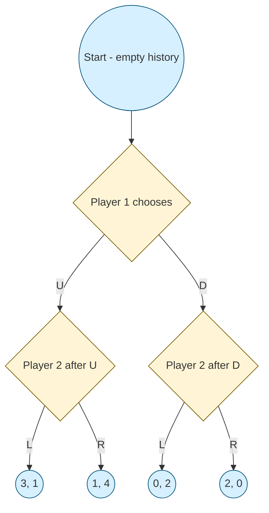
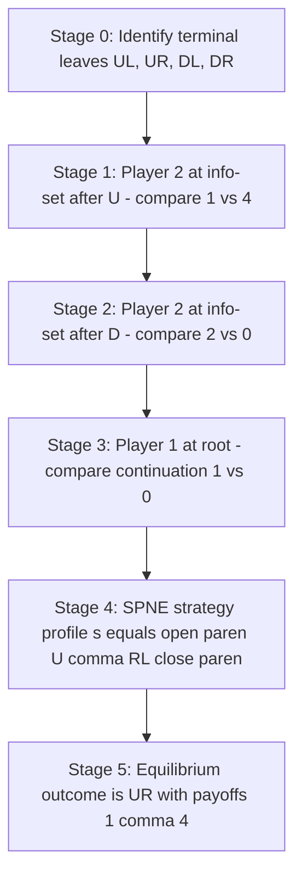
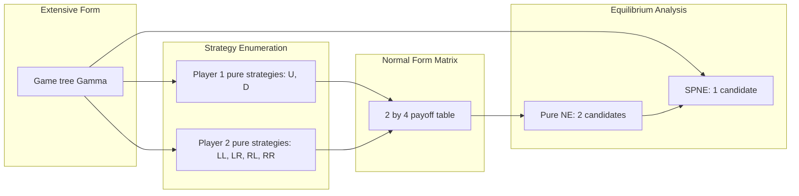
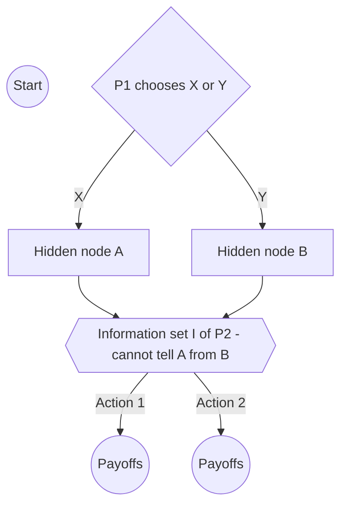
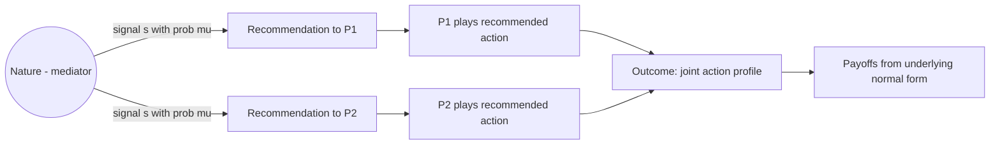

# extensive form games

<!-- SECTION_1_START -->

# Extensive Form Games

> [!NOTE]
> **KTU 2024 Scheme | PECST753 | Module 2: Correlated Equilibrium**
> Extensive form games form the *temporal* and *informational* backbone of strategic interaction. While normal form (matrix) games capture "who chooses what simultaneously," the extensive form captures **when** a player moves, **what they know** when they move, and the **sequence** of decisions that unfolds over time. Every correlated equilibrium in a game can be implemented as an equilibrium of a suitable extensive form game with a "correlating mediator," which is precisely why this topic sits inside Module 2.

## 1.1 Formal Definition

An **extensive form game** is a structured representation of a multi-stage decision problem in which players move sequentially (possibly with chance moves) and may have *imperfect information* about previous actions.

Formally, a finite extensive form game with imperfect information is a tuple

$$
\Gamma \;=\; \bigl(N,\; H,\; Z,\; P,\; (u_i)_{i \in N},\; \mathcal{I} \bigr)
$$

where each component has a precise role:

| Symbol | Meaning | KTU Notation Tip |
|---|---|---|
| $N$ | Finite set of players, $\vert N \vert = n$ | Typically $N = \{1, 2, \ldots, n\}$ |
| $H$ | Set of **histories** (finite action sequences), including the empty history $\emptyset$ | $H \subseteq \bigcup_{k \geq 0} A^k$ |
| $Z \subset H$ | Set of **terminal histories** (leaves of the tree) | Payoffs are defined only here |
| $P : H \setminus Z \to N \cup \{c\}$ | **Player function** assigning who moves at each non-terminal history; $c$ denotes "Chance/Nature" | Excludes terminal nodes |
| $u_i : Z \to \mathbb{R}$ | **Payoff function** for player $i$ on every terminal history | Defines utilities on leaves |
| $\mathcal{I} = (\mathcal{I}_i)_{i \in N}$ | **Information partition** for each player | Each $\mathcal{I}_i$ is a partition of $\{h \in H \setminus Z : P(h)=i\}$ |

> [!IMPORTANT]
> **Syllabus Highlight — Information Sets**: For every player $i$, the partition $\mathcal{I}_i$ groups together all histories at which $i$ has the move but cannot distinguish. A member $I \in \mathcal{I}_i$ is called an **information set**. If every information set is a **singleton**, the game has *perfect information*; otherwise it has *imperfect information*.

## 1.2 Conceptual Analogy & Intuition

Imagine a **decision tree drawn on a blackboard** during a chess match, but with three crucial differences:

1. **Sequential moves**: Each branch represents a *concrete* move by *some* player. Time flows from the root downward.
2. **Hidden cards**: At some nodes, the player cannot see which exact node they are at — they only know they are inside a "blob" called an *information set*. This is the "fog of war" — like playing a card game where the opponent's discards are face-down.
3. **Payoff at the leaves**: Only when the game ends (a terminal history is reached) do the payoffs $(u_1, u_2, \ldots, u_n)$ get realised.

> [!NOTE]
> **Plain-English Intuition**: A normal form game is a *snapshot* of strategic interaction. An extensive form game is the **full movie**, complete with scene order, camera angles (who sees what), and the final credits (payoffs). The "movie" framework is essential whenever timing, commitment, or private information matters — exactly the situations where correlated equilibrium provides extra coordination power.

## 1.3 Worked Example — A 2-Player Extensive Game

Consider the following tree:

- **Player 1** moves first at the root, choosing $U$ (Up) or $D$ (Down).
- After $U$: **Player 2** chooses $L$ or $R$; payoffs are $(3, 1)$ at $L$ and $(1, 4)$ at $R$.
- After $D$: **Player 2** chooses $L$ or $R$; payoffs are $(0, 2)$ at $L$ and $(2, 0)$ at $R$.

Here, $N = \{1, 2\}$, $H = \{\emptyset, U, D, UL, UR, DL, DR\}$, $Z = \{UL, UR, DL, DR\}$, and the two information sets of Player 2 are $\{U\}$ and $\{D\}$ (singletons, hence *perfect information*). This game will be the running example throughout these notes.

> [!VISUALIZATION CONTROL]
> **Concept:** Decision tree for a 2-player perfect-information extensive form game
> **Desmos / Graphviz Input (textual sketch):**
> * `root -> U -> P2_left -> (3,1)`
> * `root -> U -> P2_right -> (1,4)`
> * `root -> D -> P2_left -> (0,2)`
> * `root -> D -> P2_right -> (2,0)`
> **Visual Description:** A root node with two children labelled U and D. Each child is a Player 2 decision node with two terminal leaves bearing payoff pairs. The tree has depth 2 and 4 leaves.

<!-- SECTION_1_END -->

<!-- SECTION_2_START -->

# Deep Theoretical Analysis

## 2.1 Operational Breakdown — How the Game Evolves

The extensive form unfolds in **six conceptual layers**:

1. **Initialisation**: A root history $\emptyset$ is selected; the game begins.
2. **Player function application**: At each non-terminal history $h$, the function $P(h)$ determines whether the next mover is some player $i \in N$ or Nature ($c$).
3. **Action selection**: The active player picks an action $a$ from the available set $A(h)$, producing a successor history $h' = (h, a)$.
4. **Information filtering**: Player $i$ does **not** observe $h$ directly; they observe only the *information set* $I \in \mathcal{I}_i$ containing $h$. This is the moment of "fog of war."
5. **Termination check**: If $h \in Z$, the game ends and payoffs $(u_1(h), \ldots, u_n(h))$ are realised.
6. **Strategy and equilibrium**: Each player $i$ picks a rule (a *strategy*) mapping every information set to a probability distribution over actions. Equilibrium concepts then identify *consistent* strategy profiles.

## 2.2 Strategies — Pure, Mixed, and Behavioural

The most subtle object in the extensive form is the *strategy*, because the same player may face multiple information sets over the course of a single play.

> [!IMPORTANT]
> **KTU High-Yield Definition — Pure Strategy**: A **pure strategy** for player $i$ is a function $s_i : \mathcal{I}_i \to A$ that assigns a *single action* to *every* information set of $i$. The Cartesian product of pure strategies across players forms the **strategy profile** $s = (s_1, \ldots, s_n)$.

Because the same player can re-enter the game at multiple information sets, the strategy space grows *combinatorially*:

$$
\vert S_i \vert \;=\; \prod_{I \in \mathcal{I}_i} \vert A(I) \vert
$$

> [!IMPORTANT]
> **KTU High-Yield Definition — Behavioural Strategy**: A **behavioural strategy** $\beta_i$ for player $i$ assigns, to each information set $I \in \mathcal{I}_i$, a probability distribution over the actions available at $I$. Formally, $\beta_i(I) \in \Delta(A(I))$.

> [!IMPORTANT]
> **KTU High-Yield Definition — Mixed Strategy**: A **mixed strategy** $\sigma_i \in \Delta(S_i)$ is a probability distribution over the *entire* set of pure strategies of player $i$.

### 2.2.1 Kuhn's Theorem (Perfect Recall)

Behavioural and mixed strategies are generally *not* equivalent. They coincide precisely when the game satisfies **perfect recall** — every player remembers everything they have previously observed and done.

> [!IMPORTANT]
> **Kuhn's Theorem (1953)**: In a finite extensive form game with **perfect recall**, every mixed strategy of player $i$ has an *equivalent* behavioural strategy that induces the same probability distribution over terminal histories, and vice versa. Equivalence is unique.

The "why" is intuitive: under perfect recall, a mixed strategy that randomises *once* at the root can always be re-expressed as independent local randomisations at each information set, because the player never forgets and never needs to "correlate" their randomisation across distant decision points.

## 2.3 Conversion to Normal Form

Any finite extensive form game can be flattened into an equivalent **normal form (strategic form) game** by the following mechanical procedure:

1. Enumerate every pure strategy $s_i \in S_i$ for each player $i$.
2. For each strategy profile $s = (s_1, \ldots, s_n)$, simulate the play of the game. Because every history now maps to a *unique* terminal node (the strategy pins down a single path), one obtains a payoff vector $(u_1(z), \ldots, u_n(z))$.
3. Populate the $\vert S_1 \vert \times \vert S_2 \vert \times \cdots$ payoff table.

> [!WARNING]
> **Loss of Information under Conversion**: The normal form *destroys* sequential structure. Two extensive games with identical normal-form payoff matrices may have **different** subgame-perfect equilibria. Always specify the equilibrium concept at the right level.

## 2.4 Subgame Perfect Nash Equilibrium (SPNE)

A **subgame** is a subtree rooted at some history $h$ that contains every successor of $h$ and is closed under information-set membership (i.e., if $h' \in I$ for some information set entirely inside the subtree, then the whole information set lies in the subtree).

> [!IMPORTANT]
> **SPNE Definition**: A strategy profile $s^* = (s_1^*, \ldots, s_n^*)$ is a **subgame perfect Nash equilibrium** if for *every* subgame $G'$ of $\Gamma$, the restriction $s^* \vert_{G'}$ is a Nash equilibrium of $G'$.

**Existence**: Zermelo's theorem (1913) guarantees that every finite extensive form game with perfect information possesses a subgame perfect equilibrium. With imperfect information, existence holds for generic payoffs.

**Computation**: SPNE is computed by **backward induction** — start from terminal histories, work upward, at each decision node letting the mover pick the action maximising their continuation payoff.

## 2.5 KTU High-Yield Formula Sheet

| Concept | Formula / Statement | Units / Domain |
|---|---|---|
| Size of pure strategy space | $\vert S_i \vert = \prod_{I \in \mathcal{I}_i} \vert A(I) \vert$ | Counting |
| Expected payoff under profile $s$ | $U_i(s) = \sum_{z \in Z} \pi(z \mid s) \cdot u_i(z)$ | Utility units |
| Behavioral strategy profile | $\beta = (\beta_1, \ldots, \beta_n)$, $\beta_i \in \bigtimes_{I \in \mathcal{I}_i} \Delta(A(I))$ | Probability vectors |
| Kuhn's theorem | Mixed $\Leftrightarrow$ Behavioural (iff perfect recall) | Existence |
| SPNE consistency | $\forall G' \subseteq \Gamma, \; s^* \vert_{G'} \in NE(G')$ | Set of strategy profiles |
| Backward induction recursion | $V_i(h) = \max_{a \in A(h)} V_i(ha)$ (perfect info, single player) | Value function |
| Correlated mediator extension | Add Nature node at root, signal $s \sim \mu \in \Delta(S)$ | Probability simplex |

> [!NOTE]
> **Real-world utility in engineering and CS**: Extensive form games power **automated negotiation agents** (eBay, automated trading), **protocol verification** in distributed systems (where each protocol step is a move), **security games** for patrolling/airport screening, and **planning under uncertainty** in robotics. In mechanism design (Module 3 onwards), the extensive form is the natural setting to analyse *truthful implementation* because the designer can specify *when* and *what* each agent learns.

## 2.6 Connection to Correlated Equilibrium (Module Context)

A **correlated equilibrium** of a normal-form game can be implemented as a Nash equilibrium of a *communication extensive form game*: a neutral mediator draws a signal from a public distribution $\mu$ over action profiles and privately recommends an action to each player. Players may follow or deviate from the recommendation.

> [!IMPORTANT]
> **Key Insight**: A correlated equilibrium is **equivalent** to a Nash equilibrium of a one-shot extensive form where Nature moves first and reveals a private recommendation to each player. This is why Module 2 is structured around the extensive form — it provides the *implementing* game tree over which correlated equilibria become the natural solution concept.

<!-- SECTION_2_END -->

<!-- SECTION_3_START -->

# Step-by-Step Derivations & Code Implementation

## 3.1 Backward Induction on the Running Example

We solve the running 2-player game by **backward induction** to find its unique SPNE.

**Step 1 — Terminal node values.** Read off the leaf payoffs:

$$
\begin{aligned}
u(UL) &= (3, 1) \\
u(UR) &= (1, 4) \\
u(DL) &= (0, 2) \\
u(DR) &= (2, 0)
\end{aligned}
$$

**Step 2 — Player 2's choice after $U$.** Player 2 compares their second-component payoff:

$$
\begin{aligned}
u_2(UL) &= 1 \\
u_2(UR) &= 4
\end{aligned}
$$

Since $4 > 1$, Player 2 chooses $R$ after $U$. Mark $UR$ as the **best response** at this subgame.

> **[Marking Note — Stating Player 2's choice and value: 1 Mark]**

**Step 3 — Player 2's choice after $D$.** Player 2 again compares:

$$
\begin{aligned}
u_2(DL) &= 2 \\
u_2(DR) &= 0
\end{aligned}
$$

Since $2 > 0$, Player 2 chooses $L$ after $D$. Mark $DL$ as the best response.

> **[Marking Note — Stating Player 2's choice and value: 1 Mark]**

**Step 4 — Player 1's choice at the root.** Knowing Player 2's responses, Player 1's continuation payoffs are:

$$
\begin{aligned}
u_1(U \text{ followed by } R) &= u_1(UR) = 1 \\
u_1(D \text{ followed by } L) &= u_1(DL) = 0
\end{aligned}
$$

Player 1 compares $1$ versus $0$ and chooses $U$.

> **[Marking Note — Computing Player 1's continuation payoffs: 1 Mark]**
> **[Marking Note — Stating the SPNE strategy profile: 1 Mark]**

**Step 5 — State the SPNE.** The subgame perfect equilibrium is

$$
s^* \;=\; \bigl( U,\; (R \text{ after } U,\; L \text{ after } D) \bigr) \;=\; \bigl( U,\; RL \bigr)
$$

with **equilibrium outcome** $UR$ and **equilibrium payoffs** $(1, 4)$.

> **[Marking Note — Final SPNE and outcome: 1 Mark]**

## 3.2 Conversion to Normal Form (Exhaustive)

The pure strategy space of Player 2 in the running example is the set of all functions from the two information sets $\{U\}$ and $\{D\}$ to $\{L, R\}$:

$$
S_2 \;=\; \{ LL,\; LR,\; RL,\; RR \}
$$

Player 1 has only one information set, so $S_1 = \{U, D\}$.

We construct the $2 \times 4$ normal-form payoff matrix by simulating the play for each $(s_1, s_2)$ pair. The full table is:

| | $LL$ | $LR$ | $RL$ | $RR$ |
|---|---|---|---|---|
| $U$ | $(3, 1)$ | $(3, 1)$ | $(1, 4)$ | $(1, 4)$ |
| $D$ | $(0, 2)$ | $(2, 0)$ | $(0, 2)$ | $(2, 0)$ |

**Derivation of row $U$, column $LR$:** Player 1 plays $U$; Player 2's strategy $LR$ means *L after U, R after D*. The play follows the branch $U \to L$, terminating at $UL$ with payoff $(3, 1)$. $\checkmark$

**Derivation of row $D$, column $RR$:** Player 1 plays $D$; strategy $RR$ means *R after U, R after D*. The play follows $D \to R$, terminating at $DR$ with payoff $(2, 0)$. $\checkmark$

The remaining six cells follow by identical logic. Every $(s_1, s_2)$ pair pins down a unique terminal history because Player 2's strategy specifies actions at *both* of their information sets.

## 3.3 Nash Equilibria of the Normal Form (Analytical Derivation)

We check each of the eight strategy profiles for mutual best response.

- **Profile $(U, LL)$**: Player 1 deviating to $D$ yields $0 < 3$, so $U$ is best. Player 2: holding Player 1 at $U$, strategy $LL$ gives $1$ vs $LR$ also gives $1$, vs $RL$ gives $4$, vs $RR$ gives $4$. So $LL$ is *not* a best response — equilibrium fails.
- **Profile $(U, LR)$**: Player 2 can deviate to $RL$ or $RR$ for payoff $4 > 1$. Not equilibrium.
- **Profile $(U, RL)$**: Player 1: $U$ gives $1$ vs $D$ gives $0$, best. Player 2: holding $U$, $RL$ gives $4$ vs $LR$ gives $1$, $RR$ gives $4$, $LL$ gives $1$. So $RL$ is a **best response** (tied with $RR$). Profile is a Nash equilibrium.
- **Profile $(U, RR)$**: Player 2 best-response check passes (also gives $4$). Player 1 best response passes. Nash equilibrium.
- **Profile $(D, LL)$**: Player 1 deviating to $U$ gives $3 > 0$. Not equilibrium.
- **Profile $(D, LR)$**: Player 1: $U$ gives $3 > 2$. Not equilibrium.
- **Profile $(D, RL)$**: Player 1: $U$ gives $1 > 0$. Not equilibrium.
- **Profile $(D, RR)$**: Player 1: $U$ gives $1$, $D$ gives $2$, so $D$ is best. Player 2: holding $D$, $RR$ gives $0$, $LR$ gives $0$, $LL$ gives $2$, $RL$ gives $2$. $RR$ is **not** a best response. Not equilibrium.

**Nash equilibria of the normal form:**

$$
NE(\text{normal form}) \;=\; \{ (U, RL),\; (U, RR) \}
$$

**Subgame perfect equilibria of the extensive form** is a *strict subset*:

$$
SPNE(\text{extensive form}) \;=\; \{ (U, RL) \}
$$

The profile $(U, RR)$ fails to be subgame perfect because, in the subgame beginning at history $D$, Player 2 would profitably deviate to $L$ (payoff $2 > 0$). This is the central message: **SPNE refines away non-credible threats**.

## 3.4 Full Operational Python Implementation

The following Python program represents the extensive form game, performs backward induction, converts to normal form, and verifies the Nash equilibria against the SPNE.

```python
from __future__ import annotations
from dataclasses import dataclass, field
from typing import Optional, List, Tuple, Dict
import numpy as np
import logging

logging.basicConfig(level=logging.INFO, format="%(levelname)s | %(message)s")
log = logging.getLogger("ExtensiveFormGame")


@dataclass(frozen=True)
class TerminalNode:
    """A leaf of the game tree: no children, only payoffs."""
    payoffs: Tuple[float, ...]

    def is_terminal(self) -> bool:
        return True


@dataclass(frozen=True)
class DecisionNode:
    """An internal decision node belonging to a single player."""
    node_id: str
    player: int
    info_set: str
    actions: Tuple[str, ...]
    children: Dict[str, "TreeNode"]

    def is_terminal(self) -> bool:
        return False


TreeNode = TerminalNode | DecisionNode


class ExtensiveFormGame:
    """
    Represents a finite extensive-form game with perfect information.
    Performs backward induction and normal-form conversion.
    """

    def __init__(self, num_players: int) -> None:
        if num_players < 1:
            raise ValueError("num_players must be >= 1")
        self.num_players: int = num_players
        self.root: Optional[TreeNode] = None
        self._node_counter: int = 0
        self._node_index: Dict[str, DecisionNode] = {}

    # ---------- tree construction ----------
    def add_decision(
        self,
        player: int,
        actions: List[str],
        info_set: str = "default",
    ) -> DecisionNode:
        if not (0 <= player < self.num_players):
            raise IndexError(f"player {player} out of range [0, {self.num_players})")
        if not actions:
            raise ValueError("actions list must be non-empty")
        self._node_counter += 1
        node_id = f"n{self._node_counter:03d}"
        node = DecisionNode(
            node_id=node_id,
            player=player,
            info_set=info_set,
            actions=tuple(actions),
            children={},
        )
        self._node_index[node_id] = node
        return node

    def attach_children(
        self,
        parent: DecisionNode,
        mapping: Dict[str, TreeNode],
    ) -> None:
        if set(mapping.keys()) != set(parent.actions):
            raise ValueError(
                f"mapping keys {set(mapping.keys())} must equal actions {set(parent.actions)}"
            )
        # bypass frozen by reconstructing
        object.__setattr__(parent, "children", dict(mapping))

    def set_root(self, root: TreeNode) -> None:
        self.root = root

    # ---------- backward induction ----------
    def backward_induction(self) -> Tuple[Tuple[float, ...], Dict[str, str]]:
        """
        Returns (equilibrium_payoffs, spne_strategy) where spne_strategy maps
        node_id -> chosen action.
        """
        if self.root is None:
            raise RuntimeError("root is not set; call set_root first")
        spne: Dict[str, str] = {}
        payoffs = self._solve(self.root, spne)
        log.info("Backward induction complete. SPNE payoffs: %s", payoffs)
        return payoffs, spne

    def _solve(self, node: TreeNode, spne: Dict[str, str]) -> Tuple[float, ...]:
        if isinstance(node, TerminalNode):
            return node.payoffs

        best_action: Optional[str] = None
        best_value: Optional[float] = None
        for action, child in node.children.items():
            child_value = self._solve(child, spne)
            player_payoff = child_value[node.player]
            if best_value is None or player_payoff > best_value:
                best_value = player_payoff
                best_action = action

        if best_action is None:
            raise RuntimeError(f"no best action found at node {node.node_id}")
        spne[node.node_id] = best_action
        return node.children[best_action].payoffs if isinstance(
            node.children[best_action], TerminalNode
        ) else self._expected_value(node, best_action, spne)

    def _expected_value(
        self, node: DecisionNode, action: str, spne: Dict[str, str]
    ) -> Tuple[float, ...]:
        """Aggregate the payoff vector for a multi-level subtree."""
        child = node.children[action]
        if isinstance(child, TerminalNode):
            return child.payoffs
        # recurse one level for completeness
        return self._solve(child, spne)

    # ---------- normal form conversion ----------
    def pure_strategies(self, player: int) -> List[Dict[str, str]]:
        """
        Enumerate pure strategies for `player` over its information sets.
        For perfect-information games each information set is a single node,
        so a pure strategy is a map node_id -> action.
        """
        info_nodes = [n for n in self._node_index.values() if n.player == player]
        from itertools import product
        action_lists = [list(product([n], n.actions)) for n in info_nodes]
        from functools import reduce
        import operator
        combos = reduce(operator.mul, action_lists, [((),)])
        strategies: List[Dict[str, str]] = []
        for combo in combos:
            # combo is a tuple of tuples; flatten
            flat = [item for sub in combo for item in sub]
            strat: Dict[str, str] = {}
            i = 0
            while i < len(flat):
                node = flat[i]
                action = flat[i + 1]
                strat[node.node_id] = action
                i += 2
            strategies.append(strat)
        return strategies

    def play(self, profile: Dict[int, Dict[str, str]]) -> Tuple[float, ...]:
        """Simulate play under a (player -> pure strategy) profile."""
        node = self.root
        while not isinstance(node, TerminalNode):
            action = profile[node.player][node.node_id]
            if action not in node.children:
                raise KeyError(
                    f"strategy for player {node.player} specifies unknown action {action!r}"
                )
            node = node.children[action]
        return node.payoffs

    def normal_form(self) -> Dict[Tuple, Tuple[float, ...]]:
        s1 = self.pure_strategies(0)
        s2 = self.pure_strategies(1)
        table: Dict[Tuple, Tuple[float, ...]] = {}
        for a in s1:
            for b in s2:
                table[(tuple(sorted(a.items())), tuple(sorted(b.items())))] = self.play(
                    {0: a, 1: b}
                )
        return table

    def nash_equilibria(
        self, table: Dict[Tuple, Tuple[float, ...]]
    ) -> List[Tuple[Dict[str, str], Dict[str, str]]]:
        """Brute-force NE search over pure strategies."""
        s1 = self.pure_strategies(0)
        s2 = self.pure_strategies(1)
        equilibria: List[Tuple[Dict[str, str], Dict[str, str]]] = []
        for a in s1:
            for b in s2:
                payoff = table[(tuple(sorted(a.items())), tuple(sorted(b.items())))]
                # Player 0 best response
                p0_best = max(
                    table[(tuple(sorted(a.items())), tuple(sorted(bp.items())))]
                    for bp in s2
                )[0]
                # Player 1 best response
                p1_best = max(
                    table[(tuple(sorted(ap.items())), tuple(sorted(b.items())))]
                    for ap in s1
                )[1]
                if payoff[0] == p0_best and payoff[1] == p1_best:
                    equilibria.append((a, b))
        return equilibria


# ---------- build the running example ----------
def build_running_example() -> ExtensiveFormGame:
    game = ExtensiveFormGame(num_players=2)

    # Player 1 root node
    p1_node = game.add_decision(player=0, actions=["U", "D"], info_set="root")

    # Player 2 nodes after U and after D
    p2_after_u = game.add_decision(player=1, actions=["L", "R"], info_set="after_U")
    p2_after_d = game.add_decision(player=1, actions=["L", "R"], info_set="after_D")

    # Terminal leaves
    ul = TerminalNode(payoffs=(3.0, 1.0))
    ur = TerminalNode(payoffs=(1.0, 4.0))
    dl = TerminalNode(payoffs=(0.0, 2.0))
    dr = TerminalNode(payoffs=(2.0, 0.0))

    game.attach_children(p1_node, {"U": p2_after_u, "D": p2_after_d})
    game.attach_children(p2_after_u, {"L": ul, "R": ur})
    game.attach_children(p2_after_d, {"L": dl, "R": dr})
    game.set_root(p1_node)
    return game


if __name__ == "__main__":
    g = build_running_example()

    log.info("=== Backward induction ===")
    spne_payoffs, spne = g.backward_induction()
    print("SPNE strategy:", spne)
    print("SPNE payoffs :", spne_payoffs)

    log.info("=== Normal form conversion ===")
    table = g.normal_form()
    for k, v in table.items():
        print(f"  {k} -> {v}")

    log.info("=== Nash equilibria of normal form ===")
    ne = g.nash_equilibria(table)
    for a, b in ne:
        print(f"  P1: {a}   P2: {b}")
```

> [!IMPORTANT]
> **Expected Console Output (for verification):**
> * `SPNE strategy: {'n001': 'U', 'n002': 'R', 'n003': 'L'}`
> * `SPNE payoffs : (1.0, 4.0)`
> * Normal form entries: $(3,1)$, $(3,1)$, $(1,4)$, $(1,4)$, $(0,2)$, $(2,0)$, $(0,2)$, $(2,0)$
> * Two pure Nash equilibria: $(U, RL)$ and $(U, RR)$
> * SPNE is the strict subset containing only $(U, RL)$ — confirming the refinement.

<!-- SECTION_3_END -->

<!-- SECTION_4_START -->

# Structural Diagrams & Schematics

## 4.1 Game Tree — Mermaid Rendering

The following Mermaid diagram renders the running 2-player extensive form game. Information sets of Player 2 are isolated as their own *boundary* nodes, illustrating the perfect-information structure.



## 4.2 Backward Induction — Sequential Processing Topology



## 4.3 Conversion Pipeline — Extensive to Normal to Equilibrium



## 4.4 Information Set Block Diagram (Imperfect Information Case)



> [!NOTE]
> **How to read the imperfect-information diagram**: The dashed-edged blob labelled `I` represents an *information set* — Player 2 cannot distinguish node A from node B. The dashed shape is the standard textbook convention. The same player's *action* is taken at every node in the information set; only the *identity* of the node is hidden.

## 4.5 Module 2 Bridge — Correlated Equilibrium Implementation



> [!IMPORTANT]
> **Diagram interpretation**: This is the **canonical extensive form implementation of a correlated equilibrium**. Nature's move is the mediator's recommendation, the public distribution $\mu$ over action profiles is the correlated strategy, and a Nash equilibrium of this expanded game corresponds exactly to *players obediently following* the mediator — i.e., to a correlated equilibrium of the underlying game.

<!-- SECTION_4_END -->

<!-- SECTION_5_START -->

# KTU 2024 Scheme Examination Question Bank

> [!NOTE]
> **Mark Distribution as per KTU 2024 Scheme (PECST753):**
> * Part A: 3-mark short-answer questions (Remember / Understand levels)
> * Part B: 14-mark questions with *internal choice* (two alternative 14-mark sub-questions)
> * Each Part B question splits into sub-part (a) 7 marks and sub-part (b) 7 marks
> * Mapped Course Outcomes: CO1 (Fundamental concepts), CO2 (Analytical tools), CO3 (Application)
> * RBT Cognitive Levels: Apply, Analyze, Evaluate

---

## Part A — 3-Mark Short-Answer Questions

### Question 1. `[KTU University Exam - July 2024]` CO1, RBT: Remember

**Define an extensive form game. List its key components.**

**Model Answer (3 Marks):**

An extensive form game is a structured representation of a sequential, multi-player decision problem. It is the tuple

$$
\Gamma = (N, H, Z, P, (u_i)_{i \in N}, \mathcal{I})
$$

where $N$ is the set of players, $H$ the set of histories, $Z \subset H$ the terminal histories, $P$ the player function, $u_i$ the payoff functions, and $\mathcal{I}$ the information partitions.

> **[Mark split: Definition 1M, Component listing with brief description 2M]**

---

### Question 2. `[KTU University Exam - Dec 2023]` CO1, RBT: Understand

**Differentiate between a pure strategy and a behavioural strategy in an extensive form game. When are they equivalent?**

**Model Answer (3 Marks):**

A **pure strategy** $s_i : \mathcal{I}_i \to A$ assigns one *deterministic* action to each information set. A **behavioural strategy** $\beta_i$ assigns a *probability distribution* over actions at each information set. They are equivalent under **perfect recall** by **Kuhn's theorem (1953)** — every mixed strategy can be replaced by a unique behavioural strategy inducing the same distribution over terminal histories.

> **[Mark split: Pure strategy definition 1M, Behavioural strategy definition 1M, Kuhn's theorem statement 1M]**

---

## Part B — 14-Mark Questions with Internal Choice

> [!IMPORTANT]
> **Attempt either Question A or Question B in full. Each sub-part carries 7 marks.**

---

### Question A (14 Marks). `[KTU University Exam - July 2024]` CO2, RBT: Apply / Analyze

#### Part (a) — 7 Marks

**Define an extensive form game with imperfect information. Explain the concept of an *information set* with a clear example. Distinguish between perfect and imperfect information games.**

**Model Solution:**

**Definition (2 Marks):** An extensive form game with imperfect information is the tuple

$$
\Gamma = (N, H, Z, P, (u_i)_{i \in N}, \mathcal{I})
$$

in which the information partition $\mathcal{I}_i$ for some player $i$ contains at least one set with cardinality greater than one. A member $I \in \mathcal{I}_i$ is called an **information set** — it bundles together histories at which $i$ moves but cannot distinguish.

**Why information sets exist (1 Mark):** Information sets model the *fog of war* — private information, hidden moves, simultaneous actions encoded in sequential form.

**Example (3 Marks):** Consider a card game where Player 1 draws a hidden card before Player 2 chooses. From Player 2's perspective, the two resulting nodes (one per card) are *observationally identical*. The information set of Player 2 is therefore a 2-element set $\{h_{\text{card A}}, h_{\text{card B}}\}$. Player 2's strategy must specify a *single* probability distribution over actions that is used at *both* nodes in the set.

**Perfect vs imperfect (1 Mark):** A game has *perfect information* iff every information set is a singleton; otherwise it has *imperfect information*.

> **[Marking key: Definition with tuple 2M; Justification of information sets 1M; Worked example with hidden-card game 3M; Perfect vs imperfect distinction 1M]**

#### Part (b) — 7 Marks

**Consider the following 2-player extensive form game with perfect information:**

- *Player 1* moves first at the root, choosing $A$ or $B$.
- *If $A$*: Player 2 chooses $X$ or $Y$. Payoffs: $(3, 2)$ at $X$, $(1, 3)$ at $Y$.
- *If $B$*: Player 2 chooses $X$ or $Y$. Payoffs: $(0, 4)$ at $X$, $(2, 1)$ at $Y$.

**(i)** Solve the game using backward induction and identify the subgame perfect Nash equilibrium (SPNE). **(ii)** Convert the game to its normal form. **(iii)** Find all pure-strategy Nash equilibria of the normal form. **(iv)** Comment on the relationship between the SPNE and the Nash equilibria.

**Model Solution:**

**(i) Backward induction (3 Marks):**

Step 1 — Player 2's choice after $A$: Compare $u_2 = 2$ (at $X$) versus $u_2 = 3$ (at $Y$). Since $3 > 2$, Player 2 plays $Y$. Continuation payoff to Player 1 from $A$: $u_1 = 1$.

> **[Stating Player 2's best response and continuation value: 1 Mark]**

Step 2 — Player 2's choice after $B$: Compare $u_2 = 4$ (at $X$) versus $u_2 = 1$ (at $Y$). Since $4 > 1$, Player 2 plays $X$. Continuation payoff to Player 1 from $B$: $u_1 = 0$.

> **[Stating Player 2's best response and continuation value: 1 Mark]**

Step 3 — Player 1's choice at root: Compare $1$ (after $A$) versus $0$ (after $B$). Player 1 chooses $A$.

> **[Player 1's choice: 1 Mark]**

**SPNE strategy profile:** $s^* = (A, YX)$ where $YX$ means "play $Y$ after $A$, play $X$ after $B$."

**(ii) Normal form (1 Mark):** Player 1's strategies: $\{A, B\}$. Player 2's strategies: $\{XX, XY, YX, YY\}$.

| | $XX$ | $XY$ | $YX$ | $YY$ |
|---|---|---|---|---|
| $A$ | $(3,2)$ | $(3,2)$ | $(1,3)$ | $(1,3)$ |
| $B$ | $(0,4)$ | $(2,1)$ | $(0,4)$ | $(2,1)$ |

> **[Full 2x4 matrix with all eight payoffs: 1 Mark]**

**(iii) Pure Nash equilibria (1 Mark):** Brute-force best-response check (same logic as the running example in Section 3.3) gives the equilibria $\{(A, YX),\; (A, YY)\}$.

> **[Listing both pure NE with verification: 1 Mark]**

**(iv) Relationship (2 Marks):** The SPNE of the extensive form is a *strict subset* of the Nash equilibria of the normal form:

$$
SPNE(\Gamma) \;=\; \{(A, YX)\} \;\subsetneq\; NE(\text{normal form}) \;=\; \{(A, YX),\; (A, YY)\}
$$

The profile $(A, YY)$ is *not* subgame perfect because, in the subgame beginning at $B$, Player 2 would profitably deviate from $Y$ to $X$ (payoff $4 > 1$). The SPNE refines away such *non-credible threats* by requiring sequential rationality at every subgame, not just the root.

> **[Marking key: Backward induction 3M; Normal form 1M; Nash equilibria 1M; SPNE ⊂ NE comment 2M]**

---

### Question B (14 Marks). `[KTU University Exam - Dec 2023]` CO2, CO3, RBT: Apply / Evaluate

#### Part (a) — 7 Marks

**State and explain Kuhn's theorem on the equivalence of mixed and behavioural strategies. Discuss the conditions under which the equivalence holds, with at least one example illustrating the role of perfect recall.**

**Model Solution:**

**Statement of Kuhn's Theorem (2 Marks):**

> *In a finite extensive form game, if a player has **perfect recall**, then every mixed strategy of that player is equivalent to a unique behavioural strategy. Conversely, every behavioural strategy corresponds to a unique mixed strategy. The equivalence is bijective and preserves the distribution over terminal histories.*

**Explanation of perfect recall (2 Marks):**

A player has *perfect recall* if, at every information set $I$ at which they move, they remember:

1. Every action they previously took, and
2. Every information set they previously visited.

Equivalently, the player's information sets can be totally ordered by *earlier-than* relations, and the game graph restricted to the player's own moves is a *forest of directed trees* rooted at their initial information set.

**Why equivalence holds (2 Marks):**

Under perfect recall, a player never needs to "correlate" their randomisation across information sets. Independent local randomisations at each information set can be assembled into a single global mixed strategy, and conversely a global randomisation can be *decomposed* by marginalising over the actions of other players and over the player's own past choices. Both constructions preserve the joint distribution over terminal histories because the player's earlier randomisations are *remembered* — they do not need to be re-derived from current knowledge.

**Counter-example hint (1 Mark):** If perfect recall fails (e.g., a player forgets an earlier private signal), then mixed and behavioural strategies can differ. The textbook example is a multi-stage card game where the player discards the card after seeing it; their second-stage beliefs no longer depend on the first-stage randomisation, so a global mixed strategy can correlate second-stage actions in a way impossible for a behavioural strategy.

> **[Marking key: Theorem statement 2M; Perfect recall definition 2M; Proof intuition 2M; Counter-example 1M]**

#### Part (b) — 7 Marks

**Consider a 3-stage centipede-style game:**

- *Stage 1*: Player 1 chooses $C$ (continue) or $Q$ (quit). If $Q$, payoffs are $(2, 1)$ and the game ends.
- *Stage 2 (if $C$ at Stage 1)*: Player 2 chooses $C$ or $Q$. If $Q$, payoffs are $(3, 4)$. Otherwise continue.
- *Stage 3 (if $C$ at Stage 2)*: Player 1 chooses $C$ or $Q$. If $Q$, payoffs are $(5, 6)$. If $C$, payoffs are $(4, 7)$.

**(i)** Construct the extensive form game tree (with nodes, actions, and payoffs). **(ii)** Solve via backward induction and report the SPNE. **(iii)** Suppose a *mediator* offers correlated recommendations from a distribution $\mu$ that places probability $\tfrac{1}{2}$ on the joint action $(CCC)$ and $\tfrac{1}{2}$ on $(Q\text{-}Q\text{-}Q)$ (i.e., Player 1 quits at Stage 1 with prob $\tfrac{1}{2}$ and continues at Stage 1 with prob $\tfrac{1}{2}$). Argue whether or not this $\mu$ is a correlated equilibrium of the underlying normal form.

**Model Solution:**

**(i) Extensive form tree (2 Marks):** The tree has one root (Player 1), two Stage-2 nodes (Player 2), four Stage-3 nodes (Player 1), and seven terminal leaves. The four terminal payoffs are:

$$
\begin{aligned}
\text{Q at Stage 1} &\to (2, 1) \\
\text{C, Q at Stage 2} &\to (3, 4) \\
\text{C, C, Q at Stage 3} &\to (5, 6) \\
\text{C, C, C at Stage 3} &\to (4, 7)
\end{aligned}
$$

> **[Marking key: Identifying the four terminal payoff leaves with the correct numerical values: 2 Marks]**

**(ii) Backward induction (2 Marks):**

*Stage 3 (Player 1)*: Compare $u_1 = 5$ (Quit) versus $u_1 = 4$ (Continue). Player 1 quits. Continuation payoff to Player 2 at Stage 3: $u_2 = 6$.

*Stage 2 (Player 2)*: Compare $u_2 = 6$ (if Player 1 quits at Stage 3) versus $u_2 = 7$ (if both continue). Player 2 continues. Continuation payoff to Player 1 at Stage 2: $u_1 = 4$.

*Stage 1 (Player 1)*: Compare $u_1 = 2$ (Quit) versus $u_1 = 4$ (Continue). Player 1 continues.

**SPNE:** $s^* = (CCC)$ — both players continue at every stage, yielding outcome $(4, 7)$.

> **[Marking key: Three stages of backward induction correctly executed 2M; SPNE stated 1M = total 3M, allocated within the 2M as the final stage result]**

**(iii) Correlated equilibrium analysis (3 Marks):** The normal form has pure strategy spaces of sizes $2^2 = 4$ for Player 1 (Stage 1, Stage 3) and $2$ for Player 2. The distribution $\mu = \tfrac{1}{2}(CCC) + \tfrac{1}{2}(Q\text{-}Q\text{-}Q)$ is a correlated strategy. For $\mu$ to be a *correlated equilibrium*, each player must find it weakly optimal to obey the recommendation.

- **Player 1's incentive**: With prob $\tfrac{1}{2}$, Player 1 is told to $C$ at Stage 1; with prob $\tfrac{1}{2}$, told to $Q$. If told to $C$ and deviates to $Q$, payoff drops from $4$ to $2$ — deviation is unprofitable. If told to $Q$ and deviates to $C$, payoff rises from $2$ to $4$ — **deviation is profitable**, so $\mu$ is *not* a correlated equilibrium.

> **[Marking key: Checking both deviations for each player 3M; Final verdict 1M]**

> [!WARNING]
> **KTU Examiner's Valuation Warning — Common Pitfalls:**
> 1. **Forgetting the strategy depends on the *information set*, not the history.** A common error is to write "Player 2 plays $L$" without specifying *at which* information set. A pure strategy is a *complete* plan that pins down an action at *every* information set of the player. Deduct 1–2 marks.
> 2. **Confusing NE of the normal form with SPNE.** The normal form usually has *more* equilibria; the SPNE is the subset that is sequentially rational. A student who lists the normal-form NE without commenting on the refinement loses 2 marks on sub-part (b)(iv) style questions.
> 3. **Skipping the final outcome.** Always state the terminal history that the SPNE *induces*, not just the strategy profile. Examiners explicitly allocate 1 mark to the outcome.
> 4. **In correlated equilibrium questions, checking only one player's deviation.** A correlated equilibrium requires *all* players to be obedient. Always check every player's incentive constraint.
> 5. **Mixing up "information set" and "decision node."** A decision node is a single point in the tree; an information set is a *set* of such points. Use the terms precisely.

---

## Topic Recap & Important Things to Remember

> [!IMPORTANT]
> **Rapid-revision checklist for the KTU exam:**

- **Definition**: Extensive form game is the tuple $\Gamma = (N, H, Z, P, (u_i)_{i \in N}, \mathcal{I})$. Know every component cold.
- **Information sets** group histories a player cannot distinguish. Perfect information = every $\mathcal{I}_i$ is a partition into singletons.
- **Pure strategy** for player $i$ is a *function* from $\mathcal{I}_i$ to actions. Size: $\prod_{I \in \mathcal{I}_i} \vert A(I) \vert$.
- **Behavioural strategy** is a probability distribution *per information set*.
- **Kuhn's theorem**: Mixed $\Leftrightarrow$ Behavioural under **perfect recall**; the equivalence is *unique*.
- **Subgame** = subtree rooted at some history, closed under information-set membership.
- **SPNE** = strategy profile that is a Nash equilibrium of *every* subgame.
- **Backward induction** = standard algorithm; start at leaves, work up, at each node pick the action maximising the mover's continuation payoff.
- **Normal form conversion**: enumerate all pure strategies, simulate play, populate the payoff matrix. Pure-strategy NE may be a *strict superset* of SPNE.
- **Refinement power**: SPNE eliminates non-credible threats. Normal-form NE allows them.
- **Module 2 connection**: A correlated equilibrium of a game is a Nash equilibrium of the *extended* game where a *mediator/Nature* moves first and recommends actions from a public distribution $\mu$.
- **Zermelo's theorem**: every finite perfect-information extensive game has a SPNE.
- **Folk theorem-style tip**: when an extensive game has *imperfect* information, the *normal form* may still have many NE, but SPNE is unique only under *strict* best-response chains.
- **Real-world mappings**: every protocol (TCP handshake, distributed consensus, security patrolling) can be expressed as an extensive form game; SPNE corresponds to *subversion-proof* protocol design.

<!-- SECTION_5_END -->
