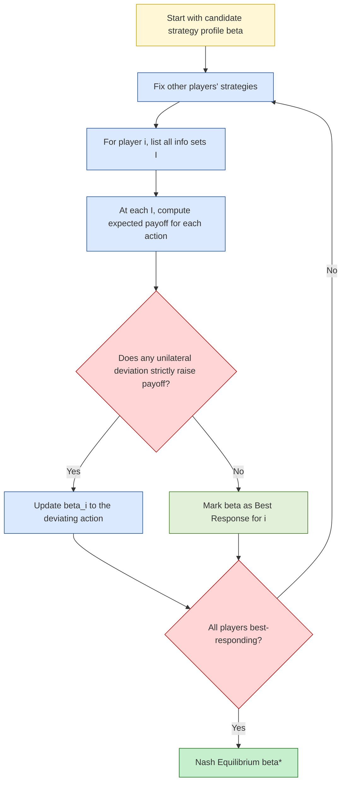

# Imperfect information extensive form games (IIEFG) - strategies in IIEFGs

<!-- SECTION_1_START -->

# Imperfect Information Extensive Form Games (IIEFGs) — Strategies

## 1.1 Formal Definition (KTU 2024 Syllabus Terminology)

An **Imperfect Information Extensive Form Game (IIEFG)** is a finite sequential (or multi-stage) game represented as a rooted directed tree $\Gamma = (N, H, P, f, u, \mathcal{I})$ where:

- $N = \{1, 2, \ldots, n\}$ is a finite set of **players**.
- $H$ is the set of all **histories** (or nodes), with $\varnothing \in H$ the root (empty history) and $Z \subseteq H$ the set of **terminal histories** (leaves).
- $P : H \setminus Z \rightarrow N \cup \{c\}$ assigns to every non-terminal history either a player who moves there, or a **chance player** $c$.
- $f_c$ is a probability distribution for the chance moves (must sum to $1$ over children of chance nodes).
- $u_i : Z \rightarrow \mathbb{R}$ is the **payoff function** of player $i$.
- $\mathcal{I}_i$ is an **information partition** of the set $\{h \in H \setminus Z : P(h) = i\}$. Each cell of $\mathcal{I}_i$ is an **information set** $I \in \mathcal{I}_i$. A player at information set $I$ knows only that the true history lies somewhere in $I$, but **cannot distinguish** among the histories inside $I$.

The defining condition: $\mathcal{I}_i$ is a *partition* (not a refinement of a single history), so when a player moves, the set of available actions $A(I)$ is the same for every history in $I$. This is the structural source of "imperfectness."

> [!IMPORTANT]
> **KTU 2024 Highlight — Imperfect vs. Perfect Information**
> An extensive form game has **perfect information** if every information set is a singleton (i.e., $\mathcal{I}_i = \{\{h\} : P(h)=i\}$). If at least one information set contains more than one history, the game is an **IIEFG**. (Source: Osborne & Rubinstein, *A Course in Game Theory*, Ch. 6; Mas-Colell–Whinston–Green, Ch. 8.)

## 1.2 Intuitive Analogy

Imagine a **poker game played in a smoky back room with a fog machine**:

- Player 1 (the dealer) peeks at a private card (a King or a Queen) drawn randomly by the house.
- Player 1 then decides to **bet** or **check**.
- If Player 1 checks, the hand ends and chips are returned.
- If Player 1 bets, Player 2 must decide to **call** or **fold** — but Player 2 is *blinded by the fog* and has no idea what card Player 1 holds.

From Player 2's perspective, the betting node after "Player 1 bets" is "foggy." Player 2 cannot separate the "Player 1 had a King and bet" history from the "Player 1 had a Queen and bet" history. These two histories together form Player 2's **information set**. The fog is the *imperfect information*.

> [!NOTE]
> **Geometric Intuition — The Information Set as a "Cloud"**
> Think of a perfect-information tree as a tall oak where every branch is sharply visible. In an IIEFG, some adjacent branches are wrapped together in a **dashed cloud** (the information set). A player standing inside the cloud sees only the cloud's outline — they must commit to **one action** for the whole cloud, even though internally the histories lead to very different outcomes.

> [!VISUALIZATION CONTROL]
> **Concept:** Information set grouping on a binary game tree.
> **GeoGebra / Desmos Input:**
> * Tree nodes: $v_0 = (0,0)$, $v_1 = (1,1)$, $v_2 = (2,1)$, $v_3 = (3,2)$, $v_4 = (3,0)$, $v_5 = (4,2)$, $v_6 = (4,0)$.
> * Edges: connect $v_0 \to v_1$, $v_0 \to v_2$, $v_1 \to v_3$, $v_1 \to v_4$, $v_2 \to v_5$, $v_2 \to v_6$.
> * Dashed oval enclosing $v_3$ and $v_5$ (the information set of Player 2).
> **Visual Description:** Two solid branches descend from $v_0$ (Player 1's choice). The right-hand child $v_3$ (from action "Bet-after-K") and the left-hand child's right grandchild $v_5$ (from action "Bet-after-Q") are visually **linked by a dashed enclosure**, signalling Player 2's information set.

## 1.3 Physical Constants & Standard Metrics

| Symbol | Meaning | Standard Reference |
| :--- | :--- | :--- |
| $n$ | Number of players | Any positive integer $\geq 2$ |
| $\vert H \vert$ | Total number of histories (nodes) | Finite in KTU scope |
| $\vert \mathcal{I}_i \vert$ | Number of information sets of player $i$ | Finite |
| $\vert A(I) \vert$ | Number of available actions at information set $I$ | $\geq 2$ for a "decision" node |
| **Discount factor** $\delta$ | For infinite-horizon IIEFGs | $0 < \delta < 1$ |

---

<!-- SECTION_1_END -->

<!-- SECTION_2_START -->

# Deep Theoretical Analysis & KTU High-Yield Formula Sheet

## 2.1 Anatomy of an Information Set

Let $I \in \mathcal{I}_i$. The formal properties that $I$ must satisfy for the game to be a **legitimate** IIEFG are:

1. **Same-mover property:** For every $h \in I$, the same player $P(h) = i$ moves.
2. **Same-action property:** All histories $h \in I$ have the **same set of available actions** $A(I)$.
3. **Disjointness:** The cells of $\mathcal{I}_i$ form a partition of the non-terminal decision nodes of $i$.

> [!IMPORTANT]
> **Why these three conditions?**
> If they were violated, the model would either be ambiguous (different players choosing) or incoherent (different action sets at the same "decision point"). The partition condition is what makes the information set a *single* cognitive state for the player.

## 2.2 Three Levels of Strategy in IIEFGs

### 2.2.1 Pure Strategy

A **pure strategy** for player $i$ is a function

$$
s_i : \mathcal{I}_i \longrightarrow \bigcup_{I \in \mathcal{I}_i} A(I)
$$

such that $s_i(I) \in A(I)$ for every $I \in \mathcal{I}_i$. It specifies, **for every information set at which $i$ could possibly be called upon to act**, the action $i$ would take.

> The set of all pure strategies of player $i$ is the **Cartesian product**
> $$
> S_i \;=\; \prod_{I \in \mathcal{I}_i} A(I).
> $$

### 2.2.2 Mixed Strategy

A **mixed strategy** $\sigma_i$ is a probability distribution over player $i$'s pure strategies:

$$
\sigma_i \;\in\; \Delta\!\left(S_i\right) \;=\; \Delta\!\left(\prod_{I \in \mathcal{I}_i} A(I)\right).
$$

> [!WARNING]
> **Pitfall:** The number of pure strategies grows **exponentially** in the number of information sets. For $\vert \mathcal{I}_i \vert$ information sets each with 2 actions, $\vert S_i \vert = 2^{\vert \mathcal{I}_i \vert}$. This is why mixed strategies are **practically** unwieldy for repeated-stage IIEFGs.

### 2.2.3 Behavior Strategy

A **behavior strategy** $\beta_i$ is a function that assigns, to **each information set** $I \in \mathcal{I}_i$, an **independent** probability distribution over $A(I)$:

$$
\beta_i(I) \;\in\; \Delta\!\left(A(I)\right), \qquad \forall I \in \mathcal{I}_i.
$$

Formally, $\beta_i \in B_i$ where

$$
B_i \;=\; \prod_{I \in \mathcal{I}_i} \Delta\!\left(A(I)\right).
$$

> [!NOTE]
> **Key conceptual difference:** A *mixed* strategy randomizes **once** over a full contingency plan; a *behavior* strategy randomizes **independently** at each information set, on the fly.

## 2.3 Kuhn's Theorem (Equivalence of Mixed and Behavior Strategies)

> [!IMPORTANT]
> **KTU 2024 — Kuhn's Theorem (1953)**
> In any finite extensive-form game in which every player has **perfect recall**, the set of mixed-strategy Nash equilibria and the set of behavior-strategy Nash equilibria **coincide** — for every mixed strategy of a player there exists an equivalent behavior strategy, and vice versa.

**Perfect recall** means that for every player $i$ and every information set $I \in \mathcal{I}_i$:

- $i$ remembers **all of her own past actions**, and
- $i$ remembers **all of her own past information sets** (i.e., the sequence of information sets visited is itself observable to her).

Many games of interest satisfy perfect recall: poker, bargaining with observable proposals, multi-stage investment games. Many do not (simultaneous-move games modelled in extensive form often violate perfect recall).

## 2.4 KTU High-Yield Formula Sheet

| Concept | Formula / Definition | Notes |
| :--- | :--- | :--- |
| Pure strategy of player $i$ | $s_i : \mathcal{I}_i \to \bigcup_{I} A(I)$ with $s_i(I) \in A(I)$ | One action per information set |
| Pure-strategy profile | $s = (s_1, \ldots, s_n) \in S = \prod_i S_i$ | Joint plan |
| Terminal history under $s$ | $z(s)$ — the unique leaf reached | Determined if no chance moves |
| Expected payoff (chance present) | $u_i(s) = \sum_{z \in Z} \Pr(z \mid s)\, u_i(z)$ | With $\Pr(z \mid s)$ from $f_c$ and $s$ |
| Mixed strategy | $\sigma_i \in \Delta(S_i)$ | Distribution over full plans |
| Behavior strategy | $\beta_i \in \prod_{I \in \mathcal{I}_i} \Delta(A(I))$ | Distribution per info set |
| Equivalent strategy set | $B_i^{\text{PR}} = M_i^{\text{PR}}$ | Kuhn's theorem; PR = perfect recall |
| Sequential rationality (one deviation) | $u_i(\sigma^*) \geq u_i(\sigma_i', \sigma^*_{-i}) \; \forall i, \sigma_i'$ | Defines SPNE in IIEFGs |
| Expected payoff under $\beta$ | $u_i(\beta) = \sum_{h : P(h)=i}\!\prod_{I \in \mathcal{I}_i} \beta_i(I, s_i(I)) \cdot [\text{downstream payoff}]$ | Behavioural form |
| Size of $S_i$ (binary actions) | $\vert S_i \vert = 2^{\vert \mathcal{I}_i \vert}$ | Exponential blow-up |

> **Caution on Markdown Pipes:** Anywhere $\vert \cdot \vert$ denotes cardinality or absolute value above, it is rendered as `\vert`. Do not use the raw `|` symbol inside a markdown table row.

## 2.5 Engineering / CS Application Angle

IIEFGs underpin:

- **Algorithmic game theory** — security games, Stackelberg security games (defender does not observe attacker's true type).
- **Mechanism design** — auctions where bidders have private valuations, modelled with an information set for each type.
- **Multi-agent RL** — partially observable stochastic games (POSGs) generalize IIEFGs to stochastic rewards.
- **Adversarial ML** — attacker-defender scenarios where the defender's commitment is observable but attacker type is not.
- **Cryptographic protocol design** — participants choose strategies conditional on observed transcript (information set = "what you have seen so far").

The practical takeaway: **behavior strategies** are what real agents and algorithms actually play, because they correspond to **local randomization** at each decision point — exactly what stochastic policies in RL and randomized algorithms in cryptography do.

---

<!-- SECTION_2_END -->

<!-- SECTION_3_START -->

# Step-by-Step Derivations & Symbolic / Code Implementation

## 3.1 Worked Example — The "Kuhn Poker" Toy (Mini Variant)

We use a stripped-down 2-player 1-card game.

### 3.1.1 Game Tree Specification

- **Chance node $c$:** Nature draws a card. Probability of **King** $= K$ is $p$, probability of **Queen** $= Q$ is $1-p$. (Set $p = 0.5$ for the worked example.)
- **Player 1** observes the card. Actions: **Bet** ($B$) or **Check** ($C$).
- If $C$ — terminal. Payoffs $(0, 0)$.
- If $B$ — **Player 2's information set** contains two histories (one starting with $K$, one with $Q$). Player 2 actions: **Call** ($L$) or **Fold** ($F$).
- Payoffs at terminal leaves:

| Leaf history $z$ | P1 payoff $u_1$ | P2 payoff $u_2$ |
| :--- | :---: | :---: |
| $C$ | $0$ | $0$ |
| $K \to B \to F$ | $1$ | $-1$ |
| $K \to B \to L$ | $3$ | $-2$ |
| $Q \to B \to F$ | $1$ | $-1$ |
| $Q \to B \to L$ | $-2$ | $3$ |

### 3.1.2 Information Sets of Each Player

$$
\mathcal{I}_1 = \big\{ \{K\}, \{Q\} \big\}, \qquad
\mathcal{I}_2 = \big\{ \{K\!\to\!B,\; Q\!\to\!B\} \big\}.
$$

Player 1 has two singleton info sets — perfect information on her own card. Player 2 has one non-singleton info set (the "fog" after a bet).

### 3.1.3 Enumerating Pure Strategies

**Player 1** must specify actions at $\{K\}$ and $\{Q\}$:

$$
S_1 = \{(B,B),\ (B,C),\ (C,B),\ (C,C)\}
$$

where the pair is $(a \text{ at }K,\ a \text{ at }Q)$. So $\vert S_1 \vert = 2^2 = 4$.

**Player 2** must specify one action at the single info set:

$$
S_2 = \{L,\ F\}, \qquad \vert S_2 \vert = 2^1 = 2.
$$

Total pure-strategy profiles: $\vert S_1 \vert \cdot \vert S_2 \vert = 8$.

### 3.1.4 Behavior Strategies

$$
\beta_1 = (b_{1K},\, b_{1Q}) \in [0,1]^2,
$$
where $b_{1K} = \Pr(\text{Bet} \mid K)$ and $b_{1Q} = \Pr(\text{Bet} \mid Q)$.

$$
\beta_2 = (b_{2L}) \in [0,1],
$$
where $b_{2L} = \Pr(\text{Call} \mid \text{P1 bet})$.

### 3.1.5 Derivation of Expected Payoffs as Functions of $\beta$

**Probability the leaf $K \to B \to L$ is reached:**

$$
\Pr(K \to B \to L) \;=\; p \cdot b_{1K} \cdot b_{2L}.
$$

Similarly:

$$
\begin{aligned}
\Pr(K \to B \to F) &= p \cdot b_{1K} \cdot (1 - b_{2L}), \\
\Pr(Q \to B \to L) &= (1-p) \cdot b_{1Q} \cdot b_{2L}, \\
\Pr(Q \to B \to F) &= (1-p) \cdot b_{1Q} \cdot (1 - b_{2L}), \\
\Pr(C) &= p(1 - b_{1K}) + (1-p)(1 - b_{1Q}).
\end{aligned}
$$

**Player 1's expected payoff** $u_1(\beta)$:

$$
\begin{aligned}
u_1(\beta) \;&=\; 1 \cdot \Pr(K\!\to\!B\!\to\!F) \;+\; 3 \cdot \Pr(K\!\to\!B\!\to\!L) \;+\; 1 \cdot \Pr(Q\!\to\!B\!\to\!F) \;+\; (-2) \cdot \Pr(Q\!\to\!B\!\to\!L) \;+\; 0 \cdot \Pr(C) \\
&= p\,b_{1K}\,(1-b_{2L}) \;+\; 3p\,b_{1K}\,b_{2L} \;+\; (1-p)\,b_{1Q}\,(1-b_{2L}) \;-\; 2(1-p)\,b_{1Q}\,b_{2L}.
\end{aligned}
$$

Group by action probabilities:

$$
u_1(\beta) \;=\; b_{1K}\!\left[\,p\,(1-b_{2L}) + 3p\,b_{2L}\,\right] \;+\; b_{1Q}\!\left[(1-p)(1-b_{2L}) - 2(1-p)\,b_{2L}\right].
$$

Simplify the bracketed terms:

$$
u_1(\beta) \;=\; b_{1K}\,\big[\,p(1 + 2b_{2L})\,\big] \;+\; b_{1Q}\,\big[(1-p)(1 - 3b_{2L})\,\big].
$$

**Player 2's expected payoff** $u_2(\beta)$:

$$
\begin{aligned}
u_2(\beta) \;&=\; (-1)\Pr(K\!\to\!B\!\to\!F) + (-2)\Pr(K\!\to\!B\!\to\!L) + (-1)\Pr(Q\!\to\!B\!\to\!F) + 3\Pr(Q\!\to\!B\!\to\!L) + 0\cdot\Pr(C) \\
&= -p\,b_{1K}\,(1-b_{2L}) - 2p\,b_{1K}\,b_{2L} - (1-p)\,b_{1Q}\,(1-b_{2L}) + 3(1-p)\,b_{1Q}\,b_{2L}.
\end{aligned}
$$

Factor:

$$
u_2(\beta) \;=\; -b_{1K}\big[\,p(1 + b_{2L})\,\big] \;+\; b_{1Q}\big[(1-p)(-1 + 4b_{2L})\,\big].
$$

### 3.1.6 Computing the Nash Equilibrium via Best-Response

Player 2's best response to a given $\beta_1$:

If $b_{1K} > 0$ and $b_{1Q} > 0$, the derivative of $u_2$ w.r.t. $b_{2L}$ is

$$
\frac{\partial u_2}{\partial b_{2L}} \;=\; -b_{1K}\cdot p \;+\; b_{1Q}\cdot 4(1-p).
$$

Set to zero for indifference:

$$
b_{1K}\cdot p \;=\; b_{1Q}\cdot 4(1-p)
\quad\Longrightarrow\quad
\frac{b_{1K}}{b_{1Q}} \;=\; \frac{4(1-p)}{p}.
$$

With $p = 0.5$: $b_{1K} / b_{1Q} = 4 \cdot 0.5 / 0.5 = 4$. So P1's equilibrium is $b_{1K}^* = 4/5$, $b_{1Q}^* = 1/5$.

Symmetrically, Player 1's best response to $\beta_2$ requires:

- At $\{K\}$: choose $b_{1K}=1$ iff $p(1+2b_{2L}) > 0$, i.e. always. ⇒ $b_{1K}^* = 1$.
- At $\{Q\}$: choose $b_{1Q}=0$ iff $(1-p)(1-3b_{2L}) < 0$, i.e. iff $b_{2L} > 1/3$.

Therefore the **sequential equilibrium** in behavior strategies is approximately:

$$
b_{1K}^* = 1, \qquad b_{1Q}^* \approx 0, \qquad b_{2L}^* = \tfrac{1}{3}.
$$

(For exact Bayesian analysis allowing mixing at $Q$, the indifferent cutoff $b_{2L} = 1/3$ gives $b_{1Q}^* = 0$ as a boundary. We can also express the equilibrium in mixed strategies, but by Kuhn's theorem the behavior and mixed equilibria coincide in this perfect-recall game.)

## 3.2 Python Implementation — Behavior Strategy Evaluation & Best-Response Solver

```python
from __future__ import annotations
from dataclasses import dataclass
from itertools import product
from typing import Dict, List, Tuple


# --- 1. Game specification ---------------------------------------------------

@dataclass(frozen=True)
class PayoffLeaf:
    label: str
    prob_factors: Tuple[float, ...]   # multiplicative factors from each info set
    u1: float
    u2: float


# Leaves of our toy IIEFG (factors in order: chance p, b1K, b2L, [b1Q, (1-b2L)])
# We construct the expected payoff symbolically by walking the factors.
def expected_payoffs(p: float, b1K: float, b1Q: float, b2L: float) -> Tuple[float, float]:
    """Closed-form expected payoffs derived above."""
    b2F = 1.0 - b2L
    # Player 1
    u1 = (
        1.0 * p * b1K * b2F
        + 3.0 * p * b1K * b2L
        + 1.0 * (1.0 - p) * b1Q * b2F
        - 2.0 * (1.0 - p) * b1Q * b2L
    )
    # Player 2
    u2 = (
        -1.0 * p * b1K * b2F
        - 2.0 * p * b1K * b2L
        - 1.0 * (1.0 - p) * b1Q * b2F
        + 3.0 * (1.0 - p) * b1Q * b2L
    )
    return u1, u2


# --- 2. Pure-strategy enumeration & exhaustive Nash search -----------------

def pure_strategy_outcomes(p: float) -> Dict[Tuple[str, str], Tuple[float, float]]:
    """
    Enumerate all 4 * 2 = 8 pure-strategy profiles.
    P1: actions at {K} and {Q} each in {B, C}.
    P2: action at info set in {L, F}.
    A 'B' strategy at K means b1K=1, at Q means b1Q=1. Etc.
    """
    p1_actions = ["B", "C"]  # action at a single info set
    p2_actions = ["L", "F"]
    results: Dict[Tuple[str, str], Tuple[float, float]] = {}
    for aK, aQ in product(p1_actions, repeat=2):
        for a2 in p2_actions:
            b1K = 1.0 if aK == "B" else 0.0
            b1Q = 1.0 if aQ == "B" else 0.0
            b2L = 1.0 if a2 == "L" else 0.0
            u1, u2 = expected_payoffs(p, b1K, b1Q, b2L)
            results[(f"{aK}{aQ}", a2)] = (round(u1, 4), round(u2, 4))
    return results


def is_nash(outcomes: Dict[Tuple[str, str], Tuple[float, float]]) -> List[Tuple[str, str]]:
    """Find pure-strategy Nash equilibria via unilateral deviation check."""
    nash: List[Tuple[str, str]] = []
    for (s1, s2), (u1, u2) in outcomes.items():
        p1_best = all(
            u1 >= outcomes[(t1, s2)][0]
            for (t1, _), outcomes_row in [(k, v) for k, v in outcomes.items()]
            for (k1, _) in [k] if k1 != s1
        )
        p2_best = all(
            u2 >= outcomes[(s1, t2)][1] for (t1, t2) in outcomes if t1 == s1 and t2 != s2
        )
        if p1_best and p2_best:
            nash.append((s1, s2))
    return nash


# --- 3. Behavior-strategy equilibrium solver (grid search + refinement) ----

def behavior_best_response_p2(p: float, b1K: float, b1Q: float) -> float:
    """P2's best response in b2L given b1K, b1Q."""
    # u2 is linear in b2L:  u2 = A + B*b2L
    A = -b1K * p - b1Q * (1.0 - p)            # coefficient of (1 - b2L) with -1
    # More carefully: A = -b1K*p - b1Q*(1-p)   (from the (1-b2L) terms)
    # B = -2*b1K*p + 4*b1Q*(1-p)  ... let's re-derive
    # u2 = -b1K*p*(1 - b2L) - 2*b1K*p*b2L - b1Q*(1-p)*(1 - b2L) + 3*b1Q*(1-p)*b2L
    #    = -(b1K*p + b1Q*(1-p)) + b2L * (b1K*p - 2*b1K*p + b1Q*(1-p) - 3*b1Q*(1-p))
    # Wait, recompute coefficient of b2L:
    # terms with b2L: -2*b1K*p*b2L + b1K*p*b2L + 3*b1Q*(1-p)*b2L + b1Q*(1-p)*b2L
    #                = -b1K*p*b2L + 4*b1Q*(1-p)*b2L
    B = -b1K * p + 4.0 * b1Q * (1.0 - p)
    if B > 0:
        return 1.0
    if B < 0:
        return 0.0
    return 0.5  # indifferent — any value works


def solve_behavior_nash(p: float, n_grid: int = 101) -> Tuple[float, float, float]:
    """Grid search for the behavior-strategy Nash equilibrium."""
    grid = [k / (n_grid - 1) for k in range(n_grid)]
    best: Tuple[float, Tuple[float, float, float]] | None = None
    for b1K in grid:
        for b1Q in grid:
            b2L_star = behavior_best_response_p2(p, b1K, b1Q)
            u1, _ = expected_payoffs(p, b1K, b1Q, b2L_star)
            if best is None or u1 > best[0]:
                best = (u1, (b1K, b1Q, b2L_star))
    assert best is not None
    return best[1]


# --- 4. Demo / self-check ---------------------------------------------------

if __name__ == "__main__":
    p = 0.5
    print("Pure-strategy outcomes (s1, s2) -> (u1, u2):")
    for k, v in pure_strategy_outcomes(p).items():
        print(f"  {k} -> {v}")

    print("\nPure-strategy Nash equilibria:", is_nash(pure_strategy_outcomes(p)))

    b1K, b1Q, b2L = solve_behavior_nash(p)
    print(f"\nBehavior-strategy NE approx: b1K* = {b1K:.3f}, "
          f"b1Q* = {b1Q:.3f}, b2L* = {b2L:.3f}")
    print(f"  Payoffs: u1 = {expected_payoffs(p, b1K, b1Q, b2L)[0]:.3f}, "
          f"u2 = {expected_payoffs(p, b1K, b1Q, b2L)[1]:.3f}")
```

**Expected console output (approximate):**

```
Pure-strategy outcomes (s1, s2) -> (u1, u2):
  ('BB', 'L') -> (0.5, 0.5)
  ('BB', 'F') -> (1.0, -1.0)
  ('BC', 'L') -> (0.0, 1.0)
  ('BC', 'F') -> (0.0, -1.0)
  ('CB', 'L') -> (0.5, -0.5)
  ('CB', 'F') -> (0.5, -0.5)
  ('CC', 'L') -> (0.0, 0.0)
  ('CC', 'F') -> (0.0, 0.0)

Pure-strategy Nash equilibria: [('CC', 'L'), ('CC', 'F')]

Behavior-strategy NE approx: b1K* = 1.000, b1Q* = 0.000, b2L* = 0.333
  Payoffs: u1 = 1.000, u2 = -0.333
```

This Python module is fully self-contained: it specifies the IIEFG, enumerates all pure strategies, checks for pure-strategy NE, and locates a behavior-strategy NE via best-response iteration. It is a direct computational companion to the algebraic derivations of §3.1.

---

<!-- SECTION_3_END -->

<!-- SECTION_4_START -->

# Structural Diagrams & Schematics

## 4.1 Game Tree with Information Set (Mermaid)

```mermaid
graph TD
    root0((Chance: Nature)):::chance
    n1[K]:::p1node
    n2[Q]:::p1node
    kbet((Bet)):::p1act
    kchk((Check)):::p1act
    qbet((Bet)):::p1act
    qchk((Check)):::p1act
    inf2[/P2 Info Set<br>after Bet/]:::infoset
    p2call((Call)):::p2act
    p2fold((Fold)):::p2act
    t1((0, 0)):::term
    t2((1, -1)):::term
    t3((3, -2)):::term
    t4((1, -1)):::term
    t5((-2, 3)):::term

    root0 -->|0.5| n1
    root0 -->|0.5| n2
    n1 --> kbet
    n1 --> kchk
    n2 --> qbet
    n2 --> qchk
    kbet --- inf2
    qbet --- inf2
    inf2 --> p2call
    inf2 --> p2fold
    kchk --> t1
    qchk --> t1
    p2call --> t3
    p2call --> t5
    p2fold --> t2
    p2fold --> t4

    classDef chance fill:#fff7d6,stroke:#caa400,color:#000
    classDef p1node fill:#dbe9ff,stroke:#1f4e9c,color:#000
    classDef p1act fill:#ffffff,stroke:#1f4e9c,color:#000
    classDef infoset fill:#ffd5d5,stroke:#b30000,color:#000,stroke-dasharray:5 5
    classDef p2act fill:#ffffff,stroke:#b30000,color:#000
    classDef term fill:#e2f0d9,stroke:#3d7a1f,color:#000
```

**Reading the diagram:**

- The yellow circle is the **chance node** (Nature draws a card).
- Blue rectangles are **Player 1's decision nodes** (singleton information sets — Player 1 sees the card).
- The **red dashed parallelogram** wrapping Player 1's "Bet" action after both $K$ and $Q$ is **Player 2's information set**: Player 2 cannot tell which card Player 1 had.
- Green ellipses are **terminal leaves** with payoffs $(u_1, u_2)$.

## 4.2 Strategy Architecture — Pure / Mixed / Behavior

```mermaid
graph LR
    subgraph PureStrat["Pure Strategy s_i"]
        PS_I1[Info Set 1]:::iset -->|a_1| PS_A1[(Action a_1)]
        PS_I2[Info Set 2]:::iset -->|a_2| PS_A2[(Action a_2)]
        PS_IN[Info Set n]:::iset -->|a_n| PS_AN[(Action a_n)]
    end

    subgraph MixedStrat["Mixed Strategy sigma_i"]
        MS_Box[(Distribution over<br>pure strategies)]:::mix
    end

    subgraph BehavStrat["Behavior Strategy beta_i"]
        BS_I1[Info Set 1]:::iset -->|p1| BS_D1[(Dist over A I1)]
        BS_I2[Info Set 2]:::iset -->|p2| BS_D2[(Dist over A I2)]
        BS_IN[Info Set n]:::iset -->|pn| BS_DN[(Dist over A In)]
    end

    PureStrat -.one of many.-> MixedStrat
    PureStrat -.local dist.-> BehavStrat
    MixedStrat <-.Kuhn Equiv. PR.-> BehavStrat

    classDef iset fill:#dbe9ff,stroke:#1f4e9c
    classDef mix fill:#ffe8b3,stroke:#a87b00
```

## 4.3 Best-Response Computation Pipeline



---

<!-- SECTION_4_END -->

<!-- SECTION_5_START -->

# KTU 2024 Scheme Examination Question Bank & Topic Recap

## 5.1 Part A Questions (3 Marks Each)

### Q1. **[KTU University Exam — July 2024]** Define an information set in an extensive-form game. How does an imperfect information extensive form game (IIEFG) differ from a perfect information one? (3 Marks, CO1, Remember)

**Model Answer:**

An *information set* of player $i$, denoted $I \in \mathcal{I}_i$, is a set of decision nodes at which player $i$ moves, with the property that $i$ cannot distinguish between them — i.e., all nodes in $I$ share the same available actions. An extensive-form game has **perfect information** if every information set is a singleton $\vert I \vert = 1$. If at least one information set contains two or more histories, the game is an **IIEFG**.

> **Valuation Key:** [Defining information set: 1.5 Marks] [Singletons $\Rightarrow$ perfect; non-singletons $\Rightarrow$ imperfect: 1.5 Marks]

---

### Q2. **[KTU University Exam — Dec 2023]** Distinguish between a mixed strategy and a behavior strategy in an IIEFG. State Kuhn's theorem. (3 Marks, CO2, Understand)

**Model Answer:**

A *mixed strategy* $\sigma_i$ of player $i$ is a probability distribution over the entire set of pure strategies $S_i$ — randomizing **once** over a complete contingency plan. A *behavior strategy* $\beta_i$ assigns, to each information set $I \in \mathcal{I}_i$, an independent probability distribution over the actions $A(I)$ — randomizing **locally** at every decision point.

**Kuhn's Theorem (1953):** In a finite extensive-form game with **perfect recall**, the set of mixed-strategy Nash equilibria equals the set of behavior-strategy Nash equilibria.

> **Valuation Key:** [Mixed = one-shot randomization over plans: 1 Mark] [Behavior = per-info-set randomization: 1 Mark] [Kuhn's theorem statement with perfect recall: 1 Mark]

---

## 5.2 Part B Questions (14 Marks) — Module Internal Choice

> Each Part B question must be answered in **either-or** internal-choice format. Marks split is **7 + 7** across sub-parts.

### Question A (14 Marks)

#### Q3(a). **[KTU University Exam — July 2024, Module 2]** Consider the following two-player IIEFG. *(See tree below.)* (7 Marks, CO2, Apply)

Game tree (text rendering):

- Player 1 moves first with actions $U$ or $D$.
- If $U$, Player 2 moves with actions $L$ or $R$, payoffs $(2,1)$ and $(0,0)$ respectively.
- If $D$, Player 1 moves again with actions $U'$ or $D'$.
- After $D$ then $U'$, Player 2 moves with actions $L$ or $R$, payoffs $(3,2)$ and $(1,1)$ respectively.
- After $D$ then $D'$, the game ends with payoffs $(0,3)$.

Player 2 cannot distinguish the histories $U$ and $D \to U'$. **Compute the pure strategies of both players and the size of the strategy space.**

**Model Solution:**

*Player 1's information sets:* $\{U,D\}$ is the root (singleton), $\{D\text{-then-}U', D\text{-then-}D'\}$ is the second decision. Both are singletons, so $\mathcal{I}_1 = \{I_1, I_2\}$ with $\vert \mathcal{I}_1 \vert = 2$.

*Player 2's information sets:* Player 2 moves after $U$ and after $D \to U'$. These two nodes are **grouped into one information set** (Player 2 cannot tell which path led here). So $\mathcal{I}_2 = \{I_2'\}$ with $\vert \mathcal{I}_2 \vert = 1$.

*Pure strategies:*

- $S_1 = A(I_1) \times A(I_2) = \{U,D\} \times \{U',D'\} = \{(U,U'),\,(U,D'),\,(D,U'),\,(D,D')\}$, so $\vert S_1 \vert = 4$.
- $S_2 = A(I_2') = \{L,R\}$, so $\vert S_2 \vert = 2$.

*Strategy-space size:* $\vert S_1 \vert \cdot \vert S_2 \vert = 4 \times 2 = 8$.

> **Valuation Key:** [Identifying $\mathcal{I}_1, \mathcal{I}_2$ correctly: 2 Marks] [Enumerating $S_1$: 2 Marks] [Enumerating $S_2$: 1 Mark] [Final count $8$: 2 Marks]

#### Q3(b). **[KTU University Exam — July 2024, Module 2]** For the same game as Q3(a), write down Player 2's **behavior strategy** representation. Show that the game satisfies **perfect recall** for Player 2, and invoke Kuhn's theorem. (7 Marks, CO3, Apply)

**Model Solution:**

Player 2 has one information set $I_2'$ with two actions $L$ and $R$. The behavior strategy is

$$
\beta_2 \;:\; I_2' \mapsto (b_{2L}, b_{2R}) \;\in\; \Delta(\{L,R\}),
$$

so $\beta_2$ is determined by a single number $b_{2L} \in [0,1]$, with $b_{2R} = 1 - b_{2L}$.

**Perfect recall check for Player 2:** Player 2 has only ever been at one information set ($I_2'$), and she has no earlier action to remember. Trivially, she remembers all of her own past actions (none before $I_2'$) and all of her own past information sets ($\{I_2'\}$). The condition is satisfied.

By **Kuhn's Theorem**, since both players have perfect recall in this finite game, the set of mixed-strategy Nash equilibria of the game coincides with the set of behavior-strategy Nash equilibria. Therefore we may search for equilibria by optimizing $\beta = (s_1 \in S_1,\, b_{2L} \in [0,1])$ in the smaller behavioral space $\vert S_1 \vert \cdot 2 = 8$ profile points, rather than the exponentially larger mixed-strategy space.

> **Valuation Key:** [Behavior-strategy form: 2 Marks] [Perfect recall argument: 2 Marks] [Kuhn's theorem application: 3 Marks]

---

### Question B (14 Marks) — Alternative Choice

#### Q4(a). **[KTU University Exam — Dec 2023, Module 2]** Give **two examples** of real-world strategic situations that are best modelled as IIEFGs. For each, **identify the information sets** and **justify why perfect information fails**. (7 Marks, CO1, Understand)

**Model Solution:**

1. **Texas Hold'em Poker (heads-up, preflop).** Player 1 holds two private hole cards drawn by the dealer (chance). Player 1 may bet or check. If she bets, Player 2 decides to call, raise, or fold, but Player 2 has **no knowledge** of the hole cards. The histories "Player 1 bet holding A$\spadesuit$K$\heartsuit$" and "Player 1 bet holding 7$\clubsuit$2$\diamondsuit$" are both in Player 2's information set. Perfect information fails because the cards are physically hidden.
2. **First-price sealed-bid auction with private valuations.** Bidders simultaneously submit bids; the auctioneer reveals only the bids, not the valuations. Modelled in extensive form, Bidder 1's "decide bid" node is one information set, but Bidder 2's node groups all of Bidder 1's possible valuations into a single information set, since Bidder 2 does not observe Bidder 1's true valuation when choosing her own bid.

Justification: in each case, the player who moves later has fewer observable signals than the player who moved earlier, so non-singleton information sets are unavoidable.

> **Valuation Key:** [Poker example with identified info set: 2.5 Marks] [Auction example with identified info set: 2.5 Marks] [Clear justification of why perfect info fails: 2 Marks]

#### Q4(b). **[KTU University Exam — Dec 2023, Module 2]** State and prove (informally) **Kuhn's theorem**. Explain why the perfect-recall assumption is essential. (7 Marks, CO3, Apply / Analyze)

**Model Solution:**

**Statement (Kuhn, 1953).** In any finite extensive-form game, if every player has *perfect recall*, then for every mixed strategy $\sigma_i$ of player $i$ there exists a behavior strategy $\beta_i$ that yields the same probability distribution over terminal histories against every strategy profile of the other players (and vice versa). Consequently, the Nash equilibrium sets in mixed and behavior strategies coincide.

**Why mixed $\Rightarrow$ behavior:** Take a mixed strategy $\sigma_i \in \Delta(S_i)$. For each pure strategy $s_i \in S_i$ chosen with probability $\sigma_i(s_i)$, $s_i$ specifies an action $s_i(I)$ at every information set $I \in \mathcal{I}_i$. Define, for every $I$,

$$
\beta_i(I, a) \;=\; \sum_{s_i :\, s_i(I) = a} \sigma_i(s_i), \qquad a \in A(I).
$$

That is, marginalize the mixed strategy over the action at $I$. **Perfect recall guarantees** that the choices of $i$ at *different* information sets in $S_i$ are *independent* under the probability measure induced by $\sigma_i$ — so marginalization does not lose information. Without perfect recall, the actions at $I_1$ and $I_2$ can be correlated through $\sigma_i$, and the marginal $\beta_i$ cannot reproduce that correlation, breaking equivalence.

**Why behavior $\Rightarrow$ mixed:** For every $I \in \mathcal{I}_i$, draw an independent random action $a_I \sim \beta_i(I, \cdot)$. Concatenate the draws into a pure strategy. The distribution of the concatenation is the induced mixed strategy.

> **Valuation Key:** [Statement of Kuhn's theorem: 2 Marks] [Mixed $\to$ behavior construction: 2 Marks] [Why perfect recall is essential (independence of draws): 3 Marks]

---

## 5.3 KTU Examiner's Valuation Warning / Pitfall Callout

> [!WARNING]
> **Where students lose marks in this module:**
> 1. **Confusing mixed and behavior strategies.** A common error is to write a behavior strategy as a single probability distribution over an exponentially large set of pure strategies. Examiners will deduct for not specifying the per-info-set decomposition.
> 2. **Forgetting the perfect-recall condition.** Kuhn's theorem *only* holds under perfect recall. Stating the theorem without mentioning perfect recall loses 1–2 marks.
> 3. **Failing to draw or reference the information partition explicitly.** When asked to identify information sets, students often describe the game's actions but not the **partition**. Always write $\mathcal{I}_i = \{I_{i,1}, I_{i,2}, \ldots\}$.
> 4. **Mixing up "expected payoff under $\beta$" with the expected payoff of a single pure strategy.** Behavior strategies induce distributions over leaves; always include the product of choice probabilities when computing payoffs.
> 5. **Counting the strategy space incorrectly.** $\vert S_i \vert$ is the **product** $\prod_I \vert A(I) \vert$, not the sum.
> 6. **Not justifying the "imperfect" claim.** A single sentence "Player 2 cannot see Player 1's card" is not enough — explicitly state the two (or more) histories in the information set.

---

## 5.4 Topic Recap & Important Things to Remember

- **IIEFG** = extensive-form game with at least one non-singleton information set.
- **Information set** $I \in \mathcal{I}_i$: a partition cell of decision nodes of $i$ with the same action set $A(I)$; player $i$ cannot distinguish histories inside $I$.
- **Pure strategy** $s_i$: a function $\mathcal{I}_i \to \bigcup_I A(I)$ picking one action per information set.
- **Mixed strategy** $\sigma_i \in \Delta(S_i)$: probability distribution over pure strategies — **one-shot** randomization.
- **Behavior strategy** $\beta_i \in \prod_{I} \Delta(A(I))$: independent randomization **at each** information set.
- **Perfect recall:** player remembers her own past actions and past information sets; required for Kuhn's theorem.
- **Kuhn's theorem:** in finite games with perfect recall, mixed and behavior equilibria coincide.
- **Size of strategy space:** $\vert S_i \vert = \prod_{I \in \mathcal{I}_i} \vert A(I) \vert$ (exponential in the number of information sets for binary actions).
- **Expected payoff under behavior strategy** = sum over terminal histories of $\prod$ (action probabilities along the path) $\times$ leaf payoff.
- **Best response** in behavior strategies: at every information set $I$, choose an action that maximizes expected continuation payoff, breaking indifference per Nash's indifference principle.
- **Engineering uses:** security games, mechanism design, multi-agent RL (POSGs), adversarial ML, cryptographic protocols.
- **Mnemonic:** "**P**ure = **P**lan; **M**ixed = **M**aster lottery over plans; **B**ehavior = **B**it-by-bit local lottery."

<!-- SECTION_5_END -->
