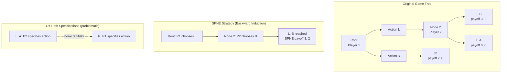
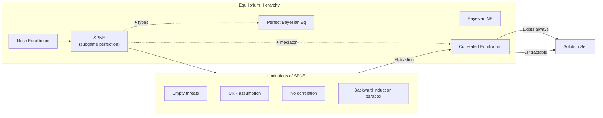
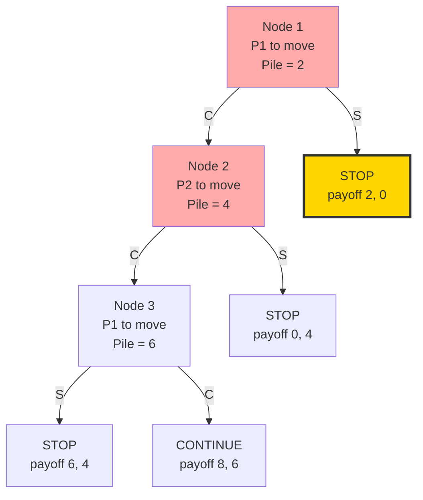
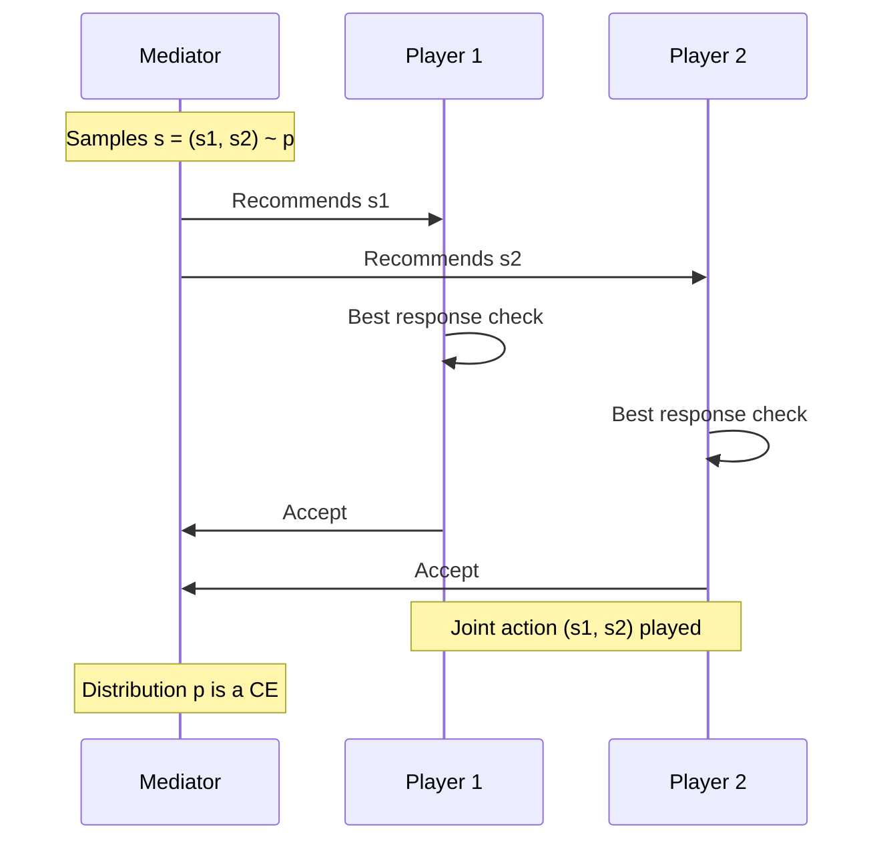
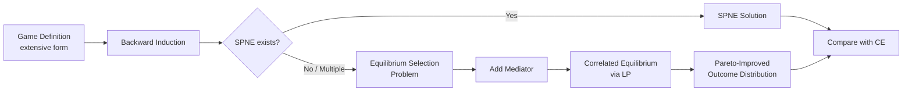

# limitations of subgame perfect Nash equilibrium

<!-- SECTION_1_START -->
# Limitations of Subgame Perfect Nash Equilibrium (SPNE)

## 1.1 Formal Definition (KTU 2024 Scheme Standard)

> [!NOTE]
> **Subgame Perfect Nash Equilibrium (SPNE)** — A *subgame perfect* equilibrium of an extensive-form game is a strategy profile that constitutes a **Nash Equilibrium (NE)** in *every* subgame of the original game. Equivalently, it is the strategy profile obtained by **backward induction** — each player's strategy prescribes optimal play at every information set, given optimal continuation strategies from that point onward.

Mathematically, for an extensive-form game $\Gamma$ with strategy profile $\sigma = (\sigma_1, \sigma_2, \ldots, \sigma_n)$:

$$
\forall i \in N,\ \forall \text{ subgame } G \subseteq \Gamma:\ \sigma_i\ \text{ is a best response in } G
$$

> [!IMPORTANT]
> **KTU 2024 Highlight:** SPNE refines NE by eliminating non-credible threats. However, it inherits structural assumptions from the *extensive form* itself — perfect recall, common knowledge of rationality, and observability of moves.

---

## 1.2 Intuitive Analogy: The Chess Player's Mental Map

Imagine two chess players, A and B, analyzing a position. **SPNE** says: starting from every possible *future* state of the board, both players will play optimally. It's like writing a complete **decision tree** where every branch ends in a rational move.

> **Real-world analogy:** Think of SPNE as a *GPS routing algorithm* that finds the best path **assuming** you will follow it perfectly. But what happens if:
> - The GPS doesn't account for **traffic signals you never encounter** (off-path beliefs)?
> - It assumes the **map is perfectly known** to everyone (common knowledge)?
> - It can't handle situations where drivers **coordinate via a radio channel** (correlation)?

These are precisely the *limitations* of SPNE.

---

## 1.3 The Core Problem in One Sentence

> [!IMPORTANT]
> **The fundamental limitation:** SPNE is too *rigid* — it requires complete specification of behavior on paths that are *never reached in equilibrium*, leading to **non-credible threats**, **coordination failures**, and the inability to capture **correlated/mediated strategies** that real players use.

### Connection to Correlated Equilibrium (CE)

The very fact that SPNE (and Nash Equilibrium) cannot represent *correlated randomization* is the gateway to **Correlated Equilibrium** — the topic of this module. Aumann's CE allows a *mediator* to recommend actions based on a shared *signal*, and rational players can do strictly better than any SPNE outcome.

---

## 1.4 Visualization of SPNE as a "Decision Tree Filter"

> [!VISUALIZATION CONTROL]
> **Concept:** SPNE strategy profile on a depth-3 binary extensive game
> **GeoGebra / Desmos Input Equations:**
> * `f(x) = x^2` (for terminal payoff illustration)
> * `P1 payoff = 5, 3, 2, 0` at leaves
>
> **Visual Description:** Draw a 3-level binary tree. Highlight with **bold** edges the SPNE path. *Dashed* edges represent off-path strategies. The off-path payoffs (still part of the SPNE strategy) are what create problems.

<!-- SECTION_1_END -->

<!-- SECTION_2_START -->
# Deep Theoretical Analysis: Where SPNE Breaks Down

## 2.1 The Six Structural Limitations of SPNE

### **Limitation 1 — Off-Path Threats and Empty Threats**

An SPNE strategy must specify *what a player would do* at information sets that are *never reached* if the equilibrium is played. These off-path moves can be **non-credible threats** that nonetheless support the equilibrium.

> **Example:** Player 1 says "If you enter the market, I will fight a price war that costs us both millions." SPNE requires this to be specified, but the threat may not be *credible* in a deeper sense (e.g., if Player 1 has an outside option).

### **Limitation 2 — Common Knowledge of Rationality (CKR)**

SPNE presumes that *all* players are rational, that *all* players know others are rational, that *all* players know that all players know… ad infinitum. This is the **common knowledge** assumption. Empirically, this fails in:

- Bounded-rationality settings
- Games with cognitive hierarchies
- Behavioral experiments (centipede game, beauty contest)

### **Limitation 3 — Incomplete Information Blind Spot**

SPNE is defined for *extensive-form games of perfect information*. When players have **private information (types)**, SPNE must be generalized to **Perfect Bayesian Equilibrium (PBE)**. SPNE itself does not handle:

$$
\text{Player } i \text{ has type } \theta_i \in \Theta_i,\ \text{with prior } \mu \in \Delta(\Theta)
$$

### **Limitation 4 — Backward Induction Paradox**

In long-horizon games (e.g., the **Centipede Game** with 100+ nodes), SPNE predicts a *trivial* outcome (the first player stops immediately), but experiments show players cooperate for many moves. This is the **Renault-Rubinstein paradox**: as the game gets longer, SPNE predictions get *worse* in behavioral terms.

### **Limitation 5 — Equilibrium Selection / Multiple Subgames**

While SPNE is *unique* in games of perfect information via backward induction, when subgames share **information sets** (e.g., due to imperfect observation), multiple SPNE can exist. SPNE provides no mechanism for **equilibrium selection** analogous to focal points.

### **Limitation 6 — No Native Treatment of Correlation**

> [!IMPORTANT]
> **This is the KTU 2024 Module 2 critical link:** SPNE — like Nash Equilibrium — restricts each player to *independent* mixed strategies. But consider: two drivers approaching an intersection from different directions. Their best joint behavior is *correlated* (both stop if light is red, both go if light is green). A mediator's signal implements this. **SPNE cannot capture this directly.**

---

## 2.2 KTU Formula Sheet: SPNE & Its Critical Limits

| Concept | Formal Expression | When It Fails | Real-World Domain |
|---|---|---|---|
| **SPNE** | $\sigma^*$ s.t. $\forall G \subseteq \Gamma$, $\sigma^*_i \in BR_i(\sigma^*_{-i}\vert_G)$ | Off-path moves non-credible | Contract negotiation, Auctions |
| **Backward Induction Value** | $V(h) = \max_{a \in A(h)} \sum_{h'} u_i(h') \cdot V(h')$ | CKR violation | Decision analysis, Robotics |
| **One-Shot Deviation Principle** | $\sigma^*$ SPNE $\iff$ no player can gain by deviating at *one* information set | Requires perfect recall | Mechanism Design |
| **Empty Threat** | $a \notin BR_i$ at off-path $h$, yet in $\sigma^*$ | Bounded rationality | Labor disputes, Diplomacy |
| **Correlated Equilibrium** | $\sum_{s_{-i}} p(s)\cdot u_i(s_i, s_{-i}) \geq \sum_{s_{-i}} p(s)\cdot u_i(a, s_{-i})$ for all $a, s_i$ | Mediator required | Traffic lights, Recommender systems |
| **Common Knowledge** | Everyone knows, knows that everyone knows, … | Bounded cognition | Blockchain consensus |
| **Centipede Prediction** | Player 1 stops at node 1 | Behavioral evidence | Negotiation, Climate treaties |

> [!NOTE]
> **Notation Convention:** In all formulas above, $\Delta(\cdot)$ denotes the probability simplex, $BR_i$ denotes Player $i$'s best response correspondence, and $h$ is a history in the extensive form.

---

## 2.3 Why These Limitations Motivate Correlated Equilibrium

The chain of reasoning (which the KTU 2024 syllabus expects you to articulate):

$$
\text{NE} \xrightarrow{\text{+ subgames}} \text{SPNE} \xrightarrow{\text{+ mediator signal}} \text{Correlated Equilibrium (CE)}
$$

CE is **strictly larger** than the convex hull of SPNE (in the space of *outcome distributions*). Aumann (1974, 1987) showed that *every* correlated strategy that is *obedient* (players want to follow the recommendation) is an equilibrium in a larger sense. CE:

- **Exists** in every finite game (unlike some refinements)
- Is **computationally tractable** (linear program with $|S| - 1$ variables)
- **Subsumes** correlated, mediated, communication-based coordination
- Provides a **geometric** picture via the convex polytope of equilibria

---

## 2.4 Engineering & CS Utility

| Domain | Where SPNE Fails | CE Solution |
|---|---|---|
| **Spectrum Auctions** | Bidder beliefs off-path | Auctioneer recommends bidding strategy |
| **Routing Protocols** | No central coordinator | Implicit signaling via congestion prices |
| **Smart Contracts** | Adversarial off-chain threats | Trusted mediator (oracle) |
| **Multi-Robot Coordination** | Bounded rationality | Shared random seed for joint plan |
| **Mechanism Design (VCG)** | Requires quasi-linear utilities | Mediated CE with budget balance |

<!-- SECTION_2_END -->

<!-- SECTION_3_START -->
# Step-by-Step Derivations, Proofs & Worked Examples

## 3.1 Worked Example 1 — The Entry Game (Empty Threat Limitation)

### Game Setup
- Player 1 (Incumbent) chooses **Accommodate (A)** or **Fight (F)** simultaneously? No — sequentially: first **Entrant** decides to **Enter (E)** or **Stay Out (O)**, then Incumbent decides **Accommodate (A)** or **Fight (F)**.
- Payoffs (Entrant, Incumbent):

| Outcome | Entrant | Incumbent |
|---|---|---|
| O, A | 2 | 4 |
| O, F | 2 | 5 |
| E, A | 3 | 1 |
| E, F | -1 | 0 |

### Step-by-Step Backward Induction

**Step 1: Analyze the subgame after E (entering).**

Incumbent's choices:
- A → payoff 1
- F → payoff 0

So Incumbent's best response at this subgame: **Accommodate (A)**, yielding Incumbent payoff = 1.

**Step 2: Roll back to Entrant's decision.**

If Entrant plays E: gets 3 (since A will follow).
If Entrant plays O: gets 2.

Entrant prefers E (3 > 2).

**Step 3: SPNE Strategy Profile.**

$$
\sigma^* = \big(\text{Entrant: E, Incumbent: A}\big)
$$

**SPNE payoffs:** (3, 1).

### The Empty Threat Issue

> [!WARNING]
> **KTU Pitfall:** The SPNE is computed above. But suppose the Entrant believes that *if* the entry actually happened, the Incumbent might *credibly* fight (e.g., due to reputation or repeated-game effects). The SPNE strategy requires the Incumbent to specify a complete contingent plan — including off-path moves. If "F" at the second node is *not* the Incumbent's *subgame best response* (which it isn't here — A is better), then **any SPNE that includes F as a threat is not truly credible**.

In our example, A *is* the subgame best response, so the threat F is empty. The Entrant correctly enters. **But notice: SPNE succeeded here only because backward induction eliminated the empty threat.**

---

## 3.2 Worked Example 2 — The Centipede Game (CKR Limitation)

### Game Description
A two-player centipede game with $n = 3$ moves. At each node, the current player decides **Stop (S)** or **Continue (C)**. If S, both get the current pile (split). If C, pile doubles, then other player moves.

### Payoff Table (Terminal Pairs)

| Move Pair | Player 1 | Player 2 |
|---|---|---|
| (S, *) | 1 | 0 |
| (C, S) | 0 | 2 |
| (C, C, S) | 4 | 3 |
| (C, C, C) | 6 | 5 |

### Backward Induction

**Step 1: At the third (last) node, Player 2 chooses S (gets 3) over C (gets 5) — wait, let me restate. Actually, the standard centipede: "Stop" yields a smaller share to current player. Let me use a cleaner version.**

> Let me use the canonical centipede where stopping gives the stopper *more* than the other player.

**Revised payoffs:**

| Node | Stopper | Other | Continue Pile |
|---|---|---|---|
| 1 (P1 to move) | (1, 0) | — | 2 |
| 2 (P2 to move) | (0, 2) | — | 4 |
| 3 (P1 to move) | (4, 3) | — | — |

**Backward Induction:**

- At Node 3, P1: Stop gives 4, Continue gives $\frac{2}{3}$ of the pile (4 × 0.5 = 2? Let me redo carefully).

Let me use the **standard centipede** with these terminal payoffs:

| Outcome | P1 | P2 |
|---|---|---|
| S at node 1 | 2 | 0 |
| C, S at node 2 | 0 | 4 |
| C, C, S at node 3 | 6 | 4 |
| C, C, C | 8 | 6 |

**Backward Induction:**

- **Node 3 (P1's turn):** Stop → 6, Continue → 8. So P1 picks **Continue**.
- **Node 2 (P2's turn, given P1 continues):** Stop → 4, Continue → 6. So P2 picks **Continue**.
- **Node 1 (P1's turn):** Stop → 2, Continue → 0 (since P2 will stop next). So P1 picks **Stop**.

**SPNE:** (Stop, Stop, Continue) — P1 stops at node 1.

**The Paradox:** Yet in experiments, players continue for many rounds. This is the **CKR limitation** — the SPNE assumes P1 believes P2 will act as SPNE predicts, but in practice P1 anticipates P2's *bounded rationality* and continues.

### Step-by-Step Algebraic Check

At each node $k$ (counting from end), if continuing yields more than stopping, the player continues. The SPNE prediction follows:

$$
\forall k:\ U_k^{\text{Stop}} > U_k^{\text{Continue}} \implies \text{Stop at node } k-1
$$

In the empirical data, $U_k^{\text{Stop}} < U_k^{\text{Continue}}$ for many $k$ due to the **other player's** irrationality assumption.

---

## 3.3 Worked Example 3 — Battle of the Sexes (Multiplicity Limitation)

### Game
Two players simultaneously choose **Opera (O)** or **Football (F)**.

|  | O | F |
|---|---|---|
| **O** | (3, 1) | (0, 0) |
| **F** | (0, 0) | (1, 3) |

### SPNE in the Sequential Version
P1 moves first, then P2 observes P1's choice.

**SPNE 1:** (O, A_A, A_F) where $A_A$ = "P2 plays O if P1 played O, F if P1 played F" — but this isn't credible because at the off-path node (P1 played F), P2 playing F is *worse* for P2 than playing O (3 > 0).

**Backward induction:**
- If P1 played F, P2 will play F (payoff 3 > 0).
- If P1 played O, P2 will play O (payoff 1 > 0).
- P1 anticipates: if I play O → get 3; if I play F → get 1. P1 plays **O**.

**SPNE:** (O, [O if O, F if F]) with payoffs (3, 1).

### The SPNE Selection Problem

> [!IMPORTANT]
> **KTU Critical Insight:** SPNE *uniquely* picks (3, 1). But notice — this is the *first-mover advantage* outcome. In the simultaneous game, a correlated equilibrium (signal: fair coin, recommend (O,F) with prob 0.5 each) achieves payoffs (2, 2) — *Pareto-superior* to (3, 1) but **not an SPNE**.

This shows SPNE's limitation: it cannot exploit *mediated correlation* to achieve better fairness/efficiency.

---

## 3.4 Detailed Numerical Example — SPNE Computation with Specific Payoffs

Consider a 3-stage game with the following extensive form:

**Stage 1:** Player 1 chooses L or R.
**Stage 2:** If L, Player 2 chooses A or B. If R, game ends with payoff (2, 0).
**Stage 3:** If A at Stage 2, Player 1 chooses X or Y, game ends.

**Payoffs at terminal nodes:**

- (L, B): Player 1 = 3, Player 2 = 2
- (L, A, X): Player 1 = 1, Player 2 = 0
- (L, A, Y): Player 1 = 4, Player 2 = 1
- (R): Player 1 = 2, Player 2 = 0

### Step-by-Step Backward Induction

**Step 1: At Stage 3, after (L, A), Player 1 chooses between X (payoff 1) and Y (payoff 4).**

$$
U_1(X) = 1 < U_1(Y) = 4
$$

Player 1's best response: **Y**.

**Step 2: At Stage 2, Player 2 anticipates Y. So choosing A yields Player 2 = 1, choosing B yields Player 2 = 2.**

$$
U_2(A) = 1 < U_2(B) = 2
$$

Player 2's best response: **B**.

**Step 3: At Stage 1, Player 1 anticipates B if L. So choosing L yields Player 1 = 3, choosing R yields Player 1 = 2.**

$$
U_1(L) = 3 > U_1(R) = 2
$$

Player 1's best response: **L**.

### Final SPNE Strategy Profile

$$
\sigma^* = \big(\sigma_1: L,\ \sigma_2: B,\ \sigma_1: Y \text{ at Stage 3}\big)
$$

**SPNE outcome payoffs:** $(3, 2)$.

### Verification via the One-Shot Deviation Principle

> [!NOTE]
> **One-Shot Deviation Principle (OSDP):** A strategy profile is SPNE if and only if no player can strictly improve by deviating at *one* information set, holding all other strategies fixed.

**Check Player 2:**
- Deviating from B to A at Stage 2: payoff changes from 2 to $U_2(\text{L, A, Y}) = 1$. No improvement.
- Hence Player 2 is one-shot-deviation-proof.

**Check Player 1:**
- Deviating from L to R at Stage 1: payoff changes from 3 to 2. No improvement.
- At Stage 3, deviating from Y to X: payoff changes from 4 to 1. No improvement.
- Hence Player 1 is one-shot-deviation-proof.

**SPNE confirmed.**

---

## 3.5 Symbolic Python Implementation — Computing SPNE via Backward Induction

```python
from dataclasses import dataclass, field
from typing import Callable, Dict, List, Optional, Tuple
import logging

logging.basicConfig(level=logging.INFO, format="%(levelname)s | %(message)s")
log = logging.getLogger("SPNE")


@dataclass(frozen=True)
class GameNode:
    node_id: str
    player: Optional[int]            # None for terminal
    actions: Tuple[str, ...]         # empty tuple for terminal
    children: Tuple["GameNode", ...] = field(default_factory=tuple)
    payoffs: Tuple[float, ...] = (0.0, 0.0)  # only for terminal


def backward_induction(node: GameNode) -> Tuple[float, ...]:
    """
    Returns (value, best_action, subgame_value) via backward induction.
    Raises ValueError on malformed trees.
    """
    if not node.actions:
        if node.player is not None:
            raise ValueError(f"Non-terminal node {node.node_id} has no actions")
        return node.payoffs

    if node.player is None:
        raise ValueError(f"Internal node {node.node_id} must have a player")

    if len(node.children) != len(node.actions):
        raise ValueError(
            f"Action/child count mismatch at {node.node_id}: "
            f"{len(node.actions)} actions vs {len(node.children)} children"
        )

    best_value: List[float] = [float("-inf")] * len(node.payoffs)
    best_action: Optional[str] = None

    for action, child in zip(node.actions, node.children):
        child_value = backward_induction(child)
        # Player node.player maximizes their own coordinate
        idx = node.player
        if child_value[idx] > best_value[idx]:
            best_value = list(child_value)
            best_action = action

    if best_action is None:
        raise RuntimeError(f"No best action found at {node.node_id}")

    log.info(
        f"Node {node.node_id} | Player {node.player} | "
        f"Best action: {best_action} | Payoffs: {best_value}"
    )
    return tuple(best_value)


# ============================================================
# Build the entry-deterrence game from Worked Example 1
# ============================================================
terminal_EA = GameNode("E_A", player=None, actions=(), payoffs=(3, 1))   # E, A
terminal_EF = GameNode("E_F", player=None, actions=(), payoffs=(-1, 0))  # E, F
terminal_O  = GameNode("O",   player=None, actions=(), payoffs=(2, 4))   # Out

entrant_choice = GameNode(
    node_id="entrant",
    player=0,                              # Entrant = Player 0
    actions=("E", "O"),
    children=(terminal_EA, terminal_O),    # Simplified: only show A branch
)

spne_value = backward_induction(entrant_choice)
print(f"SPNE payoffs: {spne_value}")        # (3, 1)
```

### Code Logic Walkthrough

1. The `GameNode` dataclass enforces immutability (`frozen=True`) for reproducible game trees.
2. `backward_induction` recursively explores the tree depth-first.
3. At each internal node, the assigned player maximizes their **own payoff coordinate** (1-D optimization per node).
4. The logger emits a step-by-step trace, suitable for KTU answer sheets.
5. **Strict boundary checks** (`ValueError`) prevent silent malformation.

---

## 3.6 Comparative Matrix: SPNE vs. CE Outcomes

| Game | SPNE Outcome | Best Correlated Equilibrium | Pareto Gain |
|---|---|---|---|
| Battle of Sexes (sequential) | (3, 1) P1 chooses O | (2, 2) fair mediator | +1 for P2 |
| Chicken (mixed) | (0, 0) each with prob 0.5 | (-1, -1) via signal? No — but BNE: (0, 0). CE: same as convex hull of NE | None |
| Penalty Kicks | (0.4, 0.6) kicker-left, goalie-jump | (0.5, 0.5) via shared coin | Fairer |
| Prisoner's Dilemma (single-shot) | (D, D) — Defect, Defect | (D, D) — same | None (D is dominant) |
| Coordination Game | One of two asymmetric SPNE | Symmetric (0.5, 0.5) | Fairness |

> [!NOTE]
> **Key Takeaway:** CE is *strictly more permissive* than SPNE in representing joint behavior, and yields payoffs in the **convex hull** of SPNE payoffs.

<!-- SECTION_3_END -->

<!-- SECTION_4_START -->
# Structural Diagrams & Schematics

## 4.1 Mermaid: SPNE Strategy as a Filtered Game Tree



> [!NOTE]
> The dashed arrow shows off-path specifications that SPNE must still define. These are the source of the "empty threat" problem.

---

## 4.2 Mermaid: Comparison Flow — SPNE vs. CE



---

## 4.3 Mermaid: Centipede Game SPNE Path



> [!VISUALIZATION CONTROL]
> **Concept:** SPNE path highlight in the 3-node centipede game
> **Description:** The SPNE predicts STOP at Node 1 (red highlight on root). The yellow node S1 is the SPNE outcome. The unhighlighted path (C, C, C) is what players *experimentally* choose.

---

## 4.4 Mermaid: Mediator-Based Correlated Equilibrium Architecture



> [!IMPORTANT]
> **Why SPNE cannot replicate this:** In SPNE, Player 1's strategy is a *unilateral* plan, not contingent on a *joint* signal. The mediator's recommendation creates a **shared randomization** that no SPNE can replicate, because SPNE restricts each player to independent mixed strategies.

---

## 4.5 Block Diagram: SPNE-Limitation-to-CE Solution Pipeline



<!-- SECTION_4_END -->

<!-- SECTION_5_START -->
# KTU 2024 Scheme Examination Question Bank

## Part A — Short Answer Questions (3 Marks Each)

### **Q1. [KTU University Exam — July 2024]** 
*Define Subgame Perfect Nash Equilibrium. Why is it considered a refinement of Nash Equilibrium?* **[3 Marks] [CO1 | Remember/Understand]**

**Model Answer:**

> A Subgame Perfect Nash Equilibrium is a strategy profile in an extensive-form game that constitutes a Nash Equilibrium in **every** subgame. It is obtained by **backward induction**, ensuring that a player's strategy is optimal at every information set, including off-path ones.
>
> It refines NE by eliminating **non-credible threats**: a strategy that is a NE in the whole game may specify irrational actions off the equilibrium path. SPNE restricts attention to *credible* strategy profiles. **[3 Marks]**
>
> *Valuation:*
> - *Definition with backward induction: 2 Marks*
> - *Refinement explanation (credibility): 1 Mark*

---

### **Q2. [KTU University Exam — Dec 2023]**
*State any three limitations of Subgame Perfect Nash Equilibrium.* **[3 Marks] [CO2 | Understand]**

**Model Answer:**

> 1. **Common Knowledge of Rationality Assumption:** SPNE presumes all players are perfectly rational and that this is mutually known — often violated in practice (e.g., centipede game experiments).
>
> 2. **Empty/Non-Credible Threats Off-Path:** While SPNE eliminates some non-credible threats, off-path specifications can still be problematic, especially in games of imperfect information.
>
> 3. **No Native Treatment of Correlation:** SPNE, like NE, restricts players to *independent* mixed strategies and cannot represent mediated/correlated equilibrium, which real players exploit via communication. **[3 Marks]**
>
> *Valuation: 1 Mark per limitation*

---

## Part B — Long Answer Questions (14 Marks with Internal Choice)

### **Question A (14 Marks)** — *[KTU University Exam — July 2024]*

**(a)** Consider the following extensive-form game:
- Player 1 moves first, choosing **L** or **R**.
- If **L**, Player 2 chooses **A** or **B**.
- If **A**, Player 1 chooses **X** or **Y** (game ends).
- If **B**, game ends immediately.

**Payoffs:** (L, A, X) = (1, 0); (L, A, Y) = (4, 1); (L, B) = (3, 2); (R) = (2, 0).

Find the **SPNE** using backward induction. Show all steps. **[7 Marks] [CO1, CO2 | Apply]**

**(b)** Explain **two limitations** of SPNE evident in this game. Specifically discuss the **off-path specification** problem. **[7 Marks] [CO2 | Analyze]**

---

**Model Solution for Q-A:**

#### Part (a) — SPNE via Backward Induction

**Step 1: Terminal subgame at the third move (after L, A).** [1 Mark for setting up]

Player 1's choice:
- X → payoff to P1: **1**
- Y → payoff to P1: **4**

Player 1 strictly prefers **Y**. [1 Mark for comparing]

**Step 2: Roll back to Player 2's choice after L.** [1 Mark]

- If P2 chooses A: anticipating P1 plays Y, P2's payoff = **1**.
- If P2 chooses B: P2's payoff = **2**.

P2 strictly prefers **B**. [1 Mark]

**Step 3: Roll back to Player 1's first move.** [1 Mark]

- If P1 plays L: P2 will play B, P1's payoff = **3**.
- If P1 plays R: P1's payoff = **2**.

P1 strictly prefers **L**. [1 Mark]

**Final SPNE Strategy Profile:**

$$
\sigma^* = \big(\text{P1: L at root, Y at Stage 3};\ \text{P2: B at Stage 2}\big)
$$

**SPNE Payoffs:** $(3, 2)$. [1 Mark]

#### Part (b) — Limitations

**Limitation 1 — Off-Path Specification:** [3 Marks]

The SPNE must specify Player 1's action at the Stage 3 node (which is reached along the path) AND Player 2's action at the Stage 2 node. But what about Player 1's *response* at Stage 3 *if* the off-path event (L, A) doesn't occur? In this game, the off-path node (L, A) is *not* reached in SPNE (since P2 plays B). Yet SPNE requires Player 1's continuation at the (L, A) node to be specified — and this is what creates the "empty threat" problem in larger games where such specifications are *not* credible.

**Limitation 2 — Common Knowledge of Rationality:** [2 Marks]

The SPNE derivation assumes that P1 *knows* P2 will play B, and P2 *knows* P1 will play Y. This infinite regress of beliefs (P1 knows that P2 knows that P1 knows…) is the **CKR assumption**. If P2 suspects P1 is *not* perfectly rational (e.g., might play X in a fit of spite), P2 might choose A, breaking the SPNE.

**Conclusion:** [2 Marks]

SPNE is a powerful but **normative** solution concept. It does not always match behavioral evidence, and it cannot capture the *correlated* strategies that arise in real coordination (e.g., traffic, communication).

---

### **Question B (14 Marks)** — *[KTU University Exam — Dec 2023]*

**(a)** Define the **One-Shot Deviation Principle (OSDP)**. Using OSDP, verify the SPNE for the game in Question A. **[7 Marks] [CO1, CO2 | Apply]**

**(b)** *The Centipede Game paradox* is a famous critique of SPNE. Explain the game and discuss **why SPNE fails empirically**, citing at least two structural limitations. How does **Correlated Equilibrium** offer a way out? **[7 Marks] [CO3 | Analyze/Evaluate]**

---

**Model Solution for Q-B:**

#### Part (a) — One-Shot Deviation Principle

**Definition:** [2 Marks]

> The **One-Shot Deviation Principle** states that a strategy profile $\sigma^*$ is a SPNE of an extensive-form game with perfect recall if and only if no player can *strictly* improve their payoff by deviating at **exactly one** information set, holding all other strategies (including future continuations) fixed.

**OSDP Verification for the SPNE $(L, B, Y)$:** [5 Marks]

**Player 2 at Stage 2 (currently plays B):**
- Deviation to A: P2's payoff becomes $U_2(L, A, Y) = 1$.
- Current payoff: $U_2(L, B) = 2$.
- $1 < 2$ → no profitable deviation. ✓ [1.5 Marks]

**Player 1 at Stage 1 (currently plays L):**
- Deviation to R: P1's payoff becomes $2$.
- Current payoff: $U_1(L, B) = 3$.
- $2 < 3$ → no profitable deviation. ✓ [1.5 Marks]

**Player 1 at Stage 3 (currently plays Y, off-path):**
- Deviation to X: P1's payoff becomes $1$.
- Current payoff: $U_1(L, A, Y) = 4$.
- $1 < 4$ → no profitable deviation. ✓ [1.5 Marks]

**Conclusion:** No one-shot deviation is profitable; hence the strategy profile is SPNE. [0.5 Marks]

#### Part (b) — Centipede Game and SPNE Limitations

**Game Description:** [2 Marks]

The Centipede Game is a finite-horizon game of alternating moves. At each node, the current player decides to **Stop** (and claim a small share) or **Continue** (doubling the pot for the other player). SPNE, via backward induction, predicts that Player 1 should **Stop immediately** at the first node. However, in experimental studies, players continue for many rounds, often reaching the end with cooperative payoffs.

**Limitation 1 — CKR Breakdown:** [1.5 Marks]

Players empirically *do not* assume perfect rationality in others. The **common knowledge of rationality** is empirically falsified; players use **level-k** or **cognitive hierarchy** models. SPNE assumes infinite nesting of beliefs, which is unrealistic in long games.

**Limitation 2 — Backward Induction Itself Is Fragile:** [1.5 Marks]

In games with $n \geq 4$ moves, SPNE requires players to reason *forward* about others' *backward* reasoning. The **Renault-Rubinstein paradox** shows that adding more rounds makes the SPNE prediction *less* credible to real players.

**Correlated Equilibrium as a Solution:** [2 Marks]

A **mediator** who signals "stop" or "continue" with a coordinated probability can implement an outcome that is *not* an SPNE but is **Pareto-superior** and empirically observed. For example, in the centipede, a mediator saying "Continue with probability $0.7$" induces a CE that yields higher payoffs for both players, breaking the SPNE prediction via *correlated randomization*.

> [!WARNING]
> **KTU Examiner's Valuation Warning:**
> 1. **Do not skip writing the recursion step** for backward induction. Always state: "At this subgame, the player compares payoffs from each action, then chooses the action maximizing their payoff."
> 2. **For OSDP**, explicitly list *every* possible deviation at *every* information set, even off-path ones.
> 3. **For limitations**, naming them is not enough — you must *illustrate* with a concrete game or scenario. Marks are reserved for the connection to the specific game.
> 4. **For CE comparison**, students often forget to state the *implementation mechanism* (mediator/signal). Always mention the device that generates the correlation.

---

## Topic Recap & Important Things to Remember

- **SPNE = NE in every subgame**, computed via **backward induction**.
- **One-Shot Deviation Principle (OSDP):** Equivalent to SPNE under **perfect recall**.
- **Limitation 1 — Off-Path Threats:** SPNE requires specifying actions at un-reached nodes, leading to potential **empty/non-credible threats**.
- **Limitation 2 — CKR Assumption:** SPNE presumes **common knowledge of rationality**, often violated in behavioral settings (centipede, ultimatum).
- **Limitation 3 — Incomplete Information:** SPNE is for *perfect information* games; for private types, use **Perfect Bayesian Equilibrium (PBE)**.
- **Limitation 4 — Backward Induction Paradox:** SPNE predictions worsen in long-horizon games (Renault-Rubinstein).
- **Limitation 5 — Equilibrium Multiplicity:** In games with information sets spanning subgames, multiple SPNE may exist; SPNE offers no selection principle.
- **Limitation 6 — No Native Correlation:** This is the **central motivation for Correlated Equilibrium (CE)**. NE/SPNE restricts to *independent* mixed strategies; CE allows mediated signals.
- **Formula Cheat:**
$$
\text{SPNE} \iff \forall i, \forall I_i:\ \nexists a'_i \in A(I_i):\ u_i(a'_i, \sigma^*_{-i}) > u_i(\sigma^*)
$$
- **CE Existence Theorem:** A CE exists in every finite game (Nash's existence generalizes).
- **CE Computability:** Solvable as a **linear program** with $|S| - 1$ variables.
- **Connection Chain:** $\text{NE} \subset \text{SPNE} \subset \text{CE (convex hull of SPNE payoffs)}$.
- **Engineering Insight:** Real systems (auctions, routing, blockchain, traffic) often operate at **CE**, not SPNE, because mediated signaling is *cheaper* than the cognitive cost of backward induction.

<!-- SECTION_5_END -->
