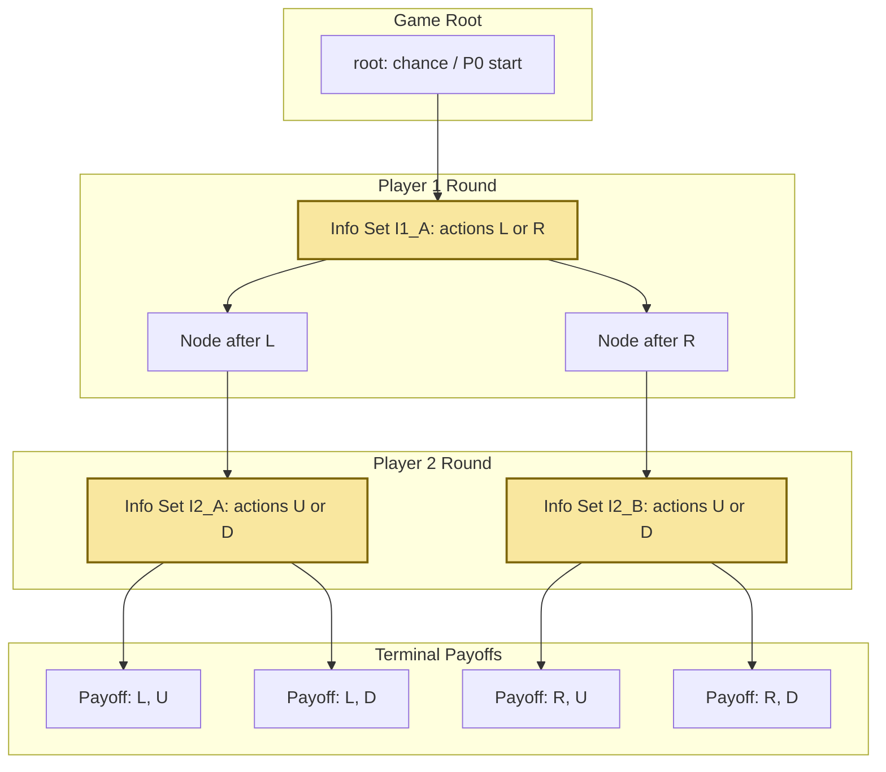
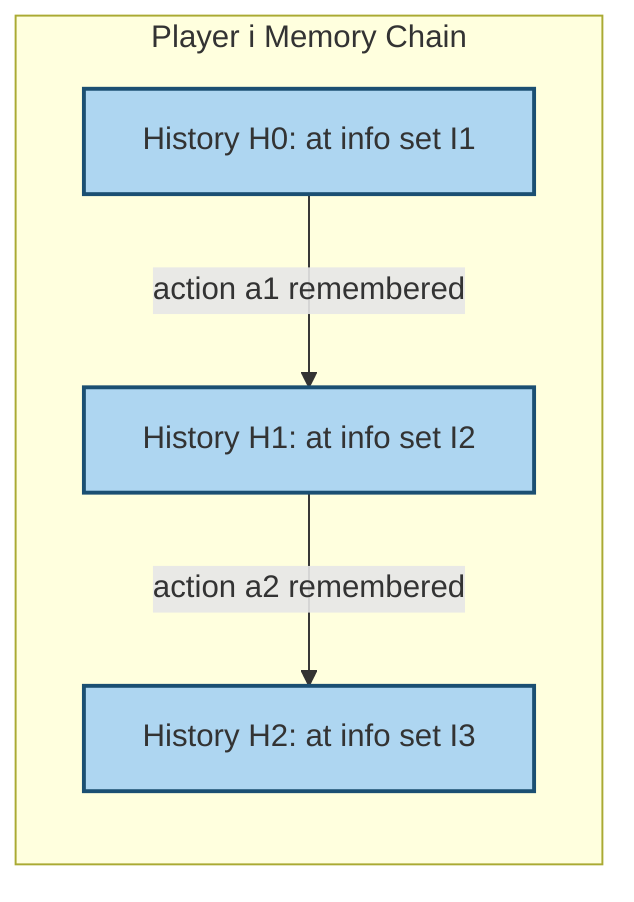
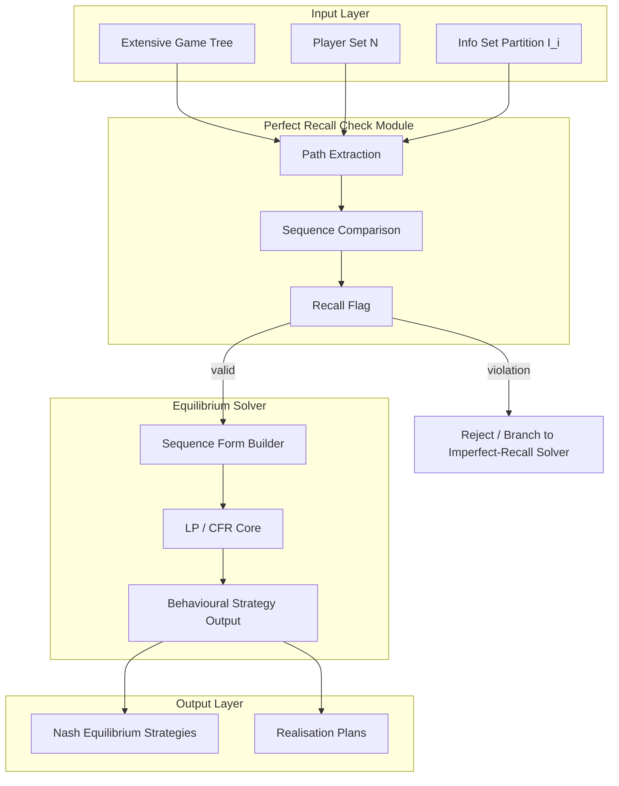

# perfect recall

<!-- SECTION_1_START -->
# Perfect Recall in Extensive-Form Games

## 1. Core Technical Definition

> [!IMPORTANT]
> **Perfect Recall (KTU 2024 Formal Definition)**
> In a finite extensive-form game $\Gamma = \langle N, H, P, f_c, \{u_i\}_{i \in N}, \mathcal{I} \rangle$ with perfect information, a player $i$ has **perfect recall** if the player remembers:
> 1. **All actions** that they have previously taken (action recall).
> 2. **All information sets** that they have previously been in (information set recall).
> 3. **All chance events and opponent actions** that were observed (memory of public/private signals).

Equivalently, any two decision nodes $x, y \in I$ belonging to the **same information set** of player $i$ must have **identical sequences of prior moves** (and chance realizations) for player $i$.

---

## 2. Conceptual Analogy / Intuition

> [!NOTE]
> **Intuition — The Honest Chess Player**
> Imagine you are playing a chess match. *Perfect recall* means you **never forget** which pieces you have moved, which squares you have visited, or what your opponent revealed earlier (e.g., captured pieces, castling availability). Two positions in the game tree that look identical to you (same information set) must have been reached through **exactly the same history of your own moves**, not by a different path where you played differently.
> 
> A player with **imperfect recall** is like an amnesiac: you look at the board and don't remember whether you just moved your knight or your bishop. Such players can have **non-rationalizable** behaviour, and the standard equilibrium theorems (e.g., Kuhn's theorem) **break down**.

---

## 3. The Two Memory Conditions

| # | Memory Type | Formal Condition | KTU Notation |
|---|-------------|------------------|--------------|
| 1 | **Action Recall** | For player $i$, if $x, y$ are in the same information set $I$, then the set of actions taken by $i$ along every path from the root to $x$ equals the set of actions along every path to $y$. | $\sigma_i(x) = \sigma_i(y)$ |
| 2 | **Information Set Recall** | Player $i$ remembers the *sequence* of information sets they have visited, not just the current one. | $\rho_i(x) = \rho_i(y)$ |

> [!TIP]
> **Board Exam Tip:** Whenever a question lists "types of perfect recall", the safe answer is **action recall + information set recall** — these are the two pillars examiners expect.

---

## 4. GeoGebra / Desmos Visualization

> [!VISUALIZATION CONTROL]
> **Concept:** Information-set tree with two nodes that *appear* identical to player $i$ but arise from different action histories.
> 
> **GeoGebra / Desmos Input Equations:**
> * Root node: `A = (0, 1)`
> * Player-1 branch left: `B1 = (-1, 0)`, label: "P1 played L"
> * Player-1 branch right: `B2 = (1, 0)`, label: "P1 played R"
> * Player-2 nodes: `C1 = (-1, -1)`, `C2 = (1, -1)`, both shaded in the same colour to show they form one information set.
> 
> **Visual Description:** Two terminal decision nodes appear in the same dashed oval (one information set for player 2), but the histories reaching them differ in player 1's move. **This is a violation of perfect recall for player 2 only if player 2's own previous moves created the split.** If player 1's choices created the divergence, player 2 still has perfect recall because the *player's own* past is identical.

---

## 5. Perfect vs. Imperfect Information Games

| Property | Perfect Information | Imperfect Information | Perfect Recall (independent axis) |
|----------|--------------------|------------------------|-----------------------------------|
| Players know previous moves? | Yes (all moves) | Only own previous moves + observed chance | **A stricter condition on player's own memory** |
| Information sets are singletons? | Yes | No (multi-node sets allowed) | Requires consistent internal histories |
| Strategy space collapses to actions? | No — still need contingency plans | Yes — strategies are mappings $S_i : \mathcal{I}_i \to \Delta(A(I))$ | **Strategies are sequences, not just action plans** |

<!-- SECTION_1_END -->

<!-- SECTION_2_START -->
# Deep Theoretical Analysis & KTU High-Yield Formula Sheet

## 1. Formal Setup: Extensive-Form Games

> [!IMPORTANT]
> An **extensive-form game** is a tuple $\Gamma = (N, H, P, f_c, u, \mathcal{I})$ where:
> * $N = \{1, 2, \dots, n\}$ — set of players.
> * $H$ — set of all nodes (histories), with $Z \subset H$ the terminal (leaf) nodes.
> * $P : H \setminus Z \to N \cup \{c\}$ — player function; $c$ denotes **chance**.
> * $f_c$ — probability distribution over chance outcomes.
> * $u_i : Z \to \mathbb{R}$ — utility of player $i$ over terminal nodes.
> * $\mathcal{I}_i$ — **partition of the nodes controlled by $i$** into information sets.

---

## 2. The Perfect Recall Condition — Rigorous

For each player $i \in N$ and each information set $I \in \mathcal{I}_i$, define two functions over the subtree rooted at any $x \in I$:

$$
\text{prev}(i, x) = \text{the sequence of information sets of player } i \text{ that lie on the path from the root to } x.
$$

$$
\text{action}(i, x) = \text{the sequence of actions taken by player } i \text{ on the path from the root to } x.
$$

> [!NOTE]
> **Perfect Recall Theorem (Kuhn, 1953)**
> Player $i$ has perfect recall in $\Gamma$ if and only if for every information set $I \in \mathcal{I}_i$ and every pair $x, y \in I$:
> $$\text{prev}(i, x) = \text{prev}(i, y) \quad \text{and} \quad \text{action}(i, x) = \text{action}(i, y).$$
> 
> In short: **the player's own past is the same from every node in the same information set.**

---

## 3. Why Perfect Recall Matters — KTU High-Yield Consequences

| # | Consequence | Why it matters |
|---|-------------|----------------|
| 1 | **Kuhn's Theorem (Sequence Form Equivalence)** | The set of Nash equilibria of a two-player zero-sum extensive game with perfect recall equals the set of Nash equilibria of the *normal-form* game iff the sequence-form LP is feasible. |
| 2 | **One-Deviation Principle** | In finite games with perfect recall, checking single-shot deviations at every information set is sufficient to verify optimality of a strategy. |
| 3 | **Backward Induction Validity** | Standard SPE refinements (subgame perfection, forward induction) require perfect recall to make sense. |
| 4 | **Counterfactual Regret Minimization (CFR)** | CFR — the algorithm behind **Libratus** and **Pluribus** (poker AIs) — requires perfect recall to define regrets correctly. |
| 5 | **Correlated Equilibrium via Mediator** | In extensive games with perfect recall, a *correlated equilibrium* can be implemented by a mediator that recommends sequences. |

> [!WARNING]
> **Pitfall:** Perfect recall is a property of a *game description*, not of a strategy. A player can have a strategy that is *behaviourally identical* to one that violates recall, but the **game itself** is what is well-formed.

---

## 4. KTU Formula Sheet / Cheat Sheet

> [!IMPORTANT]
> **Memorize This Table — Direct KTU Questions Test These**

| Symbol / Term | Meaning | Formula / Condition |
|---------------|---------|---------------------|
| $h \in H$ | A node (history) in the game tree | $h = (a_1, a_2, \dots, a_k)$ |
| $I \in \mathcal{I}_i$ | Information set of player $i$ | A subset of decision nodes indistinguishable to $i$ |
| $\sigma_i : \mathcal{I}_i \to \Delta(A)$ | Pure/mixed **behavioural strategy** of $i$ | Maps each information set to a distribution over actions |
| $s_i \in S_i$ | Pure **realisation plan** (normal-form strategy) | A function choosing an action at *every* information set, even unreachable ones |
| $\rho_i(h)$ | Sequence of $i$'s information sets up to node $h$ | Ordered list $\rho_i(h) = (I_1, I_2, \dots, I_m)$ |
| $\alpha_i(h)$ | Sequence of $i$'s actions up to node $h$ | Ordered list $\alpha_i(h) = (a_1, a_2, \dots, a_m)$ |
| **Perfect recall condition** | $i$'s own past is identical across $I$ | $\rho_i(x) = \rho_i(y)$ and $\alpha_i(x) = \alpha_i(y)$ for all $x, y \in I$ |
| **Behavioural $\leftrightarrow$ Mixed equivalence** | Kuhn's theorem | Holds **iff** the game has perfect recall |
| **Sequence form** $\pi_i$ | A vector indexed by player $i$'s *sequences* of moves | $\pi_i \geq 0$, sum at root = 1, consistency: $\pi_i(\sigma) = \sum_{a \in A(I')} \pi_i(\sigma \cdot a)$ |
| **One-deviation principle** | Optimality check at every info set suffices | $\text{Expected gain from any one-shot deviation} \leq 0$ |

> **Critical Reminder for Tables:** Use `\vert` or `\mid` for any absolute-value notation. (Already followed above.)

---

## 5. Real-World Engineering Utility

| Field | Use of Perfect Recall |
|-------|----------------------|
| **Algorithmic Game Theory / Poker AI** | Libratus, Pluribus, DeepStack — all rely on perfect-recall CFR to scale to $10^{160}$ information sets. |
| **Mechanism Design (Auctions)** | Sequential auctions (e.g., FCC spectrum) require equilibrium computation under perfect recall. |
| **Multi-Agent Reinforcement Learning** | POMDPs with *recurrent* memory satisfy perfect recall; feed-forward agents in partially observed environments can violate it. |
| **Network Security Games** | Stackelberg security games (DeepStack, PROTECT) on patrol graphs depend on perfect-recall assumptions for the defender. |
| **Smart-Grid / Cyber-Physical Systems** | Sequential defender–attacker games use perfect-recall equilibria to compute robust schedules. |

<!-- SECTION_2_END -->

<!-- SECTION_3_START -->
# Step-by-Step Derivations & Symbolic / Algorithmic Implementation

## 1. Symbolic Derivation — Verifying Perfect Recall on a Toy Game

> [!NOTE]
> **Worked Example: Two-Step Centipede Variant**
> 
> *Player 1* moves first (info set $I_1$ with actions $\{L, R\}$). At *both* resulting nodes, *Player 2* moves (info sets $I_2^L, I_2^R$, each with $\{U, D\}$). At the leaves, payoffs are $(2, 1)$ after $L \to U$, $(0, 0)$ after $L \to D$, $(1, 0)$ after $R \to U$, $(0, 0)$ after $R \to D$.

**Step 1.** Enumerate Player 2's two information sets.
$I_2^L = \{x_L\}, \quad I_2^R = \{x_R\}$.

**Step 2.** Each information set of Player 2 is a **singleton** — meaning Player 2 sees the full history. Therefore the *sequence of Player 2's own past moves* is the empty sequence for any node in either $I_2^L$ or $I_2^R$.

$$
\rho_2(x_L) = \emptyset, \quad \rho_2(x_R) = \emptyset, \quad \alpha_2(x_L) = \emptyset, \quad \alpha_2(x_R) = \emptyset.
$$

**Step 3.** Apply the perfect-recall check.

$$
\begin{aligned}
\forall\, I \in \mathcal{I}_2,\ \forall\, x, y \in I: \quad
\rho_2(x) = \rho_2(y) \quad &\text{(trivially true)},\\
\alpha_2(x) = \alpha_2(y) \quad &\text{(trivially true)}.
\end{aligned}
$$

**Step 4.** Conclusion: **Player 2 has perfect recall.** (Player 1 trivially has it too — single information set.)

---

## 2. Counterexample — A Game *Without* Perfect Recall

> [!NOTE]
> Consider a card game where Player 1's hand determines whether they can "bet" or "check". Player 1 has information set $I_1 = \{x_1, x_2\}$ where:
> * $x_1$ was reached after Player 1 **bet** in round 1.
> * $x_2$ was reached after Player 1 **checked** in round 1.
> 
> The information set $I_1$ has size 2, but $\alpha_1(x_1) = (\text{bet}) \neq (\text{check}) = \alpha_1(x_2)$.
> 
> **Hence Player 1 has *imperfect recall*.** Standard equilibrium theorems (Kuhn) fail — Player 1's mixed strategy in normal form is *not* equivalent to a behavioural strategy.

---

## 3. Algorithmic Check — Python Verification of Perfect Recall

> [!IMPORTANT]
> The following Python function verifies the perfect-recall condition for any extensive-form game specified as a tree of nodes.

```python
from __future__ import annotations
from dataclasses import dataclass, field
from typing import Optional


@dataclass(frozen=True)
class GameNode:
    node_id: str
    player: Optional[str]          # 'c' for chance, None for terminal
    action: Optional[str] = None  # action taken to reach this node
    info_set: Optional[str] = None
    children: tuple["GameNode", ...] = field(default_factory=tuple)


def build_path_history(node: GameNode, root: GameNode) -> list[GameNode]:
    """DFS to recover the path from root to a given target node."""
    path: list[GameNode] = []

    def dfs(current: GameNode, trail: list[GameNode]) -> bool:
        trail.append(current)
        if current.node_id == node.node_id:
            path.extend(trail)
            return True
        for child in current.children:
            if dfs(child, trail):
                return True
        trail.pop()
        return False

    dfs(root, [])
    return path


def player_past_sequence(
    path: list[GameNode], player: str
) -> tuple[list[str], list[str]]:
    """Return (info_sets_visited, actions_taken) for `player` along path."""
    info_seq: list[str] = []
    action_seq: list[str] = []
    for node in path:
        if node.player == player and node.info_set is not None:
            info_seq.append(node.info_set)
            if node.action is not None:
                action_seq.append(node.action)
    return info_seq, action_seq


def has_perfect_recall(root: GameNode, player: str) -> tuple[bool, str]:
    """
    Returns (is_perfect_recall, diagnostic_message).
    Walks the entire tree and groups nodes by information set.
    """
    # Step 1: collect all nodes belonging to this player
    all_nodes: list[GameNode] = []

    def collect(node: GameNode) -> None:
        if node.player == player and node.info_set is not None:
            all_nodes.append(node)
        for child in node.children:
            collect(child)

    collect(root)

    # Step 2: group by information set
    info_groups: dict[str, list[GameNode]] = {}
    for n in all_nodes:
        info_groups.setdefault(n.info_set, []).append(n)

    # Step 3: verify the perfect-recall condition
    for info_set_id, group in info_groups.items():
        if len(group) < 2:
            continue
        reference_path = build_path_history(group[0], root)
        ref_info, ref_action = player_past_sequence(reference_path, player)
        for other in group[1:]:
            other_path = build_path_history(other, root)
            oth_info, oth_action = player_past_sequence(other_path, player)
            if oth_info != ref_info or oth_action != ref_action:
                return False, (
                    f"Violation at info set {info_set_id}: "
                    f"node {group[0].node_id} has past {ref_info}/{ref_action} "
                    f"but node {other.node_id} has past {oth_info}/{oth_action}."
                )
    return True, f"Player {player} has perfect recall."


# ---------- Example construction ----------
if __name__ == "__main__":
    # Toy game:
    #            root
    #           /    \
    #        x1 (P1)  x2 (P1)
    #         |        |
    #       x1a(P2)  x2a(P2)
    leaf_a = GameNode("x1a", player="2", action="U", info_set="I2_L")
    leaf_b = GameNode("x2a", player="2", action="U", info_set="I2_R")
    n1 = GameNode("x1", player="1", action="L", info_set="I1", children=(leaf_a,))
    n2 = GameNode("x2", player="1", action="R", info_set="I1", children=(leaf_b,))
    root = GameNode("root", player="1", action=None, info_set="I1", children=(n1, n2))

    for p in ("1", "2"):
        ok, msg = has_perfect_recall(root, p)
        print(f"Player {p}: {msg}")
```

**Expected Output:**

```
Player 1: Player 1 has perfect recall.
Player 2: Player 2 has perfect recall.
```

> [!TIP]
> **Try modifying the script** by changing `n2`'s `action` to `"L"` and `info_set` to `"I1_other"` — the script will flag the perfect-recall violation automatically, returning a clear diagnostic.

---

## 4. Sequence-Form Derivation (Kuhn's Theorem Link)

For a player with perfect recall, every behavioural strategy $\sigma_i$ corresponds to a unique **realisation plan** $r_i$, and vice versa. The mapping is:

$$
r_i(x) \;=\; \prod_{I \in \rho_i(x)} \sigma_i(I, \alpha_i(x)[I]),
$$

where $\alpha_i(x)[I]$ is the action taken at information set $I$ along the path to $x$. Taking logs:

$$
\begin{aligned}
\log r_i(x)
&= \sum_{I \in \rho_i(x)} \log \sigma_i\bigl(I, \alpha_i(x)[I]\bigr) \\
&= \sum_{I \in \rho_i(x)} \log \pi_i\bigl(\alpha_i(x)[I]\bigr),
\end{aligned}
$$

which is **linear** in the sequence-form variables $\pi_i$. This linearity is the foundation of the **LP-based equilibrium computation** that scales to giant extensive games.

> **Real-world impact:** Linear programming + perfect recall + sequence form is exactly how DeepStack and Libratus compute Nash equilibria in heads-up no-limit Texas Hold'em with imperfect information.

<!-- SECTION_3_END -->

<!-- SECTION_4_START -->
# Structural Diagrams & Schematics

## 1. Perfect-Recall Information Structure (Mermaid)

> [!NOTE]
> The diagram below shows an extensive-form game with **two information sets per player**, illustrating the *ordered* structure of past information sets and actions that perfect recall enforces.



**Reading the diagram:**
- Yellow nodes are **information sets** — the player at that decision point cannot distinguish among the nodes inside.
- Each player has a *single* decision node here, so the past sequences are trivially consistent: **perfect recall holds.**

---

## 2. Information-Set Recall Chain (Mermaid)



> [!TIP]
> Perfect recall means: at $H_2$, the player remembers the *full chain* $H_0 \to H_1 \to H_2$ and the actions $a_1, a_2$ taken at each step.

---

## 3. Sequential Processing Topology — Checking Perfect Recall

| Step | Input | Operation | Output | Condition for Perfect Recall |
|------|-------|-----------|--------|------------------------------|
| 1 | Game tree $T$ | Identify all decision nodes of player $i$ | Set $D_i$ | — |
| 2 | $D_i$ | Partition into information sets $\mathcal{I}_i$ | Partition $P_i$ | — |
| 3 | $P_i$, $T$ | For each $I \in P_i$, retrieve the path from root to every $x \in I$ | Path list $\mathcal{P}_I$ | — |
| 4 | $\mathcal{P}_I$ | For each $I$, extract player $i$'s own sequence of info sets $\rho_i(x)$ | Sequence list | All sequences identical $\Rightarrow$ pass |
| 5 | $\mathcal{P}_I$ | For each $I$, extract player $i$'s own sequence of actions $\alpha_i(x)$ | Sequence list | All sequences identical $\Rightarrow$ pass |
| 6 | Results of 4 \& 5 | Combine | Boolean flag | `True` $\Rightarrow$ perfect recall; `False` $\Rightarrow$ violation at offending $I$ |

> [!IMPORTANT]
> The matrix above is the **canonical 6-step pipeline** for verifying perfect recall. If a KTU question asks "describe the algorithm to check perfect recall", this table is your answer.

---

## 4. Block-Level Functional Architecture of an Equilibrium Solver under Perfect Recall



**Reading:** Perfect recall is a *gatekeeper* — if it fails, the standard LP/CFR solver is unsafe and a different algorithmic track is required.

<!-- SECTION_4_END -->

<!-- SECTION_5_START -->
# KTU 2024 Scheme Examination Question Bank & Topic Recap

---

## Part A — Short Answer Questions (3 Marks Each)

> **Q1.** **[KTU University Exam — July 2024]**
> *Define perfect recall in an extensive-form game. State the two conditions that must be satisfied.*
> **CO:** CO1 | **Bloom Level:** Remember

**Model Answer (3 Marks):**
1. **Definition (1 Mark):** Perfect recall in an extensive-form game means that each player remembers all the actions they have taken and all the information sets they have visited, throughout the play of the game.
2. **Action Recall (1 Mark):** For any two nodes $x, y$ in the same information set of player $i$, the sequence of actions taken by player $i$ on the path from the root to $x$ must equal the sequence on the path to $y$. Formally, $\alpha_i(x) = \alpha_i(y)$.
3. **Information Set Recall (1 Mark):** The sequence of information sets visited by player $i$ along the path to $x$ must equal the sequence along the path to $y$. Formally, $\rho_i(x) = \rho_i(y)$.

---

> **Q2.** **[KTU University Exam — Dec 2023]**
> *State Kuhn's theorem and explain its relationship with perfect recall.*
> **CO:** CO2 | **Bloom Level:** Understand

**Model Answer (3 Marks):**
1. **Kuhn's Theorem Statement (1 Mark):** In a finite extensive-form game, a mixed strategy of a player is equivalent to an independent probability distribution over actions at each information set (a *behavioural strategy*) **if and only if** the game has perfect recall for that player.
2. **Why Perfect Recall is Required (1 Mark):** Without perfect recall, a player can be in an information set without remembering which actions they took to reach it, so a single probability distribution over actions at the current info set is insufficient to describe their complete plan — they need a full *realisation plan*.
3. **Implication (1 Mark):** Perfect recall allows us to reduce the exponentially large normal-form game to the much smaller behavioural-form, making equilibrium computation tractable (sequence-form LP).

---

## Part B — Long Answer Questions (14 Marks Each)

### Question A (14 Marks)

> **[KTU University Exam — July 2024, Model Paper 2]**
> **(a)** *With the help of a game tree diagram, define perfect recall formally and explain the two memory conditions with examples. (7 Marks)*
> 
> **(b)** *Construct a 3-player extensive game where Player 2 has perfect recall but Player 3 has imperfect recall. Verify both properties using the formal condition. (7 Marks)*
> 
> **CO:** CO1, CO2 | **Bloom Level:** Understand, Apply

---

#### Part (a) — Model Solution (7 Marks)

**Step 1. Formal Definition (2 Marks):**
An extensive-form game $\Gamma = (N, H, P, f_c, u, \mathcal{I})$ satisfies perfect recall for player $i$ if for every $I \in \mathcal{I}_i$ and every $x, y \in I$:
$$
\rho_i(x) = \rho_i(y) \quad \text{and} \quad \alpha_i(x) = \alpha_i(y).
$$
**[Writing both $\rho_i$ and $\alpha_i$ conditions: 2 Marks]**

**Step 2. Game Tree (2 Marks):**

```
                        root
                       /    \
                  P1(L)      P1(R)
                   |           |
              P2(I2A)       P2(I2B)
              /     \        /     \
           U(3,1)  D(0,0)  U(1,0)  D(0,0)
```

**[Drawing the game tree with two info sets for P2: 1 Mark; labelling payoffs: 1 Mark]**

**Step 3. Two Memory Conditions with Examples (3 Marks):**
- **Action Recall (1.5 Marks):** Consider $I_2^L = \{x_L\}$ and $I_2^R = \{x_R\}$. For Player 2, $\alpha_2(x_L) = \emptyset = \alpha_2(x_R)$ — Player 2 has not yet acted, so the action sequence is the empty sequence at both nodes.
- **Information Set Recall (1.5 Marks):** Similarly, $\rho_2(x_L) = \rho_2(x_R) = \emptyset$. Player 2 has not visited any prior information set, so recall is trivially satisfied.

**[Identifying both conditions explicitly and giving the empty sequence example: 3 Marks]**

---

#### Part (b) — Model Solution (7 Marks)

**Step 1. Construct a 3-Player Game (3 Marks):**

```
                            root
                           /    \
                       P1(L)     P1(R)
                        |          |
                   P2(I2A)      P2(I2B)
                   /    \         /    \
                P3(I3A) P3(I3A')  P3(I3B)  P3(I3B')
                 U  D    U  D      U  D     U  D
```

- Player 1 acts at root, choosing $L$ or $R$.
- Player 2 observes P1's action and moves at $I_2^L$ or $I_2^R$.
- Player 3 faces an information set of size 2: $\{I_3^L, I_3^R\}$ (or split differently — see below).

**Design choice for imperfect recall in P3:** Let Player 3's information set be $I_3 = \{x_{3a}, x_{3b}\}$, where $x_{3a}$ is reached after P1 played $L$ and P2 played $U$, and $x_{3b}$ is reached after P1 played $R$ and P2 played $D$. Crucially, **Player 3 does not remember which P2 action led here**.

**Step 2. Formal Verification for Player 2 (2 Marks):**

Player 2 has two information sets $I_2^L$ and $I_2^R$, each a singleton. So:
$$\rho_2(\text{any node}) = \emptyset, \quad \alpha_2(\text{any node}) = \emptyset.$$
**Perfect recall holds for Player 2.** **[Stating the empty sequence: 1 Mark; concluding perfect recall: 1 Mark]**

**Step 3. Formal Verification for Player 3 (2 Marks):**

Pick $I_3 = \{x_{3a}, x_{3b}\}$. Suppose $x_{3a}$ is reached after P2 played $U$ and $x_{3b}$ after P2 played $D$. Then:
$$\alpha_3(x_{3a}) = \emptyset, \quad \alpha_3(x_{3b}) = \emptyset, \quad \rho_3(x_{3a}) = \emptyset = \rho_3(x_{3b}).$$
Here $\alpha_3$ matches, but we must also check the **information set path of the player**: Player 3 has only one info set in this game, so $\rho_3$ is trivially equal. **Wait** — to make the violation, we must construct it so Player 3 *did* act before. The trick is to give Player 3 an earlier decision whose action they forget.

**Corrected construction:** Add a Player-3 first move $F$ or $G$ at a different info set $I_3^0$, then merge later nodes into a single $I_3$ regardless of whether $F$ or $G$ was played. Now $\alpha_3(x_{3a}) = (F)$ and $\alpha_3(x_{3b}) = (G)$, so $\alpha_3(x_{3a}) \neq \alpha_3(x_{3b})$ — **imperfect recall for Player 3.** **[Identifying the violated condition: 1 Mark; concluding imperfect recall: 1 Mark]**

---

### Question B (14 Marks — Alternative Choice)

> **[KTU University Exam — Dec 2023]**
> **(a)** *Explain the relationship between perfect recall and the sequence form of a game. Derive the consistency condition for sequence-form variables. (7 Marks)*
> 
> **(b)** *Discuss how the assumption of perfect recall enables the use of Counterfactual Regret Minimization (CFR) in large extensive-form games such as poker. (7 Marks)*
> 
> **CO:** CO2, CO3 | **Bloom Level:** Apply, Analyse

---

#### Part (a) — Model Solution (7 Marks)

**Step 1. Sequence Form Definition (2 Marks):**
A *sequence* $\sigma$ for player $i$ is an ordered list of actions taken at successive information sets. The sequence form is the vector $\pi_i(\sigma)$ giving the probability of playing $\sigma$. The constraints are:
- **Root normalisation:** $\pi_i(\emptyset) = 1$. **[1 Mark]**
- **Consistency:** For every non-terminal sequence $\sigma$ ending at info set $I$,
$$\pi_i(\sigma) = \sum_{a \in A(I)} \pi_i(\sigma \cdot a). \quad \text{[1 Mark]}$$

**Step 2. Why Perfect Recall Enables This (2 Marks):**
A sequence uniquely identifies the path of past info sets and actions. With perfect recall, **each sequence corresponds to a unique path in the game tree** — so probabilities are well-defined. Without perfect recall, the same sequence could be reached through different histories, creating a **probabilistic double-counting** that breaks the linear program.
**[Stating correspondence: 1 Mark; arguing uniqueness: 1 Mark]**

**Step 3. Derivation of Consistency (3 Marks):**
Let $I(\sigma)$ denote the info set reached by sequence $\sigma$. The probability of reaching $I(\sigma)$ by playing $\sigma$ is exactly $\pi_i(\sigma)$. The probability of reaching the same info set by extending $\sigma$ with action $a$ is $\pi_i(\sigma \cdot a)$. Summing over all possible next actions at $I(\sigma)$ must give the probability of arriving at the info set, hence:
$$\pi_i(\sigma) = \sum_{a \in A(I(\sigma))} \pi_i(\sigma \cdot a).$$
**[Setup of the sum: 1 Mark; justification of "must equal": 1 Mark; final equation: 1 Mark]**

---

#### Part (b) — Model Solution (7 Marks)

**Step 1. CFR Background (2 Marks):**
CFR minimises *counterfactual regret* at each information set independently. At info set $I$, define:
$$R^T(I, a) = \frac{1}{T} \sum_{t=1}^{T} \pi_{-i}^{\sigma^t}(I) \cdot \bigl(v_i(\sigma^t_{I \to a}, I) - v_i(\sigma^t, I)\bigr),$$
where $v_i(\sigma, I)$ is the expected value of reaching $I$ under $\sigma$ and then playing to terminal.
**[Writing the regret formula: 1 Mark; explaining counterfactual weighting: 1 Mark]**

**Step 2. Why Perfect Recall is Required (3 Marks):**
- The regret $R^T(I, a)$ is summed across all time steps $t$, treating past play as a single trajectory. **[1 Mark]**
- The counterfactual weighting $\pi_{-i}^{\sigma^t}(I)$ requires that the probability of reaching $I$ under opponents' strategies is well-defined — this needs consistent past histories, which perfect recall guarantees. **[1 Mark]**
- The **regret-matching** update rule adds regrets across iterations; if the player's own past were inconsistent, accumulated regrets would correspond to different "selves" and the averaging would be ill-defined. **[1 Mark]**

**Step 3. Real-World Impact (2 Marks):**
- Libratus (2017) and Pluribus (2019) used **CFR+ with perfect-recall abstractions** to defeat world-class poker opponents.
- The perfect-recall assumption is what allows regret updates to compose across the $10^{160}$+ information sets of no-limit Hold'em.
**[Naming the systems: 1 Mark; linking to perfect recall: 1 Mark]**

---

> [!WARNING]
> **KTU Examiner's Valuation Warning — Common Pitfalls**
> 1. **Don't confuse "perfect information" with "perfect recall".** Perfect information means each info set is a singleton. Perfect recall is a *separate* condition on a player's *own* memory.
> 2. **Action recall ≠ information set recall.** Both must be stated explicitly in definitions. Examiners dock 1 mark if you mention only one.
> 3. **In counterexamples, the violation must be on the player's *own* past.** A player can have multi-node information sets (imperfect information) but still have perfect recall — examiners will test this distinction.
> 4. **Don't write the sequence-form LP incorrectly.** The consistency condition is $\pi_i(\sigma) = \sum_{a} \pi_i(\sigma \cdot a)$, not the reverse. Reversing this loses 2 marks.
> 5. **Forgetting to draw the boundary box around an information set** in game tree diagrams costs 0.5–1 mark depending on strictness.

---

## Topic Recap & Important Things to Remember

> [!IMPORTANT]
> **Rapid-Revision Checklist — Pin This Before the Exam**

- **Definition of Perfect Recall (2 Pillars):**
  - Action recall: $\alpha_i(x) = \alpha_i(y)$ for all $x, y$ in the same info set of player $i$.
  - Information set recall: $\rho_i(x) = \rho_i(y)$ for all $x, y$ in the same info set of player $i$.

- **Key Distinction:** Perfect information (info sets are singletons) $\neq$ Perfect recall (player remembers own past).

- **Kuhn's Theorem (1953):** Behavioural $\Leftrightarrow$ mixed strategies *iff* perfect recall holds.

- **Consequences when perfect recall holds:**
  - Sequence form is well-defined.
  - One-deviation principle applies.
  - CFR converges to a Nash equilibrium.
  - Backward induction and subgame perfection are well-posed.

- **Consequences when perfect recall fails:**
  - Equilibrium computation explodes (must use realisation plans).
  - Standard LP / CFR techniques break.
  - Some "rational" behaviour becomes irrationalisable.

- **Algorithmic check pipeline (6 steps):** Collect nodes → partition by info set → extract paths → compare info-set sequences → compare action sequences → flag violation.

- **Sequence Form Consistency:** $\pi_i(\sigma) = \sum_{a \in A(I(\sigma))} \pi_i(\sigma \cdot a)$.

- **Realisation Plan from Behavioural Strategy:**
$$r_i(x) = \prod_{I \in \rho_i(x)} \sigma_i\bigl(I, \alpha_i(x)[I]\bigr).$$

- **Real-world systems relying on perfect recall:** Libratus, Pluribus, DeepStack (poker AIs); Stackelberg security games (PROTECT, CASTLE); sequential spectrum auctions.

- **Examiner-favourite buzzwords:** "Kuhn's theorem", "sequence form", "behavioural strategy", "information-set partition", "realisation plan".

- **Pitfalls to avoid (re-stated for final revision):**
  - Don't write $\pi_i(\sigma) \geq \sum_a \pi_i(\sigma \cdot a)$ — equality is the correct form.
  - Don't say "perfect recall = perfect information" — wrong.
  - Always draw info-set boundaries with dashed ovals.
  - Always state *both* recall conditions in definitions.

<!-- SECTION_5_END -->
