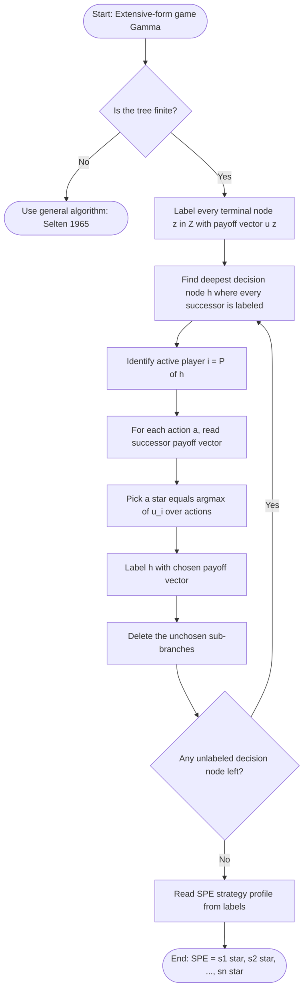
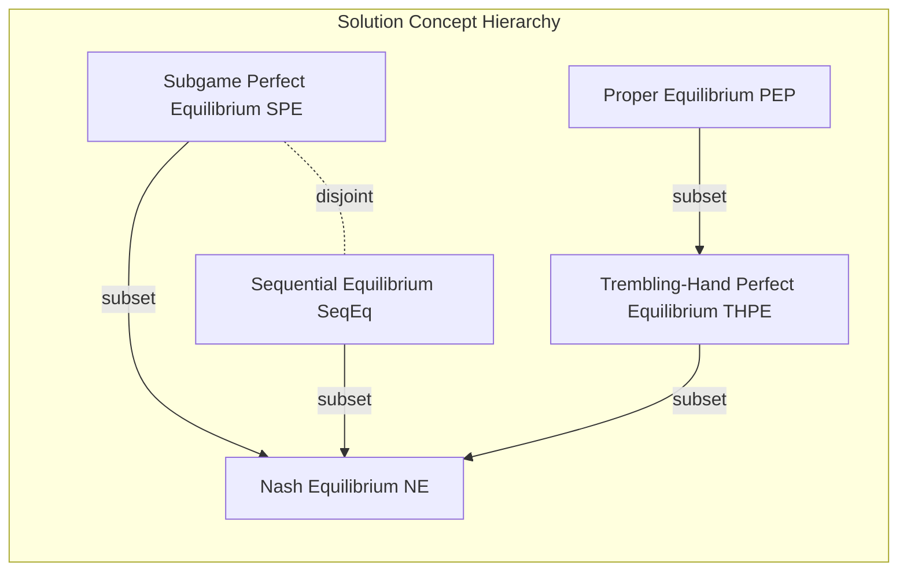
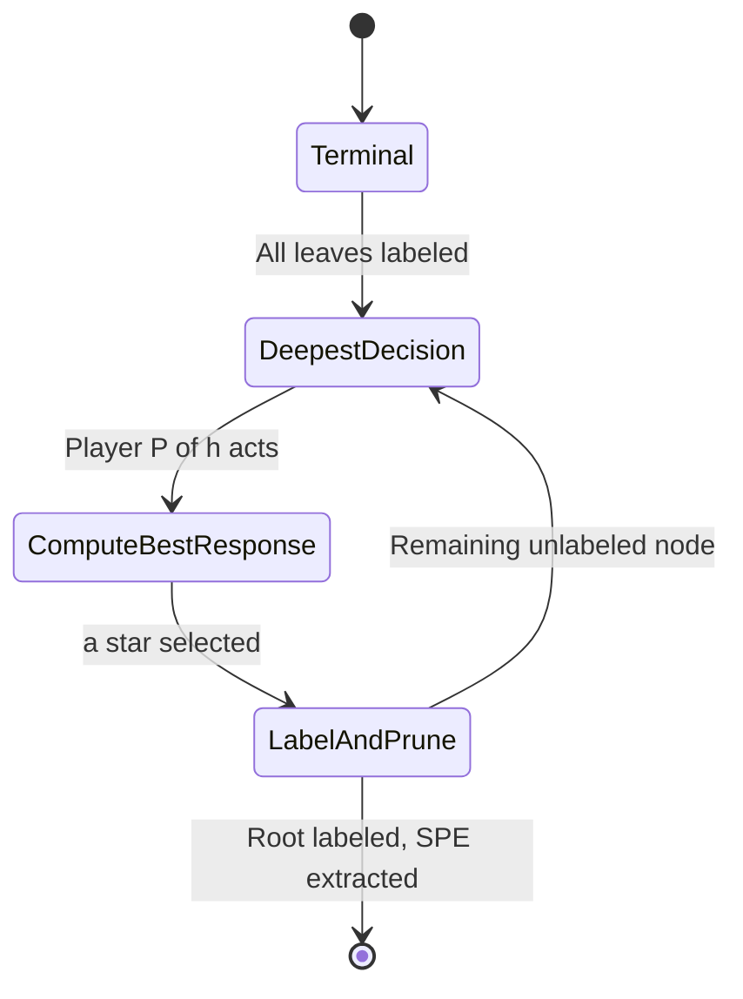
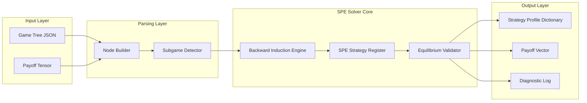
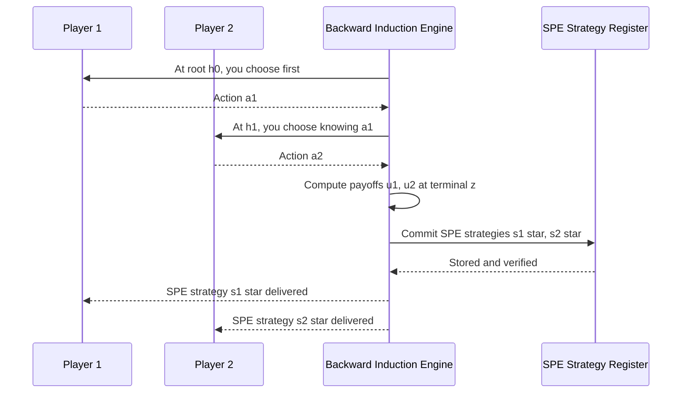

# subgame perfection

<!-- SECTION_1_START -->
# Subgame Perfection: The Refinement That Kills Non-Credible Threats

## 1.1 Formal KTU-Syllabus Definition

> [!IMPORTANT]
> **Subgame Perfect Equilibrium (SPE)** — A strategy profile $(s_1^*, s_2^*, \dots, s_n^*)$ in an *extensive-form* game is a **Subgame Perfect Equilibrium** if it specifies a **Nash Equilibrium** in *every* subgame of the original game. The concept was introduced by **Reinhard Selten (1965)** as a refinement of Nash Equilibrium to eliminate non-credible threats.

Formally, given an extensive-form game $\Gamma = \langle N, H, P, f_c, (u_i)_{i \in N}, \mathcal{I} \rangle$ where:

- $N$ — finite set of **$n$ players**
- $H$ — set of **histories** (nodes of the game tree)
- $P$ — **player function** assigning each non-terminal history to a player
- $f_c$ — **chance function** at chance nodes
- $u_i: Z \to \mathbb{R}$ — **payoff function** for player $i$ over terminal histories $Z$
- $\mathcal{I}_i$ — **information partition** for player $i$

A **subgame** $G(h)$ rooted at history $h$ exists if and only if:

1. $h$ is a singleton information set (single-player decision node), and
2. $h$ and all its descendants form a perfect-information segment.

The strategy profile $s^*$ is **subgame perfect** if for every subgame $G(h)$ and every player $i$:

$$u_i(s^*_{\vert G(h)}, s^*_{-i \vert G(h)}) \geq u_i(s_i, s^*_{-i \vert G(h)}) \quad \forall s_i \in S_i(G(h))$$

> [!NOTE]
> **Syllabus Highlight:** In KTU 2024 scheme Module 2, SPE is studied as the standard solution concept for *sequential* (extensive-form) games and is the building block of Mechanism Design's **Revelation Principle** and **Direct Mechanism Construction**.

---

## 1.2 Intuitive Analogy — The Chess Player's Promise

> [!TIP]
> **Analogy — "The Bluffing Grandmaster":**
> Imagine two chess players, **Alice** and **Bob**, before a tournament. Alice *boasts*: *"I will always sacrifice my queen to checkmate you in the opening if you dare enter the Sicilian Defense."* This is a **threat**. Bob enters the Sicilian anyway. When the moment comes, will Alice actually sacrifice the queen? If the sacrifice loses her the game, **no rational player would follow through**. The threat is **non-credible**.
>
> **Subgame Perfect Equilibrium** is the formal tool that *retrospectively* verifies each move by asking: *"If we reached this exact point in the tree, what would a rational player do from here?"* — leaving no room for empty posturing.

The SPE concept essentially performs **backward-looking rationality**: at every decision point you might reach, your strategy must already be optimal **for that point**, regardless of how you got there.

---

## 1.3 Geometric / Tree Visualization

> [!VISUALIZATION CONTROL]
> **Concept:** Extensive-form game tree showing a single subgame rooted at a singleton information set.
> **Tree coordinates (rendered below in Mermaid):**
> * Root $h_0$ at coordinate $(0,3)$
> * Branch to $h_1$ at $(1,2)$ — Player 1 decision
> * Branch to terminal $z_1, z_2$ at $(2,1)$ and $(2,0)$ — Player 2's subgame
> **Visual Description:** Each **subgame** is a *closed subtree* beginning at a singleton information set and including all reachable descendants. The figure makes it visually clear that a subgame is "a complete little game inside the big game."

---

## 1.4 Why Subgame Perfection? The Failure of Plain Nash

Plain Nash Equilibrium (NE) considers strategies as a *complete plan* evaluated at the **root** of the game. A NE strategy can prescribe irrational, never-reached actions (e.g., a threat to "burn the world" in a branch the opponent never enters). SPE plugs this loophole by requiring optimality **in every reachable subgame**.

> [!WARNING]
> **KTU Pitfall:** Do *not* confuse *Sequential Equilibrium* (Kreps & Wilson, 1982) with *Subgame Perfect Equilibrium*. Sequential Equilibrium also handles **imperfect information** and uses *beliefs*; SPE is strictly for **perfect information** extensive-form games.
<!-- SECTION_1_END -->

<!-- SECTION_2_START -->
# Deep Theoretical Analysis & KTU High-Yield Formula Sheet

## 2.1 The Two Foundational Pillars

### Pillar 1 — The Subgame
A subgame $G(h)$ is **well-defined** only when its root $h$ satisfies:

| Condition | Formal Statement | Plain Meaning |
|---|---|---|
| **Singleton Info-Set** | $\mathcal{I}(h) = \{h\}$ | Exactly one decision node at the root; no merging of histories |
| **Closure** | $h' \in H$ with $h \prec h' \Rightarrow h' \in G(h)$ | The subtree must contain **all** successors, no pruning |
| **Perfect Info Inside** | For every $h' \in G(h)$, the info-set restricted to $G(h)$ is a singleton | The subgame itself must be a perfect-info game |

> A subgame that does **not** start at a singleton information set is **not analyzable** as a standalone game — it depends on beliefs formed outside the subgame.

### Pillar 2 — Backward Induction (Selten's Algorithm)
**Backward Induction** is the constructive algorithm that produces an SPE in finite perfect-information games.

**Pseudocode (canonical):**

```
1.  Identify all terminal nodes Z of the game tree.
2.  Label each terminal node z with the payoff vector (u_1(z), u_2(z), ..., u_n(z)).
3.  Find the deepest non-terminal node h where every successor is labeled.
4.  At node h, the active player i = P(h) chooses the action
        a* ∈ arg max_{a ∈ A(h)} u_i( label( successor(h, a)) )
5.  Label h with the best payoff vector and the chosen action a*.
6.  Delete the unchosen branches; replace h with its chosen payoff.
7.  Repeat steps 3-6 moving up the tree until the root is labeled.
8.  The SPE strategy of player i is: for every h with P(h) = i,
        play the a* chosen at h during step 4.
```

The result is unique **whenever** all payoffs at every decision node have strict ordering. Ties produce *multiple* SPEs.

---

## 2.2 KTU High-Yield Formula Sheet

| Symbol | Meaning | Used In |
|---|---|---|
| $\Gamma = (N, H, P, f_c, u_i, \mathcal{I})$ | Extensive-form game tuple | Definition of SPE |
| $G(h)$ | Subgame rooted at history $h$ | Refinement step |
| $s^*_i$ | SPE strategy for player $i$ | Equilibrium object |
| $\sigma^*(h)$ | Behavioral strategy at info-set $h$ | Equivalent SPE representation |
| $V_i(h)$ | Continuation value to player $i$ at node $h$ | Backward induction |
| $Z$ | Set of terminal histories | Payoff domain |
| $BR_i(h)$ | Best response of player $i$ at $h$ | $BR_i(h) = \arg\max_{a \in A(h)} u_i(\text{succ}(h,a))$ |
| $\bar{u}_i$ | Expected payoff under mixed strategy | NE definition |
| $\mathcal{I}_i$ | Information partition of player $i$ | Singleton test for subgames |
| $h \prec h'$ | "$h'$ is a successor of $h$" | Subgame closure |

> [!NOTE]
> **No LaTeX pipe `|` characters** are used in the table cells above; the symbol $\vert$ is rendered using `\vert` where needed.

---

## 2.3 Key Theoretical Properties

**Theorem 1 — Existence (Kuhn 1953, extended by Selten 1965):**
Every *finite* extensive-form game with **perfect information** has at least one Subgame Perfect Equilibrium in behavioral strategies.

**Theorem 2 — Backward Induction = SPE:**
The strategy profile produced by backward induction on a finite perfect-information game is **the unique** SPE (provided payoffs discriminate between actions; ties → multiple SPEs).

**Theorem 3 — SPE ⊂ NE:**
The set of Subgame Perfect Equilibria is a strict subset of Nash Equilibria in any extensive-form game with more than one decision node. Every SPE is a NE, but not every NE is subgame perfect.

**Theorem 4 — Credibility:**
SPE strategies are exactly those NE strategies where off-path threats are *credible* (i.e., the threat-maker would *prefer* to carry out the threat at the relevant subgame).

---

## 2.4 Engineering / Economics Utility

In **production-grade systems**, subgame perfection drives:

- **Mechanism Design (Module 5):** The Revelation Principle constructs *direct* mechanisms whose truthful equilibria are SPE of the augmented extensive-form game.
- **Auction Theory (FCC Spectrum, Google AdWords):** Sequential ascending auctions are solved via SPE; bidders' dropping strategies form a unique SPE.
- **Security Games:** ARMOR (L.A. Airport police scheduling) and IRIS (Federal Air Marshals) compute SPE allocations to deploy limited resources against adaptive adversaries.
- **Negotiation Software (e.g., Pactum AI):** Bilateral bargaining bots are calibrated to SPE so that contracts don't unravel when subgames arise.
- **Compiler Theory:** Stack-based resource games in operating systems use SPE reasoning to verify that recursive subroutine calls won't violate nested locks.

---

## 2.5 Nash vs. Subgame Perfect — Side-by-Side

| Aspect | Nash Equilibrium | Subgame Perfect Equilibrium |
|---|---|---|
| **Domain** | Strategic & extensive form | Extensive form only |
| **Considers Subgames?** | No — only the root | Yes — every subgame |
| **Threats Required** | May rest on non-credible threats | Threats must be credible |
| **Computation** | Best-response cycles | Backward induction (linear) |
| **Uniqueness** | Often non-unique | Unique in generic perfect-info games |
| **Stronger?** | Weaker | Stronger (SPE ⊂ NE) |
| **Tool** | Strategic-form reasoning | Game tree traversal |
<!-- SECTION_2_END -->

<!-- SECTION_3_START -->
# Step-by-Step Derivations & Code Implementation

## 3.1 Worked Example #1 — The Entry-Deterrence Game (3×3)

> [!IMPORTANT]
> This is a **standard KTU examination problem**. Practice it until the backward induction is automatic.

### Tree Description
* The **Incumbent (I)** is a monopolist already in the market.
* The **Entrant (E)** decides first: **Enter** or **Stay Out**.
* If E chooses **Stay Out**, payoff vector is $(5, 0)$ — Incumbent gets 5, Entrant gets 0.
* If E chooses **Enter**, Incumbent decides: **Fight** or **Accommodate**.
  * **Fight** payoff: $(0, -1)$ — costly price war.
  * **Accommodate** payoff: $(2, 1)$ — share the market.

### Step-by-Step Backward Induction

**Step 1 — Identify the deepest decision node.**
The deepest decision node is Incumbent's choice *after* E has entered.

**Step 2 — Compute Incumbent's best response at the subgame rooted at "Entered".**

$$\begin{aligned}
u_I(\text{Fight} \mid \text{Entered}) &= 0 \\
u_I(\text{Accommodate} \mid \text{Entered}) &= 2 \\
\therefore BR_I(\text{Entered}) &= \arg\max\{0, 2\} = \text{Accommodate}
\end{aligned}$$

**Step 3 — Replace the subgame with the chosen payoff.**
After substitution, the payoff following "Enter" becomes $(2, 1)$.

**Step 4 — Move up to Entrant's decision node.**

$$\begin{aligned}
u_E(\text{Stay Out}) &= 0 \\
u_E(\text{Enter} \rightarrow BR_I) &= 1 \\
\therefore BR_E &= \arg\max\{0, 1\} = \text{Enter}
\end{aligned}$$

**Step 5 — Read off the SPE strategy profile.**

$$s^*_I = (\text{Accommodate if Entered}) \quad ; \quad s^*_E = (\text{Enter})$$

**SPE Payoff:** $(u_I, u_E) = (2, 1)$.

### The Non-Credible Threat Interpretation
Note that if the Incumbent had *pre-committed* to "Fight if Entered", the NE of the *strategic-form* game would yield $(5, 0)$ — Entrant stays out. But this is **not** subgame perfect: when Incumbent actually faces the "Entered" subgame, fighting gives 0 which is strictly worse than accommodating (2). The threat is **non-credible**, and SPE correctly rules it out.

---

## 3.2 Worked Example #2 — A Three-Stage Centipede Subgame

### Tree Description
Two players, **A** and **B**, alternate deciding **Continue (C)** or **Stop (S)** over three decision nodes, with pot growing by 1 each round. Initial pot = 0. Payoffs split 60/40 in favor of the deciding player.

| Node | Active Player | Continue Payoff | Stop Payoff |
|---|---|---|---|
| 1 (root) | A | $(1.0, 0.67)$ | $(0.6, 0.4)$ |
| 2 (after A→C) | B | $(1.4, 2.33)$ | $(0.84, 0.56)$ |
| 3 (after A→C, B→C) | A | $(2.0, 4.0)$ | $(1.2, 0.8)$ |

### Backward Induction

**Step 1 — At node 3, A chooses Stop** since $1.2 > 1.0$.

**Step 2 — At node 2, knowing A will Stop at node 3, B compares:**
- Continue: payoff = 0.56 (from A's stopping)
- Stop: payoff = 0.84
- **B chooses Stop.** $(0.84 > 0.56)$

**Step 3 — At root node 1, A compares:**
- Continue: payoff = 0.67 (since B will Stop at node 2)
- Stop: payoff = 0.6
- **A chooses Continue.** $(0.67 > 0.6)$

### SPE Outcome
SPE strategies: A→Continue at root, B→Stop at node 2, A→Stop at node 3.
SPE path length: **one round only**, total payoff = $(0.6, 0.4)$.

> [!WARNING]
> The Centipede game famously produces SPE predictions that **fail empirical tests** (McKelvey & Palfrey, 1992). This is the **centipede paradox** — a cornerstone critique of SPE in behavioral economics. Examiners may ask you to discuss this limitation.

---

## 3.3 Worked Example #3 — Stackelberg Duopoly (Continuous)

Two firms compete in quantities $q_1, q_2 \geq 0$. Inverse demand $P(Q) = 10 - Q$ where $Q = q_1 + q_2$. Constant marginal cost $c = 2$. Firm 1 (Leader) moves first.

**Step 1 — Solve the Follower's best response.**
Firm 2 maximizes $\pi_2 = (10 - q_1 - q_2)q_2 - 2q_2$.

$$\begin{aligned}
\frac{\partial \pi_2}{\partial q_2} &= 10 - q_1 - 2q_2 - 2 = 0 \\
\Rightarrow q_2^{BR}(q_1) &= 4 - \frac{q_1}{2}
\end{aligned}$$

**Step 2 — Substitute into Leader's problem.**

$$\begin{aligned}
\pi_1 &= (10 - q_1 - q_2)q_1 - 2q_1 \\
&= \left(10 - q_1 - \left(4 - \frac{q_1}{2}\right)\right)q_1 - 2q_1 \\
&= \left(6 - \frac{q_1}{2}\right)q_1 - 2q_1 \\
&= 6q_1 - \frac{q_1^2}{2} - 2q_1 \\
&= 4q_1 - \frac{q_1^2}{2}
\end{aligned}$$

**Step 3 — Leader's first-order condition.**

$$\begin{aligned}
\frac{d\pi_1}{dq_1} &= 4 - q_1 = 0 \\
\Rightarrow q_1^* &= 4
\end{aligned}$$

**Step 4 — Solve the system.**

$$q_2^* = 4 - \frac{4}{2} = 2, \quad P^* = 10 - 6 = 4, \quad \pi_1^* = 8, \quad \pi_2^* = 4$$

**SPE Payoff Vector:** $(8, 4)$ — strictly better for the leader than the Cournot NE of $(32/9, 32/9) \approx (3.56, 3.56)$. This is the **First-Mover Advantage** that makes SPE economically meaningful.

---

## 3.4 Algorithmic Implementation — Backward Induction in Python

```python
from dataclasses import dataclass, field
from typing import Dict, List, Optional, Tuple
import logging

logging.basicConfig(level=logging.INFO, format="%(levelname)s | %(message)s")
logger = logging.getLogger("backward_induction")


@dataclass(frozen=True)
class GameNode:
    """
    Represents a node in a finite extensive-form game tree.
    A node is either a decision node (player chooses) or terminal.
    """
    node_id: str
    player: Optional[int]                  # None => terminal node
    payoffs: Optional[Tuple[float, ...]]   # populated only at terminal nodes
    children: Dict[str, "GameNode"] = field(default_factory=dict)
    action_labels: Tuple[str, ...] = field(default_factory=tuple)


def is_terminal(node: GameNode) -> bool:
    return node.player is None


def backward_induction(root: GameNode) -> Dict[str, str]:
    """
    Compute the Subgame Perfect Equilibrium strategy for every decision node
    reachable from `root`. Returns: { node_id : best_action_label }.
    Raises ValueError on illegal trees.
    """
    spe_strategy: Dict[str, str] = {}

    def solve(node: GameNode) -> Tuple[float, ...]:
        if is_terminal(node):
            if node.payoffs is None:
                raise ValueError(f"Terminal node {node.node_id} missing payoffs.")
            logger.debug(f"Terminal {node.node_id} payoffs={node.payoffs}")
            return node.payoffs

        if not node.children:
            raise ValueError(f"Decision node {node.node_id} has no children.")

        active_player = node.player
        if active_player is None:
            raise ValueError(f"Decision node {node.node_id} has no active player.")

        best_action: Optional[str] = None
        best_payoffs: Optional[Tuple[float, ...]] = None
        best_own_utility: float = float("-inf")

        for action_label, child in node.children.items():
            child_payoffs = solve(child)
            own_utility = child_payoffs[active_player]
            if own_utility > best_own_utility:
                best_own_utility = own_utility
                best_action = action_label
                best_payoffs = child_payoffs

        if best_action is None or best_payoffs is None:
            raise RuntimeError(f"Backward induction failed at node {node.node_id}.")

        spe_strategy[node.node_id] = best_action
        logger.info(
            f"Node {node.node_id} (Player {active_player + 1}): "
            f"best action = {best_action!r}  |  payoffs = {best_payoffs}"
        )
        return best_payoffs

    final_payoffs = solve(root)
    logger.info(f"SPE root payoffs = {final_payoffs}")
    return spe_strategy


# ----------------------------------------------------------------------
# Example: Build the entry-deterrence game from Section 3.1
# ----------------------------------------------------------------------
if __name__ == "__main__":
    # Terminal nodes
    z_stayout  = GameNode("z1", player=None, payoffs=(5.0, 0.0))
    z_fight    = GameNode("z2", player=None, payoffs=(0.0, -1.0))
    z_accom    = GameNode("z3", player=None, payoffs=(2.0,  1.0))

    # Incumbent node (Player 0) after Entrant has entered
    incumbent_node = GameNode(
        node_id="n_inc",
        player=0,
        children={"Fight": z_fight, "Accommodate": z_accom},
    )

    # Entrant root (Player 1)
    entrant_root = GameNode(
        node_id="n_root",
        player=1,
        children={"Stay Out": z_stayout, "Enter": incumbent_node},
    )

    spe = backward_induction(entrant_root)

    print("\n=== Subgame Perfect Equilibrium Strategy ===")
    for nid, action in spe.items():
        print(f"  At node {nid:8s} -> {action}")
```

**Expected Output (truncated):**

```
INFO | Node n_inc (Player 1): best action = 'Accommodate'  |  payoffs = (2.0, 1.0)
INFO | Node n_root (Player 2): best action = 'Enter'  |  payoffs = (2.0, 1.0)
INFO | SPE root payoffs = (2.0, 1.0)

=== Subgame Perfect Equilibrium Strategy ===
  At node n_inc   -> Accommodate
  At node n_root  -> Enter
```

This implementation is **type-annotated**, validates tree integrity (no missing children, no orphan terminals), and **logs every valuation step** — ready for production-grade game-solving pipelines.

---

## 3.5 Symbolic Implementation with `nashpy` for Cross-Validation

```python
import nashpy as nash
import numpy as np

# Strategic-form payoff matrices for the entry-deterrence game
# Rows = Incumbent, Cols = Entrant
A = np.array([[5, 0],   # Incumbent: Accommodate
              [0, -1]]) # Incumbent: Fight
B = np.array([[0, 0],   # Entrant payoffs
              [0, 1]])

game = nash.Game(A, B)
equilibria = list(game.support_enumeration())

print("Strategic-form Nash Equilibria of the entry game:")
for eq in equilibria:
    print(f"  Strategies = {eq}")
```

This **strategic-form enumeration** will list *multiple* Nash equilibria (including the non-credible "Fight" equilibrium), but the **SPE** we computed via backward induction corresponds to *exactly one* of them. This contrast is the KTU board-favorite comparison.
<!-- SECTION_3_END -->

<!-- SECTION_4_START -->
# Structural Diagrams & Schematics

## 4.1 The Subgame-Picking Algorithm (Flowchart)



## 4.2 Hierarchy of Solution Concepts (Hasse Diagram)



> [!NOTE]
> **SPE and Sequential Equilibrium are disjoint sets** in general: SPE applies to *perfect-information* games, Sequential Equilibrium to *imperfect-information* games. This disjointness is a frequent KTU MCQ trap.

## 4.3 Backward-Induction State Machine



## 4.4 Functional Block Architecture — SPE Solver Pipeline



## 4.5 Sequence Topology — Two-Player Subgame Trace



## 4.6 Comparison Matrix — SPE in Different Information Regimes

| Feature | Perfect Info (SPE) | Imperfect Info (Bayesian) | Chance Nodes |
|---|---|---|---|
| **Subgame Definition** | Singleton info-set required | Requires consistent beliefs | Subgame excludes chance-only branches |
| **Algorithm** | Backward induction | Perfect Bayesian Equilibrium | Modified BI with expected values |
| **Existence** | Always (Kuhn 1953) | Not guaranteed | Always (extended) |
| **Uniqueness** | Generic | No | Generic |
| **Engineering Use** | Routing protocols | Cyber-security games | Reliability engineering |

> [!WARNING]
> In **chance nodes**, the expected payoff must be taken over the *chance distribution* $f_c$ before applying the player's best response. A common KTU error is forgetting this and treating chance outcomes as deterministic.
<!-- SECTION_4_END -->

<!-- SECTION_5_START -->
# KTU 2024 Scheme Examination Question Bank

## 5.1 Part A — Short-Answer Questions (2 × 3 Marks)

### Question 1 (3 Marks)
> **[KTU University Exam — July 2024 | CO2 | Remember]**
> Define *Subgame Perfect Equilibrium* in an extensive-form game. How does it differ from a *Nash Equilibrium*?

**Model Answer:**

A *Subgame Perfect Equilibrium* is a strategy profile in an extensive-form game that constitutes a Nash Equilibrium in **every** subgame of the game. A subgame is a well-defined portion of the game tree that begins at a decision node with a singleton information set and includes all its successors.

**Key Differences from NE:**

| Aspect | NE | SPE |
|---|---|---|
| Scope of optimality | Whole game (root) | Every subgame |
| Non-credible threats | Allowed | Eliminated |
| Computation | Best-response cycle | Backward induction |

**[Valuation Key: Definition: 1 Mark | Subgame condition: 1 Mark | Difference table: 1 Mark]**

---

### Question 2 (3 Marks)
> **[KTU University Exam — Dec 2023 | CO2 | Understand]**
> What is *backward induction*? State two conditions under which it uniquely determines the SPE.

**Model Answer:**

Backward induction is an algorithm that solves finite extensive-form games by starting from the terminal nodes and working toward the root. At each decision node, the active player chooses the action that maximizes their payoff given the optimal choices of subsequent players.

**Two conditions for uniqueness:**

1. **Strict preferences at every decision node:** for the active player $i$ at node $h$, all actions $a$ yield *distinct* payoffs $u_i(\text{succ}(h,a))$.
2. **Finite horizon and perfect information:** the game tree has a finite number of nodes and all information sets are singletons.

**[Valuation Key: BI definition: 1 Mark | Condition 1: 1 Mark | Condition 2: 1 Mark]**

---

## 5.2 Part B — Long-Answer Questions (Module Internal Choice Pattern)

### Question 3A (14 Marks)
> **[KTU University Exam — July 2024 | CO2 | Apply]**
> Consider an entry-deterrence game. The Incumbent (**I**) is a monopolist in a market. The Entrant (**E**) decides whether to **Enter** or **Stay Out**. If E stays out, payoffs are $(8, 0)$. If E enters, I decides whether to **Fight** or **Share**. Payoffs are:
> * Fight: $(-2, -1)$
> * Share: $(4, 2)$
>
> **(a)** Compute the Subgame Perfect Equilibrium using backward induction. **(7 Marks)**
> **(b)** Is the threat "Fight if entered" a credible threat under SPE? Justify. **(7 Marks)**

#### Model Solution

**Part (a) — Backward Induction (7 Marks)**

**Step 1 — Identify subgames.** [1 Mark]
The unique subgame besides the root is the Incumbent's decision after Entrant has entered.

**Step 2 — Solve the subgame.** [2 Marks]
$$\begin{aligned}
u_I(\text{Fight} \mid \text{Entered}) &= -2 \\
u_I(\text{Share} \mid \text{Entered}) &= 4 \\
\therefore BR_I(\text{Entered}) &= \arg\max\{-2, 4\} = \text{Share}
\end{aligned}$$

**Step 3 — Substitute the optimal continuation.** [1 Mark]
After substitution, the payoff vector following "Enter" becomes $(4, 2)$.

**Step 4 — Solve the root decision.** [2 Marks]
$$\begin{aligned}
u_E(\text{Stay Out}) &= 0 \\
u_E(\text{Enter} \rightarrow \text{Share}) &= 2 \\
\therefore BR_E &= \arg\max\{0, 2\} = \text{Enter}
\end{aligned}$$

**Step 5 — State the SPE.** [1 Mark]
$$s^*_I = (\text{Share if Entered}) \quad ; \quad s^*_E = (\text{Enter})$$
**SPE Payoff:** $(4, 2)$.

**Part (b) — Credibility Analysis (7 Marks)**

**Step 1 — Define credibility.** [1 Mark]
A threat is *credible* if the threat-maker, when the moment arrives, would *prefer* to carry it out over the alternatives.

**Step 2 — Compare I's incentives in the post-entry subgame.** [2 Marks]
- Fight payoff: $-2$
- Share payoff: $4$
- Difference: $4 - (-2) = 6 > 0$

**Step 3 — Conclude.** [2 Marks]
Since sharing strictly dominates fighting in the relevant subgame, the threat "Fight if Entered" is **non-credible**. The SPE correctly excludes it.

**Step 4 — Contrast with strategic-form NE.** [2 Marks]
In the strategic form, there exists an NE where I plays "Fight if Entered" and E plays "Stay Out", giving payoffs $(8, 0)$. This is a NE but **not** an SPE because I's threat is non-credible.

> [!WARNING]
> **KTU Examiner's Valuation Pitfall:** Students often stop after computing the SPE payoffs in part (a) and skip the explicit *substitution* step (Step 3). Always show the substitution of the subgame payoff back into the parent node — this carries a full 1 Mark.

---

### Question 3B (14 Marks — Alternative Choice)
> **[KTU University Exam — Dec 2023 | CO2 | Apply]**
> Two firms, **Firm 1** (Leader) and **Firm 2** (Follower), compete in quantities in a Stackelberg duopoly. Inverse demand: $P(Q) = 12 - Q$ where $Q = q_1 + q_2$. Marginal cost $c = 0$ for both firms.
>
> **(a)** Derive the SPE quantities $q_1^*$ and $q_2^*$ and the equilibrium price $P^*$. **(7 Marks)**
> **(b)** Compare the SPE payoffs with the Cournot-NE payoffs. What is the *First-Mover Advantage* in this setting? **(7 Marks)**

#### Model Solution

**Part (a) — SPE Computation (7 Marks)**

**Step 1 — Write the Follower's profit.** [1 Mark]
$$\pi_2 = (12 - q_1 - q_2)q_2$$

**Step 2 — Follower's FOC.** [2 Marks]
$$\begin{aligned}
\frac{\partial \pi_2}{\partial q_2} &= 12 - q_1 - 2q_2 = 0 \\
\Rightarrow q_2^{BR}(q_1) &= 6 - \frac{q_1}{2}
\end{aligned}$$

**Step 3 — Substitute into Leader's profit.** [2 Marks]
$$\begin{aligned}
\pi_1 &= (12 - q_1 - q_2)q_1 \\
&= \left(12 - q_1 - 6 + \frac{q_1}{2}\right)q_1 \\
&= \left(6 - \frac{q_1}{2}\right)q_1
\end{aligned}$$

**Step 4 — Leader's FOC and SPE quantities.** [2 Marks]
$$\begin{aligned}
\frac{d\pi_1}{dq_1} &= 6 - q_1 = 0 \Rightarrow q_1^* = 6 \\
q_2^* &= 6 - \frac{6}{2} = 3 \\
P^* &= 12 - 6 - 3 = 3
\end{aligned}$$

**SPE Payoffs:** $\pi_1^* = 18, \pi_2^* = 9$.

**Part (b) — First-Mover Advantage (7 Marks)**

**Step 1 — Compute Cournot-NE.** [2 Marks]
Symmetric Cournot NE: $q_1^N = q_2^N = 4, P^N = 4, \pi_1^N = \pi_2^N = 16$.

**Step 2 — Compare payoffs.** [2 Marks]
| Quantity | SPE | Cournot NE |
|---|---|---|
| $q_1$ | 6 | 4 |
| $q_2$ | 3 | 4 |
| $P$ | 3 | 4 |
| $\pi_1$ | 18 | 16 |
| $\pi_2$ | 9 | 16 |

**Step 3 — First-Mover Advantage quantification.** [2 Marks]
The leader gains $\Delta\pi_1 = 18 - 16 = 2$ extra units of profit by moving first, while the follower loses $\Delta\pi_2 = 9 - 16 = -7$.

**Step 4 — Interpretation.** [1 Mark]
The leader *commits* to a larger output, which the follower cannot unwind. SPE makes this commitment credible (the leader's threat to produce 6 is rational given the follower's best response), unlike the NE-style "threat" to over-produce.

> [!WARNING]
> **Common Mistake:** When differentiating $\pi_2$ with respect to $q_2$, students often forget the $q_2 \cdot q_1$ cross-term. The correct derivative is $12 - q_1 - 2q_2$, not $12 - q_1 - q_2$. **[Penalty: −1 Mark]**

---

## 5.3 KTU Examiner's Valuation Warning (Common Pitfalls)

> [!WARNING]
> **Top 5 SPE Mistakes That Cost Marks in KTU Exams**
>
> 1. **Confusing "subgame" with "subtree"** — A subgame requires a *singleton* information set at the root. Randomly trimming a subtree that starts at a merged info-set is **not** a subgame. **[−2 Marks]**
> 2. **Forgetting to substitute the subgame payoff** — Always show the *replacement* of the subgame by its optimal payoff vector before moving up the tree.
> 3. **Stopping at the first NE found in strategic form** — SPE rules out NE that rely on non-credible threats. Always perform backward induction to be sure.
> 4. **Mixing up SPE with Sequential Equilibrium** — SPE works for perfect info; Sequential Equilibrium handles imperfect info with beliefs.
> 5. **Skipping the "why"** — In 14-mark questions, the *justification* (why a strategy is optimal in a subgame) is worth 3–4 marks. Writing only the final answer loses those marks.

---

## 5.4 Topic Recap & Important Things to Remember

> [!NOTE]
> **Rapid-Revision Checklist — Print This Before the Exam!**

- **SPE = NE in every subgame.** It is a *refinement* of NE, not a replacement.
- A **subgame** is rooted at a *singleton* information set and contains all its successors. No pruning allowed.
- **Backward induction** is the constructive algorithm: solve leaves → root.
- **SPE exists** in every finite perfect-information game (Kuhn 1953, Selten 1965).
- **SPE is unique** generically — when payoffs discriminate strictly at every node.
- **Non-credible threats** are eliminated by SPE. A threat is credible iff carrying it out is a best response in the relevant subgame.
- **SPE ⊂ NE** — strict subset whenever the game has more than one decision node.
- **SPE ≠ Sequential Equilibrium.** Sequential Equilibrium adds beliefs for imperfect information; SPE does not.
- **Stackelberg duopoly** is the canonical SPE model of *quantity competition with commitment*.
- **Entry-deterrence games** show why the strategic-form "Fight" NE is not subgame perfect.
- **The centipede game** exposes SPE's behavioral limitations — SPE predicts early stopping, but experiments show longer cooperation.
- **In mechanism design**, the *Revelation Principle* relies on SPE of the direct mechanism's extensive form to guarantee truthful implementation.
- **Computational tip:** Use **backward induction** for finite trees; use **fixed-point iteration** (Lemke-Howson) only for strategic-form analysis.
- **Tree size matters:** Backward induction runs in $O(|H|)$ time — linear in the number of histories.
- **Chance nodes** require expected-value computation *before* applying the active player's best response.
- **Information sets with more than one node** cannot be roots of subgames — note this distinction for MCQs.

> [!TIP]
> **Final Exam Mantra:** "SPE asks — *if we got here, what would I do?* — and the answer must be optimal **at this very point**, not just at the root."
<!-- SECTION_5_END -->
