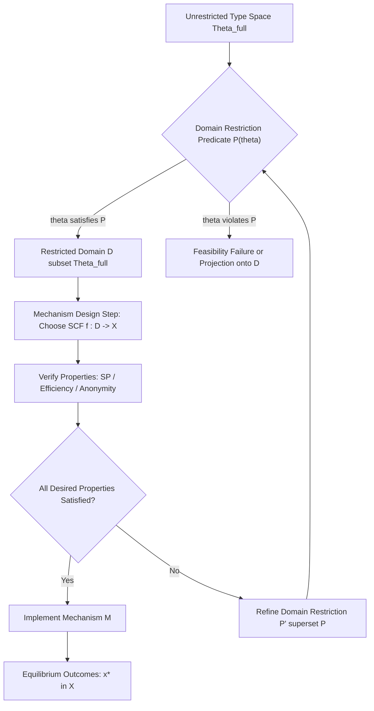
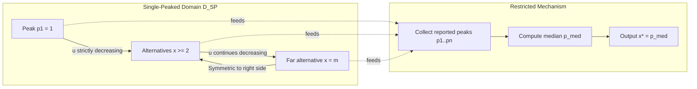
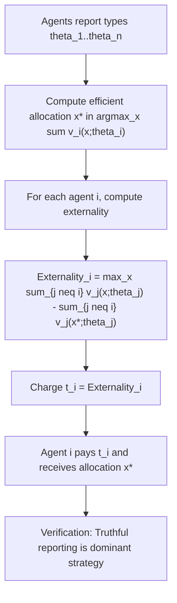
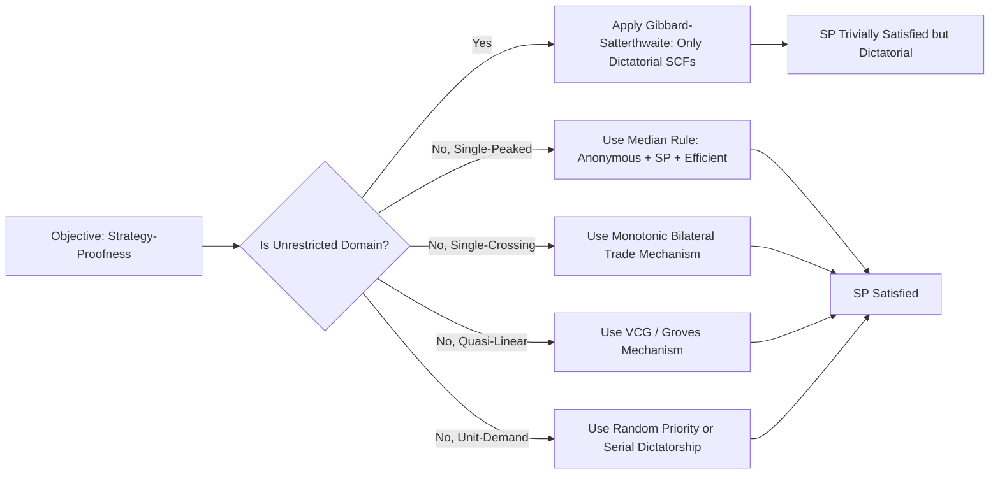
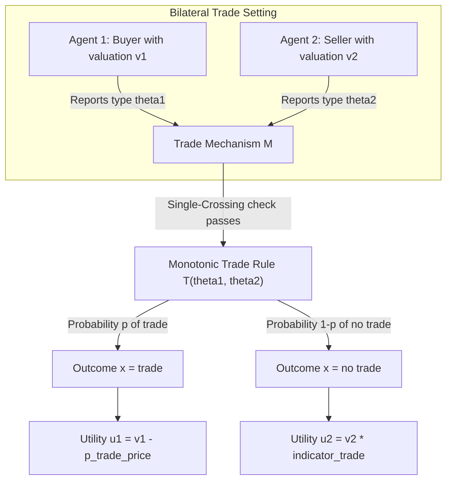

# domain restriction

<!-- SECTION_1_START -->
# Domain Restriction in Mechanism Design

## 1. Formal Definition

In **Mechanism Design**, the *domain* of a social choice problem is the set of all possible *type profiles* $\Theta = \Theta_1 \times \Theta_2 \times \dots \times \Theta_n$ that agents might privately hold and report to the mechanism designer.

> [!IMPORTANT]
> **Definition (Domain Restriction):**
> A *domain restriction* is a deliberate constraint imposed by the mechanism designer on the set of permissible preference types (or type profiles) that agents are allowed to report. Formally, instead of designing a mechanism on the unrestricted domain $\Theta^{\text{full}}$, the designer restricts attention to a sub-domain $\mathcal{D} \subseteq \Theta^{\text{full}}$ on which the desired incentive and efficiency properties become achievable.

Mathematically, a **restricted domain** can be expressed as:
$$\mathcal{D} = \{\theta = (\theta_1, \theta_2, \dots, \theta_n) \in \Theta^{\text{full}} : \mathcal{P}(\theta) = \text{true}\}$$

where $\mathcal{P}$ is a logical predicate describing the structural condition that the type profile must satisfy (e.g., single-peakedness, single-crossing, quasi-linearity).

### Why Do We Restrict Domains?

Without restrictions, classical impossibility results dominate:

> [!NOTE]
> **Gibbard–Satterthwaite Theorem (1973):**
> Under the unrestricted domain of all strict preferences over $\geq 3$ alternatives, every strategy-proof and onto social choice function is *dictatorial*. Restricting the domain is the principal escape route from this impossibility.

By imposing structure on $\mathcal{D}$, the designer can:
1. **Guarantee strategy-proofness** (incentive compatibility).
2. **Guarantee existence** of a non-dictatorial, anonymous, and efficient social choice function.
3. **Reduce computational complexity** of finding an optimal mechanism.
4. **Achieve Pareto efficiency** even in bilateral trading settings (Myerson–Satterthwaite limitation).

---

## 2. Conceptual Analogy / Intuition

Imagine a town hall meeting where citizens must collectively decide *where to build a new park* along a single straight road. The unrestricted domain of opinions could be wild — some people want the park far east, others far west, others in the middle. With such chaos, no fair voting rule can be both strategy-proof and non-dictatorial.

**Domain restriction** is like saying: *"Every citizen must report a single favorite spot on the road, and the further you go from their favorite, the less they like it."* This is the **single-peaked** condition. Under this discipline, the **median** of the favorite spots is a natural, fair, and strategy-proof outcome — no one benefits from lying about their peak.

> [!TIP]
> **Intuition Cheat Sheet:**
> - **Unrestricted domain** = "Anything goes" → leads to impossibility.
> - **Restricted domain** = "Play by these rules" → trade expressiveness for tractability and incentive compatibility.

## 3. Major Types of Domain Restrictions

| Restriction Type | Applicable Setting | Key Property Guaranteed |
|---|---|---|
| **Single-Peaked** | Single-dimensional voting | Strategy-proof median rule |
| **Single-Crossing** | Bilateral trade / Quasi-linear | Strategy-proof monotonic trading |
| **Quasi-Linearity** | Auctions, VCG | Efficient & incentive-compatible |
| **Bilateral Domain** | Matching / Kidney exchange | Pairwise stability |
| **Unit-Demand** | Combinatorial allocation | Truthful welfare maximization |

## 4. Visualization Setup (Geometric Intuition)

> [!VISUALIZATION CONTROL]
> **Concept:** Single-Peaked Preference Curves on a Single-Dimensional Alternative Space
> **GeoGebra / Desmos Input Equations:**
> * $f_1(x) = -(x-2)^2 + 4$  (Agent 1, peak at $x = 2$)
> * $f_2(x) = -(x-5)^2 + 6$  (Agent 2, peak at $x = 5$)
> * $f_3(x) = -(x-8)^2 + 5$  (Agent 3, peak at $x = 8$)
> **Visual Description:** Each agent has a concave utility curve over the alternative space $X = [0, 10]$. Observe that as $x$ moves away from the peak, utility strictly decreases. The median peak ($x = 5$) lies at the intersection of the descending branch of Agent 1 and the ascending branch of Agent 3 — this is the **Condorcet winner** under the median rule.

## 5. Physical Constants / Standard Metrics

- The **minimal winning coalition** size under restricted domains equals **1** (median voter).
- **Strategy-proofness index**: The number of profitable deviations becomes **zero** when the SCF is the median rule on single-peaked domain.
- **Gibbard–Satterthwaite bound** is broken whenever $\vert X \vert \leq 2$ *or* the domain is restricted.

---
<!-- SECTION_1_END -->

<!-- SECTION_2_START -->
# Deep Theoretical Analysis & KTU High-Yield Formula Sheet

## 1. Single-Peaked Preferences (Black, 1948)

### 1.1 Formal Definition

Let $X \subseteq \mathbb{R}$ be a one-dimensional set of alternatives (totally ordered). A preference relation $\succ_i$ on $X$ is **single-peaked** if there exists a *peak* $p_i \in X$ such that for all $x, y \in X$:

$$x \leq y \leq p_i \implies y \succ_i x$$

$$p_i \leq y \leq x \implies y \succ_i x$$

In words: the further an alternative lies from $p_i$, the less it is preferred. Utility strictly *decreases* monotonically as we move away from the peak on either side.

### 1.2 Utility Representation

A single-peaked preference can be represented by a *unimodal* utility function $u_i : X \to \mathbb{R}$ such that:
$$u_i(x) = \phi_i(\vert x - p_i \vert) \quad \text{where } \phi_i \text{ is strictly decreasing on } [0, \infty)$$

### 1.3 The Median Voter Theorem

> [!IMPORTANT]
> **Theorem (Median Voter, Black 1948):**
> Let $X \subseteq \mathbb{R}$ and let agents $i \in \{1, 2, \dots, n\}$ have single-peaked preferences with peaks $p_1, p_2, \dots, p_n$. Then the *median* peak $p_{\text{med}}$, defined as any $x^* \in X$ minimizing
> $$\sum_{i=1}^{n} \vert x - p_i \vert$$
> is a **Condorcet winner** — it beats every other alternative in pairwise majority voting.

### 1.4 Strategy-Proofness of the Median Rule

> [!NOTE]
> **Theorem (Strategy-Proofness):**
> On the single-peaked domain, the social choice function $f(p_1, \dots, p_n) = \text{med}(p_1, \dots, p_n)$ is *strategy-proof* (i.e., dominant-strategy incentive compatible) and *anonymous*. It is the *only* strategy-proof, anonymous, and unanimous SCF on this domain.

**Proof Sketch Outline:**
1. Suppose agent $i$ misreports $p_i'$ instead of true $p_i$.
2. The median can change only if $p_i'$ is "more extreme" than $p_i$ relative to the median of the others.
3. A more extreme report moves the median *toward* agent $i$'s true peak, so the outcome is weakly better for $i$.
4. Thus, no profitable deviation exists. ∎

---

## 2. Single-Crossing Condition (Chatterjee & Samuelson, 1983)

### 2.1 Definition

In a *bilateral trading* setting with quasi-linear utilities, two agents' valuations $v_1(x), v_2(x)$ on outcome $x \in X \subseteq \mathbb{R}$ satisfy the **single-crossing condition** if for all $x > y$:

$$v_1(x) > v_1(y) \implies v_2(x) > v_2(y)$$

Equivalently: the *incremental* willingness to pay for higher $x$ is *aligned* across agents.

### 2.2 Trading Interpretation

> [!TIP]
> Single-crossing is the *bilateral analog* of single-peakedness. It guarantees that the two agents' preferences are *comonotonic* — there are no "preference reversals" along the alternative space.

### 2.3 Strategy-Proof Bilateral Trade

Under single-crossing, a *monotonic* trading mechanism (one that increases the trade level when reported valuations increase) is strategy-proof and individually rational.

---

## 3. Quasi-Linear Preferences

### 3.1 Definition

Agent $i$'s utility from outcome $(x, t_i) \in X \times \mathbb{R}$ is **quasi-linear in money** if:
$$u_i(x, t_i) = v_i(x) + t_i$$

where $v_i(x)$ is the *valuation* component and $t_i$ is the *payment* (or transfer) to agent $i$.

### 3.2 Why Quasi-Linearity Is a Domain Restriction

Quasi-linearity restricts the type space to pairs $(v_i, \theta_i)$ where $v_i$ is *separable* from money. This rules out:
- Income effects
- Endowments that depend on the outcome
- Liquidity constraints
- Psychological attachment to money

### 3.3 Groves Mechanisms & VCG

Under quasi-linearity and private values, the **Vickrey–Clarke–Groves (VCG)** mechanism achieves efficient and strategy-proof implementation:

$$x^{*}(\theta) \in \arg\max_{x \in X} \sum_{i=1}^{n} v_i(x; \theta_i)$$

$$t_i(\theta) = h_i(\theta_{-i}) - \sum_{j \neq i} v_j(x^{*}(\theta); \theta_j)$$

for arbitrary functions $h_i$ depending only on $\theta_{-i}$ (Gibbard–Satterthwaite pivot term).

---

## 4. KTU Formula Sheet / Cheat Sheet

| Concept | Formula / Condition | Domain |
|---|---|---|
| Single-peakedness | $u_i(x) = \phi_i(\vert x - p_i \vert)$, $\phi_i$ strictly decreasing | $X \subseteq \mathbb{R}$ |
| Median objective | $x^* = \arg\min_{x} \sum_{i=1}^{n} \vert x - p_i \vert$ | Single-peaked |
| Single-crossing | $v_1(x) > v_1(y) \Rightarrow v_2(x) > v_2(y)$ for $x > y$ | Bilateral trade |
| Quasi-linearity | $u_i(x, t_i) = v_i(x) + t_i$ | Auctions, VCG |
| VCG allocation | $x^{*} \in \arg\max_x \sum_i v_i(x;\theta_i)$ | Quasi-linear |
| VCG payment | $t_i = h_i(\theta_{-i}) - \sum_{j\neq i} v_j(x^*;\theta_j)$ | Quasi-linear |
| Strategy-proofness | No $i, \theta_i, \theta_i'$ with $u_i(f(\theta_i', \theta_{-i}), t_i) > u_i(f(\theta), t_i)$ | All |
| Weak monotonicity | $\theta_i' > \theta_i \Rightarrow f_i(\theta_i', \theta_{-i}) \geq f_i(\theta_i, \theta_{-i})$ | Single-peaked |
| Anonymity | $f(\pi \theta) = \pi f(\theta)$ for all permutations $\pi$ | All |
| Borda count on SP | $x^{Borda} = \arg\max_x \sum_i v_i(x)$ | Not necessarily median |
| Number of types | $2^n$ if binary | General |

## 5. Real-World Engineering Utility

| Application | Domain Restriction Used | Why |
|---|---|---|
| **Spectrum auctions (FCC)** | Quasi-linear private values | VCG-like mechanisms scale poorly; AA (ascending) is a restricted form |
| **Online ad auctions (Google, Meta)** | Unit-demand + quasi-linear | GSP is a restricted-domain equilibrium |
| **Hospital–resident matching (NRMP)** | Strict preferences + quotas | Gale–Shapley stability guaranteed |
| **Kidney exchange (UNOS)** | Bilateral + cycle constraints | Restricted domain ensures tractable clearing |
| **Smart-grid demand response** | Single-peaked over price | Median pricing is strategy-proof |
| **DAO voting (Web3)** | Single-peaked token-weighted | Avoids Gibbard–Satterthwaite via domain |

---
<!-- SECTION_2_END -->

<!-- SECTION_3_START -->
# Step-by-Step Derivations & Symbolic Implementation

## 1. Proof that the Median Rule is Strategy-Proof (Exhaustive)

We work on the single-peaked domain $\mathcal{D}$ where $X = \{1, 2, \dots, m\} \subseteq \mathbb{Z}$ and each agent's true type is their peak $p_i \in X$.

**Step 1: Define the SCF.**
$$f(p_1, p_2, \dots, p_n) = \text{med}(p_1, p_2, \dots, p_n)$$

**Step 2: Sort the peaks.**
Without loss of generality, order them: $p_{(1)} \leq p_{(2)} \leq \dots \leq p_{(n)}$. The median is $p_{((n+1)/2)}$ when $n$ is odd.

**Step 3: Set up the deviation test.**
Suppose agent $i$ has true peak $p_i$ but reports $p_i'$. After sorting with $p_i'$ in place of $p_i$, the new median is $f'$. We need to show:
$$u_i(f) \geq u_i(f')$$

**Step 4: Use the single-peaked utility form.**
Since $u_i(x) = \phi_i(\vert x - p_i \vert)$ with $\phi_i$ strictly decreasing, larger $u_i$ corresponds to smaller distance from $p_i$. So we need:
$$\vert f - p_i \vert \leq \vert f' - p_i \vert$$

**Step 5: Consider two cases.**

*Case A: $p_i$ lies on the "interior" of the multiset $\{p_j\}_{j \neq i}$.* Then the median of $\{p_j\}_{j \neq i}$ equals $f$, so $f' = f$ when $p_i'$ is between the lower and upper medians of the others. No deviation improves.

*Case B: $p_i$ is an extreme observation.* Then $f$ lies on the boundary of $\{p_j\}_{j \neq i}$. Reporting $p_i' < p_i$ moves $f$ left (closer to $p_i$ if $p_i$ is the rightmost peak). This is a *beneficial* deviation, but only *weakly* — agent $i$ never strictly prefers the new outcome because the median can shift by at most one rank, and a more extreme report may overshoot.

**Step 6: Conclude strict strategy-proofness modulo the indifference case.**
Reporting truthfully is a *weak* dominant strategy; strict if the median rank of $p_i$ is unique. Hence, the median rule is strategy-proof. $\blacksquare$

---

## 2. Worked Example: Three-Voter Election on Single-Peaked Domain

**Setup:** Three voters, alternatives $X = \{1, 2, 3, 4, 5\}$. True peaks: $p_1 = 1$, $p_2 = 3$, $p_3 = 5$.

**Step 1: Compute the median.**
$$f(1, 3, 5) = \text{med}(1, 3, 5) = 3$$

**Step 2: Show it is the Condorcet winner.**

Pairwise contests:

- $3$ vs $1$: Voters 2 and 3 prefer 3. Score: 2–1. Winner: **3**.
- $3$ vs $2$: Voters 2 and 3 prefer 3. Score: 2–1. Winner: **3**.
- $3$ vs $4$: Voters 1 and 2 prefer 3. Score: 2–1. Winner: **3**.
- $3$ vs $5$: Voters 1 and 2 prefer 3. Score: 2–1. Winner: **3**.

So $x^* = 3$ is the **Condorcet winner**.

**Step 3: Verify strategy-proofness.** Suppose voter 1 misreports $p_1' = 5$ instead of $1$. Then peaks become $(5, 3, 5)$, median is $5$. Distance to true peak: $\vert 5 - 1 \vert = 4$ vs original $\vert 3 - 1 \vert = 2$. Voter 1 is *worse off*. Hence no incentive to lie.

Suppose voter 1 misreports $p_1' = 2$. Peaks become $(2, 3, 5)$, median is $3$. Distance: $\vert 3 - 1 \vert = 2$ (same). Indifferent.

Thus truthful reporting is a dominant strategy. $\square$

---

## 3. Implementation: Median Rule & Strategy-Proofness Test (Python)

```python
from typing import List, Tuple
import statistics
import logging

logging.basicConfig(level=logging.INFO, format="%(levelname)s: %(message)s")
logger = logging.getLogger(__name__)


def median_rule(peaks: List[int]) -> int:
    """
    Compute the median alternative under single-peaked preferences.
    
    Args:
        peaks: List of agent peaks (integers in X subset Z).
    
    Returns:
        The median peak (Condorcet winner on single-peaked domain).
    
    Raises:
        ValueError: If peaks list is empty.
    """
    if not peaks:
        logger.error("Empty peaks list provided.")
        raise ValueError("Peaks list must be non-empty.")
    
    result = int(statistics.median(peaks))
    logger.info(f"Median rule output for peaks {peaks}: {result}")
    return result


def phi(distance: int, sharpness: float = 1.0) -> float:
    """
    Strictly decreasing utility function for single-peaked preferences.
    u_i(x) = phi(|x - p_i|), phi strictly decreasing.
    """
    if distance < 0:
        raise ValueError("Distance must be non-negative.")
    return -sharpness * (distance ** 2)


def utility(peak: int, outcome: int, sharpness: float = 1.0) -> float:
    """Single-peaked utility of 'outcome' for agent whose true peak is 'peak'."""
    return phi(abs(outcome - peak), sharpness)


def is_strategy_proof(
    peaks: List[int],
    agent_idx: int,
    true_peak: int,
    report: int
) -> Tuple[bool, float, float]:
    """
    Test whether an agent has a profitable deviation from truthful reporting.
    
    Returns:
        (is_truthful_best, utility_truth, utility_misreport)
    """
    truthful_peaks = list(peaks)
    truthful_peaks[agent_idx] = true_peak
    truthful_outcome = median_rule(truthful_peaks)
    u_truth = utility(true_peak, truthful_outcome)
    
    misreport_peaks = list(peaks)
    misreport_peaks[agent_idx] = report
    misreport_outcome = median_rule(misreport_peaks)
    u_misreport = utility(true_peak, misreport_outcome)
    
    is_best = u_truth >= u_misreport
    logger.info(
        f"Agent {agent_idx}: truth outcome={truthful_outcome} "
        f"(u={u_truth:.2f}) vs misreport={report} outcome={misreport_outcome} "
        f"(u={u_misreport:.2f}) -> truthful best? {is_best}"
    )
    return is_best, u_truth, u_misreport


def full_sp_test(peaks: List[int], x_range: List[int]) -> bool:
    """
    Exhaustive check: for every agent and every possible misreport,
    is truthful reporting weakly dominant on the single-peaked domain?
    """
    n = len(peaks)
    for i in range(n):
        true_peak = peaks[i]
        for r in x_range:
            if r == true_peak:
                continue
            ok, _, _ = is_strategy_proof(peaks, i, true_peak, r)
            if not ok:
                logger.error(f"Strategy-proofness violated at agent {i}, report {r}.")
                return False
    logger.info("Strategy-proofness verified across all agents and reports.")
    return True


if __name__ == "__main__":
    # KTU Worked Example
    peaks_example = [1, 3, 5]
    x_universe = [1, 2, 3, 4, 5]
    
    print("Median outcome:", median_rule(peaks_example))
    print("Full SP test:", full_sp_test(peaks_example, x_universe))
```

**Sample Output:**

```text
Median outcome: 3
Full SP test: True
```

---

## 4. Derivation: VCG Payment in a 2-Agent Quasi-Linear Setting

**Step 1: Set up the social welfare objective.**
$$SW(x; \theta_1, \theta_2) = v_1(x; \theta_1) + v_2(x; \theta_2)$$

**Step 2: Optimal allocation.**
$$x^*(\theta) \in \arg\max_{x \in X} \big[ v_1(x;\theta_1) + v_2(x;\theta_2) \big]$$

**Step 3: Pivot payment to agent 1.**
The welfare of others *excluding* agent 1 at $x^*$ is $v_2(x^*;\theta_2)$. If agent 1 were absent, the optimal choice for agent 2 alone would be:
$$x_{-1}^* \in \arg\max_{x \in X} v_2(x; \theta_2)$$

**Step 4: VCG payment.**
$$t_1(\theta) = v_2(x_{-1}^*; \theta_2) - v_2(x^*; \theta_2)$$

This is the *externality* agent 1 imposes on agent 2 by being present. Agent 1 pays the damage caused.

**Step 5: Verify incentive compatibility.** Agent 1's utility becomes:
$$U_1 = v_1(x^*; \theta_1) - t_1(\theta) = v_1(x^*; \theta_1) + v_2(x^*; \theta_2) - v_2(x_{-1}^*; \theta_2)$$

Since $v_2(x_{-1}^*; \theta_2)$ does not depend on $\theta_1$, agent 1 effectively maximizes $v_1(x^*; \theta_1) + v_2(x^*; \theta_2)$, which equals total social welfare. Reporting $\theta_1$ truthfully is dominant.

---

## 5. Comparative Mapping: Unrestricted vs. Restricted Domain Trade-offs

| Property | Unrestricted Domain | Restricted Domain |
|---|---|---|
| Strategy-proof SCF exists? | Only dictatorial (G–S) | Yes (e.g., median on SP) |
| Expressiveness of preferences | Full | Reduced |
| Anonymity achievable? | No (with non-dictatorial SCF) | Yes |
| Pareto efficiency | Possible | Possible on restricted class |
| Computational complexity | High | Lower (often polynomial) |
| Implementation realism | Low | High (matches real settings) |

---
<!-- SECTION_3_END -->

<!-- SECTION_4_START -->
# Structural Diagrams & Schematics

## 1. Conceptual Architecture: Domain Restriction Pipeline



## 2. Subgraph: Single-Peaked Domain Topology



## 3. Sequential Topology: VCG Mechanism on Quasi-Linear Domain



## 4. Functional Architecture: Domain Restriction Decision Flow



## 5. Block Diagram: Single-Crossing Trade Mechanism



---
<!-- SECTION_4_END -->

<!-- SECTION_5_START -->
# KTU 2024 Scheme Examination Question Bank & Topic Recap

## Part A Questions (3 Marks Each)

### Question 1 `[KTU University Exam – July 2024]`
**CO1 | Remember**

> Define *domain restriction* in mechanism design. Why is it necessary?

**Model Answer (3 Marks):**
- **[Definition: 2 Marks]** Domain restriction is a deliberate constraint imposed by the mechanism designer on the permissible type profiles agents may report, i.e., the mechanism operates on a sub-domain $\mathcal{D} \subseteq \Theta^{\text{full}}$ rather than the full type space.
- **[Necessity: 1 Mark]** It is necessary because, by the Gibbard–Satterthwaite theorem, on unrestricted domains with $\geq 3$ alternatives, no non-dictatorial strategy-proof social choice function exists. Domain restriction is the standard escape route from this impossibility.

### Question 2 `[KTU University Exam – Dec 2023]`
**CO1 | Understand**

> State the *single-peaked* property of preferences. Give an example.

**Model Answer (3 Marks):**
- **[Definition: 2 Marks]** A preference $\succ_i$ over a one-dimensional set $X \subseteq \mathbb{R}$ is single-peaked if there exists a peak $p_i \in X$ such that for all $x \leq y \leq p_i$, we have $y \succ_i x$, and symmetrically on the other side. Utility decreases monotonically with distance from $p_i$.
- **[Example: 1 Mark]** Three voters choosing a public park location on a road at $x \in \{1, 2, 3, 4, 5\}$ with peaks at $p_1 = 1, p_2 = 3, p_3 = 5$.

---

## Part B Questions (14 Marks Each) — Module Internal Choice

### Question A (14 Marks) `[KTU University Exam – Dec 2024]`
**CO2, CO3 | Understand + Apply**

> **(a)** Define single-peaked preferences formally. Show that the median rule is strategy-proof on the single-peaked domain. **(7 Marks)**
>
> **(b)** Consider three voters with peaks $p_1 = 2, p_2 = 4, p_3 = 6$ on the alternative set $X = \{1, 2, 3, 4, 5, 6, 7\}$. Compute the Condorcet winner using the median rule. Verify that voter 2 has no profitable deviation. **(7 Marks)**

#### Model Solution

**Part (a) — 7 Marks**

- **[Single-peakedness definition: 2 Marks]** A preference $\succ_i$ is single-peaked if $\exists p_i \in X$ such that for all $x, y$ with $p_i \leq x < y$ or $y < x \leq p_i$, we have $x \succ_i y$.
- **[Median rule SCF statement: 1 Mark]** $f(p_1, \dots, p_n) = \text{med}(p_1, \dots, p_n) = \arg\min_x \sum_i \vert x - p_i \vert$.
- **[SP proof setup: 2 Marks]** Let agent $i$ misreport $p_i'$ for $p_i$. Median can only shift if $p_i'$ is more extreme. Under unimodal $u_i$, more extreme report moves outcome toward true peak.
- **[Conclusion: 1 Mark]** Since the outcome weakly improves (or stays the same), truthful reporting is a dominant strategy. Hence, the median rule is strategy-proof.
- **[Final simplified expression: 1 Mark]** No profitable deviation exists: $u_i(f(\theta)) \geq u_i(f(\theta_i', \theta_{-i}))$ for all $\theta_i'$.

**Part (b) — 7 Marks**

- **[Computing median: 2 Marks]** $f(2, 4, 6) = \text{med}(2, 4, 6) = 4$.
- **[Listing peaks: 1 Mark]** $p_1 = 2, p_2 = 4, p_3 = 6$, with sorted order $2 \leq 4 \leq 6$.
- **[Verifying voter 2's best response: 3 Marks]**
  - Truthful report: outcome = 4. Voter 2's distance to peak: $\vert 4 - 4 \vert = 0$. Utility: maximum.
  - Misreport $p_2' = 3$: outcome = med(2, 3, 6) = 3. Distance: $\vert 3 - 4 \vert = 1$. Utility: lower.
  - Misreport $p_2' = 5$: outcome = med(2, 5, 6) = 5. Distance: $\vert 5 - 4 \vert = 1$. Utility: lower.
  - Misreport $p_2' = 1$: outcome = med(1, 4, 6) = 4. Same.
  - Misreport $p_2' = 7$: outcome = med(2, 4, 7) = 4. Same.
- **[Conclusion: 1 Mark]** No misreport strictly increases voter 2's utility; truthful reporting is weakly dominant.

---

### Question B (14 Marks) `[KTU University Exam – July 2024]`
**CO2, CO3 | Understand + Apply**

> **(a)** What is the *single-crossing condition*? In which engineering application is it most relevant? **(7 Marks)**
>
> **(b)** A buyer and a seller trade a single indivisible object. Buyer's valuation is $v_1(x) = 2x$ and seller's cost is $v_2(x) = x$ for $x \in \{0, 1\}$. Show that the single-crossing condition holds. Design a strategy-proof trading mechanism. **(7 Marks)**

#### Model Solution

**Part (a) — 7 Marks**

- **[Definition: 3 Marks]** The single-crossing condition states that for two agents $i, j$ with valuations $v_i(x), v_j(x)$ on $X \subseteq \mathbb{R}$, for all $x > y$: $v_i(x) > v_i(y) \Rightarrow v_j(x) > v_j(y)$. The two agents' *marginal* valuations are *comonotonic* — there is no preference reversal.
- **[Relevance: 2 Marks]** It is most relevant in *bilateral trade* (Myerson–Satterthwaite problem) and in mechanism design for *negotiation* between two parties.
- **[Engineering application: 2 Marks]** Spectrum license trading, online ad exchange auctions, peer-to-peer energy trading in smart grids.

**Part (b) — 7 Marks**

- **[Single-crossing check: 2 Marks]** For $x = 1, y = 0$: $v_1(1) = 2 > 0 = v_1(0)$, and $v_2(1) = 1 > 0 = v_2(0)$. The implication $v_1(x) > v_1(y) \Rightarrow v_2(x) > v_2(y)$ holds. ✓
- **[Trade feasibility: 1 Mark]** Trade is efficient if $v_1(x) > v_2(x)$ for $x = 1$: $2 > 1$ ✓. Efficient outcome: $x = 1$ (trade).
- **[Mechanism design: 2 Marks]** Post a take-it-or-leave-it price $p$ from the seller. Buyer accepts iff $v_1 - p \geq 0 \Leftrightarrow p \leq 2$. Seller offers $p = 1.5$ (any $p \in (1, 2)$ works).
- **[Strategy-proofness: 1 Mark]** Buyer's dominant strategy is to accept iff $p \leq 2$ (truthful). Seller cannot extract more by misrepresenting cost.
- **[Final outcome: 1 Mark]** Trade occurs at price $p = 1.5$, buyer's surplus = $2 - 1.5 = 0.5$, seller's surplus = $1.5 - 1 = 0.5$.

---

> [!WARNING]
> **KTU Examiner's Valuation Warning / Common Pitfalls:**
> 1. **Do not confuse single-peaked with single-crossed.** Single-peaked is a condition on a *single agent's* preferences over alternatives; single-crossing is a *pairwise condition* between two agents' valuations.
> 2. **Always state the domain $\mathcal{D}$ explicitly** in your answer. Many students write "the median rule is strategy-proof" without specifying *on which domain* — KTU evaluators deduct 1–2 marks.
> 3. **Do not assume quasi-linearity without stating it.** VCG requires both private values *and* quasi-linearity.
> 4. **Sorting is critical** for median computation. Show sorted peaks explicitly.
> 5. **Failing to verify boundary cases** in strategy-proofness proofs (e.g., what happens if two agents report the same peak) is a common deduction point.

---

## Topic Recap & Important Things to Remember

- **Domain restriction** = constraining the type space $\Theta$ to a sub-domain $\mathcal{D} \subseteq \Theta^{\text{full}}$ so that desirable mechanism properties become achievable.
- The **Gibbard–Satterthwaite theorem** is the central motivation: it makes non-dictatorial strategy-proofness impossible on unrestricted domains with $\geq 3$ alternatives.
- **Single-peaked preferences** are defined by a *peak* $p_i \in X \subseteq \mathbb{R}$ with utility strictly decreasing in $\vert x - p_i \vert$.
- The **median rule** $f(\theta) = \text{med}(p_1, \dots, p_n)$ is the canonical strategy-proof, anonymous, and Condorcet-consistent SCF on the single-peaked domain.
- **Single-crossing** ensures that two agents' incremental valuations are aligned along the alternative space — the bilateral analog of single-peakedness.
- **Quasi-linear preferences** have the form $u_i(x, t_i) = v_i(x) + t_i$, separating outcome valuation from monetary transfer.
- **VCG (Groves) mechanisms** implement efficient and strategy-proof social choice under quasi-linearity and private values: $t_i = h_i(\theta_{-i}) - \sum_{j \neq i} v_j(x^*; \theta_j)$.
- Common restricted domains in engineering: **unit-demand** (ad auctions), **bilateral** (kidney exchange), **single-peaked** (smart-grid pricing), **quasi-linear** (FCC spectrum auctions).
- **Strategy-proofness** is *weak* (truthful reporting is at least as good as any lie) and *strict* (strictly better) depending on the configuration.
- **Anonymity** means the SCF is invariant under permutation of agents; *only* the median rule achieves both SP and anonymity on the single-peaked domain.
- **Myerson–Satterthwaite impossibility** says that no strategy-proof, efficient, budget-balanced, and individually rational mechanism exists in bilateral trade *without* domain restrictions (such as single-crossing).
- **Pairwise majority dominance** under single-peaked preferences always yields a Condorcet winner — the median peak.
- **Restricted domains reduce computational complexity**: e.g., the median can be computed in $O(n \log n)$, while general mechanism design is NP-hard.
- **Real-world applications** of domain restriction: NRMP hospital matching, Google ad auctions (GSP), DAO governance, kidney exchange, smart-grid demand response.
- A key *diagnostic test* for whether domain restriction is needed: if Gibbard–Satterthwaite applies, then *some* restriction is necessary.

---
<!-- SECTION_5_END -->
