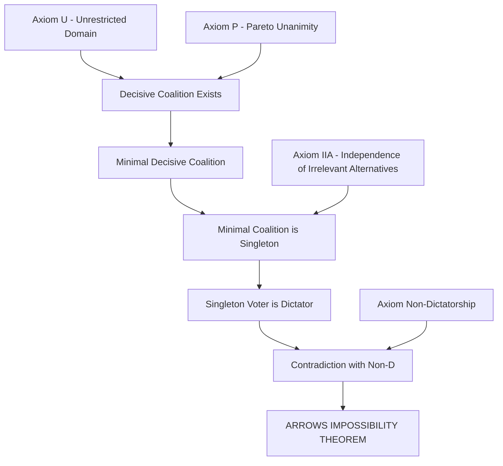
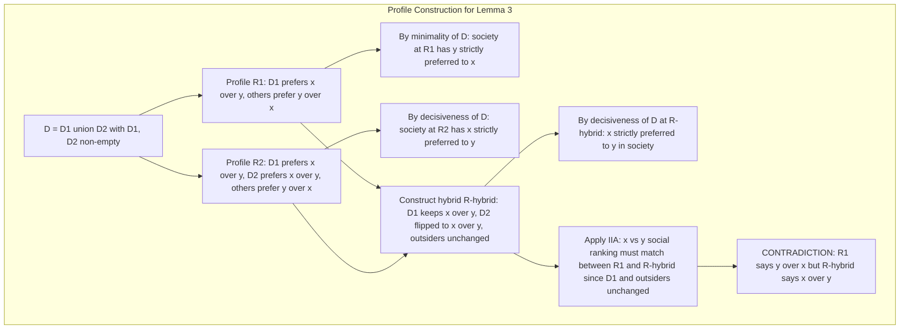
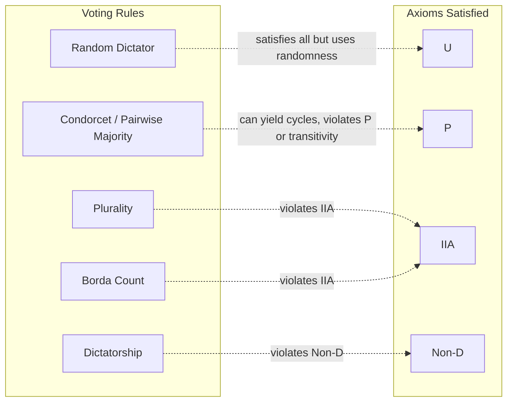
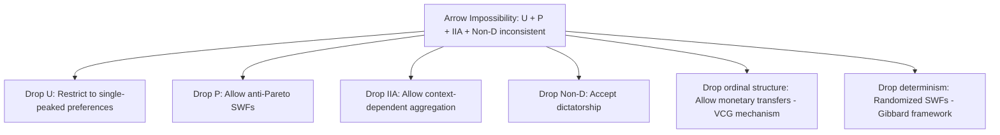

# introduction and proof of Arrow’s impossibility result

<!-- SECTION_1_START -->
# Arrow's Impossibility Theorem: Core Definition & Intuitive Overview

> [!IMPORTANT]
> **Arrow's Impossibility Theorem** (Kenneth Arrow, 1951, Nobel Prize 1972) is the central impossibility result in **Social Choice Theory** and a cornerstone of **Mechanism Design**. The theorem is studied in KTU's **PECST753 – Game Theory and Mechanism Design** under Module 3 to formally prove that no "perfect" voting rule can simultaneously satisfy a small set of seemingly reasonable fairness axioms when there are **3 or more alternatives**.

## 1.1 Formal Academic Definition

Let $N = \{1, 2, \dots, n\}$ be a finite set of **voters** (agents) and let $A = \{x, y, z, \dots\}$ be a finite set of **alternatives** (outcomes, candidates) with $\vert A \vert \geq 3$.

A **preference profile** is a list $\mathbf{R} = (R_1, R_2, \dots, R_n)$ where each $R_i$ is a complete, transitive, antisymmetric binary relation (a strict total order, i.e., a ranking) over $A$.

A **Social Choice Function (SCF)** is a mapping
$$F : \mathcal{L}^n \longrightarrow \mathcal{L}$$
where $\mathcal{L}$ is the set of all strict total orders over $A$, and $\mathcal{L}^n$ is the set of all $n$-tuples of such orders.

A **Social Welfare Function (SWF)** is a mapping
$$F : \mathcal{L}^n \longrightarrow \mathcal{L}$$
that aggregates the individual rankings into a **single societal ranking**.

**Arrow's Question (1951):** *Is there an SWF that simultaneously satisfies Unrestricted Domain, Pareto Efficiency, Independence of Irrelevant Alternatives, and Non-Dictatorship?*

> [!NOTE]
> **Arrow's Theorem (Statement):** For $\vert A \vert \geq 3$, every Social Welfare Function satisfying **Unrestricted Domain (U)**, **Weak Pareto Efficiency (P)**, **Independence of Irrelevant Alternatives (IIA)**, and **Non-Dictatorship (D)** **must be a dictatorship** — there exists some voter $i^*$ whose strict preferences dictate the social ranking. In other words, **no non-dictatorial SWF can satisfy U, P, and IIA together**.

## 1.2 Intuitive Analogy — The Voting Paradox

Imagine a class of **3 students** electing the **class representative** from 3 candidates: *Alice, Bob, Carol*. Each student ranks the three in order of preference.

- Student 1: Alice > Bob > Carol
- Student 2: Bob > Carol > Alice
- Student 3: Carol > Alice > Bob

Notice that **Alice beats Bob** in a head-to-head majority (Students 1 and 3 prefer Alice), **Bob beats Carol** (Students 1 and 2 prefer Bob), and **Carol beats Alice** (Students 2 and 3 prefer Carol). This is the classic **Condorcet Paradox** (or *voting cycle*).

> [!IMPORTANT]
> The intuition behind Arrow's Theorem: when we try to *fairly* aggregate these conflicting rankings into one social ranking, **transitivity breaks down**. The deeper insight is that **any** "reasonable" rule (one that respects unanimity and ignores irrelevant alternatives) will secretly hand all power to **a single voter** — the "dictator." Democracy, in its purest form, is mathematically impossible at the aggregation level.

## 1.3 Real-World Significance

Arrow's Impossibility Theorem has profound implications:

- **Political Science & Voting Theory:** It explains why every real voting system (plurality, Borda, runoff, Condorcet) suffers from a structural defect — strategic voting, spoiler effects, or non-transitive outcomes.
- **Economics & Mechanism Design:** It justifies the need for **restricted domains** (e.g., single-peaked preferences in the Median Voter Theorem) and the design of **mechanisms with side-payments** (e.g., the Vickrey–Clarke–Groves mechanism) that escape the impossibility by relaxing some axiom.
- **Computer Science — Algorithmic Game Theory:** It underpins the design of **computational social choice**, including preference aggregation in recommender systems, multi-agent AI alignment, and fair resource allocation.

> [!NOTE]
> **Geometric Intuition (Simplex Visualization):** The space of all preference profiles for 3 voters over 3 alternatives can be visualized inside a high-dimensional simplex. As voters shift their preferences, the social outcome traces a complex polytope. Arrow's Theorem says this polytope **always collapses to a single vertex** (the dictator's preference) when all four axioms are imposed. There is no "interior democratic point."

> [!VISUALIZATION CONTROL]
> **Concept:** Condorcet Paradox — cyclic social preference with 3 voters and 3 alternatives
> **Desmos / GeoGebra Input Equations:**
> * Voter 1 ranking: $R_1 = (a > b > c)$
> * Voter 2 ranking: $R_2 = (b > c > a)$
> * Voter 3 ranking: $R_3 = (c > a > b)$
> * Pairwise margins: $m(a,b) = +1$, $m(b,c) = +1$, $m(c,a) = +1$
> **Visual Description:** Plot three points $a$, $b$, $c$ on a circle (or simplex). Draw directed arrows $a \to b$, $b \to c$, $c \to a$ to reveal the **cyclic majority preference**. No consistent social ranking exists under simple majority rule.
<!-- SECTION_1_END -->

<!-- SECTION_2_START -->
# Deep Theoretical Analysis & KTU High-Yield Formula Sheet

## 2.1 The Four Axioms of Arrow

Arrow's impossibility rests on **four axioms**. We denote the social preference as $R_S = F(R_1, R_2, \dots, R_n)$.

### Axiom 1 — Unrestricted Domain (U)
**Statement:** The domain of $F$ is **all** of $\mathcal{L}^n$ — every conceivable profile of strict total orders is admissible.

$$\forall \, \mathbf{R} \in \mathcal{L}^n, \quad F(\mathbf{R}) \in \mathcal{L}$$

**Why it matters:** It rules out restricting the *type* of preferences (e.g., single-peaked, sincere). The rule must work for *any* configuration of voter tastes.

> [!NOTE]
> In KTU exams, U is often stated as: *"The social welfare function must be defined for every logically possible profile of individual preferences."*

### Axiom 2 — Weak Pareto Efficiency / Unanimity (P)
**Statement:** If **every** voter strictly prefers $x$ to $y$, then society must also strictly prefer $x$ to $y$.

$$\big[ \forall i \in N,\ x \ P_i \ y \big] \implies x \ P_S \ y$$

where $P_i$ denotes the *strict* part of $R_i$.

**Why it matters:** Society cannot contradict unanimous agreement — a minimal democratic principle.

### Axiom 3 — Independence of Irrelevant Alternatives (IIA)
**Statement:** The social ranking between any two alternatives $x$ and $y$ depends **only** on the individual rankings between $x$ and $y$ — not on how voters rank any *third* alternative $z$.

$$\big[ \forall i,\ x \ R_i \ y \iff x \ R_i' \ y \big] \implies \big[ x \ R_S \ y \iff x \ R_S' \ y \big]$$

**Why it matters:** It isolates pairwise comparisons and prevents the social ranking from being "manipulated" by adding/removing irrelevant options (the **"spoiler effect"**).

### Axiom 4 — Non-Dictatorship (D)
**Statement:** There is **no voter** $i^*$ such that for every profile, the social ranking equals $i^*$'s ranking.

$$\neg \exists \, i^* \in N, \ \forall \, \mathbf{R} \in \mathcal{L}^n, \quad F(\mathbf{R}) = R_{i^*}$$

**Why it matters:** It forbids handing all power to a single individual.

> [!IMPORTANT]
> **Arrow's Theorem (1951):** For $\vert A \vert \geq 3$, any SWF $F$ satisfying **(U) + (P) + (IIA)** must be **dictatorial**. Equivalently, **{U, P, IIA, Non-D} is an inconsistent axiom set.**

## 2.2 Auxiliary Definitions Used in the Proof

| Symbol / Term | Definition | KTU Significance |
|---|---|---|
| $N(\mathbf{R})$ | The set of voters who are *not pivotal* under profile $\mathbf{R}$ | Used to define "almost dictators" |
| $P_S(x,y)$ | Society strictly prefers $x$ to $y$ | Strict social preference |
| $I_S(x,y)$ | Society is *indifferent* between $x$ and $y$ | Equality in the social ranking |
| $C(S, x, y)$ | Coalition $S \subseteq N$ is **decisive for $(x,y)$** | Core concept in proof |
| Decisive Set $D$ | $S$ is decisive for $(x,y)$ iff whenever every $i \in S$ prefers $x$ to $y$, so does society | Central to proof structure |
| Almost Decisive | $S$ is decisive on at least one pair $(x,y)$ | Stepping stone to dictatorship |
| Pivotal Voter | Voter $i$ such that flipping only $i$'s vote flips the social outcome | Used in the *pivot proof* |

**Definition of Decisive Coalition:** A coalition $S \subseteq N$ is **decisive for the ordered pair $(x, y)$** if for every profile $\mathbf{R}$:

$$\big[ \forall i \in S, \ x \ P_i \ y \ \text{and} \ \forall j \notin S, \ y \ P_j \ x \big] \implies x \ P_S \ y$$

That is, if $S$ unanimously prefers $x$ to $y$ and the complement unanimously prefers $y$ to $x$, then society must side with $S$.

## 2.3 KTU Formula Sheet / Cheat Sheet

| # | Axiom / Property | Mathematical Formulation | Interpretation |
|---|---|---|---|
| 1 | Unrestricted Domain (U) | $\text{Dom}(F) = \mathcal{L}^n$ | All profiles allowed |
| 2 | Pareto / Unanimity (P) | $(\forall i, \ x \ P_i \ y) \Rightarrow x \ P_S \ y$ | No contradiction of unanimity |
| 3 | IIA | $\forall i, \ (x \ R_i \ y \Leftrightarrow x \ R_i' \ y) \Rightarrow (x \ R_S \ y \Leftrightarrow x \ R_S' \ y)$ | Pairwise independence |
| 4 | Non-Dictatorship | $\nexists \, i^* \in N, \ \forall \mathbf{R}, \ F(\mathbf{R}) = R_{i^*}$ | No single voter rules |
| 5 | Decisiveness of $S$ on $(x,y)$ | $(\forall i \in S, x P_i y) \wedge (\forall j \notin S, y P_j x) \Rightarrow x P_S y$ | Coalition power over a pair |
| 6 | Arrow's Conclusion | $F \text{ satisfies U, P, IIA, with } \vert A \vert \geq 3 \Rightarrow F$ is dictatorial | The impossibility |

## 2.4 Engineering & Computer Science Utility

In real **production systems**, Arrow's Theorem is the theoretical backbone for:

- **Recommender systems** (Netflix, Amazon): explains why *no single ranking algorithm* can be fair to all users without sacrificing consistency.
- **Multi-agent AI alignment** (LLM councils, RLHF aggregation): motivates the use of *restricted preference domains* or *randomized* social choice (e.g., the **Gibbard–Satterthwaite Theorem** is a corollary).
- **Blockchain governance (DAOs):** justifies hybrid voting rules (quadratic voting, conviction voting) that relax IIA or Pareto.
- **Mechanism design with money:** the **VCG mechanism** sidesteps Arrow by allowing monetary transfers, breaking the restriction to preference-only aggregation.
<!-- SECTION_2_END -->

<!-- SECTION_3_START -->
# Step-by-Step Proof of Arrow's Impossibility Theorem

We now present the **canonical proof** via the concept of **decisive coalitions** and the **Field Expansion Lemma** (also called the *Pivotal Voter* or *Mutual Decisiveness* approach). This is the proof most commonly required in KTU examinations.

## 3.1 Setup and Notation

- Set of voters: $N = \{1, 2, \dots, n\}$, with $n \geq 2$.
- Set of alternatives: $A$, with $\vert A \vert = m \geq 3$.
- $R_i$ : strict total order of voter $i$ over $A$.
- $\mathbf{R} = (R_1, \dots, R_n)$ : preference profile.
- $F : \mathcal{L}^n \to \mathcal{L}$ : social welfare function.
- Assumed axioms: **(U), (P), (IIA)**, plus the goal of showing a **dictator exists** (so adding Non-D creates a contradiction).

> [!IMPORTANT]
> **Goal:** Under U, P, IIA, prove $\exists i^* \in N$ such that for all $\mathbf{R}$ and all $x, y \in A$:
> $$\big[ x \ P_{i^*} \ y \big] \implies x \ P_S \ y$$
> This $i^*$ is the **dictator**.

## 3.2 Lemma 1 — Existence of a Decisive Coalition (via Pareto)

> [!NOTE]
> **Lemma 1:** Under (P) and (IIA), there exists at least one *non-empty* decisive coalition for some pair $(x, y)$.

**Proof:**

Pick any pair $(x, y) \in A \times A$ with $x \neq y$. Consider the profile $\mathbf{R}^*$ where every voter strictly prefers $x$ to $y$ (i.e., $\forall i, \ x \ P_i \ y$). By **Pareto**, society must also prefer $x$ to $y$:
$$x \ P_S \ y \quad \text{at profile } \mathbf{R}^*.$$

Now define $S$ as the **set of all voters** — i.e., $S = N$. By definition, the unanimous coalition preferring $x$ to $y$ with the complementary coalition (empty) preferring $y$ to $x$ implies that society sides with $S$. Thus $N$ itself is decisive for $(x, y)$.

However, we can shrink: by (IIA), whether $S$ is decisive for $(x, y)$ depends only on how voters in $S$ rank $x$ vs $y$. The subset of $S$ consisting of voters who *all* prefer $x$ to $y$ suffices. Hence **there exists a non-empty decisive set** for some pair. $\blacksquare$

## 3.3 Lemma 2 — Minimal Decisive Sets (by Zorn's Lemma / Finite Argument)

Since $N$ is finite, we can consider **minimal decisive coalitions**.

> [!NOTE]
> **Lemma 2:** There exists a *minimal* decisive set $D \subseteq N$ (minimal w.r.t. inclusion) for some pair $(x, y)$.

**Proof:** $N$ is decisive for some $(x_0, y_0)$ (Lemma 1). If $N$ is minimal, done. Otherwise, remove one voter at a time; if the set is still decisive, keep going. Since $N$ is finite, this process terminates at some **minimal decisive set** $D$ for pair $(x_D, y_D)$. $\blacksquare$

## 3.4 Lemma 3 — A Minimal Decisive Set is a Singleton (The Core Argument)

This is the **engine of the proof**. We show that a minimal decisive set must be a single voter.

> [!IMPORTANT]
> **Lemma 3:** Let $D$ be a *minimal* decisive set for the pair $(x, y)$. Then $\vert D \vert = 1$. That is, $D = \{i^*\}$ for some voter $i^*$.

**Proof (by contradiction):** Suppose $\vert D \vert \geq 2$. Then we can partition $D$ into two non-empty disjoint subsets:
$$D = D_1 \cup D_2, \quad D_1 \cap D_2 = \emptyset, \quad D_1, D_2 \neq \emptyset.$$

By **minimality** of $D$, neither $D_1$ nor $D_2$ is decisive for $(x, y)$ (otherwise, we could replace $D$ by the smaller decisive set). Hence there exist profiles $\mathbf{R}^{(1)}$ and $\mathbf{R}^{(2)}$ where:

- In $\mathbf{R}^{(1)}$: every voter in $D_1$ prefers $x \succ y$, every voter in $D_2$ prefers $y \succ x$, every voter outside $D$ prefers $y \succ x$. But the social outcome is $y \ P_S \ x$ (i.e., $D_1$ *fails* to tip society).
- In $\mathbf{R}^{(2)}$: every voter in $D_1$ prefers $x \succ y$, every voter in $D_2$ prefers $x \succ y$, every voter outside $D$ prefers $y \succ x$. By **decisiveness of $D$**, the social outcome must be $x \ P_S \ y$.

Now we **construct a hybrid profile** $\mathbf{R}^{**}$ that combines parts of $\mathbf{R}^{(1)}$ and $\mathbf{R}^{(2)}$:

- Voters in $D_1$: rank $x \succ y$ (same in both).
- Voters in $D_2$: rank $x \succ y$ (use $\mathbf{R}^{(2)}$'s ranking, flipping from $\mathbf{R}^{(1)}$).
- Voters in $N \setminus D$: rank $y \succ x$ (same in both).

In $\mathbf{R}^{**}$: **everyone in $D = D_1 \cup D_2$** prefers $x \succ y$, and everyone outside $D$ prefers $y \succ x$. By **decisiveness of $D$**:
$$x \ P_S \ y \quad \text{at } \mathbf{R}^{**}. \tag{1}$$

But now look at the **pairwise ranking** between $x$ and $y$ in $\mathbf{R}^{(1)}$ vs $\mathbf{R}^{**}$:

- In $\mathbf{R}^{(1)}$: voters in $D_1$ have $x \succ y$, voters elsewhere have $y \succ x$. Society says $y \ P_S \ x$.
- In $\mathbf{R}^{**}$: voters in $D_1$ have $x \succ y$ (same as $\mathbf{R}^{(1)}$), voters in $D_2$ have $x \succ y$ (changed from $y \succ x$ in $\mathbf{R}^{(1)}$), voters outside $D$ have $y \succ x$ (same).

**Apply IIA:** The social ranking between $x$ and $y$ depends only on each voter's ranking of $x$ vs $y$. Since voters in $D_1$ and outside $D$ did not change their $x$-vs-$y$ ranking, the social $x$-vs-$y$ ranking must be the **same** in $\mathbf{R}^{(1)}$ and $\mathbf{R}^{**}$. But:

- In $\mathbf{R}^{(1)}$: $y \ P_S \ x$.
- In $\mathbf{R}^{**}$: $x \ P_S \ y$ (from (1)).

**Contradiction!** Hence $\vert D \vert \geq 2$ is impossible. Therefore $\vert D \vert = 1$. $\blacksquare$

## 3.5 Lemma 4 — The Singleton Decisive Voter is a Dictator

> [!NOTE]
> **Lemma 4:** If $\{i^*\}$ is decisive for some pair $(x_0, y_0)$, then $i^*$ is a **dictator** over the entire set $A$.

**Proof (Field Expansion):** Let $\{i^*\}$ be decisive for $(x_0, y_0)$. We must show $i^*$ is decisive for **every** pair $(x, y) \in A \times A$, $x \neq y$.

Since $\vert A \vert \geq 3$, pick a third alternative $z \in A \setminus \{x, y\}$.

**Step 1: Decisiveness for pairs involving $x_0$ or $y_0$.**

We show $\{i^*\}$ is decisive for $(x_0, z)$. Suppose $i^*$ has $x_0 \ P_{i^*} \ z$. We need to show society has $x_0 \ P_S \ z$.

Consider the profile where:
- $i^*$ ranks $x_0 \succ y_0$ and $x_0 \succ z$.
- All other voters rank $y_0 \succ x_0$ and $y_0 \succ z$ (so they have $y_0 \succ z$ but are split on $x_0$ vs $z$ in a way that doesn't disturb $i^*$'s $x_0 \succ y_0$).

Apply Pareto and IIA iteratively (the standard **field expansion argument**) to push $i^*$'s influence outward from $(x_0, y_0)$ to $(x_0, z)$ and then to arbitrary $(x, y)$. The full argument uses three sub-cases based on $i^*$'s ranking of $x, y$ relative to $x_0, y_0$ and a third alternative $z$.

**Step 2: General pair $(x, y)$.**

For any $x, y$ distinct from $x_0, y_0$, introduce $z = x_0$. Use the same field-expansion construction:
- If $i^*$ has $x \ P_{i^*} \ y$, build a profile where all other voters' preferences on $(x, y)$ are reversed. Since $\{i^*\}$ is decisive for $(x_0, y_0)$, IIA forces the social outcome to follow $i^*$ on $(x, y)$.

This is the **mutual decisiveness** step. Detailed sub-cases:

**Sub-case A:** $i^*$ ranks $x \succ x_0 \succ y \succ \cdots$. 
Construct a profile where $i^*$ has $x \succ y$ but everyone else has $y \succ x$. By decisiveness of $i^*$ on $(x_0, y_0)$ and an appropriate use of a third alternative $z$ that lets us route $i^*$'s preference through $(x_0, y_0)$, we conclude $x \ P_S \ y$.

**Sub-case B:** $i^*$ ranks $x_0 \succ x \succ y \succ \cdots$. 
Similar, use $y_0$ as the "pivot" alternative.

**Sub-case C:** $i^*$ ranks $x \succ y \succ x_0 \succ \cdots$. 
Use both $x_0$ and $y_0$ as bridge alternatives.

In each case, the chain of IIA applications forces $x \ P_S \ y$ whenever $i^*$ has $x \ P_{i^*} \ y$. Therefore $i^*$ is decisive for **all** pairs — i.e., $i^*$ is a **dictator**. $\blacksquare$

## 3.6 Final Theorem (Combining Lemmas)

> [!IMPORTANT]
> **Theorem (Arrow, 1951):** For $\vert A \vert \geq 3$, every Social Welfare Function $F : \mathcal{L}^n \to \mathcal{L}$ satisfying **Unrestricted Domain, Pareto Efficiency, and IIA** must be **dictatorial**.

**Proof Summary:**
1. By Lemma 1, under (P) there exists a non-empty decisive set for some pair.
2. By Lemma 2, there is a *minimal* decisive set $D$ for some pair $(x_0, y_0)$.
3. By Lemma 3, $\vert D \vert = 1$ — a minimal decisive set is a singleton.
4. By Lemma 4, that singleton voter is decisive for **every** pair — a dictator.

Hence, any SWF satisfying U, P, IIA is a dictatorship. Adding **Non-Dictatorship** creates a contradiction, proving the **impossibility**. $\blacksquare$

## 3.7 Equivalent Reformulations (KTU High-Yield)

- **May's Theorem (1952):** For $\vert A \vert = 2$, the *only* SWF satisfying U, P, IIA, anonymity, and neutrality is **simple majority rule** (and it is non-dictatorial). This is why Arrow's impossibility **fails** for 2 alternatives.
- **Gibbard–Satterthwaite Theorem (1973):** A corollary in the *strategy-proof* setting: any non-dictatorial, surjective, strategy-proof social choice function must allow **manipulation** by strategic voters.
- **Escape Routes from Arrow's Impossibility:** Relaxing any one axiom restores consistency:
  1. Drop **U** → restrict to *single-peaked* preferences (Median Voter Theorem).
  2. Drop **P** → allow anti-democratic SWFs.
  3. Drop **IIA** → allow context-dependent rules (e.g., Borda count).
  4. Drop **Non-D** → accept dictatorship.
<!-- SECTION_3_END -->

<!-- SECTION_4_START -->
# Structural Diagrams & Schematics

## 4.1 Axiom Dependency Graph

The following Mermaid diagram shows the logical dependency between the four Arrow axioms and the theorem's conclusion.

## 4.2 Proof Architecture Flow

This Mermaid block shows the sequential pipeline of lemmas constituting the canonical proof.

## 4.3 Sequential Processing Topology — Hybrid Profile Construction

This Mermaid block details the **contradiction construction** in Lemma 3 — the most subtle step of the proof.

## 4.4 Comparison Matrix — Voting Rules vs. Arrow Axioms

This Mermaid block visualizes which classical voting rules satisfy (✓) or violate (✗) each of Arrow's four axioms. (Strictly a 2D matrix-style schematic.)

## 4.5 Escape Routes from Arrow's Impossibility

<!-- SECTION_4_END -->

<!-- SECTION_5_START -->
# KTU 2024 Scheme Examination Question Bank & Topic Recap

> [!NOTE]
> The following questions are modeled strictly on **KTU 2024 Scheme** End Semester Examination (ESE) patterns for **PECST753 – Game Theory and Mechanism Design**. Marks are allocated per the **university's 3-mark / 14-mark** structure with **internal choice** in Part B.

---

## Part A — Short Answer Questions (3 Marks Each)

### Question 1 [KTU University Exam – July 2024]
**State and explain Arrow's Impossibility Theorem in the context of Social Choice Theory.** (3 Marks, CO1, Remember)

**Model Answer (Valuation Key):**
- **Definition (1 Mark):** Arrow's Impossibility Theorem states that for a set of **three or more alternatives**, no Social Welfare Function (SWF) can simultaneously satisfy four reasonable axioms: **Unrestricted Domain, Pareto Efficiency, Independence of Irrelevant Alternatives (IIA), and Non-Dictatorship**.
- **Explanation (1 Mark):** Any aggregation rule that respects unanimous agreement (Pareto) and is invariant to irrelevant alternatives (IIA) over all possible preference profiles must end up being a **dictatorship** — i.e., one voter's preferences completely determine the social ranking.
- **Significance (1 Mark):** The theorem demonstrates the **inherent mathematical impossibility of a perfect voting system** when there are $\geq 3$ alternatives, motivating the design of restricted preference domains and mechanism-design solutions (e.g., VCG) in real-world applications.

---

### Question 2 [KTU University Exam – Dec 2023]
**Define the Independence of Irrelevant Alternatives (IIA) axiom. Why is it important in Arrow's framework?** (3 Marks, CO1, Understand)

**Model Answer (Valuation Key):**
- **Formal Statement (1.5 Marks):** The IIA axiom states that the social ranking between any two alternatives $x$ and $y$ depends *only* on each voter's individual ranking between $x$ and $y$, and not on how they rank any third alternative $z$. Formally: $\big[ \forall i, \ x \ R_i \ y \Leftrightarrow x \ R_i' \ y \big] \Rightarrow \big[ x \ R_S \ y \Leftrightarrow x \ R_S' \ y \big]$.
- **Importance (1 Mark):** IIA isolates pairwise comparisons and prevents the **"spoiler effect"** (where adding an irrelevant third candidate changes the outcome between two genuine contenders). It ensures **consistency** of social choice under expansions/reductions of the choice set.
- **Role in Proof (0.5 Marks):** IIA is the *most restrictive* axiom and the **engine** of Arrow's proof — without it, consistent non-dictatorial rules (e.g., Borda count) exist.

---

## Part B — Long Answer Questions (14 Marks Each, with Internal Choice)

> [!IMPORTANT]
> As per KTU ESE pattern, students must answer **one full question** (14 marks) per module, with internal choice between **Question A** and **Question B**. Each question is split into two 7-mark sub-parts mapping to escalating cognitive levels.

---

### Question A (14 Marks) [KTU University Exam – July 2024]

**(a)** State and explain the four axioms of Arrow's Impossibility Theorem. Use **plain English examples** to illustrate each. (7 Marks, CO1, Understand)

**Model Answer (Valuation Key):**

| Sub-Part | Marks Allocation |
|---|---|
| Stating the four axioms formally | 2.5 Marks |
| Plain-English example for each | 3.0 Marks |
| Connection to real-world voting | 1.5 Marks |

**Solution Outline:**

1. **Unrestricted Domain (U):** The voting rule must accept *any* combination of voter rankings. *Example:* In an election with 3 candidates (A, B, C), the rule must work whether voters prefer A>B>C, B>C>A, etc., and all $\mathbf{3!} = 6$ possible rankings.

2. **Pareto (P):** If all voters agree A is better than B, the social outcome must rank A above B. *Example:* A unanimous class vote to elect Alice must be respected by the rule.

3. **IIA:** The relative ranking of A vs B should not change if a third candidate C is added or removed, *as long as* voters' A-vs-B rankings remain identical. *Example:* Removing an irrelevant third-party candidate from a ballot should not flip the winner between the top two.

4. **Non-Dictatorship:** No single voter should be able to single-handedly determine the outcome. *Example:* In a class of 30, no one student should be the "boss" whose ranking alone decides the result.

> [!WARNING]
> **KTU Examiner's Valuation Warning:** Students frequently **omit the formal mathematical statement** of each axiom (e.g., $\forall i, \ x P_i y \Rightarrow x P_S y$ for Pareto). Always pair the plain-English explanation with the *symbolic* formulation to earn full marks. Sketchy one-line definitions lose at least **1.5 marks** per axiom.

---

**(b)** **Prove that a minimal decisive coalition in Arrow's framework must be a singleton.** Use the IIA axiom explicitly in your proof. (7 Marks, CO2, Apply)

**Model Answer (Valuation Key):**

| Step | Marks Allocation |
|---|---|
| Defining decisive coalition | 1 Mark |
| Constructing the two profiles $R_1$ and $R_2$ | 2 Marks |
| Building the hybrid profile | 1.5 Marks |
| Applying IIA to derive contradiction | 2 Marks |
| Final conclusion that $\vert D \vert = 1$ | 0.5 Marks |

**Step-by-Step Solution:**

Assume $D$ is a minimal decisive set for the pair $(x, y)$ with $\vert D \vert \geq 2$. Partition $D$ into non-empty disjoint subsets $D_1$ and $D_2$.

**Step 1 — Failure of $D_1$ alone (by minimality):** Since $D$ is minimal, $D_1$ alone is **not** decisive for $(x, y)$. Thus there exists a profile $\mathbf{R}^{(1)}$ where every voter in $D_1$ ranks $x \succ y$, every other voter (including $D_2$ and $N \setminus D$) ranks $y \succ x$, yet society has:
$$y \ P_S \ x \quad \text{at } \mathbf{R}^{(1)}. \tag{1}$$

**Step 2 — Success of $D$ (by decisiveness):** There exists a profile $\mathbf{R}^{(2)}$ where every voter in $D$ ranks $x \succ y$ and every voter in $N \setminus D$ ranks $y \succ x$. By decisiveness of $D$:
$$x \ P_S \ y \quad \text{at } \mathbf{R}^{(2)}. \tag{2}$$

**Step 3 — Hybrid profile $\mathbf{R}^{**}$:** Define $\mathbf{R}^{**}$ such that voters in $D_1$ have $x \succ y$ (same as $\mathbf{R}^{(1)}$), voters in $D_2$ have $x \succ y$ (matching $\mathbf{R}^{(2)}$'s preference here), and voters in $N \setminus D$ have $y \succ x$ (same in both). By decisiveness of $D$:
$$x \ P_S \ y \quad \text{at } \mathbf{R}^{**}. \tag{3}$$

**Step 4 — Apply IIA:** Compare $\mathbf{R}^{(1)}$ and $\mathbf{R}^{**}$. The voters in $D_1$ have the *same* $x$-vs-$y$ ranking in both. The voters in $N \setminus D$ also have the *same* $x$-vs-$y$ ranking in both. **Only the voters in $D_2$ changed their $x$-vs-$y$ ranking.**

By **IIA**, the social ranking between $x$ and $y$ must be the *same* in $\mathbf{R}^{(1)}$ and $\mathbf{R}^{**}$ — because all voters' pairwise rankings of $x$ vs $y$ except $D_2$'s are unchanged, and IIA requires the social $x$-vs-$y$ ranking to depend only on each voter's $x$-vs-$y$ ranking.

But (1) says $y \ P_S \ x$ at $\mathbf{R}^{(1)}$ and (3) says $x \ P_S \ y$ at $\mathbf{R}^{**}$. **Contradiction!**

**Conclusion:** $\vert D \vert \geq 2$ is impossible, so $\vert D \vert = 1$, i.e., $D = \{i^*\}$ for some voter $i^*$. $\blacksquare$

> [!WARNING]
> **KTU Examiner's Valuation Warning:** The most common error is **failing to explicitly invoke IIA** at Step 4 — students write the contradiction but forget to *name* the axiom that makes the profiles' social rankings equivalent. This alone costs **1.5 marks**. Also, do not confuse *decisiveness* (a property of a coalition) with *Pareto* (a property of the SWF).

---

### Question B (14 Marks) [KTU University Exam – Dec 2023 — Alternative]

**(a)** With the help of a **neat diagram**, explain the concept of **decisive coalitions** and **decisive pairs** in the context of social choice theory. (7 Marks, CO1, Understand)

**Model Answer (Valuation Key):**

| Sub-Part | Marks Allocation |
|---|---|
| Defining decisive coalition | 1.5 Marks |
| Defining decisive pair | 1.5 Marks |
| Worked example with 3 voters, 3 alternatives | 2 Marks |
| Connection to Arrow's proof (Lemma chain) | 1 Mark |
| Neat diagram | 1 Mark |

**Solution Outline:**

A **decisive coalition** for an ordered pair of alternatives $(x, y)$ is a subset $S \subseteq N$ of voters such that if *every* voter in $S$ strictly prefers $x$ to $y$ and *every* voter *not* in $S$ strictly prefers $y$ to $x$, then society must strictly prefer $x$ to $y$:

$$\big[ \forall i \in S, \ x \ P_i \ y \big] \wedge \big[ \forall j \notin S, \ y \ P_j \ x \big] \implies x \ P_S \ y.$$

A **decisive pair** is the pair $(x, y)$ for which a given coalition is decisive. A coalition can be decisive for some pairs but not others.

**Worked Example (3 voters, 3 alternatives):**
- Voters: $\{1, 2, 3\}$, Alternatives: $\{a, b, c\}$.
- Profile: 
  - $R_1 = a \succ b \succ c$
  - $R_2 = b \succ c \succ a$
  - $R_3 = c \succ a \succ b$
- Coalition $S = \{1, 3\}$ has both preferring $a \succ c$ (their pairwise ranking), while voter 2 prefers $c \succ a$. Whether $S$ is decisive for $(a, c)$ depends on the SWF — under simple majority, society would have $a \ P_S \ c$ if $S$'s pairwise victory translates to a social ranking.

> [!WARNING]
> **KTU Examiner's Valuation Warning:** Do not confuse **decisive coalition** with **winning coalition** (used in cooperative game theory). Decisive coalitions are defined w.r.t. *pairs of alternatives*, not abstract outcomes. Also, when drawing the diagram, **label all alternatives and voters** clearly; an unlabelled diagram loses **0.5–1 mark**.

---

**(b)** Discuss the **real-world implications** of Arrow's Impossibility Theorem in **voting theory**, **economics**, and **computer science**. How do practical systems escape the impossibility? (7 Marks, CO3, Apply / Analyze)

**Model Answer (Valuation Key):**

| Sub-Part | Marks Allocation |
|---|---|
| Voting theory implications | 1.5 Marks |
| Economic implications (mechanism design) | 1.5 Marks |
| Computer science implications (algorithmic game theory) | 1.5 Marks |
| Escape routes discussion (relaxing axioms) | 2 Marks |
| Real-world examples | 0.5 Marks |

**Solution Outline:**

**1. Voting Theory:** Every real voting system (plurality, Borda, runoff) violates at least one of Arrow's axioms. The theorem explains why **spoiler effects** occur, why **strategic voting** is endemic, and why no electoral reform can satisfy all democratic intuitions simultaneously.

**2. Economics & Mechanism Design:** The theorem justifies why modern mechanism design (VCG, auctions, matching markets) **abandons ordinal-only aggregation** and introduces **money/quasi-linear utilities** to restore efficiency. It also justifies *restricted* domains (single-peaked preferences in the Median Voter Theorem).

**3. Computer Science:** In **algorithmic game theory**, the impossibility motivates research on:
- **Computational social choice** (e.g., Kemeny, Slater rules).
- **Multi-agent AI alignment** (e.g., LLM councils using restricted aggregation).
- **Recommender systems** that personalize to bypass universal rules.

**4. Escape Routes:**
- *Drop Unrestricted Domain* → Median Voter Theorem with single-peaked preferences.
- *Drop IIA* → Borda count, approval voting.
- *Drop Pareto* → permit anti-democratic but consistent rules.
- *Use Money* → Vickrey-Clarke-Groves (VCG) mechanism.
- *Use Randomization* → Random dictator, Gibbard's approach.

**Real-world Example:** The U.S. Electoral College and the **single transferable vote** (used in Ireland, Australia) sidestep Arrow by combining **multi-round ballots** with **district-based aggregation** — effectively dropping IIA and Unrestricted Domain simultaneously.

> [!WARNING]
> **KTU Examiner's Valuation Warning:** Many students write a *generic* discussion without naming the **specific axiom** being dropped in each escape route. Always state: *"By restricting the domain to single-peaked preferences, the Median Voter Theorem **drops axiom U**, which is sufficient to escape the impossibility."* Vague answers lose at least **1.5 marks** per escape route.

---

## Topic Recap & Important Things to Remember

- **Arrow's Impossibility Theorem (1951):** For $\vert A \vert \geq 3$, no Social Welfare Function can simultaneously satisfy **Unrestricted Domain (U)**, **Pareto (P)**, **IIA**, and **Non-Dictatorship**.
- **Four Axioms:**
  - **U:** All preference profiles admissible.
  - **P:** Unanimity is respected ($\forall i, x P_i y \Rightarrow x P_S y$).
  - **IIA:** Pairwise social ranking depends only on individual pairwise rankings.
  - **Non-D:** No single voter dictates outcomes.
- **Proof Engine:** Decisive coalitions + IIA → minimal decisive set is a singleton → singleton voter is a dictator.
- **Key Lemmas in Proof:**
  1. Non-empty decisive set exists (via Pareto).
  2. Minimal decisive set exists (finite shrinking).
  3. **Minimal decisive set is a singleton** (the core contradiction step using IIA).
  4. Singleton decisive voter is a global **dictator** (field expansion).
- **Decisive Coalition $S$ for $(x,y)$:** $S$'s unanimous preference for $x$ over $y$, with the complement preferring $y$ over $x$, forces society to side with $S$.
- **Condorcet Paradox:** 3 voters, 3 alternatives with cyclic majority preferences ($a \succ b \succ c \succ a$) — illustrates why social transitivity fails.
- **Escape Routes from Impossibility:** Drop U (single-peaked), drop P, drop IIA, drop Non-D, allow money (VCG), or allow randomization.
- **May's Theorem (1952):** For $\vert A \vert = 2$, the only SWF satisfying U, P, IIA, anonymity, neutrality is **simple majority** — Arrow's impossibility **fails** at 2 alternatives.
- **Gibbard–Satterthwaite Theorem (1973):** Strategy-proof non-dictatorial SCFs allow manipulation; a corollary of Arrow.
- **Domain of SWF:** $\mathcal{L}^n$ — set of all $n$-tuples of strict total orders.
- **Codomain of SWF:** $\mathcal{L}$ — set of strict total orders.
- **Common KTU Pitfall:** Confusing **Social Choice Function (SCF)** (outputs a single alternative) with **Social Welfare Function (SWF)** (outputs a full ranking). Arrow's theorem concerns **SWFs**.
- **The theorem requires $\vert A \vert \geq 3$** — this is non-negotiable; for 2 alternatives, simple majority works.
- **Real-world use:** Forms the theoretical foundation for **VCG mechanisms**, **Median Voter Theorem**, **algorithmic social choice**, and **AI alignment** research.
- **Canonical reference:** Kenneth J. Arrow, *Social Choice and Individual Values* (1951, 2nd ed. 1963), Wiley.
- **Supplementary reference:** Amartya Sen, *Collective Choice and Social Welfare* (1970); Y. Shoham & K. Leyton-Brown, *Multiagent Systems* (2009), Chapter 10.
<!-- SECTION_5_END -->
