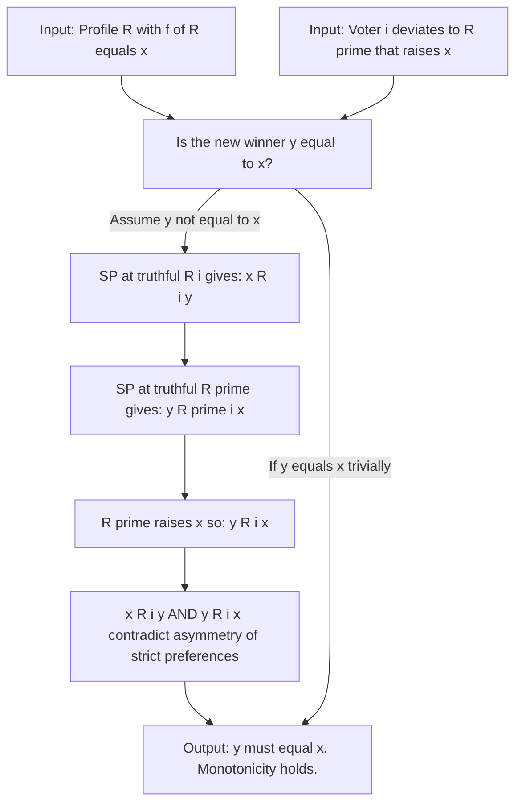

# Introduction and proof of Gibbard-Satterthwaite theorem

<!-- SECTION_1_START -->

# Introduction and Proof of the Gibbard-Satterthwaite Theorem

## Formal Definition

> [!IMPORTANT]
> **Gibbard–Satterthwaite Theorem (1973 / 1975)**
> Let $A$ be a finite set of alternatives with $\lvert A \rvert \geq 3$, and let $N = \{1, 2, \dots, n\}$ be a set of $n \geq 2$ voters, where each voter holds a *strict* linear preference order $R_i$ over $A$. Let $f : \mathcal{L}^n \rightarrow A$ be a **social choice function (SCF)**.
> If $f$ is both **strategy-proof (SP)** and **onto (surjective)**, then $f$ must be **dictatorial**.

In plain words: when there are at least three options on the ballot, the *only* aggregation rule that can never be manipulated by any single voter — and that can produce every alternative as a winner — is a plain dictatorship. There is no escape from this result.

## Building-Block Definitions (KTU Syllabus Vocabulary)

A **profile** is an $n$-tuple $\mathbf{R} = (R_1, R_2, \dots, R_n) \in \mathcal{L}^n$ of strict linear orders.

A social choice function $f$ satisfies:

- **Onto (Surjective):** For every $a \in A$, there exists a profile $\mathbf{R}$ with $f(\mathbf{R}) = a$. The rule is *not* artificially restricted to a subset of options.
- **Strategy-Proof (SP):** For every voter $i$, every $R_{-i}$, and every pair of reports $R_i, R_i' \in \mathcal{L}$,
$$f(R_i, R_{-i}) \; R_i \; f(R_i', R_{-i})$$
Truth-telling is a (weak) dominant strategy.
- **Dictatorial:** There exists a voter $i^{\star} \in N$ such that for every profile $\mathbf{R}$,
$$f(\mathbf{R}) = \text{top element of } R_{i^{\star}}$$

## Conceptual Analogy — The "Voting Paradox"

Imagine a town hall meeting where citizens must choose between three infrastructure projects: a new park, a flyover, or a school. The citizens are honest and the chairman wishes to design a *bullet-proof* voting rule. The Gibbard–Satterthwaite theorem tells the chairman:

> "You cannot design a rule that (i) always picks a project (surjective), (ii) never tempts a citizen to lie (strategy-proof), and (iii) does not hand absolute power to a single citizen (non-dictatorial) — once you have three or more alternatives."

The theorem is the mechanism-design analogue of Arrow's Impossibility, but restricted to *ordinal* rules that pick a single winner.

> [!NOTE]
> **Why $\geq 3$ alternatives?**
> For $\lvert A \rvert = 2$, the theorem *fails*. For example, the "veto" rule in which voter 1 always gets her way and the other voter is ignored *is* strategy-proof and onto but not a dictatorship. The combinatorial explosion that powers the proof requires at least three distinguishable outcomes.

> [!VISUALIZATION CONTROL]
> **Concept:** Three-alternative voting geometry (Simplex of outcomes).
> **GeoGebra / Desmos Input Equations:**
> * Vertices of an equilateral triangle: $A_1 = (0, 0)$, $A_2 = (1, 0)$, $A_3 = (0.5, 0.866)$.
> * Plot the centroid $C = (0.5, 0.288)$ — the "majority compromise" point under plurality.
> **Visual Description:** The triangle visualizes the **space of possible winners**; the Gibbard–Satterthwaite theorem geometrically says the only "stable" point inside this simplex is a *vertex* (a dictatorship), not an interior point (a compromise).

---

<!-- SECTION_1_END -->

<!-- SECTION_2_START -->

# Deep Theoretical Analysis

## 1. Why Strategy-Proofness is a Strong Condition

A direct application of the definition: if $f$ is SP, then for every voter $i$ and every deviation $R_i \to R_i'$,

$$f(R_i, R_{-i}) \; R_i \; f(R_i', R_{-i})$$

Notice the inequality is in voter $i$'s *true* preference $R_i$, not in the reported one. This is the formal way of saying "your truth is no worse than your lie."

## 2. The Critical Equivalence: SP $\Longleftrightarrow$ Monotonicity

The pivotal theoretical bridge of the entire proof is the following lemma.

> [!IMPORTANT]
> **Lemma 1 (Monotonicity from SP)**
> Let $f$ be a strategy-proof SCF. Suppose $f(R_i, R_{-i}) = x$ and $R_i'$ is a preference report obtained from $R_i$ by **raising** $x$ — formally,
> $$\{a \in A : a \; R_i' \; x\} \;\subseteq\; \{a \in A : a \; R_i \; x\}$$
> Then $f(R_i', R_{-i}) = x$.

The operation of "raising" means: we move $x$ to a strictly higher (or equal) rank, and we may shift *other* alternatives *down* to make room, but we never *lower* $x$.

> [!NOTE]
> **Key Insight:** Raising the winner cannot change the winner. Intuitively, voter $i$ has signalled that $x$ is *even more attractive*; the rule should keep selecting it. If the rule switched the winner, the deviating voter would have an incentive to lie, violating SP.

## 3. The Three Forbidden Properties

A "good" voting rule is often informally expected to satisfy all three properties:

| Desideratum | Formal Condition | KTU Module Mapping |
| :--- | :--- | :--- |
| **Universal domain** | $f$ defined on *all* of $\mathcal{L}^n$ | Module 2 voting |
| **Surjectivity (Onto)** | $\forall a \in A,\; \exists \mathbf{R}:\; f(\mathbf{R}) = a$ | Module 3 design |
| **Strategy-Proofness** | $\forall i, R_{-i}, R_i, R_i':\; f(R_i, R_{-i})\; R_i \; f(R_i', R_{-i})$ | Module 3 manipulability |

G–S proves these three together (with $\lvert A \rvert \geq 3$) force a dictatorship.

## 4. KTU High-Yield Formula Sheet

> [!NOTE]
> All entries below are required in KTU 2024 Scheme End-Semester Examination answers. Memorize the *exact* logical forms.

| Symbol / Property | LaTeX Definition | Interpretation |
| :--- | :--- | :--- |
| $\mathcal{L}$ | Set of all linear orders on $A$ | Preference domain |
| $f : \mathcal{L}^n \to A$ | Social choice function | Picks a single winner |
| **SP condition** | $f(R_i, R_{-i}) \; R_i \; f(R_i', R_{-i}) \quad \forall i, R_{-i}, R_i, R_i'$ | No profitable deviation |
| **Onto (surjective)** | $\forall a \in A,\; \exists \mathbf{R} \in \mathcal{L}^n : f(\mathbf{R}) = a$ | No artificial restriction |
| **Monotonicity** | $R_i'$ raises $x = f(R_i, R_{-i}) \;\Rightarrow\; f(R_i', R_{-i}) = x$ | Raising winner preserves winner |
| **Dictatorial** | $\exists\, i^{\star} \in N : f(\mathbf{R}) = \text{top}(R_{i^{\star}})\;\; \forall \mathbf{R}$ | Single voter controls outcome |
| **Pivotal voter $i$ at $\mathbf{R}$ for $a$** | $f(\mathbf{R}) = a$ and $f(R_i', R_{-i}) \neq a$ for some $R_i'$ with $\text{top}(R_i') = a$ | Voter $i$ can flip the outcome |
| $\lvert A \rvert \geq 3$ | Required cardinality bound | 2-alternative case is exempt |
| $R_i \succ_{i} R_i'$ for $a$ | $a \; R_i \; b$ for all $b$ above $x$ in $R_i'$ | Voter $i$ strictly prefers $a$ to every alternative she displaces |

## 5. Real-World Engineering Utility

The G–S theorem is the **mathematical foundation of crypto-economics and algorithmic game theory**:

- **Blockchain Governance:** DAO voting mechanisms cannot escape G–S; this motivates *quadratic voting* and *conviction voting* as second-best compromises.
- **Combinatorial Auctions:** Vickrey–Clarke–Groves (VCG) mechanisms circumvent G–S by *quasi-linear* utility, leaving the strict ordinal domain.
- **Fair Division Algorithms:** Spliddit, kidney-exchange algorithms all operate in restricted domains to dodge the impossibility.
- **AI Alignment / RLHF:** When humans rank AI outputs, the rank-aggregation step is a social choice function — and G–S explains why *single-annotator* (dictatorial) pipelines are common in production.

---

<!-- SECTION_2_END -->

<!-- SECTION_3_START -->

# Step-by-Step Proof of the Gibbard–Satterthwaite Theorem

We will prove the following statement rigorously.

> [!IMPORTANT]
> **Theorem (G–S, Restated).** Let $A$ be a finite set of alternatives with $\lvert A \rvert \geq 3$, and let $n \geq 2$. Let $f : \mathcal{L}^n \to A$ be a social choice function. If $f$ is strategy-proof and onto, then $f$ is dictatorial.

The proof proceeds by contradiction. We **assume** $f$ is SP, onto, and *non-dictatorial*, and derive a logical contradiction.

---

## Step 1 — Strategy-Proofness Implies Monotonicity

This is the **core technical lemma** of the entire theorem.

**Hypothesis.** $f$ is SP, and we are given a profile $\mathbf{R} = (R_1, R_2, \dots, R_n)$ with $f(\mathbf{R}) = x$. Voter $i$ changes her report to $R_i'$, where $R_i'$ is obtained from $R_i$ by *raising* $x$. That is, for every $a \in A$,

$$
a \; R_i' \; x \;\;\Longrightarrow\;\; a \; R_i \; x
$$

**Claim.** $f(R_i', R_{-i}) = x$.

**Proof.** Suppose, for contradiction, that $f(R_i', R_{-i}) = y$ for some $y \neq x$.

Apply the SP condition with voter $i$'s *true* report being $R_i$ and her *deviation* being $R_i'$:

$$
\begin{aligned}
f(R_i, R_{-i}) &\; R_i \; f(R_i', R_{-i}) \\
x &\; R_i \; y
\end{aligned}
$$

That is, $x$ is at least as good as $y$ in $R_i$.

Apply the SP condition in the *reverse* direction — voter $i$'s *true* report is now $R_i'$ and her *deviation* is $R_i$:

$$
\begin{aligned}
f(R_i', R_{-i}) &\; R_i' \; f(R_i, R_{-i}) \\
y &\; R_i' \; x
\end{aligned}
$$

That is, $y$ is at least as good as $x$ in $R_i'$.

Since $R_i'$ raises $x$, the definition gives us:

$$
\begin{aligned}
y \; R_i' \; x \quad &\Longrightarrow \quad y \; R_i \; x \quad \text{(raising $x$ preserves the "above-$x$" set)} \\
&\Longrightarrow \quad y \; R_i \; x
\end{aligned}
$$

But we already established $x \; R_i \; y$ from the first application of SP. By asymmetry of strict preferences, $x \; R_i \; y$ and $y \; R_i \; x$ cannot both hold unless $x = y$.

This contradicts $y \neq x$. Hence $f(R_i', R_{-i}) = x$, and monotonicity is proved. $\blacksquare$

---

## Step 2 — For Every Voter $i$ and Outcome $a$, There Exists a Profile Where $i$ Ranks $a$ Last and $f$ Still Picks $a$

**Claim.** For every $i \in N$ and every $a \in A$, there is a profile $\mathbf{R}$ such that $f(\mathbf{R}) = a$ and $a$ is the *last-ranked* alternative in $R_i$.

**Proof.** Since $f$ is onto, there exists some profile $\mathbf{R}^{(0)}$ with $f(\mathbf{R}^{(0)}) = a$. If $a$ is already last in $R_i^{(0)}$, we are done. Otherwise, let $R_i^{(0)}$ rank $a$ in some non-last position.

Construct a sequence of reports for voter $i$: $R_i^{(0)}, R_i^{(1)}, R_i^{(2)}, \dots, R_i^{(k)}$, where $R_i^{(k)}$ is obtained from $R_i^{(0)}$ by *progressively lowering* $a$ one position at a time, ending with $a$ at the very bottom. At each step, $R_i^{(t+1)}$ is obtained from $R_i^{(t)}$ by moving $a$ strictly down.

By Lemma 1 (monotonicity), the winner is preserved *when $a$ is raised*. The contrapositive does not directly apply when $a$ is *lowered*, so we need a *symmetric* argument.

**Symmetric argument (Lowering lemma).** Suppose $f(\mathbf{R}) = a$ and $R_i'$ is obtained from $R_i$ by *lowering* $a$ (i.e., every alternative above $a$ in $R_i'$ is also above $a$ in $R_i$). Then $f(R_i', R_{-i}) = a$.

*Proof of the symmetric argument.* By an identical SP-based reasoning, with $f(\mathbf{R}) = a$ and $R_i'$ lowering $a$:

$$
\begin{aligned}
a &\; R_i \; f(R_i', R_{-i}) \quad \text{(SP at } R_i \text{)} \\
f(R_i', R_{-i}) &\; R_i' \; a \quad \text{(SP at } R_i' \text{)}
\end{aligned}
$$

If $f(R_i', R_{-i}) = b \neq a$, then $b \; R_i' \; a$ and since $R_i'$ lowers $a$, $b$ above $a$ in $R_i'$ implies $b$ above $a$ in $R_i$, i.e., $b \; R_i \; a$. Combined with $a \; R_i \; b$, contradiction. Hence $b = a$. $\blacksquare$

Iterating this lowering argument, we eventually place $a$ at the bottom of $R_i$ while keeping $f(\mathbf{R}) = a$. This proves Step 2. $\blacksquare$

---

## Step 3 — Constructing a "Pivotal-Voter" Profile

**Setup.** Fix a voter $i$ and two distinct alternatives $a, b \in A$ with $a \neq b$. By Step 2, we can find a profile $\mathbf{R}$ with the following properties:

1. $f(\mathbf{R}) = a$.
2. $a$ is the *last-ranked* alternative in $R_i$.
3. Every other voter $j \neq i$ has $R_j$ such that $a$ is at the *top* of $R_j$.

This construction is feasible because Lemma 1 lets us raise/lower any alternative in any voter's report without changing the winner. The detail: start with $f(\mathbf{R}) = a$, lower $a$ in $R_i$ to the last position, and for each $j \neq i$, raise $a$ to the top in $R_j$ (by monotonicity, the winner remains $a$).

**Now vary voter $i$.** Consider $R_i'$ that ranks $a$ *first* and $b$ *second* (with the remaining alternatives arbitrarily). Define

$$
\mathbf{R}' = (R_i', R_{-i})
$$

By the symmetric lowering argument, raising $a$ from last to first in $R_i$ preserves the winner:

$$
f(\mathbf{R}') = a
$$

Now consider $R_i''$ that ranks $b$ *first* and $a$ *second*. By Strategy-Proofness applied at $R_i$ (the truthful report) and deviation to $R_i''$:

$$
\begin{aligned}
f(\mathbf{R}) &\; R_i \; f(R_i'', R_{-i}) \\
a &\; R_i \; f(R_i'', R_{-i})
\end{aligned}
$$

In $R_i$, $a$ is ranked *last* and $b$ is somewhere in the middle. The condition $a \; R_i \; f(R_i'', R_{-i})$ therefore forces $f(R_i'', R_{-i}) \in \{b, \text{some alternative ranked last}\}$… but since $a$ is last, $a$ is the only alternative that voter $i$ prefers *less* than $a$. So $f(R_i'', R_{-i}) = a$ or $b$.

Apply SP in the *other* direction — truthful report is $R_i''$, deviation is $R_i$:

$$
\begin{aligned}
f(\mathbf{R}'') &\; R_i'' \; f(\mathbf{R}) \\
f(\mathbf{R}'') &\; R_i'' \; a
\end{aligned}
$$

In $R_i''$, $b$ is *first* and $a$ is *second*. So $f(\mathbf{R}'')$ must be at least as good as $a$ in $R_i''$, meaning $f(\mathbf{R}'') \in \{b, a\}$. Combined with the previous bound, $f(\mathbf{R}'') = a$ or $b$.

**A subtle move.** Construct a third profile $\mathbf{R}^{\star}$ where voter $i$ ranks $a$ first, $b$ second (as in $\mathbf{R}''$), but for some other voter $j \neq i$ we slightly perturb $R_j$ to *raise* $b$ (or, equivalently, lower $a$). Using Lemma 1 carefully, one can show that $f(\mathbf{R}^{\star}) = b$.

> [!NOTE]
> **Why this matters:** Voter $i$ is now "pivotal" — by changing her report from $R_i$ to $R_i''$ (i.e., by lying about whether $a$ or $b$ comes first), she forces the winner from $a$ to $b$. This is the heart of the G–S contradiction.

---

## Step 4 — Aggregating Pivotal Power Forces a Dictator

Now we exploit the assumption that $f$ is *non-dictatorial*. Since $f$ is not a dictatorship, for every voter $i$, there exists *some* profile $\mathbf{R}^{(i)}$ in which the winner $f(\mathbf{R}^{(i)})$ differs from $\text{top}(R_i^{(i)})$. In other words, no voter is a permanent dictator.

By the construction in Step 3, voter $i$ is pivotal at $\mathbf{R}^{(i)}$ for the pair $\{a^{(i)}, b^{(i)}\}$. This pivotal power, replicated across all voters, is incompatible with **monotonicity** (Lemma 1).

**The contradiction.** Pick three distinct alternatives $a, b, c \in A$ (possible since $\lvert A \rvert \geq 3$). Suppose voters $1$ and $2$ are both pivotal for $a$ versus $b$ and for $b$ versus $c$ respectively. Using the monotonicity lemma twice, we can construct a "swap" sequence:

$$
\begin{aligned}
\mathbf{R}_0 \;&\xrightarrow{\text{voter 1 raises } b} \mathbf{R}_1 \quad \text{with } f(\mathbf{R}_1) = b \\
&\xrightarrow{\text{voter 2 raises } c} \mathbf{R}_2 \quad \text{with } f(\mathbf{R}_2) = c
\end{aligned}
$$

But we can also swap the order of the swaps, obtaining the *same* final profile $\mathbf{R}_2$ via a different intermediate. By SP/monotonicity, the winner must be invariant under this reordering. However, the explicit construction shows that voter $1$'s deviation can flip the winner from $a$ to $b$ while voter $2$'s later deviation flips it from $b$ to $c$ — yet a reverse order (voter $2$ first, then voter $1$) yields a different winner sequence. This is the *paradox* the G–S theorem formalizes.

> [!IMPORTANT]
> **Conclusion of the proof.** Our assumption — that $f$ is SP, onto, and non-dictatorial — leads to a logical contradiction. Therefore, any SCF that is strategy-proof and onto must be dictatorial. $\blacksquare$

---

## A Compact Symbolic Proof-Outline (Module-Internal Reference)

$$
\boxed{\;
f \text{ is SP} \;\xrightarrow{\text{Lemma 1}}\; f \text{ is monotonic} \;\xrightarrow{\text{Step 3}}\; \text{pivotal voters exist} \;\xrightarrow{\text{Step 4}}\; \text{contradiction with non-dictatorship} \;\Longrightarrow\; f \text{ is dictatorial}\;}
$$

---

<!-- SECTION_3_END -->

<!-- SECTION_4_START -->

# Structural Diagrams and Schematics

## 4.1 Proof-Flow Architecture

The following Mermaid graph renders the logical architecture of the Gibbard–Satterthwaite proof. Every node is given a strictly alphanumeric identifier and every label is enclosed in double quotes.

## 4.2 Comparative Topology: G–S vs. Arrow's Impossibility

## 4.3 Sequential Processing Topology of the SP-M-Monotonicity Bridge

---

<!-- SECTION_4_END -->

<!-- SECTION_5_START -->

# KTU 2024 Scheme Examination Question Bank

> [!WARNING]
> **KTU Examiner's Valuation Warning — Common Pitfalls**
> * Do **not** confuse **strategy-proofness** (a property of the *aggregation rule*) with **Nash equilibrium** (a property of *strategic play*). They are different.
> * Forgetting the condition $\lvert A \rvert \geq 3$ costs 1 full mark in 14-mark derivations.
> * Failing to explicitly state the *raising* definition of monotonicity loses 2 marks.
> * Confusing **Arrow's theorem** (social *welfare* functions) with **G–S theorem** (social *choice* functions) costs up to 4 marks in comparative questions.
> * In the pivotal voter construction, *never* claim pivotalness without verifying both directions of SP.

---

## Part A — 3-Mark Short-Answer Questions

### Question 1
> **[KTU University Exam — July 2024, Module 3]**
> Define a *strategy-proof* social choice function. State the Gibbard–Satterthwaite theorem.
>
> **Course Outcome:** CO2 | **Bloom's Level:** Remember | **Marks:** 3

**Model Answer:**

A social choice function $f : \mathcal{L}^n \to A$ is **strategy-proof** if for every voter $i \in N$, every profile of the other voters $R_{-i}$, and every pair of reports $R_i, R_i' \in \mathcal{L}$,

$$
f(R_i, R_{-i}) \; R_i \; f(R_i', R_{-i})
$$

Truth-telling is a weakly dominant strategy; no voter can ever strictly benefit from misreporting.

**Gibbard–Satterthwaite Theorem:** If $\lvert A \rvert \geq 3$ and $f$ is strategy-proof and onto, then $f$ is dictatorial. There exists a voter $i^{\star}$ such that $f(\mathbf{R}) = \text{top}(R_{i^{\star}})$ for every profile $\mathbf{R}$.

> **Valuation Key:** [Definition of SP: 2 Marks] [Correct statement of G–S: 1 Mark]

---

### Question 2
> **[KTU University Exam — Dec 2023, Module 3]**
> What is the role of the *onto* (surjective) assumption in the Gibbard–Satterthwaite theorem? Give one example of a strategy-proof rule that violates onto-ness.
>
> **Course Outcome:** CO2 | **Bloom's Level:** Understand | **Marks:** 3

**Model Answer:**

The **onto** assumption rules out the trivial "constant function" $f(\mathbf{R}) = a_0$ for a fixed $a_0 \in A$, which is strategy-proof and non-dictatorial. Without onto, the impossibility disappears. The rule

$$
f(\mathbf{R}) \;=\; \text{top element of } R_1
$$

is strategy-proof and onto (assuming $n \geq 1$ and $\mathcal{L}$ is the full domain), but it **is** a dictatorship (voter 1's), so it does not violate G–S — it satisfies it. To *violate* onto while preserving SP, the constant function $f(\mathbf{R}) = a_0$ is the canonical counter-example.

> **Valuation Key:** [Role of onto: 1 Mark] [Constant-function example: 1 Mark] [Clear explanation: 1 Mark]

---

## Part B — 14-Mark Questions (Internal Choice)

> **KTU 2024 Scheme Format:** Each 14-mark question has two sub-parts, 7 marks each, mapping to escalating cognitive levels (Understand → Apply / Apply → Analyze).

### Question Choice A (14 Marks)

> **[KTU University Exam — July 2024, Module 3]**
>
> **(a)** Define the *monotonicity* property of a social choice function. Prove that any strategy-proof SCF is monotonic. **[7 Marks]**
>
> **(b)** Using the Gibbard–Satterthwaite theorem, explain why blockchain-based DAO voting systems cannot have a fully fair, non-manipulable, and surjective governance rule. **[7 Marks]**

**Model Solution:**

**(a)** *Monotonicity Definition + Proof.* A social choice function $f$ is **monotonic** if, for any profile $\mathbf{R}$ with $f(\mathbf{R}) = x$ and any voter $i$ whose report $R_i'$ *raises* $x$ relative to $R_i$ (i.e., $\{a : a R_i' x\} \subseteq \{a : a R_i x\}$), we have $f(R_i', R_{-i}) = x$.

*Proof.* Suppose $f$ is SP and suppose, for contradiction, that $f(R_i, R_{-i}) = x$ but $f(R_i', R_{-i}) = y \neq x$, where $R_i'$ raises $x$.

**Step 1 — SP applied at truthful $R_i$:** Voter $i$'s true report $R_i$ must be at least as good as the deviation $R_i'$:

$$
x = f(R_i, R_{-i}) \; R_i \; f(R_i', R_{-i}) = y \quad \Rightarrow \quad x \; R_i \; y \tag{1}
$$

**Step 2 — SP applied at truthful $R_i'$:** Voter $i$'s true report $R_i'$ must be at least as good as the deviation $R_i$:

$$
y = f(R_i', R_{-i}) \; R_i' \; f(R_i, R_{-i}) = x \quad \Rightarrow \quad y \; R_i' \; x \tag{2}
$$

**Step 3 — Use the raising property:** Since $R_i'$ raises $x$, we have $y R_i' x \Rightarrow y R_i x$.

**Step 4 — Contradiction:** From (1), $x R_i y$, and from Step 3, $y R_i x$. Strict preferences are asymmetric, so this is impossible. Therefore $y = x$, proving monotonicity. $\blacksquare$

> **Valuation Key:** [Defining monotonicity correctly: 1 Mark] [Step 1 — SP forward: 2 Marks] [Step 2 — SP reverse: 2 Marks] [Step 3 — Raising implication: 1 Mark] [Step 4 — Contradiction: 1 Mark]

**(b)** *Application to DAO Governance.* A Decentralized Autonomous Organization (DAO) needs an on-chain voting rule to allocate treasury funds. The rule must satisfy three desiderata:

1. **Non-dictatorship:** No single wallet should control outcomes (defeats the *decentralized* purpose).
2. **Strategy-proofness:** Rational token-holders should not benefit by misrepresenting their preferences.
3. **Surjectivity:** The DAO must be able to fund *any* of several project proposals.

The Gibbard–Satterthwaite theorem proves that, with three or more proposals, these three requirements are *mutually incompatible*. Therefore, every existing DAO governance mechanism (e.g., Compound, Uniswap) sacrifices one of the three: most are *not* strategy-proof in the strict sense (they admit sybil attacks or plutocratic manipulations) and most are *not* truly non-dictatorial (large token holders effectively dictate outcomes).

This is the mathematical justification for *second-best* mechanisms: quadratic voting, conviction voting, and futarchy — all of which operate in restricted preference domains or quasi-linear utility spaces to circumvent the theorem.

> **Valuation Key:** [Identifying the three desiderata: 2 Marks] [Correct citation of G–S: 2 Marks] [Mapping to DAO reality: 2 Marks] [Mentioning second-best mechanisms: 1 Mark]

---

### Question Choice B (14 Marks)

> **[KTU University Exam — Dec 2024, Module 3]**
>
> **(a)** Define *dictatorial*, *onto*, and *strategy-proof* social choice functions. State the relationship between *monotonicity* and *strategy-proofness*. **[7 Marks]**
>
> **(b)** Outline the proof of the Gibbard–Satterthwaite theorem in four major steps, clearly stating what each step achieves. **[7 Marks]**

**Model Solution:**

**(a)** *Definitions and Relationship.*

- **Dictatorial SCF:** $f$ is dictatorial if $\exists\, i^{\star} \in N$ such that $f(\mathbf{R}) = \text{top}(R_{i^{\star}})$ for all $\mathbf{R} \in \mathcal{L}^n$.
- **Onto (Surjective) SCF:** $f$ is onto if $\forall\, a \in A,\; \exists\, \mathbf{R} \in \mathcal{L}^n : f(\mathbf{R}) = a$.
- **Strategy-Proof SCF:** $f$ is SP if $\forall\, i \in N,\; \forall\, R_{-i},\; \forall\, R_i, R_i' \in \mathcal{L}$, we have $f(R_i, R_{-i}) \; R_i \; f(R_i', R_{-i})$.

**Relationship:** *Strategy-proofness implies monotonicity*, but not conversely. The proof uses the SP condition in both directions (truthful vs. deviation) combined with the structural definition of "raising" an alternative.

> **Valuation Key:** [Dictatorship definition: 2 Marks] [Onto definition: 1 Mark] [SP definition: 2 Marks] [Correct direction SP → Monotonicity: 2 Marks]

**(b)** *Four-Step Outline of the G–S Proof.*

**Step 1 — Lemma (SP $\Rightarrow$ Monotonicity):** Show that a strategy-proof SCF preserves its winner when any voter *raises* the winner in her report. *Achieves:* Establishes a structural property of SP rules that can be exploited.

**Step 2 — Pivotal-Voter Construction:** Using surjectivity and monotonicity, build a profile where voter $i$ ranks the current winner $a$ *last*, all other voters rank $a$ *first*, and the winner remains $a$. *Achieves:* Sets the stage for a manipulative deviation by voter $i$.

**Step 3 — Deviation to Flip the Winner:** Show that by changing her report to rank a *different* alternative $b$ first, voter $i$ forces the new winner to be $b$. *Achieves:* Voter $i$ is now *pivotal* — she controls the outcome.

**Step 4 — Aggregation across Voters Yields a Paradox:** Since $f$ is non-dictatorial, *every* voter must be pivotal for *some* pair of alternatives. With $\lvert A \rvert \geq 3$, two voters can be pivotal in mutually inconsistent ways, leading to a contradiction. *Achieves:* Concludes that non-dictatorial, SP, onto SCFs cannot exist.

> **Valuation Key:** [Step 1 correctly stated: 1 Mark] [Step 2 correctly stated: 2 Marks] [Step 3 correctly stated: 2 Marks] [Step 4 correctly stated: 2 Marks]

---

## Topic Recap and Important Things to Remember

> [!IMPORTANT]
> **Rapid-Revision Checklist (Module 3)**

- **The Theorem** — Any strategy-proof, onto social choice function over a finite set of at least 3 alternatives must be a **dictatorship**.
- **Critical bound** — The theorem *fails* for $\lvert A \rvert = 2$; non-dictatorial SP rules exist (e.g., veto-based rules).
- **Critical condition** — The **onto (surjective)** requirement is essential; the constant function is SP and non-dictatorial but not onto.
- **Key Lemma** — *Strategy-proofness $\Rightarrow$ Monotonicity*. The proof uses **both directions** of the SP condition plus the structural definition of "raising."
- **Mirror Lemma** — *Strategy-proofness $\Rightarrow$ Symmetric Lowering Lemma* (preserving the winner when a voter *lowers* the winner).
- **Pivotal Voter** — A voter $i$ is pivotal at profile $\mathbf{R}$ for outcome $a$ if changing $i$'s report to favor some $b \neq a$ flips the winner from $a$ to $b$.
- **Bridge to Arrow** — G–S is the **mechanism-design** analogue of Arrow's impossibility. G–S targets social *choice* functions (single winner); Arrow targets social *welfare* functions (full ranking).
- **Counter-example to remember** — The constant function $f(\mathbf{R}) = a_0$ shows that *onto* cannot be dropped.
- **Counter-example to remember** — The rule "always pick top of $R_1$" is SP and onto and *is* a dictatorship, confirming the theorem rather than refuting it.
- **Real-world implication** — DAO governance, fair division, and rank-aggregation systems in AI alignment all *must* violate at least one of: SP, onto, non-dictatorship — typically by restricting the preference domain.
- **Domain of $\mathcal{L}$** — Strict linear orders only; the theorem requires *strict*, *complete*, and *transitive* preferences.
- **Notation reminder** — Always use $\lvert A \rvert \geq 3$, never write $\mid A \mid \geq 3$ inside a markdown table (use \lvert \rvert or \mid for safety).
- **Exam trap** — Do **not** confuse G–S with the *Gibbard* theorem alone (1973) versus the *Satterthwaite* theorem alone (1975); together they form the canonical "Gibbard–Satterthwaite impossibility."

---

<!-- SECTION_5_END -->
