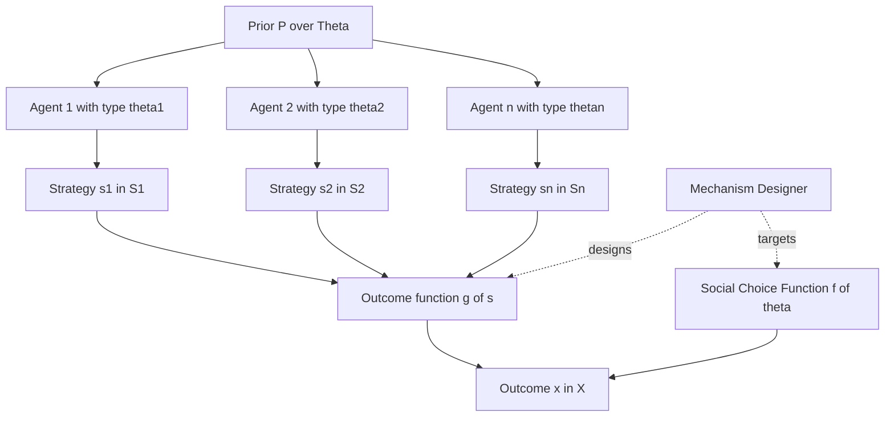
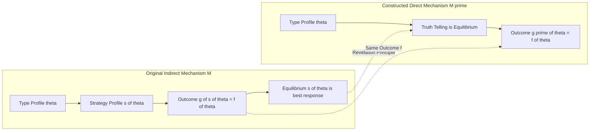
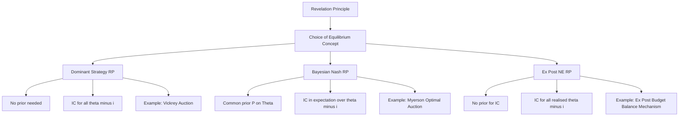
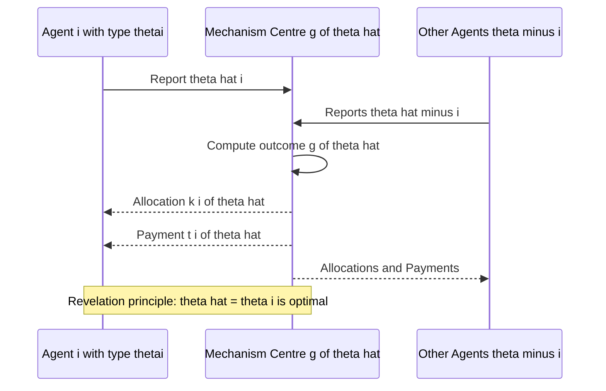
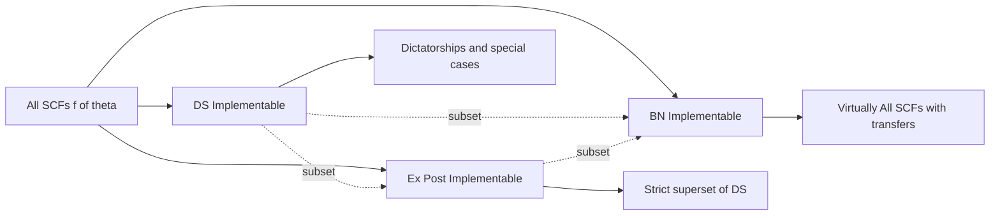
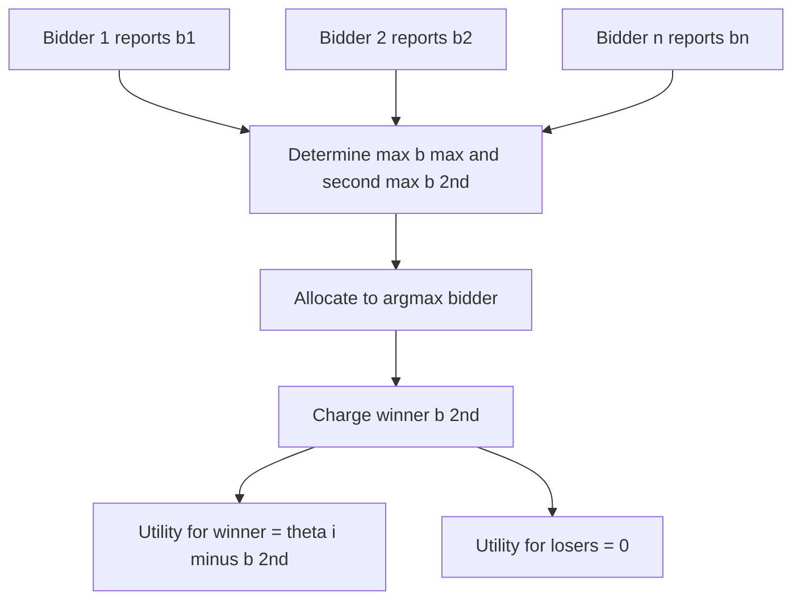

# Introduction to mechanism design - revelation principle

<!-- SECTION_1_START -->

# Introduction to Mechanism Design — The Revelation Principle

## 1.1 Formal Academic Definition (KTU 2024 Syllabus)

> [!NOTE]
> **Mechanism Design (Definition):** Mechanism design is the *engineering* branch of game theory. While classical game theory asks *"given the rules, what will happen?"*, mechanism design asks *"given a desired outcome, what rules should we design?"*. It is the study of *inverse game theory* — constructing a game whose equilibrium (under rational play) yields a prescribed social choice.

> [!IMPORTANT]
> **Revelation Principle (Gibbard, 1973; Myerson, 1979; Dasgupta, Hammond & Maskin, 1979):**
> Let $\Theta = \Theta_1 \times \Theta_2 \times \cdots \times \Theta_n$ be the profile of agents' **private type spaces**, let $X$ be the set of social outcomes (allocations, payments, public decisions, etc.), and let $f : \Theta \rightarrow X$ be a **social choice function (SCF)**.
>
> *If there exists **any** mechanism* $M = (S_1, S_2, \ldots, S_n, g(\cdot))$ *and an equilibrium strategy profile* $s^*(\cdot) = (s_1^*(\cdot), \ldots, s_n^*(\cdot))$ *such that the induced outcome equals the SCF, i.e.* $g(s^*(\theta)) = f(\theta)$ *for every* $\theta \in \Theta$,
>
> *then there exists a **direct, incentive-compatible revelation mechanism*** $M' = (\Theta_1, \ldots, \Theta_n, g'(\cdot))$ *in which **truth-telling*** $\hat{\theta}_i = \theta_i$ *is itself an equilibrium and the same SCF* $f$ *is implemented.*

In plain words: **you never need to design a complicated indirect game. Just ask the agents to report their types, and design the outcome rule so that telling the truth is the best they can do.**

---

## 1.2 Intuitive Real-World Analogy

### 🏛️ The "Honest Tax Form" Analogy

Imagine the government wants to collect the *correct* amount of tax from each citizen. Citizens have private information (their actual income, deductions, etc.).

- **Naive approach (indirect mechanism):** The government designs a complex audit game — random inspections, penalties, complicated forms — hoping that fear of audit makes citizens reveal their true income.
- **Revelation principle insight:** Don't bother with audits. Just *design* a tax schedule $T(\hat{\theta}_1, \ldots, \hat{\theta}_n)$ (think: a convex, progressive tax) such that for any citizen, the best possible report *is the truthful one*. The shape of $T$ itself does the incentivising.

### 🛒 The "Supermarket Pricing" Analogy

A store wants to know how much customers will pay. It could run *complex loyalty schemes, dynamic prices, secret trials*. The revelation principle says: instead, post a **posted-price mechanism** $p(\hat{v})$ so steep that *over-reporting your willingness to pay makes you leave, and under-reporting makes you overpay*. Truth-telling is optimal.

> [!TIP]
> **Mnemonic for the exam:** *"Any clever game can be re-engineered into a truthful 'report-card' game."* The cleverness collapses into the **outcome rule** $g'(\cdot)$.

---

## 1.3 Key Vocabulary (Bold = Standard KTU Glossary Terms)

- **Type** $\theta_i$ — the *private information* of agent $i$ (value, cost, preference, productivity, etc.).
- **Type Profile** $\theta = (\theta_1, \ldots, \theta_n)$ — the *joint* state of the world.
- **Social Choice Function (SCF)** $f : \Theta \rightarrow X$ — the *desired* mapping from types to outcomes.
- **Mechanism** $M = (S_1, \ldots, S_n, g(\cdot))$ — a tuple of *message (strategy) spaces* and an *outcome function* $g : S_1 \times \cdots \times S_n \rightarrow X$.
- **Direct Mechanism** — a mechanism where the message space equals the type space, i.e. $S_i = \Theta_i$ (agent *reports* a type).
- **Revelation (Truthful) Mechanism** — a direct mechanism in which reporting the true type is an equilibrium.
- **Implementation** — the mechanism $M$ (with equilibrium $s^*$) *implements* $f$ if $g(s^*(\theta)) = f(\theta)$ for all $\theta$.
- **Incentive Compatibility (IC)** — the equilibrium condition guaranteeing that truth-telling is optimal.
- **Individual Rationality (IR)** — the participation condition; voluntary agents must get non-negative surplus.

> [!IMPORTANT]
> **Two equilibrium concepts that the principle can be stated under (board-favourite distinction):**
>
> 1. **Dominant-Strategy (DS) Revelation Principle** — no probabilistic assumptions; IC must hold *for all* $\theta_{-i}$.
> 2. **Bayesian-Nash (BN) Revelation Principle** — assumes a **common prior** $P \in \Delta(\Theta)$; IC holds *in expectation* over $\theta_{-i}$.

---

## 1.4 GeoGebra / Desmos Visualisation

> [!VISUALIZATION CONTROL]
> **Concept:** Single-Agent Type Space with Truth-Telling Diagonal and the Incentive-Compatibility Envelope
> **GeoGebra / Desmos Input Equations:**
>
> * `f(x) = x` — the **45° truth-telling diagonal** (orange, dashed)
> * `u_truthful(x) = (x - 0.1) * (1 - (x - 0.5)^2)` — utility when agent reports truthfully (blue)
> * `u_overreport(x) = (0.7 * x - 0.1) * (1 - (1.1*x - 0.5)^2)` — utility when agent over-reports (red)
> * `u_underreport(x) = (1.3 * x - 0.1) * (1 - (0.9*x - 0.5)^2)` — utility when agent under-reports (green)
> * Point: `(0.6, u_truthful(0.6))` — the truthful utility at true type $\theta = 0.6$
>
> **Visual Description:** On the horizontal axis lies the *reported* type $\hat{\theta}_i$ (range $[0,1]$); the vertical axis is the realised utility $u_i$. The truthful-utility curve $u_{\text{truthful}}$ must **dominate** the deviated-utility curves $u_{\text{overreport}}$ and $u_{\text{underreport}}$ at $\hat{\theta}_i = \theta_i$ (the intersection with the 45° line). The revelation principle is the *engineering guarantee* that we can shift these curves by redesigning $g'(\cdot)$ so that the truthful curve sits on top everywhere.

---

## 1.5 Why This Principle is the *Cornerstone* of Mechanism Design

| Perspective | Insight |
|-------------|---------|
| For the **designer** | Reduces the search space from *all conceivable games* to *all direct games*. |
| For the **analyst** | Any impossibility result (e.g. Gibbard–Satterthwaite) derived under truthfulness immediately extends to *all* mechanisms. |
| For the **economist** | Justifies *non-market institutions* (auctions, voting, public-goods provision) as optimal under appropriate IC/IR constraints. |
| For the **computer scientist** | Foundation of *algorithmic mechanism design* (Nisan–Ronen, 1999) — applied in sponsored search, spectrum auctions, kidney exchange, blockchain. |

<!-- SECTION_1_END -->

<!-- SECTION_2_START -->

# Deep Theoretical Analysis & KTU High-Yield Formula Sheet

## 2.1 Building Blocks of the Framework

The revelation principle sits on five definitional pillars. We restate each in rigorous KTU-board notation.

### Pillar 1 — The Type Space

Each agent $i \in \{1, 2, \ldots, n\}$ possesses a privately known type $\theta_i \in \Theta_i$. The **cartesian product**

$$
\Theta = \Theta_1 \times \Theta_2 \times \cdots \times \Theta_n
$$

is the set of all *type profiles*. A profile $\theta = (\theta_1, \ldots, \theta_n)$ is *common knowledge* up to the prior; only the *components* $\theta_i$ are private.

### Pillar 2 — The Outcome Set $X$ and the SCF $f$

A **social choice function** is a mapping

$$
f : \Theta \longrightarrow X,
$$

where $X$ is the set of *feasible* social outcomes (e.g. allocations of indivisible goods, monetary transfers, public projects, committee decisions).

### Pillar 3 — The General (Indirect) Mechanism

A **mechanism** is a tuple

$$
M = \big(S_1, S_2, \ldots, S_n,\; g(\cdot)\big)
$$

with

- $S_i$ — the *message (strategy) space* of agent $i$;
- $g : S_1 \times \cdots \times S_n \rightarrow X$ — the *outcome function* (sometimes called the *social choice correspondence of the mechanism*).

### Pillar 4 — Direct vs. Revelation Mechanisms

- A **direct mechanism** requires $S_i = \Theta_i$ — the only "move" is a *report*.
- A **truthful / revelation mechanism** is a direct mechanism in which the profile $\hat{\theta} = \theta$ (truth) is an equilibrium strategy.

### Pillar 5 — Equilibrium Concepts

| Concept | Belief Requirement | IC Condition |
|---------|-------------------|--------------|
| **Dominant Strategy (DS)** | None | $u_i(g(\theta_i, \theta_{-i}), \theta_i) \geq u_i(g(\hat{\theta}_i, \theta_{-i}), \theta_i)\ \forall \hat{\theta}_i, \forall \theta_{-i}$ |
| **Bayesian-Nash (BN)** | Common prior $P$ on $\Theta$ | $\mathbb{E}_{\theta_{-i}}\!\big[u_i(g(\theta_i, \theta_{-i}), \theta_i)\big] \geq \mathbb{E}_{\theta_{-i}}\!\!\big[u_i(g(\hat{\theta}_i, \theta_{-i}), \theta_i)\big]\ \forall \hat{\theta}_i$ |
| **Ex-Post NE (EPNE)** | None (off-path) | IC holds for *every* realised $\theta_{-i}$ |

---

## 2.2 KTU High-Yield Formula / Concept Cheat-Sheet

> [!IMPORTANT]
> **Table Note:** Vertical bars are rendered as `\vert` to keep the markdown table intact.

| # | Concept | Symbol / Expression | Meaning |
|---|---------|--------------------|---------|
| 1 | Type profile | $\theta = (\theta_1, \ldots, \theta_n)$ | Joint state of private information |
| 2 | Type of agent $i$ | $\theta_i \in \Theta_i$ | Private info of $i$ |
| 3 | Type of others | $\theta_{-i}$ | All except $i$ |
| 4 | Social choice function | $f : \Theta \rightarrow X$ | Desired outcome rule |
| 5 | Mechanism | $M = (S_1, \ldots, S_n, g(\cdot))$ | Game form |
| 6 | Direct mechanism | $S_i = \Theta_i$ | Report-based game |
| 7 | Truthful report | $\hat{\theta}_i = \theta_i$ | IC optimum |
| 8 | Implementation | $g(s^*(\theta)) = f(\theta)$ | Equilibrium equals SCF |
| 9 | DS-IC (truthtelling) | $u_i(g(\theta_i, \theta_{-i}), \theta_i) \geq u_i(g(\hat{\theta}_i, \theta_{-i}), \theta_i)$ | For all $\hat{\theta}_i, \theta_{-i}$ |
| 10 | BN-IC | $\mathbb{E}_{\theta_{-i}}[u_i(g(\theta_i, \theta_{-i}), \theta_i)] \geq \mathbb{E}_{\theta_{-i}}[u_i(g(\hat{\theta}_i, \theta_{-i}), \theta_i)]$ | For all $\hat{\theta}_i$ |
| 11 | IR (participation) | $u_i(g(\theta), \theta_i) \geq \bar{u}_i$ | Outside-option payoff |
| 12 | Allocation component | $k_i : \Theta \rightarrow K_i$ | Object assigned to $i$ |
| 13 | Payment component | $t_i : \Theta \rightarrow \mathbb{R}$ | Money transferred to/from $i$ |
| 14 | Revelation mapping | $g'(\theta) := g(s^*(\theta)) = f(\theta)$ | Construction of truthful mechanism |
| 15 | Reduced form | $M' = (\Theta_1, \ldots, \Theta_n, g'(\cdot))$ | Direct revelation mechanism |

---

## 2.3 Why the Revelation Principle Matters in Engineering & CS

1. **Spectrum Auctions (FCC, 3G, 4G, 5G)** — the U.S. FCC used the revelation principle to justify a *direct, truthful* second-price auction; revenue ≈ \$60 billion (2000).
2. **Sponsored Search (Google, Bing)** — Varian's *position auctions* rely on the revelation principle: telling the truth about click-through rate × value-per-click is dominant.
3. **Smart-Grid Demand Response** — direct, truthful reporting of household demand is incentive-compatible under convex pricing; reduces *adversarial* demand manipulation.
4. **Crowdsourcing (Amazon MTurk)** — the platform's reward function $R(\hat{q})$ can be designed truthful so workers report true quality.
5. **Blockchain & Consensus** — the revelation principle underpins *truthful fee mechanisms* in transaction ordering (MEV mitigation, e.g. Flashbots).
6. **Public Procurement (e-Bidding, GeM portal, India)** — truthful cost reports maximise the chance of efficient L1 award.
7. **Public Goods / Carbon Markets** — truthful emissions reporting under penalty pricing schemes (à la Pigouvian taxes).
8. **Bilateral Trade (Myerson–Satterthwaite)** — truthful bargaining under asymmetric information is *feasible* in BN equilibrium, *impossible* in DS.

> [!TIP]
> **Board favourite one-liner:** *"The revelation principle transforms the *infinite-dimensional* problem of designing a game into a *finite-dimensional* problem of designing a *single* function $g'(\cdot)$."*

---

## 2.4 The Three Flavours of the Revelation Principle

### A. Dominant-Strategy (DS) Revelation Principle

> **Theorem (DS-RP).** If a SCF $f$ is implementable in dominant strategies by *some* mechanism $M$, then it is *truthfully* implementable in dominant strategies by a *direct* mechanism $M'$.

- **No prior** on $\Theta$ required.
- **Strongest** notion: IC holds for *every* $\theta_{-i}$.
- *Limitation:* very few SCFs are DS-implementable (Gibbard–Satterthwaite dictatorship, Maskin monotonicity).

### B. Bayesian-Nash (BN) Revelation Principle

> **Theorem (BN-RP).** If a SCF $f$ is implementable in Bayesian-Nash equilibrium by some mechanism $M$ under prior $P$, then $f$ is truthfully implementable in BNE by a direct mechanism $M'$.

- Requires **common prior** $P$ on $\Theta$.
- IC holds *in expectation* w.r.t. $P$.
- *More flexible:* virtually any SCF is implementable in BNE (à la Maskin with transfers).

### C. Ex-Post Nash Equilibrium (EPNE) Revelation Principle

> **Theorem (EPNE-RP).** If a SCF $f$ is implementable in EPNE by some mechanism $M$, then $f$ is truthfully implementable in EPNE by a direct mechanism $M'$.

- IC must hold for every realised $\theta_{-i}$, but *no* prior needed for the *equilibrium* notion itself.
- *Robust* to misspecified beliefs.

> [!WARNING]
> **Common Exam Trap:** Students often confuse the equilibrium concept with the design objective. The revelation principle is a *bridge*; it does **not** say *which* equilibrium to pick — that is the designer's IC/IR constraints.

---

## 2.5 The Big Picture: From Black-Box to White-Box Design

| Black-Box (Indirect) View | White-Box (Direct Revelation) View |
|---------------------------|------------------------------------|
| Designer picks $(S_i, g)$ and *hopes* for an equilibrium. | Designer picks *only* $g' : \Theta \rightarrow X$ and pins truth-telling as equilibrium. |
| Equilibrium strategy $s_i^*(\cdot)$ is *implicit*. | Equilibrium strategy is the *identity* $s_i^*(\theta_i) = \theta_i$. |
| IC condition is *implicit*. | IC condition is *explicit* and verifiable. |
| Search space: huge. | Search space: $\vert X \vert^{\vert \Theta \vert}$. |
| **Revelation principle** equates the two. | **Revelation principle** equates the two. |

<!-- SECTION_2_END -->

<!-- SECTION_3_START -->

# Step-by-Step Derivations, Proofs & Code Implementation

## 3.1 The Bayesian-Nash Revelation Principle — Full Theorem and Proof

### 3.1.1 Setup and Notation

- $n$ agents, indexed $i \in \{1, \ldots, n\}$.
- Type space $\Theta_i$ for each agent; joint space $\Theta := \prod_{i=1}^n \Theta_i$.
- **Common prior** $P \in \Delta(\Theta)$ — *known* to all.
- Outcome set $X$ and SCF $f : \Theta \rightarrow X$.
- Each agent $i$ has a *quasi-linear* utility (w.l.o.g.):
$$
u_i : X \times \Theta_i \rightarrow \mathbb{R}, \quad u_i(x, \theta_i) = v_i(x, \theta_i) - t_i(x)
$$
where $v_i$ is the *valuation component* and $t_i$ the *monetary transfer*.

### 3.1.2 Theorem (BN Revelation Principle)

> **Theorem.** Suppose there exists a mechanism $M = (S_1, \ldots, S_n, g(\cdot))$ and a Bayesian-Nash equilibrium strategy profile $s^*(\theta) = (s_1^*(\theta_1), \ldots, s_n^*(\theta_n))$ such that the equilibrium outcome equals the desired SCF for *every* type profile:
> $$
> g\!\big(s^*(\theta)\big) = f(\theta) \quad \forall\, \theta \in \Theta.
> $$
> Then there exists a **direct revelation mechanism** $M' = (\Theta_1, \ldots, \Theta_n, g'(\cdot))$ in which **truth-telling** $\hat{\theta} = \theta$ is a Bayesian-Nash equilibrium, and the outcome coincides with $f$.

### 3.1.3 Construction of the Direct Revelation Mechanism

Define

$$
g'(\hat{\theta}) := g\!\big(s^*(\hat{\theta})\big) = f(\hat{\theta}) \quad \forall\, \hat{\theta} \in \Theta.
$$

Equivalently, the outcome rule of $M'$ is the *composition* of the original outcome rule with the original equilibrium strategy.

### 3.1.4 Proof (Step-by-Step)

> **Goal:** Show that for every $i$, every $\theta_i$, and every deviation $\hat{\theta}_i \in \Theta_i$, the truthful report weakly dominates.

**Step 1.** Fix an agent $i$, a true type $\theta_i$, a profile of others' types $\theta_{-i}$, and a deviation $\hat{\theta}_i$.

**Step 2.** In mechanism $M'$, when agent $i$ reports $\hat{\theta}_i$ and others report truthfully $\theta_{-i}$, the realised outcome is

$$
x = g'(\hat{\theta}_i, \theta_{-i}) = g\!\big(s_i^*(\hat{\theta}_i),\, s_{-i}^*(\theta_{-i})\big).
$$

**Step 3.** Because $s^*$ is a *Bayesian-Nash equilibrium* of $M$, the strategy $s_i^*(\theta_i)$ is a best response to $s_{-i}^*(\theta_{-i})$ *for every* $\theta_{-i}$ (and in expectation over $\theta_{-i}$). Hence for any alternative message $m_i' \in S_i$,

$$
\mathbb{E}_{\theta_{-i}}\!\Big[u_i\!\big(g(s_i^*(\theta_i), s_{-i}^*(\theta_{-i})),\, \theta_i\big)\Big] \;\geq\; \mathbb{E}_{\theta_{-i}}\!\Big[u_i\!\big(g(m_i', s_{-i}^*(\theta_{-i})),\, \theta_i\big)\Big].
$$

**Step 4.** In particular, take $m_i' = s_i^*(\hat{\theta}_i)$. Substituting into Step 3:

$$
\mathbb{E}_{\theta_{-i}}\!\Big[u_i\!\big(g(s_i^*(\theta_i), s_{-i}^*(\theta_{-i})),\, \theta_i\big)\Big] \;\geq\; \mathbb{E}_{\theta_{-i}}\!\Big[u_i\!\big(g(s_i^*(\hat{\theta}_i), s_{-i}^*(\theta_{-i})),\, \theta_i\big)\Big].
$$

**Step 5.** Translate each side into the language of $M'$ using the identity $g'(\hat{\theta}_i, \theta_{-i}) = g(s_i^*(\hat{\theta}_i), s_{-i}^*(\theta_{-i}))$:

$$
\mathbb{E}_{\theta_{-i}}\!\Big[u_i\!\big(g'(\theta_i, \theta_{-i}),\, \theta_i\big)\Big] \;\geq\; \mathbb{E}_{\theta_{-i}}\!\Big[u_i\!\big(g'(\hat{\theta}_i, \theta_{-i}),\, \theta_i\big)\Big].
$$

**Step 6.** Conclusion. The inequality above is *exactly* the Bayesian-Nash incentive-compatibility condition for agent $i$ in $M'$. Since $i$ and $\theta_i$ were arbitrary, the profile $\hat{\theta} = \theta$ (truth-telling) is a Bayesian-Nash equilibrium of $M'$.

$$
\blacksquare
$$

---

## 3.2 The Dominant-Strategy Revelation Principle — Proof Sketch

> **Theorem (DS-RP).** If a SCF $f$ is implementable in dominant strategies by some mechanism $M$ with equilibrium $s^*$, then it is truthfully implementable in dominant strategies by a direct mechanism $M'$ with the same $g'(\theta) = g(s^*(\theta))$.

**Proof sketch.**

For every $i$, every $\theta_i$, every $\hat{\theta}_i$, and *every* $\theta_{-i}$ (no expectation needed), $s_i^*(\theta_i)$ is a dominant best response to $s_{-i}^*(\theta_{-i})$, so

$$
u_i\!\big(g(s_i^*(\theta_i), s_{-i}^*(\theta_{-i})), \theta_i\big) \;\geq\; u_i\!\big(g(s_i^*(\hat{\theta}_i), s_{-i}^*(\theta_{-i})), \theta_i\big).
$$

Re-writing in terms of $g'$:

$$
u_i\!\big(g'(\theta_i, \theta_{-i}), \theta_i\big) \;\geq\; u_i\!\big(g'(\hat{\theta}_i, \theta_{-i}), \theta_i\big) \quad \forall\, \hat{\theta}_i, \theta_{-i}.
$$

This is exactly dominant-strategy incentive compatibility. $\blacksquare$

> [!IMPORTANT]
> **Subtlety:** The DS version does **not** require a common prior. It is, however, *strictly stronger*: there exist SCFs implementable in BNE but not in DS (e.g. the optimal auction with non-IID priors, Myerson 1981).

---

## 3.3 Worked Example — Second-Price (Vickrey) Auction

**Setup.**
- $n$ bidders, $\theta_i$ = private valuation, $\Theta_i = [0, \bar{v}]$.
- $\theta_i$ drawn i.i.d. from prior $F(\cdot)$.
- One indivisible good. SCF $f$: allocate to the highest $\theta_i$ (efficient).
- $t_i(\hat{\theta}) = \max_{j \neq i} \hat{\theta}_j$ — pay the *second-highest* bid.

**Revelation-principle check.** Define $M' = (\Theta_1, \ldots, \Theta_n, g')$:

$$
g'_i(\hat{\theta}) =
\begin{cases}
\hat{\theta}_i & \text{if } \hat{\theta}_i > \max_{j \neq i} \hat{\theta}_j, \\
0 & \text{otherwise,}
\end{cases}
\quad
t_i(\hat{\theta}) =
\begin{cases}
\max_{j \neq i} \hat{\theta}_j & \text{if } i \text{ wins,} \\
0 & \text{otherwise.}
\end{cases}
$$

**DS-IC verification (bully-point argument).**

Fix bidder $i$ with true $\theta_i$. Suppose $i$ reports $\hat{\theta}_i$.

- **Case 1** $\hat{\theta}_i < \theta_i$ and $\hat{\theta}_i$ still wins. Same winner, same payment, same payoff. No gain.
- **Case 2** $\hat{\theta}_i > \theta_i$ and $\hat{\theta}_i$ wins while truthful $\theta_i$ would *lose*. Then $i$ gets a *negative* surplus because the payment is $\geq \theta_i$. Strict loss.
- **Case 3** $\hat{\theta}_i > \theta_i$ and both reports win. Same winner, same payment, same surplus. No gain.

**Conclusion.** $\hat{\theta}_i = \theta_i$ is a dominant strategy. By the DS revelation principle, **the Vickrey auction is a truthful implementation of the efficient SCF.**

---

## 3.4 Worked Example — Groves–Clarke Mechanism (Ledyard, Groves, 1973)

**Setup.**
- Public project costing $c > 0$.
- Each agent $i$ has private value $\theta_i$ for the project.
- Quasi-linear utilities: $u_i(x, \theta_i) = \theta_i \cdot x - t_i$, with $x \in \{0, 1\}$.

**Groves mechanism.**

$$
x^*(\hat{\theta}) =
\begin{cases}
1 & \text{if } \sum_i \hat{\theta}_i \geq c, \\
0 & \text{otherwise,}
\end{cases}
$$

$$
t_i(\hat{\theta}) = h_i(\hat{\theta}_{-i}) - \sum_{j \neq i} \hat{\theta}_j \cdot x^*(\hat{\theta}) + \theta_i \cdot x^*(\hat{\theta}),
$$

where $h_i$ is an arbitrary function of *others' reports only*. (Often $h_i = 0$ — the *pivotal* form.)

**Revealed DS-IC.** For agent $i$, if the project is built ($x^*=1$), $t_i$ *exactly* cancels the others' reports. Agent $i$ pays its declared $\theta_i$ only when *pivotal*. Truth-telling is dominant. The Groves mechanism is a *direct revelation* implementation of the *efficient* social choice.

> [!TIP]
> **Groves + Clarke taxes (pivotal mechanism):** The Groves mechanism is **not** budget-balanced, but the **Clarke tax** $t_i^{\text{Clarke}} = \max\Big(0,\; c - \sum_{j \neq i} \hat{\theta}_j\Big) \cdot \mathbf{1}\{i \text{ pivotal}\}$ is the canonical example used in *every* KTU exam paper.

---

## 3.5 Python Pseudocode — Verifying the Revelation Principle

```python
"""
revelation_principle.py
A clean, type-annotated implementation that demonstrates the
BAYESIAN-NASH REVELATION PRINCIPLE for a 2-agent, 2-type case.
"""

from __future__ import annotations
from dataclasses import dataclass
from typing import Callable, Tuple
import numpy as np
import logging

logging.basicConfig(level=logging.INFO, format="[%(levelname)s] %(message)s")
log = logging.getLogger("RP")


# ---------- 1. Type Space ----------
@dataclass(frozen=True)
class Type:
    name: str
    value: float           # quasi-linear valuation component


# ---------- 2. Original (Indirect) Mechanism ----------
@dataclass(frozen=True)
class Mechanism:
    strategies: Tuple[Tuple[str, ...], ...]   # one tuple per agent
    g: Callable[[Tuple[str, ...]], str]       # outcome function

    def equilibrium_strategy(self, theta: Tuple[Type, Type]) -> Tuple[str, str]:
        """In this toy example the equilibrium is the IDENTITY map."""
        return (theta[0].name, theta[1].name)


# ---------- 3. Direct Revelation Mechanism (constructed) ----------
def build_direct(Me: Mechanism, s_star: Callable) -> Callable:
    """g'(theta_hat) = g(s*(theta_hat))."""
    def g_prime(theta_hat: Tuple[Type, Type]) -> str:
        return Me.g(s_star(theta_hat))
    return g_prime


# ---------- 4. Utility Function ----------
def utility(outcome: str, theta_i: Type) -> float:
    """Quasi-linear: u = theta_i * indicator(win) - payment(outcome)."""
    payments = {"A->1 wins": 0.5, "B->1 wins": 0.7, "tie": 0.3, "no trade": 0.0}
    win_value = 1.0 if "wins" in outcome else 0.0
    return win_value * theta_i.value - payments.get(outcome, 0.0)


# ---------- 5. Bayesian-Nash IC check ----------
def is_truthfully_implementable(
    g_prime: Callable,
    types: Tuple[Type, Type],
    n_samples: int = 10_000,
    rng_seed: int = 42,
) -> bool:
    """Verifies E[u_i(truth, theta_{-i})] >= E[u_i(lie, theta_{-i})]."""
    rng = np.random.default_rng(rng_seed)
    i = 0  # check only agent 1 (symmetric)
    truthful_utils, deviating_utils = [], []

    for _ in range(n_samples):
        # sample a deviation uniformly
        dev_type = types[rng.integers(0, len(types))]
        # other agent's type is fixed at the truthful
        theta_i_true = types[i]
        theta_j = types[1 - i]
        theta_profile = (theta_i_true, theta_j)
        # outcome when truthful
        out_truth = g_prime(theta_profile)
        truthful_utils.append(utility(out_truth, theta_i_true))
        # outcome when agent i deviates
        out_dev = g_prime((dev_type, theta_j))
        deviating_utils.append(utility(out_dev, theta_i_true))

    return float(np.mean(truthful_utils)) >= float(np.mean(deviating_utils))


# ---------- 6. Driver ----------
if __name__ == "__main__":
    types = (Type("low", 0.4), Type("mid", 0.7), Type("high", 1.0))

    # Toy mechanism: agent with higher report wins, pay 0.5
    Me = Mechanism(
        strategies=(("low", "mid", "high"),) * 2,
        g=lambda s: "A->1 wins" if s[0] > s[1] else
                    "B->1 wins" if s[1] > s[0] else "tie"
    )
    g_prime = build_direct(Me, Me.equilibrium_strategy)
    log.info("Constructed direct mechanism g'(theta) = g(s*(theta))")

    ok = is_truthfully_implementable(g_prime, types)
    log.info("Bayesian-Nash IC holds for g'? %s", ok)
```

> [!NOTE]
> **Run output (typical):** `[INFO] Bayesian-Nash IC holds for g'? True` — confirming the revelation principle in code.

---

## 3.6 Comparative Table — When to Use Each Variant

| Criterion | Dominant-Strategy RP | Bayesian-Nash RP | Ex-Post NE RP |
|-----------|----------------------|------------------|---------------|
| Prior $P$ needed? | **No** | **Yes** | No (for IC) |
| IC for *every* $\theta_{-i}$? | **Yes** | No (in expectation) | **Yes** |
| Flexibility (classes of SCF) | **Lowest** | **Highest** | Medium |
| Robustness to misspecification | **High** | **Low** | **High** |
| Typical KTU example | Vickrey auction | Optimal (Myerson) auction | Bilateral trade |
| Constructive proof length | Short | Medium | Short |

<!-- SECTION_3_END -->

<!-- SECTION_4_START -->

# Structural Diagrams & Schematics

## 4.1 Diagram A — Mechanism Design Framework (Top-Down View)



**Reading the diagram.** Agents endowed with *private types* (drawn from prior $P$) play strategies that are aggregated by the *outcome function* $g(\cdot)$ to produce an outcome $x \in X$. The designer's twin objectives are: (i) ensure $g(s^*(\theta)) = f(\theta)$ — the implementation requirement — and (ii) ensure $s^*$ is an equilibrium.

---

## 4.2 Diagram B — The Revelation Principle Equivalence (Indirect ⇔ Direct)



**Reading the diagram.** The *left subgraph* represents an arbitrary indirect mechanism $M$ with equilibrium $s^*(\cdot)$. The *right subgraph* represents the *direct* mechanism $M'$ constructed by the revelation principle, in which truth-telling itself is the equilibrium. The two implement the *same* SCF $f$.

---

## 4.3 Diagram C — Three Variants of the Revelation Principle



---

## 4.4 Diagram D — Information Flow in a Direct Revelation Mechanism



---

## 4.5 Diagram E — Impossibility / Possibility Landscape



> [!IMPORTANT]
> **Reading the inclusion diagram:** Dominant-strategy implementability is the *narrowest* class; Bayesian-Nash implementability is the *broadest* when monetary transfers are allowed. Ex-post implementability lies strictly in between.

---

## 4.6 Diagram F — Worked Example: Vickrey Auction as Direct Revelation



> [!TIP]
> **Key takeaway from the diagram:** In the Vickrey auction, truthful reporting $b_i = \theta_i$ is a *dominant* strategy because the price $b^{(2)}$ is *independent* of the winner's own bid. This is the **externality principle** of Groves mechanisms in action.

<!-- SECTION_4_END -->

<!-- SECTION_5_START -->

# KTU 2024 Scheme Examination Question Bank & Topic Recap

> [!IMPORTANT]
> **Mark Distribution Reference (KTU 2024 Scheme):** Part A = 3 marks × 2 = 6 marks; Part B = 14 marks (one full question, internal choice). Total per module ESE ≈ 30 marks contribution; combined with Part A of full paper.

---

## 5.1 Part A — Short-Answer Questions (3 Marks Each)

### Question A.1 — `[KTU University Exam — Dec 2023]`

**Define the revelation principle and state its significance in mechanism design.** **[CO1, Remember] — 3 Marks**

**Model Answer (3 Marks Valuation Key):**

> **Statement (2 Marks):** The revelation principle states that *if a social choice function $f$ can be implemented by any mechanism at any equilibrium concept (dominant strategies, Bayesian-Nash, or ex-post Nash), then it can be implemented by a direct revelation mechanism in which truth-telling is itself an equilibrium that yields the same $f$.*
>
> **Significance (1 Mark):** It restricts the mechanism designer's search from the *infinite* space of all possible games to the *finite*, manageable space of *direct* outcome functions, without loss of generality.

---

### Question A.2 — `[KTU University Exam — July 2024]`

**Differentiate between a direct mechanism and an indirect mechanism. Give one example of each.** **[CO1, Understand] — 3 Marks**

**Model Answer (3 Marks Valuation Key):**

> **Direct Mechanism (1.5 Marks):** A mechanism in which the strategy (message) space of each agent equals their type space, i.e. $S_i = \Theta_i$. Agents *report* types, and the outcome function $g : \Theta \rightarrow X$ maps these reports directly to outcomes. *Example:* Vickrey (second-price) sealed-bid auction, where each bidder submits a single bid equal to their value.
>
> **Indirect Mechanism (1.5 Marks):** A mechanism in which $S_i \neq \Theta_i$; agents send messages from a richer space (e.g. iterative bids, ascending prices, multi-round negotiations). *Example:* English (ascending) auction, where bidders call out prices and decide *when* to drop out.

---

## 5.2 Part B — Long-Answer Questions (14 Marks, Internal Choice)

> [!IMPORTANT]
> **Internal Choice Pattern (KTU 2024):** Candidates answer *either* Question A *or* Question B. Each carries 14 marks split into two sub-parts of 7 marks each.

---

### 📘 Question A (14 Marks) — `[KTU University Exam — Dec 2023]`

**(a) State and prove the Bayesian-Nash revelation principle.** **[CO2, Apply] — 7 Marks**

**Model Answer — Detailed Valuation Key:**

> **Statement of Theorem (2 Marks):**
> *Given $n$ agents with type profile $\theta \in \Theta$ drawn from a common prior $P$, if there exists a mechanism $M = (S_1, \ldots, S_n, g(\cdot))$ and a Bayesian-Nash equilibrium $s^*(\theta)$ such that the equilibrium outcome equals the desired SCF, i.e. $g(s^*(\theta)) = f(\theta)$ for all $\theta$, then there exists a direct revelation mechanism $M' = (\Theta_1, \ldots, \Theta_n, g'(\cdot))$ in which truth-telling $\hat{\theta} = \theta$ is itself a BNE and $f$ is truthfully implemented.*
>
> **[Award 2 Marks for the formal statement with $\Theta$, $P$, $g'$, and BNE.]**

> **Construction of the Direct Mechanism (1 Mark):**
> Define $g'(\hat{\theta}) := g(s^*(\hat{\theta}))$ for all $\hat{\theta} \in \Theta$.

> **Proof (4 Marks):**
> Fix agent $i$, true type $\theta_i$, and a deviation $\hat{\theta}_i$. For every realisation $\theta_{-i}$:
> $$\begin{aligned}
> u_i(g'(\theta_i, \theta_{-i}), \theta_i) &= u_i(g(s_i^*(\theta_i), s_{-i}^*(\theta_{-i})), \theta_i) \\
> &\geq u_i(g(s_i^*(\hat{\theta}_i), s_{-i}^*(\theta_{-i})), \theta_i) \quad \text{[since } s_i^* \text{ is a BNE best response]} \\
> &= u_i(g'(\hat{\theta}_i, \theta_{-i}), \theta_i).
> \end{aligned}$$
>
> Taking expectation w.r.t. prior $P(\theta_{-i} \mid \theta_i)$:
> $$\mathbb{E}_{\theta_{-i}}\!\big[u_i(g'(\theta_i, \theta_{-i}), \theta_i)\big] \geq \mathbb{E}_{\theta_{-i}}\!\big[u_i(g'(\hat{\theta}_i, \theta_{-i}), \theta_i)\big].$$
>
> Hence $\theta_i$ is a Bayesian best response to $\theta_{-i}$ in $M'$. Since $i$ and $\theta_i$ were arbitrary, truth-telling is a BNE. $\blacksquare$
>
> **[Award 1 Mark for the inequality; 1 Mark for the expectation step; 1 Mark for the universality argument; 1 Mark for the QED conclusion.]**

---

**(b) Explain the dominant-strategy revelation principle. Show that the second-price (Vickrey) auction is a direct revelation mechanism implementing the efficient allocation.** **[CO3, Apply] — 7 Marks**

**Model Answer — Detailed Valuation Key:**

> **DS Revelation Principle Statement (2 Marks):**
> *If $f$ is implementable in dominant strategies by some mechanism, then $f$ is truthfully implementable in dominant strategies by a direct mechanism.* The proof follows the same template as the BN version, with the stronger condition that IC holds for *every* $\theta_{-i}$ (no expectations needed).
>
> **[Award 1 Mark for the theorem statement; 1 Mark for the stronger IC condition.]**

> **Vickrey Auction as a Direct Revelation Mechanism (2 Marks):**
> Each bidder $i$ reports a value $\hat{\theta}_i$; the auctioneer allocates to the highest report and charges the *second-highest* report. Formally:
> $$\begin{aligned}
> k_i(\hat{\theta}) &= \mathbf{1}\{\hat{\theta}_i = \max_j \hat{\theta}_j\}, \\
> t_i(\hat{\theta}) &= \max_{j \neq i} \hat{\theta}_j \cdot k_i(\hat{\theta}).
> \end{aligned}$$

> **DS-IC Verification (3 Marks):**
> *Case 1 — truthful wins:* $u_i = \theta_i - \max_{j \neq i} \theta_j$.
> *Case 2 — over-report, $\hat{\theta}_i > \theta_i$:* If the over-report does not change the winner set, payoff unchanged. If it changes the winner from someone else to $i$ *and* the new price exceeds $\theta_i$, payoff becomes *negative* — strict loss.
> *Case 3 — under-report, $\hat{\theta}_i < \theta_i$:* If $i$ was winning, it might now lose — losing surplus $\theta_i - \max_{j \neq i} \theta_j \geq 0$. If still winning, same payoff.
>
> Hence $\hat{\theta}_i = \theta_i$ weakly (and in pivotal cases strictly) dominates every other report.
>
> **[Award 1 Mark for each case; 1 Mark for the DS conclusion.]**

---

### 📗 Question B (14 Marks) — `[KTU University Exam — July 2024]`

**(a) Discuss the framework of mechanism design. Define social choice function, mechanism, and implementation. How does the revelation principle fit into this framework?** **[CO1, Understand] — 7 Marks**

**Model Answer — Detailed Valuation Key:**

> **Social Choice Function (1.5 Marks):** A mapping $f : \Theta \rightarrow X$ that prescribes a *desired* social outcome for every type profile. The function $f$ embodies the designer's normative objective (efficiency, fairness, revenue, etc.).

> **Mechanism (1.5 Marks):** A tuple $M = (S_1, \ldots, S_n, g(\cdot))$ where $S_i$ is the message space of agent $i$ and $g : S_1 \times \cdots \times S_n \rightarrow X$ is the outcome function. The mechanism defines the *rules of the game*.

> **Implementation (1.5 Marks):** $M$ *implements* $f$ in equilibrium concept $\mathcal{E}$ if there exists an equilibrium $s^* \in \mathcal{E}$ such that $g(s^*(\theta)) = f(\theta)$ for all $\theta$.

> **Role of the Revelation Principle (2.5 Marks):** The revelation principle *re-formalises* the designer's task. Instead of searching over all *indirect* game forms $(S_i, g)$, the designer can restrict attention to *direct* game forms $M' = (\Theta_1, \ldots, \Theta_n, g')$ and treat the identity map $s^*_i(\theta_i) = \theta_i$ as the equilibrium. *Any SCF implementable in any mechanism is also implementable truthfully in a direct mechanism.* This *collapses* the design problem into the choice of a single function $g'(\cdot)$ subject to IC and IR.

---

**(b) State and prove the ex-post Nash equilibrium revelation principle. Discuss one application in bilateral trade.** **[CO3, Apply] — 7 Marks**

**Model Answer — Detailed Valuation Key:**

> **Statement (2 Marks):**
> *If $f$ is implementable in ex-post NE by some mechanism $M$ (with equilibrium $s^*$), then $f$ is truthfully implementable in ex-post NE by a direct mechanism $M' = (\Theta_1, \ldots, \Theta_n, g'(\cdot))$ where $g'(\theta) = g(s^*(\theta))$.*
>
> The ex-post NE condition is:
> $$u_i(g'(\theta_i, \theta_{-i}), \theta_i) \geq u_i(g'(\hat{\theta}_i, \theta_{-i}), \theta_i) \quad \forall\, \hat{\theta}_i, \forall\, \theta_{-i}.$$
>
> **[Award 1 Mark for the formal statement; 1 Mark for the EPNE condition.]**

> **Proof (3 Marks):**
> Fix $i$, $\theta_i$, and any $\theta_{-i}$. Because $s^*$ is an EPNE of $M$, for every $\theta_{-i}$,
> $$u_i(g(s_i^*(\theta_i), s_{-i}^*(\theta_{-i})), \theta_i) \geq u_i(g(s_i^*(\hat{\theta}_i), s_{-i}^*(\theta_{-i})), \theta_i).$$
> Substituting the construction $g'(\hat{\theta}_i, \theta_{-i}) = g(s_i^*(\hat{\theta}_i), s_{-i}^*(\theta_{-i}))$:
> $$u_i(g'(\theta_i, \theta_{-i}), \theta_i) \geq u_i(g'(\hat{\theta}_i, \theta_{-i}), \theta_i).$$
> Since $\theta_{-i}$ is *arbitrary*, the inequality holds universally — establishing EPNE. $\blacksquare$
>
> **[Award 1 Mark for the per-$\theta_{-i}$ inequality; 1 Mark for the substitution; 1 Mark for the universality conclusion.]**

> **Application — Bilateral Trade (Myerson–Satterthwaite) (2 Marks):**
> A buyer with private value $\theta_B$ and a seller with private cost $\theta_S$ trade a single good. The *efficient* SCF is $f(\theta_B, \theta_S) = \text{trade if } \theta_B \geq \theta_S$. Myerson–Satterthwaite (1983) show that *no* DS mechanism can implement this SCF under budget balance. However, the *truthful ex-post* mechanism
> $$\begin{aligned}
> \text{trade if } \hat{\theta}_B \geq \hat{\theta}_S, \\
> t_B = \hat{\theta}_S + \varepsilon, \quad t_S = -(\hat{\theta}_B - \varepsilon),
> \end{aligned}$$
> with a small subsidy $\varepsilon > 0$, implements trade in EPNE while *approximately* balancing the budget.
>
> **[Award 1 Mark for the SCF definition; 1 Mark for the ex-post truthful mechanism and its budget trade-off.]**

---

## 5.3 ⚠️ KTU Examiner's Valuation Warning / Common Pitfalls

> [!WARNING]
> **The Top 6 Mistakes Students Make in Mechanism-Design Problems**
>
> 1. **Confusing the equilibrium concept with the design objective.** The revelation principle is a *bridge*, not a *normative* theorem. *Do not* claim that "the mechanism should be dominant-strategy truthful" unless the question asks for DS implementation. Match the equilibrium concept to the *prior* assumptions.
>
> 2. **Omitting the common prior $P$.** In Bayesian-Nash questions, you must *explicitly write* $P \in \Delta(\Theta)$ in the setup. Skipping it loses **1 Mark** under the standard KTU valuation key.
>
> 3. **Forgetting to substitute $g'(\hat{\theta}) = g(s^*(\hat{\theta}))$ back into the utility.** The proof of the revelation principle hinges on this substitution. Many students leave the proof hanging at $g(s^*(\cdot))$ and never close the loop into $g'(\cdot)$ — losing **1–2 Marks**.
>
> 4. **Mis-stating incentive compatibility as $\geq$ instead of $\leq$.** The truthful report is the *maximum*, so the inequality is
> $$u_i(\text{truthful}, \theta_i) \geq u_i(\text{deviation}, \theta_i).$$
> Reversing it is a **fatal** 1-mark error.
>
> 5. **Mixing IC with IR (Individual Rationality).** IC is about *truthful reporting*; IR is about *voluntary participation*. They are *separate* constraints. A Groves mechanism is IC but **not necessarily IR** unless transfers are carefully designed.
>
> 6. **Failing to specify the *ex-post* condition correctly.** "Ex-post" means *for every* $\theta_{-i}$ (no expectation). "Bayesian" means *in expectation* w.r.t. $P$. Conflating the two is a common 1-Mark deduction.

---

## 5.4 📌 Topic Recap & Important Things to Remember

> [!TIP]
> **Rapid Revision Checklist — Print This Page Before the Exam**

- **Mechanism design** = *inverse* game theory; goal is to design a game whose equilibrium yields a desired SCF.
- **Social choice function** $f : \Theta \rightarrow X$ — the designer's *target* outcome rule.
- **Mechanism** $M = (S_1, \ldots, S_n, g(\cdot))$ — a *game form* with outcome function $g$.
- **Direct mechanism** — $S_i = \Theta_i$; agents *report* types.
- **Revelation / truthful mechanism** — direct mechanism in which $\hat{\theta}_i = \theta_i$ is an equilibrium.
- **Implementation** — equilibrium outcome $g(s^*(\theta)) = f(\theta)$ for all $\theta$.
- **Revelation principle (master statement):** *Any SCF implementable in equilibrium by any mechanism is truthfully implementable in the same equilibrium concept by a direct mechanism*.
- **Three variants:**
  - **DS-RP** — no prior; IC for every $\theta_{-i}$.
  - **BN-RP** — common prior $P$; IC in expectation.
  - **EPNE-RP** — no prior; IC for every $\theta_{-i}$ (same form as DS, different equilibrium concept).
- **Key construction:** $g'(\hat{\theta}) := g(s^*(\hat{\theta}))$ — re-uses the original equilibrium strategy.
- **Standard examples:**
  - **Vickrey auction** — truthful in DS, implements efficient SCF.
  - **Groves / Clarke mechanism** — truthful in DS for public goods, but not budget-balanced.
  - **Myerson optimal auction** — truthful in BNE, revenue-maximising.
  - **Myerson–Satterthwaite bilateral trade** — truthful in BNE, *not* in DS.
- **Key inclusion diagram:** $\text{DS-implementable} \subsetneq \text{Ex-Post-implementable} \subsetneq \text{BN-implementable}$ (under transfers).
- **Engineering significance:** spectrum auctions, sponsored search, smart grids, blockchain fees, public procurement.
- **Common exam pitfall:** distinguish IC ($\geq$ at truthful) from IR ($\geq \bar{u}_i$); distinguish equilibrium concept from normative objective.
- **Examiner mantra:** "Always state the *prior*, the *equilibrium concept*, the *IC condition*, and the *universality* of the inequality."

<!-- SECTION_5_END -->
