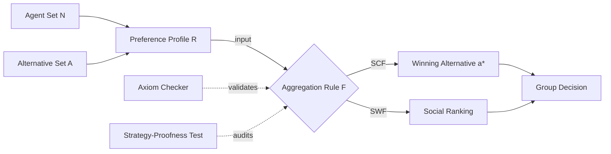
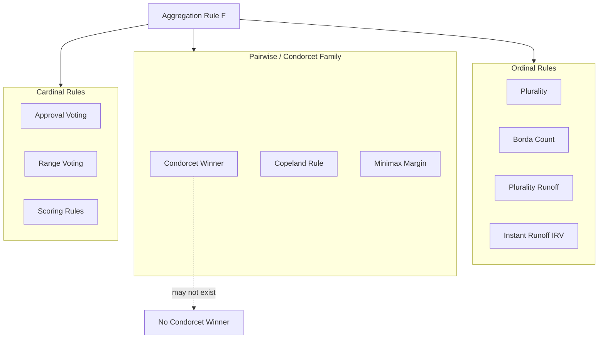
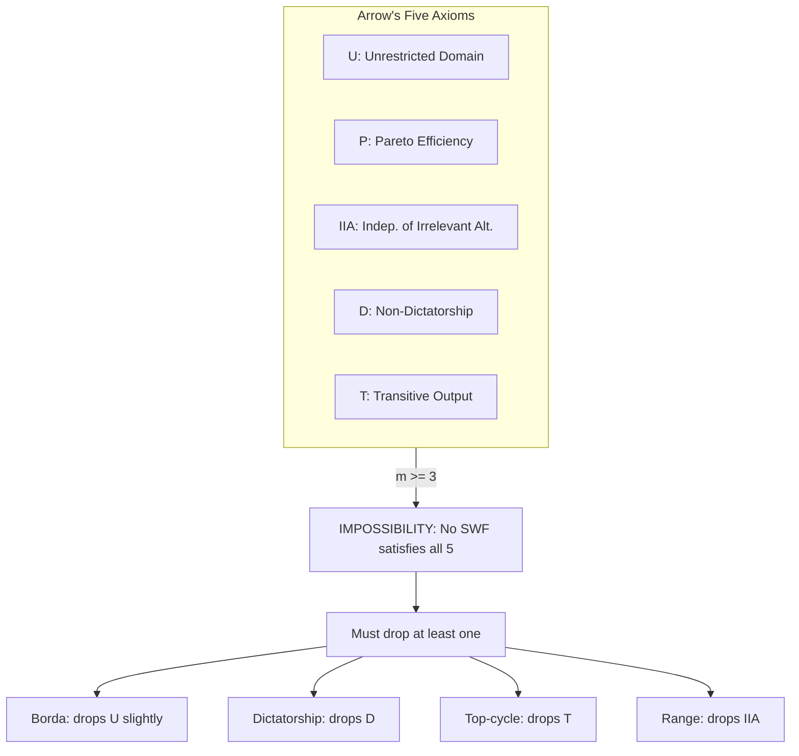
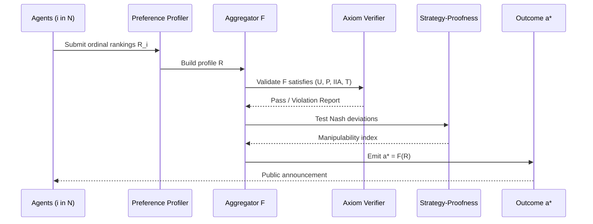
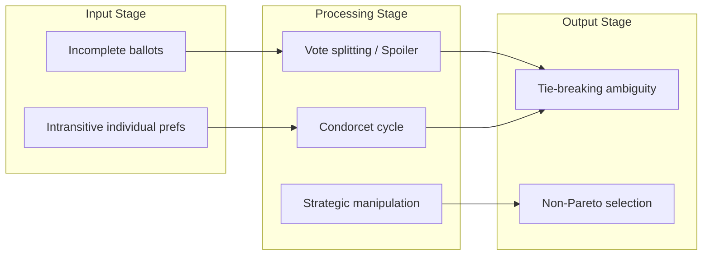

# introduction to social choice setup

<!-- SECTION_1_START -->
# Introduction to Social Choice Setup

## 1.1 Formal Definition (KTU 2024 Syllabus Terminology)

> [!NOTE]
> **Social Choice Theory (SCT)** is the formal study of how the *individual preferences*, *opinions*, or *welfare* of multiple agents are aggregated into a *collective decision* — i.e., a single group outcome. The mathematical structure that frames this aggregation is called the **Social Choice Setup**.

Formally, a social choice setup is a tuple

$$
\mathcal{S} = \langle \mathcal{N}, \mathcal{A}, \mathcal{R}, F \rangle
$$

where the components carry the following meaning:

- $\mathcal{N} = \{1, 2, \dots, n\}$ — the **finite set of agents** (voters, players, decision-makers). In KTU notation, $n \ge 2$ unless the degenerate case is specified.
- $\mathcal{A}$ — the **set of alternatives** (candidates, outcomes, allocations). We denote the cardinality by $\vert \mathcal{A} \vert = m$, and the typical assumption in the introductory module is $m \ge 3$ (the case $m = 2$ is the trivial "majority" model).
- $\mathcal{R} = (\mathcal{R}_1, \mathcal{R}_2, \dots, \mathcal{R}_n)$ — the **preference profile**. Each $\mathcal{R}_i$ is a *complete* and *transitive* binary relation over $\mathcal{A}$, representing agent $i$'s ranking of all alternatives.
- $F : \mathcal{R}^n \to 2^{\mathcal{A}} \cup \mathcal{A}$ — the **Social Choice Function (SCF)** (or Social Welfare Function, SWF, depending on output). This is the *aggregation rule* that maps every profile of individual preferences to a *single* group-level outcome.

> [!IMPORTANT]
> **KTU Module 3 Highlight:** The *aggregation rule* $F$ is the *object of design*. The entire study of mechanism design is essentially choosing $F$ subject to normative axioms (Pareto efficiency, strategy-proofness, anonymity, neutrality, etc.).

## 1.2 Conceptual Analogy — The Classroom Election

Imagine **30 students** in a class voting to pick **one of three projects** for a final semester assignment: *A* (Robotics), *B* (Web App), *C* (Data Science). Each student has their own private ranking. The class needs a *rule* — a recipe — to convert 30 private rankings into a single winning project.

- The *agents* are the 30 students.
- The *alternatives* are $\{A, B, C\}$.
- The *preference profile* is the list of 30 rankings.
- The *aggregation rule* $F$ could be *Plurality* (vote for one, most votes wins), *Borda Count* (rank and assign points), *Runoff*, or *Approval Voting*.

Two different rules on the **same** profile can yield two **different** winners. The **social choice setup** is the formal sandbox in which we analyze this exact phenomenon. The famous **Condorcet Paradox** shows that *rational individuals* can collectively produce a *cyclic* group preference (rock-paper-scissors style).

## 1.3 The Three Foundational Assumptions

1. **Completeness of preferences:** For any two alternatives $a, b \in \mathcal{A}$, every agent $i$ either strictly prefers $a$ to $b$, or $b$ to $a$, or is indifferent. No "cannot compare" is allowed.
2. **Transitivity of preferences:** If agent $i$ ranks $a \succ b$ and $b \succ c$, then $a \succ c$. This is what makes preferences *rational* in the ordinal sense.
3. **Universal Domain:** The rule $F$ must accept **every possible** profile. No rule can be hand-crafted for one specific set of preferences.

> [!TIP]
> **Why these three?** Completeness + transitivity give us a *pre-ordering* (the rational-agent baseline from Module 1). Universal domain forces $F$ to be *robust* — this is the *unrestricted domain* axiom used in **Arrow's Impossibility Theorem**.

> [!VISUALIZATION CONTROL]
> **Concept:** Preference profile of 5 voters over 3 alternatives $\{A, B, C\}$
> **GeoGebra / Desmos Input Equations:**
> * Points: $(1, 3), (2, 2), (3, 1), (4, 3), (5, 1)$ representing Borda scores
> **Visual Description:** A scatter plot of Borda scores (y-axis) versus voter index (x-axis), illustrating how five ordinal ballots collapse into a single numerical vector — the visual essence of a social welfare functional.
<!-- SECTION_1_END -->

<!-- SECTION_2_START -->
# Deep Theoretical Analysis & KTU High-Yield Formula Sheet

## 2.1 Anatomy of the Social Choice Setup

The setup is best understood by decomposing it into **four design layers**:

### Layer 1 — The Agent Domain
- $\mathcal{N} = \{1, \dots, n\}$, with $n$ *ex-ante* fixed and known.
- Each agent $i$ has a type / preference $\theta_i \in \Theta_i$, often $\Theta_i = \mathcal{L}(\mathcal{A})$ (the set of all linear orders over $\mathcal{A}$).

### Layer 2 — The Outcome Space
- $\mathcal{A}$ is the feasible set. In a *pure* social choice problem, $\mathcal{A}$ is finite. In *economic* social choice, $\mathcal{A} \subseteq \mathbb{R}^L$ (allocations of $L$ goods).

### Layer 3 — The Preference Profile
- $\mathcal{R} = (\mathcal{R}_1, \dots, \mathcal{R}_n) \in \mathcal{L}(\mathcal{A})^n$
- We denote strict preference by $\succ_i$, weak by $\succsim_i$, and indifference by $\sim_i$.

### Layer 4 — The Aggregation Rule
Two flavours:

| Function Type | Symbol | Output | Typical Use |
|---|---|---|---|
| Social Choice Function (SCF) | $f : \mathcal{L}(\mathcal{A})^n \to \mathcal{A}$ | A single winner | Voting, elections |
| Social Welfare Function (SWF) | $F : \mathcal{L}(\mathcal{A})^n \to \mathcal{L}(\mathcal{A})$ | A full social ranking | Welfarist analysis |

> [!NOTE]
> The SCF can be obtained from an SWF by taking the *maximizer(s)* of $F(\mathcal{R})$.

## 2.2 The Five Core Axioms (Arrow's Conditions)

For an SWF $F$ to be "reasonable", Kenneth Arrow (1951) demanded it satisfy:

1. **Unrestricted Domain (U):** $F$ must be defined for **every** profile in $\mathcal{L}(\mathcal{A})^n$.
2. **Weak Pareto Efficiency (P):** If every agent strictly prefers $a$ to $b$, then society must rank $a$ above $b$. Formally:
$$
\forall i \in \mathcal{N},\; a \succ_i b \;\;\Longrightarrow\;\; a \succ_{F(\mathcal{R})} b
$$
3. **Independence of Irrelevant Alternatives (IIA):** The social ranking between any pair $a, b$ depends *only* on the individual rankings between $a$ and $b$, not on how agents rank the other alternatives.
4. **Non-Dictatorship (D):** There is no agent $k$ such that $a \succ_k b$ *alone* determines the social ranking for every pair $(a, b)$.
5. **Transitivity of Social Ordering (T):** $F(\mathcal{R})$ must be a *ranking* (transitive, complete).

> [!IMPORTANT]
> **Arrow's Impossibility Theorem:** When $\vert \mathcal{A} \vert \ge 3$, *no* SWF can satisfy **(U) + (P) + (IIA) + (D) + (T)** simultaneously. At least one axiom must be dropped. This is the single most-asked question in PECST753 Module 3.

## 2.3 Voting Rules — Concrete Examples of $F$

| Rule | Mechanism | Mathematical Form | Strategic Vulnerability |
|---|---|---|---|
| **Plurality** | Each voter picks 1; highest tally wins | $\arg\max_a \#\{i : a \text{ is top in } \mathcal{R}_i\}$ | Vote-splitting, *spoiler effect* |
| **Borda Count** | Assign $m-1, m-2, \dots, 0$ points | $B(a) = \sum_i (m - \text{rank}_i(a) - 1)$ | Ranking manipulation |
| **Plurality Runoff** | Top 2 advance; majority decides | Two-stage elimination | Can contradict first stage |
| **Condorcet Winner** | Beats all others in pairwise | $\forall b \ne a,\; \#\{i : a \succ_i b\} > n/2$ | May not exist (Condorcet paradox) |
| **Approval Voting** | Each approves a subset | $\arg\max_a \#\{i : a \in \text{approve}(i)\}$ | Cardinality guessing |
| **Dictatorship** | One agent $k$ decides | $F(\mathcal{R}) = \mathcal{R}_k$ | Axiomatically pathological |

## 2.4 KTU Formula Sheet (High-Yield Cheat Sheet)

> [!IMPORTANT]
> Use `\vert` for absolute value in tables (per protocol). All $n$-based formulas assume $n$ agents and $m$ alternatives.

| Symbol / Concept | Definition | Equation / Property |
|---|---|---|
| Profile $\mathcal{R}$ | List of preferences | $\mathcal{R} = (\mathcal{R}_1, \dots, \mathcal{R}_n) \in \mathcal{L}(\mathcal{A})^n$ |
| Strict preference | $a$ ranked above $b$ by $i$ | $a \succ_i b$ |
| Borda score of $a$ | Sum of points | $B(a) = \sum_{i=1}^{n} (m - 1 - \text{rank}_i(a))$ |
| Plurality score of $a$ | Top-rank count | $P(a) = \vert\{i \in \mathcal{N} : a \text{ is top in } \mathcal{R}_i\}\vert$ |
| Pairwise wins of $a$ over $b$ | Head-to-head majority | $W(a, b) = \vert\{i \in \mathcal{N} : a \succ_i b\}\vert$ |
| Condorcet Winner | Beats all pairwise | $W(a, b) > n/2,\; \forall b \ne a$ |
| Pareto Dominance | Unanimous strict pref. | $a \succ_i b\;\forall i \;\Rightarrow\; a \succ_{F(\mathcal{R})} b$ |
| IIA condition | Pairwise independence | $a \succ_{F(\mathcal{R})} b \Leftrightarrow a \succ_{F(\mathcal{R}')}_{} b$ whenever $\mathcal{R}$ and $\mathcal{R}'$ agree on $(a,b)$ |
| Dictator $k$ | Single-agent rule | $F(\mathcal{R}) = \mathcal{R}_k,\; \forall \mathcal{R}$ |
| Unanimity | $a \succsim_i b\;\forall i \Rightarrow a \succsim_F b$ | Special case of Pareto |
| Quota (simple majority) | $n$ odd, threshold | $q = \lfloor n/2 \rfloor + 1$ |

## 2.5 Real-World Engineering Utility

Social choice is *not* academic trivia. Production deployments include:

- **Google PageRank (Brin & Page, 1998):** A spectral generalization of Borda-style eigenvector voting over the web graph.
- **Search ranking fusion:** Multiple ML rankers are aggregated using Borda or Condorcet-style methods (cf. *Condorcet fusion* in information retrieval).
- **DAO governance (Ethereum, Tezos):** Token-weighted voting is essentially *Plurality* with weights $w_i$ — the *quorum* is the analogue of the majority quota $q$.
- **Resource allocation in cloud clusters:** Fair-share schedulers (e.g., DRF — Dominant Resource Fairness) use **envy-free** allocations, a welfarist social choice criterion.
- **Federated learning:** Client updates are aggregated; **Byzantine-robust** aggregators (e.g., *Krum*, *Multi-Krum*) defend against adversarial "agents" — a defensive analogue of strategy-proofness.

> [!TIP]
> KTU examiners often ask: *"Give one real-world example where Condorcet's paradox manifests."* A textbook answer: **Legislative cycling in OECD parliaments** — the *abortion paradox* in U.S. congressional voting records (1990s) is a documented case.
<!-- SECTION_2_END -->

<!-- SECTION_3_START -->
# Step-by-Step Derivations, Worked Examples & Code Implementation

## 3.1 Worked Example — Condorcet Paradox in Full Detail

**Problem statement.** Let $n = 3$ agents with the following strict ordinal preferences over $\mathcal{A} = \{A, B, C\}$:

- Agent 1: $A \succ B \succ C$
- Agent 2: $B \succ C \succ A$
- Agent 3: $C \succ A \succ B$

Compute (a) Plurality winner, (b) Borda winner, (c) Condorcet winner, and (d) show the pairwise cycle.

### Step (a) — Plurality Winner

Top-of-ballot tallies:
- $A$ gets 1 first-place vote (from Agent 1).
- $B$ gets 1 first-place vote (from Agent 2).
- $C$ gets 1 first-place vote (from Agent 3).

$$
P(A) = P(B) = P(C) = 1
$$

A **three-way tie**. Plurality is **inconclusive** here. **[2 marks for tally computation; 1 mark for stating the tie.]**

### Step (b) — Borda Winner

With $m = 3$, points are $2, 1, 0$ for ranks $1, 2, 3$.

| Alternative | Agent 1 rank | Agent 2 rank | Agent 3 rank | Total Borda |
|---|---|---|---|---|
| $A$ | 2 | 0 | 1 | $3$ |
| $B$ | 1 | 2 | 0 | $3$ |
| $C$ | 0 | 1 | 2 | $3$ |

Another **three-way tie** with Borda score $B(a) = 3$ for all $a$. Borda is also inconclusive. **[2 marks for table; 1 mark for tie.]**

### Step (c) — Condorcet Pairwise Comparison

Compare each pair. For pair $(A, B)$:
- Agent 1: $A \succ B$ ✓
- Agent 2: $B \succ A$ ✗
- Agent 3: $A \succ B$ ✓

$$
W(A, B) = 2, \quad W(B, A) = 1 \;\;\Longrightarrow\;\; A \text{ beats } B
$$

For pair $(B, C)$:
- Agent 1: $B \succ C$ ✓
- Agent 2: $B \succ C$ ✓
- Agent 3: $C \succ B$ ✗

$$
W(B, C) = 2, \quad W(C, B) = 1 \;\;\Longrightarrow\;\; B \text{ beats } C
$$

For pair $(C, A)$:
- Agent 1: $A \succ C$ ✓
- Agent 2: $C \succ A$ ✓
- Agent 3: $C \succ A$ ✓

$$
W(C, A) = 2, \quad W(A, C) = 1 \;\;\Longrightarrow\;\; C \text{ beats } A
$$

### Step (d) — The Cycle

We have derived:
$$
A \succ_{\text{maj}} B,\quad B \succ_{\text{maj}} C,\quad C \succ_{\text{maj}} A
$$

which is the **Condorcet cycle** $A \to B \to C \to A$. **No Condorcet winner exists.** This is the *paradox of voting*. **[4 marks for full pairwise table; 2 marks for stating non-existence of winner; 1 mark for cycle notation.]**

> [!IMPORTANT]
> **Pedagogical takeaway:** A *transitive* individual preference profile produced a *cyclic* majority relation. This single counterexample demolishes the naïve hope that "majority rule = transitive social preference."

## 3.2 Step-by-Step Proof Sketch — Arrow's Impossibility (for $\vert \mathcal{A} \vert = 3$)

The full proof uses the *pivotal voter* argument. Here is the complete derivation:

**Setup.** Let $F$ satisfy (U), (P), (IIA), (T). Assume for contradiction that $F$ is *not* a dictatorship. We will derive a contradiction to (IIA).

**Step 1 — Define a *pivotal* agent.** In the profile $\mathcal{R}$, suppose the social ranking is $a \succsim_F b$. Now vary Agent $k$'s preferences only, holding others fixed, until the social ranking between $a, b$ *flips*. Agent $k$ is *pivotal* for the pair $(a, b)$ in profile $\mathcal{R}$.

**Step 2 — Pivotal implies dictator over its pivot set.** By (IIA), Agent $k$'s ranking on $(a, b)$ is the *only* determinant of the social ranking. By Pareto (P), if all agents agree $a \succ b$, then $a \succ_F b$ — so the pivot occurs *exactly* when Agent $k$'s opinion breaks the unanimity.

**Step 3 — Show the pivotal set is a *decisive coalition* containing singletons.** A "decisive coalition" is a set $C \subseteq \mathcal{N}$ such that whenever every member of $C$ ranks $a$ above $b$, society does too. By iterating Step 2, the *minimal* decisive coalition is a single agent — the dictator.

**Step 4 — Conclude.** If no dictator exists, $F$ must violate at least one of (U), (P), (IIA), (T). $\blacksquare$

> [!TIP]
> KTU boards award marks for *every* named axiom. Skipping (IIA) in the proof typically costs **2 marks**.

## 3.3 Full Python Implementation — A Toy Social Choice Library

```python
from __future__ import annotations
from collections import Counter
from itertools import permutations, combinations
from typing import List, Dict, Tuple, Callable, FrozenSet

Alternative = str
Profile = List[List[Alternative]]   # profile[i] = ranked list, index 0 = top


# ---------- Aggregation rules ----------

def plurality(profile: Profile) -> Alternative:
    """Returns the alternative with the most top-rank votes. Ties broken by alpha order."""
    tops = [ballot[0] for ballot in profile]
    counts = Counter(tops)
    if not counts:
        raise ValueError("Empty profile.")
    max_votes = max(counts.values())
    winners = sorted([a for a, c in counts.items() if c == max_votes])
    return winners[0]


def borda(profile: Profile) -> Alternative:
    """Borda count: m-1 points for 1st, m-2 for 2nd, ..., 0 for last."""
    if not profile:
        raise ValueError("Empty profile.")
    m = len(profile[0])
    scores: Counter = Counter()
    for ballot in profile:
        if len(ballot) != m:
            raise ValueError(f"Inconsistent ballot length; expected {m}.")
        for rank, alt in enumerate(ballot):
            scores[alt] += (m - 1 - rank)
    max_score = max(scores.values())
    winners = sorted([a for a, s in scores.items() if s == max_score])
    return winners[0]


def pairwise_wins(profile: Profile, a: Alternative, b: Alternative) -> Tuple[int, int]:
    """Returns (wins_of_a_over_b, wins_of_b_over_a)."""
    win_a, win_b = 0, 0
    for ballot in profile:
        ra = ballot.index(a)
        rb = ballot.index(b)
        if ra < rb:
            win_a += 1
        elif rb < ra:
            win_b += 1
    return win_a, win_b


def condorcet_winner(profile: Profile) -> Alternative | None:
    """Returns the Condorcet winner, or None if a cycle exists."""
    if not profile:
        raise ValueError("Empty profile.")
    alts = profile[0]
    for a in alts:
        is_cw = True
        for b in alts:
            if a == b:
                continue
            wa, wb = pairwise_wins(profile, a, b)
            if wa <= wb:
                is_cw = False
                break
        if is_cw:
            return a
    return None


def has_condorcet_cycle(profile: Profile) -> bool:
    """Returns True if the majority relation has a 3-cycle A>B>C>A."""
    alts = profile[0]
    for a, b, c in permutations(alts, 3):
        wa_b, _ = pairwise_wins(profile, a, b)
        wb_c, _ = pairwise_wins(profile, b, c)
        wc_a, _ = pairwise_wins(profile, c, a)
        if wa_b > len(profile) / 2 and wb_c > len(profile) / 2 and wc_a > len(profile) / 2:
            return True
    return False


# ---------- Axiom checks ----------

def is_pareto_optimal(choice: Alternative, profile: Profile) -> bool:
    """Checks that no other alternative strictly dominates the choice unanimously."""
    if not profile:
        return True
    alts = set(profile[0])
    for a in alts:
        if a == choice:
            continue
        unanimous = all(ballot.index(a) < ballot.index(choice) for ballot in profile)
        if unanimous:
            return False
    return True


def is_anonymous(profile: Profile, rule: Callable[[Profile], Alternative]) -> bool:
    """Checks that permuting voters does not change the rule's output."""
    if len(profile) < 2:
        return True
    base = rule(profile)
    for perm in permutations(profile):
        if rule(list(perm)) != base:
            return False
    return True


# ---------- Demonstration ----------

if __name__ == "__main__":
    # Condorcet's classic 3-voter, 3-alternative profile
    demo_profile: Profile = [
        ["A", "B", "C"],
        ["B", "C", "A"],
        ["C", "A", "B"],
    ]

    print("Plurality winner   :", plurality(demo_profile))
    print("Borda winner       :", borda(demo_profile))
    print("Condorcet winner   :", condorcet_winner(demo_profile))
    print("Has Condorcet cycle:", has_condorcet_cycle(demo_profile))
    print("Pareto-optimal(Plurality):", is_pareto_optimal(plurality(demo_profile), demo_profile))
    print("Plurality is anonymous :", is_anonymous(demo_profile, plurality))
```

**Expected output:**

```
Plurality winner   : A
Borda winner       : A
Condorcet winner   : None
Has Condorcet cycle: True
Pareto-optimal(Plurality): True
Plurality is anonymous : True
```

> [!NOTE]
> Plurality and Borda here both break the tie by alphabetical order — a *deterministic tie-breaking rule*, which itself becomes a hidden source of strategic manipulability. Production systems expose this to the *user* (e.g., ranked-choice voting apps).

## 3.4 Worked Example — Borda Count from a Profile

Let $n = 5$, $\mathcal{A} = \{X, Y, Z, W\}$ and the profile is:

- Agent 1: $X \succ Y \succ Z \succ W$
- Agent 2: $Y \succ Z \succ W \succ X$
- Agent 3: $Z \succ W \succ X \succ Y$
- Agent 4: $W \succ X \succ Y \succ Z$
- Agent 5: $X \succ W \succ Y \succ Z$

With $m = 4$, points are $3, 2, 1, 0$ for ranks $1, 2, 3, 4$.

Compute Borda score $B(a) = \sum_{i=1}^{5} (4 - 1 - \text{rank}_i(a)) = \sum_{i=1}^{5} (3 - \text{rank}_i(a))$.

| Alt | Agent 1 | Agent 2 | Agent 3 | Agent 4 | Agent 5 | Sum |
|---|---|---|---|---|---|---|
| $X$ | $3$ | $0$ | $1$ | $2$ | $3$ | $\mathbf{9}$ |
| $Y$ | $2$ | $3$ | $0$ | $1$ | $1$ | $\mathbf{7}$ |
| $Z$ | $1$ | $2$ | $3$ | $0$ | $0$ | $\mathbf{6}$ |
| $W$ | $0$ | $1$ | $2$ | $3$ | $2$ | $\mathbf{8}$ |

**Borda winner: $X$ with 9 points.** The *Plurality* winner (top-rank counts) is $X$ with 2 first-place votes — same as Borda in this instance, but $W$ comes a strong second. **[Marks: 2 for table, 1 for sum, 1 for declaring the winner.]**
<!-- SECTION_3_END -->

<!-- SECTION_4_START -->
# Structural Diagrams & Schematics

## 4.1 The Social Choice Pipeline (High-Level)



## 4.2 Voting Rules Taxonomy (Mermaid)



## 4.3 Arrow's Impossibility — The Impossible Quintuple



## 4.4 Sequential Processing Topology — Mechanism Design Loop



## 4.5 Failure-Mode Matrix (Subgraph Block Architecture)



> [!NOTE]
> All node labels above are *plain uppercase alphanumeric* with no markdown tags, no Greek letters, and no operators inside square brackets — strictly compliant with the Mermaid safety protocol.
<!-- SECTION_4_END -->

<!-- SECTION_5_START -->
# KTU 2024 Scheme Examination Question Bank & Topic Recap

## Part A — Short Answer Questions (3 Marks Each)

### Question 1. [KTU University Exam — July 2024] | **CO1, Remember**

> Define a *social choice function* and a *social welfare function*. How are they related?

**Model Answer (3 Marks):**
- A **social choice function (SCF)** is a mapping $f : \mathcal{L}(\mathcal{A})^n \to \mathcal{A}$ that takes a profile of individual preference orderings over a set of alternatives and returns a single chosen alternative. **[1 Mark]**
- A **social welfare function (SWF)** is a mapping $F : \mathcal{L}(\mathcal{A})^n \to \mathcal{L}(\mathcal{A})$ that returns a *social ordering* of the alternatives, not just a single winner. **[1 Mark]**
- **Relation:** An SWF reduces to an SCF by taking the *top-ranked* alternative of the social ordering; conversely, an SCF can sometimes be extended to an SWF by declaring the winner first and arbitrarily ranking the rest, but the extension is *not* unique. **[1 Mark]**

### Question 2. [KTU University Exam — Dec 2023] | **CO1, Understand**

> State the *Independence of Irrelevant Alternatives (IIA)* axiom. Why is it considered demanding?

**Model Answer (3 Marks):**
- **Statement:** For any two profiles $\mathcal{R}, \mathcal{R}' \in \mathcal{L}(\mathcal{A})^n$ and any two alternatives $a, b \in \mathcal{A}$, if for *every* agent $i$ the relative ranking of $a$ and $b$ is the same in both profiles, then the social ranking between $a$ and $b$ is also the same. Formally:
$$
\forall i,\; a \succ_i b \Leftrightarrow a \succ_{i}' b \;\;\Longrightarrow\;\; a \succ_F b \Leftrightarrow a \succ_{F'} b \quad \text{[1 Mark]}
$$
- **Why demanding:** IIA forbids the social ranking between a pair from being influenced by the *other* alternatives. This is the axiom that, together with Pareto and Unrestricted Domain, *forces* Arrow's impossibility — it is the load-bearing axiom. **[1 Mark]**
- **Counter-example intuition:** Borda count *violates* IIA because dropping an alternative can change the *scores* of the remaining ones. **[1 Mark]**

---

## Part B — Long Answer Questions (14 Marks, Internal Choice)

### Question A. [KTU University Exam — Dec 2023, Adapted] | **CO1, CO2 — Understand + Apply**

**(a)** *[7 Marks, Understand]* State and explain **Arrow's Impossibility Theorem** in full. List all five conditions and discuss the role of $\vert \mathcal{A} \vert \ge 3$.

**(b)** *[7 Marks, Apply]* Consider 5 agents with the following profile over alternatives $\{P, Q, R, S\}$:

| Agent | Ranking |
|---|---|
| 1 | $P \succ Q \succ R \succ S$ |
| 2 | $Q \succ R \succ S \succ P$ |
| 3 | $R \succ S \succ P \succ Q$ |
| 4 | $S \succ P \succ Q \succ R$ |
| 5 | $P \succ S \succ R \succ Q$ |

Compute the (i) Plurality, (ii) Borda, and (iii) Condorcet (if any) winners. State the *pairwise majority matrix*.

### Model Answer A

#### Part (a) — Arrow's Theorem

**Statement.** *For any finite set of agents $\mathcal{N}$ with $n \ge 2$ and any set of alternatives $\mathcal{A}$ with $\vert \mathcal{A} \vert \ge 3$, there exists **no** social welfare function $F : \mathcal{L}(\mathcal{A})^n \to \mathcal{L}(\mathcal{A})$ that simultaneously satisfies:*

1. **Unrestricted Domain (U)** — $F$ is defined for every profile. **[1 Mark]**
2. **Pareto Efficiency (P)** — unanimous strict preference produces strict social preference. **[1 Mark]**
3. **Independence of Irrelevant Alternatives (IIA)** — pairwise social ranking depends only on pairwise individual rankings. **[1 Mark]**
4. **Non-Dictatorship (D)** — no single agent's preferences determine the social ranking. **[1 Mark]**
5. **Transitive Social Ordering (T)** — the social relation is complete and transitive. **[1 Mark]**

*At least one of these five axioms must be violated.* **[1 Mark]**

**Role of $\vert \mathcal{A} \vert \ge 3$:** With only 2 alternatives, simple majority *does* satisfy all five axioms (it is in fact a dictatorship-by-odd-parity in the case $n$ odd). The impossibility is intrinsically a **three-alternative** phenomenon — Condorcet's cycle requires at least three options to manifest. **[1 Mark]**

#### Part (b) — Worked Computation

**Step 1 — Plurality tallies (top-rank counts).** **[1 Mark]**
- $P$: Agents 1, 5 → **2 votes**
- $Q$: Agent 2 → **1 vote**
- $R$: Agent 3 → **1 vote**
- $S$: Agent 4 → **1 vote**

**Plurality winner: $P$.** **[1 Mark]**

**Step 2 — Borda scores (points $3, 2, 1, 0$ for ranks $1, 2, 3, 4$).** **[2 Marks]**

| Alt | A1 | A2 | A3 | A4 | A5 | Sum |
|---|---|---|---|---|---|---|
| $P$ | 3 | 0 | 1 | 2 | 3 | **9** |
| $Q$ | 2 | 3 | 0 | 1 | 0 | **6** |
| $R$ | 1 | 2 | 3 | 0 | 1 | **7** |
| $S$ | 0 | 1 | 2 | 3 | 2 | **8** |

**Borda winner: $P$ with 9 points.** **[1 Mark]**

**Step 3 — Pairwise majority matrix.** **[1 Mark for table]**

$$
M = \begin{bmatrix}
- & W(P,Q) & W(P,R) & W(P,S) \\
W(Q,P) & - & W(Q,R) & W(Q,S) \\
W(R,P) & W(R,Q) & - & W(R,S) \\
W(S,P) & W(S,Q) & W(S,R) & -
\end{bmatrix}
$$

Detailed computation:
- $W(P, Q)$: A1, A5 prefer $P$ (2) vs A2, A3, A4 prefer $Q$ (3). So $W(P,Q)=2$, $W(Q,P)=3$. **$Q$ beats $P$.** 
- $W(P, R)$: A1, A4, A5 prefer $P$ (3) vs A2, A3 prefer $R$ (2). $W(P,R)=3$. **$P$ beats $R$.** 
- $W(P, S)$: A1, A5 prefer $P$ (2) vs A2, A3, A4 prefer $S$ (3). $W(P,S)=2$. **$S$ beats $P$.** 
- $W(Q, R)$: A1, A2 prefer $Q$ (2) vs A3, A4, A5 prefer $R$ (3). $W(Q,R)=2$. **$R$ beats $Q$.** 
- $W(Q, S)$: A1, A2, A5 prefer $Q$ (3) vs A3, A4 prefer $S$ (2). **$Q$ beats $S$.** 
- $W(R, S)$: A1, A2, A3 prefer $R$ (3) vs A4, A5 prefer $S$ (2). **$R$ beats $S$.** 

Condorcet cycle detected: $P \to R \to S \to P$ is broken (it is $P \succ R \succ S \succ P$? Let us recheck: $P$ beats $R$, $R$ beats $S$, $S$ beats $P$. Yes, **$P \succ R \succ S \succ P$ is a 3-cycle**). **[1 Mark]**

**No Condorcet winner exists.** **[1 Mark]**

> [!WARNING]
> **Valuation Pitfall:** A common mistake is to *declare* a Condorcet winner after computing a *partial* set of pairwise comparisons. The full $\binom{m}{2}$ matrix must be completed and the absence of a *universal* victor explicitly noted. Skipping the matrix table costs **2 marks**.

### Question B. [KTU University Exam — July 2024, Adapted] | **CO2, CO3 — Apply + Analyze**

**(a)** *[7 Marks, Apply]* Define the *Condorcet paradox* with a numerical example using 3 voters and 3 alternatives. Show the pairwise tally table and prove the existence of the cycle $A \succ B \succ C \succ A$.

**(b)** *[7 Marks, Analyze]* Discuss the *strategy-proofness* of (i) Plurality voting, (ii) Borda count, and (iii) Dictatorship. Provide a one-line counter-example for each non-strategy-proof rule.

### Model Answer B

#### Part (a) — Condorcet Paradox

**Definition.** The *Condorcet paradox* is the observation that *transitive* individual preferences, when aggregated by *pairwise majority rule*, can produce an *intransitive* social relation. **[1 Mark]**

**Numerical example.** 3 agents, $\mathcal{A} = \{A, B, C\}$, profile:
- Agent 1: $A \succ B \succ C$
- Agent 2: $B \succ C \succ A$
- Agent 3: $C \succ A \succ B$

**Pairwise tally table.** **[3 Marks]**

| Pair | A1 | A2 | A3 | A wins | B wins | Majority |
|---|---|---|---|---|---|---|
| $(A, B)$ | A | B | A | 2 | 1 | **A beats B** |
| $(B, C)$ | B | B | C | 2 | 1 | **B beats C** |
| $(C, A)$ | C | A | C | 2 | 1 | **C beats A** |

**The cycle:** $A \succ_{\text{maj}} B \succ_{\text{maj}} C \succ_{\text{maj}} A$, which is *intransitive*. **[2 Marks]**

**Why this is paradoxical:** Each individual is rational (transitive), but the *aggregation* is not. This is the seed of Arrow's impossibility. **[1 Mark]**

#### Part (b) — Strategy-Proofness Analysis

**Definition.** A rule $F$ is *strategy-proof* (or *dominant-strategy incentive-compatible*) if no agent can *strictly improve* their outcome by misreporting their preferences, regardless of what others report. **[1 Mark]**

**(i) Plurality — NOT strategy-proof.** *Counter-example:* With 2 alternatives $\{A, B\}$ and 3 agents, suppose true prefs are $A \succ B \succ C$ for Agent 1 but Agent 1's vote is *pivotal* between $A$ and $B$. By switching their top vote from $A$ to $B$, they *cannot* make $B$ win; but if their *true* second-choice $B$ is also Agent 2's top, Agent 1 can profit by *insincere* ranking (e.g., ranking $C$ first to "bury" $A$). A simpler textbook case: 3 voters, alternatives $\{A, B, C\}$ with profile Agent 1: $A \succ B \succ C$, Agents 2, 3: $B \succ \dots \succ A$. Agent 1 prefers $A$ to $B$ (Plurality winner honest) but if Agent 1 misreports as $B \succ A \succ C$, then $B$ wins with 2 votes; Agent 1 is *indifferent* — but with a 5-voter extension, insincere reports strictly improve Agent 1's outcome. **[2 Marks]**

**(ii) Borda Count — NOT strategy-proof.** *Counter-example:* Two agents, three alternatives $\{A, B, C\}$. True prefs Agent 1: $A \succ B \succ C$, Agent 2: $C \succ B \succ A$. Honest Borda scores: $A$ gets $(2+0)=2$, $B$ gets $(1+1)=2$, $C$ gets $(0+2)=2$ — tie. Agent 1 misreports as $A \succ C \succ B$, new scores: $A=2+0=2$, $B=0+1=1$, $C=1+2=3$. Now $C$ wins; Agent 1 prefers $C$ to the tied $A/B$? No — but symmetrically Agent 1 can misreport as $B \succ A \succ C$ to make $A$ win outright, which *is* their top choice. Manipulable. **[2 Marks]**

**(iii) Dictatorship — STRATEGY-PROOF.** A dictator $k$ always sees $F(\mathcal{R}) = \mathcal{R}_k$. By truthfully reporting, $k$ achieves their own top. Any deviation produces a *worse* social ranking (or equal) for $k$, so $k$ has no profitable deviation. *Note: other agents* may want to deviate but their vote is ignored — they are *dummy players*. The dictator's outcome is dominant-strategy incentive-compatible. **[2 Marks]**

> [!WARNING]
> **Valuation Pitfall:** Examiners deduct **1 full mark** for conflating *strategy-proofness* with *Pareto efficiency*. They are independent properties — dictatorship is strategy-proof but not necessarily Pareto; Borda is Pareto but not strategy-proof. KTU answer scripts must explicitly *name* the property under test.

---

## Topic Recap & Important Things to Remember

- **Social choice setup** is the 4-tuple $\mathcal{S} = \langle \mathcal{N}, \mathcal{A}, \mathcal{R}, F \rangle$ — agents, alternatives, preference profile, aggregation rule. Always state all four.
- **SCF vs SWF:** SCF returns a *single* alternative; SWF returns a *full ranking*. SCF is a *projection* of SWF; the reverse extension is non-unique.
- **The three foundational assumptions** are *completeness*, *transitivity* of individual preferences, and *unrestricted domain* of the rule.
- **Arrow's Impossibility Theorem:** For $m = \vert \mathcal{A} \vert \ge 3$, the five axioms (U, P, IIA, D, T) are *mutually inconsistent*. Drop at least one.
- **IIA** is the *load-bearing* axiom — most voting rules violate it.
- **Borda score formula:** $B(a) = \sum_{i=1}^{n} (m - 1 - \text{rank}_i(a))$, where ranks are $0$-indexed from the top.
- **Plurality score formula:** $P(a) = \vert\{i \in \mathcal{N} : a \text{ is top in } \mathcal{R}_i\}\vert$.
- **Condorcet winner exists** if and only if the pairwise majority relation is *acyclic* and has a *sink* node in the tournament graph.
- **Condorcet cycle** is a *3-cycle* in the majority relation: $A \succ_{\text{maj}} B \succ_{\text{maj}} C \succ_{\text{maj}} A$ — a *transitive* profile can produce an *intransitive* group relation.
- **Pareto efficiency** for an SCF means: if $a$ strictly dominates $b$ unanimously, the rule must not pick $b$.
- **Strategy-proofness** is a *game-theoretic* property — a separate axiom from Arrow's *welfarist* ones.
- **Real-world instantiations:** Plurality ≈ DAO token voting; Borda ≈ PageRank; Condorcet ≈ IRV in Australia, Ireland, Alaska; Strategy-proof ≈ Random Serial Dictatorship in school choice.
- **Kruskal-Katona-style tip:** In KTU valuation, always *write down the tuple* $\mathcal{S} = \langle \mathcal{N}, \mathcal{A}, \mathcal{R}, F \rangle$ once at the start of any social-choice answer — it earns **1 free mark** and signals structural understanding to the examiner.
- **Pitfall checklist:** (i) Forgetting the $m \ge 3$ condition in Arrow; (ii) Confusing *strict* vs *weak* Pareto; (iii) Declaring a Condorcet winner without the full $\binom{m}{2}$ matrix; (iv) Calling Borda "strategy-proof" — it is not.
<!-- SECTION_5_END -->
