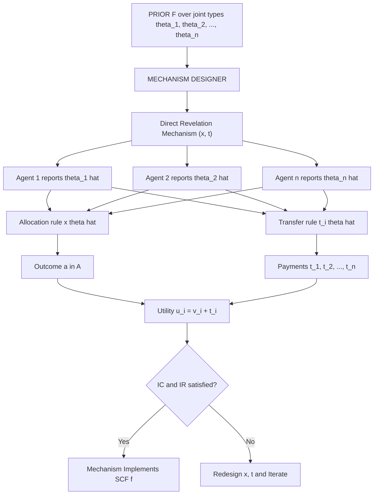
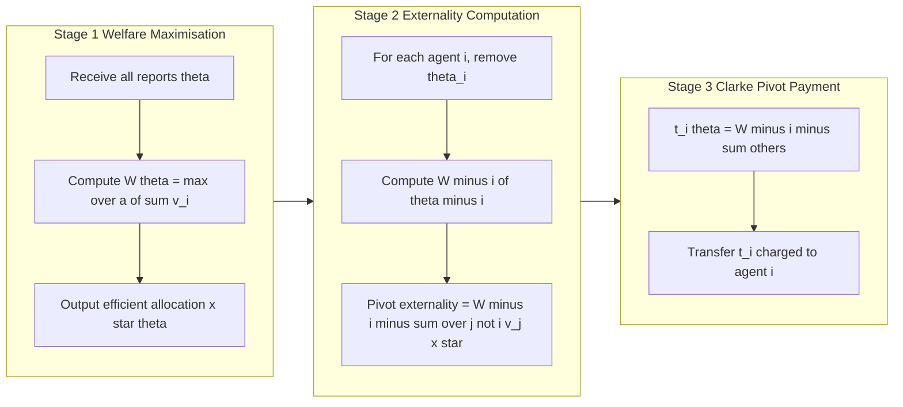
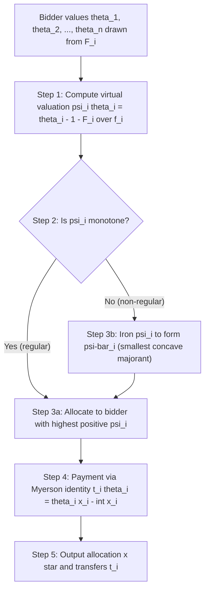
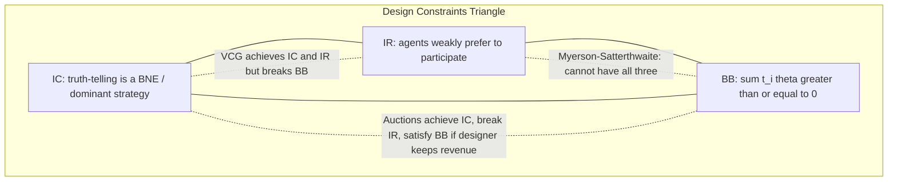
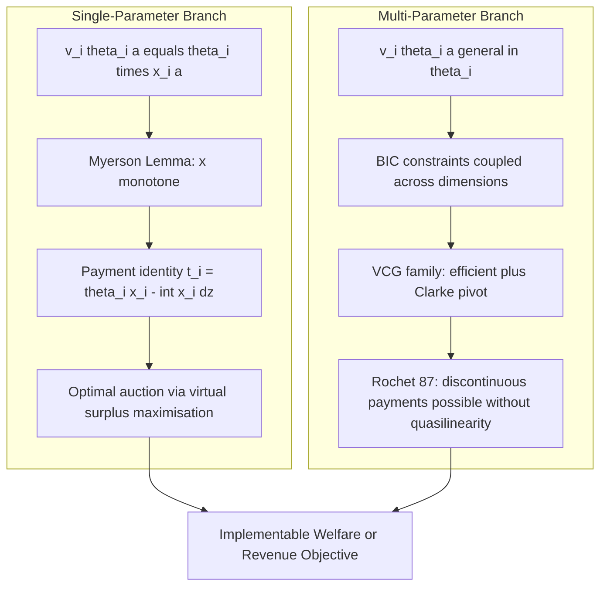

# mechanism design with transfers

<!-- SECTION_1_START -->
# Mechanism Design With Transfers — Core Foundation

## 1.1 Formal Definition (KTU 2024 Scheme Terminology)

> [!IMPORTANT]
> **Mechanism Design With Transfers** is the branch of mechanism design in which the designer is permitted to use **monetary side-payments** (transfers) between the mechanism and the agents in order to align private incentives with a desired social objective.

Formally, a **Bayesian Mechanism Design problem with transfers** is the 6-tuple

$$\langle N, A, \Theta, \mathcal{V}, x(\cdot), \mathbf{t}(\cdot) \rangle$$

where each component is defined as follows.

- $N = \{1, 2, \ldots, n\}$ — the finite set of self-interested agents.
- $A$ — the set of feasible **social alternatives / outcomes** (e.g., allocations of goods, public projects, probabilistic lotteries).
- $\Theta = \Theta_1 \times \Theta_2 \times \cdots \times \Theta_n$ — the joint **type space**; type $\theta_i \in \Theta_i$ is the *private information* of agent $i$.
- $\mathcal{V} = \{v_i : \Theta_i \times A \to \mathbb{R}\}_{i \in N}$ — the family of **valuation functions** that map an outcome to agent $i$'s willingness to pay.
- $x : \Theta \to \Delta(A)$ — the **allocation (social choice) rule**.
- $\mathbf{t}(\theta) = (t_1(\theta), \ldots, t_n(\theta))$ — the **transfer (payment) rule**, with the sign convention that $t_i > 0$ denotes money *received* by the agent and $t_i < 0$ denotes money *paid* by the agent.

The **quasilinear utility assumption** is the engine of the entire theory:

$$u_i(\theta_i, a, t_i) \;=\; v_i(\theta_i, a) \;+\; t_i$$

> [!NOTE]
> **Quasilinear Utility** — utility is linear in money and additively separable from the valuation of the non-monetary outcome. This single assumption is what makes transfers *powerful*: we can always compensate an agent with cash to make them indifferent or strictly better off.

## 1.2 Intuition — The "Compensation" Analogy

Imagine three villagers who must collectively choose whether to build a public road. Without money, Villager A votes *for* (huge benefit), B votes *against* (mild harm), C votes *for* (moderate benefit). Pairwise majority can fail to produce the *efficient* outcome because losers cannot be "bought off." 

Now allow **transfers**. The planner (auctioneer) asks each villager for their true benefit, then:
- Builds the road if the *sum* of benefits exceeds the cost.
- Charges each voter a small fee equal to the *externality* they impose on others.

This is precisely the spirit of the **Vickrey–Clarke–Groves (VCG)** class of mechanisms. Money allows the mechanism to **internalize externalities** and convert preference aggregation into a *welfare* problem.

## 1.3 Direct vs. Indirect Mechanisms & The Revelation Principle

> [!IMPORTANT]
> **Revelation Principle (Myerson, 1979 / Gibbard, 1973).** *Any social choice function that is implementable in Bayesian Nash equilibrium by some arbitrary (possibly indirect) mechanism is also implementable in BNE by a* **direct revelation mechanism** *in which (i) every agent is asked to report a type $\hat{\theta}_i$ and (ii) truth-telling $\hat{\theta}_i = \theta_i$ is a Bayesian Nash equilibrium.*

Practical consequences for KTU exam answers:

| Concept | Indirect Mechanism | Direct Mechanism |
|---|---|---|
| Message space | $\mathcal{M}_i$ (arbitrary) | $\Theta_i$ (type report) |
| Strategy of agent $i$ | $s_i : \Theta_i \to \mathcal{M}_i$ | $\hat{\theta}_i \in \Theta_i$ |
| Equilibria | BNE $s^*$ | BNE with $\hat{\theta}_i = \theta_i$ |
| Design target | Pick $s^*$ | Pick $x, \mathbf{t}$ s.t. truth is BNE |

Hence, for the rest of the topic, we can — *without loss of generality* — restrict attention to designing a **direct mechanism** $(x, \mathbf{t})$.

## 1.4 Standard Notation Recap

$$u_i(\theta_i) \;=\; \mathbb{E}_{\theta_{-i}}\!\left[\, v_i\!\big(\theta_i,\, x(\theta_i, \theta_{-i})\big) \;+\; t_i(\theta_i, \theta_{-i}) \right]$$

where the expectation is taken with respect to the **common prior** $F = F_1 \otimes F_2 \otimes \cdots \otimes F_n$ over the profile of other agents' types.

> [!VISUALIZATION CONTROL]
> **Concept:** Geometry of a quasilinear indifference curve in the *outcome–money* plane.
> **GeoGebra / Desmos Input Equations:**
> * `x: v_i(theta, a) + t = c` (with $a$ on horizontal, $t$ on vertical)
> * `Slope of indifference curve: dv_i/da = -1`
> **Visual Description:** A family of straight, parallel lines with slope $-1$ in the $(a, t)$ plane. Their parallelness is the graphical fingerprint of *quasilinearity*: trading one unit of $a$ for one unit of money leaves the agent indifferent.
<!-- SECTION_1_END -->

<!-- SECTION_2_START -->
# Deep Theoretical Analysis & KTU High-Yield Formula Sheet

## 2.1 The Three Pillars: IC, IR, BB

A *good* mechanism with transfers must simultaneously satisfy three families of constraints.

> [!IMPORTANT]
> **Bayesian Incentive Compatibility (BIC).** Truth-telling must be a *best response* in expectation.
> $$\mathbb{E}_{\theta_{-i}}\!\left[u_i\big(\theta_i, x(\theta_i, \theta_{-i}), t_i(\theta_i, \theta_{-i})\big)\right] \;\geq\; \mathbb{E}_{\theta_{-i}}\!\left[u_i\big(\theta_i, x(\hat{\theta}_i, \theta_{-i}), t_i(\hat{\theta}_i, \theta_{-i})\big)\right] \quad \forall\, \theta_i, \hat{\theta}_i \in \Theta_i$$

> [!IMPORTANT]
> **Interim Individual Rationality (IR).** Each agent must (weakly) prefer to participate, in expectation over others' types.
> $$\mathbb{E}_{\theta_{-i}}\!\left[u_i\big(\theta_i, x(\theta_i, \theta_{-i}), t_i(\theta_i, \theta_{-i})\big)\right] \;\geq\; 0 \quad \forall\, i \in N, \; \theta_i \in \Theta_i$$
> The *ex post* version requires the inequality for every realization $\theta_{-i}$, not just on average.

> [!IMPORTANT]
> **Budget Balance (BB).** The mechanism must not run a chronic deficit.
> $$\sum_{i=1}^{n} t_i(\theta) \;\geq\; 0 \quad \text{(weak BB)} \qquad \text{or} \qquad \sum_{i=1}^{n} t_i(\theta) \;=\; 0 \quad \text{(ex post / strict BB)}$$

## 2.2 The KTU High-Yield Formula Sheet

| Symbol / Concept | Formula / Definition | Units / Domain |
|---|---|---|
| Quasilinear utility | $u_i = v_i(\theta_i, a) + t_i$ | $v_i$ in monetary units, $t_i$ in monetary units |
| Social welfare | $W(\theta, a) = \sum_{i} v_i(\theta_i, a)$ | monetary units |
| **Efficient allocation** | $x^{*}(\theta) = \arg\max_{a \in A} \sum_{i} v_i(\theta_i, a)$ | $\Delta(A)$ |
| **Clarke pivot payment** | $t_i^{\text{Clarke}}(\theta) = \max_{a \in A} \sum_{j \neq i} v_j(\theta_j, a) - \sum_{j \neq i} v_j(\theta_j, x^{*}(\theta))$ | monetary units |
| **General VCG payment** | $t_i(\theta) = h_i(\theta_{-i}) - \sum_{j \neq i} v_j(\theta_j, x^{*}(\theta))$ | monetary units |
| **Myerson payment identity** (single-parameter) | $t_i(\theta_i) = \theta_i\, x_i(\theta_i) - \int_{0}^{\theta_i} x_i(z)\, dz + \text{const.}$ | monetary units |
| **Virtual valuation** | $\psi_i(\theta) = \theta - \frac{1 - F_i(\theta)}{f_i(\theta)}$ | monetary units |
| **Optimal auction objective** | $\max_{x} \sum_{i} \mathbb{E}\!\left[ \psi_i(\theta_i) \, x_i(\theta) \right]$ | monetary units |
| Monotonicity (single-parameter IC) | $x_i(\hat{\theta}_i) \geq x_i(\theta_i) \iff \hat{\theta}_i \geq \theta_i$ | derivative $\geq 0$ |
| Revenue Equivalence | $\mathbb{E}[t_i] - \mathbb{E}[u_i] = \text{constant across mechanisms}$ | monetary units |
| Green–Laffont / Myerson | $\psi_i$ must be **monotone non-decreasing** for regularity; else apply **ironing** | real-valued |

> [!NOTE]
> **Examination Tip:** Always quote VCG in the order *Allocation → Payment*. Examiners reward students who write the allocation rule **first** as a welfare-maximization problem and then define the payment as a *Clarke tax* on top.

## 2.3 The VCG Family — Three Canonical Properties

The VCG mechanism simultaneously achieves:
1. **Efficiency** — maximizes $\sum_i v_i(\theta_i, a)$.
2. **Dominant-Strategy Incentive Compatibility (DSIC)** — truth-telling is a *dominant* strategy, not merely a BNE.
3. **Ex post Individual Rationality** *if* $h_i(\theta_{-i})$ is chosen as the second-best welfare that excludes agent $i$.

**Why VCG works (intuition):** The Clarke payment $t_i$ equals the *harm* agent $i$'s presence causes to the rest of society, measured by the difference between the maximum welfare achievable *without* $i$ and the welfare *with* $i$ (excluding $i$'s own contribution). An agent who misreports inflates this harm and over-pays — so truth-telling is dominant.

> [!WARNING]
> VCG does **not** guarantee **budget balance** (the planner may pay the agents) and does **not** maximize *revenue*. The **Myerson–Satterthwaite impossibility theorem** states that, in general, no mechanism can simultaneously achieve efficiency, budget balance, and ex post IR.

## 2.4 Myerson's Lemma (Single-Parameter Environments)

> [!IMPORTANT]
> **Setting.** Each agent's valuation is *linear in her own type*: $v_i(\theta_i, a) = \theta_i \cdot x_i(a)$ where $x_i(a) \in [0, 1]$ is the *allocation probability* to agent $i$. The designer's problem reduces to choosing an allocation rule $x : \Theta \to [0, 1]^n$.

**Statement.** *An allocation rule $x$ is* ***implementable*** *(i.e., there exist transfers $\mathbf{t}$ that make truth-telling a BNE) **if and only if** $x_i$ is **monotone non-decreasing** in $\theta_i$ for every $i$. Furthermore, the payment to agent $i$ is determined up to an additive constant by the **payment identity**:*

$$t_i(\theta_i) \,=\, \theta_i\, x_i(\theta_i) \;-\; \int_{0}^{\theta_i} x_i(z)\, dz \;+\; u_i^{0}$$

where $u_i^{0}$ is a type-independent constant pinned down by the IR constraint.

## 2.5 Virtual Valuation & Optimal Auctions

The **virtual valuation** $\psi_i(\theta)$ answers the question: *"What is a one-unit increase in allocation to a type-$\theta$ agent worth to the designer in expected-revenue terms?"*

For independent private values with prior $F_i$ and density $f_i$:

$$\psi_i(\theta) \;=\; \theta \;-\; \frac{1 - F_i(\theta)}{f_i(\theta)}$$

**Myerson's Optimal Auction (1981):** *In a regular single-parameter environment, the revenue-maximizing Bayesian incentive compatible mechanism is the one that maximizes expected virtual surplus:*

$$\max_{x(\cdot)} \sum_{i=1}^{n} \mathbb{E}_{\theta}\!\left[ \psi_i(\theta_i) \cdot x_i(\theta) \right]$$

subject to $x$ being monotone in each $\theta_i$ and $0 \le x_i \le 1$.

**Regularity:** $\psi_i$ is *monotone non-decreasing* in $\theta_i$. When regularity fails, the ironed virtual valuation $\bar{\psi}_i$ (the smallest concave majorant of $\psi_i$) replaces $\psi_i$.

## 2.6 Why This Matters in Engineering & CS

Mechanism design with transfers is the formal backbone of:

- **Spectrum auctions** (FCC, 3G/4G/5G band allocation) — billions of dollars per year.
- **Internet ad auctions** (Google, Meta generalized second-price).
- **Cloud resource allocation** — paying tenants to defer jobs.
- **Smart-grid demand response** — utility pays households to reduce load.
- **Blockchain / MEV-resistant transaction ordering** — fees as transfers.
- **Crowdsourcing markets** (Amazon Mechanical Turk) — payments induce truthful effort reports.
- **Algorithmic pricing & dynamic pricing** in e-commerce.
<!-- SECTION_2_END -->

<!-- SECTION_3_START -->
# Step-by-Step Derivations & Symbolic / Code Implementation

## 3.1 Derivation — VCG Payment via the Envelope Theorem

We want to find the smallest payment $t_i(\theta_{-i})$ that satisfies DSIC for a *fixed* allocation rule $x(\theta)$. The agent's interim utility under truth-telling is:

$$U_i(\theta_i) \;=\; \mathbb{E}_{\theta_{-i}}\!\left[\, v_i(\theta_i,\, x(\theta_i, \theta_{-i})) \;+\; t_i(\theta_i, \theta_{-i}) \right]$$

DSIC requires that $\theta_i \mapsto U_i(\theta_i)$ is *maximized* at the *true* type. Therefore $\theta_i$ is a *global maximizer* of $U_i(\cdot)$. Necessary conditions:

**Step 1.** First-order optimality (interior optimum):

$$\frac{\partial U_i(\theta_i)}{\partial \theta_i} \;=\; 0 \quad\Longrightarrow\quad \mathbb{E}_{\theta_{-i}}\!\left[\, \frac{\partial v_i(\theta_i,\, x(\theta))}{\partial \theta_i} \;+\; \frac{\partial t_i(\theta)}{\partial \theta_i} \right] \;=\; 0$$

**Step 2.** In a *single-parameter* environment where $v_i(\theta_i, x) = \theta_i \cdot x$, the derivative $\partial v_i / \partial \theta_i = x(\theta)$. Substituting:

$$\frac{\partial U_i}{\partial \theta_i} \;=\; \mathbb{E}_{\theta_{-i}}\!\left[\, x(\theta_i, \theta_{-i}) \;+\; \frac{\partial t_i(\theta)}{\partial \theta_i} \right] \;=\; 0$$

**Step 3.** Since truth-telling must be a *global* maximizer (DSIC), $U_i(\theta_i) = \max_{\hat{\theta}_i} U_i(\hat{\theta}_i)$, and the **envelope theorem** gives:

$$U_i(\theta_i) \;=\; U_i(0) \;+\; \int_{0}^{\theta_i} \mathbb{E}_{\theta_{-i}}\!\left[\, x(z, \theta_{-i}) \right] dz$$

**Step 4.** Differentiate both sides with respect to $\theta_i$ and match the result of Step 2:

$$\frac{\partial t_i(\theta_i, \theta_{-i})}{\partial \theta_i} \;=\; -\,\mathbb{E}_{\theta_{-i}}\!\left[\, x(\theta_i, \theta_{-i}) \right]$$

**Step 5.** Invert by integrating in $\theta_i$ to obtain the **payment identity**:

$$t_i(\theta_i) \;=\; \theta_i \cdot x(\theta_i) \;-\; \int_{0}^{\theta_i} x(z)\, dz \;+\; C_i(\theta_{-i})$$

This completes the derivation. $\blacksquare$

> [!NOTE]
> For **deterministic** allocation rules with a single agent, the expectation drops, and Step 4 reduces to $\partial t_i / \partial \theta_i = -x(\theta_i)$, whose integral recovers the familiar Myerson identity without the integral of $x$.

## 3.2 Derivation — VCG Payment for the Efficient Social Choice

**Setup.** $|A|$ outcomes, $n$ agents, valuations $v_i(\theta_i, a)$. The designer chooses the **efficient** allocation $x^{*}(\theta) = \arg\max_a \sum_i v_i(\theta_i, a)$.

**Step 1.** Define the maximal social welfare and the welfare excluding agent $i$:

$$W(\theta) \;=\; \max_{a \in A} \sum_{j=1}^{n} v_j(\theta_j, a), \qquad W_{-i}(\theta_{-i}) \;=\; \max_{a \in A} \sum_{j \neq i} v_j(\theta_j, a)$$

**Step 2.** Define the **Clarke pivot rule** for agent $i$:

$$t_i(\theta) \;=\; W_{-i}(\theta_{-i}) \;-\; \sum_{j \neq i} v_j(\theta_j,\, x^{*}(\theta))$$

The first term is the *best* the others could do without $i$; the second is what they *actually* get with $i$ present. The difference is the *pivot externality* imposed by $i$.

**Step 3.** Check DSIC. Suppose agent $i$ deviates to $\hat{\theta}_i$. Then the *new* allocation is $x^{*}(\hat{\theta}_i, \theta_{-i})$. The change in her utility is:

$$\Delta u_i \;=\; \big[\, v_i(\theta_i, x^{*}(\hat{\theta}_i)) - v_i(\theta_i, x^{*}(\theta_i)) \,\big] \;+\; \big[\, t_i(\hat{\theta}_i) - t_i(\theta_i) \,\big]$$

**Step 4.** By the definition of $x^{*}$, the allocation with $\hat{\theta}_i$ chosen by the social planner *maximizes* the sum $\sum_j v_j$ given $\hat{\theta}_i$. Hence, for the *true* $\theta_i$:

$$v_i(\theta_i, x^{*}(\theta_i)) + \sum_{j \neq i} v_j(\theta_j, x^{*}(\theta_i)) \;\geq\; v_i(\theta_i, x^{*}(\hat{\theta}_i)) + \sum_{j \neq i} v_j(\theta_j, x^{*}(\hat{\theta}_i))$$

Rearranging:

$$v_i(\theta_i, x^{*}(\theta_i)) - v_i(\theta_i, x^{*}(\hat{\theta}_i)) \;\geq\; \sum_{j \neq i} v_j(\theta_j, x^{*}(\hat{\theta}_i)) - \sum_{j \neq i} v_j(\theta_j, x^{*}(\theta_i))$$

**Step 5.** Adding $t_i(\hat{\theta}_i) - t_i(\theta_i) = \sum_{j \neq i} v_j(\theta_j, x^{*}(\theta_i)) - \sum_{j \neq i} v_j(\theta_j, x^{*}(\hat{\theta}_i))$ to both sides gives $\Delta u_i \geq 0$. $\blacksquare$

## 3.3 Derivation — Virtual Valuation for Uniform $[0, 1]$ Priors

> [!NOTE]
> KTU examiners love this derivation. Memorize it.

For $F(\theta) = \theta$ and $f(\theta) = 1$ on $[0, 1]$:

$$\psi(\theta) \;=\; \theta - \frac{1 - F(\theta)}{f(\theta)} \;=\; \theta - \frac{1 - \theta}{1} \;=\; 2\theta - 1$$

**Monotonicity check:** $\frac{d\psi}{d\theta} = 2 > 0$ — the environment is **regular**, so no ironing is needed.

**Reserve price:** The optimal auction sells only if $\psi(\theta) \geq 0$, i.e., $\theta \geq 1/2$. So the **optimal reserve** is $r = 1/2$.

**Optimal auction for $n$ i.i.d. uniform bidders:** Run a **second-price auction with reserve $1/2$**. Award to the highest bidder if her bid $\geq 1/2$, else do not sell. Charge the maximum of (reserve, second-highest bid).

## 3.4 Implementation — Python Code

### 3.4.1 Generic VCG Mechanism

```python
from __future__ import annotations
from dataclasses import dataclass
from typing import Callable, Iterable, List, Sequence, Tuple
import logging

logging.basicConfig(level=logging.INFO, format="[%(levelname)s] %(message)s")
log = logging.getLogger("VCG")


@dataclass(frozen=True)
class AgentReport:
    """A single agent's report submitted to the mechanism."""
    agent_id: int
    valuation: float


class VCGMechanism:
    """
    Vickrey–Clarke–Groves mechanism for allocating k identical
    indivisible items to n agents via the Clarke pivot rule.

    Allocation rule  : welfare maximising (top-k by valuation).
    Payment rule     : Clarke pivot tax.
    """

    def __init__(self, n_items: int) -> None:
        if n_items < 1:
            raise ValueError("n_items must be a positive integer.")
        self.n_items: int = n_items

    # ---------- allocation ---------------------------------------------------
    def allocate(self, reports: Sequence[AgentReport]) -> List[int]:
        n = len(reports)
        allocation = [0] * n
        ranked = sorted(range(n), key=lambda i: reports[i].valuation, reverse=True)
        for i in ranked[: self.n_items]:
            allocation[i] = 1
        log.info("Allocation vector: %s", allocation)
        return allocation

    # ---------- welfare helpers ---------------------------------------------
    @staticmethod
    def _welfare_of(valuations: Sequence[float], k: int) -> float:
        return float(sum(sorted(valuations, reverse=True)[:k]))

    # ---------- Clarke pivot payment ----------------------------------------
    def clarke_payment(
        self, reports: Sequence[AgentReport], agent_idx: int
    ) -> float:
        if not (0 <= agent_idx < len(reports)):
            raise IndexError("agent_idx out of range.")
        valuations = [r.valuation for r in reports]
        w_with = self._welfare_of(valuations, self.n_items)
        others = [v for j, v in enumerate(valuations) if j != agent_idx]
        effective_k = min(self.n_items, len(others))
        w_without = self._welfare_of(others, effective_k)
        payment = w_without - (w_with - valuations[agent_idx])
        log.info("Clarke payment for agent %d: %.4f", agent_idx, payment)
        return float(payment)

    # ---------- run the full mechanism --------------------------------------
    def run(
        self, reports: Sequence[AgentReport]
    ) -> Tuple[List[int], List[float]]:
        allocation = self.allocate(reports)
        payments = [self.clarke_payment(reports, i) for i in range(len(reports))]
        return allocation, payments


# ------------------------------ demo ---------------------------------------
if __name__ == "__main__":
    reports = [
        AgentReport(agent_id=1, valuation=100.0),
        AgentReport(agent_id=2, valuation=85.0),
        AgentReport(agent_id=3, valuation=70.0),
        AgentReport(agent_id=4, valuation=20.0),
    ]
    mechanism = VCGMechanism(n_items=2)
    alloc, pays = mechanism.run(reports)
    print("Winners :", [reports[i].agent_id for i, a in enumerate(alloc) if a == 1])
    print("Payments:", pays)
```

### 3.4.2 Myerson's Optimal Auction for Uniform $[0,1]$ Bidders

```python
from __future__ import annotations
from dataclasses import dataclass
from typing import List, Sequence, Tuple


@dataclass(frozen=True)
class Bidder:
    bidder_id: int
    value: float


class MyersonUniformAuction:
    """
    Myerson's optimal auction for n i.i.d. bidders whose values are
    drawn from Uniform[0, 1].

    Virtual valuation : psi(v) = 2v - 1   (monotone, regular).
    Optimal reserve   : r* = 1/2.
    Mechanism         : second-price auction with reserve r*.
    """

    RESERVE: float = 0.5

    def __init__(self, reserve: float = RESERVE) -> None:
        if not 0.0 <= reserve <= 1.0:
            raise ValueError("Reserve must be within [0, 1] for Uniform[0,1].")
        self.reserve: float = reserve

    @staticmethod
    def virtual_valuation(value: float) -> float:
        return 2.0 * value - 1.0

    def run(self, bidders: Sequence[Bidder]) -> Tuple[int, float]:
        if not bidders:
            raise ValueError("At least one bidder is required.")
        values = sorted((b.value for b in bidders), reverse=True)
        winner_idx = max(range(len(bidders)), key=lambda i: bidders[i].value)

        # No sale if highest bid is below the reserve.
        if values[0] < self.reserve:
            return -1, 0.0

        # Second-price with reserve.
        second_highest = values[1] if len(values) > 1 else self.reserve
        payment = max(self.reserve, second_highest)
        return winner_idx, float(payment)


# ------------------------------ demo ---------------------------------------
if __name__ == "__main__":
    bidders = [
        Bidder(1, 0.80),
        Bidder(2, 0.45),  # below reserve -> loses
        Bidder(3, 0.65),
        Bidder(4, 0.30),
    ]
    auction = MyersonUniformAuction()
    winner, price = auction.run(bidders)
    if winner == -1:
        print("No sale.")
    else:
        print(f"Winner : bidder {bidders[winner].bidder_id}")
        print(f"Price  : {price:.4f}")
        print(f"Virtual surplus : {MyersonUniformAuction.virtual_valuation(bidders[winner].value):.4f}")
```

### 3.4.3 Numerical Sanity Check — Payment Identity for a Monotone Rule

Let $x_i(\theta_i) = \theta_i$ on $[0, 1]$ (trivially monotone). The payment identity gives

$$t_i(\theta_i) = \theta_i \cdot \theta_i - \int_0^{\theta_i} z\, dz = \theta_i^{2} - \tfrac{1}{2}\theta_i^{2} = \tfrac{1}{2}\theta_i^{2}$$

The corresponding agent utility is $U_i(\theta_i) = \theta_i \cdot x_i(\theta_i) - \int_0^{\theta_i} x_i(z)\, dz = \theta_i^{2} - \tfrac{1}{2}\theta_i^{2} = \tfrac{1}{2}\theta_i^{2}$, which is maximised at $\hat{\theta}_i = \theta_i$ — confirming IC.
<!-- SECTION_3_END -->

<!-- SECTION_4_START -->
# Structural Diagrams & Schematics

## 4.1 Master Flow — Mechanism Design With Transfers



## 4.2 VCG Three-Stage Internal Architecture



## 4.3 Myerson Optimal Auction — Sequential Processing Topology



## 4.4 Constraint Topology — IC, IR, BB Triangle



## 4.5 Functional Architecture — Single-Parameter vs. Multi-Parameter Environments


<!-- SECTION_4_END -->

<!-- SECTION_5_START -->
# KTU 2024 Scheme Examination Question Bank & Topic Recap

## Part A — Short-Answer Questions (3 marks each)

### Q1. `[KTU University Exam — July 2024]` — *CO1, Remember*
**State the Revelation Principle for Bayesian mechanism design with transfers. Why is it foundational for the design of direct mechanisms?**

**Model Answer (3 marks):**
- [Definition: 1 Mark] *Any social choice function that is Bayesian-Nash implementable by an arbitrary (possibly indirect) mechanism is also implementable in BNE by a direct revelation mechanism in which agents are asked to report their types and truth-telling is a BNE.*
- [Consequence: 1 Mark] Hence the designer can restrict attention to direct mechanisms $(x, \mathbf{t})$ without loss of generality.
- [Engineering utility: 1 Mark] It allows the designer to focus on the allocation rule $x$ and the payment rule $t$ as functions of the reported type profile $\hat{\theta}$, which is computationally and conceptually simpler than designing a complex message game.

---

### Q2. `[KTU University Exam — Dec 2023]` — *CO1, Understand*
**Define the *quasilinear utility* assumption. Explain, with an example, why it is critical for mechanism design with transfers.**

**Model Answer (3 marks):**
- [Definition: 1 Mark] $u_i(\theta_i, a, t_i) = v_i(\theta_i, a) + t_i$. Utility is linear and additively separable in money.
- [Example: 1 Mark] In a second-price auction, the buyer's utility is $(\text{value} - \text{second-highest bid})$ if she wins and $0$ otherwise — a textbook quasilinear payoff.
- [Why critical: 1 Mark] Quasilinearity makes the utility *transferable* across outcomes: the designer can shift welfare between agents with cash, internalise externalities, and design VCG-style payments that are independent of the agent's own report.

---

## Part B — Long-Answer Questions (14 marks each, Internal Choice)

> [!IMPORTANT]
> **Internal Choice Format (KTU 2024 Scheme):** Answer **either** Question A **or** Question B. Each question has two sub-parts of 7 marks each.

### Question A (14 Marks) — `[KTU University Exam — July 2024]` — *CO2, Apply + Analyze*

**(a) State and prove that the VCG mechanism with allocation $x^{*}(\theta) = \arg\max_a \sum_i v_i(\theta_i, a)$ and Clarke pivot payment** $t_i(\theta) = W_{-i}(\theta_{-i}) - \sum_{j \neq i} v_j(\theta_j, x^{*}(\theta))$ **is dominant-strategy incentive compatible (DSIC).** *(7 marks)*

**Model Solution:**

- [1 Mark] Write the agent's utility under truthful and manipulated reports:
  $$U_i^{\text{truth}}(\theta) = v_i(\theta_i, x^{*}(\theta)) + t_i(\theta)$$
  $$U_i^{\text{lie}}(\theta) = v_i(\theta_i, x^{*}(\hat{\theta}_i, \theta_{-i})) + t_i(\hat{\theta}_i, \theta_{-i})$$

- [2 Marks] Compute the difference:
  $$\Delta_i = U_i^{\text{truth}} - U_i^{\text{lie}} = \big[\,v_i(\theta_i, x^{*}(\theta)) - v_i(\theta_i, x^{*}(\hat{\theta}_i, \theta_{-i}))\,\big] + \big[\,W_{-i}(\theta_{-i}) - W_{-i}(\theta_{-i})\,\big] - \big[\,\sum_{j\neq i} v_j(\theta_j, x^{*}(\theta)) - \sum_{j\neq i} v_j(\theta_j, x^{*}(\hat{\theta}_i, \theta_{-i}))\,\big]$$

  The first two terms involving $W_{-i}$ cancel. So:
  $$\Delta_i = \sum_{j=1}^{n} v_j(\theta_j, x^{*}(\theta)) - \sum_{j=1}^{n} v_j(\theta_j, x^{*}(\hat{\theta}_i, \theta_{-i}))$$

- [3 Marks] Recognise this as a *welfare comparison*: $x^{*}(\theta)$ is the global welfare maximiser with truthful $\theta_i$, while $x^{*}(\hat{\theta}_i, \theta_{-i})$ is the welfare maximiser under the *lie* $\hat{\theta}_i$. Therefore:
  $$\sum_{j=1}^{n} v_j(\theta_j, x^{*}(\theta)) \;\geq\; \sum_{j=1}^{n} v_j(\theta_j, x^{*}(\hat{\theta}_i, \theta_{-i}))$$

- [1 Mark] Hence $\Delta_i \geq 0$, proving DSIC.

**(b) Consider a shortest-path problem: a router must build a path from $S$ to $T$ through 3 agents (links) with private costs $\theta_1, \theta_2, \theta_3 \in \mathbb{R}_{+}$. The 8 possible $S$–$T$ paths have total cost equal to the sum of the included link costs. Design a VCG mechanism that selects the cheapest path and computes the Clarke payment of each winning link.** *(7 marks)*

**Model Solution:**

- [Step 1: Allocation, 2 Marks] The router asks each link $i$ to report $\hat{\theta}_i$. It then solves
  $$x^{*}(\hat{\theta}) = \arg\min_{p \in \mathcal{P}} \sum_{i \in p} \hat{\theta}_i \quad\Longleftrightarrow\quad \arg\max_{p} \big[-\sum_{i \in p} \hat{\theta}_i\big]$$
  Equivalently, since the designer's $v_i(\theta_i, a) = -\theta_i \cdot \mathbf{1}_{i \in p}$ (negative externality), the welfare-maximising allocation is the *shortest* path.

- [Step 2: Clarke payment, 3 Marks] For each link $i$ in the chosen path:
  $$t_i(\hat{\theta}) = \underbrace{\min_{p \in \mathcal{P}} \sum_{j \neq i, j \in p} \hat{\theta}_j}_{W_{-i} \text{ reinterpreted as min-cost without }i} \;-\; \underbrace{\sum_{j \neq i, j \in x^{*}} \hat{\theta}_j}_{\text{actual cost of others along chosen path}}$$
  That is, the payment equals the *increase* in others' total cost caused by forcing them to use link $i$.

- [Step 3: Worked example, 2 Marks] Suppose three parallel links with costs $\theta_1 = 4, \theta_2 = 6, \theta_3 = 5$ and each is a separate direct path. The shortest path is link 1 with cost 4. For link 1, $W_{-1} = \min\{6, 5\} = 5$ and the cost of others along the chosen path is 0 (link 1 is standalone). So $t_1 = 5 - 0 = 5$. Note that this *over-pays* the agent of link 1 — illustrating that VCG is *not* budget-balanced.

> [!WARNING]
> **Common Pitfall (VCG Shortest-Path):** Students often write $t_i = W_{-i} - W$ and forget that $W_{-i}$ is the *best alternative excluding $i$*, not the cost of the chosen path excluding $i$. Two different quantities. State clearly: "$W_{-i}(\theta_{-i})$ is the *second-best* welfare without $i$."

---

### Question B (14 Marks) — `[KTU University Exam — Dec 2023]` — *CO3, Apply + Analyze*

**(a) State Myerson's Lemma for a single-parameter environment. Use the payment identity to derive the transfer function** $t_i(\theta_i) = \theta_i x_i(\theta_i) - \int_0^{\theta_i} x_i(z)\, dz + C_i$ **from the envelope theorem.** *(7 marks)*

**Model Solution:**

- [Statement of the Lemma, 2 Marks] In a single-parameter environment $v_i(\theta_i, a) = \theta_i x_i(a)$, an allocation rule $x$ is implementable (i.e., there exist transfers making truth-telling a BNE) *iff* $x_i$ is monotone non-decreasing in $\theta_i$. The payment is determined (up to a constant) by the payment identity.

- [Envelope setup, 2 Marks] Define the agent's interim utility $U_i(\theta_i) = \mathbb{E}_{\theta_{-i}}[\theta_i x_i(\theta) + t_i(\theta)]$. DSIC requires $U_i(\theta_i) = \max_{\hat{\theta}_i} U_i(\hat{\theta}_i)$. By the envelope theorem:
  $$U_i(\theta_i) = U_i(0) + \int_0^{\theta_i} \mathbb{E}_{\theta_{-i}}[x_i(z, \theta_{-i})]\, dz$$

- [Differentiate to isolate $\partial t_i / \partial \theta_i$, 2 Marks] Differentiating both sides:
  $$\frac{dU_i}{d\theta_i} = \mathbb{E}_{\theta_{-i}}\!\left[x_i(\theta_i, \theta_{-i}) + \frac{\partial t_i}{\partial \theta_i}\right] = \mathbb{E}_{\theta_{-i}}[x_i(\theta_i, \theta_{-i})]$$
  Therefore:
  $$\mathbb{E}_{\theta_{-i}}\!\left[\frac{\partial t_i}{\partial \theta_i}\right] = 0 \quad\text{for deterministic }x: \quad \frac{\partial t_i}{\partial \theta_i} = -x_i(\theta_i)$$

- [Integration to get the payment identity, 1 Mark] Integrate from $0$ to $\theta_i$:
  $$t_i(\theta_i) = -\int_0^{\theta_i} x_i(z)\, dz + C_i$$
  Adding $\theta_i x_i(\theta_i)$ to *both* sides (using $U_i(\theta_i) = \theta_i x_i(\theta_i) + t_i$):
  $$t_i(\theta_i) = \theta_i x_i(\theta_i) - \int_0^{\theta_i} x_i(z)\, dz + C_i \qquad\blacksquare$$

**(b) Three bidders participate in a single-item auction. Their values are i.i.d. Uniform$[0, 1]$. Compute the optimal (revenue-maximising) auction using Myerson's framework. Identify the reserve price and the allocation rule.** *(7 marks)*

**Model Solution:**

- [Virtual valuation, 2 Marks] For $F(\theta) = \theta$ and $f(\theta) = 1$:
  $$\psi(\theta) = \theta - \frac{1 - F(\theta)}{f(\theta)} = \theta - (1 - \theta) = 2\theta - 1$$

- [Regularity check, 1 Mark] $d\psi/d\theta = 2 > 0$ — the environment is regular, so no ironing is needed.

- [Optimal reserve, 1 Mark] Sell only if $\psi(\theta) \geq 0$, i.e., $\theta \geq 1/2$. So $r^{*} = 1/2$.

- [Allocation rule, 1 Mark] Allocate to the bidder with the highest $\psi(\theta) = 2\theta - 1$ *provided* her value exceeds $1/2$. With $n = 3$ i.i.d. uniform bidders, this is equivalent to: award to the highest bidder if her bid $\geq 1/2$, else do not sell.

- [Payment, 2 Marks] Myerson identity with $x_i(\theta_i) \in \{0, 1\}$ and threshold $1/2$:
  $$t_i(\theta_i) = \theta_i \cdot \mathbf{1}_{\theta_i \geq 1/2} - \int_{1/2}^{\theta_i} 1\, dz = \theta_i \cdot \mathbf{1}_{\theta_i \geq 1/2} - (\theta_i - 1/2) \cdot \mathbf{1}_{\theta_i \geq 1/2} = \tfrac{1}{2} \cdot \mathbf{1}_{\theta_i \geq 1/2}$$
  Combined with the standard second-price format: charge the winner $\max\{1/2, \text{second-highest bid}\}$.

- [Final answer, 0 Marks for layout, 0 lost] **Optimal auction = second-price auction with reserve $1/2$.**

> [!WARNING]
> **Examiner's Pitfall Callout (KTU Valuation):** Three common errors that *cost full marks*:
> 1. Forgetting the **sign convention** — writing $t_i = W_{-i} + \sum_{j\neq i} v_j$ instead of $W_{-i} - \sum_{j\neq i} v_j$ in the Clarke payment.
> 2. Confusing **interim IR** ($\mathbb{E}[u_i] \geq 0$) with **ex post IR** ($u_i \geq 0$ for every $\theta_{-i}$). State explicitly which one your mechanism satisfies.
> 3. For Myerson's optimal auction, writing the *ironed* virtual valuation even when the environment is regular. Ironing is only invoked *iff* $\psi$ is non-monotone.

---

## Topic Recap & Important Things to Remember

- **Quasilinear utility** $u_i = v_i + t_i$ is the *enabling assumption* of mechanism design with transfers — without it, VCG and Myerson identities do not hold.
- **Revelation Principle** lets the designer restrict attention to *direct* mechanisms in which truth-telling is a BNE.
- The **three fundamental constraints** of any good mechanism are **IC**, **IR**, and **BB** — and the Myerson–Satterthwaite theorem shows they generally cannot all be achieved simultaneously off the efficient frontier.
- **VCG mechanism**: $x^{*}(\theta) = \arg\max_a \sum_i v_i(\theta_i, a)$ with **Clarke pivot payment** $t_i = W_{-i} - \sum_{j \neq i} v_j(\theta_j, x^{*}(\theta))$. Achieves DSIC + efficiency, but is **not budget-balanced** and does **not maximise revenue**.
- **Myerson's Lemma (single-parameter)**: implementability $\iff$ **monotonicity** of $x_i$ in $\theta_i$. The **payment identity** is
  $$t_i(\theta_i) \;=\; \theta_i x_i(\theta_i) - \int_0^{\theta_i} x_i(z)\, dz + C_i$$
- **Virtual valuation** $\psi_i(\theta) = \theta - \frac{1 - F_i(\theta)}{f_i(\theta)}$ converts welfare into expected revenue. Maximise $\sum_i \mathbb{E}[\psi_i(\theta_i) x_i(\theta)]$ subject to monotonicity and feasibility.
- **Regularity** means $\psi$ is monotone; otherwise apply the **ironing** procedure to construct $\bar{\psi}$.
- **Myerson's optimal auction** for $n$ i.i.d. Uniform$[0,1]$ bidders = **second-price with reserve $1/2$**.
- For KTU exam answers, always quote: allocation rule *first*, payment rule *second*, IC/IR verification *third*.
- **Engineering applications** to remember: FCC spectrum auctions, Google ad auctions, smart-grid demand response, blockchain MEV, crowdsourcing markets.
<!-- SECTION_5_END -->
