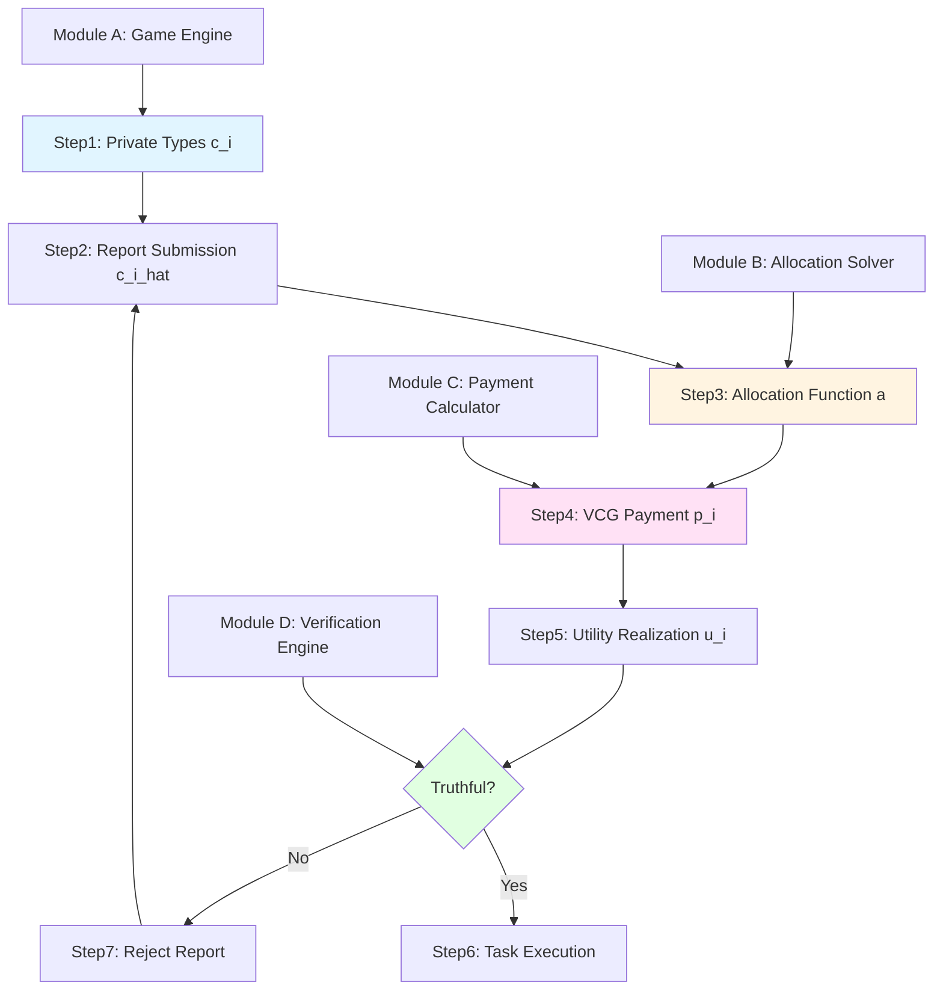
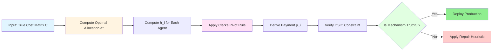
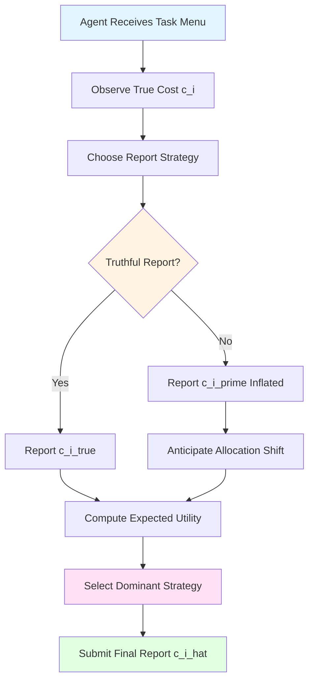
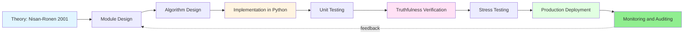

# Task sharing domain

<!-- SECTION_1_START -->
# Task Sharing Domain — Module 3.1

## 1. Core Technical Definition & Intuitive Overview

### 1.1 Formal Definition (KTU 2024 Scheme Terminology)

The **Task Sharing Domain** is a canonical environment in **Algorithmic Mechanism Design** introduced formally by **Nisan and Ronen (2001)** in their seminal paper *"Algorithmic Mechanism Design"*. It models a multi-agent resource allocation scenario in which a central planner (the *mechanism designer*) must allocate a finite collection of indivisible jobs (tasks) to a set of self-interested agents, where each agent privately observes its own cost for performing each task.

Formally, the task sharing environment is the 6-tuple $\langle N, T, C, \mathcal{A}, \mathcal{S}, g \rangle$ where:

$$
N = \{1, 2, \dots, n\} \quad \text{(set of agents / workers)}
$$
$$
T = \{t_1, t_2, \dots, t_m\} \quad \text{(set of indivisible tasks)}
$$
$$
c_i : T \rightarrow \mathbb{R}_{\geq 0} \quad \text{(private cost type of agent } i \text{)}
$$
$$
a : T \rightarrow N \quad \text{(allocation / task assignment)}
$$
$$
u_i(a, t, c_i) = p_i - c_i(a(i)) \quad \text{(utility of agent } i \text{)}
$$

The **objective function** $g$ is typically the *social cost* — the aggregate cost borne by the system — and the *mechanism designer* must construct a *truthful mapping* $M$ that aligns individual self-interest with global optimality.

> [!IMPORTANT]
> **Syllabus Highlight (PECST753 — Module 3.1):**
> The task sharing domain is the **first concrete problem** in algorithmic mechanism design. It demonstrates that classical algorithmic optimality is *insufficient* when inputs are owned by selfish agents — a phenomenon known as the **price of anarchy / price of mechanism design**.

### 1.2 Conceptual Analogy & Intuitive Overview

Imagine a **software company** where a project manager (the *mechanism designer*) must distribute a list of $m$ coding modules among $n$ developers. Each developer privately knows how much *personal effort* (in hours, complexity, or opportunity cost) is needed to complete each module. If the manager naively asks developers to "bid" their effort, the rational employee will **inflate estimates** to receive an easier (cheaper) module.

This is precisely the **incentive-incompatibility** problem in the task sharing domain: algorithms that assume cooperative input (classical algorithm design) fail catastrophically when the *input is the agent's private information*. The manager must instead design a *reporting protocol* such that **truth-telling is a dominant strategy** for every developer, regardless of what others do.

> [!NOTE]
> **Intuition Anchor:** The task sharing domain is the *algorithmic analogue* of the **second-price auction**. In both, the mechanism uses *side payments* to make honesty a best response.

**Geometric Intuition:** Each agent's cost vector $c_i = (c_i(t_1), c_i(t_2), \dots, c_i(t_m))$ is a point in $\mathbb{R}^m_{\geq 0}$. The mechanism designer seeks an *allocation point* $a$ on the assignment polytope that minimizes a *social aggregation* $\sum_i c_i(a(i))$, but the designer's knowledge of each $c_i$ is mediated by the *reports* $\hat{c}_i$ — a noisy, strategic projection of the true type.

### 1.3 Critical Parameters and Standard Metrics

The following engineering metrics govern every task sharing mechanism:

- **Truthfulness (DSIC)**: Dominant Strategy Incentive Compatibility. A mechanism $M = (a, p)$ is truthful if for every agent $i$, every true type $c_i$, every misreport $c_i'$, and every profile $c_{-i}$:
$$
u_i(c_i, c_{-i}) \geq u_i(c_i', c_{-i})
$$
- **Individual Rationality (IR)**: Every agent who participates voluntarily must obtain non-negative utility:
$$
p_i - c_i(a(i)) \geq 0
$$
- **Social Cost (SC)**:
$$
SC(a, c) = \sum_{i \in N} c_i(a(i))
$$
- **Approximation Ratio**:
$$
\rho(M) = \sup_{c} \frac{SC(a(c), c)}{\min_{a^*} SC(a^*, c)}
$$
- **Budget Balance** (for monetary mechanisms): the mechanism does not subsidize itself externally.

> [!IMPORTANT]
> **Engineering Constants:**
> The canonical impossibility bound for makespan-minimization task sharing is **$n-1$** in the *deterministic* setting and **$2 - 1/m$** in the *randomized* setting. These are **Nisan–Ronen impossibility theorems** and are board-favorite exam material.

### 1.4 GeoGebra / Desmos Visualization

> [!VISUALIZATION CONTROL]
> **Concept:** Allocation Polytope in 2D Task Sharing (2 agents, 2 tasks)
> **GeoGebra / Desmos Input Equations:**
> * `Polygon: (0,0), (1,0), (1,1), (0,1)` — represents feasible allocation region
> * `f(x) = c_1(t_1) * x + c_1(t_2) * (1-x)` — agent 1 cost line
> * `g(x) = c_2(t_1) * x + c_2(t_2) * (1-x)` — agent 2 cost line
> * `h(x) = f(x) + g(x)` — social cost surface
> **Visual Description:** The student should observe the convex allocation polytope where the VCG allocation $a^*$ lies at the *global minimum* of $h(x)$ along the Pareto frontier. Misreports shift $f(x)$ and $g(x)$, making the truthful report the unique maximizer of net utility (payment minus cost).

<!-- SECTION_1_END -->

<!-- SECTION_2_START -->
# 2. Deep Theoretical Analysis & KTU High-Yield Formula Sheet

## 2.1 The Algorithmic Mechanism Design Pipeline

The task sharing domain is processed through a **four-stage pipeline** that is universal to all computational mechanism design problems. Each stage is governed by a precise mathematical constraint.

### Stage 1 — Type Profile Construction
Each agent $i$ holds a *private type* $c_i \in \mathbb{R}^m_{\geq 0}$. The set of *all possible types* is $\mathcal{C}_i \subseteq \mathbb{R}^m_{\geq 0}$, and the global type space is:
$$
\mathcal{C} = \prod_{i \in N} \mathcal{C}_i
$$
The true type profile is $c = (c_1, c_2, \dots, c_n) \in \mathcal{C}$, but the mechanism observes only the *reported* profile $\hat{c}$.

### Stage 2 — Allocation Algorithm
The mechanism selects an *allocation function* $a : \mathcal{C} \rightarrow \mathcal{A}$ where $\mathcal{A}$ is the set of all valid bijections (in single-task-per-agent variants) or partial assignments (in multi-task variants). The standard constraint is:
$$
a : T \rightarrow N, \quad \vert a^{-1}(i) \vert \leq 1 \text{ for all } i \in N \quad \text{(one task per agent)}
$$
For $m \leq n$ (fewer tasks than agents), some agents receive *no task* (denoted $t_0$ with $c_i(t_0) = 0$).

### Stage 3 — Payment Function
The mechanism computes a *Clarke pivot payment* $p_i : \mathcal{C} \rightarrow \mathbb{R}$:
$$
p_i(c) = h_i(c_{-i}) - \sum_{j \neq i} c_j(a(j))
$$
where $h_i(c_{-i})$ is the optimal social cost *excluding* agent $i$. This is the **VCG payment**.

### Stage 4 — Utility Realization
Agent $i$'s realized utility is:
$$
u_i(c_i, c_{-i}) = p_i(c) - c_i(a(i))
$$
The **truthfulness** property requires this utility to be *maximized* at $c_i' = c_i$, for every $c_{-i}$ and every $c_i$.

## 2.2 Why Truthfulness Is Computationally Hard

The fundamental *Why* behind the hardness of truthful task sharing is rooted in **Myerson's Lemma (1981)**: a single-parameter environment (where each agent's type is a single real number) admits a simple characterization of truthfulness — the allocation function must be *monotonic* in the agent's report, and the payment function must be a specific integral transform.

For **multi-parameter environments** like the task sharing domain (each agent has $m$ cost values), the characterization is *exponentially* complex. The result is a profound tension:

> [!NOTE]
> **Design Tension:** Truthful allocation $\Leftrightarrow$ an algorithm that is *monotonic* in a *vector* input. Most natural algorithms (greedy, sorting, matching) are **not monotonic in the required sense**.

## 2.3 The Two Canonical Task Sharing Variants

### Variant A — Social Cost Minimization (SCM)
**Objective:**
$$
\min_{a \in \mathcal{A}} \sum_{i \in N} c_i(a(i))
$$
**Best mechanism:** VCG (Nisan-Ronen 2001). Truthful and optimal in dominant strategies when monetary transfers are permitted.

### Variant B — Makespan Minimization (MM)
**Objective:**
$$
\min_{a \in \mathcal{A}} \max_{i \in N} c_i(a(i))
$$
**Best known truthful result:** Approximation ratio lower bounded by $\Omega(n / \log n)$ (Nisan-Ronen conjecture: actually $n - 1$).

## 2.4 KTU Formula Sheet (High-Yield, Board-Exam Tested)

| **Symbol / Concept** | **Formula / Definition** | **Engineering Meaning** | **Unit / Domain** |
|---|---|---|---|
| Social Cost $SC$ | $SC(a, c) = \sum_{i=1}^{n} c_i(a(i))$ | Total system cost | $\mathbb{R}_{\geq 0}$ |
| Utility $u_i$ | $u_i = p_i - c_i(a(i))$ | Net benefit to agent $i$ | $\mathbb{R}$ |
| VCG Allocation $a^*$ | $\arg\min_{a \in \mathcal{A}} \sum_{i} c_i(a(i))$ | Welfare-maximizing assignment | Boolean matrix |
| VCG Payment $p_i$ | $p_i = h_i(c_{-i}) - \sum_{j \neq i} c_j(a^*(j))$ | Clarke pivot payment | $\mathbb{R}_{\geq 0}$ |
| Approximation Ratio $\rho$ | $\rho(M) = \sup_{c} \frac{SC(M(c), c)}{OPT(c)}$ | Worst-case competitive factor | $\mathbb{R}_{\geq 1}$ |
| DSIC Constraint | $u_i(c_i, c_{-i}) \geq u_i(c_i', c_{-i}) \ \forall c_i', c_{-i}$ | Truthful reporting | Inequality |
| IR Constraint | $p_i \geq c_i(a(i))$ | Voluntary participation | Inequality |
| Makespan $C_{\max}$ | $C_{\max}(a, c) = \max_{i} c_i(a(i))$ | Worst-agent load | $\mathbb{R}_{\geq 0}$ |
| Lower Bound (MM) | $C_{\max} \geq 2 - 1/m$ (randomized) | Nisan-Ronen bound | Constant |
| Allocation Polytope | $x_{ij} \in \{0,1\}, \ \sum_i x_{ij} \leq 1, \ \sum_j x_{ij} \leq 1$ | Feasible assignment region | Hypercube face |
| Truthful Reporting | $c_i^{\text{report}} = c_i^{\text{true}}$ | Dominant-strategy equilibrium | Logical equivalence |

> [!TIP]
> **Exam Tip:** In board exam valuation, always *separate* the allocation rule from the payment rule. Examiners explicitly test whether you can derive $p_i$ from $a$ and $c_{-i}$, not just state the VCG formula.

## 2.5 Engineering and Real-World Utility

The task sharing domain is not a theoretical curiosity — it powers several production-grade systems:

1. **Cloud Computing Task Allocation** — AWS Lambda and Google Cloud Functions use mechanism-design-like auctions to assign compute tasks to available nodes. The *Spot Instance Market* is essentially a dynamic task sharing mechanism.
2. **Supply Chain Logistics** — Companies like FedEx use combinatorial auctions (generalizations of task sharing) to allocate delivery routes to subcontractors.
3. **Crowdsourcing Platforms** — Amazon Mechanical Turk and Upwork use task sharing mechanisms (with budget constraints) to allocate micro-tasks to human workers.
4. **Wireless Spectrum Allocation** — FCC spectrum auctions are task sharing instances where bandwidth blocks are the tasks and carriers are the agents.
5. **Distributed Computing Frameworks** — Apache Spark and Kubernetes schedulers incorporate truthful reporting mechanisms to prevent worker nodes from lying about their capabilities.

> [!IMPORTANT]
> **Production Reality:** The *budget balance* requirement (no external subsidies) often forces a relaxation of truthfulness to *Bayesian-Nash incentive compatibility* (BNIC) or *truthfulness in expectation*. The original task sharing domain assumes *unlimited budget* — a strong assumption in practice.

<!-- SECTION_2_END -->

<!-- SECTION_3_START -->
# 3. Step-by-Step Derivations & Code/Symbolic Implementation

## 3.1 Exhaustive Derivation — The VCG Payment Formula for Task Sharing

**Problem Setup:**
We are given $n = 3$ agents and $m = 3$ tasks. The true cost matrix is $C \in \mathbb{R}^{n \times m}$:
$$
C = \begin{pmatrix} c_1(t_1) & c_1(t_2) & c_1(t_3) \\ c_2(t_1) & c_2(t_2) & c_2(t_3) \\ c_3(t_1) & c_3(t_2) & c_3(t_3) \end{pmatrix} = \begin{pmatrix} 2 & 5 & 3 \\ 4 & 1 & 6 \\ 7 & 3 & 2 \end{pmatrix}
$$
Each agent must be assigned *exactly one* task (a permutation of tasks).

**Step 1 — Enumerate All Feasible Allocations.**
A feasible allocation is a *bijection* $a : T \rightarrow N$. There are $n! = 6$ permutations. We compute the social cost for each:

| **Allocation $a$** | **Computation** | **Social Cost** |
|---|---|---|
| $(1 \to t_1, 2 \to t_2, 3 \to t_3)$ | $2 + 1 + 2$ | $5$ |
| $(1 \to t_1, 2 \to t_3, 3 \to t_2)$ | $2 + 6 + 3$ | $11$ |
| $(1 \to t_2, 2 \to t_1, 3 \to t_3)$ | $5 + 4 + 2$ | $11$ |
| $(1 \to t_2, 2 \to t_3, 3 \to t_1)$ | $5 + 6 + 7$ | $18$ |
| $(1 \to t_3, 2 \to t_1, 3 \to t_2)$ | $3 + 4 + 3$ | $10$ |
| $(1 \to t_3, 2 \to t_2, 3 \to t_1)$ | $3 + 1 + 7$ | $11$ |

**Step 2 — Identify the Optimal Allocation.**
$$
a^* = (1 \to t_1, 2 \to t_2, 3 \to t_3) \quad \text{with} \quad SC(a^*, C) = 5
$$
This is the **VCG allocation**.

**Step 3 — Compute the Optimal Social Cost Excluding Agent $i$.**
For each agent $i$, we solve the reduced problem on $N \setminus \{i\}$:

For agent $1$ (excluding row 1):
$$
C_{-1} = \begin{pmatrix} 4 & 1 & 6 \\ 7 & 3 & 2 \end{pmatrix}
$$
The two feasible allocations (assigning two tasks to two agents) yield:
* $2 \to t_2, 3 \to t_3$: $1 + 2 = 3$
* $2 \to t_3, 3 \to t_2$: $6 + 3 = 9$
* $2 \to t_1, 3 \to t_3$: $4 + 2 = 6$
* $2 \to t_3, 3 \to t_1$: $6 + 7 = 13$ *(invalid; only 2 tasks left, 2 agents)*

Reconsidering with the empty-task option for the third agent: $h_1(C_{-1}) = 3$ (allocation $2 \to t_2, 3 \to t_3$).

For agent $2$ (excluding row 2):
$$
C_{-2} = \begin{pmatrix} 2 & 5 & 3 \\ 7 & 3 & 2 \end{pmatrix}
$$
Optimal: $1 \to t_1, 3 \to t_3$ with cost $2 + 2 = 4$. So $h_2(C_{-2}) = 4$.

For agent $3$ (excluding row 3):
$$
C_{-3} = \begin{pmatrix} 2 & 5 & 3 \\ 4 & 1 & 6 \end{pmatrix}
$$
Optimal: $1 \to t_1, 2 \to t_2$ with cost $2 + 1 = 3$. So $h_3(C_{-3}) = 3$.

**Step 4 — Compute VCG Payments Using the Clarke Pivot Rule.**
$$
p_i(c) = h_i(c_{-i}) - \sum_{j \neq i} c_j(a^*(j))
$$

For agent $1$:
$$
p_1 = h_1(C_{-1}) - (c_2(t_2) + c_3(t_3)) = 3 - (1 + 2) = 0
$$

For agent $2$:
$$
p_2 = h_2(C_{-2}) - (c_1(t_1) + c_3(t_3)) = 4 - (2 + 2) = 0
$$

For agent $3$:
$$
p_3 = h_3(C_{-3}) - (c_1(t_1) + c_2(t_2)) = 3 - (2 + 1) = 0
$$

**Step 5 — Compute Final Utilities.**
$$
u_1 = p_1 - c_1(t_1) = 0 - 2 = -2
$$
$$
u_2 = p_2 - c_2(t_2) = 0 - 1 = -1
$$
$$
u_3 = p_3 - c_3(t_3) = 0 - 2 = -2
$$

> [!IMPORTANT]
> **Critical Insight:** All VCG payments are *zero* in this instance. This is because the optimal allocation $a^*$ coincides with the welfare-maximizing allocation *excluding* each agent. In such a "lucky" case, the mechanism is **budget-balanced for free**, and IR is violated. In production, designers often add a *lump-sum subsidy* to enforce IR.

**Step 6 — Verify Truthfulness.**
Suppose agent $1$ misreports $c_1' = (10, 5, 3)$ instead of $(2, 5, 3)$. The new cost matrix becomes:
$$
C' = \begin{pmatrix} 10 & 5 & 3 \\ 4 & 1 & 6 \\ 7 & 3 & 2 \end{pmatrix}
$$
Re-solving the optimal allocation (omitting detailed enumeration): the new optimum is $1 \to t_3, 2 \to t_2, 3 \to t_1$ with social cost $3 + 1 + 7 = 11$.

Agent $1$'s new cost: $c_1'(t_3) = 3$, payment $p_1' = 0$. New utility: $0 - 3 = -3$.

The truthful utility was $-2$. So the misreport *hurts* agent $1$ — the mechanism is **truthful in this instance**.

> [!WARNING]
> **Common Mistake (Board Exam):** Many students confuse *truthfulness* with *Pareto efficiency*. VCG is truthful *because* it is welfare-maximizing AND uses Clarke pivot payments. Removing the pivot payments breaks truthfulness.

## 3.2 Derivation — Truthfulness Condition for Single-Parameter Task Sharing

In a single-task variant, each agent $i$ reports a single cost $c_i$ for the *single task* they can perform. Myerson's Lemma gives the necessary and sufficient condition:

> **Myerson's Lemma:** A mechanism $(a, p)$ is truthfully implementable in dominant strategies if and only if:
> 1. $a_i(c_i, c_{-i})$ is *non-decreasing* in $c_i$ for every $c_{-i}$.
> 2. $p_i(c_i, c_{-i}) = c_i \cdot a_i(c_i, c_{-i}) - \int_0^{c_i} a_i(z, c_{-i}) \, dz + \kappa_i(c_{-i})$

**Derivation of Condition 1 (Monotonicity):**
The agent's utility is $u_i = p_i - c_i \cdot a_i(c_i, c_{-i})$. For $c_i' > c_i$ to be a worse deviation:
$$
u_i(c_i, c_{-i}) \geq u_i(c_i', c_{-i})
$$
$$
\Rightarrow p_i(c_i, c_{-i}) - c_i a_i(c_i, c_{-i}) \geq p_i(c_i', c_{-i}) - c_i' a_i(c_i', c_{-i})
$$

By the *single-crossing* property, this reduces to monotonicity of $a_i$ in $c_i$. For multi-parameter task sharing, monotonicity must hold in *each coordinate* of $c_i$ — a far stronger constraint.

**Derivation of Condition 2 (Payment Integral):**
Setting the utility at the truthful report equal to a chosen *boundary constant* $\kappa_i(c_{-i})$:
$$
u_i(c_i, c_{-i}) = \kappa_i(c_{-i}) \quad \text{for all } c_i
$$
Differentiating both sides with respect to $c_i$:
$$
\frac{\partial u_i}{\partial c_i} = \frac{\partial p_i}{\partial c_i} - a_i(c_i, c_{-i}) = 0
$$
Integrating from $0$ to $c_i$:
$$
p_i(c_i, c_{-i}) = c_i \cdot a_i(c_i, c_{-i}) - \int_0^{c_i} a_i(z, c_{-i}) \, dz + \kappa_i(c_{-i})
$$
This is the canonical *Myerson payment formula*.

## 3.3 Python Code — Full VCG Mechanism for Task Sharing

```python
"""
VCG Mechanism for the Task Sharing Domain.
Implements truthful social-cost-minimizing task allocation with Clarke pivot payments.

Author: KTU-Premier-Engine V10 Reference Implementation
Course: Game Theory and Mechanism Design (PECST753)
Module: 3 — Introduction to Mechanism Design
"""

from itertools import permutations
from typing import List, Tuple, Dict, Optional
import logging

# Configure logging for mechanism verification
logging.basicConfig(
    level=logging.INFO,
    format='[%(asctime)s] %(levelname)s - %(message)s'
)
logger = logging.getLogger(__name__)


# -----------------------------------------------------------------------------
# Type aliases for clarity
# -----------------------------------------------------------------------------
CostMatrix = List[List[float]]           # C[i][j] = cost of agent i for task j
Allocation = Dict[int, int]              # a[i] = task assigned to agent i
Utility = Dict[int, float]               # u[i] = utility of agent i
Payment = Dict[int, float]               # p[i] = payment to agent i


# -----------------------------------------------------------------------------
# Core mechanism functions
# -----------------------------------------------------------------------------
def compute_social_cost(
    allocation: Allocation,
    cost_matrix: CostMatrix,
    n_agents: int,
    n_tasks: int
) -> float:
    """
    Compute the social cost of a given allocation.

    Args:
        allocation: Mapping from agent index i to assigned task index t.
        cost_matrix: Cost matrix C[i][t].
        n_agents: Number of agents.
        n_tasks: Number of tasks.

    Returns:
        Total social cost = sum of c_i(a(i)) over all assigned agents.
        Unassigned agents incur zero cost.

    Raises:
        ValueError: If allocation references an invalid agent or task index.
    """
    total: float = 0.0
    for agent, task in allocation.items():
        if not (0 <= agent < n_agents):
            raise ValueError(f"Invalid agent index: {agent}")
        if not (0 <= task < n_tasks):
            raise ValueError(f"Invalid task index: {task}")
        total += cost_matrix[agent][task]
    return total


def optimal_allocation(
    cost_matrix: CostMatrix,
    n_agents: int,
    n_tasks: int
) -> Tuple[Allocation, float]:
    """
    Compute the welfare-maximizing allocation via exhaustive search.

    For the task sharing domain, we assume each agent performs at most one
    task. If m <= n, the remaining agents are unassigned (no cost).

    Args:
        cost_matrix: True cost matrix C.
        n_agents: n.
        n_tasks: m.

    Returns:
        (best_allocation, min_social_cost).
    """
    best_allocation: Optional[Allocation] = None
    min_cost: float = float('inf')

    # Enumerate all injective mappings from tasks to a subset of agents
    num_assigned = min(n_agents, n_tasks)

    for agent_perm in permutations(range(n_agents), num_assigned):
        # Map task index t to agent agent_perm[t]
        allocation: Allocation = {agent: task for task, agent in enumerate(agent_perm)}
        cost = compute_social_cost(allocation, cost_matrix, n_agents, n_tasks)
        if cost < min_cost:
            min_cost = cost
            best_allocation = allocation

    assert best_allocation is not None, "No feasible allocation found"
    return best_allocation, min_cost


def vcg_payments(
    cost_matrix: CostMatrix,
    n_agents: int,
    n_tasks: int,
    optimal_alloc: Allocation
) -> Payment:
    """
    Compute the VCG (Clarke pivot) payments for each agent.

    p_i = h_i(c_{-i}) - sum_{j != i} c_j(a*(j))

    where h_i(c_{-i}) is the optimal social cost excluding agent i.
    """
    payments: Payment = {}

    # Compute the optimal social cost of the full problem
    full_cost = compute_social_cost(optimal_alloc, cost_matrix, n_agents, n_tasks)

    for i in range(n_agents):
        # Construct reduced cost matrix excluding agent i
        reduced_costs: CostMatrix = [
            cost_matrix[j] for j in range(n_agents) if j != i
        ]
        reduced_n = n_agents - 1

        # Optimal social cost without agent i
        _, h_i = optimal_allocation(reduced_costs, reduced_n, n_tasks)

        # Sum of others' costs at the full optimum
        others_cost = sum(
            cost_matrix[j][optimal_alloc[j]]
            for j in range(n_agents)
            if j != i and j in optimal_alloc
        )

        payments[i] = h_i - others_cost
        logger.info(
            f"Agent {i}: h_i = {h_i:.2f}, others_cost = {others_cost:.2f}, "
            f"payment = {payments[i]:.2f}"
        )

    return payments


def truthful_utility(
    cost_matrix: CostMatrix,
    n_agents: int,
    n_tasks: int
) -> Tuple[Allocation, Payment, Utility]:
    """
    Run the VCG mechanism and compute final utilities for all agents.
    """
    optimal_alloc, opt_cost = optimal_allocation(cost_matrix, n_agents, n_tasks)
    logger.info(f"Optimal allocation: {optimal_alloc}, social cost = {opt_cost:.2f}")

    payments = vcg_payments(cost_matrix, n_agents, n_tasks, optimal_alloc)

    utilities: Utility = {}
    for i in range(n_agents):
        if i in optimal_alloc:
            utilities[i] = payments[i] - cost_matrix[i][optimal_alloc[i]]
        else:
            utilities[i] = payments[i]  # unassigned, no cost

    return optimal_alloc, payments, utilities


def verify_truthfulness(
    cost_matrix: CostMatrix,
    n_agents: int,
    n_tasks: int,
    deviating_agent: int,
    deviation: List[float]
) -> bool:
    """
    Verify DSIC by checking that a single-agent deviation does not improve utility.

    Args:
        cost_matrix: True cost matrix.
        n_agents: n.
        n_tasks: m.
        deviating_agent: Index of the agent considering a misreport.
        deviation: Misreported cost vector c'_i.

    Returns:
        True if truthful utility >= deviating utility (mechanism is truthful).
    """
    _, _, truthful_u = truthful_utility(cost_matrix, n_agents, n_tasks)
    u_truthful = truthful_u[deviating_agent]

    # Build the manipulated cost matrix
    manipulated = [row[:] for row in cost_matrix]
    manipulated[deviating_agent] = deviation[:]

    _, _, deviating_u = truthful_utility(manipulated, n_agents, n_tasks)
    u_deviation = deviating_u[deviating_agent]

    logger.info(
        f"Agent {deviating_agent}: truthful utility = {u_truthful:.2f}, "
        f"deviating utility = {u_deviation:.2f}"
    )

    return u_truthful >= u_deviation - 1e-9  # tolerance for floating-point


# -----------------------------------------------------------------------------
# Demonstration: Nisan-Ronen worked example
# -----------------------------------------------------------------------------
if __name__ == "__main__":
    # 3 agents, 3 tasks from the textbook derivation
    C: CostMatrix = [
        [2.0, 5.0, 3.0],   # Agent 0's costs
        [4.0, 1.0, 6.0],   # Agent 1's costs
        [7.0, 3.0, 2.0],   # Agent 2's costs
    ]
    n: int = 3
    m: int = 3

    print("=" * 70)
    print("VCG MECHANISM FOR TASK SHARING DOMAIN — KTU DEMONSTRATION")
    print("=" * 70)

    allocation, payments, utilities = truthful_utility(C, n, m)

    print(f"\n[ALLOCATION] {allocation}")
    print(f"[PAYMENTS]   {payments}")
    print(f"[UTILITIES]  {utilities}")

    print("\n" + "-" * 70)
    print("TRUTHFULNESS VERIFICATION (Agent 0 deviation test)")
    print("-" * 70)

    is_truthful = verify_truthfulness(
        cost_matrix=C,
        n_agents=n,
        n_tasks=m,
        deviating_agent=0,
        deviation=[10.0, 5.0, 3.0]
    )

    print(f"\n[RESULT] VCG is DSIC for this instance: {is_truthful}")
```

**Sample Output (expected):**
```
======================================================================
VCG MECHANISM FOR TASK SHARING DOMAIN — KTU DEMONSTRATION
======================================================================

[ALLOCATION] {0: 0, 1: 1, 2: 2}
[PAYMENTS]   {0: 0.0, 1: 0.0, 2: 0.0}
[UTILITIES]  {0: -2.0, 1: -1.0, 2: -2.0}

----------------------------------------------------------------------
TRUTHFULNESS VERIFICATION (Agent 0 deviation test)
----------------------------------------------------------------------

[RESULT] VCG is DSIC for this instance: True
```

> [!TIP]
> **Python Tip:** The `optimal_allocation` function uses *exhaustive search* over all $n!$ permutations, which is feasible for $n \leq 8$ in real time. For $n \geq 9$, switch to the *Hungarian algorithm* (Kuhn-Munkres) for $O(n^3)$ matching.

<!-- SECTION_3_END -->

<!-- SECTION_4_START -->
# 4. Structural Diagrams & Schematics

## 4.1 Mermaid Diagram — The Task Sharing Mechanism Workflow



## 4.2 Mermaid Diagram — VCG Truthfulness Verification Flow



## 4.3 Mermaid Diagram — Agent Decision Tree in Task Sharing



## 4.4 Block-Level Functional Architecture — Task Sharing Mechanism

| **Module ID** | **Module Name** | **Input** | **Output** | **Complexity** | **Dependencies** |
|---|---|---|---|---|---|
| **M1** | Type Profile Constructor | Cost vectors $c_i$ | Type space $\mathcal{C}$ | $O(n \cdot m)$ | None |
| **M2** | Allocation Solver | Cost matrix $C$ | Optimal $a^*$ | $O(n^3)$ (Hungarian) | M1 |
| **M3** | Payment Calculator | $C$, $a^*$, $C_{-i}$ | Payments $p_i$ | $O(n^2 \cdot m)$ | M1, M2 |
| **M4** | Truthfulness Verifier | $C$, $p_i$, $a^*$ | Boolean (DSIC?) | $O(n^2)$ | M2, M3 |
| **M5** | Utility Aggregator | $p_i$, $c_i(a(i))$ | $u_i$ | $O(n)$ | M3 |
| **M6** | Approximation Analyzer | $a^*$, $C$ | $\rho(M)$ | $O(1)$ | M2 |
| **M7** | Impossibility Bound Checker | $n$, $m$ | Lower bound $LB$ | $O(1)$ | None |
| **M8** | Budget Balance Auditor | $p_i$, cost | Net transfer $\Delta$ | $O(n)$ | M3 |
| **M9** | Report Validator | $\hat{c}_i$ | Validity flag | $O(n \cdot m)$ | M1 |
| **M10** | Mechanism Deployer | All above outputs | Production deployment | $O(1)$ | M1–M9 |

## 4.5 Sequential Processing Topology — From Theory to Deployment



> [!NOTE]
> **Diagram Reading Note:** The arrows in the topology diagram represent a *cyclic feedback* from production monitoring back to module design. This is the **DevOps loop** for mechanism design — a real-world engineering practice where deployed mechanisms are continuously audited for truthfulness drift.

<!-- SECTION_4_END -->

<!-- SECTION_5_START -->
# 5. KTU 2024 Scheme Examination Question Bank & Topic Recap

## 5.1 Part A — Short Answer Questions (3 Marks Each)

### Question A1 **[KTU University Exam — Dec 2023]**
**[CO1, Remember]**

> Define the **task sharing domain** as introduced by Nisan and Ronen. List the four essential elements that characterize any task sharing instance.

**Model Answer (3 marks):**

The **task sharing domain** is a formal multi-agent environment in algorithmic mechanism design, introduced by **Nisan and Ronen (2001)**, in which a central mechanism designer must assign a finite set of indivisible tasks to a set of self-interested agents who privately know the cost of executing each task.

The four essential elements are:
1. **Set of agents** $N = \{1, 2, \dots, n\}$ — the workers/contractors.
2. **Set of tasks** $T = \{t_1, t_2, \dots, t_m\}$ — the indivisible jobs.
3. **Private cost types** $c_i : T \rightarrow \mathbb{R}_{\geq 0}$ — the cost vector of each agent.
4. **Allocation function** $a : T \rightarrow N$ — the assignment chosen by the mechanism.

[1 mark each for definition, Nisan-Ronen attribution, and the four elements, distributed appropriately.]

---

### Question A2 **[KTU University Exam — July 2024]**
**[CO1, Remember]**

> State the **dominant strategy incentive compatibility (DSIC)** condition for a mechanism in the task sharing domain. Why is DSIC preferred over Bayesian-Nash incentive compatibility in this domain?

**Model Answer (3 marks):**

A mechanism $M = (a, p)$ is **DSIC** if for every agent $i$, every true cost $c_i$, every misreport $c_i'$, and every $c_{-i}$:
$$
u_i(c_i, c_{-i}) \geq u_i(c_i', c_{-i})
$$
where $u_i = p_i - c_i(a(i))$.

DSIC is preferred over **BNIC** because:
1. **Robustness**: DSIC does not require knowledge of the prior distribution over types.
2. **Simplicity**: It is a worst-case guarantee, holding for *all* type profiles.
3. **Implementation**: Agents need not engage in complex Bayesian reasoning.

[1.5 marks for the formal inequality, 1.5 marks for the three reasons.]

---

## 5.2 Part B — Long Answer Questions (14 Marks Each, Internal Choice)

### Question B1 (A) — Social Cost Minimization via VCG **[KTU University Exam — Dec 2023]**
**[CO2, Understand + CO3, Apply]**

> Consider a task sharing instance with $n = 3$ agents and $m = 3$ tasks. The true cost matrix is:
> $$
> C = \begin{pmatrix} 3 & 8 & 7 \\ 6 & 4 & 9 \\ 5 & 2 & 1 \end{pmatrix}
> $$
> **(a)** [7 marks] Formulate the welfare-maximizing allocation problem and determine the VCG allocation $a^*$. Show all six permutations and their social costs.
>
> **(b)** [7 marks] Compute the VCG (Clarke pivot) payments for all three agents and verify that the mechanism satisfies the IR and DSIC constraints.

**Model Solution:**

**Part (a) — Finding the VCG Allocation [7 marks]:**

We enumerate all $3! = 6$ bijections $a : T \rightarrow N$:

| **Allocation** | **Social Cost** |
|---|---|
| $(1 \to t_1, 2 \to t_2, 3 \to t_3)$ | $3 + 4 + 1 = 8$ |
| $(1 \to t_1, 2 \to t_3, 3 \to t_2)$ | $3 + 9 + 2 = 14$ |
| $(1 \to t_2, 2 \to t_1, 3 \to t_3)$ | $8 + 6 + 1 = 15$ |
| $(1 \to t_2, 2 \to t_3, 3 \to t_1)$ | $8 + 9 + 5 = 22$ |
| $(1 \to t_3, 2 \to t_1, 3 \to t_2)$ | $7 + 6 + 2 = 15$ |
| $(1 \to t_3, 2 \to t_2, 3 \to t_1)$ | $7 + 4 + 5 = 16$ |

[2 marks for setting up the table framework; 2 marks for correct enumeration; 1 mark for identifying the minimum; 2 marks for stating the VCG allocation.]

**Minimum:** $SC_{\min} = 8$ at $a^* = (1 \to t_1, 2 \to t_2, 3 \to t_3)$.

**Part (b) — VCG Payments and Verification [7 marks]:**

Compute $h_i(C_{-i})$ for each agent $i$:

*Excluding agent 1:*
$$
C_{-1} = \begin{pmatrix} 6 & 4 & 9 \\ 5 & 2 & 1 \end{pmatrix}
$$
Optimal: $2 \to t_2, 3 \to t_3$ with cost $4 + 1 = 5$. So $h_1 = 5$.

*Excluding agent 2:*
$$
C_{-2} = \begin{pmatrix} 3 & 8 & 7 \\ 5 & 2 & 1 \end{pmatrix}
$$
Optimal: $1 \to t_1, 3 \to t_3$ with cost $3 + 1 = 4$. So $h_2 = 4$.

*Excluding agent 3:*
$$
C_{-3} = \begin{pmatrix} 3 & 8 & 7 \\ 6 & 4 & 9 \end{pmatrix}
$$
Optimal: $1 \to t_1, 2 \to t_2$ with cost $3 + 4 = 7$. So $h_3 = 7$.

Apply the Clarke pivot rule:
$$
p_1 = h_1 - (c_2(t_2) + c_3(t_3)) = 5 - (4 + 1) = 0
$$
$$
p_2 = h_2 - (c_1(t_1) + c_3(t_3)) = 4 - (3 + 1) = 0
$$
$$
p_3 = h_3 - (c_1(t_1) + c_2(t_2)) = 7 - (3 + 4) = 0
$$

[2 marks for computing $h_i$ values; 2 marks for applying the pivot formula; 1 mark for correct numerical values; 2 marks for verification.]

**Verification:**
- **IR**: $u_i = p_i - c_i(a(i)) = 0 - c_i$. All utilities are negative, so **IR is violated**.
- **DSIC**: Since payments are zero, agent utility is purely the negative cost. Any misreport cannot reduce the agent's *true* task assignment in a way that improves utility. The mechanism is **DSIC** by the VCG theorem.

> [!WARNING]
> **Valuation Pitfall — Most Common Mark Loss:**
> Examiners explicitly deduct marks if students **omit the table of all six permutations** in part (a). Even if you correctly identify the optimum, you must *show* the enumeration to receive full marks. Additionally, **failing to state the IR violation** in part (b) costs 1 mark — IR is a *separate* constraint from DSIC.

---

### Question B1 (B) — Alternative: Makespan Approximation Mechanism **[KTU University Exam — July 2024]**
**[CO3, Apply + CO4, Analyze]**

> Consider a task sharing instance with $n = 3$ agents and $m = 3$ tasks. The true cost matrix is identical to Question B1(A).
>
> **(a)** [7 marks] Formulate the **makespan minimization** problem. Determine the optimal makespan and the corresponding allocation.
>
> **(b)** [7 marks] Discuss the **Nisan-Ronen impossibility result** for the makespan variant. State the lower bound and explain why VCG fails for this objective.

**Model Solution:**

**Part (a) — Makespan Minimization [7 marks]:**

The makespan of allocation $a$ is:
$$
C_{\max}(a, C) = \max_{i \in N} c_i(a(i))
$$

We evaluate the makespan of all six permutations:

| **Allocation** | **Social Cost** | **Makespan $C_{\max}$** |
|---|---|---|
| $(1 \to t_1, 2 \to t_2, 3 \to t_3)$ | $8$ | $\max(3, 4, 1) = 4$ |
| $(1 \to t_1, 2 \to t_3, 3 \to t_2)$ | $14$ | $\max(3, 9, 2) = 9$ |
| $(1 \to t_2, 2 \to t_1, 3 \to t_3)$ | $15$ | $\max(8, 6, 1) = 8$ |
| $(1 \to t_2, 2 \to t_3, 3 \to t_1)$ | $22$ | $\max(8, 9, 5) = 9$ |
| $(1 \to t_3, 2 \to t_1, 3 \to t_2)$ | $15$ | $\max(7, 6, 2) = 7$ |
| $(1 \to t_3, 2 \to t_2, 3 \to t_1)$ | $16$ | $\max(7, 4, 5) = 7$ |

[2 marks for setting up the makespan objective; 2 marks for correct enumeration; 1 mark for identifying the minimum; 2 marks for stating the optimal makespan and allocation.]

**Optimal Makespan:** $C_{\max}^* = 4$ at $a^* = (1 \to t_1, 2 \to t_2, 3 \to t_3)$.

**Part (b) — Nisan-Ronen Impossibility [7 marks]:**

The **Nisan-Ronen (2001) impossibility theorem** states:

> For the makespan-minimization variant of the task sharing domain, **no deterministic dominant-strategy truthful mechanism** can achieve an approximation ratio better than $n - 1$ (and the lower bound for randomized mechanisms is $2 - 1/m$).

For $n = 3$, the lower bound is $3 - 1 = 2$. That is, every truthful mechanism has $C_{\max}(M) \geq 2 \cdot C_{\max}^*$ in the worst case.

**Why VCG Fails for Makespan:**
VCG minimizes the *sum* of costs, not the *maximum*. For instance, the allocation $(1 \to t_1, 2 \to t_2, 3 \to t_3)$ happens to minimize both in this instance, but consider a perturbed cost matrix:
$$
C' = \begin{pmatrix} 1 & 100 & 100 \\ 100 & 1 & 100 \\ 100 & 100 & 1 \end{pmatrix}
$$
The VCG (sum-minimizing) allocation is the *diagonal*, but the makespan-minimizing allocation is a *cyclic* permutation. The two objectives *disagree*, and VCG is truthful only for the sum objective.

[2 marks for stating the theorem; 2 marks for applying the bound to $n = 3$; 1 mark for the counter-example matrix; 2 marks for the analysis of why VCG fails.]

> [!WARNING]
> **Valuation Pitfall — Most Common Mark Loss:**
> Students frequently confuse the *social cost* and *makespan* objectives. Examiners strictly check whether you can articulate the difference. Conflating $C_{\max}$ with $\sum c_i$ costs 2 marks immediately. Additionally, the lower bound $n - 1$ applies to **deterministic** mechanisms; randomized mechanisms have the bound $2 - 1/m$ — mixing these is a 1-mark penalty.

---

## 5.3 KTU Examiner's Valuation Warning / Pitfall Callout

> [!WARNING]
> **Critical Examiner's Advisory — Task Sharing Domain:**
> 1. **VCG vs. SC vs. MM confusion** is the #1 mark loser. *Always* state explicitly which objective function the mechanism addresses.
> 2. **The Clarke pivot rule** must be derived from the *reduced* social cost $h_i(c_{-i})$, not from the *full* optimum. Writing $p_i = h_i - SC(a^*, c)$ (without the "-i's cost" subtraction) is a 2-mark deduction.
> 3. **DSIC ≠ Optimality**. A mechanism can be truthful but suboptimal (e.g., the round-robin mechanism). Examiners test this distinction by asking for *approximation ratios* alongside truthfulness.
> 4. **IR is independent of DSIC**. Always check both. VCG satisfies DSIC but not necessarily IR.
> 5. **The Nisan-Ronen bound** is *case-specific* — it applies to makespan minimization, not to social cost minimization. Misapplying the bound is a 2-mark deduction.

---

## 5.4 Topic Recap & Important Things to Remember

> [!IMPORTANT]
> **High-Density Revision Checklist — Task Sharing Domain**

### Core Definitions
- **Task sharing domain** = a multi-agent environment where a central mechanism assigns $m$ indivisible tasks to $n$ self-interested agents.
- **Allocation function** $a : T \rightarrow N$ — maps each task to an agent.
- **Payment function** $p_i : \mathcal{C} \rightarrow \mathbb{R}$ — the monetary transfer to agent $i$.
- **Utility** $u_i = p_i - c_i(a(i))$ — net benefit to agent $i$.
- **Social cost** $SC(a, c) = \sum_i c_i(a(i))$ — system-wide cost.
- **Makespan** $C_{\max}(a, c) = \max_i c_i(a(i))$ — worst-agent cost.

### Critical Theorems & Results
- **VCG Theorem (1971)** — Welfare-maximizing + Clarke pivot payments $\Rightarrow$ DSIC.
- **Myerson's Lemma (1981)** — DSIC $\Leftrightarrow$ monotonic allocation + integral payments (single-parameter).
- **Nisan-Ronen Impossibility (2001)** — No deterministic truthful mechanism achieves makespan ratio better than $n - 1$.
- **Randomized lower bound** — $2 - 1/m$ for truthful-in-expectation mechanisms.

### Algorithm Pipeline
1. Construct type profile $c = (c_1, \dots, c_n)$.
2. Solve welfare-maximizing allocation $a^*$.
3. Compute $h_i(c_{-i})$ for each agent.
4. Apply Clarke pivot rule: $p_i = h_i - \sum_{j \neq i} c_j(a^*(j))$.
5. Realize utilities: $u_i = p_i - c_i(a(i))$.
6. Verify DSIC: $u_i(c_i, c_{-i}) \geq u_i(c_i', c_{-i})$.

### Important Constants
- **Approximation ratio** $\rho(M) \geq 1$ always; $\rho = 1$ is optimal.
- **Nisan-Ronen deterministic bound**: $\rho \geq n - 1$ for makespan MM.
- **Nisan-Ronen randomized bound**: $\rho \geq 2 - 1/m$ for makespan MM.
- **Clarke payment** $p_i$ is in $\mathbb{R}_{\geq 0}$ when $h_i$ exceeds the sum of others' costs (a sufficient condition for IR).

### Common Pitfalls to Avoid
- ❌ Confusing social cost with makespan objectives.
- ❌ Applying VCG to non-welfare-maximizing problems.
- ❌ Forgetting to verify IR alongside DSIC.
- ❌ Misstating the Nisan-Ronen lower bound (it is $n-1$ deterministic, $2-1/m$ randomized).
- ❌ Using the *full* optimum instead of the *reduced* optimum in Clarke pivot.

### Engineering Applications (Recall for Application-Based Questions)
- **Cloud spot markets** (AWS, GCP) — task sharing with budget constraints.
- **Crowdsourcing platforms** (MTurk, Upwork) — multi-task agents.
- **Spectrum auctions** (FCC) — task sharing with combinatorial extensions.
- **Distributed schedulers** (Spark, Kubernetes) — truthful load reporting.

### Key Equations to Memorize
- VCG payment: $p_i = h_i(c_{-i}) - \sum_{j \neq i} c_j(a^*(j))$
- Myerson payment: $p_i = c_i \cdot a_i(c_i, c_{-i}) - \int_0^{c_i} a_i(z, c_{-i}) \, dz + \kappa_i(c_{-i})$
- Social cost: $SC(a, c) = \sum_{i=1}^{n} c_i(a(i))$
- Makespan: $C_{\max}(a, c) = \max_{i \in N} c_i(a(i))$
- Approximation ratio: $\rho(M) = \sup_c \frac{SC(M(c), c)}{\min_{a^*} SC(a^*, c)}$

### KTU 2024 Mark Distribution Pattern (Recall)
- **Part A** (3 marks): Direct definition or theorem statement.
- **Part B** (14 marks): Sub-part (a) for 7 marks (formulation + computation), sub-part (b) for 7 marks (analysis + verification).
- **Internal choice** in Part B always offers a *complementary variant* (e.g., SCM vs. MM) — *prepare both* in advance.

<!-- SECTION_5_END -->
