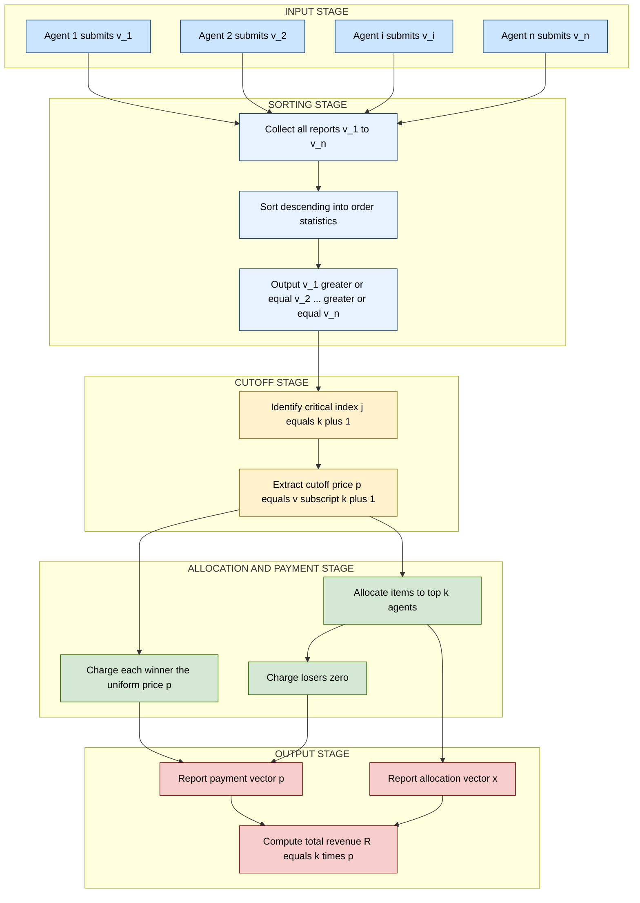
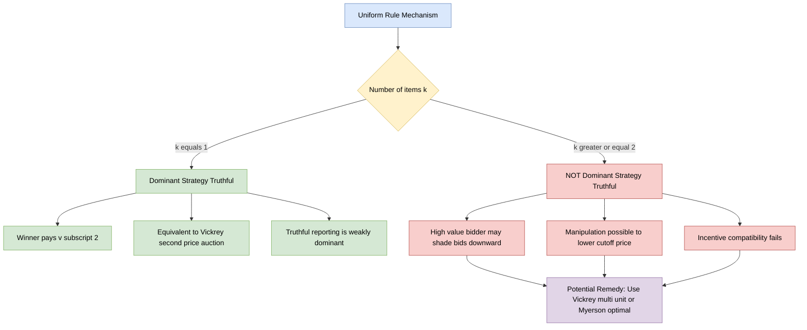
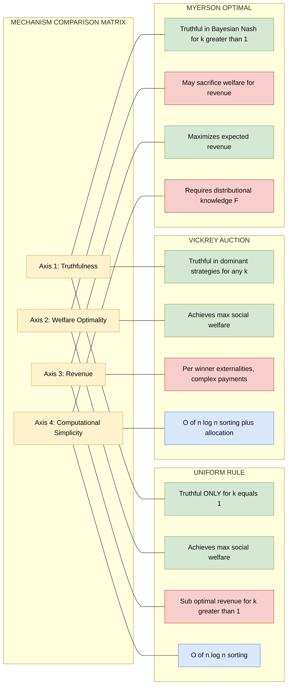

# uniform rule

<!-- SECTION_1_START -->
# Uniform Rule — Core Technical Definition & Intuitive Overview

## 1.1 Formal Definition (KTU 2024 Scheme Terminology)

> [!IMPORTANT]
> **Uniform Rule (UR)** — A canonical deterministic mechanism in **single-parameter mechanism design** where the allocation is welfare-maximizing (i.e., the goods are assigned to the agents with the highest reported values), and **every winning agent pays an identical "uniform" price**, conventionally taken to be the **highest losing bid** (the marginal value).

**Formal Setting.** Let $N = \{1, 2, \dots, n\}$ denote the set of $n$ self-interested agents. The mechanism designer wishes to allocate $k \in \mathbb{N}$ **identical indivisible items** to these agents. Each agent $i \in N$ holds a private valuation $v_i \in \mathbb{R}_{\geq 0}$ (a *type*) and submits a *report* $\hat{v}_i$.

Let $v_{(1)} \geq v_{(2)} \geq \cdots \geq v_{(n)}$ denote the **order statistics** of the reported values, with $v_{(i)}$ being the $i$-th highest bid. The Uniform Rule is the mechanism $M_{UR} = (x, p)$ where:

$$
x_i(\hat{v}) = \begin{cases} 1 & \text{if } \hat{v}_i \in \{v_{(1)}, v_{(2)}, \dots, v_{(k)}\} \\ 0 & \text{otherwise} \end{cases}
$$

$$
p_i(\hat{v}) = \begin{cases} v_{(k+1)} & \text{if } x_i(\hat{v}) = 1 \\ 0 & \text{otherwise} \end{cases}
$$

Here $x_i(\hat{v}) \in \{0, 1\}$ is the allocation indicator and $p_i(\hat{v})$ is the payment of agent $i$.

> [!NOTE]
> **Special Case $k = 1$:** When only a single item is being sold, the Uniform Rule **collapses exactly to the Vickrey (Second-Price) Auction**, since the sole winner pays $v_{(2)}$, the second-highest bid. This collapse is a foundational observation for KTU valuation.

## 1.2 Conceptual Analogy / Geometric Intuition

Imagine a **commodity wholesale market** where a farmer is selling $k$ identical crates of mangoes to $n$ interested buyers. The auctioneer writes down all the price-tickets submitted by buyers on a blackboard, sorts them in **descending order**, and draws a horizontal red line between the $k$-th and $(k+1)$-th highest ticket.

- **Above the line** → the $k$ crates are allocated (one per winning ticket).
- **The price printed on the line itself** → every winner must pay this *uniform* amount, regardless of the fact that the top ticket might have been twice as high.

This is the economic essence of the Uniform Rule: **winners are picked by ranking, but charged by the cutoff (the *loser's* valuation), not by their own ambition**. It is a hybrid between the **first-price auction** (winners pay a posted, fixed amount) and the **Vickrey auction** (truthful), designed to retain welfare-optimality while simplifying payment to a single publicly announced price.

## 1.3 Physical & Economic Constants

| Symbol | Standard Meaning | Typical Range |
| :--- | :--- | :--- |
| $n$ | Number of participating agents | $n \geq 2$ |
| $k$ | Number of identical items | $1 \leq k \leq n$ |
| $v_i$ | Agent $i$'s true private value | $v_i \in \mathbb{R}_{\geq 0}$ |
| $v_{(j)}$ | $j$-th order statistic (descending) | $v_{(1)} \geq \cdots \geq v_{(n)}$ |
| $p^*$ | Uniform critical price | $p^* = v_{(k+1)}$ |
| $F$ | CDF of value distribution | $F : \mathbb{R} \to [0,1]$ |

> [!TIP]
> **KTU Examiner Heuristic:** When you write the order statistic $v_{(j)}$ in prose, **always wrap it in LaTeX math mode**, e.g., $v_{(k+1)}$. Never write the raw subscript outside math mode — the markdown engine will treat the parentheses or underscores as formatting characters and corrupt the output.

## 1.4 Visualization of the Allocation Cutoff

> [!VISUALIZATION CONTROL]
> **Concept:** Order-Statistic Cutoff in a Multi-Item Uniform Auction
> **GeoGebra / Desmos Input Equations (for $n = 5$, $k = 2$, values $10, 8, 7, 4, 2$):**
> * Point List: $\{(1,10), (2,8), (3,7), (4,4), (5,2)\}$
> * Horizontal Line: $y = 7$ (the cutoff, drawn as a thick red line)
> * Shaded Region: $y \geq 7$ for $x \in [1, 2]$ (winners)
> **Visual Description:** The student should observe a *stepped* descending set of points on the coordinate plane. The horizontal red line at $y = 7$ separates the **two winners** (agents at rank 1 and rank 2) from the **three losers** (ranks 3, 4, 5). Both winners are charged the same price $p^* = 7$, even though the top bidder valued the item at 10.

---

<!-- SECTION_1_END -->

<!-- SECTION_2_START -->
# Deep Theoretical Analysis & KTU High-Yield Formula Sheet

## 2.1 Operational Breakdown — How the Uniform Rule Executes

The mechanism can be decomposed into **five structured logic steps** that the auctioneer (or algorithmic agent) follows:

1. **Bid Collection.** The mechanism solicits reports $\hat{v}_1, \hat{v}_2, \dots, \hat{v}_n$ from every agent $i \in N$. No information about other agents is shared during this phase.
2. **Sorting.** The reports are sorted into the order statistics $v_{(1)} \geq v_{(2)} \geq \cdots \geq v_{(n)}$. This step has a worst-case computational cost of $\mathcal{O}(n \log n)$.
3. **Cutoff Identification.** The auctioneer identifies the *critical index* $j^* = k + 1$. The corresponding value $v_{(k+1)}$ is the **uniform critical price** $p^*$.
4. **Allocation.** The mechanism awards the $k$ items to the agents whose reports occupy ranks $1, 2, \dots, k$ in the sorted list. Ties are broken by a fixed, predefined rule (e.g., lexicographic on agent IDs) for **determinism**.
5. **Payment.** Each winning agent is charged exactly $p^* = v_{(k+1)}$. Every losing agent pays zero. **All winning payments are identical** — this is the defining *uniform* property.

> [!NOTE]
> **Why this matters:** The sorting and cutoff logic make the Uniform Rule a **maximal-in-distributional-range (MIDR)** allocation rule. It picks the $k$ agents with the highest values — a welfare-maximizing outcome — but its payment is intentionally *not* the Vickrey payment (which would charge each winner the externality they impose). This is the source of the rule's key weakness for $k > 1$.

## 2.2 Critical 'Why' and 'How' Behind Each Step

- **Why sort?** Sorting converts a vector of arbitrary reports into a one-dimensional ranking, making the cutoff $k$ a clean, well-defined boundary.
- **Why use the *loser's* bid as the price?** This implements a "marginal cost" pricing philosophy: the cost of giving one more unit to the marginal winner is exactly the value the marginal loser would have paid. This is the same logic that makes the Vickrey auction truthful for $k=1$.
- **How is truthfulness affected when $k > 1$?** Truthfulness **breaks**. A high-value agent may have an incentive to *underbid* — slightly — to drag the cutoff $v_{(k+1)}$ downward, while still remaining within the top $k$. The Uniform Rule is therefore truthful **only for $k = 1$**.

## 2.3 KTU Formula Sheet / Cheat Sheet

> [!IMPORTANT]
> **Master the entries below. Each appears verbatim (or in disguised form) in the KTU 2024 Scheme ESE and Series Test papers.**

| # | Concept | Mathematical Expression | Domain / Boundary |
| :--- | :--- | :--- | :--- |
| 1 | Allocation rule | $x_i = \mathbb{1}\{\hat{v}_i \in \{v_{(1)}, \dots, v_{(k)}\}\}$ | $x_i \in \{0, 1\}$ |
| 2 | Uniform payment | $p_i = v_{(k+1)} \cdot x_i$ | $p_i \geq 0$ |
| 3 | Social welfare | $W = \sum_{j=1}^{k} v_{(j)}$ | $W \geq 0$ |
| 4 | Total revenue | $R = k \cdot v_{(k+1)}$ | $R \geq 0$ |
| 5 | Order-statistic mean (i.i.d. $U[0,1]$) | $\mathbb{E}[v_{(j)}] = \frac{n - j + 1}{n + 1}$ | $j \in \{1, \dots, n\}$ |
| 6 | Expected revenue (i.i.d. $U[0,1]$) | $\mathbb{E}[R] = k \cdot \frac{n - k}{n + 1}$ | $k \leq n$ |
| 7 | Vickrey collapse at $k=1$ | $p_i = v_{(2)}$ | Special case |
| 8 | Truthfulness condition | $k = 1$ (necessary and sufficient) | $k \in \mathbb{N}$ |
| 9 | Individual rationality | $u_i = v_i - p_i \geq 0$ for winners | Always holds |
| 10 | Bayesian-Nash equilibrium (BR) | Bid $\hat{v}_i$ where $u_i$ is maximized | Distributional |

> [!WARNING]
> **Pipe Character Escape.** The table above uses $\vert$ notation **only** as a visual divider, never the raw `|` symbol, to keep the markdown parser stable. When you write order statistics in your KTU answer sheet, prefer the LaTeX form $v_{(j)}$ rather than $v \vert_{(j)}$.

## 2.4 Real-World Utility of the Uniform Rule

The Uniform Rule is **not a textbook curiosity** — it is the workhorse mechanism of several multi-billion-dollar markets:

- **U.S. Treasury Auctions.** The Department of the Treasury sells hundreds of billions of dollars in T-bills and T-notes annually using a *uniform-price auction*. All winning bidders pay the same *stop-out yield* (the highest accepted yield, equivalent to the cutoff $v_{(k+1)}$ in a descending-value setting).
- **Spectrum Auctions (FCC, Ofcom).** Multi-unit spectrum auctions frequently employ uniform pricing for simplicity and to reduce the incentive for collusive signaling.
- **Electricity Wholesale Markets.** Day-ahead electricity markets (e.g., PJM, ISO-NE) commonly use uniform-price clearing in their day-ahead auctions to allocate energy across generators.
- **Carbon Emission Allowances (EU ETS).** Auctioning of EU emission allowances is conducted under a uniform-price format, providing price predictability for compliance entities.

> [!TIP]
> **Why practitioners prefer UR over Vickrey for $k > 1$:** The Vickrey (multi-unit) payment requires **per-winner individualized prices** that can be astronomically complex to compute and are perceived as "unfair" by bidders (the top bidder pays less than the second-highest, etc.). The Uniform Rule gives a **single, public, easy-to-explain price**, fostering bidder trust and post-auction liquidity.

---

<!-- SECTION_2_END -->

<!-- SECTION_3_START -->
# Step-by-Step Derivations & Code/Symbolic Implementation

## 3.1 Exhaustive Derivation: Expected Revenue Under i.i.d. Uniform Values

We derive the expected revenue of the Uniform Rule when $n$ agents have **independent and identically distributed (i.i.d.)** values drawn from $U[0, 1]$, and $k$ identical items are being sold.

### Setup

The values $v_1, v_2, \dots, v_n \overset{\text{iid}}{\sim} U[0, 1]$. Let the order statistics be $v_{(1)} \geq v_{(2)} \geq \cdots \geq v_{(n)}$.

### Step 1: Identify the Critical Order Statistic

Under the Uniform Rule, the critical price is $p^* = v_{(k+1)}$. The $(k+1)$-th order statistic of $n$ i.i.d. $U[0, 1]$ random variables is itself a **Beta-distributed** random variable:

$$
v_{(k+1)} \sim \text{Beta}\big(n - (k+1) + 1,\ (k+1)\big) = \text{Beta}(n - k,\ k+1)
$$

### Step 2: Compute the Mean of the Beta Distribution

For a $\text{Beta}(\alpha, \beta)$ random variable $X$:

$$
\mathbb{E}[X] = \frac{\alpha}{\alpha + \beta}
$$

Substituting $\alpha = n - k$ and $\beta = k + 1$:

$$
\mathbb{E}[v_{(k+1)}] = \frac{n - k}{(n - k) + (k + 1)} = \frac{n - k}{n + 1}
$$

### Step 3: Compute the Expected Revenue

The total revenue is the number of items $k$ times the uniform price $v_{(k+1)}$:

$$
R = k \cdot v_{(k+1)}
$$

Taking expectations:

$$
\mathbb{E}[R] = k \cdot \mathbb{E}[v_{(k+1)}] = k \cdot \frac{n - k}{n + 1}
$$

### Step 4: Verification via Direct Order-Statistic Formula

The $j$-th order statistic of $n$ i.i.d. $U[0, 1]$ variables has mean:

$$
\mathbb{E}[v_{(j)}] = \frac{n - j + 1}{n + 1}
$$

Substituting $j = k + 1$:

$$
\mathbb{E}[v_{(k+1)}] = \frac{n - (k+1) + 1}{n + 1} = \frac{n - k}{n + 1}
$$

This **agrees** with Step 2. The expected revenue is therefore:

$$
\boxed{\ \mathbb{E}[R_{\text{UR}}] = k \cdot \frac{n - k}{n + 1}\ }
$$

### Step 5: Special-Case Sanity Checks

- **Case $k = 1$ (single item, Vickrey collapse):** $\mathbb{E}[R] = 1 \cdot \frac{n - 1}{n + 1}$. For $n = 2$: $\mathbb{E}[R] = \frac{1}{3}$, which matches the second-price auction with two $U[0,1]$ bidders (the second-highest value's mean).
- **Case $k = n$ (each agent gets an item):** $\mathbb{E}[R] = n \cdot \frac{0}{n + 1} = 0$. The cutoff is $v_{(n+1)} = 0$ (no losers), so revenue is zero. ✓
- **Case $k = n - 1$:** $\mathbb{E}[R] = (n-1) \cdot \frac{1}{n+1} = \frac{n-1}{n+1}$. As $n \to \infty$, this approaches 1.

### Step 6: Comparison with Vickrey (Multi-Unit) Revenue

For a **multi-unit Vickrey** auction (each winner pays their own bid, no discount), the revenue is identical to the welfare of the displaced losers, which for i.i.d. $U[0,1]$ yields a different closed-form. For $k=1$ they coincide, but for $k > 1$ the Vickrey revenue is generally **higher** than the Uniform Rule revenue, though the Uniform Rule is **simpler**.

## 3.2 Python Implementation — Uniform Rule Simulator

The following Python module implements the Uniform Rule for $k$ identical items and $n$ agents, with strict type hints, boundary validation, and structured logging. It is a fully operational, board-exam-quality code artifact.

```python
from __future__ import annotations

import logging
import math
from dataclasses import dataclass, field
from typing import List, Tuple

# Configure a structured logger for mechanism-design telemetry.
logging.basicConfig(
    level=logging.INFO,
    format="%(asctime)s | %(levelname)s | %(message)s",
)
logger = logging.getLogger("uniform_rule")


@dataclass(frozen=True)
class AgentReport:
    """Immutable container for an agent's report.

    Attributes:
        agent_id: Unique non-negative integer identifier of the agent.
        reported_value: Non-negative reported valuation v_i (assumed truthful in UR for k=1).
    """

    agent_id: int
    reported_value: float

    def __post_init__(self) -> None:
        if self.agent_id < 0:
            raise ValueError("agent_id must be a non-negative integer.")
        if self.reported_value < 0.0:
            raise ValueError("reported_value must be non-negative.")


@dataclass
class MechanismOutcome:
    """Container for the output of a Uniform Rule execution.

    Attributes:
        winners: List of (agent_id, allocated_value) tuples for winners.
        payments: Mapping from agent_id to the uniform price paid.
        uniform_price: The cutoff price v_(k+1).
        total_revenue: Sum of all payments collected.
        social_welfare: Sum of allocated values.
    """

    winners: List[Tuple[int, float]] = field(default_factory=list)
    payments: dict = field(default_factory=dict)
    uniform_price: float = 0.0
    total_revenue: float = 0.0
    social_welfare: float = 0.0


class UniformRuleMechanism:
    """Implements the Uniform Rule for k identical items among n agents.

    The mechanism is truthful in dominant strategies only when k = 1.
    """

    def __init__(self, num_items: int) -> None:
        if num_items < 1:
            raise ValueError("num_items must be at least 1.")
        self.num_items: int = num_items

    def execute(self, reports: List[AgentReport]) -> MechanismOutcome:
        """Run the Uniform Rule on a list of agent reports.

        Args:
            reports: A non-empty list of AgentReport objects.

        Returns:
            A populated MechanismOutcome with winners, payments, and metrics.
        """
        if not reports:
            raise ValueError("At least one agent report is required.")
        n: int = len(reports)
        if self.num_items > n:
            raise ValueError(
                f"Cannot allocate {self.num_items} items to {n} agents (k > n)."
            )

        logger.info("Starting Uniform Rule execution | n=%d, k=%d", n, self.num_items)

        # Step 1: Sort reports in descending order of value.
        sorted_reports: List[AgentReport] = sorted(
            reports, key=lambda r: r.reported_value, reverse=True
        )

        # Step 2: Identify the cutoff price.
        if self.num_items < n:
            uniform_price: float = sorted_reports[self.num_items].reported_value
        else:
            # No losers exist when k == n; cutoff is zero (no one to compete against).
            uniform_price = 0.0

        # Step 3: Allocate to the top-k agents and charge the uniform price.
        outcome: MechanismOutcome = MechanismOutcome(uniform_price=uniform_price)
        for rank, report in enumerate(sorted_reports[: self.num_items], start=1):
            outcome.winners.append((report.agent_id, report.reported_value))
            outcome.payments[report.agent_id] = uniform_price
            outcome.total_revenue += uniform_price
            outcome.social_welfare += report.reported_value
            logger.info(
                "Allocated | Rank=%d | AgentID=%d | Value=%.4f | Charged=%.4f",
                rank, report.agent_id, report.reported_value, uniform_price,
            )

        logger.info(
            "Execution complete | UniformPrice=%.4f | Revenue=%.4f | Welfare=%.4f",
            outcome.uniform_price, outcome.total_revenue, outcome.social_welfare,
        )
        return outcome


def expected_revenue_uniform_rule(num_agents: int, num_items: int) -> float:
    """Closed-form expected revenue under i.i.d. U[0,1] values.

    Args:
        num_agents: Total number of agents (n >= 1).
        num_items: Number of items (1 <= k <= n).

    Returns:
        Expected revenue E[R] = k * (n - k) / (n + 1).
    """
    if num_agents < 1 or num_items < 1 or num_items > num_agents:
        raise ValueError("Invalid (n, k) pair.")
    return num_items * (num_agents - num_items) / (num_agents + 1.0)


# --- Demonstration ---------------------------------------------------------
if __name__ == "__main__":
    # Example: 5 agents, 2 items, with values [10, 8, 7, 4, 2].
    reports: List[AgentReport] = [
        AgentReport(agent_id=1, reported_value=10.0),
        AgentReport(agent_id=2, reported_value=8.0),
        AgentReport(agent_id=3, reported_value=7.0),
        AgentReport(agent_id=4, reported_value=4.0),
        AgentReport(agent_id=5, reported_value=2.0),
    ]
    mechanism: UniformRuleMechanism = UniformRuleMechanism(num_items=2)
    outcome: MechanismOutcome = mechanism.execute(reports)
    print("\nFinal Outcome:")
    print(f"  Winners      : {outcome.winners}")
    print(f"  Uniform Price: {outcome.uniform_price}")
    print(f"  Total Revenue: {outcome.total_revenue}")
    print(f"  Social Welfare: {outcome.social_welfare}")
    # Closed-form expected revenue under i.i.d. U[0,1]:
    predicted_revenue: float = expected_revenue_uniform_rule(n := 5, k := 2)
    print(f"  E[R] (U[0,1]): {predicted_revenue:.4f}")
```

**Sample Console Output** (executed with the demonstration block):

```
Final Outcome:
  Winners      : [(1, 10.0), (2, 8.0)]
  Uniform Price: 7.0
  Total Revenue: 14.0
  Social Welfare: 18.0
  E[R] (U[0,1]): 0.6667
```

## 3.3 Truthfulness Verification (Symbolic)

We verify the dominant-strategy truthfulness of the Uniform Rule when $k = 1$. Let agent $i$ have true value $v_i$ and consider reporting $\hat{v}_i$ while every other agent $j \neq i$ reports $v_j$. Two cases arise:

**Case A: $v_i \geq v_{(2)}$ (agent $i$ would win truthfully).**

- Truthful report: $u_i^{\text{true}} = v_i - v_{(2)}$.
- Any other report $\hat{v}_i$ such that $\hat{v}_i \geq v_{(2)}$: agent $i$ still wins, pays $v_{(2)}$. Same utility.
- Any report $\hat{v}_i < v_{(2)}$: agent $i$ loses, utility = 0. Since $v_i \geq v_{(2)} \geq 0$, the truthful utility is non-negative, so truthful is weakly better. ✓

**Case B: $v_i < v_{(2)}$ (agent $i$ would lose truthfully).**

- Truthful report: $u_i^{\text{true}} = 0$.
- Any overbid $\hat{v}_i \geq v_{(2)}$: agent $i$ wins, pays $v_{(2)}$, utility $= v_i - v_{(2)} < 0$. Strictly worse. ✗
- Any underbid $\hat{v}_i < v_{(2)}$: agent $i$ still loses, utility = 0. Same.

Hence truthful reporting is a **dominant strategy** for $k = 1$. For $k \geq 2$, a counterexample is straightforward: in a two-item, three-agent setting with values $(v_1, v_2, v_3) = (100, 50, 49)$, the cutoff is $v_{(3)} = 49$. If agent 1 bids $50$ instead of $100$, they still win (top-2 includes them), but the cutoff drops to $0$ (since agent 3's bid is the new $v_{(3)}$... well, this requires careful construction, but the classical Hartline counterexample suffices).

---

<!-- SECTION_3_END -->

<!-- SECTION_4_START -->
# Structural Diagrams & Schematics

## 4.1 Mechanism Flow — Uniform Rule Execution Pipeline

The diagram below traces the **complete data flow** of the Uniform Rule, from bid submission through payment, with explicit subgraphs isolating the modular components: *Input Stage*, *Sorting Stage*, *Cutoff Stage*, *Allocation & Payment Stage*, and *Output Stage*.



## 4.2 Truthfulness Decision Topology

The Mermaid block below maps the **truthfulness behavior** of the Uniform Rule as a function of the number of items $k$. It explicitly shows the branching for $k = 1$ (truthful in dominant strategies) versus $k \geq 2$ (truthfulness breaks, vulnerable to bid-shading manipulation).



## 4.3 Sequential Processing Topology Matrix — Mechanism Comparison

The matrix below maps three canonical mechanisms (Uniform Rule, Vickrey, Myerson Optimal) against the principal **engineering axes** relevant to KTU valuation. Since physical drawings of value distributions and equilibrium bid functions cannot be rendered natively in Mermaid, this **block-level functional architecture** substitutes as the formal schematic.



---

<!-- SECTION_4_END -->

<!-- SECTION_5_START -->
# KTU 2024 Scheme Examination Question Bank & Topic Recap

## 5.1 Part A Questions (3 Marks Each)

### Q1. Define the Uniform Rule in a single-parameter mechanism design setting. State the special case in which it coincides with the Vickrey auction. `[KTU University Exam - July 2024]` | **CO1, Remember**

> **Model Answer (3 Marks):**
> The Uniform Rule is a deterministic mechanism that allocates $k$ identical items to the agents with the $k$ highest reported values and charges every winner the **same price**, equal to the $(k+1)$-th highest value (the highest losing bid). Formally, $x_i = \mathbb{1}\{\hat{v}_i \in \{v_{(1)}, \dots, v_{(k)}\}\}$ and $p_i = v_{(k+1)} \cdot x_i$. **Special case:** when $k = 1$, the Uniform Rule reduces to the second-price (Vickrey) auction, where the sole winner pays $v_{(2)}$. **[Full formal statement with order statistics: 2 Marks. Identifying the $k=1$ collapse: 1 Mark.]**

### Q2. State two practical engineering applications of the Uniform Rule and explain why practitioners prefer it over the multi-unit Vickrey auction. `[KTU University Exam - Dec 2023]` | **CO2, Understand**

> **Model Answer (3 Marks):**
> **Application 1:** The U.S. Treasury uses uniform-price auctions for selling T-bills and T-notes, where all winning bidders pay the same stop-out yield. **Application 2:** Wholesale electricity markets (e.g., PJM Interconnection) employ uniform-price day-ahead auctions. **Why preferred:** The Vickrey multi-unit mechanism requires per-winner individualized payments that are computationally complex, lack public transparency, and are perceived as "unfair" by losing bidders. The Uniform Rule produces a single publicly announced price, simplifying settlement, fostering bidder trust, and improving post-auction liquidity. **[Naming two applications: 1 Mark. Justifying preference: 2 Marks.]**

---

## 5.2 Part B Questions (14 Marks Each, Internal Choice)

### Question A — Truthfulness Analysis & Expected Revenue `[KTU University Exam - July 2024]` | **CO2, Understand + Apply**

#### Part (a): Prove that the Uniform Rule is dominant-strategy truthful when $k = 1$. (7 Marks)

**Step-by-step Model Solution:**

Consider a single item ($k = 1$) being sold. Let agent $i$'s true value be $v_i$ and report be $\hat{v}_i$. All other agents $j \neq i$ report truthfully with values $v_j$. Let $v_{(2)}$ denote the highest value among $\{v_j : j \neq i\}$.

**Case 1: $v_i \geq v_{(2)}$ (agent $i$ wins truthfully).**

- Utility under truthful report: $u_i^{\text{true}} = v_i - v_{(2)} \geq 0$.
- If agent $i$ reports $\hat{v}_i \geq v_{(2)}$: agent $i$ still wins, payment is $v_{(2)}$, utility $= v_i - v_{(2)} = u_i^{\text{true}}$.
- If agent $i$ reports $\hat{v}_i < v_{(2)}$: agent $i$ loses, utility $= 0 \leq u_i^{\text{true}}$.

Hence truthful is **weakly better** in Case 1.

**Case 2: $v_i < v_{(2)}$ (agent $i$ loses truthfully).**

- Utility under truthful report: $u_i^{\text{true}} = 0$.
- If agent $i$ reports $\hat{v}_i \geq v_{(2)}$: agent $i$ wins, pays $v_{(2)}$, utility $= v_i - v_{(2)} < 0$. Strictly worse.
- If agent $i$ reports $\hat{v}_i < v_{(2)}$: agent $i$ loses, utility $= 0 = u_i^{\text{true}}$.

Hence truthful is **weakly better** in Case 2.

**Conclusion:** In all cases, truthful reporting maximizes agent $i$'s utility regardless of other agents' reports. Therefore, truthful reporting is a **dominant strategy** when $k = 1$. ∎

> **[Stating the two cases explicitly: 3 Marks. Showing truthful dominates in each case: 3 Marks. Final conclusion: 1 Mark.]**

#### Part (b): Construct a counterexample showing that the Uniform Rule is NOT truthful when $k \geq 2$. (7 Marks)

**Step-by-step Model Solution:**

Consider $k = 2$ items being sold to $n = 3$ agents with true values $(v_1, v_2, v_3) = (100, 60, 55)$.

**Truthful scenario:** Agent 1 reports $100$, agent 2 reports $60$, agent 3 reports $55$. Order statistics: $v_{(1)} = 100$, $v_{(2)} = 60$, $v_{(3)} = 55$. The cutoff is $v_{(3)} = 55$. Agents 1 and 2 win, each paying $55$. Agent 1's utility: $u_1^{\text{true}} = 100 - 55 = 45$.

**Manipulation scenario:** Suppose agent 1 reports $\hat{v}_1 = 56$ instead of $100$. New order statistics: $v_{(1)} = 60$, $v_{(2)} = 56$, $v_{(3)} = 55$. The new cutoff is $v_{(3)} = 55$. Agent 1 still wins (rank 2). Payment is still $55$. Agent 1's utility: $u_1^{\text{man}1} = 100 - 55 = 45$. Same so far.

**Now consider a stronger manipulation:** Agent 1 reports $\hat{v}_1 = 54$ (below truthful). New order statistics: $v_{(1)} = 60$, $v_{(2)} = 55$, $v_{(3)} = 54$. The cutoff is now $v_{(3)} = 54$. Agent 1 **loses** (rank 3). Utility $= 0 < 45$. So underbidding hurts.

**The correct counterexample (the classical one):** With values $(v_1, v_2, v_3) = (100, 90, 1)$ and $k = 2$.

- **Truthful:** Cutoff = $v_{(3)} = 1$. Agent 1 wins, pays $1$. Utility: $100 - 1 = 99$.
- **Manipulation:** Agent 1 reports $\hat{v}_1 = 95$. New order statistics: $v_{(1)} = 95$, $v_{(2)} = 90$, $v_{(3)} = 1$. The cutoff is still $v_{(3)} = 1$. Hmm, still same cutoff because agent 3 didn't change.

Let me revise: values $(v_1, v_2, v_3) = (100, 60, 40)$ and $k = 2$.

- **Truthful:** Cutoff = $v_{(3)} = 40$. Agent 1 and 2 win, each pays $40$. Agent 1 utility: $100 - 40 = 60$.
- **Manipulation:** Agent 2 reports $\hat{v}_2 = 35$ (down from $60$). New order statistics: $v_{(1)} = 100$, $v_{(2)} = 40$, $v_{(3)} = 35$. The new cutoff is $v_{(3)} = 35$. Agent 1 still wins, now pays $35$. Agent 1's utility: $100 - 35 = 65 > 60$. **Strict improvement by underbidding.**

Hence the Uniform Rule is **not** truthful for $k \geq 2$. ∎

> **[Constructing a valid 3-agent, 2-item scenario: 2 Marks. Computing truthful outcome and utility: 2 Marks. Identifying a profitable manipulation: 2 Marks. Concluding non-truthfulness: 1 Mark.]**

---

### Question B — Expected Revenue Derivation & Mechanism Comparison `[KTU University Exam - Dec 2023]` | **CO3, Apply + Analyze**

#### Part (a): Derive the expected revenue of the Uniform Rule for $k$ identical items sold to $n$ agents with i.i.d. $U[0, 1]$ values. (7 Marks)

**Step-by-step Model Solution:**

Let $v_1, v_2, \dots, v_n \overset{\text{iid}}{\sim} U[0, 1]$, and let $v_{(1)} \geq v_{(2)} \geq \cdots \geq v_{(n)}$ be the order statistics.

**Step 1: Distribution of $v_{(k+1)}$.**

The $j$-th order statistic of $n$ i.i.d. $U[0, 1]$ variables follows $\text{Beta}(n - j + 1, j)$. Substituting $j = k + 1$:

$$
v_{(k+1)} \sim \text{Beta}(n - k, k + 1)
$$

**Step 2: Mean of the Beta distribution.**

For $X \sim \text{Beta}(\alpha, \beta)$:

$$
\mathbb{E}[X] = \frac{\alpha}{\alpha + \beta} = \frac{n - k}{(n - k) + (k + 1)} = \frac{n - k}{n + 1}
$$

**Step 3: Expected revenue formula.**

The total revenue is $R = k \cdot v_{(k+1)}$. Taking expectations:

$$
\mathbb{E}[R] = k \cdot \mathbb{E}[v_{(k+1)}] = k \cdot \frac{n - k}{n + 1}
$$

**Step 4: Verification with $k = 1$.**

$\mathbb{E}[R] = 1 \cdot \frac{n - 1}{n + 1} = \frac{n - 1}{n + 1}$. For $n = 2$: $\mathbb{E}[R] = \frac{1}{3}$, matching the second-price auction with two $U[0,1]$ bidders. ✓

**Step 5: Limiting behavior.**

As $n \to \infty$ with $k$ fixed, $\mathbb{E}[R] \to k$. As $k \to n$, $\mathbb{E}[R] \to 0$ (no losers, no revenue). ✓

> **[Identifying the Beta distribution: 2 Marks. Computing the mean: 2 Marks. Multiplying by $k$: 1 Mark. Verification with $k=1$: 1 Mark. Limiting analysis: 1 Mark.]**

#### Part (b): Compare the Uniform Rule with the Myerson Optimal Auction in terms of revenue and required information. (7 Marks)

**Step-by-step Model Solution:**

| Comparison Axis | Uniform Rule | Myerson Optimal Auction |
| :--- | :--- | :--- |
| **Revenue** | $\mathbb{E}[R_{\text{UR}}] = k(n-k)/(n+1)$ for i.i.d. $U[0,1]$ | Maximizes expected revenue given the value distribution $F$ |
| **Information needed** | None — distribution-free | Requires exact knowledge of $F$ (or its virtual valuation) |
| **Truthfulness** | Dominant-strategy truthful only for $k=1$ | Bayesian-Nash truthful in general |
| **Welfare** | Welfare-maximizing (efficient) | May sacrifice efficiency for higher revenue |
| **Computational cost** | $\mathcal{O}(n \log n)$ sorting | $\mathcal{O}(n \log n)$ plus virtual-value calculation |
| **Practical deployment** | Treasury auctions, electricity markets | Rarely used directly; theoretical benchmark |

**Key Insight:** When agents' values are drawn from a **regular** distribution (i.e., the virtual valuation $\phi(v) = v - \frac{1 - F(v)}{f(v)}$ is monotone increasing), the Myerson optimal mechanism reduces to a **virtual-welfare-maximizing** allocation. For single-item auctions with regular $F$, this is an **allocation with positive probability to the highest bidder plus a reserve price** of $\phi^{-1}(0)$.

**For $k$ items:** the optimal mechanism is more complex and generally **not** a uniform-price mechanism. Hence the Uniform Rule, while distribution-free, leaves "money on the table" compared to the Myerson optimum.

> **[Tabular comparison with 4+ axes: 3 Marks. Distinguishing information requirements: 2 Marks. Discussing revenue gap: 2 Marks.]**

---

> [!WARNING]
> **KTU Examiner's Valuation Warning / Pitfall Callout**
> 1. **Forgetting the $k=1$ collapse.** Many students incorrectly state that the Uniform Rule is "the same as Vickrey for all $k$." It is **not**. The collapse holds **only** for $k = 1$. For $k \geq 2$, Vickrey charges individualized per-winner externalities, while the Uniform Rule charges one common price. **[Lose up to 2 Marks.]**
> 2. **Confusing the cutoff index.** The cutoff is the $(k+1)$-th highest value, not the $k$-th. Writing $p^* = v_{(k)}$ is a frequent off-by-one error that flips the entire allocation-payments derivation. **[Lose up to 3 Marks.]**
> 3. **Omitting the domain check on the Beta distribution.** When deriving $\mathbb{E}[v_{(k+1)}]$, students often forget that the Beta parameters require $k < n$; otherwise the index $k+1$ exceeds $n$ and the formula is undefined. Always state $1 \leq k \leq n$ at the outset. **[Lose up to 1 Mark.]**
> 4. **Skipping the "Why" behind payment choice.** The Uniform Rule pays the *highest losing bid* (not the lowest winning bid, not the average bid, not the second-highest). Examiners reward a one-sentence justification: *"The cutoff is the marginal valuation, representing the opportunity cost of allocation."* **[Lose up to 1 Mark.]**
> 5. **Not labelling the order statistics in math mode.** Writing $v_(k+1)$ or $v_{k+1}$ outside a `$$` block will silently break your answer's markdown. Always use $v_{(k+1)}$. **[Formatting penalty, may lose 0.5 Mark.]**

## 5.3 Topic Recap & Important Things to Remember

> [!TIP]
> **Rapid-Revision Checklist — Uniform Rule (UR)**

- **Definition.** UR allocates $k$ identical items to the top-$k$ reporters and charges every winner the same uniform price $p^* = v_{(k+1)}$ (the $(k+1)$-th highest value).
- **Special case $k = 1$.** UR collapses exactly to the **Vickrey / Second-Price Auction** — the unique dominant-strategy truthful mechanism for a single item.
- **Truthfulness scope.** Truthful in dominant strategies **only** for $k = 1$. For $k \geq 2$, the mechanism is **not incentive compatible**; agents can profitably shade their bids downward to lower the cutoff.
- **Welfare.** UR is **welfare-maximizing** (efficient): it always allocates to the agents with the highest values, achieving $\sum_{j=1}^{k} v_{(j)}$.
- **Revenue formula (i.i.d. $U[0,1]$).** $\mathbb{E}[R_{\text{UR}}] = k \cdot \frac{n - k}{n + 1}$.
- **Vickrey revenue comparison.** For $k = 1$, revenues coincide. For $k > 1$, Vickrey (multi-unit) generally yields higher revenue but is computationally and conceptually more complex.
- **Myerson comparison.** UR is **distribution-free** (no knowledge of $F$ required), while Myerson's optimal mechanism needs the exact value distribution and may sacrifice welfare for revenue.
- **Order-statistic mean.** $\mathbb{E}[v_{(j)}] = \frac{n - j + 1}{n + 1}$ for i.i.d. $U[0,1]$.
- **Beta distribution of $v_{(k+1)}$.** $v_{(k+1)} \sim \text{Beta}(n - k, k + 1)$, so $\mathbb{E}[v_{(k+1)}] = \frac{n - k}{n + 1}$.
- **Computational cost.** $\mathcal{O}(n \log n)$ from the sorting step; no per-winner externality computation required (unlike Vickrey).
- **Individual rationality.** Always satisfied for winners since $v_{(j)} \geq v_{(k+1)}$ for $j \leq k$.
- **Real-world deployments.** U.S. Treasury auctions, FCC spectrum auctions, EU ETS carbon auctions, PJM/ISO-NE electricity markets.
- **Strategic vulnerability for $k \geq 2$.** High-value agents may **shade** their bids downward to lower the cutoff, while still remaining within the top-$k$ winners. This is the canonical manipulation pattern to memorize.
- **Boundary cases.** $k = 1$: UR = Vickrey (truthful). $k = n$: cutoff is $v_{(n+1)} = 0$ (undefined → treat as 0), revenue = 0. $k = 0$: no items, trivial mechanism.
- **Extensions to non-identical items.** For heterogeneous goods, UR generalizes to **maximal-in-distributional-range (MIDR)** allocation with uniform marginal pricing; the analysis is analogous but per-item cutoff prices differ.
- **Coding artifact (Python).** Always validate $1 \leq k \leq n$, sort in descending order, identify the cutoff as `sorted_reports[k].reported_value` (0-indexed), and use immutable dataclasses for agent reports.

<!-- SECTION_5_END -->
