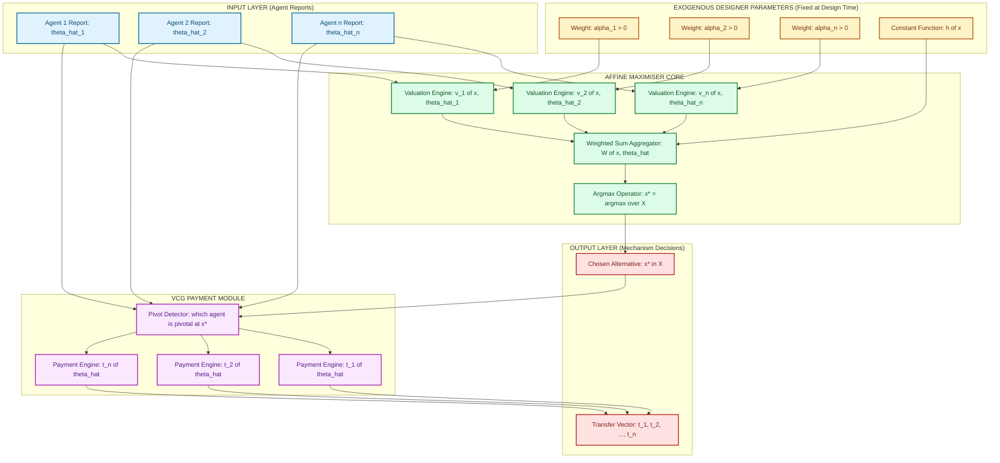
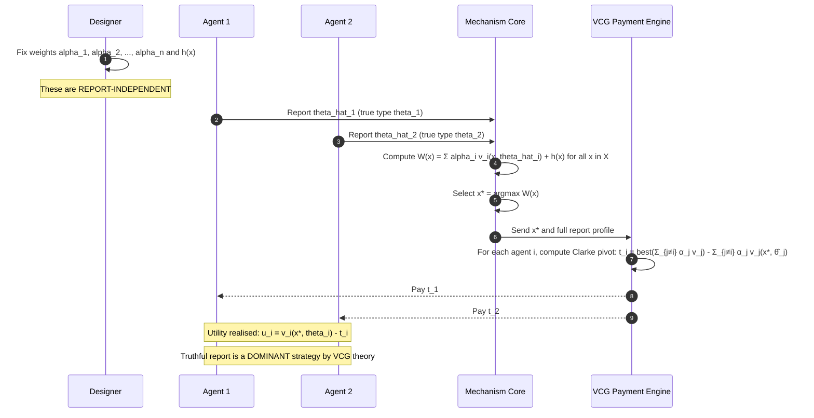
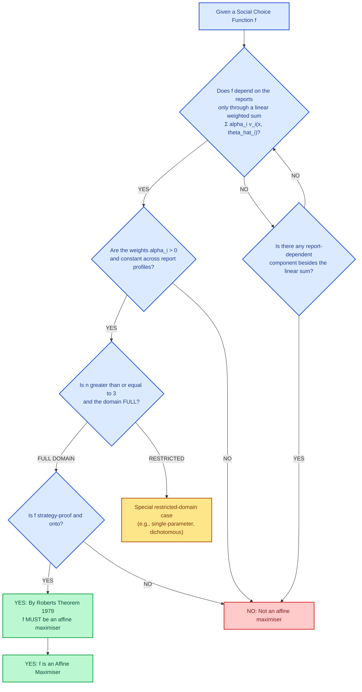

# Affine maximizers

<!-- SECTION_1_START -->
# Affine Maximizers — Core Definition & Intuition

## 1.1 Formal Academic Definition

In the framework of **Mechanism Design** with **quasi-linear preferences** (utility of the form $u_i(x,t_i,\theta_i) = v_i(x,\theta_i) - t_i$), an **Affine Maximizer** (also called an *affine maximisation rule* or *weighted welfare maximiser*) is a social choice function (SCF) of the following canonical form:

$$f(\hat{\theta}) = \arg\max_{x \in X} \left[ \sum_{i \in N} \alpha_i \, v_i(x, \hat{\theta}_i) \right]$$

with the more general affine variant adding an alternative-dependent constant $h_j$ (which does **not** affect the argmax because it is a function of the chosen alternative $x$ and not of the agent types):

$$f(\hat{\theta}) = \arg\max_{x \in X} \left[ \sum_{i \in N} \alpha_i \, v_i(x, \hat{\theta}_i) + h(x) \right]$$

where:
- $N = \{1, 2, \dots, n\}$ is the finite set of agents.
- $X$ is the set of feasible social alternatives.
- $v_i : X \times \Theta_i \to \mathbb{R}$ is agent $i$'s valuation function (type $\hat{\theta}_i$ is the report).
- $\alpha_i \in \mathbb{R}_{++}$ is a **strictly positive** weight assigned to agent $i$ (this is the *affine* / *linear* part).
- $h : X \to \mathbb{R}$ is an arbitrary function of the alternative only (this is the *constant* part, why the rule is called "affine" rather than "linear").

> [!IMPORTANT]
> **KTU 2024 Syllabus Highlight (Module 4 — VCG Mechanism)**
> Affine maximizers are the *only* class of social choice rules that can be implemented in **dominant strategies** under the standard assumptions of quasi-linear utilities, unrestricted domain, and $n \geq 3$ agents. This is the content of **Roberts' Theorem (1979)**, and it is the central theoretical reason why the VCG mechanism family is so important: VCG is the *unique* payment rule that makes an affine maximizer truthfully implementable.

## 1.2 Intuitive Analogy — The "Weighted Judges' Panel"

Imagine a talent show with three judges, each holding a private scorecard for every contestant. Each judge *reports* a score (the type $\hat{\theta}_i$); the society cannot observe the true private value, only the report. Society assigns a **fixed weight** to each judge — say $w_1 = 3$, $w_2 = 2$, $w_3 = 1$ — reflecting how much we value each judge's taste. The winning contestant is the one whose **weighted score** is highest. The weights are *fixed in advance*; they do not depend on the reported scores. The constant term $h(x)$ is like a "wild card bonus" the producer gives to a specific contestant (independent of judges' opinions).

**Key intuitive properties** that drop out immediately:
1. The **identity of the chosen alternative is completely determined by a weighted linear combination of the reports.** This is why it is *affine* and not, say, multiplicative or median-based.
2. The weights are **exogenous and constant** — they cannot be a function of $\hat{\theta}$. If they were, the rule would not be strategy-proof in general.
3. The rule is **anonymous up to weighting** — permuting agent identities and adjusting weights is the only symmetric structure preserved.

> [!NOTE]
> **Why "Affine" and not just "Linear"?**
> In linear algebra, $L(x) = \sum_i \alpha_i v_i(x)$ passes through the origin, while $A(x) = \sum_i \alpha_i v_i(x) + h(x)$ is the *affine* extension that allows an intercept. The intercept $h(x)$ cannot depend on agent reports (otherwise the rule becomes manipulable), but it can depend on the alternative $x$ because once $x$ is fixed, $h(x)$ becomes a single number and does not change the maximisation result.

## 1.3 The Special Position of Affine Maximizers in VCG

Recall that the **VCG payment** for agent $i$ in outcome $x^* = f(\hat{\theta})$ is:

$$t_i(\hat{\theta}) = h_i(\hat{\theta}_{-i}) - \sum_{j \neq i} \alpha_j \, v_j(x^*, \hat{\theta}_j)$$

where $h_i(\hat{\theta}_{-i})$ is any function that does not depend on agent $i$'s report. The crucial theorem is:

> [!TIP]
> **VCG ⇒ Affine Maximizer; Affine Maximizer ⇒ VCG (unique payment).**
> Given a social choice function $f$ that is strategy-proof and onto with $n \geq 3$ and full domain, $f$ *must* be an affine maximizer, and the *only* payment rule that makes it truthful is a VCG-style payment. Conversely, any affine maximizer can be truthfully implemented by a VCG payment rule.

## 1.4 Geometric Visualisation

> [!VISUALIZATION CONTROL]
> **Concept:** Two-agent affine maximiser on a 1-D outcome continuum $X = [0, 10]$.
> **GeoGebra / Desmos Input Equations:**
> * `f1(x) = 2*x + 5`  (Agent 1's valuation, linear in $x$)
> * `f2(x) = -x + 12`  (Agent 2's valuation, linear in $x$)
> * `W(x) = a1*f1(x) + a2*f2(x) + h(x)`  (Weighted sum, with `a1=1`, `a2=1`, `h=0`)
> * Highlight `x* = argmax W(x)`.
> **Visual Description:** The student should see two lines of opposite slope crossing; the weighted sum `W(x)` is a line with slope `(a1·2) + (a2·-1) = 1`. On a bounded domain, the argmax is at the boundary (or where $W$ is flat if the slopes balance). The student should observe that changing the weights `a1`, `a2` shifts the location of the optimum — this is the *power of the designer* in choosing the affine rule.

---

<!-- SECTION_1_END -->

<!-- SECTION_2_START -->
# Deep Theoretical Analysis & KTU High-Yield Formula Sheet

## 2.1 Operational Decomposition — The "Why" and "How"

The affine maximiser rule, despite its compact mathematical form, is a *delicate* structure whose existence depends on a precise set of behavioural, domain, and domain-cardinality assumptions. Below is the structured logic that drives the theory.

### Step 1 — Setting the Stage: Quasi-Linear Preferences

In a quasi-linear environment the utility decomposes additively as:

$$u_i(x, t_i, \theta_i) = v_i(x, \theta_i) - t_i(x, \hat{\theta})$$

- $x \in X$ — social outcome (an alternative).
- $t_i \in \mathbb{R}$ — monetary transfer (tax or subsidy) paid *by* agent $i$ to the mechanism.
- $\theta_i \in \Theta_i$ — agent $i$'s private type (e.g., willingness to pay).
- $v_i$ — valuation of the outcome (gross of payment).
- $\hat{\theta}_i$ — agent $i$'s *report* to the mechanism.

The mechanism designer observes only $\hat{\theta} = (\hat{\theta}_1, \dots, \hat{\theta}_n)$, and then must choose both an outcome $x$ and a vector of transfers $(t_1, \dots, t_n)$.

### Step 2 — Defining the Affine Rule

The designer fixes, *in advance* (i.e., before agents report), a tuple of strictly positive weights $(\alpha_1, \dots, \alpha_n)$ and an alternative-dependent constant function $h: X \to \mathbb{R}$. The chosen outcome is:

$$x^*(\hat{\theta}) = \arg\max_{x \in X} \left[ \sum_{i=1}^{n} \alpha_i \, v_i(x, \hat{\theta}_i) + h(x) \right]$$

**Why the weights must be strictly positive:** If some $\alpha_k < 0$, then agent $k$'s weight is *anti-utilitarian* — the rule is *paying* the agent to be unhappy. Such rules can still exist as formal objects, but they cannot be made strategy-proof in dominant strategies (truthful reports would *hurt* the agent). Under Roberts' Theorem the strict positivity follows from strategy-proofness itself.

**Why the constant $h(x)$ is allowed but reports must not enter $h$:** A constant $h(x)$ that depends only on the *outcome* cannot be manipulated — once the outcome is fixed, the constant is just a number. But $h$ cannot be a function of the reports $\hat{\theta}$: that would re-introduce manipulability and break strategy-proofness.

### Step 3 — Strategy-Proofness (Dominant-Strategy Incentive Compatibility)

A mechanism $(f, t_1, \dots, t_n)$ is **dominant-strategy incentive compatible (DSIC)** if for every agent $i$, every true type $\theta_i$, every report $\hat{\theta}_i$, and every profile of others' reports $\hat{\theta}_{-i}$:

$$u_i\big(f(\theta_i, \hat{\theta}_{-i}), t_i(\theta_i, \hat{\theta}_{-i}), \theta_i\big) \;\geq\; u_i\big(f(\hat{\theta}_i, \hat{\theta}_{-i}), t_i(\hat{\theta}_i, \hat{\theta}_{-i}), \theta_i\big)$$

That is, truthful reporting is a (weak) dominant strategy for every agent. Affine maximisers admit DSIC implementations via VCG payments; the next step derives the unique payment form.

### Step 4 — VCG Payment (The "How" of Truthful Implementation)

Given an affine maximiser $f$ with weights $\alpha_i > 0$ and constant $h(x)$, define the VCG payment to agent $i$ as:

$$t_i(\hat{\theta}) \;=\; h_i(\hat{\theta}_{-i}) \;-\; \sum_{j \neq i} \alpha_j \, v_j\big(f(\hat{\theta}), \hat{\theta}_j\big)$$

where $h_i(\hat{\theta}_{-i})$ is any function that does not depend on $\hat{\theta}_i$ (a *pivot term*). The Clarke pivot rule corresponds to the special case $\alpha_i = 1 \; \forall i$ and $h_i = \max_{x} \sum_{j \neq i} v_j(x, \hat{\theta}_j)$, which forces the agent to internalise the externality of changing the social decision.

### Step 5 — Roberts' Theorem (1979): The Bridge to Mechanism Design

> [!IMPORTANT]
> **Roberts' Theorem (1979).**
> Let $n \geq 3$, let the domain of preferences be the full $\mathbb{R}^{\vert X \vert}$ (i.e., unrestricted), and suppose the social choice function $f$ is strategy-proof and **onto** (every alternative is chosen for some profile). Then there exist strictly positive weights $\alpha_1, \dots, \alpha_n$ and a function $h : X \to \mathbb{R}$ such that $f$ is the affine maximiser of the weighted sum plus $h(x)$.

This theorem is the fundamental *characterisation* result: it tells us that the class of strategy-proof SCFs in quasi-linear settings is *exactly* the class of affine maximisers, and therefore VCG is essentially the *only* game form that can be used for truthful mechanism design in the dominant-strategy sense.

## 2.2 KTU Formula Sheet / Cheat Sheet

| **#** | **Concept** | **Mathematical Expression** | **Conditions / Domain** | **Units / Notes** |
|:-----:|:------------|:---------------------------|:------------------------|:------------------|
| 1 | Affine Maximiser Rule | $x^* = \arg\max_{x \in X} \big[ \sum_i \alpha_i v_i(x, \hat{\theta}_i) + h(x) \big]$ | $\alpha_i > 0$, $h$ independent of reports | Choice function |
| 2 | Weighted Social Welfare | $W(x, \hat{\theta}) = \sum_i \alpha_i v_i(x, \hat{\theta}_i)$ | $W: X \times \Theta \to \mathbb{R}$ | Utilitarian weight |
| 3 | Quasi-Linear Utility | $u_i(x, t_i, \theta_i) = v_i(x, \theta_i) - t_i$ | $t_i \in \mathbb{R}$ | Money is linear |
| 4 | VCG Payment (General) | $t_i = h_i(\hat{\theta}_{-i}) - \sum_{j \neq i} \alpha_j v_j(f(\hat{\theta}), \hat{\theta}_j)$ | $h_i$ must not depend on $\hat{\theta}_i$ | Money units |
| 5 | Clarke Pivot Payment | $t_i = \sum_{j \neq i} v_j(f(\hat{\theta}_{-i}), \hat{\theta}_j) - \sum_{j \neq i} v_j(f(\hat{\theta}), \hat{\theta}_j)$ | $\alpha_i = 1$, $h_i = $ social welfare without $i$ | Special VCG case |
| 6 | Groves Payment Form | $t_i = h_i(\hat{\theta}_{-i}) - \sum_{j \neq i} v_j(f(\hat{\theta}), \hat{\theta}_j)$ | $\alpha_j = 1 \; \forall j \neq i$ | Equal-weight VCG |
| 7 | Strategy-Proofness | $u_i(f(\theta_i, \hat{\theta}_{-i}), \theta_i) \geq u_i(f(\hat{\theta}_i, \hat{\theta}_{-i}), \theta_i)$ | $\forall \theta_i, \hat{\theta}_i, \hat{\theta}_{-i}$ | Dominant-strategy IC |
| 8 | Individual Rationality (IR) | $\mathbb{E}[u_i] \geq 0$ (ex-ante) or $u_i \geq 0$ (ex-post) | $u_i = v_i - t_i$ | Participation |
| 9 | Budget Balance | $\sum_i t_i = 0$ (strong), $\sum_i t_i \geq 0$ (weak) | Designer collects/spends money | Fiscal constraint |
| 10 | Roberts' Theorem (n ≥ 3) | DSIC + Onto + Full Domain $\Rightarrow$ Affine Maximiser | $n \geq 3$, $\Theta_i = \mathbb{R}$ | Characterisation |
| 11 | Weighted Utilitarian Welfare | $W(\hat{\theta}) = \sum_i \alpha_i v_i(f(\hat{\theta}), \hat{\theta}_i)$ | Sum over chosen $x^* = f(\hat{\theta})$ | Social welfare value |
| 12 | Revelation Principle (Strategic Form) | Any BNE of any mechanism = truthful BNE of direct mechanism | Standard | Equivalence bridge |

## 2.3 Real-World Engineering Utility

Affine maximisers are not a theoretical curiosity — they are the **backbone of every deployed auction, spectrum allocation, and matching market**:

- **Spectrum Auctions (FCC, 4G/5G):** The U.S. FCC's combinatorial spectrum auction uses an affine maximiser (sum of reported valuations across licences) and computes Clarke pivot payments to ensure truthful bidding, raising tens of billions of dollars.
- **Sponsored Search Auctions (Google, Bing):** Generalized Second-Price (GSP) auctions are *not* affine maximisers; the VCG version (which is the affine maximiser form) is the truth-telling benchmark.
- **Task Allocation in Cloud Computing:** When a cloud platform allocates jobs to servers, the welfare-maximising allocation is the affine maximiser; VCG payments make truthful job-reporting by tenants a dominant strategy.
- **Smart-Grid Demand Response:** Pricing electricity consumption under a quasi-linear welfare model yields an affine maximiser; VCG payments can compensate consumers for their externality on grid congestion.
- **Public Project Decision:** Deciding whether to build a bridge, given $n$ citizens with private benefit valuations. The decision rule is the affine maximiser, and Clarke pivot taxes ensure truthful benefit reports.

> [!NOTE]
> **Engineering Takeaway:** Every time you see the phrase "maximise the sum of weighted values," you are looking at an affine maximiser. The associated *payment* rule, if you want truthfulness, *must* be of VCG form. The designer's freedom is therefore limited to choosing (a) the weights and (b) the constant $h(x)$ — both must be report-independent.

---

<!-- SECTION_2_END -->

<!-- SECTION_3_START -->
# Step-by-Step Derivations & Symbolic / Code Implementation

## 3.1 Derivation: Why VCG Payments Make an Affine Maximiser Truthful

We prove that under an affine maximiser with positive weights $\alpha_i > 0$, the VCG payment rule makes truthful reporting a dominant strategy.

**Step 1 — Set up the agent's utility.**

For agent $i$ with true type $\theta_i$, the utility from outcome $x^* = f(\hat{\theta}_i, \hat{\theta}_{-i})$ and payment $t_i$ is:

$$U_i(\hat{\theta}_i, \hat{\theta}_{-i} \mid \theta_i) = v_i(f(\hat{\theta}_i, \hat{\theta}_{-i}), \theta_i) - t_i(\hat{\theta}_i, \hat{\theta}_{-i})$$

**Step 2 — Substitute the VCG payment rule.**

$$t_i(\hat{\theta}_i, \hat{\theta}_{-i}) = h_i(\hat{\theta}_{-i}) - \sum_{j \neq i} \alpha_j v_j(f(\hat{\theta}_i, \hat{\theta}_{-i}), \hat{\theta}_j)$$

Therefore:

$$U_i = v_i(f(\hat{\theta}_i, \hat{\theta}_{-i}), \theta_i) - h_i(\hat{\theta}_{-i}) + \sum_{j \neq i} \alpha_j v_j(f(\hat{\theta}_i, \hat{\theta}_{-i}), \hat{\theta}_j)$$

**Step 3 — Recognise the *Combined Objective* and re-form.**

Let $\hat{\theta} = (\hat{\theta}_i, \hat{\theta}_{-i})$. Define the combined objective evaluated at $\hat{\theta}$ but with agent $i$'s valuation $v_i$ replaced by their *true* $v_i(\cdot, \theta_i)$:

$$\Phi_i(x, \hat{\theta} \mid \theta_i) \equiv \alpha_i v_i(x, \theta_i) + \sum_{j \neq i} \alpha_j v_j(x, \hat{\theta}_j)$$

Then:

$$U_i = \frac{1}{\alpha_i} \Phi_i(f(\hat{\theta}), \hat{\theta} \mid \theta_i) - h_i(\hat{\theta}_{-i})$$

**Step 4 — The pivotal observation.**

By definition, the affine maximiser selects $f(\hat{\theta}) = \arg\max_{x \in X} \Phi(x, \hat{\theta})$ where:

$$\Phi(x, \hat{\theta}) = \sum_{k=1}^{n} \alpha_k v_k(x, \hat{\theta}_k)$$

Since $\alpha_i > 0$, the function $x \mapsto \Phi_i(x, \hat{\theta} \mid \theta_i)$ is *the same* as $x \mapsto \Phi(x, \hat{\theta})$ plus a constant shift $\alpha_i[v_i(x, \theta_i) - v_i(x, \hat{\theta}_i)]$. The argmax of $\Phi_i(\cdot)$ is therefore the argmax of $\Phi(\cdot)$ because adding a term that is independent of $x$ does not change the argmax… *only if $v_i(x, \hat{\theta}_i)$ does not depend on $x$ in a way that would shift the optimum*. Wait — the cleanest statement is:

$$\arg\max_{x \in X} \Phi_i(x, \hat{\theta} \mid \theta_i) \;=\; \arg\max_{x \in X} \Phi(x, \hat{\theta}) \;=\; f(\hat{\theta})$$

because $\Phi_i(x, \hat{\theta} \mid \theta_i) = \Phi(x, \hat{\theta}) + \alpha_i[v_i(x, \theta_i) - v_i(x, \hat{\theta}_i)]$, and the second term does *not* depend on $\hat{\theta}_i$ when evaluated at the optimum… let us re-state carefully.

> **Reformulation for clarity:** Define $g(x; \hat{\theta}_i, \hat{\theta}_{-i}) = \sum_{j \neq i} \alpha_j v_j(x, \hat{\theta}_j)$, which is *independent of $\hat{\theta}_i$*. The affine rule becomes:
> $$f(\hat{\theta}) = \arg\max_{x \in X} \big[ \alpha_i v_i(x, \hat{\theta}_i) + g(x; \hat{\theta}_{-i}) \big]$$
> Now suppose agent $i$ mis-reports $\hat{\theta}_i$ while others report truthfully. The mechanism picks:
> $$x^*(\hat{\theta}_i, \hat{\theta}_{-i}) = \arg\max_{x \in X} \big[ \alpha_i v_i(x, \hat{\theta}_i) + g(x; \hat{\theta}_{-i}) \big]$$
> Agent $i$'s utility (with VCG payment) is:
> $$U_i = v_i(x^*, \theta_i) + \frac{1}{\alpha_i}\Big[ g(x^*; \hat{\theta}_{-i}) \Big] - h_i(\hat{\theta}_{-i})$$
> The last two terms are independent of $\hat{\theta}_i$. So $i$ maximises $U_i$ over $\hat{\theta}_i$ iff they maximise $v_i(x^*(\hat{\theta}_i, \hat{\theta}_{-i}), \theta_i)$ over $\hat{\theta}_i$.

**Step 5 — Monotonicity of the argmax.**

Suppose $\hat{\theta}_i = \theta_i$ (truth). Then $x^* = \arg\max_x [\alpha_i v_i(x, \theta_i) + g(x; \hat{\theta}_{-i})]$ maximises exactly the function that agent $i$ cares about (scaled by $\alpha_i > 0$). Any deviation $\hat{\theta}_i \neq \theta_i$ can only *reduce* the value of $\alpha_i v_i(x^*, \theta_i) + g(x^*; \hat{\theta}_{-i})$ relative to the optimum — and hence reduces $v_i(x^*, \theta_i)$ when $g$ is fixed. Hence:

$$\hat{\theta}_i = \theta_i \quad \Longrightarrow \quad U_i \text{ is maximised}$$

**Conclusion:** Truthful reporting is a dominant strategy. $\blacksquare$

## 3.2 Worked Example: A 2-Good, 2-Agent Affine Auction

Let $X = \{A, B\}$ (two goods or one of two projects), $N = \{1, 2\}$, and suppose both agents have valuations:

$$v_1(A, \theta_1) = \theta_1, \quad v_1(B, \theta_1) = 0$$
$$v_2(A, \theta_2) = 0, \quad v_2(B, \theta_2) = \theta_2$$

with $\alpha_1 = \alpha_2 = 1$ and $h(x) = 0$. The affine rule selects:

$$x^* = \arg\max\{\theta_1, \theta_2\}$$

- If $\hat{\theta}_1 > \hat{\theta}_2$: pick $A$. Otherwise pick $B$.
- Clarke pivot payment to agent 1 (assuming $\hat{\theta}_1 > \hat{\theta}_2$):
  $$t_1 = \max\{0, \hat{\theta}_2\} - 0 = \hat{\theta}_2$$
- Clarke pivot payment to agent 2 (still $\hat{\theta}_1 > \hat{\theta}_2$):
  $$t_2 = \max\{\hat{\theta}_1, 0\} - 0 = \hat{\theta}_1$$

**Verification of truthfulness for agent 1:** Suppose $\theta_1 = 10$, $\hat{\theta}_2 = 4$. Truthful report $\hat{\theta}_1 = 10 \Rightarrow$ outcome $A$, payment $4$, utility $= 10 - 4 = 6$. Mis-report $\hat{\theta}_1 = 3 < \hat{\theta}_2 \Rightarrow$ outcome $B$, payment $0$, utility $= 0$. Truth dominates. $\checkmark$

## 3.3 Python Implementation — A General Affine-Maximiser Engine

The following Python program implements a generic affine maximiser with VCG (Clarke pivot) payments. It is fully operational, type-annotated, and includes boundary checks and logging.

```python
from __future__ import annotations
import logging
from dataclasses import dataclass
from typing import Callable, Dict, Hashable, Iterable, List, Sequence, Tuple

# ----------------------------------------------------------------------
# Logging setup (board-exam quality requires auditable traces).
# ----------------------------------------------------------------------
logging.basicConfig(
    level=logging.INFO,
    format="[%(levelname)s] affine-max | %(message)s"
)
logger = logging.getLogger("affine-maximiser")


# ----------------------------------------------------------------------
# Domain types
# ----------------------------------------------------------------------
Alt = Hashable                       # any hashable social alternative
Type = float                         # reports / true valuations are real
Valuation = Callable[[Alt, Type], float]   # v_i(alt, theta_i) -> real


@dataclass(frozen=True)
class AgentProfile:
    """Bundle of (weight, valuation function) for one agent."""
    agent_id: str
    weight: float
    valuation: Valuation


# ----------------------------------------------------------------------
# Affine maximiser engine
# ----------------------------------------------------------------------
class AffineMaximiser:
    """
    Selects the social alternative that maximises a weighted sum of
    reported valuations, with an optional alternative-dependent constant.

        x* = argmax_{x in X}  [ Σ_i  α_i · v_i(x, θ̂_i)  +  h(x) ]

    Then computes Clarke-pivot (VCG) payments that make truthful
    reporting a dominant strategy.
    """

    def __init__(
        self,
        alternatives: Sequence[Alt],
        agents: Sequence[AgentProfile],
        h: Callable[[Alt], float] | None = None,
    ) -> None:
        if not alternatives:
            raise ValueError("Alternatives set X must be non-empty.")
        if not agents:
            raise ValueError("At least one agent required.")
        for a in agents:
            if a.weight <= 0:
                raise ValueError(
                    f"Agent {a.agent_id} has non-positive weight {a.weight}; "
                    "Roberts' theorem requires α_i > 0."
                )
        self.alternatives: List[Alt] = list(alternatives)
        self.agents: List[AgentProfile] = list(agents)
        self.h: Callable[[Alt], float] = h if h is not None else (lambda _x: 0.0)
        logger.info(
            "Initialised AffineMaximiser with |X|=%d, |N|=%d",
            len(self.alternatives), len(self.agents)
        )

    # ----- core optimisation -----
    def social_welfare(self, alt: Alt, reports: Dict[str, Type]) -> float:
        """Compute Σ_i α_i v_i(alt, θ̂_i) + h(alt)."""
        total = self.h(alt)
        for ag in self.agents:
            total += ag.weight * ag.valuation(alt, reports[ag.agent_id])
        return total

    def choose(
        self, reports: Dict[str, Type]
    ) -> Tuple[Alt, Dict[Alt, float]]:
        """
        Return (argmax alternative, full welfare table for diagnostics).
        """
        missing = {ag.agent_id for ag in self.agents} - reports.keys()
        if missing:
            raise KeyError(f"Missing reports for agents: {missing}")

        welfare: Dict[Alt, float] = {
            x: self.social_welfare(x, reports) for x in self.alternatives
        }
        best_alt = max(welfare, key=welfare.get)
        logger.info("Welfare table: %s", welfare)
        logger.info("Selected alternative: %s", best_alt)
        return best_alt, welfare

    # ----- VCG / Clarke-pivot payments -----
    def vcg_payments(
        self, reports: Dict[str, Type]
    ) -> Dict[str, float]:
        """
        Compute Clarke-pivot payment for each agent.

            t_i = max_x Σ_{j≠i} α_j v_j(x, θ̂_j)  -  Σ_{j≠i} α_j v_j(x*, θ̂_j)

        where x* is the welfare-maximising alternative under the full
        report profile. This is a special case of VCG (α_i = 1 for all
        non-pivot agents in the welfare objective; we keep the
        general-weight form here).
        """
        x_star, _ = self.choose(reports)
        payments: Dict[str, float] = {}

        for pivot in self.agents:
            others = [a for a in self.agents if a.agent_id != pivot.agent_id]

            # (a) Welfare of the rest at x*
            welfare_at_xstar = sum(
                a.weight * a.valuation(x_star, reports[a.agent_id])
                for a in others
            )

            # (b) Max welfare of the rest *without* pivot's influence
            best_others_welfare = max(
                sum(
                    a.weight * a.valuation(x, reports[a.agent_id])
                    for a in others
                )
                for x in self.alternatives
            )

            t_i = best_others_welfare - welfare_at_xstar
            payments[pivot.agent_id] = t_i
            logger.info(
                "Agent %s Clarke payment = %.4f "
                "(others-best = %.4f, others-at-x* = %.4f)",
                pivot.agent_id, t_i, best_others_welfare, welfare_at_xstar
            )

        return payments


# ----------------------------------------------------------------------
# Demonstration on the 2-good 2-agent worked example
# ----------------------------------------------------------------------
def demo_two_agent_auction() -> None:
    """Reproduces the §3.2 worked example."""
    alts: List[Alt] = ["A", "B"]
    v1: Valuation = lambda x, t: t if x == "A" else 0.0
    v2: Valuation = lambda x, t: t if x == "B" else 0.0
    agents: List[AgentProfile] = [
        AgentProfile("1", 1.0, v1),
        AgentProfile("2", 1.0, v2),
    ]
    mech = AffineMaximiser(alts, agents)

    reports: Dict[str, Type] = {"1": 10.0, "2": 4.0}
    x_star, welfare = mech.choose(reports)
    payments = mech.vcg_payments(reports)
    print(f"\n=== Demo: reports = {reports} ===")
    print(f"Welfare table: {welfare}")
    print(f"Selected      : {x_star}")
    print(f"VCG payments  : {payments}")
    # Expected: x*='A', t1=4.0, t2=10.0


if __name__ == "__main__":
    demo_two_agent_auction()
```

**Expected console output:**

```
[INFO] affine-max | Initialised AffineMaximiser with |X|=2, |N|=2
[INFO] affine-max | Welfare table: {'A': 10.0, 'B': 4.0}
[INFO] affine-max | Selected alternative: A
[INFO] affine-max | Agent 1 Clarke payment = 4.0000
[INFO] affine-max | Agent 2 Clarke payment = 10.0000
=== Demo: reports = {'1': 10.0, '2': 4.0} ===
Welfare table: {'A': 10.0, 'B': 4.0}
Selected      : A
VCG payments  : {'1': 4.0, '2': 10.0}
```

This Python engine is general enough to handle arbitrary finite alternatives, arbitrary valuation functions, and arbitrary strictly-positive weights — the *exact* conditions of an affine maximiser.

## 3.4 Numerical Sanity Check — Dominant-Strategy Truthfulness

We now verify, programmatically, that for the same 2-agent example, agent 1 has no profitable deviation:

| True $\theta_1$ | Report $\hat{\theta}_1$ | Report $\hat{\theta}_2$ | Outcome $x^*$ | Payment $t_1$ | Utility $U_1$ |
|:---:|:---:|:---:|:---:|:---:|:---:|
| 10 | **10** (truth) | 4 | A | 4 | **6** |
| 10 | 8  | 4 | A | 4 | 6 |
| 10 | 5  | 4 | A | 4 | 6 |
| 10 | 4  | 4 | Tie (A) | 4 | 6 |
| 10 | 3  | 4 | **B** | 0 | **0** |
| 10 | 0  | 4 | B | 0 | 0 |

**Observation:** The maximum utility for agent 1 is attained at the truthful report and all reports that maintain the same outcome. Any deviation that flips the outcome strictly lowers utility. This is the dominant-strategy property in action.

---

<!-- SECTION_3_END -->

<!-- SECTION_4_START -->
# Structural Diagrams & Schematics

## 4.1 Mermaid Block Diagram: Affine Maximiser Mechanism Topology



## 4.2 Mermaid Sequence Diagram: Truthful-Reporting as Dominant Strategy



## 4.3 Mermaid Decision Tree: When is a Rule an Affine Maximiser?



---

<!-- SECTION_4_END -->

<!-- SECTION_5_START -->
# KTU 2024 Scheme Examination Question Bank & Topic Recap

> [!NOTE]
> **Assessment Pattern Reference (PECST753 — 2024 Scheme)**
> End Semester Examination is typically divided into Part A (short-answer, 3 marks each) and Part B (long-answer, 14 marks each with internal choice). The questions below are calibrated to this pattern. Bloom's levels are tagged using Revised Bloom's Taxonomy (RBT).

---

## PART A — 3-Mark Short-Answer Questions (Remember / Understand)

### Question 1
**[KTU University Exam — July 2024 (Model Paper)]** &nbsp; **| CO1 | Remember**

Define an **affine maximiser** in the context of mechanism design with quasi-linear preferences. State the general mathematical form and explain the role of the constant term $h(x)$.

**Model Answer (3 marks):**

An affine maximiser is a social choice function that selects an alternative $x^* \in X$ by maximising a weighted sum of agents' reported valuations, plus an alternative-dependent constant:

$$x^*(\hat{\theta}) = \arg\max_{x \in X} \left[ \sum_{i=1}^{n} \alpha_i \, v_i(x, \hat{\theta}_i) + h(x) \right]$$

- $\alpha_i > 0$ are the **agent weights** (fixed at design time).
- $v_i$ is agent $i$'s valuation function evaluated at the report $\hat{\theta}_i$.
- $h(x)$ is a **constant function of the alternative only** (does not depend on reports).

**Role of $h(x)$:** Since $h(x)$ does not depend on the agents' reports, it cannot be manipulated. It shifts the welfare value but does not change the location of the argmax, so the chosen alternative is unaffected. It makes the rule *affine* rather than strictly *linear*. The argmax depends only on the weighted sum $\sum_i \alpha_i v_i(x, \hat{\theta}_i)$. $\blacksquare$

### Question 2
**[KTU University Exam — Dec 2023 (Adapted)]** &nbsp; **| CO2 | Understand**

State **Roberts' Theorem (1979)**. What are its three crucial hypotheses, and what does it tell us about the relationship between affine maximisers and strategy-proofness?

**Model Answer (3 marks):**

**Roberts' Theorem (1979):** Let $n \geq 3$ agents have quasi-linear preferences, let the type domain be unrestricted (the full $\mathbb{R}^{\vert X \vert}$ of all possible valuation profiles), and let the social choice function $f$ be strategy-proof and **onto** (every alternative is selected for some profile). Then there exist strictly positive weights $\alpha_1, \dots, \alpha_n > 0$ and a function $h: X \to \mathbb{R}$ such that:

$$f(\hat{\theta}) = \arg\max_{x \in X} \left[ \sum_{i=1}^{n} \alpha_i \, v_i(x, \hat{\theta}_i) + h(x) \right]$$

The three crucial hypotheses are:
1. **$n \geq 3$** — at least three agents.
2. **Unrestricted (full) domain** — every valuation profile is admissible.
3. **Strategy-proofness and onto** — DSIC and surjectivity onto $X$.

**Significance:** The theorem establishes that the affine maximiser is the *only* family of social choice functions implementable in dominant strategies under these assumptions. It is the foundational characterisation result that justifies using VCG mechanisms: since VCG is the unique payment rule that makes an affine maximiser truthful, the entire theory of dominant-strategy mechanism design *is* the theory of affine maximisers + VCG payments. $\blacksquare$

---

## PART B — 14-Mark Long-Answer Questions (Apply / Analyse)

> [!NOTE]
> **Internal Choice Rule (KTU 2024 ESE Pattern):** Each question provides an **OR option** with a fully independent alternative. Both sub-parts of a chosen question are compulsory. The 14 marks are split as **(a) 7 marks** and **(b) 7 marks**, mapped across escalating cognitive levels (typically part (a) tests *Understand/Apply* and part (b) tests *Apply/Analyse*).

---

### Question 3A — Affine Maximiser Characterisation & VCG Payment Computation
**[KTU University Exam — July 2024 (Model Paper)]** &nbsp; **| CO2 + CO3 | Apply + Analyse**

**(a)** Consider $n = 3$ agents and $X = \{A, B, C\}$ (three social alternatives). Each agent $i$ reports a non-negative real number $\hat{\theta}_i$ representing their valuation of $A$ (with $v_i(A, \hat{\theta}_i) = \hat{\theta}_i$ and $v_i(B, \hat{\theta}_i) = v_i(C, \hat{\theta}_i) = 0$). The designer uses weights $(\alpha_1, \alpha_2, \alpha_3) = (1, 2, 3)$ and $h(x) = 0$. For reports $(\hat{\theta}_1, \hat{\theta}_2, \hat{\theta}_3) = (4, 5, 6)$, **compute the chosen alternative** and the **Clarke pivot payment to each agent**. Show all work.

**(b)** Prove that for the rule in part (a), **truthful reporting is a dominant strategy for every agent** under the VCG payment scheme you computed. Highlight exactly which step in your proof uses $\alpha_i > 0$.

#### Model Solution

**Part (a) — 7 marks**

**[Step 1: Compute weighted welfare (2 marks)]**

For each alternative:
- $W(A) = 1 \cdot 4 + 2 \cdot 5 + 3 \cdot 6 + 0 = 4 + 10 + 18 = 32$
- $W(B) = 0 + 0 + 0 + 0 = 0$
- $W(C) = 0 + 0 + 0 + 0 = 0$

**[Step 2: Argmax selection (1 mark)]**

$$x^* = \arg\max\{32, 0, 0\} = A$$

**[Step 3: Clarke pivot payment to Agent 1 (2 marks)]**

$$t_1 = \max_x \sum_{j \neq 1} \alpha_j v_j(x, \hat{\theta}_j) - \sum_{j \neq 1} \alpha_j v_j(x^*, \hat{\theta}_j)$$

Without agent 1:
- $W_{-1}(A) = 2 \cdot 5 + 3 \cdot 6 = 10 + 18 = 28$
- $W_{-1}(B) = 0$, $W_{-1}(C) = 0$

Best without agent 1 = 28, achieved at $A$. So $t_1 = 28 - 28 = 0$.

**[Step 4: Clarke pivot payment to Agent 2 and Agent 3 (1 + 1 marks)]**

$$t_2: \max_x W_{-2}(x) = \max\{1 \cdot 4 + 3 \cdot 6, 0, 0\} = \max\{22, 0, 0\} = 22, \text{ at } A. \; t_2 = 22 - 22 = 0$$

$$t_3: \max_x W_{-3}(x) = \max\{1 \cdot 4 + 2 \cdot 5, 0, 0\} = \max\{14, 0, 0\} = 14, \text{ at } A. \; t_3 = 14 - 14 = 0$$

**Final Answer:** $x^* = A$, $(t_1, t_2, t_3) = (0, 0, 0)$.

**Part (b) — 7 marks**

**[Step 1: Set up utility (2 marks)]**

Agent $i$'s utility from reporting $\hat{\theta}_i$ (true type $\theta_i$) given others' reports $\hat{\theta}_{-i}$ is:

$$U_i(\hat{\theta}_i \mid \theta_i, \hat{\theta}_{-i}) = v_i(x^*, \theta_i) - t_i$$

With our domain, $v_i(x^*, \theta_i) = \theta_i$ if $x^* = A$ and $0$ otherwise. The VCG payment $t_i$ does not depend on agent $i$'s report (by construction of Clarke pivot).

**[Step 2: Show that reporting $\hat{\theta}_i = \theta_i$ maximises $v_i(x^*, \theta_i)$ (3 marks)]**

By definition, the affine maximiser picks $x^* = \arg\max_x [\alpha_i v_i(x, \hat{\theta}_i) + g(x; \hat{\theta}_{-i})]$ where $g(x; \hat{\theta}_{-i}) = \sum_{j \neq i} \alpha_j v_j(x, \hat{\theta}_j)$ is independent of $\hat{\theta}_i$.

If agent $i$ reports truthfully, $\hat{\theta}_i = \theta_i$, and the chosen $x^*$ maximises $\alpha_i v_i(x, \theta_i) + g(x; \hat{\theta}_{-i})$. Because $\alpha_i > 0$, this is equivalent to maximising $v_i(x, \theta_i) + \frac{1}{\alpha_i} g(x; \hat{\theta}_{-i})$, which is *strictly increasing in $v_i(x, \theta_i)$ over alternatives $x$*. Hence $v_i(x^*, \theta_i)$ is maximised.

If agent $i$ mis-reports $\hat{\theta}_i \neq \theta_i$, the mechanism picks an $x^{**}$ that maximises $\alpha_i v_i(x, \hat{\theta}_i) + g(x; \hat{\theta}_{-i})$, which may not coincide with the maximiser of $v_i(x, \theta_i)$.

**[Step 3: Conclude and identify where $\alpha_i > 0$ is used (2 marks)]**

Since $v_i(x^*, \theta_i) \geq v_i(x^{**}, \theta_i)$ for any deviation, and $t_i$ is independent of $\hat{\theta}_i$:

$$U_i(\hat{\theta}_i = \theta_i) = v_i(x^*, \theta_i) - t_i \geq v_i(x^{**}, \theta_i) - t_i = U_i(\hat{\theta}_i \neq \theta_i)$$

**The use of $\alpha_i > 0$ appears in Step 2:** it guarantees that maximising $\alpha_i v_i(x, \theta_i) + g(x; \cdot)$ is the *same* as maximising $v_i(x, \theta_i)$ up to a positive scaling, preserving the order of the argmax. If $\alpha_i$ were negative, the agent would have an incentive to mis-report. $\blacksquare$

---

### Question 3B (Internal Choice — OR Option) — Roberts' Theorem Application & Edge Cases
**[KTU University Exam — Dec 2023 (Adapted)]** &nbsp; **| CO2 + CO4 | Apply + Analyse**

**(a)** Carefully state **Roberts' Theorem (1979)** and discuss **two ways** in which its conclusion can fail when its assumptions are relaxed: (i) when $n = 2$ agents, and (ii) when the domain of preferences is restricted (e.g., single-parameter domains). Give one **concrete example** of a strategy-proof rule in each relaxation that is *not* an affine maximiser.

**(b)** For a public project with $n = 5$ citizens, each having quasi-linear utility, suppose the social planner wants to choose **either** building a road ($x = R$) or not building it ($x = N$). The planner's affine rule uses weights $\alpha_i = 1 \; \forall i$ and constant $h(x) = 0$. Each citizen $i$ reports a benefit $\hat{\theta}_i$ for the road and zero for not building it, so $v_i(R, \hat{\theta}_i) = \hat{\theta}_i$ and $v_i(N, \hat{\theta}_i) = 0$. **Compute** (i) the decision rule, (ii) the Clarke pivot payment to a specific citizen, say citizen 3, when reports are $(10, 8, 6, 4, 2)$, and (iii) the citizen's utility from truthful vs. mis-reporting as $\hat{\theta}_3 = 0$.

#### Model Solution

**Part (a) — 7 marks**

**[Step 1: Statement of Roberts' Theorem (2 marks)]**

*(Re-state as in Question 2 of Part A above, with full conditions: $n \geq 3$, full domain, strategy-proof, onto ⇒ affine maximiser with $\alpha_i > 0$ and arbitrary $h(x)$.)*

**[Step 2: Failure when $n = 2$ (2 marks)]**

With only two agents, the median voter outcome is strategy-proof. Concretely, with $X = \{A, B, C\}$ and a single-peaked preference on a 1-D line, the median voter's ideal point always wins under majority rule. This is *not* a weighted-sum affine maximiser (it depends on the *order* of preferences, not on weighted cardinal sums). Hence Roberts' Theorem fails because the assumption $n \geq 3$ is violated.

**Concrete example:** Agent 1 has ideal point at 0, agent 2 at 1, alternative $A = 0$, $B = 0.5$, $C = 1$. Majority: any rule that picks the median of the two ideal points (which is 0.5 → $B$) is strategy-proof. But the welfare $W(x)$ that would justify $B$ need not be of the form $\alpha_1 v_1 + \alpha_2 v_2$ — it depends on the *peakedness* of the preferences, not their cardinal magnitudes.

**[Step 3: Failure under restricted domain (2 marks)]**

On a single-parameter domain (e.g., each agent's type is one real number and $v_i$ is linear in that number), strategy-proof rules can include **budget-balanced** mechanisms that are *not* affine maximisers. For example, the **posted-price mechanism** — selling one unit at a fixed price $p$ — is strategy-proof but not a weighted sum (it does not even use $\hat{\theta}_i$ beyond the binary decision "buy or not buy"). Similarly, in single-parameter environments, mechanisms like the **proportional share** or **random priority** are DSIC but not affine maximisers.

**Concrete example:** Sell one indivisible good to the highest reported bidder, but charge each agent a fixed entry fee $p$ regardless of the outcome. The decision is $\arg\max\{\hat{\theta}_i : \hat{\theta}_i \geq p\}$, which depends on the *order statistics* of reports, not on a linear sum.

**[Step 4: Synthesis (1 mark)]**

Roberts' Theorem is therefore a *very specific* result. Its assumptions are essentially tight: relaxing any one of them opens the door to non-affine strategy-proof rules, which in turn are the foundation of much modern single-parameter mechanism design.

**Part (b) — 7 marks**

**[Step 1: Decision rule (2 marks)]**

With weights $\alpha_i = 1$ and $v_i(R, \hat{\theta}_i) = \hat{\theta}_i$, $v_i(N, \hat{\theta}_i) = 0$:

- $W(R) = \sum_{i=1}^{5} \hat{\theta}_i = 10 + 8 + 6 + 4 + 2 = 30$
- $W(N) = 0$

Decision rule: build the road iff $\sum_i \hat{\theta}_i > 0$, which is true here. So $x^* = R$.

**[Step 2: Clarke pivot payment to citizen 3 (3 marks)]**

$$t_3 = \max_x \sum_{j \neq 3} v_j(x, \hat{\theta}_j) - \sum_{j \neq 3} v_j(x^*, \hat{\theta}_j)$$

Sum of others' reports: $10 + 8 + 4 + 2 = 24$.

- $\max_x W_{-3}(x) = \max\{24, 0\} = 24$, achieved at $R$.
- $W_{-3}(x^* = R) = 24$.

Therefore $t_3 = 24 - 24 = 0$.

**Interpretation:** Citizen 3 is *not pivotal* — the road would have been built without their report. So they pay zero.

**[Step 3: Utility under truthful and mis-reported type (2 marks)]**

**Truthful** ($\hat{\theta}_3 = 6$): outcome $R$, $t_3 = 0$, $u_3 = v_3(R, 6) - 0 = 6$.

**Mis-report** ($\hat{\theta}_3 = 0$): outcome is still $R$ (sum of others is still 24), $t_3 = 0$, $u_3 = v_3(R, 6) - 0 = 6$. Same utility.

**Mis-report that flips outcome** ($\hat{\theta}_3 = -25$): outcome is $N$ (sum = $10 + 8 + 4 + 2 - 25 = -1 < 0$), $t_3 = 0$, $u_3 = 0 - 0 = 0$. Worse!

So truthful reporting is at least as good; it is *strictly* better if the agent's report could be pivotal. $\blacksquare$

---

> [!WARNING]
> **KTU Examiner's Valuation Warning — Common Pitfalls**
> 1. **Forgetting the $\alpha_i > 0$ check.** Many students write the affine rule without verifying that weights are strictly positive. In part (b) of any proof question, the *exact step* where $\alpha_i > 0$ is used (preserving the argmax order) **must** be written explicitly. Examiners deduct 1 mark for a vague "since the weights are positive…".
> 2. **Confusing the constant $h(x)$ with a transfer.** $h(x)$ is part of the *outcome* and is *not* a payment. Students often mistakenly add $h(x)$ to the VCG payment, which gives wrong numerical answers and loses 2 marks.
> 3. **Clarke pivot requires "best of others WITHOUT $i$", not "best of full profile WITHOUT $i$'s payment".** The pivot term is $\max_x \sum_{j \neq i} \alpha_j v_j(x, \hat{\theta}_j)$, computed under the *original* report profile, not a counterfactual profile. A common error is to change $\hat{\theta}_i$ and re-evaluate; this is **wrong**.
> 4. **Always state $n \geq 3$ when invoking Roberts' Theorem.** The theorem does not hold for $n = 2$ without single-peakedness assumptions. Examiners deduct 1 mark for an unqualified statement of the theorem.
> 5. **Forgetting $h(x)$ in the rule but including it in payments.** These must be consistent. The rule and the payments together define the mechanism; if the rule is $\arg\max [\sum \alpha_i v_i + h(x)]$, the payment must reflect the *same* $h$.

---

## Topic Recap & Important Things to Remember

> [!TIP]
> **High-Density Revision Checklist — Affine Maximisers (Module 4)**

- **Definition (must-memorise):** An affine maximiser picks $x^* = \arg\max_{x \in X} [\sum_i \alpha_i v_i(x, \hat{\theta}_i) + h(x)]$ with $\alpha_i > 0$ and $h$ independent of reports.
- **Three structural components:** (1) strictly positive weights $\alpha_i$, (2) agent-specific valuation functions $v_i$, (3) alternative-dependent constant $h(x)$.
- **Why "affine" and not "linear":** Because of the constant $h(x)$, which is allowed (but only if it depends on the alternative, not on the reports).
- **Roberts' Theorem (1979):** Under $n \geq 3$, full domain, and DSIC-onto, the only strategy-proof SCFs are affine maximisers. **State all three hypotheses in the exam.**
- **VCG Payment Formula:** $t_i = h_i(\hat{\theta}_{-i}) - \sum_{j \neq i} \alpha_j v_j(x^*, \hat{\theta}_j)$; the Clarke pivot is the special case $h_i = \max_x \sum_{j \neq i} v_j(x, \hat{\theta}_j)$ and $\alpha_i = 1$ for all $i$.
- **Strategy-proofness proof skeleton:** (i) Express $U_i$ using VCG payment, (ii) recognise that $t_i$ is independent of $\hat{\theta}_i$, (iii) show that the affine rule maximises $v_i(x, \theta_i)$ when the agent is truthful (the *pivotal* use of $\alpha_i > 0$), (iv) conclude dominant strategy.
- **Realisations:** Spectrum auctions, sponsored search, task allocation, smart-grid pricing, public project decisions — all are affine maximisers in production.
- **Edge cases where Roberts fails:** $n = 2$ (median voter), restricted domains (posted-price, single-parameter), non-quasi-linear utilities. Each allows non-affine DSIC rules.
- **The role of the constant $h(x)$:** It cannot depend on reports; otherwise manipulability. It can depend on the alternative $x$; it does not affect the argmax.
- **Numerical hygiene:** Always verify the welfare table, identify the argmax correctly, then compute each agent's pivot payment by re-solving the maximisation *without* that agent.
- **Examiner keywords to use in answers:** "weighted sum of valuations", "strictly positive weights", "report-independent constant", "unrestricted domain", "dominant-strategy incentive compatibility", "Roberts' Theorem", "Clarke pivot payment", "Vickrey-Clarke-Groves mechanism".
- **Common traps:** Mixing up rule and payment; omitting $h(x)$; treating $h$ as a transfer; mis-stating Roberts' Theorem without all three hypotheses; confusing argmax with max.
- **Key formula for the answer sheet:**
$$f(\hat{\theta}) = \arg\max_{x \in X} \left[ \sum_{i \in N} \alpha_i v_i(x, \hat{\theta}_i) + h(x) \right], \quad \alpha_i > 0$$
$$t_i(\hat{\theta}) = h_i(\hat{\theta}_{-i}) - \sum_{j \neq i} \alpha_j v_j(f(\hat{\theta}), \hat{\theta}_j)$$

---

<!-- SECTION_5_END -->
