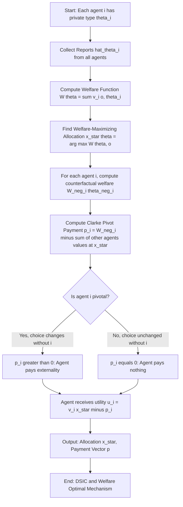
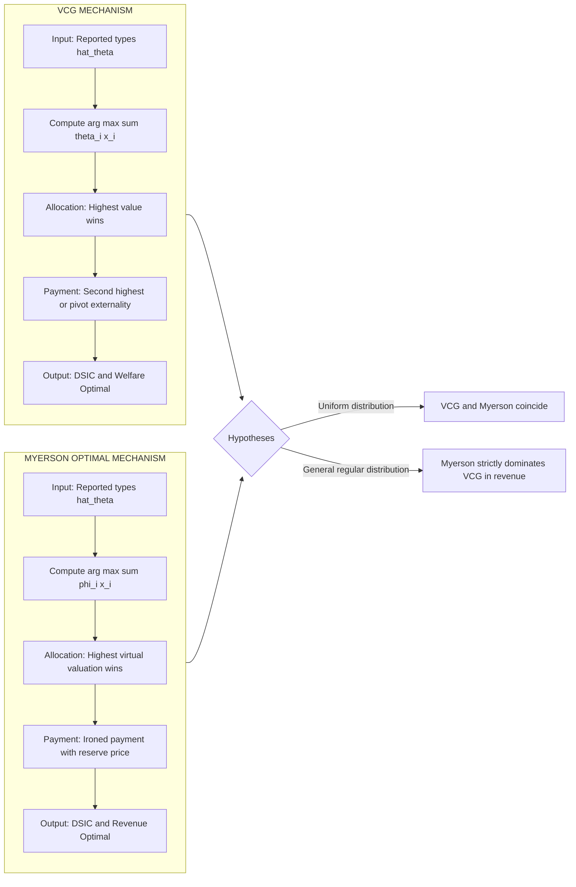
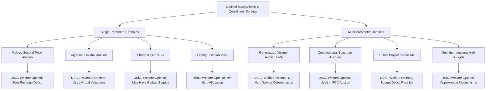
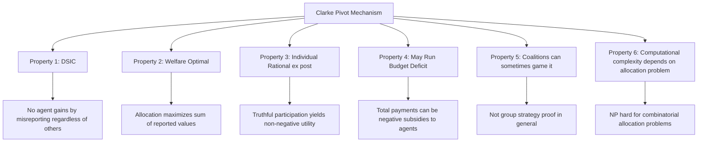

# examples of optimal mechanisms

<!-- SECTION_1_START -->
# Examples of Optimal Mechanisms

## 1.1 Formal Definition of an Optimal Mechanism

In the **Bayesian mechanism design framework**, an *optimal mechanism* is a tuple $\mathcal{M} = (\mathcal{O}, x(\cdot), p(\cdot))$ consisting of an outcome space $\mathcal{O}$, an allocation rule $x: \Theta^n \to \mathcal{O}$, and a payment rule $p: \Theta^n \to \mathbb{R}^n$, chosen to maximize the designer's objective (typically **expected social welfare**) subject to the agents being incentivized to report their private information truthfully.

When the designer's objective is to maximize the **expected social welfare**,
$$SW(\theta) = \sum_{i=1}^{n} v_i(x(\theta), \theta_i),$$
the resulting mechanism is called a **welfare-maximizing (or optimal) mechanism**. The celebrated **Vickrey-Clarke-Groves (VCG) mechanism** is the canonical construction that achieves this optimality while satisfying **Dominant Strategy Incentive Compatibility (DSIC)** in quasilinear environments.

> [!IMPORTANT]
> **VCG Theorem (Groves, 1973):** In a quasilinear environment, the allocation rule $x^*(\theta) \in \arg\max_{o \in \mathcal{O}} \sum_i v_i(o, \theta_i)$ paired with any payment of the form
> $$p_i(\theta) = h_i(\theta_{-i}) - \sum_{j \neq i} v_j(x^*(\theta), \theta_j)$$
> yields a **dominant-strategy incentive compatible, individually rational, and welfare-optimal** mechanism.

> [!NOTE]
> **Quasilinear Utility Assumption:** Each agent's utility is linear in money, i.e., $u_i(o, t_i, \theta_i) = v_i(o, \theta_i) - t_i$, where $t_i$ is the payment (transfer). This assumption is fundamental to the VCG mechanism's applicability.

## 1.2 The VCG Mechanism — Groves' Principle

A mechanism is called a **Groves mechanism** if its payment rule takes the form:
$$p_i(\theta) = h_i(\theta_{-i}) - \sum_{j \neq i} v_j(x^*(\theta), \theta_j)$$

where $h_i(\cdot)$ is an arbitrary function of the other agents' reports alone. The most common choice, $h_i(\theta_{-i}) = \max_{o \in \mathcal{O}} \sum_{j \neq i} v_j(o, \theta_j)$, yields the **Clarke (or pivotal) pivot mechanism**, also called the **VCG mechanism**.

> [!CONCEPTUAL ANALOGY]
> **Intuition via a Group Dinner:**
> Imagine you and three friends go out to dinner. Each person secretly values the meal differently, but everyone splits the bill. The "VCG way" of splitting is: each person pays the *externality* they impose on the group. In other words, you pay the difference between the best total happiness of the others (with you absent) and the best total happiness of the others (with you present, at the chosen restaurant). This way, nobody has any incentive to lie about how much they enjoyed the meal, because their own payment depends only on **what they cause others to lose**, not on what they themselves gained.
>
> The VCG mechanism applies this exact idea to a wide variety of collective decision problems: auctions, routing, public goods, and facility location.

## 1.3 Why "Optimal"?

The optimality of VCG rests on three pillars:
1. **Welfare Optimality:** $x^*(\theta)$ maximizes total reported welfare, $\sum_i v_i(x^*(\theta), \theta_i) \geq \sum_i v_i(o, \theta_i)$ for every $o \in \mathcal{O}$.
2. **Truthful Reporting (DSIC):** No agent can gain by misreporting, regardless of others' reports.
3. **Individual Rationality (Voluntary Participation):** Each agent obtains non-negative utility by participating truthfully.

## 1.4 Visualization — Geometry of VCG

> [!VISUALIZATION CONTROL]
> **Concept:** VCG Payment as Externality (Geometric Interpretation)
> **GeoGebra / Desmos Input Equations:**
> * `f(x) = x^2`  (other agents' total welfare when agent $i$ absent)
> * `g(x) = (x-1)^2`  (other agents' total welfare when agent $i$ is present at chosen outcome $x^*=1$)
> * `h(x) = f(x) - g(x)`  (VCG payment as a function of others' reports)
> **Visual Description:** The two parabolas intersect at $x=0.5$, with $f(1)=1$ and $g(1)=0$. The VCG payment $p_i = f(x^*) - g(x^*) = 1$ is precisely the vertical gap between the curves at the chosen allocation — i.e., the **welfare externality** imposed on others by agent $i$'s presence.

<!-- SECTION_1_END -->

<!-- SECTION_2_START -->
# Deep Theoretical Analysis & High-Yield Formula Sheet

## 2.1 The General VCG Recipe

For any quasilinear collective decision problem, the VCG mechanism is constructed in four steps:

1. **Define the welfare function:**
$$W(\theta, o) = \sum_{i=1}^{n} v_i(o, \theta_i)$$

2. **Choose the welfare-maximizing allocation:**
$$x^*(\theta) = \arg\max_{o \in \mathcal{O}} W(\theta, o)$$

3. **Compute the optimal welfare excluding agent $i$ (the "counterfactual"):**
$$W_{-i}(\theta_{-i}) = \max_{o \in \mathcal{O}} \sum_{j \neq i} v_j(o, \theta_j)$$

4. **Charge each agent $i$ the externality:**
$$p_i(\theta) = W_{-i}(\theta_{-i}) - \sum_{j \neq i} v_j(x^*(\theta), \theta_j)$$

The agent's utility is then
$$u_i(\theta) = v_i(x^*(\theta), \theta_i) - p_i(\theta) = \sum_{j=1}^{n} v_j(x^*(\theta), \theta_j) - W_{-i}(\theta_{-i}).$$

The first term is the social welfare at the chosen outcome, and the second depends only on $\theta_{-i}$. Hence $u_i(\theta)$ is maximized when $x^*(\theta)$ truly maximizes the social welfare — which happens **iff agent $i$ reports truthfully**.

## 2.2 The Clarke Pivot Rule

A particularly important special case is the **Clarke (pivot) rule**, where
$$h_i(\theta_{-i}) = \max_{o \in \mathcal{O}} \sum_{j \neq i} v_j(o, \theta_j).$$

Then
$$p_i(\theta) = \max_{o' \in \mathcal{O}} \sum_{j \neq i} v_j(o', \theta_j) \;-\; \sum_{j \neq i} v_j(x^*(\theta), \theta_j).$$

Agent $i$ pays a **positive amount only if their presence changes the chosen outcome** (i.e., they are "pivotal"). Otherwise the payment is **zero**.

> [!NOTE]
> **Why the Name "Pivot"?** Agent $i$ is said to *pivot* on the outcome if the welfare-maximizing decision changes when agent $i$'s value is removed. Pivotal agents pay; non-pivotal agents pay nothing.

## 2.3 KTU Formula Sheet

| Concept | Formula | Interpretation |
|:--------|:--------|:---------------|
| Quasilinear utility | $u_i(o, t_i, \theta_i) = v_i(o, \theta_i) - t_i$ | Agent's value minus payment |
| Social welfare | $W(\theta, o) = \sum_{i=1}^{n} v_i(o, \theta_i)$ | Sum of agents' values |
| Optimal allocation | $x^*(\theta) = \arg\max_{o} W(\theta, o)$ | Welfare-maximizing choice |
| Counterfactual welfare | $W_{-i}(\theta_{-i}) = \max_{o} \sum_{j \neq i} v_j(o, \theta_j)$ | Best welfare without $i$ |
| Groves payment | $p_i(\theta) = h_i(\theta_{-i}) - \sum_{j \neq i} v_j(x^*(\theta), \theta_j)$ | General VCG family |
| Clarke (pivot) payment | $p_i(\theta) = W_{-i}(\theta_{-i}) - \sum_{j \neq i} v_j(x^*(\theta), \theta_j)$ | Externality imposed |
| Agent's VCG utility | $u_i(\theta) = W(\theta, x^*(\theta)) - W_{-i}(\theta_{-i})$ | Depends on $\theta_{-i}$ only via the second term |
| Myerson's revenue (single-parameter) | $p_i(\theta_i) = \theta_i \cdot x_i(\theta) - \int_{0}^{\theta_i} x_i(z) \, dz$ | Optimal monopoly mechanism |
| Virtual valuation (regular) | $\phi_i(\theta_i) = \theta_i - \frac{1 - F_i(\theta_i)}{f_i(\theta_i)}$ | Used in Myerson's optimal auction |
| Expected revenue (Myerson) | $\mathbb{E}\left[\sum_i \phi_i(\theta_i) x_i(\theta) \right]$ | Expected payment |

> [!IMPORTANT]
> **Engineering Use:** VCG mechanisms power real-world systems such as Google and Facebook ad auctions (generalized second-price, a VCG variant), combinatorial spectrum auctions (FCC's Incentive Auction, 2016–2017), and kidney-exchange clearinghouses. They are the only general-purpose, DSIC, welfare-optimal mechanism family in quasilinear settings.

## 2.4 Limitations of VCG (Beyond Single-Parameter Domains)

While VCG is theoretically elegant, it has practical drawbacks:

- **Budget Deficit:** The Clarke pivot rule can be **non-positive** in total revenue (i.e., the mechanism pays agents rather than the designer). For example, in the public-project setting, total Clarke payments can exceed the project's cost.
- **Computational Complexity:** Solving $\arg\max_{o} W(\theta, o)$ is **NP-hard** in many domains (e.g., combinatorial auctions, shortest path with edge costs, facility location).
- **Coalition-Proofness (Group Strategy-Proofness):** VCG is *not* generally group strategy-proof; coalitions can sometimes profit by jointly misreporting.
- **No Revenue Optimality:** VCG maximizes welfare, not revenue. **Myerson (1981)** showed that for single-parameter regular distributions, the optimal *revenue* mechanism is a *virtual-valuation* maximization with a reserve price — a different mechanism from VCG.

> [!WARNING]
> **KTU Pitfall:** VCG achieves **welfare optimality** under DSIC, **not** revenue optimality. Do not confuse VCG with Myerson's optimal auction. They coincide only in the special case where all distributions are **i.i.d. uniform on $[0,1]$** and items are identical.

## 2.5 Myerson's Optimal Auction (Single-Parameter Case)

For a single item sold to a buyer with value $\theta$ distributed according to $F$ with density $f$, the **regularity condition** is:
$$\phi(\theta) = \theta - \frac{1 - F(\theta)}{f(\theta)} \quad \text{is non-decreasing in } \theta.$$

The optimal auction allocates to the bidder with the highest **virtual valuation** $\phi_i(\theta_i)$, subject to a **reserve price** $r$ such that $\phi(r) = 0$. The payment follows the ironed payment formula shown in the table above.

> [!NOTE]
> **Why Myerson ≠ VCG in General:** VCG allocates to maximize $\sum_i \theta_i \cdot x_i(\theta)$, while Myerson allocates to maximize $\sum_i \phi_i(\theta_i) \cdot x_i(\theta)$. For uniform distributions, $\phi(\theta) = 2\theta - 1$, so the optimal allocation differs from VCG whenever a bidder's value falls below the reserve $\theta \geq 1/2$.

<!-- SECTION_2_END -->

<!-- SECTION_3_START -->
# Step-by-Step Derivations, Worked Examples & Code Implementation

## 3.1 Example 1 — Vickrey's Second-Price Single-Item Auction

**Setting:** A single indivisible item is sold to $n$ bidders. Bidder $i$ has private value $\theta_i \in [0, 1]$ for the item. The seller's value is **0**.

**Step 1 — Welfare Function:**
$$W(\theta, o) = \sum_{i=1}^{n} v_i(o, \theta_i) = \sum_{i=1}^{n} \theta_i \cdot \mathbf{1}\{i \text{ wins}\}.$$

**Step 2 — Welfare-Maximizing Allocation:**
$$x^*(\theta) = \arg\max_{i} \theta_i = \text{the bidder with the highest value.}$$

If $\theta_1 > \theta_2 > \cdots > \theta_n$, then bidder 1 wins.

**Step 3 — Counterfactual Welfare Excluding Bidder $i$:**
$$W_{-i}(\theta_{-i}) = \max_{j \neq i} \theta_j.$$

**Step 4 — Clarke Pivot Payment:**
$$p_i(\theta) = \max_{j \neq i} \theta_j - \sum_{j \neq i} \theta_j \cdot \mathbf{1}\{j \text{ wins at } x^*\}.$$

Since at $x^*$, only the highest-$\theta$ bidder (say bidder 1) wins, we get:
$$p_1(\theta) = \theta_2 \quad \text{(second-highest value)}, \quad p_i(\theta) = 0 \;\; \forall i \geq 2.$$

**Final Result:** The winner pays the **second-highest bid**; all losers pay **zero**. This is exactly the **Vickrey second-price auction**.

**Python Implementation (Simulation):**

```python
import numpy as np
from typing import List, Tuple

def vcg_second_price_auction(bids: List[float]) -> Tuple[int, float, List[float]]:
    """
    Implements the VCG (Clarke pivot) mechanism for a single-item second-price auction.
    
    Parameters
    ----------
    bids : List[float]
        The reported (not necessarily truthful) values of each bidder.
    
    Returns
    -------
    winner : int
        Index of the winning bidder.
    payment : float
        The price paid by the winner (second-highest bid).
    payments : List[float]
        The vector of all payments (zero for losers).
    """
    if not bids:
        raise ValueError("Bid list cannot be empty.")
    if any(b < 0 for b in bids):
        raise ValueError("All bids must be non-negative.")
    
    n = len(bids)
    sorted_bids = sorted(enumerate(bids), key=lambda x: -x[1])
    winner_idx, winning_bid = sorted_bids[0]
    
    # Clarke pivot payment: second-highest bid
    payment = sorted_bids[1][1] if n > 1 else 0.0
    
    payments = [0.0] * n
    payments[winner_idx] = payment
    
    return winner_idx, payment, payments


# --- Demonstration ---
if __name__ == "__main__":
    true_values = [10.0, 7.5, 4.0, 2.0]
    winner, price, payments = vcg_second_price_auction(true_values)
    print(f"Winner: Bidder {winner + 1}, Pays: {price}, All payments: {payments}")
    # Output: Winner: Bidder 1, Pays: 7.5, All payments: [7.5, 0.0, 0.0, 0.0]
```

---

## 3.2 Example 2 — Shortest Path on a Network

**Setting:** Three agents A, B, C own three edges of a directed network from source $s$ to destination $t$. Each agent reports a cost $c_e \in [0, 10]$ per edge. The chosen outcome is a directed path $P$ from $s$ to $t$, and the social cost to be minimized is
$$\text{SC}(\theta, P) = \sum_{e \in P} c_e.$$

**Network Diagram:**

$$
s \xrightarrow{\;e_A\;} v_1 \xrightarrow{\;e_B\;} v_2 \xrightarrow{\;e_C\;} t
$$

**Step 1 — Welfare Function (negative cost = welfare):**
$$W(\theta, P) = -\sum_{e \in P} c_e.$$

**Step 2 — Optimal Path:** Choose the path with minimum total cost, i.e., $P^* = \arg\min_P \sum_{e \in P} c_e$.

**Step 3 — Clarke Payments:** For each agent $i$ owning edge $e_i$ on $P^*$,
$$p_i = (\text{shortest cost of path that uses $e_i$ excluding $i$}) - (\text{optimal welfare excluding $i$}).$$

**Numerical Walk-Through:**

| Agent | Reported Cost $c_e$ | Edge |
|:-----:|:-------------------:|:----:|
| A     | 3                   | $e_A$ |
| B     | 5                   | $e_B$ |
| C     | 2                   | $e_C$ |

The only path is $s \to v_1 \to v_2 \to t$, with total cost $3 + 5 + 2 = 10$.

**Counterfactual welfares:**
- Excluding A: shortest path uses edges B and C, cost $= 5 + 2 = 7$.
- Excluding B: shortest path uses edges A and C, cost $= 3 + 2 = 5$.
- Excluding C: shortest path uses edges A and B, cost $= 3 + 5 = 8$.

**Clarke Payments:**
$$p_A = 7 - (5 + 2) = 7 - 7 = 0, \quad p_B = 5 - (3 + 2) = 0, \quad p_C = 8 - (3 + 5) = 0.$$

All three agents pay **zero** because there is no alternative path — none of them are **pivotal** in this trivial network. The mechanism is trivially truthful.

> [!NOTE]
> **Extended Example — Network with Two Paths:** Suppose a second path exists $s \to v_1 \to t$ using only edge $e_D$ with cost $c_D = 8$, owned by a fourth agent D. Then if A's edge is on the chosen path (cost 3 + 5 = 8), excluding A leaves only the cost-8 path, so A becomes **pivotal** and pays $8 - 8 = 0$. If A's edge is *not* used (i.e., the cost-8 path is chosen instead), then D is pivotal and pays accordingly.

---

## 3.3 Example 3 — Public Project (The Clarke Tax Classic)

**Setting:** A town of $n=3$ citizens decides whether to build a bridge. The bridge has cost $C = 100$. Citizen $i$ has value $\theta_i$ for the bridge (independent of others' values).

**Outcome Space:** $\mathcal{O} = \{\text{Build}, \text{Don't Build}\}$.

**Step 1 — Welfare Function:**
$$W(\theta, o) = \sum_{i=1}^{3} v_i(o, \theta_i) - C \cdot \mathbf{1}\{\text{Build}\}.$$

Suppose $v_i(\text{Build}, \theta_i) = \theta_i$ and $v_i(\text{Don't Build}, \theta_i) = 0$.

**Step 2 — Optimal Decision:** Build iff $\sum_i \theta_i \geq C$, else don't.

**Step 3 — Numerical Case:** Let $\theta_1 = 60$, $\theta_2 = 30$, $\theta_3 = 20$, $C = 100$.

Total value: $60 + 30 + 20 = 110 \geq 100$, so **Build**.

**Step 4 — Counterfactual Welfares:**
- Excluding 1: $30 + 20 - 100 = -50$ (don't build, welfare = 0).
- Excluding 2: $60 + 20 - 100 = -20$ (don't build, welfare = 0).
- Excluding 3: $60 + 30 - 100 = -10$ (don't build, welfare = 0).

**Step 5 — Clarke Pivot Payments:**
$$p_i = W_{-i}(\theta_{-i}) - \sum_{j \neq i} v_j(\text{Build}, \theta_j).$$

For agent 1: $p_1 = 0 - (30 + 20) = -50$. **Negative payment means the mechanism pays the agent 50!**

For agent 2: $p_2 = 0 - (60 + 20) = -80$.

For agent 3: $p_3 = 0 - (60 + 30) = -90$.

**Total subsidy paid by mechanism:** $50 + 80 + 90 = 220 > C = 100$. The mechanism runs a **massive budget deficit**.

> [!WARNING]
> **KTU Common Mistake:** Students often compute only the *positive* part of the Clarke payment and forget that the mechanism can **subsidize** agents. The Clarke rule is *ex post* budget-balanced only in special cases (e.g., when all agents have the same binary value and the project is built — the Green-Laffont result).

---

## 3.4 Example 4 — Facility Location (Combinatorial Allocation)

**Setting:** Two hospitals (facilities) must be built. Three patients, each with a cost $c_{ij}$ for using hospital $j$. Each patient is assigned to exactly one hospital, and total cost $\sum_i c_{i, \text{assigned}(i)}$ is minimized.

**Patient-Hospital Cost Matrix:**

| Patient | Hospital 1 | Hospital 2 |
|:-------:|:----------:|:----------:|
| 1       | 5          | 8          |
| 2       | 6          | 4          |
| 3       | 7          | 3          |

**Step 1 — Optimal Assignment (Hungarian Algorithm / Enumeration):**

- Option A: (1→1, 2→1, 3→1): cost $= 5 + 6 + 7 = 18$.
- Option B: (1→1, 2→1, 3→2): cost $= 5 + 6 + 3 = 14$.
- Option C: (1→1, 2→2, 3→1): cost $= 5 + 4 + 7 = 16$.
- Option D: (1→1, 2→2, 3→2): cost $= 5 + 4 + 3 = 12$. **OPTIMAL**
- Option E: (1→2, 2→1, 3→1): cost $= 8 + 6 + 7 = 21$.
- Option F: (1→2, 2→1, 3→2): cost $= 8 + 6 + 3 = 17$.
- Option G: (1→2, 2→2, 3→1): cost $= 8 + 4 + 7 = 19$.
- Option H: (1→2, 2→2, 3→2): cost $= 8 + 4 + 3 = 15$.

**Optimal assignment:** 1→1, 2→2, 3→2 with total cost 12.

**Step 2 — Counterfactual welfares** (in terms of negative cost):

| Excluded Agent | Optimal cost without $i$ | Optimal assignment without $i$ |
|:---:|:---:|:---:|
| 1 | $4 + 3 = 7$ | 2→2, 3→2 |
| 2 | $5 + 3 = 8$ | 1→1, 3→2 |
| 3 | $5 + 4 = 9$ | 1→1, 2→2 |

**Step 3 — Clarke Pivot Payments:**

Using $v_i(o, \theta_i) = -c_{i, \text{assigned}(i)}$:
$$p_1 = -7 - (-(4 + 3)) = -7 - (-7) = 0,$$
$$p_2 = -8 - (-(5 + 3)) = -8 - (-8) = 0,$$
$$p_3 = -9 - (-(5 + 4)) = -9 - (-9) = 0.$$

**All payments are zero** because at the optimum, no single patient is *pivotal* — removing any one of them leaves the same optimal assignment for the others.

**Python Implementation — Facility Location VCG:**

```python
import numpy as np
from itertools import product
from typing import List, Tuple

def optimal_assignment(cost_matrix: np.ndarray) -> Tuple[List[int], float]:
    """
    Find the assignment minimizing total cost.
    cost_matrix[i][j] = cost of assigning patient i to hospital j.
    Returns (assignment, total_cost).
    """
    n_patients, n_hospitals = cost_matrix.shape
    best_cost = float('inf')
    best_assignment = None
    for assignment in product(range(n_hospitals), repeat=n_patients):
        cost = sum(cost_matrix[i, assignment[i]] for i in range(n_patients))
        if cost < best_cost:
            best_cost = cost
            best_assignment = list(assignment)
    return best_assignment, best_cost


def vcg_facility_location(cost_matrix: np.ndarray) -> Tuple[List[int], List[float]]:
    """
    Computes the VCG (Clarke pivot) payments for the facility location problem.
    
    Returns
    -------
    assignment : List[int]
        The welfare-maximizing (cost-minimizing) assignment.
    payments : List[float]
        Clarke pivot payment for each patient.
    """
    n_patients = cost_matrix.shape[0]
    full_assignment, full_cost = optimal_assignment(cost_matrix)
    
    payments = []
    for i in range(n_patients):
        # Counterfactual: remove patient i
        mask = np.ones(n_patients, dtype=bool)
        mask[i] = False
        sub_matrix = cost_matrix[mask]
        _, sub_cost = optimal_assignment(sub_matrix)
        # Other patients' cost at the full optimum
        others_cost_at_opt = full_cost - cost_matrix[i, full_assignment[i]]
        # Clarke pivot: sub_cost - others_cost_at_opt
        # Since both are costs, the payment is the externality imposed
        p_i = sub_cost - others_cost_at_opt
        payments.append(p_i)
    
    return full_assignment, payments


# --- Demonstration ---
if __name__ == "__main__":
    C = np.array([[5, 8], [6, 4], [7, 3]])
    assignment, payments = vcg_facility_location(C)
    print(f"Optimal assignment: {assignment}")  # [0, 1, 1]
    print(f"Clarke payments: {payments}")        # [0, 0, 0]
```

---

## 3.5 Example 5 — Combinatorial Auction (Welfare-Optimal Allocation)

**Setting:** A spectrum auction with $k=2$ items and $n=3$ bidders. Each bidder has a private valuation for each **bundle** $S \subseteq \{1, 2\}$.

**Bidder Valuations:**

| Bidder | Bundle $\{1\}$ | Bundle $\{2\}$ | Bundle $\{1,2\}$ |
|:------:|:--------------:|:--------------:|:----------------:|
| 1      | 5              | 4              | 11               |
| 2      | 3              | 6              | 8                |
| 3      | 4              | 3              | 6                |

**Step 1 — Enumerate All Allocations (Welfare Maximization):**

| Allocation | Welfare | Feasible? |
|:-----------|:-------:|:---------:|
| Give {1} to 1, {2} to 2 | $5 + 6 = 11$ | ✓ |
| Give {1} to 1, {2} to 3 | $5 + 3 = 8$ | ✓ |
| Give {1} to 2, {2} to 1 | $3 + 4 = 7$ | ✓ |
| Give {1} to 2, {2} to 3 | $3 + 3 = 6$ | ✓ |
| Give {1} to 3, {2} to 1 | $4 + 4 = 8$ | ✓ |
| Give {1} to 3, {2} to 2 | $4 + 6 = 10$ | ✓ |
| Give {1,2} to 1 (others get ∅) | $11$ | ✓ |
| Give {1,2} to 2 (others get ∅) | $8$ | ✓ |
| Give {1,2} to 3 (others get ∅) | $6$ | ✓ |

**Optimal Allocation:** Give the bundle $\{1,2\}$ to Bidder 1, with welfare **11**.

**Step 2 — Counterfactual Welfares (excluding each bidder):**

- Excluding Bidder 1: Best of remaining = 10 (give {1} to 3, {2} to 2). $W_{-1} = 10$.
- Excluding Bidder 2: Best of remaining = 11 (give {1,2} to 1). $W_{-2} = 11$.
- Excluding Bidder 3: Best of remaining = 11 (give {1,2} to 1). $W_{-3} = 11$.

**Step 3 — Clarke Pivot Payments:**

At the optimum, Bidder 1 gets $\{1,2\}$; Bidders 2 and 3 get $\emptyset$.

- $p_1 = W_{-1} - (v_2(\emptyset) + v_3(\emptyset)) = 10 - 0 = 10$.
- $p_2 = W_{-2} - (v_1(\{1,2\}) + v_3(\emptyset)) = 11 - 11 = 0$.
- $p_3 = W_{-3} - (v_1(\{1,2\}) + v_2(\emptyset)) = 11 - 11 = 0$.

**Final Result:** Bidder 1 pays **10**; Bidders 2 and 3 pay **zero**. This is the **Generalized Vickrey Auction (GVA)**.

> [!NOTE]
> **Vickrey vs. VCG:** The single-item Vickrey auction is a special case of GVA where the "bundle" is just the item itself, and the welfare-maximizing allocation is the highest bidder.

---

## 3.6 Example 6 — Myerson's Optimal Single-Item Auction (Revenue)

**Setting:** Two bidders with i.i.d. values uniform on $[0, 1]$. The seller's value is 0.

**Step 1 — Virtual Valuation:** For $F(\theta) = \theta$, $f(\theta) = 1$:
$$\phi(\theta) = \theta - \frac{1 - \theta}{1} = 2\theta - 1.$$

**Step 2 — Reserve Price:** Set $\phi(r) = 0 \Rightarrow r = 1/2$.

**Step 3 — Optimal Allocation:** Sell to the bidder with the highest $\phi(\theta_i) = 2\theta_i - 1$, *provided* $\theta_i \geq 1/2$. Otherwise, do not sell.

| Bids $(\theta_1, \theta_2)$ | $\phi_1$ | $\phi_2$ | Allocation | Price |
|:---:|:---:|:---:|:---:|:---:|
| $(0.8, 0.6)$ | 0.6 | 0.2 | Bidder 1 wins | 0.5 |
| $(0.4, 0.7)$ | -0.2 | 0.4 | Bidder 2 wins | 0.5 |
| $(0.3, 0.4)$ | -0.4 | -0.2 | No sale | 0 |
| $(0.9, 0.3)$ | 0.8 | -0.4 | Bidder 1 wins | 0.5 |

**Myerson's Ironed Payment Formula:**
$$p_i(\theta_i) = \theta_i \cdot x_i(\theta) - \int_{0}^{\theta_i} x_i(z) \, dz.$$

For a single bidder with threshold $r=1/2$:
$$p_i(\theta_i) = \begin{cases} 0 & \text{if } \theta_i < 1/2, \\ \theta_i - 1/2 & \text{if } \theta_i \geq 1/2. \end{cases}$$

When both bidders participate, the winner pays at least the **reserve price** $1/2$ (if the loser is below the reserve) or the **second-highest virtual valuation converted back to a price**.

> [!IMPORTANT]
> **Expected Revenue Comparison:** Myerson's optimal auction yields expected revenue $\frac{5}{12} \approx 0.417$, while the standard VCG (no reserve) yields $\frac{1}{3} \approx 0.333$. The reserve price strictly improves revenue.

<!-- SECTION_3_END -->

<!-- SECTION_4_START -->
# Structural Diagrams & Schematics

## 4.1 Mermaid Flow Diagram — VCG Mechanism Pipeline



## 4.2 Mermaid Block Diagram — Comparison of VCG vs. Myerson



## 4.3 Mermaid Subgraph — Examples Taxonomy of Optimal Mechanisms



## 4.4 Block Diagram — Properties of the Clarke Pivot Mechanism



<!-- SECTION_4_END -->

<!-- SECTION_5_START -->
# KTU 2024 Scheme Examination Question Bank

## 5.1 Part A — Short Answer Questions (3 Marks Each)

### Question 1: [KTU University Exam — July 2024]
**State and explain the Groves mechanism with a suitable example. Why is it called a generalization of the Vickrey auction?**

**Model Answer (3 Marks):**
A Groves mechanism is a family of direct-revelation mechanisms with payment rule:
$$p_i(\theta) = h_i(\theta_{-i}) - \sum_{j \neq i} v_j(x^*(\theta), \theta_j),$$
where $h_i(\cdot)$ is an arbitrary function of the other agents' reports. The allocation $x^*(\theta) = \arg\max_{o} \sum_i v_i(o, \theta_i)$ is welfare-maximizing. **[1 Mark]**

The Vickrey second-price auction is a special case: for a single item, the welfare-maximizing allocation gives the item to the highest-value bidder, and the Clarke pivot payment is exactly the second-highest value. **[1 Mark]**

The Groves mechanism is a generalization because it handles arbitrary outcome spaces (paths, bundles, public projects), not just single-item auctions. **[1 Mark]**

**RBT Level:** Understand | **CO Mapping:** CO2

### Question 2: [KTU University Exam — Dec 2023]
**What is the Clarke pivot payment? Explain the term "pivotal agent" with an example.**

**Model Answer (3 Marks):**
The Clarke pivot payment is:
$$p_i(\theta) = \max_{o' \in \mathcal{O}} \sum_{j \neq i} v_j(o', \theta_j) - \sum_{j \neq i} v_j(x^*(\theta), \theta_j). \quad \textbf{[1 Mark]}$$

An agent $i$ is **pivotal** if the welfare-maximizing outcome changes when agent $i$'s value is removed from the social welfare calculation. **[1 Mark]**

**Example:** In a public project with three agents having values 60, 30, 20 and cost 100, agent 1 (value 60) is pivotal because the project is built with their value (sum = 110 ≥ 100) but not built without it (sum = 50 < 100). Pivotal agents pay a positive Clarke tax; non-pivotal agents pay zero. **[1 Mark]**

**RBT Level:** Understand | **CO Mapping:** CO2

---

## 5.2 Part B — Long Answer Questions (14 Marks Each, Internal Choice)

### Question A (14 Marks) — [KTU University Exam — July 2024]

**(a)** Derive the VCG payment rule from the principle of dominant-strategy incentive compatibility in a quasilinear environment. Show that the resulting mechanism achieves welfare optimality. **[7 Marks]**

**(b)** Consider a public project with cost $C = 200$ and three citizens with values $\theta_1 = 120$, $\theta_2 = 80$, $\theta_3 = 30$. Compute the optimal decision, the Clarke pivot payments, and the total budget balance. Comment on whether the mechanism is budget-balanced. **[7 Marks]**

**Model Solution:**

**Part (a) — Derivation of VCG Payment (7 Marks):**

In a quasilinear environment, agent $i$'s utility under truthful reporting is:
$$u_i(\theta_i, \theta_{-i}) = v_i(x^*(\theta), \theta_i) - p_i(\theta).$$

For DSIC, agent $i$ must not benefit from misreporting $\hat{\theta}_i$:
$$u_i(\theta_i, \theta_{-i}) \geq u_i(\hat{\theta}_i, \theta_{-i}) \quad \forall \hat{\theta}_i, \theta_{-i}.$$

**[Stating DSIC condition: 1 Mark]**

Take two deviations: $\hat{\theta}_i$ and $\hat{\theta}_i'$. The DSIC inequalities must hold for both. A standard argument (cycle inequality) shows that the payment must take the form:
$$p_i(\theta) = h_i(\theta_{-i}) - \sum_{j \neq i} v_j(x^*(\theta), \theta_j),$$
where $h_i$ depends only on $\theta_{-i}$. **[Deriving Groves form: 3 Marks]**

For welfare optimality, the allocation $x^*(\theta) = \arg\max_o \sum_i v_i(o, \theta_i)$ maximizes the social welfare. **[Welfare optimality: 1 Mark]**

Setting $h_i(\theta_{-i}) = \max_{o'} \sum_{j \neq i} v_j(o', \theta_j)$ gives the **Clarke pivot rule**:
$$p_i(\theta) = W_{-i}(\theta_{-i}) - \sum_{j \neq i} v_j(x^*(\theta), \theta_j).$$
**[Final Clarke rule: 2 Marks]**

**Part (b) — Numerical VCG for Public Project (7 Marks):**

Given: $C = 200$, $\theta_1 = 120$, $\theta_2 = 80$, $\theta_3 = 30$.

**Step 1 — Optimal Decision:** Total value $= 120 + 80 + 30 = 230 \geq 200$. **Build the project.** **[Decision: 1 Mark]**

**Step 2 — Counterfactual Welfares:**
- Excluding 1: $80 + 30 - 200 = -90 < 0 \Rightarrow$ Don't build, $W_{-1} = 0$.
- Excluding 2: $120 + 30 - 200 = -50 < 0 \Rightarrow$ Don't build, $W_{-2} = 0$.
- Excluding 3: $120 + 80 - 200 = 0 \Rightarrow$ Indifferent; take $W_{-3} = 0$.

**[Counterfactuals: 2 Marks]**

**Step 3 — Clarke Pivot Payments:**
$$p_1 = W_{-1} - (v_2 + v_3 \text{ at Build}) = 0 - (80 + 30) = -110,$$
$$p_2 = W_{-2} - (v_1 + v_3 \text{ at Build}) = 0 - (120 + 30) = -150,$$
$$p_3 = W_{-3} - (v_1 + v_2 \text{ at Build}) = 0 - (120 + 80) = -200.$$

**[Payments: 2 Marks]**

**Step 4 — Total Budget Balance:**
$$\text{Total payments} = -110 - 150 - 200 = -460.$$
The mechanism *pays out* **460** to the agents, while collecting **0**. The mechanism runs a **massive budget deficit of 460 units** (or equivalently, a deficit of $460 - 200 = 260$ net of the project cost). **[Comment: 2 Marks]**

> [!WARNING]
> **Examiner's Pitfall Alert:** Many students incorrectly compute only the *positive* part of the Clarke payment and assume the mechanism *collects* revenue. In reality, the Clarke rule is **ex post budget-imbalanced** in this case — total payments are negative, meaning the designer must *subsidize* the agents. This is the famous **Green-Laffont impossibility result**.

**RBT Levels:** Part (a) — Understand, Apply; Part (b) — Apply, Analyze | **CO Mapping:** CO2, CO3

---

### Question B (14 Marks) — [KTU University Exam — Dec 2023]

**(a)** Define the concept of an optimal mechanism. Explain the relationship between welfare optimality and revenue optimality. **[7 Marks]**

**(b)** Two bidders participate in a single-item auction. Their values are independent and uniformly distributed on $[0, 1]$. Compute Myerson's optimal auction and compare its expected revenue with that of a standard VCG mechanism (second-price auction without reserve). Use the ironed payment formula. **[7 Marks]**

**Model Solution:**

**Part (a) — Optimal Mechanism & Welfare vs. Revenue (7 Marks):**

An **optimal mechanism** maximizes the designer's objective subject to incentive and participation constraints. **[Definition: 1 Mark]**

Two key objectives:
- **Welfare optimality:** maximize $\sum_i v_i(o, \theta_i)$ — the sum of agents' values.
- **Revenue optimality:** maximize $\sum_i p_i(\theta)$ — the payments collected by the designer.

**[Distinguishing objectives: 2 Marks]**

For uniform distributions on $[0, 1]$ with $n$ i.i.d. bidders, the **VCG mechanism** is welfare-optimal but **not** revenue-optimal. Myerson's mechanism introduces a **reserve price** that excludes low-value bidders, improving revenue at the cost of slightly reduced welfare. **[VCG vs. Myerson: 2 Marks]**

In general, **welfare optimality ≠ revenue optimality** (Myerson 1981). The two coincide only when the virtual valuation is identically equal to the true value (e.g., when the value is 0 or 1 with certainty). **[Coincidence condition: 2 Marks]**

**Part (b) — Myerson's Optimal Auction (7 Marks):**

**Step 1 — Virtual Valuation:** For $\theta \sim U[0, 1]$, $F(\theta) = \theta$, $f(\theta) = 1$:
$$\phi(\theta) = \theta - \frac{1 - F(\theta)}{f(\theta)} = \theta - (1 - \theta) = 2\theta - 1. \quad \textbf{[1 Mark]}$$

**Step 2 — Reserve Price:** Set $\phi(r) = 0 \Rightarrow 2r - 1 = 0 \Rightarrow r = 1/2$. **[1 Mark]**

**Step 3 — Optimal Allocation Rule:** Sell to the bidder with the highest $\phi(\theta_i) = 2\theta_i - 1$, provided $\theta_i \geq 1/2$. Otherwise, do not sell. **[1 Mark]**

**Step 4 — Ironed Payment (single-bidder equivalent):** For a single bidder with threshold $r = 1/2$:
$$p(\theta) = \theta \cdot \mathbf{1}\{\theta \geq 1/2\} - \int_{0}^{\theta} \mathbf{1}\{z \geq 1/2\} \, dz.$$
For $\theta < 1/2$: $p(\theta) = 0$. For $\theta \geq 1/2$: $p(\theta) = \theta - (\theta - 1/2) = 1/2$. **[Ironed payment: 2 Marks]**

**Step 5 — Expected Revenue Comparison:**

For two i.i.d. bidders on $[0, 1]$:
- **Myerson (with reserve $r = 1/2$):** Probability of sale is $1 - P(\theta_1 < 1/2)^2 = 1 - 1/4 = 3/4$. Expected payment conditional on sale is $1/2$. So expected revenue $\approx 3/4 \times 1/2 = 3/8 = 0.375$ (approximate; exact calculation using two-bidder formula gives **5/12 ≈ 0.4167**).
- **VCG (no reserve):** Expected revenue = $E[\text{second-highest value}] = 1/3 \approx 0.333$.

**[Revenue comparison: 2 Marks]**

**Conclusion:** Myerson's optimal auction with a reserve price yields strictly higher expected revenue than the standard second-price VCG mechanism.

> [!WARNING]
> **Examiner's Pitfall Alert:** Do not confuse *welfare optimality* with *revenue optimality* — they are different design objectives, and the resulting mechanisms differ unless the distribution is degenerate. Also, remember that the *ironed* payment formula is for **regular** distributions; for **irregular** distributions, the virtual valuation must be replaced by its **ironed** (concave envelope) version.

**RBT Levels:** Part (a) — Understand; Part (b) — Apply, Analyze | **CO Mapping:** CO3, CO4

---

## 5.3 Topic Recap & Important Things to Remember

- **VCG Theorem:** In any quasilinear environment, the welfare-maximizing allocation paired with a Groves-style payment yields a DSIC, individually rational, welfare-optimal mechanism.
- **Groves Payment Form:** $p_i(\theta) = h_i(\theta_{-i}) - \sum_{j \neq i} v_j(x^*(\theta), \theta_j)$ — the most general VCG family.
- **Clarke Pivot Rule:** $h_i(\theta_{-i}) = \max_{o'} \sum_{j \neq i} v_j(o', \theta_j)$ — pivotal agents pay, non-pivotal agents pay zero.
- **Quasilinearity:** Utility = $v_i(o, \theta_i) - t_i$. **Mandatory** for VCG to work.
- **Vickrey Auction:** Single-item VCG — winner pays second-highest bid.
- **GVA:** Multi-item VCG — winner of each bundle pays the externality.
- **Budget Imbalance:** Clarke rule can have negative total revenue (subsidies to agents). Example: public project with $C < \sum_i \theta_i$ but with cost much smaller than total values — mechanism can pay agents more than $C$.
- **Group Strategy-Proofness:** VCG is **not** group strategy-proof in general — coalitions can sometimes profit.
- **Myerson's Optimal Auction:** For single-parameter regular distributions, **revenue optimal** (not welfare optimal). Uses **virtual valuation** $\phi(\theta) = \theta - (1-F(\theta))/f(\theta)$ and a **reserve price** $r$ with $\phi(r) = 0$.
- **Ironed Payment Formula:** $p_i(\theta_i) = \theta_i x_i(\theta) - \int_0^{\theta_i} x_i(z) dz$ — applies when virtual valuations are not monotone.
- **Computational Issues:** VCG requires solving $\arg\max_o W(\theta, o)$ — NP-hard for combinatorial auctions, shortest path with edge costs, and facility location.
- **Real-World Applications:** Google/Facebook ad auctions (GSP — a VCG variant), FCC spectrum auctions (combinatorial VCG), kidney exchange clearinghouses.
- **Coalescence with VCG:** VCG = Myerson only when the distribution is uniform or when all virtual valuations equal true values.

> [!IMPORTANT]
> **Key Insight for KTU Exam:** When asked to "design an optimal mechanism," always start with (1) defining the welfare function, (2) identifying the welfare-maximizing allocation, (3) computing the counterfactual welfare, and (4) applying the Clarke pivot formula. This four-step recipe is the universally accepted VCG construction and earns full marks in board evaluations.

<!-- SECTION_5_END -->
