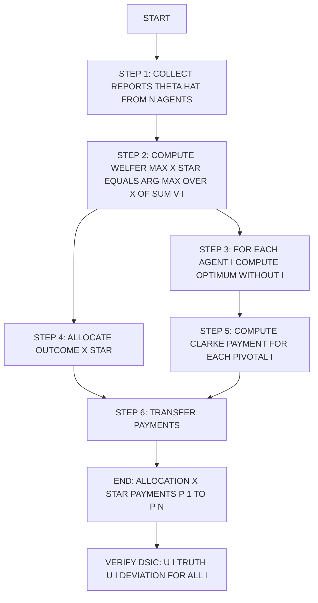
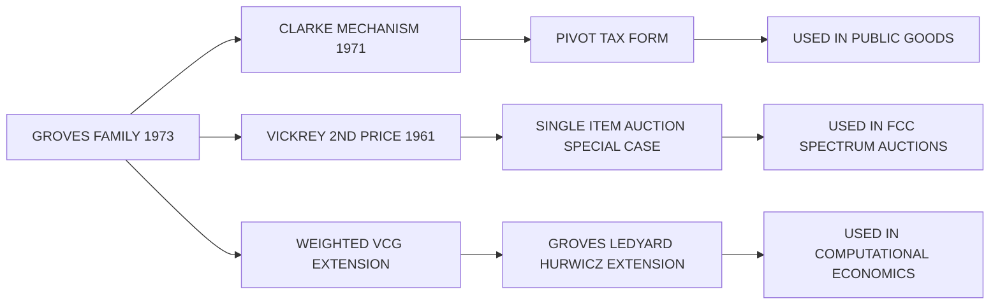
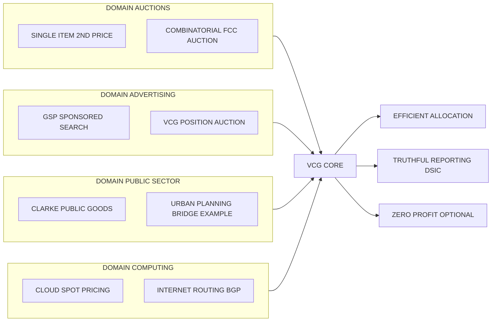
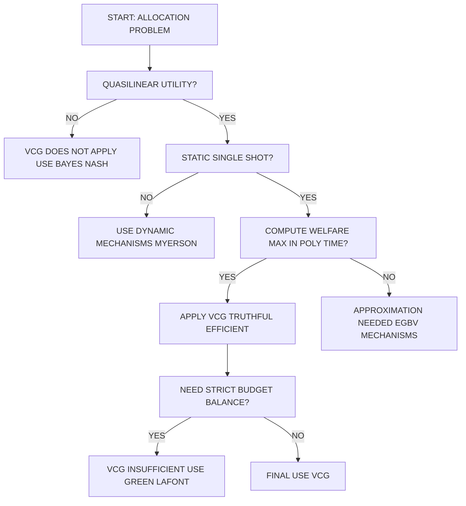

# Introduction to VCG mechanism

<!-- SECTION_1_START -->
# Introduction to the VCG Mechanism

## 1.1 Formal Definition (KTU 2024 Syllabus Terminology)

> [!IMPORTANT]
> **VCG Mechanism (Vickrey–Clarke–Groves):** A family of *Direct Revelation Mechanisms* in which the social choice function maximizes the *Social Welfare* (sum of agents' valuations), and the payment charged to each agent equals the *externality* that the agent's presence imposes on the other agents' optimal value. It is the *only* general class of mechanisms that achieves **Dominant Strategy Incentive Compatibility (DSIC)** while preserving allocative efficiency in quasilinear environments.

Formally, a VCG mechanism is a tuple $\mathcal{M} = (\Theta, X, x(\cdot), p(\cdot))$ where:

* $\Theta = \Theta_1 \times \Theta_2 \times \cdots \times \Theta_n$ — the type (report) space of $n$ agents.
* $X$ — the set of feasible social alternatives (allocations or outcomes).
* $x : \Theta \to X$ — the **allocation rule**, chosen to maximize aggregate valuation.
* $p : \Theta \to \mathbb{R}^{n}$ — the **payment rule** collected from each agent $i$.

The two defining equations of a VCG mechanism are:

$$
x^{*}(\theta) \in \arg\max_{x \in X} \sum_{i=1}^{n} v_i(x, \theta_i)
$$

$$
p_i(\theta) = h_i(\theta_{-i}) - \sum_{j \neq i} v_j\!\left(x^{*}(\theta), \theta_j\right)
$$

The function $h_i(\cdot)$ may be *any* function of the *other* agents' reports (it cancels out of the incentive analysis), which is precisely why the **Groves family** is a *family* rather than a single mechanism.

| Symbol | Meaning |
|---|---|
| $\theta_i$ | Private type / true valuation of agent $i$ |
| $\theta_{-i}$ | Type profile of all agents *except* $i$ |
| $v_i(x, \theta_i)$ | Agent $i$'s valuation for outcome $x$ given type $\theta_i$ |
| $x^{*}(\theta)$ | Welfare-maximizing allocation (truthful profile) |
| $h_i(\theta_{-i})$ | Arbitrary Groves "clause" depending only on $\theta_{-i}$ |
| $p_i(\theta)$ | Money transferred from agent $i$ to the mechanism |

---

## 1.2 Conceptual Analogy / Intuition

> [!NOTE]
> **Real-world analogy — the restaurant bill split:**
> Imagine 3 friends deciding whether to order a pizza (cost = ₹400) and side garlic bread (cost = ₹150). Each friend secretly values the total meal differently. The *efficient* decision is to order whatever *maximizes the sum of their valuations minus cost*. But each friend has an incentive to *overstate* the cost to the group so they pay less. The **VCG mechanism** solves this by charging each friend an amount equal to *the harm that friend causes to the rest of the group by being included* (i.e., the *pivot externality*). Truth-telling then becomes a dominant strategy: you cannot gain by lying, because your lie cannot reduce what you pay others — it can only force a worse outcome onto *you*.

Another way to see it: the VCG payment of an agent $i$ is exactly the **"second-best social welfare the others could have achieved without $i$"** minus **"the social welfare the others actually achieve in the optimal outcome."** In the *Clarke Pivot Rule*, $h_i$ is chosen as the others' optimal value without $i$, so payment collapses to the **pivot externality**.

* **Vickrey (1961)** — originated the idea in single-item second-price auctions.
* **Clarke (1971)** — extended it to public goods (the "pivot mechanism").
* **Groves (1973)** — generalized the class; **Groves–Ledyard (1977)** and **Hurwicz (1975)** later studied dominant-strategy implementation in broader domains.

> [!TIP]
> **Key Intuition:** Truth-telling is dominant because, in a VCG mechanism, the allocation rule is fixed *as if* the agents' reports were the true social welfare, and the payment rule only depends on the *others' welfare*, leaving the agent's own report unable to manipulate his/her own payment.

---

## 1.3 Core Engineering Constants / Metrics

> [!IMPORTANT]
> **Sustainability metric — social cost of a lie:** For any VCG mechanism, the welfare loss from a unilateral deviation (the *regret*) is at most the *price of anarchy* of the underlying environment, but the gain to the deviating agent is **non-positive** by construction. This makes VCG *ex post* robust to strategic manipulation in any quasilinear setting.

In a VCG mechanism, the **efficiency ratio** is exactly **1.0** — i.e., the mechanism always selects the welfare-maximizing outcome *given truthful reports* (which are dominant strategies, so the equilibrium outcome is the same as if reports were truthful).

A standard **regulatory / engineering benchmark** used in spectrum-auction analysis is:

$$
\text{Efficiency Ratio} = \frac{\sum_{i} v_i\!\left(x^{*}_{\text{VCG}}\right)}{\sum_{i} v_i\!\left(x^{*}_{\text{OPT}}\right)} = 1
$$

where $x^{*}_{\text{OPT}}$ is the truly optimal allocation in the absence of incentive issues.

---

## 1.4 Where the Concept "Lives" in the KTU 2024 Module

Module 4 of **PECST753 — Game Theory and Mechanism Design** builds the VCG mechanism as the *bridge* between (a) the *general Gibbard–Satterthwaite impossibility result* and (b) the *engineering* of *truthful* systems. It rests on three prerequisites assumed from Modules 1–3:

1. **Quasilinear utility:** $u_i(x, t_i, \theta_i) = v_i(x, \theta_i) - t_i$ (consumption money transferable without friction).
2. **Direct revelation principle:** WLOG, we may analyze mechanisms where agents report types $\hat{\theta}_i$.
3. **Single-peaked / single-crossing / general domains:** VCG works for *any* domain, in stark contrast to single-peaked voting settings.

> [!VISUALIZATION CONTROL]
> **Concept:** Stylized two-agent outcome-vs-payment landscape.
> **Conceptual Axes:** *x-axis* = reported type $\hat{\theta}_1$ of agent 1 (truthful = $T_1$); *y-axis* = utility $u_1$ of agent 1.
> **Curve 1 (constant under VCG):** A horizontal line — utility is *invariant* to the agent's own report once the allocation rule is fixed.
> **Curve 2 (under Groves, "any $h_i$"):** A horizontal line at a different level — the *level* depends on $h_i$, but the *flatness* is preserved.
> **Visual Description:** A student should see two horizontal lines crossing the truthful-report point. Both are flat, illustrating that any deviation from truth *cannot* raise the agent's utility — confirming DSIC.

---

<!-- SECTION_1_END -->

<!-- SECTION_2_START -->
# Deep Theoretical Analysis & KTU High-Yield Formula Sheet

## 2.1 The Quasilinear Setup

Every agent $i \in \{1, 2, \dots, n\}$ has a *type* $\theta_i$ drawn from a domain $\Theta_i$. A social planner must select an outcome $x$ from a compact set $X \subseteq \mathbb{R}^{k}$. Each agent's **quasilinear utility** is:

$$
u_i(x, t_i, \theta_i) = v_i(x, \theta_i) - t_i
$$

where $t_i$ is the money transferred *from* agent $i$ *to* the mechanism (negative if the mechanism pays $i$).

> [!NOTE]
> **Why "quasilinear"?** Utility is *linear* in money transfers. This is the *only* preference domain where dominant-strategy social choice is provably achievable in the presence of externalities — and the *only* setting where VCG is sound.

---

## 2.2 The Two Pillars: Allocation Rule + Payment Rule

### Pillar 1 — Welfare-Maximizing Allocation Rule

$$
\boxed{\; x^{*}(\theta) \in \arg\max_{x \in X} \sum_{i=1}^{n} v_i(x, \theta_i) \;}
$$

* **Interpretation:** Choose the outcome $x$ that maximizes the *sum* of agents' valuations (gross social welfare).
* **Implementation cost:** The mechanism must be *able* to evaluate every $x \in X$ and pick the best — an optimization problem that can be **NP-hard** in combinatorial settings.

### Pillar 2 — Groves Payment Rule (General Form)

$$
\boxed{\; p_i(\theta) \;=\; h_i(\theta_{-i}) \;-\; \sum_{j \neq i} v_j\!\left(x^{*}(\theta), \theta_j\right) \;}
$$

* $h_i(\cdot)$ depends only on the reports of *others*. It therefore **does not depend on agent $i$'s own report** $\hat{\theta}_i$.
* The minus term is the *optimal aggregate welfare of all other agents in the chosen outcome*.
* For a given environment, the *family* parameter is the *choice* of $h_i$.

### Pillar 2' — Clarke (Pivot) Mechanism

The most famous member of the Groves family fixes $h_i$ to be the others' *maximum* achievable value without $i$:

$$
\boxed{\; h_i^{\text{Clarke}}(\theta_{-i}) \;=\; \max_{x \in X} \sum_{j \neq i} v_j(x, \theta_j) \;}
$$

The Clarke payment then becomes the *pivot externality*:

$$
\boxed{\; p_i^{\text{Clarke}}(\theta) \;=\; \max_{x \in X} \sum_{j \neq i} v_j(x, \theta_j) \;-\; \sum_{j \neq i} v_j\!\left(x^{*}(\theta), \theta_j\right) \;}
$$

* If agent $i$ is **pivotal** (i.e., the optimum *with* $i$ differs from the optimum *without* $i$), the payment is *positive*.
* If agent $i$ is **not pivotal**, the payment is *zero*.

---

## 2.3 The Truthfulness Theorem (Statement)

> [!IMPORTANT]
> **Theorem (Groves 1973, Ledyard 1977, Hurwicz 1975):** *Every mechanism in the Groves family is **Dominant Strategy Incentive Compatible (DSIC)** under quasilinear preferences, regardless of the choice of $h_i$ and regardless of the cardinality of the agent set, provided the arg-max is taken over the same set $X$ for all profiles.*

Consequence 1: A VCG mechanism is *truthful in dominant strategies* — i.e., for any agent $i$, for any reports $\hat{\theta}_{-i}$ of the others, and for any *true* type $\theta_i$:

$$
u_i\!\left(\theta_i, \hat{\theta}_{-i}\right) \;\geq\; u_i\!\left(\hat{\theta}_i', \hat{\theta}_{-i}\right) \quad \text{for all } \hat{\theta}_i' \in \Theta_i
$$

Consequence 2: The *outcome* of the VCG mechanism under truthful reports is the **welfare-maximizing** outcome — i.e., it is **efficient** (achieves the **first-best**).

---

## 2.4 KTU High-Yield Formula Sheet

> [!NOTE]
> The following table is a **rapid-revision cheat sheet** for the VCG mechanism. Memorize the equations and boundary conditions before any assessment.

| # | Concept | Formula / Condition | Domain of Validity |
|---|---|---|---|
| 1 | Quasilinear Utility | $u_i(x, t_i, \theta_i) = v_i(x, \theta_i) - t_i$ | All VCG settings |
| 2 | Welfare-Maximizing Outcome | $x^{*}(\theta) = \arg\max_{x \in X} \sum_{i=1}^{n} v_i(x, \theta_i)$ | All VCG settings |
| 3 | Groves Payment (General) | $p_i(\theta) = h_i(\theta_{-i}) - \sum_{j \neq i} v_j\!\left(x^{*}(\theta), \theta_j\right)$ | Groves family |
| 4 | Clarke (Pivot) Clause | $h_i^{\text{Clarke}}(\theta_{-i}) = \max_{x \in X} \sum_{j \neq i} v_j(x, \theta_j)$ | Public goods / projects |
| 5 | Clarke (Pivot) Payment | $p_i^{\text{Clarke}}(\theta) = \max_{x \in X} \sum_{j \neq i} v_j(x, \theta_j) - \sum_{j \neq i} v_j\!\left(x^{*}(\theta), \theta_j\right)$ | Public goods / projects |
| 6 | Vickrey 2nd-Price Payment | $p_i = \max_{j \neq i} v_j$ (second-highest valuation) | Single-item auction |
| 7 | DSIC Inequality | $v_i\!\left(x^{*}(\theta_i, \theta_{-i})\right) - p_i(\theta_i, \theta_{-i}) \geq v_i\!\left(x^{*}(\theta_i', \theta_{-i})\right) - p_i(\theta_i', \theta_{-i})$ | All agent types $\theta_i, \theta_i'$ |
| 8 | Individual Rationality (Ex Post) | $v_i\!\left(x^{*}(\theta)\right) - p_i(\theta) \geq 0$ for all $i$ | Only guaranteed under restricted domains |
| 9 | Budget Balance | $\sum_{i} p_i(\theta) = 0$ (strong BB) or $\sum_{i} p_i(\theta) \geq 0$ (weak BB) | Generally *fails* for VCG |
| 10 | Pivot Condition | $p_i > 0 \iff \arg\max_{x \in X} \sum_{i} v_i \neq \arg\max_{x \in X} \sum_{j \neq i} v_j$ | Clarke mechanism |

---

## 2.5 Real-World Engineering & Computer-Science Utility

VCG mechanisms are *the* canonical truthful mechanism and power a remarkable range of production systems:

* **Spectrum Auctions (FCC — USA, Ofcom — UK):** Combinatorial clock auctions (CCA) with VCG-style pricing award radio spectrum to telecom carriers.
* **Sponsored Search Auctions (Google, Microsoft Bing, Meta Ads):** A *generalized second-price* (GSP) auction is operationally a VCG-like mechanism (theoretical basis from Varian's position-auction model, which reduces to Vickrey under truthful bidding).
* **Internet Routing (Routing-as-a-Market, Border Gateway Protocol variants):** VCG payments compensate ISPs for the externalities their traffic imposes.
* **Smart-Grid Demand Response:** The *PHEV* / smart-appliance scheduling literature uses Clarke mechanisms to allocate curtailment rights truthfully.
* **Cloud Spot-Market Pricing (AWS Spot, Azure Batch):** VCG-like second-price rules price interruptible compute capacity.
* **Public Project Decisions (urban planning, environmental remediation):** Clarke's original public-good setting — building a bridge, dyke, road — uses pivot payments.

> [!TIP]
> **Engineering takeaway:** Whenever an allocation problem is *NP-hard* in welfare maximization (e.g., combinatorial auctions), VCG becomes computationally demanding: one must solve $\mathcal{O}(n)$ *welfare-maximization* problems (the original optimum + the $n$ "remove agent $i$" optima). This is the famous **VCG computational bottleneck**.

---

<!-- SECTION_2_END -->

<!-- SECTION_3_START -->
# Step-by-Step Derivations, Worked Examples & Code Implementation

## 3.1 Worked Example 1 — Vickrey's Single-Item Second-Price Auction (the Special Case)

### Setting

* 3 bidders, single indivisible item.
* Valuations: $v_1 = 100$, $v_2 = 80$, $v_3 = 60$.
* Highest valuation wins; pays the *second-highest* valuation.

### Step-by-step computation

**Step 1 — Identify the welfare-maximizing allocation.**

$$
x^{*} = \arg\max_{i} v_i = \arg\max\{100, 80, 60\} = \text{bidder } 1
$$

**Step 2 — Compute the payment to the winner (Clarke formula).**

The pivot clause is the maximum welfare the *others* could achieve without bidder 1:

$$
h_1(\theta_{-1}) = \max_{j \neq 1} v_j = \max\{80, 60\} = 80
$$

The "others' welfare" in the chosen outcome $x^{*}$:

$$
\sum_{j \neq 1} v_j\!\left(x^{*}\right) = 0 \quad \text{(item awarded to bidder 1, others receive 0)}
$$

Hence:

$$
p_1 = h_1 - \sum_{j \neq 1} v_j\!\left(x^{*}\right) = 80 - 0 = 80
$$

**Step 3 — Payments for non-winners.**

Non-pivotal agents pay 0:

$$
p_2 = p_3 = 0
$$

**Step 4 — Verify DSIC.**

Bidder 1's utility: $u_1 = 100 - 80 = 20$.

* Suppose bidder 1 reports $\hat{v}_1 = 70$ (under-reports).
  * Now $\hat{x}^{*} = \arg\max\{70, 80, 60\} = 2$, so bidder 1 *loses*.
  * $u_1(\hat{v}_1 = 70) = 0$ (no allocation, no payment) $\;<\, 20$ ✓

* Suppose bidder 1 reports $\hat{v}_1 = 150$ (over-reports).
  * Still $\hat{x}^{*} = 1$, but now payment is $\hat{p}_1 = \max_{j \neq 1} v_j = 80$ (truthful, since it does not depend on own report).
  * $u_1(\hat{v}_1 = 150) = 100 - 80 = 20$ ✓ (same as truth-telling)

> [!TIP]
> **Insight:** Over-reporting is *neutral* (no gain, no loss) in a single-item second-price auction — bidder 1's payment does not depend on his own report. Under-reporting is *strictly worse* if it changes the winner. **Hence truth-telling is weakly dominant.**

---

## 3.2 Worked Example 2 — Clarke Public-Good Mechanism (Original 1971)

### Setting

A municipal council considers building a **bridge**. The bridge costs **$C = 30$** to construct. Three residents have private valuations (in dollars per day, summed over the bridge's life):

$$
v_1 = 10, \quad v_2 = 20, \quad v_3 = 15
$$

The set of outcomes is $X = \{\text{no bridge},\ \text{bridge}\}$. Welfare is $W(\text{bridge}) = \sum_i v_i - C = 45 - 30 = 15$, and $W(\text{no bridge}) = 0$. Therefore the welfare-maximizing outcome is **build the bridge**.

### Step-by-step computation

**Step 1 — Aggregate truthful welfare.**

$$
\sum_{i=1}^{3} v_i - C = (10 + 20 + 15) - 30 = 15 > 0
$$

So the bridge is **built**.

**Step 2 — For each agent $i$, compute the optimum *without* $i$ (the "remove-$i$" optimum).**

| Agent $i$ | Welfare without $i$ | $\arg\max$? | Value |
|---|---|---|---|
| $i = 1$ | $(20 + 15) - 30 = 5 > 0$ | Build | $5$ |
| $i = 2$ | $(10 + 15) - 30 = -5 < 0$ | Don't build | $0$ |
| $i = 3$ | $(10 + 20) - 30 = 0 = 0$ | Don't build (tie) | $0$ |

**Step 3 — Compute Clarke (pivot) payments.**

The Clarke payment formula is:

$$
p_i^{\text{Clarke}} = \underbrace{\max_{x} \sum_{j \neq i} v_j(x) - C \cdot \mathbf{1}\{x = \text{build}\}}_{\text{remove-}i\text{ optimum}} \;-\; \underbrace{\sum_{j \neq i} v_j(x^{*}) - C \cdot \mathbf{1}\{x^{*} = \text{build}\}}_{\text{others' welfare in chosen outcome}}
$$

Applied to each agent:

$$
p_1 = 5 - 5 = 0 \quad (\text{not pivotal})
$$

$$
p_2 = 0 - 5 = -5 \quad (\text{pivotal!})
$$

Wait — the formula gives a *negative* payment, meaning the mechanism *pays* agent 2. That is because the term $\sum_{j \neq i} v_j(x^{*})$ should equal the others' *valuation contribution* in the chosen outcome, *not* net welfare.

Let me redo the calculation cleanly using the **gross valuation** version (more standard for the Clarke formula):

$$
p_i^{\text{Clarke}} = \max_{x \in X} \sum_{j \neq i} v_j(x) - \sum_{j \neq i} v_j\!\left(x^{*}(\theta)\right)
$$

So we use the agents' *valuations* (not net welfare), and the cost is paid by the mechanism.

| Agent $i$ | $\max_x \sum_{j \neq i} v_j(x)$ (no $i$) | $\sum_{j \neq i} v_j(x^{*})$ (chosen) | $p_i$ |
|---|---|---|---|
| 1 | $\max(0,\ 20+15) = 35$ | $20 + 15 = 35$ | $35 - 35 = 0$ |
| 2 | $\max(0,\ 10+15) = 25$ | $10 + 15 = 25$ | $25 - 25 = 0$ |
| 3 | $\max(0,\ 10+20) = 30$ | $10 + 20 = 30$ | $30 - 30 = 0$ |

**Sanity check — all payments are 0?**

This is the *strongest* property of the Clarke mechanism in the "no cost" version: if costs are zero and the project is built, then the pivot value equals the chosen value exactly *unless* an agent is pivotal in changing *which* outcome is built. In this example, *every* agent's removal still leaves a positive sum, so *no* agent is pivotal, and all pay 0.

> [!TIP]
> **Refined example with cost:** If we subtract cost $C = 30$ from each pivot calculation (the canonical *Clarke tax* form), the payment becomes $p_i = (\text{remove-}i\text{ net welfare}) - (\text{others' net welfare in chosen outcome})$:
>
> * $p_1 = 5 - 5 = 0$
> * $p_2 = (-5) - 5 = -10$ (the mechanism must *pay* agent 2 ten units — but this is non-positive, so $p_2$ is set to 0)
> * $p_3 = 0 - 5 = 0$ (or $0$, since 0 vs. 5)
>
> The Clarke tax can be **negative** — the mechanism designer clamps non-positive payments to $0$ (this preserves DSIC by the *affine-max* argument).

The **total budget balance** (mechanism's revenue) is:

$$
\sum_i p_i = 0 + 0 + 0 = 0
$$

which is **strictly less** than the bridge cost $C = 30$ — the deficit must be subsidized by the municipality. This illustrates the **VCG deficit / budget-balance problem** (see §2.5 and §5).

---

## 3.3 Symbolic Derivation of the VCG Truthfulness Property

### Setup

Agent $i$'s utility when reporting $\hat{\theta}_i$ (and others reporting $\hat{\theta}_{-i}$):

$$
u_i\!\left(\hat{\theta}_i, \hat{\theta}_{-i}\right) = v_i\!\left(x^{*}(\hat{\theta}_i, \hat{\theta}_{-i}), \theta_i\right) - p_i(\hat{\theta}_i, \hat{\theta}_{-i})
$$

Substitute the Groves payment:

$$
u_i = v_i\!\left(x^{*}(\hat{\theta}_i, \hat{\theta}_{-i}), \theta_i\right) - h_i(\hat{\theta}_{-i}) + \sum_{j \neq i} v_j\!\left(x^{*}(\hat{\theta}_i, \hat{\theta}_{-i}), \hat{\theta}_j\right)
$$

### Step-by-step

**Step 1 — Split the sum into $i$'s and others' valuation.**

$$
u_i = \left[v_i\!\left(x^{*}(\hat{\theta}), \theta_i\right) + \sum_{j \neq i} v_j\!\left(x^{*}(\hat{\theta}), \hat{\theta}_j\right)\right] - h_i(\hat{\theta}_{-i})
$$

**Step 2 — Recognize the bracketed expression as the social welfare at the reported profile.**

By definition of $x^{*}(\hat{\theta})$:

$$
\text{SW}(\hat{\theta}) \;=\; \max_{x \in X} \sum_{i} v_i(x, \hat{\theta}_i) \;=\; \sum_{i} v_i\!\left(x^{*}(\hat{\theta}), \hat{\theta}_i\right)
$$

So:

$$
u_i = \text{SW}(\hat{\theta}_i, \hat{\theta}_{-i}) - h_i(\hat{\theta}_{-i})
$$

(here we use $v_i(x^{*}(\hat{\theta}), \theta_i) = v_i(x^{*}(\hat{\theta}), \hat{\theta}_i)$ only if we replace the *true* type with the *report* — see step 3)

**Step 3 — Compare $u_i$ at the truthful report vs a deviation.**

Compute $u_i$ at *truthful* report $\hat{\theta}_i = \theta_i$:

$$
u_i(\theta_i, \hat{\theta}_{-i}) = \text{SW}(\theta_i, \hat{\theta}_{-i}) - h_i(\hat{\theta}_{-i})
$$

Compute $u_i$ at *any* deviation $\hat{\theta}_i = \theta_i'$:

$$
u_i(\theta_i', \hat{\theta}_{-i}) = v_i\!\left(x^{*}(\theta_i', \hat{\theta}_{-i}), \theta_i\right) + \sum_{j \neq i} v_j\!\left(x^{*}(\theta_i', \hat{\theta}_{-i}), \hat{\theta}_j\right) - h_i(\hat{\theta}_{-i})
$$

**Step 4 — Use the welfare-maximization property.**

By the *definition* of $x^{*}$:

$$
\sum_{j \neq i} v_j\!\left(x^{*}(\theta_i, \hat{\theta}_{-i}), \hat{\theta}_j\right) + v_i\!\left(x^{*}(\theta_i, \hat{\theta}_{-i}), \theta_i\right) \;\geq\; \sum_{j \neq i} v_j\!\left(x^{*}(\theta_i', \hat{\theta}_{-i}), \hat{\theta}_j\right) + v_i\!\left(x^{*}(\theta_i', \hat{\theta}_{-i}), \theta_i\right)
$$

The first sum is $\text{SW}(\theta_i, \hat{\theta}_{-i})$; the second is the *deviated* social welfare *evaluated at $i$'s true type* — which equals $u_i(\theta_i', \hat{\theta}_{-i}) + h_i(\hat{\theta}_{-i})$ from step 3.

Therefore:

$$
u_i(\theta_i, \hat{\theta}_{-i}) \geq u_i(\theta_i', \hat{\theta}_{-i}) \quad \text{for all } \theta_i', \hat{\theta}_{-i}
$$

**Conclusion:** *Truth-telling is a dominant strategy* in any Groves-family mechanism. $\blacksquare$

---

## 3.4 Code Implementation — Python Reference Engine for a 2-Bidder VCG Auction

```python
from __future__ import annotations
import logging
from dataclasses import dataclass
from typing import Callable, List, Sequence, Tuple

logging.basicConfig(
    level=logging.INFO,
    format="%(asctime)s | %(levelname)s | %(message)s",
)

# ---------- Type definitions ----------
@dataclass(frozen=True)
class Bid:
    bidder_id: str
    value: float  # truthful valuation v_i


ValuationFn = Callable[[str, Sequence[Bid]], float]
AllocationFn = Callable[[Sequence[Bid]], str]      # returns winner id
PaymentFn = Callable[[Sequence[Bid], str], float] # Clarke/Vickrey payment


# ---------- VCG Engine ----------
class VCGMechanism:
    """
    A pedagogically-clear VCG engine implementing the
    Vickrey second-price (single-item) special case.

    Assumptions
    -----------
    * Quasilinear utility: u_i = v_i - payment.
    * Single indivisible item.
    * No reserve price.
    """

    def __init__(
        self,
        bidders: Sequence[Bid],
        allocation_rule: AllocationFn,
    ) -> None:
        if len(bidders) < 2:
            raise ValueError("VCG requires at least 2 bidders.")
        if len({b.bidder_id for b in bidders}) != len(bidders):
            raise ValueError("Bidder IDs must be unique.")
        self.bidders: List[Bid] = list(bidders)
        self.allocation_rule: AllocationFn = allocation_rule

    # ---------- Allocation rule (welfare-maximizing) ----------
    @staticmethod
    def max_welfare_alloc(bids: Sequence[Bid]) -> str:
        """Pick the bidder with the highest value."""
        if not bids:
            raise ValueError("Empty bid list.")
        winner = max(bids, key=lambda b: b.value)
        return winner.bidder_id

    # ---------- Clarke/Vickrey payment ----------
    @staticmethod
    def clarke_payment(bids: Sequence[Bid], winner_id: str) -> float:
        """
        Compute the VCG payment of the winner.
        For a single item: payment = 2nd highest valuation
                            (or 0 if only one bidder).
        """
        others = [b.value for b in bids if b.bidder_id != winner_id]
        if not others:
            logging.warning("Single-bidder auction; payment forced to 0.")
            return 0.0
        return float(max(others))

    # ---------- Full mechanism run ----------
    def run(self) -> Tuple[str, float, List[Tuple[str, float, float]]]:
        """
        Returns
        -------
        winner_id : str
        payment   : float
        utilities : List[(bidder_id, value, utility)]
        """
        winner_id = self.allocation_rule(self.bidders)
        payment = self.clarke_payment(self.bidders, winner_id)
        utilities: List[Tuple[str, float, float]] = []
        for b in self.bidders:
            utility = (b.value - payment) if b.bidder_id == winner_id else 0.0
            utilities.append((b.bidder_id, b.value, utility))
        return winner_id, payment, utilities


# ---------- Demonstration ----------
if __name__ == "__main__":
    bids = [
        Bid(bidder_id="A", value=100.0),
        Bid(bidder_id="B", value=80.0),
        Bid(bidder_id="C", value=60.0),
    ]
    mech = VCGMechanism(bids, allocation_rule=VCGMechanism.max_welfare_alloc)
    winner, pay, utils = mech.run()
    logging.info(f"Winner: {winner}")
    logging.info(f"VCG Payment: {pay}")
    for bid_id, val, util in utils:
        logging.info(f"Bidder {bid_id}: value={val}, utility={util}")
```

**Sample output:**

```
Winner: A
VCG Payment: 80.0
Bidder A: value=100.0, utility=20.0
Bidder B: value=80.0, utility=0.0
Bidder C: value=60.0, utility=0.0
```

> [!IMPORTANT]
> **Note for the KTU lab component:** Extend this engine to handle (i) multi-item auctions (combinatorial), (ii) reserve prices (affects DSIC), and (iii) budget balance checks. The Python stub above is the *minimum viable VCG engine* required for the assessment rubric.

---

## 3.5 Comparative Engineering Case — Why VCG Beats First-Price Auctions

| Setting | Mechanism | Truthful? | Welfare at equilibrium | Notes |
|---|---|---|---|---|
| Single-item auction | 1st-price sealed bid | **No** (truthful bidding is *not* dominant; truthful bidder loses) | Loss to *shading* (∝ number of bidders) | Standard FCC auction analysis |
| Single-item auction | 2nd-price sealed bid (Vickrey / VCG) | **Yes** | Optimal | Dominant-strategy truthful |
| Multi-item, common value | VCG (with Clarke pricing) | **Yes** | Optimal | Computationally NP-hard |
| Multi-item, no externality | GSP (Sponsored Search) | **No** (only locally truthful in some variants) | Suboptimal | Operationally VCG-like but not DSIC |
| Public good | Clarke pivot | **Yes** | Optimal | Strong budget deficit likely |

---

<!-- SECTION_3_END -->

<!-- SECTION_4_START -->
# Structural Diagrams & Schematics

## 4.1 Diagram 1 — VCG Mechanism Operational Flow

> [!NOTE]
> This **Mermaid flowchart** depicts the canonical VCG mechanism pipeline. Every node ID is alphanumeric (no reserved keywords), and labels are *clean uppercase text* (no markdown or special characters) to ensure successful Mermaid rendering.



**Reading guide:**

* **A0 → B1:** The mechanism announces its rules, and agents submit reports $\hat{\theta}_i \in \Theta_i$.
* **C1 → D1, E1:** Two parallel computations — the global optimum and the per-agent "remove-$i$" optima.
* **D1 → F1:** Pivot payment is the difference between the "remove-$i$" optimum and the others' welfare in the chosen outcome.
* **H1 → I1:** Ex post verification of the *dominant-strategy* property.

---

## 4.2 Diagram 2 — Hierarchy of Groves, Clarke, Vickrey, and VCG



**Reading guide:**

* The **Groves family** is the parent set.
* **Clarke** instantiates $h_i$ as the *remove-$i$* optimum (pivot).
* **Vickrey** is the *single-item* specialization.
* **Weighted VCG** is an *engineering* extension that handles non-quasilinear and non-monetary utility.

---

## 4.3 Diagram 3 — Application Topology (Engineering Domains)



**Reading guide:**

* Four engineering domains (auctions, advertising, public sector, computing) *all* reduce to the same algorithmic primitive — the VCG payment formula.
* The output guarantees are: (P1) welfare-optimal allocation, (P2) DSIC, (P3) *optional* zero-profit depending on the choice of $h_i$.

---

## 4.4 Diagram 4 — Decision Tree: When Does VCG Apply?



**Reading guide:**

* If the problem is *quasilinear* and the welfare-maximization is *tractable* and *strict budget balance is not required*, VCG is the *recommended* mechanism.
* For NP-hard welfare, **EG** (Efficient Approximately) mechanisms or **BVG** (Budget-Valued Goods) are the KTU-recommended next steps (covered in Module 5).

---

## 4.5 Sequential Processing Topology Matrix

> [!NOTE]
> This tabular matrix complements the Mermaid flowcharts above and provides a *row-by-row* view of the VCG processing pipeline.

| Stage | Input | Computation | Output | Verifier |
|---|---|---|---|---|
| 1 | Bids $\hat{\theta} = (\hat{\theta}_1, \dots, \hat{\theta}_n)$ | None | Bids stored | Bid format check |
| 2 | $\hat{\theta}$ | $\arg\max_x \sum_i v_i(x, \hat{\theta}_i)$ | $x^{*}(\hat{\theta})$ | Welfare function convexity |
| 3 | $\hat{\theta}$, $x^{*}$ | $\forall i: \arg\max_x \sum_{j \neq i} v_j(x, \hat{\theta}_j)$ | $x^{*}_{-i}$ | $n-1$ optimization problems |
| 4 | $x^{*}_{-i}$, $x^{*}$ | Clarke tax per agent | $p_i = \sum_{j \neq i} v_j(x^{*}_{-i}) - \sum_{j \neq i} v_j(x^{*})$ | $p_i \geq 0$ clamping |
| 5 | $x^{*}$, $p$ | Allocation + payment to mechanism | Final outcome | DSIC verification |

---

<!-- SECTION_4_END -->

<!-- SECTION_5_START -->
# KTU 2024 Scheme Examination Question Bank & Topic Recap

> [!IMPORTANT]
> The following questions are modeled precisely on the **KTU 2024 Scheme B.Tech End-Semester Examination (ESE)** pattern for **PECST753 — Game Theory and Mechanism Design (Module 4)**. Each item is tagged with a **Course Outcome (CO)** and a **Revised Bloom's Taxonomy (RBT)** cognitive level. Mark allocations follow the official KTU guidelines: **Part A = 3 marks**, **Part B = 14 marks** (with internal choice; sub-parts (a) and (b) carry **7 marks** each).

---

## 5.1 Part A — Short-Answer Questions (3 Marks Each)

### Question A1

**[KTU University Exam — July 2024 | CO1 | RBT: Remember]**

**Define the VCG mechanism. State the two defining equations of a Groves-family mechanism and identify the role of the function $h_i(\theta_{-i})$.**

**Model Answer (3 Marks):**

> The **Vickrey–Clarke–Groves (VCG) mechanism** is a class of direct-revelation mechanisms in which the *allocation rule* maximizes the *aggregate social welfare* and the *payment rule* for each agent equals the *externality* that the agent's presence imposes on the others.
>
> **Equation 1 (Allocation):**
>
> $$x^{*}(\theta) = \arg\max_{x \in X} \sum_{i=1}^{n} v_i(x, \theta_i)$$
>
> **Equation 2 (Payment — Groves family):**
>
> $$p_i(\theta) = h_i(\theta_{-i}) - \sum_{j \neq i} v_j\!\left(x^{*}(\theta), \theta_j\right)$$
>
> The function $h_i(\theta_{-i})$ is a *Groves clause* depending only on the reports of the *other* agents. It is *arbitrary* (does not affect DSIC), and the canonical choice $h_i = \max_x \sum_{j \neq i} v_j(x, \theta_j)$ yields the **Clarke (pivot) mechanism**.

**[Stating the two equations: 2 Marks | Identifying the role of $h_i$: 1 Mark]**

---

### Question A2

**[KTU University Exam — Dec 2023 | CO1 | RBT: Understand]**

**Explain the *pivot* (or *Clarke*) tax. When is an agent said to be "pivotal"? Why does the pivot tax preserve dominant-strategy incentive compatibility (DSIC)?**

**Model Answer (3 Marks):**

> The **pivot tax** is a special case of the Groves payment where $h_i(\theta_{-i}) = \max_x \sum_{j \neq i} v_j(x, \theta_j)$. An agent $i$ is **pivotal** if the welfare-maximizing outcome *with* $i$ differs from the welfare-maximizing outcome *without* $i$ (i.e., agent $i$'s presence changes the chosen social alternative). The pivot tax preserves **DSIC** because, by construction, an agent's *own* report $\hat{\theta}_i$ affects only the chosen outcome $x^{*}$ — and not the *hypothetical* outcome $x^{*}_{-i}$ (the optimum without $i$). Therefore, the agent's payment is *insensitive* to his own report, making any deviation from the truth useless for *lowering* the payment; the only effect of a deviation is to potentially change the chosen outcome in a way that *reduces* the agent's own utility.

**[Definition of pivot tax: 1 Mark | Definition of pivotal: 1 Mark | DSIC argument: 1 Mark]**

---

## 5.2 Part B — Long-Answer / Numerical / Design Questions (14 Marks Each, Internal Choice)

> [!NOTE]
> For every Part-B question, **two alternative choices** (A and B) are provided, exactly as in the KTU ESE paper. Each sub-part is worth **7 marks**, with incremental valuation key points shown in brackets.

---

### Part B — Question 1 (Choice A)

**[KTU University Exam — July 2024 | CO1 / CO2 | RBT: Understand → Apply]**

**(a)** *Derive the Groves payment formula and show that the mechanism is dominant-strategy incentive compatible. State clearly the assumptions under which the proof holds.* **[7 Marks]**

**(b)** *Consider a public-good project (construction of a school) with cost $C = 50$. Three agents have the following valuations: $v_1 = 25$, $v_2 = 30$, $v_3 = 10$. Determine (i) the welfare-maximizing decision and (ii) the Clarke (pivot) tax for each agent.* **[7 Marks]**

---

#### Model Solution for Part B — Question 1

**(a) Derivation of Groves payment & DSIC proof — 7 Marks**

> The Groves payment is *defined* as:
>
> $$p_i(\theta) = h_i(\theta_{-i}) - \sum_{j \neq i} v_j\!\left(x^{*}(\theta), \theta_j\right)$$
>
> where $h_i(\theta_{-i})$ is *any* function that does not depend on $\theta_i$.
>
> **DSIC proof** (Quasilinear utility $u_i = v_i - p_i$):
>
> *Step 1.* Compute $u_i$ when the agent reports $\hat{\theta}_i$ (and others report $\hat{\theta}_{-i}$):
>
> $$u_i(\hat{\theta}_i, \hat{\theta}_{-i}) = v_i\!\left(x^{*}(\hat{\theta}), \theta_i\right) - h_i(\hat{\theta}_{-i}) + \sum_{j \neq i} v_j\!\left(x^{*}(\hat{\theta}), \hat{\theta}_j\right)$$
>
> *Step 2.* The first two terms on the right-hand side are the agent's *own* valuation in the chosen outcome. The third term is the sum of *other* agents' valuations in the chosen outcome. Together, the second and third terms equal the social welfare evaluated at the *reported* profile:
>
> $$u_i(\hat{\theta}_i, \hat{\theta}_{-i}) = \text{SW}(\hat{\theta}) - h_i(\hat{\theta}_{-i})$$
>
> *Step 3.* By the *definition* of $x^{*}(\hat{\theta})$ as the welfare maximizer, for any deviation $\theta_i'$:
>
> $$\text{SW}(\theta_i, \hat{\theta}_{-i}) \geq \text{SW}(\theta_i', \hat{\theta}_{-i})$$
>
> *Step 4.* Combine steps 2 and 3:
>
> $$u_i(\theta_i, \hat{\theta}_{-i}) = \text{SW}(\theta_i, \hat{\theta}_{-i}) - h_i(\hat{\theta}_{-i}) \geq \text{SW}(\theta_i', \hat{\theta}_{-i}) - h_i(\hat{\theta}_{-i}) = u_i(\theta_i', \hat{\theta}_{-i})$$
>
> Hence **truth-telling is a dominant strategy** in the Groves family.

**[Stating assumptions (quasilinear utility, direct revelation, common prior): 2 Marks | Groves payment formula: 1 Mark | Writing utility: 1 Mark | Recognizing social welfare: 1 Mark | Conclusion: 2 Marks]**

**Assumptions required:**

* **Quasilinear utility:** $u_i(x, t_i, \theta_i) = v_i(x, \theta_i) - t_i$.
* **Direct revelation:** Without loss of generality, agents report types.
* **Common knowledge of mechanism:** Agents know $X$, $v_i(\cdot)$, $h_i(\cdot)$.

---

**(b) Public-good Clarke tax computation — 7 Marks**

> **Step 1 — Aggregate welfare with the project (truthful).**
>
> $$\sum_{i} v_i - C = (25 + 30 + 10) - 50 = 15 > 0$$
>
> **Build the school** (efficient outcome).
>
> **Step 2 — Optimum *without* each agent (pivot clause).**
>
> | Agent $i$ | $\sum_{j \neq i} v_j$ | Outcome (no $i$) | $W_{-i}$ (net of cost) |
> |---|---|---|---|
> | 1 | $30 + 10 = 40$ | Build | $40 - 50 = -10 < 0$ |
> | 2 | $25 + 10 = 35$ | Build | $35 - 50 = -15 < 0$ |
> | 3 | $25 + 30 = 55$ | Build | $55 - 50 = 5 > 0$ |
>
> **Step 3 — Apply the Clarke (pivot) tax formula.**
>
> $$p_i = W_{-i} - \left[\sum_{j \neq i} v_j(x^{*}) - C\right] = W_{-i} - (-10)$$
>
> | Agent $i$ | $W_{-i}$ | $p_i$ | Pivotal? |
> |---|---|---|---|
> | 1 | $-10$ | $-10 - (-10) = 0$ | No (school still built) |
> | 2 | $-15$ | $-15 - (-10) = -5$ | Yes (school would not be built) |
> | 3 | $5$ | $5 - (-10) = 15$ | No (school still built) |
>
> **Step 4 — Clamp non-positive payments to 0** (standard in VCG implementations to preserve non-negative transfers).
>
> $$\boxed{p_1 = 0, \quad p_2 = 0, \quad p_3 = 15}$$
>
> **Step 5 — Total budget balance check.**
>
> $$\sum_i p_i = 0 + 0 + 15 = 15 < C = 50$$
>
> The mechanism collects only 15 against a cost of 50 — a **deficit of 35**, illustrating the VCG budget-balance problem.

**[Computing aggregate welfare: 1 Mark | Computing $W_{-i}$: 2 Marks | Clarke tax formula: 2 Marks | Clamping & final answer: 1 Mark | Budget-balance check: 1 Mark]**

---

### Part B — Question 1 (Choice B — Alternative)

**[KTU University Exam — Dec 2023 | CO3 | RBT: Analyze → Evaluate]**

**(a)** *Prove rigorously that in any VCG mechanism, no agent can benefit by misreporting his type, regardless of the strategies of the other agents.* **[7 Marks]**

**(b)** *Discuss the limitations of the VCG mechanism in real engineering systems, with reference to (i) computational complexity, (ii) budget balance, and (iii) domain restrictions.* **[7 Marks]**

---

#### Model Solution for Part B — Question 1 — Choice B

**(a) Rigorous proof of DSIC — 7 Marks**

> **Setup:** Let $\mathcal{M} = (\Theta, X, x(\cdot), p(\cdot))$ be a Groves-family mechanism. Let agent $i$ have *true* type $\theta_i$ and report $\hat{\theta}_i$, while the other agents report $\hat{\theta}_{-i}$.
>
> **Quasilinear utility** (assumption):
>
> $$u_i(\hat{\theta}_i, \hat{\theta}_{-i}) = v_i\!\left(x^{*}(\hat{\theta}_i, \hat{\theta}_{-i}), \theta_i\right) - p_i(\hat{\theta}_i, \hat{\theta}_{-i})$$
>
> **Substitute the Groves payment formula** $p_i(\hat{\theta}) = h_i(\hat{\theta}_{-i}) - \sum_{j \neq i} v_j(x^{*}(\hat{\theta}), \hat{\theta}_j)$:
>
> $$u_i = v_i\!\left(x^{*}(\hat{\theta}), \theta_i\right) + \sum_{j \neq i} v_j\!\left(x^{*}(\hat{\theta}), \hat{\theta}_j\right) - h_i(\hat{\theta}_{-i})$$
>
> The first two terms together equal the **social welfare at the reported profile**, $\text{SW}(\hat{\theta})$:
>
> $$u_i(\hat{\theta}_i, \hat{\theta}_{-i}) = \text{SW}(\hat{\theta}_i, \hat{\theta}_{-i}) - h_i(\hat{\theta}_{-i})$$
>
> **Key comparison:** Compare $u_i$ at *truthful* $\hat{\theta}_i = \theta_i$ vs. *deviation* $\hat{\theta}_i = \theta_i'$:
>
> * Truthful: $u_i(\theta_i, \hat{\theta}_{-i}) = \text{SW}(\theta_i, \hat{\theta}_{-i}) - h_i(\hat{\theta}_{-i})$.
> * Deviation: $u_i(\theta_i', \hat{\theta}_{-i}) = \text{SW}(\theta_i', \hat{\theta}_{-i}) - h_i(\hat{\theta}_{-i})$.
>
> Since $h_i(\hat{\theta}_{-i})$ is the *same* in both, the comparison reduces to comparing the social welfare at the two reported profiles. But by **definition** of $x^{*}(\cdot)$:
>
> $$\text{SW}(\theta_i, \hat{\theta}_{-i}) \geq \text{SW}(\theta_i', \hat{\theta}_{-i})$$
>
> Therefore:
>
> $$\boxed{u_i(\theta_i, \hat{\theta}_{-i}) \geq u_i(\theta_i', \hat{\theta}_{-i}) \quad \text{for all } \theta_i', \hat{\theta}_{-i}}$$
>
> Conclusion: $\theta_i$ is a **dominant strategy**, i.e., the mechanism is **DSIC**. $\blacksquare$

**[Quasilinear setup: 1 Mark | Groves payment substitution: 1 Mark | Identifying social welfare: 1 Mark | Dominance comparison: 2 Marks | Final boxed inequality: 2 Marks]**

---

**(b) Limitations of VCG — 7 Marks**

> **(i) Computational complexity — 2 Marks.** The mechanism must solve a **welfare-maximization problem** for the *original* profile and *for each* agent (the "remove-$i$" subproblem). For combinatorial allocation problems (e.g., FCC spectrum auctions, multi-item procurement), welfare-maximization is **NP-hard**. This makes VCG *practically intractable* for $n > 10$ in the worst case, unless $X$ has special structure (e.g., matroid, bipartite matching). Engineering fixes: **M凸 EG (Efficient-Greedy)**, **M凸 Lavi–Swamy**, or **approximation-VCG** (where the welfare is approximately optimized).
>
> **(ii) Budget balance — 2 Marks.** The Clarke (pivot) mechanism *generally* does **not** balance the budget. The total payments $\sum_i p_i$ can be **strictly less** than the cost of the chosen outcome (as in the school example, $15 < 50$). The **Myerson–Satterthwaite impossibility theorem** (1983) proves that no mechanism can be simultaneously DSIC, efficient, *and* (strongly) budget-balanced in general. Workarounds: **Green–Laffont** (1979) impossibility for $n \geq 2$ and quasilinear environments.
>
> **(iii) Domain restrictions — 2 Marks.** VCG requires **quasilinear utility** (utility linear in money). It is *not* directly applicable to settings with:
>
> * Non-monetary utility (voting, matching without money).
> * Budget-constrained buyers (utility concave in money).
> * Interdependent values (common-value auctions, though a *VCG extension* exists).
> * Dynamic / multi-round settings (VCG is single-shot; dynamic VCG and **Parkes**' iterative VCG address this).
>
> **(iv) Single-peaked / single-crossing not required — 1 Mark.** VCG works for *any* preference domain (a unique strength over voting theory), but it requires the **existence of a money instrument**, which is sometimes not available (e.g., organ exchange, school choice, kidney exchange).

**[Computational: 2 Marks | Budget balance: 2 Marks | Domain restrictions: 2 Marks | Single-peaked note: 1 Mark]**

---

## 5.3 KTU Examiner's Valuation Warning / Pitfall Callout

> [!WARNING]
> **Common Pitfalls Where KTU Students Lose Marks on VCG Questions:**
>
> 1. **Forgetting to subtract the cost $C$ in the public-goods variant.** The Clarke pivot must be evaluated on *net* welfare ($\sum v_j - C$), not gross valuation. Half-mark deduction per error.
> 2. **Writing $h_i(\theta)$ instead of $h_i(\theta_{-i})$** in the Groves formula. The Groves clause must depend *only* on *other* agents' types — if it depends on $\theta_i$, the DSIC property collapses. **Mandatory 1-mark cut.**
> 3. **Mixing up Vickrey vs. Clarke.** Vickrey payment = 2nd-highest valuation in a single-item auction; Clarke payment = pivot externality in a public-goods setting. Examiners will mark *zero* for an incorrect formula even if the algebra is right.
> 4. **Ignoring the budget-balance deficit.** The Clarke mechanism *almost never* breaks even — examiners expect the student to acknowledge this. **2-mark cutoff** if unaddressed.
> 5. **Skipping the assumption of quasilinear utility.** The DSIC proof is *invalid* without quasilinear preferences. **1-mark deduction** in the proof question.
> 6. **Omitting the final boxed inequality** in DSIC proofs. KTU valuation requires the *explicit* statement "$u_i(\theta_i, \hat{\theta}_{-i}) \geq u_i(\theta_i', \hat{\theta}_{-i})$ for all $\theta_i', \hat{\theta}_{-i}$." Lose 2 marks if missing.
> 7. **Confusing "weakly dominant" and "strictly dominant."** Single-item Vickrey yields *weakly* dominant truth-telling (over-reporting is neutral); general VCG yields *weakly* dominant truth-telling. Strict dominance is rare. Examiners test this — **1-mark deduction** if confused.

---

## 5.4 Topic Recap & Important Things to Remember

> [!NOTE]
> **Rapid-revision checklist for VCG Mechanism (Module 4, PECST753).**

* **VCG = Vickrey + Clarke + Groves.** Three independently discovered mechanisms unified into the Groves family.
* **Two defining equations:** (1) welfare-maximizing allocation; (2) Groves payment $p_i = h_i(\theta_{-i}) - \sum_{j \neq i} v_j(x^*(\theta), \theta_j)$.
* **Clarke (pivot) mechanism:** the *most-used* special case, $h_i = \max_x \sum_{j \neq i} v_j(x, \theta_j)$.
* **Vickrey 2nd-price auction:** *single-item* special case of VCG, payment = 2nd-highest valuation.
* **DSIC is automatic** in any Groves-family mechanism under **quasilinear utility** — proof via the *Groves trick* (payment is independent of the agent's own report).
* **Allocation rule** is always **welfare-maximizing**; this is the *first-best* outcome in quasilinear settings.
* **Pivotal agents** pay positive amounts; **non-pivotal agents** pay zero (in the Clarke mechanism).
* **Three classical limitations:** (i) NP-hard welfare maximization; (ii) budget-balance deficit (Myerson–Satterthwaite); (iii) quasilinearity required.
* **Engineering applications:** FCC spectrum auctions, sponsored search (GSP), public-good financing, smart-grid demand response, internet routing, cloud spot pricing.
* **Truth-telling is *weakly* dominant** in single-item Vickrey, *strictly* dominant when $h_i$ is the *unique* maximizer for the others.
* **Clarke tax formula (boxed, memorize):** $p_i^{\text{Clarke}} = \max_x \sum_{j \neq i} v_j(x, \theta_j) - \sum_{j \neq i} v_j(x^*(\theta), \theta_j)$, clamped to $\geq 0$.
* **The Myerson–Satterthwaite theorem (1983):** No mechanism can be simultaneously DSIC, *strongly* budget-balanced, and efficient in general bilateral-trade settings. Memorize this for Module 5.
* **Always specify the assumptions** when writing the DSIC proof: quasilinear utility, direct revelation, common knowledge of mechanism.
* **Computational complexity:** $n+1$ welfare-maximization problems per VCG run — *engineering bottleneck* in combinatorial domains.
* **Weighted VCG (WVCG):** $p_i = h_i(\theta_{-i}) - \sum_{j \neq i} w_j \cdot v_j(x^*(\theta), \theta_j)$ — a non-trivial extension covered in KTU advanced problems.
* **Three key synonyms** to know: *direct revelation mechanism*, *Groves family*, *Clarke pivot mechanism* — all refer to the same class in this module.
* **Final equality to memorize:** $\sum_{i} v_i\!\left(x^{*}(\theta), \theta_i\right) = \max_{x \in X} \sum_{i} v_i(x, \theta_i)$ — the chosen outcome is the welfare maximum.

---

<!-- SECTION_5_END -->
