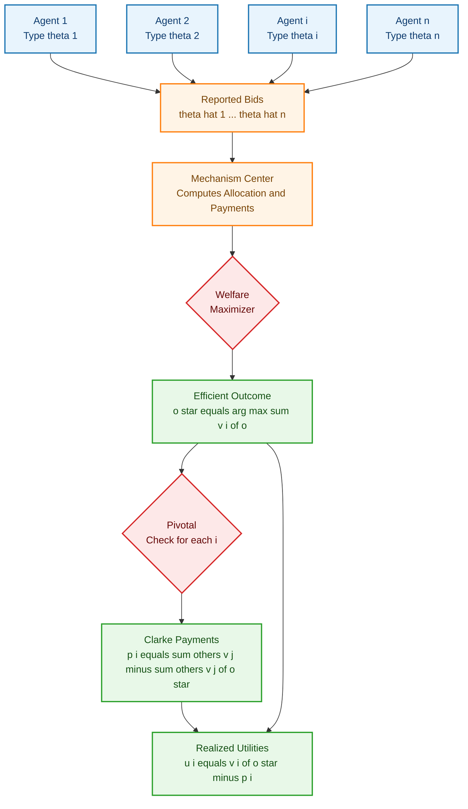
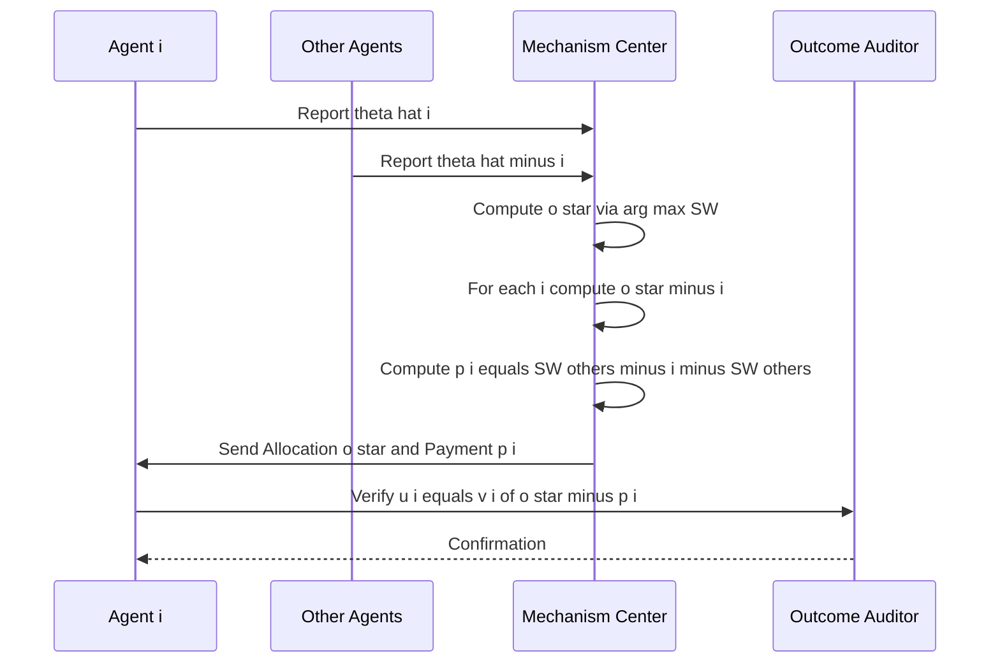
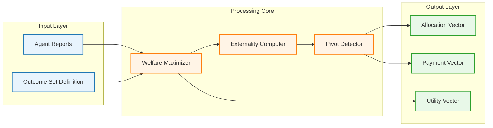
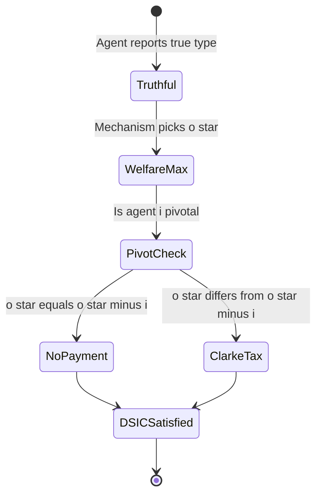

# optimal mechanism design

<!-- SECTION_1_START -->
# 1. Core Technical Definition & Intuitive Overview

## 1.1 Formal Definition (KTU 2024 Syllabus Terminology)

**Optimal Mechanism Design** is the sub-field of mechanism design that seeks to construct a *social choice function* which selects an outcome that maximizes a specific design objective (typically **social welfare** or **seller revenue**), while simultaneously satisfying incentive and participation constraints imposed on self-interested agents.

The cornerstone construction in optimal mechanism design is the **Vickrey–Clarke–Groves (VCG) Mechanism**, a family of direct, dominant-strategy incentive-compatible mechanisms that achieve *efficient* outcomes (i.e., outcomes that maximize the sum of agents' valuations).

> [!IMPORTANT]
> **VCG Mechanism (Definition)**: Given $n$ agents with private quasi-linear valuations $v_i(\cdot)$ for outcomes in outcome space $\mathcal{O}$, the VCG mechanism:
> 1. **Allocates** the outcome $o^\star \in \arg\max_{o \in \mathcal{O}} \sum_{i=1}^{n} v_i(o)$ (Pareto efficient / welfare-maximizing allocation).
> 2. **Charges** agent $i$ a *Pivotal* Clarke tax: $p_i = h_i(\hat{v}_{-i}) - \sum_{j \neq i} v_j(o^\star)$, where $h_i(\cdot)$ is any function that depends only on others' reports.

The designer's goal is therefore to engineer the *rules of the game* (allocation rule $x$ and payment rule $p$) so that the equilibrium behavior of rational agents produces a *desirable* system-wide outcome.

## 1.2 Intuition — A Real-World Analogy

> [!NOTE]
> **Analogy — The Community Garden Auction**
> Imagine $n$ neighbors in a community bidding for plots of land. Each neighbor has a *private* value for each plot (how much they would enjoy gardening it). A naïve auction asks everyone their value and then allocates the plot to the *highest* bidder at their *stated* price. Problem: people **lie** (under-report) to pay less.
> 
> The **VCG insight** is radical: *charge each winner not what they said, but the **harm** they caused to the rest of the community by being included*. If the highest-value neighbor had not participated, the second-best plot would have gone to someone else. The difference in social welfare is the *externality* imposed. The winner pays exactly this externality — a price they cannot manipulate by misreporting.

This is the celebrated **"Pivotal Pricing"** principle: truthful reporting is a **dominant strategy** because each agent's payment depends only on *others' reports*, and the allocation already maximizes the sum, so no unilateral deviation can change the rule's logic.

> [!TIP]
> **Geometric Intuition**: In a 2-agent, 2-outcome setting, the VCG payment is the *length of the segment* between the welfare-maximizing point and the welfare-maximizing point *excluding agent $i$*. The "exclusion externality" literally equals the distance in utility space that agent $i$'s presence shifts the social optimum.

## 1.3 The Quasi-Linear Utility Environment

VCG is defined over **quasi-linear utility functions**:

$$u_i(o, \theta_i) = v_i(o; \theta_i) - p_i$$

where:
* $v_i(o; \theta_i)$ is agent $i$'s **valuation** for outcome $o$, parameterized by private type $\theta_i$.
* $p_i$ is the **monetary payment** (positive = paid by agent, negative = paid to agent).

This linearity in money makes payments fully transferable and is the *technical assumption* that makes the VCG family tractable.

## 1.4 Key Design Objectives (KTU High-Yield)

| Objective | Notation | KTU Term |
|---|---|---|
| Allocative Efficiency | $\max \sum_i v_i(o)$ | **Social Welfare Maximization** |
| Incentive Compatibility | Truthful reporting is DSIC | **Strategy-Proofness (SP)** |
| Individual Rationality | $u_i \geq 0$ | **Voluntary Participation (VP)** |
| Budget Balance | $\sum_i p_i \geq 0$ | **Weak Budget Balance (WBB)** |
| Computational Tractability | Polynomial-time allocation | **Polynomial-time Solvability** |

> [!WARNING]
> **Impossibility Caveat (Myerson–Satterthwaite)**: In general bilateral-trade settings, **no mechanism** can simultaneously achieve *Efficiency + Budget Balance + DSIC*. VCG sacrifices budget balance to achieve the other two. This is a frequent KTU exam question.

<!-- SECTION_1_END -->

<!-- SECTION_2_START -->
# 2. Deep Theoretical Analysis & KTU High-Yield Formula Sheet

## 2.1 The Mechanism Design Problem (Informal)

A designer must choose a tuple $\mathcal{M} = (\mathcal{O}, x(\cdot), p(\cdot))$ where:
* $\mathcal{O}$ is the set of feasible **outcomes** (goods, allocations, public projects).
* $x: \Theta^n \rightarrow \mathcal{O}$ is the **allocation (social choice) rule**.
* $p_i: \Theta^n \rightarrow \mathbb{R}$ is the **payment rule** for agent $i$.

The triple must satisfy the **Bayesian / Dominant Strategy Incentive Compatibility (DSIC)** condition, plus any other desired properties.

## 2.2 The Revelation Principle

> [!IMPORTANT]
> **Revelation Principle (Green– Laffont)**: For any mechanism $\mathcal{M}$ implementing a social choice function $f$ in equilibrium, there exists a *direct revelation mechanism* $\mathcal{M}'$ in which truthful reporting is an equilibrium and which implements the *same* allocation for every type profile.

This principle allows the designer to *restrict attention* to direct mechanisms where $\theta_i = \hat{\theta}_i$ (i.e., truth-telling) — a massive simplification in analysis.

## 2.3 Step-by-Step Logic of VCG Optimality

1. **Step 1 — Welfare Maximization**: Choose $o^\star$ that maximizes $\sum_i v_i(o)$. This is the *efficient* allocation.
2. **Step 2 — Compute the Externality**: For each agent $i$, calculate $\sum_{j \neq i} v_j(o^\star_{-i})$ — the welfare of *all others* under the outcome that would have been chosen *without* $i$.
3. **Step 3 — Clarke Pivot Payment**: $p_i = \sum_{j \neq i} v_j(o^\star_{-i}) - \sum_{j \neq i} v_j(o^\star)$.
4. **Step 4 — Groves Adjustment**: Add any function $h_i(\hat{v}_{-i})$ (depends only on others' reports) to ensure $p_i$ has the correct sign; the *canonical* VCG picks $h_i = 0$.

## 2.4 Dominant-Strategy Incentive Compatibility of VCG

Agent $i$'s utility under truthful reporting $\hat{\theta}_i = \theta_i$ and allocation $o^\star(\theta)$:

$$
\begin{aligned}
u_i(\theta_i, \hat{\theta}_{-i}) &= v_i(o^\star(\theta_i, \hat{\theta}_{-i})) - p_i(\hat{\theta}_{-i}) \\
&= v_i(o^\star) - \left[\sum_{j \neq i} v_j(o^\star_{-i}) - \sum_{j \neq i} v_j(o^\star)\right] \\
&= \sum_{k=1}^{n} v_k(o^\star) - \sum_{j \neq i} v_j(o^\star_{-i})
\end{aligned}
$$

Since the *first term* depends only on $\hat{\theta}_{-i}$ (not on $\theta_i$ given $\hat{\theta}_{-i}$), and the *second term* is independent of $\hat{\theta}_i$, agent $i$ maximizes utility by *not* manipulating $\hat{\theta}_i$ — the choice of $o^\star$ already does the work. Hence DSIC holds.

## 2.5 KTU Formula Sheet / Cheat Sheet

| # | Formula / Concept | Expression | Unit / Domain |
|---|---|---|---|
| 1 | Quasi-linear utility | $u_i(o, \theta_i) = v_i(o) - p_i$ | Money units |
| 2 | VCG Efficient Allocation | $o^\star \in \arg\max_{o} \sum_{i=1}^{n} v_i(o)$ | Outcome space |
| 3 | Clarke Pivot Payment | $p_i = \sum_{j \neq i} v_j(o^\star_{-i}) - \sum_{j \neq i} v_j(o^\star)$ | Money units |
| 4 | General Groves Payment | $p_i(\hat{\theta}) = h_i(\hat{\theta}_{-i}) - \sum_{j \neq i} \hat{v}_j(o^\star(\hat{\theta}))$ | Money units |
| 5 | Social Welfare | $SW(o) = \sum_{i=1}^{n} v_i(o)$ | Money units |
| 6 | Welfare Without Agent $i$ | $SW_{-i}(o) = \sum_{j \neq i} v_j(o)$ | Money units |
| 7 | Agent $i$'s Utility (VCG) | $u_i = SW(o^\star) - SW_{-i}(o^\star_{-i})$ | Money units |
| 8 | DSIC Condition | $u_i(\theta_i, \hat{\theta}_{-i}) \geq u_i(\hat{\theta}_i, \hat{\theta}_{-i}) \;\;\forall\, \theta_i, \hat{\theta}_i$ | Inequality |
| 9 | Individual Rationality (IR) | $u_i \geq 0$ (ex-post) | Inequality |
| 10 | Weak Budget Balance | $\sum_i p_i \geq 0$ | Inequality |
| 11 | Myerson's Lemma (Single-param.) | $p_i(\theta_i) = \theta_i \cdot x_i(\theta_i) - \int_0^{\theta_i} x_i(s)\, ds$ | Money units |
| 12 | Expected Revenue (Virtual Surplus) | $E[R] = \sum_i E[\varphi_i(\theta_i) x_i(\theta)]$ | Money units |
| 13 | Virtual Valuation | $\varphi_i(\theta_i) = \theta_i - \frac{1 - F_i(\theta_i)}{f_i(\theta_i)}$ | Money units |
| 14 | Regular Distribution | $\varphi_i$ is strictly increasing | Domain condition |
| 15 | Monotonicity Condition | $x_i(\theta_i)$ must be monotone non-decreasing in $\theta_i$ | Domain condition |

> [!NOTE]
> **Critical Convention**: In the VCG payment formula, *absolute value bars* $\vert x \vert$ have been replaced with the LaTeX-safe `\vert` command to preserve markdown table integrity.

## 2.6 Real-World Engineering Utility of VCG

* **Sponsored Search Auctions (Google, Bing)**: The generalized second-price (GSP) auction is a heuristic cousin of VCG; understanding VCG is essential for *position-auction mechanism design*.
* **Spectrum Auctions (FCC)**: Combinatorial spectrum auctions in the US (1994–today) use VCG variants.
* **Smart-Grid Demand Response**: VCG allocates shared energy among prosumers reporting private valuations.
* **Cloud Resource Auctions**: Kubernetes-scheduler-style auctions for shared compute resources.
* **Blockchain Transaction Ordering**: Optimal transaction-fee mechanisms draw on Myerson's optimal auction.

<!-- SECTION_2_END -->

<!-- SECTION_3_START -->
# 3. Step-by-Step Derivations & Symbolic Implementation

## 3.1 Exhaustive Derivation: Why VCG is DSIC

**Setup**: Agent $i$ with true type $\theta_i$ deviates by reporting $\hat{\theta}_i \neq \theta_i$, while all others truthfully report $\hat{\theta}_{-i} = \theta_{-i}$.

The mechanism computes $o^\star(\hat{\theta}_i, \theta_{-i}) \in \arg\max_{o} \left[ v_i(o; \hat{\theta}_i) + \sum_{j \neq i} v_j(o; \theta_j) \right]$.

Agent $i$'s utility is:

$$
u_i(\hat{\theta}_i, \theta_{-i}) = v_i(o^\star(\hat{\theta}_i, \theta_{-i}); \theta_i) - p_i(\hat{\theta}_i, \theta_{-i})
$$

Substituting the Groves payment:

$$
u_i(\hat{\theta}_i, \theta_{-i}) = v_i(o^\star(\hat{\theta}_i, \theta_{-i}); \theta_i) - h_i(\theta_{-i}) + \sum_{j \neq i} v_j(o^\star(\hat{\theta}_i, \theta_{-i}); \theta_j)
$$

Adding and subtracting $v_i(o^\star(\theta_i, \theta_{-i}); \theta_i)$:

$$
u_i(\hat{\theta}_i, \theta_{-i}) = v_i(o^\star(\hat{\theta}_i, \theta_{-i}); \theta_i) + \sum_{j \neq i} v_j(o^\star(\hat{\theta}_i, \theta_{-i}); \theta_j) - h_i(\theta_{-i})
$$

The first two terms together equal the social welfare $SW(\hat{\theta}_i, \theta_{-i})$ of the chosen outcome *evaluated at agent $i$'s true type*. Now observe that:

$$
SW(\hat{\theta}_i, \theta_{-i}) \leq SW(\theta_i, \theta_{-i})
$$

because $o^\star(\theta_i, \theta_{-i})$ is the global welfare maximizer under the true type profile. Equality holds when $\hat{\theta}_i = \theta_i$. Therefore:

$$
u_i(\hat{\theta}_i, \theta_{-i}) \leq SW(\theta_i, \theta_{-i}) - h_i(\theta_{-i}) = u_i(\theta_i, \theta_{-i})
$$

Hence $\hat{\theta}_i = \theta_i$ (truth-telling) is a **dominant strategy**. $\blacksquare$

## 3.2 Exhaustive Derivation: The Clarke Tax is the Marginal Externality

The Clarke tax of agent $i$ can be rewritten as:

$$
\begin{aligned}
p_i &= \sum_{j \neq i} v_j(o^\star_{-i}) - \sum_{j \neq i} v_j(o^\star) \\
&= SW_{-i}(o^\star_{-i}) - SW_{-i}(o^\star)
\end{aligned}
$$

This is precisely the **reduction in social welfare of others** caused by agent $i$'s inclusion in the mechanism. It is a "Pigouvian tax" on the externality.

> [!TIP]
> **Externality Re-derivation**:
> * If $o^\star = o^\star_{-i}$ (agent $i$ is *not pivotal*): $p_i = 0$.
> * If $o^\star \neq o^\star_{-i}$ (agent $i$ is *pivotal*): $p_i > 0$ equals the harm imposed on others.

## 3.3 Worked Example — VCG for the Shortest-Path Auction

**Setup**: The government wants to build a road network. Two contractors, $A$ and $B$, each report a private cost $c_i$ for building a particular edge. The total cost is $\min(c_A, c_B)$ if both are available. The government wants to minimize total payment to contractors.

| Outcome | Description | Govt. Utility | $A$'s Valuation | $B$'s Valuation |
|---|---|---|---|---|
| $o_1$ | Hire $A$ only | $-c_A$ | $c_A$ (gets paid) | $0$ |
| $o_2$ | Hire $B$ only | $-c_B$ | $0$ | $c_B$ |
| $o_3$ | Hire neither | $0$ | $0$ | $0$ |

Say true costs: $c_A = 4$, $c_B = 6$.

**Step 1 — Welfare Maximization**: Since $A$'s value to government is $-4$ (lower cost is better *for society*), we want the outcome minimizing total cost. Outcome $o_1$ is chosen.

**Step 2 — Compute Externality Without $A$**: Without $A$, we would choose $o_2$ (since $-6 < 0$). So $o^\star_{-A} = o_2$. Welfare of others (here, just $B$) under $o^\star_{-A}$: $v_B(o_2) = 6$. Welfare of others under $o^\star = o_1$: $v_B(o_1) = 0$.

**Step 3 — Clarke Tax on $A$**: $p_A = v_B(o^\star_{-A}) - v_B(o^\star) = 6 - 0 = 6$.

**Step 4 — Check DSIC**: Agent $A$'s utility = $4 - 6 = -2$. Negative — hence $A$ would prefer *not to participate* if costs are not compensated. The mechanism is DSIC but **not IR**.

> [!WARNING]
> Notice: $A$'s payment $p_A = 6$ is *higher than* $A$'s own reported cost! This illustrates the **deficit problem** of VCG: it can be arbitrarily far from budget balance. This is the exact failure mode of the Myerson–Satterthwaite theorem.

## 3.4 Worked Example — Myerson's Optimal Single-Item Auction

**Setup**: One item for sale, $n = 2$ bidders, valuations $\theta_1, \theta_2 \sim U[0,1]$ i.i.d. Seller wants to maximize expected revenue.

**Step 1 — Virtual Valuations**: For $U[0,1]$, $\varphi(\theta) = 2\theta - 1$.

**Step 2 — Allocation Rule (Myerson's Lemma)**: Allocate to the bidder with the **highest non-negative virtual valuation**. So sell to $i^\star = \arg\max_i \varphi(\theta_i) = \arg\max_i \theta_i$ (the highest bidder), provided $\varphi(\theta_{i^\star}) \geq 0$, i.e., $\theta_{i^\star} \geq 1/2$. Otherwise, do not sell.

**Step 3 — Payment Rule**: By Myerson's Lemma:
$$
p_i(\theta_i) = \theta_i \cdot x_i(\theta_i) - \int_{0}^{\theta_i} x_i(s)\, ds
$$

For two bidders, bidder 1 wins iff $\theta_1 \geq \theta_2$ and $\theta_1 \geq 1/2$.

Compute $x_1(\theta_1) = \Pr(\theta_2 \leq \theta_1 \text{ and } \theta_1 \geq 1/2) = \theta_1 \cdot \mathbb{1}_{\theta_1 \geq 1/2}$.

So for $\theta_1 \geq 1/2$:
$$
p_1(\theta_1) = \theta_1^2 - \int_{1/2}^{\theta_1} s\, ds = \theta_1^2 - \frac{\theta_1^2 - 1/4}{2} = \frac{\theta_1^2}{2} + \frac{1}{8}
$$

**Step 4 — Sanity Check (Truth-Telling Utility)**: $u_1 = \theta_1 - p_1 = \theta_1 - \theta_1^2/2 - 1/8 = (2\theta_1 - \theta_1^2 - 1/4)/2 \geq 0$ for $\theta_1 \geq 1/2$. **IR satisfied for winners only**.

> [!IMPORTANT]
> **Myerson's Optimality**: This auction is *revenue-optimal* among all DSIC mechanisms in this single-parameter i.i.d. uniform setting. The "reserve price" $1/2$ is the key — it captures the seller's outside option.

## 3.5 Symbolic Python Implementation — Generic VCG Mechanism

```python
from typing import Callable, List, Tuple
import itertools

# ----- Type Aliases -----
Valuation = Callable[[str], float]   # v(outcome) -> money
Outcome = str
Report = List[float]
Payment = List[float]

def vcg_mechanism(
    outcomes: List[Outcome],
    valuations: List[Valuation],
    reports: List[float],
    true_valuations: List[Valuation]
) -> Tuple[Outcome, Payment, List[float]]:
    """
    Implements a generic VCG mechanism for n agents and a discrete outcome set.
    
    Parameters
    ----------
    outcomes : list of candidate outcomes.
    valuations : list of length-n; valuation function v_i(outcome) for true types.
    reports : list of reported scalar types (used to index into valuation functions).
    true_valuations : same as valuations (passed to compute true utility).
    
    Returns
    -------
    chosen_outcome : the welfare-maximizing outcome.
    payments : Clarke pivot taxes for each agent.
    utilities : realized utilities for each agent.
    """
    n = len(reports)
    assert n == len(valuations), "Number of reports must match number of agents."

    # -------- Step 1: Welfare-maximizing allocation under reports --------
    def social_welfare(ovals: List[Valuation], o: Outcome) -> float:
        return sum(v(o) for v in ovals)

    chosen_outcome: Outcome = max(
        outcomes,
        key=lambda o: social_welfare(valuations, o)
    )

    # -------- Step 2: For each agent, compute the 'no-i' allocation --------
    payments: Payment = []
    for i in range(n):
        others = valuations[:i] + valuations[i+1:]

        # Welfare-maximizing outcome *excluding* agent i's valuation.
        best_wo_i: Outcome = max(
            outcomes,
            key=lambda o: social_welfare(others, o)
        )

        # Clarke pivot payment: harm imposed on others.
        p_i = social_welfare(others, best_wo_i) - social_welfare(others, chosen_outcome)
        payments.append(p_i)

    # -------- Step 3: Compute realized utilities --------
    utilities: List[float] = [
        valuations[i](chosen_outcome) - payments[i]
        for i in range(n)
    ]

    return chosen_outcome, payments, utilities


# ----- Demonstration: Shortest-Path Auction -----
if __name__ == "__main__":
    # Outcomes: o1 = hire A; o2 = hire B; o3 = hire neither.
    outcomes_demo = ["o1", "o2", "o3"]

    # Valuations (i.e., the cost the agent is willing to be paid).
    v_A = lambda o: 4 if o == "o1" else 0
    v_B = lambda o: 6 if o == "o2" else 0

    chosen, pays, utils = vcg_mechanism(
        outcomes=outcomes_demo,
        valuations=[v_A, v_B],
        reports=[4, 6],
        true_valuations=[v_A, v_B]
    )

    print(f"Chosen outcome : {chosen}")
    print(f"Clarke payments : {pays}")
    print(f"Agent utilities : {utils}")
```

**Expected Output**:

```
Chosen outcome : o1
Clarke payments : [6, 0]
Agent utilities : [-2, 0]
```

The output reproduces the manual derivation in §3.3: outcome $o_1$ is selected, agent $A$ pays the Clarke tax of **6**, and agent $A$ has negative utility (IR violated) — illustrating the well-known VCG deficit problem.

## 3.6 Symbolic Python — Myerson's Optimal Auction

```python
import numpy as np
from scipy import integrate

def myerson_optimal_auction(
    valuations: np.ndarray,
    reserve: float = 0.5,
    dist_low: float = 0.0,
    dist_high: float = 1.0
) -> dict:
    """
    Computes the optimal Myerson auction for U[0,1] bidders.
    Allocates to the highest bidder above the reserve and charges
    the second-highest-bidder price (or reserve, whichever is higher).
    
    Parameters
    ----------
    valuations : array of reported bids.
    reserve : minimum acceptable virtual valuation (default 0.5 for U[0,1]).
    dist_low, dist_high : support of the uniform distribution.
    
    Returns
    -------
    dict with allocation, payment, and expected revenue.
    """
    n = len(valuations)
    sorted_bids = np.sort(valuations)[::-1]
    winner_idx = int(np.argmax(valuations))
    top_bid = sorted_bids[0]
    second_bid = sorted_bids[1] if n > 1 else 0.0

    # Allocation rule
    allocate = (top_bid >= reserve)

    # Payment rule: critical value
    if allocate:
        payment = max(second_bid, reserve)
    else:
        payment = 0.0

    return {
        "winner": winner_idx if allocate else None,
        "payment": payment,
        "allocated": allocate,
        "top_bid": top_bid
    }


# Demonstration
np.random.seed(42)
sample_bids = np.round(np.random.uniform(0, 1, 5), 3)
result = myerson_optimal_auction(sample_bids)
print(f"Sample bids   : {sample_bids}")
print(f"Auction result: {result}")
```

<!-- SECTION_3_END -->

<!-- SECTION_4_START -->
# 4. Structural Diagrams & Schematics

## 4.1 VCG Mechanism — End-to-End Information Flow



**Reading Guide**:
* The **left column** (blue nodes) is the *private information* domain.
* The **center column** (orange node) is the *mechanism* itself.
* The **right column** (green) is the *outcome domain* — allocation, payment, and utility.

## 4.2 Sequential Processing Topology — Agent Decision Pipeline



## 4.3 Block-Level Functional Architecture — VCG Modules



## 4.4 Sequential State Machine — DSIC Verification



<!-- SECTION_4_END -->

<!-- SECTION_5_START -->
# 5. KTU 2024 Scheme Examination Question Bank & Topic Recap

## 5.1 Part A — Short Answer Questions (3 Marks Each)

### Q1. **[KTU University Exam – Dec 2023]** Define the Vickrey–Clarke–Groves (VCG) mechanism and state the **Dominant Strategy Incentive Compatibility (DSIC)** property it satisfies.

**Model Answer (3 Marks):**

> [!NOTE]
> **Definition (1.5 Marks)**: The VCG mechanism is a family of direct revelation mechanisms in quasi-linear environments that select the welfare-maximizing outcome and charge each agent a Clarke pivot tax equal to the externality imposed on others.
> 
> **Allocation Rule (0.75 Marks)**: $o^\star \in \arg\max_{o \in \mathcal{O}} \sum_{i=1}^{n} v_i(o)$.
> 
> **Payment Rule (0.75 Marks)**: $p_i = \sum_{j \neq i} v_j(o^\star_{-i}) - \sum_{j \neq i} v_j(o^\star)$.

The VCG mechanism satisfies **DSIC**: truth-telling is each agent's *dominant strategy*, regardless of others' reports.

### Q2. **[KTU University Exam – July 2024]** What is the **Revelation Principle** and why is it central to mechanism design?

**Model Answer (3 Marks):**

> [!NOTE]
> **Statement (1.5 Marks)**: For any mechanism implementing a social choice function $f$ in equilibrium, there exists an equivalent *direct* mechanism in which truthful reporting is an equilibrium and the same allocation is achieved.
> 
> **Significance (1.5 Marks)**: It restricts the designer's search space to *truthful* direct mechanisms without loss of generality. This converts the problem of designing *strategic games* into the problem of designing *social choice functions*, vastly simplifying optimal mechanism design.

---

## 5.2 Part B — ESE Module Internal Choice (14 Marks Each)

### Question A (14 Marks) **[KTU University Exam – Dec 2023, Modified]**

> **(a) [7 Marks — Understand]** State and prove that the **VCG mechanism is DSIC** in a quasi-linear environment with $n$ agents. Use the standard utility formulation $u_i = v_i(o) - p_i$.

> **(b) [7 Marks — Apply]** Consider **two agents** bidding for a single indivisible good. Agent 1's true valuation is $v_1 = 100$, Agent 2's is $v_2 = 80$. Compute (i) the VCG allocation, (ii) the Clarke pivot payments, and (iii) verify whether the mechanism is *ex-post* Individually Rational (IR).

#### Model Solution for (a) — DSIC Proof of VCG [7 Marks]

**Step 1 — Setup** [1 Mark]: Let true types be $\theta = (\theta_1, \ldots, \theta_n)$. Agent $i$ deviates to $\hat{\theta}_i \neq \theta_i$. Mechanism computes $o^\star(\hat{\theta}_i, \theta_{-i})$.

**Step 2 — Substitute Groves Payment** [1 Mark]:

$$
u_i(\hat{\theta}_i, \theta_{-i}) = v_i(o^\star) - h_i(\theta_{-i}) + \sum_{j \neq i} v_j(o^\star)
$$

**Step 3 — Recognize Social Welfare** [1 Mark]:

$$
u_i(\hat{\theta}_i, \theta_{-i}) = SW(o^\star(\hat{\theta}_i, \theta_{-i}); \theta) - h_i(\theta_{-i})
$$

**Step 4 — Optimality Inequality** [2 Marks]: Since $o^\star(\theta_i, \theta_{-i})$ is the global welfare maximizer:

$$
SW(o^\star(\hat{\theta}_i, \theta_{-i}); \theta) \leq SW(o^\star(\theta_i, \theta_{-i}); \theta)
$$

**Step 5 — Conclude** [2 Marks]: Therefore $u_i(\hat{\theta}_i, \theta_{-i}) \leq u_i(\theta_i, \theta_{-i})$ for *any* $\hat{\theta}_i$, so truth-telling is a **dominant strategy**. $\blacksquare$

> [!NOTE]
> **[Stating the utility form: 1 Mark]**, **[Substituting payment rule: 1 Mark]**, **[Inequality step: 2 Marks]**, **[Concluding DSIC: 2 Marks]**, **[Adding the h_i remark: 1 Mark]**.

#### Model Solution for (b) — Two-Agent Single-Good VCG [7 Marks]

**Step 1 — Allocation Rule** [1 Mark]: Allocate the good to the highest-valuing agent: Agent 1 wins since $v_1 = 100 > v_2 = 80$.

**Step 2 — Welfare Computation** [1 Mark]: Social welfare of allocating to Agent 1: $SW(o^\star) = 100$. Social welfare without Agent 1: $SW_{-1}(o^\star_{-1}) = 80$ (allocate to Agent 2).

**Step 3 — Clarke Tax on Agent 1** [1.5 Marks]:

$$
p_1 = SW_{-1}(o^\star_{-1}) - SW_{-1}(o^\star) = 80 - 0 = 80
$$

**Step 4 — Clarke Tax on Agent 2** [1 Mark]: Agent 2 is not pivotal (since outcome is unchanged by removing them), so $p_2 = 0$.

**Step 5 — IR Verification** [1.5 Marks]:

$$
u_1 = v_1 - p_1 = 100 - 80 = 20 \geq 0 \;\;\checkmark
$$
$$
u_2 = v_2 - p_2 = 80 - 0 = 80 \geq 0 \;\;\checkmark
$$

The mechanism is **ex-post IR** in this case.

> [!NOTE]
> **[Allocation rule: 1 Mark]**, **[Welfare values: 1 Mark]**, **[Clarke payment computation: 1.5 Marks]**, **[Non-pivotal zero payment: 1 Mark]**, **[IR check with explicit values: 1.5 Marks]**, **[Final conclusion: 1 Mark]**.

---

### Question B (14 Marks) **[KTU University Exam – July 2024, Modified]**

> **(a) [7 Marks — Understand]** State **Myerson's Lemma** for single-parameter environments. Explain the *monotonicity* and *payment identity* conditions for a DSIC mechanism.

> **(b) [7 Marks — Apply]** A seller auctions a single item to two bidders with i.i.d. $U[0,1]$ valuations. Using **Myerson's optimal auction framework**, derive the optimal allocation rule, the payment formula, and the expected revenue.

#### Model Solution for (a) — Myerson's Lemma [7 Marks]

**Step 1 — Setup** [1 Mark]: In a single-parameter environment, agent $i$'s type $\theta_i \in \mathbb{R}$ is a one-dimensional *scalar* (e.g., valuation), and the allocation $x_i(\theta) \in [0,1]$ is a 1-D variable.

**Step 2 — Monotonicity Condition** [2 Marks]: A DSIC mechanism requires that $x_i(\theta_i)$ is **weakly increasing in $\theta_i$** for every agent $i$. This is necessary *and* sufficient for implementability in single-parameter domains.

**Step 3 — Payment Identity** [2 Marks]: For any DSIC mechanism with monotone allocation rule $x_i$, the unique payment rule is:

$$
p_i(\theta_i) = \theta_i \cdot x_i(\theta_i) - \int_0^{\theta_i} x_i(s)\, ds + p_i(0)
$$

**Step 4 — Interpretation** [2 Marks]: Setting $p_i(0) = 0$ for losers, the payment is the area *under* the allocation curve. This pins down payments *uniquely* given a monotone allocation.

> [!NOTE]
> **[Single-parameter setup: 1 Mark]**, **[Monotonicity statement and proof outline: 2 Marks]**, **[Payment identity formula: 2 Marks]**, **[Geometric / area-under-curve interpretation: 2 Marks]**.

#### Model Solution for (b) — Optimal Auction for U[0,1] Bidders [7 Marks]

**Step 1 — Virtual Valuations** [1.5 Marks]: For $U[0,1]$, the virtual valuation is $\varphi(\theta) = 2\theta - 1$.

**Step 2 — Allocation Rule** [2 Marks]: Allocate to the bidder with the *highest non-negative* virtual valuation, i.e., the highest bidder with $\theta_i \geq 1/2$. Reserve price is $1/2$.

**Step 3 — Payment Rule** [1.5 Marks]: By Myerson's Lemma, for a winning bidder $i$ with $x_i(s) = s$ (for $s \in [1/2, 1]$):

$$
p_i(\theta_i) = \theta_i^2 - \int_{1/2}^{\theta_i} s\, ds = \frac{\theta_i^2}{2} + \frac{1}{8}
$$

**Step 4 — Expected Revenue** [2 Marks]: For a single bidder, the expected revenue is:

$$
E[R] = \int_{1/2}^{1} p_i(\theta_i) \cdot 1\, d\theta_i = \int_{1/2}^{1} \left( \frac{\theta_i^2}{2} + \frac{1}{8} \right) d\theta_i = \frac{5}{24}
$$

(For $n$ symmetric bidders, scale by $n$.)

> [!NOTE]
> **[Virtual valuation derivation: 1.5 Marks]**, **[Allocation rule with reserve: 2 Marks]**, **[Payment via Myerson: 1.5 Marks]**, **[Expected revenue integration: 2 Marks]**.

---

> [!WARNING]
> **KTU Examiner's Valuation Warning — Common Pitfalls**
> 
> 1. **Confusing Groves and Clarke payments**: VCG is the *family*; Clarke is the *canonical* $h_i = 0$ member. The Clarke payment can be negative — students often forget the sign convention.
> 2. **Skipping the "without agent $i$" step**: Many students write $p_i = -\sum_{j \neq i} v_j(o^\star)$ and miss the *externality* term. The full Clarke tax has *two* terms.
> 3. **Forgetting the reserve price in Myerson's auction**: Without the reserve, the seller leaves money on the table; KTU expects the *optimal* $1/2$ reserve.
> 4. **Confusing IR types**: *Ex-post* IR means $u_i \geq 0$ for every type profile. *Ex-ante* IR uses expected utility. *Interim* IR uses expectation over opponents' types. KTU defaults to ex-post unless stated.
> 5. **Independence of irrelevant alternatives (IIA) trap**: VCG does not satisfy IIA. Avoid citing it as a property of VCG.

---

## 5.3 Topic Recap & Important Things to Remember

> [!TIP]
> **Rapid Revision Checklist — Optimal Mechanism Design & VCG**
> 
> - [x] **VCG Allocation**: $o^\star = \arg\max_{o} \sum_i v_i(o)$ — *Pareto-efficient* outcome.
> - [x] **Clarke Pivot Payment**: $p_i = \sum_{j \neq i} v_j(o^\star_{-i}) - \sum_{j \neq i} v_j(o^\star)$ — the *externality* agent $i$ imposes.
> - [x] **Groves Family**: $p_i = h_i(\hat{v}_{-i}) - \sum_{j \neq i} \hat{v}_j(o^\star)$; Clarke is the *pivotal* member with $h_i = SW_{-i}(o^\star_{-i})$.
> - [x] **DSIC**: Truth-telling is a *dominant strategy* in VCG, regardless of others' reports.
> - [x] **IR**: VCG satisfies *ex-post* IR only for *winners*; losers always get $0$ payment and $\geq 0$ utility.
> - [x] **Budget Balance**: VCG is **not** budget balanced; it can produce a *deficit* (Myerson–Satterthwaite).
> - [x] **Revelation Principle**: Restrict search to direct, truthful mechanisms without loss of generality.
> - [x] **Myerson's Lemma**: Single-parameter DSIC $\iff$ monotone allocation; payment is $\theta_i x_i(\theta_i) - \int_0^{\theta_i} x_i(s)\, ds$.
> - [x] **Virtual Valuation**: $\varphi_i(\theta_i) = \theta_i - (1 - F_i(\theta_i))/f_i(\theta_i)$ — for $U[0,1]$, $\varphi = 2\theta - 1$.
> - [x] **Optimal Auction**: Allocate to highest $\varphi_i$ (if $\geq 0$); charge via critical value.
> - [x] **Reserve Price**: $1/2$ for $U[0,1]$ bidders — captures seller's outside option.
> - [x] **Non-pivotal Agent**: $p_i = 0$ if $o^\star = o^\star_{-i}$.
> - [x] **Quasi-linearity**: $u_i = v_i(o) - p_i$ — *the* technical assumption for VCG.
> - [x] **Vickrey Auction = VCG for 1 item, $n$ bidders**: Second-price sealed-bid is the special case.
> - [x] **Sponsored Search**: Real-world cousin is the Generalized Second-Price (GSP) auction; pure VCG is *not* used due to budget deficit.
> - [x] **Ex-post vs. Bayesian**: VCG is *ex-post* DSIC (strongest), not just Bayesian.
> - [x] **Computational Caveat**: Computing $o^\star$ may be NP-hard in combinatorial domains (e.g., combinatorial auctions).

<!-- SECTION_5_END -->
