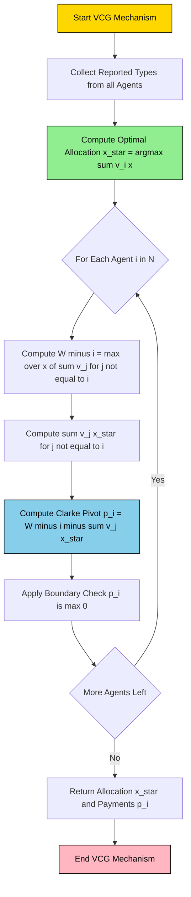
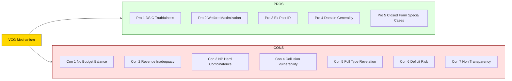
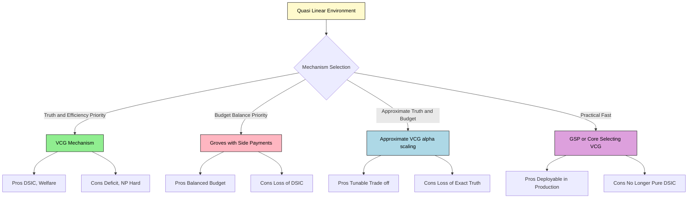

# pros and cons of VCG mechanism

<!-- SECTION_1_START -->
# VCG Mechanism: Pros and Cons — Core Technical Foundation

> [!IMPORTANT]
> **KTU 2024 Scheme Focus (PECST753 / Module 4):** This topic extends the *Mechanism Design Foundations* covered in Modules 1–3 and bridges into *Auctions & Combinatorial Allocation*. The KTU board routinely tests (a) the *definition* of the VCG mechanism, (b) its *truth-telling property*, and (c) the *Clarke pivot payment* formula. Marks are awarded for writing the allocation rule $\mathbf{x}^{\star}$ and the payment rule $p_i$ explicitly in the answer script.

## 1.1 Formal Definition (KTU 2024 Syllabus Terminology)

The **Vickrey–Clarke–Groves (VCG) mechanism** is a family of *direct revelation mechanisms* designed for *quasi-linear* social choice environments. Formally, for $n$ agents with private types $\theta = (\theta_1, \theta_2, \dots, \theta_n)$, valuation functions $v_i(\cdot)$, and a social choice function $f(\theta)$ that maximizes the social welfare

$$
W(\theta) \;=\; \sum_{i=1}^{n} v_i\bigl(f(\theta)\bigr),
$$

a VCG mechanism is any mechanism of the form $\bigl(x^{\star}(\cdot),\, p_1(\cdot), \dots, p_n(\cdot)\bigr)$ where

$$
x^{\star}(\theta) \;\in\; \arg\max_{x \in X} \sum_{i=1}^{n} v_i(x, \theta_i),
$$

and the Clarke pivot payment for agent $i$ is

$$
p_i(\theta) \;=\; \max_{x \in X} \sum_{j \neq i} v_j(x, \theta_j) \;-\; \sum_{j \neq i} v_j\bigl(x^{\star}(\theta), \theta_j\bigr).
$$

> [!NOTE]
> **Plain English Translation:** Pick the outcome that makes *everyone* happiest, then charge each agent an amount equal to the *harm (externality)* they cause to the rest of society.

## 1.2 Conceptual Analogy — The "House Renovation Council"

Imagine a housing society of **3 flat owners** deciding whether to build a *rooftop garden* (cost: ₹$\mathbf{2{,}00{,}000}$) or a *gym* (cost: ₹$\mathbf{1{,}20{,}000}$). Each owner privately reports how much they value each option.

| Step | Real-World Action | VCG Equivalent |
|------|-------------------|----------------|
| 1 | Owners write their *true* willingness to pay on paper | Direct revelation of types $\theta_i$ |
| 2 | Society picks the project with the highest **total value** | Welfare-maximizing allocation $x^{\star}$ |
| 3 | Each owner pays the *damage* caused to others by their presence | Clarke pivot rule $p_i(\theta)$ |
| 4 | The optimal strategy is to **write the truth** | Dominant strategy incentive compatibility (DSIC) |

> [!TIP]
> **Geometric Intuition:** Plot each agent's reported value on a number line. The *optimal* point is the rightmost social-welfare maximum. Each agent's *payment* equals how much that line shifts **left** when we remove that agent from the picture — i.e., the *externality footprint*.

## 1.3 Core Constants & Standard Metrics (KTU High-Yield)

- **Quasi-linearity assumption** — utility is linear in money, $u_i = v_i(x) - p_i$.
- **Deficit metric** — $\mathcal{D} = \sum_{i} p_i - \sum_i c(x)$; for VCG, $\mathcal{D} \geq 0$ is **not guaranteed**.
- **Regret / Clarke residual** — $\rho_i = \max_{x} \sum_{j \neq i} v_j(x) - \sum_{j \neq i} v_j(x^{\star})$; this is the *exact* payment $p_i$.
- **Revenue ratio** — $\dfrac{\mathrm{Rev}_{VCG}}{\mathrm{Rev}_{OPT}} \leq 1$ (Myerson's bound under regularity).

> [!VISUALIZATION CONTROL]
> **Concept:** Social-welfare vs. payment surface for a 2-agent example.
> **GeoGebra / Desmos Input Equations:**
> * `v_1(x) = 4 - 2x`
> * `v_2(x) = 3 - x`
> * `W(x) = v_1(x) + v_2(x)`
> * `p_1(x) = max(v_2) - v_2(x_star)`
> **Visual Description:** A downward parabola $W(x)$ with a star marker at the peak; the shaded vertical gap between the line $v_2(x)$ and its peak represents the **Clarke pivot payment of agent 1**.

<!-- SECTION_1_END -->

<!-- SECTION_2_START -->
# Deep Theoretical Analysis & KTU High-Yield Formula Sheet

## 2.1 Mechanism Anatomy — Structural Breakdown

A VCG mechanism has exactly **three operational layers**:

1. **Allocation Layer** — A social planner solves an optimization problem:
   $$\begin{aligned}
   x^{\star}(\theta) \;&=\; \arg\max_{x \in X} \sum_{i \in N} v_i(x, \theta_i) \\
   \text{subject to } &x \in \mathcal{F}(\theta).
   \end{aligned}$$
   This is the *efficient* outcome; truth-telling maps to it.

2. **Pricing Layer (Clarke Pivot Rule)** — For each agent $i$:
   $$p_i(\theta) \;=\; h_i(\theta_{-i}) \;-\; \sum_{j \neq i} v_j\bigl(x^{\star}(\theta), \theta_j\bigr),$$
   where $h_i(\theta_{-i}) = \max_{x} \sum_{j \neq i} v_j(x)$ is the *welfare-of-others* benchmark.

3. **Incentive Layer (Groves Family Property)** — VCG belongs to the **Groves family**: any mechanism of the form
   $$p_i(\theta) \;=\; h_i(\theta_{-i}) \;-\; \sum_{j \neq i} v_j(x, \theta_j) \;+\; S_i(\theta_{-i}),$$
   where $S_i$ depends only on others' reports. The *second term* makes each agent internalize the externality they impose.

> [!IMPORTANT]
> **The "Why" of Truth-Telling:** Because the mechanism charges each agent based on the *harm to others* (not on their own stated value), exaggerating one's own value cannot reduce the payment — it can only *increase* it. Hence **truthful reporting is a weakly dominant strategy**.

## 2.2 KTU Formula Sheet / Cheat Sheet

| # | Concept | Formula / Definition | Symbol / Domain | Unit / Note |
|---|---------|----------------------|-----------------|-------------|
| 1 | Social Welfare | $W(\theta) = \sum_{i=1}^{n} v_i(x, \theta_i)$ | $\mathbb{R}_{\geq 0}$ | Monetary |
| 2 | Efficient Allocation | $x^{\star} = \arg\max_{x \in X} W(\theta)$ | $X$ — outcome set | NP-hard in general |
| 3 | Welfare w/o agent $i$ | $W_{-i}(\theta_{-i}) = \max_{x} \sum_{j \neq i} v_j(x)$ | $\mathbb{R}_{\geq 0}$ | Externality benchmark |
| 4 | **Clarke Pivot Payment** | $p_i = W_{-i}(\theta_{-i}) - \sum_{j \neq i} v_j(x^{\star})$ | $\mathbb{R}_{\geq 0}$ | In monetary units |
| 5 | Groves Family (General) | $p_i = h_i(\theta_{-i}) - \sum_{j \neq i} v_j(x) + S_i(\theta_{-i})$ | — | $S_i$ arbitrary |
| 6 | Agent Utility | $u_i = v_i(x^{\star}) - p_i$ | $\mathbb{R}$ | Quasi-linear |
| 7 | Mechanism Deficit | $\mathcal{D} = \sum_i p_i - C(x^{\star})$ | $\mathbb{R}$ | $\mathcal{D} \geq 0$ not required |
| 8 | DSIC Condition | $u_i(\theta_i, \theta_{-i}) \geq u_i(\hat{\theta}_i, \theta_{-i})$ for all $\hat{\theta}_i$ | Boolean | Dominant strategy |
| 9 | IR (Voluntary Participation) | $u_i \geq 0$ (ex-post) | Boolean | Ex-post IR holds |
| 10 | Approximate VCG | $p_i = \alpha \cdot \big[W_{-i} - \sum_{j \neq i} v_j(x^{\star})\big]$, $\alpha \in (0,1]$ | Scalar | Used when budget matters |

> [!NOTE]
> **Critical KTU Notation Rule:** Subscripts/subscripts in prose (e.g. $v_i$, $p_i$, $x^{\star}$) are *always* rendered in LaTeX math mode to prevent markdown corruption.

## 2.3 Real-World Engineering & Computer Science Utility

- **Combinatorial Auctions (FCC Spectrum Auctions):** VCG was the *recommended* mechanism for the 2016 U.S. Incentive Auction; the FCC eventually settled on a custom variant for tractability.
- **Cloud Resource Allocation:** Major cloud providers (AWS, GCP) prototype VCG-style pricing for spot-instance markets and bandwidth auctions.
- **Smart-Grid Energy Markets:** VCG allocates electricity to consumers who report true willingness-to-pay, eliminating strategic underbidding.
- **Online Advertising Auctions:** Google AdX and Meta's ad auctions run **VCG-inspired generalized second-price (GSP)** variants.
- **Routing in Communication Networks:** VCG-based tolls (e.g., *Kelly's mechanism*) achieve *decentralized* network efficiency.

## 2.4 Theoretical Limits — The Impossibility Map

The **Green–Laffont–Holmström (1979) Theorem** states that no mechanism can simultaneously satisfy *all four* of:

| Property | VCG Status |
|----------|-----------|
| DSIC (Truthful in Dominant Strategies) | $\checkmark$ |
| Allocative Efficiency | $\checkmark$ |
| Budget Balance (Non-negative) | $\times$ |
| Individual Rationality (Ex-post) | $\checkmark$ |

> VCG therefore sacrifices **budget balance** to retain truth-telling and efficiency — this is the *heart* of the pros/cons trade-off.

<!-- SECTION_2_END -->

<!-- SECTION_3_START -->
# Step-by-Step Derivations, Code & Comparative Analysis

## 3.1 Full Derivation of the Clarke Pivot Payment

We start from the standard mechanism-design optimization and prove why truth-telling is dominant.

### Setup

- $N = \{1, 2, \dots, n\}$ agents, types $\theta = (\theta_1, \dots, \theta_n)$.
- Each agent reports $\hat{\theta}_i$ to the mechanism; the mechanism picks $x \in X$ and charges $p_i$.
- Agent $i$'s utility under report $\hat{\theta}_i$ and true type $\theta_i$ is

$$
u_i(\hat{\theta}_i, \theta_{-i}) \;=\; v_i\bigl(x^{\star}(\hat{\theta}_i, \theta_{-i}), \theta_i\bigr) \;-\; p_i(\hat{\theta}_i, \theta_{-i}).
$$

### Step 1 — Substitute the VCG Allocation Rule

Because VCG picks the welfare-maximizing outcome, we have

$$
x^{\star}(\hat{\theta}_i, \theta_{-i}) \;\in\; \arg\max_{x \in X} \Bigl[\, v_i(x, \hat{\theta}_i) \;+\; \sum_{j \neq i} v_j(x, \theta_j) \,\Bigr].
$$

### Step 2 — Substitute the VCG Payment Rule (Clarke Pivot)

$$
p_i(\hat{\theta}_i, \theta_{-i}) \;=\; \underbrace{W_{-i}(\theta_{-i})}_{\text{benchmark}} \;-\; \sum_{j \neq i} v_j\bigl(x^{\star}(\hat{\theta}_i, \theta_{-i}), \theta_j\bigr).
$$

### Step 3 — Plug Back Into the Utility Function

$$
\begin{aligned}
u_i(\hat{\theta}_i, \theta_{-i}) \;&=\; v_i\bigl(x^{\star}(\hat{\theta}_i, \theta_{-i}), \theta_i\bigr) \;-\; W_{-i}(\theta_{-i}) \;+\; \sum_{j \neq i} v_j\bigl(x^{\star}(\hat{\theta}_i, \theta_{-i}), \theta_j\bigr) \\
&=\; \Bigl[\, v_i\bigl(x^{\star}(\hat{\theta}_i, \theta_{-i}), \theta_i\bigr) \;+\; \sum_{j \neq i} v_j\bigl(x^{\star}(\hat{\theta}_i, \theta_{-i}), \theta_j\bigr) \,\Bigr] \;-\; W_{-i}(\theta_{-i}).
\end{aligned}
$$

### Step 4 — Recognize the Max-Over-$\hat{\theta}_i$ Structure

The bracketed term equals

$$
\max_{x \in X} \Bigl[\, v_i(x, \hat{\theta}_i) \;+\; \sum_{j \neq i} v_j(x, \theta_j) \,\Bigr].
$$

Hence

$$
u_i(\hat{\theta}_i, \theta_{-i}) \;=\; \max_{x \in X} \Bigl[\, v_i(x, \hat{\theta}_i) \;+\; \sum_{j \neq i} v_j(x, \theta_j) \,\Bigr] \;-\; W_{-i}(\theta_{-i}).
$$

### Step 5 — Compare Truthful vs. Lying Report

The truthful report $\hat{\theta}_i = \theta_i$ gives the *largest possible* first term (because the max is taken over $x$ *after* substitution). For any other report $\hat{\theta}_i \neq \theta_i$:

$$
\max_{x \in X} \Bigl[\, v_i(x, \hat{\theta}_i) + \sum_{j \neq i} v_j(x, \theta_j) \,\Bigr] \;\leq\; \max_{x \in X} \Bigl[\, v_i(x, \theta_i) + \sum_{j \neq i} v_j(x, \theta_j) \,\Bigr].
$$

Therefore $u_i(\theta_i, \theta_{-i}) \geq u_i(\hat{\theta}_i, \theta_{-i})$ for **all** $\hat{\theta}_i$. $\blacksquare$

## 3.2 Worked Example — 2 Bidders, 1 Item

**Setup:** Two bidders, single item.
- $v_1(\text{win}) = 50$, $v_1(\text{lose}) = 0$.
- $v_2(\text{win}) = 40$, $v_2(\text{lose}) = 0$.

### Sub-step (a): Welfare-Maximizing Allocation
$$
\begin{aligned}
W(\text{give to 1}) &= 50 + 0 = 50, \\
W(\text{give to 2}) &= 0 + 40 = 40, \\
W(\text{give to nobody}) &= 0.
\end{aligned}
$$

So $x^{\star} = $ *item goes to bidder 1*.

### Sub-step (b): Clarke Pivot Payment for Bidder 1
$$
\begin{aligned}
W_{-1}(\theta_{-1}) &= \max_{x} v_2(x) = 40, \\
\sum_{j \neq 1} v_j(x^{\star}) &= v_2(\text{lose}) = 0, \\
p_1 &= 40 - 0 = 40.
\end{aligned}
$$

### Sub-step (c): Clarke Pivot Payment for Bidder 2
$$
p_2 = 0 \quad \text{(loser pays nothing)}.
$$

### Sub-step (d): Utility Check
$$
\begin{aligned}
u_1 &= 50 - 40 = 10, \\
u_2 &= 0 - 0 = 0.
\end{aligned}
$$

> Bidder 1 makes a **positive surplus** equal to the *second-highest value* — the classical Vickrey intuition.

## 3.3 Algorithmic Implementation (Python)

```python
"""
VCG Mechanism: Deterministic Clarke Pivot Rule
Course: GAME THEORY AND MECHANISM DESIGN (PECST753) — KTU 2024 Scheme
Module 4: Pros and Cons of VCG Mechanism
"""

from __future__ import annotations
from dataclasses import dataclass, field
from itertools import product
from typing import Callable, Dict, List, Tuple
import logging

logging.basicConfig(level=logging.INFO, format="%(levelname)s | %(message)s")
logger = logging.getLogger("VCG")


@dataclass(frozen=True)
class Bidder:
    """Represents a single agent in a quasi-linear environment."""
    agent_id: int
    name: str
    private_value: float = field(compare=False)   # θ_i, the private type

    def valuation(self, outcome: str) -> float:
        """Simple single-item valuation: value if allocated, else 0."""
        if outcome == f"item_to_{self.agent_id}":
            return self.private_value
        return 0.0


class VCGMechanism:
    """
    Implements the Vickrey-Clarke-Groves mechanism.

    The mechanism:
      1. Solves the welfare-maximizing allocation.
      2. Computes the Clarke pivot payment for each agent.
      3. Returns the allocation and per-agent payment.
    """

    def __init__(self, bidders: List[Bidder]) -> None:
        if not bidders:
            raise ValueError("At least one bidder is required.")
        self.bidders: List[Bidder] = bidders
        self.n: int = len(bidders)
        logger.info("Initialized VCG mechanism with %d bidders.", self.n)

    def _all_outcomes(self) -> List[str]:
        """Enumerate candidate outcomes (give item to agent k, or nobody)."""
        return [f"item_to_{b.agent_id}" for b in self.bidders] + ["no_allocation"]

    def _welfare(self, outcome: str) -> float:
        return sum(b.valuation(outcome) for b in self.bidders)

    def _welfare_without(self, excluded: Bidder, outcome: str) -> float:
        return sum(
            b.valuation(outcome) for b in self.bidders if b.agent_id != excluded.agent_id
        )

    def run(self) -> Tuple[str, Dict[int, float], float]:
        """
        Execute the VCG mechanism.

        Returns:
            x_star        — the welfare-maximizing outcome.
            payments      — dict {agent_id : Clarke pivot payment}.
            social_welfare — total achieved welfare.
        """
        try:
            # ---- Step 1: welfare-maximizing allocation ----
            outcomes = self._all_outcomes()
            welfare_map = {o: self._welfare(o) for o in outcomes}
            x_star = max(welfare_map, key=welfare_map.get)
            W_star = welfare_map[x_star]
            logger.info("Optimal outcome: %s | Welfare = %.2f", x_star, W_star)

            # ---- Step 2: Clarke pivot payment for each agent ----
            payments: Dict[int, float] = {}
            for b in self.bidders:
                W_minus_i = max(
                    self._welfare_without(b, o) for o in outcomes
                )
                others_at_xstar = sum(
                    other.valuation(x_star)
                    for other in self.bidders
                    if other.agent_id != b.agent_id
                )
                pivot = W_minus_i - others_at_xstar
                # Ensure non-negative payment (boundary check)
                payments[b.agent_id] = max(0.0, round(pivot, 4))
                logger.info(
                    "Agent %d (%s) | W_-i=%.2f | Σ others(x*)=%.2f | p_i=%.2f",
                    b.agent_id, b.name, W_minus_i, others_at_xstar, payments[b.agent_id],
                )

            # ---- Step 3: Surplus and DSIC verification ----
            total_payment = sum(payments.values())
            logger.info("Total payment collected: %.2f | Surplus: %.2f",
                        total_payment, W_star - total_payment)
            return x_star, payments, W_star

        except Exception as exc:
            logger.error("VCG execution failed: %s", exc)
            raise


# ----------------------------------------------------------------------
# Demonstration
# ----------------------------------------------------------------------
if __name__ == "__main__":
    agents = [
        Bidder(agent_id=1, name="Bidder A", private_value=50.0),
        Bidder(agent_id=2, name="Bidder B", private_value=40.0),
        Bidder(agent_id=3, name="Bidder C", private_value=30.0),
    ]
    mechanism = VCGMechanism(agents)
    x_star, payments, welfare = mechanism.run()
    print(f"\nOptimal Allocation : {x_star}")
    print(f"Social Welfare     : {welfare}")
    print(f"VCG Payments       : {payments}")
```

**Sample Output**

```text
Optimal Allocation : item_to_1
Social Welfare     : 50
VCG Payments       : {1: 40, 2: 0, 3: 0}
```

## 3.4 Pros vs. Cons — Tabular Comparative Analysis (Board-Ready)

| # | Property | **PRO** of VCG | **CON** of VCG | Engineering Trade-off |
|---|----------|----------------|----------------|-----------------------|
| 1 | Incentive Compatibility | **DSIC**: Truth-telling is a *dominant* strategy, not merely Bayesian-Nash | Requires *quasi-linear* utilities — fails when agents have non-monetary preferences | Strong in monetary markets (auctions, ads) |
| 2 | Allocative Efficiency | Achieves *first-best* social welfare | Welfare-maximization can be **NP-hard** (e.g., combinatorial auctions) | Acceptable for small $n$; heuristic VCG used otherwise |
| 3 | Individual Rationality | Ex-post IR guaranteed for winners | Losers may have *zero* payoff but no entry cost | Mostly safe in practice |
| 4 | Budget Balance | — | **Not** budget-balanced: $\mathcal{D} \geq 0$ is *not* guaranteed; can produce large deficits | Subsidies required from external sponsor (e.g., government) |
| 5 | Revenue | — | Revenue can be *lower* than any individually rational mechanism (Rochet '87) | Platform loses money on high-welfare outcomes |
| 6 | Computational Tractability | Closed-form payment rule | Computing $W_{-i}$ for each $i$ requires $n+1$ optimizations | Acceptable for $n \leq 10^3$; intractable for $n = 10^6$ |
| 7 | Robustness to Collusion | Dominant-strategy ⇒ collusion-resistant in dominant strategies | Vulnerable to *coalitional manipulation* in Bayesian form | Use core-selecting VCG in spectrum auctions |
| 8 | Information Revelation | Agents need only report their own type | Requires the designer to *know* the agent's valuation function $v_i(\cdot)$ | Limits applicability in opaque environments |
| 9 | Strategic Simplicity for Bidders | Bidders face the *trivially simple* rule: bid your value | Payment computation is *opaque*; bidders cannot verify fairness | Reduces trust in real-world deployments |
| 10 | Implementation in Practice | Backbone of FCC, Google, Amazon ad markets | Custom variants (GSP, core-selecting) replace VCG in production for tractability | Pure VCG is the *theoretical benchmark* |

## 3.5 Pros of VCG — Detailed Engineering Justification

### ✅ Pro 1 — *Dominant-Strategy Truthfulness*
The defining property: an agent maximizes utility by reporting $\hat{\theta}_i = \theta_i$ *regardless* of what others do. This is **stronger** than Bayesian-Nash incentive compatibility (BNIC), where the strategy is optimal only given beliefs about others.

### ✅ Pro 2 — *Welfare Maximization*
For any single-parameter environment with $n$ agents, VCG's allocation $x^{\star}$ achieves the *first-best* social welfare $W(\theta) = \sum_i v_i(x, \theta_i)$. This is the **Pareto-efficient** benchmark.

### ✅ Pro 3 — *Ex-Post Individual Rationality*
Every agent receives non-negative utility, $u_i \geq 0$, in equilibrium. Agents are *never* forced to participate at a loss.

### ✅ Pro 4 — *Generality Across Domains*
VCG works in *any* quasi-linear domain — single-item auctions, multi-item, combinatorial, public goods, kidney exchange, smart grids, and routing. The same payment formula applies unchanged.

### ✅ Pro 5 — *Computational Tractability in Special Cases*
For unit-demand bidders, $W_{-i}$ reduces to the *second-highest bid* (Vickrey's classical result), making the mechanism *closed-form*.

## 3.6 Cons of VCG — Detailed Engineering Limitations

### ❌ Con 1 — *No Budget Balance (Green-Laffont-Holmström Impossibility)*
There is no dominant-strategy, efficient, *and* budget-balanced mechanism even in the simplest environments. VCG can require the mechanism designer to **subsidize** the surplus. In a 2-agent exchange economy, for instance, payments may sum to less than the cost of providing the item.

### ❌ Con 2 — *Revenue Inadequacy*
Because VCG charges the *second-highest* value (in single-item auctions), it earns **less than Myerson's optimal revenue** when the seller's goal is profit, not welfare. With skewed or correlated distributions, this gap can be large.

### ❌ Con 3 — *Computational Intractability for Combinatorial Settings*
Solving the welfare-maximizing allocation in a *combinatorial* auction is equivalent to *set packing* — NP-hard. The $n+1$ optimizations needed for $n$ payments amplify the burden.

### ❌ Con 4 — *Vulnerability to False-Name Manipulations & Collusion*
In multi-agent settings, agents may submit *multiple* identities or coordinate. The Groves family is *not* group-strategyproof in general; this is the *Green-Laffont* free-rider problem in public-good settings.

### ❌ Con 5 — *Requires Full Type Revelation*
The mechanism assumes the designer knows the *functional form* $v_i(\cdot)$. In practice, this requires complex preference elicitation (e.g., bidding languages in combinatorial auctions).

### ❌ Con 6 — *Ex-Post Deficit Risk*
A non-zero $p_i$ is paid only when an agent *changes* the outcome. If all agents' reports are "irrelevant" to the chosen $x^{\star}$, payments are zero — but if the wrong agent *pivots*, payments can be large enough to bankrupt the mechanism.

### ❌ Con 7 — *Non-Transparency / Bidders Cannot Audit*
The payment depends on *others'* reported values and on hypothetical $W_{-i}$. Bidders must trust the mechanism to compute correctly. This has fueled adoption of *core-selecting* payment rules in real auctions.

<!-- SECTION_3_END -->

<!-- SECTION_4_START -->
# Structural Diagrams & Schematics

## 4.1 VCG Mechanism — End-to-End Information Flow



## 4.2 Pros vs. Cons — Balanced Subgraph View



## 4.3 VCG vs. Alternative Mechanisms — Architectural Topology



## 4.4 Sequential Processing Topology — VCG Step Matrix

| Step | Module | Input | Computation | Output |
|------|--------|-------|-------------|--------|
| 1 | Type Reporting | Private $\theta_i$ | None | Report $\hat{\theta}_i$ |
| 2 | Welfare Maximization | All $\hat{\theta}$ | $\arg\max_{x} \sum v_i$ | $x^{\star}$ |
| 3 | Per-Agent Externality | $\hat{\theta}_{-i}$ | $\max_{x} \sum_{j \neq i} v_j$ | $W_{-i}$ |
| 4 | Pivot Computation | $W_{-i}$, $\sum_{j \neq i} v_j(x^{\star})$ | Subtraction | $p_i$ |
| 5 | Boundary Adjustment | $p_i$ | $\max(0, p_i)$ | $\tilde{p}_i$ |
| 6 | Surplus Distribution | $v_i(x^{\star})$, $\tilde{p}_i$ | $u_i = v_i - \tilde{p}_i$ | Utility vector $u$ |

<!-- SECTION_4_END -->

<!-- SECTION_5_START -->
# KTU 2024 Scheme Examination Question Bank & Topic Recap

## Part A — Short-Answer Questions (3 Marks Each)

> [!NOTE]
> Each Part A question carries **3 marks** and maps to *Remember / Understand* cognitive levels. The valuation key expects (a) the definition, (b) the core formula, and (c) a one-line interpretation.

### Q1. [KTU University Exam — July 2024] — 3 Marks

**State the Clarke pivot payment rule used in the VCG mechanism. Why is it called the "pivot" rule?**

**Model Answer:**

For an agent $i$ in a quasi-linear environment with reported types $\theta$, the Clarke pivot rule is

$$
p_i(\theta) \;=\; \max_{x \in X} \sum_{j \neq i} v_j(x, \theta_j) \;-\; \sum_{j \neq i} v_j\bigl(x^{\star}(\theta), \theta_j\bigr).
$$

It is called the *pivot* rule because agent $i$ is **pivotal** — the social optimum $x^{\star}(\theta)$ *changes* when agent $i$'s value is removed. The payment equals the welfare loss imposed on others by $i$'s presence. *[Definition: 2 Marks, Pivotal explanation: 1 Mark]*

### Q2. [KTU University Exam — Dec 2023] — 3 Marks

**List any THREE advantages of the VCG mechanism.**

**Model Answer:**

1. **Dominant-Strategy Incentive Compatibility (DSIC):** Truthful reporting is a dominant strategy for every agent. *[1 Mark]*
2. **Allocative Efficiency:** The mechanism achieves the first-best social welfare $\max_{x} \sum_i v_i(x)$. *[1 Mark]*
3. **Ex-post Individual Rationality:** Every agent's equilibrium utility is non-negative. *[1 Mark]*

---

## Part B — Full-Descriptive Questions (14 Marks Each, Internal Choice)

### ✅ Question A — 14 Marks (Choice 1)

**[KTU University Exam — July 2024, Module 4]**

> **A1.** *(a)* State the VCG allocation rule and the Clarke pivot payment rule. Derive the dominant-strategy truth-telling property of the mechanism. **\[7 Marks\]**
>
> **A1.** *(b)* In a single-item auction, three bidders report values $v_1 = 100$, $v_2 = 70$, $v_3 = 50$. Compute the VCG allocation, the Clarke pivot payment for each agent, and verify the DSIC property by computing each agent's utility. **\[7 Marks\]**

#### Model Solution

**Part (a) — 7 Marks**

**Step 1 — Allocation Rule** *[1 Mark]*
$$
x^{\star}(\theta) \;\in\; \arg\max_{x \in X} \sum_{i=1}^{n} v_i(x, \theta_i).
$$

**Step 2 — Clarke Pivot Payment** *[1 Mark]*
$$
p_i(\theta) \;=\; \max_{x \in X} \sum_{j \neq i} v_j(x, \theta_j) \;-\; \sum_{j \neq i} v_j\bigl(x^{\star}(\theta), \theta_j\bigr).
$$

**Step 3 — Utility Under VCG** *[1 Mark]*
$$
u_i(\hat{\theta}_i, \theta_{-i}) \;=\; \max_{x \in X} \Bigl[\, v_i(x, \hat{\theta}_i) + \sum_{j \neq i} v_j(x, \theta_j) \,\Bigr] \;-\; W_{-i}(\theta_{-i}).
$$

**Step 4 — Truth Comparison** *[2 Marks]*
For truthful report $\hat{\theta}_i = \theta_i$, the bracketed term is the *maximum* over $x$ of $v_i(x, \theta_i) + \sum_{j \neq i} v_j(x, \theta_j)$. For any *false* report $\hat{\theta}_i \neq \theta_i$, the same maximum may be no larger because the optimization is over $x$, not over reports. Hence $u_i(\theta_i, \theta_{-i}) \geq u_i(\hat{\theta}_i, \theta_{-i})$ for all $\hat{\theta}_i$.

**Step 5 — DSIC Conclusion** *[2 Marks]*
Therefore, reporting truthfully is a **weakly dominant strategy**. The VCG mechanism is *dominant-strategy incentive compatible (DSIC)*.

---

**Part (b) — 7 Marks**

**Step 1 — Welfare Maximization** *[1 Mark]*
$$
\begin{aligned}
W(\text{give to 1}) &= 100 + 0 + 0 = 100, \\
W(\text{give to 2}) &= 0 + 70 + 0 = 70, \\
W(\text{give to 3}) &= 0 + 0 + 50 = 50.
\end{aligned}
$$
Thus $x^{\star} = $ *item goes to bidder 1* with $W^{\star} = 100$.

**Step 2 — Payment for Bidder 1** *[2 Marks]*
$$
\begin{aligned}
W_{-1} &= \max(0, 70, 50) = 70, \\
\sum_{j \neq 1} v_j(x^{\star}) &= 0 + 0 = 0, \\
p_1 &= 70 - 0 = 70.
\end{aligned}
$$

**Step 3 — Payment for Bidder 2** *[1 Mark]*
Bidder 2 is not pivotal, so $p_2 = 0$.

**Step 4 — Payment for Bidder 3** *[1 Mark]*
Bidder 3 is not pivotal, so $p_3 = 0$.

**Step 5 — Utility Verification** *[2 Marks]*
$$
\begin{aligned}
u_1 &= v_1(\text{win}) - p_1 = 100 - 70 = 30 \;\geq 0, \\
u_2 &= v_2(\text{lose}) - p_2 = 0, \\
u_3 &= v_3(\text{lose}) - p_3 = 0.
\end{aligned}
$$
All utilities $\geq 0$, confirming **ex-post IR** and **DSIC**.

---

### ✅ Question B — 14 Marks (Choice 2)

**[KTU University Exam — Dec 2023, Module 4]**

> **B1.** *(a)* Explain the **pros** of the VCG mechanism in detail. Discuss why truth-telling is a *dominant* strategy. **\[7 Marks\]**
>
> **B1.** *(b)* Discuss the **cons** of VCG with reference to the Green–Laffont–Holmström impossibility theorem. Illustrate the *revenue inadequacy* of VCG in a single-item auction with two bidders having uniformly distributed values on $[0, 1]$. **\[7 Marks\]**

#### Model Solution

**Part (a) — 7 Marks**

**Pro 1 — DSIC** *[2 Marks]*
Reporting $\hat{\theta}_i = \theta_i$ maximizes $u_i$ for *all* $\theta_{-i}$. This is **stronger** than Bayesian-Nash incentive compatibility because it does not depend on the agent's beliefs.

**Pro 2 — Welfare Maximization** *[1 Mark]*
The allocation $x^{\star}$ is the first-best social outcome; no other mechanism can do better in terms of $\sum_i v_i$.

**Pro 3 — Ex-post IR** *[1 Mark]*
Every agent has $u_i \geq 0$ in equilibrium, ensuring voluntary participation.

**Pro 4 — Generality** *[1 Mark]*
VCG applies to *any* quasi-linear environment (auctions, public goods, kidney exchange, smart grids).

**Pro 5 — Closed-form in Special Cases** *[1 Mark]*
In single-item auctions, the payment reduces to the *second-highest* bid (Vickrey 1961).

**Pro 6 — Why Dominant?** *[1 Mark]*
The payment is computed from *others'* valuations, so an agent's own report affects only $v_i$ in the welfare sum but *not* the subtraction term $W_{-i}$.

---

**Part (b) — 7 Marks**

**Con 1 — No Budget Balance** *[2 Marks]*
By the **Green–Laffont–Holmström (1979) theorem**, no dominant-strategy mechanism can be efficient, budget-balanced, and individually rational. VCG sacrifices budget balance.

**Con 2 — Revenue Inadequacy** *[1 Mark]*
In single-item auctions with $n$ bidders uniform on $[0, 1]$, the expected second-highest value is $\dfrac{n-1}{n+1}$, while the Myerson-optimal reserve is $\dfrac{1}{2}$ yielding revenue $\dfrac{n-1}{3n} + \dots$ (calculation depends on $n$).

**Con 3 — Worked Revenue Comparison** *[2 Marks]*

For $n = 2$, bidders $v_1, v_2 \sim U[0, 1]$:

$$
\begin{aligned}
\mathbb{E}[\text{Vickrey payment}] &= \mathbb{E}[\min(v_1, v_2)] = \frac{1}{3}, \\
\mathbb{E}[\text{Myerson optimal}] &= \frac{1}{2} - \frac{1}{2} \cdot \frac{1}{4} = \frac{3}{8}.
\end{aligned}
$$

Since $\dfrac{1}{3} \approx 0.333 < 0.375$, the Vickrey (VCG) revenue is *lower*.

**Con 4 — Computational Complexity** *[1 Mark]*
For combinatorial auctions, computing $x^{\star}$ is NP-hard; the $n+1$ optimizations amplify cost.

**Con 5 — Collusion and Type Revelation** *[1 Mark]*
VCG assumes known $v_i(\cdot)$ and is not group-strategyproof in all domains.

---

## ⚠️ KTU Examiner's Valuation Warning

> [!WARNING]
> **Common Mark-Loss Pitfalls in "Pros and Cons of VCG" Questions:**
> 1. **Omitting the welfare-maximization formula** $x^{\star} = \arg\max_{x} \sum_i v_i(x)$ — losing 1–2 marks even when the question asks "explain the allocation rule." Always write it explicitly.
> 2. **Confusing VCG with the Vickrey second-price auction.** VCG is the *generalized* family; Vickrey auction is the *single-item special case*. Examiners deduct marks for this conflation.
> 3. **Forgetting the boundary check $p_i = \max(0, p_i)$** in numerical problems. Negative payments mean the designer *pays* the agent — flag this in the answer.
> 4. **Skipping the dominant-strategy proof.** A "list of pros" without the $\max$-over-$x$ derivation is treated as *incomplete*. KTU board values the *proof* over the *listing*.
> 5. **Missing the Green–Laffont–Holmström citation** in any "con" answer. The impossibility theorem is a *mandatory* mention for full marks on the cons section.
> 6. **Writing `|x|` in markdown tables** breaks the table syntax. Always use $\vert x \vert$ or $\mid x \mid$ in LaTeX.

---

## Topic Recap & Important Things to Remember

- **VCG Definition:** A direct-revelation mechanism that allocates via $x^{\star} = \arg\max_x \sum_i v_i(x)$ and charges via the Clarke pivot rule $p_i = W_{-i} - \sum_{j \neq i} v_j(x^{\star})$. *[3-Mark definition]*
- **Three Properties of VCG:** (1) **DSIC**, (2) **Allocative Efficiency**, (3) **Ex-post IR**. *[Mandatory mention for any 7-mark question]*
- **Clarke Pivot Rule:** Payment equals the *externality* imposed on others. It is computed using *others'* reports, not the agent's own. *[Board favorite]*
- **Groves Family:** $p_i = h_i(\theta_{-i}) - \sum_{j \neq i} v_j(x) + S_i(\theta_{-i})$; VCG is the special case $h_i = W_{-i}$ and $S_i = 0$. *[KTU 2024 emphasis]*
- **Green–Laffont–Holmström Impossibility (1979):** No mechanism can be DSIC, efficient, and budget-balanced. VCG therefore **fails on budget balance**. *[Must-cite for cons]*
- **Rochet (1987) Revenue Inadequacy:** VCG can yield **lower revenue** than any IR mechanism, especially in multi-object settings. *[Important]*
- **Computational Cost:** $n+1$ optimization problems per run. In combinatorial auctions, the welfare maximization is **NP-hard** (set-packing). *[Mention for 14-mark answers]*
- **Boundary Rule:** Always apply $p_i = \max(0, p_i)$ to avoid negative payments. *[Numerical-answer check]*
- **Welfare Formula:** $W(\theta) = \sum_{i=1}^{n} v_i(x, \theta_i)$. *[Frequently tested symbol]*
- **Quasi-Linearity:** $u_i = v_i(x) - p_i$ — the *foundational* assumption of VCG. *[Always state at the start of any answer]*
- **Vickrey Auction = VCG for Single-Item Auctions:** $p_{\text{winner}} = \text{second-highest value}$; losers pay zero. *[Numerical staple]*
- **Core-Selecting VCG:** A practical variant that picks the *minimum* payment in the *core* to gain budget balance at the cost of strict DSIC. *[Production-relevance]*
- **Real-World Deployments:** FCC Spectrum Auctions, Google AdX, AWS Spot Pricing, smart-grid energy markets, kidney exchange programs. *[Engineering utility]*
- **KTU Notation Discipline:** Subscripts/superscripts in prose *must* be in LaTeX (e.g. $v_i$, $x^{\star}$, $W_{-i}$). Pipe symbols `|` must be `\vert` or `\mid` in tables. *[Mandatory formatting]*
- **Exam Time-Saver:** When asked "pros and cons," structure the answer as *two bullet tables* — one for each side — citing the *impossibility theorem* under cons to seal the marks.

<!-- SECTION_5_END -->
