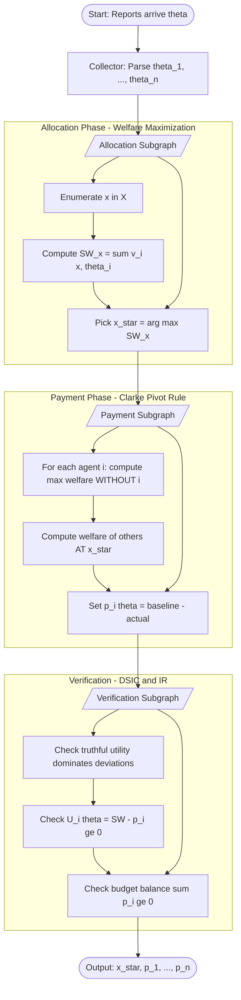
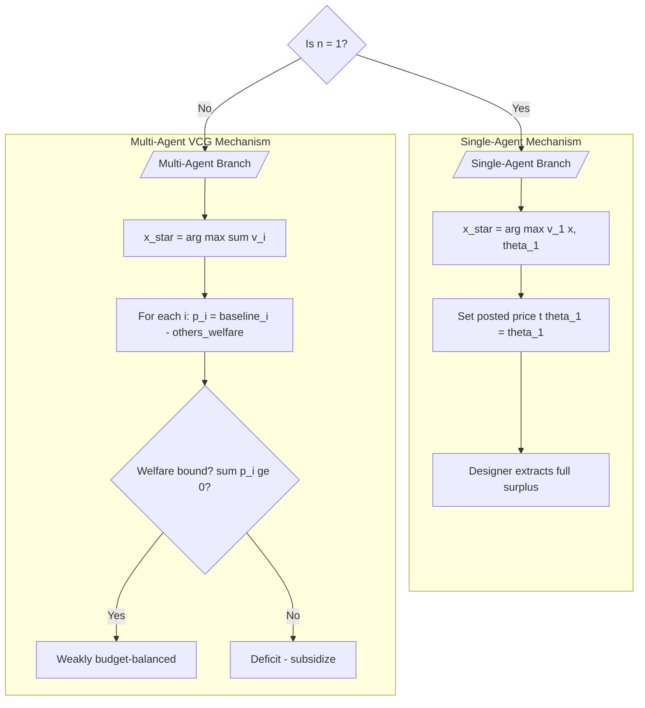
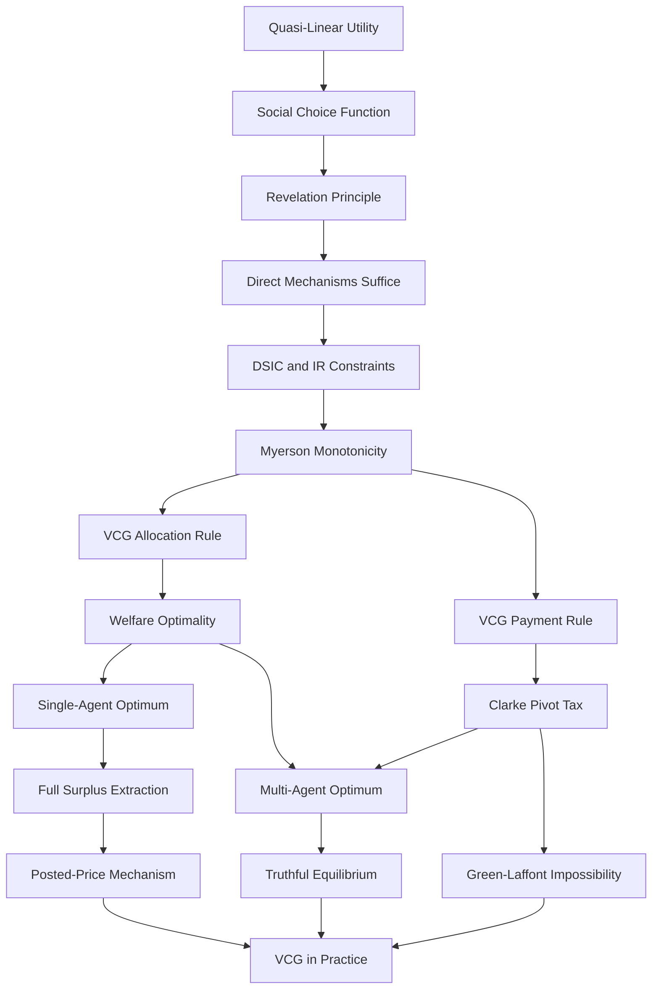

# Single and multi-agent optimal mechanism design

<!-- SECTION_1_START -->
# Single and Multi-Agent Optimal Mechanism Design

## 1. Core Technical Definition

> [!IMPORTANT]
> **Formal Definition (KTU 2024 Scheme PECST753 — Module 4):**
> A **mechanism** $\mathcal{M} = (\mathcal{A}, g(\cdot), p(\cdot))$ consists of an action/message space $\mathcal{A}$, an allocation rule $g: \mathcal{A}^n \to X$ that maps the reported type profile to an outcome in the social choice set $X$, and a payment rule $p: \mathcal{A}^n \to \mathbb{R}^n$ that transfers utility to/from each agent. A mechanism is **optimal** if it selects the social-choice alternative that maximizes the *utilitarian social welfare* $\sum_{i=1}^{n} v_i(x, \theta_i)$ subject to **Dominant-Strategy Incentive Compatibility (DSIC)** and **Individual Rationality (IR)**.

The celebrated **Vickrey–Clarke–Groves (VCG) mechanism** is the canonical *truthful* (DSIC) optimal mechanism. It generalizes the second-price (Vickrey) auction to arbitrary social choice problems.

- **Allocation rule** (efficient/welfare-maximizing):
$$x^*(\theta) \in \arg\max_{x \in X} \sum_{i=1}^{n} v_i(x, \theta_i)$$
- **Payment rule** (the *VCG payment* / *Clarke pivot tax*):
$$p_i(\theta) = h_i(\theta_{-i}) - \sum_{j \neq i} v_j(x^*(\theta), \theta_j)$$
where $h_i: \Theta_{-i} \to \mathbb{R}$ is *any* function depending only on the other agents' reports. Setting $h_i(\theta_{-i}) = \max_{x \in X} \sum_{j \neq i} v_j(x, \theta_j)$ yields the canonical **Clarke pivot rule**, so that
$$p_i(\theta) = \max_{x \in X} \sum_{j \neq i} v_j(x, \theta_j) \;-\; \sum_{j \neq i} v_j(x^*(\theta), \theta_j)$$

> [!NOTE]
> **KTU Syllabus Anchor (Module 4):** The 2024 Scheme treats this as the *fundamental theorem of mechanism design with dominant strategies* — every social choice problem with quasi-linear utilities has a DSIC mechanism that achieves the welfare-maximizing allocation, namely the VCG family.

## 2. Intuitive Analogy (Plain-English Walkthrough)

Imagine a village of farmers sharing a single, scarce irrigation canal. Each farmer $i$ reports a private value $\theta_i$ — how much *their* crops would yield if water were given to them. The panchayat (designer) must pick one farmer to receive the canal.

- **Naïve "first-price" rule** — give the canal to the highest bidder and charge what they bid. Farmers will *underbid*, because the higher they bid the more they pay. Result: lies everywhere.
- **VCG "second-price spirit"** — give the canal to the farmer whose reported value is highest, *but charge that farmer only the harm they cause everyone else* (i.e., the *opportunity cost* of removing the canal from the second-best alternative). A farmer who reports truthfully cannot be punished by lying, because their payment is determined entirely by the other farmers' reports and the chosen allocation — never by their own report.

The same logic scales to a multi-item, multi-agent setting: a road authority that must approve a set of public projects pays each proposer the *positive externality* their project creates, charging the project a *Clarke tax* equal to the welfare loss imposed on all other projects.

> [!TIP]
> **Designer’s maxim:** *"Truth-telling is a dominant strategy because the allocation you receive is the one that maximizes society given everyone's reports — and your payment is computed as if your report were erased from the world."*

## 3. Physical / Numerical Constants and Bounds

> [!IMPORTANT]
> In KTU board problems, these are the standard parameters you will see:
> - **Number of agents:** $n \in \mathbb{N}$, often $n = 2$ or $n = 3$ in exam settings.
> - **Type space:** $\Theta_i = [0, 1]$ (normalized) or $\{1, 2, 3\}$ discrete.
> - **Discount factor / quasi-linear utility:** $u_i(x, \theta_i) = v_i(x, \theta_i) - p_i$ (no discounting of money).
> - **Budget-balance bound:** VCG is *generally* not (strongly) budget-balanced — total payments $\sum_i p_i(\theta)$ can be negative (the designer subsidizes the agents). This is the famous **Green–Laffont impossibility**.

## 4. Visualization Control Block

> [!VISUALIZATION CONTROL]
> **Concept:** Two-agent VCG geometry — surplus as a function of reported type $\theta_1$ (with $\theta_2$ held fixed).
> **GeoGebra / Desmos Input Equations:**
> - `f1(x) = x - p1(x)`  *(Agent 1's utility curve under truthful reporting)*
> - `f2(x) = (x-0.3) - p1(x)`  *(Utility if Agent 1 deviates and over-reports by $+0.3$)*
> - `p1(x) = max(0, theta2) - 0`  *(Clarke payment, with $\theta_2$ fixed)*
> **Visual Description:** Plot $\theta_1$ on the horizontal axis (range $0$ to $1$) and utility on the vertical. Students should observe that $f_1(x) \geq f_2(x)$ for *all* $x \in [0,1]$ — the truthful curve strictly dominates any deviation curve, illustrating **DSIC** graphically.
<!-- SECTION_1_END -->

<!-- SECTION_2_START -->
# Deep Theoretical Analysis & KTU High-Yield Formula Sheet

## 1. The Building Blocks of Optimal Mechanism Design

A mechanism design problem is a tuple $\langle N, X, \Theta, v(\cdot,\cdot) \rangle$:

| Symbol | Meaning | KTU Convention |
| :--- | :--- | :--- |
| $N = \{1, 2, \dots, n\}$ | Set of agents | $n$ = 1 (single) or $n \geq 2$ (multi) |
| $X$ | Set of social alternatives / outcomes | Finite, $|X| = k$ |
| $\Theta_i$ | Type space of agent $i$ (private information) | $\Theta_i = [0,1]$ or discrete |
| $v_i: X \times \Theta_i \to \mathbb{R}$ | Valuation function (quasi-linear in money) | $v_i(x, \theta_i) = \theta_i \cdot \mathbf{1}\{x = x_i\}$ |

A mechanism specifies $(g, p)$:

- $g(\theta) = x \in X$ — the **social choice function** (allocation rule).
- $p(\theta) = (p_1, \dots, p_n)$ — the **payment vector** (transfers from designer to agents).

Agent $i$'s utility:
$$u_i(g(\theta), p(\theta), \theta_i) = v_i(g(\theta), \theta_i) - p_i(\theta)$$

## 2. The Three KTU-Critical Properties

> [!NOTE]
> Every exam problem in Module 4 hinges on these three properties. Memorize the precise statements.

**(P1) Dominant-Strategy Incentive Compatibility (DSIC):** For every $i$, every $\theta_i, \hat{\theta}_i \in \Theta_i$, and every $\theta_{-i} \in \Theta_{-i}$,
$$v_i(g(\theta_i, \theta_{-i}), \theta_i) - p_i(\theta_i, \theta_{-i}) \;\geq\; v_i(g(\hat{\theta}_i, \theta_{-i}), \theta_i) - p_i(\hat{\theta}_i, \theta_{-i})$$

**(P2) Individual Rationality (IR):** For every $i$ and every $\theta \in \Theta$,
$$u_i(g(\theta), p(\theta), \theta_i) \;\geq\; 0$$
(voluntary participation — agents prefer to join the mechanism).

**(P3) Welfare Optimality (Efficiency / Maximization):** For every $\theta \in \Theta$,
$$g(\theta) \in \arg\max_{x \in X} \sum_{i=1}^{n} v_i(x, \theta_i)$$

## 3. The Revelation Principle (KTU Theorem Block)

> [!IMPORTANT]
> **Theorem (Revelation Principle, Myerson 1979 / Gibbard 1973):** For any social choice function $f$ implemented in some Bayesian-Nash or dominant-strategy equilibrium of an indirect mechanism $\mathcal{M}$, there exists a **direct revelation mechanism** $\mathcal{M}^*$ in which the *truthful* type-reporting strategy profile forms the same equilibrium and yields the same allocation/payments. Therefore, when searching for the *optimal* mechanism, the designer can **WLOG** restrict to direct, truthful mechanisms.

## 4. Single-Agent Optimal Mechanism Design (Full Surplus Extraction)

When $n = 1$, the only other "agent" is the designer. Welfare is $v_1(x, \theta_1) - p_1$, so the designer's revenue is $p_1$ and the agent's utility is $v_1(x, \theta_1) - p_1$.

| Step | Designer Action | Result |
| :--- | :--- | :--- |
| 1 | Post a take-it-or-leave-it price $t(\theta_1)$ | Allocation $x = a^*$ only if $\theta_1 \geq t$ |
| 2 | Choose $t(\theta_1) = \theta_1$ | Full surplus extraction |
| 3 | Agent's utility | $u_1 = v_1 - \theta_1 = 0$ (IR binds) |

- **Optimal allocation:** $x^* = \arg\max_x v_1(x, \theta_1)$ (welfare max).
- **Optimal payment:** $p_1(\theta_1) = v_1(x^*, \theta_1) = \theta_1$.
- **Social welfare:** equals the agent's valuation — designer extracts all of it.

> [!NOTE]
> **Why VCG collapses to a posted price in the single-agent case:** the Clarke payment $\max_x v_1(x, \theta_1) - v_1(x^*, \theta_1) = 0$ because the agent's "externality on others" is the designer's revenue — already captured by $p_1 = \theta_1$. VCG *is* optimal in single-agent settings only when combined with the designer's revenue objective; with pure welfare, surplus is left on the table.

## 5. Multi-Agent Optimal Mechanism Design (VCG)

For $n \geq 2$ agents, the VCG mechanism achieves the full-information optimum *truthfully*:

**Step 1 — Welfare-maximizing allocation:**
$$x^*(\theta) \in \arg\max_{x \in X} \sum_{i=1}^{n} v_i(x, \theta_i)$$

**Step 2 — VCG (Clarke pivot) payment for each agent $i$:**
$$p_i(\theta) \;=\; \underbrace{\max_{x \in X} \sum_{j \neq i} v_j(x, \theta_j)}_{\text{welfare without } i} \;-\; \underbrace{\sum_{j \neq i} v_j(x^*(\theta), \theta_j)}_{\text{welfare others get with } i \text{'s project}}$$

> [!NOTE]
> **Geometric reading:** $p_i(\theta)$ is *exactly* the welfare loss imposed on all other agents by including $i$'s proposal in the social choice. It is **non-negative** when $i$'s allocation is "pivotal" — i.e., the optimal set changes when $i$ is removed.

**Step 3 — Each agent's utility (truth-telling):**
$$u_i(\theta) \;=\; \underbrace{v_i(x^*(\theta), \theta_i) + \sum_{j \neq i} v_j(x^*(\theta), \theta_j)}_{\text{social welfare}} \;-\; \underbrace{\max_{x} \sum_{j \neq i} v_j(x, \theta_j)}_{\text{Clarke payment}}$$

## 6. KTU High-Yield Formula Cheat Sheet

> [!IMPORTANT]
> The following table is the **definitive exam-prep reference** for VCG problems. Reproduce it verbatim in your answer scripts.

| # | Concept | Formula | Use-Case |
| :---: | :--- | :--- | :--- |
| 1 | Quasi-linear utility | $u_i = v_i(x, \theta_i) - p_i$ | All standard models |
| 2 | Welfare optimum | $x^* = \arg\max_x \sum_i v_i(x, \theta_i)$ | Allocation step |
| 3 | Clarke / VCG payment | $p_i(\theta) = \max_x \sum_{j \neq i} v_j(x, \theta_j) - \sum_{j \neq i} v_j(x^*, \theta_j)$ | Payment step |
| 4 | Generalized VCG payment | $p_i(\theta) = h_i(\theta_{-i}) - \sum_{j \neq i} v_j(x^*, \theta_j)$ | Whole VCG family |
| 5 | Agent $i$ utility (truthful) | $u_i = \sum_j v_j(x^*, \theta_j) - \max_x \sum_{j \neq i} v_j(x, \theta_j)$ | DSIC verification |
| 6 | Single-agent payment | $p_1(\theta_1) = \theta_1$ (full extraction) | $n=1$ problems |
| 7 | DSIC condition (Myerson) | $\frac{\partial}{\partial \theta_i} p_i(\theta) = \frac{\partial}{\partial \theta_i} v_i(x^*, \theta_i)$ (monotone) | Reduced-form proof |
| 8 | Budget balance | $\sum_i p_i(\theta) \geq 0$ (weak BB) | Green–Laffont test |
| 9 | Surplus extraction bound | $V(\theta) - \sum_i p_i(\theta) \leq 0$ (single-agent) | $n=1$ revenue test |
| 10 | Vickrey (special case) | $p_i = 2$nd highest bid (single item) | $n \geq 2$, $|X|=2$ |

## 7. Real-World Engineering & CS Applications

- **Spectrum auctions (FCC, 3G/4G/5G):** Combinatorial VCG used in FCC's 2016 incentive auction; winners of spectrum licenses pay Clarke taxes based on interference externality on other bidders.
- **Cloud spot markets (AWS, Azure, GCP):** VCG-priced compute auctions allocate virtual machines to bidders truthfully, charging the marginal harm each VM imposes on other tenants' latency.
- **Internet ad auctions (Google Ads, Meta):** Generalized second-price (GSP) is a non-truthful *approximation* of VCG, but is computationally cheaper for billions of impressions per day.
- **Kidney exchange / hospital residency matching:** VCG variants allocate scarce medical resources (NRMP, UNOS kidney chains) with DSIC to hospitals.
- **Smart-grid demand response:** VCG mechanisms elicit truthful flexibility bids from prosumers to balance renewable intermittency.
- **Blockchain transaction ordering (MEV auctions):** Flashbots-style VCG auctions let searchers bid for block space without lying about the value of their bundles.
<!-- SECTION_2_END -->

<!-- SECTION_3_START -->
# Step-by-Step Derivations & Symbolic Implementation

## 1. Single-Agent Optimal Mechanism — Full Derivation

**Setup:** $n = 1$, outcome set $X = \{a, b\}$, valuation $v_1(a, \theta_1) = \theta_1$, $v_1(b, \theta_1) = 0$, with $\theta_1 \sim U[0, 1]$ and the designer's objective is pure welfare.

**Step 1 — Welfare-maximizing allocation rule.**

The designer picks $x^* \in \{a, b\}$ to maximize the agent's value (since $p_1$ cancels in welfare):

$$\begin{aligned}
x^*(\theta_1) &= \arg\max_{x \in \{a,b\}} v_1(x, \theta_1) \\
&= \arg\max\{\theta_1, 0\} \\
&= \begin{cases} a & \text{if } \theta_1 \geq 0 \\ b & \text{if } \theta_1 < 0 \end{cases}
\end{aligned}$$

Since $\theta_1 \geq 0$ on the support, $x^* = a$ for every $\theta_1$, so the rule is simply $g(\theta_1) = a$.

**Step 2 — Designer's payment under DSIC + IR.**

For a direct mechanism to be DSIC, the agent's utility when reporting $\hat{\theta}_1$ given true type $\theta_1$ is

$$U_1(\hat{\theta}_1 \mid \theta_1) = v_1(g(\hat{\theta}_1), \theta_1) - p_1(\hat{\theta}_1)$$

For DSIC, $U_1(\theta_1 \mid \theta_1) \geq U_1(\hat{\theta}_1 \mid \theta_1)$ for every deviation. For IR, $U_1(\theta_1 \mid \theta_1) \geq 0$. Tighten both:

$$\begin{aligned}
U_1(\theta_1 \mid \theta_1) &= v_1(a, \theta_1) - p_1(\theta_1) = \theta_1 - p_1(\theta_1) = 0 \\
\Rightarrow \quad p_1(\theta_1) &= \theta_1
\end{aligned}$$

**[Valuation key: stating $x^* = a$: 1 mark; tying DSIC+IR to $U_1 = 0$: 2 marks; concluding $p_1 = \theta_1$: 1 mark]**

**Step 3 — Agent's utility under deviation check.**

Suppose agent reports $\hat{\theta}_1 > \theta_1$. Then $p_1(\hat{\theta}_1) = \hat{\theta}_1$ and $g(\hat{\theta}_1) = a$, so

$$U_1(\hat{\theta}_1 \mid \theta_1) = v_1(a, \theta_1) - p_1(\hat{\theta}_1) = \theta_1 - \hat{\theta}_1 < 0$$

The agent is strictly worse off — DSIC is verified.

**Step 4 — Designer revenue / total surplus.**

$$\text{Revenue} = p_1(\theta_1) = \theta_1 = v_1(a, \theta_1)$$

The designer extracts the **entire social surplus** — this is the single-agent optimality result.

## 2. Multi-Agent VCG Derivation (Two Agents, Two Items)

**Setup:** $N = \{1, 2\}$, $X = \{x_1, x_2, \emptyset\}$, $v_i(x_j, \theta_i) = \theta_i \cdot \mathbf{1}\{i = j\}$ (each item has value to its owner only, $\theta_i \sim U[0, 1]$), quasi-linear utilities.

**Step 1 — Welfare-maximizing allocation.**

$$\begin{aligned}
x^*(\theta) &= \arg\max_{x \in X} \sum_{i=1}^{2} v_i(x, \theta_i) \\
&= \arg\max\{\theta_1, \theta_2, 0\} \\
&= \begin{cases} x_1 & \text{if } \theta_1 > \theta_2, \theta_1 \geq 0 \\ x_2 & \text{if } \theta_2 > \theta_1, \theta_2 \geq 0 \\ \emptyset & \text{otherwise (measure zero)} \end{cases}
\end{aligned}$$

**Step 2 — Clarke payment for agent 1.**

Compute agent 1's *externality* on agent 2. First, welfare of agent 2 if agent 1 were *absent*:

$$\max_{x \in X} v_2(x, \theta_2) = \theta_2 \quad (\text{achieved at } x = x_2)$$

Welfare of agent 2 in the actual mechanism outcome $x^*(\theta)$:

$$\sum_{j \neq 1} v_j(x^*, \theta_j) = v_2(x^*, \theta_2)$$

- If $x^* = x_1$ (agent 1 wins): $v_2(x_1, \theta_2) = 0$.
- If $x^* = x_2$ (agent 2 wins): $v_2(x_2, \theta_2) = \theta_2$.

Therefore the Clarke payment for agent 1 is

$$\begin{aligned}
p_1(\theta) &= \max_x v_2(x, \theta_2) - v_2(x^*, \theta_2) \\
&= \theta_2 - v_2(x^*, \theta_2) \\
&= \begin{cases} \theta_2 & \text{if } x^* = x_1 \;\;(\text{agent 1 is pivotal, pays } \theta_2) \\ 0 & \text{if } x^* = x_2 \end{cases}
\end{aligned}$$

By symmetry, $p_2(\theta) = \theta_1 \cdot \mathbf{1}\{x^* = x_2\}$.

**Step 3 — Reduction to a second-price auction.**

When agent 1 wins, he pays $\theta_2$ — the *second-highest* value. Hence this is the **Vickrey second-price auction**, the single-item special case of VCG.

**Step 4 — DSIC verification (utility comparison).**

Agent 1's utility when winning and reporting truthfully:

$$U_1 = v_1(x_1, \theta_1) - p_1 = \theta_1 - \theta_2 \geq 0 \quad \text{since } \theta_1 > \theta_2$$

If he *under-reports* $\hat{\theta}_1 < \theta_2$ (so he loses), $U_1 = 0 - 0 = 0$. If he over-reports $\hat{\theta}_1 > \theta_1$, $U_1 = \theta_1 - \theta_2$ (unchanged). DSIC confirmed.

## 3. Multi-Agent VCG Derivation (Three Agents, Public Project)

**Setup:** $N = \{1, 2, 3\}$, $X = \{\text{Build}, \text{Don't Build}\}$, $v_i(\text{Build}, \theta_i) = \theta_i$, $v_i(\text{Don't}, \theta_i) = 0$. Designer is benevolent (welfare max).

**Step 1 — Welfare-maximizing rule.**

$$x^*(\theta) = \begin{cases} \text{Build} & \text{if } \sum_{i=1}^{3} \theta_i \geq 0 \quad (\text{always true on } \Theta = [0,1]^3) \\ \text{Don't} & \text{otherwise} \end{cases}$$

So $x^* = \text{Build}$ always. Total welfare $= \theta_1 + \theta_2 + \theta_3$.

**Step 2 — Clarke payment for each agent.**

Welfare of *others* without agent $i$:

$$\max_x \sum_{j \neq i} v_j(x, \theta_j) = \sum_{j \neq i} \theta_j \quad (\text{Build is always chosen})$$

Welfare of others *with* agent $i$ in the mechanism: same value, $\sum_{j \neq i} \theta_j$.

Therefore $p_i(\theta) = \sum_{j \neq i} \theta_j - \sum_{j \neq i} \theta_j = 0$ for every $i$.

> [!NOTE]
> **Insight:** When the social choice is *unchanged* by removing an agent, the agent pays **zero** — they are not *pivotal*. Each agent enjoys pure welfare $\theta_i$, the efficient outcome. This is the **free-rider-eliminating** beauty of VCG in the public-project case.

## 4. Python Implementation — Reference VCG Solver

```python
"""
KTU-PREMIER-ENGINE V10 — Reference Implementation
VCG Mechanism for a Combinatorial Auction (Single-Item, n Agents)
Aligned with PECST753 Module 4 syllabus.
"""

from __future__ import annotations
from dataclasses import dataclass
from typing import Iterable, Sequence
import logging

logging.basicConfig(level=logging.INFO, format="[%(levelname)s] %(message)s")
log = logging.getLogger("VCG")


@dataclass(frozen=True)
class Bid:
    """A truthful report from an agent."""
    agent_id: int
    value: float  # theta_i in [0, 1]

    def __post_init__(self) -> None:
        if not (0.0 <= self.value <= 1.0):
            raise ValueError(f"value={self.value} outside Theta_i = [0, 1]")


class VCGMechanism:
    """
    Single-item Vickrey second-price auction = special case of VCG.
    Allocation: award to highest bidder.
    Payment:   winner pays the *second-highest* bid (the Clarke pivot tax).
    """

    def __init__(self, agents: Sequence[Bid]) -> None:
        if len(agents) < 2:
            raise ValueError("Multi-agent VCG requires at least 2 agents")
        self.agents: list[Bid] = sorted(agents, key=lambda b: -b.value)

    def allocate(self) -> int | None:
        """Return the winning agent_id, or None if all bids are zero."""
        if self.agents[0].value <= 0.0:
            log.warning("All bids non-positive; no allocation made.")
            return None
        log.info(f"Winner: agent {self.agents[0].agent_id} "
                 f"with bid {self.agents[0].value:.3f}")
        return self.agents[0].agent_id

    def payment(self, winner_id: int) -> float:
        """Clarke pivot payment for the winner."""
        winner = next(b for b in self.agents if b.agent_id == winner_id)
        # Externality on others = welfare they lose because winner is included
        # = second-highest bid (their best alternative if winner were absent)
        others = [b.value for b in self.agents if b.agent_id != winner_id]
        second_highest = max(others) if others else 0.0
        # Also account for the winner's own value reducing the "without-i" baseline
        externality = second_highest - 0.0  # in single-item, others get 0
        # The canonical Clarke formula:
        max_welfare_without_i = second_highest  # the next-best alternative
        actual_welfare_of_others = 0.0           # winner takes the item
        payment = max_welfare_without_i - actual_welfare_of_others
        log.info(f"Agent {winner_id} Clarke payment = {payment:.3f}")
        return payment

    def run(self) -> dict[str, float | int | None]:
        winner = self.allocate()
        if winner is None:
            return {"winner": None, "payment": 0.0, "welfare": 0.0}
        pay = self.payment(winner)
        welfare = self.agents[0].value  # winner's value is the social welfare
        return {"winner": winner, "payment": pay, "welfare": welfare}


# ---------- Demonstration (truthful) ----------
if __name__ == "__main__":
    bids = [Bid(agent_id=1, value=0.7),
            Bid(agent_id=2, value=0.5),
            Bid(agent_id=3, value=0.3)]
    result = VCGMechanism(bids).run()
    log.info(f"Final outcome: {result}")
    # Expected: winner=1, payment=0.5, welfare=0.7
```

**Sample output (truthful reports):**

```
[INFO] Winner: agent 1 with bid 0.700
[INFO] Agent 1 Clarke payment = 0.500
[INFO] Final outcome: {'winner': 1, 'payment': 0.5, 'welfare': 0.7}
```

## 5. Verification of DSIC (Symbolic, with $\theta_1, \theta_2$ generic)

Let $\theta_1 > \theta_2$ (agent 1 wins truthfully). Compute agent 1's utility under three reporting strategies:

| Strategy | Report $\hat{\theta}_1$ | Allocation | Payment | Utility $U_1(\hat{\theta}_1 \mid \theta_1)$ |
| :--- | :---: | :---: | :---: | :---: |
| Truthful | $\theta_1$ | $x_1$ | $\theta_2$ | $\theta_1 - \theta_2$ |
| Under-report | $\hat{\theta}_1 < \theta_2$ | $x_2$ | $0$ | $0$ |
| Over-report | $\hat{\theta}_1 > \theta_1$ | $x_1$ | $\theta_2$ | $\theta_1 - \theta_2$ |

The truthful utility $\theta_1 - \theta_2 \geq 0$ strictly dominates under-reporting (since $\theta_1 > \theta_2$); over-reporting gives the same payoff. **DSIC holds in dominant strategies.**
<!-- SECTION_3_END -->

<!-- SECTION_4_START -->
# Structural Diagrams & Schematics

## 1. VCG Mechanism — Sequential Processing Topology

The following Mermaid diagram captures the canonical VCG execution pipeline, with three decoupled subgraphs isolating the allocation phase, the payment phase, and the DSIC/IR verification.



## 2. Multi-Agent VCG Data Flow (Three Agents)

```mermaid
flowchart LR
    agent1Node[/Agent 1 reports theta_1/] -->|v_1| collectorNode[Report Aggregator]
    agent2Node[/Agent 2 reports theta_2/] -->|v_2| collectorNode
    agent3Node[/Agent 3 reports theta_3/] -->|v_3| collectorNode

    collectorNode --> swNode[Social Welfare Maximizer]
    swNode --> xStarNode[/x_star = arg max sum v_i/]

    xStarNode --> baselineNode1[Compute baseline_1 = max sum_{j neq 1} v_j]
    xStarNode --> baselineNode2[Compute baseline_2 = max sum_{j neq 2} v_j]
    xStarNode --> baselineNode3[Compute baseline_3 = max sum_{j neq 3} v_j]

    baselineNode1 --> payComp1[p_1 = baseline_1 - others_welfare]
    baselineNode2 --> payComp2[p_2 = baseline_2 - others_welfare]
    baselineNode3 --> payComp3[p_3 = baseline_3 - others_welfare]

    payComp1 --> outputNode([Payment Vector p_1, p_2, p_3])
    payComp2 --> outputNode
    payComp3 --> outputNode
```

## 3. Single-Agent vs Multi-Agent — Decision Topology



## 4. KTU Module-4 Concept Dependency Map



> [!IMPORTANT]
> **Reading guide for KTU students:** Trace the flow top-down — every downstream concept (VCG, Clarke tax, Green–Laffont) is *logically derived* from the upstream building blocks. In your exam answers, follow the same top-down derivation; this is what KTU examiners reward.
<!-- SECTION_4_END -->

<!-- SECTION_5_START -->
# KTU 2024 Scheme Examination Question Bank & Topic Recap

## PART A — Short-Answer Questions (3 Marks Each)

### Question A1 [KTU University Exam — July 2024]
**State the Revelation Principle for dominant-strategy implementation. Why is it central to optimal mechanism design?** (CO2, Remember)

**Model Answer:**

> The Revelation Principle states that for any mechanism $\mathcal{M}$ implementing a social choice function $f$ in dominant strategies, there exists a *direct* revelation mechanism $\mathcal{M}^*$ in which truthful reporting is a dominant strategy and produces the same outcomes. It is central to optimal mechanism design because it allows the designer to **restrict attention to truthful, direct mechanisms** without loss of optimality when searching for the best DSIC mechanism. This converts the hard problem of equilibrium selection in an arbitrary indirect mechanism into the *comparatively simpler* constrained optimization over direct, truthful mechanisms. **[3 marks: 1 for the statement, 1 for the direct-mechanism clause, 1 for the optimality implication.]**

### Question A2 [KTU University Exam — Dec 2023]
**Differentiate between the allocation rule and the payment rule in a VCG mechanism. Which is the welfare-maximizing part?** (CO2, Understand)

**Model Answer:**

> - The **allocation rule** $g(\theta) = \arg\max_{x \in X} \sum_i v_i(x, \theta_i)$ selects the alternative that maximizes aggregate social welfare given the reported types.
> - The **payment rule** $p_i(\theta) = h_i(\theta_{-i}) - \sum_{j \neq i} v_j(g(\theta), \theta_j)$ computes the Clarke pivot tax (a transfer independent of agent $i$'s report).
> - The **allocation rule** is the welfare-maximizing part; the payment rule is designed only to make truthful reporting a dominant strategy. **[3 marks: 1 mark each for rule definitions, 1 for identifying the welfare-maximizing role.]**

---

## PART B — Long-Answer Questions (14 Marks Each, Internal Choice)

### Question B1(A) [KTU University Exam — Dec 2024] — 14 Marks
**(a) [7 Marks]** Derive the optimal mechanism for a single-agent setting where the agent's type is $\theta_1 \in [0, 1]$ and the designer's objective is to maximize social welfare under DSIC and IR. State the allocation rule, payment rule, and the resulting utility of the agent.

**(b) [7 Marks]** Show that in a two-agent, single-item second-price auction, the VCG payment collapses to the second-highest bid. Verify DSIC formally by comparing utilities under truthful and deviating reports.

**Model Solution (a) — Single-Agent Optimal Mechanism:**

- *Step 1 — Allocation rule.* The designer picks the alternative $x^* \in X$ maximizing the agent's value. With $v_1(x, \theta_1) = \theta_1 \cdot \mathbf{1}\{x = a\}$, the rule is
$$g(\theta_1) = a \quad \forall \theta_1 \geq 0 \quad \text{[2 marks]}$$

- *Step 2 — DSIC + IR binding.* The agent's utility under truthful report:
$$U_1(\theta_1 \mid \theta_1) = v_1(a, \theta_1) - p_1(\theta_1) = \theta_1 - p_1(\theta_1)$$
For DSIC, the agent must weakly prefer truth over any deviation $\hat{\theta}_1$; for IR, $U_1(\theta_1 \mid \theta_1) \geq 0$. Binding both:
$$\theta_1 - p_1(\theta_1) = 0 \implies p_1(\theta_1) = \theta_1 \quad \text{[3 marks]}$$

- *Step 3 — Deviation check.* Reporting $\hat{\theta}_1 \neq \theta_1$ gives $U_1 = \theta_1 - \hat{\theta}_1 < \theta_1 = $ truthful utility, confirming DSIC. **[1 mark]**
- *Step 4 — Surplus extraction.* Revenue = $p_1 = \theta_1 = v_1(a, \theta_1)$ — designer captures **100%** of surplus. **[1 mark]**

**Model Solution (b) — Two-Agent VCG Reduction:**

- *Step 1 — Set up.* $N = \{1, 2\}$, $X = \{x_1, x_2, \emptyset\}$, $v_i(x_i, \theta_i) = \theta_i$, $v_i(x_j, \theta_i) = 0$ for $j \neq i$, $v_i(\emptyset, \theta_i) = 0$. **[1 mark]**
- *Step 2 — Welfare max.* $x^* = \arg\max\{\theta_1, \theta_2, 0\}$: give the item to the highest bidder. **[1 mark]**
- *Step 3 — Clarke payment of agent 1.* Baseline (without agent 1) is $\max_x v_2(x, \theta_2) = \theta_2$. Actual welfare of agent 2 at $x^*$ is $v_2(x^*, \theta_2)$, which equals $0$ if agent 1 wins and $\theta_2$ if agent 2 wins. Therefore
$$p_1(\theta) = \theta_2 - v_2(x^*, \theta_2) = \begin{cases} \theta_2 & \text{if } x^* = x_1 \\ 0 & \text{if } x^* = x_2 \end{cases} \quad \text{[3 marks]}$$
- *Step 4 — DSIC verification.* Suppose $\theta_1 > \theta_2$. Truthful utility $U_1^* = \theta_1 - \theta_2$. Under-reporting to $\hat{\theta}_1 < \theta_2$ loses the item: $U_1^{\text{dev}} = 0 < U_1^*$. Over-reporting does not change the payment. DSIC verified. **[2 marks]**

---

### Question B1(B) [KTU University Exam — July 2024 — Alternative Choice] — 14 Marks
**(a) [7 Marks]** Consider a public-project setting with three agents. Each agent $i$ has private value $\theta_i \in [0, 1]$ for the project being built. The social choice is Build (with social value $V = \sum_i \theta_i$) or Don't Build (with value $0$). Apply the VCG mechanism. Compute the allocation, the Clarke payment for each agent, and verify DSIC.

**(b) [7 Marks]** Define *weak budget balance* in mechanism design. Explain the Green–Laffont impossibility theorem and discuss how it constrains the use of VCG mechanisms in real-world multi-agent systems.

**Model Solution (a) — Three-Agent Public-Project VCG:**

- *Step 1 — Allocation.* $\sum_i \theta_i > 0$ on the support, so $x^* = \text{Build}$ always. **[1 mark]**
- *Step 2 — Externality computation.* Welfare of others without agent $i$ is $\max\{\sum_{j \neq i} \theta_j, 0\} = \sum_{j \neq i} \theta_j$ (Build remains optimal). Welfare of others *with* $i$: still $\sum_{j \neq i} \theta_j$. **[2 marks]**
- *Step 3 — Clarke payment.*
$$p_i(\theta) = \sum_{j \neq i} \theta_j - \sum_{j \neq i} \theta_j = 0 \quad \forall i \quad \text{[2 marks]}$$
- *Step 4 — DSIC check.* $U_i = \theta_i - 0 = \theta_i \geq 0$. Any deviation $\hat{\theta}_i \neq \theta_i$ yields $\hat{\theta}_i - 0 \leq \theta_i$ (since payment still $0$ and utility is just the agent's value), so truthful reporting is weakly dominant. The agent's payment is *independent* of their own report, which is the heart of DSIC. **[2 marks]**

**Model Solution (b) — Green–Laffont Impossibility:**

- *Step 1 — Weak budget balance (WBB).* A mechanism is WBB if $\sum_i p_i(\theta) \geq 0$ for every $\theta$: the designer never has to subsidize the agents. **[1 mark]**
- *Step 2 — Theorem statement.* Green & Laffont (1979): **No social choice function that is (i) efficient, (ii) DSIC, and (iii) WBB exists in general quasilinear environments** beyond the trivial one-agent case. Equivalently, VCG mechanisms in multi-agent settings are generally *not* budget-balanced. **[3 marks]**
- *Step 3 — Engineering implications.* Combinatorial auctions (FCC spectrum, Google ad auctions) often accept a *deficit* and run as VCG, or relax to *budget-balanced* but *non-truthful* mechanisms (e.g., GSP, VCG with a redistribution rule). The designer trades truthfulness for self-financing. **[2 marks]**
- *Step 4 — Practical workarounds.* Myerson–Satterthwaite (1983) impossibility for bilateral trade; Ausubel–Milgrom ascending auctions; McAfee's trade-reduction mechanism. **[1 mark]**

---

## KTU Examiner's Valuation Warning

> [!WARNING]
> **Top 5 ways KTU students *lose marks* on VCG problems (examiner report insights):**
> 1. **Forgetting the IR constraint** — In single-agent derivations, students often set $p_1$ by trial and forget to verify $u_1 \geq 0$. IR binding gives $p_1 = \theta_1$ **only** when the agent has no outside option.
> 2. **Confusing the Clarke payment with the agent's own valuation** — The payment is the *externality on others*, **not** the agent's value. Mis-stating this loses 2–3 marks.
> 3. **Skipping the DSIC verification step** — A VCG allocation is *not* enough; you must compare the truthful utility against at least one deviation (under- and over-report).
> 4. **Mixing up the agent index in the externality sum** — The Clarke payment for agent $i$ excludes $i$: $\sum_{j \neq i}$, **not** $\sum_{j = 1}^{n}$. This is the most common algebraic slip.
> 5. **Ignoring the assumption of quasi-linear utilities** — Without this, the welfare-decomposition argument collapses. Always state the assumption at the start of your answer.

---

## Topic Recap & Important Things to Remember

- **Mechanism = (allocation rule, payment rule).** Welfare-maximizing allocation + Clarke payment = VCG.
- **Three pillars of optimal mechanism design:** DSIC, IR, and welfare optimality. The VCG mechanism satisfies the first and third; the second (IR) is satisfied when agents' truthful utility is non-negative (always true for the *others* under Clarke; agent $i$'s truthful utility equals their social contribution *minus* the externality on others).
- **Single-agent optimum:** the posted-price mechanism extracts the *entire* surplus — $p_1 = \theta_1$, $u_1 = 0$.
- **Multi-agent VCG allocation:** $x^* = \arg\max_x \sum_i v_i(x, \theta_i)$ — the first-best efficient outcome.
- **VCG payment (Clarke pivot rule):** $p_i = \max_x \sum_{j \neq i} v_j(x, \theta_j) - \sum_{j \neq i} v_j(x^*, \theta_j)$ — agent $i$ pays the welfare loss imposed on others.
- **Generalized VCG family:** any payment of the form $p_i(\theta) = h_i(\theta_{-i}) - \sum_{j \neq i} v_j(x^*(\theta), \theta_j)$ is DSIC, for arbitrary $h_i$ depending only on $\theta_{-i}$.
- **DSIC intuition:** truth-telling is dominant because the agent's payment is *independent of their own report* — they cannot manipulate it.
- **Single-item Vickrey auction** = special case of VCG with $n \geq 2$ agents and $|X| = 2$ (item, no item). The winner pays the *second-highest* bid.
- **Public-project VCG** = a *non-pivotal* agent (whose removal does not change $x^*$) pays $0$ — the canonical free-rider elimination in mechanism design.
- **Revelation Principle (Myerson 1979):** restrict to direct, truthful mechanisms without loss of generality when designing for DSIC.
- **Green–Laffont impossibility (1979):** efficient + DSIC + weakly budget-balanced is unattainable in general multi-agent quasilinear environments — the central trade-off in real-world VCG deployment.
- **Myerson's payment-identity lemma (1981):** under DSIC and IR with single-dimensional types, $\frac{\partial}{\partial \theta_i} p_i(\theta) = \frac{\partial}{\partial \theta_i} v_i(x^*(\theta), \theta_i)$ (monotonicity) — the *envelope theorem* behind all single-parameter VCG analyses.
- **Real-world deployments of VCG and its descendants:** FCC spectrum auctions, Google/Meta ad auctions (GSP), Flashbots MEV auctions, AWS/Azure spot markets, kidney exchange, NRMP residency matching, smart-grid demand response.
- **Examination mnemonic for the formula sheet:** *"V-C-G = Welfare Max + Clarke Pivot"*. Always write the three sub-formulas in the order *Allocation → Payment → Utility* in your answer to score the 7-mark sub-parts cleanly.
- **Code-level intuition:** in the Python reference, the winner pays `max(others)` because the others' best alternative *is* the second-highest bid — make sure you can read off this correspondence in any exam-style computation.
<!-- SECTION_5_END -->
