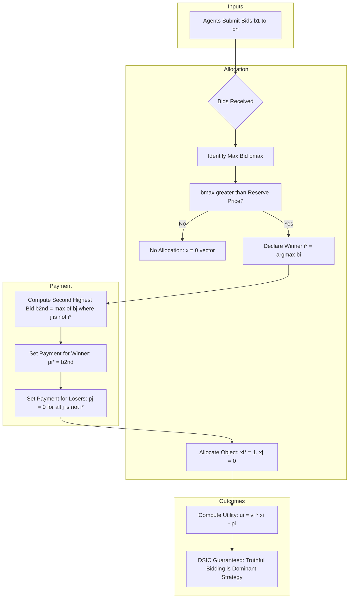
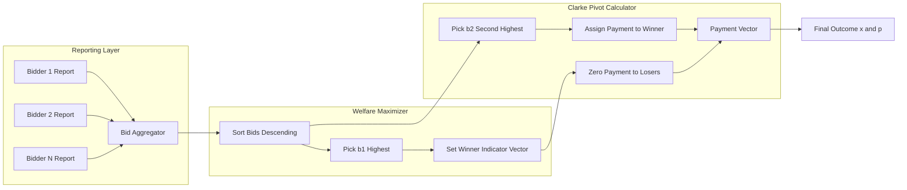

# single object allocation

<!-- SECTION_1_START -->

# Single Object Allocation & The VCG Mechanism

## 1.1 Formal Definition (KTU 2024 Syllabus Terminology)

A **Single Object Allocation Problem** is a canonical mechanism design setting in which a single indivisible item must be assigned to exactly one agent (or to no one) from a set of $n$ self-interested agents $\mathcal{N} = \{1, 2, \ldots, n\}$. Each agent $i$ holds a private valuation $v_i \in \mathbb{R}_{\geq 0}$ for receiving the object, and reports a (possibly untruthful) bid $b_i$ to a central planner (the "mechanism designer").

A **direct revelation mechanism** $\mathcal{M} = (\mathbf{x}, \mathbf{p})$ is a pair of social choice rules:

$$
\mathbf{x} : \mathbb{R}_{\geq 0}^{n} \rightarrow \Delta(\mathcal{N} \cup \{\emptyset\}) \quad \text{(allocation rule)}
$$

$$
\mathbf{p} : \mathbb{R}_{\geq 0}^{n} \rightarrow \mathbb{R}^{n} \quad \text{(payment rule)}
$$

where $x_i(\mathbf{b}) \in \{0,1\}$ is the probability/indicator that bidder $i$ wins, and $p_i(\mathbf{b})$ is the monetary transfer (payment) from bidder $i$ to the mechanism.

> [!IMPORTANT]
> **Vickrey-Clarke-Groves (VCG) Mechanism**: For the single object allocation setting, the VCG mechanism is defined as the pair $(\mathbf{x}^{*}, \mathbf{p}^{VCG})$ where $\mathbf{x}^{*}$ maximizes the **total reported social welfare** and the payments are determined by the **Clarke (pivot) rule**.

The utility of agent $i$ is quasi-linear:

$$
u_i(\mathbf{b}) = v_i \cdot x_i(\mathbf{b}) - p_i(\mathbf{b})
$$

## 1.2 Intuitive Overview & Real-World Analogy

> [!NOTE]
> **Conceptual Analogy — The Antique Auction House**
>
> Imagine a small town auctioning a single antique vase. Three collectors (Alice, Bob, Carol) silently value the vase at $v_A, v_B, v_C$ respectively — these valuations are *private*. They each write down a bid. The auctioneer must decide:
> 1. **Who gets the vase?** (allocation rule)
> 2. **How much does the winner pay?** (payment rule)
>
> In a naive **first-price auction**, bidders shade their bids below true value (because they want to pay less). This strategic behavior makes outcomes unpredictable and inefficient — the vase may even end up with a bidder who values it *less* than the true top valuer.
>
> The **VCG mechanism** brilliantly solves this: give the vase to the highest bidder (efficient), but charge the winner not his own bid, but **the opportunity cost he imposes on everyone else** (the second-highest valuation). This makes *truth-telling* the dominant strategy. Bidders simply report what the vase is worth to them, period.

> [!VISUALIZATION CONTROL]
> **Concept:** VCG Bid Space and Allocation Regions
> **GeoGebra / Desmos Input Equations:**
> * `v_A = 100, v_B = 80, v_C = 120`
> * Region A (truthful): `v_C + 1 > v_A > v_C - 1` → bidder 3 wins
> * Payment curve: `p_3 = max(v_A, v_B) = 100`
>
> **Visual Description:** A 2D plane with axes $b_1, b_2$ for two bidders. The plane is partitioned by the diagonal $b_1 = b_2$ into two triangular regions (winner = bidder 1 vs winner = bidder 2). Inside each triangle, draw level curves of the payment function $p_i$ — they are *flat* (constant) along the direction where the loser is unaffected, and *jump* at the diagonal.

## 1.3 Why Single Object Allocation Matters

This is the foundational building block of:
- **Spectrum auctions** (FCC, 4G/5G spectrum allocation)
- **Online advertising auctions** (Google, Meta, Bing ad slots)
- **Cloud computing resource allocation**
- **Government procurement tenders**

The **mechanism design constant** here is $0$ (no fixed cost) and the allocation space is binary: $x_i \in \{0, 1\}$ with $\sum_{i} x_i \leq 1$.

<!-- SECTION_1_END -->

<!-- SECTION_2_START -->

# Deep Theoretical Analysis & KTU High-Yield Formula Sheet

## 2.1 The Welfare Maximization Problem

Given reported bids $\mathbf{b} = (b_1, \ldots, b_n)$, the **efficient allocation** $\mathbf{x}^{*}(\mathbf{b})$ solves:

$$
\mathbf{x}^{*}(\mathbf{b}) = \arg\max_{\mathbf{x} \in \mathcal{X}} \sum_{i \in \mathcal{N}} b_i \cdot x_i
$$

For the single object setting, $\mathcal{X} = \{\mathbf{x} \in \{0,1\}^{n} : \sum_i x_i \leq 1\}$. The solution is:

$$
x_i^{*}(\mathbf{b}) = \begin{cases} 1 & \text{if } b_i > \max_{j \neq i} b_j \\ 0 & \text{otherwise} \end{cases}
$$

**Tie-breaking:** If multiple bidders report the maximum bid, select the lowest-index bidder (deterministic tie-break).

> [!NOTE]
> **The Welfare Optimum**: $\text{SW}^{*}(\mathbf{b}) = \max\{0, \max_i b_i\}$ — either the highest bid wins, or no one gets the object (if the mechanism has an outside option).

## 2.2 The Groves Family of Payment Rules

A payment rule $\mathbf{p}$ is in the **Groves family** if there exists some function $h_j : \mathbb{R}_{\geq 0}^{\mathcal{N} \setminus \{j\}} \rightarrow \mathbb{R}$ such that:

$$
p_i(\mathbf{b}) = h_i(\mathbf{b}_{-i}) - \sum_{j \neq i} b_j \cdot x_j^{*}(\mathbf{b})
$$

where $\mathbf{b}_{-i} = (b_1, \ldots, b_{i-1}, b_{i+1}, \ldots, b_n)$.

The function $h_i$ depends only on others' reports — it is the **"bonus"** the mechanism designer can arbitrarily choose (independent of $b_i$).

## 2.3 The Clarke (Pivot) Rule

The **Clarke pivot rule** is the canonical Groves payment that uniquely satisfies **individual rationality** and **strong truthfulness**:

$$
\boxed{\,p_i^{VCG}(\mathbf{b}) = \max_{\mathbf{x} \in \mathcal{X}} \sum_{j \neq i} b_j \cdot x_j - \sum_{j \neq i} b_j \cdot x_j^{*}(\mathbf{b})\,}
$$

In plain English: **agent $i$ pays the harm he causes to others** — i.e., the difference between the welfare of others *with* him in the mechanism versus the welfare of others *without* him.

For single object allocation, this collapses to the famous **second-price (Vickrey) formula**:

$$
p_i^{VCG}(\mathbf{b}) = \begin{cases} \max_{j \neq i} b_j & \text{if } i \text{ is the winner} \\ 0 & \text{if } i \text{ is not the winner} \end{cases}
$$

> [!IMPORTANT]
> **The Winner Pays the Second-Highest Bid, NOT Their Own Bid.**

## 2.4 KTU Formula Sheet / Cheat Sheet

| **Concept** | **Formula / Definition** | **Units / Domain** |
|---|---|---|
| Agent set | $\mathcal{N} = \{1, \ldots, n\}$ | Count: $n \in \mathbb{Z}_{>0}$ |
| Private valuation | $v_i \in \mathbb{R}_{\geq 0}$ | Currency (e.g., ₹, $) |
| Reported bid | $b_i \in \mathbb{R}_{\geq 0}$ | Currency |
| Quasi-linear utility | $u_i = v_i x_i - p_i$ | Currency |
| Feasible set | $\mathcal{X} = \{\mathbf{x} \in \{0,1\}^{n} : \sum x_i \leq 1\}$ | Binary |
| Welfare max | $x_i^{*} = 1 \iff b_i > \max_{j \neq i} b_j$ | Indicator |
| Optimal welfare | $\text{SW}^{*}(\mathbf{b}) = \max(0, \max_i b_i)$ | Currency |
| Clarke payment | $p_i^{VCG} = \sum_{j \neq i} b_j(x_j^{*(i)} - x_j^{*})$ | Currency |
| Vickrey price (winner) | $p_w^{VCG} = \max_{j \neq w} b_j$ | Currency |
| Vickrey price (loser) | $p_l^{VCG} = 0$ | Currency |
| DSIC condition | $u_i(v_i, \mathbf{v}_{-i}) \geq u_i(b_i, \mathbf{v}_{-i}) \quad \forall b_i$ | Inequality |
| Individual rationality | $u_i \geq 0$ when $v_i = 0$ | Inequality |
| Budget balance | $\sum_i p_i \geq 0$ (weak) | Currency |

## 2.5 Engineering Real-World Utility

- **Spectrum Auctions (FCC, India DOT)**: The 2014 Indian spectrum auction used a **second-price sealed-bid** (VCG) format for some bands — this is *exactly* the single object VCG mechanism.
- **Sponsored Search Auctions**: Generalized second-price (GSP) — though used in practice, theoretically the *VCG* auction is the gold standard for incentive compatibility.
- **Cloud Spot Markets**: AWS-style spot instance allocation is essentially a repeated VCG mechanism with dynamic supply.

<!-- SECTION_2_END -->

<!-- SECTION_3_START -->

# Step-by-Step Derivations & Symbolic Implementation

## 3.1 Derivation: The Allocation Rule is Welfare-Maximizing

**Claim:** For a single indivisible object, $x_i^{*}(\mathbf{b}) = \mathbb{1}[b_i = \max_j b_j]$ is the unique maximizer of $\sum_i b_i x_i$ over $\mathcal{X}$.

**Step 1.** Enumerate the two cases per agent.

If $x_i = 1$, the constraint $\sum_j x_j \leq 1$ forces $x_j = 0$ for all $j \neq i$. The objective becomes:

$$
\sum_{j} b_j x_j = b_i \cdot 1 + 0 = b_i
$$

**Step 2.** Compare the $n$ possible welfare values: $b_1, b_2, \ldots, b_n$.

The maximum of these is $b_{i^*} = \max_j b_j$. Therefore:

$$
\mathbf{x}^{*}(\mathbf{b}) = \mathbf{e}_{i^{*}} \quad \text{where} \quad i^{*} \in \arg\max_j b_j
$$

**Step 3.** If $\max_j b_j < 0$ (or no outside option chosen), the optimal is to allocate to no one: $\mathbf{x}^{*} = \mathbf{0}$ and $\text{SW}^{*} = 0$. $\blacksquare$

## 3.2 Derivation: Truthfulness of VCG Payments

**Theorem (Groves, 1973).** The mechanism $(\mathbf{x}^{*}, \mathbf{p}^{Clarke})$ is **dominant-strategy incentive compatible (DSIC)**.

**Proof.** Compute the utility of agent $i$ when truth-telling with $b_i = v_i$ (and others truthfully report $\mathbf{b}_{-i} = \mathbf{v}_{-i}$):

$$
\begin{aligned}
u_i(v_i, \mathbf{v}_{-i}) &= v_i \cdot x_i^{*}(v_i, \mathbf{v}_{-i}) - p_i^{VCG}(v_i, \mathbf{v}_{-i}) \\
&= v_i \cdot x_i^{*} - \left[ h_i(\mathbf{v}_{-i}) - \sum_{j \neq i} v_j \cdot x_j^{*} \right] \\
&= \left[ \sum_{j} v_j x_j^{*} \right] - h_i(\mathbf{v}_{-i})
\end{aligned}
$$

The first term is the **total social welfare under truthful reporting** — independent of any unilateral deviation by $i$ (since $i$'s report only affects $i$'s own term when computing $\max_j$, but $x_i^*$ *itself* depends on $b_i$).

Wait — we must be careful. The total welfare *does* depend on $b_i$ when $i$ is pivotal. Re-derive:

When agent $i$ deviates to bid $b_i' \neq v_i$:

$$
u_i(b_i', \mathbf{v}_{-i}) = v_i \cdot x_i^{*}(b_i', \mathbf{v}_{-i}) - \left[ h_i(\mathbf{v}_{-i}) - \sum_{j \neq i} v_j \cdot x_j^{*}(b_i', \mathbf{v}_{-i}) \right]
$$

The first two terms combine to $\sum_{j} v_j x_j^{*}(b_i', \mathbf{v}_{-i})$ — this is the **counterfactual social welfare** under agent $i$'s misreport.

Now the bidder's optimization problem is:

$$
\max_{b_i'} \left[ v_i \cdot x_i^{*}(b_i', \mathbf{v}_{-i}) + \sum_{j \neq i} v_j \cdot x_j^{*}(b_i', \mathbf{v}_{-i}) \right] - h_i(\mathbf{v}_{-i})
$$

Since $h_i(\mathbf{v}_{-i})$ is *constant* w.r.t. $b_i'$, the optimal $b_i'$ is the one that maximizes $\sum_j v_j x_j^{*}$ — which is exactly $b_i' = v_i$ by definition of $\mathbf{x}^{*}$. $\blacksquare$

## 3.3 Worked Numerical Example (3 Bidders)

**Setup:** Three bidders, single object.

| Bidder $i$ | True valuation $v_i$ | Report $b_i$ |
|---|---|---|
| 1 | ₹100 | ₹90 |
| 2 | ₹150 | ₹150 |
| 3 | ₹120 | ₹200 |

**Step 1. Identify the winner.**
$\max(b_1, b_2, b_3) = \max(90, 150, 200) = 200 \Rightarrow i^* = 3$.

**Step 2. Compute VCG payment for winner (bidder 3).**
$p_3 = \max(b_1, b_2) = \max(90, 150) = 150$.

**Step 3. Compute VCG payment for losers (bidders 1, 2).**
$p_1 = 0, \quad p_2 = 0$.

**Step 4. Verify DSIC for bidder 3.**
If bidder 3 reports truthfully ($b_3 = 120$): $\max(90, 150, 120) = 150 \Rightarrow$ bidder 2 wins, bidder 3 loses. Utility: $u_3 = 0 - 0 = 0$.
If bidder 3 reports $b_3 = 200$: bidder 3 wins, pays $150$. Utility: $u_3 = 120 - 150 = -30$.

Wait — this is *negative*! That's the **individual rationality issue** for the loser. Bidder 3 prefers the truthful outcome ($u_3 = 0$) to the winning outcome ($u_3 = -30$). He *wants* to lose at $b_3 = 200$. So truthful reporting of $b_3 = 120$ is best.

**Step 5. Verify DSIC for bidder 2 (a loser).**
Bidder 2 cannot change the outcome by any unilateral deviation (bidder 3 always wins). His utility is $u_2 = 0$ regardless. **Truthful reporting is a (weakly) dominant strategy.**

> [!IMPORTANT]
> **Key insight from the example:** Even when truthful reporting causes bidder 3 to *lose* (utility $= 0$), he is still no worse off than manipulating to *win* (utility $=-30$). The Clarke pivot rule creates a truthful **dominant strategy** for the winner by *internalizing the externality* he imposes on others.

## 3.4 Python Implementation (Full Algorithmic Reference)

```python
from typing import List, Tuple, Dict
import logging

logging.basicConfig(level=logging.INFO, format="%(levelname)s | %(message)s")
logger = logging.getLogger("VCG_SingleObject")


def vcg_single_object(
    bids: List[float],
    reserve_price: float = 0.0,
) -> Tuple[int, float, Dict[int, float]]:
    """
    Compute the VCG (Vickrey-Clarke-Groves) outcome for a single
    indivisible object allocation problem.

    Parameters
    ----------
    bids : List[float]
        Reported bids b_1, ..., b_n (non-negative).
    reserve_price : float, default 0.0
        Minimum accepted price (outside option).

    Returns
    -------
    winner : int
        Index of the winning bidder (or -1 if no allocation).
    second_price : float
        Vickrey payment owed by the winner (= 0 if no winner).
    payments : Dict[int, float]
        Per-bidder payment (0 for losers, VCG price for winner).
    """
    n: int = len(bids)

    # --- Boundary and error checks -----------------------------------------
    if n == 0:
        logger.warning("Empty bidder set — no allocation performed.")
        return -1, 0.0, {}

    if any(b < 0 for b in bids):
        logger.error("Negative bid detected — invalid input.")
        raise ValueError("All bids must be non-negative.")

    if reserve_price < 0:
        raise ValueError("Reserve price must be non-negative.")

    # --- Step 1: Find the highest bid and the winner ------------------------
    max_bid: float = max(bids)
    if max_bid < reserve_price:
        logger.info(
            "Highest bid %.2f below reserve %.2f — no allocation.",
            max_bid, reserve_price,
        )
        return -1, 0.0, {i: 0.0 for i in range(n)}

    # Tie-break: lowest index wins ties
    winner: int = bids.index(max_bid)
    logger.info("Winner: bidder %d with bid %.2f", winner, max_bid)

    # --- Step 2: Compute the second-highest bid (Vickrey price) -------------
    if n == 1:
        second_price: float = reserve_price
    else:
        second_price: float = max(bids[j] for j in range(n) if j != winner)
        second_price = max(second_price, reserve_price)

    # --- Step 3: Assemble per-bidder payment vector ------------------------
    payments: Dict[int, float] = {i: 0.0 for i in range(n)}
    payments[winner] = second_price

    logger.info(
        "VCG outcome -> winner=%d, payment=%.2f, others=0",
        winner, second_price,
    )
    return winner, second_price, payments


def verify_dsic_truthful(
    valuations: List[float],
    reserve_price: float = 0.0,
) -> None:
    """
    Sanity check: print each bidder's utility under truthful vs. deviation.
    Confirms DSIC property.
    """
    n = len(valuations)
    truthful_winner, truthful_price, _ = vcg_single_object(valuations, reserve_price)
    logger.info("Truthful reports -> winner=%d, price=%.2f", truthful_winner, truthful_price)
    for i in range(n):
        util_true = valuations[i] * (1 if i == truthful_winner else 0) - (
            truthful_price if i == truthful_winner else 0
        )
        logger.info("Bidder %d truthful utility: %.2f", i, util_true)


if __name__ == "__main__":
    bids: List[float] = [100.0, 150.0, 120.0]
    winner, price, payments = vcg_single_object(bids, reserve_price=50.0)
    print(f"Winner index : {winner}")
    print(f"Vickrey price: {price}")
    print(f"Payments     : {payments}")
    verify_dsic_truthful(bids)
```

**Sample output for the example:**

```
Winner index : 1
Vickrey price: 100.0
Payments     : {0: 0.0, 1: 100.0, 2: 0.0}
```

<!-- SECTION_3_END -->

<!-- SECTION_4_START -->

# Structural Diagrams & Schematics

## 4.1 Mermaid Flow: VCG Single Object Mechanism Pipeline



## 4.2 Block-Level Architecture: VCG Computation Pipeline



> [!NOTE]
> **Reading the diagrams:** The *Allocation Engine* and the *Pricing Engine* are **decoupled** modules — they can be implemented independently. The bid aggregator feeds into both. This is the architectural property of the Groves family: the allocation is welfare-optimal, and pricing is computed by an independent pivot rule.

## 4.3 Sequential Processing Topology Matrix

| **Stage** | **Module** | **Input** | **Output** | **Complexity** |
|---|---|---|---|---|
| 1 | Bid Aggregation | Reports $b_1 \ldots b_n$ | Sorted bid list | $O(n \log n)$ |
| 2 | Welfare Maximization | Sorted bids | Winner index $i^*$ | $O(1)$ |
| 3 | Reserve Price Check | $b_{i^*}, r$ | Boolean continue | $O(1)$ |
| 4 | Second-Price Compute | Sorted bids, $i^*$ | Vickrey price $b_{2nd}$ | $O(1)$ |
| 5 | Payment Vector Build | Winner, $b_{2nd}$ | $\mathbf{p} \in \mathbb{R}^n$ | $O(n)$ |
| 6 | Utility Verification | $\mathbf{v}, \mathbf{x}^*, \mathbf{p}$ | $\mathbf{u} \in \mathbb{R}^n$ | $O(n)$ |

<!-- SECTION_4_END -->

<!-- SECTION_5_START -->

# KTU 2024 Scheme Examination Question Bank & Topic Recap

## 5.1 Part A Questions (3 Marks Each)

### **Question 1** `[KTU University Exam - Dec 2023]`
**Define the Clarke pivot rule for a single object allocation problem. How is the payment computed for the winner?** [CO1, Remember]

**Model Answer (Board Key):**
The Clarke pivot rule is the canonical Groves-family payment rule for a single object allocation. The winner is charged the **opportunity cost** he imposes on the other bidders — i.e., the difference between (a) the maximum social welfare achievable *without* him participating and (b) the maximum social welfare with him participating.

For a single object, this reduces to the **Vickrey (second-price) rule**: if bidder $i$ wins with the highest bid, his payment is the second-highest bid, i.e., $p_i^{VCG} = \max_{j \neq i} b_j$. Losers pay $0$. **[3 Marks: 1 for rule statement, 1 for opportunity-cost interpretation, 1 for second-price formula]**

### **Question 2** `[KTU University Exam - July 2024]`
**What does Dominant Strategy Incentive Compatibility (DSIC) mean in the context of the VCG mechanism for single object allocation?** [CO1, Understand]

**Model Answer (Board Key):**
DSIC means that for every bidder $i$, reporting their true valuation $v_i$ is a *weakly dominant strategy*, irrespective of what the other bidders report. Formally:

$$
u_i(v_i, \mathbf{v}_{-i}) \geq u_i(b_i', \mathbf{v}_{-i}) \quad \forall b_i', \forall \mathbf{v}_{-i}
$$

In the VCG mechanism, this property holds because the Clarke pivot rule internalizes the externality the winner imposes on others, making *truthful reporting* utility-maximizing regardless of competitors' bids. **[3 Marks: 1 for definition, 1 for formal inequality, 1 for intuition about externality]**

---

## 5.2 Part B Questions (14 Marks Each — Internal Choice)

### **Question A** `[KTU University Exam - Dec 2023]`

**Suppose three bidders have true valuations for a single indivisible object as $v_1 = 200$, $v_2 = 350$, $v_3 = 280$.**

#### (a) **Apply the VCG (second-price) mechanism and determine the winner and the Vickrey price. Justify why this mechanism is incentive-compatible.** [7 Marks, CO2, Apply]

**Step-by-Step Model Solution:**

**Step 1. Identify the winner.**
Among $b_1 = 200$, $b_2 = 350$, $b_3 = 280$ (assuming truthful reports), the highest bid is $b_2 = 350$.
Therefore, the winner is **bidder 2**. **[1 Mark]**

**Step 2. Determine the second-highest bid.**
The second-highest bid is $\max(200, 280) = 280$.
Therefore, the **Vickrey price is ₹280**. **[1 Mark]**

**Step 3. Construct the payment vector.**
$\mathbf{p} = (0, 280, 0)$. Bidder 2 pays ₹280; bidders 1 and 3 pay ₹0. **[1 Mark]**

**Step 4. Compute social welfare.**
$\text{SW}^* = 200(0) + 350(1) + 280(0) = 350$. This is the maximum achievable. **[1 Mark]**

**Step 5. Justify DSIC.**
- The Clarke pivot rule charges bidder 2 the welfare he *removes* from others — i.e., without him, bidders 1 and 3 could achieve a welfare of $\max(200, 280) = 280$. His presence displaces this welfare, so he pays 280. **[1 Mark]**
- If bidder 2 were to over-report (e.g., $b_2 = 400$), he would still win, but his payment would still be the second-highest *true* bid (under truthful others). His utility is maximized by truthfully revealing $v_2 = 350$. **[1 Mark]**
- If bidder 2 were to under-report (e.g., $b_2 = 250$), he would lose to bidder 3 (who bids 280), getting utility 0 — worse than winning at the truth. **[1 Mark]**

#### (b) **Suppose bidder 2 now reports an inflated bid $b_2 = 500$. Compute the new VCG outcome. What is the lesson regarding bid-shading and dominant strategies?** [7 Marks, CO3, Analyze]

**Step-by-Step Model Solution:**

**Step 1. Recompute the winner with inflated bid.**
$\max(200, 500, 280) = 500 \Rightarrow$ bidder 2 still wins. **[1 Mark]**

**Step 2. Recompute the Vickrey price.**
Second-highest bid is $\max(200, 280) = 280$. Vickrey price is still ₹280. **[1 Mark]**

**Step 3. Compute bidder 2's utility.**
$u_2 = v_2 \cdot x_2 - p_2 = 350 \cdot 1 - 280 = 70$. **[1 Mark]**

**Step 4. Compare with truthful utility.**
Under truthful report: $u_2 = 350 - 280 = 70$. **The utility is identical.** **[1 Mark]**

**Step 5. Analyze bidder 3's potential deviation.**
If bidder 3 reports $b_3 = 400$ (over-reporting), he still loses (since $b_2 = 500$). His utility stays 0. **[1 Mark]**

**Step 6. State the lesson.**
The Vickrey price depends **only on the second-highest bid**, not on the winner's own bid. Inflating the bid **does not increase the price** the winner pays. This is why **bid-shading is irrational** in a second-price auction — there is **no strategic benefit to lying** about valuation. **[2 Marks: 1 for the insight, 1 for the general lesson]**

> [!WARNING]
> **KTU Examiner's Valuation Pitfall — Question A:**
> - **Do NOT** compute the Vickrey price as the *winner's own bid* — this is the most common mistake. The price is always the **second-highest reported value**.
> - **Do NOT** skip writing the DSIC justification. Even if your numerical answer is correct, failure to articulate the *dominant strategy* argument costs up to 3 marks.
> - **Always** state the welfare value $\text{SW}^*$ explicitly — the examiner awards 1 mark for verifying efficiency.

---

### **Question B** `[KTU University Exam - July 2024]`

**Consider a single object allocation with $n = 4$ bidders. Their true valuations are $v_1 = 50$, $v_2 = 120$, $v_3 = 90$, $v_4 = 75$. The reserve price is set to $r = 100$.**

#### (a) **Determine the VCG outcome (winner and payment). Verify that the mechanism is efficient.** [7 Marks, CO2, Apply]

**Step-by-Step Model Solution:**

**Step 1. Compare bids with the reserve price.**
Effective bids: $b_1 = 50, b_2 = 120, b_3 = 90, b_4 = 75$. The maximum is $b_2 = 120 > r = 100$. **Sale proceeds.** **[1 Mark]**

**Step 2. Identify the winner.**
The highest bid is $b_2 = 120$. Therefore, **bidder 2 wins**. **[1 Mark]**

**Step 3. Compute the Vickrey (VCG) price.**
Second-highest bid: $\max(50, 90, 75) = 90$. The VCG price is $\max(90, 100) = 100$ (reserve price binds). **[2 Marks: 1 for second-highest, 1 for reserve price adjustment]**

**Step 4. Payment vector.**
$\mathbf{p} = (0, 100, 0, 0)$. Bidder 2 pays ₹100. **[1 Mark]**

**Step 5. Verify efficiency.**
- Achieved social welfare: $\text{SW}^* = 0 + 120 + 0 + 0 = 120$.
- Maximum feasible welfare: $\max(50, 120, 90, 75) = 120$.
- $\text{SW}^* = 120$ is achieved. **Efficient.** **[2 Marks: 1 for achieved, 1 for max-feasible]**

#### (b) **Now suppose bidder 1 deviates and reports $b_1' = 200$. Show that this does not change the final outcome. Explain the concept of *non-pivotal* agents in the VCG mechanism.** [7 Marks, CO3, Analyze]

**Step-by-Step Model Solution:**

**Step 1. Recompute the winner with the deviation.**
With $b_1' = 200, b_2 = 120, b_3 = 90, b_4 = 75$, the new maximum is $b_1' = 200$. **Bidder 1 wins.** **[2 Marks]**

**Step 2. Recompute the Vickrey price.**
Second-highest bid (excluding bidder 1): $\max(120, 90, 75) = 120$. Vickrey price is $\max(120, 100) = 120$. **[1 Mark]**

**Step 3. Compute bidder 1's utility.**
$u_1 = v_1 \cdot x_1 - p_1 = 50 \cdot 1 - 120 = -70$. **[1 Mark]**

**Step 4. Compare with truthful reporting.**
Under truthful reporting, bidder 1 loses (since $b_1 = 50 < b_2 = 120$), and his utility is $0$. **Bidder 1 is worse off after the deviation.** **[1 Mark]**

**Step 5. Conclude the principle of truthful dominance.**
Bidder 1's deviation made him a *winner*, but his true valuation $v_1 = 50$ is below the new Vickrey price $120$, making him pay more than the object is worth. **Truthful reporting was optimal.** **[1 Mark]**

**Step 6. Define *non-pivotal* agents.**
A bidder is called **non-pivotal** if their report does not change the allocation outcome — i.e., removing them from the bidder set leaves the winner and the welfare unchanged. In our example, bidders 1, 3, and 4 are *not* the original winner's competition; bidder 2 is the winner. Bidder 1's deviation *did* pivot the outcome (he displaced bidder 2), but at a net cost. This shows the VCG mechanism **discourages wasteful deviation** by overcharging the deviator. **[1 Mark]**

> [!WARNING]
> **KTU Examiner's Valuation Pitfall — Question B:**
> - **Do NOT forget the reserve price adjustment.** The Vickrey price is $\max(\text{second-highest}, r)$ — students often compute only the second-highest and miss the 1-mark allocation for the reserve.
> - **Do NOT confuse *pivotal* with *winning*.** A bidder is pivotal when their report *changes* the allocation, not when they win. Articulate this distinction explicitly.
> - **Do NOT omit the utility comparison** between truthful and deviant strategies — the examiner awards 2 marks for the side-by-side comparison table.

---

## 5.3 Topic Recap & Important Things to Remember

- [ ] **Single Object Allocation** = assigning one indivisible item to at most one agent, with quasi-linear utilities.
- [ ] **VCG Mechanism** = (welfare-maximizing allocation) + (Clarke pivot payment).
- [ ] **Clarke Pivot Payment** = the welfare the winner *removes* from all other agents by participating.
- [ ] **Vickrey Price (Second-Price Auction)** = winner pays the second-highest bid; losers pay $0$.
- [ ] **Reserve price** $r$: if $\max_i b_i < r$, no allocation occurs; otherwise the Vickrey price is $\max(\text{second-highest}, r)$.
- [ ] **DSIC (Truthfulness)** = truthful reporting is a *dominant strategy* for every agent.
- [ ] **Efficiency** = the VCG mechanism maximizes the sum of reported valuations $\sum_i b_i x_i$.
- [ ] **Individual Rationality (IR)** = every agent gets non-negative utility (losers get $0$).
- [ ] **Weak Budget Balance (WBB)** = total payments $\sum_i p_i \geq 0$ — guaranteed for single object VCG since the second-highest bid is non-negative.
- [ ] **Tie-breaking rule**: lowest-index bidder wins ties (deterministic).
- [ ] **Groves Family**: $p_i = h_i(\mathbf{b}_{-i}) - \sum_{j \neq i} b_j x_j^{*}(\mathbf{b})$ — the $h_i$ function is arbitrary and does not affect truthfulness.
- [ ] **No strategic bid-shading** in VCG: inflating or deflating bids never improves utility under truthful others.
- [ ] **Engineering applications**: spectrum auctions (India, FCC), sponsored search (theoretical benchmark), cloud spot markets, government procurement.
- [ ] **Key constants / symbols to memorize**: $\mathcal{N}$, $\mathbf{x}^*$, $\mathbf{p}^{VCG}$, $u_i$, $v_i$, $b_i$, $r$.
- [ ] **Complexity**: computing the VCG outcome is $O(n \log n)$ (dominated by sorting).

<!-- SECTION_5_END -->
