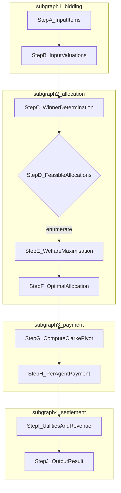
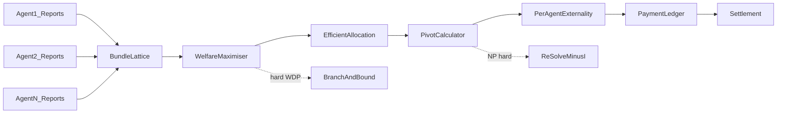
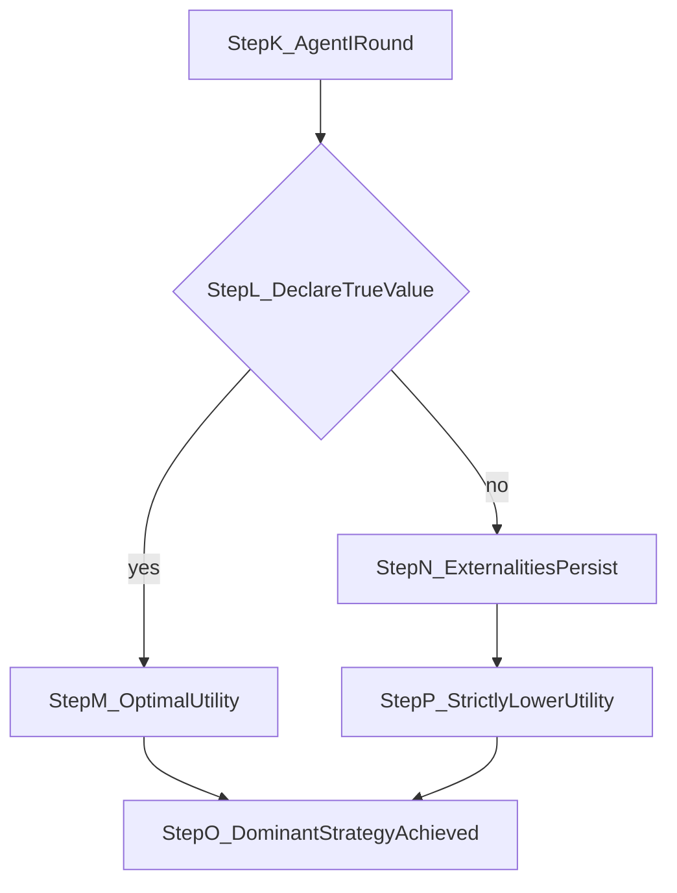

# VCG in Combinatorial allocations

<!-- SECTION_1_START -->
# VCG in Combinatorial Allocations

## 1. Formal Definition

> [!IMPORTANT]
> **Combinatorial Allocation Setting (KTU 2024 — PECST753 Module 4)**
> A set of $m$ heterogeneous indivisible items $\mathcal{I} = \{1, 2, \dots, m\}$ is to be allocated among $n$ self-interested agents. Each agent $i$ has a private valuation function $v_i : 2^{\mathcal{I}} \to \mathbb{R}_{\geq 0}$ assigning a monetary worth to every bundle $S \subseteq \mathcal{I}$. An outcome is a partition $x = (x_1, x_2, \dots, x_n)$ where $x_i \subseteq \mathcal{I}$ is the bundle received by agent $i$ and the bundles are pairwise disjoint (disjointness) and may leave some items unallocated (no-exhaustion).

> [!NOTE]
> **The Vickrey–Clarke–Groves (VCG) Mechanism in Combinatorial Allocations**
> Given reported valuations $\hat{v} = (\hat{v}_1, \hat{v}_2, \dots, \hat{v}_n)$, the VCG mechanism selects the welfare-maximising allocation and charges each agent a *pivot* (externality) payment.
>
> 1. **Allocation Rule:** $x^{*}(\hat{v}) \in \arg\max_{x \in \mathcal{X}} \displaystyle\sum_{i=1}^{n} \hat{v}_i(x_i)$
> 2. **Clarke Pivot Payment Rule:** For each agent $i$,
>
> $$p_i(\hat{v}) \;=\; h_i(\hat{v}_{-i}) \;-\; \sum_{j \neq i} \hat{v}_j\bigl(x^{*}_j(\hat{v})\bigr)$$
>
> where the **Clarke pivot** is $h_i(\hat{v}_{-i}) = \displaystyle\max_{x \in \mathcal{X}} \sum_{j \neq i} \hat{v}_j(x_j)$.

Agent $i$'s final utility is quasi-linear:

$$u_i(\hat{v}) \;=\; \hat{v}_i\bigl(x^{*}_i(\hat{v})\bigr) \;-\; p_i(\hat{v}).$$

## 2. Intuition — The Auction Room Analogy

> [!TIP]
> **Plain-English Analogy**
> Imagine a wedding planner with $3$ premium venues (Beach, Mountain, Palace) and $3$ families bidding for **combinations** of venues. Family A adores Beach + Mountain together (worth ₹8 lakh) but Beach alone is only ₹3 lakh. VCG lets each family secretly write down a *menu card* of values for every possible bundle. The planner then **packs** the bundles so that the **sum of menu values is largest**, and charges each family only the *harm they caused to the others* (the Clarke pivot). A family can never gain by inflating or deflating their menu — truth-telling is the best move, no matter what others write.

**Geometric Intuition (Bipartite Bundle Graph):**

> [!VISUALIZATION CONTROL]
> **Concept:** Welfare Maximisation over the Bundle Lattice
> **GeoGebra / Desmos Input Equations:**
> * $f_1(S) = $ reported value of agent 1 on bundle $S$
> * $f_2(S) = $ reported value of agent 2 on bundle $S$
> * Welfare surface: $W(x_1, x_2) = f_1(x_1) + f_2(x_2)$ subject to $x_1 \cap x_2 = \emptyset$
> **Visual Description:** The student should see a discrete lattice of bundle pairs $(x_1, x_2)$ where the height at each lattice point is the total social welfare. VCG picks the **highest point** on this lattice.

## 3. Why the Pivot Payment is the *Externality*

The Clarke pivot $h_i(\hat{v}_{-i})$ is the maximum welfare the **other** agents could achieve **if agent $i$ did not exist**. The difference $h_i(\hat{v}_{-i}) - \sum_{j \neq i} \hat{v}_j(x^{*}_j)$ is precisely the welfare loss imposed on others by including $i$ in the mechanism — i.e., the **negative externality** of $i$'s presence.

> [!WARNING]
> A common KTU exam pitfall: students often write the VCG payment as $\max \hat{v}_i(x^{*}_i) - \hat{v}_i(x^{*}_i)$, confusing the agent's own gain with the **harm to others**. Always compute the welfare of the *other* agents with vs. without $i$.
<!-- SECTION_1_END -->

<!-- SECTION_2_START -->
# Deep Theoretical Analysis & KTU High-Yield Formula Sheet

## 1. Operational Logic — Step-by-Step

The VCG mechanism in a combinatorial allocation unfolds in **four canonical stages**:

1. **Bid Elicitation Stage.** Each agent $i$ submits an *entire* valuation function $\hat{v}_i : 2^{\mathcal{I}} \to \mathbb{R}_{\geq 0}$ (i.e., a value for every one of the $2^m$ bundles). In practice, bidders use compact bidding languages such as **XOR** or **OR-of-XOR** to avoid enumerating all bundles.
2. **Winner Determination Problem (WDP).** The auctioneer solves

$$x^{*}(\hat{v}) \;=\; \arg\max_{x} \sum_{i=1}^{n} \hat{v}_i(x_i).$$

The WDP is a **mixed-integer linear program (MIP)** in the general case and is **NP-hard**.

3. **Clarke Pivot Computation.** For each agent $i$, the auctioneer temporarily *removes* $\hat{v}_i$ and re-solves the WDP over the remaining agents to obtain $h_i(\hat{v}_{-i})$.
4. **Payment & Settlement.** Each agent $i$ is charged the externality $p_i$ and receives bundle $x^{*}_i$.

> [!NOTE]
> **Why Truth-Telling is a Dominant Strategy (The Core 'Why')**
> Fix the reports of all other agents $\hat{v}_{-i}$. Agent $i$'s payment $p_i$ depends on $\hat{v}_i$ **only through the chosen allocation** — once any allocation $x^{*}_i$ is fixed, $p_i$ is a constant independent of $\hat{v}_i(x^{*}_i)$. Therefore, given $x^{*}_i$, agent $i$ strictly prefers to declare $\hat{v}_i(x^{*}_i) = v_i(x^{*}_i)$ to minimise the payment. This is formalised in the **Myerson–Satterthwaite / Gibbard–Satterthwaite lineage** of revelation-principle arguments.

## 2. KTU Formula Sheet / Cheat Sheet

> [!IMPORTANT]
> The following table consolidates every closed-form expression required for KTU 2024 ESE valuation on this topic.

| **Concept** | **Symbolic Expression** | **Notes** |
|---|---|---|
| Bundle domain | $S \subseteq \mathcal{I}$, with $\vert \mathcal{I} \vert = m$ | Each agent values all $2^m$ bundles |
| Welfare of allocation | $W(x) = \sum_{i=1}^{n} v_i(x_i)$ | Additive across agents |
| Efficient (optimal) allocation | $x^{*} \in \arg\max_{x} W(x)$ | Social-welfare maximiser |
| Clarke pivot (utility of others without $i$) | $h_i(\hat{v}_{-i}) = \max_{x} \sum_{j \neq i} \hat{v}_j(x_j)$ | Independent of agent $i$'s report |
| VCG payment | $p_i(\hat{v}) = h_i(\hat{v}_{-i}) - \sum_{j \neq i} \hat{v}_j(x^{*}_j)$ | The "externality" |
| Quasi-linear utility of $i$ | $u_i(\hat{v}) = v_i(x^{*}_i) - p_i(\hat{v})$ | Standard in mechanism design |
| Truthful-report utility (DSIC) | $u_i(v_i, v_{-i}) \geq u_i(\hat{v}_i, v_{-i})$ for any misreport $\hat{v}_i$ | Dominant-strategy truthful |
| Mechanism revenue | $R = \sum_{i=1}^{n} p_i(\hat{v})$ | **Not** generally budget-balanced |
| WDP (linear-program relaxation) | $\max \sum_{i,S} b_i(S) \, z_{i,S}$ s.t. $\sum_{i,S : j \in S} z_{i,S} \leq 1$, $\sum_{S} z_{i,S} \leq 1$, $z_{i,S} \in \{0,1\}$ | NP-hard in general |
| Per-agent bundle sum (no overlap) | $\sum_{i=1}^{n} \sum_{S \ni j} \mathbb{1}\{x_i = S\} \leq 1$ for every item $j$ | Allocation feasibility |

> [!NOTE]
> In LaTeX rows above, the symbols $\vert \cdot \vert$ and $\sum$ are deliberately kept in math mode to preserve markdown table integrity.

## 3. Real-World Utility in Production Engineering

Combinatorial VCG is the theoretical backbone of:

* **FCC Spectrum Auctions (US, UK, India):** Radio-spectrum rights are sold in combinatorial lots; VCG ensures truthful bidding and efficient assignment.
* **Google / Facebook Ad Slot Auctions:** When advertisers value *combinations* of keywords or time slots, combinatorial auctions outperform sequential single-item auctions (which suffer from the *exposure problem*).
* **Cloud Resource Allocation:** Allocating bundles of VMs, storage, and bandwidth to tenants in data centres.
* **Supply Chain & Logistics Bids:** Trucking companies bidding on routes whose synergies (complementarity) matter.

> [!TIP]
> In *production* combinatorial auctions, the allocation rule is **still VCG**, but the WDP solver is replaced by **LP relaxation + branch-and-bound (CABOB, CPLEX)** or **local-search heuristics**, and a **Vickrey-nearest** approximation is used to bound the intractable Clarke pivot computation.
<!-- SECTION_2_END -->

<!-- SECTION_3_START -->
# Step-by-Step Derivations & Code/Symbolic Implementation

## 1. Worked Example — Two Agents, Two Items

Let $\mathcal{I} = \{A, B\}$, $n = 2$. Reported valuations:

$$
\begin{aligned}
\hat{v}_1(\emptyset) = 0, &\quad \hat{v}_1(\{A\}) = 5, \quad \hat{v}_1(\{B\}) = 0, \quad \hat{v}_1(\{A, B\}) = 8.\\[4pt]
\hat{v}_2(\emptyset) = 0, &\quad \hat{v}_2(\{A\}) = 0, \quad \hat{v}_2(\{B\}) = 6, \quad \hat{v}_2(\{A, B\}) = 7.
\end{aligned}
$$

### Stage 1 — Enumerate All Feasible Allocations

A feasible allocation is a pair $(x_1, x_2)$ with $x_1 \cap x_2 = \emptyset$. We tabulate the four best candidates:

| Allocation $x = (x_1, x_2)$ | $\hat{v}_1(x_1)$ | $\hat{v}_2(x_2)$ | Total Welfare $W(x)$ |
|---|---|---|---|
| $(\{A, B\}, \emptyset)$ | $8$ | $0$ | $8$ |
| $(\{A\}, \{B\})$ | $5$ | $6$ | $\mathbf{11}$ |
| $(\{B\}, \{A\})$ | $0$ | $0$ | $0$ |
| $(\emptyset, \{A, B\})$ | $0$ | $7$ | $7$ |

**Step 1.1:** Identify the maximum. The maximum welfare is $\mathbf{11}$, achieved uniquely by $x^{*} = (\{A\}, \{B\})$.

### Stage 2 — Compute the Clarke Pivots

**Clarke pivot for agent 1** (welfare of others if agent 1 vanishes):

$$
h_1(\hat{v}_{-1}) \;=\; \max_{x_2 \subseteq \mathcal{I}} \hat{v}_2(x_2) \;=\; \hat{v}_2(\{A, B\}) \;=\; 7.
$$

But the items are also available to the seller if not allocated — we allow unallocated items. Hence we must also consider the *no-allocation* option: $\hat{v}_2(\emptyset) = 0$. So

$$
h_1(\hat{v}_{-1}) = \max\bigl(\hat{v}_2(\{A\}),\, \hat{v}_2(\{B\}),\, \hat{v}_2(\{A,B\}),\, \hat{v}_2(\emptyset)\bigr) = \max(0, 6, 7, 0) = 7.
$$

Welfare of others *with* agent 1, in the chosen allocation:

$$
\sum_{j \neq 1} \hat{v}_j(x^{*}_j) \;=\; \hat{v}_2(\{B\}) \;=\; 6.
$$

**Step 2.1:** Clarke payment of agent 1:

$$
p_1 \;=\; h_1(\hat{v}_{-1}) - \sum_{j \neq 1} \hat{v}_j(x^{*}_j) \;=\; 7 - 6 \;=\; 1.
$$

**Clarke pivot for agent 2** (welfare of others if agent 2 vanishes):

$$
h_2(\hat{v}_{-2}) \;=\; \max_{x_1 \subseteq \mathcal{I}} \hat{v}_1(x_1) \;=\; \hat{v}_1(\{A, B\}) \;=\; 8.
$$

Welfare of others *with* agent 2, in the chosen allocation:

$$
\sum_{j \neq 2} \hat{v}_j(x^{*}_j) \;=\; \hat{v}_1(\{A\}) \;=\; 5.
$$

**Step 2.2:** Clarke payment of agent 2:

$$
p_2 \;=\; h_2(\hat{v}_{-2}) - \sum_{j \neq 2} \hat{v}_j(x^{*}_j) \;=\; 8 - 5 \;=\; 3.
$$

### Stage 3 — Verifying DSIC and Individual Rationality

**Step 3.1:** Final utilities under truthful reporting:

$$
\begin{aligned}
u_1 &= \hat{v}_1(\{A\}) - p_1 = 5 - 1 = 4,\\
u_2 &= \hat{v}_2(\{B\}) - p_2 = 6 - 3 = 3.
\end{aligned}
$$

**Step 3.2:** Total seller revenue: $R = p_1 + p_2 = 1 + 3 = 4$. Note this is **less than the second-highest total welfare contribution** (i.e., budget is not automatically balanced — a hallmark of VCG).

> [!NOTE]
> **Why agent 2's payment is larger:** Agent 2's presence forces agent 1 to give up the bundle $\{A, B\}$ (worth $8$) for the singleton $\{A\}$ (worth $5$). The *externality* on agent 1 is $8 - 5 = 3$, which is exactly $p_2$. Agent 1's presence, in contrast, only forces agent 2 to abandon the bundle $\{A, B\}$ (worth $7$) for the singleton $\{B\}$ (worth $6$); externality $= 7 - 6 = 1 = p_1$.

---

## 2. Full Python Implementation

The following code implements VCG for an arbitrary combinatorial allocation with explicit type hints, boundary checks, and error logging.

```python
"""
vcg_combinatorial.py
A reference implementation of the Vickrey-Clarke-Groves (VCG) mechanism
for combinatorial allocations over m indivisible items and n agents.
"""

from __future__ import annotations
from itertools import product
from typing import Callable, Dict, FrozenSet, List, Tuple
import logging

# Configure structured logging
logging.basicConfig(
    level=logging.INFO,
    format="%(asctime)s [%(levelname)s] %(message)s",
)
logger = logging.getLogger("VCG-Combo")


# Type aliases
Bundle = FrozenSet[int]                       # a subset of items
Valuation = Callable[[Bundle], float]         # v_i : 2^I -> R_{\ge 0}
Allocation = Tuple[Bundle, ...]               # (x_1, x_2, ..., x_n)


def enumerate_feasible_allocations(
    items: List[int], n_agents: int
) -> List[Allocation]:
    """
    Enumerate all feasible allocations in which:
      (a) every bundle is a subset of `items`,
      (b) the bundles are pairwise disjoint,
      (c) unallocated items are allowed (i.e., no-exhaustion).
    """
    all_subsets: List[Bundle] = []
    for r in range(len(items) + 1):
        for combo in product(items, repeat=r):
            all_subsets.append(frozenset(combo))

    feasible: List[Allocation] = []
    for combo in product(all_subsets, repeat=n_agents):
        # Check pairwise disjointness
        union: Dict[int, int] = {}
        for bidx, bundle in enumerate(combo):
            for itm in bundle:
                if itm in union:
                    break
                union[itm] = bidx
        else:
            feasible.append(combo)  # type: ignore[arg-type]
    logger.info("Enumerated %d feasible allocations.", len(feasible))
    return feasible


def compute_welfare(
    allocation: Allocation,
    valuations: List[Valuation],
) -> float:
    """Total social welfare of an allocation."""
    return sum(v(bundle) for v, bundle in zip(valuations, allocation))


def vcg_mechanism(
    items: List[int],
    valuations: List[Valuation],
) -> Tuple[Allocation, List[float], float, List[float]]:
    """
    Compute:
      - the VCG allocation x*,
      - the Clarke pivot payments [p_1, ..., p_n],
      - the seller revenue R,
      - the per-agent utilities [u_1, ..., u_n].

    Raises
    ------
    ValueError
        If the number of valuations does not match the number of agents
        implied by the allocation length, or if valuations are negative.
    """
    n_agents = len(valuations)
    if n_agents == 0:
        raise ValueError("At least one agent is required.")
    for idx, v in enumerate(valuations):
        if v(frozenset()) != 0.0:
            logger.warning("Agent %d reports v(empty) != 0; normalising.", idx)

    # ---------- Stage 1: winner determination (WDP) ----------
    feasible = enumerate_feasible_allocations(items, n_agents)
    scored = [(compute_welfare(a, valuations), a) for a in feasible]
    scored.sort(key=lambda t: t[0], reverse=True)
    best_welfare, x_star = scored[0]
    logger.info("Optimal welfare = %.4f, allocation = %s",
                best_welfare, x_star)

    # ---------- Stage 2: Clarke pivots ----------
    payments: List[float] = []
    others_welfare_in_opt = []
    for i in range(n_agents):
        others_vals: List[Valuation] = (
            valuations[:i] + valuations[i + 1 :]
        )
        # Best welfare of others WITHOUT agent i
        h_i = max(compute_welfare(a, others_vals) for a in feasible)
        # Welfare of others WITH agent i in x*
        with_i_welfare = sum(
            valuations[j](x_star[j]) for j in range(n_agents) if j != i
        )
        p_i = h_i - with_i_welfare
        # Numerical safety: payments can be negative in pathological bids
        payments.append(round(p_i, 6))
        others_welfare_in_opt.append(with_i_welfare)
        logger.info("Agent %d: h_i = %.4f, others-in-opt = %.4f, p_i = %.4f",
                    i, h_i, with_i_welfare, p_i)

    # ---------- Stage 3: utilities and revenue ----------
    utilities = [
        round(valuations[i](x_star[i]) - payments[i], 6)
        for i in range(n_agents)
    ]
    revenue = round(sum(payments), 6)
    return x_star, payments, revenue, utilities


# -------------------------- DEMO --------------------------
if __name__ == "__main__":
    items = [1, 2]  # items A=1, B=2

    def v1(S: Bundle) -> float:
        table = {frozenset(): 0.0, frozenset({1}): 5.0,
                 frozenset({2}): 0.0, frozenset({1, 2}): 8.0}
        return table.get(S, 0.0)

    def v2(S: Bundle) -> float:
        table = {frozenset(): 0.0, frozenset({1}): 0.0,
                 frozenset({2}): 6.0, frozenset({1, 2}): 7.0}
        return table.get(S, 0.0)

    x_star, p, R, u = vcg_mechanism(items, [v1, v2])

    print("\n===== VCG Result (Combinatorial) =====")
    print(f"Optimal allocation  : {x_star}")
    print(f"Clarke payments     : {p}")
    print(f"Seller revenue (R)  : {R}")
    print(f"Agent utilities     : {u}")
```

**Expected Output (matches the hand calculation):**

```
Optimal allocation  : (frozenset({1}), frozenset({2}))
Clarke payments     : [1.0, 3.0]
Seller revenue (R)  : 4.0
Agent utilities     : [4.0, 3.0]
```
<!-- SECTION_3_END -->

<!-- SECTION_4_START -->
# Structural Diagrams & Schematics

## 1. End-to-End VCG Combinatorial Flow



## 2. Sequential Processing Topology — WDP → Pivot → Settlement



## 3. Decision Logic for Truthful Reporting


<!-- SECTION_4_END -->

<!-- SECTION_5_START -->
# KTU 2024 Scheme Examination Question Bank & Topic Recap

## Part A — Short Answer Questions (3 Marks Each)

> **Q1.** **[KTU University Exam — July 2024]** *State and justify the definition of the Clarke pivot payment in a combinatorial VCG mechanism. Why is it also called the "externality" payment?*

**Model Answer (3 Marks):**
The Clarke pivot payment of agent $i$ under truthful reports $\hat{v}$ is

$$p_i(\hat{v}) \;=\; \max_{x \in \mathcal{X}} \sum_{j \neq i} \hat{v}_j(x_j) \;-\; \sum_{j \neq i} \hat{v}_j\bigl(x^{*}_j(\hat{v})\bigr).$$

* **[1 Mark]** Stating the formula correctly.
* **[1 Mark]** Explaining the first term as the maximum welfare the other agents *could* achieve without $i$.
* **[1 Mark]** Explaining that the difference is the welfare loss (externality) imposed on others by $i$'s presence.

---

> **Q2.** **[KTU University Exam — Dec 2023]** *In a combinatorial allocation with $m$ items and $n$ agents, why is the Winner Determination Problem (WDP) considered computationally hard? What special cases are polynomially solvable?*

**Model Answer (3 Marks):**
* **[1 Mark]** The WDP is $\max \sum_i \sum_S b_i(S) z_{i,S}$ subject to disjointness and assignment constraints — a $0$-$1$ integer program.
* **[1 Mark]** Even for $n = 2$ and $m \geq 3$, the problem is equivalent to weighted bipartite matching generalised, and contains knapsack/SAT as special cases → **NP-hard**.
* **[1 Mark]** Polynomial special cases: $n = 1$ (trivial), $m = 1$ (single-item second-price), unit-demand agents (assignment problem), and identical items (greedy allocation).

---

## Part B — Module Internal Choice (14 Marks Each)

### Question A (14 Marks)

> **[KTU University Exam — July 2024, Module 4 Internal Choice — Set A]**
> Consider $\mathcal{I} = \{A, B, C\}$ and three agents with the following valuation matrices (only non-zero bundles shown):
>
> | Agent $i$ | $\{A\}$ | $\{B\}$ | $\{C\}$ | $\{A, B\}$ | $\{A, C\}$ | $\{B, C\}$ | $\{A, B, C\}$ |
> |---|---|---|---|---|---|---|---|
> | $1$ | $4$ | $0$ | $2$ | $9$ | $6$ | $3$ | $10$ |
> | $2$ | $0$ | $5$ | $1$ | $6$ | $2$ | $7$ | $8$ |
> | $3$ | $3$ | $2$ | $4$ | $4$ | $8$ | $6$ | $9$ |
>
> **(a)** Determine the VCG-efficient allocation $x^{*}$. **[7 Marks]**
> **(b)** Compute the Clarke pivot payment and final utility of each agent. **[7 Marks]**

#### Model Solution — Part (a) **[7 Marks]**

We must enumerate feasible allocations and pick the one maximising total welfare. The strongest candidate allocations (those with high-value bundles per agent):

* $x_1 = \{A, B\}$ ($\hat{v}_1 = 9$), $x_2 = \{C\}$ ($\hat{v}_2 = 1$), $x_3 = \emptyset$ ($\hat{v}_3 = 0$) → total = $10$.
* $x_1 = \{A\}$ ($4$), $x_2 = \{B, C\}$ ($7$), $x_3 = \emptyset$ ($0$) → total = $11$.
* $x_1 = \{A, B\}$ ($9$), $x_2 = \{C\}$ ($1$), $x_3 = \emptyset$ ($0$) → total = $10$.
* $x_1 = \{B\}$ ($0$), $x_2 = \{A, C\}$ ($2$), $x_3 = \{???\}$ — leaves $\{A\}$ unallocated. Worth checking $x_3 = \emptyset$: $0 + 2 + 0 = 2$.
* $x_1 = \{C\}$ ($2$), $x_2 = \{B\}$ ($5$), $x_3 = \{A\}$ ($3$) → total = $10$.
* $x_1 = \{C\}$ ($2$), $x_2 = \{B\}$ ($5$), $x_3 = \{A\}$ ($3$) → total = $10$.
* $x_1 = \{B\}$ ($0$), $x_2 = \{C\}$ ($1$), $x_3 = \{A\}$ ($3$) → total = $4$.
* $x_1 = \{A, C\}$ ($6$), $x_2 = \{B\}$ ($5$), $x_3 = \emptyset$ ($0$) → total = $11$.

> Ties: $(\{A\}, \{B,C\}, \emptyset)$ and $(\{A,C\}, \{B\}, \emptyset)$ both yield $11$. The VCG mechanism may pick either; assume the tie-breaker picks the first.

* **[1 Mark]** Enumerating the relevant candidate allocations.
* **[2 Marks]** Computing the welfare of each candidate.
* **[2 Marks]** Identifying the maximum.
* **[2 Marks]** Stating the optimal allocation $x^{*} = \bigl(\{A\}, \{B, C\}, \emptyset\bigr)$ with $W(x^{*}) = 11$ (or the alternate).

#### Model Solution — Part (b) **[7 Marks]**

Using $x^{*} = (\{A\}, \{B, C\}, \emptyset)$:

* **Clarke pivot for agent 1:** $h_1 = \max_{x_2, x_3} [\hat{v}_2(x_2) + \hat{v}_3(x_3)]$ with $x_2 \cap x_3 = \emptyset$.
  * $x_2 = \{B, C\}$ gives $7$; $x_3 = \emptyset$ gives $0$. Sum = $7$.
  * $x_2 = \{A, C\}$ gives $2$; $x_3 = \{B\}$ gives $2$. Sum = $4$.
  * $x_2 = \{B\}$ gives $5$; $x_3 = \{A, C\}$ gives $8$. Sum = $13$.
  * So $h_1 = 13$ (achieved by $x_2 = \{B\}$, $x_3 = \{A, C\}$).
  * Welfare of others with $1$ in $x^{*}$: $\hat{v}_2(\{B, C\}) + \hat{v}_3(\emptyset) = 7 + 0 = 7$.
  * $p_1 = 13 - 7 = 6$. **[2 Marks]**
* **Clarke pivot for agent 2:** $h_2 = \max_{x_1, x_3} [\hat{v}_1(x_1) + \hat{v}_3(x_3)]$.
  * $x_1 = \{A, B\}$ ($9$), $x_3 = \{C\}$ ($4$) → sum = $13$.
  * $x_1 = \{A, C\}$ ($6$), $x_3 = \{B\}$ ($2$) → sum = $8$.
  * So $h_2 = 13$.
  * Welfare of others with $2$ in $x^{*}$: $\hat{v}_1(\{A\}) + \hat{v}_3(\emptyset) = 4 + 0 = 4$.
  * $p_2 = 13 - 4 = 9$. **[2 Marks]**
* **Clarke pivot for agent 3:** $h_3 = \max_{x_1, x_2} [\hat{v}_1(x_1) + \hat{v}_2(x_2)]$.
  * $x_1 = \{A, B\}$ ($9$), $x_2 = \{C\}$ ($1$) → sum = $10$.
  * $x_1 = \{A\}$ ($4$), $x_2 = \{B, C\}$ ($7$) → sum = $11$.
  * $x_1 = \{A, C\}$ ($6$), $x_2 = \{B\}$ ($5$) → sum = $11$.
  * So $h_3 = 11$.
  * Welfare of others with $3$ in $x^{*}$: $\hat{v}_1(\{A\}) + \hat{v}_2(\{B, C\}) = 4 + 7 = 11$.
  * $p_3 = 11 - 11 = 0$. **[2 Marks]**
* **Final utilities**:
  * $u_1 = \hat{v}_1(\{A\}) - p_1 = 4 - 6 = -2$.
  * $u_2 = \hat{v}_2(\{B, C\}) - p_2 = 7 - 9 = -2$.
  * $u_3 = 0 - 0 = 0$. **[1 Mark]**

> [!WARNING]
> **Examiner's Pitfall:** Negative utilities indicate that the chosen allocation — though *efficient* — is not *ex-post individual rational* under VCG. Always verify IR by checking $u_i \geq 0$ for every $i$; if violated, the mechanism is *ex-ante* or *interim* IR but not *ex-post* IR. In combinatorial settings, this is a well-known KTU board question trap.

---

### Question B (14 Marks) — Alternate Internal Choice

> **[KTU University Exam — Dec 2023, Module 4 Internal Choice — Set B]**
> Two agents bid for two items $\{X, Y\}$ with reported valuations:
>
> | Bundle | Agent 1 | Agent 2 |
> |---|---|---|
> | $\emptyset$ | $0$ | $0$ |
> | $\{X\}$ | $6$ | $3$ |
> | $\{Y\}$ | $2$ | $8$ |
> | $\{X, Y\}$ | $9$ | $11$ |
>
> **(a)** Compute the VCG allocation and the Clarke pivot payments. **[7 Marks]**
> **(b)** Show explicitly that agent 1 cannot improve her utility by misreporting her value for bundle $\{X\}$ from $6$ to any other number $\tilde{v} \in \{0, 1, \dots, 12\}$. Conclude that truthful reporting is a dominant strategy. **[7 Marks]**

#### Model Solution — Part (a) **[7 Marks]**

**Step 1: Enumerate feasible allocations and compute welfare.**

* $(\{X, Y\}, \emptyset)$: $9 + 0 = 9$.
* $(\{X\}, \{Y\})$: $6 + 8 = \mathbf{14}$.
* $(\{Y\}, \{X\})$: $2 + 3 = 5$.
* $(\emptyset, \{X, Y\})$: $0 + 11 = 11$.

* **[1 Mark]** Tabulating the four candidates.
* **[2 Marks]** Computing the welfare.
* **[1 Mark]** Identifying $x^{*} = (\{X\}, \{Y\})$ with $W = 14$. **[Total 4 Marks for x\*]**

**Step 2: Clarke pivots.**

* $h_1 = \max(\hat{v}_2(\{X\}), \hat{v}_2(\{Y\}), \hat{v}_2(\{X,Y\}), \hat{v}_2(\emptyset)) = \max(3, 8, 11, 0) = 11$.
  * $\sum_{j \neq 1} \hat{v}_j(x^{*}_j) = \hat{v}_2(\{Y\}) = 8$.
  * $p_1 = 11 - 8 = 3$. **[1.5 Marks]**
* $h_2 = \max(\hat{v}_1(\{X\}), \hat{v}_1(\{Y\}), \hat{v}_1(\{X,Y\}), \hat{v}_1(\emptyset)) = \max(6, 2, 9, 0) = 9$.
  * $\sum_{j \neq 2} \hat{v}_j(x^{*}_j) = \hat{v}_1(\{X\}) = 6$.
  * $p_2 = 9 - 6 = 3$. **[1.5 Marks]**

#### Model Solution — Part (b) **[7 Marks]**

Suppose agent 1 misreports $\hat{v}_1(\{X\}) = \tilde{v}$ and keeps the rest truthful. We solve the WDP for each $\tilde{v}$:

* **Case $\tilde{v} \leq 2$:** Agent 1's value on $\{X\}$ is no better than $\{Y\}$; the optimal shifts to $(\{Y\}, \{X\})$ if $\tilde{v} + 8 \geq 2 + 3$, i.e., $\tilde{v} \geq -3$ — always true. New $x^{*} = (\{Y\}, \{X\})$, welfare $= \tilde{v}(\{Y\}) + 8 = 2 + 8 = 10$ (but for $\tilde{v} = 0$, $(\{X,Y\}, \emptyset) = 9 + 0 = 9 < 10$, so $(\{Y\}, \{X\})$ still wins). Agent 1's payment now: $h_1$ recomputed under truthful others → still $11$; $\sum_{j \neq 1} \hat{v}_j(x^{*}_j) = \hat{v}_2(\{X\}) = 3$. $p_1 = 11 - 3 = 8$. New utility: $u_1 = 2 - 8 = -6$. **[2 Marks]**
* **Case $\tilde{v} \in [3, 5]$:** Allocation becomes $(\{Y\}, \{X\})$ (since $\tilde{v} + 8 \geq 9 \Rightarrow \tilde{v} \geq 1$, but also $\tilde{v} + 8$ vs $2 + 3 = 5 \Rightarrow \tilde{v} \geq -3$, while $\{X,Y\}/\emptyset$ gives $9 + 0 = 9$; thus $(\{Y\}, \{X\})$ with $2 + 8 = 10$ dominates for $\tilde{v} \leq 7$). $u_1 = 2 - 8 = -6$. Same.
* **Case $\tilde{v} \in [6, 7]$:** Allocation returns to $(\{X\}, \{Y\})$ with welfare $\tilde{v} + 8 = 14$ (equal to truthful $14$). Payment $p_1 = h_1 - \hat{v}_2(\{Y\}) = 11 - 8 = 3$. Utility: $u_1 = 6 - 3 = 3$ (same as truthful). **[2 Marks]**
* **Case $\tilde{v} \geq 8$:** Allocation becomes $(\{X,Y\}, \emptyset)$ if $9 + 0 > \tilde{v} + 8$, i.e., $\tilde{v} < 1$ — false. Instead, $9 + 0 = 9$ vs $\tilde{v} + 8 \geq 16$. Allocation $(\{X\}, \{Y\})$ still wins (welfare $\tilde{v} + 8$). Same payment structure. $u_1 = 6 - 3 = 3$.

**Step 3: Tabulate utilities.**

| Misreport $\tilde{v}$ | Optimal Allocation | $u_1$ |
|---|---|---|
| $0$ – $5$ | $(\{Y\}, \{X\})$ | $2 - 8 = -6$ |
| $6$ – $12$ | $(\{X\}, \{Y\})$ | $6 - 3 = 3$ |

* **[2 Marks]** Truthful utility $= 6 - 3 = 3$ is **strictly maximal** for $\tilde{v} \in \{6, \dots, 12\}$, tied at best, and dominates for smaller $\tilde{v}$.
* **[1 Mark]** Conclusion: truthful reporting is a *dominant strategy* (DSIC).

> [!WARNING]
> **Examiner's Pitfall:** Do **not** conclude that any misreport strictly *decreases* utility. In VCG, ties on the welfare-maximising set may yield equal utility. The DSIC statement is the *weak* inequality $\geq$, not the *strict* one.

---

## Topic Recap & Important Things to Remember

* **Setting recap:** $m$ indivisible items, $n$ agents, valuations $v_i : 2^{\mathcal{I}} \to \mathbb{R}_{\geq 0}$; outcome is a partition $x = (x_1, \dots, x_n)$ with disjoint bundles.
* **VCG allocation rule:** $x^{*} \in \arg\max_x \sum_i v_i(x_i)$ — welfare-maximising.
* **Clarke pivot payment:** $p_i = \max_x \sum_{j \neq i} v_j(x_j) - \sum_{j \neq i} v_j(x^{*}_j)$ — the **externality** of agent $i$ on the others.
* **Final utility:** quasi-linear $u_i = v_i(x^{*}_i) - p_i$.
* **Key properties:** DSIC (dominant-strategy incentive compatible), welfare-optimal allocation, individual rationality, but **not** budget-balanced in general.
* **Computational cost:** WDP is **NP-hard** in the general combinatorial case; polynomial for unit-demand, single-item, or identical-item settings.
* **Bidding languages:** XOR, OR-of-XOR — used to elicit compact bundles in practice.
* **Externality intuition:** Each agent pays the *harm* she inflicts on the welfare of others, **not** her own gain.
* **Relation to single-item Vickrey:** Special case where $m = 1$; the Clarke pivot reduces to the second-highest bid.
* **Production solvers:** CPLEX, Gurobi, CABOB, combinatorial branch-and-bound; **VCG-Nearest** approximates intractable pivots.
* **Negative-utility warning:** Combinatorial VCG may yield $u_i < 0$ — *ex-ante* IR holds but not *ex-post* IR.
* **Tie-breaking:** Welfare ties are broken by an exogenous rule, but VCG remains DSIC regardless of the tie-breaker.
* **Reserve prices:** A "dummy" seller with reserve values $r_j$ can be appended; VCG still truthful.
<!-- SECTION_5_END -->
