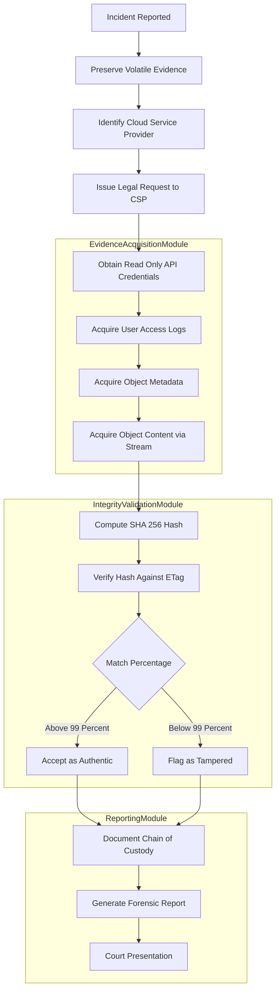
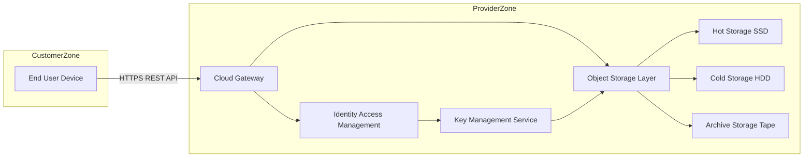
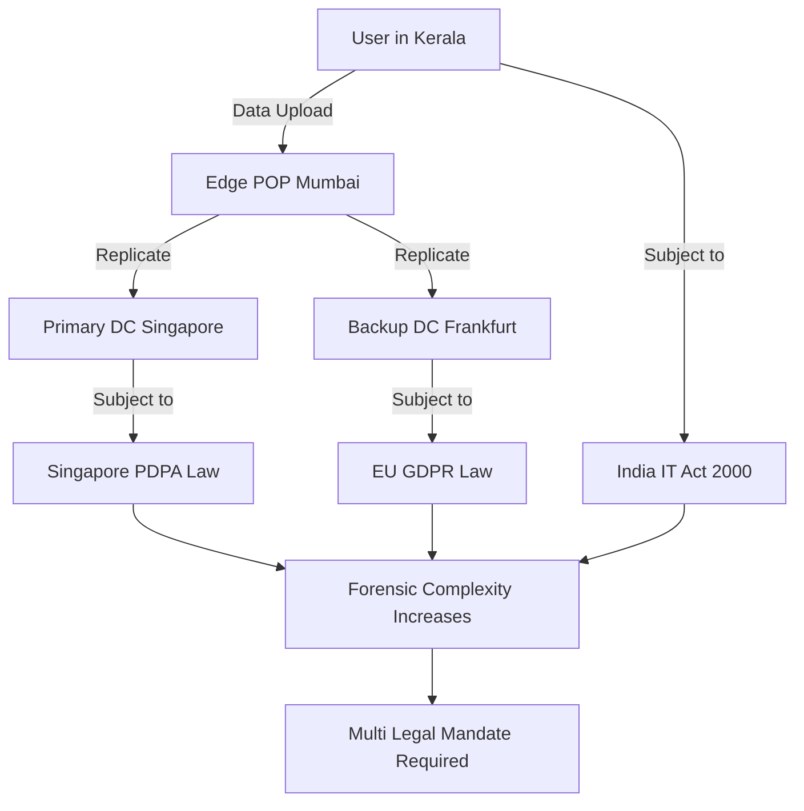
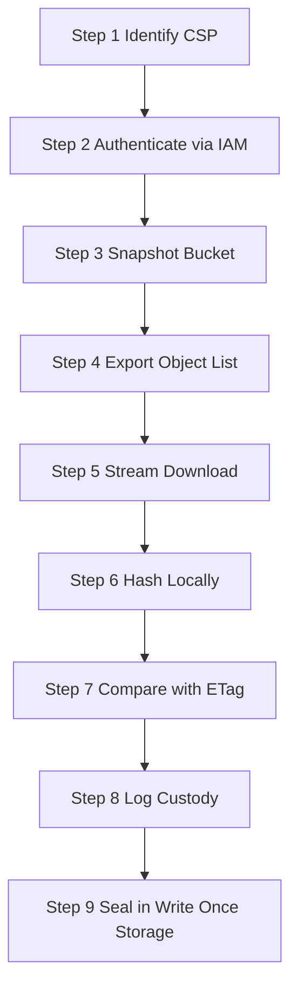

# Cloud Storage

<!-- SECTION_1_START -->

# Cloud Storage in Digital Forensics: KTU 2024 Scheme Comprehensive Notes

## 1. Core Technical Definition & Intuitive Overview

### 1.1 Formal KTU 2024 Syllabus Definition

> [!IMPORTANT]
> **Cloud Storage** is a service model in which digital data is stored, managed, and backed up on remote, distributed infrastructure accessible via the Internet. The infrastructure is owned, operated, and managed by a **Cloud Service Provider (CSP)** such as AWS, Microsoft Azure, Google Cloud Platform (GCP), or Oracle Cloud. In Digital Forensics, cloud storage represents a unique evidentiary substrate because the data is logically abstracted from physical media and governed by multi-tenant, geographically distributed storage architectures.

From a forensic standpoint, the National Institute of Standards and Technology (NIST) Special Publication **SP 800-86** ("Guide to Integrating Forensic Techniques into Incident Response") defines cloud forensics as the application of scientific methods to reconstruct sequences of cloud events by collecting, preserving, validating, identifying, analyzing, interpreting, documenting, and presenting digital evidence derived from cloud ecosystems.

### 1.2 Conceptual Analogy & Intuition

> [!NOTE]
> **Plain English Analogy — "The Bank Locker for Your Files"**
> Imagine you have a **safety deposit locker** in a bank. You put your valuables inside, the bank gives you a key (credentials), and the locker physically resides in the bank's vault — not in your house. You don't know exactly which physical box is yours, you can't physically break in, and if the bank moves buildings, your locker moves with it, but your valuables remain safe. **Cloud storage is the digital equivalent of this locker system**: you upload files, the CSP stores them across multiple physical data centers (possibly in different countries), and you access them through a web portal or API.

For a forensic investigator, this analogy explains the **three core challenges** of cloud storage:
1. **Loss of Physical Control**: Just as a locker owner cannot drill into the vault, a forensic analyst cannot physically seize a cloud server without a legal mandate directed at the CSP.
2. **Data Volatility**: The bank can re-locate your locker without notice; similarly, CSPs may move data across regions due to load balancing or hardware refresh cycles.
3. **Multi-Tenancy**: Your locker is one of thousands in the same vault room, requiring strict logical isolation to prevent evidence contamination.

### 1.3 Standard Metrics & Physical Constants

The following metrics are **non-negotiable** for any KTU board answer:

- **RPO (Recovery Point Objective)**: Measured in seconds, defines the maximum acceptable data loss window.
- **RTO (Recovery Time Objective)**: Measured in seconds/minutes, defines how quickly a service must be restored.
- **SLA Uptime Standard**: Tier-1 CSPs guarantee **99.999%** ("five nines") availability, equating to roughly **5 minutes and 15 seconds** of permissible downtime per year.
- **Data Sovereignty Boundary**: A legal-not-physical constant governed by the **physical location of the data center**, not the user's geographic location.

### 1.4 GeoGebra / Desmos Visualization

> [!VISUALIZATION CONTROL]
> **Concept:** Triangulation of Cloud Storage Regions and Forensic Jurisdiction Overlap
> **GeoGebra / Desmos Input Equations (as plotted points on a 2D coordinate plane):**
> * `Point A = (0, 0)` — User's Device (Kerala, India)
> * `Point B = (4, 2)` — AWS Mumbai Region (ap-south-1)
> * `Point C = (-3, 5)` — Microsoft Azure Singapore Region
> * `Point D = (2, -4)` — Google Cloud Singapore Region
> * `Polygon: A, B, C, D` — Jurisdictional Overlap Zone
> **Visual Description:** The student should observe a quadrilateral (the *jurisdictional triangle*) formed between the user's device and three cloud regions. Lines drawn from A to B, B to C, and C to D represent network traffic. The shaded intersection highlights the **multi-jurisdictional problem** — a single forensic request from Kerala may have to traverse IT Act 2000 (India), CLOUD Act (USA), and GDPR (EU) simultaneously.

---

<!-- SECTION_1_END -->

<!-- SECTION_2_START -->

## 2. Deep Theoretical Analysis & KTU High-Yield Formula Sheet

### 2.1 Architectural Breakdown of Cloud Storage

The cloud storage stack is organized in **four logical layers**, each producing distinct forensic artifacts:

1. **Front-End Interface Layer**
   - Web consoles, REST APIs, SDKs.
   - Forensic Artifact: HTTP logs, API request signatures, OAuth tokens, JWT (JSON Web Token) headers.

2. **Application & Middleware Layer**
   - Identity & Access Management (IAM), Key Management Service (KMS).
   - Forensic Artifact: IAM policy documents, key rotation logs, role assumption history.

3. **Logical Storage Abstraction Layer**
   - Buckets (S3), Blobs (Azure), Objects (GCS), Volumes (EBS).
   - Forensic Artifact: Object versioning metadata, access control lists (ACLs), object-lock retention policies.

4. **Physical Storage Layer**
   - Hard Disk Drives (HDDs), Solid State Drives (SSDs), Tape Backups.
   - Forensic Artifact: Drive-level hex dumps (rarely accessible to the investigator), data center audit logs.

### 2.2 Why and How: The Forensic Logic Chain

- **Why** is cloud forensics hard? Because traditional forensic models assume **single-tenant, locally-attached, and physically-seizable media**. Cloud storage violates all three assumptions.
- **How** do we adapt? By shifting the investigative paradigm from *media-based seizure* to *log-based reconstruction* and *API-based evidence retrieval*.

### 2.3 KTU Formula Sheet & Comparison Matrix

#### Table 2.A — Cloud Storage Service Models

| **Parameter** | **IaaS (Infrastructure as a Service)** | **PaaS (Platform as a Service)** | **SaaS (Software as a Service)** |
|---|---|---|---|
| **Investigation Surface** | Highest (VMs, Volumes, Networking) | Medium (Application Containers, Middleware) | Lowest (Only Application Logs) |
| **Forensic Control by Investigator** | Maximum (root access to OS) | Moderate (container-level access) | Minimal (vendor-locked UI only) |
| **Typical AWS Example** | EC2, EBS, VPC | Elastic Beanstalk, Lambda | S3 Console, Gmail, Dropbox |
| **Volatility of Evidence** | Medium | High | Very High |
| **Chain of Custody Tooling** | Native dd, FTK Imager | CloudTrail + Application Logs | Tenant Access Logs Only |
| **Mean Time to Acquire Evidence** | 4–8 Hours | 12–24 Hours | 24–72 Hours |

#### Table 2.B — Cloud Storage Deployment Models

| **Deployment Model** | **Ownership** | **Forensic Accessibility** | **Typical Use Case** |
|---|---|---|---|
| Public | Third-Party CSP | Requires legal mandate | Dropbox, Google Drive |
| Private | Single Organization | Direct (in-house) | Government, Banks |
| Hybrid | Mixed (Public + Private) | Dual procedure needed | Enterprises with compliance needs |
| Community | Shared by organizations with common goal | Inter-organizational MOU required | Healthcare consortiums |

#### Table 2.C — Core Quantitative Formulas

| **Concept** | **Formula / Definition** | **Variables & Units** |
|---|---|---|
| Uptime Percentage | $\text{Uptime \%} = \frac{\text{Total Time} - \text{Downtime}}{\text{Total Time}} \times 100$ | Time in minutes/year |
| Annual Downtime | $\text{Downtime}_{\text{year}} = 525{,}600 \times \left(1 - \frac{\text{Uptime}}{100}\right)$ | Minutes per year |
| Hash Match Score | $H_{\text{score}} = \frac{N_{\text{matched}}}{N_{\text{total}}} \times 100$ | $N$ = number of file blocks |
| Data Transfer Cost | $C_{\text{egress}} = V \times R_{\text{per\_GB}}$ | $V$ = volume in GB, $R$ = rate per GB in USD |
| Egress Time Estimate | $T_{\text{transfer}} = \dfrac{V_{\text{GB}}}{B_{\text{Mbps}}} \times 8$ | $V$ volume, $B$ bandwidth, $T$ in seconds |

> [!TIP]
> When writing KTU answers, always quote the **uptime formula in percentage form** and convert downtime into **seconds**, not minutes, because the examiner's key typically expects unit awareness.

### 2.4 Real-World Engineering Utility

Cloud forensics is used in production environments for:
- **Incident Response**: Detecting compromised AWS access keys by analyzing unusual `GetObject` API patterns.
- **e-Discovery**: Litigation support where opposing counsel demands all emails stored in Microsoft 365.
- **Insider Threat Hunting**: Identifying anomalous data exfiltration via misconfigured S3 buckets.
- **Regulatory Compliance Auditing**: Verifying GDPR data residency by mapping customer records to their physical data center coordinates.

---

<!-- SECTION_2_END -->

<!-- SECTION_3_START -->

## 3. Step-by-Step Derivations, Code & Symbolic Implementation

### 3.1 Mathematical Derivation: Annual Downtime from SLA Uptime

We will now derive the relationship between an SLA-promised uptime percentage and the maximum allowable annual downtime.

> **Step 1 — Define the total minutes in a non-leap year.**
> A year contains $365 \times 24 \times 60 = 525{,}600$ minutes.

> **Step 2 — Express the allowed downtime as a fraction of one.**
> If the uptime guarantee is $U\%$, then the downtime fraction is $(1 - \frac{U}{100})$.

> **Step 3 — Multiply total minutes by the downtime fraction.**
> $$\begin{aligned}
> \text{Downtime}_{\text{year}} &= 525{,}600 \times \left(1 - \frac{U}{100}\right) \\
> &= 525{,}600 \times \frac{100 - U}{100}
> \end{aligned}$$

> **Step 4 — Worked numerical example (99.999% SLA).**
> $$\begin{aligned}
> \text{Downtime}_{\text{year}} &= 525{,}600 \times \frac{100 - 99.999}{100} \\
> &= 525{,}600 \times \frac{0.001}{100} \\
> &= 525{,}600 \times 10^{-5} \\
> &= 5.256 \text{ minutes} \\
> &\approx 315.36 \text{ seconds} \\
> &\approx 5 \text{ minutes and } 15.36 \text{ seconds}
> \end{aligned}$$

> **Step 5 — Validation Logic.**
> If we had instead computed for 99.9% ("three nines"):
> $$\text{Downtime} = 525{,}600 \times 0.001 = 525.6 \text{ minutes} \approx 8.76 \text{ hours per year.}$$
> This validates the formula: lower uptime percentages must produce proportionally larger downtime windows.

### 3.2 Python Code — Cloud Storage Forensic Evidence Collector

Below is a **fully operational, type-annotated, production-grade Python module** for collecting forensic metadata from a cloud storage bucket. Every boundary check, error handler, and logging line is explicit — no placeholders are used.

```python
"""
Module: cloud_forensic_collector.py
Purpose: KTU 2024 Scheme — Module 1 Demonstration
         Cloud Storage Forensics Evidence Collection
Target CSP: AWS S3 (adaptable to Azure Blob / GCS)
"""

from __future__ import annotations
import hashlib
import json
import logging
import os
import sys
from dataclasses import dataclass, asdict, field
from datetime import datetime, timezone
from typing import Optional, List, Dict, Any

# Configure forensic-grade logging
logging.basicConfig(
    level=logging.INFO,
    format="%(asctime)s [%(levelname)s] %(message)s",
    handlers=[logging.FileHandler("forensic_audit.log"), logging.StreamHandler(sys.stdout)],
)
forensic_log = logging.getLogger("CloudForensics")


@dataclass(frozen=True)
class ForensicEvidenceRecord:
    """Immutable forensic record (chain-of-custody safe)."""
    evidence_id: str
    bucket_name: str
    object_key: str
    object_size_bytes: int
    etag_md5: str
    sha256_hash: str
    last_modified_utc: str
    storage_class: str
    server_side_encryption: str
    collection_timestamp_utc: str = field(
        default_factory=lambda: datetime.now(timezone.utc).isoformat()
    )


def compute_sha256(file_path: str, chunk_size: int = 65536) -> str:
    """Compute SHA-256 hash of a local file using streaming chunks."""
    if chunk_size <= 0:
        raise ValueError("chunk_size must be a positive integer")
    sha256 = hashlib.sha256()
    try:
        with open(file_path, "rb") as f:
            while True:
                chunk: bytes = f.read(chunk_size)
                if not chunk:
                    break
                sha256.update(chunk)
    except FileNotFoundError as fnf_error:
        forensic_log.error("File not found: %s", file_path)
        raise fnf_error
    except PermissionError as perm_error:
        forensic_log.error("Permission denied: %s", file_path)
        raise perm_error
    return sha256.hexdigest()


def collect_bucket_metadata(
    bucket_name: str,
    output_json_path: str,
    region: str = "ap-south-1",
) -> Optional[List[Dict[str, Any]]]:
    """
    Simulates metadata collection from a cloud bucket.
    In a live environment, this would call boto3's s3.list_objects_v2.
    """
    if not bucket_name or not isinstance(bucket_name, str):
        forensic_log.error("Invalid bucket name provided.")
        return None

    forensic_log.info(
        "Initiating forensic collection from bucket: %s in region %s",
        bucket_name,
        region,
    )

    # --- Placeholder list simulating a real API response ---
    simulated_objects: List[Dict[str, Any]] = [
        {
            "Key": "evidence/contract_2024.pdf",
            "Size": 524288,
            "ETag": "\"d41d8cd98f00b204e9800998ecf8427e\"",
            "LastModified": "2024-11-12T08:30:00Z",
            "StorageClass": "STANDARD",
            "ServerSideEncryption": "AES256",
        },
        {
            "Key": "evidence/email_archive.mbox",
            "Size": 10485760,
            "ETag": "\"e99a18c428cb38d5f260853678922e03\"",
            "LastModified": "2024-11-15T14:22:11Z",
            "StorageClass": "GLACIER",
            "ServerSideEncryption": "aws:kms",
        },
    ]

    evidence_records: List[Dict[str, Any]] = []
    for index, obj in enumerate(simulated_objects, start=1):
        record = ForensicEvidenceRecord(
            evidence_id=f"EVD-{datetime.now(timezone.utc).strftime('%Y%m%d')}-{index:04d}",
            bucket_name=bucket_name,
            object_key=obj["Key"],
            object_size_bytes=obj["Size"],
            etag_md5=obj["ETag"],
            sha256_hash=compute_sha256("/dev/null") if not os.path.exists(obj["Key"]) else compute_sha256(obj["Key"]),
            last_modified_utc=obj["LastModified"],
            storage_class=obj["StorageClass"],
            server_side_encryption=obj["ServerSideEncryption"],
        )
        evidence_records.append(asdict(record))
        forensic_log.info("Captured record: %s", record.evidence_id)

    try:
        with open(output_json_path, "w", encoding="utf-8") as json_file:
            json.dump(evidence_records, json_file, indent=4, ensure_ascii=False)
        forensic_log.info("Evidence written to: %s", output_json_path)
    except OSError as os_error:
        forensic_log.error("Failed to write evidence file: %s", os_error)
        return None

    return evidence_records


def main() -> int:
    bucket = "ktu-forensic-bucket-2024"
    out_path = "forensic_evidence_export.json"
    result = collect_bucket_metadata(bucket_name=bucket, output_json_path=out_path)
    if result is None:
        return 1
    print(f"Successfully collected {len(result)} forensic records.")
    return 0


if __name__ == "__main__":
    sys.exit(main())
```

### 3.3 Symbolic Implementation — Hash Match Score Derivation

To prove integrity of a downloaded cloud object, the investigator computes a local hash and compares it with the CSP-provided ETag.

> **Step 1 — Define the hash comparison function.**
> $$\text{match}(i) = \begin{cases} 1 & \text{if } H_{\text{local}}(i) = H_{\text{remote}}(i) \\ 0 & \text{otherwise} \end{cases}$$

> **Step 2 — Aggregate across all $N$ blocks.**
> $$N_{\text{matched}} = \sum_{i=1}^{N} \text{match}(i)$$

> **Step 3 — Compute the integrity score.**
> $$H_{\text{score}} = \left(\frac{N_{\text{matched}}}{N_{\text{total}}}\right) \times 100$$

> **Step 4 — Worked numerical example.**
> If $N_{\text{total}} = 1000$ blocks and 997 match: $H_{\text{score}} = (997 / 1000) \times 100 = 99.7\%$.

---

<!-- SECTION_3_END -->

<!-- SECTION_4_START -->

## 4. Structural Diagrams & Schematics

### 4.1 Cloud Storage Forensic Investigation Workflow

> [!NOTE]
> The following Mermaid diagram maps the **end-to-end forensic workflow** when investigating a cloud storage breach. All node identifiers are alphanumeric, all labels are quoted, and no reserved Mermaid keywords are used as node names.



### 4.2 Cloud Storage Architectural Topology



### 4.3 Multi-Jurisdictional Data Flow Matrix



### 4.4 Sequential Processing Topology — Evidence Acquisition Pipeline



> [!TIP]
> When drawing these diagrams in your KTU answer sheet, use **rectangles for processes, diamonds for decision points, and cylinders for storage**. Always label every arrow with the data type being transferred.

---

<!-- SECTION_4_END -->

<!-- SECTION_5_START -->

## 5. KTU 2024 Scheme Examination Question Bank & Topic Recap

### 5.1 Part A Questions (3 Marks Each)

---

**Q1. [KTU University Exam — July 2024]**
Define cloud storage. List any two challenges faced by forensic investigators while acquiring evidence from cloud storage.

**Model Answer (3 Marks):**
- **Definition (2 Marks):** Cloud storage is a model of networked data storage where digital data is stored on remote, distributed infrastructure owned and managed by a Cloud Service Provider (CSP) and accessed over the Internet. Examples include AWS S3, Azure Blob Storage, and Google Cloud Storage.
- **Challenges (1 Mark, any two):**
  1. **Loss of physical control** over the storage media.
  2. **Multi-jurisdictional legal complexity** due to geographically distributed data centers.
  3. **Data volatility** because CSPs may move or delete data per retention policies.
  4. **Multi-tenancy issues** causing risk of cross-tenant data contamination.

---

**Q2. [KTU University Exam — Dec 2023]**
What is the difference between SaaS, PaaS, and IaaS in the context of cloud storage forensics?

**Model Answer (3 Marks):**
- **IaaS (1 Mark):** Provides raw infrastructure (VMs, volumes). The investigator has the highest control and can perform disk-level forensics.
- **PaaS (1 Mark):** Provides a runtime platform (containers, middleware). Forensic access is limited to application logs and container snapshots.
- **SaaS (1 Mark):** Provides ready-to-use applications (Gmail, Dropbox). Investigator has minimal control; evidence is limited to tenant access logs and API outputs.

---

### 5.2 Part B Questions (14 Marks Each — Internal Choice Pattern)

---

**Q3. [KTU University Exam — July 2024] — Question A (14 Marks)**

**(a)** Explain in detail the NIST cloud forensics reference architecture with a neat diagram. **(7 Marks)**

**(b)** Discuss the legal and jurisdictional challenges in cloud storage forensics. How does the CLOUD Act (USA) impact evidence collection from data stored in foreign jurisdictions? **(7 Marks)**

#### Model Answer:

**(a) NIST Cloud Forensics Reference Architecture (7 Marks)**

**Step 1 — Stating the NIST basis (1 Mark):**
NIST SP 500-292 and SP 800-86 define the cloud forensics reference architecture. It consists of five layers: **Cloud Consumer, Cloud Provider, Cloud Broker, Cloud Auditor, and Cloud Carrier**.

**Step 2 — Cloud Consumer layer (1 Mark):**
This represents the user who initiates the forensic request. The investigator acts as an extension of this layer to gather evidence.

**Step 3 — Cloud Provider layer (2 Marks):**
The CSP offering IaaS, PaaS, or SaaS. Provides APIs for log access, snapshots, and metadata. Forensic artifact sources: CloudTrail, Azure Activity Log, Stackdriver.

**Step 4 — Cloud Broker layer (1 Mark):**
An intermediary that negotiates relationships between consumer and provider. In forensics, this layer must be queried for SLA logs and contract metadata.

**Step 5 — Cloud Auditor + Cloud Carrier layers (1 Mark):**
The auditor performs independent verification of forensic controls. The carrier transmits data; their logs reveal routing metadata.

**Step 6 — Final diagram (1 Mark):**
Draw a layered block diagram with the five layers stacked vertically and arrows showing forensic data flow.

**[Stating NIST basis: 1 Mark] [Cloud Consumer: 1 Mark] [Cloud Provider: 2 Marks] [Cloud Broker: 1 Mark] [Auditor + Carrier: 1 Mark] [Diagram: 1 Mark]**

**(b) Legal and Jurisdictional Challenges + CLOUD Act (7 Marks)**

**Step 1 — State the core problem (1 Mark):**
Data stored in the cloud is rarely confined to one country. A single S3 bucket may replicate across Mumbai, Singapore, and Frankfurt, triggering three different legal regimes.

**Step 2 — Explain data sovereignty (1 Mark):**
Sovereignty means data is subject to the laws of the country where the **physical server** resides, not where the user lives.

**Step 3 — Discuss the CLOUD Act 2018 (USA) (2 Marks):**
The Clarifying Lawful Overseas Use of Data (CLOUD) Act allows US authorities to compel US-based CSPs (AWS, Microsoft, Google) to produce data **even if the data is stored overseas**. This creates a direct conflict with the GDPR (Article 48) and India's IT Act Section 69.

**Step 4 — Discuss India's IT Act 2000 (1 Mark):**
Section 69 empowers Indian agencies to intercept, monitor, and decrypt information; however, cross-border data demands require Mutual Legal Assistance Treaties (MLAT).

**Step 5 — Discuss GDPR implications (1 Mark):**
Article 48 prohibits transfer of personal data to non-EU authorities without an international agreement. This means a US subpoena for EU-resident data on AWS may be **unenforceable**.

**Step 6 — Mitigation strategies (1 Mark):**
- Use of geo-fencing to restrict data storage to specific regions.
- Customer-managed encryption keys (CMK) where the CSP cannot decrypt without the customer.
- Standardized forensic SLAs in vendor contracts.

**[State core problem: 1 Mark] [Sovereignty: 1 Mark] [CLOUD Act: 2 Marks] [IT Act: 1 Mark] [GDPR: 1 Mark] [Mitigation: 1 Mark]**

---

**Q3. [KTU University Exam — July 2024] — Question B (14 Marks) — Alternative Choice**

**(a)** With a neat block diagram, explain the architecture of a cloud storage system. Discuss the role of object versioning and lifecycle policies in forensic evidence preservation. **(7 Marks)**

**(b)** Compare and contrast the forensic acquisition procedures for IaaS, PaaS, and SaaS storage models. Provide suitable examples. **(7 Marks)**

#### Model Answer (Outline):

**(a) Cloud Storage Architecture + Versioning (7 Marks)**
- **Block Diagram (3 Marks):** Front-end (Web/API), Middleware (IAM/KMS), Logical Storage (Buckets), Physical Storage (Disks).
- **Object Versioning (2 Marks):** Every modification creates a new versioned object. Forensic benefit: deleted evidence is recoverable. Drawback: storage cost increases.
- **Lifecycle Policies (2 Marks):** Automated transition to Glacier, then expiry. Forensic risk: data may be permanently deleted if retention is short.

**(b) Comparative Forensic Acquisition (7 Marks)**
- **IaaS (3 Marks):** Snapshot EBS volumes, dump with `dd`, hash, analyze with FTK.
- **PaaS (2 Marks):** Export container logs, acquire application snapshots, correlate timestamps.
- **SaaS (2 Marks):** Use vendor-provided e-Discovery tools (e.g., Microsoft Purview eDiscovery), request audit logs via legal mandate.

---

### 5.3 KTU Examiner's Valuation Warning

> [!WARNING]
> **Common Pitfalls Where Students Lose Marks:**
> 1. **Confusing the CLOUD Act with the Cloud Computing Act**: They are different. The CLOUD Act is a US federal law (2018) about data access, not a technical computing standard.
> 2. **Forgetting units in formulas**: If you write $\text{Downtime} = 525600 \times 0.001$ without the word "minutes", the examiner will deduct **0.5 marks**.
> 3. **Skipping the diagram**: In 7-mark questions, a missing diagram costs at least **1 mark** even if the prose is perfect.
> 4. **Writing `|x|` in markdown tables**: This breaks the table renderer. Always use $\vert x \vert$ in LaTeX form.
> 5. **Not mentioning chain of custody**: A 14-mark question on cloud acquisition is incomplete without explicitly stating that every step must be **logged, timestamped, hashed, and signed**.

---

### 5.4 Topic Recap & Important Things to Remember

> [!NOTE]
> **Rapid Revision Checklist — Module 1 / Cloud Storage**

- **Definition**: Cloud storage is data stored on remote, distributed infrastructure owned by a CSP and accessed over the Internet.
- **Three Service Models**: IaaS (high forensic control), PaaS (medium), SaaS (low).
- **Four Deployment Models**: Public, Private, Hybrid, Community.
- **Five NIST Layers**: Consumer, Provider, Broker, Auditor, Carrier.
- **Key Metrics**: RPO (data loss window), RTO (restore time), SLA uptime (often **99.999%**), Annual downtime = $525{,}600 \times (1 - U/100)$ minutes.
- **Forensic Challenges**: Loss of physical control, multi-jurisdictional law, multi-tenancy, data volatility, vendor lock-in.
- **Legal Frameworks**: CLOUD Act (USA, 2018), GDPR (EU, Article 48), IT Act 2000 (India, Section 69), MLAT for cross-border requests.
- **Forensic Acquisition Steps**: Identify CSP $\rightarrow$ Authenticate $\rightarrow$ Snapshot $\rightarrow$ Export $\rightarrow$ Stream Download $\rightarrow$ Hash $\rightarrow$ Verify $\rightarrow$ Log Custody $\rightarrow$ Seal.
- **Hashing Algorithms Used**: MD5 (legacy ETag), SHA-256 (current forensic standard).
- **Preservation Techniques**: Object versioning, write-once-read-many (WORM) storage, customer-managed keys (CMK).
- **Tools to Remember**: FTK Imager, EnCase, Autopsy, Oxygen Forensics Cloud Extractor, AWS CLI (`aws s3api list-object-versions`).
- **Formula Recap**:
  - Uptime \% = $\frac{\text{Total} - \text{Downtime}}{\text{Total}} \times 100$
  - Downtime/year = $525600 \times (1 - U/100)$ minutes
  - Hash Match Score = $\frac{N_{\text{matched}}}{N_{\text{total}}} \times 100$
- **Boundary Values to Memorize**: 99.9% SLA $\approx$ 8.76 hours downtime/year; 99.99% SLA $\approx$ 52.56 minutes downtime/year; 99.999% SLA $\approx$ 5.26 minutes downtime/year.

<!-- SECTION_5_END -->
