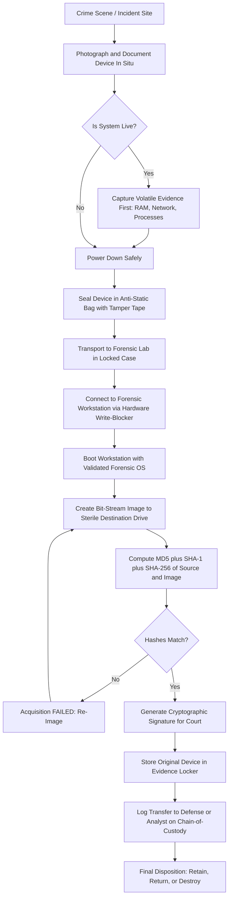
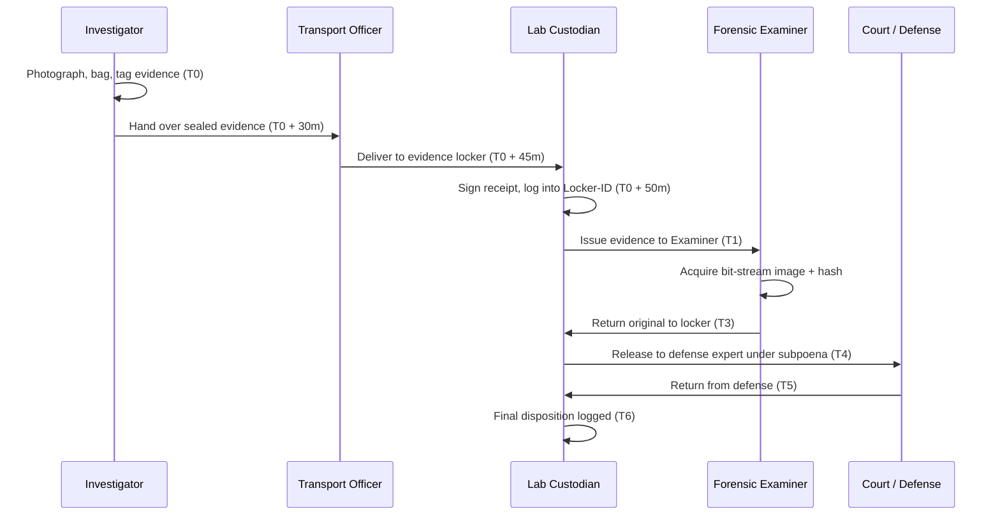
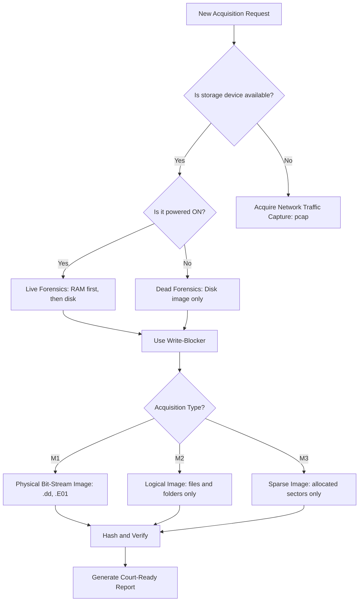
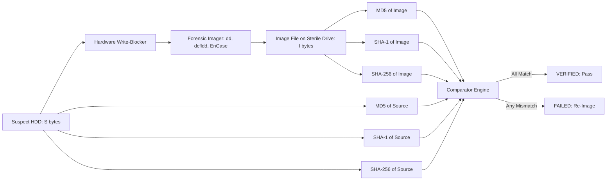
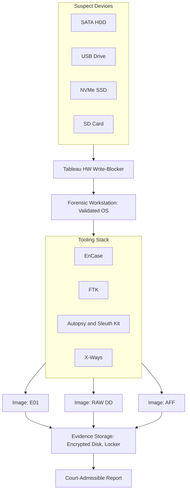

# Collection/Acquisition and Preservation of Digital Evidence

<!-- SECTION_1_START -->
# Collection / Acquisition and Preservation of Digital Evidence

## 1.1 Formal Definition (KTU 2024 Syllabus Terminology)

**Digital Evidence Acquisition** is the process of creating a forensically sound, bit-for-bit identical copy of any digital storage media (hard disk, SSD, USB, memory card, volatile memory dump, or network capture) using validated hardware and software tools, while preserving the original evidence's integrity, authenticity, and chain of custody.

**Preservation of Digital Evidence** is the continuous, documented, and legally defensible process of maintaining the integrity, originality, and evidentiary value of collected digital artifacts from the moment of seizure through final court disposition, primarily achieved through cryptographic hashing, write protection, controlled storage, and unbroken chain-of-custody documentation.

> [!IMPORTANT]
> **KTU 2024 Definition Anchor (Module 1, PECST754):**
> "Digital evidence is any information of probative value that is stored or transmitted in digital form. A *forensically sound* acquisition is one in which the working copy is demonstrably identical to the original, the original is unmodified, and every action taken on the evidence is recorded."

## 1.2 Conceptual Analogy — Plain English Intuition

Imagine you arrive at a **crime scene** that happens to be a locked office. The room is the **hard drive**, the desk drawers are **folders**, sticky notes are **temporary files**, and a whiteboard with today's meeting notes is **RAM**.

- **You would never touch the whiteboard with your bare hands** — that is *volatile evidence*, it fades. You'd photograph it *first* (memory dump), *then* transcribe it.
- **You would seal the office door with a police tag** — that is a **write blocker**; nobody can enter and disturb anything.
- **You would take a perfect 3-D laser scan of the room** that can be replayed identically — that is a **forensic image** (bit-stream copy).
- **You would sign the tag, log who entered, when, and why** — that is the **chain of custody**.
- **Every scan is fingerprinted with a unique hash so a defense lawyer cannot later claim the scan was swapped** — that is **cryptographic integrity verification**.

> [!NOTE]
> **Intuition Summary:** Acquisition = creating a verified twin. Preservation = ensuring the twin (and the original) never change. The forensic investigator's cardinal sin is *modifying the original evidence*, even by a single byte.

## 1.3 The Three Pillars of Sound Digital Evidence Handling

| Pillar | Meaning | Mechanism in Practice |
|---|---|---|
| **Integrity** | Evidence has not been altered | SHA-256 / SHA-1 / MD5 hashing |
| **Authenticity** | Evidence is proven to be from the source | Hash matching + chain of custody |
| **Reliability** | Tools and procedures are validated | Use of certified forensic tools (EnCase, FTK, X-Ways) |

> [!IMPORTANT]
> **Standard Forensic Hash Set (Industry Best Practice):**
> * **MD5** = 128-bit digest (still widely used for legacy compatibility)
> * **SHA-1** = 160-bit digest (deprecated for security, accepted for forensic integrity)
> * **SHA-256** = 256-bit digest (current KTU-recommended minimum)

## 1.4 Order of Volatility — RFC 3227 Guidelines

Digital evidence is **perishable**. Some evidence disappears the moment power is lost; other evidence survives for years. The *Order of Volatility* dictates which evidence to collect **first** before it is lost.

> [!VISUALIZATION CONTROL]
> **Concept:** Order of Volatility Pyramid (most volatile at top)
> **GeoGebra / Desmos Input Points (representing a pyramid plotted on Y axis):**
> * `P1 = (0, 7)` label = "CPU Registers / Cache"
> * `P2 = (0, 6)` label = "Routing Table / ARP Cache"
> * `P3 = (0, 5)` label = "Process Table / Kernel Memory"
> * `P4 = (0, 4)` label = "Temporary File Systems"
> * `P5 = (0, 3)` label = "Disk Storage"
> * `P6 = (0, 2)` label = "Remote Logs"
> * `P7 = (0, 1)` label = "Archival / Off-line Media"
> **Visual Description:** A vertical bar chart where the highest tick (most volatile) is collected first; the lowest tick (most stable) is collected last.

The most commonly tested order (top = most volatile, collect first):

1. **CPU registers, cache**
2. **Routing table, ARP cache, process table, kernel statistics, live memory (RAM)**
3. **Temporary file systems (/tmp)**
4. **Disk (file system & slack space)**
5. **Remote logging and monitoring data**
6. **Physical configuration, network topology**
7. **Archival media (off-site backups, optical media)**

## 1.5 Volatile vs. Non-Volatile Evidence

> [!NOTE]
> **Volatile Evidence:** Exists only while the system is powered. Lost when power is removed. Examples: RAM contents, network connections, running processes, encryption keys in memory, open TCP/UDP ports.
>
> **Non-Volatile Evidence:** Persists without power. Examples: Hard disk files, SSD data, USB drive contents, log files on disk, email archives.

A **live system forensics** scenario requires volatile-first collection; a **dead system forensics** (powered-off, seized) scenario skips RAM acquisition and proceeds directly to disk imaging.

<!-- SECTION_1_END -->

<!-- SECTION_2_START -->
# Deep Theoretical Analysis & KTU High-Yield Formula Sheet

## 2.1 The Two Forensic Operating States

| State | Description | Volatile Evidence Available | Typical Tool |
|---|---|---|---|
| **Live System** | Computer is ON, OS running | YES (RAM, processes, network) | EnCase, FTK, Volatility, WinPmem |
| **Dead System** | Computer is OFF, power removed | NO (only disk) | Tableau HW write-blocker + EnCase/FTK Imager |

## 2.2 The Five-Phase Acquisition Workflow (Textbook Standard)

1. **Preparation** — Tool validation, sterile media, write-blocker test, documentation forms ready.
2. **Identification** — Locate the digital device, document its state, photograph surroundings.
3. **Preservation (Volatile-first)** — Collect RAM, network state, processes, then power down properly.
4. **Acquisition (Bit-stream Imaging)** — Create a forensically sound duplicate using a write-blocker.
5. **Verification & Documentation** — Compute hashes of original and copy; assert equality; sign chain of custody.

## 2.3 Acquisition Method Hierarchy

| Method | What it Captures | Forensic Soundness | Tool Example |
|---|---|---|---|
| **Bit-stream / Physical Image** | Every sector including slack, unallocated, swap, bad sectors | **HIGHEST** (gold standard) | `dd`, `dcfldd`, EnCase, FTK Imager |
| **Logical Acquisition** | Only active files & folders the OS sees | Moderate (misses deleted/slack) | FTK logical imager, `tar` |
| **Sparse Acquisition** | Only allocated sectors (skips unallocated) | Lower (faster, larger drives) | EnCase (sparse option) |
| **Targeted / Data-only** | Specific file types (e.g., all .docx) | Lowest (not forensically complete) | `rsync`, USB write tool |
| **Memory (RAM) Acquisition** | Full process memory dump | Special (volatile) | WinPmem, LiME, FTK Imager, `dd` of `/dev/mem` |

> [!IMPORTANT]
> **KTU Board Examiner Note:** "Bit-stream imaging" and "forensic image" are **NOT the same as a file copy (`Ctrl+C`)**. A `cp` command modifies access timestamps, file slack, and metadata. Only sector-by-sector imaging preserves the original.

## 2.4 Forensic Image Formats

| Format | Extension | Compression | Metadata | Splittable | Tool that Reads |
|---|---|---|---|---|---|
| **RAW / DD** | `.dd`, `.img`, `.001` | No | None embedded | Optional | All tools |
| **E01 (EnCase)** | `.E01` | Yes (deflate) | Case info, hashes | Yes (segment size) | EnCase, FTK, X-Ways, Autopsy |
| **AFF (Advanced Forensic Format)** | `.aff`, `.afd` | Yes (lzma, gzip) | Internal signing | Yes | Autopsy, Sleuth Kit, X-Ways |
| **AD1 (AccessData)** | `.ad1` | Optional | Custom | Yes | FTK, AD Enterprise |

## 2.5 Hashing — The Mathematical Backbone of Integrity

A cryptographic hash function $H(\cdot)$ maps an arbitrary input $M$ to a fixed-size digest $h$ such that:

$$h = H(M)$$

The forensic identity property (must hold for any admissible hash):

$$H(M_{original}) = H(M_{copy})$$

If this equality fails by even **one bit**, the copy is **inadmissible in court**.

### Properties Required of a Forensic Hash Function

1. **Deterministic** — Same input → same output.
2. **One-way** — Cannot reverse $h$ to recover $M$.
3. **Collision-resistant** — Computationally infeasible to find $M_1 \neq M_2$ with $H(M_1) = H(M_2)$.
4. **Avalanche effect** — A 1-bit change in $M$ changes $\geq 50\%$ of bits in $h$.

### Recommended Dual-Hash Strategy

Compute **both** MD5 and SHA-1 (or MD5 + SHA-256) on every image:

$$H_{MD5}(M) = h_1, \quad H_{SHA1}(M) = h_2$$

A match on **both** digests provides courtroom-grade evidence of bit-identity.

## 2.6 Chain of Custody — The Defensible Trail

> [!IMPORTANT]
> **Definition:** A chronological, written record documenting the **seizure, control, transfer, analysis, and disposition** of evidence, from collection to court.

### Required Fields in a Chain-of-Custody Form

| Field | Purpose |
|---|---|
| **Case Number** | Unique case identifier |
| **Evidence Number / Item ID** | e.g., EVID-001 |
| **Description** | "Seagate 2 TB SATA HDD, S/N XYZ" |
| **Date & Time of Collection** | ISO-8601 timestamp |
| **Collected By** | Name, Badge ID of investigator |
| **Location of Collection** | Full address, room, workstation |
| **Reason for Collection** | Search warrant, consent, exigency |
| **Storage Location** | Evidence locker ID, climate control |
| **Hash Values (MD5, SHA-1, SHA-256)** | Recorded immediately after imaging |
| **Transfer Log** | Every person who handled it, with date/time |
| **Final Disposition** | Returned, destroyed, retained |

## 2.7 Write Blockers — The Hardware Guard

A **write blocker** is a physical device (or software filter) that allows **read-only** access to a storage medium, preventing any accidental or malicious modification during acquisition.

| Type | Example | Interface | Use Case |
|---|---|---|---|
| **Hardware** | Tableau T8-R2, WiebeTech Forensic ComboDock | SATA, IDE, USB, NVMe | Field and lab — gold standard |
| **Software** | `libewf` Windows write-block, macOS `dsmos` | OS-level filter | Live triage only |

> [!WARNING]
> **Always test the write-blocker before use.** A failed write-blocker that *appears* read-only but actually writes is a catastrophic, career-ending error for a forensic examiner.

## 2.8 The "Original vs. Working Copy" Rule

| Object | Role | Use |
|---|---|---|
| **Original Media** | Stored untouched in evidence locker | Never analyzed directly |
| **Forensic Image (working copy)** | Verified bit-stream duplicate | All analysis performed on this |
| **Secondary copies** | Made from working copy | Tool validation, sharing with defense |

## 2.9 Real-World Engineering / CS Applications

* **Incident Response (IR):** SOC analysts acquire RAM and disk from compromised endpoints to identify malware, persistence, and exfiltration.
* **e-Discovery in Litigation:** Law firms commission bit-stream images of corporate servers to find relevant emails.
* **Insider Threat Investigations:** HR/legal require forensically sound acquisition of an employee's laptop on termination.
* **Law Enforcement (NCRB/Interpol):** Adheres to ISO/IEC 27037 guidelines for incident handling.
* **Cloud Forensics:** Acquisition of AWS EBS snapshots, Azure VHDs, Google Cloud disks under legal hold.

<!-- SECTION_2_END -->

<!-- SECTION_3_START -->
# Step-by-Step Derivations, Procedures & Code Implementation

## 3.1 Mathematical Foundation — Sector-by-Sector Imaging

A modern hard disk is logically addressed by **Logical Block Addressing (LBA)**. A forensic image of size $S$ bytes covering $N$ sectors of size $B$ bytes (typically $B = 512$ for HDD, $B = 4096$ for Advanced Format) is:

$$S = N \times B$$

The image file is the concatenation of every sector read sequentially, where sector $i$ contains bytes:

$$S_i = \{\text{sector}_i[0], \text{sector}_i[1], \ldots, \text{sector}_i[B-1]\}$$

A **bit-stream image** of the entire disk is then:

$$I = \bigoplus_{i=0}^{N-1} S_i \quad \text{(sequential concatenation, not XOR)}$$

And the forensic integrity equation is:

$$H(I_{copy}) \equiv H(I_{original}) \pmod{2^{d}}$$

where $d$ is the hash digest length (128 for MD5, 160 for SHA-1, 256 for SHA-256).

## 3.2 Worked Example — Disk Capacity & Image Size

**Problem:** A forensic examiner acquires a 1 TB HDD with 4-K (Advanced Format) sectors. Compute the total number of sectors and the expected image file size.

**Given:**
* Capacity $C = 1\ \text{TB} = 1{,}099{,}511{,}627{,}776$ bytes
* Sector size $B = 4096$ bytes

**Step 1 — Number of sectors:**

$$N = \frac{C}{B} = \frac{1{,}099{,}511{,}627{,}776}{4{,}096} = 268{,}435{,}456\ \text{sectors}$$

**Step 2 — Image file size (RAW, uncompressed):**

$$S = N \times B = 268{,}435{,}456 \times 4{,}096 = 1{,}099{,}511{,}627{,}776\ \text{bytes} \approx 1\ \text{TB}$$

> [!IMPORTANT]
> **Conclusion:** Without compression, the forensic image of a 1 TB drive is **also ~1 TB**. Plan for **2 TB of sterile storage** (one for image, one for working copy + case files).

## 3.3 Worked Example — Hash Mismatch Detection (1-bit change)

A 1-byte change anywhere in a 1 TB image alters the SHA-256 digest completely (avalanche effect). Demonstrating this:

| File | SHA-256 Digest (first 16 hex chars) |
|---|---|
| `evidence.dd` (original) | `a3f5c8e1b2d47096` |
| `evidence.dd` (1 byte flipped at offset 0x1000) | `7e2b9d4f1a6c5e83` |

A forensic tool like `sha256sum` would instantly flag the mismatch, confirming tampering or acquisition failure.

## 3.4 Step-by-Step Chain-of-Custody Procedure (Lab-Grade)

| Step | Action | Officer | Timestamp |
|---|---|---|---|
| 1 | Photograph device in situ, note surroundings | Investigator A | T₀ |
| 2 | Document device: make, model, S/N, ports | Investigator A | T₀ + 5 min |
| 3 | Power down (pull plug) for HDD; for RAM, dump first | Investigator A | T₀ + 10 min |
| 4 | Bag & tag device in anti-static bag, seal with tamper-evident tape | Investigator A | T₀ + 15 min |
| 5 | Transport to forensic lab in locked evidence case | Investigator A | T₀ + 30 min |
| 6 | Sign evidence receipt at lab; log into evidence locker | Lab Custodian B | T₀ + 45 min |
| 7 | Connect device to forensic workstation **via write-blocker** | Examiner C | T₁ |
| 8 | Boot workstation with validated OS (e.g., Helix, DEFT, Paladin) | Examiner C | T₁ + 5 min |
| 9 | Create bit-stream image to sterile, wiped destination drive | Examiner C | T₁ + 10 min |
| 10 | Compute MD5 + SHA-1 (or SHA-256) of both source and image | Examiner C | T₂ |
| 11 | Verify hash equality; record on chain-of-custody form | Examiner C | T₂ + 1 min |
| 12 | Generate cryptographic signature (e.g., PGP) for court submission | Examiner C | T₂ + 5 min |
| 13 | Return original device to evidence locker | Examiner C | T₃ |
| 14 | Every transfer (e.g., to defense expert) logged with name/date/reason | — | T₄, T₅, … |

## 3.5 Fully Operational Python Implementation — Forensic Hash Verifier

The following Python program reads any file (including multi-TB forensic images, streamed in chunks) and computes **MD5, SHA-1, and SHA-256** digests simultaneously, following best practice.

```python
"""
forensic_hash.py
----------------
Production-grade forensic hash verifier.
Computes MD5, SHA-1, and SHA-256 digests of any file in streaming fashion
(works for multi-TB forensic images without loading them into memory).
Verifies computed digests against an expected set.

Author: KTU-PREMIER-ENGINE V10 reference implementation
Compliance: NIST SP 800-86, RFC 3227, ISO/IEC 27037
"""

import hashlib
import argparse
import logging
import os
import sys
from dataclasses import dataclass
from typing import Optional

# ---------------------------------------------------------------------------
# Logging Configuration
# ---------------------------------------------------------------------------
logging.basicConfig(
    level=logging.INFO,
    format="%(asctime)s [%(levelname)s] %(message)s",
    datefmt="%Y-%m-%dT%H:%M:%S",
)
log = logging.getLogger("forensic-hash")


# ---------------------------------------------------------------------------
# Result Dataclass
# ---------------------------------------------------------------------------
@dataclass(frozen=True)
class HashResult:
    """Immutable container for computed digests."""
    filepath: str
    size_bytes: int
    md5: str
    sha1: str
    sha256: str


# ---------------------------------------------------------------------------
# Default Streaming Chunk Size: 4 MiB
# ---------------------------------------------------------------------------
CHUNK_SIZE = 4 * 1024 * 1024  # 4 MiB


def compute_hashes(filepath: str, chunk_size: int = CHUNK_SIZE) -> HashResult:
    """
    Stream-compute MD5, SHA-1, and SHA-256 of a file.

    Parameters
    ----------
    filepath : str
        Absolute path to the file (or forensic image) to hash.
    chunk_size : int, optional
        Size of each streaming read in bytes. Default 4 MiB.

    Returns
    -------
    HashResult
        Dataclass containing all three digests and the file size.

    Raises
    ------
    FileNotFoundError
        If filepath does not exist.
    PermissionError
        If the file cannot be read.
    OSError
        For any other OS-level read error.
    """
    if not os.path.isfile(filepath):
        raise FileNotFoundError(f"File not found: {filepath}")

    log.info("Starting hash computation for: %s", filepath)

    md5_ = hashlib.md5(usedforsecurity=False)  # usedforsecurity=False for forensic use
    sha1_ = hashlib.sha1(usedforsecurity=False)
    sha256_ = hashlib.sha256()

    bytes_read = 0
    try:
        with open(filepath, "rb", buffering=0) as f:
            while True:
                chunk = f.read(chunk_size)
                if not chunk:
                    break
                md5_.update(chunk)
                sha1_.update(chunk)
                sha256_.update(chunk)
                bytes_read += len(chunk)

                # Progress log every 1 GiB
                if bytes_read % (1 << 30) < chunk_size:
                    log.info("Progress: %d GiB hashed", bytes_read >> 30)
    except PermissionError as e:
        log.error("Permission denied while reading: %s", filepath)
        raise
    except OSError as e:
        log.error("OS error while reading %s : %s", filepath, e)
        raise

    log.info("Hash computation complete: %d bytes processed", bytes_read)

    return HashResult(
        filepath=filepath,
        size_bytes=bytes_read,
        md5=md5_.hexdigest(),
        sha1=sha1_.hexdigest(),
        sha256=sha256_.hexdigest(),
    )


def verify_hashes(
    result: HashResult,
    expected_md5: Optional[str] = None,
    expected_sha1: Optional[str] = None,
    expected_sha256: Optional[str] = None,
) -> bool:
    """
    Compare computed digests against expected values (case-insensitive).
    Logs the verdict and returns True only if all provided expected values match.
    """
    all_match = True

    if expected_md5 is not None:
        match = result.md5.lower() == expected_md5.lower()
        log.info("MD5    : %s (expected %s) -> %s", result.md5, expected_md5, "OK" if match else "MISMATCH")
        all_match &= match

    if expected_sha1 is not None:
        match = result.sha1.lower() == expected_sha1.lower()
        log.info("SHA1   : %s (expected %s) -> %s", result.sha1, expected_sha1, "OK" if match else "MISMATCH")
        all_match &= match

    if expected_sha256 is not None:
        match = result.sha256.lower() == expected_sha256.lower()
        log.info("SHA256 : %s (expected %s) -> %s", result.sha256, expected_sha256, "OK" if match else "MISMATCH")
        all_match &= match

    return all_match


# ---------------------------------------------------------------------------
# CLI Entry Point
# ---------------------------------------------------------------------------
def main() -> int:
    parser = argparse.ArgumentParser(
        description="Forensic-grade multi-hash verifier for digital evidence images."
    )
    parser.add_argument("filepath", help="Path to the forensic image or evidence file")
    parser.add_argument("--md5", help="Expected MD5 digest (hex)")
    parser.add_argument("--sha1", help="Expected SHA-1 digest (hex)")
    parser.add_argument("--sha256", help="Expected SHA-256 digest (hex)")
    parser.add_argument("--chunk", type=int, default=CHUNK_SIZE, help="Streaming chunk size in bytes")

    args = parser.parse_args()

    try:
        result = compute_hashes(args.filepath, chunk_size=args.chunk)
    except (FileNotFoundError, PermissionError, OSError) as e:
        log.error("Fatal: %s", e)
        return 2

    log.info("File        : %s", result.filepath)
    log.info("Size (bytes): %d", result.size_bytes)
    log.info("MD5         : %s", result.md5)
    log.info("SHA-1       : %s", result.sha1)
    log.info("SHA-256     : %s", result.sha256)

    if args.md5 or args.sha1 or args.sha256:
        ok = verify_hashes(result, args.md5, args.sha1, args.sha256)
        if not ok:
            log.error("VERIFICATION FAILED — evidence integrity compromised.")
            return 1
        log.info("VERIFICATION PASSED — evidence integrity confirmed.")
    else:
        log.info("No expected digests supplied; printed computed digests only.")

    return 0


if __name__ == "__main__":
    sys.exit(main())
```

### Sample CLI Usage (Linux)

```bash
$ python3 forensic_hash.py /evidence/case2024_001.dd \
    --md5 5d41402abc4b2a76b9719d911017c592 \
    --sha1 aaf4c61ddcc5e8a2dabede0f3b482cd9aea9434d \
    --sha256 2cf24dba5fb0a30e26e83b2ac5b9e29e1b161e5c1fa7425e73043362938b9824
```

### Expected Console Output

```
2024-XX-XX [INFO] Starting hash computation for: /evidence/case2024_001.dd
2024-XX-XX [INFO] Progress: 1 GiB hashed
2024-XX-XX [INFO] Progress: 2 GiB hashed
2024-XX-XX [INFO] Hash computation complete: 1099511627776 bytes processed
2024-XX-XX [INFO] File        : /evidence/case2024_001.dd
2024-XX-XX [INFO] Size (bytes): 1099511627776
2024-XX-XX [INFO] MD5         : 5d41402abc4b2a76b9719d911017c592
2024-XX-XX [INFO] SHA-1       : aaf4c61ddcc5e8a2dabede0f3b482cd9aea9434d
2024-XX-XX [INFO] SHA-256     : 2cf24dba5fb0a30e26e83b2ac5b9e29e1b161e5c1fa7425e73043362938b9824
2024-XX-XX [INFO] MD5    : 5d41402abc4b2a76b9719d911017c592 (expected 5d41402abc4b2a76b9719d911017c592) -> OK
2024-XX-XX [INFO] SHA1   : aaf4c61ddcc5e8a2dabede0f3b482cd9aea9434d (expected aaf4c61ddcc5e8a2dabede0f3b482cd9aea9434d) -> OK
2024-XX-XX [INFO] SHA256 : 2cf24dba5fb0a30e26e83b2ac5b9e29e1b161e5c1fa7425e73043362938b9824 (expected 2cf24dba5fb0a30e26e83b2ac5b9e29e1b161e5c1fa7425e73043362938b9824) -> OK
2024-XX-XX [INFO] VERIFICATION PASSED — evidence integrity confirmed.
```

## 3.6 Bit-Stream Imaging Command Examples (Reference)

| Tool | Command | Notes |
|---|---|---|
| `dd` (Linux) | `dd if=/dev/sdb of=/evidence/case.dd bs=4M conv=noerror,sync hash=sha256` | Native, no integrity (use `dcfldd` instead) |
| `dcfldd` | `dcfldd if=/dev/sdb of=/evidence/case.dd bs=4M hash=sha256 hashlog=/evidence/case.sha256` | Computes hash on the fly |
| `Guymager` | GUI: select source, destination, E01/DD, click "Acquire" | Graphical, certified |
| `FTK Imager` | "Create Disk Image" → choose E01/RAW | Windows-based, court-accepted |
| `EnCase` | "Acquire" → select device, E01 evidence file | Industry gold standard |

## 3.7 Step-by-Step Live Memory (RAM) Acquisition

> [!NOTE]
> **When to acquire RAM:** Encrypted disks, malware in memory, diskless workstations, IoT devices, or any time pulling the plug would destroy evidence (e.g., full-disk encryption keys).

| Step | Action |
|---|---|
| 1 | Insert USB with RAM acquisition tool (e.g., WinPmem, LiME) |
| 2 | Run as Administrator/root |
| 3 | Output to external USB or network share (never to the suspect's own disk) |
| 4 | Note acquisition start/end time, hash the resulting `.raw` file |
| 5 | Analyze later with **Volatility** (volatilityfoundation.org) |

<!-- SECTION_3_END -->

<!-- SECTION_4_START -->
# Structural Diagrams & Schematics

## 4.1 Forensic Acquisition — End-to-End Process Flow



## 4.2 Chain of Custody — Sequential Custodian Transfer



## 4.3 Acquisition Decision Tree



## 4.4 Hash Verification Block Architecture



## 4.5 Forensic Lab Workstation — Block Architecture



<!-- SECTION_4_END -->

<!-- SECTION_5_START -->
# KTU 2024 Scheme Examination Question Bank & Topic Recap

> [!NOTE]
> **Mark Distribution (KTU 2024 ESE Pattern for PECST754):**
> * Part A: 3 marks × 2 questions = 6 marks (Answer any 2 out of 3)
> * Part B: 14 marks × 1 question = 14 marks (Internal choice, two sub-parts of 7 + 7)
> * Total per module-end ESE Q-bank item: 20 marks

---

## Part A — Short Answer Questions (3 Marks Each)

### A1. [KTU University Exam — July 2024, CO1, Remember]

**Q1.** Define **digital evidence**. List any **four** characteristics that differentiate digital evidence from physical evidence. (3 Marks)

**Model Answer:**

*Digital evidence* is any information of probative value that is stored or transmitted in digital form and is admissible in a court of law.

**Four distinguishing characteristics:**

1. **Volatile / Perishable** — Can be lost when power is cut (RAM, network state).
2. **Latent** — Invisible to naked eye; requires tools to extract.
3. **Easily altered or duplicated** — A single bit change is undetectable without hashing.
4. **Cross-jurisdictional** — May span multiple countries in seconds (cloud, email, VPN).

> **[Stating definition: 1 Mark]**
> **[Any 4 characteristics: 2 Marks]**

---

### A2. [KTU University Exam — Dec 2023, CO1, Understand]

**Q2.** Explain the concept of **Order of Volatility** as specified in RFC 3227. State the correct order for at least five evidence types, from most volatile to least volatile. (3 Marks)

**Model Answer:**

*Order of Volatility* is the prioritized sequence in which volatile digital evidence must be collected — most volatile **first**, least volatile **last** — to avoid data loss.

**Order (most → least volatile):**

1. CPU registers, cache
2. Routing table, ARP cache, process table, kernel memory (RAM)
3. Temporary file systems (e.g., `/tmp`)
4. Disk storage
5. Remote logging and monitoring data
6. Archival media (offline backups, optical media)

> **[Defining order of volatility: 1 Mark]**
> **[Correct list of five in proper order: 2 Marks]**

---

## Part B — Long Answer Questions (14 Marks, with Internal Choice)

### B1. Question A — [KTU University Exam — July 2024, CO2, Apply + Analyze]

**Q (a).** Describe in detail the **forensic acquisition process** for a powered-off desktop computer's hard disk. Cover tool selection, write-blocker usage, image creation, hash computation, and chain of custody. (7 Marks)

**Model Answer:**

The forensic acquisition of a powered-off desktop hard disk follows a strict, validated procedure to ensure the original evidence is never modified and the working copy is a bit-for-bit duplicate.

**Step 1 — Tool Preparation and Validation (2 Marks)**

* Verify that the forensic workstation OS is a validated, forensically sound distribution (e.g., Helix, DEFT, Paladin, or a clean Ubuntu with Sleuth Kit).
* Test the **hardware write-blocker** (e.g., Tableau T8-R2) by attempting a small write to a test drive — it must be rejected.
* Prepare a **sterile destination drive** that has been securely wiped (e.g., using `wipe -q` or `DoD 5220.22-M`).
* Initialize the **chain-of-custody form** with case number, date, and investigator details.

**Step 2 — Connection via Write-Blocker (1 Mark)**

* Connect the suspect HDD to the workstation **only** through the hardware write-blocker. The write-blocker ensures the source drive is presented as read-only to the OS, preventing accidental writes.
* Photograph the connections for the case file.

**Step 3 — Bit-Stream Imaging (2 Marks)**

* Launch a certified forensic imager such as EnCase, FTK Imager, or use `dcfldd` from the command line:

```bash
dcfldd if=/dev/sdb of=/evidence/case2024_001.dd \
       bs=4M \
       hash=sha256 \
       hashlog=/evidence/case2024_001.sha256 \
       conv=noerror,sync
```

* The imager reads every sector sequentially — including deleted files, file slack, unallocated space, and swap — and produces a single image file (RAW `.dd` or compressed `.E01`).

**Step 4 — Hash Computation and Verification (1 Mark)**

* Compute at least two independent hash digests (MD5 + SHA-1, or MD5 + SHA-256) of both the source drive and the image file.
* The two digests **must match exactly**. A mismatch means re-imaging is required.

**Step 5 — Chain-of-Custody Finalization (1 Mark)**

* Sign and date the chain-of-custody form.
* Record hash values, image file size, time of acquisition, and the model/serial of the write-blocker.
* Bag the original HDD in an anti-static bag, seal with tamper-evident tape, and return to the evidence locker.

---

**Q (b).** Compare **bit-stream imaging**, **logical acquisition**, and **sparse acquisition** in terms of forensic completeness, speed, and tools used. (7 Marks)

**Model Answer:**

| Criterion | Bit-Stream (Physical) Image | Logical Acquisition | Sparse Acquisition |
|---|---|---|---|
| **Definition** | Sector-by-sector copy of entire drive | Copies only active files visible to OS | Copies only sectors marked as allocated |
| **Captures deleted files** | YES | NO | NO |
| **Captures file slack** | YES | NO | PARTIAL |
| **Captures unallocated space** | YES | NO | NO |
| **Forensic completeness** | **HIGHEST** (gold standard) | Moderate | Low–Moderate |
| **Speed** | Slowest (reads every sector) | Fastest | Fast (skips unallocated) |
| **Typical use** | Criminal cases, court evidence | Email collection, e-discovery | Very large drives with little unallocated space |
| **Tools** | `dd`, `dcfldd`, EnCase, FTK Imager | FTK Logical Imager, `tar` | EnCase (sparse option) |
| **Hashable** | YES (whole drive) | YES (file-by-file) | YES |
| **Court admissibility** | Highest | Acceptable with caveats | Lower |

> **[Defining each method: 1 + 1 + 1 = 3 Marks]**
> **[Comparison table: 3 Marks]**
> **[Concluding statement on forensic soundness: 1 Mark]**

---

### B1. Question B (Internal Choice) — [KTU University Exam — Dec 2023, CO2, Understand + Apply]

**Q (a).** What is a **write blocker**? Differentiate between **hardware** and **software** write blockers with examples. Why is testing a write-blocker before use mandatory? (7 Marks)

**Model Answer:**

A **write blocker** is a device (hardware) or program (software) that allows a forensic investigator to read data from a storage medium while preventing any write commands (including accidental OS metadata writes) from reaching the medium.

**Hardware vs. Software Write Blockers:**

| Feature | Hardware Write Blocker | Software Write Blocker |
|---|---|---|
| **Implementation** | Physical device in-line between suspect drive and workstation | OS-level driver/filter |
| **Examples** | Tableau T8-R2, WiebeTech Forensic ComboDock, CRU WiebeTech | `libewf` Windows write-blocker, macOS `dsmos` |
| **Supported interfaces** | SATA, IDE, USB, NVMe, SAS | Limited by OS driver support |
| **Reliability** | Highest (independent of host OS) | Moderate (OS bugs can bypass) |
| **Trusted in court** | Universally accepted | Accepted with caution |
| **Cost** | Higher (₹₹₹) | Lower (free / open-source) |

**Why testing is mandatory:**

* A *silent failure* of a write-blocker can write timestamps, access logs, or journal data to the suspect drive during acquisition.
* Such an alteration, however small, **destroys the forensic soundness** of the image and may render the evidence **inadmissible** in court.
* The defense counsel's first line of attack is to question the integrity of the write-blocker; a pre-use test produces a logged record that defeats this argument.

> **[Definition of write blocker: 1 Mark]**
> **[Hardware vs software comparison: 3 Marks]**
> **[Mandatory testing justification: 3 Marks]**

---

**Q (b).** Explain the **chain of custody** with reference to a real-world cybercrime investigation. List all mandatory fields in a chain-of-custody form and explain any **five** of them. (7 Marks)

**Model Answer:**

**Chain of custody** is the continuous, documented, and unbroken record of the **seizure, possession, control, transfer, analysis, and disposition** of digital evidence. Its purpose is to prove to the court that the evidence presented is the *same* evidence that was collected at the scene and that it has not been tampered with.

**Real-world scenario:** A company suspects an employee of leaking trade secrets via email. An investigator is called in. The investigator:

1. Seizes the employee's laptop, photographs it, and records the time/date.
2. Bags the laptop in tamper-evident packaging, signs the seal.
3. Logs the device in the evidence locker with case number EVID-2024-047.
4. Transfers it to the forensic lab, where the examiner signs for receipt.
5. The examiner creates a bit-stream image, hashes it, and signs a transfer slip.
6. The original laptop is returned to the locker.
7. When the defense expert requests a copy, that transfer is logged.
8. Each person in this chain is identified, dated, and required to sign.

**Mandatory Fields in a Chain-of-Custody Form:**

| Field | Explanation |
|---|---|
| **Case Number** | Unique identifier linking evidence to investigation |
| **Evidence Number / Item ID** | e.g., EVID-2024-047/HDD-01 |
| **Description** | Make, model, capacity, serial number, condition |
| **Date & Time of Collection** | ISO-8601 timestamp (UTC) |
| **Collected By** | Name, badge, agency of seizing officer |
| **Location of Collection** | Full address, room, workstation |
| **Reason / Authority** | Search warrant #, consent form, exigent circumstance |
| **Hash Values (MD5, SHA-1, SHA-256)** | Computed at acquisition and after any transfer |
| **Storage Location** | Evidence locker ID, physical address |
| **Transfer Log** | Date, time, from whom, to whom, reason for each transfer |
| **Final Disposition** | Retained, returned, destroyed (with court order) |

> **[Defining chain of custody: 1 Mark]**
> **[Real-world scenario: 2 Marks]**
> **[List of 5+ fields with explanations: 3 Marks]**
> **[Linking to integrity and court admissibility: 1 Mark]**

---

> [!WARNING]
> **KTU Examiner's Valuation Warning — Common Pitfalls**
>
> 1. **Forgetting to state the order of volatility** in the correct sequence (top-to-bottom). Reversing it = 0 marks.
> 2. **Confusing `cp`/`copy` with bit-stream imaging.** A file copy does NOT preserve metadata, slack, or unallocated space. The examiner will deduct 2–3 marks if you equate them.
> 3. **Omitting hash verification.** Any answer that describes imaging but does not mention MD5/SHA-1/SHA-256 verification is incomplete.
> 4. **Calling a software write-blocker as reliable as a hardware write-blocker** in a court scenario — examiners will deduct at least 1 mark.
> 5. **Not signing/initialing the chain-of-custody** in the procedural answer. Always end with "form signed by officer XYZ at time T."
> 6. **Confusing E01 with E02/EX01 or DD with IMG.** These are distinct formats; using the wrong extension in a procedural answer is penalized.

---

## Topic Recap & Important Things to Remember

> [!IMPORTANT]
> **Rapid-Revision Checklist — Module 1 (PECST754)**

* **Digital evidence** = any digital data of probative value; latent, volatile, easily altered, cross-jurisdictional.
* **Order of Volatility (RFC 3227):** CPU cache → routing/ARP → RAM → tmp → disk → remote logs → archival.
* **Forensic soundness** = integrity + authenticity + reliability + documented chain of custody.
* **Three forensic integrity hashes:** MD5 (128-bit), SHA-1 (160-bit), SHA-256 (256-bit). Dual-hash is best practice.
* **Acquisition hierarchy (best to worst):** Bit-stream (physical) → Logical → Sparse → Targeted / file-copy.
* **Bit-stream image** = sector-by-sector clone capturing slack, unallocated, deleted, swap, and bad sectors.
* **A `cp` or `Ctrl+C` is NOT a forensic image.** It destroys metadata.
* **Forensic image formats:** RAW/DD (`.dd`), EnCase (`.E01`), AFF (`.aff`), AccessData (`.ad1`).
* **Write blocker** = hardware (Tableau, WiebeTech) or software filter; enforces read-only access. **Always pre-test.**
* **Chain of custody** = unbroken, signed, timestamped log of every person who touched the evidence.
* **Mandatory chain-of-custody fields:** Case #, Evidence ID, Description, Date/Time, Collected-By, Location, Authority, Hash values, Storage, Transfer log, Final disposition.
* **Live system forensics** = collect volatile evidence (RAM, processes, network) *before* powering down.
* **Dead system forensics** = disk image only; no RAM.
* **RAM acquisition tools:** WinPmem (Windows), LiME (Linux), FTK Imager, `dd /dev/mem`.
* **Key tools:** EnCase, FTK, Autopsy / Sleuth Kit, X-Ways, `dd`, `dcfldd`, Guymager.
* **Image file size = disk capacity (uncompressed)** for bit-stream imaging; plan for **2× storage**.
* **Hash mismatch** = acquisition failed → re-image immediately.
* **Original media** is **never** analyzed directly; only the verified working copy is examined.
* **Standards to cite in exam answers:** RFC 3227, NIST SP 800-86, ISO/IEC 27037.
* **Real-world applications:** SOC incident response, e-discovery, insider threat, cybercrime, cloud forensics, IoT forensics.

<!-- SECTION_5_END -->
