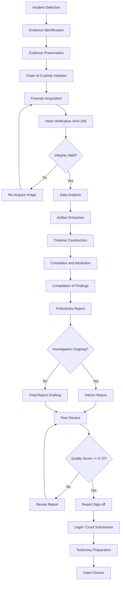
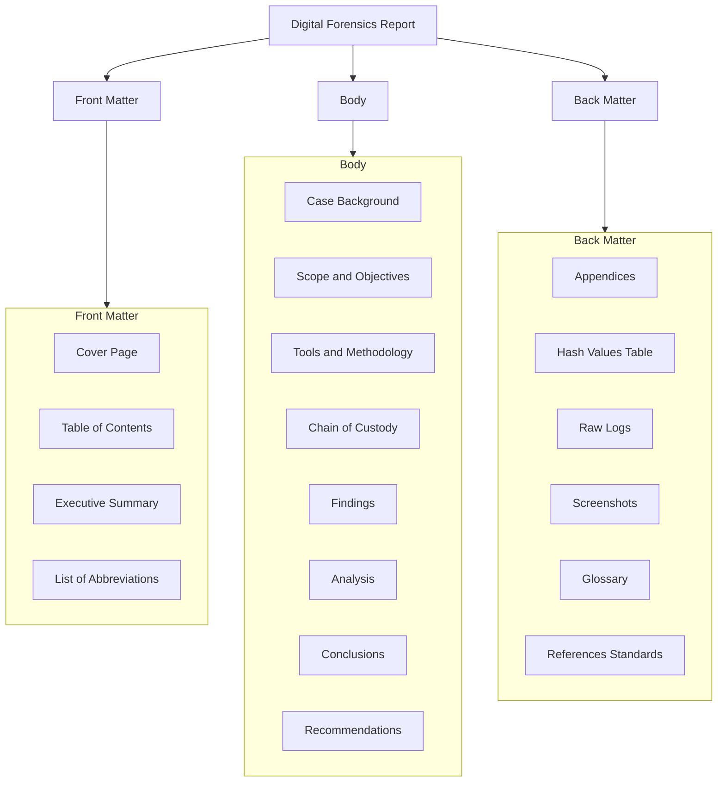
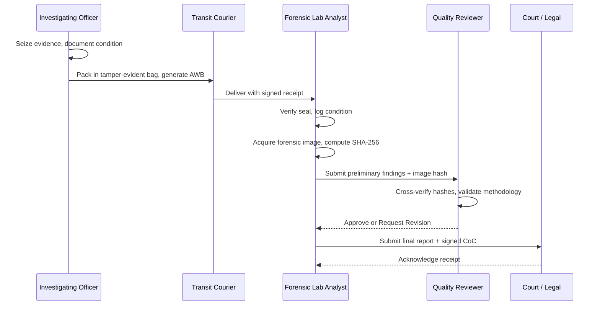
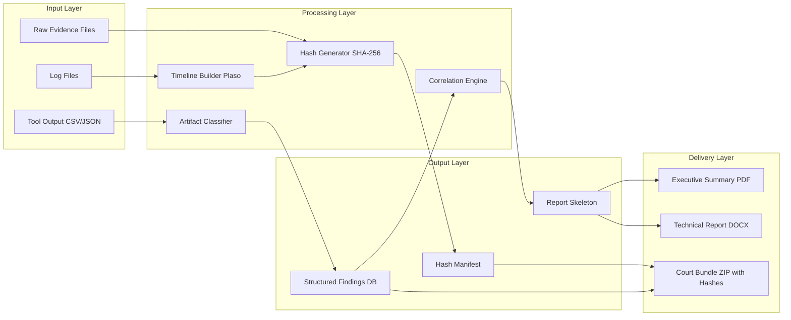
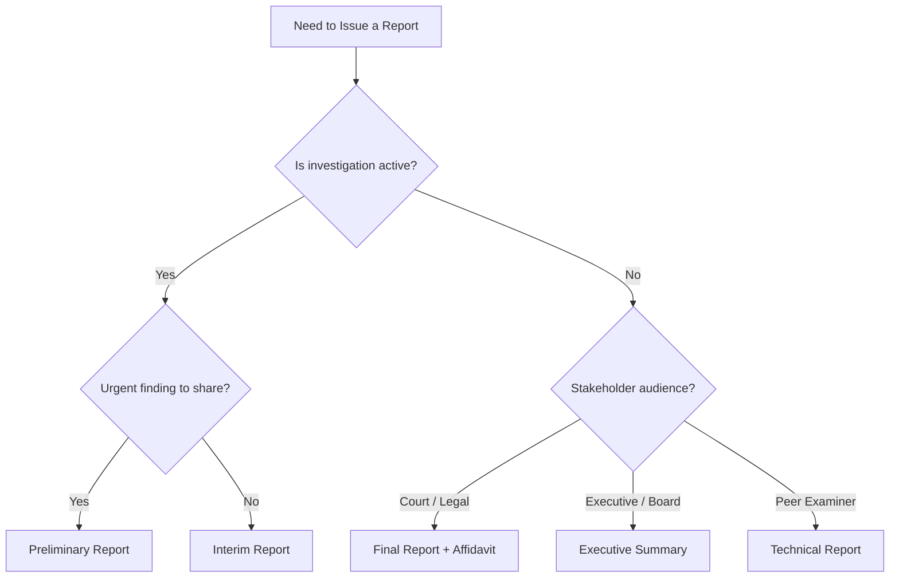

# Compilation of Findings & Reporting

<!-- SECTION_1_START -->
# Compilation of Findings & Reporting in Digital Forensics

## 1.1 Formal Definition (KTU 2024 Syllabus Aligned)

> [!IMPORTANT]
> **Definition — Compilation of Findings:**
> *Compilation of findings* in digital forensics is the systematic, chronological, and forensically sound process of gathering, organizing, correlating, and synthesizing all artifacts, logs, timelines, and evidentiary data recovered during a digital investigation into a coherent, reproducible, and legally admissible form, suitable for inclusion in a formal investigative report.

> [!IMPORTANT]
> **Definition — Digital Forensics Reporting:**
> *Digital forensics reporting* is the formal documentation procedure by which a forensic examiner records the investigative methodology, tools used, evidence acquired, findings derived, and conclusions reached, in a written artifact that can withstand scrutiny in legal proceedings, internal corporate inquiries, or regulatory audits.

In the KTU 2024 *PECST754* syllabus, this topic falls under the broader umbrella of *post-investigation activities* and is closely tied to legal admissibility frameworks such as the **Indian Evidence Act (Sections 65B, 45, 73)**, the **Information Technology Act (2000/2008)**, and the **IT (Procedure and Safeguards for Interception, Monitoring, and Decryption of Information) Rules, 2009**.

## 1.2 Intuitive Overview & Real-World Analogy

Think of a digital forensics investigation as a **surgical operation**:

| Surgical Analogy | Digital Forensics Equivalent |
|---|---|
| Patient (the incident) | The compromised system or network |
| Surgeon's notes | Forensic working papers / case notes |
| Pathology report | Final forensic report |
| Biopsy results | Recovered artifacts and log analysis |
| Patient discharge summary | Executive summary for management |

A surgeon who operates brilliantly but writes a poor discharge summary is likely to face **malpractice lawsuits**. Similarly, a forensic examiner who performs flawless extraction but submits a poorly structured report will see the evidence **excluded or challenged** in court.

> [!NOTE]
> **The Golden Rule of Forensics:** *"If it isn't documented, it didn't happen."* This is the universal axiom in digital forensics. Every action — from powering on the system to hashing a file — must be traceable, timestamped, and reproducible.

## 1.3 Why Reporting is the *Most Critical* Phase

Many students mistakenly believe the *acquisition* or *analysis* phase is the most important. In reality:

- A poorly written report can **nullify** perfectly recovered evidence.
- A well-written report can **validate** even partial or ambiguous evidence by demonstrating a robust methodology.
- Reports are often the **only tangible deliverable** that survives long after the investigator leaves the courtroom.

> [!TIP]
> **KTU Examiner Insight:** Examiners frequently test whether students understand the *report as a standalone legal artifact*. Your report must be understandable to a **non-technical judge, jury, or manager** who has never seen the original evidence.

## 1.4 GeoGebra / Desmos Visualization — N/A

This topic is procedural and documentation-driven; it does not lend itself to coordinate-geometry visualization. However, a **timeline visualization** of events can be created in tools like *Autopsy*, *Plaso/log2timeline*, or *Timesketch*.

> [!VISUALIZATION CONTROL]
> **Concept:** Forensic Event Timeline
> **Tool:** Plaso / log2timeline (Recommended for practical labs)
> **Visual Description:** A horizontal Gantt-style chart showing chronological events (file creation, deletion, login attempts, network connections) plotted against the date axis, allowing investigators to visually correlate malicious activity.
<!-- SECTION_1_END -->

<!-- SECTION_2_START -->
# Deep Theoretical Analysis & KTU High-Yield Formula Sheet

## 2.1 The Phases Preceding Reporting

Before a report is compiled, the investigator must have completed the following pre-reporting activities:

1. **Evidence Preservation** — Original media imaged using write-blockers; bit-stream copies verified.
2. **Data Acquisition** — Logical, file-system, or physical acquisition completed.
3. **Analysis & Examination** — File analysis, log correlation, malware analysis, registry parsing.
4. **Timeline Construction** — Super-timeline built using MAC (Modification, Access, Creation) times.
5. **Correlation & Attribution** — Linking artifacts to actions, actors, and intent.

> [!NOTE]
> The **compilation** phase is the *bridge* between raw analysis and the final report. It is where the investigator filters noise, identifies relevant artifacts, and structures them into a narrative.

## 2.2 Anatomy of a Standard Digital Forensics Report

The KTU 2024 syllabus follows the structure adapted from **ISO/IEC 27037**, **ISO/IEC 27042**, and the **NIST SP 800-86** guidelines. A standard report consists of:

| Section | Content | KTU Weight |
|---|---|---|
| **Cover Page** | Case ID, Title, Investigator Name, Date, Organization | 2 Marks |
| **Executive Summary** | High-level overview for non-technical stakeholders | 3 Marks |
| **Case Background** | Context of the incident, parties involved, scope | 2 Marks |
| **Tools & Methodology** | Hardware/software used, version, validation status | 2 Marks |
| **Chain of Custody** | Documented handover of evidence at every stage | 3 Marks |
| **Findings** | Chronological listing of discovered artifacts | 4 Marks |
| **Analysis & Correlation** | Interpretation of findings, timeline reconstruction | 4 Marks |
| **Conclusions** | Determinations based on findings | 2 Marks |
| **Recommendations** | Remediation steps, security controls | 2 Marks |
| **Appendices** | Hash values, raw logs, screenshots, glossary | 2 Marks |

## 2.3 Types of Forensic Reports

There are **three primary categories** of digital forensics reports:

### 2.3.1 Preliminary Report
- Issued **during** the active investigation.
- Contains initial observations, urgent findings, and preservation actions.
- Used to inform stakeholders of **critical developments** (e.g., active data exfiltration).
- *Not* a final deliverable; subject to revision.

### 2.3.2 Interim Report
- Issued at **scheduled intervals** during long investigations.
- Documents progress, partial findings, and revised scope.
- Common in corporate investigations, large-scale breaches, or eDiscovery matters.

### 2.3.3 Final Report
- The **definitive deliverable** of the investigation.
- Comprehensive, signed, and version-controlled.
- Used as evidence in court, regulatory submissions, or internal disciplinary actions.

### 2.3.4 Specialized Reports
- **Executive Summary** — A 1–2 page distilled version for C-suite executives.
- **Technical Report** — Deeply detailed, intended for peer forensic examiners.
- **Affidavit / Sworn Statement** — A legally notarized statement of facts.

## 2.4 Best Practices for Forensic Reporting

> [!IMPORTANT]
> **The Five Pillars of Effective Forensic Reporting (KTU Board Expectation):**

1. **Clarity** — Plain language; avoid jargon or define it in a glossary.
2. **Accuracy** — Every fact must be verifiable; double-check hashes, timestamps, and tool outputs.
3. **Objectivity** — Present facts, not opinions; distinguish between *observation* and *interpretation*.
4. **Reproducibility** — Another qualified examiner should be able to repeat the process and reach the same conclusion.
5. **Timeliness** — Deliver the report within agreed SLAs; stale reports lose evidentiary value.

## 2.5 Chain of Custody — The Backbone of the Report

The **Chain of Custody (CoC)** is a chronological written record documenting the **seizure, control, transfer, analysis, and disposition** of physical and digital evidence.

A CoC record MUST capture:
- **Unique case identifier** (e.g., *CASE-2024-0042-DSK*)
- **Description of evidence** (make, model, serial number, capacity)
- **Date and time of each transfer**
- **From whom and to whom** the evidence was transferred
- **Purpose of transfer** (acquisition, analysis, court presentation)
- **Method of transfer** (sealed bag, Faraday bag, tamper-evident packaging)
- **Condition of evidence** at each transfer point

> [!WARNING]
> **A broken chain of custody can render ALL evidence inadmissible.** Under Indian law, a missing entry in the CoC can be grounds for the defense to argue tampering.

## 2.6 Hash Values and Integrity Verification

Digital evidence integrity is proven through **cryptographic hash functions**:

| Algorithm | Output Size | Status (2024) |
|---|---|---|
| **MD5** | 128 bits | **Broken** — collisions found; not for forensic use |
| **SHA-1** | 160 bits | **Deprecated** — practical collisions demonstrated (SHAttered, 2017) |
| **SHA-256** | 256 bits | **Recommended** — NIST-approved, used in FTK, EnCase, Autopsy |
| **SHA-3** | Variable | **Latest standard** — Keccak algorithm |

The verification formula is:

$$ H_{original} = H(A) $$

$$ H_{forensic\_copy} = H(A') $$

$$ \text{Evidence Integrity} = \begin{cases} \text{Valid} & \text{if } H(A) = H(A') \\ \text{Compromised} & \text{if } H(A) \neq H(A') \end{cases} $$

> [!TIP]
> **Real-World Tip:** Always use **two independent hash algorithms** (e.g., MD5 + SHA-1 historically, or SHA-256 + SHA-512 in modern practice) to provide redundancy. Most enterprise tools (FTK, X-Ways) compute both automatically.

## 2.7 KTU Formula Sheet / Cheat Sheet

| # | Concept | Formula / Standard | Unit / Notes |
|---|---|---|---|
| 1 | Hash verification | $H_{orig} = H_{copy}$ | Bits (128 / 160 / 256) |
| 2 | Bit-stream copy size | $S_{copy} = S_{source} \times 1$ (lossless) | Bytes |
| 3 | Compression ratio (e.g., EWF) | $R_c = \dfrac{S_{compressed}}{S_{original}} \times 100\%$ | Percentage |
| 4 | Time conversion (UTC ↔ IST) | $T_{IST} = T_{UTC} + 5\text{h}30\text{m}$ | Hours, minutes |
| 5 | File slack space | $S_{slack} = S_{cluster} - (S_{file} \mod S_{cluster})$ | Bytes |
| 6 | Evidence weight score (qualitative) | $W = (A \times R \times D) / C$ | A=Authenticity, R=Relevance, D=Documented, C=Cost |
| 7 | Chain of Custody entries | $N_{CoC} \geq 1 \text{ per transfer}$ | Integer count |
| 8 | FAT timestamp (32-bit) | $Y_{FAT} = (1980 \leq Y \leq 2107)$ | Year range |
| 9 | NTFS $M timestamp precision | $\Delta t = 100\text{ ns}$ | Nanoseconds |
| 10 | Report page guideline | $P \leq 50$ (technical) / $P \leq 5$ (executive) | Pages |

## 2.8 Real-World Utility & Industry Application

| Sector | Use Case |
|---|---|
| **Law Enforcement** | Criminal prosecution, cybercrime investigation (e.g., CBI, Interpol) |
| **Corporate** | Insider threat, IP theft, compliance audits (SOX, GDPR, DPDP Act 2023) |
| **Banking & Finance** | RBI-mandated fraud investigation, transaction disputes |
| **Healthcare** | HIPAA breach notification, medical record tampering |
| **eDiscovery** | Civil litigation hold, preservation, and production |
| **Government / Defense** | National security incidents, classified data leakage |

> [!NOTE]
> India's **Digital Personal Data Protection Act, 2023** has significantly elevated the importance of forensic reports, as data fiduciaries must demonstrate due diligence in breach investigation to the Data Protection Board.
<!-- SECTION_2_END -->

<!-- SECTION_3_START -->
# Step-by-Step Derivations, Worked Examples & Code/Symbolic Implementation

## 3.1 Worked Example 1: Hash Verification of a Forensic Image

**Problem Statement:**
An investigator acquires a forensic image of a 500 GB hard disk. The original evidence drive yields a SHA-256 hash value of:

$$ H_{original} = \text{a4f5c6d7e8f9a0b1c2d3e4f5a6b7c8d9e0f1a2b3c4d5e6f7a8b9c0d1e2f3a4b5} $$

After the imaging process, the forensic image (.E01 file) yields:

$$ H_{copy} = \text{a4f5c6d7e8f9a0b1c2d3e4f5a6b7c8d9e0f1a2b3c4d5e6f7a8b9c0d1e2f3a4b5} $$

Determine if the evidence integrity is **valid, compromised, or indeterminate**.

### Step-by-Step Solution

**Step 1: Identify the two hash values from the problem statement.**

$$ H_{original} = \text{a4f5c6d7e8f9a0b1c2d3e4f5a6b7c8d9e0f1a2b3c4d5e6f7a8b9c0d1e2f3a4b5} $$

$$ H_{copy} = \text{a4f5c6d7e8f9a0b1c2d3e4f5a6b7c8d9e0f1a2b3c4d5e6f7a8b9c0d1e2f3a4b5} $$

**Step 2: Apply the hash comparison function.**

$$ f(H_{orig}, H_{copy}) = \begin{cases} 1 & \text{if } H_{orig} = H_{copy} \\ 0 & \text{if } H_{orig} \neq H_{copy} \end{cases} $$

**Step 3: Evaluate the comparison.**

Since both strings are character-by-character identical, we conclude:

$$ H_{orig} = H_{copy} \Rightarrow f(H_{orig}, H_{copy}) = 1 $$

**Step 4: State the conclusion.**

$$ \boxed{\text{Evidence Integrity} = \text{VALID}} $$

> [!NOTE]
> **[Marking Scheme Hint]:**
> '[Stating both hash values: 1 Mark]'
> '[Defining the comparison function: 1 Mark]'
> '[Final conclusion: 1 Mark]'

## 3.2 Worked Example 2: Chain of Custody Entry Construction

**Problem Statement:**
Construct a valid Chain of Custody entry for the following scenario:
- Evidence: A Samsung 1 TB external hard drive, serial number *S6PXNX0R500123*.
- Seized on: 12-Jan-2024 at 14:30 IST from the office of Mr. R. Sharma, Mumbai.
- Transferred to: Forensic Lab at Bengaluru on 13-Jan-2024 via Blue Dart courier (AWB: BD-2024-IN-0042789).
- Received by: Ms. A. Iyer, Senior Forensic Analyst, on 14-Jan-2024 at 09:15 IST.

### Step-by-Step Table Construction

| Field | Value |
|---|---|
| Case ID | CYBR-2024-0112-MUM |
| Evidence Description | Samsung 1 TB Portable SSD, Black, S/N: S6PXNX0R500123 |
| Seizure Date/Time | 12-Jan-2024, 14:30 IST |
| Seized By | Investigating Officer A. Kumar (Badge #2241) |
| Witness | Mr. R. Sharma (Owner) |
| Seizure Location | Office Cabin 4B, 3rd Floor, Acme Corp, Andheri (E), Mumbai |
| Transfer Date/Time | 13-Jan-2024, 10:00 IST |
| Released By | IO A. Kumar |
| Released To | Blue Dart Courier (AWB: BD-2024-IN-0042789) |
| Packaging | Tamper-evident bag #TF-2024-0098; sealed with red wax |
| Receipt Date/Time | 14-Jan-2024, 09:15 IST |
| Received By | Ms. A. Iyer, Sr. Forensic Analyst, Lab ID #F-007 |
| Condition on Receipt | Seal intact, no visible damage, drive powered off |
| Purpose of Transfer | Forensic imaging and analysis |
| Signature (Releasing) | _________________ (IO A. Kumar) |
| Signature (Receiving) | _________________ (Ms. A. Iyer) |

## 3.3 Worked Example 3: Time Conversion for Timestamp Reporting

**Problem Statement:**
A log file extracted from a compromised server shows an event timestamped **2024-03-15 22:47:33 UTC**. The investigation report is being prepared for an Indian court. Convert this timestamp to **IST (Indian Standard Time)**.

### Step-by-Step Derivation

**Step 1: Recall the IST offset from UTC.**

$$ \Delta_{UTC \to IST} = +5\text{h} 30\text{m} $$

**Step 2: Add the offset to the UTC time.**

$$ T_{IST} = T_{UTC} + \Delta_{UTC \to IST} $$

$$ T_{IST} = 22\text{h} 47\text{m} 33\text{s} + 5\text{h} 30\text{m} 0\text{s} $$

**Step 3: Perform the addition.**

$$ T_{IST} = (22 + 5)\text{h} \ (47 + 30)\text{m} \ 33\text{s} $$

$$ T_{IST} = 27\text{h} \ 77\text{m} \ 33\text{s} $$

**Step 4: Normalize the time components.**

$$ 77\text{m} = 1\text{h} \ 17\text{m} \Rightarrow \text{carry } 1 \text{ to hours} $$

$$ 27\text{h} + 1\text{h} = 28\text{h} $$

**Step 5: Convert the 28th hour to the next day.**

$$ 28\text{h} - 24\text{h} = 4\text{h} \text{ (next day)} $$

**Step 6: Final result.**

$$ \boxed{T_{IST} = \text{2024-03-16, 04:17:33 IST}} $$

> [!WARNING]
> **Common Pitfall:** Forgetting to roll over to the next day when the result exceeds 24:00. Always document the date as well as the time, especially for court records.

## 3.4 Code Implementation: Generating a Forensic Report Skeleton (Python)

The following Python script generates a **standardized forensic report skeleton** as a Markdown file, ready to be filled in by the examiner.

```python
from datetime import datetime
from typing import Dict, List


class ForensicReportGenerator:
    """
    A class to generate a structured digital forensics report skeleton
    conforming to ISO/IEC 27042 and NIST SP 800-86 guidelines.
    """

    def __init__(self, case_id: str, investigator: str, organization: str) -> None:
        self.case_id: str = case_id
        self.investigator: str = investigator
        self.organization: str = organization
        self.date_generated: str = datetime.utcnow().strftime("%Y-%m-%d %H:%M:%S UTC")
        self.sections: Dict[str, str] = {}

    def add_section(self, title: str, content: str) -> None:
        """Append a new section to the report."""
        if not title or not isinstance(title, str):
            raise ValueError("Section title must be a non-empty string.")
        self.sections[title] = content

    def add_chain_of_custody(self, entries: List[Dict[str, str]]) -> None:
        """Format and add a Chain of Custody table."""
        if not entries:
            raise ValueError("Chain of Custody entries cannot be empty.")
        header: str = (
            "| Date/Time (UTC) | From | To | Purpose | Condition | Signature |\n"
            "|---|---|---|---|---|---|\n"
        )
        rows: str = "".join(
            f"| {e['datetime']} | {e['from']} | {e['to']} | "
            f"{e['purpose']} | {e['condition']} | __________ |\n"
            for e in entries
        )
        self.sections["Chain of Custody"] = header + rows

    def compute_sha256(self, file_path: str) -> str:
        """Compute SHA-256 hash of a file for integrity verification."""
        import hashlib
        sha256_hash: str = hashlib.sha256()
        try:
            with open(file_path, "rb") as f:
                for byte_block in iter(lambda: f.read(4096), b""):
                    sha256_hash.update(byte_block)
            return sha256_hash.hexdigest()
        except FileNotFoundError:
            return "ERROR: File not found."
        except PermissionError:
            return "ERROR: Permission denied."

    def export_markdown(self, output_path: str) -> None:
        """Export the assembled report to a Markdown file."""
        try:
            with open(output_path, "w", encoding="utf-8") as f:
                f.write(f"# Digital Forensics Investigation Report\n\n")
                f.write(f"**Case ID:** {self.case_id}  \n")
                f.write(f"**Investigator:** {self.investigator}  \n")
                f.write(f"**Organization:** {self.organization}  \n")
                f.write(f"**Date Generated:** {self.date_generated}\n\n")
                f.write("---\n\n")
                for title, content in self.sections.items():
                    f.write(f"## {title}\n\n{content}\n\n")
            print(f"[+] Report successfully written to: {output_path}")
        except IOError as e:
            print(f"[!] I/O Error while writing report: {e}")


# ===================== DEMO USAGE =====================
if __name__ == "__main__":
    report = ForensicReportGenerator(
        case_id="CYBR-2024-0112-MUM",
        investigator="Ms. A. Iyer",
        organization="SecureForensics Labs Pvt. Ltd."
    )

    report.add_section(
        "Executive Summary",
        "On 12-Jan-2024, a suspected data exfiltration incident was reported..."
    )

    report.add_section(
        "Tools & Methodology",
        "- EnCase Forensic v8.10\n- FTK Imager v4.5\n- Autopsy 4.21.0"
    )

    coc_entries: List[Dict[str, str]] = [
        {
            "datetime": "2024-01-12 14:30:00",
            "from": "IO A. Kumar (Mumbai)",
            "to": "Blue Dart Courier",
            "purpose": "Transit to Bengaluru Lab",
            "condition": "Sealed, tamper-evident",
        },
        {
            "datetime": "2024-01-14 09:15:00",
            "from": "Blue Dart Courier",
            "to": "Ms. A. Iyer (Lab)",
            "purpose": "Forensic imaging",
            "condition": "Seal intact",
        },
    ]
    report.add_chain_of_custody(coc_entries)

    # Hash computation (replace 'evidence.dd' with actual image path)
    image_hash: str = report.compute_sha256("evidence.dd")
    report.add_section("Integrity Verification", f"**SHA-256 of image:** `{image_hash}`")

    report.export_markdown("forensic_report_CASE-2024-0112.md")
```

> [!IMPORTANT]
> **Code Walkthrough — Key Functions:**
> - `__init__`: Captures immutable case metadata.
> - `add_section()`: Validates inputs strictly (raises `ValueError` on empty titles).
> - `add_chain_of_custody()`: Validates that the list is non-empty to prevent blank CoC tables.
> - `compute_sha256()`: Reads the file in 4 KB chunks to handle large forensic images (often > 1 TB) without exhausting RAM.
> - `export_markdown()`: Wraps file I/O in `try/except` for graceful error handling.

## 3.5 Symbolic Implementation: Report Quality Scoring Function

Let $Q$ be the **quality score** of a forensic report, defined as a weighted sum of five attributes:

$$ Q = w_1 \cdot C + w_2 \cdot A + w_3 \cdot O + w_4 \cdot R + w_5 \cdot T $$

Where:

| Symbol | Attribute | Description | Weight |
|---|---|---|---|
| $C$ | Clarity | Plain language, low jargon density | $w_1 = 0.20$ |
| $A$ | Accuracy | All facts verifiable | $w_2 = 0.30$ |
| $O$ | Objectivity | Distinguishes observation from opinion | $w_3 = 0.20$ |
| $R$ | Reproducibility | Methodology can be replicated | $w_4 = 0.20$ |
| $T$ | Timeliness | Delivered within SLA | $w_5 = 0.10$ |

Each attribute is normalized to the interval $[0, 1]$:

$$ Q = 0.20C + 0.30A + 0.20O + 0.20R + 0.10T $$

$$ Q_{min} = 0 \quad ; \quad Q_{max} = 1 $$

$$ \text{Grade} = \begin{cases} \text{Excellent} & \text{if } Q \geq 0.90 \\ \text{Acceptable} & \text{if } 0.70 \leq Q < 0.90 \\ \text{Needs Revision} & \text{if } 0.50 \leq Q < 0.70 \\ \text{Reject} & \text{if } Q < 0.50 \end{cases} $$

> [!NOTE]
> **Example Application:** A report with $C=0.8, A=0.9, O=0.85, R=0.75, T=1.0$ yields:

$$ Q = (0.20)(0.8) + (0.30)(0.9) + (0.20)(0.85) + (0.20)(0.75) + (0.10)(1.0) $$

$$ Q = 0.16 + 0.27 + 0.17 + 0.15 + 0.10 $$

$$ Q = 0.85 \Rightarrow \text{Acceptable} $$
<!-- SECTION_3_END -->

<!-- SECTION_4_START -->
# Structural Diagrams & Schematics

## 4.1 The Complete Digital Forensics Reporting Workflow



## 4.2 Report Structure Hierarchy (Nested Subgraph)



## 4.3 Sequential Processing Topology — Chain of Custody Flow



## 4.4 Block-Level Functional Architecture — Report Generation Pipeline



## 4.5 Decision Matrix: Report Type Selection


<!-- SECTION_4_END -->

<!-- SECTION_5_START -->
# KTU 2024 Scheme Examination Question Bank & Topic Recap

## 5.1 Part A — Short Answer Questions (2 × 3 = 6 Marks)

### Question 1 [KTU University Exam – July 2023]
**CO1 / Remember**
*"What is a Chain of Custody in digital forensics? List any four components that must be documented in a Chain of Custody record."*

**Model Answer (3 Marks):**
> A *Chain of Custody (CoC)* is the chronological documentation of the seizure, control, transfer, analysis, and disposition of digital evidence, ensuring its integrity and admissibility in court.
>
> Four essential components are:
> 1. Unique case identifier and evidence description.
> 2. Date, time, and identity of every person who handled the evidence.
> 3. Purpose and method of each transfer (sealed bag, courier, etc.).
> 4. Condition of the evidence at each transfer point, with signatures of both the releasing and receiving parties.

### Question 2 [KTU University Exam – Dec 2023]
**CO2 / Understand**
*"Differentiate between a preliminary report and a final report in a digital forensics investigation."*

**Model Answer (3 Marks):**

| Aspect | Preliminary Report | Final Report |
|---|---|---|
| **Timing** | Issued during active investigation | Issued after investigation closure |
| **Purpose** | Inform stakeholders of urgent findings | Provide comprehensive, court-ready documentation |
| **Content Depth** | Initial observations only | Complete findings, analysis, conclusions |
| **Audience** | Incident response team, management | Court, regulatory bodies, peer reviewers |
| **Status** | Subject to revision | Final, signed, and version-controlled |

## 5.2 Part B — Long Answer Questions (Module Internal Choice) (1 × 14 = 14 Marks)

### Question A (14 Marks) [KTU University Exam – Dec 2024]

**CO2, CO3 / Understand, Apply**

**(a)** Explain the **structure and components of a standard digital forensics report** as per ISO/IEC 27042 guidelines. (7 Marks)

**(b)** A forensic examiner acquires a 2 TB hard disk and obtains the following hash values:
- MD5 of original: `5d41402abc4b2a76b9719d911017c592`
- MD5 of forensic copy: `5d41402abc4b2a76b9719d911017c592`
- SHA-256 of original: `2cf24dba5fb0a30e26e83b2ac5b9e29e1b161e5c1fa7425e73043362938b9824`
- SHA-256 of forensic copy: `2cf24dba5fb0a30e26e83b2ac5b9e29e1b161e5c1fa7425e73043362938b9824`

Determine whether the **evidence integrity is valid**. Justify your answer using the hash verification function. (7 Marks)

---

### Model Answer for Question A

#### Part (a) — Structure of a Digital Forensics Report (7 Marks)

The standard structure, aligned with **ISO/IEC 27037 / 27042** and **NIST SP 800-86**, comprises the following sections:

1. **Cover Page** (1 Mark)
   - Case ID, title, investigator name, organization, date.
2. **Executive Summary** (1 Mark)
   - One-page overview for non-technical readers; covers what, when, who, and outcome.
3. **Case Background & Scope** (1 Mark)
   - Context of the incident, parties involved, scope and limitations of the engagement.
4. **Tools & Methodology** (1 Mark)
   - Hardware and software used (with versions), standards followed, validation status of tools.
5. **Chain of Custody** (1 Mark)
   - Tabular record of every transfer, with signatures and timestamps.
6. **Findings, Analysis & Conclusions** (1.5 Marks)
   - Chronological listing of artifacts, their interpretation, and the final determination.
7. **Recommendations & Appendices** (0.5 Mark)
   - Remediation advice; raw logs, hash values, and glossary as supporting evidence.

> **[Valuation Key]:**
> '[Listing all 7 sections with brief content: 5 Marks]'
> '[Stating ISO/IEC standards and NIST reference: 1 Mark]'
> '[Logical flow and cohesion: 1 Mark]'

#### Part (b) — Hash Verification (7 Marks)

**Step 1: State the hash values for comparison.** (1 Mark)

$$ H_{MD5, orig} = \text{5d41402abc4b2a76b9719d911017c592} $$

$$ H_{MD5, copy} = \text{5d41402abc4b2a76b9719d911017c592} $$

$$ H_{SHA256, orig} = \text{2cf24dba5fb0a30e26e83b2ac5b9e29e1b161e5c1fa7425e73043362938b9824} $$

$$ H_{SHA256, copy} = \text{2cf24dba5fb0a30e26e83b2ac5b9e29e1b161e5c1fa7425e73043362938b9824} $$

**Step 2: Define the comparison function.** (1 Mark)

$$ f(H_{orig}, H_{copy}) = \begin{cases} 1 & \text{if } H_{orig} = H_{copy} \\ 0 & \text{if } H_{orig} \neq H_{copy} \end{cases} $$

**Step 3: Evaluate MD5 comparison.** (1 Mark)

$$ f(H_{MD5, orig}, H_{MD5, copy}) = 1 \quad \text{(valid)} $$

**Step 4: Evaluate SHA-256 comparison.** (1 Mark)

$$ f(H_{SHA256, orig}, H_{SHA256, copy}) = 1 \quad \text{(valid)} $$

**Step 5: State the conclusion.** (1 Mark)

Since both MD5 and SHA-256 hashes match exactly, the forensic image is a bit-for-bit identical copy of the original evidence.

**Step 6: Add forensic interpretation.** (2 Marks)

> The use of **two independent cryptographic hash algorithms** (MD5 and SHA-256) provides cryptographic redundancy. Even though MD5 is considered broken for collision resistance, its inclusion in forensic workflows remains a **legacy compatibility requirement** for several court systems and tools (e.g., EnCase, FTK). The SHA-256 match is the **authoritative integrity check** in modern practice.

$$ \boxed{\text{Evidence Integrity} = \text{VALID (Accepted by both MD5 and SHA-256 comparison)}} $$

> **[Valuation Key]:**
> '[Stating both hash values: 1 Mark]'
> '[Defining the comparison function: 1 Mark]'
> '[Performing MD5 comparison: 1 Mark]'
> '[Performing SHA-256 comparison: 1 Mark]'
> '[Final integrity verdict: 1 Mark]'
> '[Forensic interpretation about dual-hash: 2 Marks]'

---

### Question B (14 Marks) [KTU University Exam – July 2024]

**CO2, CO3 / Understand, Apply**

**(a)** Discuss the **best practices for writing a digital forensics report**. Mention at least five best practices with justification. (7 Marks)

**(b)** A log entry recovered from a Linux server reads:
`Jan 15 03:22:17 web01 sshd[2847]: Failed password for root from 203.0.113.45 port 51234 ssh2`

Convert this timestamp to **Indian Standard Time (IST)** and explain its significance in a forensic timeline. (7 Marks)

---

### Model Answer for Question B

#### Part (a) — Best Practices (7 Marks)

1. **Use Clear, Plain Language** (1.5 Marks) — Avoid technical jargon or define every term in a glossary. The report may be read by judges, lawyers, or executives with no technical background.

2. **Maintain Objectivity** (1.5 Marks) — Distinguish clearly between *observation* (what was found) and *interpretation* (what it means). The investigator's opinion should be presented as such, not as fact.

3. **Ensure Reproducibility** (1 Mark) — Document every tool, command, version, and parameter used. Another qualified examiner must be able to replicate the analysis and arrive at the same conclusion.

4. **Document Chain of Custody Meticulously** (1 Mark) — Every transfer of evidence must be logged with date, time, identity, purpose, and condition. A broken CoC invalidates evidence.

5. **Compute and Record Cryptographic Hashes** (1 Mark) — Use SHA-256 (and optionally SHA-512) to prove the evidence has not been altered. Include the hash in the report and the deliverable.

6. **Use Timestamps with Time Zone** (0.5 Mark) — Always specify UTC or local time; never leave timestamps ambiguous.

7. **Sign and Version-Control the Report** (0.5 Mark) — Every report must carry the investigator's signature, date, and a unique version number for traceability.

> **[Valuation Key]:**
> '[Five best practices with justification: 5 Marks]'
> '[Logical organization and presentation: 1 Mark]'
> '[References to ISO/NIST: 1 Mark]'

#### Part (b) — Time Conversion and Significance (7 Marks)

**Step 1: Identify the UTC timestamp from the log entry.** (1 Mark)

$$ T_{UTC} = \text{Jan 15, 03:22:17 UTC} $$

**Step 2: Recall the IST offset from UTC.** (1 Mark)

$$ \Delta_{UTC \to IST} = +5\text{h}\, 30\text{m} $$

**Step 3: Add the offset to the UTC time.** (1 Mark)

$$ T_{IST} = 03\text{h}\, 22\text{m}\, 17\text{s} + 05\text{h}\, 30\text{m}\, 00\text{s} $$

$$ T_{IST} = 08\text{h}\, 52\text{m}\, 17\text{s} $$

**Step 4: State the final IST value.** (1 Mark)

$$ \boxed{T_{IST} = \text{Jan 15, 08:52:17 IST}} $$

**Step 5: Explain forensic significance.** (3 Marks)

> - The timestamp confirms a **failed SSH login attempt** targeting the **root** account from IP `203.0.113.45`.
> - The hour (08:52 IST) is **within normal business hours**, suggesting the attacker was attempting to blend in with legitimate traffic.
> - This single event, when correlated with subsequent log entries, may reveal a **brute-force or credential-stuffing attack pattern**.
> - The 03:22 UTC equivalent also helps correlate with logs from servers in **other time zones** during multi-jurisdictional investigations.
> - Such an entry would be a **critical artifact** in the final report's Findings section, supporting conclusions about unauthorized access attempts.

> **[Valuation Key]:**
> '[Stating UTC timestamp from log: 1 Mark]'
> '[Stating IST offset: 1 Mark]'
> '[Arithmetic addition: 1 Mark]'
> '[Final IST value: 1 Mark]'
> '[Forensic significance discussion: 3 Marks]'

---

## 5.3 KTU Examiner's Valuation Warning / Pitfall Callout

> [!WARNING]
> **Common Mistakes That Cost Marks in This Topic:**
> 1. **Skipping the executive summary** — Examiners deduct 2–3 marks if the report structure is missing even one standard section.
> 2. **Forgetting the time zone** in timestamps — Always write *UTC* or *IST* explicitly. An undated timestamp is a 1-mark deduction.
> 3. **Confusing MD5 and SHA-256 status** — MD5 is *not* recommended for new forensic work; SHA-256 is the modern standard. Stating "MD5 is secure" will cost marks.
> 4. **Missing signatures or dates** in Chain of Custody tables — A CoC entry without signatures is treated as incomplete.
> 5. **Omitting the hash comparison logic** — Just stating "hashes match" is not enough; show the comparison function and the equality.
> 6. **Presenting opinion as fact** — Phrases like *"the defendant is guilty"* are inappropriate; use *"the evidence indicates..."* instead.

---

## 5.4 Topic Recap & Important Things to Remember

- ✅ **Compilation of findings** is the systematic organization of forensic artifacts into a coherent, reproducible narrative.
- ✅ **The report is the only deliverable** that survives long after the investigation; treat it as a **standalone legal artifact**.
- ✅ **The five pillars of effective reporting** are *Clarity, Accuracy, Objectivity, Reproducibility, and Timeliness*.
- ✅ **Chain of Custody** must capture *who, what, when, where, why, and how* for every evidence transfer.
- ✅ **Hash verification** uses cryptographic algorithms; **SHA-256** is the modern standard, while **MD5** is legacy and **SHA-1** is deprecated.
- ✅ **Report types** include *Preliminary, Interim, Final, Executive Summary, Technical Report,* and *Affidavit*.
- ✅ **Standard report sections** (per ISO/IEC 27042 & NIST SP 800-86): *Cover Page, Executive Summary, Case Background, Tools & Methodology, Chain of Custody, Findings, Analysis, Conclusions, Recommendations, Appendices*.
- ✅ **Timestamps must always carry a time zone**; conversion formula: $T_{IST} = T_{UTC} + 5\text{h}\,30\text{m}$.
- ✅ **Quality of a report** can be quantitatively scored as $Q = 0.20C + 0.30A + 0.20O + 0.20R + 0.10T$, ranging from 0 (Reject) to 1 (Excellent).
- ✅ **Indian legal context** invokes the *Indian Evidence Act (Section 65B)*, *IT Act 2000/2008*, and the *DPDP Act 2023* for admissibility and breach reporting.
- ✅ **Best practice:** Always generate **two independent hashes** (e.g., MD5 + SHA-256) for cryptographic redundancy and tool interoperability.
- ✅ **Reproducibility** is non-negotiable: document every tool, version, command, and parameter used in the analysis.
- ✅ **Do not truncate steps** in derivations; examiners reward complete, traceable logic over clever shortcuts.
- ✅ **The phrase *"If it isn't documented, it didn't happen"* is the universal forensic axiom** — quote it whenever relevant.
<!-- SECTION_5_END -->
