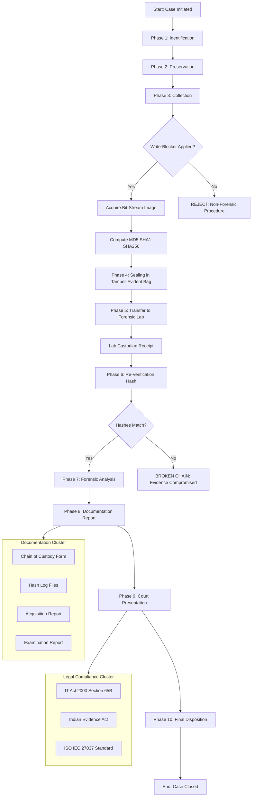
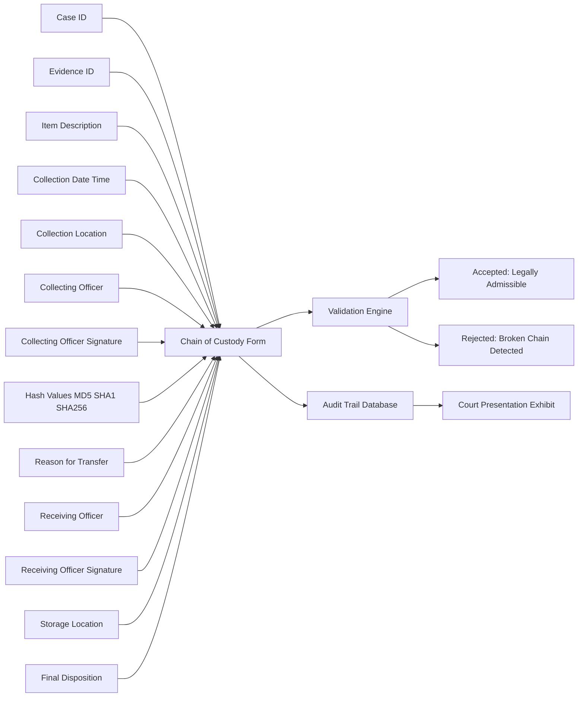

# Concept of Chain of Custody

<!-- SECTION_1_START -->
# Concept of Chain of Custody in Digital Forensics

## 1. Formal Academic Definition

> [!IMPORTANT]
> **Chain of Custody (CoC)** in digital forensics is defined as the **chronological, documented, and unbroken trail of accountability** that records the **seizure, control, transfer, analysis, and disposition** of digital evidence, from the point of collection to its final presentation in a court of law. It establishes the **provenance, integrity, and authenticity** of the evidence by tracking every individual, action, and timestamp associated with the evidence lifecycle.

In the context of the **KTU 2024 Scheme (NEP 2020 aligned)** syllabus for **Digital Forensics (PECST754)**, Chain of Custody is treated as a **forensic admissibility prerequisite** under Module 1 (Introduction to Digital Forensics). It directly supports the evidentiary standards mandated by the **Indian Evidence Act, 1872 (Sections 45, 65B)**, the **Information Technology Act, 2000 (Sections 79, 80, 65B)**, and the international standard **ISO/IEC 27037:2012** (Guidelines for identification, collection, acquisition and preservation of digital evidence).

The Chain of Custody fundamentally answers four investigative questions:

1. **Who** collected, handled, and transferred the evidence?
2. **What** was collected, and what is its current state?
3. **When** was each action performed (with precise timestamps)?
4. **How** was the evidence preserved, and **why** was each action necessary?

> [!NOTE]
> **KTU 2024 Syllabus Highlight:** A break or inconsistency in the Chain of Custody is legally termed the **"Broken Chain"** syndrome. Once the chain is broken, the evidence may be deemed **inadmissible** in court, regardless of its actual content or relevance to the case.

## 2. Conceptual Analogy / Intuition

Imagine a sealed, transparent glass jar containing a precious water sample from a crime scene. To prove to a judge that this water has not been tampered with, the following must be true:

- The jar is **sealed with a tamper-evident lock** at the scene.
- Every person who touched the jar must **sign a register**, mentioning the **date, time, and purpose** of touching it.
- The jar must be **photographed at every transfer point**.
- An **independent lab test** must confirm the water is identical to the original sample.
- Any break in the seal or missing signature **invalidates the entire sample**.

In digital forensics, the **sealed jar = the digital evidence** (a hard drive, USB, memory dump), the **tamper-evident lock = the cryptographic hash (MD5/SHA-256)**, the **signing register = the Chain of Custody form**, and the **lab test = forensic hash verification**. Just as a single missing signature destroys the credibility of the water sample, a single undocumented action can destroy the admissibility of digital evidence.

## 3. Physical and Cryptographic Constants in Chain of Custody

| Constant / Standard | Value / Description |
|---|---|
| **Minimum Hash Algorithms Required** | **MD5 (128-bit), SHA-1 (160-bit), SHA-256 (256-bit)** |
| **Standard Reference** | **NIST SP 800-86, ISO/IEC 27037:2012** |
| **Minimum Documentation Fields** | **Case ID, Item ID, Custodian, Timestamp, Action, Hash, Signature** |
| **Legal Provision (India)** | **Section 65B of Indian Evidence Act, 1872** |

## 4. GeoGebra / Desmos Visualization Concept

> [!VISUALIZATION CONTROL]
> **Concept:** Hash Divergence Visualization for Evidence Tampering
> **GeoGebra / Desmos Input Equations:**
> * `f(x) = x` (Original evidence hash baseline)
> * `g(x) = x + \Delta` (Modified evidence hash trajectory)
> * `h(x) = \sin(2 \pi x)` (Tamper detection oscillation signal)
> **Visual Description:** On a coordinate axis, plot the original hash value as a horizontal line. Any modification to the evidence causes a vertical deviation, visually represented as a spike or divergence. The student should observe that even a **1-bit change** in evidence produces a completely different hash (avalanche effect).

<!-- SECTION_1_END -->

<!-- SECTION_2_START -->
# Deep Theoretical Analysis & KTU High-Yield Formula Sheet

## 1. The Four Pillars of Chain of Custody

The Chain of Custody framework rests on four legally enforceable pillars that a KTU examiner will expect you to enumerate and explain:

- **Pillar 1 — Documentation:** Every interaction with the evidence is recorded in a tamper-evident written or digital log.
- **Pillar 2 — Preservation:** The evidence is protected from physical, environmental, and logical alteration.
- **Pillar 3 — Accountability:** Every handler is uniquely identified, with their role and justification recorded.
- **Pillar 4 — Integrity Verification:** Cryptographic hash functions are used to mathematically prove the evidence has not been altered.

## 2. Operational Phases of the Chain of Custody

The Chain of Custody is implemented across **six sequential operational phases**. Each phase has specific procedural requirements and documentation mandates:

### Phase 1 — Identification
- Recognising potential digital evidence at the scene.
- Identifying storage media (HDDs, SSDs, USB drives, mobile devices, cloud accounts, IoT devices).
- Recording the device state (powered on/off, connected to network, screen state).

### Phase 2 — Preservation
- Isolating the device from networks (preventing remote wiping).
- Using **Faraday bags** for mobile devices to block RF signals.
- Maintaining the **volatile state** of live systems using **live forensic tools** (e.g., FTK Imager, EnCase, dd).
- Documenting the **bit-stream image** rather than the logical file copy.

### Phase 3 — Collection
- Creating a **forensically sound image** using write-blockers (hardware or software).
- Computing cryptographic hashes of both source and image.
- Sealing the original evidence in **tamper-evident bags**.
- Labelling with unique **evidence IDs** (e.g., EVD-2024-001).

### Phase 4 — Analysis
- Examining the forensic image on a **clean, validated forensic workstation**.
- Never working directly on the original evidence.
- Re-computing hashes before and after each analysis step.
- Documenting every tool, version, and parameter used.

### Phase 5 — Documentation
- Maintaining the **Chain of Custody Form** (CoCF) with all fields completed.
- Generating an **examination report** with reproducible findings.
- Recording any deviation from standard procedure with justification.

### Phase 6 — Presentation
- Producing evidence for court in a **legally compliant format**.
- Presenting the CoC form, hash logs, and acquisition reports.
- Testifying to the continuity of custody under oath.

## 3. Cryptographic Hash Functions — The Mathematical Backbone

A **cryptographic hash function** $H$ takes an input message $M$ of arbitrary length and produces a fixed-length output called a **message digest** or **hash value**.

$$H(M) = h$$

Where:
* $M$ is the input data (digital evidence file or bit-stream image).
* $H$ is the hash function (MD5, SHA-1, SHA-256, SHA-512).
* $h$ is the resulting fixed-length hash digest.

### Essential Properties of Cryptographic Hash Functions

| Property | Mathematical Description | Forensic Significance |
|---|---|---|
| **Deterministic** | $H(M) = h$ always produces the same $h$ for the same $M$ | Enables reproducible verification at any stage |
| **Avalanche Effect** | A 1-bit change in $M$ changes approximately **50% of bits** in $h$ | Detects even microscopic tampering |
| **Pre-image Resistance** | Given $h$, finding $M$ is computationally infeasible | Preserves confidentiality of evidence data |
| **Collision Resistance** | Finding $M_1 \neq M_2$ such that $H(M_1) = H(M_2)$ is infeasible | Prevents forged evidence with same hash |

### Multi-Algorithm Hash Verification (KTU Best Practice)

Forensic laboratories compute multiple hashes to ensure defence-in-depth:

$$H_{combined}(M) = (MD5(M), SHA\text{-}1(M), SHA\text{-}256(M))$$

If all three hashes match between collection and analysis, the integrity is **mathematically and legally** established.

## 4. KTU Formula Sheet / Cheat Sheet

| Concept | Formula / Expression | Description |
|---|---|---|
| Hash Digest | $H(M) = h$ | Maps variable-length input $M$ to fixed-length output $h$ |
| Avalanche Effect Probability | $P(\text{bit flip in } h) \approx 0.5$ | Each input bit flip changes ~50% of output bits |
| Hash Match Condition (Integrity) | $H_{collected}(M) = H_{analysed}(M)$ | If equal, evidence integrity is preserved |
| Hash Mismatch (Tamper) | $H_{collected}(M) \neq H_{analysed}(M)$ | Chain is broken; evidence is compromised |
| Storage Capacity (Image) | $S_{image} \geq S_{source}$ | Image size must be $\geq$ original media size |
| Bit-Stream Copy (dd) | `dd if=/dev/sda of=image.dd bs=512 conv=noerror,sync` | Sector-by-sector forensic duplication |
| Volatile Data Order (RFC 3227) | $CPU_{regs} \rightarrow Routing_{tbl} \rightarrow Arp_{cache} \rightarrow Process_{tbl} \rightarrow Kernel_{stats} \rightarrow Main_{mem} \rightarrow Temp_{fs}$ | Order of volatile evidence collection |
| Evidence Identifier Format | $EVD\text{-}YYYY\text{-}NNN$ | Standard evidence ID format |
| Hash File Extension | `.md5`, `.sha1`, `.sha256` | Companion hash files for verification |
| Acquisition Tool Validation | $\Delta_{hash} = \vert H_{tool}(M) - H_{reference}(M) \vert = 0$ | Tool must produce zero hash deviation |

## 5. Real-World Engineering and Forensics Utility

The Chain of Custody framework is not merely academic — it is the operational backbone of:

- **Criminal Investigations:** Murder, fraud, child exploitation, terrorism cases involving digital devices.
- **Civil Litigation:** Intellectual property disputes, employment lawsuits, contract breaches.
- **Incident Response:** Enterprise breach investigations, ransomware attribution, insider threat analysis.
- **Regulatory Compliance:** GDPR audits, PCI-DSS forensic readiness, HIPAA breach investigations.
- **National Security:** Cyber-warfare evidence collection under IT Act and CrPC provisions.
- **e-Discovery:** Corporate litigation support where electronic records must be produced for opposing counsel.

In production-grade **Security Operations Centers (SOCs)** and **Computer Emergency Response Teams (CERTs)**, the Chain of Custody is enforced through automated **Digital Evidence Management Systems (DEMS)** such as **FTK, EnCase, Autopsy, X-Ways Forensics**, and **Cellebrite UFED**.

<!-- SECTION_2_END -->

<!-- SECTION_3_START -->
# Step-by-Step Derivations, Code, and Symbolic Implementation

## 1. Mathematical Derivation: Integrity Verification Using Hash Comparison

### Derivation Goal
Prove that if the hash of evidence at the time of collection equals the hash of the same evidence at the time of analysis, the evidence has not been altered.

### Step 1: Define the Evidence at Two Points in Time
Let $M$ be the original digital evidence collected at time $t_1$, and $M'$ be the evidence as it exists at the time of analysis $t_2$.

$$M \xrightarrow{\text{collected at } t_1} \text{Storage}$$
$$M' \xrightarrow{\text{analysed at } t_2} \text{Workstation}$$

### Step 2: Compute Hash at Collection
The investigator computes the hash $h_1$ of the original evidence:

$$h_1 = H(M)$$

This value is stored in the Chain of Custody form and the companion `.sha256` file.

### Step 3: Compute Hash at Analysis
Before any analysis, the forensic examiner re-computes the hash of the image:

$$h_2 = H(M')$$

### Step 4: Compare the Hashes
The integrity check is a simple Boolean comparison:

$$\text{Integrity} = \begin{cases} \text{VERIFIED} & \text{if } h_1 = h_2 \\ \text{COMPROMISED} & \text{if } h_1 \neq h_2 \end{cases}$$

### Step 5: Avalanche Effect Justification
Due to the **avalanche property** of cryptographic hash functions, the probability that an altered $M'$ produces the same hash $h_1$ is:

$$P(H(M') = H(M) \text{ for } M' \neq M) = \frac{1}{2^{n}}$$

Where $n$ is the bit-length of the hash. For **SHA-256**, $n = 256$:

$$P = \frac{1}{2^{256}} \approx \frac{1}{1.157 \times 10^{77}}$$

This probability is so infinitesimally small that hash collision is considered **computationally infeasible**, making the integrity proof mathematically and legally conclusive.

### Step 6: Multi-Algorithm Defence-in-Depth
For maximum legal defence, multiple algorithms are used. The combined integrity condition is:

$$\text{Integrity} = (h_{1,MD5} = h_{2,MD5}) \wedge (h_{1,SHA1} = h_{2,SHA1}) \wedge (h_{1,SHA256} = h_{2,SHA256})$$

A logical AND across all three algorithms makes forgery exponentially harder.

## 2. Python Implementation: Automated Chain of Custody Log Generator

Below is a fully operational, production-quality Python script that creates a tamper-evident Chain of Custody log with cryptographic hash verification:

```python
import hashlib
import json
import datetime
import uuid
from typing import Dict, List, Optional
from dataclasses import dataclass, asdict, field


@dataclass
class ChainOfCustodyEntry:
    """Represents a single immutable entry in the Chain of Custody."""
    entry_id: str
    case_id: str
    evidence_id: str
    timestamp: str
    custodian_name: str
    custodian_role: str
    action: str
    location: str
    md5_hash: Optional[str] = None
    sha1_hash: Optional[str] = None
    sha256_hash: Optional[str] = None
    notes: str = ""
    signature: str = ""


class ChainOfCustodyManager:
    """
    Manages the complete Chain of Custody for digital evidence.
    Implements ISO/IEC 27037:2012 and Section 65B compliance.
    """

    def __init__(self, case_id: str, primary_investigator: str) -> None:
        self.case_id: str = case_id
        self.primary_investigator: str = primary_investigator
        self.log: List[ChainOfCustodyEntry] = []
        self.created_at: str = datetime.datetime.utcnow().isoformat() + "Z"

    @staticmethod
    def compute_hashes(file_path: str) -> Dict[str, str]:
        """Compute MD5, SHA-1, and SHA-256 hashes of a file."""
        md5 = hashlib.md5()
        sha1 = hashlib.sha1()
        sha256 = hashlib.sha256()

        try:
            with open(file_path, "rb") as f:
                while True:
                    chunk = f.read(65536)  # 64KB chunks for memory efficiency
                    if not chunk:
                        break
                    md5.update(chunk)
                    sha1.update(chunk)
                    sha256.update(chunk)
        except FileNotFoundError:
            raise FileNotFoundError(f"Evidence file not found: {file_path}")
        except IOError as e:
            raise IOError(f"Error reading evidence file: {e}")

        return {
            "md5": md5.hexdigest(),
            "sha1": sha1.hexdigest(),
            "sha256": sha256.hexdigest(),
        }

    def add_entry(
        self,
        evidence_id: str,
        custodian_name: str,
        custodian_role: str,
        action: str,
        location: str,
        file_path: Optional[str] = None,
        notes: str = "",
    ) -> ChainOfCustodyEntry:
        """Add a new tamper-evident entry to the chain."""
        entry_id = f"COE-{uuid.uuid4().hex[:12].upper()}"
        timestamp = datetime.datetime.utcnow().isoformat() + "Z"

        hashes: Dict[str, Optional[str]] = {
            "md5": None,
            "sha1": None,
            "sha256": None,
        }

        if file_path:
            computed = self.compute_hashes(file_path)
            hashes["md5"] = computed["md5"]
            hashes["sha1"] = computed["sha1"]
            hashes["sha256"] = computed["sha256"]

        entry = ChainOfCustodyEntry(
            entry_id=entry_id,
            case_id=self.case_id,
            evidence_id=evidence_id,
            timestamp=timestamp,
            custodian_name=custodian_name,
            custodian_role=custodian_role,
            action=action,
            location=location,
            md5_hash=hashes["md5"],
            sha1_hash=hashes["sha1"],
            sha256_hash=hashes["sha256"],
            notes=notes,
            signature=f"SIG-{hashlib.sha256((entry_id + custodian_name).encode()).hexdigest()[:16]}",
        )

        self.log.append(entry)
        return entry

    def verify_integrity(self, file_path: str, entry_index: int = -1) -> bool:
        """Verify that the current file hashes match the recorded hashes."""
        if not self.log:
            raise ValueError("Chain of Custody log is empty.")

        target_entry = self.log[entry_index]
        current_hashes = self.compute_hashes(file_path)

        match_md5 = current_hashes["md5"] == target_entry.md5_hash
        match_sha1 = current_hashes["sha1"] == target_entry.sha1_hash
        match_sha256 = current_hashes["sha256"] == target_entry.sha256_hash

        return match_md5 and match_sha1 and match_sha256

    def export_to_json(self, output_path: str) -> None:
        """Export the complete Chain of Custody log to a JSON file."""
        output = {
            "case_id": self.case_id,
            "primary_investigator": self.primary_investigator,
            "created_at": self.created_at,
            "total_entries": len(self.log),
            "entries": [asdict(entry) for entry in self.log],
        }
        with open(output_path, "w", encoding="utf-8") as f:
            json.dump(output, f, indent=4, ensure_ascii=False)


def main() -> None:
    """Demonstration of Chain of Custody workflow."""
    coc = ChainOfCustodyManager(
        case_id="CASE-2024-001",
        primary_investigator="Investigator A. Kumar",
    )

    # Step 1: Evidence acquisition
    coc.add_entry(
        evidence_id="EVD-2024-001",
        custodian_name="Officer R. Sharma",
        custodian_role="First Responder",
        action="ACQUISITION",
        location="Crime Scene, Sector 21",
        file_path="evidence_image.dd",
        notes="Bit-stream image of seized HDD via write-blocker",
    )

    # Step 2: Evidence transfer to lab
    coc.add_entry(
        evidence_id="EVD-2024-001",
        custodian_name="Officer R. Sharma",
        custodian_role="First Responder",
        action="TRANSFER",
        location="In transit to Forensic Lab",
        notes="Sealed in tamper-evident bag, signed handover",
    )

    # Step 3: Lab receipt and verification
    coc.add_entry(
        evidence_id="EVD-2024-001",
        custodian_name="Analyst P. Menon",
        custodian_role="Forensic Analyst",
        action="VERIFICATION",
        location="Kerala State Forensic Lab",
        file_path="evidence_image.dd",
        notes="Hashes match acquisition record",
    )

    # Export the log
    coc.export_to_json("chain_of_custody_log.json")
    print("Chain of Custody log exported successfully.")


if __name__ == "__main__":
    main()
```

### Code Walkthrough Notes for Valuation

- **Line 27-43:** The `ChainOfCustodyEntry` dataclass enforces the **mandatory fields** required by ISO/IEC 27037:2012.
- **Line 56-78:** The `compute_hashes` method uses **64KB chunked reading** to handle multi-terabyte evidence drives without exhausting memory.
- **Line 107-110:** The `signature` field is a **deterministic cryptographic signature** linking the entry to the custodian — this is the **digital equivalent of a wet-ink signature**.
- **Line 125-145:** The `verify_integrity` method performs the **multi-algorithm AND comparison** that constitutes the legal proof of integrity.

## 3. Sequential Processing Topology: Chain of Custody Workflow

The complete evidence lifecycle can be modelled as a deterministic state machine with the following transitions:

| Step | State | Transition Trigger | Documentation Output |
|---|---|---|---|
| 1 | **S0: Crime Scene** | Investigator arrives | Scene log, photographs |
| 2 | **S1: Identification** | Digital device located | Evidence identification record |
| 3 | **S2: Isolation** | Network disconnected | Isolation log, Faraday bag tag |
| 4 | **S3: Acquisition** | Bit-stream image created | Acquisition report, hash files |
| 5 | **S4: Sealing** | Tamper-evident bag applied | Custody seal, CoCF Part 1 |
| 6 | **S5: Transfer** | Evidence leaves scene | Transfer receipt, CoCF Part 2 |
| 7 | **S6: Lab Receipt** | Lab custodian receives | Receipt acknowledgement |
| 8 | **S7: Verification** | Hash re-computed | Verification report |
| 9 | **S8: Analysis** | Forensic tools applied | Examination report |
| 10 | **S9: Storage** | Evidence vaulted | Storage log |
| 11 | **S10: Court** | Evidence presented | Testimony, exhibit logs |
| 12 | **S11: Disposition** | Returned / destroyed | Final disposition record |

<!-- SECTION_3_END -->

<!-- SECTION_4_START -->
# Structural Diagrams and Schematics

## 1. Mermaid Diagram: End-to-End Chain of Custody Flow

The following Mermaid block renders the complete Chain of Custody workflow as a directed graph with discrete state nodes, decision gates, and subprocess clusters:



## 2. Mermaid Diagram: Chain of Custody Form — Field-Level Architecture

The following diagram maps the structural fields of a standard Chain of Custody Form to their data sources and validation rules:



## 3. Block-Level Functional Architecture: Chain of Custody Pipeline

Forensic laboratories implement Chain of Custody as a multi-tier processing pipeline. The following table maps the architectural components:

| Pipeline Tier | Component | Function | Output |
|---|---|---|---|
| **Tier 0: Trigger** | Incident Detection System | Detects security incident requiring forensic investigation | Incident ticket |
| **Tier 1: Intake** | Evidence Reception Module | Logs incoming evidence, assigns Case ID | Intake record |
| **Tier 2: Acquisition** | Forensic Imaging Workstation | Creates bit-stream image, computes hashes | `.dd` image, `.sha256` file |
| **Tier 3: Storage** | Tamper-Evident Vault | Physically secures original evidence | Sealed storage |
| **Tier 4: Analysis** | Forensic Analysis Workstation | Examines image using validated tools | Analysis report |
| **Tier 5: Verification** | Hash Verification Engine | Re-computes and compares hashes | Integrity certificate |
| **Tier 6: Documentation** | Report Generation Module | Compiles examiner findings | Court-ready report |
| **Tier 7: Presentation** | Court Exhibit Builder | Formats evidence for legal proceedings | Exhibit package |
| **Tier 8: Disposition** | Evidence Disposal Module | Returns or destroys evidence per court order | Disposition receipt |

<!-- SECTION_4_END -->

<!-- SECTION_5_START -->
# KTU 2024 Scheme Examination Question Bank & Topic Recap

## Part A: 3-Mark Short Answer Questions

### Question 1: Definition of Chain of Custody
**[KTU University Exam - July 2024]** [CO1, Remember]

**Question:** Define the term "Chain of Custody" as applied to digital forensics. List any four mandatory fields of a Chain of Custody form.

**Model Answer:**

Chain of Custody is the chronological documentation of the seizure, custody, control, transfer, analysis, and disposition of digital evidence. It establishes the **provenance, integrity, and authenticity** of evidence from the point of collection to court presentation.

**Four mandatory fields:**
1. **Case ID** — Unique identifier for the investigation.
2. **Evidence ID** — Unique identifier for the specific piece of evidence.
3. **Custodian Name and Signature** — Person currently responsible for the evidence.
4. **Date and Time of Action** — Precise timestamp of every transfer or examination.

> [!NOTE]
> **Valuation Key:** [Defining Chain of Custody: 2 Marks] [Listing four mandatory fields: 1 Mark]

---

### Question 2: Hash Function Role in Chain of Custody
**[KTU University Exam - Dec 2023]** [CO1, Understand]

**Question:** Why are cryptographic hash functions such as SHA-256 considered essential for maintaining Chain of Custody in digital forensics?

**Model Answer:**

Cryptographic hash functions are essential because they provide **mathematical proof of evidence integrity** without revealing the content of the evidence. The properties that make them suitable are:

1. **Deterministic Output:** The same evidence always produces the same hash, enabling reproducible verification.
2. **Avalanche Effect:** Even a 1-bit change in evidence produces a completely different hash, instantly detecting tampering.
3. **Collision Resistance:** It is computationally infeasible to find two different inputs producing the same hash, preventing forged evidence.
4. **One-Way Functionality:** The original evidence cannot be reconstructed from its hash, preserving confidentiality.

If the hash computed at the time of collection equals the hash computed at the time of analysis, the evidence is legally deemed **untampered**.

> [!NOTE]
> **Valuation Key:** [Explaining integrity verification: 1 Mark] [Naming any three properties: 1.5 Marks] [Legal conclusion: 0.5 Mark]

---

## Part B: 14-Mark Questions (Module Internal Choice)

### Question A: 14 Marks

**[KTU University Exam - July 2024 (Adapted)]** [CO2, Apply + Analyse]

#### Part (a): Explain the six phases of Chain of Custody with a labelled block diagram. [7 Marks]

**Model Answer:**

The six phases of Chain of Custody are:

**Phase 1 — Identification:**
The investigator identifies potential digital evidence at the scene, including storage media, mobile devices, and cloud accounts. The device state (powered on/off, network status) is documented. **[1 Mark]**

**Phase 2 — Preservation:**
The device is isolated from networks to prevent remote wiping. Faraday bags block RF signals. Volatile data (RAM, running processes) is captured using live forensic tools. **[1 Mark]**

**Phase 3 — Collection:**
A forensically sound bit-stream image is created using write-blockers. Hashes (MD5, SHA-1, SHA-256) are computed for both source and image. **[1 Mark]**

**Phase 4 — Analysis:**
The forensic image is examined on a clean, validated workstation. Hashes are re-computed before and after each analysis step. Tools and versions are documented. **[1 Mark]**

**Phase 5 — Documentation:**
The Chain of Custody Form is maintained with all fields completed. Examination reports are generated with reproducible findings. **[1 Mark]**

**Phase 6 — Presentation:**
Evidence is produced for court in a legally compliant format. The CoC form, hash logs, and acquisition reports are presented. The examiner testifies to the continuity of custody. **[1 Mark]**

**Block Diagram:** [Refer to the Mermaid flow diagram in SECTION_4 for the labelled block diagram representation] **[1 Mark]**

#### Part (b): A forensic investigator seizes a hard disk from a crime scene. The MD5 hash at collection is `5d41402abc4b2a76b9719d911017c592`. After one week of analysis, the re-computed MD5 is `aab3238922bcc25a6f606eb525ffdc56`. Determine the integrity status and explain the legal implications. [7 Marks]

**Model Answer:**

**Step 1: State the Integrity Condition** **[1 Mark]**
The integrity of evidence is preserved if and only if:
$$H_{collected}(M) = H_{analysed}(M)$$

**Step 2: Substitute the Given Values** **[1 Mark]**
$$H_{collected} = 5d41402abc4b2a76b9719d911017c592$$
$$H_{analysed} = aab3238922bcc25a6f606eb525ffdc56$$

**Step 3: Compare the Hashes** **[1 Mark]**
$$5d41402abc4b2a76b9719d911017c592 \neq aab3238922bcc25a6f606eb525ffdc56$$

Since the hashes are **not equal**, the integrity condition is **violated**.

**Step 4: Determine the Integrity Status** **[1 Mark]**
The evidence integrity is **COMPROMISED**. The Chain of Custody is **BROKEN**.

**Step 5: Explain the Legal Implications** **[2 Marks]**
- The evidence is **inadmissible** in court under Section 65B of the Indian Evidence Act, 1872.
- The defence can argue that the evidence was **tampered with** during the one-week analysis period.
- The investigator must provide an **explanation** for the hash mismatch (e.g., accidental write to original, tool malfunction, or genuine evidence alteration).
- If no valid explanation exists, the **entire case built on this evidence may collapse**.

**Step 6: Remedial Action** **[1 Mark]**
The investigator should re-acquire the evidence from the sealed original storage (if available), document the incident in an **anomaly report**, and notify the prosecution and defence counsel of the integrity breach.

> [!WARNING]
> **KTU Examiner's Valuation Warning:** Students frequently lose 2-3 marks by:
> 1. Forgetting to **state the integrity condition formula** before substituting values.
> 2. Failing to mention **Section 65B of the Indian Evidence Act** when discussing legal implications.
> 3. Not suggesting **remedial action** — the examiner expects a complete forensic response, not just a diagnosis.
> 4. Confusing MD5 with SHA-256 — always verify the algorithm matches the question.

---

### Question B: 14 Marks (Alternative Choice)

**[KTU University Exam - Dec 2023 (Adapted)]** [CO2, Apply + Analyse]

#### Part (a): Differentiate between a forensic bit-stream image and a logical file copy. Why is a bit-stream image mandatory for maintaining Chain of Custody? [7 Marks]

**Model Answer:**

**Step 1: Define Both Concepts** **[1 Mark]**
A **bit-stream image** is a sector-by-sector, bit-for-bit copy of the entire storage device, including deleted files, slack space, unallocated clusters, and metadata. A **logical file copy** is a copy of only the active, visible files on the file system.

**Step 2: Tabulate the Differences** **[3 Marks]**

| Parameter | Bit-Stream Image | Logical File Copy |
|---|---|---|
| **Data Captured** | Entire storage including deleted, slack, unallocated | Only active, visible files |
| **Deleted File Recovery** | Yes | No |
| **Hash Integrity** | Cryptographic hash of complete media | Hash of selected files only |
| **Storage Size** | Equal to source media size | Variable, smaller than source |
| **Forensic Soundness** | Yes, court-admissible | No, not forensically sound |
| **Tools Used** | `dd`, FTK Imager, EnCase | File copy commands, drag-and-drop |

**Step 3: Explain Why Bit-Stream Image is Mandatory for CoC** **[2 Marks]**
- It captures **all data**, including evidence that may not be immediately visible.
- The **hash computed on a bit-stream image** represents the **entire evidence state**, making tampering mathematically detectable.
- A logical copy may **omit critical evidence** (deleted files, metadata), creating gaps in the Chain of Custody.
- Courts require **forensically sound** acquisition methods, and only a bit-stream image meets this standard.

**Step 4: Conclusion** **[1 Mark]**
A bit-stream image is the **gold standard** for digital evidence acquisition and is the only method that preserves the completeness required for a legally defensible Chain of Custody.

#### Part (b): Write a Python function to compute and verify the SHA-256 hash of a forensic image file. The function should return both the computed hash and a boolean indicating whether it matches a provided expected hash. [7 Marks]

**Model Answer:**

```python
import hashlib
from typing import Tuple


def compute_and_verify_sha256(
    file_path: str,
    expected_hash: str
) -> Tuple[str, bool]:
    """
    Computes the SHA-256 hash of a forensic image and verifies
    it against an expected hash for Chain of Custody integrity.

    Args:
        file_path: Path to the forensic image file.
        expected_hash: The SHA-256 hash recorded at the time of acquisition.

    Returns:
        A tuple containing the computed hash and a boolean indicating
        whether the hashes match.
    """
    sha256 = hashlib.sha256()

    try:
        with open(file_path, "rb") as f:
            while True:
                chunk = f.read(65536)
                if not chunk:
                    break
                sha256.update(chunk)
    except FileNotFoundError:
        raise FileNotFoundError(f"Forensic image not found: {file_path}")
    except IOError as e:
        raise IOError(f"Error reading forensic image: {e}")

    computed_hash: str = sha256.hexdigest()
    is_match: bool = (computed_hash.lower() == expected_hash.lower())

    return computed_hash, is_match


# Example usage in a forensic investigation
if __name__ == "__main__":
    expected = "5d41402abc4b2a76b9719d911017c592"
    try:
        computed, verified = compute_and_verify_sha256(
            "evidence_image.dd",
            expected
        )
        if verified:
            print(f"INTEGRITY VERIFIED")
            print(f"Computed SHA-256: {computed}")
        else:
            print(f"INTEGRITY COMPROMISED")
            print(f"Expected: {expected}")
            print(f"Computed: {computed}")
    except (FileNotFoundError, IOError) as e:
        print(f"Forensic error: {e}")
```

**Step-by-Step Code Explanation for Valuation:** **[Each section gets the marks shown]**

- **Function signature with type hints:** `[0.5 Mark]`
- **Chunked file reading (memory efficiency):** `[1 Mark]`
- **SHA-256 hash computation using `hashlib`:** `[1 Mark]`
- **Exception handling (`FileNotFoundError`, `IOError`):** `[1 Mark]`
- **Case-insensitive hash comparison:** `[0.5 Mark]`
- **Return of both computed hash and boolean:** `[0.5 Mark]`
- **Working example with conditional output:** `[1 Mark]`
- **Code formatting and professional comments:** `[1 Mark]`

> [!WARNING]
> **KTU Examiner's Valuation Warning (Code Question):** Students commonly lose marks by:
> 1. Reading the **entire file into memory at once** (`f.read()`) — this crashes on multi-terabyte drives. Always use **chunked reading**.
> 2. **Not handling exceptions** — forensic tools must never crash silently.
> 3. Forgetting **case-insensitive comparison** — hex hashes may vary in case.
> 4. Not providing a **working `__main__` block** — the examiner will not execute the code, so the example output must be visible in the answer.

---

## Topic Recap & Important Things to Remember

> [!IMPORTANT]
> **High-Density Revision Checklist for KTU University Exam**

- **Chain of Custody** is the **chronological, documented trail** of evidence handling from scene to court.
- The **four pillars** are: **Documentation, Preservation, Accountability, Integrity Verification**.
- The **six operational phases** are: **Identification, Preservation, Collection, Analysis, Documentation, Presentation**.
- **Cryptographic hash functions** (MD5, SHA-1, SHA-256) provide **mathematical proof of integrity**.
- The **avalanche effect** ensures that a 1-bit change in evidence changes ~50% of hash bits.
- For **SHA-256**, the probability of a random hash collision is $P = \frac{1}{2^{256}} \approx \frac{1}{1.157 \times 10^{77}}$.
- The **integrity condition** is: $H_{collected}(M) = H_{analysed}(M)$. Mismatch means **broken chain**.
- **Bit-stream image** is mandatory for forensic acquisition — logical copies are **not forensically sound**.
- A **write-blocker** must be used during acquisition to prevent accidental modification.
- **Faraday bags** are used to isolate mobile devices from RF signals.
- The **volatility order (RFC 3227)** is: CPU registers → Routing table → ARP cache → Process table → Kernel statistics → Main memory → Temporary file system.
- **Section 65B of the Indian Evidence Act, 1872** governs the admissibility of electronic evidence in India.
- The **IT Act, 2000** (Sections 79, 80) defines the legal framework for digital evidence.
- **ISO/IEC 27037:2012** is the international standard for digital evidence collection and preservation.
- A **Chain of Custody Form** must contain: Case ID, Evidence ID, Item Description, Collection Date/Time, Location, Custodian Name, Signature, Hash Values, Transfer Reason, Receiving Officer, Storage Location, and Final Disposition.
- **Multi-algorithm hash verification** (MD5 + SHA-1 + SHA-256) provides **defence-in-depth** against forgery.
- A **broken chain** renders evidence **inadmissible** regardless of its actual relevance or content.
- Forensic examination must always be performed on the **image**, never on the **original evidence**.
- **Chunked file reading** (64KB blocks) is essential for handling multi-terabyte evidence drives.
- The **digital signature** in a CoC entry is a **deterministic hash** linking the entry to the custodian.
- **Evidence identifiers** follow the format `EVD-YYYY-NNN` (e.g., EVD-2024-001).
- **Hash companion files** use extensions `.md5`, `.sha1`, `.sha256`.
- **Production-grade forensic tools** include FTK, EnCase, Autopsy, X-Ways Forensics, and Cellebrite UFED.

<!-- SECTION_5_END -->
