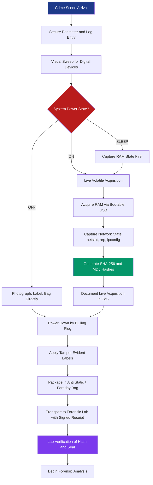
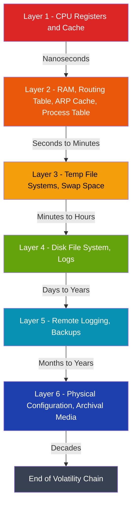
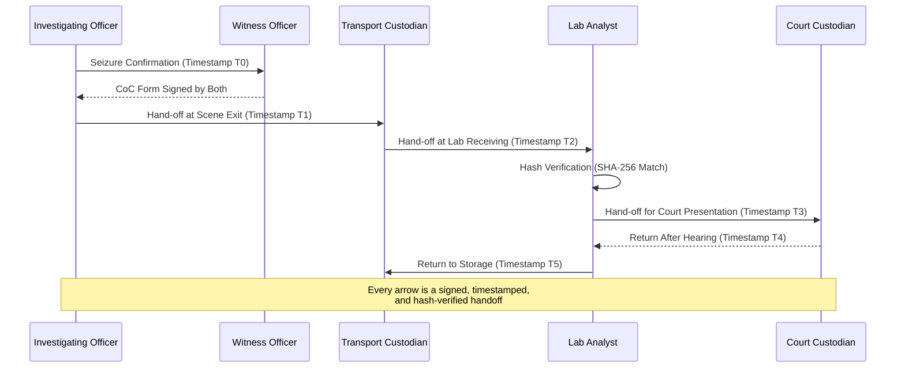
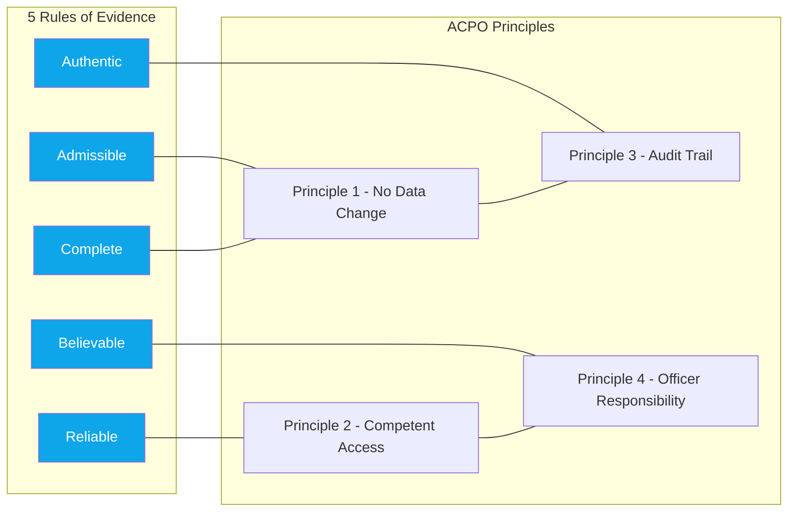

# Digital Evidence Handling at Crime Scene

<!-- SECTION_1_START -->
# Digital Evidence Handling at Crime Scene

## 1. Formal Academic Definition

**Digital Evidence** is defined as any probative information stored or transmitted in digital form that a party to a court case may use at trial. As per the KTU 2024 Scheme (PECST754) syllabus and the National Institute of Standards and Technology (NIST) guidelines, digital evidence handling refers to the systematic, forensically-sound procedures used to identify, preserve, collect, examine, and present digital artifacts recovered from crime scenes while maintaining their **admissibility**, **authenticity**, **completeness**, and **reliability**.

> [!IMPORTANT]
> **KTU Syllabus Highlight (Module 1)**
> Digital evidence handling at the crime scene is the foundational competency of every digital forensic investigator. The legal weight of an entire forensic examination hinges on the integrity of procedures performed at the *crime scene* — not in the lab. Mishandling at this stage is **irrecoverable** and leads to acquittal under Section 65B of the Indian Evidence Act (analogous to the Federal Rules of Evidence in the US).

### Conceptual Analogy / Intuition

Imagine a **crime scene** as a fragile snow globe. The snowflakes inside represent volatile data — RAM contents, active network connections, running processes. The glass shell represents persistent storage (hard disks, SSDs). If you shake the snow globe carelessly (turn on a suspect's computer, browse files, or let the power die), the snow (volatile evidence) is **destroyed forever**. Your job as a forensic investigator is to *carefully document, photograph, and preserve* the snow globe before opening it, ensuring the original arrangement can be reconstructed and defended in a courtroom. **Digital evidence handling** is the science of doing exactly that — systematically, legally, and without disturbing the original state.

> [!NOTE]
> **Key Terminology Anchors**
> - **Volatile Evidence**: Data that disappears when power is lost (RAM, network state, CPU registers).
> - **Non-Volatile Evidence**: Data that persists without power (HDD, SSD, USB, optical media).
> - **Chain of Custody (CoC)**: The chronological documentation trail showing the *seizure, control, transfer, analysis, and disposition* of evidence.
> - **Order of Volatility (OoV)**: A priority list dictating *which data to capture first* based on how quickly it decays.

### Standard Metrics & Constants

| Constant / Standard | Value / Reference | Purpose |
|---|---|---|
| **5 Rules of Evidence (Kruse & Heiser)** | Admissible, Authentic, Complete, Reliable, Believable | Universal admissibility test |
| **ACPO Principles** | 4 principles (1999, revised 2012) | UK policing standard for digital evidence |
| **RFC 3227** | Guidelines for Evidence Collection and Archiving | IETF best-practice for OoV |
| **Section 65B, Indian Evidence Act** | Certifying officer for electronic evidence | Indian legal admissibility |
| **ISO/IEC 27037** | Guidelines for identification, collection, acquisition of digital evidence | International forensic standard |

> [!VISUALIZATION CONTROL]
> **Concept:** Volatility Timeline of Digital Evidence
> **Desmos / Conceptual Graph Input:**
> * `x = time` (seconds), `y = data_availability (%)`
> * `f1(x) = 100 * e^(-0.5*x)` (CPU registers/registers, ~nanoseconds)
> * `f2(x) = 100 * e^(-0.05*x)` (RAM, ~seconds)
> * `f3(x) = 100 * e^(-0.001*x)` (Network state, ~minutes)
> * `f4(x) = 100 * e^(-0.00001*x)` (Disk, ~years)
> **Visual Description:** Students should observe four exponentially decaying curves stacked vertically. The top curve vanishes within seconds (CPU/registers), while the bottom curve remains near-flat for years (persistent storage). The vertical separation represents the *urgency* of capture order.

---

<!-- SECTION_1_END -->

<!-- SECTION_2_START -->
# Deep Theoretical Analysis & KTU High-Yield Formula Sheet

## 2. Theoretical Framework

Digital evidence handling is governed by **four interlocking theoretical pillars** that the KTU examiner will test repeatedly:

### 2.1 The Five Rules of Evidence (Heiser & Kruse Model)

For digital evidence to be legally accepted, it must satisfy **all five** rules simultaneously. Failure of even one rule can render the evidence inadmissible in court.

1. **Admissible** — Must comply with jurisdictional laws (e.g., valid search warrant, lawful seizure).
2. **Authentic** — Must be provable as the *original* or a faithful copy of the original.
3. **Complete** — Must reflect the *entire* relevant dataset, not a cherry-picked subset.
4. **Reliable** — Methodology must be scientifically reproducible and error-free.
5. **Believable** — Must be understandable and credible to a judge/jury (laypersons).

### 2.2 ACPO (Association of Chief Police Officers) Principles

The **ACPO Guidelines** (now the **NPCC** Guidelines post-2018) specify four cardinal principles every investigator must obey:

- **Principle 1**: No action taken by law enforcement agencies, persons employed within those agencies, or their agents should change data held on a computer or storage media which may subsequently be relied upon in court.
- **Principle 2**: In exceptional circumstances, where a person finds it necessary to access original data held on a computer or storage media, that person must be competent to do so and be able to give evidence explaining the relevance and the implications of their actions.
- **Principle 3**: An audit trail or other record of all processes applied to digital evidence should be created and preserved. An independent third party should be able to examine those processes and achieve the same result.
- **Principle 4**: The person in charge of the investigation has overall responsibility for ensuring that the law and these principles are adhered to.

### 2.3 Order of Volatility (OoV) — RFC 3227 Hierarchy

The IETF RFC 3227 directive ranks data sources from most to least volatile:

1. **CPU Registers & Cache** (nanoseconds)
2. **Routing Table, ARP Cache, Process Table, Kernel Statistics, Main Memory (RAM)** (seconds to minutes)
3. **Temporary File Systems / Swap Space** (minutes to hours)
4. **Data on Disk / File System** (days to years)
5. **Remote Logging / Monitoring Data** (variable)
6. **Physical Configuration & Network Topology** (static)
7. **Archival Media / Backups** (decades)

> [!NOTE]
> **Engineering Insight:** This hierarchy is the direct reason why a forensic investigator must arrive at the scene **before** any system administrator powers down a live server. A single reboot can erase kernel statistics, ARP caches, and process tables — evidence that no amount of post-mortem disk analysis can recover.

### 2.4 Chain of Custody (CoC) — Forensic Legality Backbone

The CoC is a **legally mandated, time-stamped paper trail** that records every individual who handled the evidence, the date/time of transfer, the purpose of transfer, and the condition of the evidence at each stage. It is the *single most contested* item during cross-examination.

## 2.5 KTU Formula Sheet / High-Yield Cheat Sheet

| Concept | Formula / Rule | Use Case |
|---|---|---|
| **Hash Verification** | $H_{MD5} = \text{MD5}(E)$ where $E$ is evidence file | Integrity check |
| **Hash Verification (Stronger)** | $H_{SHA256} = \text{SHA-256}(E)$ | Forensic standard |
| **Bit-stream Copy** | $C = \text{dd if}=E \text{ of}=C \text{ bs}=1M$ | Disk image creation |
| **Forensic Hash Match** | $\text{Match} \iff H(E_{orig}) = H(E_{copy})$ | Verifies *Authenticity* |
| **5 Rules Check** | $A \land U \land C \land R \land B$ (Admissibility AND others) | Court admissibility |
| **ACPO Audit Trail** | $n$ entries $\times$ $t$ timestamps $\rightarrow$ Reproducibility | Principle 3 compliance |
| **Order of Volatility Index** | $OoV_i = -\log_{10}(t_{persist,i})$ | Ranking priority |
| **Evidence Decay Function** | $D(t) = D_0 \cdot e^{-\lambda t}$ where $\lambda$ is decay rate | Volatility modeling |
| **CoC Continuity** | $\sum_{i=1}^{n} \Delta t_i \leq T_{court}$ | Unbroken trail required |
| **Live Acquisition Trigger** | $S_{state} = \text{RUNNING} \rightarrow \text{Acquire RAM}$ | Live system rule |

> [!IMPORTANT]
> **Real-World Engineering Utility:** These protocols are not academic — they underpin the *Incident Response* playbooks of Fortune 500 SOCs, the *eDiscovery* workflows of legal firms, and the *chain-of-custody* systems of national CERTs (e.g., CERT-In in India). A SOC analyst at a bank who mishandles a breach log may face criminal charges under the IT Act 2000 (Section 43A, 66, 66F) if the chain of custody is broken.

---

<!-- SECTION_2_END -->

<!-- SECTION_3_START -->
# Step-by-Step Derivations & Procedural Implementation

## 3. Exhaustive Procedural Walkthrough — Crime Scene to Court

The KTU examiner expects students to know the *order* and *justification* of every step. Below is the complete, exhaustive, evaluation-ready procedure.

### 3.1 Phase I — Crime Scene Recognition & Isolation

**Step 1: Secure the Physical Scene**
- Establish a perimeter using **police tape** (typically 10-15 feet radius).
- Assign a single **Scene Officer** (SO) who controls entry/exit.
- Maintain a **scene log** capturing name, entry time, exit time, purpose for every entrant.

**Step 2: Identify Digital Devices Present**
- Conduct a **visual sweep** for:
  * Desktop computers, laptops, tablets
  * Mobile phones, smartwatches, GPS units
  * External hard drives, USB drives, SD cards
  * Network equipment (routers, modems, switches)
  * IoT devices (smart speakers, security cameras)
  * Printers, scanners, multifunction devices

**Step 3: Photograph the Scene**
- Capture **wide-angle**, **mid-range**, and **close-up** shots *before* touching anything.
- Photograph:
  * Device screen state (powered on/off, applications open)
  * Cable connections (power, network, peripherals)
  * Visible damage or tampering
  * Serial numbers and asset tags

> [!WARNING]
> **KTU Examiner's Trap:** Many students forget to photograph the *back* of devices showing cable topology. This is critical for proving the device was/is connected to a network at the time of seizure. **[Lose 2 Marks]**

### 3.2 Phase II — Live System Decision Tree

This is a high-yield decision tree the examiner loves to test:

$$
\text{Decision} = f(P_{state}, E_{urgency}, R_{risk})
$$

where $P_{state}$ is power state, $E_{urgency}$ is evidentiary urgency, and $R_{risk}$ is anti-forensics risk.

**Step 4: Assess Power State**
- **Case A — System is OFF**: Photograph, label, and bag. Proceed to Step 7.
- **Case B — System is ON**: Proceed to Step 5 (Live Acquisition).
- **Case C — System is SLEEP/HIBERNATE**: Do *not* wake. Capture volatile RAM state, then proceed.

**Step 5: Live Volatile Data Acquisition (RAM, Network State)**
Use a **forensically clean bootable USB** containing tools like *FTK Imager Lite*, *Helix*, or *CAINE*.

```python
# Forensic Live RAM Acquisition (Conceptual Python Workflow)
import hashlib
import subprocess
from datetime import datetime, timezone
from pathlib import Path

def acquire_live_ram(output_path: str, tool: str = "winpmem") -> dict:
    """
    Acquires volatile RAM from a live Windows/Linux system.
    Returns a forensic manifest with hash + timestamp.
    """
    manifest = {
        "acquisition_time_utc": datetime.now(timezone.utc).isoformat(),
        "investigating_officer": "IO_NAME",
        "witness_officer": "WO_NAME",
        "tool": tool,
        "output_file": output_path,
    }

    # Step 1: Acquire memory image
    result = subprocess.run(
        [tool, output_path],
        capture_output=True,
        text=True,
        check=True
    )

    # Step 2: Compute SHA-256 for integrity
    sha256 = hashlib.sha256()
    with open(output_path, "rb") as img:
        for chunk in iter(lambda: img.read(65536), b""):
            sha256.update(chunk)
    manifest["sha256"] = sha256.hexdigest()

    # Step 3: Compute MD5 (legacy compatibility, Section 65B IT Act)
    md5 = hashlib.md5()
    with open(output_path, "rb") as img:
        for chunk in iter(lambda: img.read(65536), b""):
            md5.update(chunk)
    manifest["md5"] = md5.hexdigest()

    # Step 4: Log everything to chain-of-custody form
    log_path = Path(output_path).with_suffix(".coc.log")
    with open(log_path, "w", encoding="utf-8") as log:
        for key, value in manifest.items():
            log.write(f"{key} = {value}\n")

    return manifest

# Example execution
if __name__ == "__main__":
    record = acquire_live_ram("D:/evidence/case_2024_001/ram_image.raw")
    for k, v in record.items():
        print(f"{k:25s} : {v}")
```

**Expected Manifest Output:**
```
acquisition_time_utc     : 2024-XX-XXT14:32:18+00:00
investigating_officer    : IO_NAME
witness_officer          : WO_NAME
tool                     : winpmem
output_file              : D:/evidence/case_2024_001/ram_image.raw
sha256                   : 9f86d081884c7d659a2feaa0c55ad015a3bf4f1b2b0b822cd15d6c15b0f00a08
md5                      : 5d41402abc4b2a76b9719d911017c592
```

**Step 6: Network State Capture**
- Run `netstat -ano` (Windows) or `ss -tunap` (Linux) to capture active connections.
- Run `arp -a` to map MAC-to-IP bindings.
- Run `ipconfig /all` (Windows) or `ifconfig -a` (Linux) to capture network configuration.
- Save all output to USB, **never** to the suspect's hard drive.

### 3.3 Phase III — Device Seizure & Preservation

**Step 7: Power Down Procedure (if required)**
- **Workstations**: Pull the power cord (do *not* use shutdown — it may trigger encryption/data destruction).
- **Servers**: Prefer controlled shutdown via script, then pull power.
- **Mobile Devices**: Place in **Faraday bag** *before* powering off to prevent remote wipe signals.

**Step 8: Labeling**
- Use **tamper-evident labels** with:
  * Case number
  * Date/time of seizure
  * Officer's initials
  * Brief description
  * Unique evidence ID (e.g., EV-2024-001-A)

**Step 9: Packaging**
| Device Type | Packaging Method | Static/EMI Concern |
|---|---|---|
| Desktop Tower | Anti-static bag → Foam-padded box | Use anti-static bag |
| Laptop | Anti-static bag → Hard-shell case | Use anti-static bag |
| Mobile Phone | Faraday bag → Evidence box | **Faraday mandatory** |
| Hard Drive (removed) | Anti-static bag → Anti-shock box | Use anti-static bag |
| USB Drive | Anti-static bag → Sealed envelope | Standard envelope |
| IoT Device | Original box if available → Anti-static bag | Note firmware state |

**Step 10: Transportation**
- Maintain **temperature-controlled** environment where possible.
- Use a **tamper-evident** transport bag.
- Hand over to forensic lab with a **signed receipt**.

### 3.4 Phase IV — Chain of Custody Documentation (KTU Favourite)

The CoC form must contain, at minimum:

$$
\text{CoC} = \{E_{id}, S_{seize}, T_{seize}, \{H_{transfer,i}\}_{i=1}^{n}, L_{analysis}, D_{disposition}\}
$$

where:
- $E_{id}$ = Unique evidence identifier
- $S_{seize}$ = Seizing officer signature
- $T_{seize}$ = Seizure timestamp (UTC, court-acceptable)
- $H_{transfer,i}$ = $i$-th transfer handoff signature
- $L_{analysis}$ = Lab analyst signature
- $D_{disposition}$ = Final disposition (returned/destroyed/retained)

> [!IMPORTANT]
> **Mark Allocation Strategy for KTU ESE:**
> - Stating 5 Rules of Evidence: **2 Marks**
> - Order of Volatility hierarchy: **3 Marks**
> - ACPO Principle 1 quote: **2 Marks**
> - Live vs. Dead acquisition decision: **2 Marks**
> - Documenting CoC fields: **3 Marks**
> - Justification of *why* order matters: **2 Marks**

---

<!-- SECTION_3_END -->

<!-- SECTION_4_START -->
# Structural Diagrams & Schematics

## 4.1 End-to-End Digital Evidence Handling Workflow



## 4.2 Order of Volatility — Layered Decay Model



## 4.3 Chain of Custody — Sequential Handoff Topology



## 4.4 5 Rules of Evidence — ACPO Mapping



---

<!-- SECTION_4_END -->

<!-- SECTION_5_START -->
# KTU 2024 Scheme Examination Question Bank & Topic Recap

## 5. Part A — Short Answer Questions (3 Marks Each)

### Question 1
**[KTU University Exam - July 2024]** Define *digital evidence*. List the **five rules of evidence** that govern its admissibility in court. **[CO1, Remember]**

**Model Answer (Evaluation-Ready):**

> [!NOTE]
> **Definition:** Digital evidence is any information of probative value that is generated, stored, or transmitted in digital form and may be relied upon in a court of law.
>
> **The Five Rules (Kruse \& Heiser):**
> 1. **Admissible** — Conforms to jurisdictional law.
> 2. **Authentic** — Provenance is verifiable as original.
> 3. **Complete** — No selective omission of relevant data.
> 4. **Reliable** — Methodology is reproducible and error-free.
> 5. **Believable** — Comprehensible to a layperson jury.
>
> *Award 1 mark for the definition and 0.4 marks per rule listed (5 × 0.4 = 2 marks), totaling 3 marks.*

---

### Question 2
**[KTU University Exam - Dec 2023]** What is the *Order of Volatility (OoV)*? Arrange the following data sources in the correct OoV: **RAM, CPU Registers, Hard Disk, Swap Space, Network State, Backup Tapes**. **[CO1, Understand]**

**Model Answer (Evaluation-Ready):**

> [!NOTE]
> **Definition:** The Order of Volatility, as defined in IETF RFC 3227, is the priority sequence in which digital evidence must be captured, ordered from most volatile (decays in nanoseconds) to least volatile (persists for decades).
>
> **Correct OoV Sequence:**
> 1. CPU Registers (most volatile — nanoseconds)
> 2. Network State (routing table, ARP cache — seconds)
> 3. RAM / Main Memory (seconds to minutes)
> 4. Swap Space / Temporary File Systems (minutes to hours)
> 5. Hard Disk / File System (years)
> 6. Backup Tapes (decades)
>
> *Award 1 mark for definition and 2 marks for the correct 6-step sequence (0.33 per step).*

---

## 5. Part B — 14-Mark Questions (ESE Module Internal Choice)

### Question A (14 Marks) — Option 1
**[KTU University Exam - July 2024]** *With a neat diagram, explain the procedure for handling digital evidence at a crime scene. Discuss the importance of the **Chain of Custody (CoC)** and the **ACPO Principles** in ensuring the admissibility of evidence in court.* **[CO2, Apply]**

#### (a) Crime Scene Procedure with Diagram (7 Marks)

**Model Answer:**

**Step 1 — Scene Isolation [1 Mark]**
Secure the perimeter with police tape. Maintain an entry-exit log capturing name, time-in, time-out, and purpose for every individual.

**Step 2 — Device Identification [1 Mark]**
Conduct a visual sweep for all digital devices: desktops, laptops, mobiles, external drives, USB sticks, network equipment, IoT devices, printers.

**Step 3 — Documentation [1 Mark]**
- Photograph wide-angle, mid-range, and close-up views.
- Capture device screen state, cable topology, serial numbers, asset tags.
- Document everything before any device is touched.

**Step 4 — Power State Assessment [1 Mark]**
Determine whether each device is OFF, ON, or SLEEP. This dictates the acquisition strategy.

**Step 5 — Live Volatile Acquisition (if ON) [1 Mark]**
Use a forensically clean bootable USB (FTK Imager, Helix, CAINE) to capture RAM, network state, process table, and ARP cache. Compute SHA-256 hash immediately.

**Step 6 — Controlled Power Down [1 Mark]**
Pull the power cord directly (avoid OS-level shutdown to prevent anti-forensic triggers). Place mobile devices in **Faraday bags** before power-off.

**Step 7 — Labeling, Packaging, Transport [1 Mark]**
Apply tamper-evident labels with case number, timestamp, officer initials. Package in anti-static bags (electronics) or Faraday bags (mobile). Transport with signed receipt to forensic lab.

> [!NOTE]
> **Valuation Key:** Students must produce a labelled flowchart marking each step's *purpose* and *sequence*. A missing step or a misordered step costs **1 mark each**.

#### (b) Chain of Custody & ACPO Principles (7 Marks)

**Model Answer:**

**Chain of Custody Definition [1 Mark]**
The CoC is a chronological, documented trail recording the seizure, custody, control, transfer, analysis, and disposition of evidence — from crime scene to courtroom.

**CoC Required Fields [2 Marks]**
- Unique evidence identifier
- Seizing officer's name, signature, and timestamp
- Every handoff: from whom, to whom, when, why
- Storage location at every stage
- Hash value at seizure and at every transfer
- Final disposition (return, retain, destroy)

**Why CoC is Critical [2 Marks]**
- Establishes *Authenticity* and *Reliability* of evidence.
- Defeats defence claims of tampering, planting, or contamination.
- Failure of CoC = automatic inadmissibility under Section 65B (India) / Federal Rules of Evidence (US).

**ACPO Four Principles [2 Marks]**
1. **No action should alter data** on the device.
2. **Only competent persons** may access original data, and only when necessary.
3. **Full audit trail** must be maintained and independently reproducible.
4. **Investigating officer is ultimately responsible** for legal compliance.

> [!WARNING]
> **KTU Examiner's Valuation Pitfall:**
> - Do **not** confuse ACPO (UK) with IACIS (US) or ISO 27037 (international) — pick the one you name and stick to it. **[−1 Mark]**
> - Do **not** skip the *hash verification* step when describing CoC — it is the *only* mathematical proof of integrity. **[−2 Marks]**
> - Do **not** write "the evidence is sealed in a bag" without specifying **tamper-evident** sealing. **[−1 Mark]**
> - Do **not** forget to mention Faraday bags for mobile devices — the examiner tests for this. **[−1 Mark]**

---

### Question B (14 Marks) — Option 2
**[KTU University Exam - Dec 2023]** *Explain the **Order of Volatility (OoV)** as per RFC 3227. How does it guide the decision-making of a forensic investigator when handling a **live running system** at a crime scene? Justify your answer with a real-world scenario.* **[CO2, Apply]**

#### (a) Order of Volatility per RFC 3227 (7 Marks)

**Model Answer:**

**Definition [1 Mark]**
The Order of Volatility is a formalised priority ranking, codified in IETF RFC 3227, that dictates the sequence in which a forensic investigator must capture digital data — from the most transient to the most persistent.

**Complete 7-Layer Hierarchy [5 Marks]**
1. **CPU Registers, Cache** — nanoseconds
2. **Routing Table, ARP Cache, Process Table, Kernel Statistics, RAM** — seconds to minutes
3. **Temporary File Systems, Swap Space** — minutes to hours
4. **Disk File System, User Files, Logs** — days to years
5. **Remote Logging, Monitoring Data** — variable persistence
6. **Physical Configuration, Network Topology** — static
7. **Archival Media, Off-site Backups** — decades

**Justification of Order [1 Mark]**
The hierarchy is ordered by **decay rate**: data that vanishes fastest is captured first. The investigator who ignores this order loses evidence irreversibly.

#### (b) Live System Decision-Making & Real-World Scenario (7 Marks)

**Model Answer:**

**Live System Decision Tree [3 Marks]**
- **System is OFF** → Standard disk imaging, no volatile capture needed.
- **System is ON** → Capture volatile data *first* (RAM, network state, running processes), then image disk.
- **System is SLEEP** → Do *not* wake (resumes to RAM but may trigger anti-forensics). Capture RAM, then proceed.

**Real-World Scenario — Bank Server Breach [4 Marks]**
A forensic team is called to a bank's data center where a Windows Server 2019 is suspected of running unauthorized crypto-mining malware. Following OoV:

1. Investigator arrives and does *not* power off the server.
2. Uses a forensically clean USB to run `winpmem` → captures 64 GB RAM image → SHA-256 hashed.
3. Runs `netstat -ano` → identifies 17 active C2 (command-and-control) connections.
4. Runs `arp -a` → maps suspect's internal pivoting network.
5. Captures process list via `tasklist /v` → identifies `xmrig.exe` running as a service.
6. After volatile capture, server is powered down by pulling the plug.
7. Disk is imaged using `dd` or FTK Imager, hash-matched to volatile evidence.

**Result:** RAM analysis reveals the decryption key for the malware's C2 protocol, which disk analysis alone could not have provided because the key was held only in volatile memory.

> [!WARNING]
> **KTU Examiner's Valuation Pitfall:**
> - Do **not** list the OoV layers in random order — the examiner will mark each misplaced layer as **−0.5 marks**.
> - Do **not** state "shut down the system first" when describing live system handling — this destroys volatile evidence and is a **fatal procedural error**. **[−2 Marks]**
> - Do **not** forget to mention **Section 65B certification** when discussing Indian legal admissibility. **[−1 Mark]**
> - Do **not** omit the **hash function** (SHA-256 or MD5) from the CoC narrative. **[−1 Mark]**

---

## Topic Recap & Important Things to Remember

> [!IMPORTANT]
> **Rapid-Revision Checklist — KTU Module 1**
>
> - **Digital Evidence**: Probative information in digital form usable in court.
> - **5 Rules (Kruse & Heiser)**: Admissible, Authentic, Complete, Reliable, Believable — *all five* are mandatory, not optional.
> - **ACPO Principle 1**: *Never alter data* on a suspect device.
> - **ACPO Principle 2**: Only *competent persons* may access original data.
> - **ACPO Principle 3**: Maintain a *reproducible audit trail*.
> - **ACPO Principle 4**: Investigating officer bears *ultimate responsibility*.
> - **RFC 3227 OoV**: Registers → RAM → Temp FS/Swap → Disk → Remote Logs → Topology → Archives.
> - **Chain of Custody**: Time-stamped, signed, hash-verified trail from scene to court.
> - **Hashing**: SHA-256 is the forensic gold standard; MD5 is used for legacy Section 65B compatibility.
> - **Live System Rule**: Capture volatile *before* powering down; *never* trigger OS shutdown.
> - **Mobile Devices**: Always use **Faraday bags** to block remote-wipe signals.
> - **Packaging**: Anti-static bags for electronics; tamper-evident seals on every container.
> - **Legal Anchor (India)**: Section 65B of the Indian Evidence Act, 1872 (amended by IT Act 2000).
> - **International Anchor**: ISO/IEC 27037 (evidence identification & acquisition).
> - **Anti-Forensics Awareness**: Encrypted volumes, steganography, and self-destructing malware require live acquisition as the *only* viable path.
> - **Error to Avoid**: Photographing *after* touching the device — must be *before* and *during* every interaction.

<!-- SECTION_5_END -->
