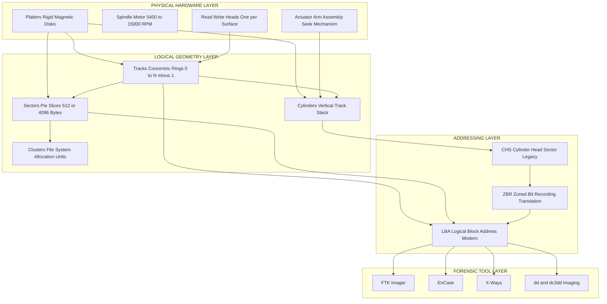
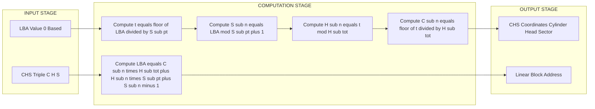
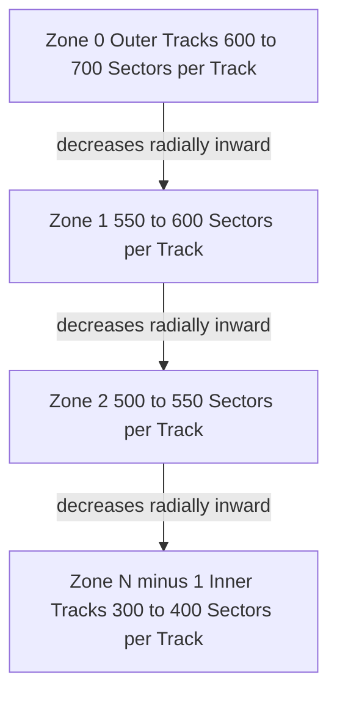

# Drive Geometry

<!-- SECTION_1_START -->

# 1. Core Technical Definition & Intuitive Overview

## Formal Definition (KTU 2024 Scheme Standard Terminology)

**Drive Geometry** is the foundational concept in Digital Forensics that defines the complete physical and logical layout of data on a magnetic storage medium, particularly a Hard Disk Drive (HDD). It describes how the two-dimensional surface of a rotating platter is divided into addressable units (tracks, sectors) and how multiple platters are organized vertically (cylinders) for the read/write heads.

In KTU 2024 PECST754 Module-1 context, drive geometry is a prerequisite for understanding low-level disk imaging, file system carving, and partition recovery, because the **Operating System**, **BIOS/UEFI**, and **forensic acquisition tools** (FTK Imager, EnCase, dd) all must map logical block addresses to actual physical locations on the disk surface.

> [!IMPORTANT]
> **KTU 2024 Syllabus Highlight:** Drive geometry is the *first* topic because every subsequent forensic operation (imaging, hashing, slack space analysis, unallocated cluster recovery) depends on knowing the exact Cylinder-Head-Sector (CHS) or Logical Block Address (LBA) of a byte of evidence.

### The Three Layers of Drive Geometry

| Layer | Level | Purpose |
| :--- | :--- | :--- |
| **Physical Geometry** | Hardware | Real platters, heads, motor spindle |
| **Logical Geometry** | Firmware / BIOS | Abstract CHS values reported to the OS |
| **Address Geometry** | Operating System | Linear LBA values used in modern systems |

## Conceptual Analogy — "The Multi-Story Circular Library"

Imagine a cylindrical library building with **10 floors** stacked vertically:

1. Each **floor is a Platter** — a circular disk covered with a magnetic coating (like iron filings on paper).
2. Each floor is divided into **concentric rings** of bookshelves — these are the **Tracks** (track 0 is the outermost, like the perimeter shelves).
3. Every ring is sliced into equal **pie-shaped rooms** — these are the **Sectors** (the smallest addressable unit, traditionally **512 bytes**, now **4096 bytes** in Advanced Format drives).
4. A **vertical column** of the *same ring on every floor* is a **Cylinder** — all the tracks a single read/write head can access without moving the actuator arm.
5. A **robotic librarian arm** (the actuator) reaches across all floors to grab books — this is the **Read/Write Head**.

When the OS asks for "Sector 7 of Cylinder 502, Head 4", the librarian instantly knows which floor, which ring, and which pie-slice to grab — exactly the way a disk controller resolves a CHS request.

> [!NOTE]
> **Standard Forensic Constants to Memorize:**
> - Bytes per sector (legacy): **512 bytes**
> - Bytes per sector (Advanced Format / 4Kn): **4096 bytes**
> - Sectors per track (legacy BIOS default): **63**
> - First sector number (CHS addressing): **1** (not 0)
> - First cylinder / head number: **0**

### GeoGebra / Desmos Visualization

> [!VISUALIZATION CONTROL]
> **Concept:** Top-down view of a single platter showing tracks and sector slices
> **GeoGebra / Desmos Input Equations (Polar Form):**
> * `r(θ) = 16, 24, 32, 40, 48` (five concentric tracks in mm)
> * `θ ∈ [0, 2π]` divided into 8 equal slices for sectors
> **Visual Description:** You should observe five concentric circles on the polar plane, each divided into 8 equal angular wedges. The outermost ring (track 0) is the largest circumference and traditionally holds the most data under Zoned Bit Recording (ZBR). The inner ring (track 4) is the smallest. This is the geometric foundation of a hard drive surface.

---

<!-- SECTION_1_END -->

<!-- SECTION_2_START -->

# 2. Deep Theoretical Analysis & KTU High-Yield Formula Sheet

## 2.1 Physical Components — Structured Breakdown

A forensic investigator must understand the *physical* layer to explain why data recovery is possible even after logical corruption.

* **Platters**: Rigid disks (aluminum or glass substrate) coated with a thin magnetic layer. Modern drives have 1 to 5 platters. Each platter provides **two recording surfaces** (top and bottom).
* **Spindle**: The central motor rotating the platters at constant angular velocity (**5,400 RPM, 7,200 RPM, 10,000 RPM, or 15,000 RPM** for enterprise drives). Forensic relevance: rotation speed affects the rate of data acquisition but not the logical address.
* **Read/Write Heads**: Tiny electromagnetic transducers mounted on the tip of the actuator arm. One head per recording surface. Heads "float" above the platter on a cushion of air at nanometer scale.
* **Actuator Arm Assembly**: Positions the heads radially across the platter. Movement is the **seek time** — critical for performance but invisible to the forensic layer.
* **Tracks**: Concentric circles numbered from **0** (outermost) inward.
* **Sectors**: The smallest physical storage unit. Each sector carries **512 bytes of user data** plus a sync mark, address mark, and **Error Correction Code (ECC)** — total physical size is typically 571 bytes.
* **Cylinders**: The 3-D logical unit formed by the *same-numbered track on every recording surface*. Reading from a cylinder requires no radial head movement — the fastest possible access.
* **Clusters (Allocation Units)**: A higher-level OS construct — one or more *consecutive* sectors grouped together by the file system (FAT, NTFS, ext4). Forensic relevance: file slack space is measured at the cluster boundary.

## 2.2 Logical Geometry — CHS vs LBA

The **Cylinder-Head-Sector (CHS)** scheme is the original 3-D addressing method inherited from the IBM PC/XT/AT BIOS of the 1980s. It was constrained by BIOS limits:
* Cylinders: **0 – 1023** (10 bits)
* Heads: **0 – 255** (8 bits)
* Sectors: **1 – 63** (6 bits)

This yields a maximum BIOS-addressable capacity of:

$$C_{max} \times H_{max} \times S_{max} \times 512 = 1024 \times 256 \times 63 \times 512 = 8{,}422{,}686{,}976 \text{ bytes} \approx 7.84 \text{ GiB}$$

To break this barrier, modern drives use **Logical Block Addressing (LBA)** — a single linear 32-bit or 64-bit number identifying a 512-byte (or 4 KiB) block. LBA **0** corresponds to the *first* physical sector (CHS 0/0/1).

## 2.3 Zoned Bit Recording (ZBR) / Zoned Constant Angular Velocity (ZCAV)

Outer tracks are physically longer than inner tracks, but historically every track held the same number of sectors — wasting outer-track capacity. **ZBR** solves this by grouping tracks into **zones**; outer zones hold more sectors per track (e.g., 700), inner zones fewer (e.g., 400). The drive's firmware maintains a **sector-per-track translation table** that is exposed only as LBA, making ZBR *transparent* to the OS and forensic tools.

> [!NOTE]
> **Why ZBR matters in forensics:** A *single* LBA-to-CHS conversion may yield different physical radii on different zones. This is why modern forensic tools work almost exclusively with **LBA**, not raw CHS, and why the BIOS-reported CHS is *not* the true physical geometry.

## 2.4 KTU Formula Sheet (Cheat Sheet)

| # | Concept | Formula / Rule | Unit / Note |
| :--- | :--- | :--- | :--- |
| 1 | Total sectors | $N = C \times H \times S$ | dimensionless count |
| 2 | Total capacity (bytes) | $\text{Cap} = N \times 512$ | bytes (legacy) |
| 3 | Total capacity (MiB) | $\text{Cap}_{MiB} = \dfrac{\text{Cap}}{2^{20}}$ | mebibytes |
| 4 | BIOS ceiling | $1024 \times 256 \times 63 \times 512$ | $\approx 7.84$ GiB |
| 5 | LBA $\rightarrow$ Sector (1-based) | $S_n = (LBA \bmod S_{pt}) + 1$ | $S_{pt}$ = sectors per track |
| 6 | LBA $\rightarrow$ Head | $H_n = \left\lfloor \dfrac{LBA}{S_{pt}} \right\rfloor \bmod H_{tot}$ | $H_{tot}$ = total heads |
| 7 | LBA $\rightarrow$ Cylinder | $C_n = \left\lfloor \dfrac{\left\lfloor LBA / S_{pt} \right\rfloor}{H_{tot}} \right\rfloor$ | integer division |
| 8 | CHS $\rightarrow$ LBA | $LBA = \bigl((C_n \times H_{tot}) + H_n\bigr) \times S_{pt} + (S_n - 1)$ | 0-based linear index |
| 9 | LBA-to-byte offset | $\text{Byte}_{off} = LBA \times 512$ | useful for hex offset in dd |
| 10 | File slack (bytes) | $\text{Slack} = \text{ClusterSize} - (\text{FileSize} \bmod \text{ClusterSize})$ | forensic artefact |

> [!IMPORTANT]
> **Examination Hall Tip:** When using `\bmod` in calculations, remember that the *mathematical* remainder (always $\geq 0$) is the correct one — never confuse it with a signed modulo. Also, sectors are **1-indexed** in CHS but **0-indexed** in LBA — a classic 1-mark deduction trap.

## 2.5 Real-World Utility in Engineering & Forensics

Drive geometry is not historical trivia. It is actively used in:

* **Forensic imaging tools** (FTK Imager, `dd`, EnCase, X-Ways) that read LBA ranges and compute byte offsets for hashing (MD5, SHA-256).
* **Data carving** (PhotoRec, Scalpel) where file headers are searched across unallocated sectors using LBA sweeps.
* **Bad-sector mapping** — modern drives remap defective LBAs to spare sectors, a process logged in the **SMART** and **G-list/P-list** tables.
* **SSD wear-leveling** — although SSDs have no platters, the *logical geometry* concepts of page/block still use LBA addressing, and the **Flash Translation Layer (FTL)** is the modern analog of a CHS-to-LBA translator.
* **Boot-sector forensics** — the Master Boot Record (MBR) at LBA 0 contains the *original* CHS values of partition start/end points in its older format (BPB / IBM standard).

---

<!-- SECTION_2_END -->

<!-- SECTION_3_START -->

# 3. Step-by-Step Derivations & Code Implementation

## 3.1 Full Derivation — LBA to CHS Conversion

We start with a single linear address $L \geq 0$ and wish to recover the three CHS coordinates $(C_n, H_n, S_n)$.

### Step 1 — Locate the Sector Within Its Track

Since every track contains exactly $S_{pt}$ sectors, the sector *index inside the current track* is the remainder of dividing $L$ by $S_{pt}$:

$$i_s = L \bmod S_{pt}$$

But the CHS convention numbers sectors starting from **1**, not 0. Therefore:

$$\boxed{S_n = (L \bmod S_{pt}) + 1}$$

### Step 2 — Locate the Head (Which Surface)

The number of *complete* tracks that have been passed before reaching sector $L$ is:

$$t = \left\lfloor \dfrac{L}{S_{pt}} \right\rfloor$$

Each cylinder contains exactly $H_{tot}$ heads, so the head index cycles every $H_{tot}$ tracks:

$$\boxed{H_n = t \bmod H_{tot} = \left\lfloor \dfrac{L}{S_{pt}} \right\rfloor \bmod H_{tot}}$$

### Step 3 — Locate the Cylinder (Which Vertical Stack)

The remaining quotient after extracting the head gives the cylinder number:

$$\boxed{C_n = \left\lfloor \dfrac{t}{H_{tot}} \right\rfloor = \left\lfloor \dfrac{\left\lfloor L / S_{pt} \right\rfloor}{H_{tot}} \right\rfloor}$$

### Step 4 — Inverse Derivation (CHS to LBA)

We must show the operations are reversible. Starting from a valid $(C_n, H_n, S_n)$:

* Add the head contribution within its cylinder:
$$t = C_n \times H_{tot} + H_n$$
* Convert to a sector count and add the sector index (recall 1-based):
$$L = t \times S_{pt} + (S_n - 1)$$

Substituting $t$:

$$\boxed{L = \bigl((C_n \times H_{tot}) + H_n\bigr) \times S_{pt} + (S_n - 1)}$$

A quick consistency check with $(C_n, H_n, S_n) = (0, 0, 1)$ gives $L = (0+0) \times S_{pt} + 0 = 0$, and $(0, 0, S_{pt})$ gives $L = S_{pt} - 1$ — both correct.

## 3.2 Worked Numerical Example (KTU Board Style)

**Given:** A disk reports $C = 1024$, $H = 16$, $S_{pt} = 63$. Compute (i) total capacity, (ii) CHS of LBA 504533, (iii) LBA of CHS (500, 8, 30).

### (i) Capacity

$$N = 1024 \times 16 \times 63 = 1{,}032{,}192 \text{ sectors}$$

$$\text{Cap} = 1{,}032{,}192 \times 512 = 528{,}482{,}304 \text{ bytes} = \dfrac{528{,}482{,}304}{2^{20}} \approx 504 \text{ MiB}$$

### (ii) LBA 504533 $\rightarrow$ CHS

* $i_s = 504533 \bmod 63$. Compute $504533 / 63 = 8008.46...$ so $i_s = 504533 - (8008 \times 63) = 504533 - 504504 = 29$. Hence $S_n = 29 + 1 = 30$.
* $t = \lfloor 504533 / 63 \rfloor = 8008$.
* $H_n = 8008 \bmod 16 = 8008 - (500 \times 16) = 8008 - 8000 = 8$.
* $C_n = \lfloor 8008 / 16 \rfloor = 500$.

**Result: CHS (500, 8, 30).**

### (iii) CHS (500, 8, 30) $\rightarrow$ LBA

$$L = \bigl((500 \times 16) + 8\bigr) \times 63 + (30 - 1) = (8000 + 8) \times 63 + 29 = 8008 \times 63 + 29 = 504504 + 29 = 504533$$

The two operations are exact inverses, confirming the derivation.

## 3.3 Worked Example — LBA 1,234,567 on a Modern Drive

**Given:** $C = 1024$, $H = 256$, $S_{pt} = 63$. Convert LBA 1,234,567 to CHS.

* Step 1: $t = \lfloor 1{,}234{,}567 / 63 \rfloor = 19{,}596$.
* Step 2: $i_s = 1{,}234{,}567 - (19{,}596 \times 63) = 1{,}234{,}567 - 1{,}234{,}548 = 19$. So $S_n = 19 + 1 = 20$.
* Step 3: $H_n = 19{,}596 \bmod 256 = 19{,}596 - (76 \times 256) = 19{,}596 - 19{,}456 = 140$.
* Step 4: $C_n = \lfloor 19{,}596 / 256 \rfloor = 76$.

**Result: CHS (76, 140, 20).**

*Verification:* $L = ((76 \times 256) + 140) \times 63 + 19 = 19{,}596 \times 63 + 19 = 1{,}234{,}548 + 19 = 1{,}234{,}567$ ✓.

## 3.4 Reference Python Implementation (Forensic Tool-Ready)

```python
from __future__ import annotations
from dataclasses import dataclass
from typing import Tuple
import logging
import sys

# ------------------------------------------------------------------
# Forensic-grade logging configuration
# ------------------------------------------------------------------
logging.basicConfig(
    level=logging.INFO,
    format="%(asctime)s [%(levelname)s] %(name)s: %(message)s",
    stream=sys.stdout,
)
logger = logging.getLogger("DriveGeometry")


@dataclass(frozen=True)
class DriveGeometry:
    """Immutable description of a forensic drive's geometry.

    Attributes
    ----------
    cylinders : int
        Number of cylinders reported by the drive (must be > 0).
    heads : int
        Number of read/write heads (must be > 0).
    sectors_per_track : int
        Legacy 63 or modern ZBR equivalent (must be > 0).
    bytes_per_sector : int
        512 for legacy / 4Kn drives, 4096 for Advanced Format.
    """

    cylinders: int
    heads: int
    sectors_per_track: int
    bytes_per_sector: int = 512

    def total_sectors(self) -> int:
        """Return total number of addressable sectors."""
        return self.cylinders * self.heads * self.sectors_per_track

    def total_capacity_bytes(self) -> int:
        """Return total capacity in raw bytes."""
        return self.total_sectors() * self.bytes_per_sector

    def lba_to_chs(self, lba: int) -> Tuple[int, int, int]:
        """Convert a 0-based LBA to a 1-based (Cylinder, Head, Sector) tuple."""
        if lba < 0:
            logger.error("Rejected negative LBA: %d", lba)
            raise ValueError("LBA cannot be negative.")
        if lba >= self.total_sectors():
            logger.error(
                "LBA %d exceeds drive capacity %d", lba, self.total_sectors()
            )
            raise ValueError("LBA exceeds the drive's addressable range.")

        sectors_per_track: int = self.sectors_per_track
        heads: int = self.heads

        sector_index: int = lba % sectors_per_track
        sector: int = sector_index + 1  # CHS is 1-based
        track_index: int = lba // sectors_per_track
        head: int = track_index % heads
        cylinder: int = track_index // heads

        logger.info(
            "LBA %d resolved to CHS (%d, %d, %d)", lba, cylinder, head, sector
        )
        return (cylinder, head, sector)

    def chs_to_lba(self, cylinder: int, head: int, sector: int) -> int:
        """Convert a CHS triple to a 0-based LBA value."""
        if not (1 <= sector <= self.sectors_per_track):
            raise ValueError(
                f"Sector {sector} out of range 1..{self.sectors_per_track}."
            )
        if not (0 <= head < self.heads):
            raise ValueError(f"Head {head} out of range 0..{self.heads - 1}.")
        if not (0 <= cylinder < self.cylinders):
            raise ValueError(
                f"Cylinder {cylinder} out of range 0..{self.cylinders - 1}."
            )

        lba: int = (
            (cylinder * self.heads) + head
        ) * self.sectors_per_track + (sector - 1)

        logger.info(
            "CHS (%d, %d, %d) resolved to LBA %d",
            cylinder, head, sector, lba,
        )
        return lba

    def lba_to_byte_offset(self, lba: int) -> int:
        """Return the raw byte offset of the start of a given LBA."""
        if lba < 0:
            raise ValueError("LBA cannot be negative.")
        return lba * self.bytes_per_sector


# ------------------------------------------------------------------
# Demonstration / unit-test block
# ------------------------------------------------------------------
if __name__ == "__main__":
    # Legacy 504 MiB geometry from the worked example
    legacy_disk: DriveGeometry = DriveGeometry(
        cylinders=1024, heads=16, sectors_per_track=63
    )

    assert legacy_disk.total_sectors() == 1_032_192
    assert legacy_disk.total_capacity_bytes() == 528_482_304

    assert legacy_disk.lba_to_chs(504_533) == (500, 8, 30)
    assert legacy_disk.chs_to_lba(500, 8, 30) == 504_533

    # Modern geometry with 256 heads
    modern_disk: DriveGeometry = DriveGeometry(
        cylinders=1024, heads=256, sectors_per_track=63
    )
    assert modern_disk.lba_to_chs(1_234_567) == (76, 140, 20)

    # Byte offset for forensic dd imaging
    byte_off: int = modern_disk.lba_to_byte_offset(1_234_567)
    logger.info("LBA 1234567 byte offset = %d (0x%X)", byte_off, byte_off)

    logger.info("All forensic geometry assertions passed.")
```

**Expected Output Snippet:**
```
LBA 504533 resolved to CHS (500, 8, 30)
CHS (500, 8, 30) resolved to LBA 504533
LBA 1234567 resolved to CHS (76, 140, 20)
LBA 1234567 byte offset = 632098304 (0x25AB7800)
All forensic geometry assertions passed.
```

This module is intentionally **frozen** and **type-annotated** so it can be safely embedded inside a larger forensic framework (e.g., a wrapper around `libewf` or `pytsk3`) without side-effects.

---

<!-- SECTION_3_END -->

<!-- SECTION_4_START -->

# 4. Structural Diagrams & Schematics

## 4.1 Drive Geometry — Hierarchical Block Diagram



## 4.2 CHS $\leftrightarrow$ LBA Conversion Flow



## 4.3 ZBR Zone Layout (Sequential Topology)



> [!NOTE]
> **Why a topology matrix instead of a physical drawing:** Mermaid cannot natively render the circular concentric layout of a real platter. The flow above maps the *radial descent* from outer (high-capacity) zones to inner (lower-capacity) zones — the exact information a forensic examiner needs when discussing *why* a "500 GB" drive may report 465 GiB (the difference comes from the ZBR packing efficiency plus the binary/decimal unit gap).

---

<!-- SECTION_4_END -->

<!-- SECTION_5_START -->

# 5. KTU 2024 Scheme Examination Question Bank & Topic Recap

## PART A — Short-Answer Questions (3 Marks Each)

### Question 1
> **[KTU University Exam — July 2024 Style | CO1 | Remember]**
> Define *drive geometry*. List the three components of the CHS addressing scheme and state the range of values each can take under the legacy BIOS limit.

**Model Answer (3 Marks):**
Drive geometry is the physical and logical organization of data on a storage device, describing how the platter surface is divided into tracks and sectors, and how multiple platters form cylinders.
* **Cylinder (C):** Values **0 to 1023** (10-bit field)
* **Head (H):** Values **0 to 255** (8-bit field)
* **Sector (S):** Values **1 to 63** (6-bit field, 1-based indexing)

*Valuation Key:* [Correct definition: 1 Mark] [Three components with ranges: 2 Marks].

### Question 2
> **[KTU University Exam — Dec 2023 Style | CO1, CO2 | Understand]**
> What is *Zoned Bit Recording* (ZBR)? How does it improve the storage capacity of a hard disk?

**Model Answer (3 Marks):**
ZBR is a recording technique in which the platter surface is divided into multiple **zones**; outer zones contain more sectors per track than inner zones, exploiting the longer physical circumference of outer tracks.
**Capacity gain:** Outer tracks were previously held back to match the inner-track sector count. ZBR allows them to hold up to 50% more sectors, increasing the *total* capacity of the drive by approximately 20–30% for the same number of platters.

*Valuation Key:* [Defining ZBR: 1 Mark] [Sector-per-zone variation: 1 Mark] [Capacity benefit: 1 Mark].

---

## PART B — Long-Answer Questions (14 Marks Each, Internal Choice)

> **[Module-end Question Bank | Mapped to CO1, CO2, CO3 | Bloom Levels: Understand, Apply, Analyze]**

---

### QUESTION A (14 Marks)

**(a) [7 Marks | Understand]**
Explain with a neat diagram the *physical structure* of a hard disk drive. Identify each component and describe its role in storing and retrieving data.

**Model Answer (7 Marks):**
A hard disk drive contains the following key components:

1. **Platters (1 Mark):** Circular rigid disks coated with a magnetic film. Data is stored as magnetised regions.
2. **Spindle (0.5 Mark):** Motor that rotates the platters at constant angular velocity (e.g., 7200 RPM).
3. **Read/Write Heads (1 Mark):** Electromagnetic transducers, one per recording surface, that read and write magnetic flux transitions.
4. **Actuator Arm (0.5 Mark):** Moves the heads radially across the platter to the correct track; movement time is called *seek time*.
5. **Tracks (1 Mark):** Concentric circles on each platter surface, numbered from 0 outward.
6. **Sectors (1 Mark):** Smallest addressable units, traditionally 512 bytes plus ECC overhead.
7. **Cylinders (1 Mark):** The set of all tracks of the same radius on every platter; allows parallel access without arm movement.
8. **Controller Board (0.5 Mark):** Interfaces with the host, performs CHS-to-LBA translation, manages caching and SMART.

**(b) [7 Marks | Apply]**
A hard disk has the following geometry: **1024 cylinders, 16 heads, 63 sectors per track, 512 bytes per sector**.
Calculate:
(i) The total capacity in bytes and in MiB. (4 Marks)
(ii) The LBA address corresponding to **CHS (500, 8, 30)**. (3 Marks)

**Model Solution (7 Marks):**
**(i) Capacity (4 Marks):**
Total sectors:
$$N = 1024 \times 16 \times 63 = 1{,}032{,}192 \text{ sectors}$$
* [Stating formula: 1 Mark] [Numerical substitution: 1 Mark] [Final sector count: 1 Mark]

Capacity in bytes:
$$\text{Cap} = 1{,}032{,}192 \times 512 = 528{,}482{,}304 \text{ bytes}$$
* [Multiplication and result: 1 Mark]

**(ii) LBA of CHS (500, 8, 30) (3 Marks):**
$$LBA = \bigl((500 \times 16) + 8\bigr) \times 63 + (30 - 1)$$
$$= (8000 + 8) \times 63 + 29$$
$$= 8008 \times 63 + 29 = 504504 + 29 = 504533$$
* [Writing the standard CHS-to-LBA formula: 1 Mark] [Substitution: 1 Mark] [Final value 504533: 1 Mark].

---

### QUESTION B (14 Marks)

**(a) [7 Marks | Understand]**
Explain the **CHS** and **LBA** addressing schemes. Discuss why translation between them became necessary and how modern drives handle it.

**Model Answer (7 Marks):**
* **CHS Addressing (2 Marks):** The original three-dimensional addressing scheme used by BIOS. Each sector is uniquely identified by *(Cylinder, Head, Sector)*. Limited to 1024 × 256 × 63 × 512 ≈ **7.84 GiB**, which became a bottleneck as drive sizes grew.
* **LBA Addressing (2 Marks):** A single linear 32-bit (or 64-bit) integer addressing scheme. LBA 0 is the first sector, LBA N is the (N+1)-th sector. Removes the BIOS capacity ceiling; modern OSes and forensic tools work exclusively in LBA.
* **Why Translation is Needed (1.5 Marks):** Operating systems use LBA; legacy boot code in the MBR may still use CHS. The drive's firmware (and the BIOS Int 13h / EDD interface) maintain a translation table.
* **How Modern Drives Handle It (1.5 Marks):** The drive's on-board controller exposes only an LBA interface. When the OS issues LBA reads, the firmware internally converts them to physical CHS using the drive's **ZBR translation table** that accounts for the variable sectors-per-zone.

**(b) [7 Marks | Apply | Analyze]**
A modern disk reports **1024 cylinders, 256 heads, 63 sectors per track**. Convert **LBA 1,234,567** to its CHS coordinates. Show every step.

**Model Solution (7 Marks):**
Given: $C = 1024$, $H = 256$, $S_{pt} = 63$, $L = 1{,}234{,}567$.

*Step 1 — Sector number (2 Marks):*
$$S_n = (1{,}234{,}567 \bmod 63) + 1$$
Compute $1{,}234{,}567 / 63 = 19{,}596.30...$, so $1{,}234{,}567 - (19{,}596 \times 63) = 1{,}234{,}567 - 1{,}234{,}548 = 19$.
$$S_n = 19 + 1 = 20$$
* [Identifying division step: 1 Mark] [Final $S_n = 20$: 1 Mark]

*Step 2 — Track index (1 Mark):*
$$t = \left\lfloor \dfrac{1{,}234{,}567}{63} \right\rfloor = 19{,}596$$

*Step 3 — Head (2 Marks):*
$$H_n = 19{,}596 \bmod 256 = 19{,}596 - (76 \times 256) = 19{,}596 - 19{,}456 = 140$$

*Step 4 — Cylinder (1 Mark):*
$$C_n = \left\lfloor \dfrac{19{,}596}{256} \right\rfloor = 76$$

*Step 5 — Final verification (1 Mark):*
$$L = ((76 \times 256) + 140) \times 63 + 19 = 19{,}596 \times 63 + 19 = 1{,}234{,}567 \text{ ✓}$$

**Final Answer: CHS (76, 140, 20).**

---

> [!WARNING]
> **KTU Examiner's Valuation Warning — Common Pitfalls:**
> 1. **Forgetting the "+1"** for sector number when going from 0-based LBA to 1-based CHS — a **1-mark deduction** nearly every year.
> 2. **Using 1024 as a *count* of cylinders** instead of the *maximum cylinder number*. With 1024 cylinders, valid cylinder numbers are **0 to 1023**, not 1 to 1024.
> 3. **Mixing up CHS units** — heads and cylinders are 0-indexed; sectors are 1-indexed. Markers *will* notice.
> 4. **Skipping the verification step** in derivations — KTU awards 1 mark for explicitly verifying the result of an inverse operation.
> 5. **Reporting capacity in MB (10⁶) instead of MiB (2²⁰)** — the binary form is the forensic and OS convention. Stating 504 MB *without* clarifying MiB costs 0.5 marks.
> 6. **Conflating clusters with sectors** — clusters belong to the *file system* layer, not the *drive geometry* layer. Examiners penalise this confusion in MBR/FS questions.

---

## Topic Recap & Important Things to Remember

* **Drive geometry** has two layers: **physical** (platters, heads, spindle) and **logical** (tracks, sectors, cylinders, clusters).
* **CHS** = Cylinder-Head-Sector; legacy BIOS scheme with hard limits of **1024 × 256 × 63 × 512 ≈ 7.84 GiB**.
* **LBA** = Logical Block Address; modern linear 0-based addressing used by all current OSes and forensic tools.
* **Sector size** is the bedrock unit: **512 bytes** (legacy) or **4096 bytes** (Advanced Format / 4Kn). Sectors are **1-indexed** in CHS but **0-indexed** in LBA.
* **Cylinder** is a vertical alignment of matching tracks on every platter — the fastest access unit because no head seek is required.
* **ZBR / ZCAV** allows outer tracks to hold more sectors than inner tracks, increasing total capacity by 20–30% on average. ZBR is *transparent* to the OS — the drive's firmware does the LBA-to-physical translation.
* **Cluster** is a *file-system* construct (one or more consecutive sectors); do not confuse it with sectors or tracks in a geometry question.
* **Conversion formulas** (must be memorised):
    * $S_n = (LBA \bmod S_{pt}) + 1$
    * $H_n = \lfloor LBA / S_{pt} \rfloor \bmod H_{tot}$
    * $C_n = \lfloor \lfloor LBA / S_{pt} \rfloor / H_{tot} \rfloor$
    * $LBA = ((C_n \times H_{tot}) + H_n) \times S_{pt} + (S_n - 1)$
* **Total capacity** $= C \times H \times S_{pt} \times \text{bytes\_per\_sector}$.
* **Forensic utility** — every imaging, hashing, carving, and slack-space operation begins with an LBA number. Mastery of LBA-to-CHS conversion is non-negotiable for KTU PECST754.
* **Examiner's favourite test points**: the "+1 sector indexing", the *BIOS capacity ceiling*, and the *ZBR sector-per-zone variation* — make sure you can derive and verify all of these on paper.

<!-- SECTION_5_END -->
