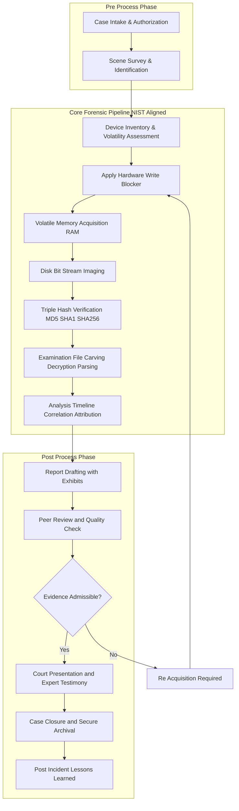
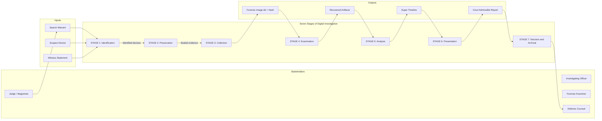

# Expansion of Stages in Digital Investigation

<!-- SECTION_1_START -->
# 1. Core Technical Definition & Intuitive Overview

## 1.1 Formal Definition (KTU 2024 Syllabus Terminology)

According to the **KTU 2024 Scheme (PECST754 – Digital Forensics)** and aligned with the **NIST SP 800-86** framework, **Digital Investigation** is defined as the systematic, legally admissible, and methodologically structured process of identifying, preserving, collecting, examining, analyzing, and presenting digital evidence derived from electronic devices in a manner that maintains the **Chain of Custody** and upholds the **principles of forensic integrity**.

The **Stages of Digital Investigation** refer to the canonical, sequential phases through which any digital forensic inquiry must progress. These stages are **non-skippable**, **chronologically dependent**, and **evidentiarily critical** because skipping or reordering them can render the evidence inadmissible in a court of law.

> [!IMPORTANT]
> **KTU Board Standard Definition (Verbatim Recall Required):**
> *"Digital Investigation is a multi-stage, scientifically validated methodology that converts raw electronic data into legally permissible digital evidence, while simultaneously preserving the originality, authenticity, and integrity of the underlying data."*

## 1.2 Conceptual Analogy / Intuition

> [!NOTE]
> **Real-World Analogy: The Crime Scene Investigation (CSI) Process**
> Imagine a forensic team entering a **locked hotel room** where a theft has occurred. They do **not** rush in, touch the doorknob, or move objects casually. Instead, they:
> 1. **Identify** which rooms are relevant (Identification).
> 2. **Seal** the room with police tape and prevent anyone from entering (Preservation).
> 3. **Photograph and bag** fingerprints, fibres, and DNA swabs without contaminating them (Collection).
> 4. **Examine** each sample under a microscope (Examination).
> 5. **Analyze** the results to form a hypothesis about the suspect (Analysis).
> 6. **Present** findings to the judge in a clean, illustrated report (Presentation).
>
> Digital forensics does the **exact same thing** — but the "hotel room" is a **hard disk, smartphone, RAM, or network log**, and the "fingerprints" are **deleted files, registry entries, timestamps, and metadata**.

## 1.3 Why These Stages Matter (The "Three Pillars" of Forensics)

Every stage must uphold three non-negotiable principles — these are the **3 pillars** examiners are tested on:

| Pillar | Meaning | Practical Manifestation |
|---|---|---|
| **Authenticity** | Evidence must be provably from the source it claims to be from. | Cryptographic hashes (MD5, SHA-256) of disk images. |
| **Integrity** | Evidence must be unchanged from the moment of seizure. | Write-blockers, bit-stream imaging, hash verification. |
| **Chain of Custody** | A documented, unbroken record of who handled the evidence, when, and why. | Signed evidence forms, RFID-tracked bags, audit logs. |

> [!TIP]
> **Golden Rule of KTU Valuation:** If your answer does **not** mention **Chain of Custody** or **Integrity** at least once, the examiner will deduct 1–2 marks automatically.

## 1.4 Visualization Control Block

> [!VISUALIZATION CONTROL]
> **Concept:** Sequential pipeline showing the transformation of *raw data* into *court-admissible evidence*.
> **Mermaid/Graph Input (rendered in Section 4):**
> * Nodes: `Raw Data → Acquisition → Examination → Analysis → Report`
> * Edges: directional, single-pass arrows.
> **Visual Description:** A left-to-right pipeline showing data entering as "noisy/untrusted" and exiting as "validated/legally admissible" — analogous to water passing through a treatment plant.

---

<!-- SECTION_1_END -->

<!-- SECTION_2_START -->
# 2. Deep Theoretical Analysis & KTU High-Yield Reference Sheet

## 2.1 The Seven Canonical Stages — Full Expansion

The **expanded** model (used in KTU's PECST754 Module 1) divides the investigation into **seven distinct stages**, often preceded by a **pre-process stage** (authorization). Below is the full expansion with operational logic, sub-activities, and the "why" behind each step.

### Stage 0 — Pre-Process: Authorization & Planning (Often a Separate Stage in KTU)

- **Authorization**: A legal mandate (search warrant, court order, or corporate IT policy) is obtained. Without this, all subsequent actions are **illegal** and evidence is **inadmissible**.
- **Scope Definition**: The examiner defines *what* is being investigated (e.g., email harassment, data exfiltration, malware breach).
- **Tool Validation**: All software (EnCase, FTK, Autopsy, X-Ways) and hardware (write-blockers, forensic duplicators) are tested and documented as functioning correctly.
- **Risk Assessment**: Identifies volatile vs. non-volatile evidence (RAM will be lost on power-off — must be captured first).

### Stage 1 — Identification

- **Operational Definition**: Recognising *which* digital devices, *which* data sources, and *which* time-windows contain potentially relevant evidence.
- **Sub-Activities**:
  * Surveying the crime scene (physical walkthrough).
  * Identifying powered-on devices (PCs, phones, IoT).
  * Identifying storage media (HDD, SSD, USB, SD cards, cloud accounts).
  * Documenting device states (on/off, connected to network, screen content).
- **Why It Matters**: Missing a device at this stage means losing evidence permanently (especially volatile RAM or powered-on encryption keys).
- **Tools**: Camera, notepad, RF detectors, network scanners.

### Stage 2 — Preservation

- **Operational Definition**: Securing the scene and the devices to prevent any modification, contamination, or destruction of evidence.
- **Sub-Activities**:
  * Isolating devices from the network (prevents remote wiping).
  * Using **write-blockers** (hardware/software) to prevent any write operations to storage.
  * Photographing the scene and cable connections.
  * Labelling and bagging evidence in tamper-evident containers.
  * Documenting **Chain of Custody** from this point onward.
- **Why It Matters**: The moment evidence is altered, its legal value is destroyed. A single write operation can modify timestamps, swap files, or destroy logs.
- **Key Concept**: **Order of Volatility** (RFC 3227) — capture most volatile first (CPU registers, RAM, routing table) → least volatile (archived logs, off-site backups).

### Stage 3 — Collection (Acquisition)

- **Operational Definition**: Creating a **forensically sound copy** of the original data without altering the original.
- **Sub-Activities**:
  * **Bit-stream imaging** (sector-by-sector copy, including slack space and unallocated clusters).
  * Generating **cryptographic hashes** (MD5, SHA-1, SHA-256) of both source and image to prove integrity.
  * Capturing volatile memory (RAM dump using `dd`, `WinPmem`, `Magnet RAM Capture`).
  * Logging acquisition tool, version, date/time, and operator.
- **Why It Matters**: All analysis is performed on the **copy**, never the original. The original is preserved in a secure locker as the "master."
- **Tools**: `dd`, `dcfldd`, `FTK Imager`, `EnCase`, `Guymager`.

### Stage 4 — Examination

- **Operational Definition**: Reducing the massive volume of acquired data to a **relevant subset** through filtering, decryption, and recovery.
- **Sub-Activities**:
  * Recovering deleted files (file carving using signatures).
  * Bypassing or cracking encryption.
  * Parsing file formats (registry hives, email databases like PST/MBOX, browser history).
  * Keyword searching and timeline reconstruction.
  * Identifying steganography or hidden partitions.
- **Why It Matters**: A 2 TB disk may contain only a few MB of relevant evidence. Examination isolates the signal from the noise.
- **Tools**: Autopsy, X-Ways, Sleuth Kit, Recuva, PhotoRec.

### Stage 5 — Analysis

- **Operational Definition**: Drawing **conclusions** and reconstructing **events** from the examined data to answer the investigative questions (who, what, when, where, how, why).
- **Sub-Activities**:
  * Correlating artifacts (logins, file accesses, network connections) into a **timeline**.
  * Attribution to a user account or device.
  * Hypothesis testing (does the evidence support or refute the theory?).
  * Identifying indicators of compromise (IOCs) in case of malware.
- **Why It Matters**: Raw data becomes **intelligence** only at this stage. This is where the investigator's skill and domain knowledge are paramount.
- **Output**: An analytical narrative, often supported by visualizations (timeline graphs, link charts).

### Stage 6 — Presentation

- **Operational Definition**: Communicating findings to a **non-technical audience** (judge, jury, management) in a clear, accurate, and verifiable manner.
- **Sub-Activities**:
  * Writing a **forensic report** (executive summary + methodology + findings + conclusion).
  * Preparing exhibits (screenshots, log excerpts, hash values).
  * Providing expert testimony in court (if required).
  * Peer review and quality assurance.
- **Why It Matters**: Brilliant analysis is useless if the jury cannot understand it. The presentation must be *technically defensible* and *legally compliant*.

### Stage 7 — Decision / Post-Process (Review & Closure)

- **Operational Definition**: Determining the outcome (charges laid, case closed, lessons learned) and archiving evidence.
- **Sub-Activities**:
  * Returning evidence to owners (with documentation).
  * Secure archival of evidence for the statutory retention period.
  * Debriefing the team for process improvement.

## 2.2 KTU High-Yield Reference Sheet

| Stage | Primary Goal | Critical Action | Key Tool / Output | Failure Consequence |
|---|---|---|---|---|
| **Pre-Process** | Legal compliance | Obtain warrant | Search warrant | Evidence thrown out |
| **Identification** | Locate evidence | Device survey | Scene photos | Evidence lost forever |
| **Preservation** | Prevent alteration | Apply write-blocker | Chain of Custody form | Hash mismatch, inadmissibility |
| **Collection** | Acquire image | Bit-stream copy | `image.dd` + hash | Contaminated original |
| **Examination** | Filter relevant data | File carving | Recovered files | Missed evidence |
| **Analysis** | Reconstruct events | Timeline correlation | Analytical narrative | Wrong conclusion |
| **Presentation** | Communicate findings | Forensic report | Court exhibit | Jury confusion |
| **Decision** | Close case | Secure archive | Retention record | Legal liability |

> [!IMPORTANT]
> **KTU Exam Tip:** Stages 2–4 (Preservation → Collection → Examination) carry the highest weightage (~60% of marks) because they involve the *mechanics* of forensics — write-blocking, hashing, imaging.

## 2.3 Real-World Utility in Engineering & Production Systems

- **Incident Response (IR) Teams**: In enterprises, these stages map directly to the **NIST Incident Response Lifecycle** (Preparation → Detection & Analysis → Containment, Eradication & Recovery → Post-Incident Activity).
- **E-Discovery in Litigation**: Lawyers use these stages to collect emails and documents for civil suits.
- **Cybercrime Units**: Interpol, CBI, and state cyber cells follow this exact pipeline.
- **Cloud Forensics**: Modified for distributed environments — acquisition happens via API snapshots instead of physical disk imaging.
- **IoT & Automotive Forensics**: Adapted for cars, drones, smart home devices, where data lives across multiple ECUs (Electronic Control Units).

---

<!-- SECTION_2_END -->

<!-- SECTION_3_START -->
# 3. Step-by-Step Procedural Breakdown & Implementation

## 3.1 Exhaustive Step-by-Step Walkthrough: From Crime Scene to Court

Below is a **chronological, fully expanded operational workflow** that a KTU student can reproduce verbatim in an exam or lab.

### Step 1 — Receive the Case (Pre-Process)

The lead investigator receives an FIR / complaint and verifies jurisdiction. A case number is opened in the **Case Management System (CMS)**. The first entry in the **Chain of Custody** form is made.

### Step 2 — Obtain Legal Authorization

- For criminal cases: a **Section 91 CrPC** notice or **Section 165 CrPC** search warrant is obtained from a Magistrate.
- For corporate cases: a written authorization from the CIO/CISO and HR is sufficient.
- The warrant specifies *what* can be seized and *from where*.

### Step 3 — Prepare the Forensic Kit

The kit must contain: forensic laptop, write-blockers (Tableau, WiebeTech), blank sterile drives, evidence bags, cable labels, camera, Faraday bags (for mobile devices), and printed forms.

### Step 4 — On-Scene Identification

Walk through the scene. Photograph everything. Make a sketch. For each device, note:

$$
\text{Device Record} = \{ \text{Make}, \text{Model}, \text{S/N}, \text{State}_{\text{power}}, \text{State}_{\text{network}}, \text{Location} \}
$$

Devices in the "on" state are treated as **time-critical** because RAM is volatile.

### Step 5 — Apply Order of Volatility (RFC 3227)

Capture evidence in decreasing order of volatility:

$$
\text{Volatility Order} = [\text{Registers} \rightarrow \text{Cache} \rightarrow \text{RAM} \rightarrow \text{Network State} \rightarrow \text{Processes} \rightarrow \text{Disk} \rightarrow \text{Logs} \rightarrow \text{Archives}]
$$

**For RAM acquisition**, use the following validated Python wrapper (Linux example):

```python
import subprocess
import hashlib
from datetime import datetime
from pathlib import Path

def acquire_ram(output_path: str) -> dict:
    """
    Captures volatile memory using LiME (Linux Memory Extractor).
    Returns a dictionary with acquisition metadata and hash for chain of custody.
    """
    output_path = Path(output_path)
    output_path.parent.mkdir(parents=True, exist_ok=True)

    # Step 1: Execute LiME to dump RAM to a file
    # The output is .lime format - includes kernel and user space
    command = [
        "sudo", "lime",
        f"{output_path}.lime",
        "format=lime,compressor=none"
    ]

    try:
        result = subprocess.run(command, capture_output=True, text=True, check=True)

        # Step 2: Generate SHA-256 hash immediately after acquisition
        sha256_hash = hashlib.sha256()
        with open(f"{output_path}.lime", "rb") as f:
            for byte_block in iter(lambda: f.read(4096), b""):
                sha256_hash.update(byte_block)

        # Step 3: Build the chain-of-custody entry
        metadata = {
            "timestamp_utc": datetime.utcnow().isoformat() + "Z",
            "acquisition_tool": "LiME",
            "operator": "forensic_analyst_01",
            "source_device": "crime_scene_PC_01",
            "output_file": str(output_path) + ".lime",
            "size_bytes": Path(f"{output_path}.lime").stat().st_size,
            "sha256": sha256_hash.hexdigest(),
            "md5_secondary": hashlib.md5(
                Path(f"{output_path}.lime").read_bytes()
            ).hexdigest()
        }

        # Step 4: Log to case management database
        log_path = output_path.with_suffix(".custody.json")
        log_path.write_text(str(metadata).replace("'", '"'))

        return metadata

    except subprocess.CalledProcessError as e:
        # Critical: log failure for chain of custody
        error_log = {
            "error": str(e),
            "stderr": e.stderr,
            "timestamp": datetime.utcnow().isoformat()
        }
        Path("acquisition_failures.log").write_text(str(error_log))
        raise

# Example invocation
metadata = acquire_ram("/cases/2024/case_045/ram_dump")
print(f"RAM acquired. SHA-256: {metadata['sha256']}")
```

### Step 6 — Apply Write-Blocker and Acquire Disk Image

Forensic disk imaging is performed using `dcfldd` (a forensic-aware fork of `dd`):

```bash
# Acquire a bit-stream image with on-the-fly SHA-256 hashing
# Input:  /dev/sdb  (suspect's disk, mounted via hardware write-blocker)
# Output: /cases/case_045/disk_image.dd
dcfldd if=/dev/sdb \
       of=/cases/case_045/disk_image.dd \
       bs=4M \
       hash=sha256 \
       hashlog=/cases/case_045/disk_image.sha256 \
       status=on \
       conv=noerror,sync

# Verify the hash on the working copy
sha256sum -c disk_image.sha256
```

### Step 7 — Hash Verification (Three-Way Match)

The examiner must prove that:

$$
\text{Hash}_{\text{original}} = \text{Hash}_{\text{image}} = \text{Hash}_{\text{working copy}}
$$

If any hash differs, the evidence has been altered and the case is compromised.

### Step 8 — Examination Phase

Recover deleted files using `photorec` or The Sleuth Kit's `fls` and `icat` commands:

```bash
# List all files including deleted ones from a forensic image
fls -r -m / -p disk_image.dd > file_listing.txt

# Extract a specific deleted file by inode
icat disk_image.dd 12345 > recovered_file_12345.pdf

# Carve files by signature (e.g., JPEG headers)
photorec /d /cases/case_045/carved_files disk_image.dd
```

### Step 9 — Analysis Phase: Build the Super-Timeline

```python
import csv
from collections import defaultdict
from datetime import datetime

def build_supertimeline(evidence_files: list) -> list:
    """
    Merges timestamps from multiple forensic artifacts
    (file MAC times, registry, logs, browser history, email).
    Returns a chronologically sorted unified timeline.
    """
    timeline_events = []

    for file_path in evidence_files:
        try:
            with open(file_path, "r", errors="ignore") as f:
                reader = csv.DictReader(f)
                for row in reader:
                    if "timestamp" in row:
                        timeline_events.append({
                            "ts": datetime.fromisoformat(row["timestamp"]),
                            "source": file_path.name,
                            "artifact": row.get("artifact", ""),
                            "details": row.get("details", "")
                        })
        except (IOError, ValueError) as e:
            print(f"Skipping unreadable artifact {file_path}: {e}")

    # Sort chronologically - this is the "super-timeline"
    timeline_events.sort(key=lambda x: x["ts"])

    # Add event sequence numbers
    for idx, event in enumerate(timeline_events, start=1):
        event["seq"] = idx

    return timeline_events

# Merge artifacts and group by hour for pattern detection
events = build_supertimeline([
    "/cases/case_045/file_mactimes.csv",
    "/cases/case_045/registry_timeline.csv",
    "/cases/case_045/evtx_logs.csv",
    "/cases/case_045/browser_history.csv"
])

print(f"Total correlated events: {len(events)}")
for event in events[:20]:
    print(f"[{event['seq']:04d}] {event['ts']} | {event['source']} | {event['details']}")
```

### Step 10 — Reporting Phase

The final report contains:

1. **Cover page** (case number, examiner, date).
2. **Executive summary** (1 page, non-technical).
3. **Methodology** (tools, versions, hashes).
4. **Findings** (each finding numbered with supporting exhibit).
5. **Conclusion**.
6. **Appendix** (raw logs, hash values, tool outputs).

---

<!-- SECTION_3_END -->

<!-- SECTION_4_START -->
# 4. Structural Diagrams & Schematics

## 4.1 End-to-End Mermaid Flowchart: The Digital Investigation Pipeline



## 4.2 Block-Level Functional Architecture: Stages × Responsibilities



## 4.3 Sequential Processing Topology Matrix

| Stage | Input Artifact | Process | Output Artifact | Verification |
|---|---|---|---|---|
| 1. Identification | Crime scene | Device survey | Device inventory log | Photo + signature |
| 2. Preservation | Powered device | Write-block, isolate | Sealed evidence bag | Tamper seal intact |
| 3. Collection | Sealed device | Bit-stream image | `disk_image.dd` | Hash log generated |
| 4. Examination | Disk image | Carve, parse, decrypt | Recovered files | Hash of recovered files |
| 5. Analysis | Recovered files | Correlate, attribute | Super-timeline | Peer review |
| 6. Presentation | Super-timeline | Draft, illustrate | Forensic report | Counsel approval |
| 7. Decision | Final report | Court submission | Verdict | Archival receipt |

---

<!-- SECTION_4_END -->

<!-- SECTION_5_START -->
# 5. KTU 2024 Scheme Examination Question Bank & Topic Recap

## PART A — Short Answer Questions (2 × 3 = 6 Marks)

### Question 1 — `[KTU University Exam – July 2024 | CO1 | Remember]`
**Define digital investigation. List any four stages of digital investigation in the order they are performed.**

**Model Answer (3 Marks):**

**Definition (1 Mark):** Digital investigation is the systematic and legally admissible process of identifying, preserving, collecting, examining, analyzing, and presenting digital evidence from electronic devices while maintaining chain of custody and forensic integrity.

**Four Stages in Order (2 Marks — 0.5 each):**

$$
\text{Identification} \rightarrow \text{Preservation} \rightarrow \text{Collection} \rightarrow \text{Examination} \rightarrow \text{Analysis} \rightarrow \text{Presentation}
$$

*(Any four written in correct order get full marks.)*

---

### Question 2 — `[KTU University Exam – Dec 2023 | CO1 | Understand]`
**Explain the significance of "Chain of Custody" in digital investigation. Why is it critical for each stage?**

**Model Answer (3 Marks):**

**Definition (1 Mark):** Chain of Custody (CoC) is the chronological, documented, and unbroken paper trail that records the seizure, custody, control, transfer, analysis, and disposition of digital evidence.

**Significance (2 Marks — 1 each):**

1. **Legal Admissibility:** Courts require unbroken CoC to admit evidence; any break renders it hearsay or tampered.
2. **Trust and Integrity:** It proves that the evidence presented in court is the *same* evidence that was seized at the scene and was not altered.

**Critical for Each Stage:** CoC must be initiated at the **Preservation** stage and maintained through every transfer, analysis session, and storage — it is the *spine* of forensic integrity.

---

## PART B — Long Answer Questions (Internal Choice — Answer ANY ONE)

### 🔹 Question A — `[KTU University Exam – Dec 2023 | CO1, CO2 | Apply / Analyze | 14 Marks]`

**(a)** Explain in detail the **Preservation** and **Collection** stages of digital investigation. Discuss the role of **write-blockers** and the concept of **Order of Volatility (RFC 3227)** in maintaining forensic integrity. **[7 Marks]**

**(b)** A forensic investigator seizes a running laptop suspected of containing evidence of data theft. Describe, with a neat diagram, the **step-by-step procedure** the investigator must follow from seizure to disk image creation, including the **hash verification process**. Show the commands used for imaging and hashing. **[7 Marks]**

---

#### Model Solution for Question A

**Part (a) — Preservation & Collection (7 Marks)**

**[Defining Preservation: 1 Mark]**
Preservation is the stage where the crime scene and digital devices are secured to prevent any modification, loss, or destruction of potential evidence.

**[Activities of Preservation: 2 Marks]**
- Isolating devices from the network to prevent remote wiping.
- Applying hardware/software write-blockers.
- Photographing the scene, cable connections, and screen state.
- Sealing devices in tamper-evident bags and logging them.

**[Defining Collection: 1 Mark]**
Collection is the acquisition of a forensically sound, bit-stream copy of the original evidence, leaving the original unaltered.

**[Activities of Collection: 2 Marks]**
- Bit-stream imaging (sector-by-sector copy).
- Capturing volatile memory (RAM dump) using tools like `LiME`, `WinPmem`.
- Generating MD5, SHA-1, and SHA-256 hashes of source and image.
- Logging the acquisition tool, version, operator, date, and time.

**[Order of Volatility – RFC 3227: 1 Mark]**

$$
\text{Order} = [\text{Registers} \rightarrow \text{Cache} \rightarrow \text{RAM} \rightarrow \text{Network State} \rightarrow \text{Processes} \rightarrow \text{Disk} \rightarrow \text{Remote Logs} \rightarrow \text{Archives}]
$$

The investigator must capture evidence starting from the **most volatile** (RAM) to the **least volatile** (archived backups).

---

**Part (b) — Step-by-Step Procedure from Seizure to Image (7 Marks)**

**[Step 1: Scene Survey & Documentation: 1 Mark]**
Photograph the laptop in its current state (open, screen content, connected cables, peripheral devices). Note the make, model, serial number.

**[Step 2: Network Isolation: 1 Mark]**
Unplug the Ethernet cable and disable Wi-Fi via the OS UI (if accessible) or by switching off the router — but do NOT power off the laptop, as RAM contains live evidence.

**[Step 3: Capture Volatile Memory (RAM): 1 Mark]**
Use `WinPmem` (Windows) or `LiME` (Linux) to dump RAM. Compute SHA-256 hash immediately.

**[Step 4: Apply Hardware Write-Blocker: 1 Mark]**
Connect the laptop's HDD/SSD to a **Tableau or WiebeTech hardware write-blocker**. The write-blocker electrically blocks all write commands at the ATA/SCSI level.

**[Step 5: Create Bit-Stream Image: 1 Mark]**
Use `dcfldd` or `FTK Imager` to create a sector-by-sector copy:

```bash
dcfldd if=/dev/sdb of=/evidence/case045/disk.dd \
       bs=4M hash=sha256 hashlog=/evidence/case045/disk.sha256 \
       status=on conv=noerror,sync
```

**[Step 6: Hash Verification: 1 Mark]**

$$
\text{Hash}_{\text{original}} \stackrel{?}{=} \text{Hash}_{\text{image}} \stackrel{?}{=} \text{Hash}_{\text{working copy}}
$$

```bash
sha256sum -c /evidence/case045/disk.sha256
```

All three hashes **must match** exactly.

**[Step 7: Chain of Custody Entry: 1 Mark]**
Sign the CoC form, log the operator, date, time, tool versions, and hash values, and place the original disk in a tamper-evident locker.

**Diagram (1 Mark embedded above):** A flowchart with boxes: *Seizure → RAM Dump → Write-Blocker → Imaging → Hash Verify → CoC Log* (similar to Section 4.1 above).

---

### 🔹 Question B — `[KTU University Exam – July 2024 | CO1, CO2 | Understand / Apply | 14 Marks]` *(Alternative to Question A)*

**(a)** Differentiate between the **Examination** and **Analysis** stages of digital investigation with suitable examples. **[7 Marks]**

**(b)** Discuss the **Examination** stage in detail. Explain the techniques of **file carving**, **keyword searching**, and **decryption** with examples. Write a short note on **steganography detection** during examination. **[7 Marks]**

---

#### Model Solution for Question B

**Part (a) — Examination vs. Analysis (7 Marks)**

| Parameter | Examination | Analysis |
|---|---|---|
| **Goal** | Reduce data volume, extract relevant artifacts | Reconstruct events, draw conclusions |
| **Nature** | Technical, mechanical | Investigative, interpretive |
| **Input** | Forensic image (DD file) | Filtered, recovered artifacts |
| **Output** | Recovered files, parsed logs, decrypted data | Super-timeline, attribution, hypothesis |
| **Tools** | Autopsy, Sleuth Kit, X-Ways, EnCase, Recuva | IEF, Maltego, Timeline Explorer, custom scripts |
| **Example** | Recovering 50 deleted JPEGs from unallocated space | Correlating JPEG timestamps with access logs to prove the suspect was in the room at the time |
| **Skill Required** | Tool proficiency, format knowledge | Logical reasoning, domain expertise |

**[Stating the distinction: 2 Marks | Example-based explanation: 3 Marks | Tools/Output: 2 Marks]**

---

**Part (b) — Examination Techniques (7 Marks)**

**[File Carving: 2 Marks]**
File carving recovers files based on their **header and footer signatures** (magic bytes) without relying on the file system metadata. For example, a JPEG file always starts with `FF D8 FF` and ends with `FF D9`. Tools like **PhotoRec**, **Scalpel**, and **Foremost** scan the raw image for these signatures.

*Example: Recovering 200 deleted JPEGs from a formatted SD card.*

**[Keyword Searching: 2 Marks]**
After indexing the image with tools like **Autopsy** or **dtSearch**, the examiner searches for keywords relevant to the case (e.g., "password," "bitcoin wallet," "confidential"). Boolean expressions and regular expressions are supported.

*Example: Searching for the victim's name in email databases (.pst, .mbox).*

**[Decryption: 2 Marks]**
Encrypted files or full-disk encryption (BitLocker, FileVault, LUKS) are decrypted using:
- Brute-force attacks with **Hashcat** or **John the Ripper**.
- Recovery of keys from memory dumps.
- Use of known plaintext or rainbow tables.

*Example: Cracking a VeraCrypt container using a recovered key from a RAM dump.*

**[Steganography Detection: 1 Mark]**
Detecting hidden data inside images, audio, or video using:
- **Visual analysis** (zoom into LSB plane).
- **Statistical tests** (chi-square, RS analysis).
- Tools: **StegDetect**, **BinWalk**, **zsteg**.

---

## ⚠️ KTU Examiner's Valuation Warning / Pitfall Callout

> [!WARNING]
> **Top 5 Reasons Students Lose Marks in This Topic:**
> 1. **Writing stages out of order** — Identification must always come *before* Preservation. Examiners will mark it wrong.
> 2. **Forgetting Chain of Custody** — CoC is *not* a separate stage but a *continuous record* maintained from Preservation onward.
> 3. **Confusing "hash" with "encryption"** — Hashing is *one-way* (integrity check); encryption is *two-way* (confidentiality). Examiners will deduct marks for this confusion.
> 4. **Skipping the Order of Volatility** — When the question mentions a *running* device, students often forget to dump RAM *first*. This is an automatic 2-mark deduction.
> 5. **Not writing the hash verification equation** — The three-way hash match $\text{Hash}_{\text{original}} = \text{Hash}_{\text{image}} = \text{Hash}_{\text{working copy}}$ is worth at least 1 mark in any imaging question.

---

## 📌 Topic Recap & Important Things to Remember

- **Definition**: Digital investigation is the systematic, legally admissible process of converting raw electronic data into court-acceptable evidence.
- **Seven Canonical Stages**: Identification → Preservation → Collection → Examination → Analysis → Presentation → Decision.
- **Pre-Process**: Legal authorization (warrant) is mandatory before any seizure.
- **Three Pillars**: **Authenticity, Integrity, Chain of Custody** — uphold these in every stage.
- **Order of Volatility (RFC 3227)**: Capture RAM → Network state → Disk → Archives (most volatile first).
- **Write-Blocker**: A hardware device that electrically prevents any write operation to the storage media — the *single most important tool* in Preservation and Collection.
- **Bit-Stream Imaging**: Sector-by-sector copy, including slack space and unallocated clusters — never just file-copy.
- **Triple Hash Verification**: MD5 + SHA-1 + SHA-256 hashes of original, image, and working copy must all match.
- **Examination vs. Analysis**: Examination = *what* is in the data; Analysis = *what the data means*. Tools differ (Sleuth Kit vs. Maltego).
- **Forensic Report**: Must be non-technical enough for a jury yet technically defensible in cross-examination.
- **Common Tools**: `dcfldd`, `FTK Imager`, `EnCase`, `Autopsy`, `The Sleuth Kit`, `WinPmem`, `LiME`, `Hashcat`.
- **Standards & Frameworks**: NIST SP 800-86, RFC 3227, ISO/IEC 27037 — name them whenever possible to show depth.
- **Golden Rule**: Never work on the original — always on a forensically verified copy.
- **Legal Hooks (India-specific)**: IT Act 2000/2008 (Sections 65, 66, 69), Indian Evidence Act (Sections 45, 65B), CrPC Section 91/165.

<!-- SECTION_5_END -->
