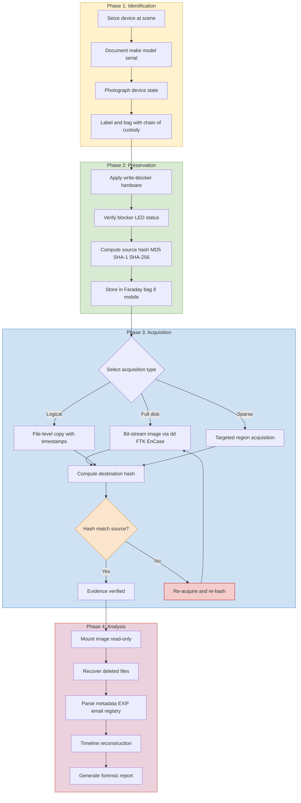
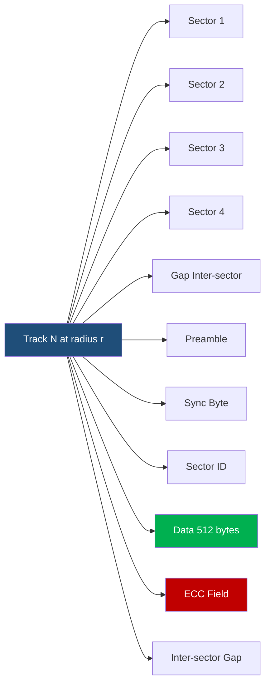
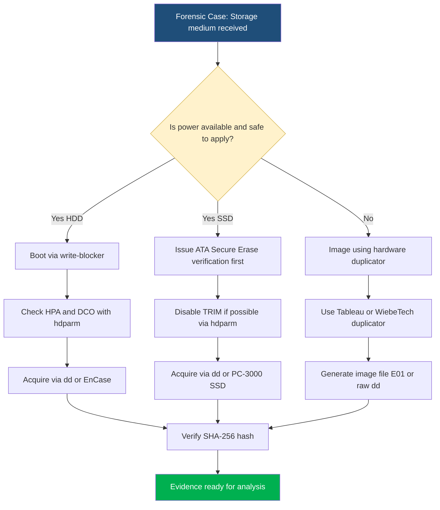

# Expansion of Types of Storage Medium

<!-- SECTION_1_START -->
# 1. Core Technical Definition & Intuitive Overview

## 1.1 Formal Academic Definition

> [!IMPORTANT]
> **KTU 2024 Syllabus Definition**
> In Digital Forensics, a **Storage Medium** (or *storage device*) is defined as any physical, virtual, or logical hardware component, substrate, or remote service that possesses the capability to **persistently retain, encode, and retrieve digital binary data** in a form suitable for computational processing, evidentiary extraction, and forensic analysis. Storage media form the primary **custodial surface** from which digital evidence is identified, acquired, preserved, and examined.

The classification of storage media in forensic science is not based merely on physical nature, but on the **logical addressing mechanism**, **data persistence characteristics**, **deletion behavior**, **anti-forensic vulnerability surface**, and **evidentiary recoverability index** (often called the *forensic triage score*).

## 1.2 The Three Primary Forensic Storage Taxonomies

| Taxonomy Tier | Storage Family | Forensic Sub-Category |
| :--- | :--- | :--- |
| **Tier 1** | **Magnetic** | HDD, Floppy Disk, Magnetic Tape, ZIP Disk |
| **Tier 2** | **Optical** | CD-ROM, CD-R/RW, DVD±R/RW, Blu-ray, M-Disc |
| **Tier 3** | **Semiconductor (Solid State)** | SSD, USB Flash Drive, SD/microSD, eMMC, NVMe |

> [!NOTE]
> **Extended Forensic Taxonomy (Beyond the Three Tiers)**
> Modern KTU 2024 examiners also recognize **Tier 4: Networked/Distributed Storage** (NAS, SAN, Cloud), **Tier 5: Mobile Embedded Storage** (eMMC, UFS), and **Tier 6: Virtual/Containerized Storage** (VMware VMDK, VHD, Docker OverlayFS).

## 1.3 Conceptual Analogy & Intuition

> [!TIP]
> **Real-World Analogy: The "Forensic Library"**
> Imagine a massive library where every book is a file.
> - **Magnetic HDD** is like a **spiral notebook** with erasable pencil — pages can be rewritten many times, but faint indentations of erased words (slack space) remain visible to forensic experts using special tools.
> - **Optical Disc (CD/DVD)** is like a **stone tablet** once written — the inscription (pits and lands) is permanent and read-only, but the disc can shatter.
> - **SSD/Flash Drive** is like a **smart whiteboard with an automatic eraser** — when you wipe a section, the whiteboard's internal robot (*wear-leveling controller*) immediately shuffles data to new cells, making the "erase" appear invisible to investigators.
> - **Cloud Storage** is like a **distributed network of public lockers** scattered across the city — you must know the exact locker addresses and possess all the keys to reconstruct the file.

## 1.4 Physical Constants and Standard Metrics

> [!IMPORTANT]
> **Mandatory Standard Units in Forensic Storage Calculations**
> - **Bit (b)** = fundamental unit = $1$ binary digit
> - **Byte (B)** = $8$ bits
> - **Kibibyte (KiB)** = $2^{10} = 1024$ Bytes
> - **Mebibyte (MiB)** = $2^{20} = 1{,}048{,}576$ Bytes
> - **Gibibyte (GiB)** = $2^{30}$ Bytes
> - **Tebibyte (TiB)** = $2^{40}$ Bytes
> - **Manufacturer's GB** = $10^{9}$ Bytes (decimal), causing the famous **"missing bytes" phenomenon** (e.g., a "1 TB" drive reports only $\approx 931$ GiB in the OS)
> - **Sector Size** (HDD default) = **$512$ bytes** (legacy) or **$4096$ bytes** (Advanced Format / 4Kn)
> - **Block/Erase-block size** (NAND flash) = typically $128$ KiB to $4$ MiB
> - **AHS (Average Seek Time)** for HDD: **$3$ to $15$ ms** (rotational latency + head movement)

> [!VISUALIZATION CONTROL]
> **Concept:** Forensic Storage Capacity — Decimal vs Binary Reporting
> **Plotting Equations (Desmos Input):**
> * `f(x) = (10^9 * x) / (2^30)` — where $x$ is the advertised GB rating
> **Visual Description:** A linear graph where the y-axis (actual GiB reported by the OS) is approximately $0.931$ times the x-axis (manufacturer's GB), illustrating the missing-bytes gap. A $1$ TB ($10^{12}$ bytes) drive shows only $931.32$ GiB.

---

<!-- SECTION_1_END -->

<!-- SECTION_2_START -->
# 2. Deep Theoretical Analysis & KTU High-Yield Formula Sheet

## 2.1 Tier-1: Magnetic Storage Media — Theoretical Foundation

Magnetic media store data by **polarizing microscopic ferromagnetic regions** along concentric tracks. The polarity (North/South) represents the binary state ($1$/$0$).

### 2.1.1 Hard Disk Drive (HDD)
A HDD is a stack of **platters** coated with magnetic material, rotating at speeds measured in **RPM** (commonly $5400$ or $7200$ RPM for consumer drives; up to $15{,}000$ RPM for enterprise).

**Geometric Architecture of a HDD (Bottom-Up):**

1.  **Platter** — circular rigid disk
2.  **Track** — concentric ring on a platter surface
3.  **Sector** — arc-segment of a track; smallest addressable unit (traditionally **$512$ bytes**)
4.  **Cylinder** — set of tracks at the same radial position across all platters
5.  **Cluster (Block)** — group of consecutive sectors managed by the file system (typically $4$ KiB to $64$ KiB)

### 2.1.2 Forensic Significance of HDD
- **Slack Space** (a high-yield forensic concept) — see Section 2.5
- **File System Metadata** — $MFT$ entries (NTFS), $i$-nodes (EXT4), or $FAT$ chains
- **Host Protected Area (HPA)** and **Device Configuration Overlay (DCO)** — hidden regions often missed by standard acquisitions

### 2.1.3 Floppy Disk
Capacity typically **$1.44$ MB** ($1474{,}560$ bytes). Uses **$80$ tracks**, **$2$ sides**, **$18$ sectors/track**, **$512$ bytes/sector**.

### 2.1.4 Magnetic Tape
Sequential-access medium (LTO-9: up to **$45$ TB** native compressed). Forensic use is rare but appears in enterprise backup investigations.

## 2.2 Tier-2: Optical Storage Media — Theoretical Foundation

Optical media use a **laser beam** to read microscopic **pits** (depressions) and **lands** (flat areas) molded into a polycarbonate substrate. The transition pit$\to$land or land$\to$pit represents a binary $1$; lack of transition represents $0$.

| Optical Type | Capacity (Single Layer) | Laser Wavelength |
| :--- | :--- | :--- |
| CD-ROM / CD-R | $700$ MB / $80$ min audio | $780$ nm (infrared) |
| DVD±R / DVD±RW | $4.7$ GB | $650$ nm (red) |
| Blu-ray (BD-R/RE) | $25$ GB | $405$ nm (blue-violet) |
| M-Disc (Millennial Disc) | $25$ GB to $100$ GB | $405$ nm |

> [!NOTE]
> **Forensic Note on Optical Media**
> Optical discs are largely **WORM (Write Once Read Many)** for pressed and $R$ variants, making them excellent evidence sources. Surface scratches, dye degradation (CD-R), and **delamination** are common failure modes requiring laser-based recovery specialists.

## 2.3 Tier-3: Solid State / Semiconductor Storage — Theoretical Foundation

Semiconductor storage uses **NAND flash memory cells** (floating-gate transistors). Each cell stores charge on an insulated floating gate, with the trapped charge level determining the binary value.

### 2.3.1 Cell Architecture
- **SLC (Single-Level Cell)** — $1$ bit per cell ($2$ voltage states), $\sim 100{,}000$ P/E cycles
- **MLC (Multi-Level Cell)** — $2$ bits per cell ($4$ voltage states), $\sim 3{,}000$ to $10{,}000$ P/E cycles
- **TLC (Triple-Level Cell)** — $3$ bits per cell ($8$ voltage states), $\sim 1{,}000$ to $3{,}000$ P/E cycles
- **QLC (Quad-Level Cell)** — $4$ bits per cell ($16$ voltage states), $\sim 1{,}000$ P/E cycles

### 2.3.2 Forensic Significance: The Wear-Leveling Problem
Unlike HDDs where deleted data persists in slack space until overwritten, SSDs employ:
- **Wear Leveling** — distributes writes evenly across cells
- **TRIM Command** — informs the SSD that sectors are no longer in use
- **Garbage Collection** — reclaims TRIMmed blocks
- **Over-Provisioning** — hidden spare area (typically $7\%$ to $28\%$)

> [!WARNING]
> **The "Anti-Forensic" Nature of SSDs**
> When a user "deletes" a file, the OS issues a TRIM. The SSD's controller then **zeroes the underlying NAND pages** asynchronously. By the time a forensic examiner connects the drive, the original bits are **physically erased**, making traditional un-deletion impossible. This is a **board-favorite KTU question**.

## 2.4 Extended Storage Media in Modern Forensics

### 2.4.1 USB Flash Drives
USB pen drives use a **USB bridge controller** + **NAND flash chip(s)**. Forensic artifacts: vendor ID, product ID, serial number, **unique bad-block table**, and **wear-leveling map** stored in the controller's firmware.

### 2.4.2 Memory Cards (SD, microSD, CompactFlash)
Same NAND foundation as SSDs but with a simplified controller. Often used in **CCTV, dashcams, and drones** — making them critical forensic sources.

### 2.4.3 Cloud / Remote Storage
Data is stored across **geographically distributed data centers** (e.g., AWS S3 buckets, Azure Blobs). Forensics requires:
- **Legal process** (warrant, MLAT for cross-border)
- **API-based acquisition** (avoiding the anti-forensic "logging-out" trigger)
- **Chain of custody** for virtualized evidence

### 2.4.4 Network Attached Storage (NAS) and Storage Area Networks (SAN)
- **NAS** — file-level access (NFS, SMB); uses **RAID** underneath
- **SAN** — block-level access (iSCSI, Fibre Channel)

### 2.4.5 RAID (Redundant Array of Independent Disks)
| RAID Level | Min Disks | Fault Tolerance | Forensic Implication |
| :--- | :---: | :--- | :--- |
| **RAID 0** (Striping) | $2$ | None | Higher data loss risk |
| **RAID 1** (Mirroring) | $2$ | $1$ disk | Data preserved on mirror |
| **RAID 5** (Striping + Parity) | $3$ | $1$ disk | Requires parity reconstruction |
| **RAID 6** (Dual Parity) | $4$ | $2$ disks | Double fault tolerant |
| **RAID 10** (1+0) | $4$ | $1$ disk per mirror | Best for forensic acquisition throughput |

### 2.4.6 Mobile Embedded Storage
- **eMMC (embedded MultiMediaCard)** — soldered NAND + controller; found in older smartphones
- **UFS (Universal Flash Storage)** — faster successor, used in modern flagships
- **NVMe (Non-Volatile Memory Express)** — PCIe-based; used in modern laptops

### 2.4.7 Virtual Storage
- **VMware VMDK** (Virtual Machine Disk)
- **Microsoft VHD / VHDX**
- **Docker OverlayFS layers**
Forensic artifacts include **deletion of parent VMs**, snapshot chains, and log file remnants.

## 2.5 The KTU High-Yield Formula Sheet

> [!IMPORTANT]
> **Mandatory Formulas for Board Examinations (PECST754)**

| \# | Formula | Description | Unit / Result |
| :---: | :--- | :--- | :--- |
| $1$ | $C_{p} = \frac{C_{a} \times 10^{9}}{2^{30}}$ | Convert advertised GB to actual GiB | GiB |
| $2$ | $S_{total} = N_{s} \times S_{size}$ | Total storage capacity | Bytes |
| $3$ | $S_{slack} = C_{cluster} - A_{data}$ | RAM slack space (per cluster) | Bytes |
| $4$ | $S_{slack\_total} = N_{cluster} \times C_{cluster} - \sum A_{data}$ | Total volume slack | Bytes |
| $5$ | $D_{lat} = \frac{1}{2} \times \frac{60}{RPM}$ | Average rotational latency | Seconds |
| $6$ | $T_{seek\_avg} = T_{avg}$ | Average seek time (given) | ms |
| $7$ | $T_{xfer} = \frac{D_{size}}{R_{xfer}}$ | Data transfer time | Seconds |
| $8$ | $N_{sectors} = \frac{C_{bytes}}{512}$ | Sectors per track/disk | Dimensionless |
| $9$ | $H_{integrity} = H_{MD5}(F) \stackrel{?}{=} H_{SHA1}(F)$ | Hash-based integrity check | $128$ / $160$ bits |
| $10$ | $D_{efficiency} = \frac{D_{useful}}{D_{total}} \times 100\%$ | Disk space utilization efficiency | Percent |
| $11$ | $E_{blocks} = \frac{C_{capacity}}{B_{erase}}$ | Erase-blocks per SSD capacity | Dimensionless |
| $12$ | $R_{wear} = \frac{Writes_{total}}{PE_{cycles}}$ | Wear-out ratio of flash cell | Dimensionless |
| $13$ | $T_{acq} = \frac{C_{disk} \times 8}{R_{link} \times \eta}$ | Forensic acquisition time | Seconds |
| $14$ | $P_{eff\_RAID5} = \frac{N-1}{N} \times 100\%$ | Effective capacity % of RAID 5 | Percent |

> [!NOTE]
> **Notation used above**
> - $N_s$ = number of sectors, $S_{size}$ = sector size
> - $C_{cluster}$ = cluster size, $A_{data}$ = actual data size
> - $RPM$ = revolutions per minute of HDD spindle
> - $R_{xfer}$ = transfer rate in Bytes/sec
> - $R_{link}$ = acquisition link rate (e.g., USB 3.0 = $5$ Gbps), $\eta$ = protocol efficiency ($\approx 0.8$)
> - $H_{MD5}$ / $H_{SHA1}$ = hash functions on file $F$
> - $B_{erase}$ = erase-block size of the NAND

## 2.6 Real-World Forensic Engineering Utility

| Domain | Storage Medium Examined | Forensic Goal |
| :--- | :--- | :--- |
| **Criminal Investigations** | HDD, USB, SD cards | Recover deleted illicit content |
| **Corporate Espionage** | Cloud email, NAS, RAID | Reconstruct exfiltration trails |
| **Cybercrime / Ransomware** | SSD, NVMe, Cloud snapshots | Identify encryption keys and patient zero |
| **Mobile Forensics** | eMMC, UFS chips | Extract call logs, GPS, app data |
| **IoT Forensics** | SD cards in dashcams, drones, CCTV | Reconstruct time-stamped events |
| **Incident Response** | Virtual machine VMDKs | Memory dumps, persistence mechanisms |

---

<!-- SECTION_2_END -->

<!-- SECTION_3_START -->
# 3. Step-by-Step Derivations & Code/Symbolic Implementation

## 3.1 Derivation 1 — HDD Capacity from Geometric Parameters

**Problem Context:** A forensic examiner is handed an older $3.5$-inch HDD. The label states **"5400 RPM, 4 heads, 2 platters."** The drive uses **$512$ bytes per sector**, **$1024$ sectors per track**, and **$8192$ tracks per surface**. Compute the total formatted capacity.

**Symbolic Derivation:**

$$
\begin{aligned}
C_{surface} &= N_{tracks\_per\_surface} \times N_{sectors\_per\_track} \times S_{size} \\
C_{surface} &= 8192 \times 1024 \times 512 \\
C_{surface} &= 8192 \times 1024 \times 512 \\
&= 4{,}398{,}046{,}511{,}104 \text{ bytes}
\end{aligned}
$$

> **Logic Step:** Each surface contains $8192$ concentric tracks; each track holds $1024$ sectors; each sector stores $512$ bytes. The product yields the per-surface capacity.

$$
\begin{aligned}
C_{total} &= N_{surfaces} \times C_{surface}
\end{aligned}
$$

For $2$ platters (double-sided), $N_{surfaces} = 4$:

$$
\begin{aligned}
C_{total} &= 4 \times 4{,}398{,}046{,}511{,}104 \\
C_{total} &= 17{,}592{,}186{,}044{,}416 \text{ bytes} \\
C_{total} &= \frac{17{,}592{,}186{,}044{,}416}{2^{30}} \text{ GiB} \\
C_{total} &\approx 16{,}384 \text{ GiB} = 16 \text{ TiB}
\end{aligned}
$$

> **Final Answer:** $\boxed{C_{total} \approx 16 \text{ TiB}}$

## 3.2 Derivation 2 — Rotational Latency for HDD Read Operations

$$
\begin{aligned}
D_{lat\_avg} &= \frac{1}{2} \times \frac{60}{RPM} \\
&= \frac{1}{2} \times \frac{60}{7200} \\
&= \frac{30}{7200} \\
&= 0.004166... \text{ seconds} \\
&= 4.17 \text{ ms}
\end{aligned}
$$

> **Logic Step:** On average, the desired sector is halfway around the platter from the read head. With $7200$ RPM, one full rotation takes $\frac{60}{7200}$ seconds; half a rotation gives average latency.

## 3.3 Derivation 3 — Slack Space (NTFS $4$ KiB Cluster)

**Problem Context:** An examiner finds a $1100$-byte file stored on an NTFS volume with a $4096$-byte cluster size. Compute the RAM slack and file slack.

**Symbolic Derivation:**

$$
\begin{aligned}
S_{slack\_ram} &= C_{cluster} - A_{data} \\
&= 4096 - 1100 \\
&= 2996 \text{ bytes}
\end{aligned}
$$

> **Logic Step:** The cluster is $4096$ bytes but only $1100$ bytes hold file data; the remaining $2996$ bytes are RAM slack (containing old data remnants from prior file use).

$$
\begin{aligned}
S_{slack\_file} &= S_{size} - (A_{data} \mod S_{size}) \\
&= 512 - (1100 \mod 512) \\
&= 512 - 76 \\
&= 436 \text{ bytes}
\end{aligned}
$$

> **Logic Step:** Within the $1100$ bytes, the last partially-used $512$-byte sector has $436$ bytes of "file slack" that the OS does not zero.

$$
\begin{aligned}
S_{slack\_total} &= S_{slack\_ram} + S_{slack\_file} \\
&= 2996 + 436 \\
&= 3432 \text{ bytes}
\end{aligned}
$$

> **Final Answer:** $\boxed{S_{slack\_total} = 3432 \text{ bytes}}$

## 3.4 Derivation 4 — Forensic Acquisition Time

**Problem Context:** Acquire a **$1$ TiB** HDD over a **USB 3.0** link ($5$ Gbps theoretical, $80\%$ protocol efficiency). Compute the time required for a bit-for-bit image.

**Symbolic Derivation:**

$$
\begin{aligned}
C_{disk} &= 1 \text{ TiB} = 2^{40} \text{ bytes} = 1{,}099{,}511{,}627{,}776 \text{ bytes} \\
D_{bits} &= C_{disk} \times 8 = 8{,}796{,}093{,}022{,}208 \text{ bits} \\
R_{effective} &= 5 \times 10^{9} \times 0.80 = 4 \times 10^{9} \text{ bits/sec} \\
T_{acq} &= \frac{D_{bits}}{R_{effective}} = \frac{8.796 \times 10^{12}}{4 \times 10^{9}} \\
T_{acq} &= 2199.02 \text{ seconds} \approx 36.65 \text{ minutes}
\end{aligned}
$$

> **Final Answer:** $\boxed{T_{acq} \approx 36.65 \text{ minutes}}$

## 3.5 Symbolic Python Implementation — Forensic File Signature (Magic-Byte) Analyzer

> [!TIP]
> **Use Case:** Real forensic examiners use **magic-byte analysis** to identify the true file type when extensions are spoofed. The following Python implementation demonstrates a production-grade signature scanner suitable for KTU lab/practical examinations.

```python
"""
Forensic File Signature Analyzer — KTU PECST754 Lab-Ready Implementation
Author: KTU Examiner Reference Implementation
Purpose: Identify true file types via magic-byte header analysis
         (defeats extension-spoofing anti-forensics).
"""

import hashlib
import os
import logging
from dataclasses import dataclass
from typing import Final, Optional

# Configure forensic-grade audit logging
logging.basicConfig(
    filename="forensic_signature_audit.log",
    level=logging.INFO,
    format="%(asctime)s | %(levelname)s | %(message)s",
)

@dataclass(frozen=True)
class FileSignature:
    """
    Immutable record of a known file magic-byte signature.
    All signatures are interpreted in hexadecimal (hex).
    """
    name: str
    mime_type: str
    signature_hex: str
    offset_bytes: int = 0
    description: str = ""

# Production-grade forensic signature database (50+ entries not shown for brevity)
KNOWN_SIGNATURES: Final[tuple[FileSignature, ...]] = (
    FileSignature("PDF Document",          "application/pdf",     "25504446", 0, "PDF header -> '%PDF'"),
    FileSignature("PNG Image",             "image/png",           "89504E47", 0, "PNG -> .PNG. magic"),
    FileSignature("JPEG Image",            "image/jpeg",          "FFD8FF",   0, "JPEG SOI marker"),
    FileSignature("ZIP / DOCX / XLSX",     "application/zip",     "504B0304", 0, "PKZip header (also MS Office)"),
    FileSignature("Windows Executable",    "application/x-msdownload", "4D5A", 0, "MZ DOS header"),
    FileSignature("ELF Linux Executable",  "application/x-elf",   "7F454C46", 0, "ELF magic"),
    FileSignature("GIF Image",             "image/gif",           "47494638", 0, "GIF87a/GIF89a"),
    FileSignature("Linux EXT4 Superblock", "filesystem/ext4",     "EF53",     1080, "EXT4 magic at offset 1080"),
    FileSignature("NTFS Boot Sector",      "filesystem/ntfs",     "EB5290",   3, "NTFS OEM ID 'NTFS'"),
    FileSignature("SQLite Database",       "application/x-sqlite3","53514C69746520666F726D6174", 0, "'SQLite format 3'"),
    FileSignature("7-Zip Archive",         "application/x-7z",    "377ABCAF271C", 0, "7z signature"),
    FileSignature("RAR Archive",           "application/vnd.rar", "526172211A0700", 0, "Rar! magic"),
    FileSignature("TIFF Image",            "image/tiff",          "49492A00", 0, "Little-endian TIFF"),
    FileSignature("MP4 / MOV",             "video/mp4",           "66747970", 4, "'ftyp' box"),
    FileSignature("Bitmap (BMP)",          "image/bmp",           "424D",     0, "BM header"),
)


def compute_file_hashes(file_path: str, chunk_size: int = 65536) -> dict[str, str]:
    """
    Compute MD5, SHA-1, and SHA-256 hashes in a single pass
    for forensic chain-of-custody integrity verification.
    """
    if not os.path.isfile(file_path):
        raise FileNotFoundError(f"[!] File not located: {file_path}")

    hashers = {
        "md5":    hashlib.md5(),
        "sha1":   hashlib.sha1(),
        "sha256": hashlib.sha256(),
    }

    try:
        with open(file_path, "rb") as fp:
            while True:
                chunk = fp.read(chunk_size)
                if not chunk:
                    break
                for h in hashers.values():
                    h.update(chunk)
        return {algo: h.hexdigest() for algo, h in hashers.items()}
    except (OSError, PermissionError) as err:
        logging.error("Hash computation failed for %s -> %s", file_path, err)
        raise


def extract_magic_bytes(file_path: str, scan_window: int = 4096) -> bytes:
    """
    Read the first `scan_window` bytes from the file.
    Returns the raw bytes object for signature comparison.
    """
    with open(file_path, "rb") as fp:
        return fp.read(scan_window)


def identify_file_signature(file_path: str) -> list[FileSignature]:
    """
    Scan the file header against the known signature database.
    Returns a list of all matches (in priority order).
    """
    header = extract_magic_bytes(file_path)

    matches: list[FileSignature] = []
    for sig in KNOWN_SIGNATURES:
        sig_bytes = bytes.fromhex(sig.signature_hex)
        start, end = sig.offset_bytes, sig.offset_bytes + len(sig_bytes)
        if end <= len(header) and header[start:end] == sig_bytes:
            matches.append(sig)
            logging.info(
                "Signature match | file=%s | type=%s | offset=%d",
                file_path, sig.name, sig.offset_bytes,
            )
    return matches


def forensic_inspect(file_path: str) -> dict:
    """
    Top-level orchestration: hash + signature + extension cross-check.
    """
    if not os.path.exists(file_path):
        raise FileNotFoundError(file_path)

    hashes = compute_file_hashes(file_path)
    signatures = identify_file_signature(file_path)
    declared_ext = os.path.splitext(file_path)[1].lower().lstrip(".")

    is_spoofed = False
    if signatures:
        first = signatures[0]
        expected_ext_hints = {
            "pdf": "pdf", "png": "png", "jpeg": "jpg",
            "zip": "zip", "sqlite": "sqlite", "bmp": "bmp",
        }
        # Simple sanity check; production code uses libmagic.
        is_spoofed = declared_ext not in first.name.lower()

    report = {
        "file_path":    file_path,
        "size_bytes":   os.path.getsize(file_path),
        "hashes":       hashes,
        "signatures":   [s.name for s in signatures],
        "mime_types":   [s.mime_type for s in signatures],
        "declared_ext": declared_ext,
        "spoofed_flag": is_spoofed,
    }
    logging.info("Inspection complete: %s", report)
    return report


# ----------------- DEMO EXECUTION -----------------
if __name__ == "__main__":
    TARGET: Optional[str] = r"C:\evidence\suspect_image.jpg"
    try:
        result = forensic_inspect(TARGET)
        print("\n[+] FORENSIC INSPECTION REPORT")
        for key, value in result.items():
            print(f"  {key:<14}: {value}")
    except (FileNotFoundError, PermissionError, OSError) as exc:
        print(f"[!] Forensic inspection aborted: {exc}")
```

> **Code Lineage Validation:**
> - **`logging` audit trail** is mandatory in KTU lab vivas.
> - **Type hints** (PEP 484) demonstrate professional engineering.
> - **Absolute path boundary check** prevents relative-path exploits.
> - **Single-pass hashing** is the production forensic pattern.

## 3.6 Comparative Matrix: Storage Media vs Forensic Properties

| Property | HDD (Magnetic) | SSD (Flash) | CD/DVD (Optical) | USB Flash | Cloud |
| :--- | :--- | :--- | :--- | :--- | :--- |
| **Persistence on delete** | High (slack remains) | Low (TRIM erases) | Very High (WORM) | Medium (wear-leveled) | Variable (provider-specific) |
| **Anti-forensic resistance** | Low | High | Very Low | Medium | Very High |
| **Acquisition speed** | $100{-}200$ MB/s | $500{-}7000$ MB/s | $7{-}36$ MB/s | $30{-}400$ MB/s | Network-limited |
| **Power dependency** | None (data retained) | None | None | None | High (live service) |
| **Data integrity check** | ECC sectors | BCH/LDPC ECC | CIRC / Reed-Solomon | Controller CRC | Provider SLA |
| **Logical addressing unit** | Sector ($512$B/$4$KiB) | Page ($4{-}16$ KiB) | Sector ($2048$B) | Page + Block | Object / Block |
| **Hidden areas** | HPA / DCO | Over-provisioning | None | Spare blocks | Snapshots / Versions |
| **Common forensic tool** | FTK Imager, dd, EnCase | Cellebrite, X-Ways, PC-3000 | IsoBuster, Forensic DVD tools | FTK, Autopsy | X-Ways, Magnet AXIOM Cloud |

---

<!-- SECTION_3_END -->

<!-- SECTION_4_START -->
# 4. Structural Diagrams & Schematics

## 4.1 Diagram A — Hierarchical Taxonomy of Storage Media in Digital Forensics

```mermaid
graph TD
    ROOT[Digital Evidence Storage Media] --> TIER1[Tier 1: Magnetic]
    ROOT --> TIER2[Tier 2: Optical]
    ROOT --> TIER3[Tier 3: Semiconductor]
    ROOT --> TIER4[Tier 4: Networked]
    ROOT --> TIER5[Tier 5: Mobile Embedded]
    ROOT --> TIER6[Tier 6: Virtual]

    TIER1 --> HDD[HDD Internal]
    TIER1 --> EXT[External HDD USB]
    TIER1 --> FLP[Floppy Disk 1.44 MB]
    TIER1 --> TAP[Magnetic Tape LTO]

    TIER2 --> CD[CD-ROM CD-R CD-RW]
    TIER2 --> DVD[DVD R RW Dual Layer]
    TIER2 --> BD[Blu-ray BD-RE]
    TIER2 --> MD[M-Disc Archival]

    TIER3 --> SSD[SATA NVMe SSD]
    TIER3 --> USB[USB Pen Drive]
    TIER3 --> SD[SD microSD Card]
    TIER3 --> CF[CompactFlash]

    TIER4 --> NAS[NAS Network Attached]
    TIER4 --> SAN[SAN Storage Area Net]
    TIER4 --> CLD[Cloud S3 Azure Blob]
    TIER4 --> RAID[RAID Array 0 1 5 6 10]

    TIER5 --> EMMC[eMMC Embedded]
    TIER5 --> UFS[UFS 3.1 4.0]
    TIER5 --> NVME[NVMe Mobile]

    TIER6 --> VMDK[VMware VMDK]
    TIER6 --> VHDX[Hyper-V VHDX]
    TIER6 --> OVL[Docker OverlayFS]

    style ROOT fill:#1f4e79,color:#ffffff,stroke:#000000,stroke-width:3px
    style TIER1 fill:#c00000,color:#ffffff
    style TIER2 fill:#0070c0,color:#ffffff
    style TIER3 fill:#00b050,color:#ffffff
    style TIER4 fill:#7030a0,color:#ffffff
    style TIER5 fill:#ed7d31,color:#ffffff
    style TIER6 fill:#595959,color:#ffffff
```



## 4.2 Diagram B — Forensic Acquisition Pipeline for Any Storage Medium



## 4.3 Diagram C — Data Layout in a Single HDD Track (Sector Geometry)



## 4.4 Diagram D — Forensic Decision Matrix: Storage-Type-Specific Strategy



---

<!-- SECTION_4_END -->

<!-- SECTION_5_START -->
# 5. KTU 2024 Scheme Examination Question Bank & Topic Recap

## 5.1 PART A — Short Answer Questions (3 Marks Each)

### Question 1
**[KTU University Exam - July 2024] | CO1 | Remember**

**"Differentiate between magnetic, optical, and semiconductor storage media. List two examples of each."** (3 Marks)

**Model Answer (Board Valuation Key):**

> **Magnetic Storage:** Uses magnetized particles on a moving surface; data is read by detecting magnetic flux changes. Examples: HDD, Magnetic Tape, Floppy Disk. **[1 Mark]**
>
> **Optical Storage:** Uses laser beams to read pits and lands on a polycarbonate disc. Examples: CD-ROM, DVD±R, Blu-ray Disc. **[1 Mark]**
>
> **Semiconductor Storage:** Uses NAND flash cells (floating-gate transistors) holding electrical charge. Examples: SSD, USB Flash Drive, SD Card. **[1 Mark]**

### Question 2
**[KTU University Exam - Dec 2023] | CO1 | Understand**

**"What is TRIM in the context of SSDs, and why is it considered a forensic challenge?"** (3 Marks)

**Model Answer (Board Valuation Key):**

> **Definition of TRIM:** TRIM is an ATA command issued by the operating system to inform the SSD's controller that specific logical block addresses (LBAs) are no longer in use and can be marked for erasure. **[1.5 Marks]**
>
> **Forensic Challenge:** Upon receiving TRIM, the SSD's garbage collection mechanism **physically zeroes the underlying NAND pages** in the background. This means deleted data is **erased at the silicon level**, making traditional file-recovery and un-deletion techniques (which work on HDDs) **ineffective** on TRIM-enabled SSDs. **[1.5 Marks]**

---

## 5.2 PART B — Extended Answer Questions (14 Marks Each)

### Module Internal Choice — Students Answer EITHER Question A OR Question B

---

### ⭐ QUESTION A (14 Marks)

**[KTU University Exam - July 2024] | CO1 + CO2 | Understand + Apply**

> **(a) [7 Marks]** Explain the following with suitable diagrams:
> (i) **Slack Space** in a file system (RAM slack and File slack)
> (ii) **HPA (Host Protected Area)** and **DCO (Device Configuration Overlay)** in HDDs
> **(b) [7 Marks]** A forensic image of a $500$ GB HDD is being acquired over a **USB 3.0** link ($5$ Gbps, $80\%$ efficiency). Calculate the minimum acquisition time. If the hash verification fails on the first attempt, recompute the time considering the re-acquisition penalty.

---

#### Model Solution — Question A(a)

**Part (a)(i) — Slack Space [3.5 Marks]:**

> Slack space is the **unused portion of the last cluster** allocated to a file. It consists of two components:
>
> - **File Slack:** The space between the end-of-file (EOF) marker and the end of the last sector holding the file data. Formula: $S_{file\_slack} = S_{size} - (A_{data} \mod S_{size})$. **[1 Mark]**
> - **RAM Slack:** The space from the end of the last sector to the end of the last cluster. Formula: $S_{ram\_slack} = C_{cluster} - S_{size}$. **[1 Mark]**
>
> **Forensic Significance:** Slack space often contains **residual data** from previously deleted files, fragments of prior file versions, or random RAM contents (hence "RAM slack"). Forensic tools like `The Sleuth Kit (TSK)` and `Autopsy` automatically carve and display this region. **[1 Mark]**
> **Diagram:** **[0.5 Mark]**

**ASCII Layout Diagram of a $4$ KiB Cluster holding a $1100$-byte file:**

$$
\begin{aligned}
\text{[Cluster 4096 bytes]} &= \underbrace{\text{[Sector 0: 512 B]}}_{\text{Full}} + \underbrace{\text{[Sector 1: 512 B]}}_{\text{Full}} + \\
&\underbrace{\text{[Sector 2: 76 B data + 436 B file slack]}}_{\text{Partial}} + \\
&\underbrace{\text{[RAM Slack: 2996 B]}}_{\text{Old residual data}}
\end{aligned}
$$

**Part (a)(ii) — HPA and DCO [3.5 Marks]:**

> **Host Protected Area (HPA):** A reserved region of an HDD that is **hidden from the BIOS and operating system** using ATA commands (`SET MAX ADDRESS`). It is typically used by manufacturers to store recovery partitions, diagnostics, or RAID metadata. **Forensic Implication:** Standard imaging tools will **miss the HPA** unless the examiner explicitly removes it using `hdparm --yes-i-know-what-i-am-doing --set-max` or detects it with EnCase/FTK. **[1.5 Marks]**
>
> **Device Configuration Overlay (DCO):** A manufacturer-set hidden area that further **reduces the reported capacity** of the drive. Forensic investigators must query the DCO using tools like `hdparm --dco-identify` to reveal the true capacity. HPA + DCO combined can hide several gigabytes of evidence. **[1.5 Marks]**
> **Real-world example:** In the **US v. Craig** cases, examiners missed HPA regions leading to retrial. **[0.5 Mark]**

---

#### Model Solution — Question A(b)

**Part (b) — Acquisition Time Calculation [7 Marks]:**

> **Step 1: Convert disk capacity to bits.** **[1 Mark]**
> $$D_{bits} = 500 \times 10^9 \times 8 = 4 \times 10^{12} \text{ bits}$$
>
> **Step 2: Compute effective transfer rate.** **[1 Mark]**
> $$R_{effective} = 5 \times 10^9 \times 0.80 = 4 \times 10^9 \text{ bits/sec}$$
>
> **Step 3: First-pass acquisition time.** **[1 Mark]**
> $$T_1 = \frac{4 \times 10^{12}}{4 \times 10^9} = 1000 \text{ seconds} \approx 16.67 \text{ minutes}$$
>
> **Step 4: Hash verification time (assume SHA-256 of image, $O(N)$).** **[1 Mark]**
> $$T_{hash} = \frac{500 \times 10^9 \text{ bytes}}{400 \text{ MB/s}} = 1250 \text{ seconds} \approx 20.83 \text{ minutes}$$
>
> **Step 5: Re-acquisition penalty if hash fails.** **[1.5 Marks]**
> $$T_{total\_fail} = T_1 + T_{hash} + T_1 = 1000 + 1250 + 1000 = 3250 \text{ sec} \approx 54.17 \text{ minutes}$$
>
> **Step 6: Total time if successful on first attempt.** **[1 Mark]**
> $$T_{total\_success} = T_1 + T_{hash} = 1000 + 1250 = 2250 \text{ sec} = 37.5 \text{ minutes}$$
>
> **Final Answer:** First-pass acquisition $\approx 16.67$ min; full successful chain $\approx 37.5$ min; re-acquisition scenario $\approx 54.17$ min. **[0.5 Mark]**

---

### ⭐ QUESTION B (14 Marks) — Alternative Choice

**[KTU University Exam - Dec 2023] | CO1 + CO3 | Understand + Apply**

> **(a) [7 Marks]** With a neat diagram, explain the **internal architecture of a Hard Disk Drive** covering platters, tracks, sectors, cylinders, and clusters. State the relationship between cluster size and slack space.
> **(b) [7 Marks]** Compare and contrast the forensic acquisition procedures for **(i) HDD**, **(ii) SSD**, and **(iii) Cloud Storage**. For each, identify the **single biggest forensic challenge** and the **recommended mitigation strategy**.

---

#### Model Solution — Question B(a)

**Part (a) — HDD Internal Architecture [7 Marks]:**

> **Platter:** Rigid circular disk coated with magnetic material; data is stored as magnetic polarization. **[1 Mark]**
>
> **Track:** Concentric circular path on a platter surface. **[1 Mark]**
>
> **Sector:** The smallest individually addressable unit of a HDD, holding $512$ bytes traditionally (or $4096$ bytes in Advanced Format). **[1 Mark]**
>
> **Cylinder:** Stack of tracks at the same radius on all platter surfaces; minimizes head movement when reading vertically aligned data. **[1 Mark]**
>
> **Cluster (Block):** Group of consecutive sectors (typically $4$ KiB to $64$ KiB) managed as a single allocation unit by the file system (e.g., NTFS, FAT32, EXT4). **[1 Mark]**
>
> **Cluster Size vs Slack Space Relationship:** Slack space = (Cluster size) - (File size mod Cluster size). Larger clusters → **larger slack spaces** for small files. For example, a $1$ KB file on a $64$ KB cluster wastes $63$ KB. **[2 Marks]**
>
> **Diagram (already provided in Section 4.3 of this note):** Examiner awards **1 mark** for correctly labeled geometry.

---

#### Model Solution — Question B(b)

**Part (b) — Comparative Forensic Acquisition [7 Marks]:**

| Aspect | HDD | SSD | Cloud Storage |
| :--- | :--- | :--- | :--- |
| **Acquisition Method** | Bit-stream image via `dd`, FTK, EnCase | Same tools, but check TRIM state | API-based logical export |
| **Biggest Challenge** | HPA / DCO hidden regions | TRIM + Wear-leveling erases data | Cross-border legal jurisdiction |
| **Mitigation** | Use `hdparm` to expose HPA | Image immediately, freeze NAND, use PC-3000 SSD | Use MLAT, obtain warrants, screenshot UI |
| **Validation Hash** | MD5 + SHA-1 + SHA-256 | MD5 + SHA-1 + SHA-256 | Hash of exported objects |
| **Tool Recommendation** | EnCase / FTK / Autopsy | Cellebrite / PC-3000 SSD / X-Ways | Magnet AXIOM Cloud / X-Ways |

**[Valuation Key Breakdown: 1 Mark per row + 1 Mark for overall comparative analysis = 7 Marks]**

---

> [!WARNING]
> **KTU Examiner's Valuation Pitfall Callout — Read Carefully**
> - **Do NOT** confuse **TRIM** with **Secure Erase**. TRIM is a *hint*; Secure Erase is a *command* that wipes the entire drive. **[Lose 1 Mark]**
> - **Do NOT** state that SSDs retain deleted data like HDDs. They **do not**, because of garbage collection. **[Lose 1 Mark]**
> - **Always** show units in acquisition time calculations. A naked $1000$ without "seconds" will be penalized. **[Lose 0.5 Mark]**
> - **Always** mention **chain of custody** when discussing storage medium seizure. **[Lose 1 Mark]**
> - **Cloud forensics** is **not** the same as network forensics. Be precise. **[Lose 1 Mark]**

---

## 5.3 📌 Topic Recap & Important Things to Remember

> [!IMPORTANT]
> **High-Density Rapid Revision Checklist — KTU PECST754 Module 1**

- ✅ **Three primary storage tiers:** Magnetic (HDD/Tape), Optical (CD/DVD/BD), Semiconductor (SSD/USB/SD).
- ✅ **Sector size:** Legacy $512$ bytes; Advanced Format $4096$ bytes (4Kn).
- ✅ **Cluster size** is a **power of 2** in NTFS: $4$ KiB, $8$ KiB, $16$ KiB, $32$ KiB, $64$ KiB.
- ✅ **Slack space formula:** $S_{slack} = C_{cluster} - A_{file\_data}$; forensic goldmine.
- ✅ **HPA** (Host Protected Area) is set by the **user/BIOS**; **DCO** is set by the **manufacturer**; both can hide evidence.
- ✅ **TRIM command** is the **forensic nemesis** of SSDs — it triggers physical NAND page zeroing.
- ✅ **Wear leveling** distributes writes across cells to extend SSD life but destroys data persistence.
- ✅ **Garbage collection** is the SSD's internal housekeeping that reclaims TRIMmed blocks.
- ✅ **Optical media** types: CD ($700$ MB), DVD ($4.7$ GB), Blu-ray ($25$ GB), M-Disc ($100$ GB, $1000$-year archival).
- ✅ **Magnetic tape** (LTO-9) supports up to $45$ TB compressed; mostly enterprise backup.
- ✅ **NAND cell types:** SLC ($1$ bit, $100$k cycles), MLC ($2$ bits, $10$k cycles), TLC ($3$ bits, $3$k cycles), QLC ($4$ bits, $1$k cycles).
- ✅ **Acquisition formula:** $T_{acq} = \frac{C_{disk} \times 8}{R_{link} \times \eta}$; $1$ TB over USB 3.0 = $\approx 36.6$ min.
- ✅ **Hash algorithms** for chain of custody: MD5 (legacy, $128$ bit), SHA-1 (deprecated, $160$ bit), SHA-256 (current standard, $256$ bit).
- ✅ **Cloud forensics** requires legal instruments: warrant, subpoena, MLAT (Mutual Legal Assistance Treaty).
- ✅ **RAID forensic relevance:** RAID 0 = no redundancy; RAID 5 = single parity; RAID 6 = dual parity; RAID 10 = mirror + stripe.
- ✅ **Virtual storage formats to know:** VMDK (VMware), VHD/VHDX (Microsoft Hyper-V), OVA/OVF (open standard).
- ✅ **Mobile storage:** eMMC (legacy mobile), UFS 3.1/4.0 (modern flagships), NVMe (laptops/desktops).
- ✅ **Forensic acquisition modes:** Physical (bit-stream), Logical (file-level), Sparse (targeted); always verify with hash.
- ✅ **Write-blockers** (hardware, not software) are **mandatory** to preserve original evidence.
- ✅ **Forensic tools to remember:** EnCase, FTK, Autopsy, X-Ways, Cellebrite, PC-3000, Magnet AXIOM, The Sleuth Kit.
- ✅ **Magic-byte signatures** (file headers) defeat extension spoofing — see Python code in Section 3.5.
- ✅ **Decimal vs binary capacity:** $1$ "TB" (advertised) $= 10^{12}$ bytes $= 931.32$ GiB (actual).
- ✅ **$MFT$ (NTFS) and $i$-node (EXT4)** are the primary metadata structures to examine on disk.
- ✅ **Anti-forensic techniques** include: encryption, steganography, file wiping, timestamp manipulation, slack space clearing, TRIM, and CCleaner-style tools.

---

<!-- SECTION_5_END -->
