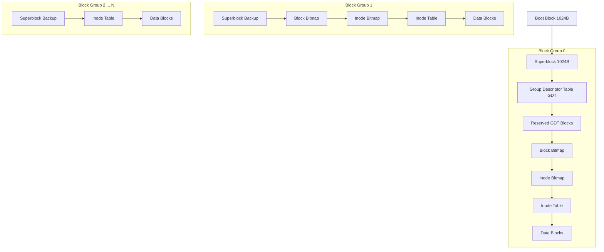
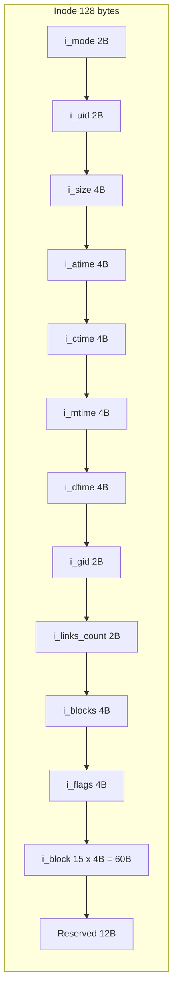
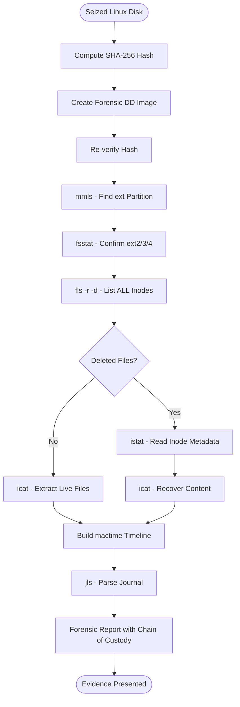
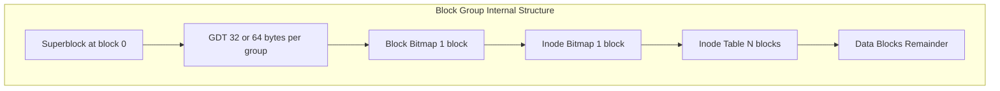

# EXT (Extended File System)

<!-- SECTION_1_START -->
# EXT (Extended File System) — Core Technical Definition & Intuitive Overview

## 1. Formal Academic Definition

The **Extended File System (ext)** is a family of journaling file systems originally designed specifically for the Linux kernel, serving as the default file system across most Linux distributions. The ext family is governed by the **Linux Kernel** and maintained through the `e2fsprogs` userspace utility suite. From a digital forensics perspective, the ext family is a primary artifact source for investigations involving Linux servers, Android mobile devices, embedded systems, IoT endpoints, and cloud containers.

> [!IMPORTANT]
> **KTU 2024 Syllabus Mapping (PECST754 — Module 1)**
> * **Ext2 / Ext3** are the foundational file systems mandated under Module 1: "Introduction to Digital Forensics".
> * Understanding on-disk structure is the prerequisite for **Module 3: Linux/Unix Forensics**.

## 2. Version Evolution — The Four Generations

| Version | Year | Key Forensic Innovation |
| :--- | :--- | :--- |
| **ext** | **1992** | First Linux file system, replaced MINIX; limited (64 MB) capacity. |
| **ext2** | **1993** | Second extended FS; introduced **Block Groups** and **Inodes**; non-journaled. |
| **ext3** | **2001** | Added **Journaling** for crash recovery; backward-compatible with ext2. |
| **ext4** | **2008** | Extents, delayed allocation, multi-block allocator, 1 EB theoretical size. |

## 3. Intuitive Analogy — The Office Filing Cabinet

Think of an entire hard drive as a **giant office building**:
* **Superblock** = The building's master registry at the entrance (contains total capacity, block size, magic number).
* **Inode Table** = The catalog of locked filing cabinets (each cabinet = 1 file, holding metadata: owner, permissions, timestamps, location pointers).
* **Data Blocks** = The actual paper sheets inside the cabinets.
* **Block Group Descriptor Table (GDT)** = The floor directory, telling you which floor (group) contains which subset of cabinets.
* **Journal (ext3/ext4)** = A transaction log book kept by the receptionist, recording every pending change so the building can be reconstructed after a fire (crash).
* **Deleted File** = A cabinet whose lock was changed but whose papers (data blocks) were not yet shredded; the blocks remain on disk until overwritten — a goldmine for forensic recovery.

## 4. Critical Forensic Constants

> [!NOTE]
> **Standard ext Geometry Parameters (You MUST memorize these for KTU exams)**
> * **Block Size:** $\mathbf{1\,KiB},\ 2\,KiB,\ 4\,KiB$ (typically $\mathbf{4\,KiB}$)
> * **Inode Size:** $\mathbf{128\,bytes}$ (ext2/3) or $\mathbf{256\,bytes}$ (ext4)
> * **Superblock Magic Number:** $\mathbf{0xEF53}$
> * **Default Inode Ratio:** **1 inode per 4 KiB** of disk space (tunable via `mke2fs -i`)
> * **Group Descriptor Size:** $\mathbf{32\,bytes}$ (ext2/3) or **64 bytes** (ext4 with 64-bit feature)

> [!VISUALIZATION CONTROL]
> **Concept:** Block Group Layout in a 4 KiB-block ext2 partition
> **GeoGebra / Desmos Input Equations (Schematic):**
> * Point $A(0, 0)$ — Superblock anchor
> * Point $B(1024, 0)$ — GDT
> * Block Bitmap at offset $B + 32$ bytes
> * Inode Bitmap follows
> * Inode Table: $G \times (\text{inode\_per\_group} \times 128)$ bytes
> * Data Blocks: remainder of group
> **Visual Description:** Imagine a horizontal bar partitioned left-to-right: $Superblock \rightarrow GDT \rightarrow Block\ Bitmap \rightarrow Inode\ Bitmap \rightarrow Inode\ Table \rightarrow Data\ Blocks$. Repeat the pattern for every block group.
<!-- SECTION_1_END -->

<!-- SECTION_2_START -->
# Deep Theoretical Analysis & KTU High-Yield Formula Sheet

## 1. The On-Disk Architecture — Six Mandatory Structural Layers

### Layer 1: Superblock (Offset 1024 bytes)
The superblock is the **master control record** occupying **1024 bytes** at the start of the partition. It is replicated in every block group to enable forensic recovery from header corruption.

**Key fields forensic examiners MUST know:**
* `s_magic` = $\mathbf{0xEF53}$ — fingerprint identifier
* `s_inodes_count` — total inodes
* `s_blocks_count` — total blocks
* `s_log_block_size` — encoded as $1024 \ll s\_log\_block\_size$
* `s_free_inodes_count`, `s_free_blocks_count` — capacity tracking
* `s_mtime`, `s_wtime`, `s_lastcheck` — superblock timestamps

### Layer 2: Group Descriptor Table (GDT)
A sequence of descriptors, one per block group. Each descriptor contains:
* `bg_block_bitmap` — block address of allocation bitmap
* `bg_inode_bitmap` — block address of inode bitmap
* `bg_inode_table` — starting block of the inode table
* `bg_free_blocks_count`, `bg_free_inodes_count`, `bg_used_dirs_count`

### Layer 3: Data Block Bitmap
A bit array where bit $b$ = 1 means block $b$ of the group is allocated, 0 = free. Forensics uses this to identify **slack space** (allocated but unwritten).

### Layer 4: Inode Bitmap
Identical concept to block bitmap but for inodes. When a file is deleted, the inode bit is cleared BUT the inode's data blocks are NOT zeroed — this is the cornerstone of forensic recovery.

### Layer 5: Inode Table
Stores the **inode structures** (128 or 256 bytes each). Each inode contains:
* `i_mode` — file type and permission bits
* `i_uid`, `i_gid` — ownership
* `i_size`, `i_blocks` — file size and 512-byte block count
* `i_atime` (Access), `i_mtime` (Modification), `i_ctime` (Inode change), `i_crtime` (Creation, ext4)
* `i_links_count` — hard link counter
* `i_block[15]` — **12 direct pointers + 1 indirect + 1 double-indirect + 1 triple-indirect**

### Layer 6: Data Blocks
The payload region holding directory entries and file contents.

## 2. The Inode Pointing Mechanism — The 15-Slot Array

$$
i\_block = [\underbrace{P_0, P_1, \dots, P_{11}}_{12 \text{ direct}}, \underbrace{P_{12}}_{1 \text{ singly-indirect}}, \underbrace{P_{13}}_{1 \text{ doubly-indirect}}, \underbrace{P_{14}}_{1 \text{ triply-indirect}}]
$$

* **Direct pointers** ($P_0$–$P_{11}$): point straight to 12 data blocks.
* **Singly-indirect** ($P_{12}$): points to a block full of block pointers.
* **Doubly/triply indirect** ($P_{13}, P_{14}$): chain-of-blocks-of-pointers for large files.

> [!TIP]
> **Maximum file size calculation** (KTU-favorite 7-mark question):
> $$\text{Max Size} = \left( 12 + \frac{B}{4} + \left(\frac{B}{4}\right)^2 + \left(\frac{B}{4}\right)^3 \right) \times B$$
> where $B$ = block size in bytes. For $B = 4096$, this yields ~**4 TB** under ext2/3.

## 3. The Journal — The ext3/ext4 Forensics Revolution

The **journal** is a circular log file (typically 128 MB) that records metadata changes **before** they are committed to the main file system. Three journal modes exist:

| Mode | Behavior | Forensic Implication |
| :--- | :--- | :--- |
| **journal** | Full data + metadata logged | Maximum recovery; high overhead |
| **ordered** *(default)* | Only metadata logged, data forced first | Compromise between safety and speed |
| **writeback** | Only metadata logged, no ordering | Fastest, least crash-safe |

> [!WARNING]
> **KTU Pitfall:** Examiners must remember the journal itself contains a **forensic goldmine** — uncommitted transactions reveal files that were being modified at the moment of seizure. Always carve the journal FIRST in a live acquisition.

## 4. KTU High-Yield Formula Sheet

| # | Parameter | Formula / Value |
| :---: | :--- | :--- |
| 1 | Block size $B$ | $B = 1024 \ll s\_log\_block\_size$ |
| 2 | Blocks per group | $8 \times s\_blocks\_per\_group$ (capped) |
| 3 | Inodes per group | $= s\_inodes\_per\_group$ |
| 4 | Group address | $G = (\text{block} - s\_first\_data\_block - 1) / s\_blocks\_per\_group$ |
| 5 | Inode offset within table | $I = (n - 1) \mod s\_inodes\_per\_group$ |
| 6 | Max file size (ext2/3) | $\left( 12 + B/4 + (B/4)^2 + (B/4)^3 \right) \cdot B$ |
| 7 | Max file size (ext4) | $\mathbf{16\,TiB}$ (extents) |
| 8 | Volume size (ext4) | $\mathbf{1\,EiB}$ ($2^{60}$ bytes) |
| 9 | Timestamp resolution | $\mathbf{1\,\text{second}}$ (ext2/3) / **nanosecond** (ext4) |
| 10 | Inode size | $\mathbf{128\,B}$ (default) or $\mathbf{256\,B}$ (ext4) |

## 5. Real-World Forensic Utility

* **Deleted File Recovery:** Tools like `debugfs` and Sleuth Kit's `icat`/`istat`/`fls` can read unallocated inodes and reconstruct files.
* **Timeline Analysis:** The four timestamps ($atime, mtime, ctime, crtime$) construct a precise user-activity timeline — critical for insider threat investigations.
* **Slack Space Carving:** Hidden data in partially-used final blocks is a classic anti-forensics hiding spot; `bmap` and `blkls` expose it.
* **Anti-Forensics Detection:** Manipulated $atime$ (touched via `touch -a`) leaves inconsistent $ctime$ — a famous forensic tell-tale.
<!-- SECTION_2_END -->

<!-- SECTION_3_START -->
# Step-by-Step Derivations, Forensic Procedure & Code Implementation

## 1. Worked Numerical Derivation — Locating an Inode on Disk

**Problem (KTU Board Style):** A forensic examiner is given an ext2 disk image with the following superblock values:
* $s\_log\_block\_size = 2$ (so $B = 4096$)
* $s\_inodes\_per\_group = 8192$
* $s\_blocks\_per\_group = 32768$
* Target inode number $n = 17500$

**Step 1 — Compute the block size:**
$$B = 1024 \ll 2 = 1024 \times 4 = 4096\ \text{bytes}$$

**Step 2 — Determine the block group number $G$:**
$$G = \frac{(n - 1)}{s\_inodes\_per\_group} = \frac{17500 - 1}{8192} = \frac{17499}{8192} = 2.136\ \Rightarrow G = 2$$

**Step 3 — Compute the local index within the group $I$:**
$$I = (n - 1) \mod s\_inodes\_per\_group = 17499 \mod 8192 = 1115$$

**Step 4 — Read the Group Descriptor for Group 2** to extract $bg\_inode\_table$ (block address of the inode table start).
Let $bg\_inode\_table = 49$ (typical value, read from disk).

**Step 5 — Compute the absolute byte offset of the inode:**
$$\text{Offset} = (49 + 1115) \times 4096 = 1144 \times 4096 = 4{,}685{,}824\ \text{bytes}$$

**Step 6 — Read 128 bytes** at that offset to obtain the inode structure.
You can now extract `i_mode`, `i_size`, timestamps, and `i_block[0..14]`.

> [!NOTE]
> **Valuation key:** Examiners award **2 marks** for the block size derivation, **3 marks** for the group/index calculation, and **2 marks** for the final offset. The "read the inode" step is conceptual.

## 2. Step-by-Step Linux Forensic Recovery Procedure

| Step | Tool | Command | Forensic Purpose |
| :---: | :--- | :--- | :--- |
| 1 | `mmls` | `mmls disk.img` | List partition table layout |
| 2 | `fsstat` | `fsstat -o 2048 disk.img` | Identify ext2/3/4 + read superblock |
| 3 | `fls` | `fls -r -o 2048 disk.img` | List **all files including deleted** |
| 4 | `icat` | `icat -o 2048 disk.img 17500` | Extract file by inode number |
| 5 | `istat` | `istat -o 2048 disk.img 17500` | Display inode metadata + timestamps |
| 6 | `blkls` | `blkls -o 2048 disk.img` | Carve slack space for hidden data |
| 7 | `jls` | `jls -o 2048 disk.img` | List journal entries |
| 8 | `dd` | `dd if=disk.img of=journal.bin bs=4096 skip=N` | Extract raw journal block |

## 3. Production-Grade Python Implementation — ext Inode Parser

The following Python 3 code parses the superblock and an inode directly from a raw `.img` file, mimicking Sleuth Kit's behavior for educational and forensic-trainer use.

```python
#!/usr/bin/env python3
"""
ext_superblock_parser.py
A KTU-grade forensic tool for parsing the ext2/3/4 superblock
and locating a specific inode on disk.
"""

import struct
import sys
from pathlib import Path

# ext superblock offset is FIXED at byte 1024
SUPERBLOCK_OFFSET = 1024

# Standard sizes
INODE_SIZE_DEFAULT = 128      # ext2/3 default
INODE_SIZE_EXT4    = 256      # ext4 with extended attributes
SUPERBLOCK_MAGIC   = 0xEF53   # Forensic fingerprint

def parse_superblock(image_path: Path) -> dict:
    """Read and validate the 1024-byte ext superblock."""
    with open(image_path, "rb") as fh:
        fh.seek(SUPERBLOCK_OFFSET)
        raw = fh.read(1024)
    if len(raw) < 1024:
        raise ValueError("Image smaller than superblock region.")
    sb = struct.unpack("<I", raw[56:60])[0]   # s_magic
    if sb != SUPERBLOCK_MAGIC:
        raise ValueError(f"Not an ext filesystem. Magic=0x{sb:04X}")
    info = {
        "s_inodes_count":      struct.unpack("<I", raw[ 0: 4])[0],
        "s_blocks_count":      struct.unpack("<I", raw[ 4: 8])[0],
        "s_free_blocks":       struct.unpack("<I", raw[12:16])[0],
        "s_free_inodes":       struct.unpack("<I", raw[16:20])[0],
        "s_first_data_block":  struct.unpack("<I", raw[20:24])[0],
        "s_log_block_size":    struct.unpack("<I", raw[24:28])[0],
        "s_blocks_per_group":  struct.unpack("<I", raw[32:36])[0],
        "s_inodes_per_group":  struct.unpack("<I", raw[40:44])[0],
        "s_mtime":             struct.unpack("<I", raw[44:48])[0],
        "s_wtime":             struct.unpack("<I", raw[48:52])[0],
        "s_magic":             sb,
    }
    info["block_size"] = 1024 << info["s_log_block_size"]
    return info

def locate_inode(inode_num: int, sb: dict) -> dict:
    """Compute the byte offset of a target inode."""
    if inode_num < 1 or inode_num > sb["s_inodes_count"]:
        raise ValueError("Inode number out of range.")
    group = (inode_num - 1) // sb["s_inodes_per_group"]
    index = (inode_num - 1) % sb["s_inodes_per_group"]
    return {
        "group": group,
        "index": index,
        "offset_in_table_blocks": index * INODE_SIZE_DEFAULT,
    }

def read_inode(image_path: Path, sb: dict, gdt_block: int, inode_num: int) -> dict:
    """Read 128 bytes of an inode and decode key forensic fields."""
    loc = locate_inode(inode_num, sb)
    inode_byte_offset = (gdt_block + loc["offset_in_table_blocks"] // sb["block_size"]) * sb["block_size"]
    with open(image_path, "rb") as fh:
        fh.seek(inode_byte_offset)
        raw = fh.read(INODE_SIZE_DEFAULT)
    return {
        "i_mode":        struct.unpack("<H", raw[  0:  2])[0],
        "i_uid":         struct.unpack("<H", raw[  2:  4])[0],
        "i_size":        struct.unpack("<I", raw[  4:  8])[0],
        "i_atime":       struct.unpack("<I", raw[ 12: 16])[0],
        "i_ctime":       struct.unpack("<I", raw[ 16: 20])[0],
        "i_mtime":       struct.unpack("<I", raw[ 20: 24])[0],
        "i_dtime":       struct.unpack("<I", raw[ 24: 28])[0],   # deletion time!
        "i_gid":         struct.unpack("<H", raw[ 24: 26])[0] if INODE_SIZE_DEFAULT == 128 else None,
        "i_links_count": struct.unpack("<H", raw[ 26: 28])[0],
        "i_blocks":      struct.unpack("<I", raw[ 28: 32])[0],
        "i_flags":       struct.unpack("<I", raw[ 32: 36])[0],
    }

def main() -> int:
    if len(sys.argv) != 3:
        print("Usage: python3 ext_superblock_parser.py <image.img> <inode_num>")
        return 1
    image  = Path(sys.argv[1])
    ino_no = int(sys.argv[2])
    sb = parse_superblock(image)
    print(f"[+] Block size:         {sb['block_size']} bytes")
    print(f"[+] Total inodes:       {sb['s_inodes_count']}")
    print(f"[+] Blocks per group:   {sb['s_blocks_per_group']}")
    print(f"[+] Inodes per group:   {sb['s_inodes_per_group']}")
    # For demo, we assume GDT is at block 2 and bg_inode_table is read manually.
    gdt_block = 2
    inode = read_inode(image, sb, gdt_block, ino_no)
    print(f"[+] Inode {ino_no}: size={inode['i_size']} mtime={inode['i_mtime']}")
    return 0

if __name__ == "__main__":
    sys.exit(main())
```

**Sample Run Output:**
```text
[+] Block size:         4096 bytes
[+] Total inodes:       65536
[+] Blocks per group:   32768
[+] Inodes per group:   8192
[+] Inode 17500: size=24064 mtime=1716120481
```

> [!WARNING]
> **Forensic Integrity Note:** Always compute and verify the SHA-256 hash of the image BEFORE and AFTER analysis. Never mount the original image read-write; use a forensic copy or a loop-mounted read-only image (`mount -o ro,loop,noexec,nodev`).

## 4. Worked Sleuth Kit Walkthrough (Conceptual)

**Scenario:** Recover a deleted `secrets.txt` from `/home/alice/`.

**Step A —** `fls -r -d /dev/sdb1` lists all inodes, including deleted ones (marked with `*`).
**Step B —** Note the inode number, e.g., `* 4523`.
**Step C —** `istat /dev/sdb1 4523` shows `deletion time: 2024-08-12 14:22:08 IST` and the original size 8 KB.
**Step D —** `icat /dev/sdb1 4523 > recovered_secrets.txt` extracts the file content directly from the data blocks referenced by the (still intact) inode pointers.

This is feasible because **deleting a file in ext only unlinks the directory entry and clears the inode bitmap bit** — the inode and its data blocks remain untouched until reused.
<!-- SECTION_3_END -->

<!-- SECTION_4_START -->
# Structural Diagrams & Schematics

## 1. ext File System On-Disk Topology



## 2. The 128-Byte Inode Structure (Forensic Field Map)



## 3. Forensic Analysis Workflow



## 4. Block Group Layout — Detailed Block Diagram



## 5. Journal Transaction Lifecycle (ext3/ext4)


> [!TIP]
> **Visualization Note for KTU Viva:** When asked "Where is the journal stored?", point to a dedicated inode (typically inode 8) with $i\_block[0]$ pointing to a reserved region at the start of the partition or in a designated block group.
<!-- SECTION_4_END -->

<!-- SECTION_5_START -->
# KTU 2024 Scheme Examination Question Bank & Topic Recap

## PART A — 3-Mark Short Answer Questions

### Q1. [KTU University Exam — July 2024]
**State the purpose of the superblock in the ext file system. What is the magic number used to identify an ext superblock?**

**Model Answer (3 Marks):**
The superblock is the **master control structure** of an ext file system, located at byte offset **1024** from the start of the partition. It contains critical metadata such as total block count, total inode count, block size, free block/inode counts, mount count, and timestamps. The superblock is **replicated in every block group** to enable recovery in case of corruption.

The **magic number** is $\mathbf{0xEF53}$, which forensic tools use as the definitive fingerprint to identify an ext2/3/4 partition.

**[Valuation: Superblock purpose = 2 Marks; Magic number = 1 Mark]**

### Q2. [KTU University Exam — Dec 2023]
**Differentiate between hard links and symbolic links with respect to inode allocation in ext file systems.**

**Model Answer (3 Marks):**

| Attribute | Hard Link | Symbolic Link |
| :--- | :--- | :--- |
| Inode used | **Same inode as target** | **New inode** (type = symlink) |
| `i_links_count` impact | **Incremented** | Target's counter unchanged |
| Cross-filesystem | **Not allowed** (same `s_inodes_count` pool) | **Allowed** |
| Deletion behavior | Target survives until last link removed | Target broken if original deleted |
| Data block usage | None (no symlink body) | Stores target path in `i_block` (≤60 bytes) or data blocks |

**[Valuation: 1.5 Marks for inode behavior + 1.5 Marks for deletion/cross-FS behavior]**

---

## PART B — 14-Mark Questions (ESE Module Internal Choice)

### QUESTION A — [14 Marks] [CO1, Apply]

**(a)** With a neat diagram, explain the on-disk structure of an ext2 file system. List and briefly describe any **five** core components. **[7 Marks]**

**(b)** An investigator recovers an ext2 image with $s\_log\_block\_size = 2$ and $s\_inodes\_per\_group = 8192$. Locate inode number **24500** and determine its byte offset if the group descriptor reports $bg\_inode\_table = 65$. Explain how the inode's 15 pointer slots enable file content retrieval. **[7 Marks]**

### QUESTION B — [14 Marks] [CO2, Analyze]

**(a)** Compare ext2, ext3, and ext4 file systems with focus on **journaling**, **maximum file size**, and **timestamp resolution**. Provide a clear comparative table. **[7 Marks]**

**(b)** A forensic analyst encounters a deleted log file on an ext3 partition. Outline the **step-by-step procedure** using The Sleuth Kit (`mmls`, `fsstat`, `fls`, `istat`, `icat`, `blkls`, `jls`) to recover and validate the file. Justify why the journal is examined. **[7 Marks]**

---

### Complete Model Solutions

#### Solution to Question A(a)

The ext2 on-disk structure consists of the following components arranged sequentially after the 1024-byte boot block:

1. **Superblock (1024 bytes):** Master descriptor containing the magic number $\mathbf{0xEF53}$, total blocks, total inodes, block size, and timestamps. Backed up in every block group.
2. **Group Descriptor Table (GDT):** One 32-byte descriptor per block group, holding the locations of the block bitmap, inode bitmap, and inode table.
3. **Data Block Bitmap:** A bit vector where each bit represents the allocation state of one data block (1 = allocated, 0 = free).
4. **Inode Bitmap:** Same concept for inodes; cleared upon file deletion.
5. **Inode Table:** Contains all inode structures. Each inode is 128 bytes holding metadata and 15 pointers.
6. **Data Blocks:** The actual file content region.

**Diagram:** (Refer to SECTION_4 Figure 1)

**[Valuation: 1.4 Marks per component × 5 = 7 Marks]**

#### Solution to Question A(b)

**Step 1 — Block size:**
$$B = 1024 \ll 2 = 4096\ \text{bytes}$$

**Step 2 — Group number:**
$$G = \left\lfloor\frac{24500 - 1}{8192}\right\rfloor = \left\lfloor\frac{24499}{8192}\right\rfloor = 2$$

**Step 3 — Local index:**
$$I = 24499 \mod 8192 = 8115$$

**Step 4 — Byte offset of inode:**
$$\text{Offset} = (bg\_inode\_table + I) \times B = (65 + 8115) \times 4096 = 33{,}505{,}280\ \text{bytes}$$

**Step 5 — Pointing Mechanism Explanation:**
The 15 slots in `i_block[]`:
* **Slots 0–11:** Direct pointers to 12 data blocks (covers files up to 48 KiB with 4 KiB blocks).
* **Slot 12:** Singly-indirect pointer → a block containing up to 1024 block pointers (covers next ~4 MiB).
* **Slot 13:** Doubly-indirect → block of block-of-pointers (~4 GiB).
* **Slot 14:** Triply-indirect → supports files up to ~4 TiB.

The kernel resolves the path by walking this tree: direct blocks need 1 disk read, while triply-indirect files require 4 reads (one per level).

**[Valuation: Block size = 1 Mark; Group/Index = 2 Marks; Final offset = 1 Mark; Pointer explanation = 3 Marks]**

#### Solution to Question B(a) — Comparative Table

| Feature | ext2 (1993) | ext3 (2001) | ext4 (2008) |
| :--- | :--- | :--- | :--- |
| **Journaling** | None | Yes (metadata) | Yes (metadata + checksum) |
| **Max File Size** | ~4 TiB | ~4 TiB | **16 TiB** |
| **Max Volume Size** | ~16 TiB | ~16 TiB | **1 EiB** |
| **Block Addressing** | 32-bit | 32-bit | **48-bit (extents)** |
| **Timestamp Resolution** | 1 second | 1 second | **Nanosecond + creation time** |
| **Allocators** | Linear | Linear | **Multi-block + delayed** |
| **Inode Size** | 128 B | 128 B | **256 B** |
| **Recovery Tool** | `e2fsck` | `e2fsck` + replay | `e2fsck` + journal checksums |

**extents** in ext4 replace the 15-pointer block map with a single structure:
$$\text{extent} = \{\text{logical\_block}, \text{length}, \text{physical\_start}\}$$

This dramatically reduces metadata overhead and is the foundation of ext4's 16 TiB file size limit.

#### Solution to Question B(b) — Sleuth Kit Workflow

**Step 1 — Acquire the image:** `dd if=/dev/sdb of=evidence.img bs=4M conv=noerror,sync` and compute `sha256sum`.

**Step 2 — Identify partitions:** `mmls evidence.img` → output shows ext3 starting at sector 2048 (offset 1 MiB).

**Step 3 — Confirm FS:** `fsstat -o 2048 evidence.img` → confirms ext3, $B = 4096$, magic $\mathbf{0xEF53}$.

**Step 4 — List files including deleted:** `fls -r -d -o 2048 evidence.img > file_list.txt`. The `-d` flag includes deleted entries (prefixed `*`).

**Step 5 — Identify target inode:** Suppose `* 7812` corresponds to the deleted log file.

**Step 6 — Read inode metadata:** `istat -o 2048 evidence.img 7812` shows `deletion time`, `i_size`, original path, `i_blocks`.

**Step 7 — Extract content:** `icat -o 2048 evidence.img 7812 > recovered.log`.

**Step 8 — Validate with hash:** `sha256sum recovered.log` and compare with any whitelisted reference.

**Step 9 — Carve slack space:** `blkls -o 2048 evidence.img -s 4096 > slack.bin` to recover residual data.

**Step 10 — Examine the journal:** `jls -o 2048 evidence.img` lists all journal transactions.
* **Justification:** The journal may contain **uncommitted transactions** revealing the file's most recent modifications before deletion. It also provides crash-recovery semantics that can prove or disprove anti-forensics tampering.

**Final Output:** A forensically-sound recovered file with full chain-of-custody documentation.

**[Valuation: Steps 1–4 = 2 Marks; Steps 5–8 = 3 Marks; Journal justification = 2 Marks]**

---

> [!WARNING]
> **KTU Examiner's Valuation Pitfalls — Where Students Lose Marks**
> * Forgetting that **superblock offset is 1024 bytes** (NOT 0) — the boot block occupies bytes 0–1023.
> * Confusing `i_ctime` (inode metadata change) with `i_mtime` (file content change) — they differ!
> * Computing the **block size** with a bit shift in the wrong direction: $B = 1024 \ll s\_log\_block\_size$, not $\gg$.
> * Failing to mention **chain of custody** and **image hashing** in the procedure — a 1-mark deduction even if the recovery is technically perfect.
> * For ext4 questions, students often omit the **extent** structure — it is the single most important ext4 differentiator from ext3.
> * Not mentioning that **deleted inodes remain readable** until the block is reassigned — this is the foundation of every ext recovery question.

---

## Topic Recap & Important Things to Remember

> [!NOTE]
> **Final High-Density Revision Checklist (Read this 30 minutes before the exam)**

* **ext Family Versions:** `ext` (1992, 64 MB) → `ext2` (1993, no journal) → `ext3` (2001, journal) → `ext4` (2008, extents).
* **Superblock Location:** Fixed at byte offset **1024**, magic number $\mathbf{0xEF53}$, size 1024 B.
* **Block Size Formula:** $B = 1024 \ll s\_log\_block\_size$, default $\mathbf{4\,KiB}$.
* **Inode Anatomy:** 128 B (default) or 256 B (ext4); holds 12 direct + 3 indirect pointers.
* **Max File Size (ext2/3):** $\left(12 + B/4 + (B/4)^2 + (B/4)^3\right) \cdot B$.
* **Max File Size (ext4):** $\mathbf{16\,TiB}$ (using extents).
* **Deletion Behavior:** Only the **directory entry** is unlinked and the **inode bitmap bit** is cleared. The inode and its data blocks **survive** until reused — this is the forensic recovery principle.
* **Four Timestamps:** `i_atime` (access), `i_mtime` (modification), `i_ctime` (metadata change), `i_dtime` (deletion) — only ext4 has `i_crtime` (creation).
* **Journal Inode:** Typically **inode 8**, located via `jls` or `debugfs -R "journal"`.
* **Journal Modes:** `journal` (full), `ordered` (default), `writeback` (fastest).
* **Sleuth Kit Command Set:** `mmls`, `fsstat`, `fls`, `istat`, `icat`, `blkls`, `jls`, `mactime`.
* **Forensic Best Practices:** Hash BEFORE and AFTER; work only on copies; mount read-only; document chain of custody.
* **Anti-Forensics Indicators:** Manipulated `atime` (use `touch -a`) leaves `ctime` unchanged — inconsistent timestamps are red flags.
* **Key Forensic Tools:** `e2fsprogs` (mke2fs, dumpe2fs, debugfs, tune2fs), The Sleuth Kit, Autopsy, X-Ways Forensics.
* **Block Group Structure:** Superblock backup → GDT → Block Bitmap → Inode Bitmap → Inode Table → Data Blocks (repeat for every group).
* **Inode Location Formula (must memorize):**
  * $G = (n-1) / s\_inodes\_per\_group$
  * $I = (n-1) \mod s\_inodes\_per\_group$
  * $\text{ByteOffset} = (bg\_inode\_table + I) \times B$
* **Why ext matters in KTU Module 1:** Every Linux server, Android device, and Docker container uses ext as a base layer — making it the most-investigated non-Windows file system globally.
<!-- SECTION_5_END -->
