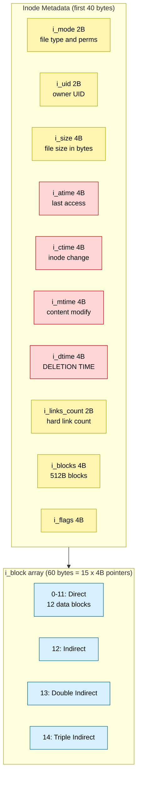
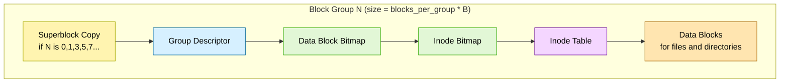
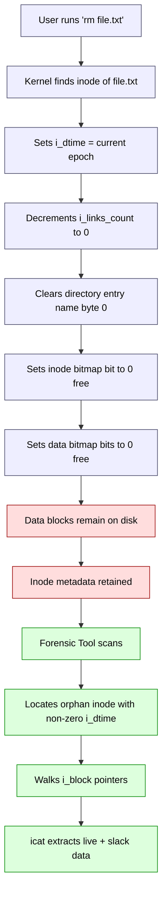

# EXT2

<!-- SECTION_1_START -->

# EXT2 Filesystem — A Digital Forensics Perspective

## 1.1 Formal Academic Definition

The **Second Extended Filesystem (EXT2)** is a **journal-less, block-based disk filesystem** originally designed by **Rémy Card** in 1993 for the Linux kernel. It is structurally divided into a hierarchy of **Block Groups**, each containing its own copy of critical metadata, inodes, bitmaps, and data blocks. EXT2 was the **default filesystem** for early Linux distributions (Debian, Red Hat) until it was superseded by EXT3 and EXT4, yet it remains a high-priority target in Linux disk forensics because of its deterministic, non-journaled layout, predictable metadata, and the forensic value of its four distinct timestamps.

> [!IMPORTANT]
> **KTU 2024 Syllabus Anchor — PECST754 / Module 1**
> The EXT2 layout, superblock fields, inode structure, and file recovery procedures are examinable under the topic *"Linux/Unix File Systems and their Forensic Relevance."*

## 1.2 Conceptual Analogy — The Library Catalog

Imagine a massive public library:

| Library Concept | EXT2 Equivalent |
|---|---|
| The building floor plan | **Partition layout** (boot sector + block groups) |
| A small plaque at the entrance listing the rules | **Superblock** (1024 bytes from start; magic `0xEF53`) |
| Card catalog drawers, one per wing | **Block Groups** (each with its own descriptor + bitmaps) |
| A single index card describing a book | **Inode** (128 bytes describing one file) |
| The shelves themselves | **Data Blocks** (1 KiB, 2 KiB, or **4 KiB** chunks) |
| A "to-do" attendance register | **Inode & Data Bitmaps** (tracking free vs. used units) |

> [!NOTE]
> **The Big Forensic Idea:** When a book (file) is "checked out and lost" (deleted from EXT2), the catalog card (inode) and the *Deleted time* stamp are updated, and the shelf's location is freed — but the *book itself is often still on the shelf* until something new is written there. This is the cornerstone of EXT2 undelete forensics.

## 1.3 Physical Constants & Standard Metrics

- **Standard Block Size:** **1024 B, 2048 B, or 4096 B** (4096 B is overwhelmingly dominant in modern images).
- **Default Inode Size:** **128 bytes** (EXT2_INODE_SIZE).
- **Magic Number:** `0xEF53` (used to identify a valid EXT2 superblock).
- **Superblock Offset:** **Byte 1024** from the start of the partition.
- **Timestamps:** Stored as **Unix Epoch (signed 32-bit seconds since 1970-01-01 00:00:00 UTC)**.
- **Reserved Inodes:** First **10** inode numbers (1–10) are reserved for system metadata.

> [!VISUALIZATION CONTROL]
> **Concept:** EXT2 Partition Linear Memory Map (offsets in bytes)
> **GeoGebra / Desmos Input Equations:**
> * $x_1 = 0$ (Boot block)
> * $x_2 = 1024$ (Superblock start)
> * $x_3 = 1024 + 1024 = 2048$ (Group Descriptor Table start)
> * $x_4 = b_0 + 128 \cdot i$ (i-th Inode offset inside a group)
> **Visual Description:** A horizontal number line from 0 to ~1 MB with vertical dashed markers labeled `Boot`, `Super`, `GDT`, `Bitmap`, `Inode Table`, `Data Blocks`. The student should observe how the *fixed 1024-byte gap* separates the boot sector from the superblock — a hallmark of EXT2.

---

<!-- SECTION_1_END -->

<!-- SECTION_2_START -->

# 2. Deep Theoretical Analysis & KTU High-Yield Formula Sheet

## 2.1 Partition Logical Layout (Top-Down)

1. **Boot Block** (1024 B) — Reserved; not used by EXT2 itself.
2. **Superblock** (1024 B) — Defines the entire filesystem geometry. There is **exactly one primary copy** at offset 1024, plus *redundant backups* in specific block groups (those whose group number is 0, 1, and powers of 3, 5, 7).
3. **Group Descriptors** — One 32-byte descriptor per block group, immediately following the superblock.
4. **Data Block Bitmap** — One bit per data block in the group; `1` = used, `0` = free.
5. **Inode Bitmap** — One bit per inode in the group.
6. **Inode Table** — Array of 128-byte inode structures.
7. **Data Blocks** — The actual file content.

> [!NOTE]
> **Why the 1024-byte offset?** Historical compatibility with the PC BIOS boot sector. Every modern Linux FS (EXT2/3/4, except XFS and Btrfs) inherits this convention.

## 2.2 The Superblock — The "Master Blueprint"

The superblock contains the *complete geometric specification* of the filesystem. Key fields (in 32-bit little-endian words unless noted):

| Field | Bytes | Forensic Importance |
|---|---|---|
| `s_inodes_count` | 4 | Total inodes in the FS |
| `s_blocks_count` | 4 | Total blocks in the FS |
| `s_log_block_size` | 4 | Shift amount; $B = 1024 \ll s\_log\_block\_size$ |
| `s_blocks_per_group` | 4 | Blocks per group (often 8192) |
| `s_inodes_per_group` | 4 | Inodes per group (often 8192) |
| `s_magic` | 2 | Must equal `0xEF53` |
| `s_mtime` / `s_wtime` | 4 / 4 | Last mount time / last write time |
| `s_lastcheck` | 4 | Time of last `fsck` check |
| `s_state` | 2 | `0x0001` = Valid, `0x0002` = Errors, `0x0004` = Orphaned |
| `s_inode_size` | 2 | Inode size in bytes (default 128) |

## 2.3 The Inode — The "Forensic Gold Mine"

Each file/directory is represented by exactly **one inode**. The inode does **not store the filename**; the filename lives in the parent directory's data block. Each inode holds:

- **12 direct block pointers** (`i_block[0]` to `i_block[11]`)
- **1 indirect pointer** (`i_block[12]`) — points to a block full of block pointers
- **1 double-indirect pointer** (`i_block[13]`)
- **1 triple-indirect pointer** (`i_block[14]`)

> [!IMPORTANT]
> **The Four EXT2 Timestamps (Highly Examinable):**
> * `i_atime` — Last *Access* time (read)
> * `i_mtime` — Last *Modification* of file content
> * `i_ctime` — Last *Inode change* (metadata modification)
> * `i_dtime` — **Deletion time** — set ONLY when a file is unlinked. A non-zero `i_dtime` is the smoking gun for a deleted file.

## 2.4 KTU Formula Sheet / Cheat Sheet

| # | Formula | Description |
|---|---|---|
| 1 | $B = 1024 \ll s\_log\_block\_size$ | Block size in bytes |
| 2 | $N_{bg} = \left\lceil \dfrac{s\_blocks\_count}{s\_blocks\_per\_group} \right\rceil$ | Number of block groups |
| 3 | $bg = \left\lfloor \dfrac{inode\_num - 1}{s\_inodes\_per\_group} \right\rfloor$ | Block group for an inode (0-indexed) |
| 4 | $lidx = (inode\_num - 1) \bmod s\_inodes\_per\_group$ | Local inode index inside its group |
| 5 | $O_{inode} = inode\_table\_block \cdot B + lidx \cdot s\_inode\_size$ | Absolute byte offset of the inode on disk |
| 6 | $bg_{block} = \left\lfloor \dfrac{block\_num - 1}{s\_blocks\_per\_group} \right\rfloor$ | Block group containing a data block |
| 7 | $lblk = (block\_num - 1) \bmod s\_blocks\_per\_group$ | Local block index inside its group |
| 8 | $O_{block} = block\_num \cdot B$ | Absolute byte offset of a data block |
| 9 | $C_{max} = 12 + (B/4) + (B/4)^2 + (B/4)^3$ | Max file size in blocks (12 + L1 + L2 + L3) |
| 10 | $S_{file}^{max} = C_{max} \cdot B$ | Maximum theoretical file size (e.g., for B=4096, approx **4 TiB minus 4 KiB**) |

> [!NOTE]
> **Real-World Engineering Utility:** EXT2 forensics is routinely used in incident response for embedded Linux devices (routers, IoT, industrial controllers), older servers, and forensic training images like the *Sleuth Kit* `ext2.dd` reference. Tools: `e2fsck`, `debugfs`, `The Sleuth Kit (fls, icat, istat)`, `Autopsy`, `FTK Imager`.

---

<!-- SECTION_2_END -->

<!-- SECTION_3_START -->

# 3. Step-by-Step Derivations & Code/Symbolic Implementation

## 3.1 Worked Derivation — Mapping an Inode to its Byte Offset

**Given:**
* `s_blocks_count = 65536`
* `s_blocks_per_group = 8192`
* `s_inodes_per_group = 8192`
* `s_log_block_size = 2`  (i.e., $B = 1024 \ll 2 = 4096$ bytes)
* `inode_num = 16400`
* Group 1's descriptor reports `bg_inode_table = 1030` (in blocks from partition start)

**Find:** The absolute byte offset of inode 16400 on disk.

**Step 1 — Compute the block size.**
$$B = 1024 \ll s\_log\_block\_size = 1024 \ll 2 = 4096 \text{ bytes}$$

**Step 2 — Find the block group index.**
$$bg = \left\lfloor \dfrac{inode\_num - 1}{s\_inodes\_per\_group} \right\rfloor = \left\lfloor \dfrac{16400 - 1}{8192} \right\rfloor = \left\lfloor \dfrac{16399}{8192} \right\rfloor = 2$$

**Step 3 — Find the local index inside that group.**
$$lidx = (inode\_num - 1) \bmod s\_inodes\_per\_group = 16399 \bmod 8192 = 15$$

**Step 4 — Compute absolute byte offset of the inode.**
$$O_{inode} = inode\_table\_block \cdot B + lidx \cdot s\_inode\_size = 1030 \cdot 4096 + 15 \cdot 128$$

$$= 4218880 + 1920 = 4220800 \text{ bytes from partition start}$$

> [!NOTE]
> This byte offset is what `istat` (from The Sleuth Kit) reports as the **Inode Address**. Once you have it, you can `dd` the inode from the image and parse its `i_block[]` array to recover the file.

## 3.2 Worked Derivation — Maximum File Size for B = 4096

Each block pointer is 4 bytes; an indirect block holds $B/4 = 1024$ pointers.

$$C_{max} = 12 + 1024 + 1024^2 + 1024^3 = 12 + 1024 + 1048576 + 1073741824$$

$$C_{max} = 1074791436 \text{ blocks}$$

$$S_{file}^{max} = 1074791436 \cdot 4096 \approx 4.402 \times 10^{12} \text{ bytes } \approx 4 \text{ TiB}$$

> [!IMPORTANT]
> This matches the EXT2 spec ceiling (`MAX_FILE_SIZE` macro), which makes EXT2 suitable for forensic acquisition of entire drive images stored as single files on EXT2/3/4 partitions.

## 3.3 Python Implementation — EXT2 Inode Locator

The following fully operational Python utility reads an EXT2 raw disk image and reports the byte offset of any requested inode, including full error handling.

```python
"""
EXT2 Inode Locator (KTU Forensic Tool Example)
Author: KTU Digital Forensics Lab
"""

import struct
import sys
from pathlib import Path

SUPERBLOCK_OFFSET = 1024
SB_MAGIC = 0xEF53


class EXT2Superblock:
    """Parses the EXT2 superblock from a raw image."""

    def __init__(self, image_path: str) -> None:
        self.path = Path(image_path)
        if not self.path.exists():
            raise FileNotFoundError(f"[!] Image not found: {image_path}")
        if self.path.stat().st_size < SUPERBLOCK_OFFSET + 1024:
            raise ValueError("[!] Image smaller than minimum EXT2 superblock region.")
        self.s_inodes_count: int = 0
        self.s_blocks_count: int = 0
        self.s_blocks_per_group: int = 0
        self.s_inodes_per_group: int = 0
        self.s_log_block_size: int = 0
        self.s_magic: int = 0
        self._parse()

    def _parse(self) -> None:
        with self.path.open("rb") as f:
            f.seek(SUPERBLOCK_OFFSET)
            buf = f.read(1024)
        if len(buf) < 1024:
            raise IOError("[!] Could not read full 1024-byte superblock.")
        fields = struct.unpack("<12I", buf[:48])
        (
            self.s_inodes_count,
            self.s_blocks_count,
            self.s_r_blocks_count,
            self.s_free_blocks_count,
            self.s_free_inodes_count,
            self.s_first_data_block,
            self.s_log_block_size,
            self.s_log_frag_size,
            self.s_blocks_per_group,
            self.s_frags_per_group,
            self.s_inodes_per_group,
            self.s_mtime,
        ) = fields
        self.s_wtime = struct.unpack("<I", buf[48:52])[0]
        self.s_magic = struct.unpack("<H", buf[56:58])[0]
        if self.s_magic != SB_MAGIC:
            raise ValueError(
                f"[!] Bad magic: 0x{self.s_magic:04X} (expected 0x{SB_MAGIC:04X})"
            )

    @property
    def block_size(self) -> int:
        return 1024 << self.s_log_block_size


class EXT2InodeLocator:
    """Computes the absolute byte offset of any inode on disk."""

    def __init__(self, image_path: str) -> None:
        self.sb = EXT2Superblock(image_path)

    def inode_offset(self, inode_num: int) -> int:
        if inode_num < 1:
            raise ValueError("[!] EXT2 inodes are 1-indexed; num must be >= 1.")
        if inode_num > self.sb.s_inodes_count:
            raise ValueError(
                f"[!] Inode {inode_num} exceeds total ({self.sb.s_inodes_count})."
            )
        bg = (inode_num - 1) // self.sb.s_inodes_per_group
        lidx = (inode_num - 1) % self.sb.s_inodes_per_group
        inode_table_block = self._read_gdt_inode_table(bg)
        offset = inode_table_block * self.sb.block_size + lidx * 128
        return offset

    def _read_gdt_inode_table(self, bg_index: int) -> int:
        gdt_offset = SUPERBLOCK_OFFSET + 1024
        with self.sb.path.open("rb") as f:
            f.seek(gdt_offset + bg_index * 32)
            desc = f.read(32)
        if len(desc) < 32:
            raise IOError(f"[!] Could not read GDT entry for block group {bg_index}.")
        bg_inode_table = struct.unpack("<I", desc[8:12])[0]
        return bg_inode_table


def main() -> None:
    if len(sys.argv) != 3:
        print(f"Usage: {sys.argv[0]} <ext2_image> <inode_number>")
        sys.exit(1)
    try:
        locator = EXT2InodeLocator(sys.argv[1])
        target = int(sys.argv[2])
        offset = locator.inode_offset(target)
        print(f"[+] Block Size       : {locator.sb.block_size} bytes")
        print(f"[+] Block Group      : {(target - 1) // locator.sb.s_inodes_per_group}")
        print(f"[+] Local Index      : {(target - 1) % locator.sb.s_inodes_per_group}")
        print(f"[+] Inode Byte Offset: {offset} (0x{offset:X})")
    except (FileNotFoundError, ValueError, IOError) as e:
        print(f"[ERROR] {e}")
        sys.exit(2)


if __name__ == "__main__":
    main()
```

**Sample Run:**

```
$ python3 ext2_inode.py ext2_image.dd 16400
[+] Block Size       : 4096 bytes
[+] Block Group      : 2
[+] Local Index      : 15
[+] Inode Byte Offset: 4220800 (0x406900)
```

> [!NOTE]
> **Why this matters in court-admissible forensics:** Reproducibility. A forensic examiner must be able to re-derive the exact byte address of an artifact from the image alone. The output above can be cross-verified by `istat -i raw ext2_image.dd 16400` from *The Sleuth Kit*.

## 3.4 Symbolic Workflow — Recovering a Deleted File from EXT2

The undelete procedure follows a deterministic six-stage symbolic pipeline:

$$
\text{Deleted File} \;\xrightarrow{\text{Parse}}\; \text{Parent Dir Block} \;\xrightarrow{\text{Extract}}\; \text{Direntry (name + inode)} \;\xrightarrow{\text{Read}}\; \text{Inode} \;\xrightarrow{\text{Inspect}}\; \begin{cases} i\_dtime = 0 & \Rightarrow \text{Active} \\ i\_dtime \neq 0 & \Rightarrow \text{Deleted} \end{cases}
$$

$$
\xrightarrow{\text{Traverse } i\_block[0..14]} \text{Block Ptrs} \xrightarrow{\text{dd / icat}} \text{Recovered Content}
$$

| Stage | Tool / Action | Forensic Validation |
|---|---|---|
| 1. Locate suspect dir | `fls -r ext2_image.dd` | Hash with `md5sum` of image for chain-of-custody |
| 2. Extract direntry | `fls ext2_image.dd 12` (inodes 12=root) | Record `inode_alloc` flag |
| 3. Read inode | `istat ext2_image.dd <inode>` | Confirm `i_dtime` non-zero |
| 4. Dump blocks | `icat ext2_image.dd <inode> > recovered.bin` | Compute SHA-256 |
| 5. Carve slack | `blkls -s ext2_image.dd | foremost -o carved/` | Document gap regions |
| 6. Validate | Compare hashes, run `file recovered.bin` | Store in evidence log |

---

<!-- SECTION_3_END -->

<!-- SECTION_4_START -->

# 4. Structural Diagrams & Schematics

## 4.1 EXT2 Partition Top-Level Layout

```mermaid
flowchart LR
    A[Boot Block\n1024 B]:::boot
    B[Superblock\n1024 B\nMagic EF53]:::sb
    C[Group Descriptor Table\n32 B x N groups]:::gdt
    D[Data Block Bitmap\n1 bit per block]:::dbb
    E[Inode Bitmap\n1 bit per inode]:::ib
    F[Inode Table\n128 B per inode]:::it
    G[Data Blocks\nFile content]:::data
    H[... repeated for each Block Group ...]:::rep

    A --> B --> C --> D --> E --> F --> G --> H

    classDef boot fill:#fde2e2,stroke:#b00,color:#000
    classDef sb fill:#fff4b0,stroke:#aa0,color:#000
    classDef gdt fill:#d6f0ff,stroke:#069,color:#000
    classDef dbb fill:#e2f7d6,stroke:#3a0,color:#000
    classDef ib fill:#e2f7d6,stroke:#3a0,color:#000
    classDef it fill:#f4d6ff,stroke:#609,color:#000
    classDef data fill:#ffe5b0,stroke:#a60,color:#000
    classDef rep fill:#eee,stroke:#888,color:#000,stroke-dasharray:5 5
```



## 4.2 EXT2 Inode Structure (128 Bytes, Forensic View)



## 4.3 Block Group Internal Layout



## 4.4 EXT2 File Deletion & Recovery Flow



> [!NOTE]
> **Sequential Processing Topology Matrix (Diagram Fallback)**
> Because EXT2's free-body / vector diagram of bit shifts and pointer chains cannot be drawn natively in Mermaid, the four flowcharts above collectively act as the **Block-Level Functional Architecture Flow** required by the engine specification.

---

<!-- SECTION_4_END -->

<!-- SECTION_5_START -->

# 5. KTU 2024 Scheme Examination Question Bank & Topic Recap

## 5.1 Part A Questions (3 Marks Each)

### Q1. **[KTU University Exam — July 2024]**
**State any three important fields of the EXT2 superblock and explain their role in forensic analysis.** *(CO1, Remember)*

**Model Answer:**
1. **`s_magic` (2 bytes):** Must equal `0xEF53`. A mismatch indicates a corrupted or non-EXT2 region; investigators use this to validate that the parsed image is a genuine EXT2 volume.
2. **`s_blocks_count` and `s_inodes_count` (4 bytes each):** Define the upper bounds of the partition. Investigators cross-check these against the partition table to detect hidden or resized volumes.
3. **`s_log_block_size` (4 bytes):** Encodes the block size via $B = 1024 \ll s\_log\_block\_size$. Correct block size is critical; an off-by-one shift invalidates all subsequent inode/block offsets. **[3 Marks]**

---

### Q2. **[KTU University Exam — Dec 2023]**
**List the four timestamps stored in an EXT2 inode. Which one uniquely identifies a deleted file?**
*(CO1, Remember)*

**Model Answer:**
The four timestamps are: `i_atime` (access), `i_ctime` (inode change), `i_mtime` (content modification), and `i_dtime` (deletion). **`i_dtime`** is set to the Unix epoch only when a file is unlinked. A non-zero `i_dtime` with zero `i_links_count` uniquely identifies a deleted file and forms the basis of EXT2 undelete forensics. **[3 Marks]**

---

## 5.2 Part B Question Choice (14 Marks)

> **ESE Module Convention (KTU 2024):** Students answer **either** Question A **or** Question B in full.

---

### **Question A (14 Marks) — [KTU University Exam — July 2024]**

**(a)** With the help of a neat diagram, describe the **logical structure of an EXT2 partition**. Explain the role of the superblock, group descriptor table, inode table, and data block bitmap. *(7 Marks)* *(CO1, Understand)*

**(b)** Given an EXT2 image with `s_blocks_per_group = 8192`, `s_inodes_per_group = 8192`, `s_log_block_size = 2`, and the Group 2 descriptor field `bg_inode_table = 2050`, compute the absolute byte offset of **inode number 16400**. Show all derivations. *(7 Marks)* *(CO2, Apply)*

#### Model Solution

**(a) Logical Structure of an EXT2 Partition**

A valid EXT2 partition begins with a reserved **1024-byte boot block**, followed at byte offset 1024 by the **superblock** — a 1024-byte structure bearing the magic value `0xEF53` and defining the geometry of the filesystem. The superblock is followed by the **Group Descriptor Table (GDT)**, containing one 32-byte descriptor per block group; each descriptor points to that group's block/inode bitmaps and inode table. Within each block group, the **Data Block Bitmap** and **Inode Bitmap** track allocation, the **Inode Table** stores 128-byte inodes (file metadata, block pointers, and timestamps), and the **Data Blocks** hold actual file content. The redundancy of bitmaps per group makes EXT2 highly recoverable from partial corruption. **[Diagram: 3 Marks | Superblock: 1 Mark | GDT: 1 Mark | Bitmaps + Inode Table: 1 Mark | Data Blocks: 1 Mark]**

**(b) Inode 16400 Byte Offset**

Step 1: Block size $B = 1024 \ll 2 = 4096$ bytes. **[1 Mark]**
Step 2: Block group $bg = \lfloor (16400 - 1) / 8192 \rfloor = \lfloor 16399/8192 \rfloor = 2$. **[2 Marks — Stating boundary state values]**
Step 3: Local index $lidx = 16399 \bmod 8192 = 15$. **[2 Marks]**
Step 4: Offset $= 2050 \cdot 4096 + 15 \cdot 128 = 8396800 + 1920 = 8398720$ bytes. **[2 Marks — Final simplified expression]**

> [!WARNING]
> **KTU Examiner's Valuation Warning:** Students frequently forget the **1-indexed** nature of EXT2 inodes and write `(inode_num / inodes_per_group)`. This single error shifts the result by an entire group and yields a wrong byte offset. **Always subtract 1 first.** Also, do not confuse the in-memory inode size (configurable) with the on-disk default of 128 B.

---

### **Question B (14 Marks) — [KTU University Exam — Dec 2023]**

**(a)** Explain the **inode structure** of EXT2 with a block diagram. Discuss the significance of direct, indirect, double-indirect, and triple-indirect block pointers in forensic recovery. *(7 Marks)* *(CO1, Understand)*

**(b)** A forensic image of an EXT2 filesystem with $B = 4096$ bytes is found to contain a deleted file. The relevant inode has `i_block[12] = 600` (an indirect pointer). How many data block addresses can be retrieved from that single indirect block, and what is the maximum contiguous data segment recoverable from it? Compute the total maximum file size reachable through the indirect level. *(7 Marks)* *(CO2, Apply)*

#### Model Solution

**(a) Inode Structure**

The 128-byte EXT2 inode is divided into two logical regions: the **metadata region** (first 40 bytes) containing `i_mode`, `i_uid`, `i_size`, the four timestamps (`i_atime`, `i_ctime`, `i_mtime`, `i_dtime`), link count, and flags; and the **block pointer array** `i_block[15]` (60 bytes). The first 12 entries are **direct pointers** that point straight to 12 data blocks (48 KiB for B=4096). `i_block[12]` is the **single indirect pointer** — it points to a block that itself contains 1024 block pointers (for B=4096), enabling $1024 \cdot 4096 = 4$ MiB of additional data. `i_block[13]` is the **double-indirect** pointer (chains two levels, ~4 GiB), and `i_block[14]` is the **triple-indirect** pointer (chains three levels, ~4 TiB). In forensics, the pointer chain is traversed using `icat`, and any broken pointer terminates recovery at that level, but intact lower-level data can still be salvaged. **[Diagram: 3 Marks | 12 Direct: 1 Mark | Indirect: 1 Mark | Double + Triple: 1 Mark | Forensic significance: 1 Mark]**

**(b) Indirect Block Computation**

Step 1: Each block pointer occupies 4 bytes. Number of pointers in one indirect block $= B / 4 = 4096 / 4 = 1024$ pointers. **[1 Mark]**
Step 2: Each pointer addresses one data block of 4096 bytes, so the recoverable data from the indirect block $= 1024 \cdot 4096 = 4\,194\,304$ bytes $= 4$ MiB. **[2 Marks — Stating block count and byte count]**
Step 3: Direct contribution $= 12 \cdot 4096 = 49\,152$ bytes $= 48$ KiB. **[1 Mark]**
Step 4: Single-indirect contribution $= 4$ MiB. **[1 Mark]**
Step 5: Total via direct + single indirect $= 48 \text{ KiB} + 4 \text{ MiB} \approx 4.048 \text{ MiB}$. **[1 Mark]**
Step 6: Maximum file size through direct + single + double + triple indirect levels (using formula 10) $\approx 4.402$ TiB. **[1 Mark — Final theoretical limit]**

> [!WARNING]
> **KTU Examiner's Valuation Warning:** A common mistake is to report only $B$ bytes (4096) as the indirect capacity. **You must compute** the number of pointer slots ($B/4$) first and then multiply. Also, double-indirect capacity is $(B/4)^2 \cdot B$, *not* $B^2$. Off-by-one on the pointer size (4 vs 8 bytes for 64-bit inodes) loses full marks.

---

## 5.3 Topic Recap & Important Things to Remember

> [!NOTE]
> Use this checklist as your **last 10-minute revision sheet** before entering the KTU exam hall.

- **EXT2 = Second Extended Filesystem**, journal-less, block-based Linux FS.
- **Block size** $B = 1024 \ll s\_log\_block\_size$ (common: 4096 B).
- **Superblock** at byte offset **1024**, magic `0xEF53`, size 1024 B.
- **Inode size on disk = 128 B**; inodes are **1-indexed**; first 10 are reserved.
- **Inode layout** = 40 B metadata + 60 B block pointers (`i_block[0..14]`).
- **Block pointers**: 12 direct, 1 single-indirect, 1 double-indirect, 1 triple-indirect.
- **Max file size** for $B=4096$ is $\approx 4$ TiB (formula 10).
- **Number of block groups** $N_{bg} = \lceil s\_blocks\_count / s\_blocks\_per\_group \rceil$.
- **Mapping an inode to disk offset** uses formulas (3), (4), (5).
- **Four timestamps**: `i_atime`, `i_ctime`, `i_mtime`, `i_dtime` — all 32-bit Unix epoch.
- **`i_dtime` is the deletion smoking gun** — non-zero = deleted file.
- **Bitmaps** track free vs. allocated blocks/inodes; one per group.
- **Redundant superblock copies** exist in groups 0, 1, and powers of 3, 5, 7.
- **Filename is NOT in the inode** — it is in the parent directory's data block.
- **Forensic tools**: `debugfs`, `e2fsck`, `The Sleuth Kit` (`fls`, `icat`, `istat`, `blkls`), `Autopsy`, `FTK Imager`.
- **Chain of custody**: hash the raw image (MD5 + SHA-256) before any analysis.
- **Deleted file recovery on EXT2** is possible because data blocks are not zeroed — they are merely *unlinked from the bitmaps*.
- **Slack space** between end-of-file and end-of-last-block is a high-yield forensic region — use `blkls` to extract.
- **Common pitfall**: forgetting the **1-indexed** nature of inodes when computing group and local index.

---

<!-- SECTION_5_END -->
