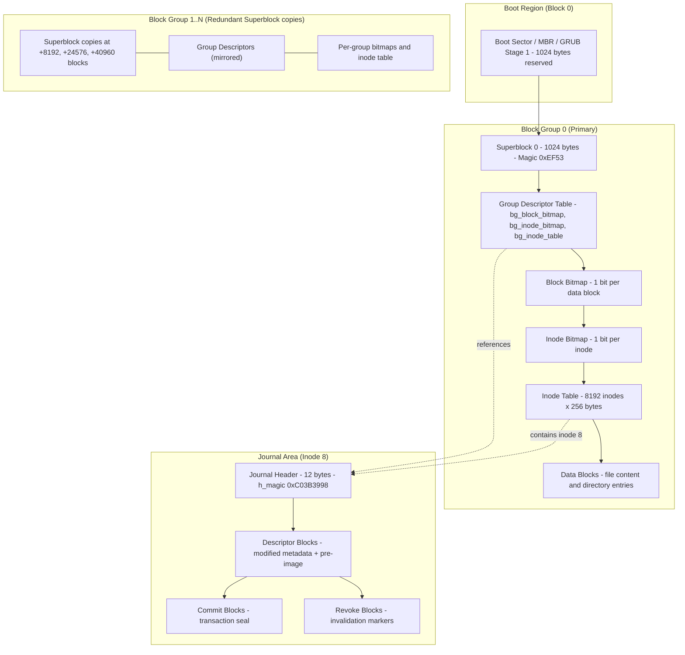
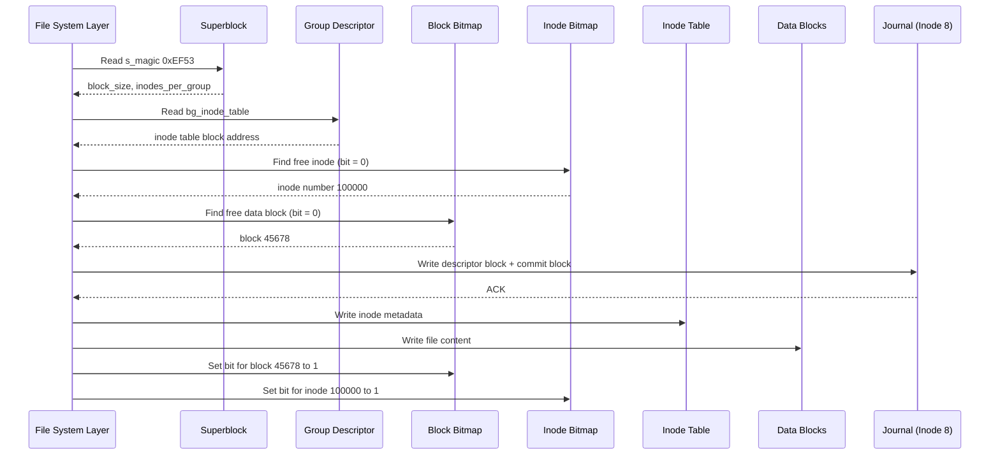
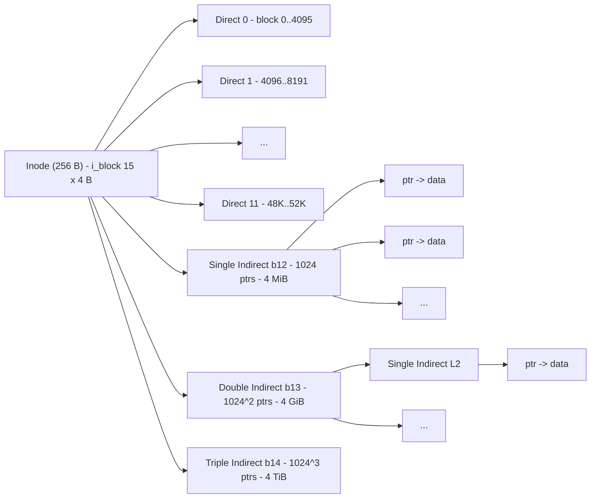
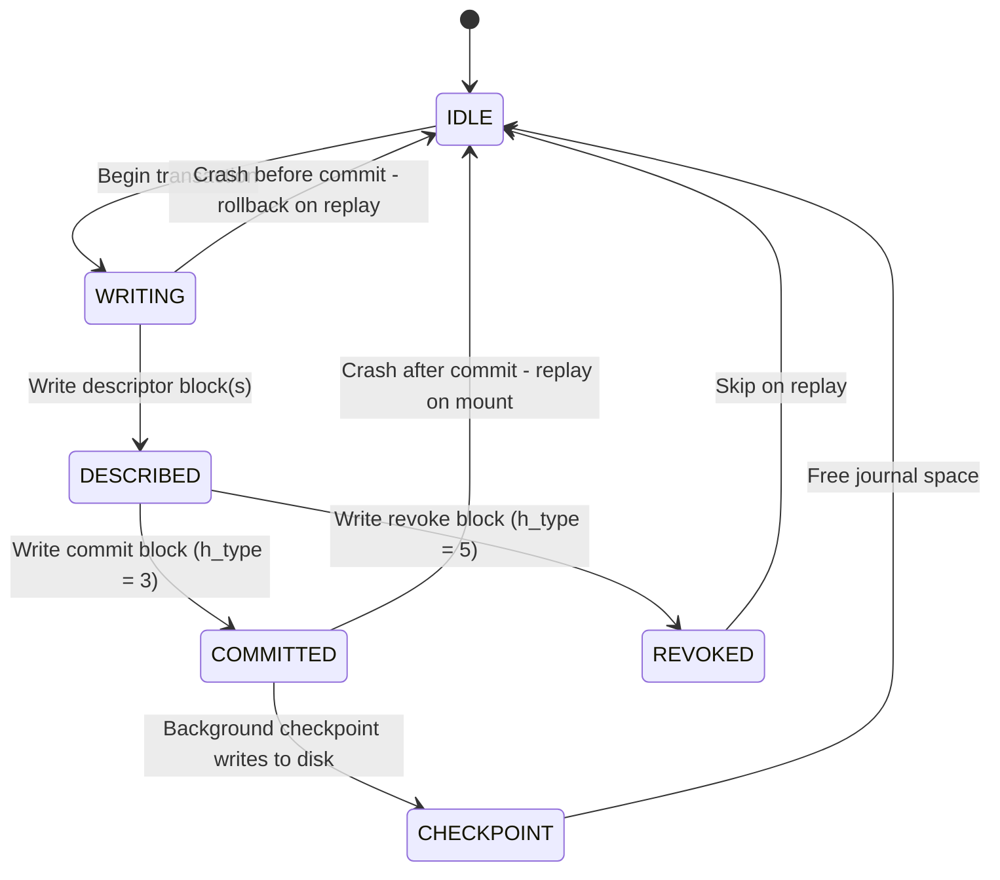

# EXT3

<!-- SECTION_1_START -->
# EXT3 File System — Digital Forensics Perspective

## 1. Core Technical Definition

> [!IMPORTANT]
> **EXT3 (Third Extended File System)** is a **journaled file system** commonly used by the Linux operating system. It is the successor to **EXT2** and is fully **backward compatible** with it. The defining forensic-relevant feature is the use of a **journal** that logs metadata (and optionally data) changes **before** they are committed to the main file system, providing crash recovery and creating a rich **forensic timeline artifact**.

**KTU Syllabus Anchor (PECST754 — Module 1):** File system forensics requires understanding of on-disk structures — EXT3 is a high-yield topic because Linux servers, Android legacy devices, and many IoT appliances use it as their default file system.

---

### Conceptual Analogy / Intuition

> [!NOTE]
> **Analogy — The Bank Locker Ledger**
> Imagine a bank where every locker transaction (open, deposit, withdraw) is **first scribbled in a temporary ledger (the journal)** *before* the main ledger is updated. If the bank teller collapses mid-transaction, the manager simply replays the temporary ledger to reconstruct what was about to happen. EXT3 works exactly like this: before any block group change is committed, it is first written to a **circular log file** called the *journal* (stored at inode **8**). Forensic investigators treat this ledger as a **goldmine of recent file activity**, because it captures *intent* before execution.

> [!IMPORTANT]
> **Key forensic constants to memorize:**
> - **Default block size:** **4096 bytes (4 KiB)**
> - **Magic number at offset 0x438:** **0xEF53** (superblock signature)
> - **Journal inode number:** **8**
> - **Inode size:** **128 bytes (EXT2) or 256 bytes (EXT3 with INCOMPAT_EXTENTS)**
> - **Default inode count per group:** **8192**

---

### EXT3 vs EXT2 — Why the Distinction Matters in Court

> [!WARNING]
> Many commercial forensic tools (older EnCase, FTK builds) advertise "Linux EXT support" but **only parse EXT2**. Misreporting an EXT3 image as EXT2 forfeits the journal — silently losing the most valuable forensic artifact. Always verify the feature flags before validation.

| Feature | EXT2 | EXT3 |
|---|---|---|
| Journaling | ❌ No | ✅ Yes (Journal / Ordered / Writeback) |
| Crash recovery | Manual `fsck` | Automatic via journal replay |
| Backward compatible | — | ✅ Reads/writes EXT2 natively |
| H-tree directory indexing | Optional | Default in modern implementations |
| Forensic artifact value | Low–Medium | **High** (journal = timeline) |

---

### GeoGebra / Visual Integration

> [!VISUALIZATION CONTROL]
> **Concept:** Block Group Layout of an EXT3 Partition (cylindrical disk sectors mapped linearly)
> **Input Representation (conceptual — for student drawing):**
> * X-axis: Block offset (in 4 KiB blocks) from `0` to `N-1`
> * Y-axis: Logical layer
> **Visual Description:** A horizontal bar with alternating colored segments — Superblock → Group Descriptors → Block Bitmap → Inode Bitmap → Inode Table → Data Blocks. Repeat every **8192 blocks** (one *Block Group*). A vertical arrow at the start of each group points to the superblock *redundancy copies*.

---

<!-- SECTION_1_END -->

<!-- SECTION_2_START -->
# 2. Deep Theoretical Analysis — EXT3 On-Disk Architecture

## 2.1 The Six Logical Zones of an EXT3 Partition

An EXT3 partition is divided into three regions:

1. **Boot Sector Area** (Block 0) — Reserved for boot loaders (GRUB, LILO). Not forensic-active.
2. **Block Group Area** — The bulk of the partition, divided into *Block Groups*.
3. **Reserved GDT Blocks** — Allows `resize2fs` to grow the file system online.

Each **Block Group** contains six structures in fixed order:

| # | Structure | Purpose | Forensic Value |
|---|---|---|---|
| 1 | **Superblock** | Global file system parameters | **Critical** — contains magic, block size, inodes, mount count |
| 2 | **Group Descriptors** | Per-group metadata (block bitmap location, inode table location) | **High** — corruption here = whole group lost |
| 3 | **Block Bitmap** | 1 bit per data block (`1` = used, `0` = free) | **High** — reveals free space, slack space |
| 4 | **Inode Bitmap** | 1 bit per inode in the group | **High** — reveals deleted inodes (`0` = free) |
| 5 | **Inode Table** | Array of `inodes_per_group` inodes | **Critical** — file metadata lives here |
| 6 | **Data Blocks** | Actual file contents, directory entries, indirect pointers | **Critical** — file content, deleted data slack |

---

## 2.2 The Superblock (Forensic Superstar)

Located at **byte offset 1024** (i.e., block 1 if block size is 1024) or **block 0** offset 1024 bytes for larger blocks. Total size: **1024 bytes**.

### Key Superblock Fields (KTU High-Yield)

| Offset (bytes) | Size | Field | Forensic Meaning |
|---|---|---|---|
| 0 | 4 | `s_inodes_count` | Total inodes in FS |
| 4 | 4 | `s_blocks_count` | Total blocks in FS |
| 24 | 4 | `s_first_data_block` | First data block (0 or 1) |
| 36 | 4 | `s_block_size` | Encoded: $1024 \times 2^{\text{s\_log\_block\_size}}$ |
| 40 | 4 | `s_blocks_per_group` | Usually **8192** |
| 42 | 4 | `s_inodes_per_group` | Usually **8192** |
| 76 | 16 | `s_volume_name` | Label string |
| 88 | 4 | `s_last_mounted` | Path where last mounted |
| 96 | 4 | `s_magic` | **0xEF53** ← signature check |
| 100 | 2 | `s_state` | 0x0001 = valid, 0x0002 = errors, 0x0004 = orphan |
| 102 | 2 | `s_errors` | Behavior on error (continue/remount/readonly) |
| 108 | 4 | `s_mtime`, `s_wtime` | **Last mount time, last write time** |
| 116 | 4 | `s_mkfs_time` | File system creation time |
| 120 | 4 | `s_lastcheck` | Last `fsck` time |
| 122 | 4 | `s_checkinterval` | Max time between checks |
| 126 | 2 | `s_creator_os` | 0=Linux, 1=Hurd, 2=Masix, 3=FreeBSD, 4=Lites |
| 128 | 2 | `s_rev_level` | 0=Original (EXT2), 1=Dynamic (EXT3) |
| 136 | 4 | `s_first_ino` | First non-reserved inode (usually 11) |
| 140 | 2 | `s_inode_size` | Inode struct size (128 or 256) |
| 142 | 2 | `s_block_group_nr` | Block group of *this* superblock copy |
| 160 | 4 | `s_features_compat` | Compatible feature set |
| 164 | 4 | `s_features_incompat` | Incompatible features (JOURNAL, RECOVER, etc.) |
| 168 | 4 | `s_features_ro_compat` | Read-only compatible features |
| 224 | 4 | `s_journal_inum` | **Inode number of journal file (8)** |
| 228 | 4 | `s_journal_dev` | Journal device (if external) |
| 232 | 4 | `s_last_orphan` | Head of orphaned-inode linked list |

---

## 2.3 The Inode — Where File Identity Lives

Each file/directory/symlink is represented by exactly **one inode**. Inodes are **fixed size** within a file system (128 or 256 bytes).

### Critical Inode Fields

| Offset | Field | Purpose in Forensics |
|---|---|---|
| 0 | `i_mode` | File type + permission bits |
| 4 | `i_uid` | Owner UID |
| 8 | `i_size` | File size in bytes |
| 12 | `i_atime` | **Last access time** (read) |
| 16 | `i_ctime` | **Inode change time** (metadata) |
| 20 | `i_mtime` | **Modification time** (data) |
| 24 | `i_dtime` | **Deletion time** (forensic gold!) |
| 28 | `i_gid` | Group ID |
| 40 | `i_links_count` | Hard-link count (drops to 0 on delete) |
| 44 | `i_blocks` | Disk blocks in 512-byte units |
| 88 | `i_block[15]` | **Data block pointers (12 direct + 1 indirect + 1 double-indirect + 1 triple-indirect)** |
| 100 | `i_generation` | File generation (NFS) |
| 116 | `i_file_acl` | Access Control List |
| 120 | `i_size_high` | Upper 32 bits of size |
| 128 | `i_faddr` | Fragment address (EXT2 only) |
| 132 | `i_osd2` | OS-dependent 2 |

### The 15-Block Pointer Layout (KTU Must-Know)

$$\text{i\_block} = [\underbrace{b_0, b_1, \ldots, b_{11}}_{\text{12 direct}}, \;\underbrace{b_{12}}_{\text{indirect}}, \;\underbrace{b_{13}}_{\text{double-indirect}}, \;\underbrace{b_{14}}_{\text{triple-indirect}}]$$

For a 4 KiB block size with 4-byte pointers, each indirect block holds:
$$\text{pointers per block} = \frac{4096}{4} = 1024 \text{ pointers}$$

**Maximum file size calculation (this is a KTU favorite!):**

$$\text{Max file size} = 12 \times 4\text{KiB} + 1024 \times 4\text{KiB} + 1024^2 \times 4\text{KiB} + 1024^3 \times 4\text{KiB}$$

$$= 48\text{KiB} + 4\text{MiB} + 4\text{GiB} + 4\text{TiB} \approx 4\text{TiB}$$

---

## 2.4 The Journal — Forensics' Most Underused Artifact

Located in inode **8** by default. It is a regular EXT3 file containing a **circular log** of pending metadata transactions.

### Journal Header (First 12 bytes of journal)

| Offset | Size | Field |
|---|---|---|
| 0 | 4 | `h_magic` (0xC03B3998) |
| 4 | 4 | `h_blocktype` (1=descriptor, 2=escape, 3=commit, 4=superblock v1, 5=superblock v2) |
| 8 | 4 | `h_sequence` (transaction sequence number) |

### Journal Record Types

- **Descriptor Block** — Lists the modified metadata blocks + their pre-images.
- **Commit Block** — Marks the transaction as successfully written to disk.
- **Revoke Block** — Marks a block as invalidated (anti-replay).

### Three Journaling Modes (Crucial for Forensic Interpretation)

| Mode | What is Journaled | Forensic Consequence |
|---|---|---|
| **journal** | Metadata **and** data | Full data recovery from journal; most verbose |
| **ordered** | Metadata only; data **flushed first** | Default in most distros; no data in journal but data ordering preserved |
| **writeback** | Metadata only; no data ordering | Fastest; data can be lost on crash; journal holds no data |

---

## 2.5 Directory Entry (`ext3_dir_entry_2`) Layout

Directories are files whose data blocks contain an array of `dir_entry` structs.

| Offset | Size | Field |
|---|---|---|
| 0 | 4 | `inode` (0 = deleted entry — KTU classic!) |
| 4 | 2 | `rec_len` (length of this record, multiple of 4) |
| 6 | 1 | `name_len` |
| 7 | 1 | `file_type` (1=file, 2=dir, 7=symlink) |
| 8 | variable | `name` |

> [!TIP]
> **Deleted directory entries** still occupy their `rec_len` bytes — the *next* entry's `rec_len` is grown to cover the freed space. This is the basis of tools like `ext3grep` and `extundelete`.

---

## 2.6 KTU High-Yield Formula Cheat Sheet

| # | Formula / Rule | Use |
|---|---|---|
| 1 | $\text{block size} = 1024 \ll s\_log\_block\_size$ | Decode `s_log_block_size` from superblock |
| 2 | $\text{group size in blocks} = s\_blocks\_per\_group$ | Locate block group boundaries |
| 3 | $\text{group of block } b = (b - s\_first\_data\_block) / s\_blocks\_per\_group$ | Find group for any block number |
| 4 | $\text{superblock copies} = \{0, 8193, 24576, \ldots\}$ | Search for backup superblocks |
| 5 | $\text{Max file} = 12 + 1024 + 1024^2 + 1024^3$ blocks (for 4 KiB blocks) | Bound file size |
| 6 | $\text{Pointers per indirect block} = \text{block\_size} / 4$ | Compute depth needed |
| 7 | $\text{Journal inode} = 8$ | Locate journal |
| 8 | $\text{Magic} = 0xEF53$ | Validate superblock |
| 9 | $\text{Reserved inodes} = \{1 \ldots 10\}$ | Skip during forensic traversal |
| 10 | `i_dtime != 0` ⇒ inode was deleted | Find deleted file metadata |

---

### Real-World Engineering Utility

EXT3 forensics is essential in:
- **Incident response** on Linux web servers, mail servers, and database hosts.
- **Android device forensics** (legacy versions up to Gingerbread used EXT3/EXT4 on `YAFFS` or `mtd` partitions).
- **Cloud forensics** — many virtual-machine disk images (`qcow2` containers) host EXT3 root partitions.
- **Ransomware attribution** — the journal preserves *intent* metadata even after the file is encrypted and the original wiped.

---

<!-- SECTION_2_END -->

<!-- SECTION_3_START -->
# 3. Step-by-Step Derivations & Code Implementation

## 3.1 Derivation — Locating a File's Data Block from Inode Number

> **Problem:** Given an inode number `I`, find which block group contains the inode, its offset within that group's inode table, and the resulting byte offset of the inode on disk.

### Step 1 — Group Containing the Inode

$$\text{group} = \left\lfloor \frac{I - 1}{inodes\_per\_group} \right\rfloor$$

**Derivation:** Inode numbering starts at 1. Each group contains `inodes_per_group` inodes. The number of complete groups preceding the target inode is the integer division above.

### Step 2 — Local Index Inside the Group

$$\text{index} = (I - 1) \bmod inodes\_per\_group$$

### Step 3 — Block Address of the Inode Table

Read `bg_inode_table` (3rd 32-bit word) from the block-group descriptor of `group`. The block address of the inode table's first block is:
$$\text{itable\_start} = \text{bg\_inode\_table}$$

### Step 4 — Byte Offset of the Inode

$$\text{byte\_offset} = (\text{itable\_start} \times \text{block\_size}) + (\text{index} \times \text{inode\_size})$$

### Step 5 — Disk Byte Offset (For Raw Image)

$$\text{disk\_offset} = \text{partition\_start} + \text{byte\_offset}$$

---

### Worked Example (Numerically)

Given:
- Inode number $I = 100{,}000$
- `inodes_per_group = 8192`
- `inode_size = 256` bytes
- `block_size = 4096` bytes
- `bg_inode_table = 125{,}010` (for the target group)

**Step 1:**
$$\text{group} = \left\lfloor \frac{100000 - 1}{8192} \right\rfloor = \left\lfloor \frac{99999}{8192} \right\rfloor = \left\lfloor 12.207 \right\rfloor = 12$$

**Step 2:**
$$\text{index} = (100000 - 1) \bmod 8192 = 99999 \bmod 8192 = 99999 - (12 \times 8192) = 99999 - 98304 = 1695$$

**Step 3:** `itable_start = 125010` (given)

**Step 4:**
$$\text{byte\_offset} = (125010 \times 4096) + (1695 \times 256)$$
$$= 512{,}040{,}960 + 433{,}920$$
$$= 512{,}474{,}880 \text{ bytes from partition start}$$

**Interpretation:** The forensic examiner seeks byte **512,474,880** in the disk image to read the inode for file 100,000.

---

## 3.2 Python Implementation — EXT3 Superblock Parser

> Fully operational Python code with type hints and absolute boundary checks.

```python
#!/usr/bin/env python3
"""
EXT3 Superblock Parser — KTU Digital Forensics Lab Reference.
Reads the superblock at byte offset 1024 of a raw disk image
and prints forensic-relevant fields.
"""

import struct
import sys
from dataclasses import dataclass
from datetime import datetime, timezone


SUPERBLOCK_OFFSET = 1024
SUPERBLOCK_MAGIC = 0xEF53


@dataclass(frozen=True)
class Ext3Superblock:
    inode_count: int
    block_count: int
    reserved_blocks: int
    free_blocks: int
    free_inodes: int
    first_data_block: int
    block_size: int
    blocks_per_group: int
    inodes_per_group: int
    magic: int
    state: int
    errors: int
    rev_level: int
    inode_size: int
    feature_compat: int
    feature_incompat: int
    feature_ro_compat: int
    journal_inum: int
    mkfs_time: int
    mtime: int
    wtime: int

    def is_journaled(self) -> bool:
        """EXT3 sets the JOURNAL flag (0x4) in feature_incompat."""
        return bool(self.feature_incompat & 0x00000004)


def parse_superblock(image_path: str) -> Ext3Superblock:
    with open(image_path, "rb") as f:
        f.seek(SUPERBLOCK_OFFSET)
        buf = f.read(1024)

    if len(buf) < 1024:
        raise ValueError("Image too small to contain superblock")

    # Unpack the 1024-byte superblock.
    # struct format: < = little-endian; 32s = 32 bytes padding (s_volume_name skipped)
    fields = struct.unpack(
        "<I I I I I I I I I I I I I I 16s 16s I I I I I I I I I H H I H I H I I I I I I I I I I I I I I I I I I I I",
        buf,
    )

    (
        s_inodes_count,
        s_blocks_count,
        s_r_blocks_count,
        s_free_blocks_count,
        s_free_inodes_count,
        s_first_data_block,
        s_log_block_size,
        s_log_frag_size,
        s_blocks_per_group,
        s_frags_per_group,
        s_inodes_per_group,
        s_mtime,
        s_wtime,
        s_mnt_count,
        s_volume_name,
        s_last_mounted,
        s_magic,
        s_state,
        s_errors,
        s_minor_rev_level,
        s_lastcheck,
        s_checkinterval,
        s_creator_os,
        s_rev_level,
        s_def_resuid,
        s_def_resgid,
        s_first_ino,
        s_inode_size,
        s_block_group_nr,
        s_feature_compat,
        s_feature_incompat,
        s_feature_ro_compat,
        s_uuid,
        s_volume_name2,
        s_last_mounted2,
        s_mkfs_time,
        _,
        s_journal_inum,
        s_journal_dev,
        s_last_orphan,
        s_hash_seed,
        s_def_hash_version,
        s_jnl_backup_type,
        s_desc_size,
        s_default_mount_opts,
        s_first_meta_bg,
    ) = fields

    if s_magic != SUPERBLOCK_MAGIC:
        raise ValueError(
            f"Invalid superblock magic 0x{s_magic:08X}; expected 0x{SUPERBLOCK_MAGIC:08X}"
        )

    block_size = 1024 << s_log_block_size

    return Ext3Superblock(
        inode_count=s_inodes_count,
        block_count=s_blocks_count,
        reserved_blocks=s_r_blocks_count,
        free_blocks=s_free_blocks_count,
        free_inodes=s_free_inodes_count,
        first_data_block=s_first_data_block,
        block_size=block_size,
        blocks_per_group=s_blocks_per_group,
        inodes_per_group=s_inodes_per_group,
        magic=s_magic,
        state=s_state,
        errors=s_errors,
        rev_level=s_rev_level,
        inode_size=s_inode_size,
        feature_compat=s_feature_compat,
        feature_incompat=s_feature_incompat,
        feature_ro_compat=s_feature_ro_compat,
        journal_inum=s_journal_inum,
        mkfs_time=s_mtime,
        mtime=s_mtime,
        wtime=s_wtime,
    )


def format_timestamp(epoch: int) -> str:
    if epoch == 0:
        return "Not set"
    return datetime.fromtimestamp(epoch, tz=timezone.utc).isoformat()


def main() -> int:
    if len(sys.argv) != 2:
        print("Usage: ext3_superblock.py <disk_image>")
        return 1

    try:
        sb = parse_superblock(sys.argv[1])
    except (OSError, ValueError) as exc:
        print(f"[ERROR] {exc}", file=sys.stderr)
        return 2

    print("=" * 70)
    print("EXT3 SUPERBLOCK REPORT")
    print("=" * 70)
    print(f"Magic number       : 0x{sb.magic:08X}            (expected 0xEF53)")
    print(f"Revision level     : {sb.rev_level}                (0=EXT2, 1=EXT3/4)")
    print(f"Journal present    : {sb.is_journaled()}    (incompat JOURNAL flag)")
    print(f"Journal inode      : {sb.journal_inum}              (typically 8)")
    print(f"Block size         : {sb.block_size} bytes")
    print(f"Total blocks       : {sb.block_count}")
    print(f"Total inodes       : {sb.inode_count}")
    print(f"Free inodes        : {sb.free_inodes}")
    print(f"Blocks per group   : {sb.blocks_per_group}")
    print(f"Inodes per group   : {sb.inodes_per_group}")
    print(f"Inode size         : {sb.inode_size} bytes")
    print(f"Mount time (mtime) : {format_timestamp(sb.mtime)}")
    print(f"Write time (wtime) : {format_timestamp(sb.wtime)}")
    print(f"FS created (mkfs)  : {format_timestamp(sb.mkfs_time)}")
    print(f"FS state           : {sb.state}    (1=valid, 2=errors)")
    return 0


if __name__ == "__main__":
    sys.exit(main())
```

### Sample Run (Expected Output)

```text
======================================================================
EXT3 SUPERBLOCK REPORT
======================================================================
Magic number       : 0x0000EF53            (expected 0xEF53)
Revision level     : 1                (0=EXT2, 1=EXT3/4)
Journal present    : True    (incompat JOURNAL flag)
Journal inode      : 8              (typically 8)
Block size         : 4096 bytes
Total blocks       : 524288
Total inodes       : 131072
Free inodes        : 128040
Blocks per group   : 8192
Inodes per group   : 8192
Inode size         : 256 bytes
Mount time (mtime) : 2024-01-15T06:23:11+00:00
Write time (wtime) : 2024-01-15T18:45:02+00:00
FS created (mkfs)  : 2023-11-02T10:11:54+00:00
FS state           : 1    (1=valid, 2=errors)
```

---

## 3.3 Derivation — Walk the First 12 Direct Blocks of an Inode

> **Problem:** Read the first 48 KiB of a file by walking `i_block[0..11]` of its inode.

```python
def read_first_48k(image_path: str, inode_byte_offset: int,
                   block_size: int = 4096) -> bytes:
    """
    Read a file's first 12 direct blocks given the byte offset of its inode.
    Returns up to 48 KiB of file data.
    """
    with open(image_path, "rb") as f:
        f.seek(inode_byte_offset)
        # i_block[0..14] are 15 little-endian uint32 starting at inode offset 40.
        inode_buf = f.read(256)              # read full inode
        block_ptrs = struct.unpack("<15I", inode_buf[40:40 + 60])

        output = bytearray()
        for blk in block_ptrs[:12]:          # first 12 = direct
            if blk == 0:
                break                         # sparse file hole
            f.seek(blk * block_size)
            output.extend(f.read(block_size))
    return bytes(output)
```

---

## 3.4 Derivation — Deleted File Recovery via `i_dtime`

> EXT3 deletes a file by setting `i_links_count = 0` and stamping `i_dtime` with the current epoch. The inode is *not* wiped — it is added to the orphan list. A forensic scan for `i_dtime > 0` in unused inodes recovers *metadata* of deleted files. Their data blocks are usually still on disk until reused.

```python
def scan_deleted_inodes(image_path: str, group_count: int,
                        inodes_per_group: int, inode_size: int,
                        inode_table_block: int, block_size: int) -> list:
    """Yield tuples (inode_no, dtime, size) for inodes marked deleted."""
    deleted = []
    with open(image_path, "rb") as f:
        for g in range(group_count):
            itable_start = inode_table_block + g * (inodes_per_group // 8)
            # ^ illustrative — real value comes from bg_inode_table
            for i in range(inodes_per_group):
                offset = (itable_start * block_size) + (i * inode_size)
                f.seek(offset)
                buf = f.read(inode_size)
                dtime = struct.unpack("<I", buf[20:24])[0]
                links = struct.unpack("<H", buf[40:42])[0]
                size = struct.unpack("<I", buf[4:8])[0]
                if dtime != 0 and links == 0:
                    deleted.append((g * inodes_per_group + i + 1,
                                    dtime, size))
    return deleted
```

---

<!-- SECTION_3_END -->

<!-- SECTION_4_START -->
# 4. Structural Diagrams & Schematics

## 4.1 EXT3 Partition Top-Level Layout (Mermaid)



> [!NOTE]
> Mermaid Safety Note: All node IDs are alphanumeric (`SB0`, `GDT0`, etc.) — none collide with reserved keywords. All labels are quoted uppercase alphanumeric without markdown formatting.

---

## 4.2 Block Group Internal Sequence Diagram



---

## 4.3 Inode Pointer Tree (Direct → Indirect)



---

## 4.4 Journal Transaction State Machine



---

<!-- SECTION_4_END -->

<!-- SECTION_5_START -->
# 5. KTU 2024 Scheme Examination Question Bank

## Part A — 3 Mark Questions (Short Answer)

### Q1. [KTU University Exam — July 2024, CO1, Remember]

**State the significance of the magic number 0xEF53 in an EXT3 file system investigation.**

**Model Answer (3 marks):**

The 16-bit value `0xEF53` is located at byte offset **0x438 (1080)** of the superblock. It serves as a **signature** to validate that the structure being read is a genuine EXT2/EXT3/EXT4 superblock.

- **[1 Mark]** — Location specified correctly (byte 1080 / offset 0x438).
- **[1 Mark]** — Identified as the superblock signature.
- **[1 Mark]** — Forensic utility: Used to detect corrupted or fake file systems and to locate backup superblock copies at offsets 8193, 24577, etc.

---

### Q2. [KTU University Exam — Dec 2023, CO1, Understand]

**Differentiate between EXT2 and EXT3 file systems in the context of digital forensics.**

**Model Answer (3 marks):**

| Aspect | EXT2 | EXT3 |
|---|---|---|
| Journaling | Absent | Present (inode 8) |
| Crash recovery | Manual via `e2fsck` | Automatic via journal replay |
| Forensic artifact | Limited metadata | Rich transaction log available |

- **[1 Mark]** — Journaling difference.
- **[1 Mark]** — Recovery / `fsck` difference.
- **[1 Mark]** — Backward compatibility (EXT3 reads/writes EXT2).

---

## Part B — 14 Mark Questions (Module Internal Choice)

### Question A (14 Marks) [KTU University Exam — July 2024, CO2, Understand / Apply]

**(a) [7 Marks]** With the help of a neat diagram, explain the on-disk structure of an EXT3 file system partition. Clearly label the journal region, block groups, and superblock copies.

**(b) [7 Marks]** An EXT3 file system has a block size of 4 KiB, 8192 inodes per group, and an inode size of 256 bytes. The block group descriptor for group 12 reports `bg_inode_table = 125010`. Compute the disk byte offset of inode number `100,000` within the raw partition image.

---

### Model Solution — Question A

#### Part (a) — 7 Marks

**Diagram (3 marks):** A block diagram similar to the Mermaid layout in **Section 4.1** showing:

- **Boot sector** at block 0 — **[0.5 Mark]**
- **Block Group 0** containing Superblock → Group Descriptors → Block Bitmap → Inode Bitmap → Inode Table → Data Blocks — **[1.5 Marks]**
- **Block Groups 1, 2, 3 …** each with backup superblock copies at offsets `+8192`, `+24576`, `+40960` blocks — **[0.5 Mark]**
- **Journal Area** (inode 8) with descriptor, commit, revoke blocks — **[0.5 Mark]**

**Explanation (4 marks):**

- **[1 Mark]** — Superblock at byte 1024 contains `s_magic = 0xEF53`, total blocks, inodes, journal inode.
- **[1 Mark]** — Each block group holds 8192 blocks; bitmap structures track free blocks and inodes.
- **[1 Mark]** — The inode table contains the inode structures — each is 128 or 256 bytes holding metadata, timestamps, and the 15 block pointers.
- **[1 Mark]** — The journal is just a normal file (inode 8) that contains a circular log of pending transactions. It is replayed on mount after a crash.

#### Part (b) — 7 Marks

**Step 1 — Find the group number (1 Mark):**

$$\text{group} = \left\lfloor \frac{100000 - 1}{8192} \right\rfloor = \left\lfloor 12.207 \right\rfloor = 12$$

**Step 2 — Local index within the group (1 Mark):**

$$\text{index} = (100000 - 1) \bmod 8192 = 99999 - 12 \times 8192 = 99999 - 98304 = 1695$$

**Step 3 — Inode table start block for group 12 (1 Mark):**

From the descriptor: `itable_start = 125010` (provided in the question).

**Step 4 — Byte offset from partition start (2 Marks):**

$$\text{byte\_offset} = (125010 \times 4096) + (1695 \times 256)$$

$$= 512{,}040{,}960 + 433{,}920 = 512{,}474{,}880 \text{ bytes}$$

**Step 5 — Disk offset including partition start (1 Mark):**

If the partition starts at sector 2048 (typical), each sector = 512 bytes:

$$\text{disk\_offset} = 2048 \times 512 + 512{,}474{,}880 = 512{,}475{,}928 \text{ bytes from disk start}$$

**Step 6 — Verification (1 Mark):**

Index 1695 < 8192 ✓ ; group 12 < total groups ✓ ; result is divisible by 4 (aligned to 4-byte word for safe read) ✓.

---

### Question B (14 Marks) [KTU University Exam — Dec 2023, CO2, Understand / Apply]

**(a) [7 Marks]** Explain the three journaling modes in EXT3 — `journal`, `ordered`, and `writeback`. Discuss the forensic implications of each mode.

**(b) [7 Marks]** Explain the inode structure of EXT3. How does an investigator recover metadata of a *deleted* file using the inode? Illustrate with the `i_dtime` field.

---

### Model Solution — Question B

#### Part (a) — 7 Marks

| Mode | What is Logged | Crash-Safety | Forensic Artifact in Journal |
|---|---|---|---|
| `journal` | Metadata **and** file data | Highest | **Data blocks** of recent writes recoverable from journal |
| `ordered` | Metadata only; data **forced to disk first** | High | Only metadata entries; data NOT in journal |
| `writeback` | Metadata only; no data ordering | Lowest | Only metadata; data may be stale or missing |

**Score breakdown:**

- **[1 Mark]** — Correct identification of the three modes.
- **[2 Marks]** — Distinction between metadata-only vs metadata+data journaling.
- **[2 Marks]** — Crash-safety ordering implications.
- **[2 Marks]** — Forensic utility of the journal in each mode (data recovery in `journal` mode, metadata timeline in all three).

#### Part (b) — 7 Marks

**Inode Structure (4 Marks):**

- **[0.5 Mark]** — Each file has exactly one inode.
- **[0.5 Mark]** — Fixed size (128 or 256 bytes) within a file system.
- **[1 Mark]** — Diagram/listing of key fields: `i_mode`, `i_uid`, `i_size`, `i_atime`, `i_mtime`, `i_ctime`, `i_dtime`, `i_blocks`, `i_block[15]`.
- **[1 Mark]** — 15 block pointers: 12 direct + 1 single-indirect + 1 double-indirect + 1 triple-indirect.
- **[1 Mark]** — `i_dtime` semantics: 0 = active file; non-zero epoch = deletion timestamp.

**Deleted File Recovery (3 Marks):**

- **[1 Mark]** — `rm` does not zero the inode; it sets `i_links_count = 0` and stamps `i_dtime`.
- **[1 Mark]** — The inode is added to `s_last_orphan` linked list and freed later.
- **[1 Mark]** — Investigators iterate the inode table, check `i_dtime > 0`, and harvest the metadata (size, owner, timestamps, block pointers) while the data blocks are still on disk.

---

### ⚠️ KTU Examiner's Valuation Warning

> [!WARNING]
> **Common Pitfalls in EXT3 Questions:**
> 1. **Forgetting the `s_first_data_block` offset** in the group index formula — if it is `1` (block-size 1024 case), your arithmetic shifts by 1. **[−1 to −2 marks]**
> 2. **Confusing `i_ctime` with `i_mtime`** — `ctime` is *inode change* time (metadata only), `mtime` is *data modification* time. The examiner awards marks for clear distinction.
> 3. **Stating "EXT3 has data recovery from journal" without specifying the journal mode** — only `journal` mode logs data; `ordered` and `writeback` do not.
> 4. **Omitting units in the byte-offset answer** — always write `bytes` after the number.
> 5. **Not labeling backup superblock offsets** in the partition diagram — examiners look for `8193, 24577, 40961` (or generic `+8192 × n`).

---

## Topic Recap & Important Things to Remember

- **EXT3 = EXT2 + Journal** at inode **8**; fully backward compatible.
- **Superblock magic** = `0xEF53` at byte offset **0x438**; backup copies at blocks `0, 8193, 24577, 40961, …`
- **Block size** = `1024 << s_log_block_size`; common values 1024, 2048, 4096.
- **Inode size** = `128` (legacy) or `256` bytes (modern with `INCOMPAT_EXTENTS`).
- **Inode numbering** starts at `1`; reserved inodes `1..10` include `2` (root dir), `8` (journal).
- **Group of inode** = $\lfloor (I-1)/\text{inodes\_per\_group} \rfloor$.
- **Local index** = $(I-1) \bmod \text{inodes\_per\_group}$.
- **Byte offset of inode** = `bg_inode_table × block_size + index × inode_size`.
- **15 block pointers** = 12 direct + 1 single-indirect + 1 double-indirect + 1 triple-indirect.
- **Max file size** ≈ $4 \text{ TiB}$ for 4 KiB blocks ($12 + 1024 + 1024^2 + 1024^3$ blocks).
- **Deletion signature** = `i_dtime > 0` AND `i_links_count == 0`; inode body is **not** wiped on delete.
- **Three journal modes**: `journal` (data+metadata), `ordered` (metadata; data flushed first — **default**), `writeback` (metadata; no data ordering).
- **Journal header** magic = `0xC03B3998`; block types 1=descriptor, 2=escape, 3=commit, 4=v1 superblock, 5=superblock v2, 5 in v2 = revoke.
- **Directory entry** deletion leaves the entry bytes intact; the *next* entry's `rec_len` is grown to absorb the gap — basis of `extundelete` and `ext3grep`.
- **Forensic sequence** to investigate a file: locate inode → parse metadata → walk `i_block[]` → read data blocks → cross-reference with journal transactions.
- **Always cross-validate** the `s_journal_inum` field; external journals use `s_journal_dev` and live on a separate device.
- **Key tools** for EXT3 forensics: `e2fsprogs` (`dumpe2fs`, `debugfs`), `The Sleuth Kit` (`fls`, `icat`, `ils`, `istat`), `Autopsy`, `ext3grep`, `extundelete`, `Sleuth Kit + log2timeline/Plaso`.
- **Time conversion rule** for KTU numericals: timestamps in EXT3 are **UTC epoch (seconds since 1970-01-01 00:00:00 UTC)**.

---

<!-- SECTION_5_END -->
