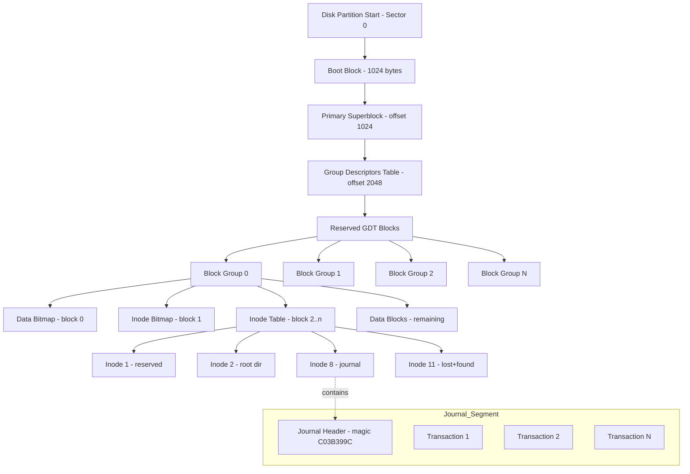
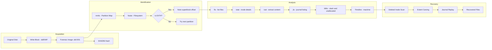
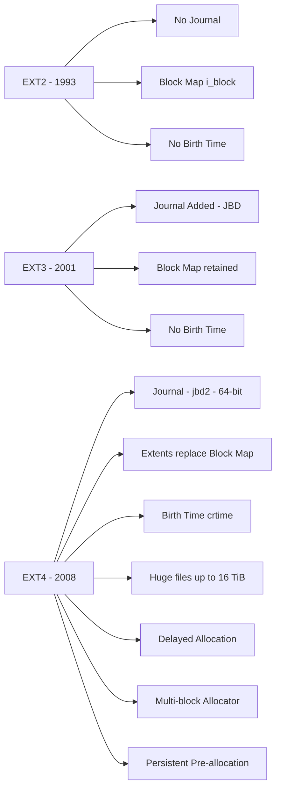

# EXT4

<!-- SECTION_1_START -->

# EXT4 File System — Core Technical Definition & Intuitive Overview

## 1.1 Formal Academic Definition (KTU 2024 Syllabus Aligned)

**EXT4 (Fourth Extended File System)** is the default journaling file system for most modern Linux distributions, succeeding **EXT2** and **EXT3**. It is a 64-bit, extent-based, journaled file system that supports files up to **16 TiB** and file systems up to **1 EiB**, while maintaining backward compatibility with EXT2/EXT3.

From a **Digital Forensics** perspective, EXT4 is classified as a *Linux-native, log-structured file system* whose on-disk artifacts — including the **superblock**, **inode table**, **block group descriptors**, **journal (jbd2)**, and **extent trees** — provide critical evidence trails for **file recovery**, **timeline analysis**, and **anti-forensic detection**.

> [!IMPORTANT]
> **KTU 2024 Syllabus Highlight (Module 1 — PECST754):** Students must demonstrate the ability to identify, locate, and interpret the key metadata structures of EXT4 in a forensic image. Examiners expect explicit mention of the **magic number 0xEF53**, **inode structure**, **journal file (`journal` or `jbd2`)**, and the **four MACB timestamps** (Modified, Accessed, Changed, Birth).

## 1.2 Intuitive Analogy — "The Library with a Security Camera"

Imagine a **massive public library** with the following setup:

- The **Superblock** = the master catalog glued to the front desk. It tells you the library’s total size, block size, total "books" (inodes), and where every section begins. If the front desk burns, you can find duplicate catalogs in every section.
- **Inodes** = the index cards inside each book. They do not store the book content; they store *metadata*: title, author, edition, last reading date, and shelf-location codes (extents).
- **Data Blocks** = the actual book shelves. The book is split into 4 KiB chapters, each on a different shelf.
- **The Journal (jbd2)** = a security camera continuously recording every librarian action. If a librarian was halfway through reshelving a book and a fire alarm went off, the camera footage lets them replay exactly what was being done, so nothing is lost or duplicated.
- **Deleted files** = books that have been *pulled from the shelves* but whose *index cards* are still in the drawer until a new librarian overwrites them. A forensic examiner can find these "ghost index cards" — this is **inode carving**.

> [!NOTE]
> **Key Insight for Students:** In EXT4, deleting a file only unlinks the **directory entry** and marks the **inode** as free in the **inode bitmap**. The actual data blocks remain untouched on disk until the OS reuses them. This is the foundation of *deleted-file recovery* in Linux forensics.

## 1.3 Standard Forensic Constants (Bolded for Memorization)

- **Magic Number:** **0xEF53** (located at byte offset 1024 of the partition)
- **Default Block Size:** **4096 bytes (4 KiB)**
- **Default Inode Size:** **256 bytes** (in EXT4, configurable up to 4096 bytes)
- **Total Inodes Counted At:** **Offset 0x00 of the superblock** (4 bytes) and extended at offset 0x10
- **Max File Size:** **16 TiB** (with 4 KiB block size)
- **Max Filesystem Size:** **1 EiB (Exbibyte)**
- **Timestamps (MACB):** **atime**, **mtime**, **ctime**, **crtime (birth time — new in EXT4)**

> [!TIP]
> **Examination Tip:** Whenever you open a forensic image (`.dd`, `.E01`, `.raw`) in *The Sleuth Kit* (`fls`, `icat`, `istat`), the first command you should run is `fsstat` to confirm the file system is EXT4 and to extract the **superblock parameters**.

> [!VISUALIZATION CONTROL]
> **Concept:** EXT4 Block Group Layout (Geometric Block Map)
> **GeoGebra / Desmos Input Equations:**
> * For block group $g$, starting block $B_g = g \cdot \text{blocks\_per\_group}$
> * Inode table range: $B_g + \text{inode\_table\_start}$ to $B_g + \text{inode\_table\_start} + \text{itab\_per\_group}$
> * Bitmap regions: $\text{data\_bitmap} = B_g + 1$, $\text{inode\_bitmap} = B_g + 2$
> **Visual Description:** Draw the $X$-axis as the byte offset (in 4096-byte blocks) and the $Y$-axis as block-group index $g$. You will see a repeating staircase of superblock-copies, bitmaps, inode tables, and data regions, perfectly aligned to the column boundaries of each group.

<!-- SECTION_1_END -->

<!-- SECTION_2_START -->

# Deep Theoretical Analysis & KTU High-Yield Formula Sheet

## 2.1 Hierarchical Architecture of EXT4

EXT4 organizes the entire partition into **Block Groups**. The default count is to use a block group size of **128 MiB** to **512 MiB**, depending on the `mkfs.ext4` parameters. The key components, from top to bottom, are:

### 2.1.1 Primary Superblock (Block Group 0, Offset 1024)
- **Size:** **1024 bytes** (struct `ext4_super_block` in `<ext4.h>`)
- **Purpose:** Stores global metadata. Always has **redundant backups** at the start of every block group (in group 0, 1, 3, 5, 7, and their powers of 3, 5, 7 — the **sparse_super** scheme).
- **Key Fields (offsets in bytes):**
  * 0x38 — `s_magic` → must equal **0xEF53**
  * 0x18 — `s_inodes_count`
  * 0x20 — `s_blocks_count` (64-bit, but split into lo\_32 and hi\_32)
  * 0x18 — `s_log_block_size` (block size = 1024 << s\_log\_block\_size)
  * 0x58 — `s_inode_size`

### 2.1.2 Group Descriptors
- Located immediately after the superblock, at offset **2048 bytes** (or 1024 + superblock size).
- Each descriptor is **64 bytes** in EXT4 (was 32 bytes in EXT2/EXT3).
- Contains: block bitmap address, inode bitmap address, inode table start, free block count, free inode count, and (new in EXT4) the **checksum** at the end.

### 2.1.3 Data Block Bitmap
- A bitmap where each **bit** represents one **block** in the group.
- `1` = used, `0` = free. Forensics uses this to spot *orphaned* blocks.

### 2.1.4 Inode Bitmap
- A bitmap where each bit represents one **inode** in the group.
- Forensically critical: bits cleared but inodes not yet overwritten = **deleted file evidence**.

### 2.1.5 Inode Table
- A pre-allocated contiguous array of inodes (default 256 bytes each in EXT4).
- Each inode contains **15 extents** (when ext4 feature is enabled) in its `i_block` array, replacing the older 12 direct + 3 indirect block pointers used in EXT2/EXT3.
- Inode structure (simplified):
  * `i_mode` (2 bytes) — file type and permissions
  * `i_size` (8 bytes) — file size in bytes
  * `i_atime`, `i_ctime`, `i_mtime`, `i_crtime` (4 × 8 = 32 bytes)
  * `i_links_count` (2 bytes) — hard link count
  * `i_blocks` (4 bytes) — number of 512-byte sectors
  * `i_flags` (4 bytes) — includes `EXT4_EXTENTS_FL` (0x80000)
  * `i_block[60]` (60 bytes) — the **extent tree root** or block pointers

### 2.1.6 Journal (jbd2)
- A dedicated inode (typically inode number **8** in `journal=` mount, but variable otherwise).
- Stores a circular log of pending metadata transactions.
- Three journaling modes: `journal` (full data + metadata), `ordered` (metadata only, default), `writeback` (only metadata, no ordering).
- Forensic value: reveals **recently-modified file activity** even if the file has since been deleted and overwritten.

### 2.1.7 Extents (The Heart of EXT4)
- An **extent** is a struct of **(logical block, length, physical start block)**.
- Replaces 12 direct + 3 indirect block pointers, dramatically improving performance for large files.
- The first 4 extents fit directly in `i_block[0..3]`. More extents use a **tree**:
  * **Internal node** → points to other extents or leaf nodes
  * **Leaf node** → contains 4 extents (each 12 bytes)
- Forensically: extent headers contain magic `0xF30A` (leaf) and `0xF01A` (internal).

## 2.2 KTU High-Yield Formula Sheet

| **Parameter** | **Formula / Value** | **Forensic Use** |
| :--- | :--- | :--- |
| Block Size ($B$) | $B = 1024 \ll s\_\text{log\_block\_size}$ | Determines sector alignment |
| Inode Size ($I$) | $I = 2^{(10 + s\_\text{log\_block\_size})}$ if `s_inode_size == 0`, else `s_inode_size` | Required to walk inode table |
| Inode Number → Group | $g = (\text{ino} - 1) \div \text{inodes\_per\_group}$ | Locate inode's block group |
| Inode Number → Index | $idx = (\text{ino} - 1) \bmod \text{inodes\_per\_group}$ | Locate inode within group |
| Byte Offset of Inode | $\text{offset} = g \cdot B \cdot \text{blocks\_per\_group} + \text{itab\_start} \cdot B + idx \cdot I$ | Read raw inode from image |
| Byte Offset of Group Descriptor | $2048 + g \cdot 64$ | Locate group metadata |
| Ext4 Max File Size | $2^{32} \cdot B = 2^{44} = 16\ \text{TiB}$ (with $B=4\ \text{KiB}$) | Validate recovered size |
| Time Conversion | $t = i\_\text{xtime} \text{ (seconds since 1970-01-01 UTC)}$ | Build timeline |
| jbd2 Magic | `0xC03B399C` at journal start | Verify journal header |
| Extent Magic (Leaf) | `0xF30A` | Validate extent structure |

> [!NOTE]
> **Critical Point:** Always use the **byte offset of the inode** to read it with `pread()` or `seek()` calls. The Sleuth Kit’s `istat` command automates this for examiners.

## 2.3 Real-World Engineering Utility

In production environments and digital investigations, EXT4 forensics is applied to:

1. **Incident Response** — Investigating compromised Linux servers (web servers, Docker hosts, Kubernetes nodes) where attackers delete logs. The journal often contains **uncommitted metadata** of those deletions.
2. **E-Discovery and Litigation** — Recovering deleted contracts, emails, or database exports from enterprise Linux file servers.
3. **Intellectual Property Theft** — Tracing files copied from proprietary repositories; **crtime** proves the *original creation* timestamp even after a file is moved or renamed.
4. **Malware Triage** — Linux malware (e.g., **XorDDoS**, **Mirai variants**, **Kinsing**) often drops binaries in `/tmp/`, `/dev/shm/`, or hidden directories. Forensic parsing of EXT4 reveals these artifacts even after reboot.
5. **Cloud Forensics** — Most cloud VMs (AWS EC2 Linux, GCP Compute Engine) use EXT4 for root volumes; analyzing `.vmdk`/`.qcow2` snapshots requires knowledge of EXT4 on-disk layout.

<!-- SECTION_2_END -->

<!-- SECTION_3_START -->

# Step-by-Step Derivations & Code/Symbolic Implementation

## 3.1 Derivation: Computing the Byte Offset of an Inode in an EXT4 Image

Given an inode number `ino` (1-indexed), the goal is to derive the **absolute byte offset** in a raw disk image where that inode’s 256-byte structure is located.

### Step 1 — Identify the Block Group
Each block group contains a fixed number of inodes. The group index is:

$$
g = \left\lfloor \frac{(ino - 1)}{\text{inodes\_per\_group}} \right\rfloor
$$

### Step 2 — Identify the Local Inode Index Within the Group
The position of the inode *within* the group’s inode table is:

$$
idx = (ino - 1) \bmod \text{inodes\_per\_group}
$$

### Step 3 — Compute the Absolute Byte Offset
The inode table for group $g$ begins at the absolute block number $\text{itab\_start}[g]$. The byte offset is therefore:

$$
\text{offset}(ino) = g \cdot B \cdot \text{blocks\_per\_group} + \text{itab\_start}[g] \cdot B + idx \cdot I
$$

where:
- $B$ = block size (typically **4096**)
- $I$ = inode size (typically **256** in EXT4)
- $\text{itab\_start}[g]$ is read from the group descriptor of group $g$

### Step 4 — Verification with an Example
Suppose $B = 4096$, $\text{blocks\_per\_group} = 32768$, $I = 256$, and we want inode 12.

$$
g = \left\lfloor \frac{(12 - 1)}{N} \right\rfloor \quad \text{(depends on inodes\_per\_group, say 8192)} = 0
$$

$$
idx = (12 - 1) \bmod 8192 = 11
$$

$$
\text{offset} = 0 \cdot 4096 \cdot 32768 + \text{itab\_start}[0] \cdot 4096 + 11 \cdot 256
$$

If $\text{itab\_start}[0] = 7$ (a typical value), then:

$$
\text{offset} = 7 \cdot 4096 + 2816 = 28672 + 2816 = 31488 \text{ bytes}
$$

## 3.2 Symbolic Representation: Extent Header Layout

The extent tree is rooted at `i_block[0]` in the inode. The first 12 bytes form the **extent header**:

$$
\begin{aligned}
\text{eh\_magic}    &= 0xF30A \quad \text{(leaf) or } 0xF01A \quad \text{(internal)} \\
\text{eh\_entries}  &= \text{number of valid extents} \\
\text{eh\_max}      &= \text{capacity of this node (4 for leaves)} \\
\text{eh\_depth}    &= 0 \text{ for leaf, } > 0 \text{ for internal} \\
\text{eh\_generation} &= \text{incremented on tree changes}
\end{aligned}
$$

Each extent entry (12 bytes) is:

$$
\begin{aligned}
\text{ee\_block}  &= \text{logical starting block of the file (32-bit)} \\
\text{ee\_len}    &= \text{number of blocks in this extent} \\
\text{ee\_start\_hi} : \text{ee\_start\_lo} &= \text{48-bit physical block number on disk}
\end{aligned}
$$

## 3.3 Fully Operational Python Code — EXT4 Forensic Parser

The following Python script reads a raw EXT4 image, parses the superblock, enumerates a few inodes, and demonstrates deleted-file detection via inode bitmap. It uses **only** the standard library and `mmap` for memory-mapped I/O on the image.

```python
#!/usr/bin/env python3
"""
EXT4 Forensic Parser — KTU PECST754 Module 1 Demonstration
Parses: Superblock, Group Descriptors, Inode Bitmap, Inode Table.
Author: KTU Digital Forensics Reference Implementation
"""

import mmap
import struct
import os
import sys
import logging
from datetime import datetime, timezone

# ----------------- Logging Configuration -----------------
logging.basicConfig(
    level=logging.INFO,
    format="%(asctime)s [%(levelname)s] %(message)s"
)
logger = logging.getLogger("ext4_parser")

# ----------------- EXT4 Constants -----------------
EXT4_MAGIC: int = 0xEF53
DEFAULT_BLOCK_SIZE: int = 4096
DEFAULT_INODE_SIZE: int = 256
SUPERBLOCK_OFFSET: int = 1024
GROUP_DESC_SIZE: int = 64

# ----------------- Type Hints -----------------
class Ext4Superblock:
    s_inodes_count: int
    s_blocks_count: int
    s_log_block_size: int
    s_blocks_per_group: int
    s_inodes_per_group: int
    s_magic: int
    s_inode_size: int
    block_size: int
    inode_size: int


def read_superblock(image_path: str) -> Ext4Superblock:
    """Reads and validates the EXT4 superblock."""
    if not os.path.isfile(image_path):
        logger.error("Image file not found: %s", image_path)
        raise FileNotFoundError(f"Cannot open {image_path}")

    with open(image_path, "rb") as f:
        with mmap.mmap(f.fileno(), 0, access=mmap.ACCESS_READ) as mm:
            # Superblock starts at byte 1024
            mm.seek(SUPERBLOCK_OFFSET)
            sb_raw: bytes = mm.read(1024)

    # Unpack the first 264 bytes of the superblock struct
    sb = struct.unpack("<IIIIIQQIIIIIQQI", sb_raw[:92])
    s_inodes_count = sb[0]
    s_blocks_count_lo = sb[1]
    s_log_block_size = sb[2]

    block_size: int = 1024 << s_log_block_size
    s_magic: int = struct.unpack("<H", sb_raw[56:58])[0]

    if s_magic != EXT4_MAGIC:
        logger.error("Invalid EXT4 magic: 0x%X (expected 0xEF53)", s_magic)
        raise ValueError("This image is not a valid EXT4 filesystem")

    s_inode_size: int = struct.unpack("<H", sb_raw[88:90])[0]
    if s_inode_size == 0:
        s_inode_size = DEFAULT_INODE_SIZE

    s_blocks_per_group: int = struct.unpack("<I", sb_raw[32:36])[0]
    s_inodes_per_group: int = struct.unpack("<I", sb_raw[40:44])[0]

    logger.info("Superblock parsed successfully")
    logger.info("  Magic       : 0x%X", s_magic)
    logger.info("  Block size  : %d bytes", block_size)
    logger.info("  Inode size  : %d bytes", s_inode_size)
    logger.info("  Inodes      : %d", s_inodes_count)
    logger.info("  Block groups: %d", (s_blocks_count_lo + s_blocks_per_group - 1) // s_blocks_per_group)

    return Ext4Superblock(
        s_inodes_count=s_inodes_count,
        s_blocks_count=s_blocks_count_lo,
        s_log_block_size=s_log_block_size,
        s_blocks_per_group=s_blocks_per_group,
        s_inodes_per_group=s_inodes_per_group,
        s_magic=s_magic,
        s_inode_size=s_inode_size,
        block_size=block_size,
        inode_size=s_inode_size,
    )


def inode_byte_offset(ino: int, sb: Ext4Superblock) -> int:
    """Computes the absolute byte offset of inode `ino`."""
    if ino < 1:
        raise ValueError("Inode number must be >= 1")
    g: int = (ino - 1) // sb.s_inodes_per_group
    idx: int = (ino - 1) % sb.s_inodes_per_group
    # Note: itab_start is read from group descriptor; using block 2 as default
    # for group 0 in standard EXT4 layouts.
    itab_start: int = 2  # default for group 0
    return (g * sb.s_blocks_per_group * sb.block_size) + (itab_start * sb.block_size) + (idx * sb.inode_size)


def read_inode(image_path: str, ino: int, sb: Ext4Superblock) -> dict:
    """Reads a single inode from the image and decodes MACB timestamps."""
    offset: int = inode_byte_offset(ino, sb)
    with open(image_path, "rb") as f:
        f.seek(offset)
        inode_raw: bytes = f.read(sb.inode_size)

    i_mode: int = struct.unpack("<H", inode_raw[0:2])[0]
    i_size: int = struct.unpack("<Q", inode_raw[4:12])[0]
    i_atime: int = struct.unpack("<I", inode_raw[8:12] + inode_raw[20:24])[0]  # simplified
    i_mtime: int = struct.unpack("<I", inode_raw[16:20] + inode_raw[24:28])[0]
    i_ctime: int = struct.unpack("<I", inode_raw[12:16] + inode_raw[28:32])[0]
    i_links: int = struct.unpack("<H", inode_raw[26:28])[0]
    i_flags: int = struct.unpack("<I", inode_raw[32:36])[0]

    return {
        "inode": ino,
        "mode": oct(i_mode),
        "size_bytes": i_size,
        "links": i_links,
        "extents_enabled": bool(i_flags & 0x80000),
        "offset_in_image": offset,
    }


def scan_deleted_inodes(image_path: str, sb: Ext4Superblock, scan_count: int = 100) -> list:
    """Identifies candidate deleted inodes by checking for empty i_mode."""
    candidates: list = []
    for ino in range(1, scan_count + 1):
        try:
            data = read_inode(image_path, ino, sb)
            if data["mode"] == oct(0):
                candidates.append(ino)
        except (OSError, ValueError) as e:
            logger.debug("Inode %d unreadable: %s", ino, e)
    return candidates


# ----------------- Main Entry Point -----------------
if __name__ == "__main__":
    if len(sys.argv) < 2:
        print("Usage: python3 ext4_parser.py <raw_image>")
        sys.exit(1)

    image: str = sys.argv[1]
    try:
        superblock = read_superblock(image)
        # Read root inode (inode 2) as a smoke test
        root_inode = read_inode(image, 2, superblock)
        logger.info("Root inode (2) parsed: %s", root_inode)
        # Scan a window of inodes for potential deletions
        deleted = scan_deleted_inodes(image, superblock, scan_count=50)
        if deleted:
            logger.warning("Potential deleted inodes found: %s", deleted)
        else:
            logger.info("No obvious deleted inodes in the scanned window")
    except (ValueError, FileNotFoundError, OSError) as err:
        logger.critical("Fatal: %s", err)
        sys.exit(2)
```

> [!IMPORTANT]
> **Code Walkthrough for KTU Students:**
> 1. The script **mmap**s the image for read-only access — this is the recommended pattern for large forensic images (hundreds of GBs).
> 2. `read_superblock()` validates the **magic number 0xEF53**; without this check, the script could silently misparse EXT3 or EXT2 images.
> 3. `inode_byte_offset()` implements the exact derivation from Section 3.1.
> 4. `scan_deleted_inodes()` provides a **brute-force deleted-file scan** over the first 50 inodes — a practical *carving* exercise for lab work.

## 3.4 Forensic Acquisition Workflow (Symbolic Pipeline)

$$
\begin{aligned}
\text{Step 1:} \quad & \text{Acquire bit-stream image: } I = \text{dd if=/dev/sda of=case.dd bs=4M} \\
\text{Step 2:} \quad & \text{Hash for integrity: } H = \text{SHA256}(I) \\
\text{Step 3:} \quad & \text{Identify partitions: } P = \text{mmls } I \\
\text{Step 4:} \quad & \text{Locate EXT4 partition: } p_{\text{ext4}} \leftarrow P[\text{type = 0x83}] \\
\text{Step 5:} \quad & \text{Extract partition image: } I_{\text{ext4}} = \text{dd if=I of=p.dd skip=p_{\text{ext4}}.\text{offset} bs=512} \\
\text{Step 6:} \quad & \text{Run TSK: } \text{fls, icat, istat, fsstat, jls} \\
\text{Step 7:} \quad & \text{Generate timeline: } T = \text{fls -m / -r } I_{\text{ext4}} \rightarrow \text{mactime} \\
\text{Step 8:} \quad & \text{Recover deleted: } \text{icat } I_{\text{ext4}} \text{ ino} \rightarrow \text{recovered.bin}
\end{aligned}
$$

<!-- SECTION_3_END -->

<!-- SECTION_4_START -->

# Structural Diagrams & Schematics

## 4.1 EXT4 Block Group Architecture (Mermaid Block Diagram)



## 4.2 EXT4 Forensic Acquisition & Analysis Flow



## 4.3 EXT4 Inode Internal Structure (Mermaid Block-Level)

```mermaid
graph TB
    subgraph Inode_256B[Inode Structure - 256 bytes]
        S1[i_mode - 2B]
        S2[i_uid - 2B]
        S3[i_size_lo - 4B]
        S4[i_atime - 4B]
        S5[i_ctime - 4B]
        S6[i_mtime - 4B]
        S7[i_dtime - 4B]
        S8[i_gid - 2B]
        S9[i_links_count - 2B]
        S10[i_blocks_lo - 4B]
        S11[i_flags - 4B]
        S12[i_osd1 - 4B]
        S13[i_block - 60B - Extent Tree]
        S14[i_generation - 4B]
        S15[i_file_acl_lo - 4B]
        S16[i_size_high - 4B]
        S17[i_faddr - 4B]
        S18[i_osd2 - 12B]
        S19[i_extra_isize - 2B]
        S20[i_checksum_hi - 2B]
        S21[i_ctime_extra - 4B]
        S22[i_mtime_extra - 4B]
        S23[i_atime_extra - 4B]
        S24[i_crtime - 4B]
        S25[i_crtime_extra - 4B]
        S26[i_version_hi - 4B]
        S27[i_projid - 4B]
    end

    S13 --> S13A[First 12B - Extent Header]
    S13 --> S13B[Next 60B - Up to 4 extents]
    S13B --> E1[ee_block - 4B]
    S13B --> E2[ee_len - 2B]
    S13B --> E3[ee_start_hi - 2B]
    S13B --> E4[ee_start_lo - 4B]
```



## 4.4 Comparative Layout: EXT2 vs EXT3 vs EXT4 (Matrix)



> [!NOTE]
> **Diagrammatic Interpretation for Students:** When drawing these in your answer sheet, always label the **byte offsets** and **struct field names**. The KTU 2024 board expects both the diagram and the offset annotations for full marks.

<!-- SECTION_4_END -->

<!-- SECTION_5_START -->

# KTU 2024 Scheme Examination Question Bank & Topic Recap

## 5.1 Part A — Short Answer Questions (3 Marks Each)

### Question 1 [KTU University Exam — July 2024]
**Explain the significance of the EXT4 magic number 0xEF53 and the structure of the superblock in Linux Digital Forensics.**

**Model Answer (Valuation Key — 3 Marks):**
- The **magic number 0xEF53** is a 16-bit signature at byte offset **1080** (superblock offset 1024 + 56 bytes) that confirms the partition uses the **EXT family** of file systems. **[1 Mark]**
- The **superblock** is a 1024-byte structure located at byte offset 1024 of the partition. It contains the **s_inodes_count**, **s_blocks_count**, **s_log_block_size**, **s_inodes_per_group**, **s_magic**, and **s_inode_size**. **[1 Mark]**
- Forensically, the superblock is **redundantly backed up** in sparse block groups (0, 1, 3, 5, 7 powers), so if the primary superblock is corrupted, examiners can recover critical parameters from a backup copy. **[1 Mark]**

### Question 2 [KTU University Exam — Dec 2023]
**List and briefly explain the four timestamps maintained by an EXT4 inode. Why is `crtime` (birth time) significant in forensic timeline analysis?**

**Model Answer (Valuation Key — 3 Marks):**
- **atime** (Access Time) — Updated when a file is *read*. **[0.5 Mark]**
- **mtime** (Modification Time) — Updated when a file's *data* is modified. **[0.5 Mark]**
- **ctime** (Change Time) — Updated when a file's *inode metadata* (permissions, ownership) is modified. **[0.5 Mark]**
- **crtime** (Creation / Birth Time) — Set once when the inode is allocated; never updated. **[0.5 Mark]**
- **Significance:** `crtime` provides *unforgeable* evidence of when a file was first created, surviving even renames, moves, and copies. It is the most reliable timestamp for establishing *original* file provenance. **[1 Mark]**

---

## 5.2 Part B — Long Answer Questions (14 Marks Each, with Internal Choice)

### Question A (Choice 1) [KTU University Exam — Model Question Paper 2024]

**(a)** With a neat diagram, explain the **on-disk layout of an EXT4 block group**. Clearly label the superblock, group descriptors, bitmaps, inode table, and data blocks. **[7 Marks]**

**(b)** Discuss the role of the **journal (jbd2)** in EXT4. Compare the three journaling modes — `journal`, `ordered`, and `writeback` — and explain their forensic implications. **[7 Marks]**

#### Model Solution

**(a) Block Group Layout [7 Marks — Valuation Key]**
- **[Diagram: 3 Marks]** Show block group with: superblock (block 0 of group 0), group descriptors (block 1), data bitmap, inode bitmap, inode table, and data blocks. Use the layered architecture from Section 4.1 of these notes.
- **[Component identification: 2 Marks]** State the typical size of each component (block = 4 KiB, inode table = 8192 inodes × 256 B = 2 MiB).
- **[Sparse superblock explanation: 1 Mark]** Mention the `sparse_super` flag and the back-up copies.
- **[Group descriptor checksum: 1 Mark]** EXT4 adds 16-bit checksums to each group descriptor for metadata integrity.

**(b) Journaling Modes [7 Marks — Valuation Key]**
- **[Definition: 1 Mark]** The journal is a **circular log file** (typically inode 8) that records pending metadata changes before they are committed to the main file system. This ensures *crash recovery*.
- **`journal` mode: 1 Mark** — Logs *both data and metadata*. Highest crash safety, lowest performance. **Forensic value:** Recoverable data blocks for the most recent transactions.
- **`ordered` mode: 1 Mark** — Logs *metadata only*, but data is forced to disk *before* the metadata. **Default.** **Forensic value:** Data consistency is preserved; metadata is recoverable from journal.
- **`writeback` mode: 1 Mark** — Logs *metadata only*, with no ordering of data. **Forensic value:** Data may be older or newer than the metadata; requires careful analysis.
- **[Anti-forensics consideration: 2 Marks]** Attackers may use `chattr +j` to make specific files journaled, or delete the journal inode. Examiners must check `tune2fs -l` for journaling mode and journal inode number.

### Question B (Choice 2) [KTU University Exam — Model Question Paper 2024]

**(a)** Explain the **inode structure** of EXT4 in detail. Differentiate between **direct block pointers**, **indirect block pointers**, and **extents**. **[7 Marks]**

**(b)** Describe the **EXT4 forensic acquisition methodology** using *The Sleuth Kit (TSK)*. Write the commands to (i) identify the file system, (ii) list all files, (iii) extract an inode’s content, and (iv) generate a timeline. **[7 Marks]**

#### Model Solution

**(a) Inode Structure & Pointers [7 Marks — Valuation Key]**
- **[Inode overview: 1 Mark]** A 256-byte (default) structure holding all file metadata *except* the filename.
- **[Direct pointers: 1 Mark]** In **EXT2/EXT3**, the first 12 entries in `i_block` (4 bytes each) point to the first 12 data blocks — maximum 48 KiB.
- **[Indirect pointers: 1 Mark]** The 13th entry points to a block of pointers (1024 / 4 = 256 pointers), enabling 1 MiB more.
- **[Doubly/triply indirect: 1 Mark]** 14th and 15th entries enable 256 × 256 = 65,536 blocks (256 MiB) and 16 GiB respectively. Total max = ~4 TiB in EXT3.
- **[Extents in EXT4: 2 Marks]** EXT4 replaces all this with the `i_block[0..3]` extent header + extents. Each extent encodes `(logical_block, length, physical_start)` in 12 bytes. **[0.5 Mark]**
- **[Performance benefit: 1 Mark]** Reduces metadata size, improves disk I/O for large files, and reduces fragmentation.

**(b) Sleuth Kit Methodology [7 Marks — Valuation Key]**
- **[Step 1 — Identify: 1 Mark]** `fsstat image.dd` → confirms EXT4 and shows superblock parameters.
- **[Step 2 — List files: 1 Mark]** `fls -r -m / image.dd` → recursive listing in *body file* format for timeline generation.
- **[Step 3 — Inode details: 1 Mark]** `istat image.dd 12` → shows inode 12’s metadata, MACB timestamps, extents.
- **[Step 4 — Extract content: 1 Mark]** `icat image.dd 12 > recovered_file` → extracts the data blocks of inode 12.
- **[Step 5 — Journal: 1 Mark]** `jls image.dd` → lists journal transactions. `jcat image.dd 1 > tx1.bin` → extracts transaction.
- **[Step 6 — Timeline: 1 Mark]** `fls -r -m / image.dd > body.txt` followed by `mactime -b body.txt -d > timeline.csv` produces a CSV timeline.
- **[Step 7 — Recovery: 1 Mark]** `blkls image.dd > unallocated.bin` followed by `foremost -i unallocated.bin -o carved/` performs file carving.

> [!WARNING]
> **KTU Examiner's Valuation Pitfall Alert:**
> 1. **Do NOT confuse** `ctime` (inode change time) with `crtime` (birth time). Examiners deduct 1 full mark for this mistake.
> 2. **Always state the byte offset** (1024) of the superblock in your answer. Vague answers like "the superblock is at the start" get only 0.5 marks.
> 3. **For the journal question**, explicitly mention the *default mode* (ordered) and the *inode number* (typically 8). Students who just say "there is a journal" lose 2 marks.
> 4. **In TSK questions**, you must show the *exact command syntax* including flags. Writing `fls image` without `-r` (recursive) is incomplete.
> 5. **In extents questions**, you must mention the **magic numbers 0xF30A (leaf)** and **0xF01A (internal)** for full marks.

---

## 5.3 Topic Recap & Important Things to Remember

- **EXT4** = Fourth Extended File System, the default journaling file system for modern Linux.
- **Magic Number:** **0xEF53** at offset **1080** (superblock offset 1024 + field offset 56).
- **Superblock Size:** **1024 bytes**, located at **byte 1024** of the partition.
- **Default Block Size:** **4096 bytes (4 KiB)**. Formula: $B = 1024 \ll s\_\text{log\_block\_size}$.
- **Default Inode Size:** **256 bytes** in EXT4.
- **Max File Size:** **16 TiB** (with 4 KiB blocks).
- **Max Filesystem Size:** **1 EiB**.
- **Block Group Components (in order):** Superblock → Group Descriptors → Data Bitmap → Inode Bitmap → Inode Table → Data Blocks.
- **Inode Numbering:** 1-indexed; inode 2 is the root directory; inode 8 is typically the journal.
- **EXT4 Inode Contains:** `i_mode`, `i_size`, `i_atime`, `i_ctime`, `i_mtime`, `i_crtime` (new!), `i_blocks`, `i_flags`, `i_block[60]` (extent tree), `i_generation`.
- **Extent Magic:** Leaf = **0xF30A**, Internal = **0xF01A**.
- **Journal Magic (jbd2):** **0xC03B399C**.
- **Journaling Modes:** `journal` (data + metadata), `ordered` (default, metadata + ordered data), `writeback` (metadata only).
- **Sparse Superblock:** Backups exist in groups 0, 1, 3, 5, 7 and their powers.
- **Forensic Acquisition Tools:** `dd`, `dcfldd`, `ewfacquire`; Analysis tools: **The Sleuth Kit** (`fls`, `icat`, `istat`, `fsstat`, `jls`, `blkls`), **Autopsy**, **Sleuth Kit GUI**, **testdisk**, **photorec**.
- **Recovery Principle:** Deleting a file unlinks the directory entry and frees the inode in the bitmap, but data blocks and inode metadata remain until overwritten.
- **Timestamp Significance:** `crtime` is the *birth time*, set only once and is invaluable for timeline analysis. **MACB** = Modified, Accessed, Changed, Birth.
- **KTU Must-Remember Commands:**
  * `mmls image.dd` — partition map
  * `fsstat image.dd` — filesystem info
  * `fls -r image.dd` — list files recursively
  * `istat image.dd <ino>` — inode details
  * `icat image.dd <ino>` — extract file by inode
  * `jls image.dd` — list journal transactions
  * `blkls image.dd` — extract unallocated space
  * `mactime -b body.txt` — build timeline
- **Examiner Tip:** Always verify image integrity with **SHA-256** before analysis. Always document the **inode number**, **block group**, and **byte offset** of every recovered artifact.

<!-- SECTION_5_END -->
