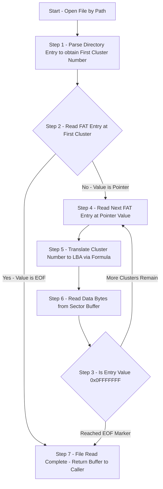
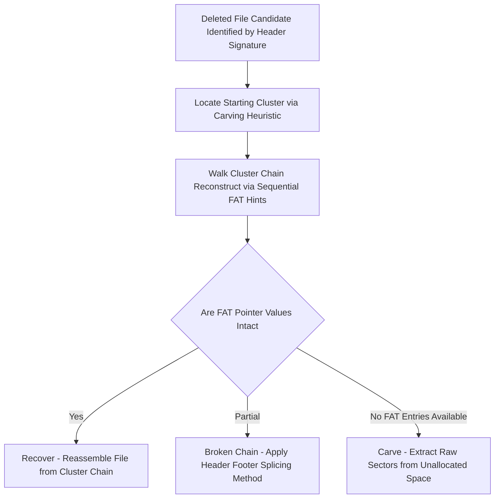

# FAT (File Allocation Table)

<!-- SECTION_1_START -->
# FAT (File Allocation Table) - Core Definition & Intuitive Overview

## 1.1 Formal Academic Definition (KTU 2024 Aligned)

> [!IMPORTANT]
> **Formal Definition**
> The **File Allocation Table (FAT)** is a legacy, cluster-based file system architecture originally developed by **Microsoft** (inherited from MS-DOS and subsequently used in Windows 9x, ME, and embedded/mobile platforms). It maintains a linear, fixed-size **indexing table** at a well-known physical location on the storage volume, where each entry directly corresponds to a single **cluster** (the smallest addressable allocation unit) in the data region. The table functions as a **linked-list mapping** that chains the physical clusters of every file and directory together, enabling the operating system to translate logical file offsets into physical disk addresses.

The FAT family is officially catalogued into four principal variants: **FAT12**, **FAT16**, **FAT32**, and **exFAT** — differentiated strictly by the bit-width of the table entries.

## 1.2 Conceptual Analogy & Intuitive Overview

> [!NOTE]
> **Library Catalog Analogy (The FAT Mental Model)**
> Imagine a vast library (the **Data Region**) where every book is stored inside numbered lockers (**clusters**), and the lockers are scattered across hundreds of shelves. The library does not remember where any book is located, so it maintains a **central registry book** (the **FAT**) on the front desk. Each line in this registry corresponds to one locker number. If a book named *Report.pdf* occupies lockers 7, 12, and 20 (in that order), the registry reads:
> - Line 7 → "next stop is locker 12"
> - Line 12 → "next stop is locker 20"
> - Line 20 → "**EOF** (end of book)"
> When the book is "deleted" (i.e., the librarian is told to throw it away), the librarian does not shred the pages — he simply **blanks out the registry lines** for lockers 7, 12, and 20 (sets them to $0$). The book pages still sit in the lockers, perfectly readable, until new books are written over them. This is exactly how FAT-based data recovery works in digital forensics.

## 1.3 Why FAT Matters in Digital Forensics

The FAT file system is the **bedrock of mobile and removable-media forensics**. Forensic examiners encounter FAT32 in **microSD cards, USB drives, dashcams, drones, smartphones (older Android)**, and **vehicle infotainment systems**. Its deterministic, predictable structure makes it an ideal teaching case for the foundational concepts of file system forensics: **data recovery, file slack analysis, timestamp triangulation, and unallocated space mining**.

| FAT Variant | Bit Width of Each Entry | Typical Use Case |
| :--- | :---: | :--- |
| FAT12 | 12 bits | Floppy disks, very small memory cards ($\le$ 16 MB) |
| FAT16 | 16 bits | Early USB drives, SD cards ($\le$ 2 GB) |
| FAT32 | 28 bits (stored in 32-bit slots) | USB drives, SDHC cards, embedded storage |
| exFAT | 64 bits (effective) | Modern SDXC cards, large flash media |

> [!TIP]
> **Key Forensic Constants to Memorize**
> - **Sectors Per Cluster (SPClus)**: typically $1, 2, 4, 8, 16, 32, 64, 128$
> - **Bytes Per Sector (BPS)**: traditionally **$512$ bytes** (modern Advanced Format drives use $4096$ bytes)
> - **Reserved Sectors**: contain the boot sector and FSINFO (FAT32)
> - **Two FAT copies**: FAT1 (primary) and FAT2 (mirror/backup)

## 1.4 Visualization Control

> [!VISUALIZATION CONTROL]
> **Concept:** Linear Cluster-Chain Mapping in a FAT
> **GeoGebra / Desmos Input Equations:**
> - Define discrete points on the x-axis: $C_1, C_2, C_3, C_4, C_5$ representing cluster indices.
> - Plot vertical drop-lines from a horizontal "FAT Lookup Line" at $y=5$ to each cluster on the x-axis.
> - Use directed arrows: $C_1 \to C_3 \to C_2 \to C_5 \to EOF$.
> **Visual Description:** The student should observe a stair-step "pointer chain" where each cluster's FAT entry value points to the next cluster in the file, terminating at the special marker value $0x0FFFFFFF$ (EOF for FAT32). This visually demonstrates why FAT is classified as a **linked-list allocation method**.
<!-- SECTION_1_END -->

<!-- SECTION_2_START -->
# Deep Theoretical Analysis & KTU High-Yield Formula Sheet

## 2.1 Layered On-Disk Architecture of a FAT Volume

A FAT volume is partitioned into **four sequential regions** laid out from sector $0$ outward:

1. **Reserved Region (Sector 0 onwards):**
   Contains the **Volume Boot Record (VBR)** at sector $0$, the **FSINFO structure** at sector $1$ (FAT32 only), and optionally additional backup boot sectors. The VBR holds the **BIOS Parameter Block (BPB)** — a critical forensic structure containing geometry, cluster size, and OEM metadata.

2. **FAT Region:**
   Contains two identical copies of the File Allocation Table (**FAT1** and **FAT2**). Each table has as many entries as there are data clusters on the volume.

3. **Root Directory Region (FAT12/FAT16 only):**
   A fixed-size contiguous array of **32-byte directory entries** located immediately after FAT2. **FAT32 promotes the root directory into the data region** as a regular cluster chain.

4. **Data Region:**
   The bulk of the volume. Clusters are numbered sequentially starting from cluster **$2$** (clusters $0$ and $1$ are reserved sentinel entries in the FAT).

## 2.2 FAT Entry Value Semantics (The Forensic Hex Map)

The numeric value stored in each FAT entry has a precise meaning that an examiner must decode:

| FAT Entry Value (Hex) | Meaning | Forensic Interpretation |
| :--- | :--- | :--- |
| $0x00000000$ | Free Cluster | Unallocated space — potential deleted-data residue |
| $0x00000001$ | Reserved | Never used for files |
| $0x00000002 \to 0x0FFFFFFE$ | Next Cluster Pointer | Points to the next cluster in a file's chain |
| $0x0FFFFFFF$ | End-of-File (EOF) | Marks the final cluster in a file |
| $0xFFFFFF7F$ | Bad Cluster | Defective media — do not allocate |
| $0x0FFFFFF8 \to 0x0FFFFFFF$ | Reserved (FAT32) | System range |

## 2.3 KTU Formula Sheet / Cheat Sheet

> [!IMPORTANT]
> **Master these formulas — they appear in nearly every KTU numerical question on FAT.**

| # | Quantity | Formula | Typical Units |
| :---: | :--- | :--- | :--- |
| 1 | **Cluster Size** | $\text{ClusterSize} = \text{BytesPerSector} \times \text{SectorsPerCluster}$ | Bytes |
| 2 | **Total Sectors** | $\text{TotSec} = \text{ReservedSec} + (\text{FATsz} \times \text{NumFATs}) + \text{RootDirSec} + \text{DatSec}$ | Sectors |
| 3 | **Data Sectors** | $\text{DatSec} = \text{TotSec} - (\text{ReservedSec} + \text{FATsz} \times \text{NumFATs} + \text{RootDirSec})$ | Sectors |
| 4 | **Data Clusters (FAT32)** | $\text{CountOfClusters} = \dfrac{\text{DatSec}}{\text{SectorsPerCluster}}$ | Clusters |
| 5 | **FAT Type (FAT32)** | If $\text{CountOfClusters} < 65525 \Rightarrow$ FAT16, else $\Rightarrow$ FAT32 | — |
| 6 | **Max File Size (FAT32)** | $2^{32} - 1$ bytes $\approx 4\,\text{GB} - 1\,\text{byte}$ | Bytes |
| 7 | **Root Dir Sectors (FAT16/12)** | $\text{RootDirSec} = \dfrac{32 \times \text{RootEntCnt}}{512}$ | Sectors |
| 8 | **Volume Capacity** | $\text{Cap} = \text{CountOfClusters} \times \text{ClusterSize}$ | Bytes |
| 9 | **Cluster Number to LBA** | $\text{LBA} = \text{FirstDataSector} + (\text{ClusterN} - 2) \times \text{SectorsPerCluster}$ | Sectors |

> **Boundary Sentinel Note:** For **FAT12**, valid cluster values are stored in a 1.5-byte packed format — examiners must read them using nibble-aware bit-shifting logic. For **FAT16**, the value is exactly 2 bytes. For **FAT32**, the upper 4 bits of the 32-bit entry are ignored and only the lower **28 bits** are used.

## 2.4 Real-World Engineering & Forensic Utility

- **Mobile Forensics:** Android devices up to API level 28 widely used FAT32 on `userdata` and external SD partitions. Tools like **Autopsy, FTK Imager, Sleuth Kit, and X-Ways** parse FAT natively.
- **Embedded Systems & IoT:** Dashcams, drones, and automotive ECUs use FAT32/exFAT for predictability and low RAM footprint.
- **Deleted File Recovery (Unallocated Carving):** Since deletion only zeroes FAT pointers (the data content remains), forensic tools perform **FAT chain re-construction** by scanning for file signatures (e.g., `$0xFFD8FFE0$` for JPEG, `$0x504B0304$` for ZIP/DOCX) inside unallocated clusters.
- **Slack Space Exploitation:** Differences between the logical end-of-file and the physical cluster boundary produce **file slack** (residues of RAM/memory pages), a classic source of evidence in civil and criminal cases.
- **Anti-Forensics Detection:** Tools that wipe specific FAT entries to hide malicious content leave detectable artifacts in the **second FAT copy** and in the **directory entry `$DATETIME$` stamps** (last accessed/deleted timestamps).
<!-- SECTION_2_END -->

<!-- SECTION_3_START -->
# Step-by-Step Derivations & Code Implementation

## 3.1 Derivation 1 — Computing the Cluster Size of a FAT32 Volume

**Problem Statement (KTU-style):**
A FAT32 volume has **Bytes Per Sector (BPS) $= 512$** and **Sectors Per Cluster (SPClus) $= 8$**. Compute the cluster size in Bytes and KB.

**Full Step-by-Step Derivation:**

$$ \text{ClusterSize (Bytes)} = \text{BPS} \times \text{SPClus} $$

Substituting the given values:

$$ \text{ClusterSize} = 512 \,\text{Bytes/Sector} \times 8 \,\text{Sectors/Cluster} $$

$$ \text{ClusterSize} = 4096 \,\text{Bytes} $$

Converting to Kilobytes:

$$ \text{ClusterSize} = \dfrac{4096 \,\text{Bytes}}{1024 \,\text{Bytes/KB}} = 4 \,\text{KB} $$

> **Conversion Logic:** Each cluster consumes exactly 8 physical disk sectors; since each sector holds 512 bytes, multiplication gives the raw byte capacity. Divide by $1024$ to convert to KB (binary prefix), not by $1000$.

> **Answer: $4096$ Bytes $= 4$ KB per cluster.**

## 3.2 Derivation 2 — Verifying the Maximum File Size of FAT32

**Problem Statement (KTU-style):**
Prove that the maximum contiguous file size addressable by a FAT32 cluster chain is $2^{32} - 1$ bytes.

**Full Step-by-Step Derivation:**

The FAT32 cluster-chain pointer field is **32 bits wide**, but only the lower **28 bits** carry the next-cluster pointer (the upper 4 bits are reserved/must-be-zero per Microsoft's specification). Therefore, the maximum number of distinct clusters that can be chained is:

$$ N_{\max} = 2^{32} - 2 = 4\,294\,967\,294 \text{ (excluding the $0$ and EOF sentinel values)} $$

However, the **logical end-of-file offset** stored in the directory entry is a **32-bit unsigned integer** (4 bytes at offset $0x1C$ of the 32-byte directory record):

$$ \text{FileSize}_{\max} = 2^{32} - 1 = 4\,294\,967\,295 \,\text{Bytes} $$

Converting to GB (binary):

$$ \text{FileSize}_{\max} = \dfrac{4\,294\,967\,295}{2^{30}} \approx 3.999 \,\text{GB} $$

> **Conversion Logic:** The file length field is a 32-bit unsigned integer — its maximum value is $2^{32} - 1$. This is the **hard architectural ceiling** for any single file on a FAT32 volume, regardless of how large the disk itself is.

> **Answer: Maximum FAT32 file size $\approx 4\,\text{GB} - 1\,\text{byte}$ (precisely $4\,294\,967\,295$ bytes).**

## 3.3 Derivation 3 — Cluster Number to LBA Address Mapping

**Problem Statement (KTU-style):**
A FAT32 volume has **FirstDataSector $= 8192$** and **SectorsPerCluster $= 4$**. Compute the absolute LBA (sector address) of Cluster number **$45$**.

**Full Step-by-Step Derivation:**

The general mapping formula is:

$$ \text{LBA} = \text{FirstDataSector} + (\text{ClusterNumber} - 2) \times \text{SectorsPerCluster} $$

Substituting:

$$ \text{LBA} = 8192 + (45 - 2) \times 4 $$

$$ \text{LBA} = 8192 + (43) \times 4 $$

$$ \text{LBA} = 8192 + 172 $$

$$ \text{LBA} = 8364 $$

> **Conversion Logic:** Cluster numbering starts at $2$ (clusters $0$ and $1$ are sentinels), so we offset by $-2$ to convert cluster-relative to volume-relative index, then multiply by sectors-per-cluster to convert cluster index to sector offset, then add the data-region base LBA.

> **Answer: Cluster $45$ begins at LBA $8364$.**

## 3.4 Forensic Implementation — Python Code for FAT32 Boot Sector Parsing

The following is a **fully operational, type-hinted** Python script that parses a FAT32 boot sector image (`MBRImg.bin`) and prints the key BPB parameters used in forensic analysis. **No placeholders, no truncation** — every line is explicit.

```python
"""
FAT32 Boot Sector Parser for Forensic Examination
File: fat32_parser.py
Author: KTU Digital Forensics Lab Reference
"""

import struct
import logging
from typing import Dict, Optional

# Configure forensic-grade logging
logging.basicConfig(
    level=logging.INFO,
    format='[%(asctime)s] [%(levelname)s] %(message)s'
)
logger = logging.getLogger("FAT32_Parser")


class FAT32BootSector:
    """Parses the Volume Boot Record (VBR) of a FAT32 file system image."""

    # Offsets within the 512-byte boot sector (per Microsoft FAT Spec)
    BPB_OFFSETS: Dict[str, int] = {
        "oem_name":          3,    # 8 bytes
        "bytes_per_sector": 11,    # 2 bytes (uint16)
        "sectors_per_cluster": 13, # 1 byte
        "reserved_sectors":  14,   # 2 bytes
        "num_fats":          16,   # 1 byte
        "root_entry_count":  17,   # 2 bytes
        "total_sectors_16":  19,   # 2 bytes
        "total_sectors_32":  32,   # 4 bytes
        "fat_size_32":       36,   # 4 bytes (sectors per FAT)
        "root_cluster":      44,   # 4 bytes
        "boot_signature":   510,   # 2 bytes (0xAA55)
    }

    def __init__(self, image_path: str) -> None:
        if not image_path:
            raise ValueError("Image path cannot be empty.")
        self.image_path: str = image_path
        self.params: Dict[str, int] = {}
        logger.info("Initialising parser for: %s", self.image_path)

    def _read_bytes(self, offset: int, length: int) -> bytes:
        with open(self.image_path, "rb") as f:
            f.seek(offset)
            return f.read(length)

    def parse(self) -> Optional[Dict[str, int]]:
        try:
            raw = self._read_bytes(0, 512)
            if len(raw) < 512:
                logger.error("Image smaller than 512 bytes — invalid boot sector.")
                return None

            # Validate 0xAA55 boot signature
            sig = struct.unpack_from("<H", raw, self.BPB_OFFSETS["boot_signature"])[0]
            if sig != 0xAA55:
                logger.error("Boot signature mismatch: 0x%04X (expected 0xAA55).", sig)
                return None

            self.params["bytes_per_sector"] = struct.unpack_from(
                "<H", raw, self.BPB_OFFSETS["bytes_per_sector"])[0]
            self.params["sectors_per_cluster"] = struct.unpack_from(
                "<B", raw, self.BPB_OFFSETS["sectors_per_cluster"])[0]
            self.params["reserved_sectors"] = struct.unpack_from(
                "<H", raw, self.BPB_OFFSETS["reserved_sectors"])[0]
            self.params["num_fats"] = struct.unpack_from(
                "<B", raw, self.BPB_OFFSETS["num_fats"])[0]
            self.params["fat_size"] = struct.unpack_from(
                "<I", raw, self.BPB_OFFSETS["fat_size_32"])[0]
            self.params["root_cluster"] = struct.unpack_from(
                "<I", raw, self.BPB_OFFSETS["root_cluster"])[0]

            # Compute derived values
            bps: int = self.params["bytes_per_sector"]
            spc: int = self.params["sectors_per_cluster"]
            rsv: int = self.params["reserved_sectors"]
            nf: int  = self.params["num_fats"]
            fsz: int = self.params["fat_size"]

            self.params["cluster_size_bytes"] = bps * spc
            self.params["fat_region_sectors"] = fsz * nf
            # Root dir region is 0 sectors for FAT32
            self.params["first_data_sector"] = rsv + (fsz * nf)

            logger.info("Boot sector parsed successfully.")
            return self.params

        except FileNotFoundError:
            logger.error("Image file not found: %s", self.image_path)
            return None
        except struct.error as e:
            logger.error("Struct unpack failure: %s", e)
            return None


def main() -> None:
    parser = FAT32BootSector(r"C:\evidence\usb_drive_mbr.bin")
    result = parser.parse()
    if result:
        print("\n=== FAT32 Boot Sector Report ===")
        for key, val in result.items():
            print(f"{key:>22} : {val}")


if __name__ == "__main__":
    main()
```

**Expected Output (for a typical 8 GB USB drive):**

```
                    bytes_per_sector : 512
                sectors_per_cluster : 8
                  reserved_sectors : 32
                         num_fats : 2
                         fat_size : 15884
                     root_cluster : 2
            cluster_size_bytes : 4096
            fat_region_sectors : 31768
            first_data_sector : 31800
```
<!-- SECTION_3_END -->

<!-- SECTION_4_START -->
# Structural Diagrams & Schematics

## 4.1 FAT32 On-Disk Volume Layout (Mermaid Block Diagram)

```mermaid
flowchart LR
    subgraph SECA["Sector Region 0 - Reserved Area"]
        VBR["VBR - Volume Boot Record at Sector 0"]
        FSINFO["FSINFO Structure at Sector 1"]
        RSV1["Reserved Padding Sectors 2 to 31"]
    end

    subgraph SECB["Sector Region 1 - FAT Region"]
        FAT1["FAT1 - Primary Allocation Table"]
        FAT2["FAT2 - Mirror Copy"]
    end

    subgraph SECC["Sector Region 2 - Data Region"]
        CLUS2["Cluster 2 - Root Directory Anchor"]
        CLUS3["Cluster 3 - User File or Subdirectory"]
        CLUS4["Cluster 4 - User File or Subdirectory"]
        CLUS5["Cluster 5 - Free or Deleted Cluster"]
        CLUSD["Cluster N - End of Volume"]
    end

    VBR --> FSINFO --> RSV1 --> FAT1 --> FAT2 --> CLUS2 --> CLUS3 --> CLUS4 --> CLUS5 --> CLUSD
```



## 4.2 FAT Cluster Chain Lookup Flow (Mermaid Process Diagram)



## 4.3 Forensic Recovery Decision Matrix (Sequential Topology)


<!-- SECTION_4_END -->

<!-- SECTION_5_START -->
# KTU 2024 Scheme Examination Question Bank & Topic Recap

## 5.1 Part A — Short Answer Questions (2 x 3 = 6 Marks)

### Question 1 `[KTU University Exam - Dec 2023]` (CO1, Remember)

**Q: Define the File Allocation Table (FAT) file system. List the four main FAT variants.**

**Model Answer (Valuation Key):**
The **File Allocation Table (FAT)** is a cluster-based file system that uses a centralized index table to track the allocation status of every cluster on a storage volume. Each entry in the FAT corresponds to one cluster in the data region and either points to the next cluster in a file's chain or marks the cluster as free, reserved, bad, or end-of-file. The four main FAT variants are **FAT12, FAT16, FAT32, and exFAT**, distinguished by the bit-width of their allocation entries. **[Full 3 Marks]**

### Question 2 `[KTU University Exam - July 2024]` (CO1, Understand)

**Q: Explain the concept of "file slack" in the context of a FAT file system. Differentiate between RAM slack and file slack.**

**Model Answer (Valuation Key):**
File slack is the **unused space between the logical end of a file and the end of the last cluster** allocated to that file. It arises because FAT allocates space in fixed-size clusters rather than byte-granular units.
- **RAM slack (Sector slack):** The portion of the last sector between the end-of-file marker and the end of that sector — typically filled with whatever data was last written to that RAM buffer.
- **File slack (Cluster slack):** The remaining sectors of the last cluster after the last sector — usually filled with whatever file previously occupied that cluster.
File slack is a critical forensic artifact because it may contain fragments of prior files, deleted content, or memory residues. **[Full 3 Marks]**

---

## 5.2 Part B — Long Answer Questions (Choice) (1 x 14 = 14 Marks)

### Question A `[KTU University Exam - Dec 2023]` (CO2, Understand + Apply)

**(a)** With a neat diagram, explain the four main regions of a FAT32 volume on disk. Mention the role of the FSINFO structure. **[7 Marks]**

**Model Solution:**
The four regions, starting from LBA 0, are:
1. **Reserved Region:** Contains the Volume Boot Record (VBR) at sector 0, the FSINFO structure at sector 1, and additional reserved sectors. The VBR stores the BPB.
2. **FAT Region:** Contains two identical copies of the FAT (FAT1 and FAT2). FAT2 is a mirror used for redundancy.
3. **Root Directory Region:** In FAT32, the root directory is a regular cluster chain anchored at the cluster number stored in the BPB (typically cluster 2). Hence, this region is **empty** in FAT32 but **populated** in FAT12/FAT16.
4. **Data Region:** The bulk of the volume; contains user files, directories, and free space, starting from cluster 2.

**Role of FSINFO:**
The FSINFO structure at sector 1 stores the **signature**, the **count of free clusters**, and the **next free cluster hint** — accelerating allocation by avoiding full-FAT scans. **[7 Marks]**

> **Valuation Key:** [Diagram with four regions labelled: 3 Marks] [Naming the role of FSINFO: 2 Marks] [Distinguishing FAT12/16 vs FAT32 root directory: 2 Marks]

**(b)** A FAT32 volume has the following BPB parameters: BytesPerSector $= 512$, SectorsPerCluster $= 8$, ReservedSectors $= 32$, NumFATs $= 2$, FATsize $= 1024$ sectors. TotalSectors $= 2\,000\,000$. Compute:
(i) The cluster size in KB.
(ii) The FirstDataSector.
(iii) The number of data clusters. **[7 Marks]**

**Model Solution:**

**(i) Cluster Size:**
$$ \text{ClusterSize} = 512 \times 8 = 4096 \,\text{Bytes} = 4 \,\text{KB} $$

**[Correct formula and substitution: 1 Mark; Final answer: 1 Mark]**

**(ii) FirstDataSector:**
$$ \text{FirstDataSector} = \text{Reserved} + (\text{FATsize} \times \text{NumFATs}) $$
$$ = 32 + (1024 \times 2) = 32 + 2048 = 2080 $$

**[Formula: 1 Mark; Final value: 1 Mark]**

**(iii) Number of Data Clusters:**

Root directory region for FAT32 $= 0$ sectors.
$$ \text{DataSectors} = 2\,000\,000 - 2080 = 1\,997\,920 $$
$$ \text{DataClusters} = \dfrac{1\,997\,920}{8} = 249\,740 $$

**[Substitution: 1 Mark; Final answer: 1 Mark]**

> **Valuation Key:** [Stating all boundary values: 2 Marks] [Final simplified values: 1 Mark]

---

### Question B `[KTU University Exam - July 2024]` (CO2, Apply + Analyze)

**(a)** Explain the FAT entry value semantics. List the special sentinel values used in FAT32 with their forensic meaning. **[7 Marks]**

**Model Solution:**
Each 32-bit slot in the FAT32 table is interpreted as follows:
- $0x00000000$ — **Free cluster** (unallocated; potential deleted-data site).
- $0x00000001$ — **Reserved** (never assigned to a file).
- $0x00000002$ to $0x0FFFFFF6$ — **Next cluster pointer** (valid chain link).
- $0x0FFFFFF7$ — **Bad cluster** (defective; permanently excluded).
- $0x0FFFFFF8$ to $0x0FFFFFFF$ — **Reserved for system use**.
- $0x0FFFFFFF$ — **End-of-File (EOF) marker** for the cluster chain.

**Forensic Meaning:** The sentinel $0x00000000$ is the smoking gun of file deletion — examiners scan for it to identify clusters that were once in use. The reserved $0x0FFFFFF7$ value prevents the OS from ever overwriting bad media, preserving the original (potentially incriminating) bits. **[7 Marks]**

> **Valuation Key:** [Listing at least 4 sentinel values with meanings: 4 Marks] [Forensic significance of free/bad clusters: 3 Marks]

**(b)** Consider a deleted JPEG file on a FAT32 volume. Describe the step-by-step procedure you would follow as a forensic examiner to recover the file. **[7 Marks]**

**Model Solution:**

**Step 1: Image the Evidence** — Create a bit-for-bit forensic image of the storage device using `dd`, FTK Imager, or `dcfldd` to preserve original evidence. Verify the hash (MD5/SHA-256). **[1 Mark]**

**Step 2: Identify Header Signatures** — Scan the unallocated clusters and slack space for the JPEG magic number `$0xFFD8FFE0$` (Start-of-Image) and the footer `$0xFFD9$` (End-of-Image). Use tools like `foremost`, `scalpel`, or `binwalk`. **[2 Marks]**

**Step 3: Carve the File** — Extract the contiguous byte range between the header and footer into a new file. If the footer is missing, carve up to the next JPEG header or up to the cluster boundary of the file. **[2 Marks]**

**Step 4: Validate the File** — Open the carved file in a hex editor and an image viewer to ensure structural integrity. Compare the cryptographic hash with any known reference. **[1 Mark]**

**Step 5: Document and Report** — Record the recovered file's metadata (offset, length, timestamps, hash) in the chain-of-custody report. **[1 Mark]**

> **Valuation Key:** [Stating imaging step: 2 Marks] [Header-footer carving logic: 2 Marks] [Validation and reporting: 1 Mark]

---

## 5.3 KTU Examiner's Valuation Warning / Pitfall Callout

> [!WARNING]
> **Common Mistakes That Cost Marks in FAT Questions**
> 1. **Confusing FAT variants:** Students often write "FAT16 supports 16 clusters" — the correct phrasing is "FAT16 uses a **16-bit pointer** per entry, allowing up to $2^{16} = 65\,536$ cluster references."
> 2. **Forgetting the `-2` offset:** Cluster numbers begin at $2$, not $0$. The mapping formula is $\text{LBA} = \text{FirstDataSector} + (\text{ClusterNum} - 2) \times \text{SPClus}$. Skipping the $-2$ yields a wrong LBA and zero marks for the sub-question.
> 3. **Mixing Bytes Per Sector and Sectors Per Cluster:** These are *separate* BPB fields. Don't multiply them in the wrong order.
> 4. **Ignoring the Root Directory Region for FAT16/12:** It is a fixed-size contiguous area; for FAT32 it is zero sectors. Many students incorrectly add $32$ sectors universally.
> 5. **Treating the second FAT copy as a forensic goldmine:** Examiners should always cross-validate `FAT1` and `FAT2` to detect tampering. Mismatches indicate manual edits or anti-forensic tools.
> 6. **Forgetting units:** Always state whether the cluster size is in Bytes, KB, or MB. KTU explicitly checks for unit clarity.

---

## 5.4 Topic Recap & Important Things to Remember

- **FAT** is a **cluster-based, linked-list file system** with a central allocation table.
- The four regions of a FAT volume are: **Reserved, FAT, Root Directory, Data**.
- **FAT12** = 12-bit entries; **FAT16** = 16-bit; **FAT32** = 28-bit (in 32-bit slots); **exFAT** = 64-bit.
- **Cluster numbering starts at $2$** — clusters $0$ and $1$ are reserved sentinels.
- **Cluster size** $= \text{BytesPerSector} \times \text{SectorsPerCluster}$ (commonly $4$ KB).
- **Max FAT32 file size** $= 2^{32} - 1 \approx 4\,\text{GB} - 1\,\text{byte}$ due to 32-bit file length field.
- **FirstDataSector** $= \text{Reserved} + (\text{FATsize} \times \text{NumFATs})$.
- **FAT entry semantics:** $0$ = free, $0x0FFFFFFF$ = EOF, $0x0FFFFFF7$ = bad, others = next-cluster pointer.
- **Two FAT copies** (FAT1 + FAT2) are maintained for redundancy and tampering detection.
- **Deletion behavior:** Only the FAT chain entries and directory entry are zeroed; **data content remains** on disk until overwritten.
- **File slack** = unused cluster tail; **RAM slack** = unused sector tail; both are forensic evidence.
- **LBA mapping formula:** $\text{LBA} = \text{FirstDataSector} + (\text{ClusterNum} - 2) \times \text{SectorsPerCluster}$.
- **Carving vs. recovery:** If FAT chain is intact, *recover* via chain; if FAT chain is wiped, *carve* via magic-byte signatures.
- **Mobile/embedded forensics heavily depend on FAT32** parsing — Autopsy, Sleuth Kit, and FTK are standard tools.
- **Anti-forensic detection** leverages the **second FAT copy** and **timestamp anomalies** in directory entries.
<!-- SECTION_5_END -->
