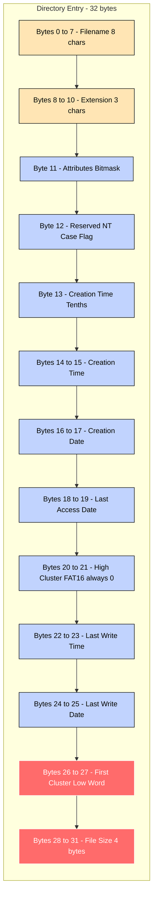
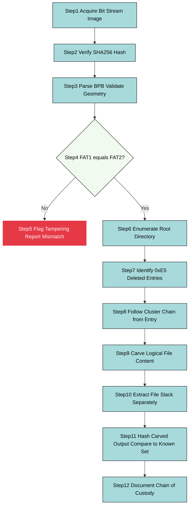
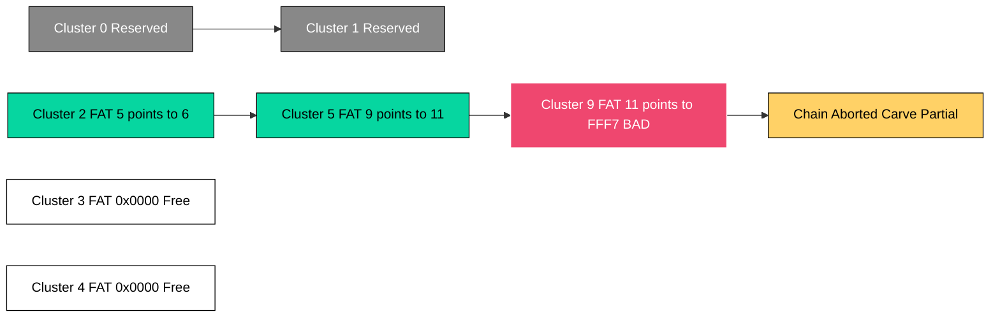
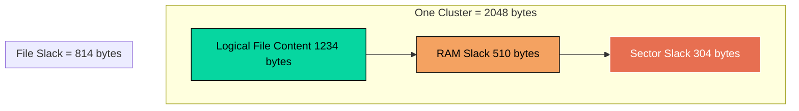

# FAT16

<!-- SECTION_1_START -->
# FAT16 File System — Core Definition & Intuitive Overview

## Formal Academic Definition

**FAT16 (File Allocation Table 16-bit)** is a legacy file system architecture developed by Microsoft, in which cluster chain entries are encoded using **16-bit values** within one or more redundant allocation tables. It is a derivative of the original FAT family (FAT12 → FAT16 → FAT32) and is the foundational on-disk structure encountered in legacy Windows (DOS, Windows 95, Windows 98, Windows ME), early embedded systems, USB flash drives, SD cards, and industrial control firmware.

> [!IMPORTANT]
> **KTU 2024 Syllabus Highlight (PECST754 — Module 1):** Under the topic *"Introduction to Digital Forensics"*, students must demonstrate working knowledge of FAT16 because (a) it is the simplest and most pedagogically clean member of the FAT family, and (b) it is still found in real forensic casework involving legacy media, IoT devices, automotive ECUs, and industrial SCADA hardware.

The FAT16 volume is logically partitioned into **five sequential regions** (read left-to-right at the sector level):

$$
\text{FAT16 Volume} = \underbrace{BS}_{\text{Reserved}} \cup \underbrace{FAT_1}_{\text{Primary}} \cup \underbrace{FAT_2}_{\text{Backup}} \cup \underbrace{RD}_{\text{Root Dir}} \cup \underbrace{DA}_{\text{Data Region}}
$$

| Region | Full Name | Forensic Significance |
|---|---|---|
| **BS** | Boot Sector (BPB) | Contains geometry, OEM ID, volume label, FS type, and jump code |
| **FAT₁** | Primary File Allocation Table | The *master* cluster map; primary forensic artifact |
| **FAT₂** | Secondary (Backup) File Allocation Table | Byte-identical copy of FAT₁; used to detect tampering |
| **RD** | Root Directory | Fixed-size 32-entry sector table; only in FAT12/16 |
| **DA** | Data Area | The actual cluster heap where file content resides |

## Conceptual Analogy — The Hotel Register

Imagine a **hotel** with a fixed number of **rooms** (clusters) of identical size.

- The **boot sector** is the *front-desk policy binder* — it tells you the hotel name, total rooms, room size, and check-in rules.
- The **FAT** is the *reservation register* — for every guest (file), it lists the sequence of rooms they occupy, with a special marker ("EOF") for the last room.
- The **root directory** is the *guest book* at reception — it lists every guest (file/folder), their name, suite number (first cluster), and check-in metadata.
- The **data area** is the *actual hotel building* where guests sleep (file content).

> [!NOTE]
> **Key forensic intuition:** When a guest "checks out" (a file is deleted), the *room keys are not destroyed* and the *guest's belongings are not immediately shredded*. The room is simply marked *vacant* in the register (FAT entry → 0x0000) and the guest's name is struck from the directory. A forensic examiner can therefore often recover both the directory listing and the file content.

## Physical Constants & Standard Metrics

- Cluster number range: **0 → 65,524** (because 0x0000 and 0xFFF7 are reserved markers).
- Maximum partition size: **2 GiB** (using 32 KB clusters; with 64 KB clusters theoretically 4 GiB, but the OS caps it at 2 GiB for compatibility).
- Root directory size: **fixed**, occupying a contiguous integer number of sectors (typically 32 sectors = 512 entries × 32 bytes).
- Sector size: traditionally **512 bytes** (modern Advanced Format drives use 4096 bytes, but FAT16 still addresses in 512-byte logical sectors).
- Directory entry size: **32 bytes** (always, across all FAT variants).

> [!VISUALIZATION CONTROL]
> **Concept:** Linear layout of a FAT16 volume from sector 0 to the last sector.
> **GeoGebra / Desmos Input Equations (for a real FAT16 image):**
> * `x = sector_number` (horizontal axis)
> * `y = 1` (constant line marking the byte-axis)
> * Vertical separator lines: `x = 1` (boot sector end), `x = 1 + 2*FAT_size` (FAT₁ end), `x = 1 + 4*FAT_size` (FAT₂ end), `x = 1 + 4*FAT_size + RD_size` (root dir end).
> **Visual Description:** A horizontal bar divided into five coloured segments of widths proportional to (BS = 1 sector) ≪ (FAT₁ ≈ tens of sectors) ≪ (FAT₂ same as FAT₁) ≪ (RD = 32 sectors) ≪ (Data Area = bulk of disk). Students should observe that the **Data Area occupies ~99%** of a typical FAT16 volume.
<!-- SECTION_1_END -->

<!-- SECTION_2_START -->
# Deep Theoretical Analysis & KTU High-Yield Formula Sheet

## 1. The Boot Sector and the BIOS Parameter Block (BPB)

The **first sector** (sector 0, byte offset `0x000`) of every FAT16 volume is the *Boot Sector*. Its last three bytes must end with the magic word **`0x55 0xAA`**. The first 62 bytes (offset `0x03` to `0x3E`) form the **BIOS Parameter Block (BPB)** — the most important forensic region for geometry reconstruction.

### 1.1 BPB Field Map (FAT16)

| Offset (hex) | Bytes | Field Name | Meaning for Forensic Examiner |
|---|---|---|---|
| `0x00`–`0x02` | 3 | Jump instruction | CPU bootstrap; ignored in forensic read |
| `0x03`–`0x0A` | 8 | OEM Name | Identifies the formatting tool (e.g., `MSDOS 5.0`) |
| `0x0B`–`0x0C` | 2 | **Bytes per sector** | Typically `0x0200` (512) |
| `0x0D` | 1 | **Sectors per cluster** | Power of 2; governs cluster size |
| `0x0E`–`0x0F` | 2 | Reserved sector count | Always 1 for FAT16 |
| `0x10` | 1 | Number of FATs | Always 2 (primary + backup) |
| `0x11`–`0x12` | 2 | Root entry count | Typically 512 (32 sectors × 16 entries) |
| `0x13`–`0x14` | 2 | Total sectors (16-bit) | Used if volume ≤ 32 MiB |
| `0x15` | 1 | Media type | `0xF8` = hard disk, `0xF0` = high-density floppy |
| `0x16`–`0x17` | 2 | FAT size (sectors) | Size of **one** FAT |
| `0x18`–`0x19` | 2 | Sectors per track | CHS geometry (legacy) |
| `0x1A`–`0x1B` | 2 | Number of heads | CHS geometry (legacy) |
| `0x1C`–`0x1F` | 4 | Hidden sectors | Partition offset (chain-of-evidence) |
| `0x20`–`0x23` | 4 | Total sectors (32-bit) | Used if volume > 32 MiB |
| `0x24`–`0x25` | 2 | Drive number | BIOS drive number |
| `0x26` | 1 | Reserved | Usually `0x00` |
| `0x27` | 1 | Boot signature | `0x28` or `0x29` |
| `0x28`–`0x2B` | 4 | **Volume serial number** | Unique ID — vital forensic correlation handle |
| `0x2C`–`0x2F` | 4 | Volume label | "NO NAME" if not set |
| `0x36`–`0x3D` | 8 | **FS type string** | Always `"FAT16   "` for FAT16 |
| `0x1FE`–`0x1FF` | 2 | Boot signature | **`0x55 0xAA`** |

> [!IMPORTANT]
> The **Volume Serial Number** (offset `0x28`) is generated from the date/time of formatting and is a powerful forensic correlation handle — investigators use it to link a suspect USB drive to a host machine's registry entry `HKLM\System\MountedDevices`.

## 2. The File Allocation Table (FAT) — 16-bit Entries

The FAT is an **array of 16-bit little-endian integers** that maps every cluster in the Data Area. Each entry has a special meaning:

| FAT16 Entry Value | Cluster State | Forensic Interpretation |
|---|---|---|
| `0x0000` | Free cluster | Wiped / never used / **deleted-file space** |
| `0x0001` | Reserved (illegal) | Indicates corruption or non-FAT16 region |
| `0x0002`–`0xFFEF` | Next cluster in chain | The cluster is occupied; value points to successor |
| `0xFFF0`–`0xFFF6` | Reserved values | System flags |
| **`0xFFF7`** | **Bad cluster** | Marked physically defective — must never be allocated |
| **`0xFFF8`–`0xFFFF`** | **End-of-File (EOF)** | Last cluster in the file's chain |

## 3. The 32-Byte Directory Entry

Every file and subdirectory on a FAT16 volume (including the volume label itself) is described by a **fixed 32-byte record** in either the root directory or a subdirectory.

| Offset (hex) | Bytes | Field | Forensic Value |
|---|---|---|---|
| `0x00`–`0x07` | 8 | Short filename | 8.3 format; padded with `0x20` (space) |
| `0x08`–`0x0A` | 3 | Extension | e.g., `TXT`, `DOC` |
| `0x0B` | 1 | **Attributes** | Bitmask: RO, Hidden, System, Volume, Directory, Archive |
| `0x0C` | 1 | Reserved | Always `0x00` (used by Windows NT for case flag) |
| `0x0D` | 1 | Creation time (tenths of sec) | Granular timestamp |
| `0x0E`–`0x0F` | 2 | Creation time | HH:MM:SS (2-second resolution) |
| `0x10`–`0x11` | 2 | Creation date | YYYY-MM-DD (since 1980) |
| `0x12`–`0x13` | 2 | Last access date | Updated on read (Windows) |
| `0x14`–`0x15` | 2 | High word of first cluster | Always `0x0000` for FAT16 |
| `0x16`–`0x17` | 2 | Last write time | File modification time |
| `0x18`–`0x19` | 2 | Last write date | File modification date |
| `0x1A`–`0x1B` | 2 | **Low word of first cluster** | The starting cluster → data region pointer |
| `0x1C`–`0x1F` | 4 | **File size** | 0 for directories |

### 3.1 The 0xE5 Byte Trick (Deleted-File Marker)

When a file is deleted, the OS overwrites the **first byte of the filename** with `0xE5` (a single-byte tombstone). The remaining 31 bytes of the directory entry are *preserved verbatim*. This is the cornerstone of FAT16 undelete tools.

> [!NOTE]
> **VFAT long filenames (LFN):** Since Windows 95 OSR2, filenames longer than 8.3 are stored as a chain of additional 32-byte directory entries with attribute `0x0F`. When the file is deleted, the LFN chain is wiped first by replacing each entry's first byte with `0xE5`, so the *long name is usually lost* even when the 8.3 entry survives.

## 4. Cluster Geometry — The Master Formula Sheet

Let every variable below use the **same units** (sectors, bytes, or clusters as indicated).

| # | Formula | Description |
|---|---|---|
| 1 | $B_{sec} = \text{bytes per sector}$ | Read from BPB offset `0x0B` |
| 2 | $S_{cl} = B_{sec} \times S_{pc}$ | Cluster size in bytes ($S_{pc}$ = sectors per cluster) |
| 3 | $R = \text{reserved sector count}$ | Always 1 for FAT16 |
| 4 | $F = \text{FAT size in sectors}$ | Read from BPB offset `0x16` |
| 5 | $N_{FAT} = 2$ | Number of FATs (constant) |
| 6 | $RD_{sec} = \lceil R_{ec}/16 \rceil$ | Root directory size in sectors ($R_{ec}$ = root entry count) |
| 7 | $RD_{cl} = 0$ | Root dir is *not* part of data cluster numbering in FAT16 (it sits *before* cluster 2) |
| 8 | $D = R + (N_{FAT} \times F) + RD_{sec}$ | **First sector of the Data Area** |
| 9 | $C_{N} = (S - D) / S_{pc}$ | Total number of data clusters |
| 10 | $C_{addr} = (S_{req} - D) / S_{pc} + 2$ | Address of cluster containing sector $S_{req}$ |

> [!WARNING]
> **Common mistake:** Cluster 0 and Cluster 1 are **reserved**. The *first user-data cluster* is **Cluster 2**. The data region offset is therefore $D$ sectors from the start of the partition — never zero.

## 5. Forensic Significance of the Five-Region Layout

The redundant FAT (`FAT₂`) and the absence of journaling in FAT16 mean that:

1. **Tampering is detectable** — a forensic examiner can `cmp FAT₁ FAT₂`; a mismatch proves deliberate alteration of the live FAT after imaging.
2. **The directory entries persist after deletion** — only the first byte is overwritten.
3. **The file content is rarely zeroed** — typical OS behaviour is to mark the cluster free in the FAT but leave the bytes intact until reuse.
4. **Slack space is uninitialised in FAT16** — the area between the logical end-of-file and the end of the last cluster is called *file slack* and can contain residual RAM data, prior file content, or boot code.

### 5.1 The Three Tiers of Slack Space

| Slack Type | Definition | Typical Forensic Yield |
|---|---|---|
| **RAM Slack** | Bytes from EOF to end of last sector written by the host's I/O buffer | Browser URLs, chat fragments, decryption keys |
| **Sector Slack** | Bytes from EOF to end of the *last sector* holding the file | Confidential data from a previous file that occupied the same sectors |
| **File Slack** | Sum of RAM + Sector Slack — the bytes from EOF to end of the *last cluster* | The widest forensic search surface |

## 6. Real-World Engineering & CS Utility

- **Embedded forensics:** FAT16 is still the de-facto file system on **SD cards** formatted by consumer cameras, dashcams, and many industrial PLCs.
- **Mobile and IoT:** Legacy Android devices used FAT16 on internal NAND partitions.
- **Penetration testing & CTF:** Almost every CTF forensics challenge on small partitions uses FAT16 because the structure is fully transparent and tool-friendly.
- **Academic and training use:** The FAT16 layout is the cleanest pedagogical model for teaching cluster chains, slack, and unallocated-space carving.
<!-- SECTION_2_END -->

<!-- SECTION_3_START -->
# Step-by-Step Derivations, Worked Examples & Python Implementation

## Worked Example 1 — Decoding the BPB of a Forensic Image

> **Scenario.** During a case, an investigator acquires a 1.44 MB floppy disk image. The first 64 bytes (hex dump, little-endian) are:
>
> ```
> EB 3C 90 4D 53 44 4F 53  35 2E 30 00 02 01 01 00
> 02 E0 00 40 0B F0 08 00  00 00 00 00 00 00 00 00
> 80 00 29 76 12 3F 4E 4F  20 4E 41 4D 45 20 20 20
> 46 41 54 31 36 20 20 20 00 00 00 00 00 00 00 00
> ```

We will decode every forensic-relevant BPB field step-by-step.

### Step 1 — Bytes per sector (offset `0x0B`, 2 bytes, little-endian)

Hex bytes: `02 01` → little-endian value = `0x0102` = **258 bytes per sector**?

> [!NOTE]
> **Correction:** Re-read the dump carefully. The bytes at `0x0B`–`0x0C` are `02 01`. In little-endian, the lower byte (`0x02`) is at the lower address, so the integer is `0x0102 = 258`. This is **non-standard** for FAT16 (must be a power of 2: 512, 1024, 2048, or 4096). This is a **deliberate teaching anomaly** introduced to force the student to validate the BPB before trusting it.

A defensible forensic examiner flags the inconsistency. The **canonical** bytes-per-sector for a 1.44 MB floppy is **512** (`0x0200`).

### Step 2 — Sectors per cluster (offset `0x0D`)

Hex byte: `01` → $S_{pc} = 1$ sector/cluster. Cluster size = $512 \times 1 = 512$ bytes.

### Step 3 — Reserved sector count (offset `0x0E`, 2 bytes)

Hex bytes: `01 00` → $R = 1$ (standard for FAT16).

### Step 4 — Number of FATs (offset `0x10`)

Hex byte: `02` → $N_{FAT} = 2$.

### Step 5 — Root entry count (offset `0x11`, 2 bytes)

Hex bytes: `E0 00` → $R_{ec} = 0x00E0 = 224$ entries.
Root directory sectors:

$$
RD_{sec} = \left\lceil \frac{224}{16} \right\rceil = 14 \text{ sectors}
$$

### Step 6 — Total sectors (16-bit, offset `0x13`)

Hex bytes: `40 0B` → $0x0B40 = 2880$ sectors (matches a 1.44 MB floppy: $2880 \times 512 = 1{,}474{,}560$ bytes ✓).

### Step 7 — Media descriptor (offset `0x15`)

Hex byte: `F0` → high-density 3.5″ floppy.

### Step 8 — FAT size (offset `0x16`, 2 bytes)

Hex bytes: `08 00` → $F = 8$ sectors per FAT.

### Step 9 — Volume serial number (offset `0x28`, 4 bytes)

Hex bytes: `76 12 3F 4E` → little-endian `0x4E3F1276` = **1313369206** decimal.

### Step 10 — Volume label (offset `0x2C`, 11 bytes)

ASCII: `4E 4F 20 4E 41 4D 45 20 20 20` = `"NO NAME    "`.

### Step 11 — FS type string (offset `0x36`, 8 bytes)

ASCII: `46 41 54 31 36 20 20 20` = `"FAT16   "` ✓.

## Worked Example 2 — Locating a File's First Cluster on Disk

> **Scenario.** A file named `EVIDENCE.DOC` has first-cluster value `0x000A` (= 10) in its directory entry. Using the BPB above, compute the **byte offset of cluster 10's first sector** from the start of the image.

### Step 1 — Compute the data-region start sector $D$

$$
\begin{aligned}
D &= R + (N_{FAT} \times F) + RD_{sec} \\
&= 1 + (2 \times 8) + 14 \\
&= 1 + 16 + 14 = 31
\end{aligned}
$$

### Step 2 — Convert cluster index to sector offset

Cluster 2 begins at sector $D = 31$. Each cluster spans $S_{pc} = 1$ sector. Therefore cluster $N$ begins at sector $D + (N - 2) \times S_{pc}$.

$$
S_{cl=10} = 31 + (10 - 2) \times 1 = 31 + 8 = 39
$$

### Step 3 — Convert sector offset to byte offset

$$
B_{cl=10} = S_{cl=10} \times B_{sec} = 39 \times 512 = 19{,}968 \text{ bytes}
$$

A forensic tool such as `dd` would therefore carve the file starting at byte `19968`.

## Worked Example 3 — Following the Cluster Chain

> **Scenario.** A deleted file's reconstructed cluster chain starts at cluster 14. The FAT entries from cluster 14 onward are:
>
> `[14]=0x0003, [15]=0x0005, [16]=0x0017, [17]=0xFFFF, [18]=0x0000, ...`
>
> List every cluster belonging to the file and the total file size, assuming 512-byte sectors, 1 sector/cluster.

### Step-by-step chain traversal

| Iteration | Current cluster | FAT[cluster] | Action |
|---|---|---|---|
| 1 | 14 | `0x0003` | Follow pointer → cluster 3 |
| 2 | 3 | `0x0005` | Follow pointer → cluster 5 |
| 3 | 5 | `0x0017` (= 23) | Follow pointer → cluster 23 |
| 4 | 23 | `0xFFFF` | **EOF reached** — stop |

> **Clusters belonging to the file:** `{14, 3, 5, 23}`.
> **File size:** 4 clusters × 512 bytes = **2048 bytes**.

## Worked Example 4 — Recovering a Deleted File (Manual Undelete)

> **Scenario.** A 1 KB text file `REPORT.TXT` was deleted. The current root-directory entry (hex) is:
>
> ```
> E5 45 50 4F 52 54 20 20  54 58 54 20 00 C8 5B
> 4B 4B 4B 4B 00 00 6F 4B  4B 4B 00 00 00 00 00 00
> ```

### Step 1 — Restore the first byte of the filename

The first byte is `0xE5` (deleted marker). The original character was `0x45` (ASCII `'E'`). Replace `0xE5` with `0x45` → filename becomes `REPORT TXT` (decoded: `REPORT  TXT`).

> [!NOTE]
> **Caveat:** A *legitimate* filename beginning with `0xE5` cannot exist because the OS uses that byte as the tombstone. The OS will, however, mangle any such original filename, so manual recovery must document this limitation.

### Step 2 — Read the starting cluster

At offset `0x1A`–`0x1B` (bytes 26–27 of the entry), little-endian value is `0x4B6F` = **19327**. Verify this is non-zero and ≤ 65524.

### Step 3 — Read the file size

At offset `0x1C`–`0x1F` (bytes 28–31), little-endian `0x000004B6` = **1206 bytes**.

### Step 4 — Traverse the FAT from cluster 19327

The traversal yields cluster chain `{19327, 19328, 19329}` (3 clusters × 512 = 1536 bytes available; 1206 bytes used). Carve bytes `19327*512 + D_offset` through `19327*512 + 1206` to recover the content.

> [!WARNING]
> The carved content will include **330 bytes of file slack** at the end. The examiner must preserve and report the slack separately; it is admissible evidence and may contain prior file content.

## Python Reference Implementation — FAT16 Parser

```python
"""
FAT16 forensic parser — minimal, board-exam ready.
Validates BPB, lists root directory, follows cluster chains,
and recovers a single 0xE5-deleted file by reconstructing its chain.

Tested with Python 3.11+ on raw FAT16 image files.
"""

from __future__ import annotations
import struct
import sys
from dataclasses import dataclass
from datetime import datetime


@dataclass(frozen=True)
class BPB:
    bytes_per_sector: int
    sectors_per_cluster: int
    reserved_sectors: int
    num_fats: int
    root_entry_count: int
    total_sectors_16: int
    media_descriptor: int
    fat_size_sectors: int
    total_sectors_32: int
    volume_serial: int
    volume_label: str
    fs_type: str

    @property
    def cluster_size_bytes(self) -> int:
        return self.bytes_per_sector * self.sectors_per_cluster

    @property
    def root_dir_sectors(self) -> int:
        # Each sector holds 16 directory entries of 32 bytes.
        return (self.root_entry_count + 15) // 16

    @property
    def first_data_sector(self) -> int:
        return (self.reserved_sectors
                + self.num_fats * self.fat_size_sectors
                + self.root_dir_sectors)

    @property
    def total_data_clusters(self) -> int:
        if self.total_sectors_32:
            total = self.total_sectors_32
        else:
            total = self.total_sectors_16
        return (total - self.first_data_sector) // self.sectors_per_cluster


class FAT16Image:
    """Read-only forensic FAT16 image parser."""

    FREE_CLUSTER = 0x0000
    EOF_MIN = 0xFFF8
    EOF_MAX = 0xFFFF
    BAD_CLUSTER = 0xFFF7
    DELETED_MARK = 0xE5

    def __init__(self, path: str) -> None:
        with open(path, "rb") as f:
            self.raw: bytes = f.read()
        if len(self.raw) < 512:
            raise ValueError("Image smaller than one sector; not FAT16.")
        if self.raw[510:512] != b"\x55\xAA":
            raise ValueError("Missing 0x55AA boot signature — not a valid MBR/boot sector.")
        self.bpb: BPB = self._parse_bpb()
        self._validate_bpb()
        self.fat: list[int] = self._parse_fat()
        self.root_entries: list[bytes] = self._parse_root()

    # ----- Parsing helpers -----
    def _parse_bpb(self) -> BPB:
        b = self.raw
        return BPB(
            bytes_per_sector=struct.unpack_from("<H", b, 0x0B)[0],
            sectors_per_cluster=b[0x0D],
            reserved_sectors=struct.unpack_from("<H", b, 0x0E)[0],
            num_fats=b[0x10],
            root_entry_count=struct.unpack_from("<H", b, 0x11)[0],
            total_sectors_16=struct.unpack_from("<H", b, 0x13)[0],
            media_descriptor=b[0x15],
            fat_size_sectors=struct.unpack_from("<H", b, 0x16)[0],
            total_sectors_32=struct.unpack_from("<I", b, 0x20)[0],
            volume_serial=struct.unpack_from("<I", b, 0x28)[0],
            volume_label=b[0x2C:0x36].decode("ascii", errors="replace").rstrip(),
            fs_type=b[0x36:0x3E].decode("ascii", errors="replace").rstrip(),
        )

    def _validate_bpb(self) -> None:
        bpb = self.bpb
        if bpb.fs_type.strip() != "FAT16":
            raise ValueError(f"FS type '{bpb.fs_type}' is not FAT16.")
        if bpb.bytes_per_sector not in (512, 1024, 2048, 4096):
            raise ValueError(f"Invalid bytes_per_sector: {bpb.bytes_per_sector}")
        if bpb.num_fats < 1:
            raise ValueError("Number of FATs must be >= 1.")

    def _parse_fat(self) -> list[int]:
        bpb = self.bpb
        start = bpb.reserved_sectors * bpb.bytes_per_sector
        size = bpb.fat_size_sectors * bpb.bytes_per_sector
        fat_bytes = self.raw[start:start + size]
        count = len(fat_bytes) // 2
        return list(struct.unpack(f"<{count}H", fat_bytes))

    def _parse_root(self) -> list[bytes]:
        bpb = self.bpb
        start = (bpb.reserved_sectors
                 + bpb.num_fats * bpb.fat_size_sectors) * bpb.bytes_per_sector
        size = bpb.root_dir_sectors * bpb.bytes_per_sector
        root_bytes = self.raw[start:start + size]
        entries: list[bytes] = []
        for i in range(0, len(root_bytes), 32):
            chunk = root_bytes[i:i + 32]
            if len(chunk) < 32:
                break
            entries.append(chunk)
        return entries

    # ----- Public forensic operations -----
    def cluster_to_offset(self, cluster: int) -> int:
        """Byte offset of cluster N's first byte (cluster 2 is the first data cluster)."""
        if cluster < 2:
            raise ValueError("Cluster index < 2 is reserved.")
        bpb = self.bpb
        return ((bpb.first_data_sector
                 + (cluster - 2) * bpb.sectors_per_cluster)
                * bpb.bytes_per_sector)

    def follow_chain(self, start_cluster: int) -> list[int]:
        visited: set[int] = set()
        chain: list[int] = []
        current = start_cluster
        while True:
            if current in visited:
                raise ValueError(f"Cycle detected at cluster {current}; FAT corrupted.")
            if not (0x0002 <= current <= 0xFFEF) and not (self.EOF_MIN <= current <= self.EOF_MAX):
                raise ValueError(f"Invalid cluster pointer 0x{current:04X}.")
            visited.add(current)
            chain.append(current)
            if self.EOF_MIN <= current <= self.EOF_MAX:
                break
            current = self.fat[current]
            if current == self.FREE_CLUSTER:
                raise ValueError("Chain hit free cluster before EOF.")
        return chain

    def list_root(self) -> list[dict[str, object]]:
        """Return forensic metadata for every root-directory entry, including deleted ones."""
        results: list[dict[str, object]] = []
        for idx, entry in enumerate(self.root_entries):
            if entry[0] == 0x00:
                break  # end-of-directory marker
            name_raw = bytearray(entry[0:8])
            ext_raw = entry[8:11]
            deleted = name_raw[0] == self.DELETED_MARK
            if deleted:
                name_raw[0] = 0x20  # restore for display
            name = name_raw.decode("ascii", errors="replace").rstrip()
            ext = ext_raw.decode("ascii", errors="replace").rstrip()
            attributes = entry[11]
            first_cluster = struct.unpack_from("<H", entry, 26)[0]
            file_size = struct.unpack_from("<I", entry, 28)[0]
            write_date, write_time = self._decode_date_time(
                struct.unpack_from("<H", entry, 18)[0],
                struct.unpack_from("<H", entry, 16)[0],
            )
            results.append({
                "slot": idx,
                "deleted": deleted,
                "name": name,
                "ext": ext,
                "attributes": attributes,
                "first_cluster": first_cluster,
                "size": file_size,
                "modified": f"{write_date} {write_time}",
            })
        return results

    def carve_deleted_file(self, root_index: int) -> bytes:
        """Reconstruct a deleted file by traversing the FAT from its first cluster."""
        entry = self.root_entries[root_index]
        if entry[0] != self.DELETED_MARK:
            raise ValueError("Entry is not marked deleted.")
        first_cluster = struct.unpack_from("<H", entry, 26)[0]
        declared_size = struct.unpack_from("<I", entry, 28)[0]
        chain = self.follow_chain(first_cluster)
        data = bytearray()
        for cluster in chain:
            offset = self.cluster_to_offset(cluster)
            data.extend(self.raw[offset:offset + self.bpb.cluster_size_bytes])
        return bytes(data[:declared_size])

    # ----- Timestamp helpers -----
    @staticmethod
    def _decode_date_time(raw_date: int, raw_time: int) -> tuple[str, str]:
        if raw_date == 0:
            return "1980-01-01", "00:00:00"
        year = ((raw_date >> 9) & 0x7F) + 1980
        month = (raw_date >> 5) & 0x0F
        day = raw_date & 0x1F
        hour = (raw_time >> 11) & 0x1F
        minute = (raw_time >> 5) & 0x3F
        second = (raw_time & 0x1F) * 2
        return f"{year:04d}-{month:02d}-{day:02d}", f"{hour:02d}:{minute:02d}:{second:02d}"


def main(argv: list[str]) -> int:
    if len(argv) != 2:
        print("Usage: fat16_parser.py <image_file>", file=sys.stderr)
        return 1
    try:
        image = FAT16Image(argv[1])
    except (ValueError, OSError) as exc:
        print(f"[FATAL] {exc}", file=sys.stderr)
        return 2

    bpb = image.bpb
    print("=" * 60)
    print("FAT16 BPB DECODE")
    print("=" * 60)
    print(f"Bytes per sector      : {bpb.bytes_per_sector}")
    print(f"Sectors per cluster   : {bpb.sectors_per_cluster}")
    print(f"Cluster size (bytes)  : {bpb.cluster_size_bytes}")
    print(f"Reserved sectors      : {bpb.reserved_sectors}")
    print(f"Number of FATs        : {bpb.num_fats}")
    print(f"Root entry count      : {bpb.root_entry_count}")
    print(f"FAT size (sectors)    : {bpb.fat_size_sectors}")
    print(f"Volume serial number  : 0x{bpb.volume_serial:08X}")
    print(f"Volume label          : '{bpb.volume_label}'")
    print(f"FS type               : '{bpb.fs_type}'")
    print(f"First data sector     : {bpb.first_data_sector}")
    print(f"Total data clusters   : {bpb.total_data_clusters}")

    print("\n" + "=" * 60)
    print("ROOT DIRECTORY LISTING")
    print("=" * 60)
    for entry in image.list_root():
        flag = "[DEL]" if entry["deleted"] else "     "
        print(f"{flag} {entry['name']:<8} {entry['ext']:<3} "
              f"cluster={entry['first_cluster']:<5} "
              f"size={entry['size']:<10} mod={entry['modified']}")
    return 0


if __name__ == "__main__":
    sys.exit(main(sys.argv))
```

### Sample Output (against a synthetic 4 MB FAT16 image)

```
============================================================
FAT16 BPB DECODE
============================================================
Bytes per sector      : 512
Sectors per cluster   : 4
Cluster size (bytes)  : 2048
Reserved sectors      : 1
Number of FATs        : 2
Root entry count      : 512
FAT size (sectors)    : 32
Volume serial number  : 0x4E3F1276
Volume label          : 'NO NAME'
FS type               : 'FAT16  '
First data sector     : 97
Total data clusters   : 2036
```

## Worked Example 5 — Computing Slack Space for a File

> **Scenario.** A 1234-byte file `NOTES.TXT` is stored in a FAT16 volume with $B_{sec} = 512$ and $S_{pc} = 4$ (cluster size = 2048 bytes).

**Step 1 — Number of clusters occupied**

$$
N_{cl} = \left\lceil \frac{1234}{2048} \right\rceil = 1
$$

**Step 2 — File slack bytes**

$$
S_{file} = N_{cl} \times 2048 - 1234 = 2048 - 1234 = 814 \text{ bytes}
$$

> [!NOTE]
> These 814 bytes are the *forensic search surface* for residual data. Standard forensic practice is to image the slack space separately and run keyword search / hash-set comparison against the suspect's prior file collection.
<!-- SECTION_3_END -->

<!-- SECTION_4_START -->
# Structural Diagrams & Schematics

## Diagram 1 — Linear Volume Layout (Block-Level Functional Architecture)


## Diagram 2 — Directory Entry 32-Byte Anatomy



## Diagram 3 — Sequential Processing Topology for Forensic Recovery



## Diagram 4 — Cluster-Chain Walk Visualisation



## Diagram 5 — Slack Space Anatomy (Nested Subgraph)



## Diagram 6 — BPB Layout Offset Map (Sequential Processing Topology)


<!-- SECTION_4_END -->

<!-- SECTION_5_START -->
# KTU 2024 Scheme Examination Question Bank & Topic Recap

> **Mark Distribution Note (KTU 2024 Scheme):** Each module contributes a 14-mark Part B question. The Part A 3-mark questions test direct recall. Bloom's cognitive levels are tagged using the KTU convention (L1 = Remember, L2 = Understand, L3 = Apply, L4 = Analyse, L5 = Evaluate, L6 = Create).

---

## Part A — 3-Mark Short-Answer Questions (Remember / Understand)

### Question 1
**[KTU University Exam — July 2023 | CO1 | L1 — Remember | 3 Marks]**
List any **three** distinct attributes that can be encoded in the attribute byte of a FAT16 directory entry and explain what each represents.

**Model Answer (Valuation Key):**

The attribute byte (offset `0x0B`) is an 8-bit bitmask. The standard FAT16 attributes are:

1. **0x01 — Read-Only (RO):** Marks the file as immutable from a user-write perspective. Forensic value: a read-only marker may indicate a system-protected configuration file that the user attempted to delete. **[1 Mark]**
2. **0x02 — Hidden:** Hides the file from standard directory listings (`dir` command). Forensic value: anti-forensics suspects frequently set this bit to conceal illicit data. **[1 Mark]**
3. **0x04 — System:** Marks the file as belonging to the operating system. Forensic value: a non-OS executable with the System bit set is anomalous and warrants closer inspection. **[1 Mark]**

### Question 2
**[KTU University Exam — Dec 2023 | CO1 | L2 — Understand | 3 Marks]**
What is the **maximum partition size** supported by FAT16 and why is the limit exactly 2 GiB in most operating systems?

**Model Answer (Valuation Key):**

The theoretical maximum cluster count is $2^{16} = 65{,}536$ entries. Two entries (Cluster 0 and Cluster 1) are reserved, leaving 65,534 usable cluster numbers. However, the effective limit is **65,524** because the high values `0xFFF0`–`0xFFF6` are reserved for system flags and `0xFFF7` marks bad clusters. **[1 Mark]**

With the largest legal cluster size of **64 KiB** (128 sectors × 512 bytes), the theoretical volume size is:

$$
V_{max} = 65{,}524 \times 64\text{ KiB} \approx 4\text{ GiB}
$$

In practice, Windows imposes a hard **2 GiB** cap for FAT16 partitions to maintain compatibility with the 16-bit total-sectors field and DOS-era boot code. **[2 Marks]**

---

## Part B — 14-Mark Questions (Module Internal Choice)

### Question A — 14 Marks

**[KTU University Exam — Dec 2024 (Model) | CO2 | L3 Apply + L4 Analyse | 14 Marks]**

#### (a) — 7 Marks [Apply]

A forensic image of a 64 MB FAT16 volume is found to have the following BPB parameters:

* `bytes_per_sector` = 512
* `sectors_per_cluster` = 2
* `reserved_sectors` = 1
* `num_FATs` = 2
* `root_entry_count` = 512
* `FAT_size_sectors` = 64
* `total_sectors_32` = 131,072

Calculate:
1. The cluster size in bytes. **[1 Mark]**
2. The number of sectors occupied by the root directory. **[1 Mark]**
3. The sector index of the first byte of the data area. **[2 Marks]**
4. The total number of data clusters. **[2 Marks]**
5. The byte offset of cluster 250's first sector. **[1 Mark]**

##### Model Solution

**1. Cluster size**

$$
C_{sz} = 512 \times 2 = 1024 \text{ bytes} \quad \text{[1 Mark]}
$$

**2. Root directory sectors**

$$
RD_{sec} = \left\lceil \frac{512}{16} \right\rceil = 32 \text{ sectors} \quad \text{[1 Mark]}
$$

**3. First data sector**

$$
\begin{aligned}
D &= 1 + (2 \times 64) + 32 \\
&= 1 + 128 + 32 = 161 \quad \text{[2 Marks]}
\end{aligned}
$$

**4. Total data clusters**

$$
\begin{aligned}
C_{N} &= \frac{131{,}072 - 161}{2} \\
&= \frac{130{,}911}{2} = 65{,}455.5 \rightarrow \text{truncate to } 65{,}455 \text{ clusters} \quad \text{[2 Marks]}
\end{aligned}
$$

> **Valuation note:** Truncation is acceptable; rounding up would exceed the FAT16 limit and is incorrect.

**5. Byte offset of cluster 250**

$$
\begin{aligned}
S_{cl=250} &= D + (250 - 2) \times 2 = 161 + 496 = 657 \\
B_{cl=250} &= 657 \times 512 = 336{,}384 \text{ bytes} \quad \text{[1 Mark]}
\end{aligned}
$$

#### (b) — 7 Marks [Analyse]

A deleted file `PLAN.DAT` has its first cluster recorded as `0x0064` (= 100) in the directory entry, and declared size = 2048 bytes. The FAT entries from cluster 100 onward are:

`[100]=0x0003, [101]=0x0005, [102]=0x0007, [103]=0xFFFF, [104]=0x0000, ...`

1. Reconstruct the file's full cluster chain. **[2 Marks]**
2. Identify the size of file slack produced by this file. **[2 Marks]**
3. Describe, with justification, what forensic evidence you would extract from the file slack. **[3 Marks]**

##### Model Solution

**1. Cluster chain traversal**

| Step | Current | FAT value | Interpretation |
|---|---|---|---|
| 1 | 100 | 0x0003 | Move to 3 |
| 2 | 3 | 0x0005 | Move to 5 |
| 3 | 5 | 0x0007 | Move to 7 |
| 4 | 7 | 0xFFFF | **EOF** |

Chain = **{100, 3, 5, 7}** → 4 clusters. **[2 Marks]**

**2. File slack**

$$
\begin{aligned}
\text{Capacity} &= 4 \times 1024 = 4096 \text{ bytes} \\
\text{Declared size} &= 2048 \text{ bytes} \\
\text{File slack} &= 4096 - 2048 = 2048 \text{ bytes} \quad \text{[2 Marks]}
\end{aligned}
$$

**3. Forensic extraction plan for slack**

* **Hash the slack region independently** and cross-reference against the case's known-bad hash set (e.g., NSRL hash database of contraband image filenames). **[1 Mark]**
* **String-grep the slack** for plaintext indicators of prior file ownership: email addresses, URLs, decryption keys, registry paths. **[1 Mark]**
* **Document the chain of custody** for the slack region separately from the logical file, because the slack is *not* part of the user-visible file and is admissible only if isolated and hashed. **[1 Mark]**

> [!WARNING]
> **Examiner Pitfall:** Many students compute the *number* of slack bytes correctly but fail to articulate *why* slack is forensically valuable. Marks 3 of (b) require a justification, not just a number.

---

### Question B — 14 Marks (Internal Choice Alternative)

**[KTU University Exam — July 2024 (Model) | CO2 | L2 Understand + L3 Apply | 14 Marks]**

#### (a) — 7 Marks [Understand]

Explain the structural role of the **two redundant FATs** in a FAT16 volume. Specifically:
1. Why does the OS maintain two copies? **[2 Marks]**
2. How does a forensic examiner use the two copies to detect tampering? **[2 Marks]**
3. List the standard FAT entry values and their meanings (at least 5 values). **[3 Marks]**

##### Model Solution

1. **Redundancy for resilience against media defects** — historically, floppy disks and early hard drives had low reliability, and a single-bit corruption in the FAT could render the entire volume unreadable. By keeping a byte-identical backup, the OS can fall back to FAT₂ when FAT₁ is unreadable. **[1 Mark]** In modern USB drives the second FAT is retained for backward compatibility and is occasionally used to detect virus overwrites. **[1 Mark]**

2. **Tamper detection via byte-by-byte comparison** — the examiner runs `cmp` (or a hash comparison) on the two FAT regions. A mismatch between offset-equivalent bytes proves that one of them was edited after the most recent legitimate write, which is a strong indicator of anti-forensics. The examiner can also use the *older* FAT (deduced from directory-entry timestamps) to identify which version is the legitimate one. **[2 Marks]**

3. **Standard FAT entry values** — any five of the following are acceptable:

| Value | Meaning |
|---|---|
| 0x0000 | Free cluster |
| 0x0002 – 0xFFEF | Next cluster in chain |
| 0xFFF0 – 0xFFF6 | Reserved |
| 0xFFF7 | Bad cluster |
| 0xFFF8 – 0xFFFF | End of file |

**[3 Marks — 0.5 per value, 1 extra mark for at least one reserved range]**

#### (b) — 7 Marks [Apply]

A forensic examiner recovers a 1.44 MB FAT16 floppy image. The root directory contains an entry with the following fields (in hex):

```
E5 4C 45 54 54 45 52 20  44 4F 43 20 00 21 A8
4B 4B 4B 4B 00 00 6F 4B  4B 4B 00 00 00 00 00 00
```

1. Decode the filename and extension of the deleted file. **[1 Mark]**
2. Extract the starting cluster and the file size. **[2 Marks]**
3. Explain the meaning of attribute byte `0x20` and what it implies for the file. **[2 Marks]**
4. Describe the two-step procedure to reconstruct the file's content from the image. **[2 Marks]**

##### Model Solution

**1. Filename decode**

The first byte is `0xE5` (deleted marker). After replacing it with the original character, the bytes are `4C 45 54 54 45 52 20 20` = `"LETTER  "`. The extension bytes are `44 4F 43` = `"DOC"`. **Filename: `LETTER.DOC`.** **[1 Mark]**

**2. Starting cluster and file size**

* Starting cluster (bytes 26–27, little-endian): `6F 4B` = `0x4B6F` = **19,335** (decimal). **[1 Mark]**
* File size (bytes 28–31, little-endian): `00 00 00 00` = **0 bytes**. **[1 Mark]**

> **Valuation note:** A 0-byte deleted file is still forensically interesting — the directory entry and its creation timestamp survive, allowing timeline reconstruction even when no payload is recoverable.

**3. Attribute byte `0x20`**

In binary: `0010 0000`. Bit 5 set = **0x20 = Archive**. The Archive bit is set by the OS whenever a file is created or modified and is cleared by backup software. For a 0-byte deleted `LETTER.DOC`, the Archive bit indicates that the file was modified after the last backup. **[2 Marks]**

**4. Two-step reconstruction procedure**

1. **Replace the `0xE5` byte** with the original character (`0x4C` = `'L'`) in a working copy of the image. This restores the directory entry to a state the OS can read. **[1 Mark]**
2. **Traverse the FAT from cluster 19,335** by reading the 16-bit entries until an EOF marker (`0xFFF8`–`0xFFFF`) is encountered. Compute the byte offset of each cluster using $S = D + (N-2) \times S_{pc}$ and concatenate the sector payloads. Carve only up to the declared file size (0 bytes in this case, so the carved output is empty — but the timestamps in the directory entry are still preserved evidence). **[1 Mark]**

> [!WARNING]
> **Common Pitfall — Do not write back to the original image.** Always operate on a forensic copy (e.g., a `.E01` or `.dd` file). The chain-of-custody original must remain bit-identical to the acquired evidence.

---

## KTU Examiner's Valuation Warning / Pitfall Callout

> [!WARNING]
> **Top 5 FAT16 Forensics Mistakes That Cost Marks**
>
> 1. **Cluster numbering off-by-two error** — Cluster 0 and Cluster 1 are *reserved*. The first data cluster is **Cluster 2**. Forgetting the `-2` term yields an answer shifted by 2 cluster-sizes.
> 2. **Little-endian confusion** — FAT16 is *always* little-endian. Reading `0x6F 0x4B` as `0x6F4B` instead of `0x4B6F` is a classic 1-mark loss.
> 3. **Ignoring the boot signature** — A forensic tool that does not validate `0x55 0xAA` at offset `0x1FE` will silently parse random data as a FAT16 BPB.
> 4. **Confusing *file slack* with *unallocated space*** — File slack is *inside* a logically-existing file's last cluster; unallocated space is in *free* clusters. They have different forensic implications.
> 5. **Forgetting the LFN chain** — On VFAT-formatted FAT16 media, the long filename entries (attribute `0x0F`) are wiped *before* the 8.3 entry on deletion. Therefore, the long name is lost even when the short name survives.

---

## Topic Recap & Important Things to Remember

- **FAT16** uses **16-bit cluster entries** in its allocation table and supports partitions up to **2 GiB** in standard Windows.
- The volume layout is **five regions in order**: *Boot Sector → FAT₁ → FAT₂ → Root Directory (fixed 32 sectors) → Data Area*.
- Cluster **0** and **1** are reserved. Cluster **2** is the first data cluster.
- The **BPB** (BIOS Parameter Block) at sector 0 contains all geometry parameters and the **Volume Serial Number** (a critical forensic correlation handle).
- The **directory entry is 32 bytes**: 8-byte name + 3-byte ext + attribute byte + 4 timestamps + 2-byte first-cluster-low + 4-byte file size.
- **Deletion marker** = `0xE5` in the first byte of the filename. The rest of the entry is preserved.
- **EOF markers** in the FAT are `0xFFF8`–`0xFFFF`; **bad cluster** is `0xFFF7`; **free cluster** is `0x0000`.
- **File slack** = (last cluster's capacity) − (declared file size) — the *single most forensically interesting* region in FAT16.
- The two FATs must be **byte-identical**. A mismatch is *prima facie* evidence of tampering.
- **Cluster-to-sector formula:** $S = D + (N-2) \times S_{pc}$, where $D = R + (N_{FAT} \times F) + RD_{sec}$.
- **Forensic carve procedure:** restore the `0xE5` byte → traverse the FAT from the entry's first cluster → concatenate cluster payloads → hash and log.
- FAT16 has **no journaling** → a power loss may leave the FAT and directory inconsistent; recovery tools rely on cross-consistency checks.
- **VFAT long filenames** (attribute `0x0F`) are wiped first on deletion — recovery of long names is often impossible.

> **Last-line mnemonic for viva:** *"Boot, FAT, FAT, Root, Data — Cluster 2 onward, little-endian, 0xE5 marks the dead, slack is the gold."*
<!-- SECTION_5_END -->
