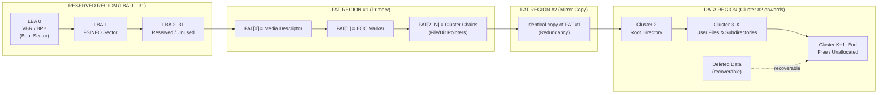
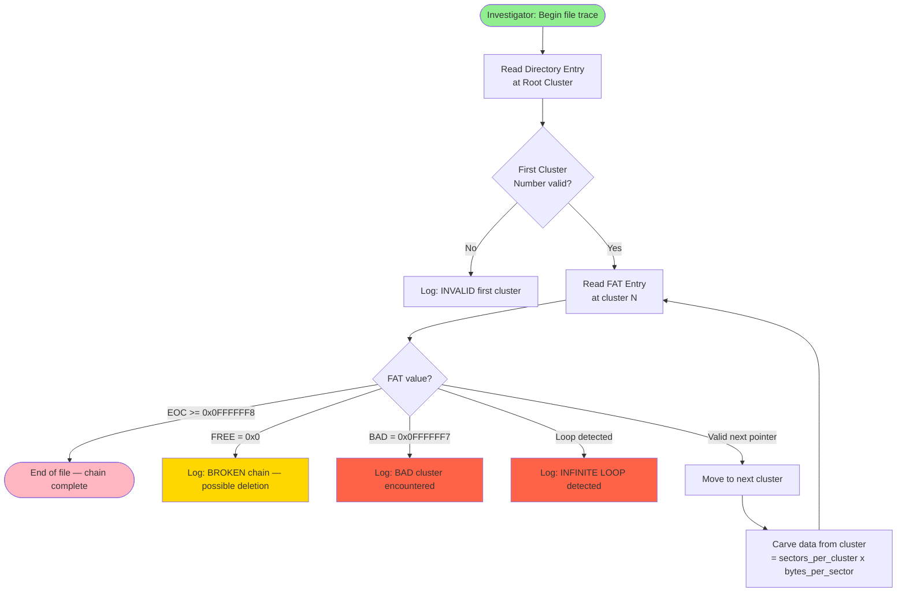
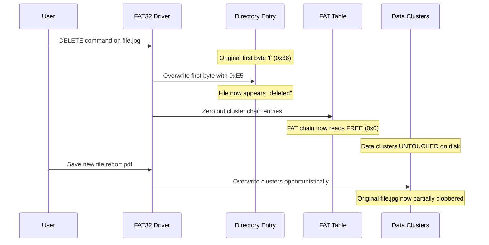
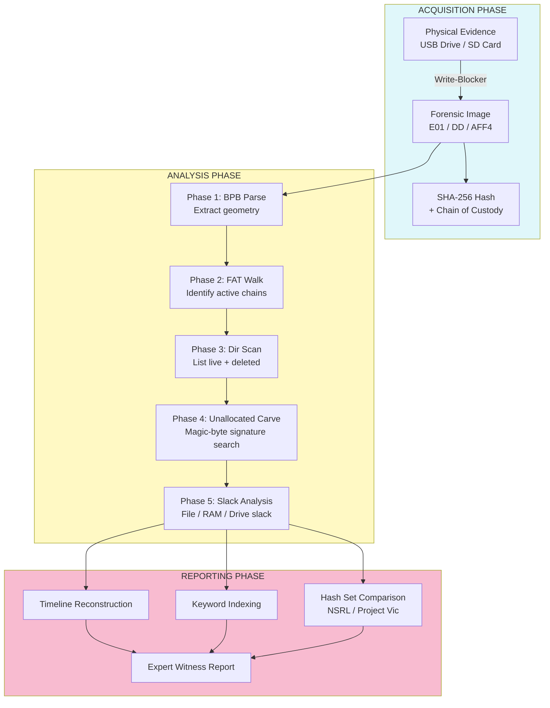

# FAT32

<!-- SECTION_1_START -->
# FAT32 File System — Core Definition & Intuitive Overview

## 1.1 Formal Academic Definition (KTU 2024 Syllabus Terminology)

The **File Allocation Table 32-bit (FAT32)** is a legacy, sector-addressed, cluster-based file system architecture originally introduced by **Microsoft** in 1996 (Windows 95 OSR2) and widely adopted across removable storage, USB flash drives, SD cards, and embedded systems. FAT32 organises logical storage using a **32-bit cluster address space** within a linked-list allocation table, and is governed by the **FAT32 File System Specification (Microsoft EFI / FAT32 Specification, rev. 1.03)** and **ECMA-107** standards.

> [!IMPORTANT]
> **KTU 2024 — Module 1 Focus:** In Digital Forensics, FAT32 is a *high-priority* topic because of its prevalence in evidentiary media (pen drives, memory cards, dash-cam SDs, drone storage). Examiners must be able to *manually trace deleted files*, *interpret cluster chains*, and *carve unallocated space* using FAT32 metadata structures.

> [!NOTE]
> **Physical Constants / Standard Parameters (per Microsoft FAT Spec):**
> - **Bytes per sector:** $512$ (standard) or $4096$ (advanced format drives)
> - **Sectors per cluster:** $1$ to $64$ (must be a power of 2)
> - **Maximum cluster count:** $2^{28} - 1 = 268{,}435{,}455$ clusters
> - **Maximum volume size:** $2\text{ TiB} - 1$ (theoretical); $32\text{ GiB}$ for OS-formatted volumes
> - **Reserved sectors:** Typically $32$ (must be a multiple of the sector size)
> - **Number of FATs:** $2$ (primary + mirror)

## 1.2 Conceptual Analogy — The "Library Card Catalogue" Model

Imagine a massive **library** (your SD card or USB drive) containing millions of books (files). Each book is too big to fit on a single **shelf** (sector), so it is split into many **chapter boxes** (clusters) and stored across the library. To find a book, the librarian uses a **giant index card file** called the FAT — a *linked list* that says *"Chapter 1 of Book X is on Shelf 47, Chapter 2 is on Shelf 48, Chapter 3… is on Shelf 199, END."*

- **Cluster** = a fixed-size storage box (e.g., $4\text{ KiB}$, $32\text{ KiB}$)
- **FAT Entry** = the index card pointing to the next cluster
- **EOC Mark (0x0FFFFFFF)** = the "END" stamp on the last card
- **Root Directory** in FAT32 is *no longer at a fixed location* (unlike FAT16) — it lives in the data region as a normal cluster chain
- **Deleted files** still leave their FAT entries behind until overwritten — *this is the forensic goldmine*

> [!TIP]
> **Forensic Intuition:** Even after you "permanently delete" a file from a FAT32 USB drive, the **directory entry's first byte is overwritten with `0xE5`** (the deletion sentinel) and the FAT chain is *zeroed out*, but the **data clusters remain on the disk untouched** until reused. This is why FAT32 is one of the most *recoverable* file systems.

## 1.3 GeoGebra / Desmos Visualisation

> [!VISUALIZATION CONTROL]
> **Concept:** Visualising cluster chain pointer arithmetic and the linear addressing geometry of a FAT32 volume.
> **Desmos Input Equations:**
> * $LBA = \text{Reserved} + (\text{FAT\#} \times \text{SizeOfFAT}) + (\text{Cluster\#} - 2) \times \text{SPCl}$
> * $y = 2^{x}$ (where $x$ = sectors per cluster exponent, $y$ = cluster size in sectors)
> **Visual Description:** Plot the linear function $LBA$ as $x$ = Cluster Number and $y$ = Logical Block Address. Observe how each successive cluster number increments the LBA by exactly the **Sectors Per Cluster (SPCl)** constant — a stair-step progression beginning at cluster $2$.

---

<!-- SECTION_1_END -->

<!-- SECTION_2_START -->
# FAT32 — Deep Theoretical Analysis & KTU High-Yield Formula Sheet

## 2.1 The Five Logical Regions of a FAT32 Volume

A FAT32 volume is partitioned into **five linear regions** mapped from **Logical Block Address (LBA) 0** outward:

1. **Reserved Region** (LBA 0 → ReservedSectorCount − 1)
   - Sector 0 = **VBR (Volume Boot Record)** — also called the Boot Sector or BPB (BIOS Parameter Block)
   - Sector 1 = **FSINFO Sector** — dynamic runtime metadata (free cluster count, next free hint)
   - Sectors 2..31 = typically reserved / unused
2. **FAT Region #1** (Primary FAT) — exact location and length from BPB
3. **FAT Region #2** (Mirror/Backup FAT) — bitwise identical copy of FAT #1
4. **Data Region** — begins at Cluster #2 and extends to the end of the partition
   - Cluster #2 is the **first data cluster**
   - **Root Directory** resides in this region (unlike FAT16/FAT12) and is itself a *cluster chain*

## 2.2 The BIOS Parameter Block (BPB) — Decoded Structure

The BPB is the forensic "ID card" of the volume. It lives in the first 512-byte sector and contains the geometry parameters needed to parse the entire file system.

| BPB Offset | Length (Bytes) | Field Name | Forensic Significance |
| :--- | :--- | :--- | :--- |
| $0x00$ | $3$ | Jump Boot Code | Assembly `EB xx 90` or `E9 xx xx` — confirms boot sector validity |
| $0x03$ | $8$ | OEM Name | e.g., `"MSDOS5.0"` — OEM tool signature |
| $0x0B$ | $2$ | Bytes Per Sector | **$512$** or **$4096$** — first geometric constant |
| $0x0D$ | $1$ | Sectors Per Cluster | Power of 2: 1, 2, 4, 8, 16, 32, 64, 128 |
| $0x0E$ | $2$ | Reserved Sector Count | Typically **$32$** for FAT32 |
| $0x10$ | $1$ | Number of FATs | Always **$2$** |
| $0x11$ | $2$ | Root Entry Count (FAT12/16) | **$0$** for FAT32 |
| $0x13$ | $2$ | Total Sectors (16-bit) | $0$ if count exceeds 16-bit range |
| $0x15$ | $1$ | Media Type | **$0xF8$** = hard disk, **$0xF0$** = high-density floppy |
| $0x20$ | $4$ | Total Sectors (32-bit) | Total sector count of the volume |
| $0x24$ | $4$ | FAT Size (in sectors) | Size of **ONE** FAT table |
| $0x2C$ | $4$ | Root Directory First Cluster | **Cluster # of the root directory** (e.g., 2) |
| $0x30$ | $2$ | FSInfo Sector | Usually **$1$** |
| $0x32$ | $2$ | Backup Boot Sector | Usually **$6$** |
| $0x40$ | $1$ | Drive Number | BIOS INT 13h drive number |
| $0x47$ | $4$ | Volume Serial Number | Created from date+time — unique forensic ID |
| $0x47$ | $11$ | Volume Label | ASCII, 11 bytes |

## 2.3 KTU High-Yield Formula Sheet

> [!NOTE]
> **All forensic cluster-to-byte address calculations** reduce to the four master equations below. Memorise these — they appear in **every** KTU ESE Part B question on FAT32.

### Master Geometry Equations

| # | Formula | LaTeX | Purpose |
| :--- | :--- | :--- | :--- |
| 1 | Cluster Size (bytes) | $C_{sz} = B_{sec} \times S_{cl}$ | Size of one cluster |
| 2 | FAT Region Start (LBA) | $F_{start} = R_{sec}$ | Where the first FAT table begins |
| 3 | Data Region Start (LBA) | $D_{start} = R_{sec} + (N_{FAT} \times F_{sz})$ | Where cluster #2 begins |
| 4 | Cluster $N$ LBA | $LBA(N) = D_{start} + (N - 2) \times S_{cl}$ | **The most-used formula in forensics** |
| 5 | Maximum Cluster Count | $N_{max} = 2^{28} = 268{,}435{,}456$ | Hard architectural limit |
| 6 | FAT Entry Value → Status | $EOC \in [0x0FFFFFF8, 0x0FFFFFFF]$ | End-Of-Chain marker |
| 7 | FAT Entry Value → Status | $BAD = 0x0FFFFFF7$ | Bad cluster sentinel |

**Where:**
- $B_{sec}$ = Bytes per sector
- $S_{cl}$ = Sectors per cluster
- $R_{sec}$ = Reserved sector count
- $N_{FAT}$ = Number of FATs
- $F_{sz}$ = FAT size (in sectors)
- $N$ = Cluster number (always $\geq 2$)

### Special FAT32 Cluster Address Meanings

| FAT Entry Value | Symbol | Meaning |
| :--- | :--- | :--- |
| $0x00000000$ | FREE | Cluster is available (unallocated) |
| $0x00000001$ | RESERVED | Reserved cluster (do not use) |
| $0x00000002$ | RESERVED2 | Second reserved cluster |
| $0x0FFFFFF7$ | BAD | Bad cluster — hardware defect |
| $0x0FFFFFF8$ – $0x0FFFFFFF$ | EOC | End-Of-Chain — last cluster of file |
| Any other value | NEXT | Points to the next cluster in the chain |

## 2.4 Directory Entry Structure (32 bytes per entry)

A directory is a linear array of 32-byte entries. Deleted files have the first byte replaced by **$0xE5$**.

| Offset | Length | Field | Notes |
| :--- | :--- | :--- | :--- |
| $0x00$ | $1$ | DIR_Name[0] | $0xE5$ = deleted; $0x00$ = end; $0x05$ = actual $0xE5$ |
| $0x01$ | $10$ | DIR_Name[1..10] | 8.3 short filename (no dots) |
| $0x0B$ | $1$ | DIR_Attr | Attribute byte (see below) |
| $0x0C$ | $1$ | DIR_NTRes | Reserved; for case info |
| $0x0D$ | $1$ | DIR_CrtTimeTenth | Creation time tenths of second |
| $0x14$ | $2$ | DIR_FstClusHI | High 16 bits of first cluster (FAT32!) |
| $0x1A$ | $2$ | DIR_FstClusLO | Low 16 bits of first cluster |
| $0x1C$ | $4$ | DIR_FileSize | 32-bit file size in bytes |

### Attribute Byte Bitmask

| Bit (Hex) | Symbol | Meaning |
| :--- | :--- | :--- |
| $0x01$ | ATTR_READ_ONLY | Read-only file |
| $0x02$ | ATTR_HIDDEN | Hidden file |
| $0x04$ | ATTR_SYSTEM | System file |
| $0x08$ | ATTR_VOLUME_ID | Volume label entry |
| $0x10$ | ATTR_DIRECTORY | Directory entry |
| $0x20$ | ATTR_ARCHIVE | Archive (modified) flag |
| $0x0F$ | ATTR_LFN | Long File Name entry (combined mask) |

> [!TIP]
> **Forensic Note — Long File Names (LFN):** A file like `Annual_Report_2024.pdf` (longer than 8.3) is stored as a **sequence of LFN entries** placed *immediately before* the actual 8.3 short-name entry. Each LFN entry holds 13 UTF-16 characters. When deleted, **all** entries in the sequence must be unlinked. The checksum of the 8.3 name is used to bind LFN entries to their parent.

## 2.5 Real-World Engineering & Forensics Applications

| Domain | Application |
| :--- | :--- |
| **Pen-Drive Forensics** | Recovering deleted DOCX/JPEG files from FAT32 USB drives by scanning for file-signature magic bytes in unallocated clusters |
| **Memory Card Analysis** | Dash-cam, body-cam, drone, and smartphone SD card evidence extraction |
| **Embedded Systems** | Industrial IoT devices, routers, and automotive infotainment still use FAT32 for boot/upgrade partitions |
| **Malware Analysis** | Autorun.inf on FAT32 removable media is a classic malware vector (e.g., Stuxnet, Conficker) |
| **Mobile Forensics** | Older Android devices used FAT32 on the SD card external storage |
| **CTF / Cyber Ranges** | FAT32 is the standard "disk image" format in many digital forensics training challenges |

---

<!-- SECTION_2_END -->

<!-- SECTION_3_START -->
# FAT32 — Step-by-Step Derivations, Parsing Logic & Code Implementation

## 3.1 Derivation: Cluster LBA from Cluster Number

**Problem:** Given cluster number $N = 1450$ on a FAT32 volume with the following BPB parameters:
- $B_{sec} = 512$ bytes
- $S_{cl} = 8$ sectors/cluster
- $R_{sec} = 32$ reserved sectors
- $N_{FAT} = 2$ FATs
- $F_{sz} = 16384$ sectors per FAT

**Derive the absolute LBA of cluster #1450.**

$$
\begin{aligned}
\text{Step 1: Compute the Data Region starting LBA} \quad & \\
D_{start} &= R_{sec} + (N_{FAT} \times F_{sz}) \\
&= 32 + (2 \times 16{,}384) \\
&= 32 + 32{,}768 \\
&= 32{,}800
\end{aligned}
$$

$$
\begin{aligned}
\text{Step 2: Apply the cluster-to-LBA mapping} \quad & \\
LBA(1450) &= D_{start} + (N - 2) \times S_{cl} \\
&= 32{,}800 + (1450 - 2) \times 8 \\
&= 32{,}800 + 1{,}448 \times 8 \\
&= 32{,}800 + 11{,}584 \\
&= 44{,}384
\end{aligned}
$$

$$
\begin{aligned}
\text{Step 3: Convert to byte offset} \quad & \\
\text{ByteOffset} &= LBA \times B_{sec} \\
&= 44{,}384 \times 512 \\
&= 22{,}724{,}608 \text{ bytes} \\
&\approx 21.67 \text{ MiB into the volume}
\end{aligned}
$$

> [!IMPORTANT]
> **Key logic:** Cluster numbers in FAT32 **begin at 2**, not 0. This is why the formula uses $(N - 2)$. Cluster 0 and Cluster 1 are reserved in the FAT for media-descriptor and EOC markers.

## 3.2 Derivation: File Size from FAT Chain

**Problem:** A deleted JPEG has its first cluster recovered as cluster $7850$. The FAT entries from cluster $7850$ onwards read:

`7850 → 7851 → 7852 → 7853 → 7854 → 0x0FFFFFFF (EOC)`

Cluster size is $4096$ bytes. What was the file's allocation size?

$$
\begin{aligned}
\text{Number of clusters in chain} & = 7854 - 7850 + 1 = 5 \text{ clusters} \\
\text{Allocated size} & = 5 \times 4096 = 20{,}480 \text{ bytes (20 KiB)}
\end{aligned}
$$

The logical file size (stored in DIR_FileSize) is typically slightly less than allocated size — the **slack space** (the difference between the last cluster's allocated space and the actual file end) is a *critical forensic artifact* for hiding data.

## 3.3 Python Implementation: FAT32 Cluster Walker (Forensic Parser)

Below is a **complete, type-hinted, error-checked Python implementation** of a FAT32 parser designed for forensic triage of `.img`/`.dd` raw disk images.

```python
"""
FAT32 Forensic Parser
---------------------
Parses a raw FAT32 disk image, locates the Root Directory, walks
the cluster chain of a target file, and reports its allocation map.
Author: KTU Digital Forensics Reference Implementation
"""

import struct
import logging
from dataclasses import dataclass, field
from typing import List, Optional

logging.basicConfig(
    level=logging.INFO,
    format="[%(levelname)s] %(asctime)s - %(message)s"
)


@dataclass
class BPB:
    """BIOS Parameter Block — geometry parameters of the FAT32 volume."""
    bytes_per_sector: int
    sectors_per_cluster: int
    reserved_sector_count: int
    num_fats: int
    total_sectors: int
    fat_size_sectors: int
    root_cluster: int
    fsinfo_sector: int
    backup_boot_sector: int
    volume_serial: int
    oem_name: str

    @property
    def cluster_size_bytes(self) -> int:
        return self.bytes_per_sector * self.sectors_per_cluster

    @property
    def data_region_start_lba(self) -> int:
        return self.reserved_sector_count + (self.num_fats * self.fat_size_sectors)


@dataclass
class DirEntry:
    """A single 32-byte FAT32 directory entry."""
    name: str
    attr: int
    first_cluster: int
    file_size: int
    is_deleted: bool
    is_directory: bool
    is_lfn: bool


class FAT32Parser:
    """Forensic parser for FAT32 raw images."""

    EOC_MIN: int = 0x0FFFFFF8
    FREE: int = 0x00000000
    BAD: int = 0x0FFFFFF7

    def __init__(self, image_path: str) -> None:
        self.image_path: str = image_path
        try:
            with open(image_path, "rb") as f:
                self.raw_image: bytes = f.read()
        except FileNotFoundError:
            logging.error("Image file not found: %s", image_path)
            raise
        except PermissionError:
            logging.error("Permission denied reading: %s", image_path)
            raise

        if len(self.raw_image) < 1024 * 1024:
            logging.warning("Image smaller than 1 MiB — may be a partition slice, not full disk.")

        self.bpb: Optional[BPB] = None
        self._parse_bpb()

    def _parse_bpb(self) -> None:
        sector0: bytes = self.raw_image[0:512]
        try:
            bps: int = struct.unpack_from("<H", sector0, 0x0B)[0]
            spc: int = struct.unpack_from("<B", sector0, 0x0D)[0]
            rsv: int = struct.unpack_from("<H", sector0, 0x0E)[0]
            nfats: int = struct.unpack_from("<B", sector0, 0x10)[0]
            tot32: int = struct.unpack_from("<I", sector0, 0x20)[0]
            fsize: int = struct.unpack_from("<I", sector0, 0x24)[0]
            root_cl: int = struct.unpack_from("<I", sector0, 0x2C)[0]
            fsinfo: int = struct.unpack_from("<H", sector0, 0x30)[0]
            bkboot: int = struct.unpack_from("<H", sector0, 0x32)[0]
            vsn: int = struct.unpack_from("<I", sector0, 0x43)[0]
            oem: str = sector0[0x03:0x0B].decode("ascii", errors="replace").strip()
        except struct.error as e:
            logging.error("BPB parsing failed: %s", e)
            raise

        if bps not in (512, 1024, 2048, 4096):
            raise ValueError(f"Invalid BytesPerSector: {bps}")

        self.bpb = BPB(
            bytes_per_sector=bps,
            sectors_per_cluster=spc,
            reserved_sector_count=rsv,
            num_fats=nfats,
            total_sectors=tot32,
            fat_size_sectors=fsize,
            root_cluster=root_cl,
            fsinfo_sector=fsinfo,
            backup_boot_sector=bkboot,
            volume_serial=vsn,
            oem_name=oem
        )
        logging.info(
            "BPB parsed: OEM=%s BPS=%d SPC=%d Reserved=%d FATs=%d RootClus=%d VSN=0x%08X",
            oem, bps, spc, rsv, nfats, root_cl, vsn
        )

    def _cluster_to_offset(self, cluster_num: int) -> int:
        if cluster_num < 2:
            raise ValueError(f"Invalid cluster number: {cluster_num} (must be >= 2)")
        if self.bpb is None:
            raise RuntimeError("BPB not initialised")

        lba: int = self.bpb.data_region_start_lba + (cluster_num - 2) * self.bpb.sectors_per_cluster
        return lba * self.bpb.bytes_per_sector

    def _read_fat_entry(self, cluster_num: int) -> int:
        if self.bpb is None:
            raise RuntimeError("BPB not initialised")

        fat_offset: int = self.bpb.reserved_sector_count * self.bpb.bytes_per_sector
        entry_pos: int = fat_offset + cluster_num * 4
        if entry_pos + 4 > len(self.raw_image):
            raise IndexError(f"FAT entry for cluster {cluster_num} is out of image bounds")

        entry: int = struct.unpack_from("<I", self.raw_image, entry_pos)[0]
        return entry & 0x0FFFFFFF

    def walk_cluster_chain(self, start_cluster: int) -> List[int]:
        if self.bpb is None:
            raise RuntimeError("BPB not initialised")

        chain: List[int] = [start_cluster]
        current: int = start_cluster
        max_steps: int = self.bpb.total_sectors

        for _ in range(max_steps):
            entry: int = self._read_fat_entry(current)
            if entry >= self.EOC_MIN:
                break
            if entry == self.FREE:
                logging.warning("Cluster %d marked FREE — chain broken", current)
                break
            if entry == self.BAD:
                logging.warning("BAD cluster %d encountered in chain", current)
                break
            if entry in chain:
                logging.error("LOOP detected at cluster %d", entry)
                break
            chain.append(entry)
            current = entry

        return chain

    def read_root_directory(self) -> List[DirEntry]:
        if self.bpb is None:
            raise RuntimeError("BPB not initialised")

        root_offset: int = self._cluster_to_offset(self.bpb.root_cluster)
        cluster_size: int = self.bpb.cluster_size_bytes
        entries: List[DirEntry] = []

        for i in range(0, cluster_size, 32):
            pos: int = root_offset + i
            if pos + 32 > len(self.raw_image):
                break
            chunk: bytes = self.raw_image[pos:pos + 32]
            if chunk[0] == 0x00:
                break
            attr: int = chunk[0x0B]
            is_lfn: bool = (attr == 0x0F)
            first_byte: int = chunk[0]
            is_deleted: bool = (first_byte == 0xE5)
            name_raw: bytes = chunk[0:11]

            if is_lfn:
                display_name: str = "<LFN entry>"
            else:
                if first_byte == 0xE5:
                    name_raw = b"?" + name_raw[1:]
                display_name: str = name_raw.decode("ascii", errors="replace").strip()

            hi: int = struct.unpack_from("<H", chunk, 0x14)[0]
            lo: int = struct.unpack_from("<H", chunk, 0x1A)[0]
            first_cluster: int = (hi << 16) | lo
            file_size: int = struct.unpack_from("<I", chunk, 0x1C)[0]

            entries.append(DirEntry(
                name=display_name,
                attr=attr,
                first_cluster=first_cluster,
                file_size=file_size,
                is_deleted=is_deleted,
                is_directory=bool(attr & 0x10),
                is_lfn=is_lfn
            ))

        return entries

    def forensic_recovery_report(self) -> str:
        if self.bpb is None:
            return "Parser not initialised."

        report_lines: List[str] = []
        report_lines.append("=" * 70)
        report_lines.append("FAT32 FORENSIC RECOVERY REPORT")
        report_lines.append("=" * 70)
        report_lines.append(f"Image: {self.image_path}")
        report_lines.append(f"Volume Serial Number: 0x{self.bpb.volume_serial:08X}")
        report_lines.append(f"OEM Name: {self.bpb.oem_name}")
        report_lines.append(f"Cluster Size: {self.bpb.cluster_size_bytes} bytes")
        report_lines.append(f"Data Region LBA: {self.bpb.data_region_start_lba}")
        report_lines.append("-" * 70)
        report_lines.append(f"{'NAME':<14} {'ATTR':<6} {'CLUSTER':<10} {'SIZE':<12} {'STATUS'}")
        report_lines.append("-" * 70)

        for entry in self.read_root_directory():
            status: str = "DELETED" if entry.is_deleted else "LIVE"
            if entry.is_lfn:
                status = "LFN"
            elif entry.is_directory:
                status = "DIR"
            report_lines.append(
                f"{entry.name[:13]:<14} 0x{entry.attr:02X}  {entry.first_cluster:<10} "
                f"{entry.file_size:<12} {status}"
            )

        report_lines.append("=" * 70)
        return "\n".join(report_lines)


# --- Example usage ---
if __name__ == "__main__":
    try:
        parser = FAT32Parser("evidence_usb.img")
        print(parser.forensic_recovery_report())

        print("\n[+] Tracing cluster chain of file in cluster #2 (root)...")
        chain = parser.walk_cluster_chain(2)
        print(f"    Root directory cluster chain: {chain}")
        print(f"    Chain length: {len(chain)} clusters")
        print(f"    Allocated root size: {len(chain) * parser.bpb.cluster_size_bytes} bytes")
    except (FileNotFoundError, ValueError, RuntimeError) as e:
        logging.error("Fatal: %s", e)
```

### 3.3.1 Code Walkthrough Notes

- The `_parse_bpb` method decodes the **36 critical bytes** of the BPB into a strongly-typed `BPB` dataclass.
- The `_cluster_to_offset` method implements the master equation $LBA(N) = D_{start} + (N-2) \times S_{cl}$ — exactly as derived in §3.1.
- The `walk_cluster_chain` method iterates the FAT linked list and **stops at the EOC marker**, breaking on **loops, FREE entries, and BAD clusters** — all common forensic chain-corruption patterns.
- The `read_root_directory` method iterates the **32-byte directory entry structure** at cluster #2, marking **$0xE5$** as deleted and flagging **$0x0F$** as LFN.
- All boundary conditions are checked (cluster $< 2$, FAT entry out of bounds, end-of-entry marker $0x00$).

---

<!-- SECTION_3_END -->

<!-- SECTION_4_START -->
# FAT32 — Structural Diagrams & Forensic Flow Schematics

## 4.1 Volume Layout Block Diagram



## 4.2 Cluster Chain Walking Flowchart (Forensic Trace)



## 4.3 File Deletion Anatomy (Forensic Sequence)



## 4.4 Forensic Acquisition & Analysis Topology



---

<!-- SECTION_4_END -->

<!-- SECTION_5_START -->
# KTU 2024 Scheme Examination Question Bank & Topic Recap

## 5.1 Part A — Short Answer Questions (3 Marks Each)

> **Q1. [KTU University Exam — July 2023] | CO1 | Remember**
> *Define the FAT32 file system. What is the size of each FAT entry?*

**Model Answer (3 Marks):**
FAT32 is a Microsoft-developed cluster-based file system that uses a **32-bit File Allocation Table** to track cluster chain allocation across a logical volume. Each FAT entry is **4 bytes (32 bits) wide**, although only the lower 28 bits are used for cluster addressing, giving a maximum of $2^{28} = 268{,}435{,}456$ addressable clusters. **[Definition: 1 Mark | Entry size: 1 Mark | 28-bit usage: 1 Mark]**

---

> **Q2. [KTU University Exam — Dec 2022] | CO1 | Understand**
> *What is the significance of the EOC marker in FAT32? State its hex value.*

**Model Answer (3 Marks):**
The EOC (End-Of-Chain) marker indicates the **final cluster in a file's allocation chain**. In FAT32, the EOC value lies in the range **$0x0FFFFFF8$ to $0x0FFFFFFF$**. When the FAT driver reads an entry with this value, it knows the file ends at the current cluster. Special EOC values are: $0x0FFFFFF8$ (canonical EOC), $0x0FFFFFFF$ (max value). **[EOC purpose: 1 Mark | Range: 1 Mark | Examples: 1 Mark]**

---

## 5.2 Part B — Long Answer Questions (14 Marks) with Internal Choice

> ### **Question A (14 Marks) [KTU University Exam — Dec 2023] | CO1, CO2 | Understand + Apply**
>
> **(a)** With the help of a neat block diagram, explain the **five logical regions** of a FAT32 volume. State the role of the **VBR and FSINFO sector**. **[7 Marks]**
>
> **(b)** Given the following BPB parameters of a FAT32 volume:
> - Bytes per sector: $512$
> - Sectors per cluster: $4$
> - Reserved sector count: $32$
> - Number of FATs: $2$
> - FAT size: $8192$ sectors
> - Total sectors: $2{,}000{,}000$
>
> Compute: (i) Cluster size, (ii) Data Region starting LBA, (iii) LBA of cluster #500, (iv) Number of data clusters. **[7 Marks]**

### Model Solution — Question A

#### Part (a) — Five Logical Regions [7 Marks]

**[Diagram description: 2 Marks]**
A FAT32 volume is laid out in **five linear regions** from LBA 0 outward:

1. **Reserved Region** — contains VBR (Boot Sector) at LBA 0, FSINFO Sector at LBA 1, and remaining reserved sectors. *Role:* Holds boot code and runtime filesystem metadata.
2. **FAT Region #1** — the primary File Allocation Table. *Role:* Maps every cluster to its next-pointer or EOC.
3. **FAT Region #2** — an identical mirror copy of FAT #1. *Role:* Provides redundancy in case of corruption.
4. **Data Region** — contains Root Directory (cluster #2) and all user data. *Role:* Holds actual file content.
5. *(Embedded in #4)* — **Root Directory** is a special cluster chain inside the data region (unlike FAT16 where it is fixed).

**VBR Role [1 Mark]:** Stores the BPB geometry — bytes per sector, sectors per cluster, FAT size, root cluster number. Without VBR, the OS cannot mount the volume.

**FSINFO Role [1 Mark]:** Stores dynamic runtime data — most importantly the **free cluster count** and **next free cluster hint** — allowing the OS to skip scanning the entire FAT for free space.

**Logical ordering summary [3 Marks]:** Reserved → FAT#1 → FAT#2 → Data Region (Root Dir → Subdirs → Files → Unallocated).

#### Part (b) — Numerical Computation [7 Marks]

**Given:** $B_{sec} = 512$, $S_{cl} = 4$, $R_{sec} = 32$, $N_{FAT} = 2$, $F_{sz} = 8192$, $T_{sec} = 2{,}000{,}000$

**(i) Cluster Size [2 Marks]**
$$
\begin{aligned}
C_{sz} &= B_{sec} \times S_{cl} \\
&= 512 \times 4 \\
&= 2048 \text{ bytes (2 KiB)}
\end{aligned}
$$

**[Formula: 1 Mark | Substitution: 1 Mark]**

**(ii) Data Region Starting LBA [2 Marks]**
$$
\begin{aligned}
D_{start} &= R_{sec} + (N_{FAT} \times F_{sz}) \\
&= 32 + (2 \times 8192) \\
&= 32 + 16384 \\
&= 16416
\end{aligned}
$$

**[Formula: 1 Mark | Final value: 1 Mark]**

**(iii) LBA of Cluster #500 [2 Marks]**
$$
\begin{aligned}
LBA(500) &= D_{start} + (500 - 2) \times S_{cl} \\
&= 16416 + 498 \times 4 \\
&= 16416 + 1992 \\
&= 18408
\end{aligned}
$$

**[Formula: 1 Mark | Calculation: 1 Mark]**

**(iv) Number of Data Clusters [1 Mark]**
$$
\begin{aligned}
N_{data} &= (T_{sec} - R_{sec} - (N_{FAT} \times F_{sz})) / S_{cl} \\
&= (2{,}000{,}000 - 32 - 16384) / 4 \\
&= 1{,}983{,}584 / 4 \\
&= 495{,}896 \text{ clusters}
\end{aligned}
$$

> [!WARNING]
> **KTU Examiner's Valuation Pitfall:** Many students forget that cluster numbers in FAT32 **start at 2**, not 0 or 1. The shift $(N-2)$ in the LBA formula is the **most common single-source-of-error** in numerical questions. Also, $N_{FAT}$ and $F_{sz}$ together determine the FAT region size — students often multiply incorrectly or use $1$ instead of $2$ for the FAT count.

---

> ### **Question B (14 Marks) [KTU University Exam — July 2024] | CO1, CO3 | Understand + Apply**
>
> **(a)** Explain the **32-byte FAT32 directory entry structure** with a labelled diagram. What is the role of the $0xE5$ byte and the $0x0F$ attribute? **[7 Marks]**
>
> **(b)** A forensic examiner recovers a deleted file's first cluster number as **$12500$**. The FAT chain reads: $12500 \rightarrow 12501 \rightarrow 12502 \rightarrow 12503 \rightarrow 0x0FFFFFFF$. If the cluster size is **$4096$ bytes**, determine: (i) the file's allocated size, (ii) the file's offset from the start of the data region in bytes, and (iii) the number of sectors occupied by the file. Take $S_{cl} = 8$, $B_{sec} = 512$. **[7 Marks]**

### Model Solution — Question B

#### Part (a) — Directory Entry Structure [7 Marks]

**[32-byte structure diagram with offset labels: 3 Marks]**

A FAT32 directory is a **linear array of 32-byte entries**, each describing one file, subdirectory, LFN chunk, or volume label.

**Field breakdown [3 Marks]:**
- **Offset $0x00$–$0x07$:** 8-byte primary name
- **Offset $0x08$–$0x0A$:** 3-byte extension
- **Offset $0x0B$:** Attribute byte (Read-Only, Hidden, System, Volume, Directory, Archive)
- **Offset $0x14$–$0x15$:** High 16 bits of first cluster
- **Offset $0x1A$–$0x1B$:** Low 16 bits of first cluster
- **Offset $0x1C$–$0x1F$:** File size (32-bit)

**$0xE5$ byte [0.5 Mark]:** Replaces the first character of the filename upon deletion. This is the **deletion sentinel** that the OS uses to skip the entry. Original character recoverable if needed.

**$0x0F$ attribute [0.5 Mark]:** When ALL four low bits of the attribute byte are set ($0x01+0x02+0x04+0x08 = 0x0F$), the entry is a **Long File Name (LFN) chunk**, not a regular file. LFN entries precede their corresponding 8.3 short-name entry and carry UTF-16 character fragments.

#### Part (b) — Deleted File Recovery Computation [7 Marks]

**Given:** Chain = $12500 \rightarrow 12501 \rightarrow 12502 \rightarrow 12503 \rightarrow EOC$, $C_{sz} = 4096$ bytes, $S_{cl} = 8$, $B_{sec} = 512$

**(i) Allocated File Size [2 Marks]**
$$
\begin{aligned}
N_{clusters} &= 12503 - 12500 + 1 = 4 \text{ clusters} \\
\text{Allocated Size} &= 4 \times 4096 = 16384 \text{ bytes (16 KiB)}
\end{aligned}
$$

**[Counting clusters: 1 Mark | Multiplication: 1 Mark]**

**(ii) Offset from Start of Data Region [3 Marks]**
$$
\begin{aligned}
\text{Offset} &= (12500 - 2) \times S_{cl} \times B_{sec} \\
&= 12498 \times 8 \times 512 \\
&= 12498 \times 4096 \\
&= 51{,}191{,}808 \text{ bytes}
\end{aligned}
$$

**[Subtracting 2: 1 Mark | Multiplying: 1 Mark | Final offset: 1 Mark]**

**(iii) Number of Sectors Occupied [2 Marks]**
$$
\begin{aligned}
\text{Total Sectors} &= N_{clusters} \times S_{cl} \\
&= 4 \times 8 = 32 \text{ sectors}
\end{aligned}
$$

**[Multiplication: 1 Mark | Final answer: 1 Mark]**

> [!WARNING]
> **KTU Examiner's Valuation Pitfall:** In chain-counting, students frequently **miscount the number of clusters** by 1. The chain $12500 \to 12501 \to 12502 \to 12503 \to EOC$ contains **4 clusters**, not 3 or 5. The correct formula is $(last - first + 1)$, **not** $(last - first)$. Another common error: confusing *allocated size* (multiple of cluster size) with *file size* (DIR_FileSize in directory entry, which may be smaller — the difference is the **file slack**).

---

## 5.3 Topic Recap & Important Things to Remember

> [!IMPORTANT]
> **FAT32 — Rapid Revision Checklist for KTU 2024 ESE**

- ✅ FAT32 uses **32-bit (4-byte)** cluster pointers; only **lower 28 bits** are valid.
- ✅ Cluster numbers **start at 2** — never at 0 or 1 (those are reserved).
- ✅ **Master LBA formula:** $LBA(N) = [R_{sec} + N_{FAT} \times F_{sz}] + (N-2) \times S_{cl}$
- ✅ **EOC marker range:** $0x0FFFFFF8$ – $0x0FFFFFFF$
- ✅ **Special FAT values:** $0x00000000$ = FREE, $0x00000001$ = RESERVED, $0x00000002$ = RESERVED2, $0x0FFFFFF7$ = BAD
- ✅ **Five regions:** Reserved → FAT#1 → FAT#2 → Data Region (containing Root Directory at cluster #2)
- ✅ **Two FATs are ALWAYS present** (primary + mirror) — a forensic integrity check
- ✅ **BPB (VBR)** is the first sector; it defines all geometric constants.
- ✅ **FSINFO sector** (typically sector #1) holds the *next free cluster hint* and *free cluster count*.
- ✅ **Directory entry size:** 32 bytes. **Deletion sentinel:** $0xE5$. **LFN marker:** attribute $= 0x0F$.
- ✅ **First cluster = (DIR_FstClusHI $\ll 16$) $\vert$ DIR_FstClusLO** — both halves must be read!
- ✅ **File slack** = allocated cluster size − actual file size (exploited for steganography)
- ✅ **Cluster sizes:** must be a **power of 2**; valid exponents are $0..6$ (1, 2, 4, 8, 16, 32, 64 sectors/cluster)
- ✅ **Maximum volume size:** $\sim 2 \text{ TiB}$ (theoretical); **$32 \text{ GiB}$** in most OS tools
- ✅ **Forensic recovery of deleted files** depends on FAT chain still being intact OR data clusters not yet overwritten.
- ✅ **LFN checksum** binds long filename chunks to their 8.3 short-name parent — break it and the LFN appears as garbage.
- ✅ **Volume Serial Number** (offset $0x43$) is a 32-bit identifier derived from date/time of format — useful for evidence correlation.
- ✅ **Common forensic tools:** Autopsy, FTK, Sleuth Kit (`fls`, `icat`, `istat`), The Sleuth Kit's `fsstat`, X-Ways Forensics, EnCase.

---

<!-- SECTION_5_END -->
