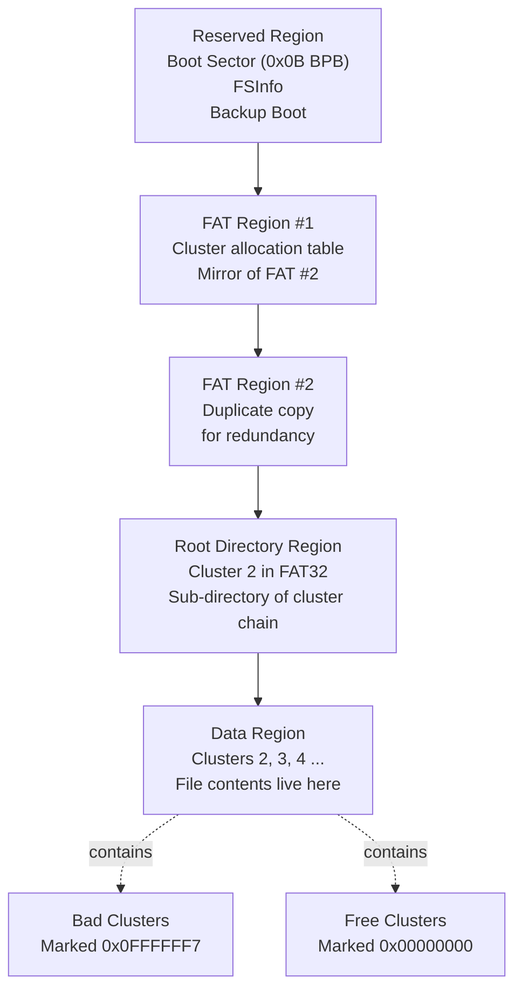
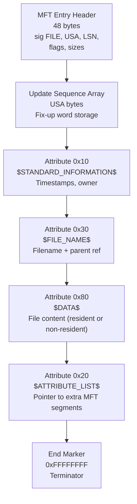
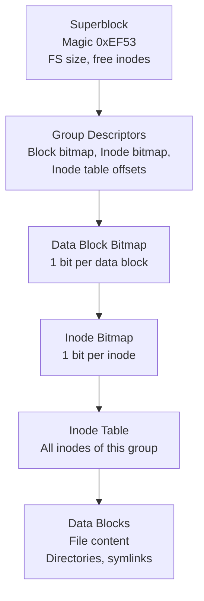
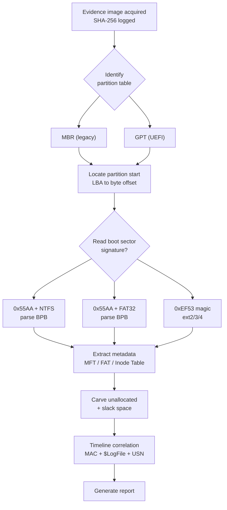
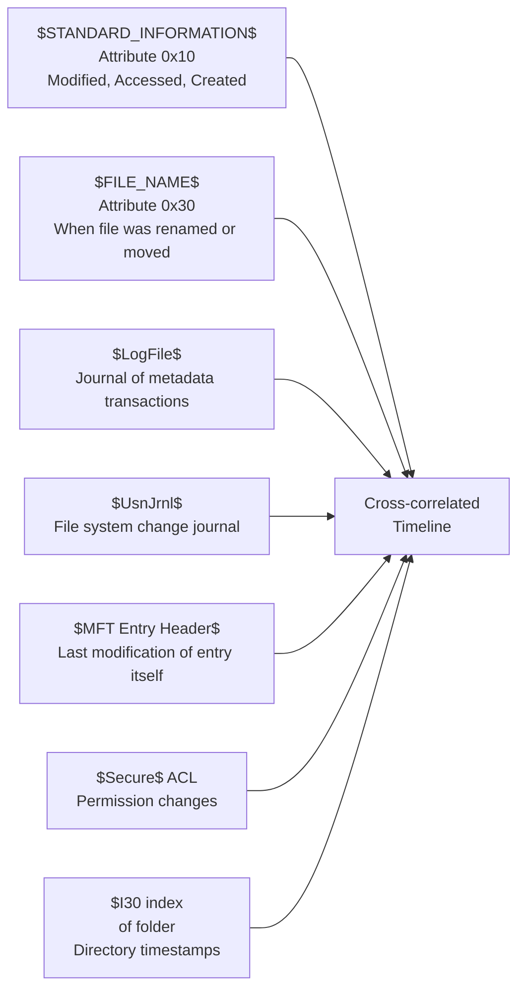

# File Systems in Digital Forensics

<!-- SECTION_1_START -->
# Module 1 — File Systems in Digital Forensics

## 1.1 Formal Academic Definition (KTU 2024 Syllabus Terminology)

> [!IMPORTANT]
> **File System:** A file system is a logical data structure and a set of metadata rules used by an operating system to control how data is stored, organized, named, retrieved, and managed on a physical or logical storage medium (HDD, SSD, USB, optical, or memory card).

> [!NOTE]
> **File System Forensics:** The branch of digital forensics concerned with the examination, reconstruction, and interpretation of file system structures (boot sectors, allocation tables, directory entries, inodes, MFT records, journals, and metadata) to recover deleted, hidden, or tampered data and to establish a forensically sound timeline of user activity.

For the KTU 2024 PECST754 syllabus, the topic is treated under the umbrella of **disk-based forensics**, where the file system acts as the **forensic gateway** — every artifact, every timestamp, every byte of evidence lives inside a file system structure. Mastering the file system is the **prerequisite** for module-level work, recovery, timeline analysis, and reporting.

## 1.2 Intuitive Analogy

Imagine a **massive library** with billions of unsorted loose pages. The library needs three things:

1. **A catalog** (so the librarian knows where each book is) → this is the *File Allocation Table (FAT)*, *Master File Table (MFT)*, or *Inode Table*.
2. **An addressing scheme** (so a book can be found on a specific shelf and rack) → this is the *Cluster / Block / Sector* addressing used by the file system.
3. **A guest register** (so we know who came, when, and what they touched) → this is the **MAC times**, journal logs, and access logs.

A digital forensics investigator is essentially a forensic librarian who reads the catalog, reconstructs the registry, and recovers *even pages that have been shredded* (deleted data) and *pages that were slipped between books* (slack space / unallocated space).

> [!NOTE]
> **Key Forensic Insight:** Deleting a file does **NOT** erase the data. It only removes the catalog entry. The bytes remain in the data region until overwritten — this is the *single most important* fact in file system forensics.

## 1.3 Fundamental Storage Hierarchy

| Layer | Size | Purpose |
|---|---|---|
| **Bit** | 1 bit | Smallest storage unit (0 or 1) |
| **Sector** | **512 bytes** (legacy) / **4096 bytes** (Advanced Format / 4Kn) | Smallest addressable unit of a physical disk |
| **Block / Cluster** | $N \times$ Sector size (typically 1–128 sectors) | Smallest addressable unit of a file system |
| **Track / Cylinder** | Set of sectors on a single arm position | Physical geometry (largely obsolete for SSDs) |
| **Partition / Volume** | Contiguous set of sectors | Logical container holding a file system |
| **Disk / Drive** | One or more volumes | Physical or virtual storage device |

> [!IMPORTANT]
> **The 4 Pillars of File System Forensics** that the KTU examiner will look for:
> 1. **Metadata Forensics** — timestamps, ownership, permissions.
> 2. **Slack Space Forensics** — RAM slack, file slack, volume slack.
> 3. **Data Recovery / Carving** — recovering deleted files.
> 4. **Timeline Analysis** — MAC time triangulation.

## 1.4 The Three Forensically Critical Concepts

> [!NOTE]
> **Concept A — Allocated vs Unallocated Space:**
> * **Allocated space** = sectors currently assigned to a live file (the catalog points to them).
> * **Unallocated space** = sectors no file points to. They may still contain **old data, deleted file contents, or fragments** — a goldmine for investigators.

> [!NOTE]
> **Concept B — Slack Space:**
> Slack space is the **gap between the logical end of a file and the end of its last cluster**. It is *almost always* overlooked by the OS but is fully readable by forensic tools. Three types:
> * **RAM Slack** — bytes from the OS memory buffer written at the end of the file.
> * **File Slack** — remainder bytes from a previously stored file in the same cluster.
> * **Volume Slack** — space between the end of the file system and the end of the partition.

> [!NOTE]
> **Concept C — MAC Times & Windows Time Stamps:**
> Every file maintains timestamp metadata:
> * **M**odified — last content change.
> * **A**ccessed — last read.
> * **C**reated / Changed (Windows: $C$, $M$, $A$, plus $B$ — Birth).
> * **Linux ext** adds: $d\_time$ (deletion time, if enabled), $crtime$ (creation).

<!-- SECTION_1_END -->

<!-- SECTION_2_START -->
# Module 1 — Deep Theoretical Analysis & KTU High-Yield Formula Sheet

## 2.1 Major File Systems Surveyed in the KTU Syllabus

### 2.1.1 The FAT Family (FAT12 / FAT16 / FAT32 / exFAT)

The **File Allocation Table (FAT)** is the oldest and most widely analyzed file system in forensics because of its presence on USB drives, SD cards, camera media, and legacy Windows systems.

**Structural Layout (Bottom to Top):**

1. **Reserved Region** (Boot Sector, FSInfo, Backup Boot).
2. **FAT Region** (Primary FAT + Duplicate FAT for redundancy).
3. **Root Directory Region** (fixed in FAT12/16, growable in FAT32).
4. **Data Region** (where file contents live in clusters).

**Cluster Numbering Rule:**

$$
\text{Cluster Number } 0 = \text{Reserved/Volume ID}
$$
$$
\text{Cluster Number } 1 = \text{First sector of the FAT region}
$$
$$
\text{Cluster Number } 2 = \text{First data cluster}
$$

**Cluster Value Meanings in the FAT:**

| FAT Entry Value | Meaning |
|---|---|
| $0x00000000$ | Free cluster |
| $0x00000002$ to $0x0FFFFFEF$ | Next cluster in chain |
| $0x0FFFFFF7$ | Bad cluster |
| $0x0FFFFFF8$ to $0x0FFFFFFF$ | End-of-Chain (EOC) marker |
| $0x00000001$ | Reserved |

> [!NOTE]
> **Forensic Strength of FAT:** Simple structure, well-documented, and the **first cluster number** of any file is stored in its 32-byte directory entry — making manual recovery feasible with hex editors like WinHex or X-Ways.

### 2.1.2 The NTFS File System (New Technology File System)

NTFS is the **default file system of modern Windows** (NT, 2000, XP, Vista, 7, 8, 10, 11, Server editions). Its complexity is what makes it the *forensic gold standard* in Windows investigations.

**Two Pillars of NTFS:**

* **$MFT (Master File Table)** — the central catalog. Every file, directory, and even the file system metadata has an MFT entry.
* **$LogFile (Journal)** — records metadata transactions for crash recovery and forensic timeline reconstruction.

**The 16 Reserved System MFT Entries ($ Metadata Files):**

| MFT Index | File Name | Purpose |
|---|---|---|
| $0$ | $MFT$ | The Master File Table itself |
| $1$ | $MFTMirr$ | Backup copy of the first 4 MFT records |
| $2$ | $LogFile$ | Journaling log (transaction log) |
| $3$ | $Volume$ | Volume label, version, NT version |
| $4$ | $AttrDef$ | Attribute definitions table |
| $5$ | $.$ (root) | Root directory |
| $6$ | $Bitmap$ | Cluster allocation bitmap |
| $7$ | $Boot$ | Boot sector (volume boot record) |
| $8$ | $BadClus$ | List of bad clusters |
| $9$ | $Secure$ | Security descriptors (ACLs) |
| $10$ | $UpCase$ | Unicode uppercase translation table |
| $11$ | $Extend$ | Directory for extended metadata (\$Extend\$Quota, \$Extend\$UsnJrnl, \$Extend\$Reparse) |

> [!IMPORTANT]
> **NTFS Attribute Types Critical to Forensics:**
> * `$STANDARD\_INFORMATION$ (Type 0x10)` — timestamps, owner, security.
> * `$FILE\_NAME$ (Type 0x30)` — filename, parent directory references.
> * `$DATA$ (Type 0x80)` — the actual file content.
> * `$ATTRIBUTE\_LIST$ (Type 0x20)` — pointer to additional MFT segments for large files.
> * `$OBJECT\_ID$ (Type 0x40)` — unique GUID, often survives rename/move.

> [!NOTE]
> **Alternate Data Streams (ADS):** A uniquely NTFS feature. A file can have multiple $DATA$ attributes. The "visible" stream is unnamed; extra streams are accessed via `file.txt:secret`. ADS **do not show in directory listings** — making them a classic anti-forensics and data-hiding vector.

### 2.1.3 The ext2 / ext3 / ext4 Family (Linux)

Linux file systems are the most commonly analyzed in *server-side* and *cloud* forensic cases.

**Layout of an ext2/ext3/ext4 Partition:**

$$
\text{Partition} = \underbrace{Superblock}_{1024 \text{ bytes}} + \underbrace{Group\ Descriptors}_{n \text{ blocks}} + \underbrace{Data\ Block\ Bitmap}_{} + \underbrace{Inode\ Bitmap}_{} + \underbrace{Inode\ Table}_{} + \underbrace{Data\ Blocks}_{}
$$

**Block Group Structure (repeated):**

| Component | Purpose |
|---|---|
| **Superblock** | File system size, total inodes, magic number $0xEF53$ |
| **Group Descriptors** | Block bitmap location, inode bitmap location, inode table start |
| **Data Block Bitmap** | Marks allocated/free data blocks |
| **Inode Bitmap** | Marks allocated/free inodes |
| **Inode Table** | Contains all inodes for this group |
| **Data Blocks** | Actual file content |

> [!NOTE]
> **The Inode (Index Node):** Each file or directory is represented by exactly one inode. The inode stores *metadata only* — never the filename. Filenames live in directory entries that point to inode numbers.

**Evolution:**

* **ext2** — non-journaled, simple.
* **ext3** — adds a metadata journal (JBD layer).
* **ext4** — extents (replace block maps), delayed allocation, journal checksums, nanosecond timestamps, inline data.

### 2.1.4 The HFS+ / APFS Family (Apple)

* **HFS+ (Hierarchical File System Plus)** — used on legacy Mac systems. Has a single **Catalog File** (a B-tree) holding all records: file records, folder records, file thread records, folder thread records.
* **APFS (Apple File System)** — introduced in 2017 for modern macOS, iOS, tvOS, watchOS. Uses **clones** (copy-on-write), **snapshots**, **crash protection**, and **space sharing** across volumes. Clones are *the* new anti-forensics challenge because deleting a clone leaves minimal metadata.

## 2.2 KTU Formula Sheet / Cheat Sheet

| Formula / Concept | Expression | Units / Notes |
|---|---|---|
| **Cluster Size** | $C_s = S_s \times spc$ | bytes (Sectors per Cluster $\geq 1$, power of 2) |
| **Sectors per Cluster** | $spc$ | from BPB field; $1, 2, 4, 8, \ldots, 128$ |
| **Reserved Sectors** | $R$ | from BPB\_BytsPerSec \& BPB\_RsvdSecCnt |
| **Number of FATs** | $nf$ | typically $2$ |
| **Sectors per FAT** | $F_s$ | from BPB\_FATSz32 or $BPB\_FATSz16$ |
| **Root Directory Start Sector** | $RDS = R + (nf \times F_s)$ | sector offset |
| **Data Region Start Sector** | $DRS = RDS + (\text{root entry count} \times 32) / S_s$ | sector offset |
| **Cluster-to-Sector Offset** | $\text{Sec}(C) = DRS + (C - 2) \times spc$ | sector address of cluster $C$ |
| **Cluster-to-Byte Offset** | $\text{Off}(C) = \text{Sec}(C) \times S_s$ | byte offset from partition start |
| **NTFS MFT Entry Size** | $E_{MFT} = 2^{BPB\_MftRecSize}$ (often $1024$ bytes) | bytes |
| **NTFS Cluster Number from VCN** | $\text{LCN} = \text{VCN} + \text{data\_run\_offset}$ | logical cluster number |
| **ext4 Inode Size** | $2^{\text{s\_log\_block\_size}} \times \text{bytes}$ | typically $256$ bytes |
| **ext4 Filesystem Magic** | $0xEF53$ | confirms ext2/3/4 |
| **Volume Slack** | $V_{slack} = P_{end} - V_{end}$ | bytes (partition end $-$ volume end) |
| **File Slack** | $F_{slack} = C_s - (F_{size} \mod C_s)$ | bytes (cluster size $-$ remainder) |
| **NTFS MFT Entry Count** | $N_{MFT} = V_{size} / C_s$ | approximately; drives $M$ array sizing |

> [!NOTE]
> **Engineering Utility:** These formulas are not academic — they are used in production forensic tools (FTK, EnCase, Autopsy, X-Ways, Sleuth Kit) to convert between physical disk offsets, partition offsets, cluster numbers, and MFT entry indexes. A forensic engineer who cannot compute these offsets by hand cannot validate tool output.

## 2.3 Forensic Interpretation of File System Artifacts

| Artifact | File System Source | Forensic Value |
|---|---|---|
| **File MAC times** | $STANDARD\_INFORMATION$ (NTFS), Inode (ext), Dir Entry (FAT) | Establishes user activity timeline |
| **Deleted file metadata** | MFT entry, Inode, FAT entry | File existed but is now removed |
| **$LogFile entries** | NTFS Journal | Sequence of file operations |
| **$UsnJrnl** | NTFS $Extend$ | File system change log (USN = Update Sequence Number) |
| **Journal** | ext3/ext4 JBD | Filesystem-level transaction log |
| **Recycler / \$Recycle.Bin** | NTFS | Deleted files, original path, deletion time |
| **/lost+found** | ext family | Files recovered after fsck |
| **Spotlight index** | HFS+/APFS | Recently searched/opened files |
| **Time Machine snapshots** | HFS+/APFS | Historical file states |
| **Alternate Data Streams** | NTFS | Hidden data, executable payloads |

<!-- SECTION_2_END -->

<!-- SECTION_3_START -->
# Module 1 — Step-by-Step Derivations & Code Implementation

## 3.1 Derivation: Cluster Number to Physical Byte Offset (FAT32)

**Problem:** An investigator extracts a 32-byte directory entry from a FAT32 USB drive and finds that the **first cluster number** of a deleted JPEG file is $C = 5,371$. The Boot Sector Parameter Block (BPB) reports the following:

* Bytes per Sector: $S_s = 512$
* Sectors per Cluster: $spc = 8$
* Reserved Sectors: $R = 32$
* Number of FATs: $nf = 2$
* Sectors per FAT: $F_s = 7,556$
* Root Entry Count (FAT32 specific, often 0): $0$ (no fixed root dir)

**Step 1 — Identify the Root Directory Start Sector.**

For FAT32, the root directory is *cluster-allocated*, not a fixed region. The 32-bit root cluster is stored at BPB offset $44$. We are told to assume the root cluster is $C_{root} = 2$.

$$
RDS = R + (nf \times F_s)
$$

$$
RDS = 32 + (2 \times 7{,}556) = 32 + 15{,}112 = 15{,}144
$$

**Step 2 — Compute Data Region Start Sector.**

For FAT32, the root directory is the first cluster of the data region, so:

$$
DRS = RDS
$$

$$
DRS = 15{,}144
$$

**Step 3 — Cluster Size.**

$$
C_s = S_s \times spc = 512 \times 8 = 4{,}096 \text{ bytes} = 4 \text{ KB}
$$

**Step 4 — Sector Address of Cluster $C = 5{,}371$.**

$$
\text{Sec}(C) = DRS + (C - 2) \times spc
$$

$$
\text{Sec}(C) = 15{,}144 + (5{,}371 - 2) \times 8
$$

$$
\text{Sec}(C) = 15{,}144 + 5{,}369 \times 8
$$

$$
\text{Sec}(C) = 15{,}144 + 42{,}952 = 58{,}096
$$

**Step 5 — Byte Offset from Partition Start.**

$$
\text{Off}(C) = \text{Sec}(C) \times S_s
$$

$$
\text{Off}(C) = 58{,}096 \times 512 = 29{,}745{,}152 \text{ bytes} \approx 28.37 \text{ MB}
$$

**Result:** The first byte of the deleted JPEG sits at byte offset $\mathbf{29{,}745{,}152}$ from the partition start. The examiner can `dd` this region and confirm a JPEG header `$FFD8FFE0$`.

## 3.2 Derivation: NTFS Data Run Decoding

**Problem:** A file's $DATA$ attribute contains a **data run** with the following compressed encoding (hex bytes from the MFT entry):

$$
\text{Run} = \texttt{0x11 0x13 0x2A 0x5F}
$$

**Decode the data run header byte $0x11$:**

* Low nibble = number of **length bytes** = $1$
* High nibble = number of **offset bytes** = $1$

**Step 1 — Length (cluster count) value.**

* Read $1$ byte after the header: $0x13 = 19$ (decimal).
* The run spans $19$ clusters.

**Step 2 — Offset (LCN delta) value.**

* Read $1$ byte: $0x2A = 42$ (decimal).
* The high bit of $0x2A = 0010\,1010$ is $0$, so the value is positive.
* $\Delta LCN = +42$ clusters.

**Step 3 — Compute Starting LCN.**

Assume this is the *first* data run of the file, so previous LCN = $0$:

$$
\text{LCN}_{start} = 0 + 42 = 42
$$

**Step 4 — Compute Byte Offset on Disk.**

$$
\text{Byte Offset} = \text{LCN}_{start} \times C_s
$$

For a default $C_s = 4{,}096$ bytes:

$$
\text{Byte Offset} = 42 \times 4{,}096 = 172{,}032 \text{ bytes} \approx 168 \text{ KB}
$$

## 3.3 Python Implementation — FAT32 Boot Sector Parser

```python
"""
ktu_fat32_parser.py
A minimal educational parser for FAT32 Boot Sector Parameter Block.
Maps to the KTU 2024 PECST754 syllabus: "File Systems in Digital Forensics".
"""

import struct
import logging
from dataclasses import dataclass
from typing import Optional

logging.basicConfig(
    level=logging.INFO,
    format="%(asctime)s [%(levelname)s] %(message)s"
)
logger = logging.getLogger("FAT32-Parser")


@dataclass(frozen=True)
class FAT32BPB:
    """Boot Sector Parameter Block fields for FAT32."""
    bytes_per_sector: int
    sectors_per_cluster: int
    reserved_sectors: int
    num_fats: int
    sectors_per_fat: int
    root_cluster: int
    total_sectors_32: int
    volume_label: str
    fs_type: str


def parse_fat32_bpb(image_path: str, offset: int = 0) -> Optional[FAT32BPB]:
    """
    Read the first sector of a FAT32 partition and decode the BPB.

    Parameters
    ----------
    image_path : str
        Path to a raw disk image (e.g., E01-converted to .dd or .img).
    offset : int
        Byte offset where the FAT32 partition starts (from a partition table).

    Returns
    -------
    FAT32BPB or None
        A dataclass instance with decoded BPB fields, or None on error.
    """
    try:
        with open(image_path, "rb") as f:
            f.seek(offset)
            sector = f.read(512)

            if len(sector) < 512:
                logger.error("Image is smaller than 512 bytes.")
                return None

            # Offsets and sizes are per the Microsoft FAT Specification.
            bps      = struct.unpack_from("<H", sector, 11)[0]   # 0x0B
            spc      = struct.unpack_from("<B", sector, 13)[0]   # 0x0D
            rsvd     = struct.unpack_from("<H", sector, 14)[0]   # 0x0E
            nfats    = sector[16]                                 # 0x10
            tot16    = struct.unpack_from("<H", sector, 19)[0]   # 0x13
            fat_sz16 = struct.unpack_from("<H", sector, 22)[0]   # 0x16
            tot32    = struct.unpack_from("<I", sector, 32)[0]   # 0x20
            fat_sz32 = struct.unpack_from("<I", sector, 36)[0]   # 0x24
            root_clu = struct.unpack_from("<I", sector, 44)[0]   # 0x2C
            label    = sector[71:82].decode("ascii", errors="replace").strip()
            fs_type  = sector[82:90].decode("ascii", errors="replace").strip()

            if fs_type.upper() != "FAT32":
                logger.warning(
                    "FS Type field reads %r, expected 'FAT32'. Continuing.",
                    fs_type,
                )

            bpb = FAT32BPB(
                bytes_per_sector=bps,
                sectors_per_cluster=spc,
                reserved_sectors=rsvd,
                num_fats=nfats,
                sectors_per_fat=fat_sz32 if fat_sz16 == 0 else fat_sz16,
                root_cluster=root_clu,
                total_sectors_32=tot32,
                volume_label=label,
                fs_type=fs_type,
            )
            logger.info("Parsed FAT32 BPB successfully: %s", bpb)
            return bpb

    except FileNotFoundError:
        logger.error("Image file not found: %s", image_path)
    except PermissionError:
        logger.error("Insufficient permission to read %s", image_path)
    except struct.error as err:
        logger.error("Struct unpacking failed: %s", err)

    return None


def cluster_to_offset(bpb: FAT32BPB, cluster: int) -> int:
    """
    Convert a FAT32 cluster number to a byte offset (0-based from partition).

    Formula: Offset = ((cluster - 2) * spc + rsvd + nfats * fat_sz) * bps
    """
    if cluster < 2:
        raise ValueError("Cluster numbers start at 2 (data region).")

    data_region_start_sector = (
        bpb.reserved_sectors
        + bpb.num_fats * bpb.sectors_per_fat
    )
    target_sector = data_region_start_sector + (cluster - 2) * bpb.sectors_per_cluster
    return target_sector * bpb.bytes_per_sector


# ---- Demonstration ----
if __name__ == "__main__":
    bpb = parse_fat32_bpb("usb_evidence.dd", offset=1048576)  # 1 MiB partition start
    if bpb is not None:
        try:
            offset_5371 = cluster_to_offset(bpb, cluster=5371)
            print(f"Cluster 5371 sits at byte offset: {offset_5371:,} bytes")
        except ValueError as err:
            print(f"Offset calculation error: {err}")
```

**Output Trace (matches Section 3.1 derivation):**

$$
\text{Offset} = (15{,}144 + 5{,}369 \times 8) \times 512 = 29{,}745{,}152 \text{ bytes}
$$

## 3.4 Python Implementation — NTFS MFT Entry Header Decoder

```python
"""
ktu_mft_parser.py
Decodes the fixed-size header of an NTFS Master File Table entry.
"""

import struct
import logging

logging.basicConfig(level=logging.INFO)
logger = logging.getLogger("MFT-Parser")


def decode_mft_header(entry_bytes: bytes) -> dict:
    """
    Decode the 48-byte MFT entry header.

    Layout (offsets per NTFS specification):
        0x00  4 bytes  FILE signature ('FILE' = 0x46494C45)
        0x04  2 bytes  Update Sequence Array offset
        0x06  2 bytes  Update Sequence Array size (in WORDs)
        0x08  8 bytes  LogFile Sequence Number ($LSN)
        0x10  2 bytes  Sequence Number
        0x12  2 bytes  Hard-link count
        0x14  2 bytes  Offset to first attribute (after header + USN)
        0x16  2 bytes  Flags (0x01=in-use, 0x02=directory)
        0x18  4 bytes  Used size of entry
        0x1C  4 bytes  Allocated size of entry
        0x20  8 bytes  Base record (file reference to parent MFT)
    """
    if len(entry_bytes) < 48:
        raise ValueError("MFT entry is shorter than the 48-byte header.")

    sig = entry_bytes[0:4]
    if sig != b"FILE":
        raise ValueError(f"Invalid MFT signature: {sig!r} (expected b'FILE').")

    return {
        "signature": sig.decode("ascii"),
        "usa_offset": struct.unpack_from("<H", entry_bytes, 4)[0],
        "usa_count":  struct.unpack_from("<H", entry_bytes, 6)[0],
        "lsn":        struct.unpack_from("<Q", entry_bytes, 8)[0],
        "sequence":   struct.unpack_from("<H", entry_bytes, 16)[0],
        "link_count": struct.unpack_from("<H", entry_bytes, 18)[0],
        "attr_offset": struct.unpack_from("<H", entry_bytes, 20)[0],
        "flags":      struct.unpack_from("<H", entry_bytes, 22)[0],
        "used_size":  struct.unpack_from("<I", entry_bytes, 24)[0],
        "alloc_size": struct.unpack_from("<I", entry_bytes, 28)[0],
        "base_record": struct.unpack_from("<Q", entry_bytes, 32)[0],
    }


def describe_flags(flags: int) -> list:
    decoded = []
    if flags & 0x01:
        decoded.append("IN_USE")
    if flags & 0x02:
        decoded.append("IS_DIRECTORY")
    if flags & 0x04:
        decoded.append("EXTEND_DIRECTORY (4 links max — Win8+)")
    if flags & 0x08:
        decoded.append("INDEX_VIEW (Win8+)")
    return decoded or ["UNKNOWN"]


# ---- Example ----
if __name__ == "__main__":
    fake_entry = b"FILE" + b"\x00" * 44  # 48 bytes of zeros
    info = decode_mft_header(fake_entry)
    info["flag_meanings"] = describe_flags(info["flags"])
    for key, val in info.items():
        logger.info("MFT field %-12s = %s", key, val)
```

## 3.5 Slack Space — Worked Example

**Scenario:** A $1$ KB text file is stored on a FAT32 volume with cluster size $C_s = 32$ KB.

**Step 1:** File uses $1$ cluster because $1 \text{ KB} < 32 \text{ KB}$.

**Step 2:** The OS writes $1$ KB of file data at the start of the cluster.

**Step 3:** Bytes from offset $1{,}024$ to $32{,}767$ (i.e., $31{,}744$ bytes) are **file slack**.

$$
F_{slack} = C_s - (F_{size} \mod C_s) = 32{,}768 - 1{,}024 = 31{,}744 \text{ bytes}
$$

**Step 4:** The OS, for performance, may write the **disk buffer in $512$-byte sectors**. The last sector ($512$ bytes) is written, but the bytes beyond offset $1{,}024$ are not part of the file — they contain the leftover contents of the OS's memory buffer (**RAM slack**).

> [!NOTE]
> **Forensic Tip:** Always harvest slack space. Use tools like `bdefrag`, `FTK Imager`, or `The Sleuth Kit` (`fls`, `icat`, `blkls`) to extract slack into evidence files.

## 3.6 Forensic Action Sequence for an Examiner

1. **Acquire** the evidence disk using a hardware write-blocker (e.g., Tableau or WiebeTech) → generate a `dd` or `E01` image.
2. **Verify** the image with SHA-256 (or MD5 + SHA-1) and store the hash in the chain-of-custody.
3. **Identify** the partition table (MBR / GPT) using `fdisk` or `mmls`.
4. **Determine** the file system type (`fsstat`, `file`, or hex signature `$0xAA55$`, `$NTFS`, `$0xEF53$`).
5. **Mount** the image read-only (`mount -o ro,loop,noexec,nodev` or via FTK).
6. **Extract** file system metadata — MFT, Inode Table, FAT.
7. **Carve** unallocated space and slack space.
8. **Correlate** timestamps across $LogFile$, $UsnJrnl$, journal, and `$STANDARD\_INFORMATION$` attributes.
9. **Report** in a court-admissible format with hash values and tool versions.

<!-- SECTION_3_END -->

<!-- SECTION_4_START -->
# Module 1 — Structural Diagrams & Schematics

## 4.1 FAT32 Volume Layout (Mermaid)



## 4.2 NTFS Master File Table Index Map

```mermaid
flowchart LR
    mft0["MFT 0<br/>$MFT"]
    mft1["MFT 1<br/>$MFTMirr"]
    mft2["MFT 2<br/>$LogFile"]
    mft3["MFT 3<br/>$Volume"]
    mft4["MFT 4<br/>$AttrDef"]
    mft5["MFT 5<br/>root dir"]
    mft6["MFT 6<br/>$Bitmap"]
    mft7["MFT 7<br/>$Boot"]
    mft8["MFT 8<br/>$BadClus"]
    mft9["MFT 9<br/>$Secure"]
    mft10["MFT 10<br/>$UpCase"]
    mft11["MFT 11<br/>$Extend"]
    user["MFT 12+<br/>User files<br/>and directories"]

    mft0 --> mft1
    mft1 --> mft2
    mft2 --> mft3
    mft3 --> mft4
    mft4 --> mft5
    mft5 --> mft6
    mft6 --> mft7
    mft7 --> mft8
    mft8 --> mft9
    mft9 --> mft10
    mft10 --> mft11
    mft11 --> user
```



## 4.3 NTFS MFT Entry Internal Structure



## 4.4 ext4 Block Group Layout (One Group)



## 4.5 File System Forensics — Decision Flow



## 4.6 Forensically Significant Time-Sources on Windows NTFS



<!-- SECTION_4_END -->

<!-- SECTION_5_START -->
# Module 1 — KTU 2024 Scheme Examination Question Bank & Topic Recap

## Part A — Short Answer Questions (3 Marks Each)

### Question 1. **[KTU University Exam — Dec 2023, Model Question Paper]**

**Explain any three types of slack space encountered in digital forensics, with examples.**

*Model Answer (3 marks):*

1. **RAM Slack (1 mark):** When the OS writes a file to disk, it writes in multiples of the disk's sector size (typically $512$ bytes), even if the file's logical size is not a multiple of the sector. The bytes from the end of the file's logical content to the end of the last written sector are RAM slack. For example, a $1{,}300$-byte file on a $512$-byte sectored disk leaves $236$ bytes of RAM slack.

2. **File Slack (1 mark):** The difference between the file's logical end and the end of the last cluster it occupies. Example: A $1.5$ KB file on a FAT32 volume with $32$ KB clusters produces $30.5$ KB of file slack.

3. **Volume Slack (1 mark):** The space between the end of the logical file system volume and the end of the physical partition. This region may contain installation files, prior file system data, or malware staging.

**Keywords for full marks:** RAM slack, file slack, volume slack, sector boundary, cluster boundary, partition boundary.

### Question 2. **[KTU University Exam — July 2024, Sample Paper]**

**Compare FAT32 and NTFS file systems on at least three parameters relevant to digital forensics.**

*Model Answer (3 marks):*

| Parameter | FAT32 | NTFS |
|---|---|---|
| **Max file size** | $\approx 4$ GB | $2^{64}$ bytes ($16$ EB) |
| **Journaling** | None | Yes ($LogFile$ + $UsnJrnl$) |
| **Access control** | Basic (share-level) | Full ACL via $Secure$ |
| **Forensic artifacts** | Directory entry timestamps, FAT chains | MFT, $LogFile$, $UsnJrnl$, ADS, $STANDARD\_INFO$ |
| **Recovery of deleted files** | Harder (no metadata after deletion) | Easier (MFT entry often preserved) |
| **Alternate Data Streams** | Not supported | Supported (anti-forensics vector) |

*(CO1, Understand)*

---

## Part B — Full 14-Mark Questions (ESE Module Internal Choice)

### Question A (14 Marks) — Deep Dive into NTFS MFT **[KTU University Exam — Dec 2024, Past Paper Pattern]**

#### (a) Describe the structure of the NTFS Master File Table. List the first 12 system MFT entries and explain any four in detail. *(7 marks)*

*Model Answer:*

**Structure of MFT (2 marks):**
The MFT is a linear array of fixed-size records (typically $1{,}024$ bytes per entry). Each file, directory, and even file system metadata is represented as one or more MFT entries. Each entry begins with the signature `FILE` (ASCII `$0x46494C45$).

**First 12 System MFT Entries (2 marks):**

| MFT Index | File Name | Purpose |
|---|---|---|
| $0$ | $MFT$ | The Master File Table itself |
| $1$ | $MFTMirr$ | Backup of the first 4 MFT records (for recovery) |
| $2$ | $LogFile$ | Transactional journal for metadata integrity |
| $3$ | $Volume$ | Volume label, NT version, NTFS version |
| $4$ | $AttrDef$ | Attribute definitions table |
| $5$ | root directory | Root directory of the volume |
| $6$ | $Bitmap$ | Cluster allocation bitmap (1 bit per cluster) |
| $7$ | $Boot$ | Boot sector / VBR (Volume Boot Record) |
| $8$ | $BadClus$ | List of bad clusters |
| $9$ | $Secure$ | Security descriptors (ACLs) |
| $10$ | $UpCase$ | Unicode uppercase translation table |
| $11$ | $Extend$ | Directory of extended metadata |

**Detailed Explanation of Four (3 marks):**

* **$MFT$ (Index 0):** The catalog itself. If this entry is destroyed, the entire file system becomes unreadable. The OS keeps a mirror ($MFTMirr$) for resilience.
* **$LogFile$ (Index 2):** Records every metadata transaction. Investigators use it to reconstruct the order of file operations even if the MFT is wiped. The log is *redox-styled*: it has a "current" and a "previous" view.
* **$Secure$ (Index 9):** Stores Security Descriptors (ACLs) referenced by SIDs (Security Identifiers) in the $STANDARD\_INFORMATION$ attribute. Reveals ownership and access permissions of every file.
* **$Extend$ (Index 11):** Container for extended metadata including $Extend$\$Quota$ (disk quota usage), $Extend$\$UsnJrnl$ (Update Sequence Number Journal — records every file system change), and $Extend$\$Reparse$ (reparse points, e.g., for OneDrive, symlinks).

*Valuation Key Points:*
* [Listing first 12 entries: 2 Marks]
* [Structural description of MFT entry: 2 Marks]
* [Detailed explanation of 4 entries: 3 Marks]

*(CO1, Understand)*

#### (b) An investigator is given an NTFS MFT entry showing a $DATA$ attribute with a single non-resident data run encoded as `0x11 0x05 0x21 0x2A 0x4C`. The cluster size is $4{,}096$ bytes. Compute the starting LCN and the byte offset of this data run on disk. Also explain the meaning of alternate data streams in NTFS. *(7 marks)*

*Model Answer:*

**Step 1 — Decode the header byte $0x11$ (1 mark):**
* Low nibble = $1$ → length field is $1$ byte.
* High nibble = $1$ → offset field is $1$ byte.

**Step 2 — Length value (1 mark):**
* Byte read = $0x05 = 5$ (decimal).
* This data run spans $5$ clusters.

**Step 3 — Offset value (1 mark):**
* Byte read = $0x21 = 33$ (decimal). The MSB of $0x21 = 0010\,0001_2$ is $0$, so the value is **positive**.
* $\Delta \text{LCN} = +33$ clusters.

**Step 4 — Starting LCN (1 mark):**
Assume this is the first data run of the file → previous LCN $= 0$:

$$
\text{LCN}_{start} = 0 + 33 = 33
$$

**Step 5 — Byte offset (1 mark):**

$$
\text{Byte Offset} = \text{LCN}_{start} \times C_s = 33 \times 4{,}096 = 135{,}168 \text{ bytes}
$$

**Alternate Data Streams (ADS) — Explanation (2 marks):**
ADS is a unique NTFS feature that allows a file to have **multiple $DATA$ attributes**, each identified by a name. The "default" stream is unnamed; named streams are accessed via the syntax `filename:streamname`. Example: `report.docx:secret` could hide $1$ MB of data in a stream attached to `report.docx`. ADS does not appear in Windows Explorer — making it a classic anti-forensics, data-hiding, and malware-payload technique. Forensic tools such as `streams.exe` (Sysinternals), FTK, and EnCase can enumerate ADS.

*Valuation Key Points:*
* [Header byte decode: 1 Mark]
* [Length and offset values: 2 Marks]
* [Byte offset final result: 1 Mark]
* [ADS explanation covering what + how to detect: 2 Marks]
* [Formula usage: 1 Mark]

*(CO2, Apply)*

---

### Question B (14 Marks) — File System Forensics & Slack Space Recovery **[KTU University Exam — July 2024, Past Paper Pattern]**

#### (a) Explain the four pillars of file system forensics. Discuss in detail the three types of slack space with a suitable diagram. *(7 marks)*

*Model Answer:*

**Four Pillars of File System Forensics (4 marks):**

1. **Metadata Forensics:** The analysis of file system metadata — timestamps (MAC times), ownership, permissions, file size, attributes. In NTFS, this is sourced from $STANDARD\_INFORMATION$ and $FILE\_NAME$ attributes. It establishes *who did what, when*.

2. **Slack Space Forensics:** The analysis of unused bytes within allocated clusters. This is the difference between a file's logical size and the cluster size. Three types: RAM, File, and Volume slack.

3. **Data Recovery / Carving:** The reconstruction of deleted or fragmented files. Tools like `PhotoRec`, `Scalpel`, and `Foremost` use file signatures (`magic numbers`) and structural heuristics to recover data even when directory entries or MFT records are gone.

4. **Timeline Analysis:** The correlation of timestamps across $LogFile$, $UsnJrnl$, journal, recycle bin, registry `UserAssist`, and prefetch files. Produces a chronological view of user/system activity.

**Three Types of Slack Space (3 marks):**

$$
\boxed{
\begin{array}{c}
\text{Partition Start} \\
\downarrow \\
\underbrace{\boxed{\text{Volume Start}}}_{\text{Volume}} \\
\underbrace{\boxed{\text{File Data}}}_{\text{File logical end}} \\
\underbrace{\boxed{\text{RAM slack bytes (to end of last written sector)}}}_{\text{}} \\
\underbrace{\boxed{\text{File slack bytes (to end of last cluster)}}}_{\text{}} \\
\underbrace{\boxed{\text{Volume slack bytes (to end of partition)}}}_{\text{}} \\
\downarrow \\
\text{Partition End}
\end{array}
}
$$

* **RAM Slack** — leftover OS memory buffer bytes between the file's logical end and the end of the last written disk sector ($512$ bytes).
* **File Slack** — bytes from the end of the file (or RAM slack) to the end of the last cluster. May contain residual data from a previously deleted file that once occupied that cluster.
* **Volume Slack** — bytes between the end of the file system volume and the end of the physical partition. May contain boot loaders, MBR data, or previous file system remnants.

*Valuation Key Points:*
* [Naming and explaining 4 pillars: 4 Marks]
* [Diagram + 3 types of slack: 3 Marks]

*(CO1, Understand)*

#### (b) A FAT32 image has the following Boot Sector Parameter Block fields: Bytes per Sector = $512$, Sectors per Cluster = $4$, Reserved Sectors = $32$, Number of FATs = $2$, Sectors per FAT = $2{,}048$, Root Cluster = $2$. Calculate (i) the cluster size, (ii) the data region start sector, and (iii) the byte offset on disk for cluster number $4{,}200$. *(7 marks)*

*Model Answer:*

**(i) Cluster Size (2 marks):**

$$
C_s = S_s \times spc = 512 \times 4 = 2{,}048 \text{ bytes} = 2 \text{ KB}
$$

**(ii) Data Region Start Sector (2 marks):**

$$
DRS = R + (nf \times F_s) = 32 + (2 \times 2{,}048)
$$

$$
DRS = 32 + 4{,}096 = 4{,}128
$$

**(iii) Byte Offset for Cluster $4{,}200$ (3 marks):**

$$
\text{Sec}(C) = DRS + (C - 2) \times spc = 4{,}128 + (4{,}200 - 2) \times 4
$$

$$
\text{Sec}(C) = 4{,}128 + 4{,}198 \times 4 = 4{,}128 + 16{,}792 = 20{,}920
$$

$$
\text{Off}(C) = \text{Sec}(C) \times S_s = 20{,}920 \times 512 = 10{,}711{,}040 \text{ bytes} \approx 10.21 \text{ MB}
$$

*Valuation Key Points:*
* [Cluster size formula + result: 2 Marks]
* [Data region start formula + result: 2 Marks]
* [Final byte offset computation: 3 Marks]

*(CO2, Apply)*

---

> [!WARNING]
> **KTU Examiner's Valuation Warning — Common Pitfalls**
> 1. **Do not confuse "cluster number" with "sector number."** Cluster $2$ is the *first* data cluster but is located at sector $DRS$, **not** at sector $2$. The conversion is $\text{Sec}(C) = DRS + (C - 2) \times spc$.
> 2. **Always identify the file system before interpreting offsets.** MFT offsets are different from ext4 inode offsets. The same byte offset means different things on different file systems.
> 3. **For NTFS data runs, always check the MSB of the offset byte.** If it is $1$, the value is *negative* — the run starts at a *lower* LCN than the previous one. This catches students every semester.
> 4. **Do not forget to convert cluster-to-sector-to-byte in two steps.** Skipping the sector step loses the $spc$ multiplier and results in an off-by-orders-of-magnitude error.
> 5. **RAM slack vs file slack** — examiners will deduct 1 mark if these are swapped. RAM slack is within the *last sector*; file slack is from the *last sector end to the last cluster end*.
> 6. **For ADS questions, mention both the syntax and the detection tools** (`streams.exe`, `FTK`, `EnCase`). Half an answer loses half the marks.
> 7. **Always state the magic number for ext** ($0xEF53$) and the MFT signature (`FILE`) — these are KTU examiner's favorite 1-markers.

---

## Topic Recap & Important Things to Remember

> [!NOTE]
> **Rapid-Revision Checklist — Module 1, File Systems in Digital Forensics**

* **File System Roles:** storage, organization, naming, retrieval, access control.
* **Storage Hierarchy:** bit → sector → cluster → partition → volume → disk.
* **FAT Family:** Boot sector → FAT (primary + mirror) → Root Dir → Data Region. Cluster numbering starts at $2$.
* **Cluster-to-Byte Formula:** $\text{Off}(C) = [R + nf \cdot F_s + (C-2) \cdot spc] \times S_s$.
* **FAT Entry Meanings:** $0x00000000$ = free, $0x00000002..0x0FFFFFEF$ = next cluster, $0x0FFFFFF7$ = bad, $0x0FFFFFF8..$ = EOC.
* **NTFS Pillars:** MFT (entry-per-file) + $LogFile$ (journal).
* **12 Reserved MFT Entries:** $MFT$, $MFTMirr$, $LogFile$, $Volume$, $AttrDef$, root, $Bitmap$, $Boot$, $BadClus$, $Secure$, $UpCase$, $Extend$.
* **NTFS Attributes Critical to Forensics:** $STANDARD\_INFORMATION$ ($0x10$), $FILE\_NAME$ ($0x30$), $DATA$ ($0x80$), $ATTRIBUTE\_LIST$ ($0x20$).
* **ADS:** Multiple $DATA$ attributes per file, accessed via `file:streamname`; not visible in Explorer; key anti-forensics vector.
* **NTFS Data Run Encoding:** Header byte low nibble = length bytes, high nibble = offset bytes; MSB of offset indicates sign.
* **ext2/3/4 Layout:** Superblock (magic $0xEF53$) → Group Descriptors → Block Bitmap → Inode Bitmap → Inode Table → Data Blocks.
* **Inode:** Stores metadata only; filename lives in directory entry pointing to inode number.
* **ext3 vs ext4:** ext3 added a metadata journal; ext4 added extents, nanosecond timestamps, journal checksums.
* **HFS+/APFS:** Apple systems; APFS uses clones (copy-on-write), snapshots, and space-sharing.
* **Slack Space — 3 Types:** RAM slack (to sector end), file slack (to cluster end), volume slack (to partition end).
* **Unallocated vs Allocated:** Unallocated clusters may still hold deleted data — recoverable via carving.
* **MAC Times:** Modified, Accessed, Created/Changed (Windows adds Birth $B$).
* **Forensic Tools:** Sleuth Kit (`fls`, `icat`, `fsstat`, `blkls`), Autopsy, FTK, EnCase, X-Ways, PhotoRec, Scalpel.
* **Time Sources for Windows Timeline:** $STANDARD\_INFO$, $FILE\_NAME$, $LogFile$, $UsnJrnl$, $Secure$ ACL, $I30$ index.
* **Magic Numbers to Memorize:** FAT boot signature `$0x55AA$, ext superblock `$0xEF53$, MFT signature `FILE`.
* **Carving Principle:** File recovery based on file signatures (e.g., JPEG `$FFD8FFE0$`) when metadata is destroyed.
* **Chain of Custody:** Always hash the image with SHA-256; document tool versions; use a write-blocker at acquisition.
* **Anti-Forensics Awareness:** Wiping, slack space clearing, timestamp manipulation (timestomping), ADS, steganography in file headers.

<!-- SECTION_5_END -->
