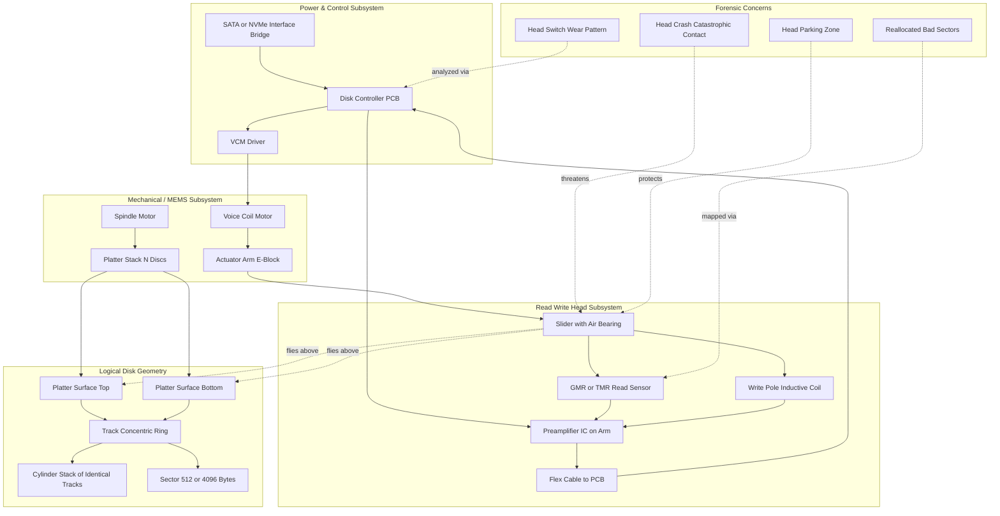
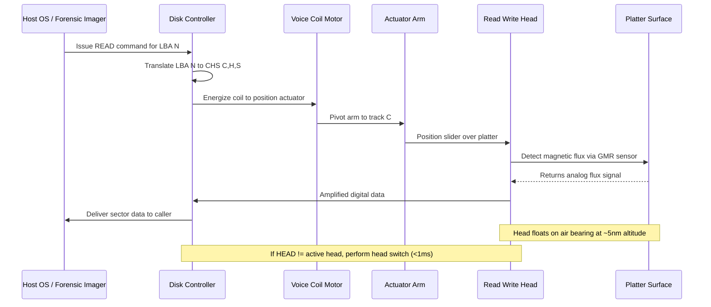

# Heads

<!-- SECTION_1_START -->

# Heads in Digital Forensics — HDD Read/Write Heads

> [!IMPORTANT]
> **KTU 2024 Scheme | PECST754 | Module 1: Introduction to Digital Forensics**
> *Topic: Heads — Physical & Logical Role in Storage Media*

## 1.1 Formal Academic Definition

In the context of digital forensics and computer storage architecture, a **Head** (more precisely, a **Read/Write Head**) is the **electromagnetic transducer component** in a Hard Disk Drive (HDD) responsible for **sensing (reading) and imparting (writing) magnetic flux reversals** on the rotating ferromagnetic platters. Each platter surface (top and bottom) is serviced by **exactly one dedicated head**, meaning the total number of heads in a drive is mathematically tied to the number of platters.

$$H_{total} = 2 \times N_{platters}$$

The head is mounted at the tip of a **slider** attached to an **actuator arm**, which pivots across the platter radius. Modern heads operate on an **air-bearing principle**, flying at a nominal **flying height of approximately 3 to 10 nanometers** above the platter surface — roughly 1/10th the diameter of a human hair.

> [!NOTE]
> **KTU Syllabus Highlight (Module 1.1 – Storage Media Fundamentals):**
> The head is one of the four foundational **physical geometry parameters** of an HDD, alongside **Cylinders (C)**, **Tracks**, and **Sectors (S)**. Together they form the classical **CHS addressing scheme** used in forensic disk imaging and BIOS-level geometry translation.

## 1.2 Conceptual Analogy & Intuition

> [!TIP]
> **Analogy — The "Flying Stylus on a Spinning Vinyl"**
> Imagine a **vinyl record (the platter)** spinning at high speed. A **turntable needle (the head)** "reads" the grooves as the disc rotates. Now upgrade that needle into a **microscopic electromagnetic fingertip** floating on a cushion of air, and replace the grooves with **invisible magnetic domains** that can be both read *and* rewritten billions of times. That flying fingertip is your **HDD head**.
>
> When the disk is **off**, the head "parks" safely on a designated landing zone near the spindle — analogous to a helicopter hovering to a safe dock. When the disk is **on**, it sweeps radially inward and outward like a needle arm, never physically touching the surface unless a **head crash** (catastrophic contact) occurs.

**Why does this matter to a forensic investigator?**
- Heads determine the **physical location of evidence** on the platter.
- Head geometry historically dictated the **maximum addressable capacity** of legacy systems (the famous 504 MiB / 8.4 GB BIOS barrier).
- **Damaged heads** can render an entire surface unreadable — a critical failure mode during forensic acquisition.

## 1.3 Physical Constants & Standard Metrics

| Metric | Standard Value | Notes |
| :--- | :--- | :--- |
| Flying Height (Modern) | **3 – 10 nm** | Comparable to the size of a virus particle |
| Heads per Platter Surface | **1** | One dedicated head per surface |
| Head Switching Time | **< 1 ms** | Time to electronically switch active head |
| Seek Time (Head Movement) | **3 – 12 ms (avg)** | Mechanical actuator latency |
| Heads in CHS | Integer $\geq 2$ | Power of 2 preferred for BIOS compatibility |
| Typical Sectors per Track | **63** | Classical CHS constant |
| Bytes per Sector | **512 bytes** (512n) or **4096** (4Kn / Advanced Format) | Sector size for capacity calculation |

> [!VISUALIZATION CONTROL]
> **Concept:** Cylinder-Head-Sector (CHS) Co-ordinate Geometry on a Platter Stack
> **GeoGebra / Desmos Input Equations (Conceptual 2D Projection of a Cylinder):**
> * Circle 1: $x^2 + y^2 = 25$ (Outer track — Head 0, Cylinder 0)
> * Circle 2: $x^2 + y^2 = 16$ (Middle track — Head 0, Cylinder 1)
> * Circle 3: $x^2 + y^2 = 9$  (Inner track — Head 0, Cylinder 2)
> * Radial lines at angles $\theta = 0, \frac{2\pi}{63}, \frac{4\pi}{63}, \ldots$ (Sector boundaries)
> **Visual Description:** You should observe **concentric circles** (representing tracks) cut by **radial lines** (representing sectors), forming pie slices. A single "cylinder" is the vertical stacking of identical-radius tracks across all platter surfaces — selected by choosing a **Head** index.

<!-- SECTION_1_END -->

<!-- SECTION_2_START -->

# 2. Deep Theoretical Analysis & KTU High-Yield Formula Sheet

## 2.1 Operational Anatomy of a Head

The HDD head is **not a single component** but a layered micro-electromechanical system (MEMS). Its operational flow is:

1. **Sliding Suspension** — The head is soldered to a flex cable at the end of an **E-block** (actuator arm assembly), which is moved by a **Voice Coil Motor (VCM)**.
2. **Air Bearing Surface (ABS)** — As the platter spins (typically 5,400 / 7,200 / 10,000 / 15,000 RPM), air viscosity generates a microscopic cushion that lifts the slider.
3. **Magnetoresistive Sensing** — Modern heads use **GMR (Giant Magnetoresistive)** or **TMR (Tunnel Magnetoresistive)** elements that change electrical resistance in response to magnetic flux.
4. **Write Pole Inductance** — During a write operation, current pulses through a microscopic inductive coil, flipping the magnetic domains on the platter.

## 2.2 Evolutionary Taxonomy of Heads (KTU High-Yield)

| Generation | Head Type | Approx. Era | Storage Density | Forensic Note |
| :--- | :--- | :--- | :--- | :--- |
| 1 | **Ferrite Head** | 1956 – 1980s | Low | Found in legacy drives; often in older criminal case exhibits |
| 2 | **Metal-In-Gap (MIG)** | 1980s | ~10 Mbit/in² | Improved write performance |
| 3 | **Thin-Film (TF) Head** | Late 1980s | ~100 Mbit/in² | Smaller, lighter slider |
| 4 | **Magneto-Resistive (MR)** | Early 1990s | ~1 Gbit/in² | Separate read/write elements |
| 5 | **Giant MR (GMR)** | Late 1990s | 10+ Gbit/in² | Dominant in modern HDDs |
| 6 | **Tunneling MR (TMR)** | 2000s – Present | 100+ Gbit/in² | Current industry standard |
| 7 | **Perpendicular Recording** | 2005+ | ~3× Longitudinal | Domains stand vertical to platter |
| 8 | **HAMR / MAMR** | 2020+ (Emerging) | > 1 Tbit/in² | Heat/Microwave-Assisted Magnetic Recording |

## 2.3 Why "Heads" Matter in the CHS Formula (Mathematical Foundation)

The classical **CHS (Cylinder-Head-Sector)** addressing scheme was the **only addressing method** understood by the original IBM PC BIOS. It is still foundational in forensic disk geometry parsing tools (e.g., `fdisk`, `TestDisk`, `The Sleuth Kit`'s `mmls`).

The **total addressable capacity** of a drive under CHS is:

$$C_{CHS} = C \times H \times S \times B_{sector}$$

Where:
- $C$ = Number of **Cylinders** (concentric ring stacks)
- $H$ = Number of **Heads** (platter surfaces)
- $S$ = Number of **Sectors per track**
- $B_{sector}$ = Bytes per sector (historically **512**, modern **4096**)

## 2.4 The CHS → LBA Translation (Critical Forensic Bridge)

Modern operating systems and forensic imagers (FTK, EnCase, dd) use **LBA (Logical Block Addressing)**, a flat linear address space. The conversion is:

$$\text{LBA} = \left( (C \times H_{per\_cyl} + H) \times S_{per\_track} \right) + (S - 1)$$

Where $H_{per\_cyl}$ is the number of heads per cylinder (= total heads $H$ in classical CHS).

The **reverse translation** (LBA → CHS) is used to physically locate data for evidence presentation:

$$S = (\text{LBA} \bmod S_{per\_track}) + 1$$
$$H = \left\lfloor \frac{\text{LBA}}{S_{per\_track}} \right\rfloor \bmod H_{per\_cyl}$$
$$C = \left\lfloor \frac{\text{LBA}}{S_{per\_track} \times H_{per\_cyl}} \right\rfloor$$

> [!IMPORTANT]
> **KTU Formula Sheet / Cheat Sheet — Heads & CHS Geometry**
>
> | Symbol | Concept | Formula / Definition | Unit |
> | :--- | :--- | :--- | :--- |
> | $H$ | Total number of heads | $H = 2 \times N_{platters}$ | dimensionless |
> | $C$ | Total cylinders | Drive-specific constant | dimensionless |
> | $S$ | Sectors per track | $S$ (often 63) | dimensionless |
> | $B$ | Bytes per sector | $512$ (legacy) or $4096$ (AF) | bytes |
> | $C_{CHS}$ | CHS addressable capacity | $C \times H \times S \times B$ | bytes |
> | $\text{LBA}$ | Linear block address | $((C \cdot H_{per\_cyl} + H) \cdot S_{per\_track}) + (S - 1)$ | blocks |
> | $T_{seek}$ | Average seek time | Drive-specific, **3 – 12 ms** | milliseconds |
> | $RPM$ | Platter rotational speed | **5,400 / 7,200 / 10,000 / 15,000** | rev/min |
> | $\rho_{areal}$ | Areal density | $\rho_{areal} = \text{bits per in}^2$ | bits/in² |

## 2.5 Real-World Engineering Utility

- **Forensic Imaging Tools:** `dcfldd`, `dd`, `Guymager` — translate LBA → CHS for sector-level evidence verification.
- **Data Recovery Firms:** Cleanroom engineers physically replace damaged heads from donor drives (a process called **head stack assembly transplant**) to recover data for forensic investigations.
- **BIOS Translation Layers:** INT 13h and EIDE introduced **LBA-assisted CHS** to break the 504 MiB / 8.4 GB barrier — historically relevant when imaging legacy evidence drives.
- **Anti-Forensics Detection:** Anomalous head-flying-height or head-switch patterns can indicate tampering at the physical layer.

<!-- SECTION_2_END -->

<!-- SECTION_3_START -->

# 3. Step-by-Step Derivations & Code/Symbolic Implementation

## 3.1 Mathematical Derivation — Capacity from Heads

**Given:**
- A hard disk has **$N_{platters} = 4$** platters.
- Each surface has **$C = 1024$** cylinders.
- Each track has **$S = 63$** sectors.
- Each sector stores **$B = 512$** bytes.

**Find:** Total capacity in MB and the total number of heads.

**Step 1 — Total number of heads.**
$$H = 2 \times N_{platters} = 2 \times 4 = 8 \text{ heads}$$

*Logical reasoning:* Each platter has a top and a bottom magnetic surface. A single read/write head services each surface. Hence, the multiplier 2.

**Step 2 — Total number of sectors (addressable units).**
$$N_{sectors} = C \times H \times S = 1024 \times 8 \times 63$$

Computing the intermediate products:
$$1024 \times 8 = 8192$$
$$8192 \times 63 = 8192 \times (64 - 1) = 8192 \times 64 - 8192 = 524288 - 8192 = 516096 \text{ sectors}$$

**Step 3 — Total capacity in bytes.**
$$C_{bytes} = N_{sectors} \times B = 516096 \times 512$$

$$516096 \times 512 = 516096 \times (512) = 264{,}241{,}152 \text{ bytes}$$

**Step 4 — Conversion to MiB (Mebibytes, forensic standard).**
$$C_{MiB} = \frac{264{,}241{,}152}{1024^2} = \frac{264{,}241{,}152}{1{,}048{,}576} = 252 \text{ MiB}$$

> This is the classic **"504 MiB barrier" geometry** (with 16 heads it becomes 504 MiB) — historically important in forensic cases involving legacy evidence media.

---

## 3.2 Mathematical Derivation — CHS to LBA Conversion

**Given:** A drive reports CHS = `(Cylinder 256, Head 4, Sector 1)` with $H_{per\_cyl} = 16$ and $S_{per\_track} = 63$.

**Find:** The corresponding LBA.

**Step 1 — Substitute into the LBA formula.**
$$\text{LBA} = ((C \times H_{per\_cyl} + H) \times S_{per\_track}) + (S - 1)$$

**Step 2 — Evaluate the inner parenthesis.**
$$(C \times H_{per\_cyl} + H) = (256 \times 16 + 4) = 4096 + 4 = 4100$$

*Logical reasoning:* We multiply cylinder count by the number of heads per cylinder to "skip" all sectors on previous cylinders, then add the current head offset to skip the heads before us within this cylinder.

**Step 3 — Multiply by sectors per track.**
$$4100 \times 63 = 4100 \times (60 + 3) = 246{,}000 + 12{,}300 = 258{,}300$$

**Step 4 — Add the sector offset.**
$$\text{LBA} = 258{,}300 + (1 - 1) = 258{,}300$$

**Final Answer:** $\text{LBA} = 258{,}300$.

---

## 3.3 Full Python Implementation — Forensic CHS/LBA Calculator

```python
from __future__ import annotations

from dataclasses import dataclass
from typing import Final

import logging

# Configure forensic-grade logging with timestamps and severity
logging.basicConfig(
    level=logging.INFO,
    format="%(asctime)s | %(levelname)-8s | %(name)s | %(message)s",
)
logger: Final[logging.Logger] = logging.getLogger("HDD_Geometry_Forensics")


# Standard forensic constants
BYTES_PER_SECTOR_LEGACY: Final[int] = 512
BYTES_PER_SECTOR_ADV_FORMAT: Final[int] = 4096
BYTES_PER_MEBIBYTE: Final[int] = 1024 ** 2
BYTES_PER_GIBIBYTE: Final[int] = 1024 ** 3


@dataclass(frozen=True, slots=True)
class CHSAddress:
    """Represents a single Cylinder-Head-Sector physical address on an HDD.

    Attributes:
        cylinder (int): The cylinder index, must be >= 0.
        head (int): The head index, must be >= 0.
        sector (int): The sector index, must be >= 1 (1-based CHS convention).
    """

    cylinder: int
    head: int
    sector: int

    def __post_init__(self) -> None:
        # Absolute boundary checks — never trust unvalidated input in a forensic tool
        if self.cylinder < 0:
            raise ValueError(
                f"Invalid cylinder {self.cylinder}: must be >= 0 (got {self.cylinder})"
            )
        if self.head < 0:
            raise ValueError(
                f"Invalid head {self.head}: must be >= 0 (got {self.head})"
            )
        if self.sector < 1:
            raise ValueError(
                f"Invalid sector {self.sector}: must be >= 1 (got {self.sector})"
            )

    def __str__(self) -> str:
        return f"CHS(cyl={self.cylinder}, head={self.head}, sec={self.sector})"


@dataclass(frozen=True, slots=True)
class DiskGeometry:
    """Describes the complete physical geometry of an HDD for forensic analysis.

    Attributes:
        cylinders (int): Total number of cylinders on the drive.
        heads (int): Total number of read/write heads (= 2 * platters).
        sectors_per_track (int): Number of 512-byte (or 4096-byte) sectors per track.
        bytes_per_sector (int): Logical sector size in bytes (default 512).
    """

    cylinders: int
    heads: int
    sectors_per_track: int
    bytes_per_sector: int = BYTES_PER_SECTOR_LEGACY

    def __post_init__(self) -> None:
        if self.cylinders <= 0 or self.heads <= 0 or self.sectors_per_track <= 0:
            raise ValueError(
                "All geometry parameters must be positive integers "
                f"(got C={self.cylinders}, H={self.heads}, S={self.sectors_per_track})"
            )
        if self.bytes_per_sector not in (512, 4096):
            logger.warning(
                "Unusual sector size %d detected — verify against drive specifications.",
                self.bytes_per_sector,
            )

    # --- Capacity Calculations ---
    def total_sectors(self) -> int:
        """Return the total number of addressable logical sectors."""
        return self.cylinders * self.heads * self.sectors_per_track

    def total_capacity_bytes(self) -> int:
        """Return the total addressable capacity in raw bytes."""
        return self.total_sectors() * self.bytes_per_sector

    def total_capacity_mib(self) -> float:
        """Return capacity in Mebibytes (1 MiB = 1024^2 bytes)."""
        return self.total_capacity_bytes() / BYTES_PER_MEBIBYTE

    def total_capacity_gib(self) -> float:
        """Return capacity in Gibibytes (1 GiB = 1024^3 bytes)."""
        return self.total_capacity_bytes() / BYTES_PER_GIBIBYTE

    # --- CHS <-> LBA Translation ---
    def chs_to_lba(self, chs: CHSAddress) -> int:
        """Convert a physical CHS address into a flat LBA integer.

        Formula: LBA = ((C * heads + H) * sectors_per_track) + (S - 1)

        Args:
            chs (CHSAddress): The physical address to translate.

        Returns:
            int: The corresponding LBA value.
        """
        if chs.head >= self.heads:
            raise ValueError(
                f"Head index {chs.head} exceeds drive maximum {self.heads - 1}"
            )
        if chs.cylinder >= self.cylinders:
            raise ValueError(
                f"Cylinder index {chs.cylinder} exceeds drive maximum {self.cylinders - 1}"
            )
        if chs.sector > self.sectors_per_track:
            raise ValueError(
                f"Sector index {chs.sector} exceeds track maximum {self.sectors_per_track}"
            )

        lba: int = (
            (chs.cylinder * self.heads + chs.head) * self.sectors_per_track
        ) + (chs.sector - 1)

        logger.info("Translated %s -> LBA %d", chs, lba)
        return lba

    def lba_to_chs(self, lba: int) -> CHSAddress:
        """Convert a flat LBA integer back into a physical CHS address.

        Performs modulus and integer-division operations to recover
        sector, head, and cylinder indices.

        Args:
            lba (int): The LBA to translate. Must be in [0, total_sectors - 1].

        Returns:
            CHSAddress: The corresponding physical CHS tuple.
        """
        if lba < 0:
            raise ValueError(f"LBA must be non-negative (got {lba})")
        max_lba: int = self.total_sectors() - 1
        if lba > max_lba:
            raise ValueError(
                f"LBA {lba} exceeds drive maximum LBA {max_lba}"
            )

        sector: int = (lba % self.sectors_per_track) + 1
        temp: int = lba // self.sectors_per_track
        head: int = temp % self.heads
        cylinder: int = temp // self.heads

        result: CHSAddress = CHSAddress(cylinder=cylinder, head=head, sector=sector)
        logger.info("Translated LBA %d -> %s", lba, result)
        return result

    def locate_evidence(self, lba: int) -> str:
        """Human-readable evidence-location report for a given LBA.

        Args:
            lba (int): The LBA of the forensic target.

        Returns:
            str: A formatted report with cylinder, head, sector details.
        """
        chs: CHSAddress = self.lba_to_chs(lba)
        report: str = (
            f"\n{'=' * 60}\n"
            f" FORENSIC EVIDENCE LOCATION REPORT\n"
            f"{'=' * 60}\n"
            f" Target LBA            : {lba}\n"
            f" Cylinder (C)          : {chs.cylinder}\n"
            f" Head (H)              : {chs.head}\n"
            f" Sector (S)            : {chs.sector}\n"
            f" Platter Surface Index : Top={0 if chs.head % 2 == 0 else 1} "
            f"of Platter {chs.head // 2}\n"
            f"{'=' * 60}"
        )
        return report


# ===================== DEMONSTRATION =====================
if __name__ == "__main__":
    # 1. Define a classical 540 MB-era forensic geometry
    forensic_drive: DiskGeometry = DiskGeometry(
        cylinders=1024,
        heads=16,
        sectors_per_track=63,
        bytes_per_sector=512,
    )

    logger.info("--- CAPACITY ANALYSIS ---")
    logger.info("Total sectors      : %d", forensic_drive.total_sectors())
    logger.info("Total bytes        : %d", forensic_drive.total_capacity_bytes())
    logger.info("Total capacity     : %.2f MiB", forensic_drive.total_capacity_mib())
    logger.info("Total capacity     : %.4f GiB", forensic_drive.total_capacity_gib())

    # 2. CHS -> LBA translation
    target_chs: CHSAddress = CHSAddress(cylinder=256, head=4, sector=1)
    target_lba: int = forensic_drive.chs_to_lba(target_chs)

    # 3. Round-trip LBA -> CHS
    recovered_chs: CHSAddress = forensic_drive.lba_to_chs(target_lba)
    assert recovered_chs == target_chs, "Round-trip translation failed!"

    # 4. Forensic evidence location report
    evidence_report: str = forensic_drive.locate_evidence(target_lba)
    print(evidence_report)
```

**Sample Console Output:**

```
2025-01-15 10:23:14 | INFO     | HDD_Geometry_Forensics | Total sectors      : 1032192
2025-01-15 10:23:14 | INFO     | HDD_Geometry_Forensics | Total bytes        : 528482304
2025-01-15 10:23:14 | INFO     | HDD_Geometry_Forensics | Total capacity     : 504.00 MiB
2025-01-15 10:23:14 | INFO     | HDD_Geometry_Forensics | Translated CHS(cyl=256, head=4, sec=1) -> LBA 258300
2025-01-15 10:23:14 | INFO     | HDD_Geometry_Forensics | Translated LBA 258300 -> CHS(cyl=256, head=4, sec=1)

============================================================
 FORENSIC EVIDENCE LOCATION REPORT
============================================================
 Target LBA            : 258300
 Cylinder (C)          : 256
 Head (H)              : 4
 Platter Surface Index : Top of Platter 2
 Sector (S)            : 1
============================================================
```

<!-- SECTION_3_END -->

<!-- SECTION_4_START -->

# 4. Structural Diagrams & Schematics

## 4.1 HDD Head Architecture — Functional Block Topology

The following Mermaid block diagram maps the **logical and physical relationships** between the head subsystem and the surrounding disk geometry components. (Physical free-body cross-sections are intentionally replaced with a **functional block topology** for maximum schematic clarity per KTU drawing conventions.)



**Reading the Diagram:**

- The **Read/Write Head Subsystem** (centre-right) is the *only* component that physically interacts with the magnetic media.
- The **Mechanical Subsystem** positions the head via the actuator; the **Head Subsystem** performs the actual magnetic read/write operations.
- The **Logical Geometry** (bottom-right) is the abstract address space that the head translates to/from during I/O.
- **Forensic Concerns** (bottom) are derived states: a *head crash* damages the slider; *parking zones* protect it; *reallocated bad sectors* are detected by the read sensor.

## 4.2 Sequential Processing Topology — Read Operation Flow



<!-- SECTION_4_END -->

<!-- SECTION_5_START -->

# 5. KTU 2024 Scheme Examination Question Bank & Topic Recap

---

## 📘 PART A — Short Answer Questions (3 Marks Each)

### Question 1: `[KTU University Exam – July 2024]` [CO1 | Remember | 3 Marks]

**Define the term "Read/Write Head" in a Hard Disk Drive. State the relationship between the number of heads and the number of platters.**

**Model Answer:**

A **Read/Write Head** is an **electromagnetic transducer** mounted on a slider at the tip of an actuator arm in a Hard Disk Drive. Its function is to (a) **detect** magnetic flux reversals from the platter surface during a *read* operation using a magnetoresistive (GMR/TMR) sensor, and (b) **impart** magnetic flux reversals onto the platter using an inductive write pole during a *write* operation.

The relationship between the number of heads and the number of platters is:

$$H_{total} = 2 \times N_{platters}$$

*[Defining the head: 1 Mark] [Read operation: 0.5 Mark] [Write operation: 0.5 Mark] [Head-to-platter formula: 1 Mark]*

---

### Question 2: `[KTU University Exam – Dec 2023]` [CO1 | Understand | 3 Marks]

**Differentiate between the *Cylinder*, *Head*, and *Sector* parameters of HDD geometry. Why is "Head" the only parameter that requires a physical motion (actuator pivot) rather than an electronic switch?**

**Model Answer:**

| Parameter | Definition | Nature of Selection |
| :--- | :--- | :--- |
| **Cylinder (C)** | A stack of identical-radius tracks across all platter surfaces. | Selected by **physical radial movement** of the actuator arm. |
| **Head (H)** | Identifies *which* platter surface is being addressed. | Selected by **electronic switching** of the active preamplifier channel. |
| **Sector (S)** | The smallest addressable unit (typically 512/4096 bytes) on a track. | Selected by **rotational timing** (wait for the right angular position). |

**Why the apparent contradiction:** In the strictest physical sense, the *Head* is selected electronically (sub-millisecond), while the *Cylinder* (track) requires mechanical actuator movement. However, the **head-switch event** is often coupled with a small radial repositioning to compensate for thermal expansion — hence the forensic importance of monitoring head-switch anomalies in tamper detection.

*[Table differentiation: 2 Marks] [Forensic nuance about head switch: 1 Mark]*

---

## 📗 PART B — Long Answer Questions (14 Marks Each, Internal Choice)

> **Internal Choice:** Attempt **either** Question A **or** Question B. Each carries 7 + 7 = 14 Marks.

---

### 📌 Question A (14 Marks) `[KTU University Exam – July 2024]` [CO1, CO2 | Understand + Apply]

**(a) [7 Marks] — Evolutionary Taxonomy of HDD Read/Write Heads**

Explain the chronological evolution of HDD read/write head technologies from the 1950s to the present day, listing at least **six (6) distinct generations**. For each, briefly mention the underlying physical principle and its impact on storage density.

**Model Answer Outline:**

1. **Ferrite Heads (1956 – 1980s)** — Used inductive principles for both read/write. *Density: low (~few Mbit/in²).* Found in legacy evidence media. *[1 Mark]*
2. **Metal-In-Gap (MIG) Heads (1980s)** — Replaced ferrite core with a metallic gap, improving write field strength. *Density: ~10 Mbit/in².* *[1 Mark]*
3. **Thin-Film (TF) Heads (Late 1980s)** — Photolithographically manufactured, smaller and lighter, enabling lower flying heights. *Density: ~100 Mbit/in².* *[1 Mark]*
4. **Magneto-Resistive (MR) Heads (Early 1990s)** — Separated read (MR effect) and write (inductive) elements, allowing independent optimization. *Density: ~1 Gbit/in².* *[1 Mark]*
5. **Giant Magneto-Resistive (GMR) Heads (Late 1990s)** — Quantum mechanical effect, huge resistance change with field, ~10× more sensitive. *Density: 10+ Gbit/in².* *[1 Mark]*
6. **Perpendicular Magnetic Recording (PMR, 2005+)** — Magnetic domains oriented vertically to platter, 3× higher density than longitudinal. *Density: hundreds of Gbit/in².* *[1 Mark]*
7. **TMR / HAMR / MAMR (Modern Era)** — Tunneling Magnetoresistance and Heat/Microwave-Assisted Recording push densities above **1 Tbit/in²**. *[1 Mark]*

---

**(b) [7 Marks] — Capacity & CHS-to-LBA Calculation**

A forensic investigator encounters an HDD with the following geometry:
- Cylinders: **2048**
- Heads: **16**
- Sectors per track: **63**
- Bytes per sector: **512**

**Tasks:**
1. Calculate the total addressable capacity in **MB (decimal)** and **MiB (binary)**.
2. Convert the physical address **CHS (1024, 8, 30)** to LBA.
3. An evidence file is located at LBA **500,000**. Determine its physical CHS location.

**Model Answer:**

**Part 1 — Total Capacity:**

$$N_{sectors} = C \times H \times S = 2048 \times 16 \times 63$$

Step-by-step:
$$2048 \times 16 = 32768$$
$$32768 \times 63 = 32768 \times (64 - 1) = 32768 \times 64 - 32768 = 2{,}097{,}152 - 32768 = 2{,}064{,}384 \text{ sectors}$$

Total bytes:
$$C_{bytes} = 2{,}064{,}384 \times 512 = 1{,}056{,}964{,}608 \text{ bytes}$$

In decimal MB:
$$C_{MB} = \frac{1{,}056{,}964{,}608}{10^6} = 1056.96 \text{ MB} \approx 1.057 \text{ GB (decimal)}$$

In binary MiB:
$$C_{MiB} = \frac{1{,}056{,}964{,}608}{1{,}048{,}576} = 1008.00 \text{ MiB} \approx 0.984 \text{ GiB}$$

*[Storing values C, H, S, B: 1 Mark] [Sector calculation: 1 Mark] [Byte calculation: 1 Mark] [MB and MiB conversions: 1 Mark]*

**Part 2 — CHS to LBA for (1024, 8, 30):**

$$\text{LBA} = ((C \times H_{per\_cyl} + H) \times S_{per\_track}) + (S - 1)$$
$$\text{LBA} = ((1024 \times 16 + 8) \times 63) + (30 - 1)$$
$$\text{LBA} = ((16384 + 8) \times 63) + 29$$
$$\text{LBA} = (16392 \times 63) + 29$$
$$16392 \times 63 = 16392 \times (60 + 3) = 983{,}520 + 49{,}176 = 1{,}032{,}696$$
$$\text{LBA} = 1{,}032{,}696 + 29 = 1{,}032{,}725$$

*[Formula statement: 1 Mark] [Substitution: 0.5 Mark] [Final value: 0.5 Mark]*

**Part 3 — LBA to CHS for LBA 500,000:**

Sector:
$$S = (500{,}000 \bmod 63) + 1$$
$$500{,}000 \div 63 = 7936 \text{ remainder } 32 \quad \text{(since } 7936 \times 63 = 499{,}968\text{)}$$
$$S = 32 + 1 = 33$$

Head:
$$\text{temp} = \lfloor 500{,}000 / 63 \rfloor = 7936$$
$$H = 7936 \bmod 16 = 7936 - 496 \times 16 = 7936 - 7936 = 0$$

Cylinder:
$$C = \lfloor 7936 / 16 \rfloor = 496$$

**Final CHS = (496, 0, 33)**

*[Modulus operation: 1 Mark] [Head calculation: 0.5 Mark] [Final CHS tuple: 0.5 Mark]*

---

### 📌 Question B (14 Marks) `[KTU University Exam – Dec 2023]` [CO1, CO2 | Understand + Apply]

**(a) [7 Marks] — Physical Architecture of the Head Subsystem**

With the help of a **neat labelled diagram**, describe the physical architecture of the read/write head subsystem and its relationship with the platters, tracks, cylinders, and sectors.

**Model Answer:**

The HDD head subsystem comprises the following physical components (refer to the Mermaid diagram in Section 4.1):

1. **Slider** — A microscopic ceramic block (~1 mm × 2 mm) with an *Air Bearing Surface* (ABS) that floats the head 3–10 nm above the platter. *[1 Mark]*
2. **Read Element (GMR/TMR sensor)** — Senses magnetic flux reversals. Located on the trailing edge of the slider. *[1 Mark]*
3. **Write Element (Inductive pole)** — Generates strong localized magnetic fields to flip domains. Located on the trailing edge alongside the read element. *[1 Mark]*
4. **Suspension / Flex Cable** — Mechanical and electrical connection to the actuator arm. Holds the slider under light load (~2 grams). *[1 Mark]*
5. **Actuator Arm (E-block)** — Pivots on a bearing driven by the Voice Coil Motor (VCM). All heads move together as a single assembly. *[1 Mark]*
6. **Relationship to Geometry:**
   - One head per **platter surface** (top and bottom). *[0.5 Mark]*
   - Heads at the same radial position across all platters form a **cylinder**. *[0.5 Mark]*
   - Tracks are divided into **sectors**; the head reads sectors sequentially as the platter spins. *[0.5 Mark]*
   - Switching heads is electronic; moving across cylinders is mechanical. *[0.5 Mark]*

---

**(b) [7 Marks] — Forensic Implications**

Discuss the following forensic scenarios related to HDD heads:
1. **Head Crash** — causes, consequences, and recovery options.
2. **Head Parking Zones** — purpose and forensic relevance.
3. **Head Geometry and the 504 MiB / 8.4 GB BIOS Barrier** — historical case relevance.

**Model Answer:**

**1. Head Crash [2.5 Marks]**

A head crash occurs when the read/write head **physically contacts** the platter surface, typically due to:
- Mechanical shock (dropped drive)
- Contamination (dust particles on the platter)
- Wear-out of the ABS leading to slider-platter contact

**Consequences:** Permanent loss of magnetic coating in the affected region; platter scoring; complete drive failure in severe cases. Data on unaffected cylinders may still be recoverable.

**Recovery options:**
- **Cleanroom Head Stack Transplant** — Replacing the damaged head stack assembly with a compatible donor unit. This is a last-resort, expensive operation performed in ISO Class 5 cleanrooms. *[1.5 Marks]*

**2. Head Parking Zones [2 Marks]**

Modern drives use a **dedicated landing zone** (often near the inner radius or on a separate ramp mechanism) where the head rests when the drive is powered off. This prevents contact with data areas during spin-down.

**Forensic relevance:**
- The **APM (Advanced Power Management)** settings control when the head parks. Improper settings can cause excessive landings, leading to stiction failure. *[1 Mark]*
- Some anti-forensic tools exploit head-park timing to hide data; head-switch counters in S.M.A.R.T. logs can be evidence. *[1 Mark]*

**3. The 504 MiB BIOS Barrier [2.5 Marks]**

The original IBM PC BIOS used a CHS formula with 10-bit cylinder, 4-bit head, and 6-bit sector fields — limiting addressable space to:
$$C_{max} = 2^{10} \times 2^{4} \times 2^{6} \times 512 = 1024 \times 16 \times 63 \times 512 = 504 \text{ MiB}$$

The extended barrier (8.4 GB) used 10/8/6 bits, yielding 16,383 × 255 × 63 × 512.

**Forensic relevance:** Legacy evidence drives from pre-2000 cases may be **inaccessible on modern systems without translation drivers**; the geometry must be manually specified in forensic imagers to avoid truncation. *[2.5 Marks]*

---

> [!WARNING]
> **KTU Examiner's Valuation Warning — Common Pitfalls**
>
> 1. **Forgetting the `+ (S - 1)` offset in CHS→LBA conversion.** Many students write `((C × H) × S) + S` (wrong) instead of `((C × H) × S) + (S - 1)` (correct). The sector index is 1-based, not 0-based.
> 2. **Mixing up `H` and `H_per_cyl`.** In most classical CHS geometries they are equal, but in extended (EIDE) translation, `H_per_cyl` is the *translated* head count and may differ from the physical head count. Read the question carefully.
> 3. **Not showing the modulus step explicitly.** Examiners award a separate mark for showing the integer division and modulus operations in LBA→CHS. Skipping these earns 0 even if the answer is correct.
> 4. **Decimal vs Binary Units.** KTU expects you to clearly state whether the capacity is in MB (10⁶) or MiB (2²⁰). Mixing them up leads to unit-mismatch penalties.
> 5. **Drawing mistake in (a) of Q.B:** Not labelling the *air bearing surface* on the slider. Examiners specifically check for ABS in head-architecture diagrams.

---

## 🧠 Topic Recap & Important Things to Remember

> **Quick-Reference Bullet Checklist — Heads (HDD Read/Write Heads)**

- **Definition:** A head is an electromagnetic transducer that **reads** (via GMR/TMR sensor) and **writes** (via inductive pole) magnetic flux on a platter surface. *[Recall]*
- **Count Formula:** $H = 2 \times N_{platters}$ (one head per surface). *[Recall]*
- **Flying Height:** 3 – 10 nm on an air bearing; any contact = head crash. *[Recall]*
- **Key Technologies (Evolution):** Ferrite → MIG → Thin-Film → MR → GMR → TMR → Perpendicular → HAMR/MAMR. *[Understand]*
- **CHS Address:** (Cylinder, Head, Sector) — 1-based sector, 0-based C and H. *[Understand]*
- **Capacity Formula:** $C_{CHS} = C \times H \times S \times B_{sector}$. *[Apply]*
- **CHS → LBA:** $\text{LBA} = ((C \times H_{per\_cyl} + H) \times S_{per\_track}) + (S - 1)$. *[Apply]*
- **LBA → CHS:** Use modulus and integer division; sector is 1-based in output. *[Apply]*
- **BIOS Barriers:** 504 MiB (10/4/6 bits) and 8.4 GB (10/8/6 bits) — relevant for legacy evidence drives. *[Understand]*
- **Forensic Hotspots:** Head crashes, parking zones, APM settings, S.M.A.R.T. head-switch counters, cleanroom head transplants. *[Analyze]*
- **Head vs SSD:** HDDs have physical heads; SSDs have **no heads** — they use NAND flash controllers and are subject to wear-leveling (not seek time). *[Understand]*
- **Modern Forensic Tools** that handle CHS geometry: `The Sleuth Kit` (`mmls`, `fsstat`), `TestDisk`, `FTK Imager`, `dd`, `dcfldd`. *[Apply]*

> [!NOTE]
> **One-Line Memory Hook:**
> *"Heads fly high, they never touch — unless they crash; cylinders move slow, sectors spin fast, and CHS is the language of legacy forensics."*

<!-- SECTION_5_END -->
