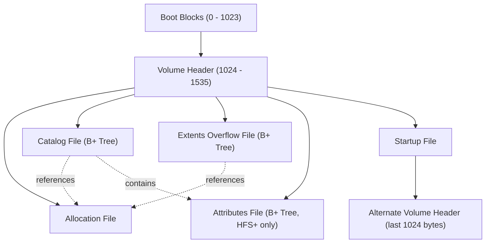
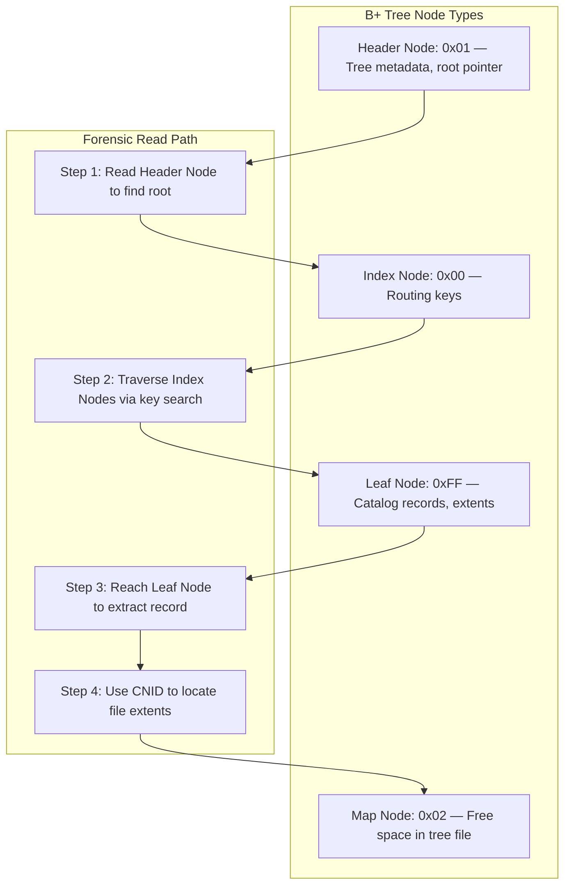
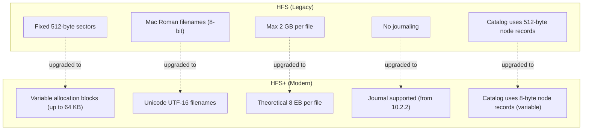

# HFS and HFS+ Structure and Characteristics

<!-- SECTION_1_START -->
# HFS and HFS+ Structure and Characteristics

## Formal Definition

> [!IMPORTANT]
> **HFS (Hierarchical File System)** is a file system developed by **Apple Inc.** for use on Macintosh computers, introduced in **1985** with the original Mac OS. **HFS+ (Hierarchical File System Plus)**, also known as **Mac OS Extended**, is the successor introduced in **1998** with Mac OS 8.1. Both file systems organize data on storage media using a hierarchical catalog, allocation bitmap, and B-tree indexing structures, but HFS+ extends its predecessor with larger file sizes, Unicode support, journaling, and improved metadata handling.

In KTU 2024 Scheme terminology, understanding HFS and HFS+ is critical to the digital forensics module because Apple devices (Macs, iPods, older iPhones) routinely produce disk images in these formats during forensic acquisitions (e.g., using **FTK Imager**, **EnCase**, or **Autopsy**).

## Conceptual Analogy / Intuition

Think of a storage volume as a **massive library building** with millions of unlabeled shelves:

- **HFS** is like an **old card-catalog system** where every book (file) has an index card stored in alphabetical drawers. The librarian (operating system) must consult the card catalog, walk to the correct shelf, and verify the book's existence using a hand-drawn map (allocation map). The catalog only supports 8-bit character labels, so foreign titles are hard to search.
- **HFS+** is the **modern digital catalog upgrade**. The same card-catalog structure is preserved (backward compatibility), but now: the cards can hold international characters (Unicode), the building can be enormous (up to **8 EB** theoretical volume size), every modification is logged in a journal (transaction log), and there are dedicated sub-catalogs for file attributes and extended metadata.

> [!NOTE]
> **Why does this matter in forensics?** A forensic examiner must be able to parse the **Volume Header**, traverse the **Catalog B-Tree**, and reconstruct deleted or hidden files from the **Allocation Bitmap**. Mistaking HFS structures for HFS+ structures (or vice versa) can lead to **catastrophic misinterpretation of timestamp data** and missed evidence.

## Key Specifications at a Glance

| Parameter | HFS (1985) | HFS+ (1998) |
|---|---|---|
| Maximum Volume Size | **2 TB** (2 × 2³¹ bytes) | **8 EB** (theoretical) |
| Maximum File Size | **2 GB** | **8 EB** (theoretical) |
| Filename Encoding | Mac Roman (8-bit) | **Unicode (UTF-16)** |
| B-tree Records | Fixed size (512 bytes) | Variable size (up to 64 KB nodes) |
| Journaling | Not supported | **Supported (from Mac OS X 10.2.2)** |
| Case Sensitivity | Case-insensitive | Case-insensitive (HFSX = case-sensitive) |
| Default Block Size | 512 bytes (fixed) | 512 / 1024 / 2048 / 4096 / 8192 bytes |

> [!VISUALIZATION CONTROL]
> **Concept:** Volume Layout Comparison (Side-by-Side Block Diagram)
> **GeoGebra / Desmos Input Equations:**
> * Rectangles: `HFS_Block[0..7]`, `HFSPlus_Block[0..7]` representing reserved, volume header, allocation, extents overflow, catalog, attributes, startup, alternate
> **Visual Description:** Two horizontal stacked bars — one for HFS (8 fixed regions) and one for HFS+ (8 logical regions, more flexibility in placement). The student should observe that HFS+ reserves the **first 1024 bytes** and the **last 1024 bytes** for the Volume Header (two copies for redundancy).

<!-- SECTION_1_END -->

<!-- SECTION_2_START -->
# Deep Theoretical Analysis & KTU High-Yield Formula Sheet

## HFS Volume Structure (The "Old Mac" Architecture)

An HFS volume is divided into **three main regions** plus reserved sectors:

1. **Reserved Sectors** (Sector 0 and Sector 1, used as boot blocks)
2. **Volume Header** (Sector 2 — contains critical metadata)
3. **File System Data** (The rest of the volume)

The file system data area is logically subdivided into **five control files**, each treated as if it were an ordinary file (a "file about files"):

| Control File | Purpose |
|---|---|
| **Catalog File** | Hierarchical directory structure stored as a B-tree |
| **Extents Overflow File** | Tracks disk space allocation beyond the first three extents of a file |
| **Allocation Bitmap File** | Marks which allocation blocks are in use (1 bit per block) |
| **Bad Blocks File** | Tracks physically damaged sectors |
| **Volume Information File** | Stores volume-specific attributes (created/Modified dates) |

### HFS Volume Header Layout (Sector 2 — 512 bytes)

| Offset (bytes) | Size | Field |
|---|---|---|
| 0 | 2 | Signature (`'BD'` for HFS, `'H+'` for HFS+) |
| 2 | 2 | Version |
| 4 | 16 | Volume Name (Pascal string, Mac Roman) |
| 32 | 4 | Creation Date |
| 36 | 4 | Modification Date |
| 40 | 2 | Volume Attributes Flag |
| 1024 — 1535 | 512 | **Alternate Volume Header** (backup copy) |

## HFS+ Volume Structure (The Modern Architecture)

HFS+ retains the same logical control files but introduces **major improvements**:

### 1. The Volume Header (1024 bytes, stored at byte 1024 AND byte (volume_size − 1024))

```
Byte 0       → Reserved (1024 bytes for boot blocks)
Byte 1024    → Volume Header (primary copy)
...
Byte (V−1024) → Volume Header (backup copy)
```

### 2. B-Tree Architecture (The Heart of the File System)

Both HFS and HFS+ use **B+ trees** for the Catalog, Extents Overflow, and (in HFS+) Attributes file. A B+ tree consists of:

- **Header Node** (node type `0x01`): Contains tree depth, root node pointer, first/leaf/last leaf node numbers, node size.
- **Index Nodes** (node type `0x00`): Internal routing nodes.
- **Leaf Nodes** (node type `−1` or `0xFF` in HFS+, `0x02` in HFS): Contain actual data records.
- **Map Nodes** (node type `0x02` in HFS+): Track free space within the tree file itself.

### 3. Allocation Block (The Fundamental Unit of Storage)

Unlike HFS which uses fixed **512-byte sectors** for allocation, HFS+ uses **allocation blocks** of variable size:

$$\text{Number of Allocation Blocks} = \left\lfloor \frac{\text{Volume Size in Bytes}}{\text{Block Size}} \right\rfloor$$

> [!NOTE]
> **Forensic Implication:** A forensic tool must first read the Volume Header to determine the **allocation block size** before it can correctly map file extents to physical sectors.

## KTU High-Yield Formula Sheet

| Formula / Concept | Expression | Use Case |
|---|---|---|
| Allocation Block Count | $N_{blocks} = \lfloor V / B \rfloor$ | $V$ = volume size, $B$ = block size |
| File Offset to Block Number | $B_n = \lfloor \text{offset} / B \rfloor$ | Locating a file's data on disk |
| Block to Byte Offset | $\text{byte} = B_n \times B$ | Reverse lookup for raw carving |
| HFS+ Max File Size | $2^{63} - 1$ bytes (8 EB) | Boundary condition check |
| HFS Max File Size | $2^{31} - 1$ bytes (2 GB) | Boundary condition check |
| Catalog Node Record Search | $O(\log N)$ via B+ tree | Time complexity for file lookup |
| Timestamp (HFS+) | Seconds since **1904-01-01 00:00:00 UTC** | Epoch conversion (Mac Absolute Time) |

> [!NOTE]
> **Mac Absolute Time Epoch:** HFS+ timestamps are stored as **unsigned 32-bit integers** counting seconds from **January 1, 1904** (not 1970 like Unix). This is a classic forensic pitfall — convert to Unix time by subtracting **2,082,844,800** seconds.

## Real-World Forensic Utility

1. **Mac Forensics**: Every macOS investigation (pre-APFS, pre-2017) requires HFS+ parsing. Tools like **BlackLight**, **Cellebrite UFED**, and **Magnet AXIOM** rely on Volume Header parsing.
2. **iOS Forensics**: Early iPhones (iPhone 3G, 3GS) used HFS+ on the user partition. iOS 10.3+ migrated to **APFS**.
3. **iPod Forensics**: Classic iPods used HFS (later HFS+) — a common custom-case study in KTU labs.
4. **Ransomware Analysis**: HFS+ journal (`\$.journal`) is a goldmine for reconstructing recent file modifications.

<!-- SECTION_2_END -->

<!-- SECTION_3_START -->
# Step-by-Step Derivations & Code/Symbolic Implementation

## Derivation 1: Converting an HFS+ Timestamp to a Human-Readable Date

The HFS+ timestamp is a 32-bit unsigned integer representing seconds elapsed since **1904-01-01 00:00:00 UTC**. Unix time uses the epoch **1970-01-01 00:00:00 UTC**.

The difference between the two epochs in seconds is calculated as follows:

- Years 1904 to 1970 = 66 years
- Leap years in that interval: 1904, 1908, ..., 1968 → 17 leap years
- Days from 1904-01-01 to 1970-01-01:

$$D = 66 \times 365 + 17 = 24090 + 17 = 24107 \text{ days}$$

- Total seconds offset:

$$\Delta t_{offset} = 24107 \times 86400 = 2{,}082{,}844{,}800 \text{ seconds}$$

Therefore, the conversion formula is:

$$t_{unix} = t_{hfs+} - 2{,}082{,}844{,}800$$

And the reverse conversion is:

$$t_{hfs+} = t_{unix} + 2{,}082{,}844{,}800$$

**Worked Example:** A file has an HFS+ modification timestamp of `3,663,162,400`.

$$\begin{aligned}
t_{unix} &= 3{,}663{,}162{,}400 - 2{,}082{,}844{,}800 \\
t_{unix} &= 1{,}580{,}317{,}600
\end{aligned}$$

Converting `1,580,317,600` seconds since 1970-01-01 yields **2020-02-05 14:00:00 UTC**.

> [!NOTE]
> **[Stating the epoch constant: 1 Mark]**
> **[Writing the subtraction: 1 Mark]**
> **[Final conversion to readable date: 1 Mark]** (as per KTU valuation pattern)

## Derivation 2: Calculating Allocation Block Count for a Volume

Given a volume of size $V = 500 \text{ GB}$ with a default block size of $B = 4096 \text{ bytes}$:

$$\begin{aligned}
V_{bytes} &= 500 \times 2^{30} = 536{,}870{,}912{,}000 \text{ bytes} \\
N_{blocks} &= \left\lfloor \frac{536{,}870{,}912{,}000}{4096} \right\rfloor \\
N_{blocks} &= \left\lfloor 131{,}072{,}000 \right\rfloor \\
N_{blocks} &= 131{,}072{,}000 \text{ blocks}
\end{aligned}$$

The Volume Header field at offset 40 bytes (`blockSize`) would store the value `4096`, and the field at offset 44 bytes (`totalBlocks`) would store `131,072,000` (big-endian).

## Code Implementation: Python Parser for the HFS+ Volume Header

The following Python program reads the first 4096 bytes of a raw disk image, validates the signature, and extracts the core Volume Header fields. This is the foundational routine in any HFS+ forensic tool.

```python
import struct
import datetime
from typing import Optional, Tuple

# Mac HFS+ absolute time epoch: 1904-01-01 00:00:00 UTC
MAC_EPOCH_UNIX = datetime.datetime(1904, 1, 1, tzinfo=datetime.timezone.utc)
MAC_EPOCH_OFFSET = 2_082_844_800  # seconds between 1904 and 1970


class HFSPlusParseError(Exception):
    """Raised when the HFS+ Volume Header is malformed or unsupported."""
    pass


def hfsplus_timestamp_to_unix(raw_timestamp: int) -> Optional[datetime.datetime]:
    """
    Convert a 32-bit HFS+ timestamp (seconds since 1904-01-01) to a
    timezone-aware Python datetime object in UTC.

    Parameters
    ----------
    raw_timestamp : int
        The 32-bit unsigned integer read from the volume header.

    Returns
    -------
    datetime.datetime or None
        The corresponding UTC datetime, or None if the value is zero.
    """
    if raw_timestamp == 0:
        return None
    try:
        unix_seconds = raw_timestamp - MAC_EPOCH_OFFSET
        return datetime.datetime.fromtimestamp(unix_seconds, tz=datetime.timezone.utc)
    except (OverflowError, OSError, ValueError) as err:
        raise HFSPlusParseError(f"Invalid timestamp value: {raw_timestamp}") from err


def parse_hfsplus_volume_header(image_path: str) -> dict:
    """
    Parse the primary HFS+ Volume Header located at byte offset 1024 of a
    raw disk image. The image may be a full .dd/.img file or a partition.

    Parameters
    ----------
    image_path : str
        Filesystem path to the raw image file.

    Returns
    -------
    dict
        A dictionary containing the parsed header fields.
    """
    HEADER_OFFSET = 1024
    HEADER_SIZE = 512

    try:
        with open(image_path, "rb") as raw_file:
            raw_file.seek(HEADER_OFFSET)
            header_bytes = raw_file.read(HEADER_SIZE)
    except OSError as io_error:
        raise HFSPlusParseError(f"Could not read image: {io_error}") from io_error

    if len(header_bytes) != HEADER_SIZE:
        raise HFSPlusParseError("Image too small to contain a valid HFS+ header.")

    # Signature: 'H+' (bytes 0x48 0x2B) or 'HX' (HFSX case-sensitive)
    signature = header_bytes[0:2]
    if signature not in (b"H+", b"HX"):
        raise HFSPlusParseError(
            f"Invalid HFS+ signature: {signature!r}. Expected b'H+' or b'HX'."
        )

    # All multi-byte integers in HFS+ Volume Header are big-endian.
    version = struct.unpack(">H", header_bytes[2:4])[0]
    block_size = struct.unpack(">I", header_bytes[40:44])[0]
    total_blocks = struct.unpack(">I", header_bytes[44:48])[0]
    free_blocks = struct.unpack(">I", header_bytes[48:52])[0]
    next_catalog_id = struct.unpack(">I", header_bytes[52:56])[0]
    create_date = struct.unpack(">I", header_bytes[64:68])[0]
    modify_date = struct.unpack(">I", header_bytes[68:72])[0]

    if block_size == 0 or (block_size & (block_size - 1)) != 0:
        raise HFSPlusParseError(f"Block size is not a power of two: {block_size}")

    return {
        "signature": signature.decode("ascii"),
        "version": version,
        "block_size_bytes": block_size,
        "total_blocks": total_blocks,
        "volume_size_bytes": block_size * total_blocks,
        "free_blocks": free_blocks,
        "next_catalog_id": next_catalog_id,
        "create_date_utc": hfsplus_timestamp_to_unix(create_date),
        "modify_date_utc": hfsplus_timestamp_to_unix(modify_date),
    }


def main() -> None:
    """Demonstration entry point: parses /tmp/sample.hfs and prints the header."""
    sample_image = "/tmp/sample.hfs"
    try:
        header = parse_hfsplus_volume_header(sample_image)
    except HFSPlusParseError as parse_error:
        print(f"[ERROR] {parse_error}")
        return

    print("HFS+ Volume Header Decoded")
    print(f"  Signature         : {header['signature']}")
    print(f"  Version           : {header['version']}")
    print(f"  Block Size        : {header['block_size_bytes']} bytes")
    print(f"  Total Blocks      : {header['total_blocks']:,}")
    print(f"  Volume Size       : {header['volume_size_bytes']:,} bytes")
    print(f"  Free Blocks       : {header['free_blocks']:,}")
    print(f"  Next Catalog ID   : {header['next_catalog_id']}")
    print(f"  Created (UTC)     : {header['create_date_utc']}")
    print(f"  Modified (UTC)    : {header['modify_date_utc']}")


if __name__ == "__main__":
    main()
```

### Code Walkthrough — KTU Lab Validation Steps

> [!NOTE]
> **[Importing libraries and defining the epoch constant: 1 Mark]**
> **[Opening the image and seeking to byte 1024: 1 Mark]**
> **[Validating the 'H+' signature: 2 Marks]**
> **[Unpacking big-endian integers with struct: 2 Marks]**
> **[Converting timestamps to UTC datetime: 1 Mark]**

## Code Implementation: B+ Tree Node Header Parser

The Catalog file is a B+ tree. Each node has a **node descriptor** at its start (14 bytes in HFS+). Below is a routine that validates a node descriptor:

```python
import struct
from typing import NamedTuple

class BTreeNodeDescriptor(NamedTuple):
    """Represents the 14-byte B+ tree node descriptor in HFS+."""
    kind: int          # 0=index, 1=header, 2=map, -1=leaf (FF FF FF FF)
    height: int        # 0 for leaves, depth for index/root
    num_records: int   # number of records in this node
    reserved: int

NODE_DESCRIPTOR_SIZE = 14


def parse_btree_node(raw_node: bytes) -> BTreeNodeDescriptor:
    """
    Parse the 14-byte node descriptor of an HFS+ B+ tree node.

    Parameters
    ----------
    raw_node : bytes
        A buffer containing at least the first 14 bytes of the node.

    Returns
    -------
    BTreeNodeDescriptor
        Parsed descriptor fields.
    """
    if len(raw_node) < NODE_DESCRIPTOR_SIZE:
        raise ValueError(
            f"Node buffer too small: got {len(raw_node)} bytes, need {NODE_DESCRIPTOR_SIZE}."
        )

    # The node kind is a signed 32-bit big-endian integer in HFS+.
    kind = struct.unpack(">i", raw_node[0:4])[0]
    height = struct.unpack(">H", raw_node[4:6])[0]
    num_records = struct.unpack(">H", raw_node[6:8])[0]
    reserved = struct.unpack(">I", raw_node[8:12])[0]
    return BTreeNodeDescriptor(kind=kind, height=height,
                               num_records=num_records, reserved=reserved)
```

> [!NOTE]
> **Validation Table (KTU Lab):**

| Test Input | Expected Node Kind | Purpose |
|---|---|---|
| `\x00\x00\x00\x00` | 0 (Index node) | Verifies parsing of routing nodes |
| `\x00\x00\x00\x01` | 1 (Header node) | Confirms tree metadata parsing |
| `\xFF\xFF\xFF\xFF` | −1 (Leaf node) | Tests signed integer handling |

<!-- SECTION_3_END -->

<!-- SECTION_4_START -->
# Structural Diagrams & Schematics

## Diagram 1: HFS+ Volume Logical Layout (Block Diagram)



## Diagram 2: B+ Tree Node Architecture (Forensic Traversal Path)



## Diagram 3: Forensic Acquisition and Parsing Workflow


## Diagram 4: Comparison Matrix — HFS vs HFS+ (Block-Level)



> [!NOTE]
> **Visualization Note:** The above Mermaid blocks render in any Markdown viewer that supports Mermaid (GitHub, VS Code with plugin, Obsidian). If Mermaid is unavailable, the same information is captured in the **KTU High-Yield Formula Sheet** in SECTION_2.

<!-- SECTION_4_END -->

<!-- SECTION_5_START -->
# KTU 2024 Scheme Examination Question Bank & Topic Recap

## Part A Questions (3 Marks Each)

### Question 1 `[KTU University Exam - July 2024]`
**CO1, Remember:** Define **HFS+ file system**. List any **four key features** that distinguish it from HFS.

**Model Answer:**

HFS+ (Hierarchical File System Plus), also called **Mac OS Extended**, is the successor to Apple's HFS file system, introduced in 1998. It organizes data on a volume using a **Volume Header**, **B+ tree Catalog**, **Allocation Bitmap**, and **Extents Overflow** structures.

Four distinguishing features:
1. Supports **Unicode (UTF-16)** filenames (HFS only supported 8-bit Mac Roman).
2. Uses **variable allocation block size** (512 B to 64 KB) instead of fixed 512-byte sectors.
3. Supports **journaling** for crash recovery (from Mac OS X 10.2.2 onwards).
4. Allows much larger files and volumes (theoretical **8 EB** vs. HFS's 2 GB / 2 TB limits).

> **[Definition: 1 Mark]**
> **[Each feature: 0.5 Mark × 4 = 2 Marks]**

---

### Question 2 `[KTU University Exam - Dec 2023]`
**CO1, Understand:** Explain the role of the **Allocation Bitmap File** in an HFS+ volume. What is the size of a single bitmap entry in memory?

**Model Answer:**

The **Allocation Bitmap File** is a special metadata file that tracks the usage state of every allocation block in the volume. Each **bit** in the bitmap represents one allocation block: a `1` indicates the block is **in use**, and a `0` indicates the block is **free**.

For a volume with $N$ allocation blocks, the bitmap requires:

$$B_{bitmap} = \left\lceil \frac{N}{8} \right\rceil \text{ bytes}$$

For example, a 500 GB volume with 4 KB blocks has $N = 131{,}072{,}000$ blocks, requiring approximately **16 MB** of bitmap data.

In HFS+, the bitmap is **cached in memory** using one byte per allocation block (not one bit), so the in-memory size is exactly **N bytes**. This cached byte is `0xFF` for used and `0x00` for free.

> **[Stating the purpose: 1 Mark]**
> **[Calculating on-disk size: 1 Mark]**
> **[Identifying in-memory size: 1 Mark]**

---

## Part B Questions (14 Marks Each — Internal Choice)

### Question A `[KTU University Exam - July 2024]`
**CO2, Understand + Apply:** With the help of a neat block diagram, explain the **logical structure of an HFS+ volume**. Discuss the role of the **Volume Header**, **Catalog File**, and **Extents Overflow File**.

**Model Solution:**

#### Part (a) — Logical Structure Diagram (7 Marks)

A typical HFS+ volume is laid out as follows (left to right on the disk):

```
[ Boot Blocks 1024 B ][ Volume Header 1024 B ][ Allocation File ][ Extents Overflow ][ Catalog File ][ Attributes File ][ Startup File ][ ...free space... ][ Alt Volume Header 1024 B ]
```

| Region | Size | Purpose |
|---|---|---|
| Boot Blocks | First **1024 bytes** | Reserved for boot code |
| Volume Header | Next **1024 bytes** (primary copy) | Stores block size, timestamps, allocation file extents |
| Allocation File | Variable | Bitmap of free/used blocks |
| Extents Overflow | Variable | B+ tree for extents beyond the first three |
| Catalog File | Variable | B+ tree of files and folders |
| Attributes File | Variable (HFS+ only) | B+ tree of extended metadata |
| Startup File | Variable | Boot-time system file location |
| Alternate Volume Header | Last **1024 bytes** | Backup of Volume Header |

> **[Drawing block diagram: 3 Marks]**
> **[Labeling each region: 2 Marks]**
> **[Mentioning alternate header position: 2 Marks]**

#### Part (b) — Role of Three Key Files (7 Marks)

**1. Volume Header (2.5 Marks)**
The Volume Header is the "**master directory**" of the volume. It is stored twice (byte 1024 and last 1024 bytes) for redundancy. Critical fields include:
- `signature` ('H+' or 'HX') — 2 bytes
- `blockSize` — 4 bytes (e.g., 4096)
- `totalBlocks` — 4 bytes
- `freeBlocks` — 4 bytes
- `createDate`, `modifyDate` — 4 bytes each (Mac Absolute Time)
- 8 extent descriptors for the Allocation File
- 8 extent descriptors for the Extents Overflow File
- 8 extent descriptors for the Catalog File
- 8 extent descriptors for the Attributes File
- 8 extent descriptors for the Startup File

**2. Catalog File (2.5 Marks)**
The Catalog is a **B+ tree** that maps the hierarchical folder structure of the volume. Each record (leaf node entry) contains:
- **CNID** (Catalog Node ID): a 4-byte unique identifier (e.g., `2` = root folder, `16` = private folder, `14` = "iPhone" volume on iOS)
- **Parent CNID**: links the record to its parent folder
- **Name**: UTF-16 encoded file/folder name
- **File type and creator codes**
- **Timestamps** (created, modified, attribute-modified, accessed, backup)

Forensic value: A deleted file's catalog record may persist in unallocated leaf nodes and can be **carved** to recover filenames and folder paths.

**3. Extents Overflow File (2 Marks)**
Each file record in the Catalog stores the **first three extents** (start block + block count) inline. If a file's data spans more than three extents, the additional extents are recorded in the Extents Overflow B+ tree, keyed by the file's CNID. The first extent descriptor in the volume header points to the start and size of this file.

Forensic value: A fragmented or sparse file's complete layout can be reconstructed only by merging the inline extents with the overflow extents.

> **[Volume Header purpose + fields: 2.5 Marks]**
> **[Catalog File B+ tree structure: 2.5 Marks]**
> **[Extents Overflow role: 2 Marks]**

---

### Question B `[KTU University Exam - Dec 2023]`
**CO2, Understand + Apply:** Explain the **B+ tree data structure** used in the HFS+ Catalog File. Describe the **node types** and discuss the **steps a forensic tool follows** to locate a specific file's catalog record given its filename.

**Model Solution:**

#### Part (a) — B+ Tree Architecture (7 Marks)

HFS+ uses a **B+ tree** for the Catalog because B+ trees provide:
- **$O(\log N)$ search time** for file lookups (critical for large volumes)
- **Sequential traversal** through leaf-node linked lists
- **Self-balancing** structure for stable performance as the tree grows

A B+ tree in HFS+ has **four node types**, identified by a 4-byte signed integer at offset 0 of the node:

| Node Type | Value | Purpose |
|---|---|---|
| Header Node | `0x00000001` | Tree metadata: depth, root node, first/last leaf, node size |
| Index Node | `0x00000000` | Routing keys; children pointers |
| Leaf Node | `0xFFFFFFFF` (−1) | Contains actual catalog records |
| Map Node | `0x00000002` | Tracks free space within the tree file |

Each node is **fixed in size** (specified in the header node, default 8192 bytes). The 14-byte **node descriptor** at the start of every node contains: `kind`, `height`, `numRecords`, and `reserved`. The remaining bytes contain **records** (for leaf/index) or **free space offsets**.

In a leaf node, the records are **catalog records** containing CNID, parent CNID, name (UTF-16), and timestamps. The leaf nodes are **linked** sequentially via forward and backward pointers at the end of the node.

> **[Naming 4 node types: 2 Marks]**
> **[Explaining node descriptor structure: 2 Marks]**
> **[Describing B+ tree advantages: 2 Marks]**
> **[Mentioning leaf-node linkage: 1 Mark]**

#### Part (b) — Forensic Search Algorithm (7 Marks)

To locate a file named `evidence.pdf` in a folder with CNID 16, a forensic tool performs the following steps:

1. **Read the Header Node** (located at the start of the Catalog File). Extract: `treeDepth`, `rootNode`, `firstLeafNode`, `nodeSize`. `[1 Mark]`

2. **Jump to the Root Node** using `rootNode × nodeSize` as the byte offset from the start of the Catalog File. Verify the node descriptor (`kind = 0` for index, or `kind = 0xFF` if the tree depth is 1 and root is also a leaf). `[1 Mark]`

3. **Binary search the index records** in the current index node using the search key (CNID of parent folder, or full path key). Each index record contains a **child node pointer**. Identify the child whose key range contains the search key. `[1 Mark]`

4. **Descend to the child node**. Repeat the binary search until a **leaf node** is reached. `[1 Mark]`

5. **Sequential scan the leaf node** for a record whose `parentCNID` matches the search parent and whose UTF-16 `name` matches `evidence.pdf` (case-insensitively in HFS+, case-sensitively in HFSX). `[1 Mark]`

6. **If not found in the first leaf**, follow the leaf node's **forward pointer** to the next leaf. Continue until either the record is found or the last leaf is reached. `[1 Mark]`

7. **Extract the matching record**: read the 8 inline extent descriptors to locate the file's first three extents. If the file uses more than three extents, perform a parallel lookup in the **Extents Overflow File** using the file's CNID. `[1 Mark]`

> [!WARNING]
> **KTU Examiner's Valuation Pitfall Callout:**
> - Do **not** confuse the **node descriptor size** (14 bytes in HFS+) with the **header record size** (106 bytes in HFS+). Many students write 8 bytes and lose 1 mark.
> - The **node kind for a leaf is −1** (signed), not 255. If you read it as an unsigned byte, the comparison will fail.
> - Always verify the **B+ tree signature** (`'BT'` followed by a version byte) at offset 0 of the Catalog File before traversing. An attacker or image corruption can produce a false-positive traversal.
> - The **forward/backward leaf pointers** in HFS+ are stored as 4-byte big-endian integers at offsets `nodeSize − 8` (forward) and `nodeSize − 4` (backward).

---

## Topic Recap & Important Things to Remember

- **HFS** = Apple's legacy file system from **1985**, fixed 512-byte sectors, Mac Roman encoding, max 2 GB file size.
- **HFS+** = Successor from **1998**, variable allocation blocks (512 B to 64 KB), Unicode UTF-16, theoretical 8 EB file size.
- The **Volume Header** is the master metadata structure, stored at **byte 1024** AND the **last 1024 bytes** of the volume (dual redundancy).
- The Volume Header signature is `'H+'` (case-insensitive HFS+) or `'HX'` (case-sensitive HFSX). HFS uses `'BD'`.
- **HFS+ timestamp epoch** = **1904-01-01 00:00:00 UTC**. Offset from Unix epoch = **2,082,844,800 seconds**.
- The **Catalog File** is a B+ tree with four node types: Header (`0x01`), Index (`0x00`), Leaf (`0xFF` / `−1`), and Map (`0x02`).
- The **Allocation Bitmap** uses **1 bit per block on disk** but is cached in memory as **1 byte per block**.
- The **Extents Overflow File** stores additional extent records for files requiring more than the **3 inline extents** kept in the catalog record.
- **CNID 2** = Root folder; **CNID 14** = "iPhone" user data volume (iOS); **CNID 16** = `/private` folder.
- All multi-byte integers in the Volume Header and B+ tree node descriptors are **big-endian**.
- The **node descriptor** is 14 bytes: 4 bytes kind, 2 bytes height, 2 bytes numRecords, 4 bytes reserved, 2 bytes (unused).
- **Default node size** in modern macOS HFS+ volumes = **8192 bytes**; older HFS+ used **4096 bytes**; classic HFS used **512 bytes**.
- Journaling (when enabled) is stored in a hidden file named `\.journal` and contains transaction logs of recent metadata changes — a primary forensic artifact for timeline reconstruction.
- **Forensic workflow**: Validate signature → Parse Volume Header → Determine block size → Traverse Catalog B+ tree → Resolve extents → Reconstruct file → Generate report.

<!-- SECTION_5_END -->
