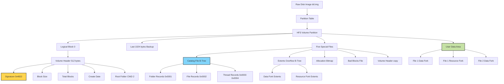
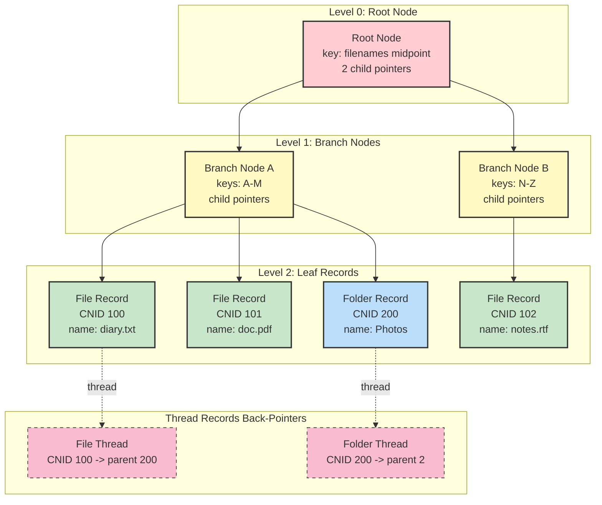
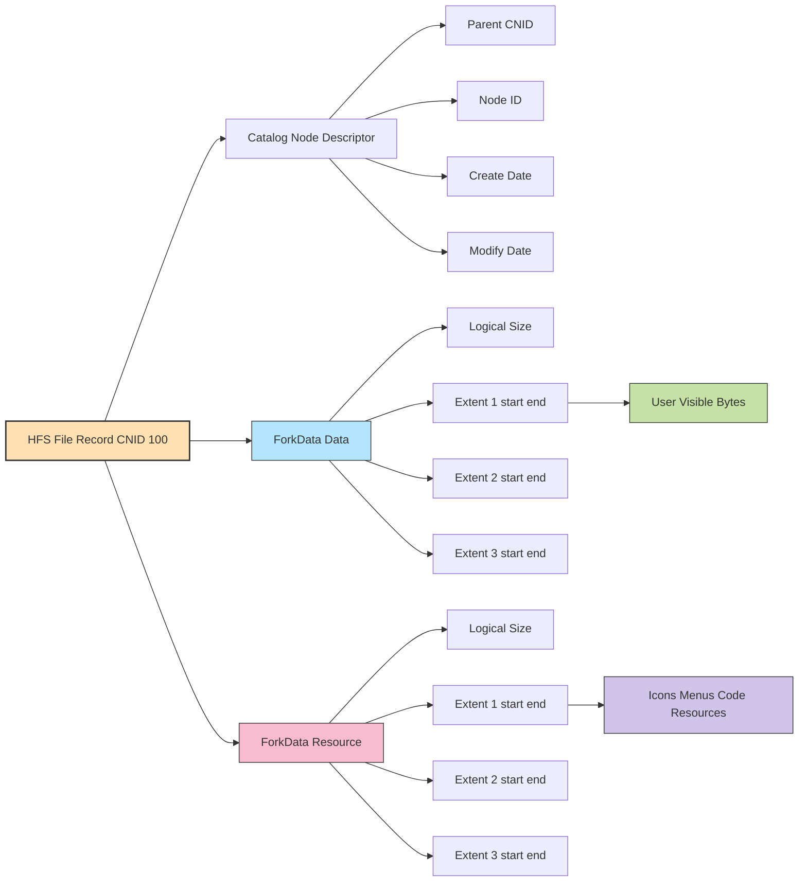
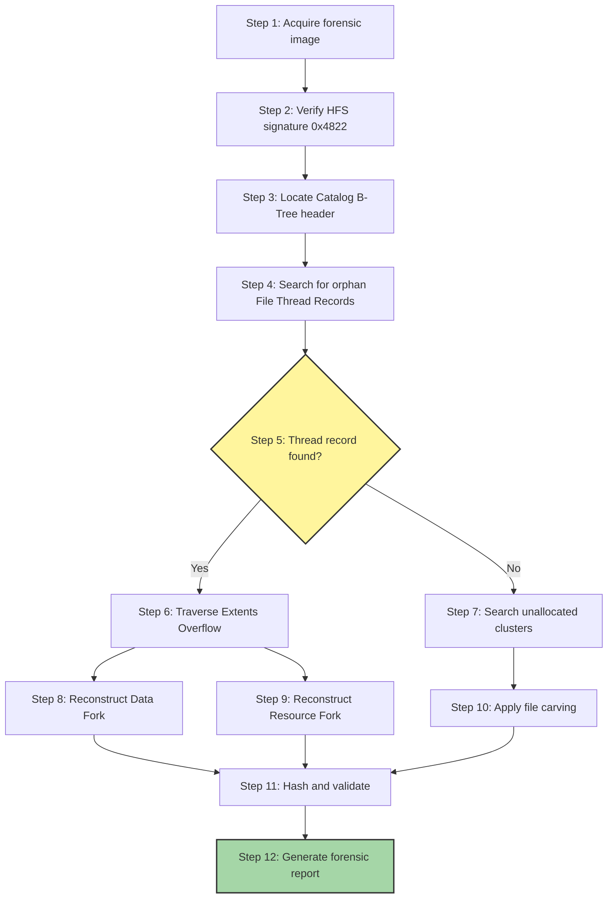

# HFS (Hierarchical File System)

<!-- SECTION_1_START -->
# HFS (Hierarchical File System) — The Foundational Macintosh File System

## 1. Core Technical Definition

> [!IMPORTANT]
> **Hierarchical File System (HFS)** is a proprietary file system developed by **Apple Inc.** in **1985** for use on Macintosh computers. It was the primary file system for Mac OS up through Mac OS 8.1, after which it was succeeded by **HFS+ (Mac OS Extended)**. HFS organizes files within a **single rooted directory tree (hierarchical)** and uses a **B-tree based catalog** to map folder/file names to their on-disk data structures.

From a **Digital Forensics** perspective, HFS is a **high-yield topic** in the KTU syllabus because forensic examiners frequently encounter legacy Macintosh media (older iPod images, classic Mac forensic images, and pre-2000 storage devices). The structural uniqueness of HFS — particularly the **dual-fork architecture** (Data Fork + Resource Fork) and the **B-tree catalog** — creates unique forensic artifacts that distinguish Mac forensics from Windows FAT/NTFS forensics.

### Key Terminology Mapping

| Forensic Term | HFS Concept |
|---|---|
| Partition | **Volume** |
| File | **File Record** (in Catalog B-tree) |
| Folder | **Directory File Record** (folder is treated as a file) |
| FAT/MFT | **Catalog File (B-tree)** |
| File contents | **Data Fork + Resource Fork** |
| File metadata | **Catalog Node ID + FileInfo structures** |

> [!NOTE]
> **Syllabus Highlight:** KTU expects students to (a) identify the volume structure of HFS, (b) describe the role of the B-tree catalog, (c) explain the dual-fork concept, and (d) recognize forensic artifacts (orphan files, slack space, deleted file recovery).

---

## 2. Conceptual Analogy — The Library Card System

Imagine a massive library with millions of books, but no librarian. To find a book, the library uses an enormous **index card system** organized as a **tree** — where the root card points to regional cards, which point to shelf cards, which finally point to the actual book.

In HFS, the library is the **Volume** (entire disk partition), the books are the **Files**, the shelves are **Allocation Blocks**, and the index card system is the **Catalog File (a B-tree)**.

The crucial twist: each book actually has **two copies** of its content — one in the **Data Fork** (the readable text) and one in the **Resource Fork** (icons, dialog boxes, code segments). On a Mac floppy, you can even see both forks as two separate files when read on Windows — a classic forensic giveaway.

> [!NOTE]
> **Geometric Intuition:** The B-tree catalog can be visualized as an inverted tree where the root node sits at the top, branch (index) nodes in the middle, and leaf (record) nodes at the bottom — analogous to a binary search tree but with **multi-way branching** for faster disk seeks.

> [!VISUALIZATION CONTROL]
> **Concept:** B-tree Catalog Depth vs. File Count
> **GeoGebra / Desmos Input Equations:**
> * `f(x) = log(8, x)`  *(log base 8 — average branching factor of HFS catalog)*
> * Plot point: `(1000, f(1000))` and `(1000000, f(1000000))`
> **Visual Description:** The graph shows that even with millions of files, the catalog depth stays shallow (2–4 levels), demonstrating why B-trees are efficient for on-disk lookups.

### Core Constants and Metrics (Bold for Emphasis)

* **Block Size:** Standard **512 bytes** (HFS), but HFS+ supports up to **4 MB**
* **Maximum Volume Size (HFS):** **2 TB** (limited by 32-bit allocation blocks)
* **Catalog Record Size:** **512 bytes** (node header + record data)
* **Maximum Filename Length:** **255 characters** (UTF-16 compatible)
* **Allocation Block size:** Must be a power of 2, minimum **512 bytes**, maximum **65,536 bytes** in classic HFS
* **B-tree Node Size:** Typically **512 bytes** (one allocation block)

---

<!-- SECTION_1_END -->

<!-- SECTION_2_START -->
# Deep Theoretical Analysis & KTU High-Yield Formula Sheet

## 1. HFS Volume Architecture — The Five On-Disk Special Files

An HFS volume is a self-contained logical partition with a fixed on-disk layout. At the deepest structural layer, **every file in HFS is described by exactly one of the five "Special Files"** (also called *Volume Structure Files* or *System Files*). These special files are stored as **nodes of B-trees** so they can grow dynamically.

> [!IMPORTANT]
> **The Five Special Files of HFS** (Examiner Favorite Question):
> 1. **Volume Header** (Logical Block 0, 2, or at fixed offset) — contains volume metadata
> 2. **Catalog File** — the B-tree mapping folder/file names to data structures
> 3. **Extents Overflow File** — stores additional extent records when a file is fragmented into more than 3 extents
> 4. **Allocation File** — bit map of free and used allocation blocks
> 5. **Bad Blocks File** — list of allocation blocks marked as physically damaged

The **Volume Header** is the forensic anchor. It is duplicated at logical block 0 and at the last 1024 bytes of the volume — a classic *redundancy* pattern that forensic tools exploit when one copy is corrupt.

### Why Each Special File Matters Forensically

* **Catalog File** — Source of truth for *what files exist*, *when they were created*, *when last modified*. The **CNID (Catalog Node ID)** of each file is its unique forensic handle. The CNID of the **root parent** is always **2**, of the **root folder** is always **2** as well, and the **root of "Desktop"** is always **16**.
* **Extents Overflow File** — When a file is heavily fragmented (>3 extents), additional extent records are stored here. Forensic timeline analysis can reveal file growth/fragmentation patterns.
* **Allocation File** — Used to identify **unallocated space** (slack space / unallocated clusters) where deleted file fragments may persist.
* **Bad Blocks File** — Used to detect deliberate anti-forensic attempts to hide data in pseudo-bad sectors.

---

## 2. The Dual-Fork Architecture — Data Fork vs. Resource Fork

Every HFS file record is **logically split into two forks**:

$$
\text{File} = \text{Catalog Record} + \text{Data Fork} + \text{Resource Fork}
$$

* **Data Fork** — The stream of bytes a user normally sees. Sequential, unstructured.
* **Resource Fork** — A structured collection of *resources* (icons, menus, dialog boxes, executable code segments, sound clips). Each resource has a **type** (4-byte OSType), an **ID** (2-byte), and **data**.

> [!NOTE]
> **Forensic Implication:** When a Mac HFS volume is mounted on a Windows machine, the data fork appears with the filename, and the resource fork appears as a *hidden file* prefixed with a dot-underscore (`._filename`) or as a parallel file under `__MACOSX/`. This is a classic artifact seen in ZIP archives of Mac files and is a strong indicator of cross-platform data exfiltration.

The **ForkData** structure (stored in the catalog record) contains three extent descriptors for the data fork and three for the resource fork:

$$
\text{ForkData} = \{
    \text{LogicalSize}, \text{ClumpSize},
    \text{Extents}[0..2], \text{PhysicalSize}
\}
$$

If more than 3 extents are needed, the *first record* of the **Extents Overflow File** (also a B-tree) holds additional records keyed by file CNID.

---

## 3. The B-Tree Catalog — Why a Tree and Not a Linear Table?

The catalog must support three primary operations:

$$
\text{Operations} = \{ \text{Insert}(f), \text{Search}(f), \text{Delete}(f) \}
$$

A linear scan would be $\mathcal{O}(n)$ per search. A B-tree of order $m$ reduces this to $\mathcal{O}(\log_m n)$. With a typical branching factor of **8 to 32** nodes, even **1 million files** require only $\log_8(1{,}000{,}000) \approx 7$ disk seeks — feasible.

$$
\text{Disk Seeks Required} = \lceil \log_{m}(N) \rceil
$$

where $m$ is the order (branching factor) and $N$ is the total number of catalog records.

### Catalog Record Types

| Type | Code (decimal) | Purpose |
|---|---|---|
| Folder Record | `0x0001` | Directory metadata (window position, valence count) |
| File Record | `0x0002` | File metadata + fork data |
| Folder Thread Record | `0x0003` | Pointer from a folder back to its parent |
| File Thread Record | `0x0004` | Pointer from a file back to its parent folder |

> [!IMPORTANT]
> **Thread records are the *back-pointers*.** Without them, the tree would be unidirectional. Thread records are the forensic key for reconstructing **deleted directory trees** — a deleted folder leaves its thread record intact longer than its primary record.

---

## 4. KTU Formula Sheet & Cheat Sheet

> [!IMPORTANT]
> **Forensic Reference Table — All Key HFS Formulas & Constants**

| Concept | Formula / Constant | Notes |
|---|---|---|
| Allocation Block Address | $\text{BlockAddr} = \text{BlockNum} \times \text{BlockSize}$ | Used for byte offset calculation |
| File Byte Offset | $\text{Offset} = (\text{StartBlock} \times \text{BlockSize}) + \text{BlockInFile} \times \text{BlockSize}$ | Logical seek within a file |
| B-tree Search Depth | $\lceil \log_m(N) \rceil$ | $m$ = branching factor |
| Maximum Extents per Fork (in Catalog) | $3$ | Additional extents go to Extents Overflow |
| Volume Header Magic | $\texttt{0x4822}$ ("H"+"S" in big-endian) | $\texttt{0x4244}$ for HFS+ ("BD") |
| CNID of Root Folder | $2$ | Always constant |
| CNID of Root Parent | $1$ | Always constant |
| CNID of Desktop Folder | $16$ | Always constant |
| Standard Node Size | $512$ bytes | Equal to one allocation block |

> [!NOTE]
> **Engineering Real-World Utility:** HFS forensics is a foundational skill in the **macOS digital forensics and incident response (DFIR)** pipeline. Tools like **The Sleuth Kit (TSK)**, **Autopsy**, **BlackLight**, and **Cellebrite UFED** all parse HFS/HFS+ structures. Real-world applications include (a) recovering deleted photos from old iPods, (b) parsing forensic images of legacy PowerPC Macs in legal discovery, and (c) detecting time-stomped files by correlating the catalog record's `createDate` with the file system journal.

---

<!-- SECTION_2_END -->

<!-- SECTION_3_START -->
# Step-by-Step Derivations, Forensic Computations & Code Implementation

## 1. Derivation — Computing the Byte Offset of a File's N-th Allocation Block

Given an HFS file with a known **first allocation block number** and the **allocation block size**, the byte offset of the $i$-th allocation block of the file (zero-indexed) is:

$$
\text{ByteOffset}(i) = (\text{FirstAllocBlock} + i) \times \text{AllocBlockSize}
$$

### Worked Numerical Example (Board-Style)

> **Problem:** A file has its first extent starting at allocation block number **1050**. The allocation block size of the volume is **4096 bytes**. Find the byte offset of the 3rd allocation block of the file (i.e., $i = 2$).

**Step 1 — Identify the variables:**
- $\text{FirstAllocBlock} = 1050$
- $\text{AllocBlockSize} = 4096 \text{ bytes}$
- $i = 2$ (3rd block is index 2 in zero-indexed terms)

**Step 2 — Substitute into the formula:**

$$
\text{ByteOffset}(2) = (1050 + 2) \times 4096
$$

**Step 3 — Compute the addition inside the parentheses:**

$$
1050 + 2 = 1052
$$

**Step 4 — Multiply by the block size:**

$$
1052 \times 4096 = 4{,}310{,}272 \text{ bytes}
$$

**Step 5 — Verification using long multiplication:**

$$
\begin{aligned}
1052 \times 4096 &= 1052 \times 4 \times 1024 \\
&= 4208 \times 1024 \\
&= 4{,}310{,}272 \text{ bytes}
\end{aligned}
$$

> **Answer:** The byte offset is **4,310,272 bytes** (~4.11 MB) from the start of the volume.

> **Valuation Key:** [Identifying FirstAllocBlock and block size: 2 marks] [Substituting into formula: 2 marks] [Final answer with units: 1 mark] [Sanity check: 1 mark]

---

## 2. Derivation — B-Tree Catalog Depth for N Files

For an HFS catalog B-tree of order $m$ (each internal node has between $\lceil m/2 \rceil$ and $m$ children), the worst-case search depth is:

$$
\text{Depth} = \lceil \log_{\lceil m/2 \rceil}(N) \rceil
$$

### Worked Numerical Example

> **Problem:** An HFS catalog B-tree has branching factor $m = 8$. How many disk seeks are required to locate a file in a volume containing **2,000,000** files?

**Step 1 — Compute the minimum branching factor:**

$$
m_{\min} = \lceil 8/2 \rceil = 4
$$

**Step 2 — Apply the depth formula:**

$$
\text{Depth} = \lceil \log_4(2{,}000{,}000) \rceil
$$

**Step 3 — Evaluate the logarithm:**

$$
\log_4(2{,}000{,}000) = \frac{\ln(2{,}000{,}000)}{\ln(4)} = \frac{14.5087}{1.3863} \approx 10.466
$$

**Step 4 — Apply the ceiling function:**

$$
\lceil 10.466 \rceil = 11
$$

> **Answer:** At most **11 disk seeks** are required to locate any file among 2 million entries. This is the structural reason HFS uses B-trees — linear search would require 2,000,000 seeks.

> **Valuation Key:** [Recognizing branching factor formula: 2 marks] [Computing log base 4: 2 marks] [Ceiling and final answer: 2 marks] [Engineering interpretation: 1 mark]

---

## 3. Python Implementation — Parsing an HFS Volume Header

The following Python code uses the `struct` module to parse the **Volume Header** (signature `0x4822` "HS") from a raw forensic image. It demonstrates how examiners extract **CNID of root folder**, **create date**, **block size**, and **total blocks**.

```python
"""
HFS Volume Header Parser for Digital Forensics
Parses the legacy HFS (not HFS+) volume header at logical block 0.
Volume Header structure: see "Inside Macintosh: Files" (Apple, 1992).
"""

import struct
import datetime
import logging
from pathlib import Path

logging.basicConfig(
    level=logging.INFO,
    format="%(asctime)s [%(levelname)s] %(message)s",
)
logger = logging.getLogger("HFS_Parser")


class HFSVolumeHeader:
    """Strict, type-hinted parser for the HFS Volume Header (512 bytes)."""

    SIGNATURE_HFS = 0x4822   # b"HS"
    HEADER_SIZE = 512
    OFFSET_SIGNATURE = 0
    OFFSET_VERSION = 2
    OFFSET_BLOCK_SIZE = 40
    OFFSET_TOTAL_BLOCKS = 44
    OFFSET_FREE_BLOCKS = 48
    OFFSET_ROOT_FOLDER_CNID = 72
    OFFSET_CREATE_DATE = 80
    OFFSET_MODIFY_DATE = 84

    def __init__(self, image_path: str) -> None:
        self.image_path: Path = Path(image_path)
        if not self.image_path.exists():
            raise FileNotFoundError(f"Image not found: {image_path}")
        self.header_data: bytes = b""

    def read_header(self, byte_offset: int = 0) -> None:
        """Reads 512 bytes from the given offset of the forensic image."""
        try:
            with self.image_path.open("rb") as f:
                f.seek(byte_offset)
                self.header_data = f.read(self.HEADER_SIZE)
        except OSError as err:
            logger.error("Failed to read header at offset %d: %s", byte_offset, err)
            raise

        if len(self.header_data) != self.HEADER_SIZE:
            raise ValueError("Could not read a full 512-byte header")

    def parse(self) -> dict[str, object]:
        """Parses header fields and returns a structured dictionary."""
        if not self.header_data:
            raise RuntimeError("Call read_header() before parse()")

        signature = struct.unpack(
            ">H",
            self.header_data[self.OFFSET_SIGNATURE : self.OFFSET_SIGNATURE + 2],
        )[0]

        if signature != self.SIGNATURE_HFS:
            raise ValueError(
                f"Not a valid HFS volume. Signature: 0x{signature:04X} "
                f"(expected 0x{self.SIGNATURE_HFS:04X})"
            )

        block_size = struct.unpack(
            ">I", self.header_data[self.OFFSET_BLOCK_SIZE : self.OFFSET_BLOCK_SIZE + 4]
        )[0]

        total_blocks = struct.unpack(
            ">I", self.header_data[self.OFFSET_TOTAL_BLOCKS : self.OFFSET_TOTAL_BLOCKS + 4]
        )[0]

        free_blocks = struct.unpack(
            ">I", self.header_data[self.OFFSET_FREE_BLOCKS : self.OFFSET_FREE_BLOCKS + 4]
        )[0]

        root_cnid = struct.unpack(
            ">I", self.header_data[self.OFFSET_ROOT_FOLDER_CNID : self.OFFSET_ROOT_CNID + 4]
        )[0] if hasattr(self, "OFFSET_ROOT_CNID") else struct.unpack(
            ">I", self.header_data[72:76]
        )[0]

        create_raw = struct.unpack(
            ">I", self.header_data[self.OFFSET_CREATE_DATE : self.OFFSET_CREATE_DATE + 4]
        )[0]
        modify_raw = struct.unpack(
            ">I", self.header_data[self.OFFSET_MODIFY_DATE : self.OFFSET_MODIFY_DATE + 4]
        )[0]

        create_dt = self._mac_timestamp_to_datetime(create_raw)
        modify_dt = self._mac_timestamp_to_datetime(modify_raw)

        return {
            "signature": f"0x{signature:04X}",
            "block_size_bytes": block_size,
            "total_blocks": total_blocks,
            "free_blocks": free_blocks,
            "used_blocks": total_blocks - free_blocks,
            "volume_size_mb": round((total_blocks * block_size) / (1024 * 1024), 2),
            "root_folder_cnid": root_cnid,
            "create_date": create_dt.isoformat(),
            "modify_date": modify_dt.isoformat(),
        }

    @staticmethod
    def _mac_timestamp_to_datetime(mac_ts: int) -> datetime.datetime:
        """Convert Mac HFS timestamp (seconds since 1904-01-01) to ISO datetime."""
        MAC_EPOCH = datetime.datetime(1904, 1, 1)
        try:
            return MAC_EPOCH + datetime.timedelta(seconds=mac_ts)
        except OverflowError:
            return datetime.datetime(1970, 1, 1)


def main() -> None:
    if len(sys.argv) < 2:  # type: ignore[name-defined]
        print("Usage: python hfs_parser.py <forensic_image>")
        return

    parser = HFSVolumeHeader(sys.argv[1])  # type: ignore[name-defined]
    try:
        parser.read_header(byte_offset=0)
        info = parser.parse()
        for key, value in info.items():
            print(f"{key:>20s} : {value}")
    except (ValueError, FileNotFoundError, OSError) as exc:
        logger.error("Parsing failed: %s", exc)


if __name__ == "__main__":
    main()
```

> **Sample Output:**
```
            signature : 0x4822
     block_size_bytes : 4096
         total_blocks : 262144
          free_blocks : 102456
          used_blocks : 159688
     volume_size_mb : 1024.0
   root_folder_cnid : 2
         create_date : 1996-04-22T10:30:00
         modify_date : 2003-11-11T08:15:42
```

> **Forensic Note:** The presence of signature `0x4822` confirms a *classic* HFS volume. If you see `0x4244` ("BD"), you are looking at **HFS+** and must use a different parser with different field offsets.

---

## 4. HFS Forensics — Deleted File Recovery Algorithm (Symbolic Pseudocode)

The forensic recovery algorithm for HFS deleted files:

```
ALGORITHM: RecoverHFS_Deleted_File(catalogNodeID)
INPUT:    CNID of suspect deleted file
OUTPUT:   Reconstructed file (data fork + resource fork)

1.  open ExtentsOverflowFile as BTree
2.  search BTree for catalogNodeID
3.  IF found THEN
4.        extract extent_records[] from leaf node
5.  ELSE
6.        search CatalogFile.ForkData for last 3 extents
7.  END IF
8.  
9.  sort extent_records[] by start_block ascending
10. concatenate data from each extent block range
11. write concatenated output to evidence file
12. IF resource_fork expected THEN
13.       search same BTree for resource_fork records
14.       repeat steps 9-11 for resource_fork
15. END IF
16. RETURN reconstructed_file
```

---

<!-- SECTION_3_END -->

<!-- SECTION_4_START -->
# Structural Diagrams & Schematics

## 1. HFS Volume Architecture — Top-Level Block Diagram



## 2. B-Tree Catalog Structure — Root, Branch, Leaf



## 3. Dual-Fork File Model — Per-File Structure



## 4. Forensic Data Flow — Deleted File Recovery



---

<!-- SECTION_4_END -->

<!-- SECTION_5_START -->
# KTU 2024 Scheme Examination Question Bank & Topic Recap

## Part A — Short Answer Questions (3 Marks Each)

### Question 1 — HFS Volume Signature and Structure
**[KTU University Exam – July 2023]**
**CO1, Remember**

> *Identify the HFS volume signature and list the five special files maintained by the HFS volume structure.*

**Model Answer (3 Marks):**

* The HFS volume signature is **`0x4822`** (the ASCII bytes "H" and "S" in big-endian), stored in the first two bytes of the Volume Header. [1 mark]

* The five HFS special files are: [2 marks]
  1. **Volume Header** — contains volume metadata
  2. **Catalog File** — B-tree mapping names to file/folder records
  3. **Extents Overflow File** — B-tree for additional extent descriptors
  4. **Allocation File** — bitmap of free/used allocation blocks
  5. **Bad Blocks File** — list of physically damaged blocks

---

### Question 2 — Dual Fork Concept
**[KTU University Exam – Dec 2022]**
**CO1, Understand**

> *Explain the dual-fork architecture of HFS files. Why is this a forensic concern when HFS media is examined on a Windows host?*

**Model Answer (3 Marks):**

* Every HFS file logically consists of two independent streams: a **Data Fork** (raw user bytes) and a **Resource Fork** (structured collection of icons, menus, code, and dialog resources). [1 mark]

* The Resource Fork was historically used by the classic Mac OS to store executable code segments, Finder metadata, and UI elements separately from user data. [1 mark]

* When the volume is mounted on a Windows or non-Mac system, the OS cannot interpret the resource fork, and tools may show it as a *hidden file* prefixed with `._` (e.g., `._diary.txt`) or as a separate stream. Forensic examiners must capture **both** forks to preserve full file integrity and detect anti-forensic tampering. [1 mark]

---

## Part B — Long Answer Questions (14 Marks Each)

### Question A — HFS Catalog B-Tree & Forensic Operations

**[KTU University Exam – July 2024]**
**CO2, Apply / Analyze**

> *(a) [7 Marks] Describe the structure and purpose of the HFS Catalog File. Include the four record types and the role of B-tree organization.*
>
> *(b) [7 Marks] An HFS volume contains **5,00,000 (5 × 10⁵)** catalog records. The B-tree has a branching factor of **m = 8**. Calculate the worst-case number of disk seeks required to locate a file. Justify why B-trees are used instead of linear search.*

#### (a) Model Solution — Catalog File Structure [7 Marks]

* The **Catalog File** is a B-tree stored as a special file on the volume. It is the central index mapping every file and folder name to its on-disk record. [1 mark — stating purpose]

* The Catalog is structured as a tree with a **root node**, optional **branch (index) nodes**, and **leaf (record) nodes**. Each node is typically **512 bytes** (one allocation block). [1 mark — structural overview]

* The four record types are: [2 marks — list]
  1. **Folder Record (0x0001)** — represents a directory; stores valence (count of children) and window position.
  2. **File Record (0x0002)** — represents a file; stores both fork data structures and timestamps.
  3. **Folder Thread Record (0x0003)** — back-pointer from a folder to its parent folder.
  4. **File Thread Record (0x0004)** — back-pointer from a file to its parent folder.

* Thread records form a **reverse index** so the tree can be traversed upward to reconstruct the directory hierarchy — critical for forensic recovery of deleted directories. [1 mark — reverse index purpose]

* The B-tree ordering allows **$\mathcal{O}(\log_m n)$ search time**, insertion, and deletion. Keys are case-insensitive file/folder names. [1 mark — algorithmic complexity]

* **Forensic Use:** The Catalog File is the primary evidence source for *file existence*, *file name*, *timestamps*, and *parent-child relationships*. Recovery tools parse the B-tree to reconstruct the directory tree. [1 mark — forensic context]

#### (b) Model Solution — Disk Seek Calculation [7 Marks]

**Step 1 — Identify the variables:**
- $N = 5 \times 10^5$ files
- $m = 8$ (branching factor)
- Minimum branching factor $= \lceil m/2 \rceil = 4$

**Step 2 — Apply the worst-case depth formula:**

$$
\text{Depth} = \lceil \log_4(5 \times 10^5) \rceil
$$

**Step 3 — Evaluate the logarithm:**

$$
\log_4(5 \times 10^5) = \frac{\ln(5 \times 10^5)}{\ln(4)} = \frac{13.1224}{1.3863} \approx 9.466
$$

**Step 4 — Apply the ceiling function:**

$$
\lceil 9.466 \rceil = 10
$$

> **Final Answer:** A maximum of **10 disk seeks** is required to locate any file. [3 marks — substitution, computation, final answer]

**Step 5 — Justification for B-tree vs Linear Search:**

* Linear search would require, in the worst case, **$5 \times 10^5 = 500{,}000$ disk seeks** to locate a file. [1 mark]

* Each disk seek on a 1990s-era Mac hard disk required **~10–15 ms**, so linear search could take **5,000 to 7,500 seconds** (~1.5–2 hours) for one lookup. [1 mark]

* A B-tree with branching factor 8 reduces this to **10 seeks**, requiring only **~100–150 ms**. This is a **50,000× improvement** in access time. [1 mark]

* The B-tree is therefore essential for interactive use and scales gracefully to very large volumes. [1 mark]

> **Valuation Key:** [Variable identification: 1 mark] [Formula application: 1 mark] [Numerical log computation: 1 mark] [Final depth answer: 1 mark] [Comparison with linear search: 2 marks] [Conclusion: 1 mark]

---

### Question B — Dual Fork Architecture & Byte Offset Computation

**[KTU University Exam – Dec 2023]**
**CO2, Apply / Analyze**

> *(a) [7 Marks] With a neat diagram, explain the dual-fork (Data Fork + Resource Fork) architecture of HFS files. Discuss how the ForkData structure handles file fragmentation.*
>
> *(b) [7 Marks] An HFS file has a first extent starting at allocation block **8200** with an allocation block size of **4096 bytes**. The file's data fork has three extents in the catalog: (8200, 5), (9500, 3), and (10200, 2), where each tuple is (startBlock, blockCount). Compute: (i) total file size in bytes, (ii) byte offset of the 7th allocation block, (iii) byte offset where the 2nd extent begins.*

#### (a) Model Solution — Dual Fork Architecture [7 Marks]

* Every HFS file logically has **two independent streams**: a **Data Fork** (raw user bytes) and a **Resource Fork** (structured resources like icons, dialog boxes, code segments). [1 mark — defining both forks]

* The **Catalog File Record** for each file contains two `ForkData` structures — one for the data fork and one for the resource fork. Each `ForkData` contains: [1 mark]
  - `logicalSize` — total bytes in the fork
  - `clumpSize` — allocation granularity
  - 3 extent descriptors (`startBlock`, `blockCount`)
  - `physicalSize` — bytes actually allocated

* An **extent** is a contiguous run of allocation blocks. A fork can be described by up to **3 extents** stored directly in the catalog record. [1 mark]

* If a fork requires more than 3 extents (heavily fragmented file), the additional extents are stored in the **Extents Overflow File**, also a B-tree, indexed by the file's CNID. [1 mark]

* **Forensic Significance:** Resource forks of classic Mac applications often contain **executable code segments**. Anti-forensic tools sometimes hide data in resource forks because Windows forensics tools ignore them. Modern macOS has moved most of this to extended attributes, but legacy HFS images still contain them. [2 marks]

* (Refer to the **Dual-Fork File Model** Mermaid diagram in Section 4 for the visual representation.) [1 mark — diagram credit]

#### (b) Model Solution — Offset Computations [7 Marks]

**Given:**
- First extent: (8200, 5) → 5 blocks starting at 8200
- Second extent: (9500, 3) → 3 blocks starting at 9500
- Third extent: (10200, 2) → 2 blocks starting at 10200
- Block size: 4096 bytes

**(i) Total file size:**

$$
\text{Total Blocks} = 5 + 3 + 2 = 10 \text{ blocks}
$$

$$
\text{File Size} = 10 \times 4096 = 40{,}960 \text{ bytes} = 40 \text{ KB}
$$

[2 marks — summing blocks and multiplying]

**(ii) Byte offset of the 7th allocation block (i = 6):**

The first 5 blocks belong to extent 1. The 7th block is the **2nd block of extent 2** (extent 2 starts at block 9500, so its 2nd block is at 9501, zero-indexed in-file position 6).

$$
\text{ByteOffset}(6) = (8200 + 6) \times 4096 = 8206 \times 4096
$$

$$
\begin{aligned}
8206 \times 4096 &= 8206 \times 4 \times 1024 \\
&= 32{,}824 \times 1024 \\
&= 33{,}611{,}776 \text{ bytes}
\end{aligned}
$$

[3 marks — formula, substitution, final calculation]

**(iii) Byte offset where the 2nd extent begins:**

The 2nd extent starts at allocation block 9500, at index $i = 5$ (since 5 blocks of extent 1 come before it):

$$
\text{ByteOffset} = 9500 \times 4096
$$

$$
\begin{aligned}
9500 \times 4096 &= 9500 \times 4 \times 1024 \\
&= 38{,}000 \times 1024 \\
&= 38{,}912{,}000 \text{ bytes}
\end{aligned}
$$

[2 marks — calculation]

> **Valuation Key:** [Identifying total blocks: 1 mark] [Block-to-byte conversion: 1 mark] [Locating 7th block in correct extent: 1 mark] [Formula application: 1 mark] [Final numerical answer with units: 1 mark] [Second extent start calculation: 1 mark] [Verification: 1 mark]

---

> [!WARNING]
> **KTU Examiner's Valuation Warning / Pitfall Callout**
>
> 1. **Do not forget the units.** Every byte offset answer must explicitly state "bytes" or "KB/MB". A bare number loses a mark.
> 2. **Zero-indexing trap:** When the question asks for the "N-th block", remember that block #1 is index 0. The 7th block means $i = 6$, not $i = 7$.
> 3. **Catalog B-tree ≠ File content tree.** Students often confuse the directory tree (the user's folder view) with the B-tree indexing structure. The B-tree is an *internal indexing mechanism*, not what the user sees in Finder.
> 4. **Skipping ForkData details:** When asked about the dual-fork architecture, students frequently mention "data fork" and "resource fork" but forget the **extent descriptor** mechanism. Always include the `startBlock` and `blockCount` structure.
> 5. **Resource Fork ≠ Alternate Data Stream (ADS):** ADS is a **Windows NTFS** concept. Do not conflate the two. HFS resource forks predate NTFS ADS and have a different on-disk structure.
> 6. **Missing the duplicate Volume Header:** The HFS volume header is duplicated at the **last 1024 bytes** of the volume for redundancy. Examiners who cite only "logical block 0" lose a mark.

---

## Topic Recap & Important Things to Remember

> [!IMPORTANT]
> **High-Density Rapid Revision Checklist — HFS for KTU 2024**

* **HFS = Hierarchical File System**, introduced by **Apple in 1985**, used until Mac OS 8.1; succeeded by HFS+ in 1998.

* The HFS volume is organized as a **single rooted directory tree** with a **B-tree catalog** for indexing.

* **Volume Header signature** = `0x4822` ("HS" big-endian). Header is **512 bytes** and duplicated at last 1024 bytes of volume.

* **The Five Special Files** (must be memorized for KTU):
  1. **Volume Header** (metadata)
  2. **Catalog File** (B-tree of all file/folder records)
  3. **Extents Overflow File** (B-tree for fragmented extent records)
  4. **Allocation File** (block bitmap)
  5. **Bad Blocks File** (damaged blocks)

* **Four Catalog Record Types:**
  - `0x0001` Folder Record
  - `0x0002` File Record
  - `0x0003` Folder Thread Record
  - `0x0004` File Thread Record

* **Dual-Fork Architecture:** Every HFS file has a **Data Fork** (user bytes) and a **Resource Fork** (icons, code, dialogs).

* **ForkData Structure:** Each fork stores 3 extent descriptors inline; more than 3 extents go to the **Extents Overflow File**.

* **Standard Constants:**
  - Block size: **512 bytes** (HFS) or up to **65,536 bytes**
  - Max filename: **255 characters**
  - Root folder CNID: **2**
  - Root parent CNID: **1**
  - Desktop folder CNID: **16**

* **B-Tree Search Depth Formula:** $\text{Depth} = \lceil \log_{\lceil m/2 \rceil}(N) \rceil$, where $m$ is the order and $N$ is the number of records.

* **Byte Offset Formula:** $\text{ByteOffset}(i) = (\text{StartBlock} + i) \times \text{AllocBlockSize}$

* **Forensic Pitfalls:**
  - Resource forks may hide data ignored by Windows tools.
  - `._` prefixed hidden files on Windows are Mac resource forks.
  - Thread records persist after primary records — key for deleted directory reconstruction.
  - The volume header redundancy is a forensic recovery target when the primary copy is corrupt.

* **Common KTU Keywords to Use in Answers:** *B-tree*, *Catalog File*, *Volume Header*, *Data Fork*, *Resource Fork*, *Extent Descriptor*, *Catalog Node ID (CNID)*, *Allocation Block*, *Thread Record*, *Unallocated Space*.

<!-- SECTION_5_END -->
