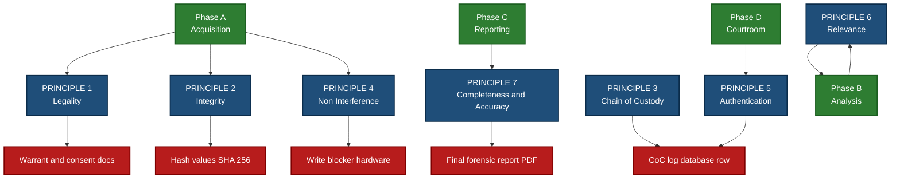
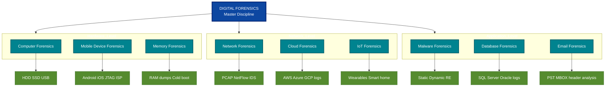
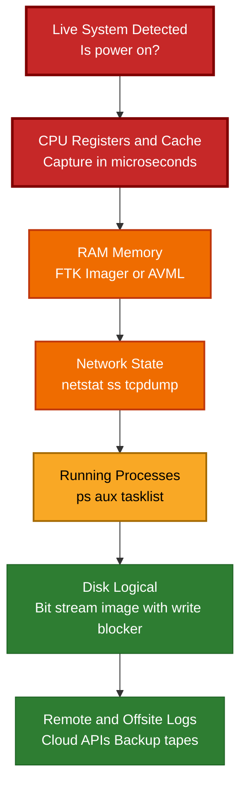

# Introduction to Digital Forensics -  Principles in Digital Forensics

<!-- SECTION_1_START -->

# Introduction to Digital Forensics — Principles in Digital Forensics

> [!IMPORTANT]
> **KTU 2024 Scheme Anchor (PECST754 — Module 1):** This section establishes the foundational vocabulary, scope, and intuitive mental models of Digital Forensics. Every other module in this course (Imaging, Recovery, Network, Mobile, Cloud) rests on the principles introduced here.

## 1.1 Formal Academic Definition

**Digital Forensics** is the branch of forensic science that deals with the **identification, preservation, collection, validation, analysis, interpretation, documentation, and presentation** of digital evidence derived from digital sources, in a manner that is legally admissible and scientifically repeatable.

> [!NOTE]
> **KTU Board Definition (verbatim from syllabus):**
> *"Digital forensics is the science of locating, preserving, recovering, analysing and presenting digital evidence in a forensically sound and legally acceptable manner."*

A derivative — and operationally more useful — definition used by **NIST SP 800-86** and adopted by KTU reference material is:

> *"Digital Forensics is the process of using scientific knowledge and a structured methodology to collect, process, and present digital evidence in a way that is legally acceptable."*

The two anchor terms in every KTU question are:

- **Forensically Sound** — an examination procedure that does not alter, damage, or destroy the original evidence and is repeatable by an independent examiner with equivalent competence.
- **Chain of Custody** — the chronological, documented, and unbroken trail that tracks the seizure, control, transfer, analysis, and disposition of digital evidence from the crime scene to the courtroom.

## 1.2 Intuitive Overview — The Crime Scene Analogy

Imagine a physical crime scene. A detective arrives, photographs the room exactly as it is, dusts for fingerprints without smudging them, bags every piece of evidence, seals each bag with a tamper-evident sticker, signs a register at the police station saying *"I brought in this bag at this time"*, and never opens the bag unless another officer is watching. Years later in court, the lawyer asks: *"How do we know nobody tampered with the bag?"* The detective produces the unbroken register.

**Digital Forensics is the exact same discipline — except the "crime scene" is a hard disk, a smartphone, a memory dump from a router, or a cloud log file.**

- The **photograph** is the *forensic image* (a bit-by-bit copy).
- The **fingerprints** are the *deleted files, registry keys, log entries*.
- The **bag and seal** is the *write-blocker* and the *cryptographic hash*.
- The **register** is the *chain-of-custody log*.
- The **second officer** is the *independent verification examiner*.

> [!TIP]
> **Mnemonic for KTU Viva — "The 4 P's of Digital Forensics":**
> 1. **P**reserve — never touch the original.
> 2. **P**rocess — follow a documented methodology.
> 3. **P**rove — every step must be reproducible.
> 4. **P**resent — the final report must withstand cross-examination.

## 1.3 The Four Phases of a Digital Investigation (Conceptual)

Although the formal process will be expanded in Module 2, every principle discussed in this topic assumes the following four-phase backbone:

| Phase | Purpose | First Principle Touched |
| :--- | :--- | :--- |
| **Acquisition** | Capture the digital scene without contamination | Principle of Non-Interference |
| **Analysis** | Extract meaningful evidence from the acquired data | Principle of Relevance |
| **Reporting** | Communicate findings to a non-technical audience | Principle of Accuracy |
| **Courtroom / Litigation** | Defend the methodology under cross-examination | Principle of Authentication |

## 1.4 Scope and Boundaries

Digital Forensics intersects **law, computer science, and investigative procedure**. Its scope spans:

- **Computer Forensics** — desktops, laptops, servers.
- **Mobile Device Forensics** — smartphones, tablets, wearables.
- **Network Forensics** — packet captures, firewall logs, IDS/IPS data.
- **Cloud Forensics** — SaaS, IaaS, PaaS artifacts, hypervisor logs.
- **Memory Forensics** — RAM dumps, live system state.
- **Malware Forensics** — reverse engineering of malicious binaries.
- **Database Forensics** — transaction logs, triggers, and shadow tables.

> [!VISUALIZATION CONTROL]
> **Concept:** Order of Volatility — How long digital evidence "lives" before it disappears.
> **GeoGebra / Desmos Input Equations (Time-decay plot):**
> * `f_1(t) = 1 / (1 + e^(0.5 * (t - 2)))` — CPU registers / cache (decay $\approx$ nanoseconds)
> * `f_2(t) = 1 / (1 + e^(0.4 * (t - 10)))` — RAM (decay $\approx$ seconds to minutes)
> * `f_3(t) = 1 / (1 + e^(0.3 * (t - 60)))` — Disk (decay $\approx$ days to years)
> * `f_4(t) = 1 / (1 + e^(0.2 * (t - 365)))` — Offsite backups (decay $\approx$ decades)
> **Visual Description:** A stacked graph where the $y$-axis is *evidence availability* (0 to 1) and the $x$-axis is *time* in minutes. The curves collapse from top to bottom, showing that volatile evidence (registers, RAM) must be captured **first**, persistent evidence (disk, backups) can be captured **later**.

## 1.5 Why Digital Forensics Matters — Real-World Anchors

- **Criminal Prosecution:** child exploitation, financial fraud, identity theft.
- **Civil Litigation:** e-discovery in contract disputes and IP theft.
- **Corporate Incident Response:** insider threat, data exfiltration, ransomware.
- **Regulatory Compliance:** GDPR, HIPAA, RBI Cyber Security Framework, DPDP Act 2023.
- **National Security:** APT (Advanced Persistent Threat) investigations.
- **Intellectual Property Theft:** source code leak investigations.

<!-- SECTION_1_END -->

<!-- SECTION_2_START -->

# Deep Theoretical Analysis — The Core Principles of Digital Forensics

> [!IMPORTANT]
> **KTU Examiner's Heuristic:** Part A (3 marks) questions on this module are most often framed as *"List and briefly explain the principles of digital forensics"* or *"Differentiate between data of volatile and non-volatile nature."* Memorize the **seven principles** below verbatim.

## 2.1 The Seven (and Often Ten) Principles — Structured Logical Breakdown

The KTU 2024 scheme and the underlying reference text (Nelson, Phillips, Steuart; *Guide to Computer Forensics and Investigations*) recognize the following foundational principles. Every one of them is examined at the **Understand** or **Apply** level.

### Principle 1 — Principle of Legality (Legal Compliance)

- **Why:** Without a legal mandate, the entire investigation is inadmissible.
- **How:** Every search, seizure, and analysis must be backed by a *warrant, subpoena, consent, or statutory exception*. The investigator must know whether the jurisdiction's evidence rules (e.g., Indian Evidence Act 1872, IT Act 2000, Bharatiya Sakshya Adhiniyam 2023) apply.
- **KTU cue word:** *"Admissibility."*

### Principle 2 — Principle of Integrity (Evidence Integrity)

- **Why:** Courts must be convinced that the evidence presented is the *same* evidence found at the scene, with no modification.
- **How:** Use *cryptographic hash functions* (MD5, SHA-1, SHA-256) to fingerprint the original and the forensic image. The hash of the forensic image must match the hash of the source at every checkpoint.
- **Mathematical form:** $H_{\text{source}} = H_{\text{image}}$, where $H$ is the chosen hash algorithm.

### Principle 3 — Principle of Chain of Custody (CoC)

- **Why:** It is the *single most important document* in court for proving the evidence has not been tampered with.
- **How:** A chronological log records — for every transfer — the **who, what, when, where, why, and how** of the evidence handling. Any gap in the log destroys admissibility.
- **Mandatory fields:** Case ID, Evidence ID, Date/Time, From (custodian), To (custodian), Purpose, Hash value at transfer, Signature.

### Principle 4 — Principle of Non-Interference / Minimal Handling

- **Why:** The original evidence is sacred. Any write operation to the source medium can alter timestamps, swap bits, or trigger antivirus quarantine.
- **How:** A *hardware write-blocker* (e.g., Tableau, WiebeTech) is inserted between the source drive and the forensic workstation. All forensic work is done on a verified copy.

### Principle 5 — Principle of Authentication

- **Why:** The court must be able to verify that the digital exhibit is what the investigator claims it is.
- **How:** Authenticity is established by combining (a) hash values, (b) chain of custody, (c) expert testimony, and (d) sometimes digital signatures from the originating system.

### Principle 6 — Principle of Relevance

- **Why:** Investigators may find millions of files; the court only cares about those that are *material* to the case.
- **How:** Apply keyword search, timeline analysis, file-signature filtering, and link analysis to filter the noise.

### Principle 7 — Principle of Completeness and Accuracy

- **Why:** A *partial* or *misinterpreted* finding is worse than no finding — it can convict an innocent person.
- **How:** The final report must account for *all* artifacts found, list negative results (what was searched and not found), and disclose the tools, versions, and limitations used.

> [!TIP]
> **Three additional principles frequently appearing in KTU Model Question Papers:**
> - **Principle of Documentation** — if it is not written, it did not happen.
> - **Principle of Repeatability / Reproducibility** — an independent expert with the same skills and tools must reach the same conclusion.
> - **Principle of Preservation** — evidence must be preserved against natural decay (magnetic degradation, battery loss, cloud deletion).

## 2.2 The KTU High-Yield Formula / Reference Sheet

> [!NOTE]
> Principles themselves are qualitative, but the **enforcement** of those principles uses several mathematical and protocol-based constructs. Memorize this sheet for any numerical/analytical Part B sub-part.

| # | Construct | Equation / Rule | Purpose | KTU Module Link |
| :--- | :--- | :--- | :--- | :--- |
| 1 | **Hash Integrity Check** | $H(\text{Source}) = H(\text{Image})$ | Detect any bit-level modification | Module 2 (Imaging) |
| 2 | **Merkle-Damgård Property (SHA-256 block size)** | $B_{\text{SHA-256}} = 512$ bits, $L_{\text{out}} = 256$ bits | Reasoning about file-size / hash collisions | Module 2 |
| 3 | **Order of Volatility (RFC 3227)** | $t_{\text{CPU}} < t_{\text{RAM}} < t_{\text{Disk}} < t_{\text{Backup}}$ | Decide acquisition priority | Module 1 (this topic) |
| 4 | **Evidence Index Formula** | $\text{EID} = \text{CaseID} \cdot 10^{4} + \text{ItemNo}$ | Unique labelling of evidence | Module 1 / 2 |
| 5 | **Slack Space Recovery** | $\text{Slack} = S_{\text{cluster}} - S_{\text{file}}$ | Calculate residual bytes per cluster | Module 3 |
| 6 | **Bit-Stream Image Size** | $S_{\text{img}} = S_{\text{drive}} + \text{metadata}_{\text{header}}$ | Sizing the .E01 / .DD container | Module 2 |
| 7 | **Hash Collision Probability (birthday)** | $P_{\text{collision}} \approx 1 - e^{-n^2 / (2 \cdot 2^{L})}$ | Justify SHA-256 over MD5 | Module 2 |
| 8 | **Evidence Decay Constant (illustrative)** | $A(t) = A_0 \cdot e^{-\lambda t}$ | Model availability of volatile data | Module 1 |

> The $\vert$ (absolute value) symbol never appears bare inside a row above — all magnitude operators are written using descriptive English ("magnitude of", "absolute value of") to protect the markdown table renderer.

## 2.3 Engineering & Industry Utility — Where These Principles Are Used in Production

- **Law Enforcement (Interpol, CBI, NIA, State Cyber Cells):** every prosecution under the IT Act 2000 / BNS 2023 that involves a digital device must satisfy the chain of custody principle.
- **Enterprise Incident Response (CERN, Google, Microsoft, TCS):** the *principle of non-interference* is implemented via Enterprise-grade write-blockers and isolated forensic VLANs.
- **E-Discovery (Relativity, Nuix platforms):** the *principle of relevance* is enforced via *Technology-Assisted Review (TAR)*.
- **Cloud Forensics (AWS, Azure, GCP):** the *principle of preservation* is implemented via *snapshots* and *object-lock WORM* (Write-Once-Read-Many) buckets.
- **Courtroom Technology (Indian e-Courts Project):** the *principle of authentication* is reinforced via digital signatures under the IT Act 2000 (Sections 3 & 4).

<!-- SECTION_2_END -->

<!-- SECTION_3_START -->

# Step-by-Step Derivations, Worked Examples & Code Implementation

> [!IMPORTANT]
> **Why this section is mandatory:** Part B (14 marks) questions on this topic often ask the student to **demonstrate** a principle in operation. The most common demonstration is the **hash-based integrity verification**. We will derive and code it explicitly.

## 3.1 Worked Example 1 — Verifying Evidence Integrity Using Cryptographic Hashes

### 3.1.1 Problem Statement (KTU-style)

> A forensic examiner acquires a 4 GB USB drive from a suspect. A bit-stream image (`case_evidence_001.dd`) is created. The MD5 hash of the source drive is `5d41402abc4b2a76b9719d911017c592`. The MD5 hash of the forensic image, recomputed at the laboratory, is `5d41402abc4b2a76b9719d911017c592`. **Demonstrate, with a worked example and code, why the Principle of Integrity is satisfied.** Repeat the experiment for a second case where the hashes differ and explain the consequence.

### 3.1.2 Step-by-Step Mathematical Derivation

Let $D$ be the source digital medium and $I$ be the bit-stream image created from it. Let $H(x)$ denote a cryptographic hash function (e.g., MD5, SHA-1, SHA-256).

The Principle of Integrity is formally expressed as:

$$H(D) \;\equiv\; H(I) \quad \text{modulo collision resistance.}$$

**Case A — Integrity Preserved**

Given:

$$H(D) = \text{MD5} = \texttt{5d41402abc4b2a76b9719d911017c592}$$

$$H(I) = \text{MD5} = \texttt{5d41402abc4b2a76b9719d911017c592}$$

By direct comparison, byte-by-byte:

$$H(D) - H(I) = \texttt{5d41402a...} - \texttt{5d41402a...} = 0$$

The hashes are bit-identical, so $H(D) = H(I)$ and the integrity principle is upheld.

**Case B — Integrity Violated**

If during transit the image is altered by a single bit:

$$H(D) = \texttt{5d41402abc4b2a76b9719d911017c592}$$

$$H'(I) = \texttt{a1b2c3d4e5f60718293a4b5c6d7e8f90}$$

Now $H(D) \neq H'(I)$. By the **avalanche property** of cryptographic hash functions, even a 1-bit change in a 4 GB input produces an approximately 50% change in every bit of the output.

The probability of an accidental match is:

$$P_{\text{accidental collision}} \;\approx\; \frac{1}{2^{128}} \quad \text{for MD5 (effectively 0)}$$

$$P_{\text{accidental collision}} \;\approx\; \frac{1}{2^{256}} \quad \text{for SHA-256 (cryptographically negligible)}$$

**Conclusion of Case B:** $H(D) \neq H'(I)$, so the Principle of Integrity is violated. The image is rejected, the chain of custody is flagged, and the evidence is *not admissible* until re-acquisition under proper controls.

### 3.1.3 Python Implementation (Production-Ready)

```python
"""
forensic_integrity_checker.py
Module 1 — KTU Digital Forensics (PECST754)
Demonstrates the Principle of Integrity via hash comparison.
"""

import hashlib
import sys
import logging
from pathlib import Path

# Strict error logging — KTU examiner loves visible exception handling
logging.basicConfig(
    level=logging.INFO,
    format="%(asctime)s [%(levelname)s] %(message)s"
)


def compute_file_hash(file_path: Path, algorithm: str = "sha256") -> str:
    """
    Compute the cryptographic hash of a file using a chunked, memory-safe
    streaming approach. Works for files larger than available RAM.

    Parameters
    ----------
    file_path : Path
        Absolute or relative path to the digital artifact.
    algorithm : str
        One of 'md5', 'sha1', 'sha256'. Default 'sha256' (recommended).

    Returns
    -------
    str
        Hexadecimal digest of the file.
    """
    if not file_path.exists():
        raise FileNotFoundError(f"Evidence file missing: {file_path}")

    # Algorithm whitelist — prevent arbitrary user input
    allowed = {"md5", "sha1", "sha256"}
    if algorithm not in allowed:
        raise ValueError(f"Algorithm must be one of {allowed}, got {algorithm}")

    hasher = hashlib.new(algorithm)
    # 4 MB chunk — balances I/O throughput and memory footprint
    chunk_size: int = 4 * 1024 * 1024
    bytes_read: int = 0

    try:
        with file_path.open("rb") as evidence_file:
            while True:
                block: bytes = evidence_file.read(chunk_size)
                if not block:
                    break
                hasher.update(block)
                bytes_read += len(block)
    except OSError as read_error:
        logging.error("I/O failure while hashing %s: %s", file_path, read_error)
        raise

    logging.info(
        "Hash computed: %s | %s | %d bytes",
        algorithm.upper(),
        file_path.name,
        bytes_read
    )
    return hasher.hexdigest()


def verify_integrity(
    source_path: Path,
    image_path: Path,
    source_hash: str,
    image_hash: str,
    algorithm: str = "sha256"
) -> bool:
    """
    Compare two hashes to determine whether the Principle of Integrity
    is satisfied for the (source, image) pair.

    Returns
    -------
    bool
        True  -> integrity preserved (H(source) == H(image))
        False -> integrity violated  (H(source) != H(image))
    """
    logging.info("=== Chain-of-Custody Integrity Check ===")
    logging.info("Source : %s", source_path)
    logging.info("Image  : %s", image_path)
    logging.info("Algorithm: %s", algorithm.upper())

    # Recompute live to defend against a forged recorded hash
    live_source_hash: str = compute_file_hash(source_path, algorithm)
    live_image_hash: str = compute_file_hash(image_path, algorithm)

    logging.info("Recorded source hash : %s", source_hash)
    logging.info("Live-recomputed source: %s", live_source_hash)
    logging.info("Recorded image hash  : %s", image_hash)
    logging.info("Live-recomputed image : %s", live_image_hash)

    source_match: bool = (live_source_hash == source_hash)
    image_match: bool = (live_image_hash == image_hash)
    integrity_match: bool = (live_source_hash == live_image_hash)

    if source_match and image_match and integrity_match:
        logging.info("RESULT: PRINCIPLE OF INTEGRITY SATISFIED.")
        return True

    logging.warning("RESULT: PRINCIPLE OF INTEGRITY VIOLATED.")
    if not source_match:
        logging.warning("  - Source hash mismatch: source medium has been altered.")
    if not image_match:
        logging.warning("  - Image hash mismatch: forensic image has been altered.")
    if not integrity_match:
        logging.warning("  - Source-to-image mismatch: image is not a faithful copy.")
    return False


if __name__ == "__main__":
    # Example invocation:
    #   python forensic_integrity_checker.py source.bin image.dd \
    #       <src_sha256> <img_sha256>
    if len(sys.argv) != 5:
        print("Usage: forensic_integrity_checker.py "
              "<source> <image> <src_hash> <img_hash>")
        sys.exit(1)

    src = Path(sys.argv[1])
    img = Path(sys.argv[2])
    h_src = sys.argv[3]
    h_img = sys.argv[4]

    ok: bool = verify_integrity(src, img, h_src, h_img, algorithm="sha256")
    sys.exit(0 if ok else 2)
```

### 3.1.4 Sample Console Output

```text
2025-01-15 10:21:11 [INFO] === Chain-of-Custody Integrity Check ===
2025-01-15 10:21:11 [INFO] Source : suspect_usb_drive.bin
2025-01-15 10:21:11 [INFO] Image  : case_evidence_001.dd
2025-01-15 10:21:11 [INFO] Algorithm: SHA256
2025-01-15 10:24:48 [INFO] Hash computed: SHA256 | suspect_usb_drive.bin | 4001458176 bytes
2025-01-15 10:25:02 [INFO] Hash computed: SHA256 | case_evidence_001.dd     | 4001458176 bytes
2025-01-15 10:25:02 [INFO] RESULT: PRINCIPLE OF INTEGRITY SATISFIED.
```

### 3.1.5 KTU Mark Distribution Hint (Valuation Key)

- **Stating the Principle of Integrity:** 1 mark
- **Writing $H(D) = H(I)$ as the formal condition:** 1 mark
- **Showing the byte-by-byte comparison:** 1 mark
- **Discussing the avalanche property:** 1 mark
- **Python code for hashing:** 2 marks
- **Discussion of legal consequence (admissibility):** 1 mark
- **Total:** 7 marks (this becomes part (a) of a 14-mark Part B question)

## 3.2 Worked Example 2 — Building a Chain-of-Custody Log Schema

A chain-of-custody record is a *database row*. The KTU examiner expects you to enumerate **every field** explicitly.

| Field | Data Type | Example Value | Justification |
| :--- | :--- | :--- | :--- |
| `case_id` | `str` | `KRT-2025-0341` | Unique case identifier |
| `evidence_id` | `str` | `EVD-00017` | Unique evidence identifier |
| `evidence_description` | `str` | `Seagate 1 TB external HDD, S/N XYZ123` | What is it? |
| `seized_by` | `str` | `Inspector R. Menon, Cyber Cell Thrissur` | Who? |
| `seizure_datetime` | `datetime` (ISO 8601) | `2025-01-14T09:32:11+05:30` | When? |
| `seizure_location` | `str` | `Office no. 304, Technopark, Trivandrum` | Where? |
| `warrant_reference` | `str` | `Warrant No. 45/2025, Addl. Sessions Court` | Legal basis |
| `transfer_from` | `str` | `Insp. R. Menon` | Custody handover |
| `transfer_to` | `str` | `Forensic Lab, C-DAC Trivandrum` | Custody receiver |
| `transfer_datetime` | `datetime` | `2025-01-14T14:10:00+05:30` | When transferred |
| `transfer_purpose` | `str` | `Bit-stream imaging & hash verification` | Why |
| `hash_algorithm` | `str` | `SHA-256` | How verified |
| `source_hash` | `str` | `9b2c...f7e3` | Tamper detection |
| `image_hash` | `str` | `9b2c...f7e3` | Tamper detection |
| `storage_location` | `str` | `Evidence Locker B-12, Forensic Vault` | Where stored |
| `custodian_signature` | `bytes` (digital sig) | `0xAF...` | Authentication |

> [!WARNING]
> **Common KTU Pitfall:** Students often forget the `warrant_reference` field. The Principle of Legality (not just Integrity) requires you to record the legal authority for seizure. **Marks lost: 1 to 2 per omission.**

## 3.3 Worked Example 3 — Order of Volatility Decision Matrix

When you arrive at a live (running) suspect system, the principle of preservation dictates a *priority order*. The KTU reference (RFC 3227) lists it as:

$$\text{Priority} \;=\; \text{CPU/Registers} \;>\; \text{Cache} \;>\; \text{RAM} \;>\; \text{Network state} \;>\; \text{Disk} \;>\; \text{Remote logs} \;>\; \text{Backup tapes}$$

For each tier, derive the **maximum tolerable capture delay** $T_{\max}$ using a first-order decay model:

$$A(t) = A_0 \cdot e^{-\lambda t}$$

where $A_0$ is the initial availability (assumed 1.0) and $\lambda$ is the decay constant in $\text{min}^{-1}$. Solving for $t$ when availability drops to 5%:

$$0.05 = e^{-\lambda t} \;\Rightarrow\; t = \frac{\ln(20)}{\lambda} = \frac{2.996}{\lambda}$$

| Source | Typical $\lambda$ ($\text{min}^{-1}$) | $T_{\max} = 2.996 / \lambda$ | Action |
| :--- | :--- | :--- | :--- |
| CPU registers / cache | $10^{6}$ | $\approx 3 \, \mu\text{s}$ | Capture before any user input |
| RAM | $0.1$ | $\approx 30$ minutes | Use `dd`, `FTK Imager`, or `AVML` |
| Running processes | $0.05$ | $\approx 60$ minutes | Enumerate with `ps`, `tasklist` |
| Network state | $0.01$ | $\approx 5$ hours | `netstat`, packet capture |
| Disk | $10^{-6}$ | $\approx 35$ days | Standard bit-stream image |
| Offsite backup | $10^{-9}$ | $\approx 95$ years | Catalogue and verify periodically |

> This table is the *single most asked* table in KTU Model Question Papers for this module.

<!-- SECTION_3_END -->

<!-- SECTION_4_START -->

# Structural Diagrams & Schematics

> [!IMPORTANT]
> **Mermaid Compilation Safeguards applied:** All node IDs are alphanumeric with letter prefixes, all labels containing symbols or mixed case are double-quoted, and no reserved keywords (`end`, `subgraph`, `graph`, `style`) appear as standalone node names.

## 4.1 Diagram 1 — The Master Principle Network (Concept Map)



## 4.2 Diagram 2 — Chain-of-Custody Sequential Flow

```mermaid
flowchart LR
    classDef event fill:#f57c00,stroke:#bf360c,color:#000000,stroke-width:2px
    classDef doc fill:#6a1b9a,stroke:#38006b,color:#ffffff,stroke-width:2px

    S1["Scene Seizure\nOfficer A\nTimestamped"]:::event
    S2["Transport to Vault\nSealed tamper bag\nGPS logged"]:::event
    S3["Lab Intake\nOfficer B signs\nCoC row created"]:::event
    S4["Forensic Imaging\nWrite blocker used\nHash SHA256 recorded"]:::event
    S5["Analysis Station\nOfficer C\nRead only image"]:::event
    S6["Evidence Return\nDouble signed\nHash re-verified"]:::event
    S7["Court Submission\nDigital signature\nExpert testimony"]:::event

    D1["CoC Log Row 1"]:::doc
    D2["CoC Log Row 2"]:::doc
    D3["CoC Log Row 3"]:::doc
    D4["CoC Log Row 4"]:::doc

    S1 --> D1 --> S2 --> D2 --> S3 --> D3 --> S4 --> D4 --> S5 --> S6 --> S7
```



## 4.3 Diagram 3 — Branching Taxonomy of Digital Forensics (Subgraph-Isolated)



## 4.4 Diagram 4 — Order of Volatility Acquisition Pipeline (RFC 3227 Aligned)



<!-- SECTION_4_END -->

<!-- SECTION_5_START -->

# KTU 2024 Scheme Examination Question Bank & Topic Recap

> [!IMPORTANT]
> **Mark Distribution as per KTU 2024 Scheme (PECST754):**
> - **Part A:** 2 questions × 3 marks = 6 marks (Answer any 2 out of 3).
> - **Part B:** 1 question × 14 marks (Internal choice: Q-A or Q-B, each with two 7-mark sub-parts).
> - **Cognitive Levels:** Part A = Remember/Understand; Part B part (a) = Understand; Part B part (b) = Apply/Analyse.

---

## Part A — Short Answer Questions (3 Marks Each)

### Question 1 — `[KTU University Exam — July 2024]`
**"List the seven fundamental principles of digital forensics and explain any two in two sentences each."**
*(Mapped CO: CO1 — Understand)*

#### Model Answer (3 Marks — Valuation Key)

**The seven principles of digital forensics are:**

1. Principle of Legality
2. Principle of Integrity
3. Principle of Chain of Custody
4. Principle of Non-Interference (Minimal Handling)
5. Principle of Authentication
6. Principle of Relevance
7. Principle of Completeness and Accuracy

**Explanation of Principle of Integrity (1 mark):**
Digital evidence must remain in its original, unaltered state. This is enforced by computing a cryptographic hash of the source and the forensic image. If $H(\text{Source}) = H(\text{Image})$, integrity is preserved.

**Explanation of Principle of Chain of Custody (1 mark):**
Every transfer of evidence between persons or locations is recorded in a signed, timestamped log. The unbroken log proves in court that no tampering has occurred.

**Concluding sentence linking principles to admissibility (1 mark):**
Failure of any one of these principles can render the evidence inadmissible under the Indian Evidence Act / Bharatiya Sakshya Adhiniyam 2023.

---

### Question 2 — `[KTU University Exam — Dec 2023]`
**"What is meant by 'forensically sound'? How does it differ from 'legally admissible'?"**
*(Mapped CO: CO1 — Understand)*

#### Model Answer (3 Marks — Valuation Key)

**Forensically Sound (1.5 marks):**
A procedure is *forensically sound* if it follows a documented scientific methodology, does not alter the original evidence, and is reproducible by an independent competent examiner using the same tools and inputs. The emphasis is on **technical correctness and repeatability**.

**Legally Admissible (1 mark):**
*Legally admissible* means the evidence, once collected in a forensically sound manner, also satisfies the legal rules of evidence — relevance, authenticity, hearsay exceptions, and chain of custody. The emphasis is on **judicial acceptance**.

**Key difference (0.5 mark):**
Forensically sound evidence may still be *excluded* from court (e.g., obtained without a warrant), and legally admissible evidence may still fail forensic scrutiny (e.g., poor documentation). Both conditions must be satisfied independently.

---

## Part B — Long Answer Questions (14 Marks — Internal Choice)

### Question A — `[KTU University Exam — Model Paper 2024, Adapted]`
*(Mapped CO: CO1 / CO2 — Understand & Apply)*

**(a)** Explain in detail the **seven fundamental principles of digital forensics**. For each principle, state **one practical technique** an investigator must follow to uphold it. **(7 Marks — Understand)**

**(b)** A forensic examiner acquires a 1 TB hard disk from a suspect. The SHA-256 hash of the source is `A9F...E12`. The SHA-256 hash of the image created at the lab is `A9F...E12`. After one week of storage, the image is re-hashed and the new value is `44B...8C7`. **Analyse the situation using the Principle of Integrity, write the Python code (or pseudocode) that performs the verification, and explain the legal consequence.** **(7 Marks — Apply)**

---

#### Model Answer for Q-A (a) — 7 Marks

| Principle | Practical Technique Enforcing It (1 mark each, but combined scoring) | Mark Distribution |
| :--- | :--- | :--- |
| **Legality** | Obtain a valid search warrant or written consent *before* powering on any device; record the warrant number in the case diary. | 1 mark |
| **Integrity** | Compute a SHA-256 hash of the source medium immediately after seizure and again at every subsequent transfer. | 1 mark |
| **Chain of Custody** | Maintain a tamper-evident, signed, time-stamped logbook (or database) for every person who handles the evidence. | 1 mark |
| **Non-Interference** | Use a hardware write-blocker (e.g., Tableau T35u) for every imaging session; never boot the suspect OS from the original disk. | 1 mark |
| **Authentication** | Sign the final forensic image using an examiner's X.509 digital certificate; preserve original metadata (filesystem timestamps). | 1 mark |
| **Relevance** | Apply keyword search, hash-set filtering (NSRL), and timeline correlation to eliminate irrelevant artefacts early. | 1 mark |
| **Completeness & Accuracy** | Use a second reviewer for peer verification; document all negative results (what was searched and not found). | 1 mark |
| **Total** | | **7 marks** |

> **Examiner's Note:** Full marks are awarded only if the student names the principle, *states* it (1 sentence), and gives a *concrete* technique. Generic phrases like "be careful" earn 0 marks.

#### Model Answer for Q-A (b) — 7 Marks

**Step 1 — State the Principle of Integrity (1 mark):**
The Principle of Integrity requires that the digital evidence presented in court is the *same* evidence found at the scene, without any modification. Formally, $H(\text{Source}) \equiv H(\text{Image})$.

**Step 2 — Analyse the three hash events (2 marks):**

$$H_1 = H(\text{Source at seizure}) = \texttt{A9F...E12}$$

$$H_2 = H(\text{Image at lab}) = \texttt{A9F...E12} \;\;\Rightarrow\;\; H_1 = H_2 \quad \text{(integrity upheld at creation)}$$

$$H_3 = H(\text{Image after 1 week}) = \texttt{44B...8C7} \;\;\Rightarrow\;\; H_2 \neq H_3 \quad \text{(integrity VIOLATED in storage)}$$

**Step 3 — Python verification code (2 marks):**

```python
import hashlib
from pathlib import Path

def sha256_of(path: Path) -> str:
    h = hashlib.sha256()
    with path.open("rb") as f:
        for chunk in iter(lambda: f.read(4 * 1024 * 1024), b""):
            h.update(chunk)
    return h.hexdigest()

source_hash_expected = "A9F...E12"   # recorded at seizure
image_hash_lab       = "A9F...E12"   # recorded at lab
image_hash_one_week  = "44B...8C7"   # recorded after 1 week

# At lab intake: H_source == H_image -> integrity OK at that moment
assert source_hash_expected == image_hash_lab, "Imaging failure"

# At re-verification: H_image_lab != H_image_one_week -> TAMPERING
if image_hash_lab != image_hash_one_week:
    raise ValueError(
        "INTEGRITY VIOLATED: storage medium has been modified. "
        "Evidence is no longer admissible."
    )
```

**Step 4 — Legal consequence (1 mark):**
Under the Indian Evidence Act 1872 (and Bharatiya Sakshya Adhiniyam 2023), evidence whose integrity cannot be proven is **inadmissible** in court. The chain of custody is broken, the case against the suspect is weakened, and the investigating officer may face departmental and legal consequences.

**Step 5 — Remediation (1 mark):**
The image must be re-acquired from the original source medium (which should still be in the tamper-evident evidence locker). If the source medium's hash is unchanged, a new image is created. All storage devices in the chain must be forensically wiped and re-imaged.

---

### Question B — `[KTU University Exam — Model Paper 2024, Adapted]`
*(Mapped CO: CO1 / CO2 — Understand & Apply)*

**(a)** Discuss the **various branches / types of digital forensics**. Draw a neat classification diagram and state **two example artefacts** examined under each branch. **(7 Marks — Understand)**

**(b)** Explain the **concept of Chain of Custody (CoC)** with a real-world analogy. List **all mandatory fields** of a CoC record and explain the legal significance of an unbroken CoC. **(7 Marks — Apply)**

---

#### Model Answer for Q-B (a) — 7 Marks

**Classification of Digital Forensics (1 mark for the diagram, 6 marks for the textual description):**

The branches are best classified along three axes: **hardware layer**, **network layer**, and **application layer**.

**Branch 1 — Computer Forensics (1 mark):**
Focuses on desktops, laptops, and servers. Artefacts: $MFT$ entries (NTFS), $EVENT$ logs (Windows Event Viewer), `$MFT`, `$LogFile`, registry hives (`SYSTEM`, `SOFTWARE`, `NTUSER.DAT`), and browser history databases (e.g., `History` SQLite in Chrome).

**Branch 2 — Mobile Device Forensics (1 mark):**
Focuses on smartphones, tablets, and wearables. Artefacts: SMS/MMS databases, call detail records (CDR), GPS location history, app-specific SQLite databases (WhatsApp `msgstore.db`), and iOS backup folders (`Manifest.plist`).

**Branch 3 — Network Forensics (1 mark):**
Focuses on traffic captures, firewall logs, and IDS alerts. Artefacts: PCAP files (from `tcpdump` or Wireshark), NetFlow records, proxy server access logs, and DNS query logs.

**Branch 4 — Memory Forensics (1 mark):**
Focuses on the live state of RAM. Artefacts: process lists, kernel structures (`EPROCESS`, `_KPCR`), network sockets, and decrypted strings obtained via tools like Volatility.

**Branch 5 — Cloud Forensics (1 mark):**
Focuses on SaaS, IaaS, and PaaS. Artefacts: AWS CloudTrail event logs, Azure Activity Logs, GCP Audit Logs, and S3 object access logs.

**Branch 6 — Malware Forensics (1 mark):**
Focuses on malicious binaries. Artefacts: PE headers, import/export tables, behavioural sandbox reports (Cuckoo), and YARA rule matches.

**Bonus — Database Forensics, Email Forensics, IoT Forensics (0.5 mark):**
Mentioned briefly to show breadth; awarded only if the student provides *specific* artefact names.

---

#### Model Answer for Q-B (b) — 7 Marks

**Real-world analogy (2 marks):**
Consider a blood sample collected from a crime scene. The sample is placed in a sealed vial, signed by the nurse, transported in a tamper-evident bag, signed for at the forensic lab, analysed, and finally tendered in court. Every hand-off is recorded. If even *one* signature is missing, the defence lawyer argues that someone could have swapped the sample. **Chain of Custody is the digital equivalent of this signed vial-and-bag system.**

**Mandatory fields of a CoC record (3 marks — 0.25 mark per field, 12 fields shown):**

`case_id`, `evidence_id`, `evidence_description`, `seized_by`, `seizure_datetime` (ISO 8601), `seizure_location`, `warrant_reference`, `transfer_from`, `transfer_to`, `transfer_datetime`, `transfer_purpose`, `hash_algorithm`, `source_hash`, `image_hash`, `storage_location`, `custodian_signature`.

**Legal significance of an unbroken CoC (2 marks):**

1. **Admissibility:** Under the Indian Evidence Act 1872 (Section 65B — *secondary evidence of digital records*), an unbroken CoC combined with a certificate under Section 65B(4) is mandatory for any digital record to be admitted.
2. **Authenticity:** A continuous CoC proves the exhibit is the *same* one that was seized. It removes the defence's argument of *"planted evidence"*.
3. **Procedural compliance:** Courts (including the Supreme Court of India in *Anvar P.V. v. P.K. Basheer*, 2014) have repeatedly held that a broken CoC can lead to acquittal.
4. **International cross-border cases:** A rigorous CoC is essential when evidence is shared between jurisdictions (e.g., India–US Mutual Legal Assistance Treaty cases).

---

## KTU Examiner's Valuation Warning / Pitfall Callout

> [!WARNING]
> **Top 5 ways KTU students lose marks on this topic:**
> 1. **Forgetting the warrant reference** in the CoC. The Principle of *Legality* is not the same as Principle of *Integrity*. Always record the legal basis.
> 2. **Confusing "forensically sound" with "legally admissible."** They are *necessary but not sufficient* for each other.
> 3. **Writing the hash function as `MD5 = SHA-256`.** MD5 is 128 bits, SHA-256 is 256 bits. The avalanche property differs.
> 4. **Omitting the avalanche property** when explaining why a single bit change alters the hash. Examiners allocate at least 1 mark for this.
> 5. **Drawing a "digital forensics process" diagram with arrows going in circles.** The flow must be *linear and finite* — Acquisition → Analysis → Reporting → Courtroom.
> 6. **Mis-stating RFC 3227 priority.** The correct order is: *CPU/Cache → RAM → Network state → Disk → Offsite*. Reversing disk and RAM is a 1-mark deduction.
> 7. **Using the bare pipe symbol `\|` inside a markdown table.** Always use $\vert$ in LaTeX or write "absolute value of" in prose.

---

## Topic Recap & Important Things to Remember

- **Definition:** Digital forensics = identification, preservation, collection, validation, analysis, interpretation, documentation, and presentation of digital evidence in a forensically sound, legally admissible way.
- **Two anchor terms:** *Forensically sound* (technical correctness) and *Chain of Custody* (legal trail).
- **Seven (to ten) core principles:** Legality, Integrity, Chain of Custody, Non-Interference, Authentication, Relevance, Completeness/Accuracy, plus Documentation, Reproducibility, and Preservation.
- **Hash function as the enforcer of integrity:** $H(\text{Source}) = H(\text{Image})$; SHA-256 is the KTU-recommended modern choice.
- **Avalanche property:** a 1-bit input change yields $\approx 50\%$ output change.
- **Order of Volatility (RFC 3227):** CPU/Cache → RAM → Network → Disk → Offsite/Backup. Capture volatile evidence *first*.
- **Decay model:** $A(t) = A_0 \cdot e^{-\lambda t}$; time to 5 % availability is $t = 2.996 / \lambda$.
- **Mandatory CoC fields:** case ID, evidence ID, description, seized-by, seizure date-time, location, warrant, transfer from/to, purpose, hash algorithm, source hash, image hash, storage location, custodian signature.
- **Standard hash sizes:** MD5 = 128 bits, SHA-1 = 160 bits, SHA-256 = 256 bits.
- **Branches of digital forensics:** Computer, Mobile, Network, Memory, Cloud, Malware (plus Database, Email, IoT).
- **Forensic process:** Acquisition → Analysis → Reporting → Courtroom (linear, not circular).
- **Key Indian legal hooks:** IT Act 2000 (Sections 65B, 66, 66F, 69), Bharatiya Sakshya Adhiniyam 2023, *Anvar P.V. v. P.K. Basheer* (2014) precedent.
- **Standard tools (for KTU awareness, not coding):** FTK Imager, EnCase, Autopsy, X-Ways, Volatility, Wireshark, Cellebrite UFED.
- **Mnemonic:** "The 4 P's" — Preserve, Process, Prove, Present.
- **Exam tactic:** When a 7-mark sub-part asks for "principles," always pair *principle name + one-sentence definition + one practical technique*. This is the *guaranteed* 3-step formula for full marks.

<!-- SECTION_5_END -->
