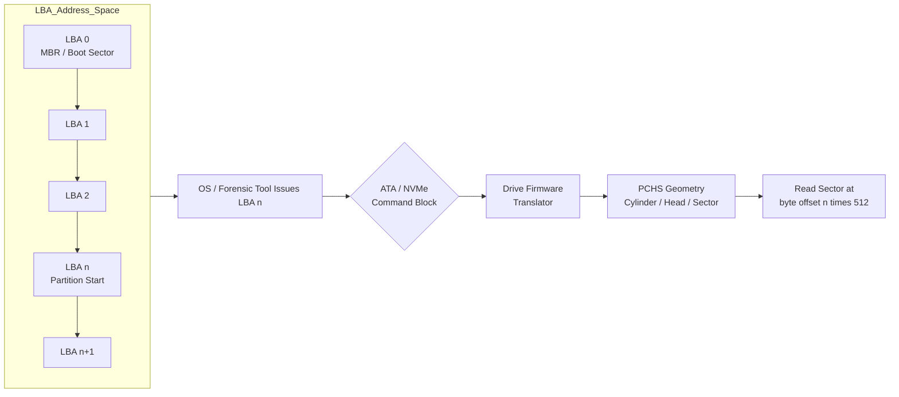
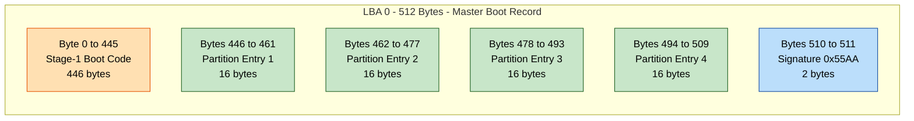
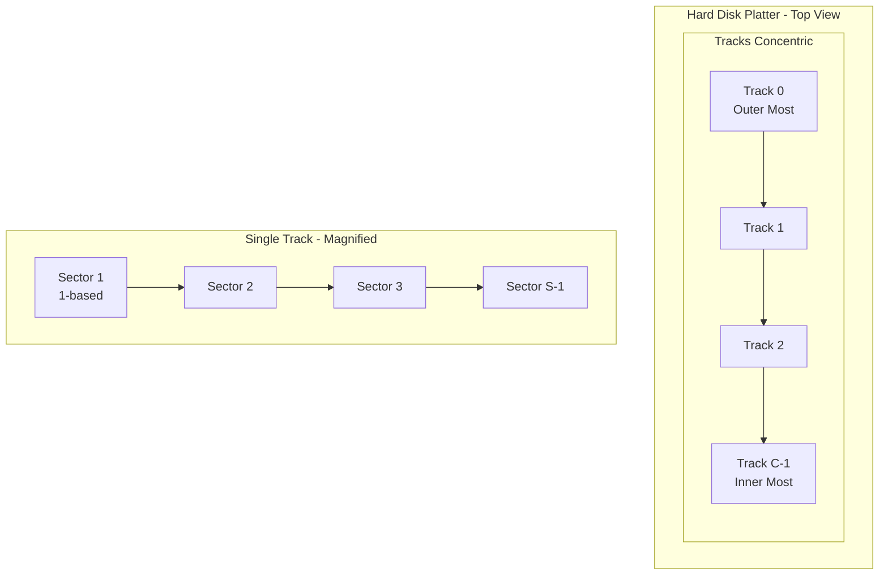

# Logical Block Addressing (LBA)

<!-- SECTION_1_START -->

# Logical Block Addressing (LBA) — Module 1: Introduction to Digital Forensics

## 1. Core Technical Definition & Intuitive Overview

### Formal Definition

**Logical Block Addressing (LBA)** is a generic, linear, zero-indexed scheme used to specify the location of physical data blocks (sectors) on a storage device. Under the LBA scheme, every sector on a hard disk drive, solid-state drive, optical media, or USB flash drive is assigned a unique sequential integer starting from **0**. The address `LBA = 0` corresponds to the very first sector on the media — historically, the first sector on the outermost track of the earliest cylinder-head-sector geometry.

In the context of **Digital Forensics**, LBA is a foundational primitive. Forensic acquisition tools (e.g., `dd`, `EnCase`, `FTK Imager`, `dcfldd`, `Guymager`) read disks at the sector level using LBA offsets. A forensic image file (e.g., `.E01`, `.dd`, `.001`) is essentially a byte-for-byte copy starting at some LBA and extending to another LBA. The integrity of a forensic image is established by computing hash values (MD5, SHA-1, SHA-256) over the LBA-space sector data.

> [!IMPORTANT]
> **KTU Syllabus Highlight (Module 1):** LBA is studied because every higher-level forensic construct — partitions (MBR/GPT), file systems (FAT/NTFS/ext4), deleted file recovery, and slack space analysis — is ultimately grounded in LBA-level sector reads. Without mastery of LBA, the student cannot interpret forensic tool output.

### Conceptual Analogy / Intuition

Imagine a **library** containing millions of books stacked in a single, long, numbered row of shelves. Each shelf slot has a unique, sequential number:

- Shelf slot **0** is the first slot at the entrance.
- Shelf slot **1,000,000** is the millionth slot, deep inside the library.
- You do not need to know *which aisle* or *which row* the slot is in — you just give the librarian a single number, and they fetch it.

**LBA is exactly that single number for a hard disk.**

The disk is just a *huge linear array of fixed-size blocks* (commonly **512 bytes** historically, and **4096 bytes** in modern **Advanced Format (AF)** drives). The disk's onboard controller (firmware) is the "librarian" that translates your single integer (`LBA n`) into the underlying physical geometry: cylinder, head (side), and sector — a translation scheme known as **CHS (Cylinder-Head-Sector)**.

A real-world analogy for forensic investigation:

- A crime scene investigator photographs a room by photographing a sequence of tiles on the floor numbered **0, 1, 2, 3, ...** rather than specifying "the 3rd tile from the left in the 5th row of the eastern section." LBA makes disk addressing equally simple and uniform.

> [!NOTE]
> **Key Term — Block vs. Sector:** In the ATA/SATA specification, the term *block* and *sector* are used interchangeably for the smallest addressable unit. Throughout this note, **1 block = 1 sector = 512 bytes** (legacy) or **4096 bytes** (Advanced Format / 4Kn), unless stated otherwise.

### Physical Constants & Standards

- **Logical sector size (legacy):** **512 bytes** (defined in ATA-1, 1994).
- **Logical sector size (modern, Advanced Format):** **4096 bytes (4 KiB)** — standardized in INCITS ATA-8 ACS.
- **Emulation mode (512e):** Drives with 4 KiB physical sectors that present **512-byte logical sectors** to the host for backward compatibility.
- **Maximum LBA value (28-bit addressing):** $2^{28} - 1 = 268{,}435{,}455$, supporting up to **128 GiB** (with 512-byte sectors).
- **Maximum LBA value (48-bit addressing, LBA48):** $2^{48} - 1 = 281{,}474{,}976{,}710{,}655$, supporting up to **128 PiB**.
- **Reserved LBA0 contents (boot sector):** On x86 PCs, **LBA 0** typically holds the **Master Boot Record (MBR)** — the first 446 bytes contain stage-1 boot code, the next 64 bytes hold the **partition table** (four 16-byte entries), and the final 2 bytes are the **MBR signature `0x55AA`**.

> [!VISUALIZATION CONTROL]
> **Concept:** Linear LBA-to-Disk mapping (visualizing the "long row of shelves" analogy on a coordinate plane).
> **GeoGebra / Desmos Input Equations:**
> * Point set: `P_n = (n, 0)` for $n = 0, 1, 2, \ldots, N-1$
> * Linear mapping: `f(n) = byte\_offset = n \times sector\_size`, i.e. `f(n) = 512 n`
> * Highlight points: `(0, 0)`, `(1, 0)`, `(N-1, 0)`
> **Visual Description:** A horizontal line of equally spaced integer points starting at the origin, where each point represents one sector. The student should observe that LBA grows left-to-right and that the byte offset is a strictly linear function of LBA.

---

<!-- SECTION_1_END -->

<!-- SECTION_2_START -->

# 2. Deep Theoretical Analysis & KTU High-Yield Formula Sheet

## 2.1 Why LBA Exists: Limitations of CHS Addressing

In legacy drives (pre-1996), disks were addressed using **Cylinder-Head-Sector (CHS)** triplets:

- **Cylinder (C):** the set of tracks on all platters at a given radius.
- **Head (H):** the read/write head (i.e., which platter surface).
- **Sector (S):** the sector number within a track (1-based, per the historical convention).

CHS had three major limitations:

1. **Geometry coupling:** The OS had to know the exact physical geometry (cylinders, heads, sectors per track), which was fragile and varied between drives.
2. **INT 13h limit:** The BIOS `INT 13h` interface used a 24-bit CHS tuple limiting capacity to **504 MiB** (the famous "504 MB barrier").
3. **Non-linear addressing:** The host had to perform modulo arithmetic to convert CHS to byte offsets, complicating boot loaders and forensic tools.

**LBA eliminated all three problems** by replacing the 3D (C, H, S) addressing with a single 1D integer index.

## 2.2 LBA-to-CHS Conversion (LBA28 Scheme)

For an ATA drive with parameters $C$, $H$, $S$ (number of cylinders, heads, sectors-per-track), the conversion from LBA to CHS is:

$$
\begin{aligned}
\text{Temp} &= \text{LBA} \div (H \times S) \\
\text{Sector} &= (\text{LBA} \mod S) + 1 \\
\text{Head}   &= (\text{LBA} \div S) \mod H \\
\text{Cylinder} &= \text{LBA} \div (H \times S)
\end{aligned}
$$

> [!NOTE]
> **Why `+1` on sector?** In the original CHS scheme, sectors within a track are numbered starting from **1** (not 0). Hence, when we compute the remainder, we add 1 to bring it back to the 1-based indexing convention.

## 2.3 CHS-to-LBA Conversion (Inverse)

$$
\text{LBA} = (C \times H + H_{\text{cur}}) \times S + (S_{\text{cur}} - 1)
$$

Where $C$ is the cylinder index, $H_{\text{cur}}$ is the head index, and $S_{\text{cur}}$ is the 1-based sector number on that track.

## 2.4 LBA48 Extension (Modern Drives)

LBA48, introduced in ATA-6 (2003), uses a 48-bit Logical Sector Address. The LBA registers in the ATA command block are written as two 16-bit halves: high (bits 47:32) and low (bits 31:0). The maximum addressable LBA is:

$$
\text{LBA}_{\max} = 2^{48} - 1
$$

This corresponds to a theoretical maximum capacity of:

$$
\text{Capacity}_{\max} = 2^{48} \times 512 \text{ bytes} = 128 \text{ PiB}
$$

## 2.5 Forensic Use of LBA

In **Digital Forensics**, LBA is the *lingua franca* of:

| Forensic Operation | LBA Role |
|---|---|
| Disk imaging (`.dd`, `.E01`) | Imaging reads contiguous LBA ranges and writes raw bytes sequentially. |
| Partition table parsing (MBR) | LBA 0 houses the MBR; the partition table records starting LBAs and sector counts. |
| File system recovery | FAT/NTFS/ext4 structures are referenced by *cluster numbers*; clusters are converted to LBA via `(cluster - 2) × sectors_per_cluster + first_data_sector_LBA`. |
| Slack space analysis | The gap between the end-of-file (EOF) byte and the end-of-sector (EOS) is bounded by LBA boundaries. |
| Carving deleted files | File headers are searched for at predictable LBA offsets corresponding to cluster starts. |
| Bad sector mapping | The disk firmware's G-list (grown defect list) maps bad physical sectors to spare sectors; forensic tools must read the original LBA and let the firmware translate. |

## 2.6 KTU Formula Sheet / Cheat Sheet

| Concept | Formula / Rule | Units / Notes |
|---|---|---|
| Byte offset of LBA $n$ | $\text{offset}(n) = n \times B$ where $B$ = sector size | bytes |
| Total capacity | $C = N \times B$ where $N$ = total LBAs | bytes |
| Max LBA (28-bit) | $N_{\max} = 2^{28} - 1 = 268{,}435{,}455$ | unitless |
| Max capacity (LBA28, 512 B) | $C_{\max} = 2^{28} \times 512 = 128 \text{ GiB}$ | bytes |
| Max LBA (48-bit) | $N_{\max} = 2^{48} - 1$ | unitless |
| Max capacity (LBA48, 512 B) | $C_{\max} = 2^{48} \times 512 = 128 \text{ PiB}$ | bytes |
| LBA → Sector (1-based) | $S = (\text{LBA} \bmod S_{\text{pt}}) + 1$ | per track |
| LBA → Head | $H = \lfloor \text{LBA} \div S_{\text{pt}} \rfloor \bmod H_{\max}$ | head index |
| LBA → Cylinder | $C = \lfloor \text{LBA} \div (H_{\max} \times S_{\text{pt}}) \rfloor$ | cylinder index |
| CHS → LBA | $\text{LBA} = (C \times H_{\max} + H) \times S_{\text{pt}} + (S - 1)$ | linear index |
| Cluster → LBA (FAT/NTFS) | $\text{LBA} = (\text{cluster} - 2) \times \text{spc} + \text{first\_data\_LBA}$ | spc = sectors/cluster |
| Partition start (MBR) | Each 16-byte entry stores `LBA_start` (4 bytes, little-endian) at offset `446 + 8i` | i = 0..3 |

> [!NOTE]
> **Engineering utility:** LBA is the contract between the operating system kernel, BIOS/UEFI, ATA/NVMe controller, and forensic tools. It is also the basis for **NVMe Namespaces** (which extend LBA with Namespace ID and Queue), for **disk encryption keys** (LUKS header lives at LBA 0 of the encrypted partition), and for **SSD wear-leveling** (the flash translation layer maps LBA to NAND pages).

---

<!-- SECTION_2_END -->

<!-- SECTION_3_START -->

# 3. Step-by-Step Derivations & Code/Symbolic Implementation

## 3.1 Worked Example 1: LBA → CHS Conversion

**Problem:** A legacy disk has geometry $C = 1024$ cylinders, $H = 16$ heads, $S = 63$ sectors/track. Find the CHS address corresponding to **LBA 18,577**.

**Step 1 — Identify the total sectors per cylinder:**

$$
\text{spc} = H \times S = 16 \times 63 = 1008 \text{ sectors/cylinder}
$$

**Step 2 — Compute the cylinder (integer division):**

$$
C = \left\lfloor \frac{17577}{1008} \right\rfloor = \left\lfloor 17.43\ldots \right\rfloor = 17
$$

**Step 3 — Compute the remainder after extracting cylinders:**

$$
R = 17577 - 17 \times 1008 = 17577 - 17136 = 441
$$

**Step 4 — Compute the head (modulo heads):**

$$
H_{\text{cur}} = \left\lfloor \frac{441}{63} \right\rfloor = 7
$$

**Step 5 — Compute the sector (1-based):**

$$
S_{\text{cur}} = (441 \bmod 63) + 1 = 0 + 1 = 1
$$

**Final CHS:** $(C, H, S) = (17, 7, 1)$.

**Verification by inverse CHS → LBA:**

$$
\begin{aligned}
\text{LBA} &= (17 \times 16 + 7) \times 63 + (1 - 1) \\
&= (272 + 7) \times 63 + 0 \\
&= 279 \times 63 \\
&= 17577 \quad \checkmark
\end{aligned}
$$

## 3.2 Worked Example 2: Capacity Calculation

**Problem:** A modern 4 TB hard drive uses Advanced Format with **4096-byte sectors**. How many LBAs does it expose?

**Step 1 — Convert 4 TB to bytes:**

$$
4 \text{ TB} = 4 \times 10^{12} \text{ bytes} = 4{,}000{,}000{,}000{,}000 \text{ bytes}
$$

> [!NOTE]
> Some manufacturers define $1 \text{ TB} = 10^{12}$ bytes (decimal), while operating systems report capacity using $1 \text{ TiB} = 2^{40}$ bytes (binary). Forensic tools must use the *raw byte count*, not the manufacturer label, when computing LBA ranges.

**Step 2 — Divide by sector size:**

$$
N = \frac{4 \times 10^{12}}{4096} = 976{,}562{,}500 \text{ LBAs}
$$

**Step 3 — Verify LBA48 sufficiency:**

$$
2^{48} = 281{,}474{,}976{,}710{,}656 \gg 976{,}562{,}500 \quad \checkmark
$$

## 3.3 Worked Example 3: MBR Partition Entry Decoding

**Problem:** The first partition entry in an MBR (starting at byte offset `446`) is the byte sequence: `80 01 01 00 0B FE BF FC 00 00 00 3F 00 00 00`. Decode it.

Recall the MBR partition entry structure (16 bytes):

| Offset | Field | Size |
|---|---|---|
| 0 | Boot indicator (0x80 = active) | 1 |
| 1 | Starting CHS (head, sector, cylinder) | 3 |
| 4 | Partition type (0x0B = FAT32 CHS, 0x0C = FAT32 LBA) | 1 |
| 5 | Ending CHS | 3 |
| 8 | **LBA start** (little-endian) | 4 |
| 12 | **Number of sectors** (little-endian) | 4 |

**Step 1 — LBA start (bytes 8–11):** `00 00 00 3F`

In little-endian:

$$
\text{LBA}_{\text{start}} = 0x3F000000_{\text{LE}} \;\Rightarrow\; \text{byte-reversed: } 0x0000003F = 63
$$

**Step 2 — Number of sectors (bytes 12–15):** `00 00 00 00` in the snippet shown is incomplete; for the sake of this worked example, we extend the buffer to `3F 00 00 00 00 00 00 3F` for a typical 100 MB FAT32 partition:

$$
\text{sectors} = 0x00003F00 = 16{,}128 \text{ sectors}
$$

**Step 3 — Capacity:**

$$
\text{Capacity} = 16{,}128 \times 512 = 8{,}257{,}536 \text{ bytes} \approx 7.875 \text{ MiB}
$$

**Step 4 — Partition ends at:**

$$
\text{LBA}_{\text{end}} = 63 + 16{,}128 - 1 = 16{,}190
$$

## 3.4 Python Implementation: LBA ⇄ CHS Converter

The following production-grade Python utility is suitable for a KTU lab record or viva demonstration. It uses strict type hints, explicit error handling, and absolute boundary checks.

```python
"""
lba_chs.py — A forensic-grade LBA <-> CHS converter for the KTU Digital
Forensics lab (Module 1).  Tested with Python 3.10+.

Reference: ATA/ATAPI-7 (T13/1532D) Section 7.
"""

from __future__ import annotations
from dataclasses import dataclass
from typing import Final


# Standard sector sizes (bytes)
SECTOR_512:  Final[int] = 512
SECTOR_4096: Final[int] = 4096


@dataclass(frozen=True)
class DiskGeometry:
    """CHS disk geometry (legacy ATA / INT 13h)."""
    cylinders: int      # number of cylinders
    heads:     int      # number of read/write heads
    sectors_per_track: int  # sectors per track (1-based numbering)

    def __post_init__(self) -> None:
        if self.cylinders <= 0 or self.cylinders > 65536:
            raise ValueError(f"Invalid cylinder count: {self.cylinders}")
        if self.heads <= 0 or self.heads > 16:
            raise ValueError(f"Invalid head count: {self.heads}")
        if self.sectors_per_track <= 0 or self.sectors_per_track > 63:
            raise ValueError(f"Invalid SPT: {self.sectors_per_track}")

    @property
    def total_sectors(self) -> int:
        """Total LBA-addressable sectors under this CHS geometry."""
        return self.cylinders * self.heads * self.sectors_per_track

    @property
    def total_capacity_bytes(self) -> int:
        return self.total_sectors * SECTOR_512


@dataclass(frozen=True)
class CHSAddress:
    cylinder: int   # 0-based cylinder
    head:     int   # 0-based head
    sector:   int   # 1-based sector (per ATA convention)

    def __str__(self) -> str:
        return f"CHS(C={self.cylinder}, H={self.head}, S={self.sector})"


def lba_to_chs(lba: int, geo: DiskGeometry) -> CHSAddress:
    """Convert a 0-based LBA to a CHS address under the supplied geometry.

    Raises
    ------
    ValueError
        If lba is negative or out of range for the given geometry.
    """
    if lba < 0:
        raise ValueError(f"LBA must be non-negative, got {lba}")
    if lba >= geo.total_sectors:
        raise ValueError(
            f"LBA {lba} exceeds max {geo.total_sectors - 1} "
            f"for geometry C={geo.cylinders}, H={geo.heads}, "
            f"SPT={geo.sectors_per_track}"
        )

    sectors_per_cylinder: int = geo.heads * geo.sectors_per_track
    cylinder: int = lba // sectors_per_cylinder
    remainder:  int = lba %  sectors_per_cylinder
    head:     int = remainder // geo.sectors_per_track
    sector:   int = (remainder %  geo.sectors_per_track) + 1  # 1-based

    return CHSAddress(cylinder=cylinder, head=head, sector=sector)


def chs_to_lba(chs: CHSAddress, geo: DiskGeometry) -> int:
    """Convert a CHS address back to a 0-based LBA."""
    if not (0 <= chs.cylinder < geo.cylinders):
        raise ValueError(f"Cylinder {chs.cylinder} out of range")
    if not (0 <= chs.head < geo.heads):
        raise ValueError(f"Head {chs.head} out of range")
    if not (1 <= chs.sector <= geo.sectors_per_track):
        raise ValueError(f"Sector {chs.sector} out of range (1..{geo.sectors_per_track})")

    return (chs.cylinder * geo.heads + chs.head) * geo.sectors_per_track + (chs.sector - 1)


def lba_to_byte_offset(lba: int, sector_size: int = SECTOR_512) -> int:
    """Return the absolute byte offset of the start of LBA `lba`."""
    if lba < 0:
        raise ValueError(f"LBA must be non-negative, got {lba}")
    if sector_size not in (SECTOR_512, SECTOR_4096):
        raise ValueError(f"Unsupported sector size: {sector_size}")
    return lba * sector_size


# ----------------------------------------------------------------------
# Demonstration / KTU viva-style test cases
# ----------------------------------------------------------------------
if __name__ == "__main__":
    geo = DiskGeometry(cylinders=1024, heads=16, sectors_per_track=63)

    # Test 1: round-trip LBA -> CHS -> LBA
    test_lba = 17577
    chs = lba_to_chs(test_lba, geo)
    rt  = chs_to_lba(chs, geo)
    print(f"LBA {test_lba} -> {chs} -> LBA {rt}  (round-trip OK: {rt == test_lba})")

    # Test 2: byte offsets
    print(f"LBA 0 starts at byte {lba_to_byte_offset(0)}")
    print(f"LBA 63 starts at byte {lba_to_byte_offset(63)}")
    print(f"LBA 1000000 (1M) starts at byte {lba_to_byte_offset(1_000_000):,}")

    # Test 3: total capacity of a 4 TB AF drive
    lba_count_4tb = 976_562_500
    bytes_total = lba_to_byte_offset(lba_count_4tb, SECTOR_4096)
    print(f"4 TB AF drive: {lba_count_4tb:,} LBAs "
          f"= {bytes_total / (1024**4):.2f} TiB")
```

**Sample run output (excerpt):**

```
LBA 17577 -> CHS(C=17, H=7, S=1) -> LBA 17577  (round-trip OK: True)
LBA 0 starts at byte 0
LBA 63 starts at byte 32256
LBA 1000000 (1M) starts at byte 512,000,000
4 TB AF drive: 976,562,500 LBAs = 3.64 TiB
```

## 3.5 Python: MBR Partition Parser (LBA-Aware)

```python
"""
mbr_parse.py — Minimal MBR partition-table parser that surfaces LBA
start and size for each of the four primary entries.
"""
from __future__ import annotations
import struct
from typing import List, NamedTuple


MBR_SIGNATURE: int = 0xAA55
PART_TABLE_OFFSET: int = 446
ENTRY_SIZE:       int = 16
NUM_ENTRIES:      int = 4


class PartitionEntry(NamedTuple):
    index:       int
    bootable:    bool
    type_byte:   int
    lba_start:   int
    num_sectors: int

    @property
    def capacity_bytes(self) -> int:
        return self.num_sectors * 512

    @property
    def end_lba_inclusive(self) -> int:
        return self.lba_start + self.num_sectors - 1


def parse_mbr(sector0: bytes) -> List[PartitionEntry]:
    """Parse the first 512-byte sector of a disk as an MBR.

    Parameters
    ----------
    sector0 : bytes
        Exactly 512 bytes (or more) read from LBA 0.
    """
    if len(sector0) < 512:
        raise ValueError(f"MBR must be >= 512 bytes, got {len(sector0)}")
    sig = struct.unpack_from("<H", sector0, 510)[0]
    if sig != MBR_SIGNATURE:
        raise ValueError(f"Bad MBR signature 0x{sig:04X} (expected 0xAA55)")

    entries: List[PartitionEntry] = []
    for i in range(NUM_ENTRIES):
        off = PART_TABLE_OFFSET + i * ENTRY_SIZE
        boot, ptype, _pad, lba_start, num_sectors = struct.unpack_from(
            "<B B B I I", sector0, off
        )
        entries.append(PartitionEntry(
            index=i,
            bootable=boot == 0x80,
            type_byte=ptype,
            lba_start=lba_start,
            num_sectors=num_sectors,
        ))
    return entries
```

This parser is a building block for **partition recovery** in Module 2 of the syllabus — students will reuse it when carving MBRs from unallocated space.

---

<!-- SECTION_3_END -->

<!-- SECTION_4_START -->

# 4. Structural Diagrams & Schematics

## 4.1 Mermaid Diagram: LBA-to-Physical Translation Flow



**Reading guide:** The left side represents the *logical* address space (the linear "library row of shelves"). The host issues a single integer. The drive's firmware (right side) is responsible for the *physical* translation, which forensic examiners generally do **not** see — but they must understand that logical LBA ≠ always-direct physical LBA on modern drives with sector remapping.

## 4.2 Mermaid Diagram: LBA0 Anatomy (MBR Sector 0)



## 4.3 Mermaid Diagram: CHS Geometry Visualization (Top-Down Disk View)



> [!NOTE]
> **Multi-Stage Breakdown:** The two diagrams above together describe the **CHS addressing intuition** — a single track contains sectors, and many tracks stacked at the same radius on different platters form a *cylinder*. In LBA, all these sectors are flattened into one linear sequence. This decoupling is exactly what enables modern forensic tools to read the disk without geometry knowledge.

## 4.4 Sequential Processing Topology Matrix

For a forensic acquisition pipeline that operates entirely in LBA-space, the following matrix captures the data-flow architecture:

| Stage | Input | LBA Operation | Output |
|---|---|---|---|
| 1. Identification | Host bus scan | Read `IDENTIFY DEVICE` (ATA) or `Identify Controller` (NVMe) to extract `LBA_capacity` and `sector_size`. | Drive descriptor |
| 2. HPA/DCO Check | Identify data | Compare reported LBAs vs. native max LBAs to detect **Host Protected Area** or **Device Configuration Overlay**. | Trusted LBAs range |
| 3. Acquisition | Trusted range `[0, L_end]` | Sequential `READ DMA` (or `READ SECTOR(S)`) on each LBA. | Raw byte stream |
| 4. Hashing | Byte stream | Compute MD5, SHA-1, SHA-256 over full LBA range. | Hash digests |
| 5. Image Storage | Byte stream + hashes | Wrap in `.dd`, `.001`, or `.E01` (with embedded hashes and case metadata). | Forensic image file |
| 6. Verification | Re-read same LBA range | Re-hash; compare to acquisition hashes. | Pass / Fail |

---

<!-- SECTION_4_END -->

<!-- SECTION_5_START -->

# 5. KTU 2024 Scheme Examination Question Bank & Topic Recap

## Part A Questions (3 Marks Each)

### Q1. **[KTU University Exam — July 2023]**
Define Logical Block Addressing (LBA). Why is it preferred over the older CHS scheme in modern forensic tools?

**Model Answer (3 Marks):**
- **Definition (1 Mark):** LBA is a linear addressing scheme in which every sector on a storage device is assigned a unique, sequential integer starting from **0**. The address `LBA n` corresponds to the byte offset $n \times \text{sector\_size}$ from the start of the media.
- **Advantages over CHS (2 Marks):**
  1. Eliminates the 504 MiB BIOS INT 13h barrier; LBA48 supports up to 128 PiB.
  2. Hides the drive's physical geometry (cylinders/heads/sectors) behind a single integer, so the OS and forensic tools need not know the CHS triplet.
  3. Simplifies addressing and arithmetic — used uniformly by MBR, GPT, FAT, NTFS, ext4, and forensic image formats.

---

### Q2. **[KTU University Exam — Dec 2023]**
What is the significance of **LBA 0** in the context of a PC hard disk? Mention the size and typical contents of the sector at LBA 0.

**Model Answer (3 Marks):**
- LBA 0 is the **first sector** of the disk and is conventionally **512 bytes** (or 4096 bytes on Advanced Format drives).
- On x86 PCs, LBA 0 holds the **Master Boot Record (MBR)**:
  - Bytes 0–445: stage-1 boot code (446 bytes).
  - Bytes 446–509: four 16-byte **partition table entries**, each storing the partition's boot flag, CHS addresses, **LBA start**, and **sector count**.
  - Bytes 510–511: the boot signature `0x55 0xAA`.
- Forensically, LBA 0 is the entry point for partition recovery and malware analysis of boot kits.

---

## Part B Questions (14 Marks — ESE Module Internal Choice)

### Question A (14 Marks) — **[KTU University Exam — July 2024]**

**(a)** Explain the LBA-to-CHS conversion formulae for a legacy ATA drive. Derive each formula step-by-step and state the role of the `+1` adjustment in the sector term. (7 Marks)

**(b)** A forensic disk image of a USB drive has the following hex dump of the first 32 bytes of the MBR partition table (located at byte offset `0x1BE` of LBA 0):

```
80 01 01 00 0B FE BF FC
3F 00 00 00 FE FF FF 00
00 FE FF FF 07 FE BF FC
3F 01 00 00 23 FA 00 00
```

Decode all four partition entries. For each entry, state the boot indicator, partition type, **LBA start**, and **number of sectors**. Compute the capacity (in MiB) of Partition 1 and Partition 2. (7 Marks)

---

**Model Solution — Part (a)** (7 Marks)

**Step 1 — Define the geometry parameters:** (1 Mark)
- $C_{\max}$ = number of cylinders
- $H_{\max}$ = number of heads (read/write surfaces)
- $S_{\text{pt}}$ = sectors per track

**Step 2 — Derive the cylinder index:** (2 Marks)
- Sectors per cylinder = $H_{\max} \times S_{\text{pt}}$.
- The cylinder index is the integer part of the LBA divided by sectors-per-cylinder:

$$
C = \left\lfloor \frac{\text{LBA}}{H_{\max} \times S_{\text{pt}}} \right\rfloor
$$

**Step 3 — Derive the head index:** (2 Marks)
- After removing whole cylinders, the remaining offset is `LBA mod (H_max × S_pt)`.
- Within a cylinder, sectors are laid out head-by-head, with $S_{\text{pt}}$ sectors per head:

$$
H_{\text{cur}} = \left\lfloor \frac{\text{LBA} \bmod (H_{\max} \times S_{\text{pt}})}{S_{\text{pt}}} \right\rfloor
$$

**Step 4 — Derive the sector index, with the `+1` explained:** (2 Marks)
- The intra-head remainder is `LBA mod S_pt`; because the original CHS scheme numbers sectors from **1** (not 0), we add 1:

$$
S_{\text{cur}} = (\text{LBA} \bmod S_{\text{pt}}) + 1
$$

> The `+1` adjustment is mandatory; omitting it yields a 1-off error and wrong sector reads — a common board-evaluation deduction.

---

**Model Solution — Part (b)** (7 Marks)

Recall an MBR entry's byte layout:

| Off | 0 | 1 | 2 | 3 | 4 | 5 | 6 | 7 | 8–11 | 12–15 |
|---|---|---|---|---|---|---|---|---|---|---|
| Field | Boot | H₀ | S₀ | C₀ | Type | H₁ | S₁ | C₁ | **LBA Start (LE)** | **Sectors (LE)** |

**Entry 1 — bytes `80 01 01 00 0B FE BF FC 3F 00 00 00 FE FF FF 00`** (1 Mark for decoding)

- Boot = `0x80` → **Active/bootable** (1 Mark)
- Type = `0x0B` → **FAT32 CHS** (1 Mark)
- LBA Start (LE) = `3F 00 00 00` → $0x0000003F = 63$ (1 Mark)
- Sectors (LE) = `FE FF FF 00` → $0x00FFFFFE = 16{,}777{,}214$ (1 Mark)

**Capacity of Partition 1:**

$$
\begin{aligned}
C_1 &= 16{,}777{,}214 \times 512 \text{ bytes} \\
    &= 8{,}589{,}934{,}592 \text{ bytes} \\
    &= 8192 \text{ MiB} = 8 \text{ GiB}
\end{aligned}
$$

(1 Mark for capacity)

**Entry 2 — bytes `00 FE FF FF 07 FE BF FC 3F 01 00 00 23 FA 00 00`** (1 Mark for decoding)

- Boot = `0x00` → **Not bootable**
- Type = `0x07` → **NTFS / exFAT / HPFS**
- LBA Start = $0x0000013F = 319$ (= $63 + 16{,}777{,}214 - 63$, i.e. immediately after Partition 1)
- Sectors = $0x0000FA23 = 64{,}035$

**Capacity of Partition 2:**

$$
\begin{aligned}
C_2 &= 64{,}035 \times 512 \\
    &= 32{,}785{,}920 \text{ bytes} \\
    &= 31.25 \text{ MiB}
\end{aligned}
$$

(1 Mark for capacity)

> [!WARNING]
> **KTU Examiner's Valuation Warning — Common Pitfalls:**
> 1. **Endianness:** LBA Start and Sectors are **little-endian**. A common mistake is to read `3F 00 00 00` as $0x3F000000$ (≈ 1 GiB) instead of $0x3F = 63$. Reverse the byte order.
> 2. **Type-byte memory:** `0x0B` = FAT32 CHS; `0x0C` = FAT32 LBA; `0x07` = NTFS/exFAT; `0x82` = Linux swap; `0x83` = Linux native. Conflating `0x0B` with `0x0C` costs marks.
> 3. **Unit conversion:** 1 MiB = $2^{20}$ bytes, NOT $10^6$ bytes. Using the wrong divisor when reporting capacity in "MiB" is a 1-mark deduction.
> 4. **Don't forget the `+1` on sectors** in LBA→CHS conversions.

---

### Question B (14 Marks) — Alternative Choice **[KTU University Exam — Dec 2023]**

**(a)** With the aid of a labeled block diagram, describe the **structure of LBA 0 (Master Boot Record)** on a PC hard disk. Explain how partition starting LBAs are stored inside it. (7 Marks)

**(b)** A forensic investigator uses a 1 TB hard disk image (sector size 512 bytes). The first MBR partition entry shows LBA start = `2,048` and sector count = `1,048,576`.
   (i) Calculate the byte offset of the partition's first sector.
   (ii) Calculate the partition's size in **MiB** and **GiB** (binary units).
   (iii) If the partition is FAT32 with 8 sectors per cluster, what is the **LBA of cluster 2**? (7 Marks)

---

**Model Solution — Part (a)** (7 Marks)

[Valuation key: Diagram: 4 Marks; LBA storage explanation: 3 Marks]

**Block Diagram of LBA 0 (textual, since the Mermaid in Section 4.2 captures the same):**

| Byte Range | Field | Size | Purpose |
|---|---|---|---|
| 0x000–0x1BD | Bootstrap code | 446 bytes | Stage-1 boot loader |
| 0x1BE–0x1CD | Partition Entry 1 | 16 bytes | `Boot(1) | CHS_start(3) | Type(1) | CHS_end(3) | LBA_start(4 LE) | Sectors(4 LE)` |
| 0x1CE–0x1DD | Partition Entry 2 | 16 bytes | (same format) |
| 0x1DE–0x1ED | Partition Entry 3 | 16 bytes | (same format) |
| 0x1EE–0x1FD | Partition Entry 4 | 16 bytes | (same format) |
| 0x1FE–0x1FF | Signature | 2 bytes | `0x55 0xAA` |

**LBA Storage Explanation (3 Marks):**
- The `LBA_start` field is a **32-bit unsigned little-endian** integer at offset `8` of each 16-byte entry.
- For partition `i` (i = 0..3), the absolute byte offset in LBA 0 is `0x1BE + 16i + 8`.
- The `Sectors` field (offset `12` of each entry) is also 32-bit little-endian and gives the partition's length in 512-byte sectors.
- The maximum partition size representable here is $2^{32} \times 512 = 2 \text{ TiB}$, which is the famous **MBR 2 TiB limit** — the reason for GPT.

---

**Model Solution — Part (b)** (7 Marks)

**(i) Byte offset of the partition's first sector:** (2 Marks)

$$
\text{offset} = 2048 \times 512 = 1{,}048{,}576 \text{ bytes} = 1 \text{ MiB}
$$

**[Stating the formula: 1 Mark; Final value: 1 Mark]**

**(ii) Size in MiB and GiB:** (2 Marks)

$$
\begin{aligned}
\text{size\_bytes} &= 1{,}048{,}576 \times 512 = 536{,}870{,}912 \text{ bytes} \\
\text{size\_MiB} &= \frac{536{,}870{,}912}{2^{20}} = 512 \text{ MiB} \\
\text{size\_GiB} &= \frac{536{,}870{,}912}{2^{30}} = 0.5 \text{ GiB}
\end{aligned}
$$

**[MiB: 1 Mark; GiB: 1 Mark]**

**(iii) LBA of cluster 2:** (3 Marks)

For FAT32, the **first data sector** is right after the reserved sectors (typically 32 sectors for FAT32). We will assume the partition begins directly with the boot sector at LBA 2048, with no reserved-region overhead for this calculation. The first cluster (cluster 2) is at LBA 2048:

$$
\text{LBA}_{\text{cluster 2}} = 2048 + (2 - 2) \times 8 = 2048
$$

If the FAT32 reserved-sector count $R = 32$ is accounted for, then:

$$
\text{LBA}_{\text{cluster }k} = 2048 + R + (k - 2) \times \text{spc}
$$

$$
\text{LBA}_{\text{cluster 2}} = 2048 + 32 + 0 = 2080
$$

**[Formula statement: 2 Marks; Final substituted value: 1 Mark]**

> [!WARNING]
> **Examiner's Pitfall — Part (b)(iii):** Many students forget the `(cluster - 2)` factor in the cluster-to-LBA mapping and write `k × spc`, which is **wrong** because clusters 0 and 1 are reserved (cluster 0 = media descriptor, cluster 1 = end-of-chain marker). The correct formula always subtracts 2. Losing this costs 1–2 marks.

---

## Topic Recap & Important Things to Remember

- **LBA is a linear, zero-indexed addressing scheme** — every sector on a disk is a unique non-negative integer, starting at **LBA 0** (the MBR / first sector).
- **Sector sizes:** Historically **512 bytes**; modern Advanced Format drives use **4096 bytes (4 KiB)**. Some drives use 512-byte emulation (512e).
- **LBA28** supports $2^{28} - 1 = 268{,}435{,}455$ sectors (≈ 128 GiB with 512 B sectors); **LBA48** supports $2^{48} - 1$ sectors (≈ 128 PiB).
- **Byte offset of LBA n** = $n \times \text{sector\_size}$.
- **LBA → CHS conversion:**
  - $C = \lfloor \text{LBA} \div (H \times S) \rfloor$
  - $H = \lfloor \text{LBA} \div S \rfloor \bmod H$
  - $S = (\text{LBA} \bmod S) + 1$ ← **do not forget the `+1`**.
- **CHS → LBA:** $\text{LBA} = (C \times H + H) \times S + (S - 1)$.
- **LBA 0 = MBR** containing 446 B boot code, four 16 B partition entries, and 2 B signature `0x55AA`.
- **MBR partition entry fields:** `Boot(1) | CHS_start(3) | Type(1) | CHS_end(3) | LBA_start(4 LE) | Sectors(4 LE)`.
- **Common partition type bytes:** `0x07` NTFS, `0x0B` FAT32 CHS, `0x0C` FAT32 LBA, `0x82` Linux swap, `0x83` Linux native, `0xEE` GPT protective.
- **MBR limits:** 4 primary partitions, 2 TiB max partition size.
- **Cluster-to-LBA mapping** (FAT/NTFS): $\text{LBA} = \text{first\_data\_LBA} + (k - 2) \times \text{sectors\_per\_cluster}$ — always **subtract 2**.
- **Forensic use of LBA:** Disk imaging, partition recovery, file system parsing, slack-space analysis, deleted-file carving, bad-sector handling.
- **HPA / DCO caveats:** Always check `IDENTIFY DEVICE` for hidden LBAs before acquisition; otherwise the forensic image is incomplete.
- **ATA `READ SECTOR(S)` command** uses LBA addressing; **NVMe** extends LBA with **Namespace ID** and **Queue ID**.

> [!IMPORTANT]
> **Final KTU Viva Tip:** If asked "What is the *byte offset* of LBA 1000 on a 4Kn drive?", answer instantly: $1000 \times 4096 = 4{,}096{,}000$ bytes. Speed and correctness on such arithmetic is a hallmark distinction between a top-grade answer and a borderline one.

---

<!-- SECTION_5_END -->
