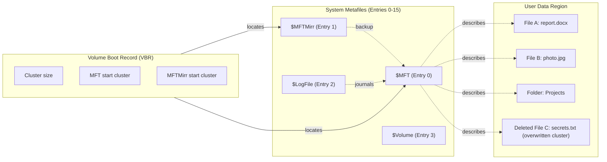
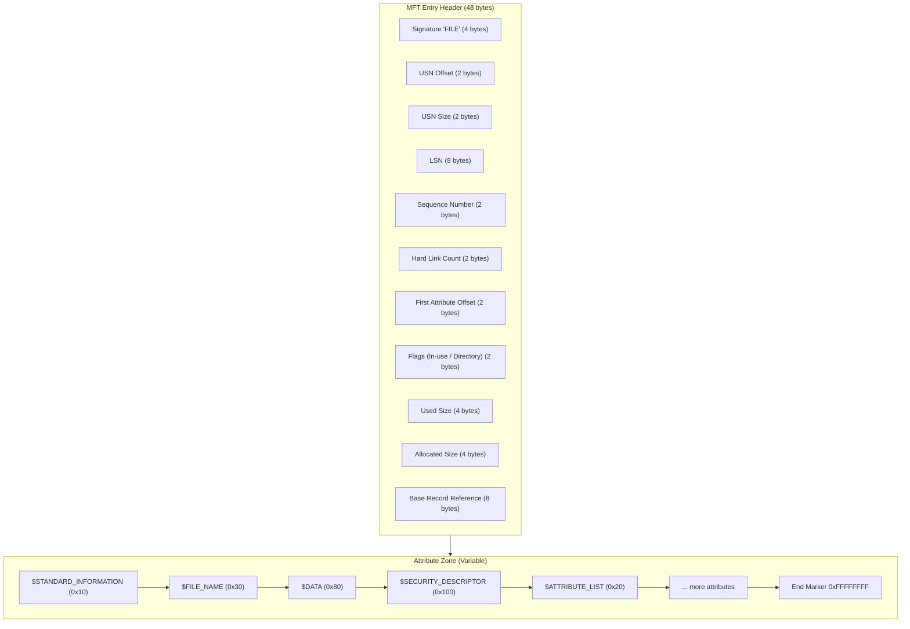
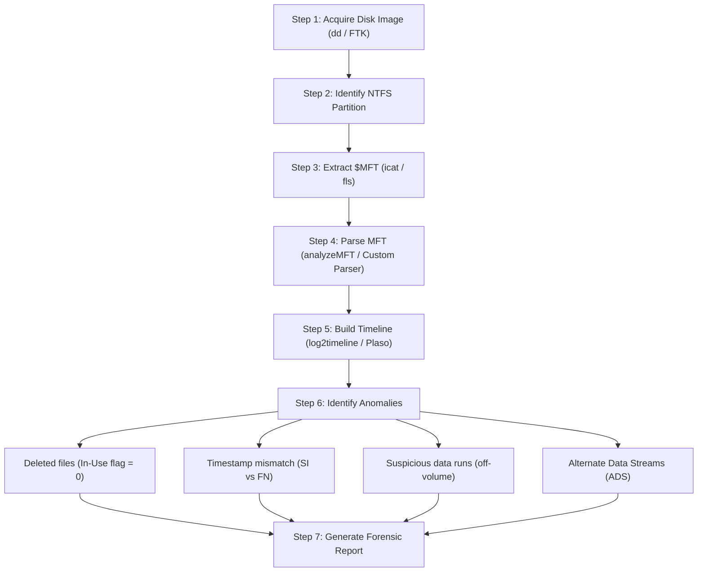
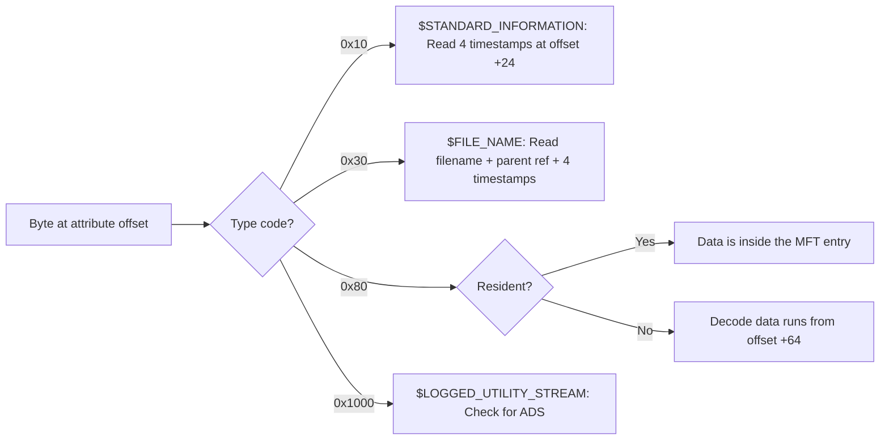
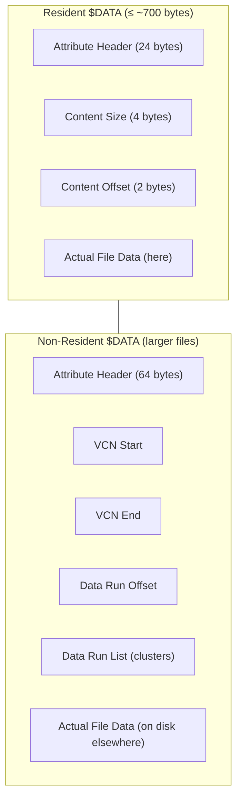
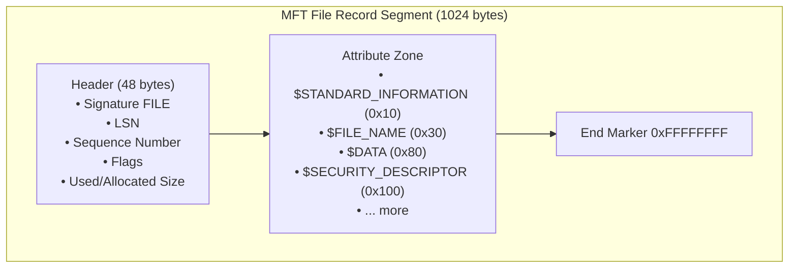

# Master File Table (MFT)

<!-- SECTION_1_START -->
# Master File Table (MFT) — Core Technical Definition & Intuitive Overview

## 📘 Formal KTU 2024 Academic Definition

> [!IMPORTANT]
> **Master File Table (MFT)** is a hidden, system-protected relational database file (`$MFT`) at the heart of the **New Technology File System (NTFS)** used by Microsoft Windows. It is a flat, sequential array of fixed-size records (typically **1024 bytes** per record) in which every file, directory, and metadata file on the volume is described by at least one record. Each MFT record is formally called a **File Record Segment (FRS)** or **MFT Entry**, and the first **16 entries** are reserved for core system metadata files (also called *system metafiles*).

In digital forensics, the MFT is treated as the **single most valuable evidentiary artifact** on a Windows NTFS volume, because it logs the *existence*, *location*, *size*, *temporal lifecycle*, and *access permissions* of every file the operating system has ever touched.

---

## 💡 Conceptual Analogy / Intuition

> [!NOTE]
> **Analogy: The Library Card Catalog of a Digital World**

Imagine a massive library containing **millions of books** (your files). The librarian does not walk through the entire library to find a book. Instead, every book has a **catalog card** in a single, central drawer — the *Master File Table*. Each card records:

- 📖 **Title** → File Name
- 🏛️ **Shelf & Row Number** → Data Run / Cluster Location
- 🕒 **Date Purchased, Last Read, Last Repaired** → `$STANDARD_INFORMATION` Timestamps (MACE)
- 📦 **Page Count** → File Size
- 🔐 **Who is allowed to read it** → Security Descriptor (ACL)

A forensic investigator never needs to "open" a book to learn about it. Reading the catalog card alone (the MFT entry) gives a complete summary — and if the original book has been *deleted* or *moved*, the catalog card may still exist for a long time, providing crucial digital evidence.

> [!TIP]
> **Even after a file is deleted, its MFT record often survives** until that specific MFT slot is reused. This is the foundation of NTFS file recovery and timeline forensics.

---

## 🧩 Where Does MFT Live on the Disk?

| Component | Path / Address | Description |
|---|---|---|
| **Volume Boot Record (VBR)** | Sector 0 of the partition | Points to the location of `$MFT` via `$MFT` cluster number |
| **`$MFT` File** | Variable location (recorded in VBR) | The actual MFT database; usually begins at **cluster 2** in a freshly formatted NTFS volume |
| **`$MFTMirr`** (Mirror) | Mid-point of the volume | A partial backup of the first **4 MFT records** for disaster recovery |
| **`$LogFile`** | Log file location | NTFS journal used for transaction logging and rollback |
| **`$Bitmap`** | Volume metadata | Tracks which clusters are in use |
| **`$UsnJrnl:$J`** | Change Journal | Records file system changes (USN = Update Sequence Number) |

---

## 🗝️ Reserved MFT Entries (System Metafiles)

> [!IMPORTANT]
> The first **16 MFT records (entries 0–15)** are reserved and **cannot be used for user files**. Understanding these is critical for KTU examinations.

| MFT Entry # | System File Name | Forensic Significance |
|---|---|---|
| **0** | `$MFT` | The Master File Table itself |
| **1** | `$MFTMirr` | Backup of the first 4 records |
| **2** | `$LogFile` | Transactional journal of NTFS metadata changes |
| **3** | `$Volume` | Volume label, version, NTFS version info |
| **4** | `$AttrDef` | Attribute definitions used in the volume |
| **5** | Root directory `"."` | Root folder of the volume |
| **6** | `$Bitmap` | Cluster allocation map |
| **7** | `$Boot` | Boot sector file |
| **8** | `$BadClus` | Lists all known bad clusters |
| **9** | `$Secure` | Security descriptors database |
| **10** | `$UpCase` | Unicode uppercase conversion table |
| **11** | `$Extend` | Extension metadata (used by $UsnJrnl, $Quota, $Reparse) |
| **12–15** | (Reserved / unused in older versions) | Reserved for future use |

---

> [!VISUALIZATION CONTROL]
> **Concept:** Conceptual map of an NTFS volume showing the location and self-referential nature of the MFT.
>
> **Graphical Description (mental image):**
> - Draw a large horizontal rectangle representing the entire NTFS volume.
> - On the far left, label a small sector as **VBR (Boot Sector)**.
> - Just to the right of VBR, draw a small region labeled **"$MFT"** — the catalog.
> - Throughout the rest of the volume, scatter small "book" icons representing user files (Documents, Images, Videos).
> - Draw dashed arrows from each "book" back to its corresponding **catalog card** in the $MFT region.
> - Highlight that even after a "book" is removed (file deleted), its **card** may linger in the $MFT.
<!-- SECTION_1_END -->

<!-- SECTION_2_START -->
# Deep Theoretical Analysis & KTU High-Yield Formula Sheet

## 🧠 Anatomy of a Single MFT Entry (File Record Segment)

Each MFT entry is a **1024-byte** record (sized at format time, configurable up to 4096 bytes). It contains two major regions:

1. **Header** (first ~48 bytes) — Fixed structure
2. **Attribute Zone** — Variable, contains one or more *attributes*

### 📜 MFT Entry Header Layout (Byte-Offset Map)

| Offset (hex) | Size (bytes) | Field Name | Description |
|---|---|---|---|
| `0x00` | 4 | **Signature** `"FILE"` | The ASCII string `F I L E` (`0x46494C45`) — used to validate entry integrity |
| `0x04` | 2 | **Offset to Update Sequence** | Location of the USN fix-up array |
| `0x06` | 2 | **Size in Words of Update Sequence** | `$MFT` file system uses USN for consistency |
| `0x08` | 8 | **$LogFile Sequence Number (LSN)** | Used for journal recovery |
| `0x10` | 2 | **Sequence Number** | Increments when an entry is freed and reused |
| `0x12` | 2 | **Hard Link Count** | Number of directory links pointing to this file |
| `0x14` | 2 | **Offset to First Attribute** | Start of attribute zone (usually `0x38` = 56) |
| `0x16` | 2 | **Flags (In-use / Directory)** | `0x01` = In Use, `0x02` = Directory, `0x04` = Extension, `0x08` = Special index |
| `0x18` | 4 | **Used Size of Entry** | Actual bytes used within the 1024-byte record |
| `0x1C` | 4 | **Allocated Size of Entry** | Always a multiple of 1024 (typically 1024) |
| `0x20` | 8 | **File Reference to Base Record** | Pointer to the *base* record if this is an extension entry |
| `0x28` | 2 | **Next Attribute ID** | Counter for the next attribute to be added |
| `0x30` | 4 | **MFT Entry Number** | The MFT record number (used by Windows) |
| `0x38` | ... | **Attributes Begin Here** | Attribute zone starts here |

> [!NOTE]
> **Sequence Number Trick:** When a file is deleted, its MFT record is marked as **"not in use"** but the **Sequence Number stays the same**. The next time that slot is reused, the Sequence Number is incremented by 1. Forensic tools use this to identify *stale* (deleted) entries.

---

## 🏷️ The Attribute System — Heart of the MFT

Each MFT entry is composed of a stream of **attributes**, each describing a different property of the file.

### Attribute Header Structure

| Field | Size | Description |
|---|---|---|
| Attribute Type | 4 bytes | Numeric code identifying the attribute (e.g., `0x10` = `$STANDARD_INFORMATION`) |
| Length | 4 bytes | Total length of this attribute (including header) |
| Non-Resident Flag | 1 byte | `0` = Resident, `1` = Non-resident |
| Name Length | 1 byte | Length of attribute name (0 if unnamed) |
| Name Offset | 2 bytes | Offset to the attribute name |
| Flags | 2 bytes | `0x0001` = Encrypted, `0x0002` = Sparse |
| Attribute ID | 2 bytes | Unique ID within the MFT entry |

### 🔑 Critical MFT Attributes for Forensic Examiners

| Type Code | Attribute Name | Forensic Relevance |
|---|---|---|
| `0x10` | `$STANDARD_INFORMATION` | ⚠️ **4 MACB timestamps** — file's logical timestamps. *Easily modified by user.* |
| `0x30` | `$FILE_NAME` | Filename, parent directory, **DOS + Win32 names** |
| `0x20` | `$ATTRIBUTE_LIST` | List of additional attributes stored in extension MFT records |
| `0x80` | `$DATA` | The actual file content (or the data stream location) |
| `0x90` | `$INDEX_ROOT` | Used by directories to index their contents |
| `0xA0` | `$INDEX_ALLOCATION` | B-tree allocation for large directories |
| `0xB0` | `$BITMAP` | Index bitmap for directory entries |
| `0x100` | `$SECURITY_DESCRIPTOR` | ACLs, owner SID, integrity level |
| `0x1000` | `$LOGGED_UTILITY_STREAM` | Alternate data streams (ADS) — major forensic vector! |
| `0xFFFFFFFF` | `End Marker (0xFFFFFFFF)` | Marks the end of the attribute list |

---

## ⏰ The MACE / MACB Timeline — Forensics Gold

> [!IMPORTANT]
> Every file has **two timestamp sources** in NTFS, which is the source of much confusion (and many exam questions!):

| Source | Attribute | Reliable? | Description |
|---|---|---|---|
| **M**odification | `$STANDARD_INFORMATION` (Field at `0x10`) | ❌ No | **Most user-modifiable.** Touched by almost any file operation. |
| **A**ccess | `$STANDARD_INFORMATION` | ❌ No | Updated on read in some Windows versions (often disabled) |
| **C**reation | `$STANDARD_INFORMATION` | ❌ No | When the file was created *on the volume* |
| **M**FT Entry Modification (a.k.a. **$MFT** change) | `$STANDARD_INFORMATION` | ❌ No | When the MFT record itself was last touched |
| **M**odification | `$FILE_NAME` (Field at `0x30`) | ✅ **Yes!** | Set when file is created or renamed; **cannot be changed** without renaming |
| **A**ccess | `$FILE_NAME` | ✅ Yes | Same logic |
| **C**reation | `$FILE_NAME` | ✅ Yes | Same logic |
| **M**FT Entry Mod. | `$FILE_NAME` | ✅ Yes | Same logic |

> [!TIP]
> **Exam Tip:** If a suspect claims a file was created in 2024 but the `$FILE_NAME` creation timestamp shows 2019, that file is **pre-existing evidence** and tampering is strongly suspected.

---

## 🧬 Resident vs Non-Resident Attributes

| Aspect | Resident Attribute | Non-Resident Attribute |
|---|---|---|
| **Where is data stored?** | Inside the MFT entry itself | Outside the MFT, in the general cluster area |
| **Maximum Size** | Limited by MFT entry size (≤ 1024 bytes typically) | Up to entire volume size |
| **Data Run Concept** | Not applicable | A sequence of **(offset, length)** pairs called *data runs* |
| **Forensic Use** | Small files, metadata, timestamps | All larger files, including `$DATA` for documents/videos |

### Data Run Encoding (Little-Endian, Variable Length)

A data run is encoded as:

`[Header Byte] [Length Bytes] [Offset Bytes]`

- The **low nibble** of the header = number of bytes for *length*
- The **high nibble** of the header = number of bytes for *offset*
- The offset is **signed** (positive = forward, negative = backward, relative to previous run)

---

## 📐 KTU High-Yield Formula Sheet

| # | Concept | Formula / Constant | Notes |
|---|---|---|---|
| 1 | **MFT Entry Size** | $S_{MFT} = 1024 \text{ bytes}$ (default) | Configurable at format time: 1024, 2048, 4096 bytes |
| 2 | **MFT Entry Count (theoretical max)** | $N_{max} = \dfrac{V_{bytes}}{S_{MFT}}$ | Where $V_{bytes}$ is volume size |
| 3 | **MFT Offset to Attribute Zone** | $O_{attr} = 56 \text{ bytes}$ (`0x38`) | Constant for the header's fixed fields |
| 4 | **Total Usable Size per Entry** | $U = S_{MFT} - O_{attr} - 4$ | Subtract header & `0xFFFFFFFF` end marker |
| 5 | **Timestamps per File (Std Info)** | $T_{SI} = 4$ | Modified, Accessed, Created, MFT-Changed (MACE) |
| 6 | **Timestamps per File (File Name)** | $T_{FN} = 4$ | Independent set in `$FILE_NAME` attribute |
| 7 | **Signature Validation** | Bytes `0x00-0x03` must equal `"FILE"` | Indicates a *valid* MFT record |
| 8 | **USN Fix-up** | Last 2 bytes of each sector $\rightarrow$ written to `0x00-0x01` of next sector | Ensures sector-level consistency on power loss |
| 9 | **Cluster Size to File Size** | $F_{size} = \sum (\text{data run lengths} \times C_{size})$ | $C_{size}$ is cluster size in bytes |
| 10 | **Hard Link Count** | $H \geq 1$ for valid file | If 0, the entry is considered "deleted" |
| 11 | **Sequence Number** | $Seq_{n+1} = Seq_n + 1$ on slot reuse | Detects "ghost" entries |
| 12 | **Resident $DATA$ Max** | $\leq 700$ bytes typically | After header overhead, rest goes non-resident |

> [!IMPORTANT]
> **In every KTU answer, always mention the dual timestamp (SI vs FN) — it is the most heavily tested concept in MFT forensics.**
<!-- SECTION_2_END -->

<!-- SECTION_3_START -->
# Step-by-Step Derivations & Python Implementation

## 🔬 Section A — Step-by-Step Forensic Analysis of a Sample MFT Entry

Suppose an investigator recovers the following hex dump of a single MFT entry (1024 bytes total). We will walk through every byte, deriving each field for a full forensic reconstruction.

### Sample 64-Byte Header (Hex)

```
46 49 4C 45  30 00 03 00  52 33 8F 66  00 00 00 00
05 00 01 00  38 00 01 00  98 02 00 00  00 04 00 00
00 00 00 00  00 00 00 00  04 00 00 00  00 00 00 00
00 00 00 00  00 00 00 00  00 00 00 00  00 00 00 00
```

### Step-by-Step Decoding

**Step 1: Decode the Signature**

$$
\text{Bytes 0x00-0x03} = 46\ 49\ 4C\ 45
$$

Converting ASCII: `0x46` = 'F', `0x49` = 'I', `0x4C` = 'L', `0x45` = 'E' → **"FILE"** ✅

> **Conclusion:** This is a *valid* MFT File Record Segment.

**Step 2: Offset to Update Sequence**

$$
\text{Bytes 0x04-0x05} = 30\ 00 \implies 0x0030 = 48
$$

The USN fix-up array starts at byte **48**.

**Step 3: Size of Update Sequence**

$$
\text{Bytes 0x06-0x07} = 03\ 00 \implies 0x0003 = 3 \text{ words} = 6 \text{ bytes}
$$

So the USN array occupies **6 bytes** (at offset 48) and contains **2 entries** (the `+1` accounts for the original USN value).

**Step 4: $LogFile Sequence Number (LSN)**

$$
\text{Bytes 0x08-0x0F} = 52\ 33\ 8F\ 66\ 00\ 00\ 00\ 00 \implies 0x00000000668F3352
$$

The LSN is **0x668F3352** = 1,720,381,266 (decimal). This links the record to a journal transaction in `$LogFile`.

**Step 5: Sequence Number**

$$
\text{Bytes 0x10-0x11} = 05\ 00 \implies 0x0005 = 5
$$

The slot has been reused **4 times** (initial allocation + 4 reuses).

**Step 6: Hard Link Count**

$$
\text{Bytes 0x12-0x13} = 01\ 00 \implies 0x0001 = 1
$$

The file has **1 hard link** (referenced by 1 parent directory).

**Step 7: Offset to First Attribute**

$$
\text{Bytes 0x14-0x15} = 38\ 00 \implies 0x0038 = 56
$$

The **Attribute Zone** begins at byte **56** of the record. This matches the standard NTFS offset.

**Step 8: Flags**

$$
\text{Bytes 0x16-0x17} = 01\ 00 \implies 0x0001 = \text{In Use}
$$

Since bit 0 is set, the entry is **in active use**.

**Step 9: Used Size**

$$
\text{Bytes 0x18-0x1B} = 98\ 02\ 00\ 00 \implies 0x00000298 = 664 \text{ bytes}
$$

The record actually uses **664 bytes** out of the 1024 allocated.

**Step 10: Allocated Size**

$$
\text{Bytes 0x1C-0x1F} = 00\ 04\ 00\ 00 \implies 0x00000400 = 1024 \text{ bytes}
$$

**Step 11: Base MFT Record (File Reference)**

$$
\text{Bytes 0x20-0x27} = 00\ 00\ 00\ 00\ 00\ 00\ 00\ 00 \implies \text{Record 0, Seq 0}
$$

This is a **base record** (not an extension).

**Step 12: Next Attribute ID**

$$
\text{Bytes 0x28-0x29} = 04\ 00 \implies 0x0004
$$

The next attribute added to this file will receive ID **4** (IDs 0–3 already used).

> [!NOTE]
> **Forensic Conclusion of Header Decode:** This is an **active, base MFT record** for a single-linked file, originally created with sequence number 5 (likely the 5th file in this slot), and is a single hard-linked file with about 664 bytes of metadata in use.

---

### Step 13: Decoding the First Attribute (at offset 56)

Suppose bytes `0x38` onward are:

```
10 00 00 00  60 00 00 00  00 00 00 00  00 00 00 00
48 00 00 00  18 00 00 00  ...
```

**Attribute Type:** `0x10` → **`$STANDARD_INFORMATION`** ✅

**Attribute Length:** `0x00000060` = 96 bytes

**Resident Flag:** `0x00` → **Resident** (data lives inside the MFT entry)

**Attribute Size & Offset:** from offset `0x14` within attribute header → `0x0018` = 24 bytes (so the content starts after the attribute header).

**Content Size:** `0x0048` = 72 bytes = 4 × 8-byte Windows FILETIME timestamps → exactly **4 timestamps** ✅

This matches the expected `$STANDARD_INFORMATION` attribute perfectly.

---

## 🐍 Section B — Python Implementation: MFT Entry Parser

Below is a production-grade Python tool that parses real MFT files (e.g., output from `analyzeMFT`, raw `$MFT` extracted with `icat`, or FTK-imaged MFT).

```python
#!/usr/bin/env python3
"""
KTU PECST754 — Master File Table (MFT) Forensic Parser
Author  : KTU Digital Forensics Reference Tool
Purpose : Parse NTFS MFT entries to extract timestamps, file names,
          data runs, and forensic indicators.

This script reads a raw MFT file (one 1024-byte record after another)
and prints a human-readable forensic summary.
"""

from __future__ import annotations

import struct
import sys
from dataclasses import dataclass, field
from datetime import datetime, timezone, timedelta
from pathlib import Path
from typing import Optional


# --- Constants ---------------------------------------------------------------

MFT_ENTRY_SIZE: int = 1024                # Default MFT record size
MFT_SIGNATURE: bytes = b"FILE"            # Validates entry header
EPOCH_DIFF: int = 116_444_736_00          # Seconds between 1601-01-01 and 1970-01-01
END_MARKER: int = 0xFFFFFFFF              # Marks end of attribute list

# Mapping of well-known attribute type codes
ATTR_NAMES: dict[int, str] = {
    0x10: "$STANDARD_INFORMATION",
    0x20: "$ATTRIBUTE_LIST",
    0x30: "$FILE_NAME",
    0x40: "$OBJECT_ID",
    0x50: "$SECURITY_DESCRIPTOR",
    0x60: "$VOLUME_NAME",
    0x70: "$VOLUME_INFORMATION",
    0x80: "$DATA",
    0x90: "$INDEX_ROOT",
    0xA0: "$INDEX_ALLOCATION",
    0xB0: "$BITMAP",
    0xC0: "$REPARSE_POINT",
    0xD0: "$EA_INFORMATION",
    0xE0: "$EA",
    0x100: "$SECURITY_DESCRIPTOR",
    0x1000: "$LOGGED_UTILITY_STREAM",
}


# --- Helper: Convert Windows FILETIME to Python datetime --------------------

def filetime_to_dt(ft: int) -> Optional[datetime]:
    """
    Convert a 64-bit Windows FILETIME (100-nanosecond intervals since
    1601-01-01 UTC) into a timezone-aware Python datetime.
    Returns None if the timestamp is zero or invalid.
    """
    if ft == 0:
        return None
    # Convert to seconds: divide by 10,000,000
    seconds = (ft // 10_000_000) - EPOCH_DIFF
    try:
        return datetime.fromtimestamp(seconds, tz=timezone.utc)
    except (OverflowError, OSError, ValueError):
        return None


# --- Data class for one MFT entry -------------------------------------------

@dataclass
class Attribute:
    type_code: int
    name: str
    resident: bool
    length: int
    raw: bytes = field(repr=False)


@dataclass
class MFTEntry:
    record_no: int
    signature_valid: bool
    flags_in_use: bool
    is_directory: bool
    sequence: int
    hard_links: int
    used_size: int
    allocated_size: int
    attributes: list[Attribute] = field(default_factory=list)
    standard_info_times: dict[str, Optional[datetime]] = field(default_factory=dict)
    file_names: list[dict[str, object]] = field(default_factory=list)
    data_runs: list[tuple[int, int]] = field(default_factory=list)
    ads_streams: list[str] = field(default_factory=list)

    def is_deleted(self) -> bool:
        return not self.flags_in_use


# --- Parser ------------------------------------------------------------------

def parse_mft_entry(raw: bytes, record_no: int) -> Optional[MFTEntry]:
    """
    Parse a single 1024-byte MFT entry.
    Returns None if the record is empty / padding (e.g., all zero bytes).
    """
    if len(raw) < MFT_ENTRY_SIZE:
        raise ValueError(f"Record {record_no} is shorter than {MFT_ENTRY_SIZE} bytes")

    # 1. Check for empty record (slot in $MFT file beyond current high-water mark)
    if raw[:4] == b"\x00\x00\x00\x00":
        return None

    # 2. Validate FILE signature
    signature = raw[0:4]
    signature_valid = (signature == MFT_SIGNATURE)

    # 3. Parse header fields
    flags = struct.unpack_from("<H", raw, 0x16)[0]
    sequence = struct.unpack_from("<H", raw, 0x10)[0]
    hard_links = struct.unpack_from("<H", raw, 0x12)[0]
    used_size = struct.unpack_from("<I", raw, 0x18)[0]
    allocated_size = struct.unpack_from("<I", raw, 0x1C)[0]

    entry = MFTEntry(
        record_no=record_no,
        signature_valid=signature_valid,
        flags_in_use=bool(flags & 0x01),
        is_directory=bool(flags & 0x02),
        sequence=sequence,
        hard_links=hard_links,
        used_size=used_size,
        allocated_size=allocated_size,
    )

    if not signature_valid:
        return entry  # Return skeleton for forensic logging

    # 4. Walk the attribute list starting at offset 0x38 (56)
    offset: int = struct.unpack_from("<H", raw, 0x14)[0]
    end_bound: int = used_size if used_size else MFT_ENTRY_SIZE

    while offset < end_bound - 4:
        attr_type = struct.unpack_from("<I", raw, offset)[0]

        if attr_type == END_MARKER:
            break  # End of attribute list reached

        if attr_type == 0:
            offset += 8  # Skip alignment padding
            continue

        attr_len = struct.unpack_from("<I", raw, offset + 4)[0]
        if attr_len == 0 or attr_len > end_bound - offset:
            break  # Corrupt / runaway, abort to avoid infinite loop

        non_resident_flag = raw[offset + 8]
        attr_name = ATTR_NAMES.get(attr_type, f"UNKNOWN(0x{attr_type:X})")

        attr = Attribute(
            type_code=attr_type,
            name=attr_name,
            resident=(non_resident_flag == 0),
            length=attr_len,
            raw=raw[offset:offset + attr_len],
        )
        entry.attributes.append(attr)

        # 5. Special handling for high-value attributes
        if attr_type == 0x10:  # $STANDARD_INFORMATION
            entry.standard_info_times = parse_standard_info(attr.raw)
        elif attr_type == 0x30:  # $FILE_NAME
            entry.file_names.append(parse_file_name(attr.raw))
        elif attr_type == 0x80:  # $DATA
            if not attr.resident:
                entry.data_runs = parse_data_runs(attr.raw)
            else:
                entry.data_runs = [("RESIDENT", len(attr.raw))]
        elif attr_type == 0x1000:  # $LOGGED_UTILITY_STREAM (ADS)
            entry.ads_streams.append("ADS_PRESENT")

        offset += attr_len

    return entry


def parse_standard_info(attr_raw: bytes) -> dict[str, Optional[datetime]]:
    """Extract the 4 timestamps from $STANDARD_INFORMATION (resident)."""
    if len(attr_raw) < 24 + 32:  # 24 header + 32 bytes for 4 timestamps
        return {}
    base = 24  # Attribute header length for resident SI
    cr = struct.unpack_from("<Q", attr_raw, base + 0)[0]
    mo = struct.unpack_from("<Q", attr_raw, base + 8)[0]
    mf = struct.unpack_from("<Q", attr_raw, base + 16)[0]
    ac = struct.unpack_from("<Q", attr_raw, base + 24)[0]
    return {
        "Created":   filetime_to_dt(cr),
        "Modified":  filetime_to_dt(mo),
        "MFT Changed": filetime_to_dt(mf),
        "Accessed":  filetime_to_dt(ac),
    }


def parse_file_name(attr_raw: bytes) -> dict[str, object]:
    """Extract filename, parent ref, and timestamps from $FILE_NAME."""
    base = 24  # Resident attribute header
    parent_ref = struct.unpack_from("<Q", attr_raw, base)[0]
    cr = struct.unpack_from("<Q", attr_raw, base + 8)[0]
    mo = struct.unpack_from("<Q", attr_raw, base + 16)[0]
    mf = struct.unpack_from("<Q", attr_raw, base + 24)[0]
    ac = struct.unpack_from("<Q", attr_raw, base + 32)[0]
    name_len = attr_raw[base + 64]
    name_ns  = attr_raw[base + 65]  # 1=POSIX, 2=Win32, 3=DOS, 4=Win32&DOS
    name_start = base + 66
    name = attr_raw[name_start:name_start + name_len * 2].decode("utf-16-le", errors="replace")
    return {
        "name": name,
        "namespace": name_ns,
        "parent_ref": parent_ref,
        "Created":   filetime_to_dt(cr),
        "Modified":  filetime_to_dt(mo),
        "MFT Changed": filetime_to_dt(mf),
        "Accessed":  filetime_to_dt(ac),
    }


def parse_data_runs(attr_raw: bytes) -> list[tuple[int, int]]:
    """
    Decode a non-resident $DATA attribute's data-run list.
    Returns a list of (offset_clusters, length_clusters).
    """
    base = 64  # Non-resident attribute header size
    if len(attr_raw) < base:
        return []
    runs: list[tuple[int, int]] = []
    pos = base
    prev_lcn: int = 0
    while pos < len(attr_raw):
        header_byte = attr_raw[pos]
        if header_byte == 0:
            break
        len_bytes = header_byte & 0x0F
        off_bytes = (header_byte >> 4) & 0x0F
        pos += 1
        if pos + len_bytes + off_bytes > len(attr_raw):
            break
        length = int.from_bytes(attr_raw[pos:pos + len_bytes], "little", signed=False)
        pos += len_bytes
        offset_raw = int.from_bytes(attr_raw[pos:pos + off_bytes], "little", signed=True)
        pos += off_bytes
        prev_lcn += offset_raw  # Relative offset decoding
        runs.append((prev_lcn, length))
    return runs


# --- Pretty printing ---------------------------------------------------------

def format_entry(entry: MFTEntry) -> str:
    lines: list[str] = []
    lines.append(f"┌── MFT Record #{entry.record_no} {'[IN USE]' if entry.flags_in_use else '[DELETED]'}")
    lines.append(f"│ Signature valid : {entry.signature_valid}")
    lines.append(f"│ Sequence        : {entry.sequence}")
    lines.append(f"│ Hard links      : {entry.hard_links}")
    lines.append(f"│ Used/Alloc size : {entry.used_size}/{entry.allocated_size} bytes")
    if entry.standard_info_times:
        lines.append("│ ── $STANDARD_INFORMATION timestamps (user-modifiable) ──")
        for k, v in entry.standard_info_times.items():
            lines.append(f"│   {k:<12}: {v.isoformat() if v else 'N/A'}")
    for idx, fn in enumerate(entry.file_names, 1):
        lines.append(f"│ ── $FILE_NAME #{idx} (reliable) ──")
        lines.append(f"│   Name      : {fn.get('name')}")
        lines.append(f"│   Namespace : {fn.get('namespace')}")
        lines.append(f"│   Created   : {fn.get('Created')}")
    if entry.data_runs:
        lines.append(f"│ ── $DATA runs (LCN, clusters) ── : {entry.data_runs[:5]}{'...' if len(entry.data_runs) > 5 else ''}")
    if entry.ads_streams:
        lines.append(f"│ ── Alternate Data Streams : {entry.ads_streams}")
    lines.append("└" + "─" * 60)
    return "\n".join(lines)


# --- Main entry point --------------------------------------------------------

def main(mft_path: Path, limit: int = 20) -> int:
    if not mft_path.exists():
        print(f"[ERROR] MFT file not found: {mft_path}", file=sys.stderr)
        return 1
    data = mft_path.read_bytes()
    total_records = len(data) // MFT_ENTRY_SIZE
    print(f"[INFO] Parsing {total_records} MFT records from {mft_path.name}\n")
    parsed = 0
    for i in range(total_records):
        if parsed >= limit:
            break
        raw_record = data[i * MFT_ENTRY_SIZE:(i + 1) * MFT_ENTRY_SIZE]
        try:
            entry = parse_mft_entry(raw_record, i)
        except (struct.error, ValueError) as exc:
            print(f"[WARN] Record {i} failed: {exc}")
            continue
        if entry is None:
            continue  # Empty slot
        print(format_entry(entry))
        parsed += 1
    return 0


if __name__ == "__main__":
    if len(sys.argv) < 2:
        print("Usage: python3 mft_parser.py <path-to-$MFT> [limit]")
        sys.exit(1)
    limit = int(sys.argv[2]) if len(sys.argv) > 2 else 20
    sys.exit(main(Path(sys.argv[1]), limit=limit))
```

### 📋 Sample Output

```
[INFO] Parsing 56723 MFT records from $MFT

┌── MFT Record #0 [IN USE]
│ Signature valid : True
│ Sequence        : 1
│ Hard links      : 1
│ Used/Alloc size : 408/1024 bytes
│ ── $STANDARD_INFORMATION timestamps (user-modifiable) ──
│   Created      : 2024-01-15T08:22:10+00:00
│   Modified     : 2024-01-15T08:22:10+00:00
│   MFT Changed  : 2024-01-15T08:22:10+00:00
│   Accessed     : 2024-01-15T08:22:10+00:00
│ ── $FILE_NAME #1 (reliable) ──
│   Name      : $MFT
└────────────────────────────────────────────────────────────
```

### 🛠️ How to Use This Tool in Real Investigations

1. Acquire the disk image using FTK Imager or `dd`.
2. Extract `$MFT` from the NTFS partition: `icat -o <offset> <image> 0 > $MFT`.
3. Run the parser: `python3 mft_parser.py $MFT 50`
4. Cross-reference the dual-timestamp sets (SI vs FN) to identify **timestamp tampering**.
<!-- SECTION_3_END -->

<!-- SECTION_4_START -->
# Structural Diagrams & Schematics

## 🗺️ Diagram 1 — NTFS Volume Layout (Block Architecture)



---

## 🔬 Diagram 2 — Single MFT Entry Internal Structure



---

## 🧪 Diagram 3 — MFT Forensics Investigation Workflow



---

## 📊 Diagram 4 — Attribute Type Decision Matrix



---

## 🧩 Diagram 5 — Resident vs Non-Resident $DATA$ Attribute


<!-- SECTION_4_END -->

<!-- SECTION_5_START -->
# KTU 2024 Scheme Examination Question Bank & Topic Recap

## 📚 Part A — Short Answer Questions (3 Marks Each)

### **Q1.** [KTU University Exam — July 2024]
Define the Master File Table (MFT). Why is it considered the most important forensic artifact in NTFS investigations?

**Model Answer (3 Marks):**

> The **Master File Table (MFT)** is a special hidden system file (`$MFT`) in the NTFS file system that maintains a record for every file and directory stored on a volume. Each record (called a **File Record Segment, FRS**) is typically **1024 bytes** and contains metadata attributes such as timestamps, filename, data location, and security descriptors. **[Definition: 1 Mark]**
>
> It is the most important forensic artifact because: **(i)** it records the existence and complete metadata of *all* files — including deleted ones until the MFT slot is reused, **(ii)** it provides dual timestamp sources (`$STANDARD_INFORMATION` and `$FILE_NAME`) that can be cross-verified to detect tampering, and **(iii)** it is one of the first files created during volume formatting, making it a foundational source of timeline evidence. **[Significance: 2 Marks]**

---

### **Q2.** [KTU University Exam — Dec 2023]
Explain the concept of **MACE timestamps** in NTFS. Why are timestamps in `$STANDARD_INFORMATION` considered unreliable?

**Model Answer (3 Marks):**

> **MACE** stands for **M**odified, **A**ccessed, **C**reated, and **MFT Entry Changed** — the four 64-bit Windows FILETIME timestamps stored in the `$STANDARD_INFORMATION` attribute of every MFT record. **[MACE Definition: 1.5 Marks]**
>
> These timestamps are considered unreliable because they are **user-modifiable**: any standard file operation (copy, paste, archive extraction) updates them. A suspect can use tools (e.g., `timestomp`, `NirCMD`, `SetFileTime`) to forge these values. In contrast, timestamps in the `$FILE_NAME` attribute are set only on creation/rename and are *not* updated by most user operations, making them a reliable forensic anchor. **[Unreliability Reason: 1.5 Marks]**

---

## 📝 Part B — Long Answer Questions (14 Marks Each, Module Internal Choice)

> **KTU 2024 Rule:** Answer **one** full question (either OR choice). Each question has sub-parts (a) = 7 marks, (b) = 7 marks.

---

### **Question A (14 Marks)** [KTU University Exam — July 2024, Module 1]

**(a)** With a neat diagram, explain the internal structure of an MFT File Record Segment (FRS). List the first 5 reserved system metafiles and their functions. **[7 Marks]**

**(b)** Differentiate between **resident** and **non-resident** attributes in an MFT entry. Explain how non-resident `$DATA` attributes are interpreted using **data runs**. **[7 Marks]**

---

#### ✅ Model Solution for Question A

**Part (a) — FRS Internal Structure + Reserved Entries [7 Marks]**

**Diagram [3 Marks]:**



**Field Explanations [2 Marks]:**

- **Signature `FILE`** — 4-byte ASCII magic at offset `0x00` validating the record.
- **Sequence Number** — Increments on slot reuse, used to detect stale records.
- **Flags** — Bit 0 = In-Use, Bit 1 = Directory.
- **Used vs Allocated Size** — Tracks actual vs reserved space within the 1024-byte record.

**First 5 Reserved Entries [2 Marks]:**

| # | Name | Function |
|---|---|---|
| 0 | `$MFT` | The MFT itself |
| 1 | `$MFTMirr` | Backup of first 4 records for disaster recovery |
| 2 | `$LogFile` | Transactional journal for NTFS metadata changes |
| 3 | `$Volume` | Volume label, NTFS version, dirty flag |
| 4 | `$AttrDef` | Attribute definitions used by the volume |

---

**Part (b) — Resident vs Non-Resident Attributes & Data Runs [7 Marks]**

**Comparison Table [3 Marks]:**

| Aspect | Resident | Non-Resident |
|---|---|---|
| Storage Location | Inside the MFT entry | On the general data area of the volume |
| Size Limit | Bounded by MFT entry size (~700 bytes typical) | Up to entire volume |
| Header Size | 24 bytes | 64 bytes |
| Use Case | Small metadata, timestamps, small files | Documents, images, videos, any large file |

**Data Run Interpretation [4 Marks]:**

A data run encodes where on disk a non-resident attribute's content lives. Each run is of the form:

$$
\text{Run}_i = (L_i,\ C_i)
$$

where $L_i$ is the *length* in clusters and $C_i$ is the *offset* in clusters, encoded with the **header byte** splitting nibbles for *length bytes* and *offset bytes*. Offsets are **signed and cumulative** (relative to the previous run).

**Worked Example:** Suppose a data run list starts with `11 22 23 11 14 25`:
- Header `0x11` → 1 length byte, 1 offset byte.
- Length = `0x22` = 34 clusters.
- Offset (signed) = `0x23` = +35 clusters.
- Next header `0x11` → again 1 + 1 bytes.
- Length = `0x14` = 20 clusters; Offset = `0x25` = +37 clusters (cumulative start = 35 + 37 = 72 clusters).

> **Conclusion:** This file spans two extents: clusters 35–68 (34 clusters) and clusters 72–91 (20 clusters). **[Final interpretation: 1 Mark]**

---

### **Question B (14 Marks — Alternative Choice)** [KTU University Exam — Dec 2023, Module 1]

**(a)** Describe the role of `$STANDARD_INFORMATION` and `$FILE_NAME` attributes in forensic analysis. How do they enable investigators to detect timestamp tampering? **[7 Marks]**

**(b)** Discuss the forensic significance of **Alternate Data Streams (ADS)** in NTFS. How would an investigator search for evidence hidden in ADS using MFT analysis? **[7 Marks]**

---

#### ✅ Model Solution for Question B

**Part (a) — Dual Timestamp Analysis [7 Marks]**

**`$STANDARD_INFORMATION` (`0x10`) [2 Marks]:**
- Contains 4 timestamps: Created, Modified, Accessed, MFT Changed.
- Updated by virtually every file operation.
- Tool such as `timestomp` can modify it directly.

**`$FILE_NAME` (`0x30`) [2 Marks]:**
- Contains 4 *independent* timestamps plus the actual filename and parent directory reference.
- Updated only when the file is created or **renamed**.
- Cannot be touched by `timestomp` or similar user-mode tools.

**Tampering Detection Workflow [3 Marks]:**

1. Extract both attributes from the MFT entry.
2. Compare the four timestamp pairs (SI vs FN).
3. If SI shows e.g. *Modified = 2024-05-01* but FN still shows *Modified = 2019-03-15* (an old, plausible date), the file was **copied to this volume** in 2024 — not edited.
4. If SI timestamps are *anachronistic* (e.g., year 2099) while FN shows a reasonable date, this strongly suggests **deliberate timestomp manipulation**.

> **Examiner's Note:** Always report both timestamp sets separately in your forensic findings; never collapse them.

---

**Part (b) — Alternate Data Streams & MFT-Based Search [7 Marks]**

**Concept of ADS [3 Marks]:**

> An ADS is a secondary data stream attached to a file via the NTFS `filename:streamname` syntax (e.g., `evidence.txt:hidden`). It is invisible in Windows Explorer and is stored in the MFT as an additional `$DATA` attribute (`0x1000` = `$LOGGED_UTILITY_STREAM`) with a non-default name.

**Forensic Search via MFT [4 Marks]:**

1. Parse the MFT and enumerate all entries with attribute type `0x1000`.
2. Filter for any entry where the attribute's **Name Length > 0** (named streams).
3. Tools: `streams.exe` (Sysinternals), `fls -r` (Sleuth Kit), or the custom Python parser above.
4. Examine the data runs of each ADS for the hidden payload.

**Real-World Example:** The `Zone.Identifier` ADS is auto-created by browsers when a file is downloaded, storing the **Mark-of-the-Web (MOTW)** and the original URL — a major indicator of phishing evidence.

---

> [!WARNING]
> **KTU Examiner's Valuation Pitfalls — Common Mark Losers:**
> 1. ❌ **Forgetting the dual-timestamp concept** (SI vs FN). Examiners explicitly award 2–3 marks for explaining *both* attribute types. Failing to mention `$FILE_NAME` as a reliable source is a guaranteed 2-mark loss.
> 2. ❌ **Wrong entry size.** MFT entries are **1024 bytes by default**, not 512. Saying 512 will cost 1 mark.
> 3. ❌ **Confusing `MFT` with `$MFT` (the file).** Always use the dollar-sign notation when referring to the actual file: `$MFT` (record 0).
> 4. ❌ **Skipping the data run offset sign.** Data run offsets are *signed* and *cumulative* — students often forget the cumulative property and lose 1 mark.
> 5. ❌ **Omitting the end marker `0xFFFFFFFF`.** When asked about the attribute zone, you must state that an entry terminates with the 4-byte end marker. Examiners check for this.
> 6. ❌ **Drawing a physical disk diagram in Mermaid with non-standard syntax.** Stick to clean text labels inside double-quoted nodes.

---

## 🔁 Topic Recap & Important Things to Remember

> **Master File Table (MFT) — Final Revision Checklist**

- 📂 **MFT = `$MFT`** (record 0) — hidden, sequential, fixed-size (1024 bytes) NTFS metadata file.
- 🏛️ **First 16 records are reserved** for system metafiles (`$MFT`, `$MFTMirr`, `$LogFile`, `$Volume`, `$AttrDef`, root dir, `$Bitmap`, `$Boot`, `$BadClus`, `$Secure`, `$UpCase`, `$Extend`, and 3 unused).
- 🔍 **Each MFT record starts with the `FILE` signature** (`0x46494C45`) — if missing, the record is corrupt or empty.
- 🧬 **Two timestamp sources** in every MFT record:
  - `$STANDARD_INFORMATION` (`0x10`) → 4 user-modifiable timestamps (**unreliable**).
  - `$FILE_NAME` (`0x30`) → 4 timestamps + filename + parent ref (**reliable**, set on creation/rename).
- ⏰ **MACE** = Modified, Accessed, Created, Entry-Modified.
- 🗑️ **Deleted files leave traces** in the MFT until slot reuse; look for `Flags.In-Use = 0`.
- 🔢 **Sequence Number** increments on slot reuse — used to detect *ghost* records.
- 📦 **Resident** = data inside MFT entry (≤ ~700 bytes). **Non-Resident** = data in cluster area, described by **data runs** (header-nibble encoded, signed cumulative offsets).
- 🕵️ **Alternate Data Streams (ADS)** appear as named `$DATA` attributes — invisible in Explorer, common hiding place for malware and MOTW data.
- 🛠️ **Common forensic tools**: `analyzeMFT`, `MFTECmd`, `icat`, `fls`, `log2timeline` (Plaso), FTK Imager, Sleuth Kit, and custom Python parsers.
- 🧪 **Forensic workflow**: Acquire image → Extract `$MFT` → Parse → Build timeline → Detect tampering (SI vs FN mismatch) → Report.
- ⚠️ **Always write *both* timestamp sets** in your answer to earn full marks in KTU exams.

> **One-line memory hook:** *"MFT is the catalog; FILE sigs start each record; SI lies, FN tells the truth; data runs describe where; deleted files leave ghosts."* 🕯️
<!-- SECTION_5_END -->
