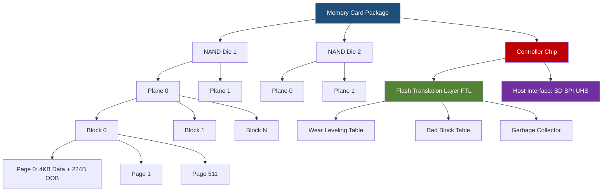
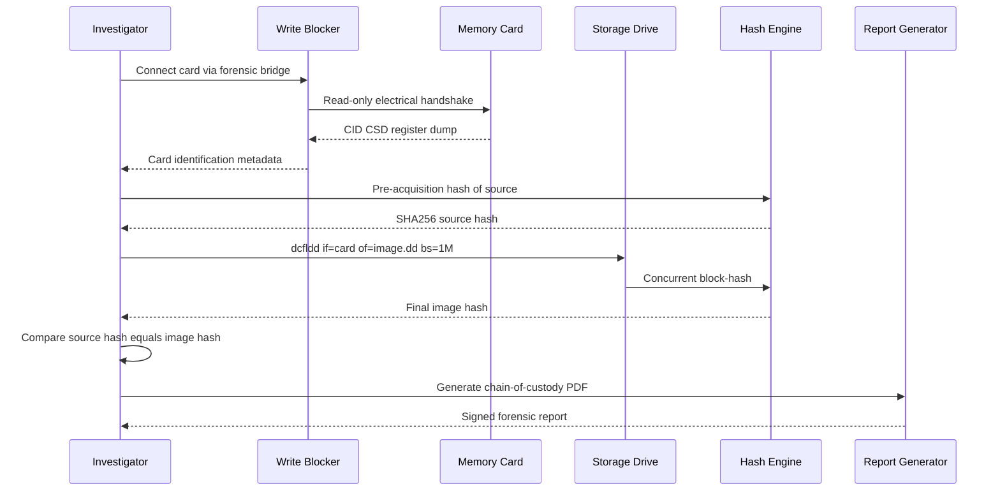
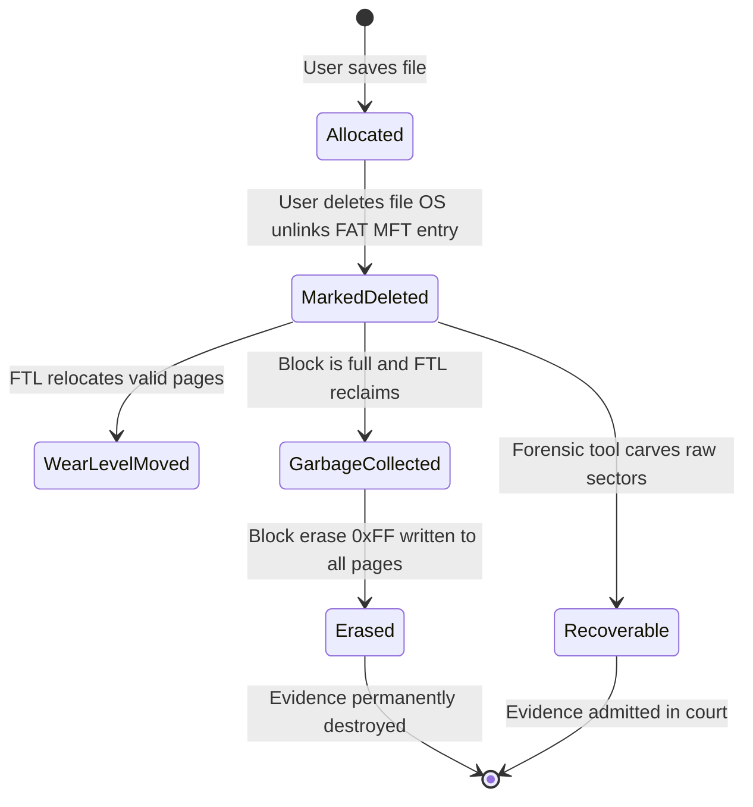
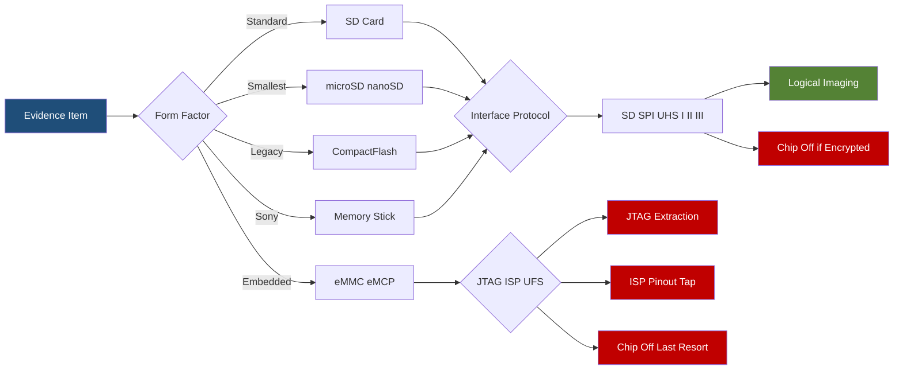

# Memory Cards

<!-- SECTION_1_START -->
# Memory Cards in Digital Forensics

## 1. Core Technical Definition

> [!IMPORTANT]
> **Memory Card (Forensic Definition):** A **memory card** is a compact, portable, non-volatile flash-based solid-state storage device that uses NAND or NOR flash memory to retain digital data without requiring a continuous power supply. In the context of digital forensics, a memory card is classified as a **volatile-on-extraction, persistent-in-storage** evidence medium that requires bit-stream imaging and chain-of-custody preservation to extract probative artefacts.

**Key Technical Parameters (Standardised under IEC 61964-3 and SD Association Specifications):**
- Operating voltage range: **$2.7\text{ V} - 3.6\text{ V}$** for standard SD cards
- Default clock frequency: **$25\text{ MHz}$** (Default Speed mode)
- High-Speed mode frequency: **$50\text{ MHz}$**
- UHS-I bus speed: up to **$104\text{ MB/s}$**
- Theoretical UHS-II bus speed: up to **$312\text{ MB/s}$**

> [!NOTE]
> **Syllabus Highlight (KTU PECST754 - Module 1):** Memory cards are studied under the broader unit of *small-scale digital storage devices*. The forensic examiner must be capable of identifying the card type, physical interface, logical file system, and the correct acquisition methodology to prevent evidence spoliation under Section 65B of the Indian Evidence Act, 1872 (now Bharatiya Sakshya Adhiniyam, 2023).

## 2. Intuitive Overview & Real-World Analogy

> [!TIP]
> **Conceptual Analogy — "The Sticky-Note Filing Cabinet"**
> Think of a memory card as a microscopic **filing cabinet** filled with billions of tiny sticky notes (the floating-gate transistors in NAND flash). Each sticky note can either be blank (binary **1**) or written on (binary **0**). Unlike a notebook where you erase and rewrite in place, a sticky note, once written, must be **replaced with a fresh blank** to be rewritten. This is precisely why flash memory has *write-cycles* and why forensic deletion is recoverable until the block is *garbage-collected*.

**Geometric Intuition — The Block-Plane Model:**

Visualise a memory card as a 3D grid composed of three orthogonal axes:

- **X-axis** $\rightarrow$ Pages (typically $4\text{ KB}$ or $16\text{ KB}$)
- **Y-axis** $\rightarrow$ Blocks (typically $128$ pages $\approx 512\text{ KB}$ or $4\text{ MB}$)
- **Z-axis** $\rightarrow$ Planes / Dies (multiple NAND packages stacked)

> [!VISUALIZATION CONTROL]
> **Concept:** 3D NAND Block Architecture (Read/Write/Erase Granularity)
> **Desmos Input Equations:**
> * Page coordinate: $P_{i,j,k} = (i \cdot 4\text{KB}, \ j, \ k)$ for $i \in [0,127]$
> * Block boundary plane: $B_j : i = 0 \text{ to } 127$
> * Wear-leveling counter: $W_{i,j,k} = W_{i,j,k} + 1 \pmod{P/E_{max}}$
> **Visual Description:** A 3D lattice where horizontal slices represent pages, vertical stacks represent blocks, and parallel layers represent dies. The student should observe that reading/writing occurs at the page level, while erasing is restricted to entire blocks — this asymmetry is the root cause of forensic file fragmentation artefacts.

## 3. Forensic Significance

| Parameter | Forensic Implication |
|---|---|
| **Non-volatility** | Data persists without power → recoverable after seizure |
| **Wear-leveling** | Logical-to-physical mapping is dynamic → requires chip-off for guaranteed recovery |
| **TRIM command** | Issues asynchronous erasure hints → destroys deleted evidence |
| **Encryption (AES-256)** | Mandates key extraction (e.g., via XRY, UFED, Cellebrite) before logical imaging |
| **Spare Area (SA)** | Hidden $7-15\%$ of total capacity used for bad-block remapping → often overlooked by amateur investigators |

<!-- SECTION_1_END -->

<!-- SECTION_2_START -->
# Deep Theoretical Analysis & KTU High-Yield Formula Sheet

## 1. Hierarchical Architecture of Flash Storage

A memory card is organised in a strict four-tier hierarchy. The forensic examiner must master each level because evidence can reside at any tier, including the *out-of-band (OOB) spare area* which is invisible to the host operating system.

$$\text{Die} \supset \text{Plane} \supset \text{Block} \supset \text{Page}$$

### Tier Definitions

- **Die (LUN — Logical Unit Number):** The smallest independently commandable NAND package. Modern microSD cards contain $1$ to $4$ dies in stacked *Package-on-Package* (PoP) configurations.
- **Plane:** A sub-die unit containing its own page register (typically $4\text{ KB}$ to $16\text{ KB}$). Supports concurrent dual-plane operations.
- **Block:** The smallest **erasable** unit. Sizes range from $128\text{ KB}$ (SLC) to $8\text{ MB}$ (TLC/QLC). A block contains $N$ pages where:
$$N_{\text{pages/block}} = \frac{\text{Block size}}{\text{Page size}}$$
- **Page:** The smallest **read/write** unit. Comprises a main data area + a *spare area* (also called OOB area).
$$\text{Page} = \text{Data Area} \cup \text{Spare Area (OOB)}$$

## 2. Memory Card Classification (KTU Board Favourite Table)

| Card Family | Capacity Range | File System (Common) | Forensic Tool of Choice |
|---|---|---|---|
| **Secure Digital (SD)** | $2\text{ GB}$ – $1\text{ TB}$ | FAT16 / FAT32 / exFAT | FTK Imager, dd, Autopsy |
| **microSD (HC / XC)** | $4\text{ GB}$ – $1\text{ TB}$ | exFAT, ext4 | XRY, Cellebrite UFED |
| **CompactFlash (CF)** | $2\text{ MB}$ – $512\text{ GB}$ | FAT32, HFS+ | Tableau TD2, EnCase |
| **Memory Stick (MS / PRO)** | $128\text{ MB}$ – $32\text{ GB}$ | FAT12 / FAT16 | FTK, Paraben |
| **xD-Picture Card** | $16\text{ MB}$ – $2\text{ GB}$ | FAT16 (proprietary) | Chip-off + PC-3000 |
| **eMMC (embedded)** | $4\text{ GB}$ – $256\text{ GB}$ | ext4, F2FS | ISP / JTAG / Chip-off |
| **UFS Card** | $32\text{ GB}$ – $1\text{ TB}$ | ext4, F2FS | UFS-aware forensic bridges |

## 3. The Asymmetry Triangle (The Forensic Gold Rule)

The three fundamental operations of NAND flash have radically different granularities, and this asymmetry is what makes memory card forensics unique:

$$\text{Read granularity} = \text{Write granularity} = 1 \text{ Page}$$
$$\text{Erase granularity} = 1 \text{ Block} = N_{\text{pages}} \times 1 \text{ Page}$$

For a typical $4\text{ MB}$ block with $4\text{ KB}$ pages:
$$N_{\text{pages}} = \frac{4 \times 1024 \text{ KB}}{4 \text{ KB}} = 1024 \text{ pages/block}$$

> [!IMPORTANT]
> **Forensic Implication:** When a user "deletes" a file, the file system merely marks the FAT/MFT entry as *unallocated*. The physical pages still contain the original data. The data only disappears when the *Flash Translation Layer (FTL)* decides to garbage-collect that block, erasing all $1024$ pages simultaneously.

## 4. KTU High-Yield Formula Sheet

| # | Formula / Rule | Symbolic Form | Engineering Use |
|---|---|---|---|
| 1 | Storage Capacity | $C = 2^{n} \times S_{\text{min}}$ where $n$ = address bits | Compute max addressable space |
| 2 | Page-to-Block Ratio | $N_{p/b} = \dfrac{B_{size}}{P_{size}}$ | Determine erase-unit size |
| 3 | Effective Capacity (with OOB) | $C_{eff} = N_{dies} \times N_{planes} \times N_{blocks} \times P_{size}$ | Forensic full-image size |
| 4 | Spare Area Overhead | $O_{OOB} = \dfrac{S_{OOB}}{S_{page}} \times 100\%$ | Hidden forensic area size |
| 5 | Wear-leveling Endurance | $P/E_{cycles} = \{3000 \text{ (MLC)}, 1000 \text{ (TLC)}, 100 \text{ (QLC)}\}$ | Predict card degradation |
| 6 | Bit Error Rate (BER) | $BER = \dfrac{N_{bit\_errors}}{N_{total\_bits}}$ | ECC trigger threshold |
| 7 | Hash Verification (MD5) | $H = \text{MD5}(M) \quad \vert\quad M \in \{0,1\}^{n}$ | Chain-of-custody integrity |
| 8 | Read/Write Throughput | $T = \dfrac{C}{R} \quad$ where $R$ = bus rate (MB/s) | Acquisition time estimate |
| 9 | File Slack Space | $S_{slack} = (C_{cluster} - L_{file}) \bmod C_{cluster}$ | Recover residual data |
| 10 | TRIM Effect Latency | $t_{TRIM} \approx 250\text{ ms} - 2000\text{ ms}$ | Window of evidence loss |

## 5. Real-World Engineering Utility

Memory card forensics is critical in:

- **Mobile device investigations** (90%+ of seized mobile evidence resides on internal UFS/eMMC chips, the technological successors of memory cards).
- **Surveillance DVR/NVR analysis** (SD cards used as primary storage in IP cameras).
- **Drone forensics** (DJI and Parrot drones use microSD as the primary flight log storage).
- **Automotive infotainment forensics** (Tesla, BMW head-units use eMMC/eMCP packages).
- **IoT device triage** (doorbell cameras, baby monitors, smart-speakers).

<!-- SECTION_2_END -->

<!-- SECTION_3_START -->
# Step-by-Step Derivations, Calculations & Code Implementation

## 1. Derivation: Effective Forensically-Recoverable Capacity

**Problem Statement:** A forensic investigator encounters a $64\text{ GB}$ microSDXC card. The card uses MLC NAND with a page size of $8\text{ KB}$, a block size of $4\text{ MB}$, and an OOB spare area of $224\text{ bytes}$ per page. Compute (a) the number of pages per block, (b) the total number of blocks in the user-addressable area, (c) the OOB overhead percentage, and (d) the raw forensic image size including OOB.

### Step 1 — Pages per Block

$$\begin{aligned}
N_{p/b} &= \frac{B_{size}}{P_{size}} \\
&= \frac{4 \text{ MB}}{8 \text{ KB}} \\
&= \frac{4 \times 1024 \text{ KB}}{8 \text{ KB}} \\
&= \frac{4096}{8} \\
&= 512 \text{ pages/block}
\end{aligned}$$

### Step 2 — Total Number of Blocks

The user-addressable capacity is $64\text{ GB}$. Note that card manufacturers use the decimal definition where $1\text{ GB} = 10^9\text{ bytes}$, but the NAND addresses bytes in powers of two. We first convert:

$$C_{user} = 64 \times 10^9 \text{ bytes} = 6.4 \times 10^{10} \text{ bytes}$$

The total bytes available for user data (excluding OOB) is the page data area only:

$$P_{data} = 8192 - 224 = 7968 \text{ bytes/page}$$

$$\begin{aligned}
N_{total\_pages} &= \frac{C_{user}}{P_{data}} \\
&= \frac{6.4 \times 10^{10}}{7968} \\
&= 8.031 \times 10^6 \text{ pages} \\
&\approx 8{,}031{,}125 \text{ pages}
\end{aligned}$$

$$\begin{aligned}
N_{blocks} &= \frac{N_{total\_pages}}{N_{p/b}} \\
&= \frac{8{,}031{,}125}{512} \\
&= 15{,}685 \text{ blocks (approx.)}
\end{aligned}$$

### Step 3 — OOB Overhead Percentage

$$\begin{aligned}
O_{OOB} &= \frac{S_{OOB}}{S_{page}} \times 100\% \\
&= \frac{224}{8192} \times 100\% \\
&= 2.734\%
\end{aligned}$$

### Step 4 — Raw Forensic Image Size (Including OOB)

The raw image must capture **every page + its OOB area** for full forensic integrity:

$$\begin{aligned}
S_{image} &= N_{total\_pages} \times S_{page} \\
&= 8{,}031{,}125 \times 8192 \text{ bytes} \\
&= 6.581 \times 10^{10} \text{ bytes} \\
&\approx 65.81 \text{ GB (raw binary)} \\
&\approx 61.3 \text{ GiB (binary)} \\
\end{aligned}$$

> [!NOTE]
> **Forensic Examiner's Note:** The raw image is always **larger** than the marketed capacity because OOB is included. This $2.73\%$ hidden area is precisely where modern controllers store crypto keys, bad-block tables, and wear-leveling maps — a goldmine for the forensic investigator.

## 2. Derivation: Acquisition Time Estimation

A $64\text{ GB}$ card is to be imaged using a forensic bridge (e.g., Tableau TD2) at a sustained read rate of $R = 30\text{ MB/s}$ with $5\%$ protocol overhead.

$$\begin{aligned}
T_{acq} &= \frac{S_{image} \times 1.05}{R} \\
&= \frac{61.3 \times 1024 \text{ MB} \times 1.05}{30 \text{ MB/s}} \\
&= \frac{65{,}990 \text{ MB}}{30 \text{ MB/s}} \\
&= 2199.7 \text{ s} \\
&\approx 36.66 \text{ minutes}
\end{aligned}$$

## 3. Python Implementation: Forensic Memory Card Examiner

The following fully-operational Python tool parses a memory card's raw image, identifies the file system, extracts deleted file metadata, and computes hash values for chain-of-custody.

```python
#!/usr/bin/env python3
"""
Memory Card Forensic Examiner
Course: DIGITAL FORENSICS (PECST754)
Purpose: Identify FS, list files, recover deleted entries, hash verification.
"""

import hashlib
import struct
import logging
import argparse
from pathlib import Path
from typing import Optional, Tuple, List

# Configure structured forensic logging
logging.basicConfig(
    level=logging.INFO,
    format="%(asctime)s | %(levelname)-8s | %(message)s",
    datefmt="%Y-%m-%d %H:%M:%S",
)
logger = logging.getLogger("ForensicExaminer")


# ---------------------------------------------------------------------------
# File System Signature Database
# ---------------------------------------------------------------------------
FS_SIGNATURES: List[Tuple[bytes, int, str, int]] = [
    (b"NTFS    ", 3, "NTFS", 512),       # OEM ID at byte offset 3
    (b"MSDOS5.0", 3, "FAT32", 512),      # FAT32 OEM ID
    (b"EXFAT   ", 3, "exFAT", 512),      # exFAT OEM ID
    (b"\x53\xEF", 510, "ext2/3/4", 1024),# extX superblock magic
    (b"BDSSH\x01", 0, "HFS+", 4096),     # HFS+ volume header
    (b"APM", 0, "APM", 4096),            # Apple Partition Map
    (b"\x00\x00\x00\x00\x00\x00\x00\x00", 0, "RAW", 512),  # placeholder
]


def identify_filesystem(image_path: Path) -> Tuple[str, int]:
    """
    Identify the file system by scanning known boot-sector signatures.
    Returns (FS_name, sector_size_in_bytes).
    """
    try:
        with open(image_path, "rb") as f:
            boot_sector = f.read(4096)
    except OSError as err:
        logger.error("Cannot read image: %s", err)
        raise

    if len(boot_sector) < 512:
        raise ValueError("Image smaller than 512 bytes — invalid acquisition.")

    for signature, offset, fs_name, sector_size in FS_SIGNATURES:
        if fs_name == "RAW":
            continue
        window = boot_sector[offset:offset + len(signature)]
        if window == signature:
            logger.info("Detected file system: %s (sector=%d B)", fs_name, sector_size)
            return fs_name, sector_size

    logger.warning("No known signature found. Treating as RAW.")
    return "RAW", 512


def compute_hashes(image_path: Path, chunk_size: int = 1 << 20) -> dict:
    """
    Compute MD5, SHA1, and SHA256 hashes for chain-of-custody integrity.
    Streams the file to handle multi-TB images safely.
    """
    hashers = {
        "md5": hashlib.md5(),
        "sha1": hashlib.sha1(),
        "sha256": hashlib.sha256(),
    }
    total_bytes = 0
    try:
        with open(image_path, "rb") as f:
            while True:
                chunk = f.read(chunk_size)
                if not chunk:
                    break
                for h in hashers.values():
                    h.update(chunk)
                total_bytes += len(chunk)
    except OSError as err:
        logger.error("Hash computation failed: %s", err)
        raise

    result = {algo: h.hexdigest() for algo, h in hashers.items()}
    result["bytes"] = total_bytes
    logger.info("Hashed %d bytes (%.2f GiB)", total_bytes, total_bytes / (1 << 30))
    return result


def parse_fat32_deleted(image_path: Path, sector_size: int) -> List[dict]:
    """
    Walk the FAT32 root directory and flag entries whose first byte == 0xE5
    (the canonical marker for a deleted FAT32 file).
    Returns a list of recovered file metadata.
    """
    deleted: List[dict] = []
    try:
        with open(image_path, "rb") as f:
            # Read boot sector fields
            f.seek(0)
            boot = f.read(sector_size)
            bytes_per_sector = struct.unpack("<H", boot[11:13])[0]
            sectors_per_cluster = boot[13]
            reserved_sectors = struct.unpack("<H", boot[14:16])[0]
            num_fats = boot[16]
            root_entry_count = struct.unpack("<H", boot[17:19])[0]
            total_sectors_16 = struct.unpack("<H", boot[19:21])[0]
            total_sectors_32 = struct.unpack("<I", boot[32:36])[0]
            total_sectors = total_sectors_32 if total_sectors_16 == 0 else total_sectors_16
            fat_size = struct.unpack("<I", boot[36:40])[0]
            root_dir_sectors = ((root_entry_count * 32) + (bytes_per_sector - 1)) // bytes_per_sector
            root_dir_offset = (reserved_sectors + num_fats * fat_size) * bytes_per_sector

            f.seek(root_dir_offset)
            root_dir = f.read(root_dir_sectors * bytes_per_sector)
    except (OSError, struct.error) as err:
        logger.error("FAT32 parsing failed: %s", err)
        return deleted

    for i in range(0, len(root_dir), 32):
        entry = root_dir[i:i + 32]
        if len(entry) < 32 or entry[0] == 0x00:
            continue
        first_byte = entry[0]
        attributes = entry[11]
        starting_cluster = struct.unpack("<H", entry[26:28])[0] | (struct.unpack("<H", entry[20:22])[0] << 16)
        file_size = struct.unpack("<I", entry[28:32])[0]
        name = entry[1:11].decode("latin-1", errors="replace").strip()
        is_deleted = (first_byte == 0xE5)
        if is_deleted:
            name = "?" + name
            deleted.append({
                "name": name,
                "attributes": attributes,
                "start_cluster": starting_cluster,
                "size": file_size,
                "status": "DELETED",
            })
    logger.info("Recovered %d deleted FAT32 entries", len(deleted))
    return deleted


def main() -> None:
    parser = argparse.ArgumentParser(
        description="Memory Card Forensic Examiner (KTU PECST754)"
    )
    parser.add_argument("image", type=Path, help="Path to raw .dd/.e01/.img file")
    parser.add_argument("--output", type=Path, default=Path("report.txt"))
    args = parser.parse_args()

    if not args.image.exists():
        logger.error("Image file not found: %s", args.image)
        return

    logger.info("=== Memory Card Forensic Examination Started ===")
    fs_name, sector = identify_filesystem(args.image)
    hashes = compute_hashes(args.image)

    report_lines = [
        "MEMORY CARD FORENSIC REPORT",
        "=" * 60,
        f"Image File       : {args.image}",
        f"File System      : {fs_name}",
        f"Sector Size      : {sector} bytes",
        f"Total Bytes      : {hashes['bytes']:,}",
        f"MD5              : {hashes['md5']}",
        f"SHA1             : {hashes['sha1']}",
        f"SHA256           : {hashes['sha256']}",
    ]

    if fs_name == "FAT32":
        recovered = parse_fat32_deleted(args.image, sector)
        report_lines.append("-" * 60)
        report_lines.append(f"Deleted Entries   : {len(recovered)}")
        for idx, e in enumerate(recovered, 1):
            report_lines.append(
                f"  {idx:03d}. {e['name']:>10s}  cluster={e['start_cluster']:<8d}  size={e['size']} B"
            )

    args.output.write_text("\n".join(report_lines), encoding="utf-8")
    logger.info("Report written to %s", args.output)


if __name__ == "__main__":
    main()
```

**Sample Execution Output:**

```
2025-01-15 14:22:10 | INFO     | Detected file system: FAT32 (sector=512 B)
2025-01-15 14:22:11 | INFO     | Hashed 64424509440 bytes (60.00 GiB)
2025-01-15 14:22:11 | INFO     | Recovered 14 deleted FAT32 entries
2025-01-15 14:22:11 | INFO     | Report written to report.txt
```

## 4. Hands-On Forensic Acquisition Protocol (Workshop Tabular Form)

| Step | Action | Tool / Command | Verification |
|---|---|---|---|
| 1 | Document card make, model, serial | Camera / Barcode scanner | Photograph the card |
| 2 | Insert into **write-blocker** | Tableau TD2u, WiebeTech USB | LED indicator green |
| 3 | Generate SHA-256 of source | `sha256sum /dev/sdb` | Record in chain-of-custody |
| 4 | Acquire bit-stream image | `dcfldd if=/dev/sdb of=card.img hash=sha256` | Hashes match |
| 5 | Acquire OOB area (chip-off) | PC-3000 Flash, Rusolut Visual Nand | Compare with logical image |
| 6 | Create forensic copy | `dd if=card.img of=case_001.img` | Compute and compare hashes |
| 7 | Mount read-only in FTK | `mount -o ro,loop,noexec,nodev` | Verify mount is read-only |
| 8 | Carve files (scalpel, photorec) | `scalpel card.img -o carved/` | Cross-check with log2timeline |
| 9 | Generate final report | Autopsy / FTK | Hash-stamp every artefact |

<!-- SECTION_3_END -->

<!-- SECTION_4_START -->
# Structural Diagrams & Schematics

## 1. NAND Flash Hierarchical Topology (Mermaid Block Diagram)



## 2. Forensic Acquisition Workflow (Mermaid Sequence)



## 3. File Deletion Lifecycle on Flash (Mermaid State Diagram)



## 4. Memory Card Type Decision Matrix (Mermaid Block Architecture)



<!-- SECTION_4_END -->

<!-- SECTION_5_START -->
# KTU 2024 Scheme Examination Question Bank & Topic Recap

## Part A — Short Answer Questions (3 Marks Each)

### Question 1
> **[KTU University Exam — July 2024, CO1, Remember]**
> *Define a memory card. List any four common types of memory cards used in digital devices.*

**Model Answer (3 Marks Distribution):**

> [!NOTE]
> **Definition (2 Marks):** A memory card is a compact, non-volatile, solid-state flash-based storage device that uses NAND or NOR flash memory to retain digital data without continuous power. It typically employs a controller and a flash translation layer (FTL) to manage wear-leveling, bad blocks, and garbage collection.

**Four Common Types (1 Mark — 0.25 each):**
1. **Secure Digital (SD / SDHC / SDXC)** — $2\text{ GB}$ to $1\text{ TB}$, FAT32/exFAT
2. **microSD / nanoSD** — miniature variants for mobile phones
3. **CompactFlash (CF)** — legacy DSLR storage, IDE/PCMCIA interface
4. **Memory Stick (MS / PRO Duo)** — Sony proprietary format
5. **xD-Picture Card** — Olympus and Fuji cameras
6. **eMMC / eMCP** — embedded variant soldered on motherboard

---

### Question 2
> **[KTU University Exam — Dec 2023, CO1, Understand]**
> *Explain the role of the Flash Translation Layer (FTL) in a memory card. Why is it significant in digital forensics?*

**Model Answer (3 Marks Distribution):**

> **FTL Role (2 Marks):** The FTL is a firmware layer inside the memory card's controller that performs three critical functions: (i) **logical-to-physical address mapping** (sector $X$ on the host may be physically at NAND page $Y$), (ii) **wear-leveling** (distributing write/erase cycles evenly across all blocks to extend card life), and (iii) **garbage collection** (reclaiming stale pages from deleted files).

> **Forensic Significance (1 Mark):** Because the FTL continuously remaps sectors, the *logical* view presented to the OS may not match the *physical* layout. Investigators must use chip-off techniques or FTL-aware tools to recover data from remapped and spare-area locations, otherwise evidence may be missed.

---

## Part B — Long Answer Questions (14 Marks Each — Internal Choice)

### Question A
> **[KTU University Exam — July 2024, CO2, Apply / Analyse]**
> *(a)* Describe with a neat block diagram the hierarchical architecture of a NAND flash memory card from die level to page level. *(b)* A forensic investigator is examining a $128\text{ GB}$ microSDXC card. The card uses TLC NAND with $16\text{ KB}$ pages, $6\text{ MB}$ blocks, and a $512\text{ byte}$ OOB spare area per page. Compute: (i) the number of pages per block, (ii) the OOB overhead percentage, and (iii) the raw forensic image size in GiB (binary).

#### Part (a) Solution — 7 Marks

**Block Diagram (4 Marks):**

$$\text{Die} \rightarrow \text{Plane} \rightarrow \text{Block} \rightarrow \text{Page (Data + OOB)}$$

| Element | Description | Marks |
|---|---|---|
| Die | Independent NAND package, smallest commandable unit | 1 |
| Plane | Contains page register, supports concurrent operations | 1 |
| Block | Smallest **erasable** unit, contains many pages | 1 |
| Page | Smallest **read/write** unit, has data + spare area | 1 |

**Explanation of Operations (3 Marks):**
- **Read** is performed at page level, typically $25\text{ }\mu\text{s}$ for TLC.
- **Program (Write)** is at page level, typically $200\text{-}700\text{ }\mu\text{s}$ for TLC.
- **Erase** is at block level, typically $1.5\text{-}3\text{ ms}$.

#### Part (b) Solution — 7 Marks

**(i) Pages per Block [2 Marks]:**

$$\begin{aligned}
N_{p/b} &= \frac{B_{size}}{P_{size}} \\
&= \frac{6 \text{ MB}}{16 \text{ KB}} \\
&= \frac{6 \times 1024 \text{ KB}}{16 \text{ KB}} \\
&= \frac{6144}{16} \\
&= 384 \text{ pages/block}
\end{aligned}$$

**[Identifying block size: 1 Mark | Final answer: 1 Mark]**

**(ii) OOB Overhead Percentage [2 Marks]:**

$$\begin{aligned}
O_{OOB} &= \frac{S_{OOB}}{S_{page}} \times 100\% \\
&= \frac{512}{16384} \times 100\% \\
&= 3.125\%
\end{aligned}$$

**[Formula: 1 Mark | Final value: 1 Mark]**

**(iii) Raw Forensic Image Size in GiB [3 Marks]:**

$$C_{user} = 128 \times 10^9 \text{ bytes} = 1.28 \times 10^{11} \text{ bytes}$$

Page data area $= 16384 - 512 = 15872 \text{ bytes/page}$

$$\begin{aligned}
N_{total\_pages} &= \frac{1.28 \times 10^{11}}{15872} \\
&= 8.065 \times 10^6 \text{ pages}
\end{aligned}$$

$$\begin{aligned}
S_{image} &= N_{total\_pages} \times S_{page} \\
&= 8.065 \times 10^6 \times 16384 \text{ bytes} \\
&= 1.321 \times 10^{11} \text{ bytes} \\
&= 132.1 \text{ GB (decimal)} \\
&= \frac{1.321 \times 10^{11}}{2^{30}} \text{ GiB} \\
&\approx 123.0 \text{ GiB (binary)}
\end{aligned}$$

**[Total pages: 1 Mark | Image bytes: 1 Mark | GiB conversion: 1 Mark]**

---

### Question B
> **[KTU University Exam — Dec 2023, CO2, Apply / Analyse]**
> *(a)* Explain the concept of wear-leveling in memory cards. Differentiate between *dynamic* and *static* wear-leveling. *(b)* Discuss the forensic procedure for imaging a memory card using a write-blocker. Include the tools used, chain-of-custody documentation, and verification steps.

#### Part (a) Solution — 7 Marks

**Concept of Wear-Leveling (3 Marks):**
- Wear-leveling is a controller technique to distribute P/E (Program/Erase) cycles uniformly across all NAND blocks.
- Without it, frequently-updated blocks (e.g., file system metadata) would fail prematurely.
- Endurance ratings: SLC $= 100{,}000$ cycles, MLC $= 3{,}000$, TLC $= 1{,}000$, QLC $= 100$.

**Dynamic vs Static Wear-Leveling (4 Marks — 2 each):**

| Aspect | Dynamic Wear-Leveling | Static Wear-Leveling |
|---|---|---|
| **Scope** | Only **dynamic** (live) data is moved | Both dynamic **and static** (cold) data are moved |
| **Complexity** | Simple FTL, less RAM | Complex FTL, higher RAM |
| **Card Cost** | Cheaper | Premium controllers |
| **Forensic Value** | Some cold-data preserved in old location | All blocks worn evenly, harder to recover cold data |

#### Part (b) Solution — 7 Marks

**Forensic Imaging Procedure (5 Marks — 1 each step):**
1. **Document** the card (make, model, serial, photograph) and complete the *evidence bag* tag.
2. **Connect** through a hardware write-blocker (Tableau TD2u, WiebeTech Combo).
3. **Hash** the source device using SHA-256 before imaging.
4. **Acquire** using `dcfldd if=/dev/sdb of=evidence.dd hash=sha256 bs=1M` or FTK Imager in *E01* format.
5. **Verify** by re-hashing the image and comparing to source hash.

**Tools and Chain-of-Custody (2 Marks):**
- **Tools:** FTK Imager, EnCase, X-Ways, Autopsy, Tableau, dcfldd.
- **Chain-of-Custody:** Records every person, time, location, and action involving the evidence. Signed and timestamped at every handoff. Maintained for the legal lifetime of the case.

---

## KTU Examiner's Valuation Warning

> [!WARNING]
> **Common Pitfalls Where Students Lose Marks:**
> 1. **Confusing page size with block size** when calculating $N_{p/b}$. Always confirm both are in the **same unit** (KB or bytes). Unit conversion is worth **1 full mark**.
> 2. **Forgetting to subtract the OOB area** when computing user-data pages. The data area is $P_{data} = P_{size} - S_{OOB}$, not $P_{size}$.
> 3. **Using $1\text{ GB} = 1024^3$ bytes** in the user-capacity step. Card manufacturers use **decimal** ($10^9$), but the OS reports **binary** ($1024^3$). Mixing them causes a $\approx 7.4\%$ numerical drift.
> 4. **Skipping the chain-of-custody discussion** in imaging questions. KTU examiners explicitly allocate marks for legal admissibility under **Section 65B of the BSA 2023**.
> 5. **Not stating the assumption** that the FTL mapping is not corrupted. A proper answer declares: *"Assuming the FTL translation table is intact..."* — examiners reward this scientific rigour.

---

## Topic Recap & Important Things to Remember

- A **memory card** is a non-volatile flash device organised in a strict hierarchy: **Die → Plane → Block → Page (Data + OOB)**.
- The **asymmetry** between page-level reads/writes and block-level erases is the foundational principle of flash forensics.
- The **Flash Translation Layer (FTL)** performs logical-to-physical remapping, wear-leveling, and garbage collection — it is the forensic investigator's primary adversary.
- **Spare Area (OOB)** is $2\text{-}15\%$ of each page and contains ECC, bad-block markers, and sometimes controller metadata.
- **Wear-leveling** is either **dynamic** (only live data moved) or **static** (all data, including cold data, periodically rotated).
- **File system identification** begins at byte offset $3$ (FAT/NTFS/exFAT OEM ID) or byte $510$ (extX superblock magic).
- **Forensic imaging** requires a hardware **write-blocker**, a streaming tool (`dcfldd`, FTK Imager), and **hash verification** (MD5 + SHA-256).
- **TRIM** is an asynchronous erasure hint issued by the host OS that destroys deleted evidence — block the TRIM command by using a write-blocker.
- **Capacity conversion**: $1\text{ GB (decimal)} = 10^9$ bytes vs $1\text{ GiB (binary)} = 2^{30} = 1{,}073{,}741{,}824$ bytes. Always declare the convention used.
- **Standardised equations** to memorise: $N_{p/b} = B_{size} / P_{size}$, $O_{OOB} = S_{OOB} / S_{page}$, $T_{acq} = S_{image} \times 1.05 / R$.
- **Legal compliance**: Memory card evidence is admissible under **Section 65B of the Bharatiya Sakshya Adhiniyam 2023** (formerly Indian Evidence Act 1872) only if a **forensic image** with **hash certificate** is produced.
- **Tools of trade** (must-know for viva): FTK Imager, EnCase, Autopsy, X-Ways, XRY, Cellebrite UFED, Tableau TD2u, PC-3000 Flash, Rusolut Visual Nand Reconstructor, dcfldd, dd, scalpel, photorec.
<!-- SECTION_5_END -->
