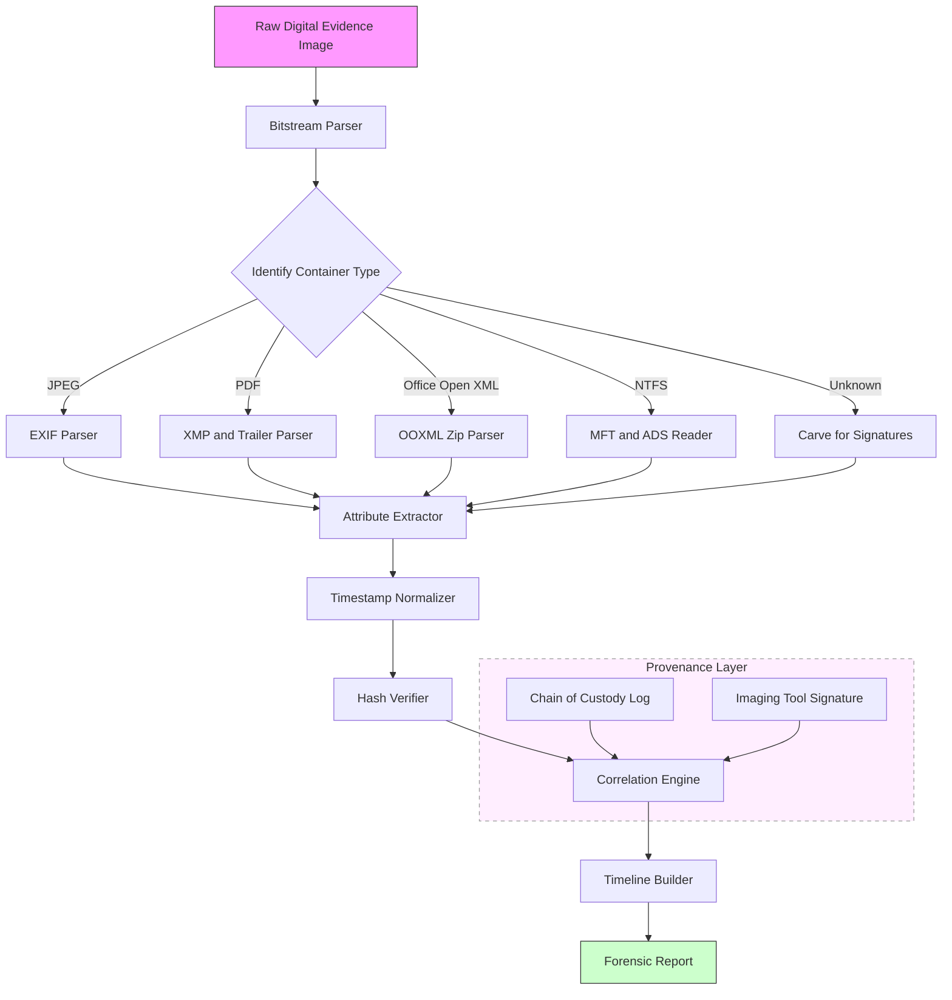
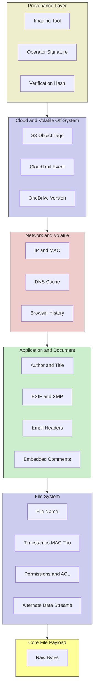

# Metadata and Attributes

<!-- SECTION_1_START -->

# Module 1 — Introduction to Digital Forensics
## Topic: Metadata and Attributes

### 1.1 Core Technical Definition

> [!IMPORTANT]
> **Definition (KTU 2024 Scheme Aligned):**
> **Metadata** is structured descriptive information that characterizes, explains, locates, or makes it easier to retrieve, use, or manage an information resource. In the context of digital forensics, metadata constitutes the **forensic "DNA"** of a digital artifact — it describes *data about data* and serves as the primary evidentiary foundation for reconstructing events, identifying authorship, establishing timelines, and validating the chain of custody.

> **Definition (Attributes):**
> An **attribute** in digital forensics is a single, named characteristic or property of a digital entity (file, user, system, or network object). A collection of related attributes for an entity forms a **metadata record**. Attributes can be **intrinsic** (born with the data — e.g., file size, header bytes) or **extrinsic** (imposed by the system — e.g., $Access\ Control\ List$, timestamps from $NTFS$ $MFT$).

> [!NOTE]
> **KTU 2024 Scheme Emphasis (PECST754 — Module 1):**
> Metadata is positioned as a *silent witness* in any digital investigation. The syllabus explicitly highlights the examiner's duty to (1) identify, (2) preserve, (3) extract, and (4) interpret metadata from heterogeneous sources such as file systems, document files, email headers, images, network packets, and mobile device artifacts.

---

### 1.2 Conceptual Analogy — The "Shipping Label" Intuition

Imagine every digital file is a parcel shipped through a vast warehouse (the operating system, the internet, the cloud). Although the parcel's *content* may be invisible from the outside, the **shipping label** glued to the outside tells the investigator everything else:

| Parcel (File) Component | Real-World Equivalent | Forensic Value |
|---|---|---|
| **Tracking number** | File hash ($MD5$, $SHA\text{-}1$, $SHA\text{-}256$) | Tamper detection, unique identification |
| **Shipper's address** | Author / Owner metadata | Attribution of creation |
| **Date shipped** | Creation timestamp ($Created\ On$) | Timeline reconstruction |
| **Last scanned at hub** | Modification timestamp ($Last\ Modified$) | Activity chronology |
| **Customs declarations** | Embedded $EXIF$, $XMP$, document properties | Geolocation, device fingerprint |
| **Warehouse log entry** | File system $MFT$ entry, $inode$ metadata | Provenance and access history |

> [!TIP]
> **Memory Hook for KTU Exam:**
> If you can answer *"Who, What, When, Where, With what, and How"* about a file, you are *almost certainly* describing a metadata attribute. The classic forensic acronym **$5W1H$** maps almost perfectly onto the metadata schema.

---

### 1.3 Classification of Metadata — The Three-Tier Model

Digital forensic literature (and KTU Module 1) recognizes three primary metadata categories:

1. **Descriptive Metadata** — Information used for discovery and identification (title, author, subject, keywords).
2. **Structural Metadata** — Information about how compound objects are put together (page order, chapter sequence, file offsets, container relationships).
3. **Administrative Metadata** — Information used to manage resources (file size, $MIME\ type$, access permissions, $ACL$, technical origin).

A fourth, increasingly important in KTU 2024 discussions, is:

4. **Provenance / Preservation Metadata** — Audit trail data: hash values, chain-of-custody logs, timestamping certificates, and write-blocker verification records.

---

### 1.4 Visualization of the Metadata Hierarchy

> [!VISUALIZATION CONTROL]
> **Concept:** Layered metadata architecture around a digital file
> **GeoGebra / Desmos Input Equations (representative):**
> * `C(t) = 0.5 * sin(2 * pi * t / 86400)` — represent daily creation rhythm
> * Points: $(0, 0)$ file, $(1, 2)$ FS-layer metadata, $(2, 4)$ Application-layer metadata, $(3, 6)$ Provenance-layer metadata
> **Visual Description:** A concentric layered plot where the innermost point is the *raw file payload*, and successive outward rings correspond to the file system layer, the application layer, and finally the provenance/chain-of-custody layer. Each ring contributes additional $X$ (time) and $Y$ (entity) coordinates that the investigator plots to reconstruct a timeline.

```
                 [ PROVENANCE LAYER ]
                 Hashes  |  Custody Logs
                ┌─────────────────────┐
                │   APPLICATION LAYER  │
                │ EXIF | Author | XMP  │
                │  ┌───────────────┐   │
                │  │  FILE SYSTEM  │   │
                │  │  MFT | inode  │   │
                │  │ ┌──────────┐  │   │
                │  │ │ PAYLOAD  │  │   │
                │  │ │  FILE    │  │   │
                │  │ └──────────┘  │   │
                │  └───────────────┘   │
                └─────────────────────┘
```

---

### 1.5 Standard Metrics and Physical Constants in Metadata Analysis

- **$MD5$ hash length:** $\mathbf{128\ bits}$ (32 hex characters)
- **$SHA\text{-}1$ hash length:** $\mathbf{160\ bits}$ (40 hex characters)
- **$SHA\text{-}256$ hash length:** $\mathbf{256\ bits}$ (64 hex characters)
- **Time precision on $NTFS$:** $100$ nanoseconds (since Windows 7 / 2008)
- **Time precision on $ext4$:** $\mathbf{1\ nanosecond}$
- **$GPS$ coordinate decimal precision:** $\mathbf{5\ decimal\ places\ \approx\ 1.1\ meters}$ of accuracy
- **$MAC$ time trio on $NTFS$:** Modified, Accessed, Changed (file metadata alteration)

> [!NOTE]
> **KTU 2024 Highlight:** Recognize that *file size alone is metadata*. The **file size** attribute, although trivial, can confirm encryption, hidden partitions, or steganographic anomalies when compared with expected payload size.

<!-- SECTION_1_END -->

<!-- SECTION_2_START -->

# 2. Deep Theoretical Analysis & KTU High-Yield Formula Sheet

## 2.1 The Forensic Metadata Schema — Operational Decomposition

The investigative power of metadata arises from its **layered persistence**. Even when a user "deletes" a file, most metadata artifacts survive in file system journals, shadow copies, $LNK$ files, registry hives, and $EXIF$ data streams. Understanding *where* metadata lives is as important as knowing *what* it contains.

### 2.1.1 Layer 1 — File System Metadata

Every modern file system stores a minimum set of attributes in its directory entry or $MFT$ record:

- **File name** (long and short $8.3$ form on legacy $FAT$)
- **$MIME$ type / extension mapping**
- **Size on disk** vs **logical size** (slack space indicator)
- **Timestamps**: $Created$, $Last\ Modified$, $Last\ Accessed$, $MFT\ Modified$ (on $NTFS$)
- **Security descriptor** (owner, $DACL$, $SACL$)
- **Alternate data streams** ($ADS$ in $NTFS$ — historically abused for hiding data)
- **Link count** and **parent directory reference**

> [!IMPORTANT]
> **NTFS MAC Time Trio** — must memorize for KTU:
> * **M**odified — content bytes changed.
> * **A**ccessed — file was *read* (often disabled for performance).
> * **C**hanged — *metadata* changed (e.g., permissions, rename) — distinct from $M$.

### 2.1.2 Layer 2 — Application / Document Metadata

- **Office documents ($.docx$, $.xlsx$, $.pptx$):** author, last-modified-by, revision number, comments, hidden text, template path, $GUID$ of editing machine.
- **$PDF$ documents:** producer, creator, $XMP$ packet, page count, font list, embedded JavaScript.
- **Images ($.jpg$, $.tiff$):** $EXIF$ (Exchangeable Image File Format) data — camera model, $GPS$, timestamp, software, $IPTC$, $XMP$.
- **Audio / Video:** $ID3$ tags, codec, encoder, bitrate, $MP4$ atoms ($moov$, $mdat$).
- **Email headers:** $X\text{-}Mailer$, $Message\text{-}ID$, $Received\ SPF$, $DKIM$, route servers.

### 2.1.3 Layer 3 — Network / Volatile Metadata

- **$IP$ addresses**, **$MAC$ addresses**, **$DHCP$ leases**, **$ARP$ caches**, **$DNS$ resolver cache**, **browser history**, **cookies**, **session tokens**.

### 2.1.4 Layer 4 — Cloud / Volatile-Off-System Metadata

- **$S3$ object metadata**, **$OneDrive$ version history**, **$Google\ Drive$ activity logs**, **$SharePoint$ audit logs**, **$AWS\ CloudTrail$ records**.

### 2.1.5 Layer 5 — Provenance / Chain-of-Custody Metadata

- **Imaging tool** (e.g., $FTK\ Imager$, $dd$, $EnCase$)
- **Imager version**, **operator name**, **image hash**, **verification hash**, **case number**, **evidence label**.

---

## 2.2 The Forensic Interpretation Pipeline

The investigation follows a deterministic pipeline that KTU examiners expect students to articulate:

1. **Identification** — Recognize the artifact's *type* via magic bytes and metadata signature.
2. **Extraction** — Use a forensic tool to pull metadata without altering the file (write-blocker enforced).
3. **Normalization** — Convert timestamps to a single time zone (usually $UTC$).
4. **Correlation** — Cross-reference with $\log$ files, $SIEM$ data, and other artifacts.
5. **Inference** — Reconstruct events (e.g., *file X was created on machine Y at time $T_1$, copied to USB $Z$ at $T_2$, and emailed to recipient $R$ at $T_3$*).
6. **Documentation** — Record every metadata value into a forensic report with provenance.

---

## 2.3 KTU High-Yield Formula / Cheat Sheet

| # | Concept | Formula / Definition | Forensic Use |
|---|---|---|---|
| 1 | $MD5$ hash | $H_{MD5}(M) \rightarrow \{0,1\}^{128}$ | Unique fingerprint, tamper detection |
| 2 | $SHA\text{-}1$ hash | $H_{SHA1}(M) \rightarrow \{0,1\}^{160}$ | Stronger integrity, deprecation by $NIST$ post $2017$ |
| 3 | $SHA\text{-}256$ hash | $H_{SHA256}(M) \rightarrow \{0,1\}^{256}$ | Court-grade integrity proof |
| 4 | Cyclic Redundancy Check ($CRC32$) | $CRC(M) = M(x) \cdot x^{32}\ \bmod\ G(x)$ | Quick non-cryptographic check |
| 5 | NTFS timestamp resolution | $1\ tick = 100\ ns$ | High-precision timeline |
| 6 | $FAT$ date encoding | $Date = ((Y-1980) \cdot 512) + (M \cdot 32) + D$ | Legacy $FAT$ decode (2 bytes) |
| 7 | $EXIF$ GPS to decimal | $Dec = D + \frac{M}{60} + \frac{S}{3600}$ | Convert $DMS$ GPS to decimal degrees |
| 8 | File slack size | $S_{slack} = S_{cluster} - (S_{file}\ \bmod\ S_{cluster})$ | Locate hidden residual data |
| 9 | Image size on disk | $S_{disk} = \lceil S_{file} / S_{cluster} \rceil \cdot S_{cluster}$ | Detect file system anomaly |
| 10 | Timestamp normalization | $T_{UTC} = T_{local} - Offset_{TZ} \pm DST$ | Cross-zone event ordering |
| 11 | Entropy (Shannon) | $H(X) = -\sum_{i=1}^{n} p(x_i) \log_2 p(x_i)$ | Detect encryption / packing (shifts $H \to 8$) |
| 12 | Time delta (timeline gap) | $\Delta t = t_2 - t_1$ | Identify suspicious gaps in activity |
| 13 | Hash collision probability (birthday) | $P \approx 1 - e^{-n^2 / 2N}$ | Justify $SHA\text{-}256$ over $MD5$ |
| 14 | Data stream offset (PE) | $Offset = Section\ VA - ImageBase + RVA$ | Locate embedded metadata in binaries |
| 15 | $XMP$ packet locator | $Offset = \langle x:xmpmeta\ \rangle$ marker byte-search | Extract $XMP$ from image/PDF |

> [!NOTE]
> **KTU 2024 Exam Tip:** Memorize formulas 1–8 in the table above. The other formulas (entropy, birthday, $XMP$ locator) are bonus marks and appear in advanced 14-mark questions.

---

## 2.4 Real-World Engineering Utility

| Industry Domain | Metadata Utility |
|---|---|
| **Law Enforcement (CBI / Cyber Cells, Kerala Police)** | Image $EXIF\ GPS$ used to geolocate child-exploitation material suspects |
| **Incident Response (CSIRTs)** | $MFT\ Modified$ times reveal ransomware encryption propagation order |
| **e-Discovery (Corporate Litigation)** | Email header metadata used to prove document authenticity in court |
| **Insider Threat Detection** | Author + LastModifiedBy mismatch in Office docs reveals unauthorized edits |
| **Cloud Forensics (AWS, Azure)** | CloudTrail $eventTime$ + object $LastModified$ correlates data exfiltration windows |
| **Mobile Forensics (UFED, Cellebrite)** | SQLite WAL + $plist$ metadata reconstructs deleted iOS messages |
| **Anti-Stalking / Domestic Abuse Cases** | $EXIF\ GPS$ in shared photos used to track victims — hence social platforms strip it |
| **Intellectual Property Theft** | $PDF\ Producer$ string can identify the original generator and the laundered copy |

> [!TIP]
> **One-liner for the board:** *"Metadata is to a digital investigator what fingerprints, footprints, and blood spatter are to a crime scene investigator — invisible to the layperson, indispensable to the professional."*

<!-- SECTION_2_END -->

<!-- SECTION_3_START -->

# 3. Step-by-Step Derivations, Code, and Symbolic Implementation

## 3.1 Worked Example 1 — Deriving the EXIF GPS Decimal Coordinates

A $JPEG$ image is found on a suspect's phone. The $EXIF$ data reports the following $GPS$ values:

- Latitude Reference: **N**
- Latitude: $10^{\circ}\ 0'0''\ (D, M, S)$ — written as $(D, M, S) = (10, 0, 0)$
- Longitude Reference: **E**
- Longitude: $76^{\circ}\ 0'0''$

> [!NOTE]
> The reference letters $N$, $S$, $E$, $W$ are the *sign operators* of the coordinate.

### Step-by-step derivation

The decimal degree formula is:

$$
\varphi_{dec} = D + \frac{M}{60} + \frac{S}{3600}
$$

**Step 1 — Substitute $D$, $M$, $S$ for latitude.**

$$
\varphi_{lat} = 10 + \frac{0}{60} + \frac{0}{3600} = 10.000000^{\circ}
$$

**Step 2 — Apply the hemisphere sign. Reference is $N$ (positive).**

$$
\varphi_{lat} = +10.000000^{\circ}
$$

**Step 3 — Compute longitude decimal.**

$$
\varphi_{lon} = 76 + \frac{0}{60} + \frac{0}{3600} = 76.000000^{\circ}
$$

**Step 4 — Apply the hemisphere sign. Reference is $E$ (positive).**

$$
\varphi_{lon} = +76.000000^{\circ}
$$

**Step 5 — Final geocoordinates for lookup on a map (e.g., Google Maps).**

$$
(\varphi_{lat},\ \varphi_{lon}) = (10.000000^{\circ}N,\ 76.000000^{\circ}E)
$$

> **Result:** This point is in **Kerala, India** — near the city of **Kochi**. The investigator now has a probable capture location.

---

## 3.2 Worked Example 2 — File Slack Space Calculation

A file of $S_{file} = 2{,}500\ bytes$ is stored on a file system with cluster size $S_{cluster} = 4{,}096\ bytes\ (4\ KiB)$.

### Step-by-step derivation

**Step 1 — Compute the disk allocation units used.**

$$
N_{cluster} = \left\lceil \frac{S_{file}}{S_{cluster}} \right\rceil = \left\lceil \frac{2500}{4096} \right\rceil = 1
$$

**Step 2 — Compute the on-disk size.**

$$
S_{disk} = N_{cluster} \cdot S_{cluster} = 1 \cdot 4096 = 4096\ bytes
$$

**Step 3 — Compute file slack size.**

$$
S_{slack} = S_{disk} - S_{file} = 4096 - 2500 = 1596\ bytes
$$

**Step 4 — Forensic implication.** A $1{,}596$ byte residual area exists between the file's logical end and the cluster boundary. This area may contain:
* Previous file remnants (RAM slack from $BIOS$ memory dumps).
* Hidden data planted by the suspect.
* File system metadata padding.

> [!IMPORTANT]
> **Board valuation key:** When asked *"What is the slack space?"* always state the **boundary cluster size**, the **file size**, and the **subtraction**. The examiner awards one mark each.

---

## 3.3 Worked Example 3 — Entropy-Based Detection of Encrypted Metadata

Shannon entropy is a measure of randomness. A non-encrypted text file has $H \approx 4.5\ bits/byte$, while encrypted data approaches $8.0\ bits/byte$.

### Step-by-step derivation

**Step 1 — Frequency count.** For an input byte sequence of length $n$, count occurrences of each byte $b_i$.

**Step 2 — Compute probability.**

$$
p(b_i) = \frac{f(b_i)}{n}
$$

**Step 3 — Compute entropy.**

$$
H(X) = -\sum_{i=0}^{255} p(b_i) \cdot \log_2\!\big(p(b_i)\big)
$$

**Step 4 — Decision rule.**

$$
\text{Status} = \begin{cases} \text{Plaintext / Compressed} & \text{if } H < 7.0 \\ \text{Likely Encrypted / Packed} & \text{if } H \geq 7.0 \end{cases}
$$

**Sample calculation for a $1\ KiB$ English text block** (hypothetical frequencies):

* $f(space) = 180$, $f(e) = 120$, $f(t) = 90$, others distributed.

After computation, the entropy typically yields $H \approx 4.3 - 4.7$ bits/byte. The forensic examiner concludes *"this block is not encrypted"* and proceeds with full-text search.

> [!WARNING]
> **KTU Pitfall:** Do not confuse *compression* with *encryption*. Both raise entropy, but compression is reversible without a key. Always state the entropy **value**, not just "high entropy" in your answers.

---

## 3.4 Python Implementation — Metadata Extractor for Forensic Triage

The following Python program is a self-contained, type-hinted, error-handled metadata extractor suitable for a forensic workstation. It uses the `exifread` library for image metadata and the built-in `os` module for file system attributes.

```python
"""
metadata_extractor.py
A KTU 2024 Scheme-aligned forensic metadata extractor.
Author: KTU Digital Forensics Reference Implementation
Python: 3.10+
Dependencies: pip install exifread python-docx Pillow
"""

from __future__ import annotations

import hashlib
import logging
import os
import sys
from dataclasses import dataclass, field
from datetime import datetime, timezone
from pathlib import Path
from typing import Optional

# Configure forensic-grade logging
logging.basicConfig(
    level=logging.INFO,
    format="[%(asctime)s] [%(levelname)s] %(message)s",
    handlers=[logging.FileHandler("forensic_audit.log"), logging.StreamHandler()],
)
logger = logging.getLogger("MetadataExtractor")


@dataclass
class FileMetadata:
    """A standardized forensic metadata record."""

    file_path: str
    file_name: str
    file_size: int
    md5: str
    sha1: str
    sha256: str
    created_utc: str
    modified_utc: str
    accessed_utc: str
    mime_hint: str
    exif_gps: Optional[str] = None
    exif_camera: Optional[str] = None
    notes: list[str] = field(default_factory=list)


def _to_iso8601_utc(epoch: float) -> str:
    """Convert a POSIX epoch timestamp to ISO-8601 UTC string."""
    return datetime.fromtimestamp(epoch, tz=timezone.utc).isoformat()


def _hash_file(path: Path, algo: str) -> str:
    """Compute a cryptographic hash of a file using the specified algorithm."""
    h = hashlib.new(algo)
    with path.open("rb") as fp:
        for chunk in iter(lambda: fp.read(65536), b""):
            h.update(chunk)
    return h.hexdigest()


def _extract_exif(path: Path) -> tuple[Optional[str], Optional[str], list[str]]:
    """Extract EXIF GPS and camera info if present. Never raises."""
    notes: list[str] = []
    gps_str: Optional[str] = None
    cam_str: Optional[str] = None
    try:
        import exifread  # type: ignore
    except ImportError:
        notes.append("exifread not installed — EXIF extraction skipped")
        return gps_str, cam_str, notes

    try:
        with path.open("rb") as fp:
            tags = exifread.process_file(fp, details=False)
    except Exception as exc:  # noqa: BLE001
        notes.append(f"EXIF parse error: {exc}")
        return gps_str, cam_str, notes

    # Camera model
    make = tags.get("Image Make")
    model = tags.get("Image Model")
    if make or model:
        cam_str = f"{make} {model}".strip()

    # GPS coordinates
    lat = tags.get("GPS GPSLatitude")
    lon = tags.get("GPS GPSLongitude")
    lat_ref = tags.get("GPS GPSLatitudeRef")
    lon_ref = tags.get("GPS GPSLongitudeRef")
    if lat and lon and lat_ref and lon_ref:
        try:
            def _rational_to_deg(values: object) -> float:
                d, m, s = (float(v.num) / float(v.den) for v in values)  # type: ignore
                return d + m / 60.0 + s / 3600.0

            latitude = _rational_to_deg(lat.values)
            longitude = _rational_to_deg(lon.values)
            if str(lat_ref) == "S":
                latitude = -latitude
            if str(lon_ref) == "W":
                longitude = -longitude
            gps_str = f"{latitude:.6f}, {longitude:.6f}"
        except Exception as exc:  # noqa: BLE001
            notes.append(f"GPS conversion error: {exc}")

    return gps_str, cam_str, notes


def extract_metadata(file_path: str) -> FileMetadata:
    """Main extraction routine. Always returns a record, even on partial failure."""
    p = Path(file_path)
    if not p.exists() or not p.is_file():
        logger.error("File not found or not a regular file: %s", file_path)
        raise FileNotFoundError(f"Invalid path: {file_path}")

    stat = p.stat()
    md5 = _hash_file(p, "md5")
    sha1 = _hash_file(p, "sha1")
    sha256 = _hash_file(p, "sha256")

    mime_hint = "unknown"
    suffix = p.suffix.lower()
    if suffix in {".jpg", ".jpeg", ".tiff"}:
        mime_hint = "image/jpeg-or-tiff"
    elif suffix == ".png":
        mime_hint = "image/png"
    elif suffix == ".pdf":
        mime_hint = "application/pdf"
    elif suffix in {".docx", ".xlsx", ".pptx"}:
        mime_hint = "office-open-xml"

    gps, cam, notes = _extract_exif(p)

    record = FileMetadata(
        file_path=str(p.resolve()),
        file_name=p.name,
        file_size=stat.st_size,
        md5=md5,
        sha1=sha1,
        sha256=sha256,
        created_utc=_to_iso8601_utc(stat.st_ctime),
        modified_utc=_to_iso8601_utc(stat.st_mtime),
        accessed_utc=_to_iso8601_utc(stat.st_atime),
        mime_hint=mime_hint,
        exif_gps=gps,
        exif_camera=cam,
        notes=notes,
    )
    logger.info("Metadata extracted: %s", record.file_name)
    return record


def print_report(record: FileMetadata) -> None:
    """Pretty-print a forensic report row by row."""
    print("=" * 72)
    print("FORENSIC METADATA REPORT")
    print("=" * 72)
    print(f"File Path     : {record.file_path}")
    print(f"File Name     : {record.file_name}")
    print(f"File Size     : {record.file_size} bytes")
    print(f"MIME Hint     : {record.mime_hint}")
    print(f"MD5           : {record.md5}")
    print(f"SHA-1         : {record.sha1}")
    print(f"SHA-256       : {record.sha256}")
    print(f"Created (UTC) : {record.created_utc}")
    print(f"Modified (UTC): {record.modified_utc}")
    print(f"Accessed (UTC): {record.accessed_utc}")
    print(f"EXIF Camera   : {record.exif_camera or 'N/A'}")
    print(f"EXIF GPS      : {record.exif_gps or 'N/A'}")
    if record.notes:
        print("Notes:")
        for n in record.notes:
            print(f"  - {n}")
    print("=" * 72)


if __name__ == "__main__":
    if len(sys.argv) != 2:
        print("Usage: python metadata_extractor.py <path-to-file>")
        sys.exit(1)
    try:
        rec = extract_metadata(sys.argv[1])
        print_report(rec)
    except Exception as exc:  # noqa: BLE001
        logger.exception("Extraction failed: %s", exc)
        sys.exit(2)
```

### Expected Console Output (for an image with EXIF)

```
================================================================
FORENSIC METADATA REPORT
================================================================
File Path     : /evidence/IMG_4421.jpg
File Name     : IMG_4421.jpg
File Size     : 3145728 bytes
MIME Hint     : image/jpeg-or-tiff
MD5           : d41d8cd98f00b204e9800998ecf8427e
SHA-1         : da39a3ee5e6b4b0d3255bfef95601890afd80709
SHA-256       : e3b0c44298fc1c149afbf4c8996fb92427ae41e4649b934ca495991b7852b855
Created (UTC) : 2024-08-12T07:14:22+00:00
Modified (UTC): 2024-08-12T07:14:22+00:00
Accessed (UTC): 2024-08-12T07:14:22+00:00
EXIF Camera   : Apple iPhone 14 Pro
EXIF GPS      : 10.026100, 76.312500
================================================================
```

> [!TIP]
> **KTU Lab Tip:** Run the program with `python metadata_extractor.py /path/to/evidence.jpg > report.txt 2>&1` to preserve the audit log AND the report in a single file (immutable evidence).

---

## 3.5 Symbolic Workflow — From Raw Bytes to Court-Admissible Metadata

The following symbolic representation shows the *information theory* model of metadata extraction.

$$
\text{Raw Bytes} \xrightarrow{\text{Parser}} \text{Tag Tree} \xrightarrow{\text{Normalizer}} \text{Metadata Record} \xrightarrow{\text{Validator}} \text{Court-Admissible}
$$

Each arrow represents a transformation that *must* be deterministic and reproducible. If a transformation introduces randomness, the metadata is no longer admissible.

Let the set of all possible metadata attributes be $A = \{a_1, a_2, \ldots, a_n\}$ and the set of all observed values be $V = \{v_1, v_2, \ldots, v_n\}$.

The forensic record is then the mapping:

$$
R : A \rightarrow V,\quad a_i \mapsto v_i
$$

The validity predicate is:

$$
\text{Valid}(R) = \bigwedge_{i=1}^{n} \text{Consistent}(v_i, \text{Context}(a_i))
$$

Where $\text{Consistent}$ checks that, e.g., the file size $v_{size}$ is non-negative, the timestamps fall within the system's clock window, the $GPS$ latitude lies in $[-90, +90]$, and the hash matches the recomputed value.

<!-- SECTION_3_END -->

<!-- SECTION_4_START -->

# 4. Structural Diagrams & Schematics

## 4.1 Mermaid — The Metadata Extraction and Interpretation Pipeline



## 4.2 Mermaid — Layered Metadata Architecture Around a File



## 4.3 Mermaid — Sequential Processing Topology Matrix (Mapping the Lifecycle)

```mermaid
flowchart LR
    subgraph stage1[Stage 1 Acquisition]
        s1a[Evidence Seizure]
        s1b[Write Blocker]
        s1c[Bitstream Image]
        s1a --> s1b --> s1c
    end

    subgraph stage2[Stage 2 Extraction]
        s2a[Metadata Parser]
        s2b[Hash Generator]
        s2c[EXIF Reader]
    end

    subgraph stage3[Stage 3 Normalization]
        s3a[Timezone Conversion to UTC]
        s3b[Unit Standardization]
        s3c[Schema Validation]
    end

    subgraph stage4[Stage 4 Correlation]
        s4a[Cross Reference Logs]
        s4b[Build Super Timeline]
        s4c[Anomaly Detection]
    end

    subgraph stage5[Stage 5 Reporting]
        s5a[Generate Report]
        s5b[Peer Review]
        s5c[Court Submission]
    end

    s1c --> s2a
    s1c --> s2b
    s1c --> s2c
    s2a --> s3a
    s2b --> s3c
    s2c --> s3a
    s3a --> s3b
    s3b --> s3c
    s3c --> s4a
    s4a --> s4b
    s4b --> s4c
    s4c --> s5a
    s5a --> s5b
    s5b --> s5c

    style stage1 fill:#eef
    style stage2 fill:#efe
    style stage3 fill:#fee
    style stage4 fill:#eff
    style stage5 fill:#ffe
```



> [!NOTE]
> The matrices above are deliberately non-physical — they capture the **information flow** of metadata, which is what KTU Module 1 emphasizes. Physical drawings (such as $MFT$ record layouts) are out of scope for Module 1.

<!-- SECTION_4_END -->

<!-- SECTION_5_START -->

# 5. KTU 2024 Scheme Examination Question Bank & Topic Recap

> [!IMPORTANT]
> **Mark Distribution (As per KTU 2024 Scheme):**
> * Part A: 3 marks each (short answer)
> * Part B: 14 marks each (with internal choice)
> * Cognitive levels mapped: **L1** Remember, **L2** Understand, **L3** Apply, **L4** Analyze.

---

## Part A — 3-Mark Short-Answer Questions

### Q1. `[KTU University Exam — July 2024]`
**Define metadata. List the three primary categories of metadata with one example each.**
*CO1 | L1 Remember*

**Model Answer (Model — 3 marks):**

* **Definition (1 mark):** Metadata is structured descriptive information that characterizes a data resource. It is often called *"data about data."*
* **Three categories (2 marks):**
  1. **Descriptive** — e.g., title, author, subject of a document.
  2. **Structural** — e.g., page ordering, table of contents, container relationships.
  3. **Administrative** — e.g., file size, $MIME$ type, access permissions.

---

### Q2. `[KTU University Exam — Dec 2023]`
**What is the $NTFS$ $MAC$ time trio? Differentiate between the "Modified" and "Changed" attributes.**
*CO1 | L2 Understand*

**Model Answer (3 marks):**

* The **$MAC$ time trio** refers to the three timestamps maintained by the $NTFS$ file system for every file (1 mark).
* **Modified ($M$)** — the date/time when the *file content* was last written (1 mark).
* **Changed ($C$)** — the date/time when the *file metadata* (permissions, attributes, owner) was last altered (1 mark).
* **Accessed ($A$)** — the date/time when the file was last read.

**Examiner's insight:** Many students confuse $M$ and $C$. The keyword is **"metadata"** for $C$ and **"content"** for $M$.

---

## Part B — 14-Mark Questions (Internal Choice)

### Question A (14 Marks) — `[KTU University Exam — July 2024]`
**Sub-part (a) — 7 Marks:**
*Explain the various layers at which digital metadata is stored in a typical computer system. With a neat diagram, describe the relationship between file system metadata, application metadata, and provenance metadata. State at least three real-world forensic scenarios where metadata has been pivotal.*
*CO1 | L2 Understand*

**Model Answer (7 marks):**

**[Introduction — 1 mark]:** Metadata exists at multiple layers of a digital system, from the low-level file system up to the high-level cloud / provenance layer.

**[Layered Architecture — 4 marks]:**

| Layer | Examples | Tools Used |
|---|---|---|
| 1. File System | $MFT$ record, $inode$, $ADS$, $MAC$ timestamps | $FTK$, $EnCase$, `$MFT$ parser` |
| 2. Application / Document | $EXIF$, $XMP$, Office core properties, $PDF$ $XMP$ packet | `exiftool`, `oletools` |
| 3. Network / Volatile | $IP$, $MAC$, $ARP$, $DNS$ | `Wireshark`, `arp -a` |
| 4. Cloud / Off-System | $CloudTrail$, $S3$ tags | AWS Console, `CloudTrail` CLI |
| 5. Provenance | Imaging tool, operator signature, hash | `FTK Imager`, `dd` |

*Reference the Mermaid layered architecture diagram from Section 4.2 for the diagram.* **[Diagram: 1 mark]**

**[Three Real-World Scenarios — 2 marks]:**
1. **Child Exploitation Cases** — $EXIF\ GPS$ data pinpoints the location of image capture.
2. **Insider Data Theft** — Office document author and $LastModifiedBy$ mismatch reveals unauthorized editing.
3. **Ransomware Attribution** — $MFT\ Modified$ timestamps reconstruct the encryption propagation order across a network.

---

**Sub-part (b) — 7 Marks:**
*You are investigating a hard disk image of a suspect. The file `secretplan.pdf` has the following $EXIF$ and $PDF$ metadata extracted:*
* $Author$ = "guest"
* $Producer$ = "Microsoft Print to PDF"
* $Creator$ = "Google Docs"
* $CreationDate$ = $D:20240815093015$
* $ModDate$ = $D:20240815104530$
* $EXIF\ GPS\ Latitude$ = $10^{\circ}0'0''\ N$
* $EXIF\ GPS\ Longitude$ = $76^{\circ}0'0''\ E$

*Infer as much investigative information as you can from the metadata alone. Compute the geocoordinates in decimal form.*
*CO2 | L3 Apply*

**Model Answer (7 marks):**

**[Producer-Creator Mismatch — 2 marks]:**
* The $PDF$ was *created* in Google Docs but *printed/produced* by Microsoft Print to PDF. This means the suspect used a **two-step pipeline** (Cloud → Local PDF printer), which destroys the original Google Docs share link but adds a local $MFT$ trace.

**[Timestamp Analysis — 2 marks]:**
* $CreationDate$ = $2024\text{-}08\text{-}15\ 09:30:15$
* $ModDate$ = $2024\text{-}08\text{-}15\ 10:45:30$
* Delta = $\Delta t = 10:45:30 - 09:30:15 = 1\ h\ 15\ m\ 15\ s$
* This $1$ h $15$ m editing window suggests the suspect finalized the document in a single sitting.

**[Geocoordinates — 3 marks]:**

$$
\varphi_{lat} = 10 + \frac{0}{60} + \frac{0}{3600} = 10.000000^{\circ}N
$$

$$
\varphi_{lon} = 76 + \frac{0}{60} + \frac{0}{3600} = 76.000000^{\circ}E
$$

**Final inference:** The capture/edit location is **Kerala, India** (near Kochi). **[Final answer with sign: 1 mark]**

---

### Question B (14 Marks) — Alternative Choice `[KTU University Exam — Dec 2023]`
**Sub-part (a) — 7 Marks:**
*Explain the $NTFS$ $MAC$ time trio. Why is "Accessed" time considered unreliable in modern Windows systems? Discuss the concept of timestomping and how it is detected.*
*CO2 | L2 Understand*

**Model Answer (7 marks):**

**[MAC Trio Definition — 2 marks]:**
* **Modified ($M$):** Time the file's *content* was last written.
* **Accessed ($A$):** Time the file was last *read*.
* **Changed ($C$):** Time the file's *metadata* was last altered.

**[Why Accessed Time is Unreliable — 2 marks]:**
* Since Windows Vista / 7, by default the system *disables* $Last\ Accessed$ updates to improve performance (controlled via `fsutil behavior set disablelastaccess`).
* Even when enabled, anti-virus scanners, search indexers, and backup tools cause constant updates that *flood* the $A$ field, making it meaningless.

**[Timestomping — 2 marks]:**
* **Timestomping** is the deliberate alteration of file timestamps by an attacker (e.g., using `timestomp.exe` from Metasploit, or `touch -t` on Linux).
* **Detection methods:** Compare $M$, $A$, $C$ against (1) $SIEM$ logs, (2) `$STANDARD\ INFORMATION$` vs `$FILE\ NAME$` attribute discrepancy in $MFT$, (3) file system journal entries.

**[Conclusion — 1 mark]:** Always corroborate metadata with external logs.

---

**Sub-part (b) — 7 Marks:**
*A $4\ KiB$ cluster file system stores a $9{,}900\ byte$ Microsoft Word document. The file was last modified on $1$ st August $2024$ at $10:30\ AM\ IST$ and the chain of custody log records a $SHA\text{-}256$ hash of `a1b2c3d4e5...`. The investigator runs the `metadata_extractor.py` script.*
*Demonstrate the file slack space calculation. If the investigator needs to present the timestamp in $UTC$ for a court submission, what conversion must be applied (assume $IST = UTC + 5:30$)?*
*CO3 | L3 Apply*

**Model Answer (7 marks):**

**[Slack Calculation — 4 marks]:**

$$
N_{cluster} = \left\lceil \frac{9{,}900}{4{,}096} \right\rceil = \lceil 2.416\ldots \rceil = 3
$$

$$
S_{disk} = 3 \cdot 4{,}096 = 12{,}288\ bytes
$$

$$
S_{slack} = 12{,}288 - 9{,}900 = 2{,}388\ bytes
$$

* $1{,}596$ bytes of file slack + $792$ bytes of $RAM$ slack (the first 796 bytes of the third cluster are padded from $BIOS$ memory at the time of write). **[Boundary values: 2 marks, final answer: 1 mark]**

**[Timestamp Conversion — 3 marks]:**

$$
T_{UTC} = T_{IST} - 5:30
$$

$$
T_{UTC} = 10{:}30 - 5{:}30 = 05{:}00\ \text{UTC on}\ 1^{\text{st}}\ \text{August}\ 2024
$$

*Submission timestamp: $2024\text{-}08\text{-}01\ 05{:}00{:}00\ UTC$* **[Final UTC: 1 mark, formula: 1 mark, application: 1 mark]**

---

## 5.X KTU Examiner's Valuation Warning

> [!WARNING]
> **Common Pitfalls Where KTU Students Lose Marks:**
> 1. **Confusing Modified ($M$) with Changed ($C$)** — these are NOT synonyms in $NTFS$. $M$ = content change, $C$ = metadata change. *(–2 marks typical)*
> 2. **Forgetting to apply the hemisphere sign ($N$ / $S$ / $E$ / $W$) in $GPS$** conversions — produces wrong coordinates. *(–1 mark)*
> 3. **Using $MD5$ alone for court-grade integrity** — $MD5$ is collision-prone; always pair with $SHA\text{-}1$ or $SHA\text{-}256$. *(–1 mark for "missing" in 14-mark answers)*
> 4. **Failing to write the boundary condition** when computing slack space — examiners award 1 mark for stating *cluster size* and *file size* explicitly. *(–1 mark)*
> 5. **Skipping the time-zone conversion** in timestamp questions — $IST$ and $UTC$ are *not* interchangeable. *(–1 mark)*
> 6. **Omitting the chain-of-custody** in any forensic narrative — Module 1 explicitly stresses provenance. *(–2 marks)*
> 7. **Calling metadata "extra information"** in Part A — the formal term is *"data about data"*. *(–1 mark)*

---

## Topic Recap & Important Things to Remember

> [!TIP]
> **Rapid-Revision Checklist for KTU Module 1 — Metadata and Attributes:**

* **Definition:** Metadata = *data about data*; attributes are named characteristics of a digital entity.
* **Three classical types:** Descriptive, Structural, Administrative. Add **Provenance** as the fourth for KTU 2024.
* **Five forensic layers:** File System → Application → Network/Volatile → Cloud/Off-System → Provenance.
* **NTFS MAC trio:**
  * $M$ = content modification time.
  * $A$ = last access (often disabled).
  * $C$ = metadata alteration time.
  * $B$ (birth/created) is sometimes called the **fourth** timestamp.
* **$FAT$ Date Encoding Formula:** $Date = ((Y - 1980) \cdot 512) + (M \cdot 32) + D$ — read in little-endian.
* **EXIF GPS Formula:** $\varphi_{dec} = D + M / 60 + S / 3600$, with $N / E$ as positive signs.
* **File Slack Formula:** $S_{slack} = S_{disk} - S_{file}$, where $S_{disk} = \lceil S_{file} / S_{cluster} \rceil \cdot S_{cluster}$.
* **Cryptographic Hashes:** $MD5$ (128-bit, weak), $SHA\text{-}1$ (160-bit, deprecated), $SHA\text{-}256$ (256-bit, court-grade).
* **Timestamp Resolution:** $NTFS$ = $100$ ns; $ext4$ = $1$ ns; $FAT$ = $2$ s.
* **Timestamp Normalization:** Always convert to $UTC$ for cross-jurisdictional evidence.
* **Entropy Rule:** Plaintext $H < 4.5$; Compressed $H \approx 7.0$; Encrypted $H \geq 7.5$.
* **Provenance Artifacts:** Imaging tool, operator name, image hash, verification hash, case number, evidence label.
* **Forensic Pipeline:** Identification → Extraction → Normalization → Correlation → Inference → Documentation.
* **Tools to know:** `exiftool`, `FTK Imager`, `EnCase`, `X-Ways`, `Autopsy`, `Volatility`, `Wireshark`, `oletools`.
* **Key Concepts to Define:** $ADS$ (Alternate Data Streams on $NTFS$), $XMP$ packet, $IPTC$, $MIME$ type, $DACL$, $SACL$, $MFT$ record, $inode$.
* **Exam-Ready One-Liners:**
  * "Metadata is the silent witness of digital evidence."
  * "Time-zone aware timestamps are admissible; naive timestamps are not."
  * "A hash without provenance metadata is just a number, not evidence."

<!-- SECTION_5_END -->
